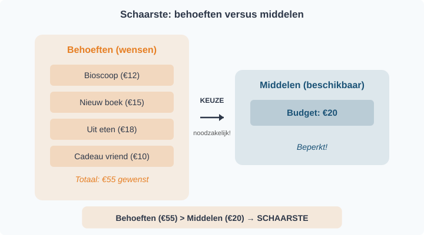
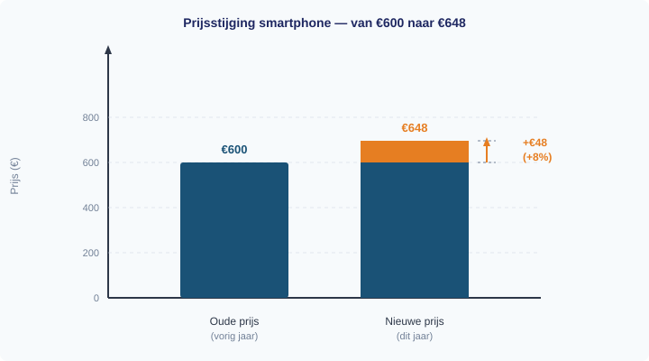
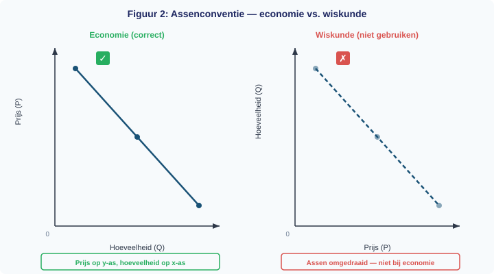
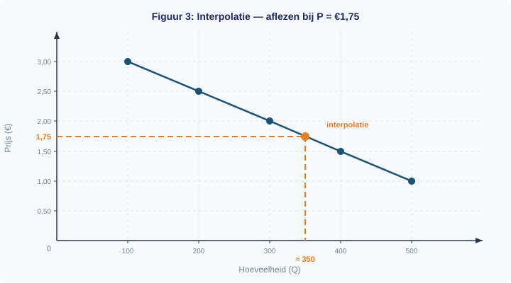
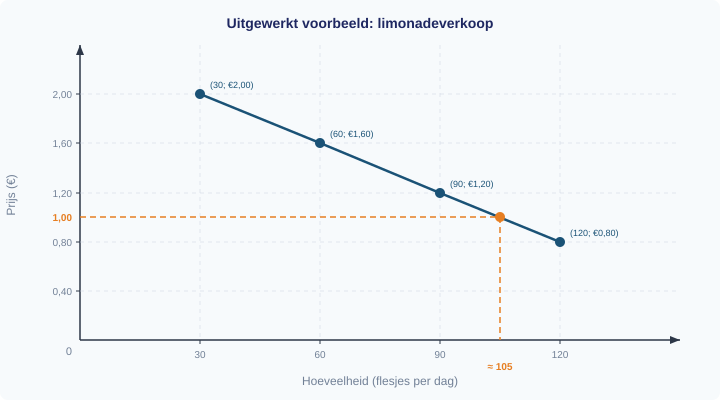
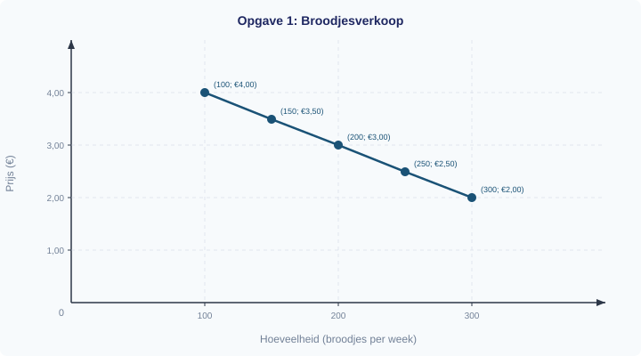
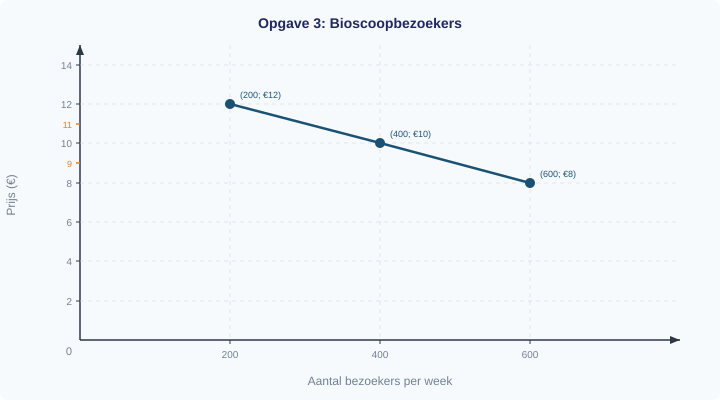

<div class="chapter-front">

<h1>Hoofdstuk 1 — Economisch denken en rekenen</h1>

<h2>Inhoud</h2>

<table>
<thead><tr><th>§</th><th>Onderwerp</th></tr></thead>
<tbody>
<tr><td>1.1.1</td><td>Schaarste en economisch denken</td></tr>
<tr><td>1.1.2</td><td>Percentages en indexcijfers</td></tr>
<tr><td>1.1.3</td><td>Grafieken en tabellen</td></tr>
<tr><td>1.1.4</td><td>Gemengde opgaven</td></tr>
</tbody>
</table>

<h2>Leerdoelen</h2>

<p>Na dit hoofdstuk kun je:</p>

<ul>
<li>Schaarste definiëren als het kernprobleem van de economie</li>
<li>Uitleggen dat elke keuze alternatieve kosten heeft</li>
<li>Alternatieve kosten berekenen in eenvoudige scenario's</li>
<li>Trade-offs herkennen in alledaagse beslissingen</li>
<li>Procentuele veranderingen berekenen met de formule (nieuw − oud) / oud × 100%</li>
<li>Indexcijfers berekenen en interpreteren</li>
<li>Het verschil uitleggen tussen indexpunten en procentuele veranderingen</li>
<li>Waarden aflezen uit grafieken en tabellen</li>
<li>Een grafiek tekenen van tabeldata met de juiste assen</li>
<li>Interpoleren tussen datapunten</li>
<li>Beweringen over data kritisch beoordelen</li>
</ul>

<h2>Waarom kun je niet alles hebben?</h2>

<p>Elke dag maak je keuzes: ga je naar de bioscoop of koop je een nieuw boek? Besteedt de overheid haar budget aan wegen of aan onderwijs? In dit hoofdstuk leer je dat achter elke keuze schaarste schuilgaat — en dat economen precies kunnen uitrekenen wat een keuze je kost. Je leert rekenen met percentages en indexcijfers, en je leert gegevens presenteren in grafieken en tabellen. Deze vaardigheden vormen de basis voor alles wat in de volgende hoofdstukken komt.</p>

</div>


<div style="break-before: page;"></div>

# 1.1.1 Schaarste en economisch denken

## Waarom kun je niet alles hebben?

Stel je voor: het is zaterdag en je hebt €20 gekregen. Je wilt naar de bioscoop (€12), maar je wilt ook een nieuw boek kopen (€15). Helaas kun je niet allebei — je geld is beperkt. Je móét kiezen. Welke optie kies je? En wat kost die keuze je eigenlijk?

Dit dagelijkse probleem raakt de kern van economie. Mensen willen altijd meer dan er beschikbaar is. Tijd, geld, grondstoffen — alles is beperkt. Economen noemen dit **schaarste**, en het is het vertrekpunt van alles wat je in dit vak leert.

---

## Theorie

### Schaarste: het basisprobleem

> **Definitie: Schaarste**
> Er is sprake van schaarste wanneer de behoeften (wensen) van mensen groter zijn dan de beschikbare middelen. Daardoor moeten er keuzes worden gemaakt.

Schaarste betekent niet dat iets zeldzaam is. Water is niet zeldzaam, maar als er maar één flesje over is op een warme dag en drie mensen dorst hebben, is er schaarste. Het gaat om de verhouding: zijn er meer wensen dan middelen?

Schaarste geldt voor iedereen:

| Wie? | Beperkt middel | Keuzeprobleem |
|------|---------------|---------------|
| Scholier | Geld (€20) | Bioscoop óf boek? |
| Boer | Land (10 hectare) | Tarwe óf maïs verbouwen? |
| Overheid | Budget | Meer wegen óf meer onderwijs? |

Figuur 1 laat zien hoe schaarste werkt: behoeften zijn onbegrensd, maar middelen zijn beperkt — daarom moet je kiezen.



---

### Alternatieve kosten: de prijs van je keuze

Elke keuze heeft een keerzijde. Als je kiest voor de bioscoop (€12), dan kun je dat geld niet meer aan het boek besteden. Het boek is wat je opgeeft — dat zijn je **alternatieve kosten**.

> **Definitie: Alternatieve kosten**
> De opbrengst (of waarde) van het beste alternatief dat je opgeeft wanneer je een keuze maakt.

Let op: alternatieve kosten zijn niet hetzelfde als de prijs die je betaalt. Je betaalt €12 voor de bioscoop, maar je alternatieve kosten zijn de waarde van het boek dat je nu niet kunt kopen.

Terug naar de scholier:
- **Gekozen:** bioscoop (waarde voor jou: plezier van de film)
- **Niet gekozen:** boek (waarde: €15 aan leesplezier)
- **Alternatieve kosten:** het leesplezier van het boek

Figuur 2 vergelijkt twee alternatieven en laat zien hoe je de alternatieve kosten bepaalt.


---

### Economisch denken: kiezen bij schaarste

Economie draait om het maken van keuzes bij schaarste. Economen analyseren die keuzes systematisch met de 4-stappenprocedure voor economisch denken:

1. **Benoem alternatieven.** — Welke opties heb je voor het schaarse middel?
2. **Bereken opbrengst per alternatief.** — Wat levert elke optie op?
3. **Rangschik.** — Het beste niet-gekozen alternatief bepaalt de alternatieve kosten.
4. **Bereken nettowaarde.** — Opbrengst gekozen alternatief − alternatieve kosten.

Dit noemen we **economisch denken**: je weegt de voor- en nadelen van elke optie tegen elkaar af. Volgens deze opbrengstmaat is een keuze voordelig als de opbrengst van het gekozen alternatief groter is dan de alternatieve kosten.

Neem de boer uit de openingstabel. Hij heeft 10 hectare land en twee opties:

| Optie | Opbrengst per hectare | Totale opbrengst (10 ha) |
|-------|----------------------|--------------------------|
| Tarwe | €500 | €5.000 |
| Maïs | €350 | €3.500 |

Als hij kiest voor tarwe, zijn zijn alternatieve kosten de totale winst met maïs: €3.500. De nettowaarde van zijn keuze is €5.000 − €3.500 = €1.500.

Dit patroon — alternatieven vergelijken en de kosten van je keuze berekenen — is de kern van economisch denken. Het helpt je om betere beslissingen te nemen, of je nu een scholier bent die €20 uitgeeft of een boer die zijn land indeelt.


---

## Uitgewerkt voorbeeld

> **De boer en zijn land**
>
> Een boer heeft 10 hectare land. Hij kan tarwe verbouwen (winst €500 per hectare) of maïs (winst €350 per hectare). Hij besluit al zijn land voor tarwe te gebruiken.

**Procedure — Alternatieve kosten berekenen:**

| Stap | Vraag | Antwoord |
|------|-------|----------|
| 1 | Welke alternatieven zijn er? | Tarwe of maïs verbouwen |
| 2 | Wat is de opbrengst van elk alternatief? | Tarwe: 10 × €500 = €5.000 · Maïs: 10 × €350 = €3.500 |
| 3 | Rangschik → beste niet-gekozen alternatief = alternatieve kosten | Tarwe is gekozen; maïs is het beste niet-gekozen alternatief. Alternatieve kosten = €3.500 |
| 4 | Bereken nettowaarde | Nettowaarde = €5.000 − €3.500 = €1.500 |


---

## Samenvatting

> **Samenvatting §1.1.1**
> - **Schaarste** ontstaat wanneer behoeften groter zijn dan de beschikbare middelen — daardoor moeten er keuzes worden gemaakt.
> - Elke keuze heeft **alternatieve kosten**: de opbrengst van het beste alternatief dat je opgeeft.
> - **Economisch denken** betekent systematisch alternatieven vergelijken: (1) alternatieven benoemen, (2) opbrengsten berekenen, (3) rangschikken en alternatieve kosten bepalen, (4) nettowaarde berekenen.
> - Alternatieve kosten zijn niet hetzelfde als de prijs die je betaalt — het gaat om wat je *misloopt*.
> - Schaarste geldt voor iedereen: consumenten, producenten en de overheid.

> **💡 Vastgelopen op een opgave?**
> Op de website vind je bij elke opgave een **begeleide inoefening**: stap voor stap krijg je extra hints en tussenstappen. Klik op de opgave om de begeleiding te starten.

---

## Opgaven

### Startoefeningen

**Opgave 1** *(lees het diagram — zie figuur 4)*

In figuur 4 zie je de winst per hectare van drie gewassen die een boer kan verbouwen.


a) Welk gewas levert de hoogste winst per hectare op? Lees dit af uit het diagram.

b) De boer heeft 8 hectare en kiest voor zonnebloemen. Bereken zijn totale winst.

c) Wat zijn de alternatieve kosten en nettowaarde van zijn keuze? Gebruik de 4-stappenprocedure uit het uitgewerkt voorbeeld.


**Opgave 2** *(herken schaarste)*

Geef bij elk voorbeeld aan of er sprake is van schaarste. Leg telkens uit waarom wel of niet.

a) Een klas van 30 leerlingen wil computeren, maar er zijn maar 20 computers.

b) In een supermarkt liggen 500 pakken melk en er komen 100 klanten.

c) Een student heeft 4 uur vrije tijd en wil drie dingen doen: studeren (2 uur), sporten (2 uur) en vrienden zien (2 uur).

---

### Verdiepende opgaven

**Opgave 3** *(meerdere alternatieven)*

Eva heeft een vrije middag (4 uur). Ze kan kiezen uit drie activiteiten:

| Activiteit | Waarde voor Eva |
|------------|----------------|
| Bijles geven | €40 verdienen |
| Studeren | Beter cijfer (waarde: €30) |
| Film kijken | Ontspanning (waarde: €15) |

Ze kan maar één activiteit kiezen (elke activiteit duurt 4 uur).

a) Eva kiest voor bijles geven. Wat zijn haar alternatieve kosten? Leg uit waarom je niet alle niet-gekozen alternatieven optelt.

b) Stel dat Eva kiest voor studeren. Wat zijn dan haar alternatieve kosten?

c) Bij welke keuze zijn de alternatieve kosten het hoogst? Leg uit.


**Opgave 4** *(trade-off met verdeling)*

Een boer heeft 10 hectare land. Hij kan tarwe verbouwen (winst €500 per hectare) of maïs (winst €350 per hectare). Hij kiest voor 10 hectare tarwe. Zijn buurvrouw heeft ook 10 hectare. Zij verdeelt haar land: 6 hectare tarwe en 4 hectare maïs.

a) Bereken de totale winst van de boer.

b) Bereken de alternatieve kosten en nettowaarde van de boer.

c) Bereken de totale winst van de buurvrouw.

d) Heeft de buurvrouw een betere keuze gemaakt dan de boer? Leg uit met behulp van het begrip schaarste.

---

### Denkertje *(bonusopgave)*

**Opgave 5**

Soms hoor je mensen zeggen: "De beste dingen in het leven zijn gratis." Denk aan zonlicht, frisse lucht of een wandeling in het park.

a) Leg uit waarom een econoom het niet eens is met deze uitspraak. Gebruik het begrip alternatieve kosten.

b) Geef een voorbeeld van iets dat écht geen alternatieve kosten heeft. Is dat mogelijk? Beredeneer je antwoord.


<div style="break-before: page;"></div>

# 1.1.2 Percentages en indexcijfers

## Hoeveel duurder is het geworden?

Sanne heeft haar oog laten vallen op een nieuwe smartphone. Vorig jaar kostte het model €600. Nu staat hij in de winkel voor €648. "Het is maar €48 meer," zegt ze tegen haar vader. "Dat valt toch mee?" Haar vader reageert: "Dat is 8% duurder! Stel je voor dat mijn salaris ook zo snel steeg…"

Wie heeft er gelijk? Allebei. Maar het verschil in perspectief is precies de reden waarom economen liever met **percentages** werken dan met absolute bedragen. €48 extra op een smartphone van €600 is heel anders dan €48 extra op een brood van €3. Met percentages maak je veranderingen vergelijkbaar — ongeacht het startbedrag.

---

## Theorie

### Procentuele verandering

Als een prijs, loon of productie verandert, willen economen weten: *hoe groot is die verandering ten opzichte van het oorspronkelijke niveau?* Dat druk je uit als een **procentuele verandering**.

> **Definitie: Procentuele verandering**
> De verandering van een waarde uitgedrukt als percentage van de oorspronkelijke (oude) waarde.

De formule is:

> **Formule**
> ```
> Procentuele verandering = (nieuw − oud) / oud × 100%
> ```

Laten we dit stap voor stap toepassen op het voorbeeld van Sanne's smartphone.

> **Procedure: Procentuele verandering berekenen**
>
> 1. Noteer de oude waarde en de nieuwe waarde
> 2. Bereken het verschil: nieuw − oud
> 3. Deel het verschil door de oude waarde en vermenigvuldig met 100%
> 4. Interpreteer het teken: positief = stijging, negatief = daling

**Voorbeeld:** De smartphone steeg van €600 naar €648.

- Stap 1: Oud = €600, Nieuw = €648
- Stap 2: Verschil = 648 − 600 = €48
- Stap 3: 48 / 600 × 100% = **8%**
- Stap 4: Positief → het is een prijsstijging van 8%.

> **Afronden**
> Rond percentages in deze paragraaf af op 1 decimaal, tenzij de opgave iets anders vraagt. Een exact antwoord mag je erbij zetten als dat helpt om je controle te begrijpen.

Figuur 1 laat het verschil zien tussen de oude en de nieuwe prijs. De oranje markering toont de stijging van €48 — dat is 8% van de oude prijs.



> **⚠️ Let op — veelgemaakte fout**
> Deel altijd door de **oude** waarde, niet door de nieuwe. Als een prijs stijgt van €200 naar €250, is de stijging (250 − 200) / **200** × 100% = 25%. Niet: (250 − 200) / 250 × 100% = 20%. Het verschil lijkt klein, maar levert bij examens puntenaftrek op.

---

### Indexcijfers

Soms wil je niet één verandering bekijken, maar een reeks veranderingen door de tijd. Hoeveel duurder is het leven geworden ten opzichte van vijf jaar geleden? Dan gebruiken economen **indexcijfers**.

> **Definitie: Indexcijfer**
> Een verhoudingsgetal dat de waarde in een bepaald jaar uitdrukt ten opzichte van een basisjaar, waarbij het basisjaar de waarde 100 krijgt.

Het idee is simpel: je kiest één jaar als startpunt (het **basisjaar**) en geeft dat de waarde 100. Alle andere jaren druk je uit ten opzichte van dat basisjaar.

> **Formule**
> ```
> Indexcijfer = (waarde in jaar X / waarde in basisjaar) × 100
> ```

> **Procedure: Indexcijfer berekenen**
>
> 1. Kies of controleer het basisjaar: index = 100
> 2. Bepaal de waarde in het doeljaar en de waarde in het basisjaar
> 3. Deel de doeljaarwaarde door de basisjaarwaarde en vermenigvuldig met 100
> 4. Interpreteer het indexcijfer ten opzichte van 100

**Voorbeeld:** Een standaard boodschappenmandje kost in 2021 €120. In 2023 kost het €150. Het basisjaar is 2021.

| Jaar | Prijs mandje | Berekening | Indexcijfer |
|------|-------------|------------|-------------|
| 2021 (basis) | €120 | 120 / 120 × 100 | 100 |
| 2023 | €150 | 150 / 120 × 100 | 125 |

Het indexcijfer 125 in 2023 betekent: de prijs is 25% hoger dan in het basisjaar. De prijzen zijn in twee jaar met 25% gestegen.

Figuur 2 toont hoe indexcijfers door de tijd bewegen. Elk punt geeft de waarde weer ten opzichte van het basisjaar 2021 (= 100).


---

### De valkuil: indexpunten vs. procenten

Dit is de meest gemaakte fout bij indexcijfers — en een favoriet op examens.

Stel: het indexcijfer stijgt van 125 naar 135. Een leerling zegt: "Het indexcijfer is met 10 gestegen, dus de prijzen zijn met 10% gestegen." **Dit klopt niet.**

De 10 punten verschil zijn **indexpunten**, geen procenten. Om de procentuele verandering te berekenen, moet je de indexpunten delen door het **oude** indexcijfer:

> **Formule**
> ```
> Procentuele verandering = (nieuw indexcijfer − oud indexcijfer) / oud indexcijfer × 100%
> ```

Berekening: (135 − 125) / **125** × 100% = 10 / 125 × 100% = **8%**

De prijzen stegen dus met 8%, niet met 10%. Het verschil: 10 is het aantal **indexpunten**, 8% is de **procentuele stijging**. Indexpunten en procenten zijn alleen gelijk als het oude indexcijfer precies 100 is.

> **Procedure: Indexpunten en procentuele verandering onderscheiden**
>
> 1. Noteer het oude indexcijfer en het nieuwe indexcijfer
> 2. Bereken het verschil in indexpunten: nieuw − oud
> 3. Deel het verschil door het oude indexcijfer en vermenigvuldig met 100%
> 4. Benoem indexpunten en procentuele verandering apart


> **⚠️ Let op — veelgemaakte fout**
> Indexpunten ≠ procenten! Een stijging van 10 indexpunten is alleen 10% als het oude indexcijfer precies 100 is. In alle andere gevallen moet je de indexpunten delen door het oude indexcijfer en vermenigvuldigen met 100%.

---

## Uitgewerkt voorbeeld

**Opgave:** De gemiddelde benzineprijs was €1,80 per liter in 2022. In 2023 steeg de prijs naar €1,98. In 2024 daalde de prijs naar €1,89.

**(a)** Bereken de procentuele verandering van de benzineprijs van 2022 naar 2023.

**(b)** Bereken het indexcijfer van de benzineprijs in 2023 en 2024 (basisjaar 2022 = 100).

**(c)** Bereken de procentuele verandering van de benzineprijs van 2023 naar 2024 met behulp van de indexcijfers.

---

**Uitwerking (a):** Procentuele verandering berekenen

| Stap | Uitwerking |
|------|-----------|
| 1. Noteer de oude en nieuwe waarde | Oud = €1,80 · Nieuw = €1,98 |
| 2. Bereken het verschil | 1,98 − 1,80 = €0,18 |
| 3. Deel door oud en × 100% | 0,18 / 1,80 × 100% = **10%** |
| 4. Interpreteer het teken | Positief → prijsstijging van 10% |

---

**Uitwerking (b):** Indexcijfer berekenen

| Stap | Uitwerking |
|------|-----------|
| 1. Bepaal het basisjaar | Basisjaar = 2022, basiswaarde = €1,80 |
| 2. Bepaal de doelwaarden | 2023 = €1,98 · 2024 = €1,89 |
| 3. Deel doelwaarde door basiswaarde en × 100 | 2023: 1,98 / 1,80 × 100 = **110** · 2024: 1,89 / 1,80 × 100 = **105** |
| 4. Interpreteer | 2023 ligt 10% boven 2022; 2024 ligt 5% boven 2022 |

---

**Uitwerking (c):** Procentuele verandering via indexcijfers

| Stap | Uitwerking |
|------|-----------|
| 1. Noteer de indexcijfers | Oud (2023) = 110 · Nieuw (2024) = 105 |
| 2. Bereken het verschil in indexpunten | 105 − 110 = −5 indexpunten |
| 3. Deel door het oude indexcijfer en × 100% | −5 / 110 × 100% = **−4,5%** |
| 4. Benoem beide eenheden | −5 indexpunten; prijsdaling van 4,5% |

Let op: het verschil is 5 indexpunten, maar de procentuele verandering is −4,5%. Indexpunten ≠ procenten!


---

> **Samenvatting §1.1.2**
> - De procentuele verandering bereken je met: (nieuw − oud) / oud × 100%
> - Een indexcijfer drukt een waarde uit ten opzichte van een basisjaar (= 100)
> - Indexcijfer = (waarde / basiswaarde) × 100
> - **Indexpunten ≠ procenten** — deel de indexpunten altijd door het oude indexcijfer
> - In de volgende paragraaf (§1.1.3) leer je gegevens in grafieken en tabellen te verwerken — inclusief procentuele veranderingen.

---

> **Vastgelopen op een opgave?**
> Op de website vind je bij elke opgave een uitlegvideo en extra voorbeelden. Kijk eerst naar het uitgewerkt voorbeeld hierboven en probeer de procedure stap voor stap te volgen.


<div style="break-before: page;"></div>

# 1.1.3 Grafieken en tabellen

## Hoeveel ijsjes verkoop je bij welke prijs?

Het is zomer en je runt een ijskraam op het strand. Je wilt weten: als ik de prijs van een ijsje verlaag, verkoop ik er dan genoeg extra om meer omzet te maken? Je hebt de afgelopen weken bijgehouden hoeveel ijsjes je bij verschillende prijzen verkocht:

| Prijs (€) | Aantal verkocht |
|-----------|----------------|
| 1,00      | 500            |
| 1,50      | 400            |
| 2,00      | 300            |
| 2,50      | 200            |
| 3,00      | 100            |

De tabel bevat nuttige informatie, maar je ziet het verband niet in één oogopslag. Een grafiek maakt het patroon direct zichtbaar. In deze paragraaf leer je hoe je tabellen leest, er grafieken van tekent, waarden afleest — en hoe je beweringen over data kritisch beoordeelt.

---

## Theorie

### Een tabel lezen

Een tabel ordent gegevens in rijen en kolommen. De bovenste rij bevat de **kolomkoppen**: die vertellen je welke variabele in elke kolom staat. Elke rij daaronder is één **waarneming**.

Lees een tabel altijd systematisch:
1. **Wat staat er in de kolommen?** Welke variabelen zijn er?
2. **Wat is de eenheid?** Euro's, stuks, procenten?
3. **Welke richting?** Stijgt de ene variabele als de andere stijgt, of daalt hij?

Kijk terug naar de ijsjestabel hierboven. In de linkerkolom staat de prijs in euro's. In de rechterkolom staat het aantal verkochte ijsjes. Als de prijs stijgt van €1,00 naar €3,00, daalt het aantal van 500 naar 100. Er is dus een *negatief verband*: hogere prijs, lagere verkoop.

---

### Van tabel naar grafiek

Een grafiek maakt dat verband zichtbaar. Om een grafiek te tekenen, volg je een vaste procedure:

> **Procedure: Grafiek tekenen van tabeldata**
> 1. Lees de tabel: welke variabele is onafhankelijk, welke afhankelijk?
> 2. Zet de onafhankelijke variabele op de x-as, de afhankelijke op de y-as (economie-conventie: prijs op y-as)
> 3. Kies een geschikte schaalverdeling
> 4. Zet de punten uit
> 5. Verbind de punten (recht of vloeiend, afhankelijk van context)

Bij de ijsjestabel is de prijs de onafhankelijke variabele en het aantal verkochte ijsjes de afhankelijke variabele. In de economie geldt een belangrijke conventie:

> **Definitie: Assenconventie in de economie**
> In economische grafieken staat de prijs (P) altijd op de **verticale as** (y-as) en de hoeveelheid (Q) op de **horizontale as** (x-as). Dit is anders dan in de wiskunde, waar de onafhankelijke variabele standaard op de x-as staat.

We passen de procedure toe op de ijsjestabel:

**Stap 1:** De prijs is de onafhankelijke variabele, het aantal ijsjes de afhankelijke.

**Stap 2:** Volgens de economie-conventie zetten we de prijs op de y-as en de hoeveelheid op de x-as.

**Stap 3:** De prijs loopt van €1,00 tot €3,00 — we kiezen een schaal van €0,50 per lijn. De hoeveelheid loopt van 100 tot 500 — we kiezen een schaal van 100 per lijn.

**Stap 4 en 5:** We zetten de vijf punten uit en verbinden ze met rechte lijnen.


In figuur 1 zie je het negatieve verband: de lijn loopt van linksboven naar rechtsonder. Hoe lager de prijs, hoe meer ijsjes er verkocht worden.

> **⚠️ Let op — veelgemaakte fout**
> Veel leerlingen zetten de prijs op de horizontale as en de hoeveelheid op de verticale as. Dat is wiskundig niet fout, maar in de economie doen we het andersom. Figuur 2 laat het verschil zien.



Onthoud: in dit vak staat de prijs altijd op de y-as. Als je een grafiek tekent of afleest, controleer dan eerst welke variabele op welke as staat.

---

### Waarden aflezen en interpoleren

Je kunt een grafiek ook *andersom* gebruiken: niet om punten te tekenen, maar om waarden af te lezen. Stel dat je wilt weten hoeveel ijsjes je verkoopt bij een prijs van €1,75. Die prijs staat niet in de tabel, maar je kunt hem aflezen uit de grafiek.

> **Procedure: Waarden aflezen uit een grafiek**
> 1. Zoek de gegeven waarde op de juiste as
> 2. Trek een lijn naar de grafiek
> 3. Lees de bijbehorende waarde af op de andere as
> 4. Bij interpolatie: schat de waarde tussen twee bekende punten

We passen dit toe:

**Stap 1:** Zoek €1,75 op de y-as (de prijsas).

**Stap 2:** Trek een horizontale stippellijn naar rechts tot je de lijn raakt.

**Stap 3:** Trek vanaf dat punt een verticale stippellijn omlaag naar de x-as.

**Stap 4:** Je leest af: bij €1,75 worden er ongeveer 350 ijsjes verkocht.



Dit heet **interpoleren**: je schat een waarde die *tussen* twee bekende datapunten in ligt. €1,75 ligt precies tussen €1,50 en €2,00. De bijbehorende hoeveelheid (350) ligt precies tussen 400 en 300. Dat klopt, want de lijn loopt hier recht.

De tabel, de grafiek en het berekende getal vertellen hetzelfde verhaal — alleen in een andere vorm:

| Prijs (€) | Hoeveelheid (uit tabel) | Hoeveelheid (uit grafiek) |
|-----------|------------------------|--------------------------|
| 1,50      | 400                    | 400                      |
| 1,75      | —                      | ≈ 350 (interpolatie)     |
| 2,00      | 300                    | 300                      |

---

### Kritisch kijken naar data

Grafieken en tabellen zijn krachtige hulpmiddelen, maar je moet er kritisch naar kijken. Een krantenkop kan beweren: "IJsjesverkoop daalt met 50%!" Klopt dat?

Kijk terug naar de tabel. De verkoop daalt van 500 naar 100 over het hele prijsbereik — dat is een daling van 80%. Maar tussen €1,00 en €2,00 daalt de verkoop van 500 naar 300, en dat is een daling van 40%.

> **📋 Herhaling uit §1.1.2**
> De procentuele verandering bereken je met: (nieuw − oud) / oud × 100%.

Wanneer klopt "50%" dan wél? Tussen €2,00 en €3,00 daalt de verkoop van 300 naar 100. Dat is: (100 − 300) / 300 × 100% = −66,7%. Dat is dus ook geen 50%.

Tussen €1,00 en €1,50 daalt de verkoop van 500 naar 400: (400 − 500) / 500 × 100% = −20%. Dat is ook geen 50%.

Tussen welke twee prijzen is er dan wél een daling van 50%? Tussen €1,50 en €2,50: de verkoop gaat van 400 naar 200. Dat is: (200 − 400) / 400 × 100% = −50%. De bewering "50% daling" klopt dus alleen als je precies die twee prijzen vergelijkt.

**Les:** bij elke bewering over procenten moet je altijd vragen: vergeleken met *wat*?

---

## Uitgewerkt voorbeeld

**Opgave:** Een winkelier houdt bij hoeveel flesjes limonade hij per dag verkoopt bij verschillende prijzen:

| Prijs (€) | Verkocht per dag |
|-----------|-----------------|
| 0,80      | 120              |
| 1,20      | 90               |
| 1,60      | 60               |
| 2,00      | 30               |

**(a)** Teken een grafiek met de prijs op de verticale as en de hoeveelheid op de horizontale as.
**(b)** Lees uit je grafiek af: hoeveel flesjes verkoopt de winkelier bij een prijs van €1,00?
**(c)** Bereken de procentuele verandering in de verkoop als de prijs stijgt van €0,80 naar €1,60.

---

**Uitwerking:**

**(a)** We volgen de procedure *Grafiek tekenen van tabeldata*:

| Stap | Actie |
|------|-------|
| 1. Variabelen bepalen | Prijs = onafhankelijk, verkoop = afhankelijk |
| 2. Assen kiezen | Prijs op y-as, hoeveelheid op x-as (economie-conventie) |
| 3. Schaalverdeling | y-as: €0,40 per lijn (van €0,00 tot €2,40). x-as: 30 per lijn (van 0 tot 150) |
| 4. Punten uitzetten | (120; 0,80), (90; 1,20), (60; 1,60), (30; 2,00) |
| 5. Verbinden | Rechte lijnen tussen de punten |



**(b)** We volgen de procedure *Waarden aflezen uit een grafiek*:

| Stap | Actie |
|------|-------|
| 1. Gegeven waarde opzoeken | €1,00 op de y-as |
| 2. Lijn naar de grafiek | Horizontale stippellijn naar rechts tot de lijn |
| 3. Aflezen op andere as | Verticale stippellijn omlaag naar de x-as |
| 4. Interpolatie | €1,00 ligt tussen €0,80 en €1,20. Aflezen: ≈ 105 flesjes |

**(c)** De verkoop daalt van 120 naar 60 flesjes.

Procentuele verandering = (nieuw − oud) / oud × 100% = (60 − 120) / 120 × 100% = **−50%**

De verkoop daalt met 50%.

---

> **Samenvatting §1.1.3**
> - Een **tabel** ordent gegevens in rijen en kolommen. Lees altijd eerst de kolomkoppen en eenheden.
> - In de economie staat de **prijs op de y-as** en de **hoeveelheid op de x-as** (assenconventie).
> - Met **interpolatie** schat je een waarde tussen twee bekende datapunten.
> - Controleer beweringen over data altijd kritisch: *vergeleken met wat?*
> - In de volgende paragraaf (§1.1.4) combineer je deze grafiekvaardigheden met percentages en economisch denken.

---

*Vastgelopen op een opgave? Kijk op de website bij dit hoofdstuk voor extra uitleg en tips.*

---

## Opgaven

### Startoefeningen

**Opgave 1**

Bekijk de grafiek hieronder. Deze toont het verband tussen de prijs van een broodje en het aantal verkochte broodjes per week.



**(a)** Hoeveel broodjes worden er verkocht bij een prijs van €3,00?
**(b)** Bij welke prijs worden er 150 broodjes verkocht?
**(c)** Beschrijf het verband tussen prijs en hoeveelheid in één zin.


**Opgave 2**

Een marktkraam verkoopt koffie. De eigenaar heeft de volgende gegevens:

| Prijs per beker (€) | Verkocht per dag |
|---------------------|-----------------|
| 1,00                | 200              |
| 1,50                | 160              |
| 2,00                | 120              |
| 2,50                | 80               |
| 3,00                | 40               |

**(a)** Teken een grafiek met de prijs op de verticale as en het aantal bekers op de horizontale as. Kies een geschikte schaalverdeling.
**(b)** Welk verband zie je? Leg uit.

---

### Verdiepende opgaven

**Opgave 3**

Bekijk de grafiek hieronder. Deze toont het verband tussen de prijs van een bioscoopkaartje en het aantal bezoekers per week.



**(a)** Lees uit de grafiek af: hoeveel bezoekers komen er bij een prijs van €9,00?
**(b)** Lees uit de grafiek af: hoeveel bezoekers komen er bij een prijs van €11,00? Gebruik interpolatie.
**(c)** Bereken de procentuele verandering in het aantal bezoekers als de prijs stijgt van €8,00 naar €12,00.


**Opgave 4**

Een supermarkt verkoopt flesjes water. In januari kostten ze €0,80 en werden er 500 per week verkocht. In juni is de prijs gestegen naar €1,20 en worden er 350 per week verkocht.

**(a)** Teken een grafiek met deze twee punten. Zet de prijs op de y-as.
**(b)** Trek een rechte lijn tussen de twee punten. Lees af: hoeveel flesjes worden er verkocht bij €1,00?
**(c)** Bereken het indexcijfer van de verkoop in juni (januari = 100).
**(d)** Een journalist schrijft: "De waterverkoop is met een derde gedaald." Klopt dit? Laat je berekening zien.

---

### Denkertje

**Opgave 5**

Twee leerlingen maken een grafiek van dezelfde gegevens. Leerling A begint de y-as bij €0,00. Leerling B begint de y-as bij €4,50 (net onder de laagste waarde).

**(a)** Schets hoe beide grafieken er ongeveer uitzien.
**(b)** Bij welke grafiek lijkt de daling *groter* dan hij werkelijk is? Leg uit.
**(c)** Noem een voorbeeld uit het nieuws of de reclame waar een grafiek misleidend kan zijn door de keuze van de asschaal.


<div style="break-before: page;"></div>

# Gemengde opgaven §1.1.4 — Economisch denken en rekenen

---

## Opgave 1: Bakkerij "Knapperig"

Bakkerij "Knapperig" wil investeren in nieuwe apparatuur. De eigenaar, meneer Vermeer, heeft €20.000 beschikbaar en overweegt drie opties: een nieuwe steenoven, een professioneel deegkneedmachine of een vitrine met koeling. Hij kan maar in één apparaat investeren. Tabel 1 toont de verwachte jaaromzet en jaarkosten per investering. De huidige omzet van de bakkerij bedraagt €85.000 per jaar.

**Tabel 1: Verwachte resultaten per investering**

| Investering | Investeringsbedrag (€) | Verwachte jaaromzet (€) | Verwachte jaarkosten (€) |
|---|---|---|---|
| Steenoven | 18.000 | 110.000 | 72.000 |
| Deegkneedmachine | 15.000 | 100.000 | 62.000 |
| Vitrine met koeling | 12.000 | 95.000 | 60.000 |

---

**1** *(2p)* Bereken de verwachte jaarwinst voor elke investering. Gebruik de tabel en de formule: winst = omzet − kosten.

**2** *(2p)* Meneer Vermeer kiest voor de steenoven. Bereken zijn alternatieve kosten. Gebruik de procedure: (1) alternatieven identificeren, (2) opbrengst per alternatief, (3) alternatieve kosten = opbrengst beste niet-gekozen alternatief.

**3** *(2p)* De huidige jaaromzet van de bakkerij is €85.000. Na aanschaf van de steenoven stijgt de omzet naar €110.000. Bereken de procentuele omzetstijging.

**4** *(2p)* Bereken het indexcijfer van de omzet na aanschaf van de steenoven, met de huidige omzet als basiswaarde (index = 100).

**5** *(2p)* Een collega-bakker zegt: "De omzet stijgt met 29 indexpunten, dus de omzet stijgt met 29%." Beoordeel of deze uitspraak klopt. Laat je berekening zien.

---

## Opgave 2: Prijsontwikkeling groente en fruit

Het Centraal Bureau voor de Statistiek (CBS) houdt de gemiddelde prijs per kilo groente en fruit bij. Figuur 1 toont de prijsontwikkeling van 2020 tot en met 2025. In 2020 kostte een kilo groente gemiddeld €2,00 en een kilo fruit €1,80.


Een supermarktketen publiceert de volgende indexcijfers voor groente (basisjaar 2020 = 100):

**Tabel 2: Indexcijfers groenteprijzen (2020 = 100)**

| Jaar | 2020 | 2021 | 2022 | 2023 | 2024 | 2025 |
|---|---|---|---|---|---|---|
| Indexcijfer | 100 | 105 | 120 | 135 | 125 | 140 |

---

**6** *(1p)* Lees in figuur 1 af: wat was de gemiddelde prijs van een kilo fruit in 2023?

**7** *(2p)* Bereken met behulp van tabel 2 de procentuele prijsstijging van groente van 2022 naar 2023.

**8** *(2p)* Een journalist schrijft: "De groenteprijs steeg van 2022 naar 2023 met 15 procent." Beoordeel deze bewering. Gebruik de indexcijfers uit tabel 2 en laat je berekening zien.

**9** *(2p)* Bereken met behulp van figuur 1 de procentuele prijsverandering van fruit van 2023 naar 2024. Beschrijf wat deze uitkomst economisch betekent.

**10** *(3p)* Lees de grafiek nauwkeurig. In welk jaar was het prijsverschil tussen groente en fruit het grootst? Lees de prijzen af en bereken het verschil.

---

## Opgave 3: Schoolkantine in actie

De leerlingenraad van een middelbare school moet kiezen hoe ze het kantinebudget van €5.000 besteden. Er zijn twee opties: een smoothie-machine aanschaffen of het saladebuffet uitbreiden. De leerlingenraad kan maar één optie kiezen vanwege het beperkte budget.

De schoolkantine heeft de afgelopen jaren de prijzen van broodjes bijgehouden:

**Tabel 3: Gemiddelde broodjesprijs in de kantine**

| Schooljaar | 2021/22 | 2022/23 | 2023/24 | 2024/25 |
|---|---|---|---|---|
| Prijs (€) | 2,00 | 2,20 | 2,50 | 2,60 |

De leerlingenraad schat de opbrengsten als volgt in. De smoothie-machine levert naar verwachting €3.500 op aan extra kantineomzet per jaar (door de verkoop van smoothies). De uitbreiding van het saladebuffet levert naar verwachting €2.800 op aan extra omzet per jaar (door meer saladevariatie). Daarnaast zijn er niet-financiële voordelen: de smoothie-machine trekt meer leerlingen naar de kantine, terwijl het saladebuffet bijdraagt aan gezonder eetgedrag.

De leerlingenraad kiest voor de smoothie-machine.

---

**11** *(2p)* Leg uit waarom er sprake is van schaarste in deze situatie. Gebruik de economische definitie van schaarste.

**12** *(2p)* Bereken de alternatieve kosten van de keuze voor de smoothie-machine. Benoem de financiële en niet-financiële aspecten.

**13** *(2p)* Bereken het indexcijfer van de broodjesprijs in schooljaar 2024/25 (basisjaar 2021/22 = 100).

**14** *(2p)* Bereken de procentuele prijsstijging van broodjes van schooljaar 2022/23 naar schooljaar 2024/25.

**Denkertje** *(2p)* De rector van de school zegt: "De broodjesprijs is van 2021 naar 2025 met 30 indexpunten gestegen. Dat is een stijging van 30%." Beoordeel of de rector gelijk heeft. Laat je berekening zien en leg uit waarom indexpunten en procenten vaak worden verward.