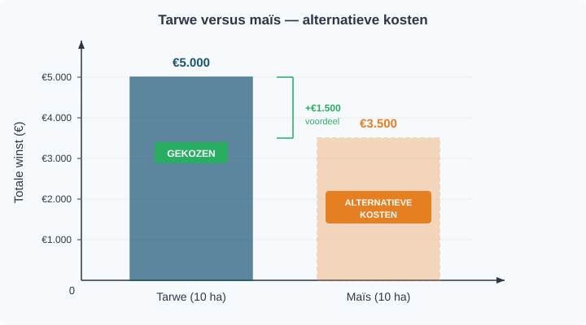
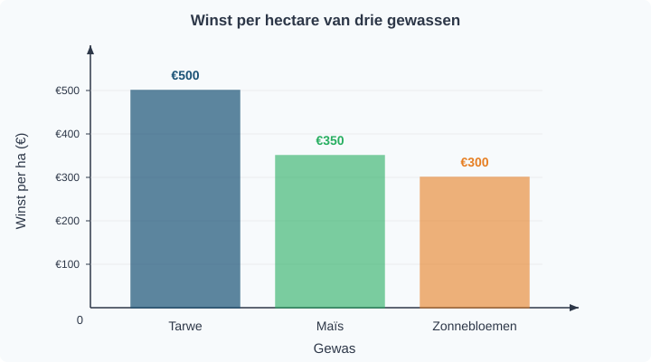

# 1.1.1 Schaarste en economisch denken — opgaven

## Uitgewerkt voorbeeld

> **De boer en zijn land**
>
> Een boer heeft 10 hectare land. Hij kan tarwe verbouwen (winst €500 per hectare) of maïs (winst €350 per hectare). Hij besluit al zijn land voor tarwe te gebruiken.

**Procedure — Alternatieve kosten berekenen:**

| Stap | Vraag | Antwoord |
|------|-------|----------|
| 1 | Welke alternatieven zijn er? | Tarwe of maïs verbouwen |
| 2 | Wat is de opbrengst van elk alternatief? | Tarwe: 10 × €500 = €5.000 · Maïs: 10 × €350 = €3.500 |
| 3 | Je kiest tarwe → alternatieve kosten = opbrengst van het beste niet-gekozen alternatief | Alternatieve kosten = €3.500 (de maïsopbrengst die hij misloopt) |

---

## Opgaven

### Startoefeningen

**Opgave 1** *(lees het diagram — zie figuur 1)*

In figuur 1 zie je de winst per hectare van drie gewassen die een boer kan verbouwen.

a) Welk gewas levert de hoogste winst per hectare op? Lees dit af uit het diagram.

b) De boer heeft 8 hectare en kiest voor zonnebloemen. Bereken zijn totale winst.

c) Wat zijn de alternatieve kosten van zijn keuze? Gebruik de procedure uit het uitgewerkt voorbeeld.

**Opgave 2** *(herken schaarste)*

Geef bij elk voorbeeld aan of er sprake is van schaarste. Leg telkens uit waarom wel of niet.

a) Een klas van 30 leerlingen wil computeren, maar er zijn maar 20 computers.

b) In een supermarkt liggen 500 pakken melk en er komen 100 klanten.

c) Een student heeft 4 uur vrije tijd en wil drie dingen doen: studeren (2 uur), sporten (2 uur) en vrienden zien (2 uur).

---

### Verdiepende opgaven

**Opgave 3** *(meerdere alternatieven)*

Eva heeft een vrije middag (4 uur). Ze kan kiezen uit drie activiteiten:

| Activiteit | Waarde voor Eva |
|------------|----------------|
| Bijles geven | €40 verdienen |
| Studeren | Beter cijfer (waarde: €30) |
| Film kijken | Ontspanning (waarde: €15) |

Ze kan maar één activiteit kiezen (elke activiteit duurt 4 uur).

a) Eva kiest voor bijles geven. Wat zijn haar alternatieve kosten? Leg uit waarom je niet alle niet-gekozen alternatieven optelt.

b) Stel dat Eva kiest voor studeren. Wat zijn dan haar alternatieve kosten?

c) Bij welke keuze zijn de alternatieve kosten het hoogst? Leg uit.

**Opgave 4** *(trade-off met verdeling)*

Een boer heeft 10 hectare land. Hij kan tarwe verbouwen (winst €500 per hectare) of maïs (winst €350 per hectare). Zijn buurvrouw heeft ook 10 hectare. Zij verdeelt haar land: 6 hectare tarwe en 4 hectare maïs.

a) Bereken de totale winst van de boer.

b) Bereken de alternatieve kosten van de boer.

c) Bereken de totale winst van de buurvrouw.

d) Heeft de buurvrouw een betere keuze gemaakt dan de boer? Leg uit met behulp van het begrip schaarste.

---

### Denkertje *(bonusopgave)*

**Opgave 5**

Soms hoor je mensen zeggen: "De beste dingen in het leven zijn gratis." Denk aan zonlicht, frisse lucht of een wandeling in het park.

a) Leg uit waarom een econoom het niet eens is met deze uitspraak. Gebruik het begrip alternatieve kosten.

b) Geef een voorbeeld van iets dat écht geen alternatieve kosten heeft. Is dat mogelijk? Beredeneer je antwoord.
