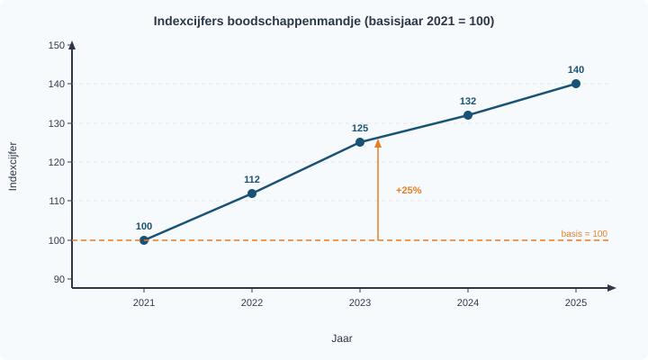

# 1.1.2 Percentages en indexcijfers

## Hoeveel duurder is het geworden?

Sanne heeft haar oog laten vallen op een nieuwe smartphone. Vorig jaar kostte het model €600. Nu staat hij in de winkel voor €648. "Het is maar €48 meer," zegt ze tegen haar vader. "Dat valt toch mee?" Haar vader reageert: "Dat is 8% duurder! Stel je voor dat mijn salaris ook zo snel steeg…"

Wie heeft er gelijk? Allebei. Maar het verschil in perspectief is precies de reden waarom economen liever met **percentages** werken dan met absolute bedragen. €48 extra op een smartphone van €600 is heel anders dan €48 extra op een brood van €3. Met percentages maak je veranderingen vergelijkbaar — ongeacht het startbedrag.

---

## Theorie

### Procentuele verandering

Als een prijs, loon of productie verandert, willen economen weten: *hoe groot is die verandering ten opzichte van het oorspronkelijke niveau?* Dat druk je uit als een **procentuele verandering**.

> **Definitie: Procentuele verandering**
> De verandering van een waarde uitgedrukt als percentage van de oorspronkelijke (oude) waarde.

De formule is:

> **Formule**
> ```
> Procentuele verandering = (nieuw − oud) / oud × 100%
> ```

Laten we dit stap voor stap toepassen op het voorbeeld van Sanne's smartphone.

> **Procedure: Procentuele verandering berekenen**
>
> 1. Noteer de oude waarde en de nieuwe waarde
> 2. Bereken het verschil: nieuw − oud
> 3. Deel het verschil door de oude waarde en vermenigvuldig met 100%
> 4. Interpreteer het teken: positief = stijging, negatief = daling

**Voorbeeld:** De smartphone steeg van €600 naar €648.

- Stap 1: Oud = €600, Nieuw = €648
- Stap 2: Verschil = 648 − 600 = €48
- Stap 3: 48 / 600 × 100% = **8%**
- Stap 4: Positief → het is een prijsstijging van 8%.

> **Afronden**
> Rond percentages in deze paragraaf af op 1 decimaal, tenzij de opgave iets anders vraagt. Een exact antwoord mag je erbij zetten als dat helpt om je controle te begrijpen.

Figuur 1 laat het verschil zien tussen de oude en de nieuwe prijs. De oranje markering toont de stijging van €48 — dat is 8% van de oude prijs.


> **⚠️ Let op — veelgemaakte fout**
> Deel altijd door de **oude** waarde, niet door de nieuwe. Als een prijs stijgt van €200 naar €250, is de stijging (250 − 200) / **200** × 100% = 25%. Niet: (250 − 200) / 250 × 100% = 20%. Het verschil lijkt klein, maar levert bij examens puntenaftrek op.

---

### Indexcijfers

Soms wil je niet één verandering bekijken, maar een reeks veranderingen door de tijd. Hoeveel duurder is het leven geworden ten opzichte van vijf jaar geleden? Dan gebruiken economen **indexcijfers**.

> **Definitie: Indexcijfer**
> Een verhoudingsgetal dat de waarde in een bepaald jaar uitdrukt ten opzichte van een basisjaar, waarbij het basisjaar de waarde 100 krijgt.

Het idee is simpel: je kiest één jaar als startpunt (het **basisjaar**) en geeft dat de waarde 100. Alle andere jaren druk je uit ten opzichte van dat basisjaar.

> **Formule**
> ```
> Indexcijfer = (waarde in jaar X / waarde in basisjaar) × 100
> ```

> **Procedure: Indexcijfer berekenen**
>
> 1. Kies of controleer het basisjaar: index = 100
> 2. Bepaal de waarde in het doeljaar en de waarde in het basisjaar
> 3. Deel de doeljaarwaarde door de basisjaarwaarde en vermenigvuldig met 100
> 4. Interpreteer het indexcijfer ten opzichte van 100

**Voorbeeld:** Een standaard boodschappenmandje kost in 2021 €120. In 2023 kost het €150. Het basisjaar is 2021.

| Jaar | Prijs mandje | Berekening | Indexcijfer |
|------|-------------|------------|-------------|
| 2021 (basis) | €120 | 120 / 120 × 100 | 100 |
| 2023 | €150 | 150 / 120 × 100 | 125 |

Het indexcijfer 125 in 2023 betekent: de prijs is 25% hoger dan in het basisjaar. De prijzen zijn in twee jaar met 25% gestegen.

Figuur 2 toont hoe indexcijfers door de tijd bewegen. Elk punt geeft de waarde weer ten opzichte van het basisjaar 2021 (= 100).



---

### De valkuil: indexpunten vs. procenten

Dit is de meest gemaakte fout bij indexcijfers — en een favoriet op examens.

Stel: het indexcijfer stijgt van 125 naar 135. Een leerling zegt: "Het indexcijfer is met 10 gestegen, dus de prijzen zijn met 10% gestegen." **Dit klopt niet.**

De 10 punten verschil zijn **indexpunten**, geen procenten. Om de procentuele verandering te berekenen, moet je de indexpunten delen door het **oude** indexcijfer:

> **Formule**
> ```
> Procentuele verandering = (nieuw indexcijfer − oud indexcijfer) / oud indexcijfer × 100%
> ```

Berekening: (135 − 125) / **125** × 100% = 10 / 125 × 100% = **8%**

De prijzen stegen dus met 8%, niet met 10%. Het verschil: 10 is het aantal **indexpunten**, 8% is de **procentuele stijging**. Indexpunten en procenten zijn alleen gelijk als het oude indexcijfer precies 100 is.

> **Procedure: Indexpunten en procentuele verandering onderscheiden**
>
> 1. Noteer het oude indexcijfer en het nieuwe indexcijfer
> 2. Bereken het verschil in indexpunten: nieuw − oud
> 3. Deel het verschil door het oude indexcijfer en vermenigvuldig met 100%
> 4. Benoem indexpunten en procentuele verandering apart


> **⚠️ Let op — veelgemaakte fout**
> Indexpunten ≠ procenten! Een stijging van 10 indexpunten is alleen 10% als het oude indexcijfer precies 100 is. In alle andere gevallen moet je de indexpunten delen door het oude indexcijfer en vermenigvuldigen met 100%.

---

## Uitgewerkt voorbeeld

**Opgave:** De gemiddelde benzineprijs was €1,80 per liter in 2022. In 2023 steeg de prijs naar €1,98. In 2024 daalde de prijs naar €1,89.

**(a)** Bereken de procentuele verandering van de benzineprijs van 2022 naar 2023.

**(b)** Bereken het indexcijfer van de benzineprijs in 2023 en 2024 (basisjaar 2022 = 100).

**(c)** Bereken de procentuele verandering van de benzineprijs van 2023 naar 2024 met behulp van de indexcijfers.

---

**Uitwerking (a):** Procentuele verandering berekenen

| Stap | Uitwerking |
|------|-----------|
| 1. Noteer de oude en nieuwe waarde | Oud = €1,80 · Nieuw = €1,98 |
| 2. Bereken het verschil | 1,98 − 1,80 = €0,18 |
| 3. Deel door oud en × 100% | 0,18 / 1,80 × 100% = **10%** |
| 4. Interpreteer het teken | Positief → prijsstijging van 10% |

---

**Uitwerking (b):** Indexcijfer berekenen

| Stap | Uitwerking |
|------|-----------|
| 1. Bepaal het basisjaar | Basisjaar = 2022, basiswaarde = €1,80 |
| 2. Bepaal de doelwaarden | 2023 = €1,98 · 2024 = €1,89 |
| 3. Deel doelwaarde door basiswaarde en × 100 | 2023: 1,98 / 1,80 × 100 = **110** · 2024: 1,89 / 1,80 × 100 = **105** |
| 4. Interpreteer | 2023 ligt 10% boven 2022; 2024 ligt 5% boven 2022 |

---

**Uitwerking (c):** Procentuele verandering via indexcijfers

| Stap | Uitwerking |
|------|-----------|
| 1. Noteer de indexcijfers | Oud (2023) = 110 · Nieuw (2024) = 105 |
| 2. Bereken het verschil in indexpunten | 105 − 110 = −5 indexpunten |
| 3. Deel door het oude indexcijfer en × 100% | −5 / 110 × 100% = **−4,5%** |
| 4. Benoem beide eenheden | −5 indexpunten; prijsdaling van 4,5% |

Let op: het verschil is 5 indexpunten, maar de procentuele verandering is −4,5%. Indexpunten ≠ procenten!


---

> **Samenvatting §1.1.2**
> - De procentuele verandering bereken je met: (nieuw − oud) / oud × 100%
> - Een indexcijfer drukt een waarde uit ten opzichte van een basisjaar (= 100)
> - Indexcijfer = (waarde / basiswaarde) × 100
> - **Indexpunten ≠ procenten** — deel de indexpunten altijd door het oude indexcijfer
> - In de volgende paragraaf (§1.1.3) leer je gegevens in grafieken en tabellen te verwerken — inclusief procentuele veranderingen.

---

> **Vastgelopen op een opgave?**
> Op de website vind je bij elke opgave een uitlegvideo en extra voorbeelden. Kijk eerst naar het uitgewerkt voorbeeld hierboven en probeer de procedure stap voor stap te volgen.

## Opgaven

### Startoefeningen

**Opgave 1**

De prijs van een fiets stijgt van €800 naar €920.

**(a)** Bereken de procentuele prijsstijging.

**(b)** Stel dat de prijs daarna daalt van €920 naar €800. Bereken de procentuele prijsdaling. Leg uit waarom dit percentage anders is dan je antwoord bij (a).


**Opgave 2**

In 2023 kost een standaard boodschappenmandje €150. In 2024 kost hetzelfde mandje €156. In 2025 kost het €162. Het basisjaar is 2023 (index = 100).

**(a)** Bereken het indexcijfer voor 2024.

**(b)** Bereken het indexcijfer voor 2025.

**(c)** Bereken de procentuele prijsstijging van 2024 naar 2025 met behulp van de indexcijfers.

---

### Zelfstandige oefening

**Opgave 3**

Een werknemer verdient in 2022 een bruto maandloon van €3.000. In 2024 is zijn loon gestegen naar €3.240.

**(a)** Bereken de procentuele loonstijging van 2022 naar 2024.

**(b)** Het prijsindexcijfer (basisjaar 2022 = 100) is in 2024 gelijk aan 112. Bereken hoeveel het loon in 2024 had moeten zijn om dezelfde koopkracht te behouden als in 2022.

**(c)** Beoordeel: is de koopkracht van de werknemer gestegen of gedaald? Licht je antwoord toe met een berekening.


**Opgave 4**

Het CBS publiceert de volgende indexcijfers voor de consumentenprijzen (basisjaar 2020 = 100):

| Jaar | Indexcijfer |
|------|-------------|
| 2023 | 108 |
| 2024 | 112 |
| 2025 | 115 |
| 2026 | 112 |

**(a)** Bereken de procentuele prijsstijging van 2023 naar 2024.

**(b)** Een leerling beweert: "Het indexcijfer ging van 108 naar 112, dus de inflatie is 4%." Leg uit waarom dit niet klopt en bereken het juiste inflatiepercentage.

**(c)** Bereken de procentuele prijsverandering van 2025 naar 2026. Geef aan wat dit economisch betekent.

**(d)** Een politicus zegt: "De prijzen in 2026 zijn weer op het niveau van 2024." Klopt deze uitspraak? Leg uit.

---

### Denkertje

**Opgave 5**

Een winkelier verhoogt zijn prijzen met 20%. Na een week merkt hij dat de verkoop tegenvalt en geeft hij 20% korting op de nieuwe prijs.

**(a)** Een klant zegt: "Eerst 20% erbij, dan 20% eraf — dan ben je weer terug bij af." Laat met een rekenvoorbeeld zien of de klant gelijk heeft. Gebruik een startprijs van €100.

**(b)** Leg uit waarom het percentage korting lager moet zijn dan het percentage van de oorspronkelijke verhoging om weer op de oude prijs uit te komen.

**(c)** Bereken welk kortingspercentage (op de verhoogde prijs) nodig is om precies terug te keren naar de oorspronkelijke prijs van €100.
