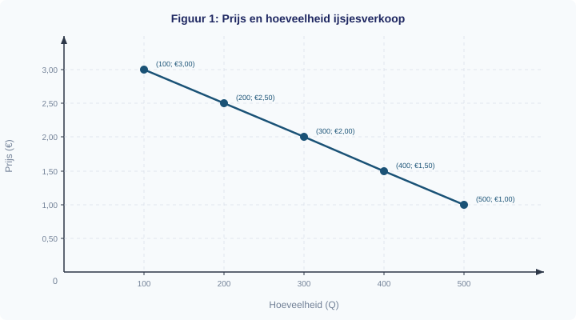

# 1.1.3 Grafieken en tabellen

## Hoeveel ijsjes verkoop je bij welke prijs?

Het is zomer en je runt een ijskraam op het strand. Je wilt weten: als ik de prijs van een ijsje verlaag, verkoop ik er dan genoeg extra om meer omzet te maken? Je hebt de afgelopen weken bijgehouden hoeveel ijsjes je bij verschillende prijzen verkocht:

| Prijs (€) | Aantal verkocht |
|-----------|----------------|
| 1,00      | 500            |
| 1,50      | 400            |
| 2,00      | 300            |
| 2,50      | 200            |
| 3,00      | 100            |

De tabel bevat nuttige informatie, maar je ziet het verband niet in één oogopslag. Een grafiek maakt het patroon direct zichtbaar. In deze paragraaf leer je hoe je tabellen leest, er grafieken van tekent, waarden afleest — en hoe je beweringen over data kritisch beoordeelt.

---

## Theorie

### Een tabel lezen

Een tabel ordent gegevens in rijen en kolommen. De bovenste rij bevat de **kolomkoppen**: die vertellen je welke variabele in elke kolom staat. Elke rij daaronder is één **waarneming**.

Lees een tabel altijd systematisch:
1. **Wat staat er in de kolommen?** Welke variabelen zijn er?
2. **Wat is de eenheid?** Euro's, stuks, procenten?
3. **Welke richting?** Stijgt de ene variabele als de andere stijgt, of daalt hij?

Kijk terug naar de ijsjestabel hierboven. In de linkerkolom staat de prijs in euro's. In de rechterkolom staat het aantal verkochte ijsjes. Als de prijs stijgt van €1,00 naar €3,00, daalt het aantal van 500 naar 100. Er is dus een *negatief verband*: hogere prijs, lagere verkoop.

---

### Van tabel naar grafiek

Een grafiek maakt dat verband zichtbaar. Om een grafiek te tekenen, volg je een vaste procedure:

> **Procedure: Grafiek tekenen van tabeldata**
> 1. Lees de tabel: welke variabele is onafhankelijk, welke afhankelijk?
> 2. Zet de onafhankelijke variabele op de x-as, de afhankelijke op de y-as (economie-conventie: prijs op y-as)
> 3. Kies een geschikte schaalverdeling
> 4. Zet de punten uit
> 5. Verbind de punten (recht of vloeiend, afhankelijk van context)

Bij de ijsjestabel is de prijs de onafhankelijke variabele en het aantal verkochte ijsjes de afhankelijke variabele. In de economie geldt een belangrijke conventie:

> **Definitie: Assenconventie in de economie**
> In economische grafieken staat de prijs (P) altijd op de **verticale as** (y-as) en de hoeveelheid (Q) op de **horizontale as** (x-as). Dit is anders dan in de wiskunde, waar de onafhankelijke variabele standaard op de x-as staat.

We passen de procedure toe op de ijsjestabel:

**Stap 1:** De prijs is de onafhankelijke variabele, het aantal ijsjes de afhankelijke.

**Stap 2:** Volgens de economie-conventie zetten we de prijs op de y-as en de hoeveelheid op de x-as.

**Stap 3:** De prijs loopt van €1,00 tot €3,00 — we kiezen een schaal van €0,50 per lijn. De hoeveelheid loopt van 100 tot 500 — we kiezen een schaal van 100 per lijn.

**Stap 4 en 5:** We zetten de vijf punten uit en verbinden ze met rechte lijnen.

In figuur 1 zie je het negatieve verband: de lijn loopt van linksboven naar rechtsonder. Hoe lager de prijs, hoe meer ijsjes er verkocht worden.

> **⚠️ Let op — veelgemaakte fout**
> Veel leerlingen zetten de prijs op de horizontale as en de hoeveelheid op de verticale as. Dat is wiskundig niet fout, maar in de economie doen we het andersom. Figuur 3 laat het verschil zien.

Onthoud: in dit vak staat de prijs altijd op de y-as. Als je een grafiek tekent of afleest, controleer dan eerst welke variabele op welke as staat.

---

### Waarden aflezen en interpoleren

Je kunt een grafiek ook *andersom* gebruiken: niet om punten te tekenen, maar om waarden af te lezen. Stel dat je wilt weten hoeveel ijsjes je verkoopt bij een prijs van €1,75. Die prijs staat niet in de tabel, maar je kunt hem aflezen uit de grafiek.

> **Procedure: Waarden aflezen uit een grafiek**
> 1. Zoek de gegeven waarde op de juiste as
> 2. Trek een lijn naar de grafiek
> 3. Lees de bijbehorende waarde af op de andere as
> 4. Bij interpolatie: schat de waarde tussen twee bekende punten

We passen dit toe:

**Stap 1:** Zoek €1,75 op de y-as (de prijsas).

**Stap 2:** Trek een horizontale stippellijn naar rechts tot je de lijn raakt.

**Stap 3:** Trek vanaf dat punt een verticale stippellijn omlaag naar de x-as.

**Stap 4:** Je leest af: bij €1,75 worden er ongeveer 350 ijsjes verkocht.

Dit heet **interpoleren**: je schat een waarde die *tussen* twee bekende datapunten in ligt. €1,75 ligt precies tussen €1,50 en €2,00. De bijbehorende hoeveelheid (350) ligt precies tussen 400 en 300. Dat klopt, want de lijn loopt hier recht.

De tabel, de grafiek en het berekende getal vertellen hetzelfde verhaal — alleen in een andere vorm:

| Prijs (€) | Hoeveelheid (uit tabel) | Hoeveelheid (uit grafiek) |
|-----------|------------------------|--------------------------|
| 1,50      | 400                    | 400                      |
| 1,75      | —                      | ≈ 350 (interpolatie)     |
| 2,00      | 300                    | 300                      |

---

### Kritisch kijken naar data

Grafieken en tabellen zijn krachtige hulpmiddelen, maar je moet er kritisch naar kijken. Een krantenkop kan beweren: "IJsjesverkoop daalt met 50%!" Klopt dat?

Kijk terug naar de tabel. De verkoop daalt van 500 naar 100 over het hele prijsbereik — dat is een daling van 80%. Maar tussen €1,00 en €2,00 daalt de verkoop van 500 naar 300, en dat is een daling van 40%.

> **📋 Herhaling uit §1.1.2**
> De procentuele verandering bereken je met: (nieuw − oud) / oud × 100%.

Wanneer klopt "50%" dan wél? Tussen €2,00 en €3,00 daalt de verkoop van 300 naar 100. Dat is: (100 − 300) / 300 × 100% = −66,7%. Dat is dus ook geen 50%.

Tussen €1,00 en €1,50 daalt de verkoop van 500 naar 400: (400 − 500) / 500 × 100% = −20%. Dat is ook geen 50%.

Tussen welke twee prijzen is er dan wél een daling van 50%? Tussen €1,50 en €2,50: de verkoop gaat van 400 naar 200. Dat is: (200 − 400) / 400 × 100% = −50%. De bewering "50% daling" klopt dus alleen als je precies die twee prijzen vergelijkt.

**Les:** bij elke bewering over procenten moet je altijd vragen: vergeleken met *wat*?

---

## Uitgewerkt voorbeeld

**Opgave:** Een winkelier houdt bij hoeveel flesjes limonade hij per dag verkoopt bij verschillende prijzen:

| Prijs (€) | Verkocht per dag |
|-----------|-----------------|
| 0,80      | 120              |
| 1,20      | 90               |
| 1,60      | 60               |
| 2,00      | 30               |

**(a)** Teken een grafiek met de prijs op de verticale as en de hoeveelheid op de horizontale as.
**(b)** Lees uit je grafiek af: hoeveel flesjes verkoopt de winkelier bij een prijs van €1,00?
**(c)** Bereken de procentuele verandering in de verkoop als de prijs stijgt van €0,80 naar €1,60.

---

**Uitwerking:**

**(a)** We volgen de procedure *Grafiek tekenen van tabeldata*:

| Stap | Actie |
|------|-------|
| 1. Variabelen bepalen | Prijs = onafhankelijk, verkoop = afhankelijk |
| 2. Assen kiezen | Prijs op y-as, hoeveelheid op x-as (economie-conventie) |
| 3. Schaalverdeling | y-as: €0,40 per lijn (van €0,00 tot €2,40). x-as: 30 per lijn (van 0 tot 150) |
| 4. Punten uitzetten | (120; 0,80), (90; 1,20), (60; 1,60), (30; 2,00) |
| 5. Verbinden | Rechte lijnen tussen de punten |

**(b)** We volgen de procedure *Waarden aflezen uit een grafiek*:

| Stap | Actie |
|------|-------|
| 1. Gegeven waarde opzoeken | €1,00 op de y-as |
| 2. Lijn naar de grafiek | Horizontale stippellijn naar rechts tot de lijn |
| 3. Aflezen op andere as | Verticale stippellijn omlaag naar de x-as |
| 4. Interpolatie | €1,00 ligt tussen €0,80 en €1,20. Aflezen: ≈ 105 flesjes |

**(c)** De verkoop daalt van 120 naar 60 flesjes.

Procentuele verandering = (nieuw − oud) / oud × 100% = (60 − 120) / 120 × 100% = **−50%**

De verkoop daalt met 50%.

---

> **Samenvatting §1.1.3**
> - Een **tabel** ordent gegevens in rijen en kolommen. Lees altijd eerst de kolomkoppen en eenheden.
> - In de economie staat de **prijs op de y-as** en de **hoeveelheid op de x-as** (assenconventie).
> - Met **interpolatie** schat je een waarde tussen twee bekende datapunten.
> - Controleer beweringen over data altijd kritisch: *vergeleken met wat?*
> - In de volgende paragraaf (§1.1.4) combineer je deze grafiekvaardigheden met percentages en economisch denken.

---

*Vastgelopen op een opgave? Kijk op de website bij dit hoofdstuk voor extra uitleg en tips.*

---

## Opgaven

### Startoefeningen

**Opgave 1**

Bekijk de grafiek hieronder. Deze toont het verband tussen de prijs van een broodje en het aantal verkochte broodjes per week.

**(a)** Hoeveel broodjes worden er verkocht bij een prijs van €3,00?
**(b)** Bij welke prijs worden er 150 broodjes verkocht?
**(c)** Beschrijf het verband tussen prijs en hoeveelheid in één zin.

**Opgave 2**

Een marktkraam verkoopt koffie. De eigenaar heeft de volgende gegevens:

| Prijs per beker (€) | Verkocht per dag |
|---------------------|-----------------|
| 1,00                | 200              |
| 1,50                | 160              |
| 2,00                | 120              |
| 2,50                | 80               |
| 3,00                | 40               |

**(a)** Teken een grafiek met de prijs op de verticale as en het aantal bekers op de horizontale as. Kies een geschikte schaalverdeling.
**(b)** Welk verband zie je? Leg uit.

---

### Verdiepende opgaven

**Opgave 3**

Bekijk de grafiek hieronder. Deze toont het verband tussen de prijs van een bioscoopkaartje en het aantal bezoekers per week.

**(a)** Lees uit de grafiek af: hoeveel bezoekers komen er bij een prijs van €9,00?
**(b)** Lees uit de grafiek af: hoeveel bezoekers komen er bij een prijs van €11,00? Gebruik interpolatie.
**(c)** Bereken de procentuele verandering in het aantal bezoekers als de prijs stijgt van €8,00 naar €12,00.

**Opgave 4**

Een supermarkt verkoopt flesjes water. In januari kostten ze €0,80 en werden er 500 per week verkocht. In juni is de prijs gestegen naar €1,20 en worden er 350 per week verkocht.

**(a)** Teken een grafiek met deze twee punten. Zet de prijs op de y-as.
**(b)** Trek een rechte lijn tussen de twee punten. Lees af: hoeveel flesjes worden er verkocht bij €1,00?
**(c)** Bereken het indexcijfer van de verkoop in juni (januari = 100).
**(d)** Een journalist schrijft: "De waterverkoop is met een derde gedaald." Klopt dit? Laat je berekening zien.

---

### Denkertje

**Opgave 5**

Twee leerlingen maken een grafiek van dezelfde gegevens. Leerling A begint de y-as bij €0,00. Leerling B begint de y-as bij €4,50 (net onder de laagste waarde).

**(a)** Schets hoe beide grafieken er ongeveer uitzien.
**(b)** Bij welke grafiek lijkt de daling *groter* dan hij werkelijk is? Leg uit.
**(c)** Noem een voorbeeld uit het nieuws of de reclame waar een grafiek misleidend kan zijn door de keuze van de asschaal.
