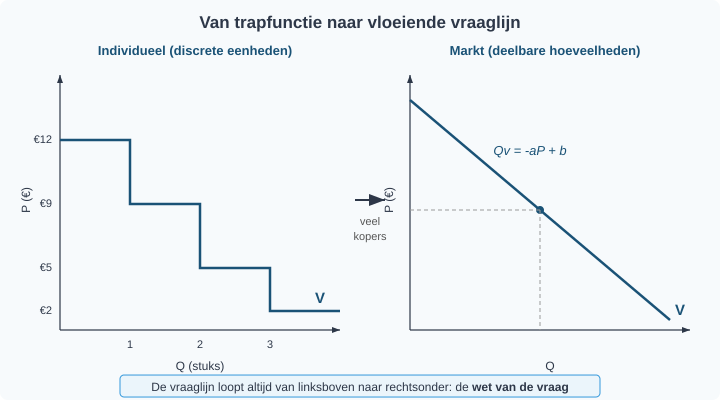
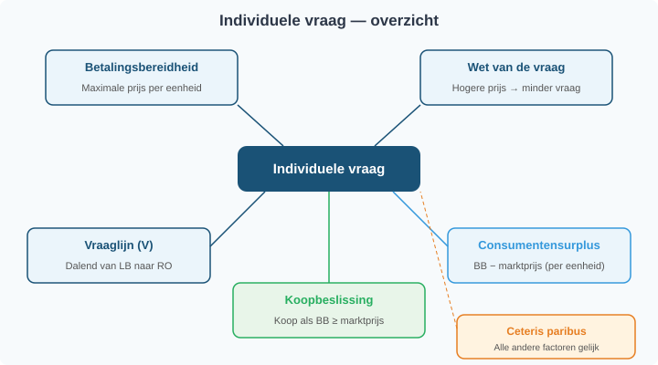
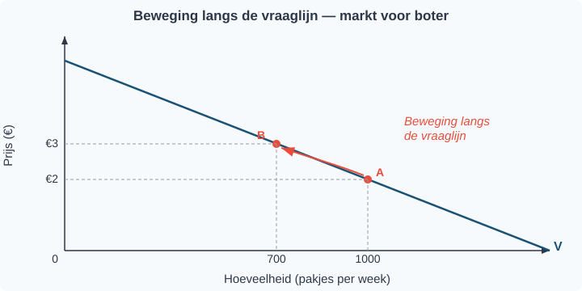
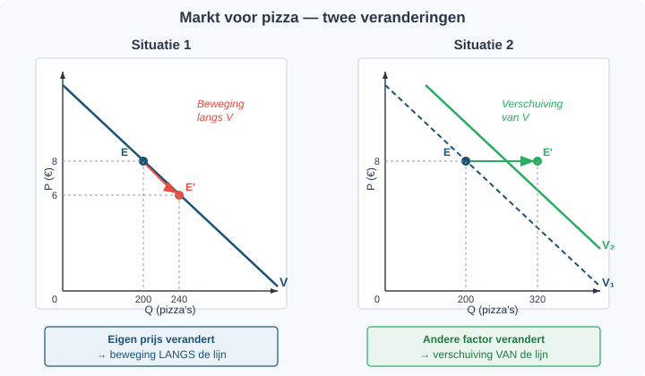
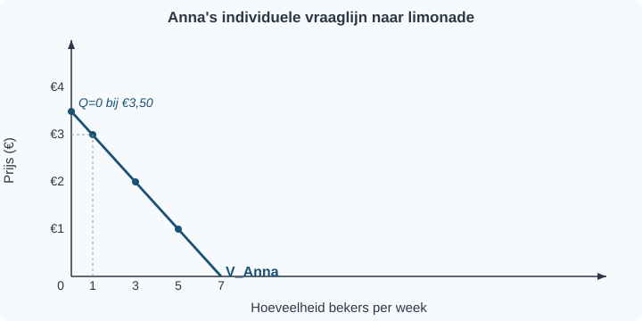
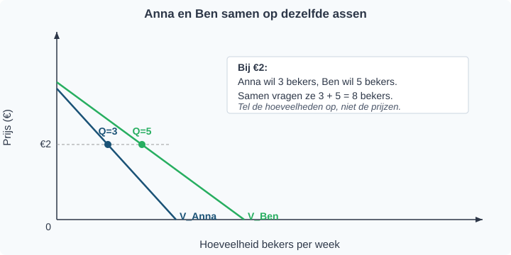
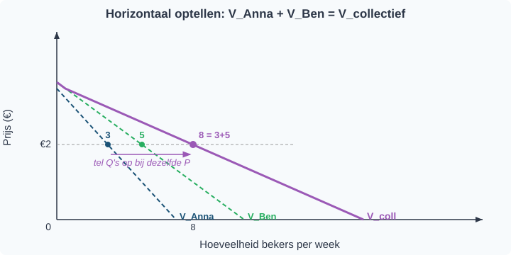
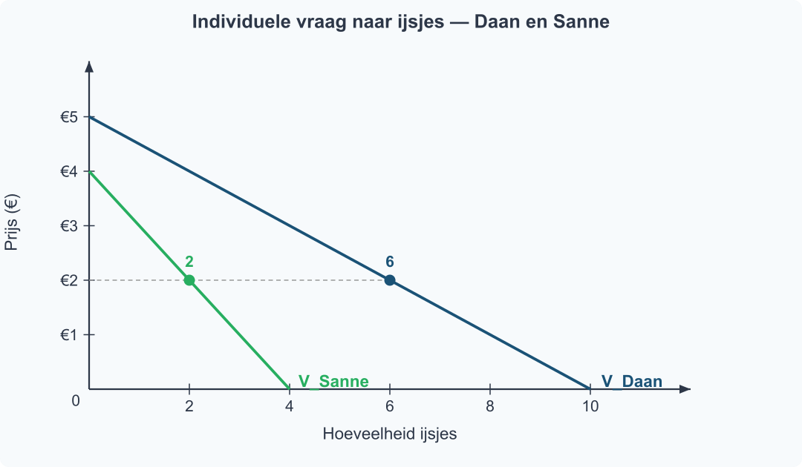

<div class="chapter-front">

<h1>Hoofdstuk 2 — Vraag</h1>

<h2>Inhoud</h2>

<table>
<thead><tr><th>§</th><th>Onderwerp</th></tr></thead>
<tbody>
<tr><td>1.2.1</td><td>Individuele vraag</td></tr>
<tr><td>1.2.2</td><td>Vraagfactoren</td></tr>
<tr><td>1.2.3</td><td>Van individuele naar collectieve vraag</td></tr>
<tr><td>1.2.4</td><td>Gemengde opgaven</td></tr>
</tbody>
</table>

<h2>Leerdoelen</h2>

<p>Na dit hoofdstuk kun je:</p>

<ul>
<li>De betalingsbereidheid definiëren en gebruiken om een koopbeslissing te verklaren</li>
<li>Het verband tussen prijs en gevraagde hoeveelheid uitleggen (wet van de vraag)</li>
<li>Een individuele vraaglijn tekenen vanuit betalingsbereidheidsdata</li>
<li>Het consumentensurplus berekenen</li>
<li>Het verschil uitleggen tussen een beweging langs de vraaglijn en een verschuiving van de vraaglijn</li>
<li>De vijf vraagfactoren benoemen en uitleggen: inkomen, voorkeuren, prijs van substituten, prijs van complementen, verwachtingen</li>
<li>Verschuivingen grafisch weergeven (naar links/rechts)</li>
<li>Goederen classificeren als substituten of complementen op basis van context</li>
<li>Uitleggen dat de collectieve vraag de horizontale optelsom is van individuele vraaglijnen</li>
<li>De collectieve vraag berekenen met de tabelmethode en de algebraïsche methode</li>
<li>De knik in de collectieve vraaglijn herkennen en verklaren</li>
</ul>

<h2>Waarom koop jij niet vijf broodjes?</h2>

<p>Waarom koop je drie broodjes bij de bakker, maar niet vijf? En waarom koopt iedereen ineens meer boter als margarine in het nieuws komt — terwijl de prijs van boter niet veranderd is? In dit hoofdstuk leer je hoe consumenten hun koopbeslissing nemen op basis van betalingsbereidheid, welke factoren de vraag beïnvloeden, en hoe je de vraag van alle consumenten op een markt samenvoegt tot één collectieve vraaglijn. Aan het einde kun je voorspellen wat er met de gevraagde hoeveelheid gebeurt als de omstandigheden veranderen.</p>

</div>


<div style="break-before: page;"></div>

# 1.2.1 Individuele vraag

## Hoe beslis je hoeveel je koopt?

Tom is gek op de bioscoop. Voor de eerste film van de week heeft hij alles over: hij zou best €12 willen betalen. Maar een tweede film dezelfde week? Dat is leuk, maar niet zo bijzonder meer — daar wil hij hooguit €9 voor betalen. Een derde film? €5, misschien. En een vierde? Die is alleen de moeite als hij bijna niets kost: €2 is zijn maximum.

Tom merkt iets op. Hoe meer films hij al gezien heeft, hoe minder hij bereid is te betalen voor de volgende. De eerste is het meest waard, elke volgende iets minder. Hoe komt dat? En hoe bepaalt Tom hoeveel kaartjes hij uiteindelijk koopt?

---

## Theorie

### Betalingsbereidheid

Het maximale bedrag dat een consument bereid is te betalen voor een extra eenheid van een goed, heet de **betalingsbereidheid**.

> **Definitie: Betalingsbereidheid**
> Het maximale bedrag dat een consument wil betalen voor één extra eenheid van een goed.

Tom's betalingsbereidheid per bioscoopkaartje:

| Kaartje | Betalingsbereidheid |
|---------|-------------------|
| 1e      | €12               |
| 2e      | €9                |
| 3e      | €5                |
| 4e      | €2                |

De betalingsbereidheid daalt bij elk volgend kaartje. Dit is logisch: hoe meer je al hebt van iets, hoe minder waarde je hecht aan nóg een eenheid. Economen noemen dit *afnemend grensnut*.

We tekenen Tom's betalingsbereidheid in een grafiek. Op de verticale as staat de prijs (in euro's), op de horizontale as het aantal kaartjes. Elke balk toont hoeveel Tom bereid is te betalen voor dat specifieke kaartje.


---

### De individuele vraaglijn

We kunnen deze gegevens ook als een **trapfunctie** tekenen: horizontale lijnen op de hoogte van de betalingsbereidheid, met een sprong omlaag bij elk volgend kaartje. Dat levert Tom's *individuele vraaglijn* op.

> **Definitie: Individuele vraaglijn**
> Een grafiek die laat zien hoeveel eenheden één consument wil kopen bij elke prijs, **terwijl alle andere omstandigheden gelijk blijven** (ceteris paribus).


De vraaglijn (V) loopt van linksboven naar rechtsonder. Bij een hoge prijs koopt Tom weinig; bij een lage prijs koopt hij meer. De trappen worden kleiner naarmate de betalingsbereidheid daalt.

---

### De koopbeslissing

Hoe beslist Tom hoeveel kaartjes hij koopt? Hij vergelijkt zijn betalingsbereidheid met de **marktprijs** — de prijs die de bioscoop vraagt.

**De regel is simpel:** koop zolang je betalingsbereidheid groter is dan of gelijk is aan de marktprijs.

Stel: de marktprijs is €7. Tom vergelijkt:

| Kaartje | Betalingsbereidheid | Marktprijs | Beslissing |
|---------|-------------------|------------|------------|
| 1e      | €12               | €7         | Kopen (€12 ≥ €7) ✓ |
| 2e      | €9                | €7         | Kopen (€9 ≥ €7) ✓ |
| 3e      | €5                | €7         | Niet kopen (€5 < €7) ✗ |
| 4e      | €2                | €7         | Niet kopen (€2 < €7) ✗ |

Tom koopt 2 kaartjes. Figuur 3 laat dit zien: de groene vlakken zijn de kaartjes die hij koopt (betalingsbereidheid boven de prijslijn), de grijze zijn de kaartjes die hij niet koopt.


---

### Wat als de prijs daalt?

Stel dat de bioscoop een actie houdt: alle kaartjes kosten nu €4. Tom vergelijkt opnieuw:

- 1e kaartje: €12 ≥ €4 → kopen ✓
- 2e kaartje: €9 ≥ €4 → kopen ✓
- 3e kaartje: €5 ≥ €4 → kopen ✓
- 4e kaartje: €2 < €4 → niet kopen ✗

Tom koopt nu 3 kaartjes in plaats van 2. Bij een lagere prijs koopt hij meer. Dit is de **wet van de vraag**.

> **Definitie: Wet van de vraag**
> Bij een hogere prijs is de gevraagde hoeveelheid kleiner; bij een lagere prijs is de gevraagde hoeveelheid groter — *ceteris paribus* (alle andere omstandigheden gelijk).

---

### Consumentensurplus

Bij de actieprijs van €4 betaalt Tom €4 per kaartje, maar voor het eerste kaartje was hij bereid €12 te betalen. Hij betaalt €8 minder dan zijn maximum. Die €8 is zijn *winst* op dat kaartje: zijn **consumentensurplus**.

> **Definitie: Consumentensurplus**
> Het verschil tussen de betalingsbereidheid en de werkelijk betaalde prijs, per eenheid.
>
> Consumentensurplus per eenheid = betalingsbereidheid − marktprijs

Tom's consumentensurplus bij P = €4:

| Kaartje | Betalingsbereidheid | Betaald | Surplus |
|---------|-------------------|---------|---------|
| 1e      | €12               | €4      | €8      |
| 2e      | €9                | €4      | €5      |
| 3e      | €5                | €4      | €1      |
| **Totaal** | | | **€14** |

In figuur 4 zie je het consumentensurplus als de blauwe vlakken boven de prijslijn en onder de trappen van de vraaglijn.


---

### Van trapfunctie naar vloeiende vraaglijn

Tom's vraaglijn is een trapfunctie, want bioscoopkaartjes zijn gehele eenheden — je koopt 1, 2 of 3 kaartjes, niet 1,7 kaartje.

Maar veel goederen zijn *deelbaar*: liters melk, kilo's appels, minuten beltegoed. En als je de vraag van heel veel consumenten samenneemt (dat leer je in §1.2.3), verdwijnen de trappen. Dan ontstaat een vloeiende, rechte vraaglijn die je kunt beschrijven met een formule:

Q*v* = −*a*P + *b*

Hierin is Q*v* de gevraagde hoeveelheid, P de prijs, *a* een positief getal (de helling), en *b* het snijpunt met de Q-as.



Of de vraaglijn nu trappen heeft of vloeiend is: hij loopt altijd van linksboven naar rechtsonder. Dat is de wet van de vraag in beeld.

---

### Ceteris paribus — de kleine lettertjes

De vraaglijn toont het verband tussen prijs en gevraagde hoeveelheid *terwijl alle andere omstandigheden gelijk blijven*. Dit heet **ceteris paribus** (Latijn voor "het overige gelijk"). De vraaglijn gaat er dus van uit dat het inkomen van de consument, zijn voorkeuren, de prijzen van andere goederen, en zijn verwachtingen niet veranderen.

Wat gebeurt er als die andere factoren wél veranderen? Dat is het onderwerp van §1.2.2.

Figuur 6 vat de kernbegrippen van deze paragraaf samen.



---

## Uitgewerkt voorbeeld

> **Karin en de ijsjes**
>
> Karin is op het strand. Ze overweegt hoeveel ijsjes ze koopt.
> Haar betalingsbereidheid: €4 voor het eerste ijsje, €3 voor het tweede, €2 voor het derde, €0,50 voor het vierde.

**(a)** De marktprijs is €2,50 per ijsje. Hoeveel ijsjes koopt Karin?

*Stap 1: Vergelijk de betalingsbereidheid met de marktprijs voor elk ijsje.*

| Ijsje | Betalingsbereidheid | Marktprijs | Beslissing |
|-------|-------------------|------------|------------|
| 1e    | €4                | €2,50      | Kopen (€4 ≥ €2,50) ✓ |
| 2e    | €3                | €2,50      | Kopen (€3 ≥ €2,50) ✓ |
| 3e    | €2                | €2,50      | Niet kopen (€2 < €2,50) ✗ |
| 4e    | €0,50             | €2,50      | Niet kopen (€0,50 < €2,50) ✗ |

*Antwoord:* Karin koopt **2 ijsjes**.

**(b)** Bereken het totale consumentensurplus van Karin.

*Stap 2: Trek de marktprijs af van de betalingsbereidheid voor elk gekocht ijsje.*

- Ijsje 1: €4 − €2,50 = €1,50
- Ijsje 2: €3 − €2,50 = €0,50
- Totaal: €1,50 + €0,50 = **€2**

**(c)** Waarom koopt Karin het derde ijsje niet?

*Antwoord:* Haar betalingsbereidheid voor het derde ijsje is €2, maar de marktprijs is €2,50. Ze zou meer betalen dan het haar waard is. Het consumentensurplus zou negatief zijn (€2 − €2,50 = −€0,50), dus kopen is onvoordelig.


---

> **Samenvatting §1.2.1**
> - De **betalingsbereidheid** is het maximale bedrag dat een consument wil betalen voor één extra eenheid van een goed.
> - De **individuele vraaglijn** toont het verband tussen prijs en gevraagde hoeveelheid voor één consument. De vraaglijn loopt altijd van linksboven naar rechtsonder.
> - **Koopbeslissing:** een consument koopt zolang zijn betalingsbereidheid groter is dan of gelijk is aan de marktprijs.
> - Het **consumentensurplus** is het verschil tussen de betalingsbereidheid en de werkelijk betaalde prijs. Hoe lager de marktprijs, hoe groter het consumentensurplus.
> - De vraaglijn geldt onder de voorwaarde **ceteris paribus** — alle andere omstandigheden gelijk. Bij deelbare goederen wordt de vraaglijn een vloeiende lijn: Q*v* = −*a*P + *b*.
> - *In §1.2.2 leer je welke factoren de hele vraaglijn kunnen verschuiven — en waarom dat iets anders is dan een beweging langs de lijn.*

> **💡 Vastgelopen op een opgave?**
> Op de website vind je bij elke opgave een **begeleide inoefening**: stap voor stap krijg je extra hints en tussenstappen. Klik op de opgave om de begeleiding te starten.

---

## Opgaven

### Startoefeningen

**Opgave 1** *(lees de grafiek — zie figuur 7)*

In figuur 7 zie je de individuele vraaglijn van Emma voor boeken.


a) Wat is Emma's betalingsbereidheid voor het derde boek? Lees dit af uit de grafiek.

b) De marktprijs van een boek is €4. Hoeveel boeken koopt Emma? Leg uit hoe je dit uit de grafiek kunt aflezen.

c) Emma's vriendin zegt: "Bij €6 koopt Emma 2 boeken." Klopt dit? Leg uit.

**Opgave 2** *(teken de grafiek — zie figuur 8)*

Jasper wil concertkaartjes kopen. Zijn betalingsbereidheid:

| Kaartje | Betalingsbereidheid |
|---------|-------------------|
| 1e      | €10               |
| 2e      | €7                |
| 3e      | €4                |
| 4e      | €1                |

a) Teken Jasper's individuele vraaglijn als trapfunctie in het assenstelsel van figuur 8 (prijs op de y-as, hoeveelheid op de x-as).


b) De marktprijs is €6. Hoeveel kaartjes koopt Jasper? Laat zien hoe je dit uit je grafiek afleest.

c) Bereken het totale consumentensurplus van Jasper bij een marktprijs van €6.

**Opgave 3** *(consumentensurplus berekenen)*

Gebruik de grafiek van Emma uit opgave 1 (figuur 7).

a) De marktprijs van een boek is €2. Hoeveel boeken koopt Emma?

b) Bereken het consumentensurplus per boek en het totale consumentensurplus.

c) De prijs stijgt naar €6. Hoeveel boeken koopt Emma nu? Bereken het nieuwe consumentensurplus. Leg uit waarom het consumentensurplus is veranderd.

---

### Zelfstandige oefening

**Opgave 4**

Mila overweegt hoeveel tijdschriften ze koopt. Haar betalingsbereidheid per tijdschrift: €8 voor het eerste, €6 voor het tweede, €3 voor het derde, €1 voor het vierde.

a) Maak een tabel met de betalingsbereidheid per tijdschrift.

b) Teken de individuele vraaglijn van Mila als trapfunctie (prijs op de y-as, hoeveelheid op de x-as).

c) De marktprijs is €5. Hoeveel tijdschriften koopt Mila? Leg je antwoord uit met behulp van de koopbeslissing.

d) Bereken het totale consumentensurplus bij een marktprijs van €5.

e) De prijs daalt naar €2. Hoeveel tijdschriften koopt ze nu? Bereken het nieuwe consumentensurplus.

**Opgave 5**

De individuele vraaglijn van een consument wordt beschreven door de formule:

Q*v* = −5P + 20

Hierin is Q*v* de gevraagde hoeveelheid en P de prijs in euro's.

a) Bereken de gevraagde hoeveelheid bij P = €1, P = €2 en P = €3. Zet de resultaten in een tabel.

b) Bij welke prijs wordt de gevraagde hoeveelheid precies 0? Wat betekent dit economisch?

c) De marktprijs is €2. Hoeveel eenheden koopt deze consument?

d) Teken de vraaglijn in een assenstelsel (prijs op de y-as, hoeveelheid op de x-as). Gebruik de drie punten uit deelvraag a en het punt uit deelvraag b.

---

### Herhaling (interleaving)

**Opgave 6** *(herhaling §1.1.2: procentuele verandering)*

Een bioscoopkaartje kostte vorig jaar €9. Dit jaar is de prijs gestegen naar €10,80.

a) Bereken de procentuele prijsstijging.

b) Volgend jaar verwacht de bioscoop een verdere stijging van 5%. Bereken de verwachte prijs volgend jaar.

**Opgave 7** *(herhaling §1.1.3: tabel en grafiek)*

In onderstaande tabel staat de gevraagde hoeveelheid broodjes bij verschillende prijzen.

| Prijs (€) | Gevraagde hoeveelheid |
|---|---|
| 1 | 10 |
| 2 | 8 |
| 3 | 6 |
| 4 | 4 |
| 5 | 2 |

a) Teken de vraaglijn in een assenstelsel (prijs op de y-as, hoeveelheid op de x-as).

b) Lees uit de grafiek af: hoeveel broodjes worden er gevraagd bij een prijs van €2,50?

c) Bij welke prijs is de gevraagde hoeveelheid precies 0?

---

### Doeloefening

**Opgave 8**

Lisa is dol op pizza. Haar betalingsbereidheid: €8 voor de eerste pizza, €6 voor de tweede, €4 voor de derde en €1,50 voor de vierde.

a) Teken Lisa's individuele vraaglijn als trapfunctie. Zet de prijs op de verticale as en het aantal pizza's op de horizontale as.

b) De marktprijs is €5. Hoeveel pizza's koopt Lisa? Verklaar je antwoord met behulp van het begrip betalingsbereidheid.

c) De prijs daalt naar €3. Hoeveel pizza's koopt Lisa nu?

d) Leg in eigen woorden uit waarom de vraaglijn van linksboven naar rechtsonder loopt.

---

### Denkertje *(bonusopgave)*

**Opgave 9**

Tom en zijn vriend Max gaan allebei naar dezelfde bioscoop. Tom is bereid €12 te betalen voor het eerste kaartje, Max slechts €6.

a) Noem twee mogelijke redenen waarom Tom een hogere betalingsbereidheid heeft dan Max.

b) Als het inkomen van Max stijgt, verwacht je dan dat zijn betalingsbereidheid verandert? Leg uit. *(Denk alvast na: wat zou dit betekenen voor zijn vraaglijn?)*


<div style="break-before: page;"></div>

# 1.2.2 Vraagfactoren

## Boter zonder prijsverandering — toch koopt iedereen ineens meer

Stel: in de supermarkt stijgt de prijs van boter van €2 naar €3. Veel klanten kopen minder boter. Logisch — je kent dat al uit §1.2.1: bij een hogere prijs daalt de gevraagde hoeveelheid.

Maar nu gebeurt er iets anders. De prijs van boter blijft €2, maar op het journaal vertellen wetenschappers dat margarine ongezond is. De volgende week koopt iedereen ineens méér boter — terwijl de prijs niet veranderd is.

Hoe kan dat? De vraaglijn uit §1.2.1 laat zien hoeveel consumenten willen kopen bij elke prijs — *zolang alle andere omstandigheden gelijk blijven*. Die kleine voorwaarde "*ceteris paribus*" is cruciaal. Zodra een andere factor verandert (inkomen, voorkeuren, prijs van een ander goed, …), klopt de oude vraaglijn niet meer en moet je hem opnieuw tekenen.

De prijs bepaalt dus *waar* je zit op de vraaglijn. Maar andere factoren bepalen *waar de hele lijn ligt*. In deze paragraaf leer je dat verschil — en waarom het de meest gemaakte fout in de economie is.

---

## Theorie

### De vraaglijn als startpunt

> **📋 Herhaling uit §1.2.1**
> De vraaglijn (V) laat het verband zien tussen de prijs en de gevraagde hoeveelheid, **terwijl alle andere omstandigheden gelijk blijven**. De lijn loopt van linksboven naar rechtsonder: hoe lager de prijs, hoe groter de gevraagde hoeveelheid. Dit heet de *vraagwet*.

We beginnen met de vraaglijn uit §1.2.1. Op de verticale as staat de prijs (P), op de horizontale as de gevraagde hoeveelheid (Q).


Bij een prijs van €2 is de gevraagde hoeveelheid 1000 pakjes boter per week. Bij €3 is dat 700 pakjes.

---

### Beweging langs de vraaglijn

Wat gebeurt er als de prijs van boter stijgt van €2 naar €3? Je schuift *langs* de vraaglijn omhoog: van punt A naar punt B. De gevraagde hoeveelheid daalt van 1000 naar 700.

Dit heet een **beweging langs de vraaglijn**. De lijn zelf verandert niet. Je verplaatst je alleen naar een ander punt op dezelfde lijn.

**Oorzaak:** een verandering van de prijs van het goed zelf.



Let op de pijl in figuur 2: die loopt *langs* de bestaande lijn. De lijn verschuift niet.

---

### Verschuiving van de vraaglijn

Nu het tweede geval. De prijs van boter blijft €2. Maar er komt een nieuwsbericht dat margarine ongezond is. Consumenten willen nu bij *elke* prijs meer boter dan voorheen.

Bij €2 kopen ze geen 1000, maar 1300 pakjes. Bij €3 geen 700, maar 1000 pakjes. Elk punt op de lijn schuift naar rechts. Er ontstaat een nieuwe vraaglijn (V₂), rechts van de oude (V₁).

Dit heet een **verschuiving van de vraaglijn**. De hele lijn verplaatst.

**Oorzaak:** een verandering van een andere factor dan de prijs van het goed zelf.


De horizontale pijl in figuur 3 laat zien dat de hele lijn opschuift. Bij dezelfde prijs is de gevraagde hoeveelheid groter geworden.

> **⚠️ Let op — veelgemaakte fout**
> Veel leerlingen verwarren een *verschuiving van* de vraaglijn met een *beweging langs* de vraaglijn.
> - Verandering van de prijs van het goed zelf → **beweging LANGS** de lijn.
> - Verandering van inkomen, voorkeuren of andere factoren → **verschuiving VAN** de lijn.

---

### Vraagfactoren: wat verschuift de vraaglijn?

De factoren die de hele vraaglijn verschuiven, heten **vraagfactoren**. Er zijn er vijf:

> **Definitie: Vraagfactoren**
> Factoren die de positie van de vraaglijn bepalen. Een verandering van een vraagfactor verschuift de hele vraaglijn naar links of naar rechts.

**1. Inkomen van de consument**

Als het inkomen stijgt, kopen consumenten meestal meer van een goed. De vraaglijn verschuift naar rechts. Zo'n goed heet een *normaal goed*.

> **Definitie: Normaal goed**
> Een goed waarvan de vraag stijgt als het inkomen stijgt.
> Voorbeelden: restaurantbezoek, merkkleding, vliegvakanties.

Maar soms werkt het andersom. Als het inkomen stijgt, kopen consumenten juist *minder* van een bepaald goed — ze stappen over op iets beters. Zo'n goed heet een *inferieur goed*.

> **Definitie: Inferieur goed**
> Een goed waarvan de vraag daalt als het inkomen stijgt.
> Voorbeelden: huismerkpasta, tweedehands kleding, instant noodles.

**2. Prijs van andere goederen — substituten**

Boter en margarine zijn *substitutiegoederen*: je kunt het ene vervangen door het andere. Als margarine duurder wordt, stappen consumenten over op boter. De vraag naar boter stijgt, de vraaglijn verschuift naar rechts.

> **Definitie: Substitutiegoederen (substituten)**
> Goederen die elkaar kunnen vervangen in gebruik.
> Kenmerk: als de prijs van het ene stijgt, stijgt de vraag naar het andere.
> Voorbeelden: boter en margarine, Coca-Cola en Pepsi, trein en auto.

**3. Prijs van andere goederen — complementen**

Brood en boter gebruik je samen. Als brood duurder wordt, koop je minder brood — en dus ook minder boter. De vraaglijn van boter verschuift naar links.

> **Definitie: Complementaire goederen (complementen)**
> Goederen die je samen gebruikt.
> Kenmerk: als de prijs van het ene stijgt, daalt de vraag naar het andere.
> Voorbeelden: brood en boter, printer en inkt, auto en benzine.

**4. Voorkeuren (preferenties)**

Smaak verandert. Een nieuwsbericht over gezondheid, een reclame, een trend op social media — het kan allemaal de voorkeuren beïnvloeden. Als consumenten een goed aantrekkelijker vinden, verschuift de vraaglijn naar rechts. Vinden ze het minder aantrekkelijk, dan naar links.

**5. Verwachtingen**

Als consumenten verwachten dat de prijs morgen stijgt, kopen ze vandaag alvast meer. De vraaglijn verschuift naar rechts. Verwachten ze een prijsdaling, dan wachten ze af — de vraaglijn verschuift naar links.

Figuur 5 vat de vijf vraagfactoren in één beeld samen. Onthoud: deze vijf factoren kunnen de hele lijn verschuiven. De prijs van het goed zelf staat er niet bij — die veroorzaakt een beweging *langs* de lijn, niet een verschuiving.


---

### Overzicht: beweging langs versus verschuiving van

Figuur 4 vat alles samen. De oorspronkelijke vraaglijn (V₁) kan naar rechts verschuiven (V₂ — vraagtoename) of naar links verschuiven (V₃ — vraagafname).


**Vraag neemt toe (verschuiving naar rechts):**
- Inkomen stijgt (normaal goed)
- Prijs van substituut stijgt
- Prijs van complement daalt
- Voorkeur voor het goed neemt toe
- Verwachte prijsstijging

**Vraag neemt af (verschuiving naar links):**
- Inkomen daalt (normaal goed) of inkomen stijgt (inferieur goed)
- Prijs van substituut daalt
- Prijs van complement stijgt
- Voorkeur voor het goed neemt af
- Verwachte prijsdaling

---

> **Samenvatting §1.2.2**
> - Een verandering van de prijs van het goed zelf veroorzaakt een **beweging langs** de vraaglijn.
> - Een verandering van een vraagfactor (inkomen, voorkeuren, prijs van substituten/complementen, verwachtingen) veroorzaakt een **verschuiving van** de vraaglijn.
> - Substituten zijn goederen die elkaar vervangen; complementen zijn goederen die je samen gebruikt.
> - Een normaal goed heeft een positief verband tussen inkomen en vraag; een inferieur goed een negatief verband.
> - *In §1.2.3 bekijken we de aanbodzijde van de markt: wie biedt er aan, en waarom loopt de aanbodlijn omhoog?*

> **💡 Vastgelopen op een opgave?**
> Op de website vind je bij elke opgave een **begeleide inoefening**: stap voor stap krijg je extra hints en tussenstappen. Klik op de opgave om de begeleiding te starten.

---

## Uitgewerkt voorbeeld

> **De markt voor fietsen**
>
> De markt voor fietsen is in evenwicht bij P = €500 en Q = 2000 fietsen per maand.

**(a)** De prijs van fietsen stijgt naar €600. Is dit een beweging langs of een verschuiving van de vraaglijn? Verklaar je antwoord.

*Antwoord:* Dit is een **beweging langs** de vraaglijn. De prijs van het goed zelf verandert (van €500 naar €600). Bij een hogere prijs is de gevraagde hoeveelheid kleiner. Je schuift langs de bestaande vraaglijn naar een punt linksboven.

**(b)** De prijs van fietsen blijft €500, maar de benzineprijs stijgt fors. Veel forensen stappen over op de fiets. Is dit een beweging langs of een verschuiving van de vraaglijn? Verklaar je antwoord.

*Antwoord:* Dit is een **verschuiving van** de vraaglijn naar rechts. De prijs van fietsen verandert niet, maar een andere vraagfactor wel: **de prijs van een substituut**. De auto is een substituut voor de fiets — beide brengen je van A naar B. Doordat autorijden duurder wordt (hogere benzineprijs), wordt de fiets relatief aantrekkelijker. Bij elke prijs willen consumenten nu meer fietsen kopen.

> ⚠️ Let op de juiste vraagfactor. Het is verleidelijk om te zeggen "de voorkeur voor fietsen is veranderd". Maar de voorkeur (smaak) is niet veranderd — alleen de relatieve prijs van het alternatief. De economisch precieze categorie is daarom *prijs van een substituut*.

**(c)** Leg in eigen woorden uit waarom auto en fiets substituten zijn — en wat dat zegt over hun vraagrelatie.

*Antwoord:* De auto en de fiets zijn **substituten** omdat ze dezelfde behoefte kunnen vervullen (woon-werkverkeer). Het kenmerk van substituten is: als de prijs van het ene stijgt, stijgt de vraag naar het andere. Dat zie je hier letterlijk gebeuren — autorijden wordt duurder, en de vraag naar fietsen schuift naar rechts.

---

## Opgaven

### Startoefeningen

**Opgave 1** *(lees de grafiek — zie figuur 6)*

In figuur 6 zie je twee veranderingen op de markt voor pizza. Beide situaties zijn al voor je getekend en gelabeld.



a) Beschrijf wat er in **Situatie 1** gebeurt: wat verandert er met de prijs en de gevraagde hoeveelheid? Welke factor zou dit veroorzaakt kunnen hebben?

b) Beschrijf wat er in **Situatie 2** gebeurt: wat verandert er met de prijs en de gevraagde hoeveelheid? Welke factor zou dit veroorzaakt kunnen hebben?

c) Leg in eigen woorden uit waarom Situatie 1 een *beweging langs* de vraaglijn is, en Situatie 2 een *verschuiving van* de vraaglijn.

**Opgave 2** *(teken in de grafiek — zie figuur 7)*

De markt voor smartphones is in evenwicht bij P = €600 en Q = 1.000 stuks per maand. In figuur 7 zie je de vraaglijn V₁ met evenwichtspunt E.


a) De prijs van smartphones stijgt naar €750. Laat in de grafiek zien wat er gebeurt. Is dit een verschuiving van de vraaglijn of een beweging langs de vraaglijn? Leg uit.

b) Het gemiddelde inkomen in Nederland stijgt. Smartphones zijn een normaal goed. Laat in de grafiek zien wat er gebeurt met de vraag naar smartphones. Is dit een verschuiving of een beweging? Leg uit.

c) De prijs van telefoonhoesjes (een complementair goed) stijgt fors. Wat verwacht je dat er gebeurt met de vraag naar smartphones? Leg uit of dit een verschuiving of een beweging is en geef de richting aan.

**Opgave 3**

De markt voor fietsen is in evenwicht. Er doen zich achtereenvolgens drie veranderingen voor. Beantwoord voor elke verandering de vragen. Er is geen grafiek bij deze opgave — beschrijf wat er in een grafiek zou gebeuren.

a) De fietsfabrikant geeft een seizoenskorting: de prijs van fietsen daalt van €500 naar €450.
- Verschuift de vraaglijn of beweeg je langs de vraaglijn?
- In welke richting?

b) De gemeente start een campagne "Fiets naar je werk". De prijs van fietsen blijft gelijk.
- Verschuift de vraaglijn of beweeg je langs de vraaglijn?
- In welke richting verschuift of beweegt de lijn?

c) Consumenten verwachten dat fietsen volgende maand 20% duurder worden.
- Wat gebeurt er nu met de vraag naar fietsen?
- Is dit een verschuiving of een beweging? Leg uit.

d) Noem bij elk van de drie situaties (a, b, c) welke vraagfactor verandert. Kies uit: eigen prijs, voorkeur, prijs substituten/complementen, inkomen, verwachtingen.

**Opgave 4** *(twee veranderingen tegelijk — let goed op!)*

Op de koffiemarkt gebeuren twee dingen op dezelfde dag:

1. De prijs van koffie stijgt van €4 naar €5 per pak.
2. Tegelijk daalt de prijs van thee van €3 naar €2 per pak. Thee is een substituut voor koffie.

a) Bekijk eerst alleen verandering 1. Wat gebeurt er met de vraag naar koffie? Is dit een beweging langs of een verschuiving van de vraaglijn? In welke richting?

b) Bekijk nu alleen verandering 2. Wat gebeurt er met de vraag naar koffie? Is dit een beweging langs of een verschuiving van de vraaglijn? In welke richting?

c) Beide veranderingen gebeuren tegelijkertijd. Beschrijf het netto-effect op de gevraagde hoeveelheid koffie. Versterken de twee effecten elkaar of werken ze tegen elkaar in?

d) Een leerling zegt: "De prijs van koffie verandert *en* de prijs van thee verandert, dus alles is een beweging langs de vraaglijn van koffie." Leg uit waarom dit niet klopt.

---

### Zelfstandige oefening

**Opgave 5**

De markt voor bioscoopkaartjes is in evenwicht bij P = €12 en Q = 5.000 kaartjes per week.

a) Geef vier factoren die de vraaglijn naar bioscoopkaartjes kunnen laten verschuiven (niet: de eigen prijs).

b) Leg voor elk van de vier factoren uit of de vraaglijn naar rechts of naar links verschuift. Geef bij elke factor een concreet voorbeeld.

c) Netflix verlaagt de abonnementsprijs van €13 naar €8 per maand. Netflix is een substituut voor de bioscoop. Teken een vraaglijn voor bioscoopkaartjes en laat zien wat er gebeurt. Is dit een verschuiving of een beweging? Leg uit.

d) Na de prijsverlaging van Netflix besluit de bioscoop ook de prijs te verlagen, van €12 naar €9 per kaartje. Teken in dezelfde grafiek wat er nu gebeurt met de gevraagde hoeveelheid. Is dit een verschuiving of een beweging?

**Opgave 6**

Hieronder staan zes situaties op de markt voor concertkaartjes. Vul de tabel in: bepaal voor elke situatie of het om een beweging of een verschuiving gaat, welke richting, en welke vraagfactor de oorzaak is.

| | Situatie | Beweging of verschuiving? | Richting | Vraagfactor |
|---|---|---|---|---|
| a | De ticketprijs stijgt van €45 naar €60. |  |  |  |
| b | Het besteedbaar inkomen van jongeren daalt door stijgende huurprijzen. Concertbezoek is een normaal goed. |  |  |  |
| c | Spotify brengt live-concertstreams uit (een substituut). |  |  |  |
| d | Een populaire artiest kondigt aan volgend jaar te stoppen met optreden. |  |  |  |
| e | De prijs van treinkaartjes naar concertlocaties (een complementair goed) verdubbelt. |  |  |  |
| f | Een virale TikTok-trend maakt live concerten weer populair onder jongeren. |  |  |  |

---

### Herhaling (interleaving)

**Opgave 7** *(herhaling §1.1.2: procentuele verandering)*

De prijs van een brood stijgt van €2,50 naar €2,80.

a) Bereken de procentuele prijsstijging.

b) Het jaar daarna stijgt de prijs met nog eens 6%. Bereken de nieuwe prijs.

**Opgave 8** *(herhaling §1.1.3: grafiek aflezen)*

In onderstaande tabel staat de gevraagde hoeveelheid paraplu's bij verschillende prijzen.

| Prijs (€) | Gevraagde hoeveelheid |
|---|---|
| 5 | 800 |
| 10 | 600 |
| 15 | 400 |
| 20 | 200 |

a) Teken de vraaglijn in een assenstelsel (prijs op de y-as, hoeveelheid op de x-as).

b) Lees af: hoeveel paraplu's worden er gevraagd bij een prijs van €12,50? (Gebruik interpolatie.)

**Opgave 9** *(herhaling §1.2.1: betalingsbereidheid en individuele vraag)*

Sanne wil een tweedehands boek kopen. Haar maximale betalingsbereidheid is €15.

a) Het boek kost €12. Bereken het consumentensurplus van Sanne.

b) De prijs stijgt naar €16. Koopt Sanne het boek? Leg uit met het begrip betalingsbereidheid.

---

### Doeloefening

**Opgave 10**

De markt voor boter is in evenwicht bij P = €2 en Q = 1.000 stuks.

a) De prijs van boter stijgt naar €2,50. Laat in een grafiek zien wat er gebeurt met de gevraagde hoeveelheid. Is dit een verschuiving van de vraaglijn of een beweging langs de vraaglijn?

b) Een gezondheidsrapport stelt dat margarine ongezond is. Laat in een grafiek zien wat er gebeurt met de vraag naar boter. Is dit een verschuiving of een beweging?

c) Het gemiddelde inkomen in het land stijgt met 5%. Boter is een normaal goed. Laat het effect op de vraaglijn zien.

d) Noem vier factoren die de vraaglijn doen verschuiven en geef bij elke factor een voorbeeld.

---

### Denkertje *(bonusopgave)*

**Opgave 11**

De overheid wil dat mensen minder suikerhoudende frisdrank drinken en overweegt twee maatregelen:

- **Maatregel A:** Een accijns (belasting) op frisdrank, waardoor de prijs met 25% stijgt.
- **Maatregel B:** Een grote voorlichtingscampagne over de gezondheidsrisico's van suiker.

a) Leg met behulp van het verschil tussen een verschuiving van en een beweging langs de vraaglijn uit hoe beide maatregelen de gevraagde hoeveelheid frisdrank beïnvloeden.

b) Een criticus stelt: "Maatregel A werkt alleen zolang de belasting er is. Maatregel B verandert het gedrag blijvend." Beoordeel deze stelling. Gebruik economische argumenten en betrek het begrip 'substituten' in je antwoord.


<div style="break-before: page;"></div>

# 1.2.3 Van individuele naar collectieve vraag

## Hoeveel limonade verkoopt het schoolfeest?

Stel je voor: je verkoopt limonade op het schoolfeest. Er staan 200 dorstige leerlingen voor je tafel. Je weet ongeveer hoeveel sommige leerlingen willen betalen. Anna geeft maximaal €4 per beker uit en koopt steeds meer naarmate de prijs lager is. Ben is iets dorstiger en koopt zelfs bij €3 nog twee bekers.

Maar het schoolfeest moet weten: hoeveel bekers limonade kunnen we in totáál verkopen bij elke prijs? Die vraag gaat niet over één leerling — die gaat over alle leerlingen samen. Je hebt een **marktvraag** nodig, geen individuele vraag.

In §1.2.1 leerde je hoe je de vraaglijn van één consument tekent. In §1.2.2 leerde je wanneer die lijn verschuift of niet. In deze paragraaf leer je hoe je de individuele vraaglijnen van álle consumenten op de markt samenvoegt tot één collectieve vraaglijn.

---

## Theorie

### Wat is collectieve vraag?

> **📋 Herhaling uit §1.2.1 en §1.2.2**
> Een individuele vraaglijn laat zien hoeveel één consument wil kopen bij elke prijs, **terwijl alle andere omstandigheden gelijk blijven**. De prijs van het goed zelf veroorzaakt een beweging *langs* de lijn; andere factoren (inkomen, voorkeur, prijs van substituten/complementen, verwachtingen) verschuiven de hele lijn.

Op een echte markt is er bijna nooit één consument. Een markt bestaat uit veel consumenten die elk hun eigen vraaglijn hebben. De **collectieve vraag** (ook wel marktvraag genoemd) is de optelsom van al die individuele vraaglijnen.

> **Definitie: Collectieve vraag (marktvraag)**
> De totale hoeveelheid die alle consumenten samen willen kopen bij elke prijs. Je krijgt de collectieve vraaglijn door bij elke prijs de individuele gevraagde hoeveelheden bij elkaar op te tellen.

Het belangrijkste woord in deze definitie is *bij elke prijs*. Je tilt niet de hele lijnen op elkaar, en je telt de prijzen niet op. Je kiest een prijs, leest af hoeveel elke consument bij die prijs wil kopen, en telt die hoeveelheden op.

---

### Stap 1 — De individuele vraaglijnen

We gaan dit oefenen met twee consumenten op de limonademarkt: Anna en Ben. Anna's vraaglijn ziet er zo uit:



Bij €3 wil Anna 1 beker. Bij €2 wil ze er 3. Bij €1 zelfs 5. Bij **€3,50** wordt haar vraag precies nul — vanaf die prijs koopt ze niks meer.

Ben heeft een aparte vraaglijn:


Ben is wat dorstiger. Bij €3 wil hij al 2 bekers; bij €2 zelfs 5; bij €1 maar liefst 8.

---

### Stap 2 — Allebei op dezelfde assen

Om de collectieve vraag te bouwen, leggen we de twee vraaglijnen op één en hetzelfde assenstelsel. Zo kun je bij elke prijs aflezen hoeveel elke consument wil.



Bij €2 wil Anna 3 bekers en Ben 5. Samen vragen ze 3 + 5 = 8 bekers limonade. Dit is precies wat we willen weten — *bij elke prijs* hoeveel willen ze samen.

We kunnen hetzelfde voor élke prijs doen. Het resultaat zetten we in een tabel:

| Prijs (€) | Q_Anna | Q_Ben | Q_collectief |
|---|---|---|---|
| 1 | 5 | 8 | **13** |
| 2 | 3 | 5 | **8** |
| 3 | 1 | 2 | **3** |
| 3,50 | 0 | 0,5 | **0,5** |

Zo zie je dezelfde informatie nu in drie vormen tegelijk: in de woorden hierboven, in de twee grafieken (figuur 1, 2 en 3), én in deze tabel. Drie kanalen, dezelfde inhoud — dat helpt om het idee echt vast te houden.

---

### Stap 3 — Horizontaal optellen

Wanneer je voor *elke* prijs de individuele hoeveelheden optelt, krijg je de **collectieve vraaglijn**. Dit heet **horizontaal optellen** omdat je telkens op dezelfde *horizontale* hoogte (dezelfde prijs op de y-as) de hoeveelheden bij elkaar optelt.



Bij €2 zie je het meteen: het rode punt van Anna staat op Q = 3, het groene punt van Ben op Q = 5, en het paarse collectieve punt op Q = 8. Bij elke andere prijs gaat het precies zo.

> **⚠️ Let op — veelgemaakte fout**
> Veel leerlingen tellen *verticaal* in plaats van *horizontaal*. Ze leggen de twee lijnen boven elkaar en tellen de prijzen op. Dat is fout.
> - **Goed:** kies een prijs → lees Q_Anna en Q_Ben af → tel die Q's op → één punt op V_collectief.
> - **Fout:** kies een Q → tel de prijzen op. Prijzen tel je nooit op; ze zijn voor iedereen op de markt hetzelfde.

---

### De algebraïsche methode

De tabelmethode hierboven werkt altijd, maar als je de individuele vraagfuncties als formule kent, kun je ook **algebraïsch** optellen. Het is precies hetzelfde idee — bij dezelfde prijs de hoeveelheden optellen — maar dan in één rekenstap voor alle prijzen tegelijk in plaats van rij voor rij.

Stel: Anna's vraagfunctie is `Q_Anna = -2P + 7` en Ben's is `Q_Ben = -3P + 11`. **Zolang Anna én Ben allebei nog kopen** krijg je de collectieve vraagfunctie door beide formules op te tellen:

> **Formule: Collectieve vraagfunctie (zolang beide kopen)**
> `Q_collectief = Q_Anna + Q_Ben = (-2P + 7) + (-3P + 11) = -5P + 18`
>
> Geldig voor 0 ≤ P ≤ €3,50 (de prijs waarbij Anna afhaakt).

Test even: bij P = 2 geldt Q_collectief = -5·2 + 18 = 8. Dat klopt met wat we in figuur 4 aflazen.

**Belangrijk**: je telt de Q's op, niet de P's. De prijs P is in beide functies dezelfde variabele — die laat je staan. En let op die geldigheidsgrens: zodra één van de twee consumenten afhaakt, klopt deze formule niet meer en moet je opnieuw optellen, alleen met de overgebleven kopers.

---

### De knik in de collectieve vraaglijn

Wat gebeurt er als de prijs zo hoog wordt dat één consument afhaakt? Boven die prijs verdwijnt zijn bijdrage aan de collectieve vraag — alleen de andere consument(en) blijven over. Daardoor krijgt de collectieve vraaglijn een **knik** op de prijs waarbij iemand de markt verlaat.


In figuur 5 zijn er twee consumenten C en D. Boven €4 koopt C niks meer; alleen D blijft over. **Onder** €4 kopen beiden, en daar loopt de collectieve lijn juist *minder steil* (vlakker) — want elke prijsdaling van €1 levert nu twee consumenten extra hoeveelheid in plaats van één. **Boven** €4 is de lijn *steiler* omdat een prijsverandering nog maar één consument raakt.

> **De vuistregel voor de helling**
> Hoe meer consumenten actief zijn op de markt, hoe **vlakker** de collectieve vraaglijn wordt. Elke extra koper voegt aan elke prijsdaling extra hoeveelheid toe, dus de lijn beweegt sneller naar rechts. Boven een knik (waar één consument is afgehaakt) wordt de lijn altijd *steiler*.

**Toegepast op Anna en Ben**: Anna haakt af bij €3,50; Ben bij €11/3 ≈ €3,67. Onder €3,50 kopen beiden, dus de collectieve vraaglijn is daar het vlakst. Tussen €3,50 en €3,67 koopt alleen Ben nog, dus de lijn wordt daar plotseling steiler. Boven €3,67 is de markt leeg.

> **Belangrijk inzicht**
> Een knik in een collectieve vraaglijn betekent altijd: hier is een consument de markt in- of uitgegaan. Hoe meer consumenten op de markt, hoe meer mogelijke knikpunten. In de praktijk zijn er duizenden consumenten — dan zie je geen scherpe knikken meer, maar één gladde lijn die er continu uitziet. Op individueel niveau zie je in figuur 1 nog losse punten omdat één persoon alleen hele bekers koopt; op collectief niveau (figuur 4) wordt het vanzelf glad omdat verschillende mensen bij een klein prijsverschil net wel of net niet meer kopen.

---

### Overzicht: twee methodes om de collectieve vraag te bepalen

Er zijn twee manieren om van individuele vraag naar collectieve vraag te komen. Welke je gebruikt, hangt af van wat je als input hebt: een tabel of een formule.


**Methode 1 (tabel):** geschikt als je een tabel met individuele hoeveelheden hebt. Tel per rij (per prijs) de Q's op.

**Methode 2 (algebra):** geschikt als je de vraagfuncties als formule hebt. Tel de functies bij elkaar op tot één formule voor Q_collectief.

Beide methodes geven hetzelfde antwoord — kies de methode die past bij de input die je krijgt.

---

## Uitgewerkt voorbeeld

> **De markt voor appels**
>
> Op een dorpsmarkt zijn maar twee kopers: Eva en Sam. Hun vraagfuncties zijn:
> - Eva: `Q_Eva = -P + 5`
> - Sam: `Q_Sam = -2P + 6`
>
> (Q in kilo, P in €)

**(a)** Maak een tabel met Q_Eva, Q_Sam en Q_collectief voor P = €1, €2 en €3.

*Antwoord:*

| P | Q_Eva | Q_Sam | Q_collectief |
|---|---|---|---|
| €1 | 5 − 1 = 4 | 6 − 2 = 4 | 4 + 4 = **8** |
| €2 | 5 − 2 = 3 | 6 − 4 = 2 | 3 + 2 = **5** |
| €3 | 5 − 3 = 2 | 6 − 6 = 0 | 2 + 0 = **2** |

*Stap voor stap*: voor elke prijs vul je beide functies in, je krijgt twee individuele Q's, en die tel je op. Méér is het niet.

**(b)** Bepaal de collectieve vraagfunctie algebraïsch.

*Antwoord:*

```
Q_collectief = Q_Eva + Q_Sam
            = (-P + 5) + (-2P + 6)
            = -3P + 11
```

*Check met de tabel*: bij P = 2 geldt Q_collectief = -3·2 + 11 = 5. Dat klopt met de tabel uit (a).

**(c)** Bij welke prijs verlaat Sam de markt? Wat gebeurt er met de collectieve vraagfunctie boven die prijs?

*Antwoord:* Sam's vraag is nul wanneer `-2P + 6 = 0`, dus bij **P = €3**. Boven €3 koopt Sam niets meer en bestaat de collectieve vraag alleen nog uit Eva. Boven €3 geldt dus:

`Q_collectief (boven €3) = Q_Eva = -P + 5`

De collectieve vraaglijn krijgt een knik op P = €3: onder die prijs is de lijn `-3P + 11`, boven die prijs `-P + 5`. Eva blijft kopen tot P = €5 (waar haar eigen vraag nul wordt).

---

> **Samenvatting §1.2.3**
> - De **collectieve vraag** is de optelsom van alle individuele vraaglijnen op een markt.
> - Je telt **horizontaal** op: bij elke prijs tel je de individuele Q's bij elkaar op. Prijzen tel je nooit op.
> - **Tabelmethode:** tel per rij (per prijs) de Q's. Werkt altijd, ook voor niet-lineaire vraag.
> - **Algebraïsche methode:** als je de individuele vraagfuncties hebt, tel je de Q-functies bij elkaar op. Een algebraïsche optelsom is altijd alleen geldig in het prijsbereik waarin álle individuele functies positief zijn.
> - De collectieve vraagfunctie is meestal **piecewise** (stuksgewijs): boven elke prijs waarbij iemand afhaakt geldt een andere formule. Elk knikpunt in de grafiek hoort bij zo'n grens.
> - Hoe meer consumenten actief zijn, hoe **vlakker** de collectieve vraaglijn (meer reactie op prijs).
> - *In §1.2.4 oefenen we alles wat we tot nu toe over vraag hebben geleerd in de oefenparagraaf van hoofdstuk 2.*

> **💡 Vastgelopen op een opgave?**
> Op de website vind je bij elke opgave een **begeleide inoefening**: stap voor stap krijg je extra hints en tussenstappen. Klik op de opgave om de begeleiding te starten.

---

## Opgaven

### Startoefeningen

**Opgave 1** *(lees de grafiek — zie figuur 7)*

In figuur 7 zie je de individuele vraaglijnen van Sara en Tim, en daarbij de collectieve vraaglijn V_coll. De drie punten bij P = €2 zijn al voor je ingetekend.


a) Lees uit de grafiek af: hoeveel ijsjes wil Sara bij €2? Hoeveel wil Tim bij €2? En hoeveel is dat samen?

b) Klopt dit met het paarse punt op V_coll bij P = €2? Leg uit waarom de horizontale optelling klopt.

c) Bekijk de knik in V_coll. Bij welke prijs ligt die? Welke consument is precies daar de markt uit gegaan?

**Opgave 2** *(teken in de grafiek — zie figuur 8)*

In figuur 8 zie je de individuele vraaglijnen van Lara (V_Lara) en Mo (V_Mo) op de markt voor broodjes. De collectieve vraaglijn is **nog niet getekend**.


a) Lees voor P = €4, €3, €2 en €1 de individuele hoeveelheden af en vul de tabel aan:

| P | Q_Lara | Q_Mo | Q_collectief |
|---|---|---|---|
| €4 |  |  |  |
| €3 |  |  |  |
| €2 |  |  |  |
| €1 |  |  |  |

b) Teken de collectieve vraaglijn V_coll in de grafiek door de punten uit (a) te verbinden.

c) Bij welke prijs gaat één van de twee consumenten de markt uit? Wat gebeurt er met V_coll boven die prijs?

**Opgave 3**

Op de markt voor croissants zijn maar drie consumenten met de volgende vraagfuncties (Q in stuks, P in €):

- `Q_Aïsha = -P + 6`
- `Q_Bram  = -2P + 8`
- `Q_Chen  = -P + 4`

a) Bereken voor elke consument hoeveel hij of zij bij P = €1 wil kopen.

b) Wat is de collectieve gevraagde hoeveelheid bij P = €1?

c) Leid de collectieve vraagfunctie algebraïsch af. Geldig voor welk prijsbereik?

d) Bij welke prijs verlaat de eerste consument de markt? Welke consument is dat? Wat wordt de collectieve vraagfunctie net boven die prijs?

**Opgave 4** *(let goed op — twee dingen veranderen tegelijk!)*

Op de markt voor frisdrank zijn er twee consumenten, Iris en Jeroen. Op één en dezelfde dag gebeurt het volgende:

1. Iris krijgt loonsverhoging. Frisdrank is voor haar een normaal goed.
2. Jeroen ontdekt dat hij allergisch is voor frisdrank en stopt helemaal met kopen.

a) Bekijk eerst alleen verandering 1. Wat gebeurt er met **V_Iris**? Beweging of verschuiving? In welke richting?

b) Bekijk nu alleen verandering 2. Wat gebeurt er met **V_Jeroen**? Beweging of verschuiving? In welke richting?

c) Wat gebeurt er met de **collectieve vraaglijn V_coll** door deze twee veranderingen samen? Versterken de twee effecten elkaar of werken ze tegen elkaar in? Leg uit.

d) Een leerling zegt: "Iris koopt meer en Jeroen koopt minder, dus de collectieve vraag verandert niet." Waarom is dat *bijna nooit* waar?

---

### Zelfstandige oefening

**Opgave 5**

Op een schoolmarkt zijn er vier consumenten met vraagfuncties (P in €, Q in stuks):

- `Q_1 = -P + 3`
- `Q_2 = -P + 4`
- `Q_3 = -2P + 6`
- `Q_4 = -P + 2`

a) Leid de collectieve vraagfunctie algebraïsch af voor het prijsbereik waarin alle vier kopen.

b) Bij welke prijs verlaat de eerste consument de markt? Wie is dat?

c) Schets ruwweg in een assenstelsel hoe de collectieve vraaglijn eruitziet. Geef minstens één knikpunt aan.

**Opgave 6**

Op een markt voor koffie zijn de vraagfuncties:

- `Q_groep_jong = -10P + 50`  (jongeren)
- `Q_groep_oud  = -5P + 40`   (volwassenen)

a) Bereken Q_collectief bij P = €2, €3 en €4.

b) Leid de collectieve vraagfunctie algebraïsch af.

c) Bij welke prijs verlaat de jongeren-groep de markt?

d) Wat is de collectieve vraagfunctie *boven* de prijs uit (c)?

---

### Herhaling (interleaving)

**Opgave 7** *(herhaling §1.2.2: vraagfactoren)*

De prijs van koffie blijft gelijk, maar het inkomen van koffieconsumenten daalt. Koffie is een normaal goed.

a) Wat gebeurt er met de individuele vraaglijn van elke koffieconsument: beweging of verschuiving? In welke richting?

b) Wat gebeurt er met de **collectieve** vraaglijn naar koffie? Leg uit waarom dit volgt uit jouw antwoord op (a).

**Opgave 8** *(herhaling §1.1.2: procentuele verandering)*

De collectieve vraag naar bioscoopkaartjes was 12.000 stuks per week. Na een prijsverlaging stijgt de collectieve vraag naar 13.800 stuks per week.

a) Bereken de procentuele toename van de gevraagde hoeveelheid.

b) De prijs daalde van €12 naar €10. Bereken de procentuele prijsdaling.

**Opgave 9** *(herhaling §1.1.3: tabel aflezen)*

De volgende tabel geeft de gevraagde hoeveelheden van twee groepen consumenten op een markt voor pizza:

| P (€) | Q_studenten | Q_werkenden |
|---|---|---|
| 6 | 200 | 800 |
| 8 | 100 | 600 |
| 10 | 0 | 400 |
| 12 | 0 | 200 |

a) Bereken Q_collectief voor elke prijs in de tabel.

b) Bij welke prijs verlaat de studenten-groep de markt?

c) Beschrijf in één zin wat er gebeurt met de collectieve vraagcurve op het prijsniveau uit (b).

---

### Doeloefening

**Opgave 10**

Op de markt voor limonade zijn er maar twee consumenten: Anna en Ben.

| Prijs (€) | Q_Anna | Q_Ben |
|---|---|---|
| 1 | 5 | 8 |
| 2 | 3 | 5 |
| 3 | 1 | 2 |
| 4 | 0 | 1 |

a) Bereken de collectieve vraag bij elke prijs.

b) Teken de individuele vraaglijnen en de collectieve vraaglijn in één assenstelsel.

c) Anna's vraagfunctie is `Q_Anna = -2P + 7`, Ben's is `Q_Ben = -3P + 11`. Leid de collectieve vraagfunctie algebraïsch af.

d) Bij welke prijs verlaat Anna de markt volledig? Wat gebeurt er met de collectieve vraaglijn op dat punt?

---

### Denkertje *(bonusopgave)*

**Opgave 11**

Een gemeente wil dat meer mensen openbaar vervoer (OV) gebruiken in plaats van de auto. De wethouder zegt: "We verlagen de prijs van een buskaartje en dan gaan álle inwoners méér met de bus, dus de collectieve vraag stijgt sterk."

a) Bekijk de redenering van de wethouder kritisch. Wat klopt er en wat klopt er niet aan deze uitspraak?

b) Leg uit, met behulp van de begrippen *individuele vraaglijn* en *collectieve vraaglijn*, waarom een prijsverlaging niet automatisch betekent dat álle inwoners méér gaan kopen.

c) Stel dat de gemeente óók een reclamecampagne start die het OV aantrekkelijker maakt. Wat is het verschil tussen het effect van de prijsverlaging en het effect van de campagne op de collectieve vraaglijn? Gebruik daarbij de begrippen *beweging langs* en *verschuiving van*.


<div style="break-before: page;"></div>

# Gemengde opgaven §1.2.4 — Vraag

---

## Opgave 1: Smoothiebar "Blend"

Smoothiebar "Blend" heeft twee groepen klanten: studenten en kantoormedewerkers. Tabel 1 laat zien hoeveel smoothies elke groep per week wil kopen bij verschillende prijzen.

**Tabel 1: Gevraagde hoeveelheid smoothies per week**

| Prijs (€) | Studenten | Kantoormedewerkers |
|---|---|---|
| 1 | 100 | 60 |
| 2 | 80 | 40 |
| 3 | 60 | 20 |
| 4 | 40 | 0 |
| 5 | 20 | 0 |
| 6 | 0 | 0 |

De vraagfunctie van studenten is: Q_d = −20P + 120.
De vraagfunctie van kantoormedewerkers is: Q_d = −20P + 80.

Na een viral TikTok-video over smoothies willen studenten bij elke prijs 20 smoothies per week méér kopen dan voorheen. De vraag van kantoormedewerkers verandert niet.

---

**1** *(2p)* Bereken met behulp van tabel 1 de collectieve vraag naar smoothies bij een prijs van €3.

**2** *(2p)* De prijs van smoothies stijgt van €3 naar €4. Is dit een verschuiving van de vraaglijn of een beweging langs de vraaglijn? Motiveer je antwoord.

**3** *(2p)* Leg uit dat de TikTok-video leidt tot een verschuiving van de vraaglijn van studenten naar rechts. Noem de vraagfactor die hierbij hoort.

**4** *(2p)* Na de TikTok-video is de nieuwe vraagfunctie van studenten: Q_d = −20P + 140. Bereken de collectieve vraagfunctie voor prijzen waarbij beide groepen smoothies kopen.

**5** *(2p)* Bij welke prijs haken kantoormedewerkers af? Leg uit wat er op dat punt gebeurt met de collectieve vraaglijn.

**Denkertje** *(2p)* Een leerling zegt: "Na de TikTok-video worden er meer smoothies verkocht. Dat betekent dat de vraaglijn naar rechts is verschoven." Leg uit waarom deze redenering niet altijd klopt — geef een situatie waarin meer smoothies worden verkocht zónder dat de vraaglijn verschuift.

---

## Opgave 2: IJsjes op het strand

Op het strand van Zandvoort verkoopt ijskraam "Frissss" ijsjes. Daan en Sanne zijn vaste klanten. Figuur 1 toont hun individuele vraaglijnen.



Daans vraagfunctie is: Q_d = −2P + 10.
Sannes vraagfunctie is: Q_d = −P + 4.

In de zomer opent een frozen-yoghurtkraam vlak naast "Frissss". Tegelijkertijd stijgt de prijs van ijsjes van €2 naar €3.

---

**6** *(1p)* Lees in figuur 1 af: hoeveel ijsjes wil Daan kopen bij een prijs van €2?

**7** *(2p)* Lees in figuur 1 de maximale betalingsbereidheid van Daan af. Leg uit hoe je dit kunt aflezen uit zijn vraaglijn.

**8** *(2p)* Bereken de collectieve vraag bij P = €2 en bij P = €4,50. Leg uit waarom de collectieve vraag bij €4,50 gelijk is aan alleen Daans individuele vraag.

**9** *(2p)* Er gebeuren twee dingen tegelijk:

1. De prijs van ijsjes stijgt van €2 naar €3.
2. De frozen-yoghurtkraam opent.

Geef voor elk van deze twee veranderingen apart aan of het een beweging langs of een verschuiving van de vraaglijn voor ijsjes veroorzaakt. Noem bij verandering 2 de vraagfactor.

**10** *(2p)* Is frozen yoghurt een substituut of een complement van ijsjes? Motiveer je antwoord met behulp van de context.

**Denkertje** *(2p)* Op een hete dag verkoopt "Frissss" 50% meer ijsjes dan normaal. De eigenaar concludeert: "De vraag naar ijsjes is gestegen, dus ik kan de prijs verhogen." Beoordeel of de redenering van de eigenaar economisch correct is.
