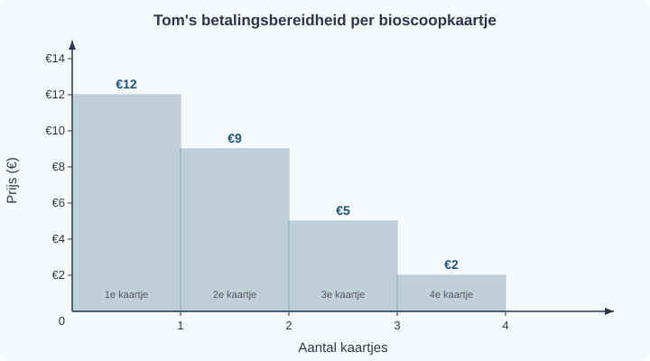
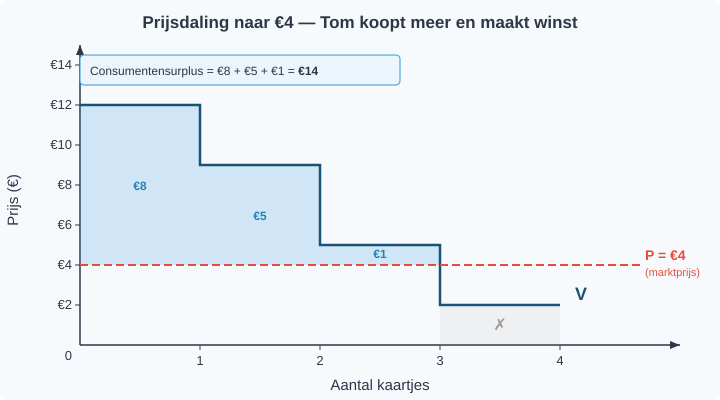
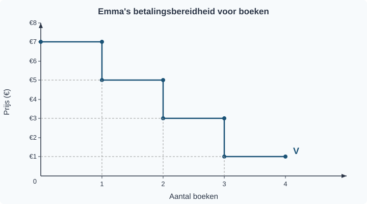

# 1.2.1 Individuele vraag

## Hoe beslis je hoeveel je koopt?

Tom is gek op de bioscoop. Voor de eerste film van de week heeft hij alles over: hij zou best €12 willen betalen. Maar een tweede film dezelfde week? Dat is leuk, maar niet zo bijzonder meer — daar wil hij hooguit €9 voor betalen. Een derde film? €5, misschien. En een vierde? Die is alleen de moeite als hij bijna niets kost: €2 is zijn maximum.

Tom merkt iets op. Hoe meer films hij al gezien heeft, hoe minder hij bereid is te betalen voor de volgende. De eerste is het meest waard, elke volgende iets minder. Hoe komt dat? En hoe bepaalt Tom hoeveel kaartjes hij uiteindelijk koopt?

---

## Theorie

### Betalingsbereidheid

Het maximale bedrag dat een consument bereid is te betalen voor een extra eenheid van een goed, heet de **betalingsbereidheid**.

> **Definitie: Betalingsbereidheid**
> Het maximale bedrag dat een consument wil betalen voor één extra eenheid van een goed.

Tom's betalingsbereidheid per bioscoopkaartje:

| Kaartje | Betalingsbereidheid |
|---------|-------------------|
| 1e      | €12               |
| 2e      | €9                |
| 3e      | €5                |
| 4e      | €2                |

De betalingsbereidheid daalt bij elk volgend kaartje. Dit is logisch: hoe meer je al hebt van iets, hoe minder waarde je hecht aan nóg een eenheid. Economen noemen dit *afnemend grensnut*.

We tekenen Tom's betalingsbereidheid in een grafiek. Op de verticale as staat de prijs (in euro's), op de horizontale as het aantal kaartjes. Elke balk toont hoeveel Tom bereid is te betalen voor dat specifieke kaartje.

---

### De individuele vraaglijn

We kunnen deze gegevens ook als een **trapfunctie** tekenen: horizontale lijnen op de hoogte van de betalingsbereidheid, met een sprong omlaag bij elk volgend kaartje. Dat levert Tom's *individuele vraaglijn* op.

> **Definitie: Individuele vraaglijn**
> Een grafiek die laat zien hoeveel eenheden één consument wil kopen bij elke prijs, **terwijl alle andere omstandigheden gelijk blijven** (ceteris paribus).

De vraaglijn (V) loopt van linksboven naar rechtsonder. Bij een hoge prijs koopt Tom weinig; bij een lage prijs koopt hij meer. De trappen worden kleiner naarmate de betalingsbereidheid daalt.

---

### De koopbeslissing

Hoe beslist Tom hoeveel kaartjes hij koopt? Hij vergelijkt zijn betalingsbereidheid met de **marktprijs** — de prijs die de bioscoop vraagt.

**De regel is simpel:** koop zolang je betalingsbereidheid groter is dan of gelijk is aan de marktprijs.

Stel: de marktprijs is €7. Tom vergelijkt:

| Kaartje | Betalingsbereidheid | Marktprijs | Beslissing |
|---------|-------------------|------------|------------|
| 1e      | €12               | €7         | Kopen (€12 ≥ €7) ✓ |
| 2e      | €9                | €7         | Kopen (€9 ≥ €7) ✓ |
| 3e      | €5                | €7         | Niet kopen (€5 < €7) ✗ |
| 4e      | €2                | €7         | Niet kopen (€2 < €7) ✗ |

Tom koopt 2 kaartjes. Figuur 3 laat dit zien: de groene vlakken zijn de kaartjes die hij koopt (betalingsbereidheid boven de prijslijn), de grijze zijn de kaartjes die hij niet koopt.

---

### Wat als de prijs daalt?

Stel dat de bioscoop een actie houdt: alle kaartjes kosten nu €4. Tom vergelijkt opnieuw:

- 1e kaartje: €12 ≥ €4 → kopen ✓
- 2e kaartje: €9 ≥ €4 → kopen ✓
- 3e kaartje: €5 ≥ €4 → kopen ✓
- 4e kaartje: €2 < €4 → niet kopen ✗

Tom koopt nu 3 kaartjes in plaats van 2. Bij een lagere prijs koopt hij meer. Dit is de **wet van de vraag**.

> **Definitie: Wet van de vraag**
> Bij een hogere prijs is de gevraagde hoeveelheid kleiner; bij een lagere prijs is de gevraagde hoeveelheid groter — *ceteris paribus* (alle andere omstandigheden gelijk).

---

### Consumentensurplus

Bij de actieprijs van €4 betaalt Tom €4 per kaartje, maar voor het eerste kaartje was hij bereid €12 te betalen. Hij betaalt €8 minder dan zijn maximum. Die €8 is zijn *winst* op dat kaartje: zijn **consumentensurplus**.

> **Definitie: Consumentensurplus**
> Het verschil tussen de betalingsbereidheid en de werkelijk betaalde prijs, per eenheid.
>
> Consumentensurplus per eenheid = betalingsbereidheid − marktprijs

Tom's consumentensurplus bij P = €4:

| Kaartje | Betalingsbereidheid | Betaald | Surplus |
|---------|-------------------|---------|---------|
| 1e      | €12               | €4      | €8      |
| 2e      | €9                | €4      | €5      |
| 3e      | €5                | €4      | €1      |
| **Totaal** | | | **€14** |

In figuur 4 zie je het consumentensurplus als de blauwe vlakken boven de prijslijn en onder de trappen van de vraaglijn.

---

### Van trapfunctie naar vloeiende vraaglijn

Tom's vraaglijn is een trapfunctie, want bioscoopkaartjes zijn gehele eenheden — je koopt 1, 2 of 3 kaartjes, niet 1,7 kaartje.

Maar veel goederen zijn *deelbaar*: liters melk, kilo's appels, minuten beltegoed. En als je de vraag van heel veel consumenten samenneemt (dat leer je in §1.2.3), verdwijnen de trappen. Dan ontstaat een vloeiende, rechte vraaglijn die je kunt beschrijven met een formule:

Q*v* = −*a*P + *b*

Hierin is Q*v* de gevraagde hoeveelheid, P de prijs, *a* een positief getal (de helling), en *b* het snijpunt met de Q-as.

Of de vraaglijn nu trappen heeft of vloeiend is: hij loopt altijd van linksboven naar rechtsonder. Dat is de wet van de vraag in beeld.

---

### Ceteris paribus — de kleine lettertjes

De vraaglijn toont het verband tussen prijs en gevraagde hoeveelheid *terwijl alle andere omstandigheden gelijk blijven*. Dit heet **ceteris paribus** (Latijn voor "het overige gelijk"). De vraaglijn gaat er dus van uit dat het inkomen van de consument, zijn voorkeuren, de prijzen van andere goederen, en zijn verwachtingen niet veranderen.

Wat gebeurt er als die andere factoren wél veranderen? Dat is het onderwerp van §1.2.2.

Figuur 6 vat de kernbegrippen van deze paragraaf samen.

---

## Uitgewerkt voorbeeld

> **Karin en de ijsjes**
>
> Karin is op het strand. Ze overweegt hoeveel ijsjes ze koopt.
> Haar betalingsbereidheid: €4 voor het eerste ijsje, €3 voor het tweede, €2 voor het derde, €0,50 voor het vierde.

**(a)** De marktprijs is €2,50 per ijsje. Hoeveel ijsjes koopt Karin?

*Stap 1: Vergelijk de betalingsbereidheid met de marktprijs voor elk ijsje.*

| Ijsje | Betalingsbereidheid | Marktprijs | Beslissing |
|-------|-------------------|------------|------------|
| 1e    | €4                | €2,50      | Kopen (€4 ≥ €2,50) ✓ |
| 2e    | €3                | €2,50      | Kopen (€3 ≥ €2,50) ✓ |
| 3e    | €2                | €2,50      | Niet kopen (€2 < €2,50) ✗ |
| 4e    | €0,50             | €2,50      | Niet kopen (€0,50 < €2,50) ✗ |

*Antwoord:* Karin koopt **2 ijsjes**.

**(b)** Bereken het totale consumentensurplus van Karin.

*Stap 2: Trek de marktprijs af van de betalingsbereidheid voor elk gekocht ijsje.*

- Ijsje 1: €4 − €2,50 = €1,50
- Ijsje 2: €3 − €2,50 = €0,50
- Totaal: €1,50 + €0,50 = **€2**

**(c)** Waarom koopt Karin het derde ijsje niet?

*Antwoord:* Haar betalingsbereidheid voor het derde ijsje is €2, maar de marktprijs is €2,50. Ze zou meer betalen dan het haar waard is. Het consumentensurplus zou negatief zijn (€2 − €2,50 = −€0,50), dus kopen is onvoordelig.

---

> **Samenvatting §1.2.1**
> - De **betalingsbereidheid** is het maximale bedrag dat een consument wil betalen voor één extra eenheid van een goed.
> - De **individuele vraaglijn** toont het verband tussen prijs en gevraagde hoeveelheid voor één consument. De vraaglijn loopt altijd van linksboven naar rechtsonder.
> - **Koopbeslissing:** een consument koopt zolang zijn betalingsbereidheid groter is dan of gelijk is aan de marktprijs.
> - Het **consumentensurplus** is het verschil tussen de betalingsbereidheid en de werkelijk betaalde prijs. Hoe lager de marktprijs, hoe groter het consumentensurplus.
> - De vraaglijn geldt onder de voorwaarde **ceteris paribus** — alle andere omstandigheden gelijk. Bij deelbare goederen wordt de vraaglijn een vloeiende lijn: Q*v* = −*a*P + *b*.
> - *In §1.2.2 leer je welke factoren de hele vraaglijn kunnen verschuiven — en waarom dat iets anders is dan een beweging langs de lijn.*

> **💡 Vastgelopen op een opgave?**
> Op de website vind je bij elke opgave een **begeleide inoefening**: stap voor stap krijg je extra hints en tussenstappen. Klik op de opgave om de begeleiding te starten.

---

## Opgaven

### Startoefeningen

**Opgave 1** *(lees de grafiek — zie figuur 7)*

In figuur 7 zie je de individuele vraaglijn van Emma voor boeken.

a) Wat is Emma's betalingsbereidheid voor het derde boek? Lees dit af uit de grafiek.

b) De marktprijs van een boek is €4. Hoeveel boeken koopt Emma? Leg uit hoe je dit uit de grafiek kunt aflezen.

c) Emma's vriendin zegt: "Bij €6 koopt Emma 2 boeken." Klopt dit? Leg uit.

**Opgave 2** *(teken de grafiek — zie figuur 8)*

Jasper wil concertkaartjes kopen. Zijn betalingsbereidheid:

| Kaartje | Betalingsbereidheid |
|---------|-------------------|
| 1e      | €10               |
| 2e      | €7                |
| 3e      | €4                |
| 4e      | €1                |

a) Teken Jasper's individuele vraaglijn als trapfunctie in het assenstelsel van figuur 8 (prijs op de y-as, hoeveelheid op de x-as).

b) De marktprijs is €6. Hoeveel kaartjes koopt Jasper? Laat zien hoe je dit uit je grafiek afleest.

c) Bereken het totale consumentensurplus van Jasper bij een marktprijs van €6.

**Opgave 3** *(consumentensurplus berekenen)*

Gebruik de grafiek van Emma uit opgave 1 (figuur 7).

a) De marktprijs van een boek is €2. Hoeveel boeken koopt Emma?

b) Bereken het consumentensurplus per boek en het totale consumentensurplus.

c) De prijs stijgt naar €6. Hoeveel boeken koopt Emma nu? Bereken het nieuwe consumentensurplus. Leg uit waarom het consumentensurplus is veranderd.

---

### Zelfstandige oefening

**Opgave 4**

Mila overweegt hoeveel tijdschriften ze koopt. Haar betalingsbereidheid per tijdschrift: €8 voor het eerste, €6 voor het tweede, €3 voor het derde, €1 voor het vierde.

a) Maak een tabel met de betalingsbereidheid per tijdschrift.

b) Teken de individuele vraaglijn van Mila als trapfunctie (prijs op de y-as, hoeveelheid op de x-as).

c) De marktprijs is €5. Hoeveel tijdschriften koopt Mila? Leg je antwoord uit met behulp van de koopbeslissing.

d) Bereken het totale consumentensurplus bij een marktprijs van €5.

e) De prijs daalt naar €2. Hoeveel tijdschriften koopt ze nu? Bereken het nieuwe consumentensurplus.

**Opgave 5**

De individuele vraaglijn van een consument wordt beschreven door de formule:

Q*v* = −5P + 20

Hierin is Q*v* de gevraagde hoeveelheid en P de prijs in euro's.

a) Bereken de gevraagde hoeveelheid bij P = €1, P = €2 en P = €3. Zet de resultaten in een tabel.

b) Bij welke prijs wordt de gevraagde hoeveelheid precies 0? Wat betekent dit economisch?

c) De marktprijs is €2. Hoeveel eenheden koopt deze consument?

d) Teken de vraaglijn in een assenstelsel (prijs op de y-as, hoeveelheid op de x-as). Gebruik de drie punten uit deelvraag a en het punt uit deelvraag b.

---

### Herhaling (interleaving)

**Opgave 6** *(herhaling §1.1.2: procentuele verandering)*

Een bioscoopkaartje kostte vorig jaar €9. Dit jaar is de prijs gestegen naar €10,80.

a) Bereken de procentuele prijsstijging.

b) Volgend jaar verwacht de bioscoop een verdere stijging van 5%. Bereken de verwachte prijs volgend jaar.

**Opgave 7** *(herhaling §1.1.3: tabel en grafiek)*

In onderstaande tabel staat de gevraagde hoeveelheid broodjes bij verschillende prijzen.

| Prijs (€) | Gevraagde hoeveelheid |
|---|---|
| 1 | 10 |
| 2 | 8 |
| 3 | 6 |
| 4 | 4 |
| 5 | 2 |

a) Teken de vraaglijn in een assenstelsel (prijs op de y-as, hoeveelheid op de x-as).

b) Lees uit de grafiek af: hoeveel broodjes worden er gevraagd bij een prijs van €2,50?

c) Bij welke prijs is de gevraagde hoeveelheid precies 0?

---

### Doeloefening

**Opgave 8**

Lisa is dol op pizza. Haar betalingsbereidheid: €8 voor de eerste pizza, €6 voor de tweede, €4 voor de derde en €1,50 voor de vierde.

a) Teken Lisa's individuele vraaglijn als trapfunctie. Zet de prijs op de verticale as en het aantal pizza's op de horizontale as.

b) De marktprijs is €5. Hoeveel pizza's koopt Lisa? Verklaar je antwoord met behulp van het begrip betalingsbereidheid.

c) De prijs daalt naar €3. Hoeveel pizza's koopt Lisa nu?

d) Leg in eigen woorden uit waarom de vraaglijn van linksboven naar rechtsonder loopt.

---

### Denkertje *(bonusopgave)*

**Opgave 9**

Tom en zijn vriend Max gaan allebei naar dezelfde bioscoop. Tom is bereid €12 te betalen voor het eerste kaartje, Max slechts €6.

a) Noem twee mogelijke redenen waarom Tom een hogere betalingsbereidheid heeft dan Max.

b) Als het inkomen van Max stijgt, verwacht je dan dat zijn betalingsbereidheid verandert? Leg uit. *(Denk alvast na: wat zou dit betekenen voor zijn vraaglijn?)*
