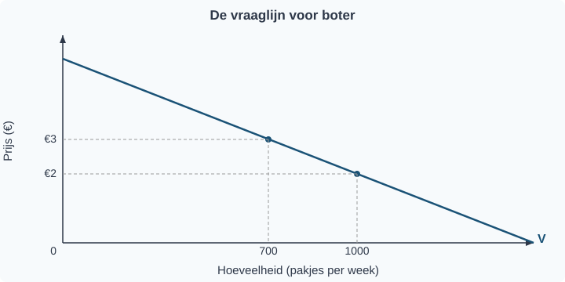
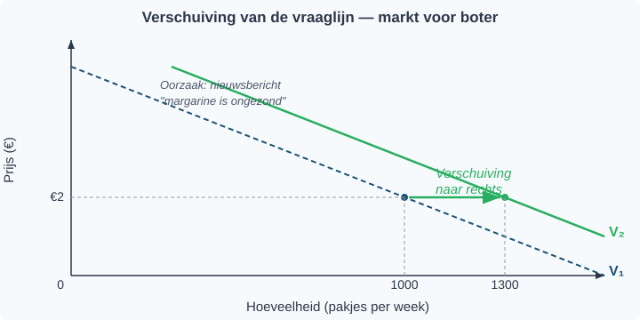

# 1.2.2 Vraagfactoren

## Boter zonder prijsverandering — toch koopt iedereen ineens meer

Stel: in de supermarkt stijgt de prijs van boter van €2 naar €3. Veel klanten kopen minder boter. Logisch — je kent dat al uit §1.2.1: bij een hogere prijs daalt de gevraagde hoeveelheid.

Maar nu gebeurt er iets anders. De prijs van boter blijft €2, maar op het journaal vertellen wetenschappers dat margarine ongezond is. De volgende week koopt iedereen ineens méér boter — terwijl de prijs niet veranderd is.

Hoe kan dat? De vraaglijn uit §1.2.1 laat zien hoeveel consumenten willen kopen bij elke prijs — *zolang alle andere omstandigheden gelijk blijven*. Die kleine voorwaarde "*ceteris paribus*" is cruciaal. Zodra een andere factor verandert (inkomen, voorkeuren, prijs van een ander goed, …), klopt de oude vraaglijn niet meer en moet je hem opnieuw tekenen.

De prijs bepaalt dus *waar* je zit op de vraaglijn. Maar andere factoren bepalen *waar de hele lijn ligt*. In deze paragraaf leer je dat verschil — en waarom het de meest gemaakte fout in de economie is.

---

## Theorie

### De vraaglijn als startpunt

> **📋 Herhaling uit §1.2.1**
> De vraaglijn (V) laat het verband zien tussen de prijs en de gevraagde hoeveelheid, **terwijl alle andere omstandigheden gelijk blijven**. De lijn loopt van linksboven naar rechtsonder: hoe lager de prijs, hoe groter de gevraagde hoeveelheid. Dit heet de *vraagwet*.

We beginnen met de vraaglijn uit §1.2.1. Op de verticale as staat de prijs (P), op de horizontale as de gevraagde hoeveelheid (Q).

Bij een prijs van €2 is de gevraagde hoeveelheid 1000 pakjes boter per week. Bij €3 is dat 700 pakjes.

---

### Beweging langs de vraaglijn

Wat gebeurt er als de prijs van boter stijgt van €2 naar €3? Je schuift *langs* de vraaglijn omhoog: van punt A naar punt B. De gevraagde hoeveelheid daalt van 1000 naar 700.

Dit heet een **beweging langs de vraaglijn**. De lijn zelf verandert niet. Je verplaatst je alleen naar een ander punt op dezelfde lijn.

**Oorzaak:** een verandering van de prijs van het goed zelf.

Let op de pijl in figuur 2: die loopt *langs* de bestaande lijn. De lijn verschuift niet.

---

### Verschuiving van de vraaglijn

Nu het tweede geval. De prijs van boter blijft €2. Maar er komt een nieuwsbericht dat margarine ongezond is. Consumenten willen nu bij *elke* prijs meer boter dan voorheen.

Bij €2 kopen ze geen 1000, maar 1300 pakjes. Bij €3 geen 700, maar 1000 pakjes. Elk punt op de lijn schuift naar rechts. Er ontstaat een nieuwe vraaglijn (V₂), rechts van de oude (V₁).

Dit heet een **verschuiving van de vraaglijn**. De hele lijn verplaatst.

**Oorzaak:** een verandering van een andere factor dan de prijs van het goed zelf.

De horizontale pijl in figuur 3 laat zien dat de hele lijn opschuift. Bij dezelfde prijs is de gevraagde hoeveelheid groter geworden.

> **⚠️ Let op — veelgemaakte fout**
> Veel leerlingen verwarren een *verschuiving van* de vraaglijn met een *beweging langs* de vraaglijn.
> - Verandering van de prijs van het goed zelf → **beweging LANGS** de lijn.
> - Verandering van inkomen, voorkeuren of andere factoren → **verschuiving VAN** de lijn.

---

### Vraagfactoren: wat verschuift de vraaglijn?

De factoren die de hele vraaglijn verschuiven, heten **vraagfactoren**. Er zijn er vijf:

> **Definitie: Vraagfactoren**
> Factoren die de positie van de vraaglijn bepalen. Een verandering van een vraagfactor verschuift de hele vraaglijn naar links of naar rechts.

**1. Inkomen van de consument**

Als het inkomen stijgt, kopen consumenten meestal meer van een goed. De vraaglijn verschuift naar rechts. Zo'n goed heet een *normaal goed*.

> **Definitie: Normaal goed**
> Een goed waarvan de vraag stijgt als het inkomen stijgt.
> Voorbeelden: restaurantbezoek, merkkleding, vliegvakanties.

Maar soms werkt het andersom. Als het inkomen stijgt, kopen consumenten juist *minder* van een bepaald goed — ze stappen over op iets beters. Zo'n goed heet een *inferieur goed*.

> **Definitie: Inferieur goed**
> Een goed waarvan de vraag daalt als het inkomen stijgt.
> Voorbeelden: huismerkpasta, tweedehands kleding, instant noodles.

**2. Prijs van andere goederen — substituten**

Boter en margarine zijn *substitutiegoederen*: je kunt het ene vervangen door het andere. Als margarine duurder wordt, stappen consumenten over op boter. De vraag naar boter stijgt, de vraaglijn verschuift naar rechts.

> **Definitie: Substitutiegoederen (substituten)**
> Goederen die elkaar kunnen vervangen in gebruik.
> Kenmerk: als de prijs van het ene stijgt, stijgt de vraag naar het andere.
> Voorbeelden: boter en margarine, Coca-Cola en Pepsi, trein en auto.

**3. Prijs van andere goederen — complementen**

Brood en boter gebruik je samen. Als brood duurder wordt, koop je minder brood — en dus ook minder boter. De vraaglijn van boter verschuift naar links.

> **Definitie: Complementaire goederen (complementen)**
> Goederen die je samen gebruikt.
> Kenmerk: als de prijs van het ene stijgt, daalt de vraag naar het andere.
> Voorbeelden: brood en boter, printer en inkt, auto en benzine.

**4. Voorkeuren (preferenties)**

Smaak verandert. Een nieuwsbericht over gezondheid, een reclame, een trend op social media — het kan allemaal de voorkeuren beïnvloeden. Als consumenten een goed aantrekkelijker vinden, verschuift de vraaglijn naar rechts. Vinden ze het minder aantrekkelijk, dan naar links.

**5. Verwachtingen**

Als consumenten verwachten dat de prijs morgen stijgt, kopen ze vandaag alvast meer. De vraaglijn verschuift naar rechts. Verwachten ze een prijsdaling, dan wachten ze af — de vraaglijn verschuift naar links.

Figuur 5 vat de vijf vraagfactoren in één beeld samen. Onthoud: deze vijf factoren kunnen de hele lijn verschuiven. De prijs van het goed zelf staat er niet bij — die veroorzaakt een beweging *langs* de lijn, niet een verschuiving.

---

### Overzicht: beweging langs versus verschuiving van

Figuur 4 vat alles samen. De oorspronkelijke vraaglijn (V₁) kan naar rechts verschuiven (V₂ — vraagtoename) of naar links verschuiven (V₃ — vraagafname).

**Vraag neemt toe (verschuiving naar rechts):**
- Inkomen stijgt (normaal goed)
- Prijs van substituut stijgt
- Prijs van complement daalt
- Voorkeur voor het goed neemt toe
- Verwachte prijsstijging

**Vraag neemt af (verschuiving naar links):**
- Inkomen daalt (normaal goed) of inkomen stijgt (inferieur goed)
- Prijs van substituut daalt
- Prijs van complement stijgt
- Voorkeur voor het goed neemt af
- Verwachte prijsdaling

---

> **Samenvatting §1.2.2**
> - Een verandering van de prijs van het goed zelf veroorzaakt een **beweging langs** de vraaglijn.
> - Een verandering van een vraagfactor (inkomen, voorkeuren, prijs van substituten/complementen, verwachtingen) veroorzaakt een **verschuiving van** de vraaglijn.
> - Substituten zijn goederen die elkaar vervangen; complementen zijn goederen die je samen gebruikt.
> - Een normaal goed heeft een positief verband tussen inkomen en vraag; een inferieur goed een negatief verband.
> - *In §1.2.3 bekijken we de aanbodzijde van de markt: wie biedt er aan, en waarom loopt de aanbodlijn omhoog?*

> **💡 Vastgelopen op een opgave?**
> Op de website vind je bij elke opgave een **begeleide inoefening**: stap voor stap krijg je extra hints en tussenstappen. Klik op de opgave om de begeleiding te starten.

---

## Uitgewerkt voorbeeld

> **De markt voor fietsen**
>
> De markt voor fietsen is in evenwicht bij P = €500 en Q = 2000 fietsen per maand.

**(a)** De prijs van fietsen stijgt naar €600. Is dit een beweging langs of een verschuiving van de vraaglijn? Verklaar je antwoord.

*Antwoord:* Dit is een **beweging langs** de vraaglijn. De prijs van het goed zelf verandert (van €500 naar €600). Bij een hogere prijs is de gevraagde hoeveelheid kleiner. Je schuift langs de bestaande vraaglijn naar een punt linksboven.

**(b)** De prijs van fietsen blijft €500, maar de benzineprijs stijgt fors. Veel forensen stappen over op de fiets. Is dit een beweging langs of een verschuiving van de vraaglijn? Verklaar je antwoord.

*Antwoord:* Dit is een **verschuiving van** de vraaglijn naar rechts. De prijs van fietsen verandert niet, maar een andere vraagfactor wel: **de prijs van een substituut**. De auto is een substituut voor de fiets — beide brengen je van A naar B. Doordat autorijden duurder wordt (hogere benzineprijs), wordt de fiets relatief aantrekkelijker. Bij elke prijs willen consumenten nu meer fietsen kopen.

> ⚠️ Let op de juiste vraagfactor. Het is verleidelijk om te zeggen "de voorkeur voor fietsen is veranderd". Maar de voorkeur (smaak) is niet veranderd — alleen de relatieve prijs van het alternatief. De economisch precieze categorie is daarom *prijs van een substituut*.

**(c)** Leg in eigen woorden uit waarom auto en fiets substituten zijn — en wat dat zegt over hun vraagrelatie.

*Antwoord:* De auto en de fiets zijn **substituten** omdat ze dezelfde behoefte kunnen vervullen (woon-werkverkeer). Het kenmerk van substituten is: als de prijs van het ene stijgt, stijgt de vraag naar het andere. Dat zie je hier letterlijk gebeuren — autorijden wordt duurder, en de vraag naar fietsen schuift naar rechts.

---

## Opgaven

### Startoefeningen

**Opgave 1** *(lees de grafiek — zie figuur 6)*

In figuur 6 zie je twee veranderingen op de markt voor pizza. Beide situaties zijn al voor je getekend en gelabeld.

a) Beschrijf wat er in **Situatie 1** gebeurt: wat verandert er met de prijs en de gevraagde hoeveelheid? Welke factor zou dit veroorzaakt kunnen hebben?

b) Beschrijf wat er in **Situatie 2** gebeurt: wat verandert er met de prijs en de gevraagde hoeveelheid? Welke factor zou dit veroorzaakt kunnen hebben?

c) Leg in eigen woorden uit waarom Situatie 1 een *beweging langs* de vraaglijn is, en Situatie 2 een *verschuiving van* de vraaglijn.

**Opgave 2** *(teken in de grafiek — zie figuur 7)*

De markt voor smartphones is in evenwicht bij P = €600 en Q = 1.000 stuks per maand. In figuur 7 zie je de vraaglijn V₁ met evenwichtspunt E.

a) De prijs van smartphones stijgt naar €750. Laat in de grafiek zien wat er gebeurt. Is dit een verschuiving van de vraaglijn of een beweging langs de vraaglijn? Leg uit.

b) Het gemiddelde inkomen in Nederland stijgt. Smartphones zijn een normaal goed. Laat in de grafiek zien wat er gebeurt met de vraag naar smartphones. Is dit een verschuiving of een beweging? Leg uit.

c) De prijs van telefoonhoesjes (een complementair goed) stijgt fors. Wat verwacht je dat er gebeurt met de vraag naar smartphones? Leg uit of dit een verschuiving of een beweging is en geef de richting aan.

**Opgave 3**

De markt voor fietsen is in evenwicht. Er doen zich achtereenvolgens drie veranderingen voor. Beantwoord voor elke verandering de vragen. Er is geen grafiek bij deze opgave — beschrijf wat er in een grafiek zou gebeuren.

a) De fietsfabrikant geeft een seizoenskorting: de prijs van fietsen daalt van €500 naar €450.
- Verschuift de vraaglijn of beweeg je langs de vraaglijn?
- In welke richting?

b) De gemeente start een campagne "Fiets naar je werk". De prijs van fietsen blijft gelijk.
- Verschuift de vraaglijn of beweeg je langs de vraaglijn?
- In welke richting verschuift of beweegt de lijn?

c) Consumenten verwachten dat fietsen volgende maand 20% duurder worden.
- Wat gebeurt er nu met de vraag naar fietsen?
- Is dit een verschuiving of een beweging? Leg uit.

d) Noem bij elk van de drie situaties (a, b, c) welke vraagfactor verandert. Kies uit: eigen prijs, voorkeur, prijs substituten/complementen, inkomen, verwachtingen.

**Opgave 4** *(twee veranderingen tegelijk — let goed op!)*

Op de koffiemarkt gebeuren twee dingen op dezelfde dag:

1. De prijs van koffie stijgt van €4 naar €5 per pak.
2. Tegelijk daalt de prijs van thee van €3 naar €2 per pak. Thee is een substituut voor koffie.

a) Bekijk eerst alleen verandering 1. Wat gebeurt er met de vraag naar koffie? Is dit een beweging langs of een verschuiving van de vraaglijn? In welke richting?

b) Bekijk nu alleen verandering 2. Wat gebeurt er met de vraag naar koffie? Is dit een beweging langs of een verschuiving van de vraaglijn? In welke richting?

c) Beide veranderingen gebeuren tegelijkertijd. Beschrijf het netto-effect op de gevraagde hoeveelheid koffie. Versterken de twee effecten elkaar of werken ze tegen elkaar in?

d) Een leerling zegt: "De prijs van koffie verandert *en* de prijs van thee verandert, dus alles is een beweging langs de vraaglijn van koffie." Leg uit waarom dit niet klopt.

---

### Zelfstandige oefening

**Opgave 5**

De markt voor bioscoopkaartjes is in evenwicht bij P = €12 en Q = 5.000 kaartjes per week.

a) Geef vier factoren die de vraaglijn naar bioscoopkaartjes kunnen laten verschuiven (niet: de eigen prijs).

b) Leg voor elk van de vier factoren uit of de vraaglijn naar rechts of naar links verschuift. Geef bij elke factor een concreet voorbeeld.

c) Netflix verlaagt de abonnementsprijs van €13 naar €8 per maand. Netflix is een substituut voor de bioscoop. Teken een vraaglijn voor bioscoopkaartjes en laat zien wat er gebeurt. Is dit een verschuiving of een beweging? Leg uit.

d) Na de prijsverlaging van Netflix besluit de bioscoop ook de prijs te verlagen, van €12 naar €9 per kaartje. Teken in dezelfde grafiek wat er nu gebeurt met de gevraagde hoeveelheid. Is dit een verschuiving of een beweging?

**Opgave 6**

Hieronder staan zes situaties op de markt voor concertkaartjes. Vul de tabel in: bepaal voor elke situatie of het om een beweging of een verschuiving gaat, welke richting, en welke vraagfactor de oorzaak is.

| | Situatie | Beweging of verschuiving? | Richting | Vraagfactor |
|---|---|---|---|---|
| a | De ticketprijs stijgt van €45 naar €60. |  |  |  |
| b | Het besteedbaar inkomen van jongeren daalt door stijgende huurprijzen. Concertbezoek is een normaal goed. |  |  |  |
| c | Spotify brengt live-concertstreams uit (een substituut). |  |  |  |
| d | Een populaire artiest kondigt aan volgend jaar te stoppen met optreden. |  |  |  |
| e | De prijs van treinkaartjes naar concertlocaties (een complementair goed) verdubbelt. |  |  |  |
| f | Een virale TikTok-trend maakt live concerten weer populair onder jongeren. |  |  |  |

---

### Herhaling (interleaving)

**Opgave 7** *(herhaling §1.1.2: procentuele verandering)*

De prijs van een brood stijgt van €2,50 naar €2,80.

a) Bereken de procentuele prijsstijging.

b) Het jaar daarna stijgt de prijs met nog eens 6%. Bereken de nieuwe prijs.

**Opgave 8** *(herhaling §1.1.3: grafiek aflezen)*

In onderstaande tabel staat de gevraagde hoeveelheid paraplu's bij verschillende prijzen.

| Prijs (€) | Gevraagde hoeveelheid |
|---|---|
| 5 | 800 |
| 10 | 600 |
| 15 | 400 |
| 20 | 200 |

a) Teken de vraaglijn in een assenstelsel (prijs op de y-as, hoeveelheid op de x-as).

b) Lees af: hoeveel paraplu's worden er gevraagd bij een prijs van €12,50? (Gebruik interpolatie.)

**Opgave 9** *(herhaling §1.2.1: betalingsbereidheid en individuele vraag)*

Sanne wil een tweedehands boek kopen. Haar maximale betalingsbereidheid is €15.

a) Het boek kost €12. Bereken het consumentensurplus van Sanne.

b) De prijs stijgt naar €16. Koopt Sanne het boek? Leg uit met het begrip betalingsbereidheid.

---

### Doeloefening

**Opgave 10**

De markt voor boter is in evenwicht bij P = €2 en Q = 1.000 stuks.

a) De prijs van boter stijgt naar €2,50. Laat in een grafiek zien wat er gebeurt met de gevraagde hoeveelheid. Is dit een verschuiving van de vraaglijn of een beweging langs de vraaglijn?

b) Een gezondheidsrapport stelt dat margarine ongezond is. Laat in een grafiek zien wat er gebeurt met de vraag naar boter. Is dit een verschuiving of een beweging?

c) Het gemiddelde inkomen in het land stijgt met 5%. Boter is een normaal goed. Laat het effect op de vraaglijn zien.

d) Noem vier factoren die de vraaglijn doen verschuiven en geef bij elke factor een voorbeeld.

---

### Denkertje *(bonusopgave)*

**Opgave 11**

De overheid wil dat mensen minder suikerhoudende frisdrank drinken en overweegt twee maatregelen:

- **Maatregel A:** Een accijns (belasting) op frisdrank, waardoor de prijs met 25% stijgt.
- **Maatregel B:** Een grote voorlichtingscampagne over de gezondheidsrisico's van suiker.

a) Leg met behulp van het verschil tussen een verschuiving van en een beweging langs de vraaglijn uit hoe beide maatregelen de gevraagde hoeveelheid frisdrank beïnvloeden.

b) Een criticus stelt: "Maatregel A werkt alleen zolang de belasting er is. Maatregel B verandert het gedrag blijvend." Beoordeel deze stelling. Gebruik economische argumenten en betrek het begrip 'substituten' in je antwoord.
