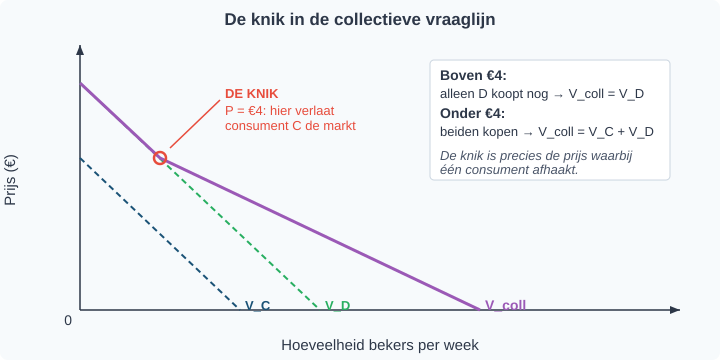

# 1.2.3 Van individuele naar collectieve vraag

## Hoeveel limonade verkoopt het schoolfeest?

Stel je voor: je verkoopt limonade op het schoolfeest. Er staan 200 dorstige leerlingen voor je tafel. Je weet ongeveer hoeveel sommige leerlingen willen betalen. Anna geeft maximaal €4 per beker uit en koopt steeds meer naarmate de prijs lager is. Ben is iets dorstiger en koopt zelfs bij €3 nog twee bekers.

Maar het schoolfeest moet weten: hoeveel bekers limonade kunnen we in totáál verkopen bij elke prijs? Die vraag gaat niet over één leerling — die gaat over alle leerlingen samen. Je hebt een **marktvraag** nodig, geen individuele vraag.

In §1.2.1 leerde je hoe je de vraaglijn van één consument tekent. In §1.2.2 leerde je wanneer die lijn verschuift of niet. In deze paragraaf leer je hoe je de individuele vraaglijnen van álle consumenten op de markt samenvoegt tot één collectieve vraaglijn.

---

## Theorie

### Wat is collectieve vraag?

> **📋 Herhaling uit §1.2.1 en §1.2.2**
> Een individuele vraaglijn laat zien hoeveel één consument wil kopen bij elke prijs, **terwijl alle andere omstandigheden gelijk blijven**. De prijs van het goed zelf veroorzaakt een beweging *langs* de lijn; andere factoren (inkomen, voorkeur, prijs van substituten/complementen, verwachtingen) verschuiven de hele lijn.

Op een echte markt is er bijna nooit één consument. Een markt bestaat uit veel consumenten die elk hun eigen vraaglijn hebben. De **collectieve vraag** (ook wel marktvraag genoemd) is de optelsom van al die individuele vraaglijnen.

> **Definitie: Collectieve vraag (marktvraag)**
> De totale hoeveelheid die alle consumenten samen willen kopen bij elke prijs. Je krijgt de collectieve vraaglijn door bij elke prijs de individuele gevraagde hoeveelheden bij elkaar op te tellen.

Het belangrijkste woord in deze definitie is *bij elke prijs*. Je tilt niet de hele lijnen op elkaar, en je telt de prijzen niet op. Je kiest een prijs, leest af hoeveel elke consument bij die prijs wil kopen, en telt die hoeveelheden op.

---

### Stap 1 — De individuele vraaglijnen

We gaan dit oefenen met twee consumenten op de limonademarkt: Anna en Ben. Anna's vraaglijn ziet er zo uit:


Bij €3 wil Anna 1 beker. Bij €2 wil ze er 3. Bij €1 zelfs 5. Bij **€3,50** wordt haar vraag precies nul — vanaf die prijs koopt ze niks meer.

Ben heeft een aparte vraaglijn:


Ben is wat dorstiger. Bij €3 wil hij al 2 bekers; bij €2 zelfs 5; bij €1 maar liefst 8.

---

### Stap 2 — Allebei op dezelfde assen

Om de collectieve vraag te bouwen, leggen we de twee vraaglijnen op één en hetzelfde assenstelsel. Zo kun je bij elke prijs aflezen hoeveel elke consument wil.


Bij €2 wil Anna 3 bekers en Ben 5. Samen vragen ze 3 + 5 = 8 bekers limonade. Dit is precies wat we willen weten — *bij elke prijs* hoeveel willen ze samen.

We kunnen hetzelfde voor élke prijs doen. Het resultaat zetten we in een tabel:

| Prijs (€) | Q_Anna | Q_Ben | Q_collectief |
|---|---|---|---|
| 1 | 5 | 8 | **13** |
| 2 | 3 | 5 | **8** |
| 3 | 1 | 2 | **3** |
| 3,50 | 0 | 0,5 | **0,5** |

Zo zie je dezelfde informatie nu in drie vormen tegelijk: in de woorden hierboven, in de twee grafieken (figuur 1, 2 en 3), én in deze tabel. Drie kanalen, dezelfde inhoud — dat helpt om het idee echt vast te houden.

---

### Stap 3 — Horizontaal optellen

Wanneer je voor *elke* prijs de individuele hoeveelheden optelt, krijg je de **collectieve vraaglijn**. Dit heet **horizontaal optellen** omdat je telkens op dezelfde *horizontale* hoogte (dezelfde prijs op de y-as) de hoeveelheden bij elkaar optelt.


Bij €2 zie je het meteen: het rode punt van Anna staat op Q = 3, het groene punt van Ben op Q = 5, en het paarse collectieve punt op Q = 8. Bij elke andere prijs gaat het precies zo.

> **⚠️ Let op — veelgemaakte fout**
> Veel leerlingen tellen *verticaal* in plaats van *horizontaal*. Ze leggen de twee lijnen boven elkaar en tellen de prijzen op. Dat is fout.
> - **Goed:** kies een prijs → lees Q_Anna en Q_Ben af → tel die Q's op → één punt op V_collectief.
> - **Fout:** kies een Q → tel de prijzen op. Prijzen tel je nooit op; ze zijn voor iedereen op de markt hetzelfde.

---

### De algebraïsche methode

De tabelmethode hierboven werkt altijd, maar als je de individuele vraagfuncties als formule kent, kun je ook **algebraïsch** optellen. Het is precies hetzelfde idee — bij dezelfde prijs de hoeveelheden optellen — maar dan in één rekenstap voor alle prijzen tegelijk in plaats van rij voor rij.

Stel: Anna's vraagfunctie is `Q_Anna = -2P + 7` en Ben's is `Q_Ben = -3P + 11`. **Zolang Anna én Ben allebei nog kopen** krijg je de collectieve vraagfunctie door beide formules op te tellen:

> **Formule: Collectieve vraagfunctie (zolang beide kopen)**
> `Q_collectief = Q_Anna + Q_Ben = (-2P + 7) + (-3P + 11) = -5P + 18`
>
> Geldig voor 0 ≤ P ≤ €3,50 (de prijs waarbij Anna afhaakt).

Test even: bij P = 2 geldt Q_collectief = -5·2 + 18 = 8. Dat klopt met wat we in figuur 4 aflazen.

**Belangrijk**: je telt de Q's op, niet de P's. De prijs P is in beide functies dezelfde variabele — die laat je staan. En let op die geldigheidsgrens: zodra één van de twee consumenten afhaakt, klopt deze formule niet meer en moet je opnieuw optellen, alleen met de overgebleven kopers.

---

### De knik in de collectieve vraaglijn

Wat gebeurt er als de prijs zo hoog wordt dat één consument afhaakt? Boven die prijs verdwijnt zijn bijdrage aan de collectieve vraag — alleen de andere consument(en) blijven over. Daardoor krijgt de collectieve vraaglijn een **knik** op de prijs waarbij iemand de markt verlaat.



In figuur 5 zijn er twee consumenten C en D. Boven €4 koopt C niks meer; alleen D blijft over. **Onder** €4 kopen beiden, en daar loopt de collectieve lijn juist *minder steil* (vlakker) — want elke prijsdaling van €1 levert nu twee consumenten extra hoeveelheid in plaats van één. **Boven** €4 is de lijn *steiler* omdat een prijsverandering nog maar één consument raakt.

> **De vuistregel voor de helling**
> Hoe meer consumenten actief zijn op de markt, hoe **vlakker** de collectieve vraaglijn wordt. Elke extra koper voegt aan elke prijsdaling extra hoeveelheid toe, dus de lijn beweegt sneller naar rechts. Boven een knik (waar één consument is afgehaakt) wordt de lijn altijd *steiler*.

**Toegepast op Anna en Ben**: Anna haakt af bij €3,50; Ben bij €11/3 ≈ €3,67. Onder €3,50 kopen beiden, dus de collectieve vraaglijn is daar het vlakst. Tussen €3,50 en €3,67 koopt alleen Ben nog, dus de lijn wordt daar plotseling steiler. Boven €3,67 is de markt leeg.

> **Belangrijk inzicht**
> Een knik in een collectieve vraaglijn betekent altijd: hier is een consument de markt in- of uitgegaan. Hoe meer consumenten op de markt, hoe meer mogelijke knikpunten. In de praktijk zijn er duizenden consumenten — dan zie je geen scherpe knikken meer, maar één gladde lijn die er continu uitziet. Op individueel niveau zie je in figuur 1 nog losse punten omdat één persoon alleen hele bekers koopt; op collectief niveau (figuur 4) wordt het vanzelf glad omdat verschillende mensen bij een klein prijsverschil net wel of net niet meer kopen.

---

### Overzicht: twee methodes om de collectieve vraag te bepalen

Er zijn twee manieren om van individuele vraag naar collectieve vraag te komen. Welke je gebruikt, hangt af van wat je als input hebt: een tabel of een formule.


**Methode 1 (tabel):** geschikt als je een tabel met individuele hoeveelheden hebt. Tel per rij (per prijs) de Q's op.

**Methode 2 (algebra):** geschikt als je de vraagfuncties als formule hebt. Tel de functies bij elkaar op tot één formule voor Q_collectief.

Beide methodes geven hetzelfde antwoord — kies de methode die past bij de input die je krijgt.

---

## Uitgewerkt voorbeeld

> **De markt voor appels**
>
> Op een dorpsmarkt zijn maar twee kopers: Eva en Sam. Hun vraagfuncties zijn:
> - Eva: `Q_Eva = -P + 5`
> - Sam: `Q_Sam = -2P + 6`
>
> (Q in kilo, P in €)

**(a)** Maak een tabel met Q_Eva, Q_Sam en Q_collectief voor P = €1, €2 en €3.

*Antwoord:*

| P | Q_Eva | Q_Sam | Q_collectief |
|---|---|---|---|
| €1 | 5 − 1 = 4 | 6 − 2 = 4 | 4 + 4 = **8** |
| €2 | 5 − 2 = 3 | 6 − 4 = 2 | 3 + 2 = **5** |
| €3 | 5 − 3 = 2 | 6 − 6 = 0 | 2 + 0 = **2** |

*Stap voor stap*: voor elke prijs vul je beide functies in, je krijgt twee individuele Q's, en die tel je op. Méér is het niet.

**(b)** Bepaal de collectieve vraagfunctie algebraïsch.

*Antwoord:*

```
Q_collectief = Q_Eva + Q_Sam
            = (-P + 5) + (-2P + 6)
            = -3P + 11
```

*Check met de tabel*: bij P = 2 geldt Q_collectief = -3·2 + 11 = 5. Dat klopt met de tabel uit (a).

**(c)** Bij welke prijs verlaat Sam de markt? Wat gebeurt er met de collectieve vraagfunctie boven die prijs?

*Antwoord:* Sam's vraag is nul wanneer `-2P + 6 = 0`, dus bij **P = €3**. Boven €3 koopt Sam niets meer en bestaat de collectieve vraag alleen nog uit Eva. Boven €3 geldt dus:

`Q_collectief (boven €3) = Q_Eva = -P + 5`

De collectieve vraaglijn krijgt een knik op P = €3: onder die prijs is de lijn `-3P + 11`, boven die prijs `-P + 5`. Eva blijft kopen tot P = €5 (waar haar eigen vraag nul wordt).

---

> **Samenvatting §1.2.3**
> - De **collectieve vraag** is de optelsom van alle individuele vraaglijnen op een markt.
> - Je telt **horizontaal** op: bij elke prijs tel je de individuele Q's bij elkaar op. Prijzen tel je nooit op.
> - **Tabelmethode:** tel per rij (per prijs) de Q's. Werkt altijd, ook voor niet-lineaire vraag.
> - **Algebraïsche methode:** als je de individuele vraagfuncties hebt, tel je de Q-functies bij elkaar op. Een algebraïsche optelsom is altijd alleen geldig in het prijsbereik waarin álle individuele functies positief zijn.
> - De collectieve vraagfunctie is meestal **piecewise** (stuksgewijs): boven elke prijs waarbij iemand afhaakt geldt een andere formule. Elk knikpunt in de grafiek hoort bij zo'n grens.
> - Hoe meer consumenten actief zijn, hoe **vlakker** de collectieve vraaglijn (meer reactie op prijs).
> - *In §1.2.4 oefenen we alles wat we tot nu toe over vraag hebben geleerd in de oefenparagraaf van hoofdstuk 2.*

> **💡 Vastgelopen op een opgave?**
> Op de website vind je bij elke opgave een **begeleide inoefening**: stap voor stap krijg je extra hints en tussenstappen. Klik op de opgave om de begeleiding te starten.

---

## Opgaven

### Startoefeningen

**Opgave 1** *(lees de grafiek — zie figuur 7)*

In figuur 7 zie je de individuele vraaglijnen van Sara en Tim, en daarbij de collectieve vraaglijn V_coll. De drie punten bij P = €2 zijn al voor je ingetekend.


a) Lees uit de grafiek af: hoeveel ijsjes wil Sara bij €2? Hoeveel wil Tim bij €2? En hoeveel is dat samen?

b) Klopt dit met het paarse punt op V_coll bij P = €2? Leg uit waarom de horizontale optelling klopt.

c) Bekijk de knik in V_coll. Bij welke prijs ligt die? Welke consument is precies daar de markt uit gegaan?

**Opgave 2** *(teken in de grafiek — zie figuur 8)*

In figuur 8 zie je de individuele vraaglijnen van Lara (V_Lara) en Mo (V_Mo) op de markt voor broodjes. De collectieve vraaglijn is **nog niet getekend**.


a) Lees voor P = €4, €3, €2 en €1 de individuele hoeveelheden af en vul de tabel aan:

| P | Q_Lara | Q_Mo | Q_collectief |
|---|---|---|---|
| €4 |  |  |  |
| €3 |  |  |  |
| €2 |  |  |  |
| €1 |  |  |  |

b) Teken de collectieve vraaglijn V_coll in de grafiek door de punten uit (a) te verbinden.

c) Bij welke prijs gaat één van de twee consumenten de markt uit? Wat gebeurt er met V_coll boven die prijs?

**Opgave 3**

Op de markt voor croissants zijn maar drie consumenten met de volgende vraagfuncties (Q in stuks, P in €):

- `Q_Aïsha = -P + 6`
- `Q_Bram  = -2P + 8`
- `Q_Chen  = -P + 4`

a) Bereken voor elke consument hoeveel hij of zij bij P = €1 wil kopen.

b) Wat is de collectieve gevraagde hoeveelheid bij P = €1?

c) Leid de collectieve vraagfunctie algebraïsch af. Geldig voor welk prijsbereik?

d) Bij welke prijs verlaat de eerste consument de markt? Welke consument is dat? Wat wordt de collectieve vraagfunctie net boven die prijs?

**Opgave 4** *(let goed op — twee dingen veranderen tegelijk!)*

Op de markt voor frisdrank zijn er twee consumenten, Iris en Jeroen. Op één en dezelfde dag gebeurt het volgende:

1. Iris krijgt loonsverhoging. Frisdrank is voor haar een normaal goed.
2. Jeroen ontdekt dat hij allergisch is voor frisdrank en stopt helemaal met kopen.

a) Bekijk eerst alleen verandering 1. Wat gebeurt er met **V_Iris**? Beweging of verschuiving? In welke richting?

b) Bekijk nu alleen verandering 2. Wat gebeurt er met **V_Jeroen**? Beweging of verschuiving? In welke richting?

c) Wat gebeurt er met de **collectieve vraaglijn V_coll** door deze twee veranderingen samen? Versterken de twee effecten elkaar of werken ze tegen elkaar in? Leg uit.

d) Een leerling zegt: "Iris koopt meer en Jeroen koopt minder, dus de collectieve vraag verandert niet." Waarom is dat *bijna nooit* waar?

---

### Zelfstandige oefening

**Opgave 5**

Op een schoolmarkt zijn er vier consumenten met vraagfuncties (P in €, Q in stuks):

- `Q_1 = -P + 3`
- `Q_2 = -P + 4`
- `Q_3 = -2P + 6`
- `Q_4 = -P + 2`

a) Leid de collectieve vraagfunctie algebraïsch af voor het prijsbereik waarin alle vier kopen.

b) Bij welke prijs verlaat de eerste consument de markt? Wie is dat?

c) Schets ruwweg in een assenstelsel hoe de collectieve vraaglijn eruitziet. Geef minstens één knikpunt aan.

**Opgave 6**

Op een markt voor koffie zijn de vraagfuncties:

- `Q_groep_jong = -10P + 50`  (jongeren)
- `Q_groep_oud  = -5P + 40`   (volwassenen)

a) Bereken Q_collectief bij P = €2, €3 en €4.

b) Leid de collectieve vraagfunctie algebraïsch af.

c) Bij welke prijs verlaat de jongeren-groep de markt?

d) Wat is de collectieve vraagfunctie *boven* de prijs uit (c)?

---

### Herhaling (interleaving)

**Opgave 7** *(herhaling §1.2.2: vraagfactoren)*

De prijs van koffie blijft gelijk, maar het inkomen van koffieconsumenten daalt. Koffie is een normaal goed.

a) Wat gebeurt er met de individuele vraaglijn van elke koffieconsument: beweging of verschuiving? In welke richting?

b) Wat gebeurt er met de **collectieve** vraaglijn naar koffie? Leg uit waarom dit volgt uit jouw antwoord op (a).

**Opgave 8** *(herhaling §1.1.2: procentuele verandering)*

De collectieve vraag naar bioscoopkaartjes was 12.000 stuks per week. Na een prijsverlaging stijgt de collectieve vraag naar 13.800 stuks per week.

a) Bereken de procentuele toename van de gevraagde hoeveelheid.

b) De prijs daalde van €12 naar €10. Bereken de procentuele prijsdaling.

**Opgave 9** *(herhaling §1.1.3: tabel aflezen)*

De volgende tabel geeft de gevraagde hoeveelheden van twee groepen consumenten op een markt voor pizza:

| P (€) | Q_studenten | Q_werkenden |
|---|---|---|
| 6 | 200 | 800 |
| 8 | 100 | 600 |
| 10 | 0 | 400 |
| 12 | 0 | 200 |

a) Bereken Q_collectief voor elke prijs in de tabel.

b) Bij welke prijs verlaat de studenten-groep de markt?

c) Beschrijf in één zin wat er gebeurt met de collectieve vraagcurve op het prijsniveau uit (b).

---

### Doeloefening

**Opgave 10**

Op de markt voor limonade zijn er maar twee consumenten: Anna en Ben.

| Prijs (€) | Q_Anna | Q_Ben |
|---|---|---|
| 1 | 5 | 8 |
| 2 | 3 | 5 |
| 3 | 1 | 2 |
| 4 | 0 | 1 |

a) Bereken de collectieve vraag bij elke prijs.

b) Teken de individuele vraaglijnen en de collectieve vraaglijn in één assenstelsel.

c) Anna's vraagfunctie is `Q_Anna = -2P + 7`, Ben's is `Q_Ben = -3P + 11`. Leid de collectieve vraagfunctie algebraïsch af.

d) Bij welke prijs verlaat Anna de markt volledig? Wat gebeurt er met de collectieve vraaglijn op dat punt?

---

### Denkertje *(bonusopgave)*

**Opgave 11**

Een gemeente wil dat meer mensen openbaar vervoer (OV) gebruiken in plaats van de auto. De wethouder zegt: "We verlagen de prijs van een buskaartje en dan gaan álle inwoners méér met de bus, dus de collectieve vraag stijgt sterk."

a) Bekijk de redenering van de wethouder kritisch. Wat klopt er en wat klopt er niet aan deze uitspraak?

b) Leg uit, met behulp van de begrippen *individuele vraaglijn* en *collectieve vraaglijn*, waarom een prijsverlaging niet automatisch betekent dat álle inwoners méér gaan kopen.

c) Stel dat de gemeente óók een reclamecampagne start die het OV aantrekkelijker maakt. Wat is het verschil tussen het effect van de prijsverlaging en het effect van de campagne op de collectieve vraaglijn? Gebruik daarbij de begrippen *beweging langs* en *verschuiving van*.
