<div class="chapter-front">

<h1>Hoofdstuk 3 — Aanbod en kosten</h1>

<h2>Inhoud</h2>

<table>
<thead><tr><th>§</th><th>Onderwerp</th></tr></thead>
<tbody>
<tr><td>1.3.1</td><td>Aanbod</td></tr>
<tr><td>1.3.2</td><td>Kostenstructuren</td></tr>
<tr><td>1.3.3</td><td>Opbrengsten</td></tr>
<tr><td>1.3.4</td><td>Gemengde opgaven</td></tr>
</tbody>
</table>

<h2>Leerdoelen</h2>

<p>Na dit hoofdstuk kun je:</p>

<ul>
<li>Een aanbodlijn tekenen en interpreteren (stijgend verloop)</li>
<li>Aanbodfactoren benoemen en uitleggen: inputprijzen, technologie, aantal aanbieders, verwachtingen, overheidsbeleid</li>
<li>Het verschil uitleggen tussen een beweging langs de aanbodlijn en een verschuiving van de aanbodlijn</li>
<li>Verschuivingen van de aanbodlijn grafisch weergeven</li>
<li>Het verschil uitleggen tussen constante kosten (CK) en variabele kosten (VK)</li>
<li>TK, TCK en TVK berekenen</li>
<li>Gemiddelde kosten berekenen: GTK, GVK en GCK</li>
<li>Verklaren waarom GCK daalt bij toenemende productie (spreidingseffect)</li>
<li>TO en GO berekenen</li>
<li>Winst berekenen als TO − TK</li>
<li>Het break-evenpunt bepalen (algebraïsch en grafisch)</li>
</ul>

<h2>Wat kost het om brood te bakken?</h2>

<p>Een bakker verkoopt elke dag honderden broden. Maar hoeveel kost het eigenlijk om één brood te maken? En waarom wordt elk brood goedkoper als hij er meer bakt? In dit hoofdstuk leer je hoe producenten beslissen hoeveel ze aanbieden, welke kosten ze maken, en wanneer ze winst draaien. Je ontdekt dat sommige kosten altijd doorlopen — ook als de bakker geen enkel brood bakt — en dat het break-evenpunt bepaalt of de zaak rendabel is.</p>

</div>


<div style="break-before: page;"></div>

# 1.3.1 Aanbod

## Zonnepanelen op elk dak — maar waarom worden ze duurder?

Je ziet ze overal: zonnepanelen op daken van huizen, scholen en bedrijven. De productie van zonnepanelen is de afgelopen jaren enorm gegroeid. Fabrikanten investeren in nieuwe fabrieken, robots solderen de cellen steeds sneller, en de kosten per paneel dalen al jaren.

Maar in 2021 gebeurde iets vreemds. De prijs van silicium — de belangrijkste grondstof voor zonnepanelen — verdrievoudigde. Fabrikanten konden ineens minder panelen produceren tegen dezelfde kosten. Sommige kleinere producenten stopten helemaal. Het aanbod van zonnepanelen kromp.

Hoe kan het dat een verandering in de prijs van een grondstof het hele aanbod beïnvloedt — terwijl de prijs van het zonnepaneel zelf niet verandert? In deze paragraaf leer je het antwoord. Je leert de aanbodlijn tekenen, begrijpen waarom die omhoog loopt, en onderscheiden wanneer je *langs* de lijn beweegt en wanneer de hele lijn *verschuift*.

---

## Theorie

### De aanbodlijn als startpunt

> **📋 Herhaling uit §1.2.2**
> Bij de vraaglijn leerde je het verschil tussen een *beweging langs* de lijn (door een verandering van de eigen prijs) en een *verschuiving van* de lijn (door een verandering van een vraagfactor). De vraaglijn laat zien hoeveel consumenten willen kopen bij elke prijs, **terwijl alle andere omstandigheden gelijk blijven** (ceteris paribus). Ditzelfde principe geldt ook voor het aanbod.

De **aanbodlijn** laat het verband zien tussen de prijs van een goed en de aangeboden hoeveelheid, **terwijl alle andere omstandigheden gelijk blijven** (ceteris paribus).

Op de verticale as staat de prijs (P), op de horizontale as de aangeboden hoeveelheid (Q). We tekenen de aanbodlijn voor zonnepanelen. Bij een prijs van €200 per paneel bieden fabrikanten 400 panelen per maand aan. Bij een prijs van €400 bieden ze 800 panelen aan.


> **Definitie: Aanbodlijn (A)**
> De grafische weergave van het verband tussen de prijs en de aangeboden hoeveelheid, ceteris paribus. De aanbodlijn loopt van linksonder naar rechtsboven: hoe hoger de prijs, hoe groter de aangeboden hoeveelheid.

Waarom loopt de aanbodlijn omhoog? Bij een hogere prijs is het voor meer producenten rendabel om te produceren. Een fabrikant die bij €200 net geen winst maakt, kan bij €400 wél uit de kosten komen. Bovendien breiden bestaande producenten hun productie uit als de prijs stijgt. Dit heet de **wet van het aanbod**.

> **Definitie: Wet van het aanbod**
> Bij een hogere prijs is de aangeboden hoeveelheid groter, ceteris paribus. Bij een lagere prijs is de aangeboden hoeveelheid kleiner.

---

### Beweging langs de aanbodlijn

Wat gebeurt er als de prijs van zonnepanelen stijgt van €200 naar €400? Je schuift *langs* de aanbodlijn omhoog: van punt A naar punt B. De aangeboden hoeveelheid stijgt van 400 naar 800 panelen.

Dit heet een **beweging langs de aanbodlijn**. De lijn zelf verandert niet. Je verplaatst je alleen naar een ander punt op dezelfde lijn.

**Oorzaak:** een verandering van de prijs van het goed zelf.


Let op de pijl in figuur 2: die loopt *langs* de bestaande lijn. De lijn verschuift niet.

---

### Verschuiving van de aanbodlijn

Nu het tweede geval. De prijs van zonnepanelen blijft €200. Maar de prijs van silicium (de grondstof) verdrievoudigt. Producenten moeten bij *elke* prijs meer kosten maken. Sommige stoppen, anderen produceren minder.

Bij €200 bieden ze geen 400, maar 200 panelen aan. Bij €400 geen 800, maar 600 panelen. Elk punt op de lijn schuift naar links. Er ontstaat een nieuwe aanbodlijn (A₂), links van de oude (A₁).

Dit heet een **verschuiving van de aanbodlijn**. De hele lijn verplaatst.

**Oorzaak:** een verandering van een andere factor dan de prijs van het goed zelf.

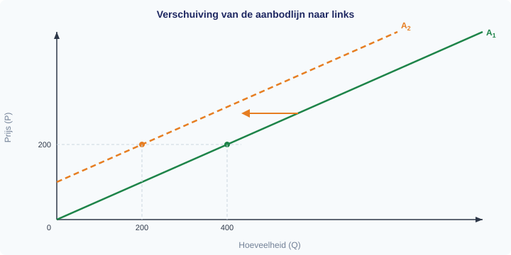

De horizontale pijl in figuur 3 laat zien dat de hele lijn opschuift naar links. Bij dezelfde prijs is de aangeboden hoeveelheid kleiner geworden.

> **⚠️ Let op — veelgemaakte fout**
> Veel leerlingen verwarren een *verschuiving van* de aanbodlijn met een *beweging langs* de aanbodlijn.
> - Verandering van de prijs van het goed zelf → **beweging LANGS** de lijn.
> - Verandering van productiekosten, technologie of andere factoren → **verschuiving VAN** de lijn.

---

### Aanbodfactoren: wat verschuift de aanbodlijn?

De factoren die de hele aanbodlijn verschuiven, heten **aanbodfactoren**. Er zijn er vijf:

> **Definitie: Aanbodfactoren**
> Factoren die de positie van de aanbodlijn bepalen. Een verandering van een aanbodfactor verschuift de hele aanbodlijn naar links of naar rechts.

**1. Prijzen van productiefactoren (inputprijzen)**

Als grondstoffen, arbeid of energie duurder worden, stijgen de productiekosten. Producenten bieden bij elke prijs minder aan. De aanbodlijn verschuift naar links. Worden grondstoffen goedkoper, dan verschuift de aanbodlijn naar rechts.

Voorbeeld: de prijs van silicium stijgt → de aanbodlijn van zonnepanelen verschuift naar links.

**2. Technologie**

Een betere productietechnologie verlaagt de kosten per eenheid. Producenten kunnen bij elke prijs meer aanbieden. De aanbodlijn verschuift naar rechts.

Voorbeeld: een nieuwe lasertechniek versnelt de productie van zonnepanelen → de aanbodlijn verschuift naar rechts.

**3. Aantal aanbieders**

Als er meer producenten op de markt komen, stijgt het totale aanbod. De aanbodlijn verschuift naar rechts. Vertrekken er aanbieders, dan verschuift de lijn naar links.

Voorbeeld: een Chinese fabrikant opent een fabriek in Europa → de aanbodlijn van zonnepanelen verschuift naar rechts.

**4. Verwachtingen van producenten**

Als producenten verwachten dat de prijs in de toekomst gaat stijgen, houden ze nu voorraad achter. Het huidige aanbod daalt, de aanbodlijn verschuift naar links. Verwachten ze een prijsdaling, dan verkopen ze nu zoveel mogelijk — de aanbodlijn verschuift naar rechts.

Voorbeeld: fabrikanten verwachten dat zonnepanelen over drie maanden 20% duurder worden → ze verkopen nu minder, de aanbodlijn verschuift naar links.

**5. Overheidsbeleid**

De overheid kan het aanbod beïnvloeden met subsidies, belastingen en regels. Een productiesubsidie verlaagt de kosten voor producenten → de aanbodlijn verschuift naar rechts. Een accijns of strenge milieu-eis verhoogt de kosten → de aanbodlijn verschuift naar links.

Voorbeeld: de overheid geeft €50 subsidie per geproduceerd zonnepaneel → de aanbodlijn verschuift naar rechts.

---

### Overzicht aanbodfactoren

Figuur 5 vat de vijf aanbodfactoren in één beeld samen. Onthoud: deze vijf factoren kunnen de hele lijn verschuiven. De prijs van het goed zelf staat er niet bij — die veroorzaakt een beweging *langs* de lijn, niet een verschuiving.


De onderstaande tabel laat bij elke prijs zien hoeveel panelen worden aangeboden in drie situaties: de oorspronkelijke aanbodlijn (A₁), na een kostenstijging (A₂, verschuiving naar links), en na een subsidie (A₃, verschuiving naar rechts).

| Prijs (€) | Q aangeboden (A₁) | Q aangeboden (A₂, kosten ↑) | Q aangeboden (A₃, subsidie) |
|---|---|---|---|
| 100 | 200 | 0 | 400 |
| 200 | 400 | 200 | 600 |
| 300 | 600 | 400 | 800 |
| 400 | 800 | 600 | 1.000 |

Zo zie je dezelfde informatie nu in drie vormen tegelijk: in de tekst hierboven, in de overzichtsfiguur, én in deze tabel.

---

### Overzicht: beweging langs versus verschuiving van

Figuur 4 vat alles samen in twee panelen. Het linkerpaneel laat een beweging langs de aanbodlijn zien, het rechterpaneel een verschuiving van de aanbodlijn.

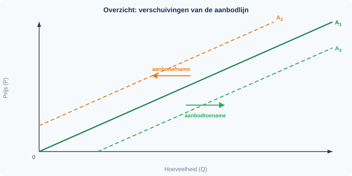

**Aanbod neemt toe (verschuiving naar rechts):**
- Inputprijzen dalen (goedkopere grondstoffen, lager loon)
- Betere technologie
- Meer aanbieders op de markt
- Verwachte prijsdaling (producenten verkopen nu)
- Overheidssubsidie

**Aanbod neemt af (verschuiving naar links):**
- Inputprijzen stijgen (duurdere grondstoffen, hoger loon)
- Verouderde technologie of productieproblemen
- Minder aanbieders op de markt
- Verwachte prijsstijging (producenten houden voorraad achter)
- Belastingverhoging of strengere regelgeving

---

## Uitgewerkt voorbeeld

> **De markt voor elektrische fietsen**
>
> De markt voor elektrische fietsen (e-bikes) is in evenwicht bij P = €1.500 en Q = 3.000 fietsen per maand. De aanbodlijn loopt via A₁.

**(a)** De prijs van e-bikes stijgt naar €2.000. Is dit een beweging langs of een verschuiving van de aanbodlijn? Verklaar je antwoord.

*Antwoord:* Dit is een **beweging langs** de aanbodlijn. De prijs van het goed zelf verandert (van €1.500 naar €2.000). Bij een hogere prijs is de aangeboden hoeveelheid groter. Je schuift langs de bestaande aanbodlijn naar een punt rechtsboven.

**(b)** De prijs van e-bikes blijft €1.500, maar de prijs van lithiumbatterijen (een belangrijke grondstof) daalt fors. Is dit een beweging langs of een verschuiving van de aanbodlijn? Verklaar je antwoord.

*Antwoord:* Dit is een **verschuiving van** de aanbodlijn naar rechts. De prijs van e-bikes verandert niet, maar een aanbodfactor wel: **de prijs van een productiefactor** (lithiumbatterijen). Doordat de grondstof goedkoper wordt, dalen de productiekosten. Producenten kunnen bij elke prijs meer e-bikes aanbieden. De aanbodlijn verschuift van A₁ naar A₂ (naar rechts).

> ⚠️ Let op de juiste aanbodfactor. Het is verleidelijk om te zeggen "de technologie is verbeterd". Maar er is niets veranderd aan de manier van produceren — alleen de grondstofprijs is gedaald. De economisch precieze categorie is daarom *prijs van een productiefactor (inputprijs)*.

**(c)** Leg in eigen woorden uit waarom de aanbodlijn naar rechts verschuift en niet naar links als de grondstofkosten dalen.

*Antwoord:* Als grondstoffen goedkoper worden, kan een fabrikant dezelfde e-bike voor minder kosten maken. Daardoor wordt het bij een lagere prijs al rendabel om te produceren. Producenten die voorheen niet uit de kosten kwamen, kunnen nu wél aanbieden. Bij elke prijs zijn er dus meer e-bikes beschikbaar — de hele aanbodlijn schuift naar rechts.

---

> **Samenvatting §1.3.1**
> - De aanbodlijn laat het verband zien tussen de prijs en de aangeboden hoeveelheid (ceteris paribus). De lijn loopt omhoog: hoe hoger de prijs, hoe meer er wordt aangeboden (**wet van het aanbod**).
> - Een verandering van de prijs van het goed zelf veroorzaakt een **beweging langs** de aanbodlijn.
> - Een verandering van een aanbodfactor (inputprijzen, technologie, aantal aanbieders, verwachtingen, overheidsbeleid) veroorzaakt een **verschuiving van** de aanbodlijn.
> - Verschuiving naar rechts = aanbod neemt toe. Verschuiving naar links = aanbod neemt af.
> - *In de volgende paragraaf bekijken we de kostenstructuur van een producent: welke kosten zijn vast, welke variabel, en hoe berekent een ondernemer de gemiddelde kosten per product?*

> **💡 Vastgelopen op een opgave?**
> Op de website vind je bij elke opgave een **begeleide inoefening**: stap voor stap krijg je extra hints en tussenstappen. Klik op de opgave om de begeleiding te starten.

---

## Opgaven

### Startoefeningen

**Opgave 1** *(lees de grafiek — zie figuur 6)*

In figuur 6 zie je twee veranderingen op de markt voor brood. Beide situaties zijn al voor je getekend en gelabeld.


a) Beschrijf wat er in **Situatie 1** gebeurt: wat verandert er met de prijs en de aangeboden hoeveelheid? Welke factor zou dit veroorzaakt kunnen hebben?

b) Beschrijf wat er in **Situatie 2** gebeurt: wat verandert er met de prijs en de aangeboden hoeveelheid? Welke factor zou dit veroorzaakt kunnen hebben?

c) Leg in eigen woorden uit waarom Situatie 1 een *beweging langs* de aanbodlijn is, en Situatie 2 een *verschuiving van* de aanbodlijn.


**Opgave 2** *(teken in de grafiek — zie figuur 7)*

De markt voor laptops is in evenwicht bij P = €800 en Q = 5.000 stuks per maand. In figuur 7 zie je de aanbodlijn A₁ met punt E.

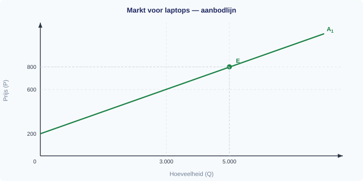

a) De prijs van laptops daalt naar €600. Laat in de grafiek zien wat er gebeurt. Is dit een verschuiving van de aanbodlijn of een beweging langs de aanbodlijn? Leg uit.

b) Een nieuwe chiptechnologie verlaagt de productiekosten van laptops aanzienlijk. Laat in de grafiek zien wat er gebeurt met het aanbod van laptops. Is dit een verschuiving of een beweging? Leg uit.

c) De overheid voert een milieubelasting in op de productie van laptops. Wat verwacht je dat er gebeurt met de aanbodlijn? Is dit een verschuiving of een beweging? Geef de richting aan.


**Opgave 3**

De markt voor koffie is in evenwicht. Er doen zich achtereenvolgens drie veranderingen voor. Beantwoord voor elke verandering de vragen. Er is geen grafiek bij deze opgave — beschrijf wat er in een grafiek zou gebeuren.

a) De prijs van koffie daalt van €8 naar €6 per kilo.
- Verschuift de aanbodlijn of beweeg je langs de aanbodlijn?
- In welke richting?

b) Door een droogte in Brazilië mislukt een groot deel van de koffieoogst. De kosten per kilo koffiebonen stijgen fors. De prijs van koffie blijft gelijk.
- Verschuift de aanbodlijn of beweeg je langs de aanbodlijn?
- In welke richting verschuift of beweegt de lijn?

c) De overheid verlaagt de importbelasting op koffie.
- Wat gebeurt er nu met het aanbod van koffie?
- Is dit een verschuiving of een beweging? Leg uit.

d) Noem bij elk van de drie situaties (a, b, c) welke aanbodfactor verandert. Kies uit: eigen prijs, inputprijzen, technologie, aantal aanbieders, verwachtingen, overheidsbeleid.


**Opgave 4** *(twee veranderingen tegelijk — let goed op!)*

Op de markt voor T-shirts gebeuren twee dingen op dezelfde dag:

1. De prijs van T-shirts stijgt van €15 naar €20.
2. Tegelijk stijgt het minimumloon fors, waardoor de loonkosten voor textielfabrieken toenemen.

a) Bekijk eerst alleen verandering 1. Wat gebeurt er met het aanbod van T-shirts? Is dit een beweging langs of een verschuiving van de aanbodlijn? In welke richting?

b) Bekijk nu alleen verandering 2. Wat gebeurt er met het aanbod van T-shirts? Is dit een beweging langs of een verschuiving van de aanbodlijn? In welke richting?

c) Beide veranderingen gebeuren tegelijkertijd. Beschrijf het netto-effect op de aangeboden hoeveelheid T-shirts. Versterken de twee effecten elkaar of werken ze tegen elkaar in?

d) Een leerling zegt: "De prijs verandert *en* de kosten veranderen, dus alles is een beweging langs de aanbodlijn." Leg uit waarom dit niet klopt.

---

### Zelfstandige oefening

**Opgave 5**

De markt voor biologische melk is in evenwicht bij P = €1,20 per liter en Q = 50.000 liter per week.

a) Geef vier aanbodfactoren die de aanbodlijn van biologische melk kunnen laten verschuiven (niet: de eigen prijs).

b) Leg voor elk van de vier factoren uit of de aanbodlijn naar rechts of naar links verschuift. Geef bij elke factor een concreet voorbeeld.

c) De prijs van biologisch veevoer (een grondstof) stijgt met 30%. Teken een aanbodlijn voor biologische melk en laat zien wat er gebeurt. Is dit een verschuiving of een beweging? Leg uit.

d) Na de kostenstijging van het veevoer besluit de zuivelcoöperatie de melkprijs te verhogen van €1,20 naar €1,50. Teken in dezelfde grafiek wat er nu gebeurt met de aangeboden hoeveelheid. Is dit een verschuiving of een beweging?


**Opgave 6**

Hieronder staan zes situaties op de markt voor kleding. Vul de tabel in: bepaal voor elke situatie of het om een beweging of een verschuiving gaat, welke richting, en welke aanbodfactor de oorzaak is.

| | Situatie | Beweging of verschuiving? | Richting | Aanbodfactor |
|---|---|---|---|---|
| a | De verkoopprijs van jassen stijgt van €80 naar €110. |  |  |  |
| b | De prijs van katoen (grondstof) daalt door een goede oogst. |  |  |  |
| c | Drie nieuwe kledingfabrieken openen in Turkije. |  |  |  |
| d | Fabrikanten verwachten dat de vraag naar winterjassen volgend seizoen sterk stijgt. |  |  |  |
| e | De overheid voert een CO₂-belasting in op textielproductie. |  |  |  |
| f | Een nieuw robotsysteem maakt het naaien van kleding twee keer zo snel. |  |  |  |

---

### Herhaling (interleaving)

**Opgave 7** *(herhaling §1.1.2: procentuele verandering)*

De prijs van silicium stijgt van €25 per kilo naar €32 per kilo.

a) Bereken de procentuele prijsstijging.

b) Een jaar later daalt de prijs met 15% ten opzichte van €32. Bereken de nieuwe prijs.


**Opgave 8** *(herhaling §1.2.1: betalingsbereidheid en individuele vraag)*

Een consument wil een zonnepaneel kopen. Zijn maximale betalingsbereidheid is €350.

a) Het zonnepaneel kost €290. Bereken het consumentensurplus.

b) De prijs stijgt naar €375. Koopt de consument het paneel? Leg uit met het begrip betalingsbereidheid.


**Opgave 9** *(herhaling §1.2.2: vraagfactoren — verschuiving versus beweging)*

Op de markt voor hardloopschoenen doen zich twee veranderingen voor:

a) De prijs van hardloopschoenen stijgt van €120 naar €140. Is dit een verschuiving van of een beweging langs de vraaglijn? Welke richting?

b) Een populaire influencer promoot hardlopen op social media. De prijs van hardloopschoenen blijft gelijk. Is dit een verschuiving of een beweging? Welke vraagfactor verandert?

---

### Doeloefening

**Opgave 10**

De markt voor zonnepanelen is in evenwicht.

a) Een fabrikant van zonnepanelen wordt geconfronteerd met hogere siliciumprijzen. Laat in een grafiek zien wat er gebeurt met de aanbodlijn van zonnepanelen. Verklaar je antwoord.

b) De overheid voert een subsidie in op de productie van zonnepanelen. Laat het effect op de aanbodlijn zien.

c) Noem drie factoren die de aanbodlijn doen verschuiven en geef bij elke factor een voorbeeld.

d) Teken een aanbodlijn. Geef in de grafiek een beweging langs de lijn aan én een verschuiving van de lijn. Label duidelijk welke welke is.

---

### Denkertje *(bonusopgave)*

**Opgave 11**

De Europese Unie wil de productie van groene waterstof stimuleren. Er worden twee maatregelen overwogen:

- **Maatregel A:** Een subsidie van €2 per kilogram geproduceerde groene waterstof.
- **Maatregel B:** Investeren in onderzoek naar een nieuwe, goedkopere productiemethode voor groene waterstof.

a) Leg met behulp van het verschil tussen aanbodfactoren uit hoe beide maatregelen de aanbodlijn van groene waterstof beïnvloeden. Welke aanbodfactor wordt in elk geval aangesproken?

b) Een criticus stelt: "Maatregel A kost de overheid elk jaar geld. Maatregel B kost eenmalig geld, maar het effect is blijvend." Beoordeel deze stelling. Gebruik economische argumenten en betrek de begrippen 'productiekosten' en 'technologie' in je antwoord.


<div style="break-before: page;"></div>

# 1.3.2 Kostenstructuren

## Wat kost het om brood te bakken?

Stel je voor: je opent een bakkerij. Nog voordat je het eerste brood bakt, ben je al geld kwijt. De huur van het pand loopt, de verzekering is betaald, en de oven staat klaar. Deze kosten heb je altijd, ongeacht of je 10 broden bakt of 1000. Maar zodra je begint te bakken, komen er kosten bij: meel, boter, energie. Hoe meer broden je bakt, hoe hoger die kosten worden.

Als ondernemer wil je weten: wat kost het me *in totaal* om te produceren? En misschien nog belangrijker: wat kost *elk brood* gemiddeld? Want als je dat weet, kun je bepalen welke prijs je minstens moet vragen om geen verlies te draaien.

In deze paragraaf leer je zeven kostenbegrippen die je helpen om de kosten van een bedrijf te ontleden. Het lijkt veel terminologie, maar de logica is steeds dezelfde: je splitst kosten op in een vast en een variabel deel, en je berekent totalen en gemiddelden.

---

## Theorie

### Constante en variabele kosten

Niet alle kosten gedragen zich hetzelfde. Sommige kosten veranderen niet als je meer of minder produceert. Andere kosten stijgen juist mee met de productie.

> **Definitie: Constante kosten (CK)**
> Kosten die niet veranderen als de productie toe- of afneemt.
> Voorbeelden: huur, verzekering, afschrijving van machines.

> **Definitie: Variabele kosten (VK)**
> Kosten die veranderen als de productie toe- of afneemt.
> Voorbeelden: grondstoffen, energie per eenheid, stukloon.

Een bakkerij betaalt elke maand €500 huur en verzekering, of ze nu 100 broden bakt of 1000. Dat zijn constante kosten. Maar het meel en de energie per brood kosten €0,80. Hoe meer broden, hoe hoger deze variabele kosten.

---

### Totale kosten: TCK, TVK en TK

We noteren de kosten als *totalen* over de hele productie:

> **Definitie: Totale constante kosten (TCK)**
> De som van alle constante kosten. TCK verandert niet met de productieomvang.

> **Definitie: Totale variabele kosten (TVK)**
> De som van alle variabele kosten. TVK stijgt als de productie toeneemt.

> **Definitie: Totale kosten (TK)**
> De som van alle kosten: TK = TCK + TVK.

> **Formule**
> ```
> TCK = vast bedrag (onafhankelijk van Q)
> TVK = variabele kosten per stuk x Q
> TK  = TCK + TVK
> ```

Voor de bakkerij met TCK = €500 en variabele kosten van €0,80 per brood:

| Q (broden) | TCK (€) | TVK (€) | TK (€) |
|-----------|---------|---------|--------|
| 0         | 500     | 0       | 500    |
| 100       | 500     | 80      | 580    |
| 250       | 500     | 200     | 700    |
| 500       | 500     | 400     | 900    |
| 750       | 500     | 600     | 1100   |
| 1000      | 500     | 800     | 1300   |

Merk op: TCK is een horizontale lijn in de tabel — altijd €500. TVK stijgt evenredig met Q. TK stijgt ook, maar begint bij €500 (niet bij 0).

We tekenen deze drie kostenlijnen in een grafiek. Op de horizontale as staat de hoeveelheid (Q), op de verticale as de kosten in euro's. De TCK-lijn is horizontaal. De TVK-lijn begint in de oorsprong en loopt schuin omhoog. De TK-lijn loopt evenwijdig aan TVK, maar begint op €500 — het verschil tussen TK en TVK is altijd precies TCK.

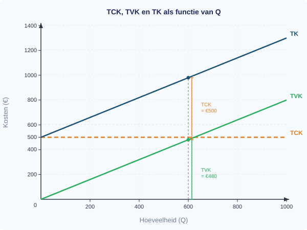

De verticale afstand tussen de TK-lijn en de TVK-lijn is altijd gelijk aan TCK (€500). Dat klopt, want TK = TCK + TVK.

---

### Gemiddelde kosten: GTK, GVK en GCK

Een ondernemer wil niet alleen de totale kosten weten, maar ook de kosten *per stuk*. Die berekent hij door de totale kosten te delen door het aantal geproduceerde eenheden.

> **Definitie: Gemiddelde totale kosten (GTK)**
> De totale kosten per eenheid product: GTK = TK / Q.

> **Definitie: Gemiddelde variabele kosten (GVK)**
> De variabele kosten per eenheid product: GVK = TVK / Q.

> **Definitie: Gemiddelde constante kosten (GCK)**
> De constante kosten per eenheid product: GCK = TCK / Q.

> **Formule**
> ```
> GTK = TK / Q
> GVK = TVK / Q
> GCK = TCK / Q
> GTK = GCK + GVK
> ```

We berekenen de gemiddelde kosten voor de bakkerij:

| Q | TCK (€) | TVK (€) | TK (€) | GCK (€) | GVK (€) | GTK (€) |
|---|---------|---------|--------|---------|---------|---------|
| 100  | 500 | 80   | 580  | 5,00 | 0,80 | 5,80 |
| 250  | 500 | 200  | 700  | 2,00 | 0,80 | 2,80 |
| 500  | 500 | 400  | 900  | 1,00 | 0,80 | 1,80 |
| 750  | 500 | 600  | 1100 | 0,67 | 0,80 | 1,47 |
| 1000 | 500 | 800  | 1300 | 0,50 | 0,80 | 1,30 |

Kijk goed naar de kolommen. Twee patronen vallen op:

1. **GVK blijft constant op €0,80.** Dat is logisch: elk brood kost evenveel aan grondstoffen (€0,80). Als de variabele kosten per stuk niet veranderen, is GVK altijd hetzelfde getal.

2. **GCK daalt steeds verder.** Bij 100 broden is GCK = €5,00. Bij 1000 broden is GCK nog maar €0,50. De vaste kosten worden over steeds meer eenheden *verspreid*. Dit heet het **spreidingseffect**.

Omdat GTK = GCK + GVK, en GVK constant is terwijl GCK daalt, daalt GTK ook — maar GTK kan nooit onder GVK zakken. De GVK-lijn is als het ware de bodem waar GTK naar toe kruipt.

Nu tekenen we de gemiddelde kostenlijnen. De GVK-lijn is horizontaal (constant op €0,80). De GCK-lijn is een dalende curve die naar nul kruipt maar het nooit bereikt. De GTK-lijn ligt altijd boven GVK en daalt, omdat GCK steeds kleiner wordt.

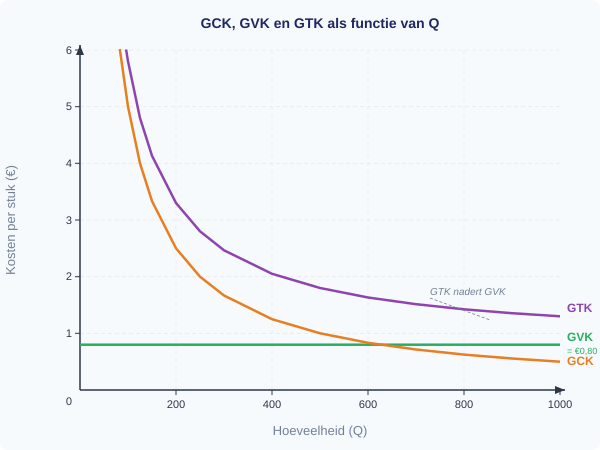

> **⚠️ Let op — veelgemaakte fout**
> Verwar *totale* kosten niet met *gemiddelde* kosten. TK stijgt als Q toeneemt (er komen kosten bij). Maar GTK *daalt* als Q toeneemt (de kosten worden over meer eenheden verdeeld). Een hogere TK betekent dus niet automatisch hogere kosten per stuk — het kan juist goedkoper per stuk worden.

---

### Het spreidingseffect

Waarom is het voor een bedrijf aantrekkelijk om meer te produceren? Omdat de vaste kosten per stuk dalen. Dit noemen economen het **spreidingseffect** (of: degressie van de constante kosten).

Denk aan een streamingdienst die een serie produceert voor €10 miljoen. Of 1 miljoen mensen kijken of 10 miljoen maakt voor de productiekosten niet uit — die €10 miljoen is al uitgegeven. Maar de kosten per kijker dalen spectaculair:

| Aantal kijkers | GCK per kijker |
|---------------|---------------|
| 1.000.000     | €10,00        |
| 5.000.000     | €2,00         |
| 10.000.000    | €1,00         |

Hoe meer kijkers, hoe lager de kosten per kijker. Dit verklaart waarom bedrijven met hoge vaste kosten (techbedrijven, luchtvaart, energiecentrales) streven naar een zo groot mogelijke afzet.

---

### Overzicht van de zeven kostenbegrippen

Figuur 3 vat alle kostenbegrippen in een overzicht samen.

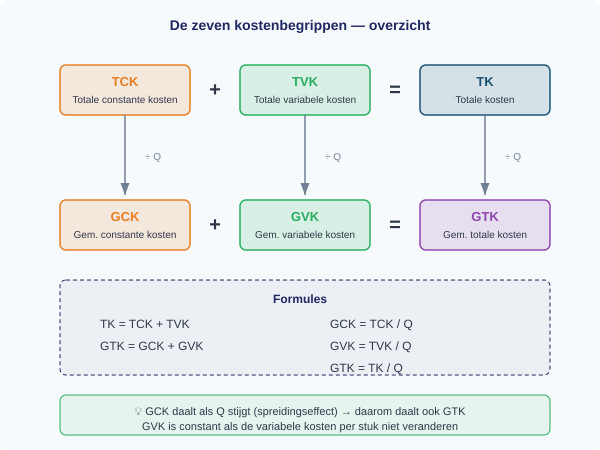

De onderstaande samenvattingstabel kun je in je schrift overnemen als naslagkaart:

| Afkorting | Volledige naam | Formule | Verloop bij stijgende Q |
|-----------|---------------|---------|------------------------|
| TCK | Totale constante kosten | vast bedrag | constant |
| TVK | Totale variabele kosten | GVK x Q | stijgend |
| TK  | Totale kosten | TCK + TVK | stijgend |
| GCK | Gemiddelde constante kosten | TCK / Q | dalend |
| GVK | Gemiddelde variabele kosten | TVK / Q | constant* |
| GTK | Gemiddelde totale kosten | TK / Q | dalend |

*\*GVK is constant wanneer de variabele kosten per stuk niet veranderen. In de praktijk kan GVK soms stijgen of dalen — dat leer je in latere hoofdstukken.*

---

## Uitgewerkt voorbeeld

> **De fietsenmaker**
>
> Een fietsenmaker heeft constante kosten van €800 per maand (huur werkplaats, gereedschap, verzekering). De variabele kosten zijn €15 per fietsreparatie (onderdelen en smeermiddelen).

**(a)** Schrijf de formules voor TCK, TVK en TK als functie van Q (het aantal reparaties).

*Stap 1: Identificeer de constante en variabele kosten.*

- Constante kosten: €800 per maand → TCK = 800
- Variabele kosten: €15 per reparatie → TVK = 15 x Q

*Stap 2: Stel de formule voor TK op.*

TK = TCK + TVK = 800 + 15Q

**(b)** Bereken TK, TVK en TCK bij Q = 40 en Q = 80.

*Stap 3: Vul de hoeveelheden in.*

| Q | TCK (€) | TVK (€) | TK (€) |
|---|---------|---------|--------|
| 40  | 800 | 15 x 40 = 600   | 800 + 600 = 1400 |
| 80  | 800 | 15 x 80 = 1200  | 800 + 1200 = 2000 |

**(c)** Bereken GTK, GVK en GCK bij Q = 40 en Q = 80.

*Stap 4: Deel de totalen door Q.*

| Q | GCK (€) | GVK (€) | GTK (€) |
|---|---------|---------|---------|
| 40  | 800 / 40 = 20,00  | 600 / 40 = 15,00  | 1400 / 40 = 35,00 |
| 80  | 800 / 80 = 10,00  | 1200 / 80 = 15,00 | 2000 / 80 = 25,00 |

Controle: GTK = GCK + GVK → 20 + 15 = 35 ✓ en 10 + 15 = 25 ✓

**(d)** Wat gebeurt er met GTK als Q toeneemt?

GTK daalt van €35 naar €25. Dit komt doordat GCK daalt (van €20 naar €10): de vaste kosten worden over meer reparaties verspreid. GVK blijft constant op €15. Dus de daling van GTK wordt volledig veroorzaakt door het spreidingseffect van de constante kosten.

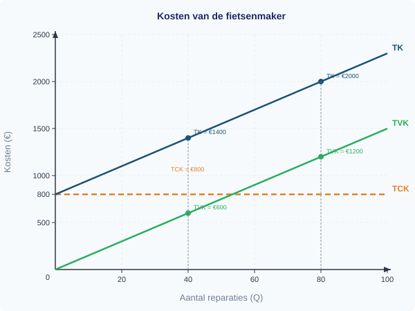

---

> **Samenvatting §1.3.2**
> - Kosten bestaan uit **constante kosten** (CK, veranderen niet met Q) en **variabele kosten** (VK, veranderen wel met Q).
> - **Totale kosten**: TK = TCK + TVK. TCK is vast, TVK stijgt met Q.
> - **Gemiddelde kosten**: GTK = TK/Q, GVK = TVK/Q, GCK = TCK/Q. Ook geldt: GTK = GCK + GVK.
> - **Spreidingseffect**: GCK daalt als Q stijgt, omdat de vaste kosten over meer eenheden worden verdeeld. Daardoor daalt ook GTK.
> - GVK is constant wanneer de variabele kosten per stuk niet veranderen.
> - *In §1.3.3 leer je hoe je de opbrengsten (TO, GO) berekent en vergelijkt met de kosten om de winst te bepalen.*

> **💡 Vastgelopen op een opgave?**
> Op de website vind je bij elke opgave een **begeleide inoefening**: stap voor stap krijg je extra hints en tussenstappen. Klik op de opgave om de begeleiding te starten.

---

## Opgaven

### Startoefeningen

**Opgave 1** *(lees de grafiek — zie figuur 4)*

In figuur 4 zie je de TK-, TVK- en TCK-lijnen van een kledingfabriek.


a) Lees uit de grafiek af: hoe hoog zijn de totale constante kosten (TCK)?

b) Lees af: wat zijn de totale kosten (TK) bij Q = 200? En wat zijn de totale variabele kosten (TVK) bij Q = 200?

c) Controleer: klopt het dat TK = TCK + TVK bij Q = 200? Laat je berekening zien.

d) Een medewerker zegt: "Als we meer produceren, stijgen alle kosten." Klopt deze bewering? Leg uit welke kosten stijgen en welke niet.


**Opgave 2** *(bereken en teken)*

Een cateringbedrijf heeft vaste kosten van €600 per maand (huur keuken, apparatuur). De variabele kosten bedragen €4 per maaltijd.

a) Schrijf de formules voor TCK, TVK en TK als functie van Q (het aantal maaltijden).

b) Bereken TK bij Q = 50, Q = 150 en Q = 300. Zet de resultaten in een tabel.

c) Teken de drie kostenlijnen (TCK, TVK en TK) in een assenstelsel met Q op de x-as en kosten (€) op de y-as. Gebruik het lege assenstelsel in figuur 5.

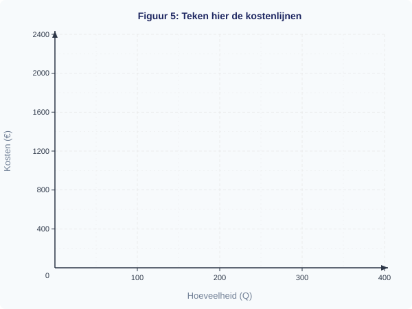

d) Leg uit waarom de TK-lijn en de TVK-lijn evenwijdig lopen.


**Opgave 3** *(gemiddelde kosten berekenen — geen grafiek)*

Een drukkerij heeft constante kosten van €1200 per maand. De variabele kosten zijn €0,50 per flyer.

a) Bereken GTK, GVK en GCK bij een productie van 400 flyers.

b) Bereken GTK, GVK en GCK bij een productie van 2400 flyers.

c) Leg uit waarom GTK daalt als de productie stijgt. Gebruik de begrippen GCK en GVK in je uitleg.

d) Een klant bestelt 400 flyers en betaalt €4 per stuk. Een andere klant bestelt 2400 flyers en betaalt €1,50 per stuk. Bij welke bestelling verdient de drukkerij meer per flyer? Leg uit.

---

### Zelfstandige oefening

**Opgave 4**

Een sportschool heeft vaste kosten van €3000 per maand (huur, apparatuur, personeel). De variabele kosten per lid bedragen €5 per maand (water, schoonmaak, handdoeken).

a) Schrijf de formules voor TCK, TVK en TK als functie van Q (het aantal leden).

b) Bereken TK, GTK, GVK en GCK bij Q = 100 en Q = 600. Zet alle resultaten in een overzichtelijke tabel.

c) De sportschool rekent een maandabonnement van €15 per lid. Bereken bij welk aantal leden de opbrengst per lid precies gelijk is aan de gemiddelde totale kosten (GTK). *Hint: stel GO = GTK en los op naar Q.*

d) Teken de GCK-, GVK- en GTK-lijnen in een assenstelsel. Geef aan naar welke waarde GTK kruipt bij heel grote Q.


**Opgave 5**

Twee bedrijven produceren hetzelfde product:

| | Bedrijf A | Bedrijf B |
|---|-----------|-----------|
| TCK per maand | €2000 | €500 |
| GVK per stuk | €3 | €6 |

a) Schrijf voor beide bedrijven de formule voor TK als functie van Q.

b) Bereken voor beide bedrijven GTK bij Q = 200 en Q = 1000.

c) Bij welk productievolume zijn de GTK van beide bedrijven gelijk? Laat je berekening zien.

d) Welk bedrijf heeft een voordeel bij een groot productievolume? Leg uit met het begrip spreidingseffect.

---

### Herhaling (interleaving)

**Opgave 6** *(herhaling §1.2.1: betalingsbereidheid en koopbeslissing)*

Een consument wil smoothies kopen. Zijn betalingsbereidheid: €5 voor de eerste, €3,50 voor de tweede, €2 voor de derde, €0,75 voor de vierde.

a) De marktprijs is €3. Hoeveel smoothies koopt de consument?

b) Bereken het totale consumentensurplus.


**Opgave 7** *(herhaling §1.2.2: verschuiving van de vraaglijn)*

De markt voor fietsen wordt getroffen door twee gebeurtenissen:
1. De benzineprijs stijgt fors.
2. Tegelijkertijd verlaagt een grote fietsenfabrikant zijn prijzen.

a) Welke gebeurtenis leidt tot een verschuiving van de vraaglijn naar fietsen? Leg uit welke richting de vraaglijn verschuift en noem de vraagfactor.

b) Welke gebeurtenis leidt tot een beweging langs de vraaglijn? Leg uit.


**Opgave 8** *(herhaling §1.3.1: opbrengsten — als §1.3.1 behandeld is)*

Een marktkraam verkoopt bloemen voor €3 per bos. De vaste kosten zijn €80 per dag. De variabele kosten bedragen €1,20 per bos.

a) Bereken de totale opbrengst (TO) bij een verkoop van 60 bossen.

b) Bereken de totale kosten (TK) bij Q = 60.

c) Bereken de winst bij Q = 60.

---

### Doeloefening

**Opgave 9**

Een bakkerij heeft constante kosten van €500 per maand (huur, verzekering). Elk brood kost €0,80 aan ingredienten en energie (variabele kosten per stuk).

a) Schrijf de formules voor TK, TVK en TCK als functie van Q.

b) Bereken TK, TVK en TCK bij Q = 500 en Q = 1000.

c) Bereken GTK, GVK en GCK bij Q = 500 en Q = 1000.

d) Wat gebeurt er met GTK als Q toeneemt? Leg uit waarom dit logisch is.

e) Een leerling zegt: "GCK is altijd hetzelfde." Klopt dit? Leg uit.

---

### Denkertje *(bonusopgave)*

**Opgave 10**

Twee ijsfabrieken produceren precies hetzelfde ijs. Fabriek X heeft gekozen voor dure, moderne robots (hoge vaste kosten, lage variabele kosten per stuk). Fabriek Y werkt met goedkopere apparatuur en meer handarbeid (lage vaste kosten, hoge variabele kosten per stuk).

a) Schets voor beide fabrieken (in dezelfde grafiek) een mogelijke GTK-lijn. Geef aan bij welk productievolume fabriek X goedkoper produceert dan fabriek Y, en andersom.

b) In een recessie daalt de vraag naar ijs sterk. Welke fabriek zit dan in een moeilijkere positie? Beargumenteer je antwoord met behulp van de begrippen GCK en spreidingseffect.

c) Bedenk een ander voorbeeld uit de echte wereld van een bedrijf met zeer hoge vaste kosten en lage variabele kosten. Leg uit waarom zo'n bedrijf een groot afzetvolume nodig heeft om winstgevend te zijn.


<div style="break-before: page;"></div>

# 1.3.3 Opbrengsten

## Wanneer verdient de bakker geld?

De bakker uit de vorige paragraaf kent nu zijn kosten: de constante kosten zijn €500 per week (huur, verzekering, afschrijving) en de variabele kosten zijn €0,80 per brood. Zijn totale kosten: TK = 500 + 0,80Q.

Maar kosten zijn maar de helft van het verhaal. De bakker wil ook weten: hoeveel geld komt er *binnen*? En vooral: bij hoeveel broden verdient hij meer dan hij uitgeeft? Vanaf welk punt maakt hij winst?

---

> **Herhaling uit 1.3.2**
> De totale kosten bestaan uit constante en variabele kosten:
> TK = TCK + TVK = 500 + 0,80Q
> De gemiddelde totale kosten: GTK = TK / Q

---

## Theorie

### Totale opbrengst (TO)

De bakker verkoopt elk brood voor €1,50. Als hij 100 broden verkoopt, ontvangt hij 100 x €1,50 = €150. Dat bedrag heet de **totale opbrengst**.

> **Definitie: Totale opbrengst (TO)**
> Het totale bedrag dat een producent ontvangt uit de verkoop van zijn producten.
> TO = P x Q
> waarbij P = prijs per stuk en Q = verkochte hoeveelheid.

We rekenen de totale opbrengst bij een paar hoeveelheden uit:

| Q (broden) | P (€) | TO = P x Q (€) |
|---|---|---|
| 0 | 1,50 | 0 |
| 200 | 1,50 | 300 |
| 500 | 1,50 | 750 |
| 1000 | 1,50 | 1.500 |

De TO-lijn begint in de oorsprong (bij Q = 0 is de opbrengst €0) en loopt recht omhoog. Hoe meer de bakker verkoopt, hoe hoger zijn opbrengst.

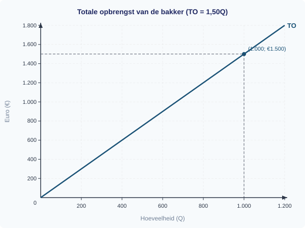

---

### Gemiddelde opbrengst (GO)

Hoeveel opbrengst levert elk brood gemiddeld op? Dat is de **gemiddelde opbrengst**.

> **Definitie: Gemiddelde opbrengst (GO)**
> De opbrengst per verkochte eenheid.
> GO = TO / Q

We berekenen GO bij Q = 500:
GO = 750 / 500 = €1,50

En bij Q = 1000:
GO = 1.500 / 1000 = €1,50

De gemiddelde opbrengst is steeds €1,50 — precies gelijk aan de prijs. Dat is logisch: als elk brood dezelfde prijs heeft, is de gemiddelde opbrengst per brood altijd gelijk aan die prijs.

> **Formule**
> ```
> TO = P x Q
> GO = TO / Q = P   (bij constante prijs)
> ```

> **Let op — veelgemaakte fout**
> Leerlingen verwarren soms *opbrengst* met *winst*. Opbrengst is alles wat binnenkomt (TO = P x Q). Winst is wat er overblijft na aftrek van de kosten (TO - TK). Je kunt een hoge opbrengst hebben en toch verlies draaien als de kosten hoger zijn.

---

### Winst en verlies

De bakker wil uiteindelijk weten: hoeveel houdt hij over? Het verschil tussen opbrengst en kosten is de **winst**.

> **Definitie: Winst**
> Het verschil tussen de totale opbrengst en de totale kosten.
> Winst = TO - TK
> Als de winst negatief is, spreken we van **verlies**.

We rekenen de winst bij twee productieniveaus uit:

| Q | TO = 1,50Q (€) | TK = 500 + 0,80Q (€) | Winst = TO - TK (€) |
|---|---|---|---|
| 500 | 750 | 900 | -150 (verlies) |
| 1000 | 1.500 | 1.300 | 200 (winst) |

Bij 500 broden maakt de bakker €150 verlies. Bij 1000 broden maakt hij €200 winst. Ergens daartussenin slaat het om van verlies naar winst. Dat omslagpunt heet het *break-evenpunt*.

---

### Het break-evenpunt

Het **break-evenpunt** is de productieomvang waarbij de winst precies nul is: de opbrengst dekt exact de kosten.

> **Definitie: Break-evenpunt**
> Het productieniveau waarbij TO = TK, dus winst = 0.
> De producent maakt geen winst en geen verlies.

We berekenen het break-evenpunt van de bakker:

TO = TK
1,50Q = 500 + 0,80Q
1,50Q - 0,80Q = 500
0,70Q = 500
Q = 500 / 0,70
**Q = 714,3 broden** (afgerond op 1 decimaal)

Bij 714,3 broden is TO = TK = €1.071,43. Onder dit punt maakt de bakker verlies, erboven maakt hij winst.

> **Formule**
> ```
> Break-evenpunt: TO = TK
> P x Q = TCK + GVK x Q
> Q_break-even = TCK / (P - GVK)
> ```
> De uitdrukking (P - GVK) heet ook wel de *bijdrage per stuk* of *dekkingsbijdrage*: het bedrag dat elk verkocht product bijdraagt aan het dekken van de constante kosten.

---

### De grafiek: TK en TO samen

Nu tekenen we de TK-lijn en de TO-lijn in dezelfde grafiek. Dit is de krachtigste manier om winst, verlies en het break-evenpunt in een oogopslag te zien.

We beginnen met de TK-lijn. Die start bij €500 (de constante kosten bij Q = 0) en loopt omhoog met een helling van €0,80 per brood.

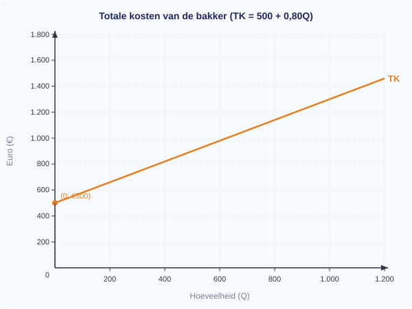

Nu voegen we de TO-lijn toe. Die start in de oorsprong en loopt omhoog met een helling van €1,50 per brood. Omdat de helling van TO (€1,50) groter is dan de helling van TK (€0,80), haalt de TO-lijn de TK-lijn op een gegeven moment in.

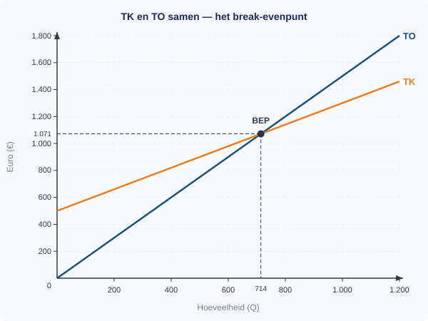

Het snijpunt van de twee lijnen is het break-evenpunt: Q = 714,3 broden, TO = TK = €1.071,43.

- **Links van het break-evenpunt**: TK > TO, dus de bakker maakt *verlies*. Het verlies is de verticale afstand tussen TK en TO.
- **Rechts van het break-evenpunt**: TO > TK, dus de bakker maakt *winst*. De winst is de verticale afstand tussen TO en TK.

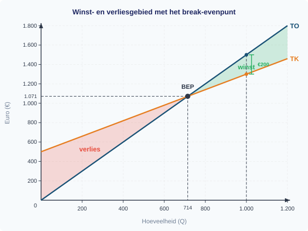

In figuur 4 is het verliesgebied (links van het break-evenpunt) rood gearceerd en het winstgebied (rechts) groen gearceerd. Bij Q = 1000 is de winst de verticale afstand tussen TO en TK: €1.500 - €1.300 = €200.

| Q | TO (€) | TK (€) | Winst/Verlies (€) | Toelichting |
|---|---|---|---|---|
| 0 | 0 | 500 | -500 | Alleen constante kosten |
| 500 | 750 | 900 | -150 | Verliesgebied |
| 714,3 | 1.071,43 | 1.071,43 | 0 | Break-evenpunt |
| 1000 | 1.500 | 1.300 | 200 | Winstgebied |

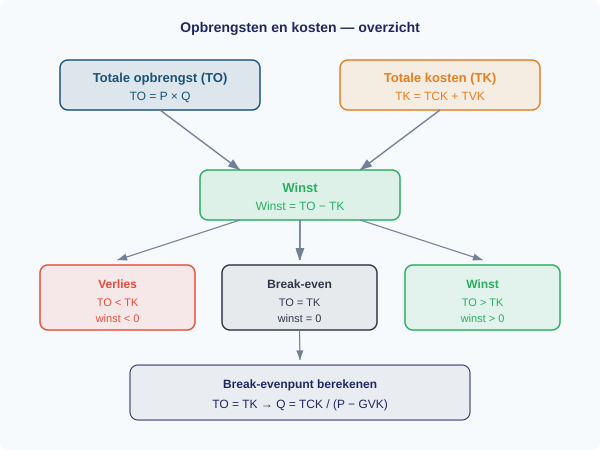

---

## Uitgewerkt voorbeeld

> **De fietsenmaker**
>
> Een fietsenmaker heeft constante kosten van €800 per maand (huur werkplaats, gereedschap). De variabele kosten per reparatie zijn €15. Hij rekent €35 per reparatie.

**(a)** Schrijf de formules voor TO en TK als functie van Q (het aantal reparaties).

*Stap 1: Stel de formule voor TO op.*
TO = P x Q = 35Q

*Stap 2: Stel de formule voor TK op.*
TK = TCK + GVK x Q = 800 + 15Q

---

**(b)** Bereken de winst bij Q = 30 en Q = 60 reparaties.

*Stap 1: Bereken TO en TK bij Q = 30.*
TO = 35 x 30 = €1.050
TK = 800 + 15 x 30 = 800 + 450 = €1.250

*Stap 2: Bereken de winst.*
Winst = TO - TK = 1.050 - 1.250 = **-€200** (verlies)

*Stap 3: Herhaal voor Q = 60.*
TO = 35 x 60 = €2.100
TK = 800 + 15 x 60 = 800 + 900 = €1.700
Winst = 2.100 - 1.700 = **€400** (winst)

---

**(c)** Bereken het break-evenpunt.

*Stap 1: Stel TO = TK.*
35Q = 800 + 15Q

*Stap 2: Los op naar Q.*
35Q - 15Q = 800
20Q = 800
Q = 800 / 20
**Q = 40 reparaties**

*Stap 3: Controleer.*
TO = 35 x 40 = €1.400
TK = 800 + 15 x 40 = €1.400
TO = TK ✓

De fietsenmaker moet minimaal 40 reparaties per maand doen om uit de kosten te komen.

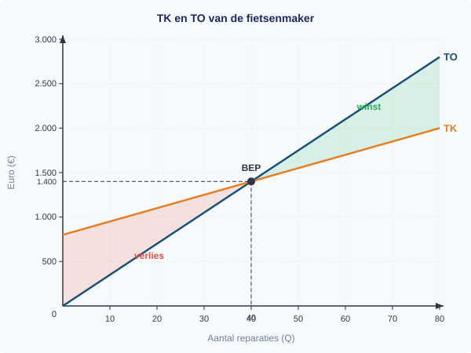

---

> **Samenvatting 1.3.3**
> - De **totale opbrengst** is het totale verkoopbedrag: TO = P x Q.
> - De **gemiddelde opbrengst** is de opbrengst per stuk: GO = TO / Q. Bij een constante prijs geldt GO = P.
> - **Winst** = TO - TK. Is de winst negatief, dan is er *verlies*.
> - Het **break-evenpunt** is het productieniveau waarbij TO = TK (winst = 0). Bereken: Q = TCK / (P - GVK).
> - In de grafiek is het break-evenpunt het snijpunt van de TK-lijn en de TO-lijn. Links ervan is verlies, rechts winst.
> - *In 1.3.4 oefen je met opgaven die kosten en opbrengsten combineren.*

> **Vastgelopen op een opgave?**
> Op de website vind je bij elke opgave een **begeleide inoefening**: stap voor stap krijg je extra hints en tussenstappen. Klik op de opgave om de begeleiding te starten.

---

## Opgaven

### Startoefeningen

**Opgave 1** *(lees de grafiek — zie figuur 6)*

In figuur 6 zie je de TK-lijn en de TO-lijn van een kledingwinkel.


a) Lees uit de grafiek af: wat is de totale opbrengst bij Q = 200?

b) Lees uit de grafiek af: wat zijn de totale kosten bij Q = 200?

c) Maakt de kledingwinkel winst of verlies bij Q = 200? Bereken het verschil.

d) Bij welke hoeveelheid ligt ongeveer het break-evenpunt? Leg uit hoe je dit uit de grafiek afleest.


**Opgave 2** *(teken in de grafiek — zie figuur 7)*

Een bloemist heeft constante kosten van €300 per week en variabele kosten van €2 per boeket. Ze verkoopt elk boeket voor €5.

a) Bereken TO en TK bij Q = 50 en Q = 150.

b) In figuur 7 is de TK-lijn al getekend. Teken de TO-lijn in dezelfde grafiek. Markeer het break-evenpunt.

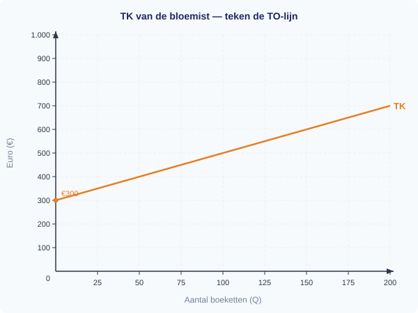

c) Arceer in je grafiek het winstgebied bij Q = 150.


**Opgave 3** *(redeneer zonder grafiek)*

Een ijssalon heeft constante kosten van €600 per maand en variabele kosten van €1,20 per ijsje. De verkoopprijs is €3 per ijsje.

a) Schrijf de formules voor TO en TK als functie van Q.

b) Bereken de winst bij Q = 400. Maakt de ijssalon winst of verlies?

c) Bereken het break-evenpunt. Geef je antwoord in hele ijsjes (rond naar boven af).

d) Leg uit waarom de ijssalon verlies maakt als hij minder dan het break-evenaantal verkoopt.

---

### Zelfstandige oefening

**Opgave 4**

Een drukkerij heeft constante kosten van €1.200 per maand. De variabele kosten per poster zijn €0,60. De verkoopprijs per poster is €1,80.

a) Stel de formules op voor TO en TK als functie van Q.

b) Bereken de winst bij Q = 800 en Q = 1500.

c) Bereken het break-evenpunt.

d) De eigenaar overweegt de prijs te verhogen naar €2,10. Bereken het nieuwe break-evenpunt. Wat valt je op?

e) Teken een grafiek met de TK-lijn en beide TO-lijnen (bij €1,80 en bij €2,10). Markeer beide break-evenpunten.


**Opgave 5**

Een foodtruck verkoopt hamburgers voor €6 per stuk. De constante kosten zijn €400 per dag (huur standplaats, generator). De variabele kosten per hamburger zijn €2,50.

a) Bereken GO bij Q = 100.

b) Bereken de winst bij Q = 100 en bij Q = 150.

c) Bereken het break-evenpunt. Hoeveel hamburgers moet de foodtruck minimaal verkopen om geen verlies te maken?

d) De eigenaar wil minstens €250 winst per dag maken. Bereken hoeveel hamburgers hij dan moet verkopen.

---

### Herhaling (interleaving)

**Opgave 6** *(herhaling 1.3.1: constante en variabele kosten)*

Een cateringbedrijf heeft de volgende kosten per maand:
- Huur keuken: €900
- Ingredienten per maaltijd: €4,50
- Verpakking per maaltijd: €0,50
- Afschrijving apparatuur: €300

a) Welke kosten zijn constant en welke zijn variabel?

b) Bereken TCK, GVK en TK bij Q = 200 maaltijden.


**Opgave 7** *(herhaling 1.3.2: GTK berekenen)*

Een T-shirtbedrijf heeft TK = 400 + 2,50Q.

a) Bereken GTK bij Q = 100 en Q = 400.

b) Leg uit waarom GTK daalt als Q toeneemt.


**Opgave 8** *(herhaling 1.2.2: vraagfactoren)*

De prijs van koffiecups voor een koffieapparaat daalt van €0,40 naar €0,25.

a) Verwacht je dat de vraag naar koffieapparaten stijgt of daalt? Leg uit welke vraagfactor hier speelt.

b) Is dit een beweging langs of een verschuiving van de vraaglijn van koffieapparaten?

---

### Doeloefening

**Opgave 9**

De bakker uit de theorie verkoopt brood voor €1,50 per stuk. Zijn constante kosten zijn €500 en zijn variabele kosten zijn €0,80 per brood (TK = 500 + 0,80Q).

a) Schrijf de formule voor TO als functie van Q.

b) Bereken TO en winst (TO - TK) bij Q = 500 en Q = 1000.

c) Bereken GO (= TO/Q) bij Q = 500. Wat valt je op?

d) Bij welk productieniveau draait de bakker precies break-even (winst = 0)? Laat dit zien met een berekening.

e) Teken een grafiek met TK en TO. Markeer het break-evenpunt. Arceer het winstgebied bij Q = 1000.

---

### Denkertje *(bonusopgave)*

**Opgave 10**

De bakker overweegt om de prijs van zijn brood te verlagen van €1,50 naar €1,20. Hij verwacht dat hij daardoor 30% meer broden verkoopt.

a) Stel dat de bakker nu 1000 broden per week verkoopt. Bereken de winst bij de huidige prijs (€1,50).

b) Bereken de verwachte afzet en de winst bij de nieuwe prijs (€1,20).

c) Is de prijsverlaging een goed idee? Beargumenteer je antwoord. Bedenk daarbij: welke informatie mist de bakker nog om een definitieve beslissing te nemen?


<div style="break-before: page;"></div>

# Gemengde opgaven §1.3.4 — Aanbod en kosten

---

## Opgave 1: Bakkerij "Korenveld"

Maaike is eigenaar van bakkerij "Korenveld" in Amersfoort. Ze verkoopt ambachtelijke croissants aan horecazaken in de regio. De verkoopprijs is vast: elke croissant levert €2,50 op. Maaike huurt een bakkerij voor €800 per maand (vast contract, ongeacht productie). De kosten voor ingrediënten, energie en verpakking hangen af van het aantal croissants dat ze bakt.

In haar jaarverslag heeft Maaike de kosten en opbrengsten per maand samengevat voor verschillende productieniveaus.

**Tabel 1: Kosten en opbrengsten bakkerij "Korenveld" per maand**

| Productie (stuks) | Constante kosten (€) | Variabele kosten (€) | Totale kosten (€) | Totale opbrengst (€) |
|---|---|---|---|---|
| 0 | 800 | 0 | 800 | 0 |
| 200 | 800 | 300 | 1.100 | 500 |
| 400 | 800 | 500 | 1.300 | 1.000 |
| 600 | 800 | 750 | 1.550 | 1.500 |
| 800 | 800 | 1.100 | 1.900 | 2.000 |
| 1.000 | 800 | 1.600 | 2.400 | 2.500 |
| 1.200 | 800 | 2.400 | 3.200 | 3.000 |

---

**1** *(2p)* Bereken de gemiddelde variabele kosten (GVK) en de gemiddelde totale kosten (GTK) bij een productie van 800 croissants. Laat je berekening zien.

**2** *(2p)* Bereken de winst van bakkerij "Korenveld" bij een productie van 1.000 croissants per maand.

**3** *(2p)* Leg uit bij welk productieniveau Maaike break-even draait. Gebruik de gegevens uit tabel 1 in je antwoord.

**4** *(2p)* Bepaal met behulp van tabel 1 bij welke productie de winst maximaal is. Laat zien hoe je dit vaststelt.

**5** *(2p)* Maaike overweegt om 1.200 croissants per maand te bakken in plaats van 1.000. Leg uit waarom dit bedrijfseconomisch geen verstandige keuze is, ook al verkoopt ze dan meer croissants.

**Denkertje** *(2p)* Maaike zegt: "Hoe meer ik produceer, hoe lager mijn gemiddelde kosten, dus ik moet altijd zoveel mogelijk bakken." Beoordeel of deze uitspraak klopt. Gebruik gegevens uit tabel 1 om je antwoord te onderbouwen.

---

## Opgave 2: Fietsfabriek "VeloTech"

Fietsfabriek "VeloTech" produceert stadsfietsen. Figuur 1 toont de oorspronkelijke aanbodlijn van stadsfietsen op de Nederlandse markt.


Lees het volgende nieuwsbericht:

> **Staalprijs stijgt met 30% door exportbeperkingen**
>
> De prijs van staal is het afgelopen kwartaal fors gestegen. China heeft exportbeperkingen ingevoerd voor staal, waardoor de wereldwijde aanvoer is afgenomen. Voor Nederlandse fietsfabrikanten betekent dit hogere inkoopkosten voor frames en onderdelen. Branchevereniging RAI verwacht dat de productiekosten per fiets gemiddeld met €40 stijgen.

VeloTech heeft de volgende kostenstructuur bij een productie van 5.000 fietsen per jaar:

**Tabel 2: Kostenstructuur VeloTech (5.000 fietsen per jaar)**

| Kostenpost | Bedrag (€) | Type |
|---|---|---|
| Huur fabriek | 200.000 | Constant |
| Afschrijving machines | 80.000 | Constant |
| Salarissen vaste medewerkers | 120.000 | Constant |
| Staal en onderdelen | 500.000 | Variabel |
| Energie | 50.000 | Variabel |
| Verpakking en transport | 100.000 | Variabel |

De verkoopprijs per fiets is €230. Na de staalstijging worden de kosten voor staal en onderdelen €200.000 hoger (€700.000 in totaal).

---

**6** *(2p)* Bereken de totale constante kosten (TCK) en de totale variabele kosten (TVK) van VeloTech vóór de staalstijging. Gebruik tabel 2.

**7** *(2p)* Bereken de gemiddelde totale kosten (GTK) per fiets vóór de staalstijging.

**8** *(2p)* Het nieuwsbericht beschrijft een stijging van de staalprijs. Noem de aanbodfactor die hierdoor verandert. Leg uit of dit leidt tot een verschuiving van de aanbodlijn of een beweging langs de aanbodlijn.

**9** *(2p)* Leg uit dat de stijging van de staalprijs leidt tot een daling van de winst per fiets voor VeloTech. Gebruik een berekening vóór en ná de staalstijging.

**10** *(3p)* Na de staalstijging overweegt VeloTech de verkoopprijs te verhogen naar €270. Een concurrent biedt vergelijkbare fietsen aan voor €250. Leg uit wat het effect is op de aanbodlijn als VeloTech de prijs verhoogt naar €270. Is dit een verschuiving of een beweging langs de lijn? Motiveer je antwoord.

**Denkertje** *(2p)* Een econoom zegt: "Als de productiekosten stijgen, moeten bedrijven altijd hun verkoopprijs verhogen om te overleven." Beoordeel deze uitspraak. Geef in je antwoord minstens één reden waarom een bedrijf ervoor kan kiezen de prijs niet te verhogen.