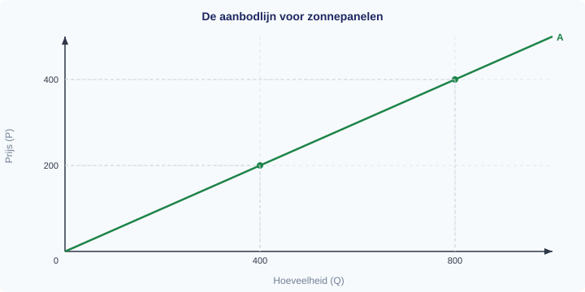
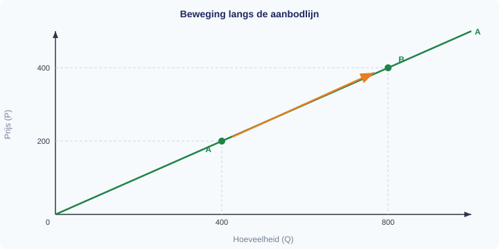
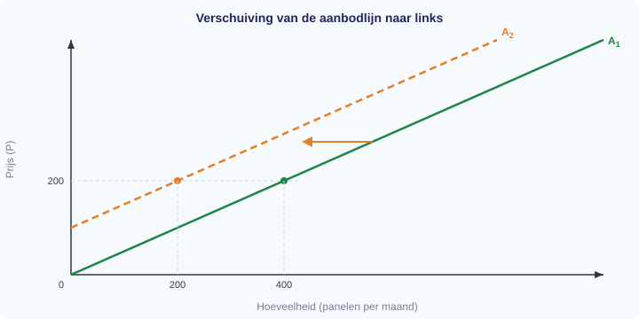
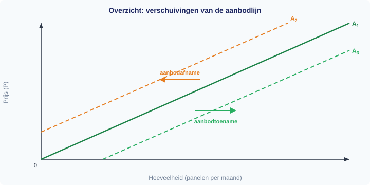

# 1.3.1 Aanbod

## Zonnepanelen op elk dak — maar waarom worden ze duurder?

Je ziet ze overal: zonnepanelen op daken van huizen, scholen en bedrijven. De productie van zonnepanelen is de afgelopen jaren enorm gegroeid. Fabrikanten investeren in nieuwe fabrieken, robots solderen de cellen steeds sneller, en de kosten per paneel dalen al jaren.

Maar in 2021 gebeurde iets vreemds. De prijs van silicium — de belangrijkste grondstof voor zonnepanelen — verdrievoudigde. Fabrikanten konden ineens minder panelen produceren tegen dezelfde kosten. Sommige kleinere producenten stopten helemaal. Het aanbod van zonnepanelen kromp.

Hoe kan het dat een verandering in de prijs van een grondstof het hele aanbod beïnvloedt — terwijl de prijs van het zonnepaneel zelf niet verandert? In deze paragraaf leer je het antwoord. Je leert de aanbodlijn tekenen, begrijpen waarom die omhoog loopt, en onderscheiden wanneer je *langs* de lijn beweegt en wanneer de hele lijn *verschuift*.

---

## Theorie

### De aanbodlijn als startpunt

> **📋 Herhaling uit §1.2.2**
> Bij de vraaglijn leerde je het verschil tussen een *beweging langs* de lijn (door een verandering van de eigen prijs) en een *verschuiving van* de lijn (door een verandering van een vraagfactor). De vraaglijn laat zien hoeveel consumenten willen kopen bij elke prijs, **terwijl alle andere omstandigheden gelijk blijven** (ceteris paribus). Ditzelfde principe geldt ook voor het aanbod.

De **aanbodlijn** laat het verband zien tussen de prijs van een goed en de aangeboden hoeveelheid, **terwijl alle andere omstandigheden gelijk blijven** (ceteris paribus).

Op de verticale as staat de prijs (P), op de horizontale as de aangeboden hoeveelheid (Q). We tekenen de aanbodlijn voor zonnepanelen. Bij een prijs van €200 per paneel bieden fabrikanten 400 panelen per maand aan. Bij een prijs van €400 bieden ze 800 panelen aan.

> **Definitie: Aanbodlijn (A)**
> De grafische weergave van het verband tussen de prijs en de aangeboden hoeveelheid, ceteris paribus. De aanbodlijn loopt van linksonder naar rechtsboven: hoe hoger de prijs, hoe groter de aangeboden hoeveelheid.

Waarom loopt de aanbodlijn omhoog? Bij een hogere prijs is het voor meer producenten rendabel om te produceren. Een fabrikant die bij €200 net geen winst maakt, kan bij €400 wél uit de kosten komen. Bovendien breiden bestaande producenten hun productie uit als de prijs stijgt. Dit heet de **wet van het aanbod**.

> **Definitie: Wet van het aanbod**
> Bij een hogere prijs is de aangeboden hoeveelheid groter, ceteris paribus. Bij een lagere prijs is de aangeboden hoeveelheid kleiner.

---

### Beweging langs de aanbodlijn

Wat gebeurt er als de prijs van zonnepanelen stijgt van €200 naar €400? Je schuift *langs* de aanbodlijn omhoog: van punt A naar punt B. De aangeboden hoeveelheid stijgt van 400 naar 800 panelen.

Dit heet een **beweging langs de aanbodlijn**. De lijn zelf verandert niet. Je verplaatst je alleen naar een ander punt op dezelfde lijn.

**Oorzaak:** een verandering van de prijs van het goed zelf.

Let op de pijl in figuur 2: die loopt *langs* de bestaande lijn. De lijn verschuift niet.

---

### Verschuiving van de aanbodlijn

Nu het tweede geval. De prijs van zonnepanelen blijft €200. Maar de prijs van silicium (de grondstof) verdrievoudigt. Producenten moeten bij *elke* prijs meer kosten maken. Sommige stoppen, anderen produceren minder.

Bij €200 bieden ze geen 400, maar 200 panelen aan. Bij €400 geen 800, maar 600 panelen. Elk punt op de lijn schuift naar links. Er ontstaat een nieuwe aanbodlijn (A₂), links van de oude (A₁).

Dit heet een **verschuiving van de aanbodlijn**. De hele lijn verplaatst.

**Oorzaak:** een verandering van een andere factor dan de prijs van het goed zelf.

De horizontale pijl in figuur 3 laat zien dat de hele lijn opschuift naar links. Bij dezelfde prijs is de aangeboden hoeveelheid kleiner geworden.

> **⚠️ Let op — veelgemaakte fout**
> Veel leerlingen verwarren een *verschuiving van* de aanbodlijn met een *beweging langs* de aanbodlijn.
> - Verandering van de prijs van het goed zelf → **beweging LANGS** de lijn.
> - Verandering van productiekosten, technologie of andere factoren → **verschuiving VAN** de lijn.

---

### Aanbodfactoren: wat verschuift de aanbodlijn?

De factoren die de hele aanbodlijn verschuiven, heten **aanbodfactoren**. Er zijn er vijf:

> **Definitie: Aanbodfactoren**
> Factoren die de positie van de aanbodlijn bepalen. Een verandering van een aanbodfactor verschuift de hele aanbodlijn naar links of naar rechts.

**1. Prijzen van productiefactoren (inputprijzen)**

Als grondstoffen, arbeid of energie duurder worden, stijgen de productiekosten. Producenten bieden bij elke prijs minder aan. De aanbodlijn verschuift naar links. Worden grondstoffen goedkoper, dan verschuift de aanbodlijn naar rechts.

Voorbeeld: de prijs van silicium stijgt → de aanbodlijn van zonnepanelen verschuift naar links.

**2. Technologie**

Een betere productietechnologie verlaagt de kosten per eenheid. Producenten kunnen bij elke prijs meer aanbieden. De aanbodlijn verschuift naar rechts.

Voorbeeld: een nieuwe lasertechniek versnelt de productie van zonnepanelen → de aanbodlijn verschuift naar rechts.

**3. Aantal aanbieders**

Als er meer producenten op de markt komen, stijgt het totale aanbod. De aanbodlijn verschuift naar rechts. Vertrekken er aanbieders, dan verschuift de lijn naar links.

Voorbeeld: een Chinese fabrikant opent een fabriek in Europa → de aanbodlijn van zonnepanelen verschuift naar rechts.

**4. Verwachtingen van producenten**

Als producenten verwachten dat de prijs in de toekomst gaat stijgen, houden ze nu voorraad achter. Het huidige aanbod daalt, de aanbodlijn verschuift naar links. Verwachten ze een prijsdaling, dan verkopen ze nu zoveel mogelijk — de aanbodlijn verschuift naar rechts.

Voorbeeld: fabrikanten verwachten dat zonnepanelen over drie maanden 20% duurder worden → ze verkopen nu minder, de aanbodlijn verschuift naar links.

**5. Overheidsbeleid**

De overheid kan het aanbod beïnvloeden met subsidies, belastingen en regels. Een productiesubsidie verlaagt de kosten voor producenten → de aanbodlijn verschuift naar rechts. Een accijns of strenge milieu-eis verhoogt de kosten → de aanbodlijn verschuift naar links.

Voorbeeld: de overheid geeft €50 subsidie per geproduceerd zonnepaneel → de aanbodlijn verschuift naar rechts.

---

### Overzicht aanbodfactoren

Figuur 5 vat de vijf aanbodfactoren in één beeld samen. Onthoud: deze vijf factoren kunnen de hele lijn verschuiven. De prijs van het goed zelf staat er niet bij — die veroorzaakt een beweging *langs* de lijn, niet een verschuiving.

De onderstaande tabel laat bij elke prijs zien hoeveel panelen worden aangeboden in drie situaties: de oorspronkelijke aanbodlijn (A₁), na een kostenstijging (A₂, verschuiving naar links), en na een subsidie (A₃, verschuiving naar rechts).

| Prijs (€) | Q aangeboden (A₁) | Q aangeboden (A₂, kosten ↑) | Q aangeboden (A₃, subsidie) |
|---|---|---|---|
| 100 | 200 | 0 | 400 |
| 200 | 400 | 200 | 600 |
| 300 | 600 | 400 | 800 |
| 400 | 800 | 600 | 1.000 |

Zo zie je dezelfde informatie nu in drie vormen tegelijk: in de tekst hierboven, in de overzichtsfiguur, én in deze tabel.

---

### Overzicht: beweging langs versus verschuiving van

Figuur 4 vat alles samen in twee panelen. Het linkerpaneel laat een beweging langs de aanbodlijn zien, het rechterpaneel een verschuiving van de aanbodlijn.

**Aanbod neemt toe (verschuiving naar rechts):**
- Inputprijzen dalen (goedkopere grondstoffen, lager loon)
- Betere technologie
- Meer aanbieders op de markt
- Verwachte prijsdaling (producenten verkopen nu)
- Overheidssubsidie

**Aanbod neemt af (verschuiving naar links):**
- Inputprijzen stijgen (duurdere grondstoffen, hoger loon)
- Verouderde technologie of productieproblemen
- Minder aanbieders op de markt
- Verwachte prijsstijging (producenten houden voorraad achter)
- Belastingverhoging of strengere regelgeving

---

## Uitgewerkt voorbeeld

> **De markt voor elektrische fietsen**
>
> De markt voor elektrische fietsen (e-bikes) is in evenwicht bij P = €1.500 en Q = 3.000 fietsen per maand. De aanbodlijn loopt via A₁.

**(a)** De prijs van e-bikes stijgt naar €2.000. Is dit een beweging langs of een verschuiving van de aanbodlijn? Verklaar je antwoord.

*Antwoord:* Dit is een **beweging langs** de aanbodlijn. De prijs van het goed zelf verandert (van €1.500 naar €2.000). Bij een hogere prijs is de aangeboden hoeveelheid groter. Je schuift langs de bestaande aanbodlijn naar een punt rechtsboven.

**(b)** De prijs van e-bikes blijft €1.500, maar de prijs van lithiumbatterijen (een belangrijke grondstof) daalt fors. Is dit een beweging langs of een verschuiving van de aanbodlijn? Verklaar je antwoord.

*Antwoord:* Dit is een **verschuiving van** de aanbodlijn naar rechts. De prijs van e-bikes verandert niet, maar een aanbodfactor wel: **de prijs van een productiefactor** (lithiumbatterijen). Doordat de grondstof goedkoper wordt, dalen de productiekosten. Producenten kunnen bij elke prijs meer e-bikes aanbieden. De aanbodlijn verschuift van A₁ naar A₂ (naar rechts).

> ⚠️ Let op de juiste aanbodfactor. Het is verleidelijk om te zeggen "de technologie is verbeterd". Maar er is niets veranderd aan de manier van produceren — alleen de grondstofprijs is gedaald. De economisch precieze categorie is daarom *prijs van een productiefactor (inputprijs)*.

**(c)** Leg in eigen woorden uit waarom de aanbodlijn naar rechts verschuift en niet naar links als de grondstofkosten dalen.

*Antwoord:* Als grondstoffen goedkoper worden, kan een fabrikant dezelfde e-bike voor minder kosten maken. Daardoor wordt het bij een lagere prijs al rendabel om te produceren. Producenten die voorheen niet uit de kosten kwamen, kunnen nu wél aanbieden. Bij elke prijs zijn er dus meer e-bikes beschikbaar — de hele aanbodlijn schuift naar rechts.

---

> **Samenvatting §1.3.1**
> - De aanbodlijn laat het verband zien tussen de prijs en de aangeboden hoeveelheid (ceteris paribus). De lijn loopt omhoog: hoe hoger de prijs, hoe meer er wordt aangeboden (**wet van het aanbod**).
> - Een verandering van de prijs van het goed zelf veroorzaakt een **beweging langs** de aanbodlijn.
> - Een verandering van een aanbodfactor (inputprijzen, technologie, aantal aanbieders, verwachtingen, overheidsbeleid) veroorzaakt een **verschuiving van** de aanbodlijn.
> - Verschuiving naar rechts = aanbod neemt toe. Verschuiving naar links = aanbod neemt af.
> - *In de volgende paragraaf bekijken we de kostenstructuur van een producent: welke kosten zijn vast, welke variabel, en hoe berekent een ondernemer de gemiddelde kosten per product?*

> **💡 Vastgelopen op een opgave?**
> Op de website vind je bij elke opgave een **begeleide inoefening**: stap voor stap krijg je extra hints en tussenstappen. Klik op de opgave om de begeleiding te starten.

---

## Opgaven

### Startoefeningen

**Opgave 1** *(lees de grafiek — zie figuur 6)*

In figuur 6 zie je twee veranderingen op de markt voor brood. Beide situaties zijn al voor je getekend en gelabeld.

a) Beschrijf wat er in **Situatie 1** gebeurt: wat verandert er met de prijs en de aangeboden hoeveelheid? Welke factor zou dit veroorzaakt kunnen hebben?

b) Beschrijf wat er in **Situatie 2** gebeurt: wat verandert er met de prijs en de aangeboden hoeveelheid? Welke factor zou dit veroorzaakt kunnen hebben?

c) Leg in eigen woorden uit waarom Situatie 1 een *beweging langs* de aanbodlijn is, en Situatie 2 een *verschuiving van* de aanbodlijn.

**Opgave 2** *(teken in de grafiek — zie figuur 7)*

De markt voor laptops is in evenwicht bij P = €800 en Q = 5.000 stuks per maand. In figuur 7 zie je de aanbodlijn A₁ met punt E.

a) De prijs van laptops daalt naar €600. Laat in de grafiek zien wat er gebeurt. Is dit een verschuiving van de aanbodlijn of een beweging langs de aanbodlijn? Leg uit.

b) Een nieuwe chiptechnologie verlaagt de productiekosten van laptops aanzienlijk. Laat in de grafiek zien wat er gebeurt met het aanbod van laptops. Is dit een verschuiving of een beweging? Leg uit.

c) De overheid voert een milieubelasting in op de productie van laptops. Wat verwacht je dat er gebeurt met de aanbodlijn? Is dit een verschuiving of een beweging? Geef de richting aan.

**Opgave 3**

De markt voor koffie is in evenwicht. Er doen zich achtereenvolgens drie veranderingen voor. Beantwoord voor elke verandering de vragen. Er is geen grafiek bij deze opgave — beschrijf wat er in een grafiek zou gebeuren.

a) De prijs van koffie daalt van €8 naar €6 per kilo.
- Verschuift de aanbodlijn of beweeg je langs de aanbodlijn?
- In welke richting?

b) Door een droogte in Brazilië mislukt een groot deel van de koffieoogst. De kosten per kilo koffiebonen stijgen fors. De prijs van koffie blijft gelijk.
- Verschuift de aanbodlijn of beweeg je langs de aanbodlijn?
- In welke richting verschuift of beweegt de lijn?

c) De overheid verlaagt de importbelasting op koffie.
- Wat gebeurt er nu met het aanbod van koffie?
- Is dit een verschuiving of een beweging? Leg uit.

d) Noem bij elk van de drie situaties (a, b, c) welke aanbodfactor verandert. Kies uit: eigen prijs, inputprijzen, technologie, aantal aanbieders, verwachtingen, overheidsbeleid.

**Opgave 4** *(twee veranderingen tegelijk — let goed op!)*

Op de markt voor T-shirts gebeuren twee dingen op dezelfde dag:

1. De prijs van T-shirts stijgt van €15 naar €20.
2. Tegelijk stijgt het minimumloon fors, waardoor de loonkosten voor textielfabrieken toenemen.

a) Bekijk eerst alleen verandering 1. Wat gebeurt er met het aanbod van T-shirts? Is dit een beweging langs of een verschuiving van de aanbodlijn? In welke richting?

b) Bekijk nu alleen verandering 2. Wat gebeurt er met het aanbod van T-shirts? Is dit een beweging langs of een verschuiving van de aanbodlijn? In welke richting?

c) Beide veranderingen gebeuren tegelijkertijd. Beschrijf het netto-effect op de aangeboden hoeveelheid T-shirts. Versterken de twee effecten elkaar of werken ze tegen elkaar in?

d) Een leerling zegt: "De prijs verandert *en* de kosten veranderen, dus alles is een beweging langs de aanbodlijn." Leg uit waarom dit niet klopt.

---

### Zelfstandige oefening

**Opgave 5**

De markt voor biologische melk is in evenwicht bij P = €1,20 per liter en Q = 50.000 liter per week.

a) Geef vier aanbodfactoren die de aanbodlijn van biologische melk kunnen laten verschuiven (niet: de eigen prijs).

b) Leg voor elk van de vier factoren uit of de aanbodlijn naar rechts of naar links verschuift. Geef bij elke factor een concreet voorbeeld.

c) De prijs van biologisch veevoer (een grondstof) stijgt met 30%. Teken een aanbodlijn voor biologische melk en laat zien wat er gebeurt. Is dit een verschuiving of een beweging? Leg uit.

d) Na de kostenstijging van het veevoer besluit de zuivelcoöperatie de melkprijs te verhogen van €1,20 naar €1,50. Teken in dezelfde grafiek wat er nu gebeurt met de aangeboden hoeveelheid. Is dit een verschuiving of een beweging?

**Opgave 6**

Hieronder staan zes situaties op de markt voor kleding. Vul de tabel in: bepaal voor elke situatie of het om een beweging of een verschuiving gaat, welke richting, en welke aanbodfactor de oorzaak is.

| | Situatie | Beweging of verschuiving? | Richting | Aanbodfactor |
|---|---|---|---|---|
| a | De verkoopprijs van jassen stijgt van €80 naar €110. |  |  |  |
| b | De prijs van katoen (grondstof) daalt door een goede oogst. |  |  |  |
| c | Drie nieuwe kledingfabrieken openen in Turkije. |  |  |  |
| d | Fabrikanten verwachten dat de vraag naar winterjassen volgend seizoen sterk stijgt. |  |  |  |
| e | De overheid voert een CO₂-belasting in op textielproductie. |  |  |  |
| f | Een nieuw robotsysteem maakt het naaien van kleding twee keer zo snel. |  |  |  |

---

### Herhaling (interleaving)

**Opgave 7** *(herhaling §1.1.2: procentuele verandering)*

De prijs van silicium stijgt van €25 per kilo naar €32 per kilo.

a) Bereken de procentuele prijsstijging.

b) Een jaar later daalt de prijs met 15% ten opzichte van €32. Bereken de nieuwe prijs.

**Opgave 8** *(herhaling §1.2.1: betalingsbereidheid en individuele vraag)*

Een consument wil een zonnepaneel kopen. Zijn maximale betalingsbereidheid is €350.

a) Het zonnepaneel kost €290. Bereken het consumentensurplus.

b) De prijs stijgt naar €375. Koopt de consument het paneel? Leg uit met het begrip betalingsbereidheid.

**Opgave 9** *(herhaling §1.2.2: vraagfactoren — verschuiving versus beweging)*

Op de markt voor hardloopschoenen doen zich twee veranderingen voor:

a) De prijs van hardloopschoenen stijgt van €120 naar €140. Is dit een verschuiving van of een beweging langs de vraaglijn? Welke richting?

b) Een populaire influencer promoot hardlopen op social media. De prijs van hardloopschoenen blijft gelijk. Is dit een verschuiving of een beweging? Welke vraagfactor verandert?

---

### Doeloefening

**Opgave 10**

De markt voor zonnepanelen is in evenwicht.

a) Een fabrikant van zonnepanelen wordt geconfronteerd met hogere siliciumprijzen. Laat in een grafiek zien wat er gebeurt met de aanbodlijn van zonnepanelen. Verklaar je antwoord.

b) De overheid voert een subsidie in op de productie van zonnepanelen. Laat het effect op de aanbodlijn zien.

c) Noem drie factoren die de aanbodlijn doen verschuiven en geef bij elke factor een voorbeeld.

d) Teken een aanbodlijn. Geef in de grafiek een beweging langs de lijn aan én een verschuiving van de lijn. Label duidelijk welke welke is.

---

### Denkertje *(bonusopgave)*

**Opgave 11**

De Europese Unie wil de productie van groene waterstof stimuleren. Er worden twee maatregelen overwogen:

- **Maatregel A:** Een subsidie van €2 per kilogram geproduceerde groene waterstof.
- **Maatregel B:** Investeren in onderzoek naar een nieuwe, goedkopere productiemethode voor groene waterstof.

a) Leg met behulp van het verschil tussen aanbodfactoren uit hoe beide maatregelen de aanbodlijn van groene waterstof beïnvloeden. Welke aanbodfactor wordt in elk geval aangesproken?

b) Een criticus stelt: "Maatregel A kost de overheid elk jaar geld. Maatregel B kost eenmalig geld, maar het effect is blijvend." Beoordeel deze stelling. Gebruik economische argumenten en betrek de begrippen 'productiekosten' en 'technologie' in je antwoord.
