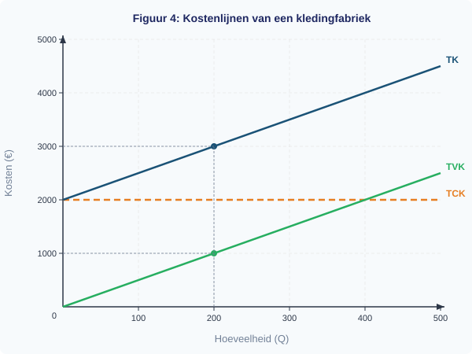

# 1.3.2 Kostenstructuren — opgaven

## Uitgewerkt voorbeeld

> **De fietsenmaker**
>
> Een fietsenmaker heeft constante kosten van €800 per maand (huur werkplaats, gereedschap, verzekering). De variabele kosten zijn €15 per fietsreparatie (onderdelen en smeermiddelen).

**(a)** Schrijf de formules voor TCK, TVK en TK als functie van Q (het aantal reparaties).

*Stap 1: Identificeer de constante en variabele kosten.*

- Constante kosten: €800 per maand → TCK = 800
- Variabele kosten: €15 per reparatie → TVK = 15 x Q

*Stap 2: Stel de formule voor TK op.*

TK = TCK + TVK = 800 + 15Q

**(b)** Bereken TK, TVK en TCK bij Q = 40 en Q = 80.

*Stap 3: Vul de hoeveelheden in.*

| Q | TCK (€) | TVK (€) | TK (€) |
|---|---------|---------|--------|
| 40  | 800 | 15 x 40 = 600   | 800 + 600 = 1400 |
| 80  | 800 | 15 x 80 = 1200  | 800 + 1200 = 2000 |

**(c)** Bereken GTK, GVK en GCK bij Q = 40 en Q = 80.

*Stap 4: Deel de totalen door Q.*

| Q | GCK (€) | GVK (€) | GTK (€) |
|---|---------|---------|---------|
| 40  | 800 / 40 = 20,00  | 600 / 40 = 15,00  | 1400 / 40 = 35,00 |
| 80  | 800 / 80 = 10,00  | 1200 / 80 = 15,00 | 2000 / 80 = 25,00 |

Controle: GTK = GCK + GVK → 20 + 15 = 35 ✓ en 10 + 15 = 25 ✓

**(d)** Wat gebeurt er met GTK als Q toeneemt?

GTK daalt van €35 naar €25. Dit komt doordat GCK daalt (van €20 naar €10): de vaste kosten worden over meer reparaties verspreid. GVK blijft constant op €15. Dus de daling van GTK wordt volledig veroorzaakt door het spreidingseffect van de constante kosten.

---

> **Samenvatting §1.3.2**
> - Kosten bestaan uit **constante kosten** (CK, veranderen niet met Q) en **variabele kosten** (VK, veranderen wel met Q).
> - **Totale kosten**: TK = TCK + TVK. TCK is vast, TVK stijgt met Q.
> - **Gemiddelde kosten**: GTK = TK/Q, GVK = TVK/Q, GCK = TCK/Q. Ook geldt: GTK = GCK + GVK.
> - **Spreidingseffect**: GCK daalt als Q stijgt, omdat de vaste kosten over meer eenheden worden verdeeld. Daardoor daalt ook GTK.
> - GVK is constant wanneer de variabele kosten per stuk niet veranderen.
> - *In §1.3.3 leer je hoe je de opbrengsten (TO, GO) berekent en vergelijkt met de kosten om de winst te bepalen.*

> **💡 Vastgelopen op een opgave?**
> Op de website vind je bij elke opgave een **begeleide inoefening**: stap voor stap krijg je extra hints en tussenstappen. Klik op de opgave om de begeleiding te starten.

---

## Opgaven

### Startoefeningen

**Opgave 1** *(lees de grafiek — zie figuur 4)*

In figuur 4 zie je de TK-, TVK- en TCK-lijnen van een kledingfabriek.

a) Lees uit de grafiek af: hoe hoog zijn de totale constante kosten (TCK)?

b) Lees af: wat zijn de totale kosten (TK) bij Q = 200? En wat zijn de totale variabele kosten (TVK) bij Q = 200?

c) Controleer: klopt het dat TK = TCK + TVK bij Q = 200? Laat je berekening zien.

d) Een medewerker zegt: "Als we meer produceren, stijgen alle kosten." Klopt deze bewering? Leg uit welke kosten stijgen en welke niet.

**Opgave 2** *(bereken en teken)*

Een cateringbedrijf heeft vaste kosten van €600 per maand (huur keuken, apparatuur). De variabele kosten bedragen €4 per maaltijd.

a) Schrijf de formules voor TCK, TVK en TK als functie van Q (het aantal maaltijden).

b) Bereken TK bij Q = 50, Q = 150 en Q = 300. Zet de resultaten in een tabel.

c) Teken de drie kostenlijnen (TCK, TVK en TK) in een assenstelsel met Q op de x-as en kosten (€) op de y-as. Gebruik het lege assenstelsel in figuur 5.

d) Leg uit waarom de TK-lijn en de TVK-lijn evenwijdig lopen.

**Opgave 3** *(gemiddelde kosten berekenen — geen grafiek)*

Een drukkerij heeft constante kosten van €1200 per maand. De variabele kosten zijn €0,50 per flyer.

a) Bereken GTK, GVK en GCK bij een productie van 400 flyers.

b) Bereken GTK, GVK en GCK bij een productie van 2400 flyers.

c) Leg uit waarom GTK daalt als de productie stijgt. Gebruik de begrippen GCK en GVK in je uitleg.

d) Een klant bestelt 400 flyers en betaalt €4 per stuk. Een andere klant bestelt 2400 flyers en betaalt €1,50 per stuk. Bij welke bestelling verdient de drukkerij meer per flyer? Leg uit.

---

### Zelfstandige oefening

**Opgave 4**

Een sportschool heeft vaste kosten van €3000 per maand (huur, apparatuur, personeel). De variabele kosten per lid bedragen €5 per maand (water, schoonmaak, handdoeken).

a) Schrijf de formules voor TCK, TVK en TK als functie van Q (het aantal leden).

b) Bereken TK, GTK, GVK en GCK bij Q = 100 en Q = 600. Zet alle resultaten in een overzichtelijke tabel.

c) De sportschool rekent een maandabonnement van €15 per lid. Bereken bij welk aantal leden de opbrengst per lid precies gelijk is aan de gemiddelde totale kosten (GTK). *Hint: stel GO = GTK en los op naar Q.*

d) Teken de GCK-, GVK- en GTK-lijnen in een assenstelsel. Geef aan naar welke waarde GTK kruipt bij heel grote Q.

**Opgave 5**

Twee bedrijven produceren hetzelfde product:

| | Bedrijf A | Bedrijf B |
|---|-----------|-----------|
| TCK per maand | €2000 | €500 |
| GVK per stuk | €3 | €6 |

a) Schrijf voor beide bedrijven de formule voor TK als functie van Q.

b) Bereken voor beide bedrijven GTK bij Q = 200 en Q = 1000.

c) Bij welk productievolume zijn de GTK van beide bedrijven gelijk? Laat je berekening zien.

d) Welk bedrijf heeft een voordeel bij een groot productievolume? Leg uit met het begrip spreidingseffect.

---

### Herhaling (interleaving)

**Opgave 6** *(herhaling §1.2.1: betalingsbereidheid en koopbeslissing)*

Een consument wil smoothies kopen. Zijn betalingsbereidheid: €5 voor de eerste, €3,50 voor de tweede, €2 voor de derde, €0,75 voor de vierde.

a) De marktprijs is €3. Hoeveel smoothies koopt de consument?

b) Bereken het totale consumentensurplus.

**Opgave 7** *(herhaling §1.2.2: verschuiving van de vraaglijn)*

De markt voor fietsen wordt getroffen door twee gebeurtenissen:
1. De benzineprijs stijgt fors.
2. Tegelijkertijd verlaagt een grote fietsenfabrikant zijn prijzen.

a) Welke gebeurtenis leidt tot een verschuiving van de vraaglijn naar fietsen? Leg uit welke richting de vraaglijn verschuift en noem de vraagfactor.

b) Welke gebeurtenis leidt tot een beweging langs de vraaglijn? Leg uit.

**Opgave 8** *(herhaling §1.3.1: opbrengsten — als §1.3.1 behandeld is)*

Een marktkraam verkoopt bloemen voor €3 per bos. De vaste kosten zijn €80 per dag. De variabele kosten bedragen €1,20 per bos.

a) Bereken de totale opbrengst (TO) bij een verkoop van 60 bossen.

b) Bereken de totale kosten (TK) bij Q = 60.

c) Bereken de winst bij Q = 60.

---

### Doeloefening

**Opgave 9**

Een bakkerij heeft constante kosten van €500 per maand (huur, verzekering). Elk brood kost €0,80 aan ingredienten en energie (variabele kosten per stuk).

a) Schrijf de formules voor TK, TVK en TCK als functie van Q.

b) Bereken TK, TVK en TCK bij Q = 500 en Q = 1000.

c) Bereken GTK, GVK en GCK bij Q = 500 en Q = 1000.

d) Wat gebeurt er met GTK als Q toeneemt? Leg uit waarom dit logisch is.

e) Een leerling zegt: "GCK is altijd hetzelfde." Klopt dit? Leg uit.

---

### Denkertje *(bonusopgave)*

**Opgave 10**

Twee ijsfabrieken produceren precies hetzelfde ijs. Fabriek X heeft gekozen voor dure, moderne robots (hoge vaste kosten, lage variabele kosten per stuk). Fabriek Y werkt met goedkopere apparatuur en meer handarbeid (lage vaste kosten, hoge variabele kosten per stuk).

a) Schets voor beide fabrieken (in dezelfde grafiek) een mogelijke GTK-lijn. Geef aan bij welk productievolume fabriek X goedkoper produceert dan fabriek Y, en andersom.

b) In een recessie daalt de vraag naar ijs sterk. Welke fabriek zit dan in een moeilijkere positie? Beargumenteer je antwoord met behulp van de begrippen GCK en spreidingseffect.

c) Bedenk een ander voorbeeld uit de echte wereld van een bedrijf met zeer hoge vaste kosten en lage variabele kosten. Leg uit waarom zo'n bedrijf een groot afzetvolume nodig heeft om winstgevend te zijn.
