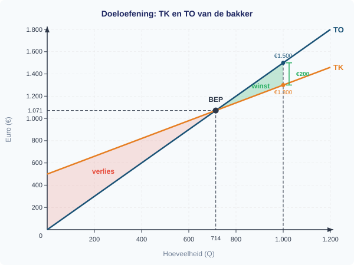

# 1.3.3 Opbrengsten — antwoorden

**Afrondingsregel:** Rond af op 2 decimalen tenzij anders aangegeven.

---

## Procedure (uit het uitgewerkt voorbeeld)

| Stap | Vraag |
|------|-------|
| 1 | Stel de formule voor TO op: TO = P x Q |
| 2 | Stel de formule voor TK op: TK = TCK + GVK x Q |
| 3 | Bereken winst: Winst = TO - TK |
| 4 | Break-evenpunt: stel TO = TK, los op naar Q |

---

**Opgave 1**

**a)** Lees af uit de grafiek: bij Q = 200 is TO = **€1.000** (afhankelijk van de schaal in figuur 6).

*Waarom: de TO-lijn geeft de totale verkoopopbrengst weer bij elke hoeveelheid.*

**b)** Lees af uit de grafiek: bij Q = 200 is TK = **€800** (afhankelijk van de schaal in figuur 6).

*Waarom: de TK-lijn geeft de totale kosten weer, inclusief de constante kosten als startpunt.*

**c)** Winst = TO - TK = 1.000 - 800 = **€200** (winst).

De kledingwinkel maakt winst, want TO > TK.

*Waarom: zolang de opbrengstlijn boven de kostenlijn ligt, is het verschil positief en maakt het bedrijf winst.*

**d)** Het break-evenpunt ligt bij de hoeveelheid waar de TK-lijn en de TO-lijn elkaar kruisen. Op dat punt is de verticale afstand tussen de twee lijnen nul (TO = TK). Lees de Q-waarde af op de horizontale as bij het snijpunt.

*Waarom: links van het snijpunt is TK > TO (verlies), rechts is TO > TK (winst). Het snijpunt is het omslagpunt.*

---

**Opgave 2**

**a)**
Stap 1: Bereken TO en TK bij Q = 50.
TO = 5 x 50 = **€250**
TK = 300 + 2 x 50 = 300 + 100 = **€400**

Stap 2: Bereken TO en TK bij Q = 150.
TO = 5 x 150 = **€750**
TK = 300 + 2 x 150 = 300 + 300 = **€600**

*Waarom: bij Q = 50 is TK > TO (verlies van €150), bij Q = 150 is TO > TK (winst van €150). Ergens daartussenin ligt het break-evenpunt.*

**b)** De TO-lijn begint in de oorsprong (0, 0) en loopt door (50, 250) en (150, 750). Het break-evenpunt:
TO = TK → 5Q = 300 + 2Q → 3Q = 300 → Q = 100.
Bij Q = 100: TO = TK = €500. Markeer het punt (100, 500) als break-evenpunt.

*Waarom: de TO-lijn heeft een steilere helling (€5) dan de TK-lijn (€2), dus de TO-lijn haalt de TK-lijn in bij Q = 100.*

**c)** Het winstgebied bij Q = 150 is het vlak tussen de TO-lijn (boven) en de TK-lijn (onder), van Q = 100 tot Q = 150. Arceer dit driehoekige vlak.

---

**Opgave 3**

**a)**
TO = P x Q = 3Q
TK = TCK + GVK x Q = 600 + 1,20Q

**b)**
Stap 1: Bereken TO en TK bij Q = 400.
TO = 3 x 400 = €1.200
TK = 600 + 1,20 x 400 = 600 + 480 = €1.080

Stap 2: Bereken de winst.
Winst = TO - TK = 1.200 - 1.080 = **€120** (winst)

*Waarom: de opbrengst is hoger dan de kosten, dus de ijssalon maakt winst.*

**c)**
Stap 1: Stel TO = TK.
3Q = 600 + 1,20Q

Stap 2: Los op naar Q.
3Q - 1,20Q = 600
1,80Q = 600
Q = 600 / 1,80 = 333,33...

Naar boven afgerond: **Q = 334 ijsjes**

*Waarom: bij 333 ijsjes is de winst nog net negatief (TO = €999, TK = €999,60), dus de ijssalon heeft 334 ijsjes nodig om break-even te draaien.*

**d)** Onder het break-evenpunt is de totale opbrengst lager dan de totale kosten. De opbrengst per ijsje (€3) is weliswaar hoger dan de variabele kosten per ijsje (€1,20), maar er zijn nog niet genoeg ijsjes verkocht om de constante kosten (€600) te dekken. Elk verkocht ijsje draagt €1,80 bij aan het dekken van de constante kosten (de dekkingsbijdrage), maar bij minder dan 334 ijsjes is dat totale bedrag nog niet genoeg.

---

**Opgave 4**

**a)**
TO = P x Q = 1,80Q
TK = TCK + GVK x Q = 1.200 + 0,60Q

**b)**
Stap 1: Q = 800.
TO = 1,80 x 800 = €1.440
TK = 1.200 + 0,60 x 800 = 1.200 + 480 = €1.680
Winst = 1.440 - 1.680 = **-€240** (verlies)

Stap 2: Q = 1500.
TO = 1,80 x 1500 = €2.700
TK = 1.200 + 0,60 x 1500 = 1.200 + 900 = €2.100
Winst = 2.700 - 2.100 = **€600** (winst)

*Waarom: bij 800 posters zijn de constante kosten nog niet gedekt; bij 1500 posters wel, met €600 over.*

**c)**
TO = TK
1,80Q = 1.200 + 0,60Q
1,20Q = 1.200
Q = 1.200 / 1,20
**Q = 1.000 posters**

Controle: TO = 1,80 x 1.000 = €1.800. TK = 1.200 + 0,60 x 1.000 = €1.800. ✓

*Waarom: de dekkingsbijdrage per poster is €1,80 - €0,60 = €1,20. De constante kosten van €1.200 worden gedekt na 1.200 / 1,20 = 1.000 posters.*

**d)**
Nieuwe TO = 2,10Q
TO = TK → 2,10Q = 1.200 + 0,60Q → 1,50Q = 1.200 → Q = 1.200 / 1,50
**Q = 800 posters**

Het break-evenpunt daalt van 1.000 naar 800 posters. Een hogere prijs betekent een grotere dekkingsbijdrage per stuk (€1,50 in plaats van €1,20), waardoor de constante kosten sneller worden gedekt.

*Waarom: bij een hogere prijs hoeft de drukkerij minder te verkopen om uit de kosten te komen. De TO-lijn wordt steiler en snijdt de TK-lijn eerder.*

**e)** De grafiek bevat drie lijnen:
- TK-lijn: begint bij (0, 1.200), helling €0,60 per poster
- TO-lijn bij P = €1,80: begint in oorsprong, helling €1,80 → snijpunt met TK bij Q = 1.000
- TO-lijn bij P = €2,10: begint in oorsprong, helling €2,10 → snijpunt met TK bij Q = 800

Markeer beide break-evenpunten. De steilere TO-lijn (€2,10) snijdt de TK-lijn eerder.

---

**Opgave 5**

**a)**
GO = TO / Q = (6 x 100) / 100 = 600 / 100 = **€6**

*Waarom: bij een constante prijs is GO altijd gelijk aan P. Elk product brengt gemiddeld evenveel op als de verkoopprijs.*

**b)**
Stap 1: Q = 100.
TO = 6 x 100 = €600
TK = 400 + 2,50 x 100 = 400 + 250 = €650
Winst = 600 - 650 = **-€50** (verlies)

Stap 2: Q = 150.
TO = 6 x 150 = €900
TK = 400 + 2,50 x 150 = 400 + 375 = €775
Winst = 900 - 775 = **€125** (winst)

*Waarom: bij 100 hamburgers zijn de constante kosten (€400) nog niet volledig gedekt door de dekkingsbijdrage (€3,50 per hamburger x 100 = €350 < €400).*

**c)**
TO = TK
6Q = 400 + 2,50Q
3,50Q = 400
Q = 400 / 3,50
**Q = 114,3 hamburgers** (afgerond op 1 decimaal)

Naar boven afgerond op hele hamburgers: minimaal **115 hamburgers**.

*Waarom: de dekkingsbijdrage per hamburger is €6 - €2,50 = €3,50. De constante kosten van €400 worden gedekt na 400 / 3,50 = 114,3 hamburgers.*

**d)**
Winst = TO - TK ≥ 250
6Q - (400 + 2,50Q) ≥ 250
3,50Q - 400 ≥ 250
3,50Q ≥ 650
Q ≥ 650 / 3,50
**Q ≥ 185,7 → minimaal 186 hamburgers**

*Waarom: boven het break-evenpunt levert elke extra hamburger €3,50 winst op (de dekkingsbijdrage). Na de eerste 115 hamburgers (break-even) heeft hij nog 186 - 115 = 71 extra hamburgers nodig voor de gewenste winst van €250.*

---

**Opgave 6**

**a)**
Constante kosten (veranderen niet met Q):
- Huur keuken: €900
- Afschrijving apparatuur: €300

Variabele kosten (veranderen wel met Q):
- Ingredienten per maaltijd: €4,50
- Verpakking per maaltijd: €0,50

**b)**
TCK = 900 + 300 = **€1.200**
GVK = 4,50 + 0,50 = **€5 per maaltijd**
TK = TCK + GVK x Q = 1.200 + 5 x 200 = 1.200 + 1.000 = **€2.200**

*Kun je deze opgave niet maken? Herhaal dan 1.3.1.*

---

**Opgave 7**

**a)**
GTK bij Q = 100: GTK = TK / Q = (400 + 2,50 x 100) / 100 = 650 / 100 = **€6,50**
GTK bij Q = 400: GTK = (400 + 2,50 x 400) / 400 = 1.400 / 400 = **€3,50**

**b)** GTK daalt als Q toeneemt, omdat de constante kosten (€400) over meer eenheden worden verdeeld. Bij Q = 100 draagt elk product €4 aan constante kosten; bij Q = 400 is dat nog maar €1 per stuk. De gemiddelde variabele kosten (€2,50) blijven gelijk, maar het constante-kostendeel per stuk krimpt.

*Kun je deze opgave niet maken? Herhaal dan 1.3.2.*

---

**Opgave 8**

**a)** De vraag naar koffieapparaten stijgt. Koffiecups zijn een **complementair goed** van koffieapparaten — je hebt beide nodig. Als de prijs van een complement daalt, stijgt de vraag naar het andere goed.

De relevante vraagfactor is: **prijs van complementaire goederen**.

**b)** Dit is een **verschuiving van** de vraaglijn van koffieapparaten (naar rechts). De prijs van koffieapparaten zelf verandert niet — er verandert een andere factor (de prijs van een complement). Een verschuiving van de vraaglijn treedt op bij verandering van een niet-prijsfactor.

*Kun je deze opgave niet maken? Herhaal dan 1.2.2.*

---

**Opgave 9**

**a)**
TO = P x Q = **1,50Q**

**b)**
Stap 1: Bereken TO en TK bij Q = 500.
TO = 1,50 x 500 = €750
TK = 500 + 0,80 x 500 = 500 + 400 = €900
Winst = 750 - 900 = **-€150** (verlies)

Stap 2: Bereken TO en TK bij Q = 1000.
TO = 1,50 x 1000 = €1.500
TK = 500 + 0,80 x 1000 = 500 + 800 = €1.300
Winst = 1.500 - 1.300 = **€200** (winst)

*Waarom: bij 500 broden is de opbrengst onvoldoende om de constante kosten te dekken. Bij 1000 broden is de opbrengst ruimschoots hoger dan de kosten.*

**c)**
GO = TO / Q = 750 / 500 = **€1,50**

Dit is precies gelijk aan de verkoopprijs. Bij een constante prijs geldt altijd: GO = P. De gemiddelde opbrengst per brood is per definitie gelijk aan de prijs waarvoor elk brood wordt verkocht.

*Waarom: GO = TO / Q = (P x Q) / Q = P. Dit is rekenkundig onvermijdelijk zolang elk product voor dezelfde prijs wordt verkocht.*

**d)**
Stap 1: Stel TO = TK.
1,50Q = 500 + 0,80Q

Stap 2: Los op naar Q.
1,50Q - 0,80Q = 500
0,70Q = 500
Q = 500 / 0,70
**Q = 714,29 broden** (afgerond: 715 broden)

Stap 3: Controleer.
TO = 1,50 x 714,29 = €1.071,43
TK = 500 + 0,80 x 714,29 = 500 + 571,43 = €1.071,43
TO = TK ✓

*Waarom: bij 714,29 broden zijn de totale opbrengsten precies gelijk aan de totale kosten. De dekkingsbijdrage per brood is €1,50 - €0,80 = €0,70. De constante kosten van €500 worden gedekt na 500 / 0,70 = 714,29 broden.*

**e)** De grafiek bevat:
- TK-lijn: begint bij (0, 500), loopt door (1000, 1.300), helling = €0,80
- TO-lijn: begint bij (0, 0), loopt door (1000, 1.500), helling = €1,50
- Break-evenpunt: markeer bij (714,3; 1.071,43) met label "break-even"
- Winstgebied bij Q = 1000: arceer het vlak tussen TO (boven) en TK (onder) van Q = 714,3 tot Q = 1000

De verticale afstand bij Q = 1000 is €1.500 - €1.300 = €200. Dat is de winst.

---

**Opgave 10 — Denkertje**

*Modelantwoord:*

**a)** Bij P = €1,50 en Q = 1000:
TO = 1,50 x 1000 = €1.500
TK = 500 + 0,80 x 1000 = €1.300
Winst = 1.500 - 1.300 = **€200**

**b)** Verwachte afzet: 1000 x 1,30 = 1.300 broden.
TO = 1,20 x 1300 = €1.560
TK = 500 + 0,80 x 1300 = 500 + 1.040 = €1.540
Winst = 1.560 - 1.540 = **€20**

**c)** De prijsverlaging is waarschijnlijk geen goed idee. De winst daalt van €200 naar €20 — een daling van 90%. De bakker verkoopt weliswaar 30% meer broden, maar de lagere prijs per brood kost meer dan de extra verkoop opbrengt.

Ontbrekende informatie: de bakker weet niet zeker dat de afzet precies 30% stijgt. Misschien stijgt de vraag meer of minder. Ook kan het zijn dat de concurrentie ook de prijs verlaagt, waardoor het effect kleiner is. Verder zou de bakker moeten nagaan of zijn productiecapaciteit 1300 broden aankan — misschien moet hij extra personeel aannemen (hogere constante kosten) of een grotere oven aanschaffen.

*Beoordelingscriteria:*
- Correcte berekening van winst in beide scenario's
- Vergelijking van de twee winstbedragen met een conclusie
- Minimaal een argument waarom het resultaat onzeker is (onbekende prijselasticiteit, concurrentiegedrag, capaciteitsgrenzen)
- Erkenning dat meer informatie nodig is voor een definitieve beslissing
