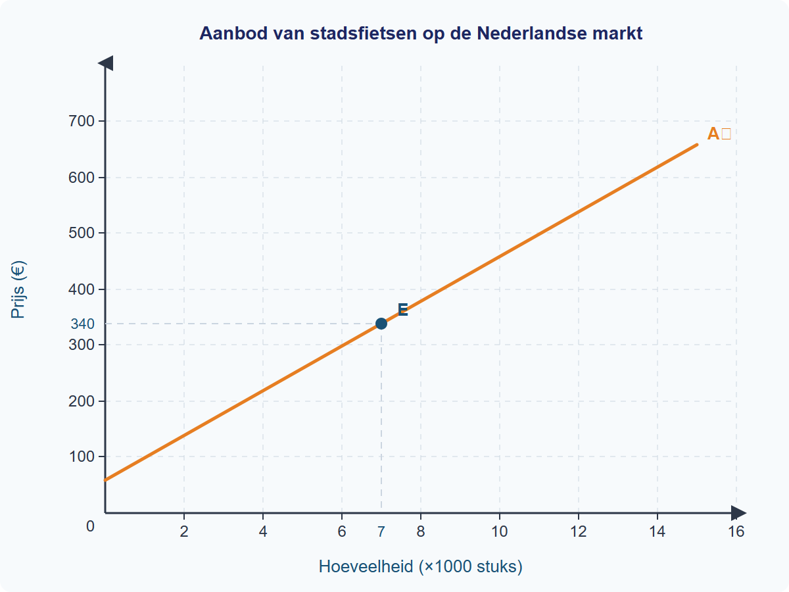

# Gemengde opgaven §1.3.4 — Aanbod en kosten

---

## Opgave 1: Bakkerij "Korenveld"

Maaike is eigenaar van bakkerij "Korenveld" in Amersfoort. Ze verkoopt ambachtelijke croissants aan horecazaken in de regio. De verkoopprijs is vast: elke croissant levert €2,50 op. Maaike huurt een bakkerij voor €800 per maand (vast contract, ongeacht productie). De kosten voor ingrediënten, energie en verpakking hangen af van het aantal croissants dat ze bakt.

In haar jaarverslag heeft Maaike de kosten en opbrengsten per maand samengevat voor verschillende productieniveaus.

**Tabel 1: Kosten en opbrengsten bakkerij "Korenveld" per maand**

| Productie (stuks) | Constante kosten (€) | Variabele kosten (€) | Totale kosten (€) | Totale opbrengst (€) |
|---|---|---|---|---|
| 0 | 800 | 0 | 800 | 0 |
| 200 | 800 | 300 | 1.100 | 500 |
| 400 | 800 | 500 | 1.300 | 1.000 |
| 600 | 800 | 750 | 1.550 | 1.500 |
| 800 | 800 | 1.100 | 1.900 | 2.000 |
| 1.000 | 800 | 1.600 | 2.400 | 2.500 |
| 1.200 | 800 | 2.400 | 3.200 | 3.000 |

---

**1** *(2p)* Bereken de gemiddelde variabele kosten (GVK) en de gemiddelde totale kosten (GTK) bij een productie van 800 croissants. Laat je berekening zien.

**2** *(2p)* Bereken de winst van bakkerij "Korenveld" bij een productie van 1.000 croissants per maand.

**3** *(2p)* Leg uit bij welk productieniveau Maaike break-even draait. Gebruik de gegevens uit tabel 1 in je antwoord.

**4** *(2p)* Bepaal met behulp van tabel 1 bij welke productie de winst maximaal is. Laat zien hoe je dit vaststelt.

**5** *(2p)* Maaike overweegt om 1.200 croissants per maand te bakken in plaats van 1.000. Leg uit waarom dit bedrijfseconomisch geen verstandige keuze is, ook al verkoopt ze dan meer croissants.

**Denkertje** *(2p)* Maaike zegt: "Hoe meer ik produceer, hoe lager mijn gemiddelde kosten, dus ik moet altijd zoveel mogelijk bakken." Beoordeel of deze uitspraak klopt. Gebruik gegevens uit tabel 1 om je antwoord te onderbouwen.

---

## Opgave 2: Fietsfabriek "VeloTech"

Fietsfabriek "VeloTech" produceert stadsfietsen. Figuur 1 toont de oorspronkelijke aanbodlijn van stadsfietsen op de Nederlandse markt.

Lees het volgende nieuwsbericht:

> **Staalprijs stijgt met 30% door exportbeperkingen**
>
> De prijs van staal is het afgelopen kwartaal fors gestegen. China heeft exportbeperkingen ingevoerd voor staal, waardoor de wereldwijde aanvoer is afgenomen. Voor Nederlandse fietsfabrikanten betekent dit hogere inkoopkosten voor frames en onderdelen. Branchevereniging RAI verwacht dat de productiekosten per fiets gemiddeld met €40 stijgen.

VeloTech heeft de volgende kostenstructuur bij een productie van 5.000 fietsen per jaar:

**Tabel 2: Kostenstructuur VeloTech (5.000 fietsen per jaar)**

| Kostenpost | Bedrag (€) | Type |
|---|---|---|
| Huur fabriek | 200.000 | Constant |
| Afschrijving machines | 80.000 | Constant |
| Salarissen vaste medewerkers | 120.000 | Constant |
| Staal en onderdelen | 500.000 | Variabel |
| Energie | 50.000 | Variabel |
| Verpakking en transport | 100.000 | Variabel |

De verkoopprijs per fiets is €230. Na de staalstijging worden de kosten voor staal en onderdelen €200.000 hoger (€700.000 in totaal).

---

**6** *(2p)* Bereken de totale constante kosten (TCK) en de totale variabele kosten (TVK) van VeloTech vóór de staalstijging. Gebruik tabel 2.

**7** *(2p)* Bereken de gemiddelde totale kosten (GTK) per fiets vóór de staalstijging.

**8** *(2p)* Het nieuwsbericht beschrijft een stijging van de staalprijs. Noem de aanbodfactor die hierdoor verandert. Leg uit of dit leidt tot een verschuiving van de aanbodlijn of een beweging langs de aanbodlijn.

**9** *(2p)* Leg uit dat de stijging van de staalprijs leidt tot een daling van de winst per fiets voor VeloTech. Gebruik een berekening vóór en ná de staalstijging.

**10** *(3p)* Na de staalstijging overweegt VeloTech de verkoopprijs te verhogen naar €270. Een concurrent biedt vergelijkbare fietsen aan voor €250. Leg uit wat het effect is op de aanbodlijn als VeloTech de prijs verhoogt naar €270. Is dit een verschuiving of een beweging langs de lijn? Motiveer je antwoord.

**Denkertje** *(2p)* Een econoom zegt: "Als de productiekosten stijgen, moeten bedrijven altijd hun verkoopprijs verhogen om te overleven." Beoordeel deze uitspraak. Geef in je antwoord minstens één reden waarom een bedrijf ervoor kan kiezen de prijs niet te verhogen.
