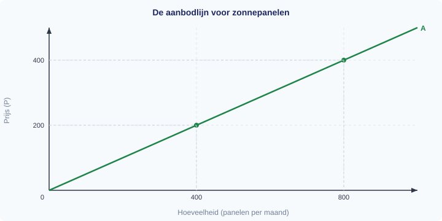
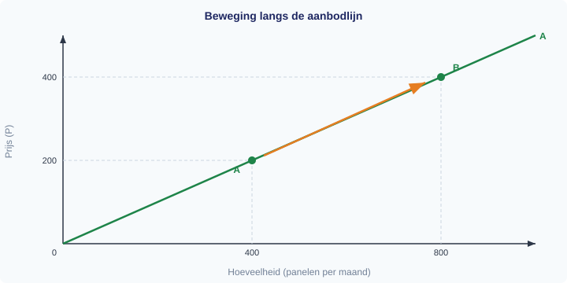
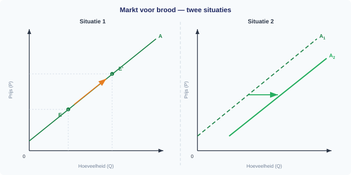
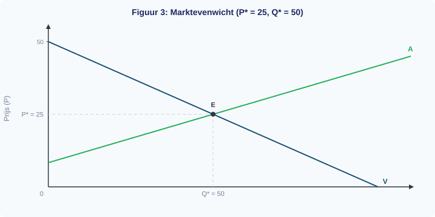
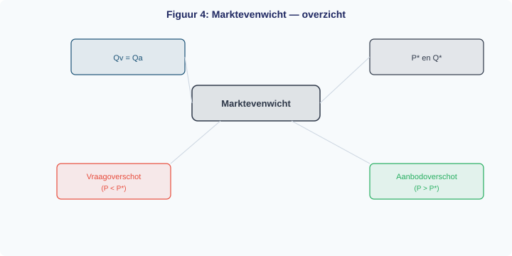
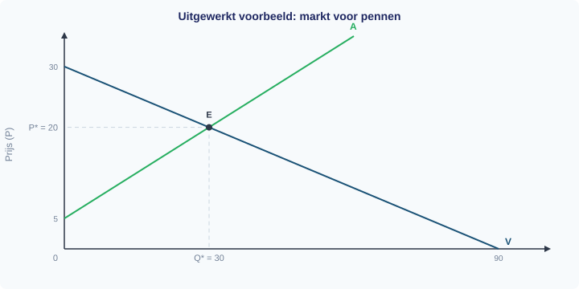
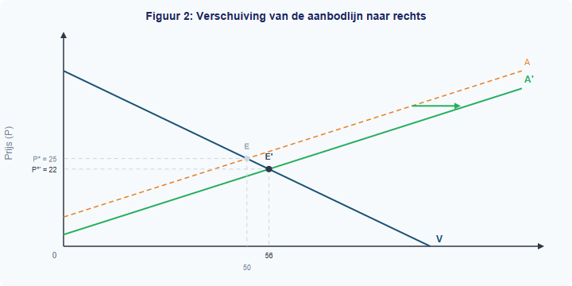
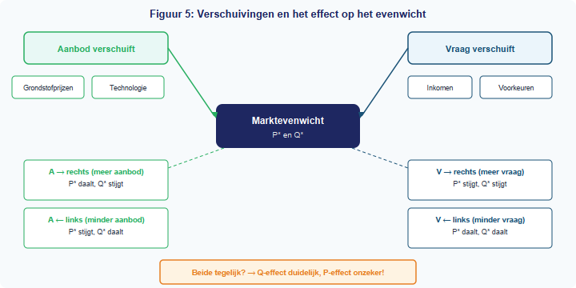

<div class="chapter-front">

<h1>Hoofdstuk 3 — Aanbod en marktevenwicht</h1>

<h2>Inhoud</h2>

<table>
<thead><tr><th>§</th><th>Onderwerp</th></tr></thead>
<tbody>
<tr><td>1.3.1</td><td>Aanbod</td></tr>
<tr><td>1.3.2</td><td>Marktevenwicht</td></tr>
<tr><td>1.3.3</td><td>Verschuivingen en nieuw evenwicht</td></tr>
<tr><td>1.3.4</td><td>Gemengde opgaven</td></tr>
</tbody>
</table>

<h2>Leerdoelen</h2>

<p>Na dit hoofdstuk kun je:</p>

<ul>
<li>Een aanbodlijn tekenen en interpreteren</li>
<li>Het verschil uitleggen tussen een beweging langs de aanbodlijn en een verschuiving van de aanbodlijn</li>
<li>Aanbodfactoren benoemen en gebruiken om verschuivingen te verklaren</li>
<li>Het marktevenwicht berekenen door Qv = Qa op te lossen</li>
<li>Een aanbodoverschot of vraagoverschot herkennen en berekenen</li>
<li>Een nieuw evenwicht berekenen na een verschuiving van vraag of aanbod</li>
<li>Uitleggen wanneer een prijs- of hoeveelheidsverandering eenduidig of onzeker is</li>
</ul>

<h2>Vraag en aanbod komen samen</h2>

<p>In dit hoofdstuk kijk je eerst naar de aanbodkant van de markt. Daarna breng je vraag en aanbod samen: je berekent het marktevenwicht en onderzoekt wat er gebeurt als vraag of aanbod verschuift. Kosten, opbrengsten en marginale analyse horen niet meer bij de gedrukte versie van Boek 1; die stof komt later terug.</p>

</div>


<div style="break-before: page;"></div>

# 1.3.1 Aanbod

## Zonnepanelen op elk dak — maar waarom worden ze duurder?

Je ziet ze overal: zonnepanelen op daken van huizen, scholen en bedrijven. De productie van zonnepanelen is de afgelopen jaren enorm gegroeid. Fabrikanten investeren in nieuwe fabrieken, robots solderen de cellen steeds sneller, en de kosten per paneel dalen al jaren.

Maar in 2021 gebeurde iets vreemds. De prijs van silicium — de belangrijkste grondstof voor zonnepanelen — verdrievoudigde. Fabrikanten konden ineens minder panelen produceren tegen dezelfde kosten. Sommige kleinere producenten stopten helemaal. Het aanbod van zonnepanelen kromp.

Hoe kan het dat een verandering in de prijs van een grondstof het hele aanbod beïnvloedt — terwijl de prijs van het zonnepaneel zelf niet verandert? In deze paragraaf leer je het antwoord. Je leert de aanbodlijn tekenen, begrijpen waarom die omhoog loopt, en onderscheiden wanneer je *langs* de lijn beweegt en wanneer de hele lijn *verschuift*.

---

## Theorie

### De aanbodlijn als startpunt

> **📋 Herhaling uit §1.2.2**
> Bij de vraaglijn leerde je het verschil tussen een *beweging langs* de lijn (door een verandering van de eigen prijs) en een *verschuiving van* de lijn (door een verandering van een vraagfactor). De vraaglijn laat zien hoeveel consumenten willen kopen bij elke prijs, **terwijl alle andere omstandigheden gelijk blijven** (ceteris paribus). Ditzelfde principe geldt ook voor het aanbod.

De **aanbodlijn** laat het verband zien tussen de prijs van een goed en de aangeboden hoeveelheid, **terwijl alle andere omstandigheden gelijk blijven** (ceteris paribus).

Op de verticale as staat de prijs (P), op de horizontale as de aangeboden hoeveelheid (Q). We tekenen de aanbodlijn voor zonnepanelen. Bij een prijs van €200 per paneel bieden fabrikanten 400 panelen per maand aan. Bij een prijs van €400 bieden ze 800 panelen aan.



> **Definitie: Aanbodlijn (A)**
> De grafische weergave van het verband tussen de prijs en de aangeboden hoeveelheid, ceteris paribus. De aanbodlijn loopt van linksonder naar rechtsboven: hoe hoger de prijs, hoe groter de aangeboden hoeveelheid.

Waarom loopt de aanbodlijn omhoog? Bij een hogere prijs is het voor meer producenten rendabel om te produceren. Een fabrikant die bij €200 net geen winst maakt, kan bij €400 wél uit de kosten komen. Bovendien breiden bestaande producenten hun productie uit als de prijs stijgt. Dit heet de **wet van het aanbod**.

> **Definitie: Wet van het aanbod**
> Bij een hogere prijs is de aangeboden hoeveelheid groter, ceteris paribus. Bij een lagere prijs is de aangeboden hoeveelheid kleiner.

---

### Beweging langs de aanbodlijn

Wat gebeurt er als de prijs van zonnepanelen stijgt van €200 naar €400? Je schuift *langs* de aanbodlijn omhoog: van punt A naar punt B. De aangeboden hoeveelheid stijgt van 400 naar 800 panelen.

Dit heet een **beweging langs de aanbodlijn**. De lijn zelf verandert niet. Je verplaatst je alleen naar een ander punt op dezelfde lijn.

**Oorzaak:** een verandering van de prijs van het goed zelf.



Let op de pijl in figuur 2: die loopt *langs* de bestaande lijn. De lijn verschuift niet.

---

### Verschuiving van de aanbodlijn

Nu het tweede geval. De prijs van zonnepanelen blijft €200. Maar de prijs van silicium (de grondstof) verdrievoudigt. Producenten moeten bij *elke* prijs meer kosten maken. Sommige stoppen, anderen produceren minder.

Bij €200 bieden ze geen 400, maar 200 panelen aan. Bij €400 geen 800, maar 600 panelen. Elk punt op de lijn schuift naar links. Er ontstaat een nieuwe aanbodlijn (A₂), links van de oude (A₁).

Dit heet een **verschuiving van de aanbodlijn**. De hele lijn verplaatst.

**Oorzaak:** een verandering van een andere factor dan de prijs van het goed zelf.


De horizontale pijl in figuur 3 laat zien dat de hele lijn opschuift naar links. Bij dezelfde prijs is de aangeboden hoeveelheid kleiner geworden.

> **⚠️ Let op — veelgemaakte fout**
> Veel leerlingen verwarren een *verschuiving van* de aanbodlijn met een *beweging langs* de aanbodlijn.
> - Verandering van de prijs van het goed zelf → **beweging LANGS** de lijn.
> - Verandering van productiekosten, technologie of andere factoren → **verschuiving VAN** de lijn.

---

### Aanbodfactoren: wat verschuift de aanbodlijn?

De factoren die de hele aanbodlijn verschuiven, heten **aanbodfactoren**. Er zijn er vijf:

> **Definitie: Aanbodfactoren**
> Factoren die de positie van de aanbodlijn bepalen. Een verandering van een aanbodfactor verschuift de hele aanbodlijn naar links of naar rechts.

**1. Prijzen van productiefactoren (inputprijzen)**

Als grondstoffen, arbeid of energie duurder worden, stijgen de productiekosten. Producenten bieden bij elke prijs minder aan. De aanbodlijn verschuift naar links. Worden grondstoffen goedkoper, dan verschuift de aanbodlijn naar rechts.

Voorbeeld: de prijs van silicium stijgt → de aanbodlijn van zonnepanelen verschuift naar links.

**2. Technologie**

Een betere productietechnologie verlaagt de kosten per eenheid. Producenten kunnen bij elke prijs meer aanbieden. De aanbodlijn verschuift naar rechts.

Voorbeeld: een nieuwe lasertechniek versnelt de productie van zonnepanelen → de aanbodlijn verschuift naar rechts.

**3. Aantal aanbieders**

Als er meer producenten op de markt komen, stijgt het totale aanbod. De aanbodlijn verschuift naar rechts. Vertrekken er aanbieders, dan verschuift de lijn naar links.

Voorbeeld: een Chinese fabrikant opent een fabriek in Europa → de aanbodlijn van zonnepanelen verschuift naar rechts.

**4. Verwachtingen van producenten**

Als producenten verwachten dat de prijs in de toekomst gaat stijgen, houden ze nu voorraad achter. Het huidige aanbod daalt, de aanbodlijn verschuift naar links. Verwachten ze een prijsdaling, dan verkopen ze nu zoveel mogelijk — de aanbodlijn verschuift naar rechts.

Voorbeeld: fabrikanten verwachten dat zonnepanelen over drie maanden 20% duurder worden → ze verkopen nu minder, de aanbodlijn verschuift naar links.

**5. Overheidsbeleid**

De overheid kan het aanbod beïnvloeden met subsidies, belastingen en regels. Een productiesubsidie verlaagt de kosten voor producenten → de aanbodlijn verschuift naar rechts. Een accijns of strenge milieu-eis verhoogt de kosten → de aanbodlijn verschuift naar links.

Voorbeeld: de overheid geeft €50 subsidie per geproduceerd zonnepaneel → de aanbodlijn verschuift naar rechts.

---

### Overzicht aanbodfactoren

Figuur 5 vat de vijf aanbodfactoren in één beeld samen. Onthoud: deze vijf factoren kunnen de hele lijn verschuiven. De prijs van het goed zelf staat er niet bij — die veroorzaakt een beweging *langs* de lijn, niet een verschuiving.


De onderstaande tabel laat bij elke prijs zien hoeveel panelen worden aangeboden in drie situaties: de oorspronkelijke aanbodlijn (A₁), na een kostenstijging (A₂, verschuiving naar links), en na een subsidie (A₃, verschuiving naar rechts).

| Prijs (€) | Q aangeboden (A₁) | Q aangeboden (A₂, kosten ↑) | Q aangeboden (A₃, subsidie) |
|---|---|---|---|
| 100 | 200 | 0 | 400 |
| 200 | 400 | 200 | 600 |
| 300 | 600 | 400 | 800 |
| 400 | 800 | 600 | 1.000 |

Zo zie je dezelfde informatie nu in drie vormen tegelijk: in de tekst hierboven, in de overzichtsfiguur, én in deze tabel.

---

### Overzicht: beweging langs versus verschuiving van

Figuur 4 vat alles samen in twee panelen. Het linkerpaneel laat een beweging langs de aanbodlijn zien, het rechterpaneel een verschuiving van de aanbodlijn.


**Aanbod neemt toe (verschuiving naar rechts):**
- Inputprijzen dalen (goedkopere grondstoffen, lager loon)
- Betere technologie
- Meer aanbieders op de markt
- Verwachte prijsdaling (producenten verkopen nu)
- Overheidssubsidie

**Aanbod neemt af (verschuiving naar links):**
- Inputprijzen stijgen (duurdere grondstoffen, hoger loon)
- Verouderde technologie of productieproblemen
- Minder aanbieders op de markt
- Verwachte prijsstijging (producenten houden voorraad achter)
- Belastingverhoging of strengere regelgeving

---

## Uitgewerkt voorbeeld

> **De markt voor elektrische fietsen**
>
> De markt voor elektrische fietsen (e-bikes) is in evenwicht bij P = €1.500 en Q = 3.000 fietsen per maand. De aanbodlijn loopt via A₁.

**(a)** De prijs van e-bikes stijgt naar €2.000. Is dit een beweging langs of een verschuiving van de aanbodlijn? Verklaar je antwoord.

*Antwoord:* Dit is een **beweging langs** de aanbodlijn. De prijs van het goed zelf verandert (van €1.500 naar €2.000). Bij een hogere prijs is de aangeboden hoeveelheid groter. Je schuift langs de bestaande aanbodlijn naar een punt rechtsboven.

**(b)** De prijs van e-bikes blijft €1.500, maar de prijs van lithiumbatterijen (een belangrijke grondstof) daalt fors. Is dit een beweging langs of een verschuiving van de aanbodlijn? Verklaar je antwoord.

*Antwoord:* Dit is een **verschuiving van** de aanbodlijn naar rechts. De prijs van e-bikes verandert niet, maar een aanbodfactor wel: **de prijs van een productiefactor** (lithiumbatterijen). Doordat de grondstof goedkoper wordt, dalen de productiekosten. Producenten kunnen bij elke prijs meer e-bikes aanbieden. De aanbodlijn verschuift van A₁ naar A₂ (naar rechts).

> ⚠️ Let op de juiste aanbodfactor. Het is verleidelijk om te zeggen "de technologie is verbeterd". Maar er is niets veranderd aan de manier van produceren — alleen de grondstofprijs is gedaald. De economisch precieze categorie is daarom *prijs van een productiefactor (inputprijs)*.

**(c)** Leg in eigen woorden uit waarom de aanbodlijn naar rechts verschuift en niet naar links als de grondstofkosten dalen.

*Antwoord:* Als grondstoffen goedkoper worden, kan een fabrikant dezelfde e-bike voor minder kosten maken. Daardoor wordt het bij een lagere prijs al rendabel om te produceren. Producenten die voorheen niet uit de kosten kwamen, kunnen nu wél aanbieden. Bij elke prijs zijn er dus meer e-bikes beschikbaar — de hele aanbodlijn schuift naar rechts.

---

> **Samenvatting §1.3.1**
> - De aanbodlijn laat het verband zien tussen de prijs en de aangeboden hoeveelheid (ceteris paribus). De lijn loopt omhoog: hoe hoger de prijs, hoe meer er wordt aangeboden (**wet van het aanbod**).
> - Een verandering van de prijs van het goed zelf veroorzaakt een **beweging langs** de aanbodlijn.
> - Een verandering van een aanbodfactor (inputprijzen, technologie, aantal aanbieders, verwachtingen, overheidsbeleid) veroorzaakt een **verschuiving van** de aanbodlijn.
> - Verschuiving naar rechts = aanbod neemt toe. Verschuiving naar links = aanbod neemt af.
> - *In de volgende paragraaf brengen we vraag en aanbod samen en berekenen we het marktevenwicht.*

> **💡 Vastgelopen op een opgave?**
> Op de website vind je bij elke opgave een **begeleide inoefening**: stap voor stap krijg je extra hints en tussenstappen. Klik op de opgave om de begeleiding te starten.

---

## Opgaven

### Startoefeningen

**Opgave 1** *(lees de grafiek — zie figuur 6)*

In figuur 6 zie je twee veranderingen op de markt voor brood. Beide situaties zijn al voor je getekend en gelabeld.



a) Beschrijf wat er in **Situatie 1** gebeurt: wat verandert er met de prijs en de aangeboden hoeveelheid? Welke factor zou dit veroorzaakt kunnen hebben?

b) Beschrijf wat er in **Situatie 2** gebeurt: wat verandert er met de prijs en de aangeboden hoeveelheid? Welke factor zou dit veroorzaakt kunnen hebben?

c) Leg in eigen woorden uit waarom Situatie 1 een *beweging langs* de aanbodlijn is, en Situatie 2 een *verschuiving van* de aanbodlijn.


**Opgave 2** *(teken in de grafiek — zie figuur 7)*

De markt voor laptops is in evenwicht bij P = €800 en Q = 5.000 stuks per maand. In figuur 7 zie je de aanbodlijn A₁ met punt E.


a) De prijs van laptops daalt naar €600. Laat in de grafiek zien wat er gebeurt. Is dit een verschuiving van de aanbodlijn of een beweging langs de aanbodlijn? Leg uit.

b) Een nieuwe chiptechnologie verlaagt de productiekosten van laptops aanzienlijk. Laat in de grafiek zien wat er gebeurt met het aanbod van laptops. Is dit een verschuiving of een beweging? Leg uit.

c) De overheid voert een milieubelasting in op de productie van laptops. Wat verwacht je dat er gebeurt met de aanbodlijn? Is dit een verschuiving of een beweging? Geef de richting aan.


**Opgave 3**

De markt voor koffie is in evenwicht. Er doen zich achtereenvolgens drie veranderingen voor. Beantwoord voor elke verandering de vragen. Er is geen grafiek bij deze opgave — beschrijf wat er in een grafiek zou gebeuren.

a) De prijs van koffie daalt van €8 naar €6 per kilo.
- Verschuift de aanbodlijn of beweeg je langs de aanbodlijn?
- In welke richting?

b) Door een droogte in Brazilië mislukt een groot deel van de koffieoogst. De kosten per kilo koffiebonen stijgen fors. De prijs van koffie blijft gelijk.
- Verschuift de aanbodlijn of beweeg je langs de aanbodlijn?
- In welke richting verschuift of beweegt de lijn?

c) De overheid verlaagt de importbelasting op koffie.
- Wat gebeurt er nu met het aanbod van koffie?
- Is dit een verschuiving of een beweging? Leg uit.

d) Noem bij elk van de drie situaties (a, b, c) welke aanbodfactor verandert. Kies uit: eigen prijs, inputprijzen, technologie, aantal aanbieders, verwachtingen, overheidsbeleid.


**Opgave 4** *(twee veranderingen tegelijk — let goed op!)*

Op de markt voor T-shirts gebeuren twee dingen op dezelfde dag:

1. De prijs van T-shirts stijgt van €15 naar €20.
2. Tegelijk stijgt het minimumloon fors, waardoor de loonkosten voor textielfabrieken toenemen.

a) Bekijk eerst alleen verandering 1. Wat gebeurt er met het aanbod van T-shirts? Is dit een beweging langs of een verschuiving van de aanbodlijn? In welke richting?

b) Bekijk nu alleen verandering 2. Wat gebeurt er met het aanbod van T-shirts? Is dit een beweging langs of een verschuiving van de aanbodlijn? In welke richting?

c) Beide veranderingen gebeuren tegelijkertijd. Beschrijf het netto-effect op de aangeboden hoeveelheid T-shirts. Versterken de twee effecten elkaar of werken ze tegen elkaar in?

d) Een leerling zegt: "De prijs verandert *en* de kosten veranderen, dus alles is een beweging langs de aanbodlijn." Leg uit waarom dit niet klopt.

---

### Zelfstandige oefening

**Opgave 5**

De markt voor biologische melk is in evenwicht bij P = €1,20 per liter en Q = 50.000 liter per week.

a) Geef vier aanbodfactoren die de aanbodlijn van biologische melk kunnen laten verschuiven (niet: de eigen prijs).

b) Leg voor elk van de vier factoren uit of de aanbodlijn naar rechts of naar links verschuift. Geef bij elke factor een concreet voorbeeld.

c) De prijs van biologisch veevoer (een grondstof) stijgt met 30%. Teken een aanbodlijn voor biologische melk en laat zien wat er gebeurt. Is dit een verschuiving of een beweging? Leg uit.

d) Na de kostenstijging van het veevoer besluit de zuivelcoöperatie de melkprijs te verhogen van €1,20 naar €1,50. Teken in dezelfde grafiek wat er nu gebeurt met de aangeboden hoeveelheid. Is dit een verschuiving of een beweging?


**Opgave 6**

Hieronder staan zes situaties op de markt voor kleding. Vul de tabel in: bepaal voor elke situatie of het om een beweging of een verschuiving gaat, welke richting, en welke aanbodfactor de oorzaak is.

| | Situatie | Beweging of verschuiving? | Richting | Aanbodfactor |
|---|---|---|---|---|
| a | De verkoopprijs van jassen stijgt van €80 naar €110. |  |  |  |
| b | De prijs van katoen (grondstof) daalt door een goede oogst. |  |  |  |
| c | Drie nieuwe kledingfabrieken openen in Turkije. |  |  |  |
| d | Fabrikanten verwachten dat de vraag naar winterjassen volgend seizoen sterk stijgt. |  |  |  |
| e | De overheid voert een CO₂-belasting in op textielproductie. |  |  |  |
| f | Een nieuw robotsysteem maakt het naaien van kleding twee keer zo snel. |  |  |  |

---

### Herhaling (interleaving)

**Opgave 7** *(herhaling §1.1.2: procentuele verandering)*

De prijs van silicium stijgt van €25 per kilo naar €32 per kilo.

a) Bereken de procentuele prijsstijging.

b) Een jaar later daalt de prijs met 15% ten opzichte van €32. Bereken de nieuwe prijs.


**Opgave 8** *(herhaling §1.2.1: betalingsbereidheid en individuele vraag)*

Een consument wil een zonnepaneel kopen. Zijn maximale betalingsbereidheid is €350.

a) Het zonnepaneel kost €290. Bereken het consumentensurplus.

b) De prijs stijgt naar €375. Koopt de consument het paneel? Leg uit met het begrip betalingsbereidheid.


**Opgave 9** *(herhaling §1.2.2: vraagfactoren — verschuiving versus beweging)*

Op de markt voor hardloopschoenen doen zich twee veranderingen voor:

a) De prijs van hardloopschoenen stijgt van €120 naar €140. Is dit een verschuiving van of een beweging langs de vraaglijn? Welke richting?

b) Een populaire influencer promoot hardlopen op social media. De prijs van hardloopschoenen blijft gelijk. Is dit een verschuiving of een beweging? Welke vraagfactor verandert?

---

### Doeloefening

**Opgave 10**

De markt voor zonnepanelen is in evenwicht.

a) Een fabrikant van zonnepanelen wordt geconfronteerd met hogere siliciumprijzen. Laat in een grafiek zien wat er gebeurt met de aanbodlijn van zonnepanelen. Verklaar je antwoord.

b) De overheid voert een subsidie in op de productie van zonnepanelen. Laat het effect op de aanbodlijn zien.

c) Noem drie factoren die de aanbodlijn doen verschuiven en geef bij elke factor een voorbeeld.

d) Teken een aanbodlijn. Geef in de grafiek een beweging langs de lijn aan én een verschuiving van de lijn. Label duidelijk welke welke is.

---

### Denkertje *(bonusopgave)*

**Opgave 11**

De Europese Unie wil de productie van groene waterstof stimuleren. Er worden twee maatregelen overwogen:

- **Maatregel A:** Een subsidie van €2 per kilogram geproduceerde groene waterstof.
- **Maatregel B:** Investeren in onderzoek naar een nieuwe, goedkopere productiemethode voor groene waterstof.

a) Leg met behulp van het verschil tussen aanbodfactoren uit hoe beide maatregelen de aanbodlijn van groene waterstof beïnvloeden. Welke aanbodfactor wordt in elk geval aangesproken?

b) Een criticus stelt: "Maatregel A kost de overheid elk jaar geld. Maatregel B kost eenmalig geld, maar het effect is blijvend." Beoordeel deze stelling. Gebruik economische argumenten en betrek de begrippen 'productiekosten' en 'technologie' in je antwoord.


<div style="break-before: page;"></div>

# 1.3.2 Marktevenwicht

## Twee lijnen, één kruispunt — en toch snapt bijna niemand het in één keer

Op de markt voor schriften bieden producenten schriften aan en willen scholieren ze kopen. Je kent de vraaglijn al: hoe lager de prijs, hoe meer schriften er gevraagd worden. En je kent de aanbodlijn: hoe hoger de prijs, hoe meer schriften er aangeboden worden.

Maar welke prijs wordt het uiteindelijk? De vraag zegt "liever goedkoop", het aanbod zegt "liever duur". Ergens daartussenin moeten ze het eens worden. Dat punt heet het **marktevenwicht** — en in deze paragraaf leer je hoe je het berekent, tekent en controleert.

---

## Theorie

### De vraaglijn en de aanbodlijn samen

> **📋 Herhaling uit §1.2.2**
> De vraaglijn (V) laat het verband zien tussen de prijs en de gevraagde hoeveelheid, **terwijl alle andere omstandigheden gelijk blijven**. Een verandering van een vraagfactor (inkomen, voorkeuren, prijs van substituten/complementen, verwachtingen) verschuift de hele vraaglijn.

> **📋 Herhaling uit §1.3.1**
> De aanbodlijn (A) laat het verband zien tussen de prijs en de aangeboden hoeveelheid, **terwijl alle andere omstandigheden gelijk blijven**. Een verandering van een aanbodfactor (grondstofprijzen, technologie, aantal aanbieders, verwachtingen) verschuift de hele aanbodlijn.

Stel dat op de markt voor schriften de volgende vergelijkingen gelden:

- **Vraaglijn:** Qv = −2P + 100
- **Aanbodlijn:** Qa = 3P − 25

We tekenen eerst de vraaglijn. Bij P = 0 is de gevraagde hoeveelheid Qv = 100 stuks (het x-snijpunt). Bij Qv = 0 is de prijs P = 50 (het y-snijpunt).


Nu voegen we de aanbodlijn toe. De aanbodlijn begint bij P = 8⅓ (want bij Q = 0 geldt: 0 = 3P − 25, dus P = 25/3 ≈ 8,33). Hoe hoger de prijs, hoe meer schriften producenten willen aanbieden.


---

### Het evenwicht berekenen

Het **marktevenwicht** is het punt waar de gevraagde hoeveelheid precies gelijk is aan de aangeboden hoeveelheid. Er is dan geen overschot en geen tekort.

> **Definitie: Marktevenwicht**
> De situatie waarin de gevraagde hoeveelheid gelijk is aan de aangeboden hoeveelheid: Qv = Qa. De bijbehorende prijs heet de **evenwichtsprijs** (P*) en de bijbehorende hoeveelheid de **evenwichtshoeveelheid** (Q*).

**Hoe bereken je het evenwicht?** Stel Qv gelijk aan Qa en los op naar P:

> **Formule**
> ```
> Stap 1:  Qv = Qa
> Stap 2:  Los op naar P  →  P*
> Stap 3:  Vul P* in  →  Q*
> ```

**Stap 1:** Stel Qv = Qa.

−2P + 100 = 3P − 25

**Stap 2:** Los op naar P.

100 + 25 = 3P + 2P

125 = 5P

P* = 25

**Stap 3:** Vul P* = 25 in een van de twee vergelijkingen in.

Qv = −2 × 25 + 100 = −50 + 100 = 50

**Controle:** Vul P* = 25 ook in de andere vergelijking in.

Qa = 3 × 25 − 25 = 75 − 25 = 50 ✓

Beide geven Q = 50, dus het klopt. De evenwichtsprijs is **P* = EUR 25** en de evenwichtshoeveelheid is **Q* = 50 schriften**.



> **⚠️ Let op — veelgemaakte fout**
> Leerlingen vergeten vaak de controlestap. Als je P* maar in één vergelijking invult, merk je een rekenfout niet op. Vul P* altijd in **beide** vergelijkingen in en controleer dat je dezelfde Q* krijgt.

---

### Overschot en tekort

Wat gebeurt er als de prijs niet gelijk is aan de evenwichtsprijs?

**Als de prijs hoger is dan P*** (bijvoorbeeld P = 30):
- Qv = −2 × 30 + 100 = 40 (consumenten willen maar 40 schriften)
- Qa = 3 × 30 − 25 = 65 (producenten bieden 65 schriften aan)
- Qa > Qv → er is een **aanbodoverschot** (surplus) van 65 − 40 = 25 stuks.

**Als de prijs lager is dan P*** (bijvoorbeeld P = 20):
- Qv = −2 × 20 + 100 = 60 (consumenten willen 60 schriften)
- Qa = 3 × 20 − 25 = 35 (producenten bieden maar 35 aan)
- Qv > Qa → er is een **vraagoverschot** (tekort) van 60 − 35 = 25 stuks.

> **Definitie: Aanbodoverschot (surplus)**
> Situatie waarin Qa > Qv: producenten bieden meer aan dan consumenten willen kopen. Ontstaat als de prijs **hoger** is dan de evenwichtsprijs.

> **Definitie: Vraagoverschot (tekort)**
> Situatie waarin Qv > Qa: consumenten willen meer kopen dan producenten aanbieden. Ontstaat als de prijs **lager** is dan de evenwichtsprijs.

De volgende tabel laat het verband zien bij drie verschillende prijzen:

| Prijs (EUR) | Qv = −2P + 100 | Qa = 3P − 25 | Verschil | Overschot of tekort? |
|---|---|---|---|---|
| 20 | 60 | 35 | Qv − Qa = 25 | Vraagoverschot |
| 25 | 50 | 50 | 0 | Evenwicht |
| 30 | 40 | 65 | Qa − Qv = 25 | Aanbodoverschot |

Figuur 4 vat de kernbegrippen van het marktevenwicht in één beeld samen.



---

## Uitgewerkt voorbeeld

> **De markt voor pennen**
>
> Op de markt voor pennen geldt:
> - Qv = −3P + 90
> - Qa = 2P − 10

**(a) Bereken de evenwichtsprijs en de evenwichtshoeveelheid.**

*Stap 1: Stel Qv = Qa.*

−3P + 90 = 2P − 10

*Stap 2: Los op naar P.*

90 + 10 = 2P + 3P

100 = 5P

P* = 20

*Stap 3: Vul P* = 20 in.*

Qv = −3 × 20 + 90 = −60 + 90 = 30

**Antwoord:** P* = EUR 20, Q* = 30 pennen.

**(b) Controleer je antwoord.**

Qa = 2 × 20 − 10 = 40 − 10 = 30 ✓

Beide vergelijkingen geven Q = 30, dus de berekening klopt.

**(c) Teken de vraaglijn en de aanbodlijn en markeer het evenwichtspunt.**

De vraaglijn loopt van (Q = 0, P = 30) naar (Q = 90, P = 0). De aanbodlijn begint bij (Q = 0, P = 5). Het evenwichtspunt E ligt op P* = 20, Q* = 30.



**(d) Bij een prijs van EUR 25: is er een overschot of een tekort? Bereken de grootte.**

*Stap 1: Bereken Qv en Qa bij P = 25.*

Qv = −3 × 25 + 90 = −75 + 90 = 15

Qa = 2 × 25 − 10 = 50 − 10 = 40

*Stap 2: Vergelijk.*

Qa = 40 > Qv = 15 → er is een **aanbodoverschot**.

*Stap 3: Bereken de grootte.*

Aanbodoverschot = Qa − Qv = 40 − 15 = 25 pennen.

**De procedure samengevat:**

| Stap | Actie |
|------|-------|
| 1 | Stel Qv = Qa en los op naar P → P* |
| 2 | Vul P* in een vergelijking in → Q* |
| 3 | Controleer: vul P* in de andere vergelijking in → dezelfde Q*? |
| 4 | Teken de lijnen en markeer E op (Q*, P*) |
| 5 | Bij een gegeven prijs: bereken Qv en Qa, vergelijk → overschot of tekort |

---

> **Samenvatting §1.3.2**
> - Het marktevenwicht is het punt waar Qv = Qa: de gevraagde hoeveelheid is gelijk aan de aangeboden hoeveelheid.
> - Je berekent P* door Qv = Qa te stellen en op te lossen naar P. Vul P* vervolgens in om Q* te vinden.
> - Controleer altijd door P* in **beide** vergelijkingen in te vullen.
> - Bij P > P* ontstaat een aanbodoverschot (Qa > Qv). Bij P < P* ontstaat een vraagoverschot (Qv > Qa).
> - *In de volgende paragraaf bekijken we wat er met het evenwicht gebeurt als de vraaglijn of aanbodlijn verschuift.*

> **💡 Vastgelopen op een opgave?**
> Op de website vind je bij elke opgave een **begeleide inoefening**: stap voor stap krijg je extra hints en tussenstappen. Klik op de opgave om de begeleiding te starten.

---

## Opgaven

### Startoefeningen

**Opgave 1** *(invuloefening)*

> Hint: gebruik de stappen uit het uitgewerkte voorbeeld: stel Qv = Qa, los P op en controleer daarna beide vergelijkingen.

Op de markt voor schriften geldt: Qv = −2P + 100 en Qa = 3P − 25.

a) Vul in: het evenwicht vind je door Qv ... Qa te stellen (=, >, <).

b) Schrijf de vergelijking op die je moet oplossen om P* te vinden.

c) Wat is P*? Wat is Q*?

d) Controleer je antwoord door P* in de andere vergelijking in te vullen.


**Opgave 2** *(oefenen met de procedure)*

> Hint: gebruik de stappen uit het uitgewerkte voorbeeld: stel Qv = Qa, los P op en controleer daarna beide vergelijkingen.

Op de markt voor potloden geldt:
- Qv = −4P + 80
- Qa = P − 5

a) Bereken de evenwichtsprijs P*.

b) Bereken de evenwichtshoeveelheid Q*.

c) Controleer je antwoord.


**Opgave 3** *(overschot en tekort)*

> Hint: bereken eerst Qv en Qa bij de gegeven prijs. Vergelijk daarna welke hoeveelheid groter is.

Gebruik de vergelijkingen uit opgave 2 (Qv = −4P + 80, Qa = P − 5).

a) Bereken Qv en Qa bij een prijs van EUR 20.

b) Is er bij P = 20 een vraagoverschot of een aanbodoverschot? Bereken de grootte.

c) Bereken Qv en Qa bij een prijs van EUR 10.

d) Is er bij P = 10 een vraagoverschot of een aanbodoverschot? Bereken de grootte.

---

### Zelfstandige oefening

**Opgave 4** *(de doeloefening — schriftenmarkt)*

Op de markt voor schriften geldt: Qv = −2P + 100 en Qa = 3P − 25.

a) Bereken de evenwichtsprijs en de evenwichtshoeveelheid.

b) Controleer je antwoord door P* in beide vergelijkingen in te vullen.

c) Teken de vraaglijn en de aanbodlijn in een grafiek en markeer het evenwichtspunt. *(Zie figuur 5 voor een leeg assenstelsel.)*


d) Bij een prijs van EUR 30: is er een aanbodoverschot of een vraagoverschot? Bereken de grootte.


**Opgave 5** *(nieuwe markt)*

Op de markt voor USB-sticks geldt:
- Qv = −P + 40
- Qa = 2P − 20

a) Bereken de evenwichtsprijs en de evenwichtshoeveelheid.

b) Controleer je antwoord.

c) Teken de vraaglijn en de aanbodlijn in een grafiek en markeer het evenwichtspunt.

d) Bij een prijs van EUR 15: is er een overschot of een tekort? Bereken de grootte.

e) Bij een prijs van EUR 25: is er een overschot of een tekort? Bereken de grootte.


**Opgave 6** *(drie vergelijkingsparen)*

Bereken voor elk van de volgende markten de evenwichtsprijs en evenwichtshoeveelheid. Controleer telkens je antwoord.

a) Qv = −5P + 200, Qa = 3P − 40

b) Qv = −P + 50, Qa = 4P − 75

c) Qv = −3P + 120, Qa = 2P − 30

---

### Herhaling (interleaving)

**Opgave 7** *(herhaling §1.3.1: aanbodverschuiving)*

De aanbodlijn van broodjes verschuift naar links doordat de graanprijs stijgt.

a) Welke aanbodfactor is hier veranderd?

b) Wat gebeurt er met de evenwichtsprijs als de aanbodlijn naar links verschuift en de vraaglijn gelijk blijft? Leg uit.

c) Wat gebeurt er met de evenwichtshoeveelheid? Leg uit.


**Opgave 8** *(herhaling §1.2.2: vraagfactoren)*

De markt voor elektrische fietsen is in evenwicht. De overheid kondigt aan dat consumenten een aankoopsubsidie krijgen op elektrische fietsen.

a) Is dit een verandering van de eigen prijs of van een andere factor?

b) Verschuift de vraaglijn of de aanbodlijn? In welke richting?

c) Wat verwacht je dat er met de evenwichtsprijs en de evenwichtshoeveelheid gebeurt?

---

### Doeloefening

**Opgave 9** *(alles samen)*

Op de markt voor rekenmachines geldt:
- Qv = −2P + 80
- Qa = 3P − 20

a) Bereken de evenwichtsprijs en de evenwichtshoeveelheid.

b) Controleer je antwoord door P* in beide vergelijkingen in te vullen.

c) Teken de vraaglijn en de aanbodlijn in een grafiek. Markeer het evenwichtspunt.

d) Bij een prijs van EUR 25 — is er een overschot of een tekort? Bereken de grootte.

e) Noem een factor die de vraaglijn naar rechts kan laten verschuiven. Wat zou er dan met het evenwicht gebeuren?

---

### Denkertje *(bonusopgave)*

**Opgave 10**

De overheid legt een maximumprijs van EUR 15 op de markt voor schriften (Qv = −2P + 100, Qa = 3P − 25).

a) Bereken de gevraagde en aangeboden hoeveelheid bij P = 15.

b) Ontstaat er een vraagoverschot of een aanbodoverschot? Bereken de grootte.

c) Leg uit waarom de overheid een maximumprijs zou willen instellen, ondanks het tekort dat ontstaat.

d) Bedenk een maatregel waarmee de overheid het tekort kan verkleinen zonder de maximumprijs los te laten.


<div style="break-before: page;"></div>

# 1.3.3 Verschuivingen en nieuw evenwicht

## De schriftenmarkt draait op volle toeren — tot er iets verandert

In §1.3.2 heb je geleerd dat de markt voor schriften in evenwicht is bij P* = EUR 25 en Q* = 50 stuks. Maar markten staan niet stil. Een nieuwe fabriek opent, het inkomen van scholieren stijgt, of grondstoffen worden duurder. Wat gebeurt er dan met de evenwichtsprijs en de evenwichtshoeveelheid?

In deze paragraaf leer je hoe je het **nieuwe evenwicht** berekent na een verschuiving van de aanbodlijn of de vraaglijn — en wat er gebeurt als *beide* tegelijk verschuiven.

---

## Theorie

### Het uitgangspunt: de schriftenmarkt

> **📋 Herhaling uit §1.3.2**
> De evenwichtsprijs vind je door Qv = Qa te stellen en op te lossen naar P. Vul P* vervolgens in om Q* te vinden. Controleer altijd door P* in beide vergelijkingen in te vullen.

> **📋 Herhaling uit §1.3.1**
> Productiekosten bepalen de positie van de aanbodlijn. Als de kosten per eenheid dalen (bijv. door efficiëntere productie), verschuift de aanbodlijn naar rechts: bij elke prijs bieden producenten meer aan.

We beginnen met de bekende vergelijkingen van de schriftenmarkt:

- **Vraaglijn:** Qv = −2P + 100
- **Aanbodlijn:** Qa = 3P − 25
- **Evenwicht:** P* = EUR 25, Q* = 50 stuks

De vraaglijn laat het verband zien tussen de prijs en de gevraagde hoeveelheid, **terwijl alle andere omstandigheden gelijk blijven** (ceteris paribus). De aanbodlijn laat hetzelfde verband zien voor de aangeboden hoeveelheid.


---

### Verschuiving van de aanbodlijn

Stel dat een **nieuwe fabriek** opent die schriften produceert. Er zijn nu meer aanbieders, dus bij elke prijs worden er meer schriften aangeboden. De aanbodlijn verschuift **naar rechts**.

De nieuwe aanbodvergelijking is: **Qa' = 3P − 10**

Merk op: de helling (3) is hetzelfde gebleven, maar de constante is veranderd van −25 naar −10. Dat betekent dat de aanbodlijn 15 eenheden naar rechts is verschoven: bij elke prijs bieden producenten 15 schriften meer aan dan voorheen.

**Hoe berekenen we het nieuwe evenwicht?** Dezelfde drie stappen als in §1.3.2:

*Stap 1: Stel Qv = Qa' (nieuw).*

−2P + 100 = 3P − 10

*Stap 2: Los op naar P.*

100 + 10 = 3P + 2P

110 = 5P

P*' = 22

*Stap 3: Vul P*' = 22 in.*

Qv = −2 × 22 + 100 = −44 + 100 = 56

*Controle:* Qa' = 3 × 22 − 10 = 66 − 10 = 56 ✓

Het nieuwe evenwicht is **P*' = EUR 22, Q*' = 56 schriften**.

**Vergelijk oud en nieuw:**

| | Oud evenwicht | Nieuw evenwicht | Verandering |
|---|---|---|---|
| Prijs (P*) | EUR 25 | EUR 22 | **daalt** met EUR 3 |
| Hoeveelheid (Q*) | 50 | 56 | **stijgt** met 6 stuks |

Dit is logisch: meer aanbod → meer concurrentie tussen producenten → de prijs daalt. Omdat de prijs daalt, willen consumenten meer kopen → de hoeveelheid stijgt.



---

### Verschuiving van de vraaglijn

Nu een ander scenario. Stel dat het **inkomen van scholieren stijgt** (bijv. doordat het minimumloon omhoog gaat). Schriften zijn een normaal goed: bij een hoger inkomen willen scholieren er meer kopen. De vraaglijn verschuift **naar rechts**.

De aanbodlijn is weer de oorspronkelijke: Qa = 3P − 25. De nieuwe vraagvergelijking is: **Qv' = −2P + 120**

De helling (−2) is hetzelfde gebleven, maar het snijpunt met de Q-as is verschoven van 100 naar 120. Bij elke prijs willen consumenten 20 schriften meer kopen.

*Stap 1: Stel Qv' = Qa.*

−2P + 120 = 3P − 25

*Stap 2: Los op naar P.*

120 + 25 = 3P + 2P

145 = 5P

P*' = 29

*Stap 3: Vul P*' = 29 in.*

Qv' = −2 × 29 + 120 = −58 + 120 = 62

*Controle:* Qa = 3 × 29 − 25 = 87 − 25 = 62 ✓

Het nieuwe evenwicht is **P*' = EUR 29, Q*' = 62 schriften**.

**Vergelijk oud en nieuw:**

| | Oud evenwicht | Nieuw evenwicht | Verandering |
|---|---|---|---|
| Prijs (P*) | EUR 25 | EUR 29 | **stijgt** met EUR 4 |
| Hoeveelheid (Q*) | 50 | 62 | **stijgt** met 12 stuks |

Dit is logisch: meer vraag → consumenten bieden tegen elkaar op → de prijs stijgt. Omdat de prijs stijgt, willen producenten meer aanbieden → de hoeveelheid stijgt.


> **⚠️ Let op — veelgemaakte fout**
> Veel leerlingen verwarren een *verschuiving van* de vraaglijn met een *beweging langs* de vraaglijn. Een prijsverandering van het goed zelf → beweging LANGS de lijn (je schuift over de bestaande lijn naar een ander punt). Een verandering van inkomen, voorkeuren of andere factoren → verschuiving VAN de hele lijn (de lijn krijgt een nieuwe positie).

---

### De vuistregels

De volgende tabel vat de effecten samen:

| Verschuiving | Prijs (P*) | Hoeveelheid (Q*) |
|---|---|---|
| Aanbod → rechts (meer aanbod) | **daalt** | **stijgt** |
| Aanbod ← links (minder aanbod) | **stijgt** | **daalt** |
| Vraag → rechts (meer vraag) | **stijgt** | **stijgt** |
| Vraag ← links (minder vraag) | **daalt** | **daalt** |

**Ezelsbruggetje:** bij een aanbodverschuiving bewegen prijs en hoeveelheid in *tegengestelde* richting. Bij een vraagverschuiving bewegen ze in *dezelfde* richting.

Figuur 4 vat de twee soorten verschuivingen in één beeld samen.


---

### Twee verschuivingen tegelijk

Wat als de aanbodlijn *en* de vraaglijn tegelijk verschuiven? Dat is lastiger: de effecten op de prijs kunnen elkaar versterken of tegenwerken.

Stel dat de nieuwe fabriek opent (Qa' = 3P − 10) *en* het inkomen stijgt (Qv' = −2P + 120) tegelijk.

*Stap 1: Stel Qv' = Qa'.*

−2P + 120 = 3P − 10

*Stap 2: Los op naar P.*

120 + 10 = 3P + 2P

130 = 5P

P*' = 26

*Stap 3: Vul P*' = 26 in.*

Qv' = −2 × 26 + 120 = −52 + 120 = 68

*Controle:* Qa' = 3 × 26 − 10 = 78 − 10 = 68 ✓

**Vergelijk alle evenwichten:**

| Situatie | P* | Q* |
|---|---|---|
| Oorspronkelijk | EUR 25 | 50 |
| Alleen meer aanbod | EUR 22 | 56 |
| Alleen meer vraag | EUR 29 | 62 |
| Beide tegelijk | EUR 26 | 68 |

De **hoeveelheid** stijgt altijd: zowel meer aanbod als meer vraag duwen Q* omhoog. Dat is logisch — beide verschuivingen vergroten de markt.

De **prijs** is onzeker: meer aanbod drukt de prijs omlaag, maar meer vraag duwt de prijs omhoog. Het uiteindelijke effect hangt af van welke verschuiving groter is. In dit voorbeeld stijgt de prijs een klein beetje (van EUR 25 naar EUR 26), maar bij een grotere aanbodverschuiving had de prijs ook kunnen dalen.

> **Definitie: Ambigue uitkomst**
> Wanneer vraag en aanbod allebei naar rechts verschuiven, stijgt de hoeveelheid altijd, maar is het prijseffect **onbepaald** — het hangt af van de relatieve grootte van de verschuivingen.

Figuur 5 vat alle verschuivingen en hun effecten in één overzicht samen.



---

## Uitgewerkt voorbeeld

> **De markt voor fietsbellen**
>
> Op de markt voor fietsbellen geldt:
> - Qv = −P + 60
> - Qa = 2P − 30
>
> Door een technologische verbetering daalt de productiekost. De nieuwe aanbodvergelijking wordt: Qa' = 2P − 18.

**(a) Bereken het oorspronkelijke evenwicht.**

*Stap 1: Stel Qv = Qa.*

−P + 60 = 2P − 30

*Stap 2: Los op naar P.*

60 + 30 = 2P + P

90 = 3P

P* = 30

*Stap 3: Vul P* = 30 in.*

Qv = −30 + 60 = 30

*Controle:* Qa = 2 × 30 − 30 = 60 − 30 = 30 ✓

**Antwoord:** P* = EUR 30, Q* = 30 fietsbellen.

**(b) Bereken het nieuwe evenwicht na de aanbodverschuiving.**

*Stap 1: Stel Qv = Qa'.*

−P + 60 = 2P − 18

*Stap 2: Los op naar P.*

60 + 18 = 2P + P

78 = 3P

P*' = 26

*Stap 3: Vul P*' = 26 in.*

Qv = −26 + 60 = 34

*Controle:* Qa' = 2 × 26 − 18 = 52 − 18 = 34 ✓

**Antwoord:** P*' = EUR 26, Q*' = 34 fietsbellen.

**(c) Vergelijk het oude en nieuwe evenwicht.**

| | Oud | Nieuw | Verandering |
|---|---|---|---|
| P* | EUR 30 | EUR 26 | daalt met EUR 4 |
| Q* | 30 | 34 | stijgt met 4 |

Dit klopt met de vuistregel: aanbod naar rechts → prijs daalt, hoeveelheid stijgt.

**(d) Teken de verschuiving in een grafiek.**


**De procedure samengevat:**

| Stap | Actie |
|------|-------|
| 1 | Bereken het oorspronkelijke evenwicht (Qv = Qa → P*, Q*) |
| 2 | Bereken het nieuwe evenwicht met de nieuwe vergelijking (Qv = Qa' → P*', Q*') |
| 3 | Vergelijk: is de prijs gestegen of gedaald? Is de hoeveelheid gestegen of gedaald? |
| 4 | Controleer met de vuistregel: past het bij de richting van de verschuiving? |
| 5 | Teken beide lijnen in de grafiek, markeer E en E' |

---

> **Samenvatting §1.3.3**
> - Een verschuiving van de aanbodlijn of vraaglijn leidt tot een **nieuw evenwicht** met een andere prijs en hoeveelheid.
> - Je berekent het nieuwe evenwicht met dezelfde methode: Qv = Qa (nieuw) → P*' → Q*'.
> - Aanbod naar rechts → P* daalt, Q* stijgt. Vraag naar rechts → P* stijgt, Q* stijgt.
> - Bij twee gelijktijdige verschuivingen naar rechts is het hoeveelheidseffect duidelijk (stijging), maar het prijseffect **onzeker**.
> - *In de volgende paragraaf oefen je met vraag, aanbod, marktevenwicht en verschuivingen door elkaar.*

> **💡 Vastgelopen op een opgave?**
> Op de website vind je bij elke opgave een **begeleide inoefening**: stap voor stap krijg je extra hints en tussenstappen. Klik op de opgave om de begeleiding te starten.

---

## Uitgewerkt voorbeeld

> **De markt voor fietsbellen**
>
> Op de markt voor fietsbellen geldt:
> - Qv = −P + 60
> - Qa = 2P − 30
>
> Door een technologische verbetering daalt de productiekost. De nieuwe aanbodvergelijking wordt: Qa' = 2P − 18.

**(a) Bereken het oorspronkelijke evenwicht.**

*Stap 1: Stel Qv = Qa.*

−P + 60 = 2P − 30

*Stap 2: Los op naar P.*

90 = 3P → P* = 30

*Stap 3: Vul P* = 30 in.*

Qv = −30 + 60 = 30

*Controle:* Qa = 2 × 30 − 30 = 30 ✓

**Antwoord:** P* = €30, Q* = 30 fietsbellen.

**(b) Bereken het nieuwe evenwicht na de aanbodverschuiving.**

*Stap 1: Stel Qv = Qa'.*

−P + 60 = 2P − 18 → 78 = 3P → P*' = 26

*Stap 3: Vul in.*

Qv = −26 + 60 = 34. *Controle:* Qa' = 2 × 26 − 18 = 34 ✓

**Antwoord:** P*' = €26, Q*' = 34 fietsbellen.

**(c) Vergelijk het oude en nieuwe evenwicht.**

Prijs daalt (€30 → €26), hoeveelheid stijgt (30 → 34). Aanbod naar rechts → prijs daalt, hoeveelheid stijgt.

**(d) Teken de verschuiving in een grafiek.**


---

## Opgaven

### Startoefeningen

**Opgave 1** *(invuloefening)*

Vul de juiste woorden in.

a) Als de aanbodlijn naar rechts verschuift en de vraaglijn gelijk blijft, dan ... (stijgt/daalt) de evenwichtsprijs en ... (stijgt/daalt) de evenwichtshoeveelheid.

b) Als de vraaglijn naar rechts verschuift en de aanbodlijn gelijk blijft, dan ... (stijgt/daalt) de evenwichtsprijs en ... (stijgt/daalt) de evenwichtshoeveelheid.

c) Een verschuiving van de aanbodlijn wordt veroorzaakt door een verandering van een ... (vraagfactor/aanbodfactor). Noem twee voorbeelden.

d) Een verschuiving van de vraaglijn wordt veroorzaakt door een verandering van een ... (vraagfactor/aanbodfactor). Noem twee voorbeelden.


**Opgave 2** *(oefenen: aanbodverschuiving)*

Op de markt voor ringbanden geldt:
- Qv = −3P + 120
- Qa = 2P − 30

Door stijgende grondstofprijzen wordt de aanbodvergelijking: Qa' = 2P − 50.

a) Bereken het oorspronkelijke evenwicht (P* en Q*).

b) Bereken het nieuwe evenwicht na de aanbodverschuiving.

c) Is de aanbodlijn naar links of naar rechts verschoven? Leg uit.

d) Vergelijk het oude en nieuwe evenwicht. Past de verandering bij de vuistregel?


**Opgave 3** *(oefenen: vraagverschuiving)*

Op de markt voor geodriehoeken geldt:
- Qv = −P + 50
- Qa = 4P − 75

Een concurrent brengt een goedkoop alternatief op de markt. De nieuwe vraagvergelijking is: Qv' = −P + 40.

a) Bereken het oorspronkelijke evenwicht.

b) Bereken het nieuwe evenwicht.

c) Is de vraaglijn naar links of naar rechts verschoven? Welke vraagfactor is veranderd?

d) Vergelijk het oude en nieuwe evenwicht. Past de verandering bij de vuistregel?

---

### Zelfstandige oefening

**Opgave 4** *(de procedure — nieuwe markt)*

Op de markt voor linialen geldt:
- Qv = −2P + 80
- Qa = 3P − 20

Door automatisering worden de productiekosten lager. De nieuwe aanbodvergelijking is: Qa' = 3P − 5.

a) Bereken het oorspronkelijke evenwicht.

b) Bereken het nieuwe evenwicht.

c) Vergelijk: wat is er met de prijs en de hoeveelheid gebeurd?

d) Teken de oorspronkelijke vraaglijn, de oorspronkelijke aanbodlijn en de nieuwe aanbodlijn in een grafiek. Markeer E en E'.


**Opgave 5** *(de doeloefening — schriftenmarkt, alle stappen)*

Ga uit van de schriftenmarkt: Qv = −2P + 100, Qa = 3P − 25, P* = €25, Q* = 50.

a) Een nieuwe fabriek opent. De nieuwe aanbodvergelijking is Qa' = 3P − 10. Bereken het nieuwe evenwicht.

b) Vergelijk met het oude evenwicht: wat is er met de prijs en de hoeveelheid gebeurd? Is dit logisch? Leg uit.

c) Het inkomen van scholieren stijgt. De nieuwe vraagvergelijking is Qv' = −2P + 120 (het aanbod is weer de oorspronkelijke: Qa = 3P − 25). Bereken het nieuwe evenwicht.

d) Teken een grafiek waarin je beide verschuivingen (apart) laat zien met pijlen die de richting aangeven.


e) Nu vinden BEIDE veranderingen tegelijk plaats: Qa' = 3P − 10 en Qv' = −2P + 120. Bereken het nieuwe evenwicht. Had je de richting van de prijsverandering kunnen voorspellen zonder te rekenen? Leg uit.


---

### Herhaling (interleaving)

**Opgave 6** *(herhaling §1.3.2: evenwicht berekenen)*

Op de markt voor rekenmachines geldt:
- Qv = −2P + 70
- Qa = 3P − 30

a) Bereken de evenwichtsprijs en de evenwichtshoeveelheid.

b) Controleer je antwoord door P* in beide vergelijkingen in te vullen.

c) Bij een prijs van €25: is er een overschot of een tekort? Bereken de grootte.


### Doeloefening

**Opgave 7** *(alles samen — twee markten)*

Op de markt voor vulpennen geldt:
- Qv = −4P + 200
- Qa = P − 10

a) Bereken het oorspronkelijke evenwicht.

b) Door een trend op sociale media willen meer scholieren een vulpen. De nieuwe vraagvergelijking is: Qv' = −4P + 240. Bereken het nieuwe evenwicht.

c) Vergelijk het oude en nieuwe evenwicht. Past de verandering bij de vuistregel?

d) Tegelijkertijd wordt inkt duurder, waardoor de aanbodvergelijking verandert in: Qa' = P − 20. Bereken het evenwicht als BEIDE veranderingen tegelijk optreden (Qv' = −4P + 240 en Qa' = P − 20).

e) Vergelijk dit evenwicht met het oorspronkelijke. De hoeveelheid is ... (gestegen/gedaald/gelijk gebleven). De prijs is ... Leg uit waarom het hoeveelheidseffect lastig te voorspellen was zonder te rekenen.

---

### Denkertje *(bonusopgave)*

**Opgave 8**

Op een markt geldt: Qv = −2P + 100 en Qa = 3P − 25 (P* = 25, Q* = 50).

Het aanbod verschuift naar rechts met precies dezelfde hoeveelheid als waarmee de vraag naar rechts verschuift. Stel: beide lijnen verschuiven k eenheden naar rechts.

a) Schrijf de nieuwe vergelijkingen op als functie van k.

b) Bereken het nieuwe evenwicht (P*' en Q*') als functie van k.

c) Laat zien dat de evenwichtsprijs niet verandert, ongeacht de waarde van k. Leg economisch uit waarom dit zo is.

d) Wat gebeurt er met de evenwichtshoeveelheid als k groter wordt?


<div style="break-before: page;"></div>

# 1.3.4 Gemengde opgaven

In deze paragraaf oefen je met vraag, aanbod, marktevenwicht en verschuivingen. Er komt geen nieuwe theorie bij. Gebruik steeds dezelfde volgorde:

1. Lees eerst welke markt en welke periode bedoeld worden.
2. Bepaal of je met vraag, aanbod of beide werkt.
3. Kijk of de eigen prijs verandert of dat een andere factor verschuift.
4. Bereken of teken het oude en nieuwe evenwicht.
5. Controleer of je antwoord economisch logisch is.

## Opgave 1: De markt voor schriften

Op de markt voor schriften gelden de volgende vergelijkingen:

- Vraag: Qv = -2P + 100
- Aanbod: Qa = 3P - 25

**a.** Bereken de evenwichtsprijs en de evenwichtshoeveelheid.

**b.** Controleer je antwoord door de prijs in beide vergelijkingen in te vullen.

**c.** Bij een prijs van EUR 30 ontstaat er geen evenwicht. Bereken of er een vraagoverschot of aanbodoverschot is en hoe groot dat overschot is.

**d.** Leg uit waarom de prijs in een vrije markt richting de evenwichtsprijs beweegt.

## Opgave 2: Meer vraag naar bioscoopkaartjes

Een bioscoop merkt dat jongeren na een populaire filmreeks vaker naar de bioscoop willen. De vraaglijn verschuift naar rechts. De aanbodlijn blijft gelijk.

**a.** Leg uit waarom dit een verschuiving van de vraaglijn is en geen beweging langs de vraaglijn.

**b.** Teken in een assenstelsel de oude vraaglijn, de nieuwe vraaglijn en dezelfde aanbodlijn.

**c.** Geef aan wat er waarschijnlijk gebeurt met de evenwichtsprijs.

**d.** Geef aan wat er waarschijnlijk gebeurt met de evenwichtshoeveelheid.

**e.** Formuleer je antwoord in een economische redenering van twee zinnen.

## Opgave 3: Goedkopere productie van zonnepanelen

Door een nieuwe techniek kunnen producenten zonnepanelen goedkoper maken. Bij elke prijs willen producenten meer panelen aanbieden.

**a.** Welke lijn verschuift: de vraaglijn of de aanbodlijn?

**b.** Verschuift deze lijn naar links of naar rechts? Leg uit.

**c.** Wat gebeurt er waarschijnlijk met de evenwichtsprijs?

**d.** Wat gebeurt er waarschijnlijk met de evenwichtshoeveelheid?

**e.** Leg uit waarom consumenten door deze verandering waarschijnlijk meer zonnepanelen kopen, ook al is hun voorkeur niet veranderd.

## Opgave 4: Vraag en aanbod verschuiven tegelijk

Op de markt voor elektrische fietsen gebeuren twee dingen tegelijk:

- Consumenten krijgen meer interesse in elektrische fietsen.
- De accu's worden duurder voor producenten.

**a.** Leg uit welke verandering de vraaglijn verschuift.

**b.** Leg uit welke verandering de aanbodlijn verschuift.

**c.** Teken de richting van beide verschuivingen in een grafiek.

**d.** Is het effect op de evenwichtshoeveelheid zeker of onzeker? Leg uit.

**e.** Is het effect op de evenwichtsprijs zeker of onzeker? Leg uit.

## Opgave 5: Doeloefening

Op de markt voor brood gelden eerst:

- Vraag: Qv = -4P + 120
- Aanbod: Qa = 6P - 30

Daarna stijgen de kosten voor bakkers. De nieuwe aanbodvergelijking wordt:

- Nieuw aanbod: Qa = 6P - 60

**a.** Bereken de oude evenwichtsprijs en evenwichtshoeveelheid.

**b.** Bereken de nieuwe evenwichtsprijs en evenwichtshoeveelheid.

**c.** Leg met de aanbodfactoren uit waardoor de aanbodlijn is verschoven.

**d.** Vergelijk oud en nieuw: wat gebeurt er met de prijs en wat gebeurt er met de hoeveelheid?

**e.** Controleer of je antwoord logisch is: passen een hogere kostprijs, een hogere marktprijs en een lagere verkochte hoeveelheid bij elkaar?