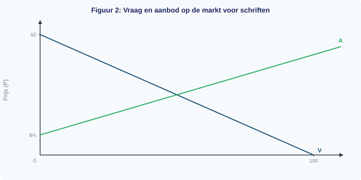
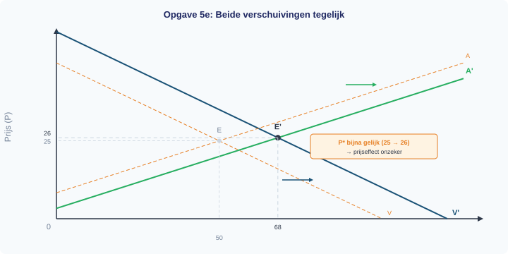
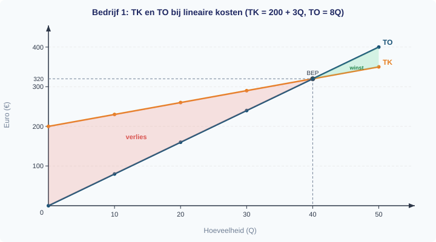
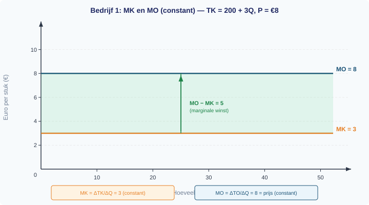
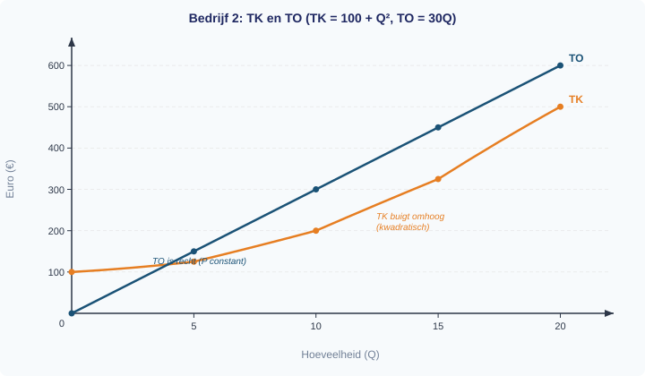
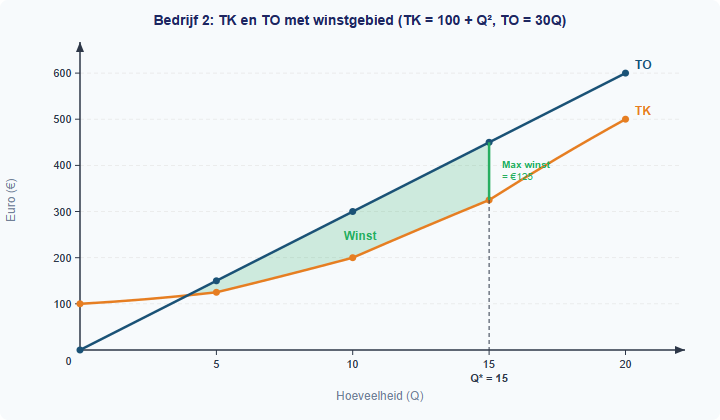
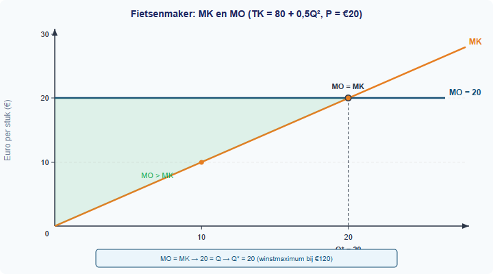

<div class="chapter-front">

<h1>Hoofdstuk 4 — Marktevenwicht en marginale analyse</h1>

<h2>Inhoud</h2>

<table>
<thead><tr><th>§</th><th>Onderwerp</th></tr></thead>
<tbody>
<tr><td>1.4.1</td><td>Marktevenwicht</td></tr>
<tr><td>1.4.2</td><td>Verschuivingen en nieuw evenwicht</td></tr>
<tr><td>1.4.3</td><td>Marginale kosten en marginale opbrengsten</td></tr>
<tr><td>1.4.4</td><td>Winstmaximalisatie</td></tr>
<tr><td>1.4.5</td><td>Gemengde opgaven</td></tr>
</tbody>
</table>

<h2>Leerdoelen</h2>

<p>Na dit hoofdstuk kun je:</p>

<ul>
<li>Het marktevenwicht berekenen door Qa = Qv op te lossen</li>
<li>De evenwichtsprijs en -hoeveelheid grafisch aflezen</li>
<li>Een aanbodoverschot of vraagoverschot herkennen en berekenen bij een gegeven prijs</li>
<li>Een nieuw evenwicht berekenen na een verschuiving van vraag of aanbod</li>
<li>Voorspellen welke richting prijs en hoeveelheid opgaan na een verschuiving</li>
<li>Analyseren wat er gebeurt bij gelijktijdige verschuivingen (dubbelzinnig prijseffect)</li>
<li>MK definiëren als de extra kosten van één extra eenheid (ΔTK/ΔQ)</li>
<li>MO definiëren als de extra opbrengst van één extra eenheid (ΔTO/ΔQ)</li>
<li>MK en MO berekenen vanuit een tabel</li>
<li>De winstmaximalisatieregel toepassen: produceer waar MO = MK</li>
<li>De optimale productieomvang berekenen met en zonder tabel</li>
</ul>

<h2>Wanneer stopt de fabrikant met produceren?</h2>

<p>Een fabrikant kan altijd meer produceren — maar moet hij dat ook doen? Elke extra eenheid levert geld op, maar kost ook geld. Zolang de extra opbrengst hoger is dan de extra kosten, loont het om door te gaan. Maar op een gegeven moment kantelt het. In dit hoofdstuk leer je eerst hoe vraag en aanbod samen de marktprijs bepalen, en daarna hoe een producent met marginale analyse precies het punt vindt waar de winst het grootst is.</p>

</div>


<div style="break-before: page;"></div>

# 1.4.1 Marktevenwicht

## Twee lijnen, één kruispunt — en toch snapt bijna niemand het in één keer

Op de markt voor schriften bieden producenten schriften aan en willen scholieren ze kopen. Je kent de vraaglijn al: hoe lager de prijs, hoe meer schriften er gevraagd worden. En je kent de aanbodlijn: hoe hoger de prijs, hoe meer schriften er aangeboden worden.

Maar welke prijs wordt het uiteindelijk? De vraag zegt "liever goedkoop", het aanbod zegt "liever duur". Ergens daartussenin moeten ze het eens worden. Dat punt heet het **marktevenwicht** — en in deze paragraaf leer je hoe je het berekent, tekent en controleert.

---

## Theorie

### De vraaglijn en de aanbodlijn samen

> **📋 Herhaling uit §1.2.2**
> De vraaglijn (V) laat het verband zien tussen de prijs en de gevraagde hoeveelheid, **terwijl alle andere omstandigheden gelijk blijven**. Een verandering van een vraagfactor (inkomen, voorkeuren, prijs van substituten/complementen, verwachtingen) verschuift de hele vraaglijn.

> **📋 Herhaling uit §1.3.1**
> De aanbodlijn (A) laat het verband zien tussen de prijs en de aangeboden hoeveelheid, **terwijl alle andere omstandigheden gelijk blijven**. Een verandering van een aanbodfactor (grondstofprijzen, technologie, aantal aanbieders, verwachtingen) verschuift de hele aanbodlijn.

Stel dat op de markt voor schriften de volgende vergelijkingen gelden:

- **Vraaglijn:** Qv = −2P + 100
- **Aanbodlijn:** Qa = 3P − 25

We tekenen eerst de vraaglijn. Bij P = 0 is de gevraagde hoeveelheid Qv = 100 stuks (het x-snijpunt). Bij Qv = 0 is de prijs P = 50 (het y-snijpunt).


Nu voegen we de aanbodlijn toe. De aanbodlijn begint bij P = 8⅓ (want bij Q = 0 geldt: 0 = 3P − 25, dus P = 25/3 ≈ 8,33). Hoe hoger de prijs, hoe meer schriften producenten willen aanbieden.



---

### Het evenwicht berekenen

Het **marktevenwicht** is het punt waar de gevraagde hoeveelheid precies gelijk is aan de aangeboden hoeveelheid. Er is dan geen overschot en geen tekort.

> **Definitie: Marktevenwicht**
> De situatie waarin de gevraagde hoeveelheid gelijk is aan de aangeboden hoeveelheid: Qv = Qa. De bijbehorende prijs heet de **evenwichtsprijs** (P*) en de bijbehorende hoeveelheid de **evenwichtshoeveelheid** (Q*).

**Hoe bereken je het evenwicht?** Stel Qv gelijk aan Qa en los op naar P:

> **Formule**
> ```
> Stap 1:  Qv = Qa
> Stap 2:  Los op naar P  →  P*
> Stap 3:  Vul P* in  →  Q*
> ```

**Stap 1:** Stel Qv = Qa.

−2P + 100 = 3P − 25

**Stap 2:** Los op naar P.

100 + 25 = 3P + 2P

125 = 5P

P* = 25

**Stap 3:** Vul P* = 25 in een van de twee vergelijkingen in.

Qv = −2 × 25 + 100 = −50 + 100 = 50

**Controle:** Vul P* = 25 ook in de andere vergelijking in.

Qa = 3 × 25 − 25 = 75 − 25 = 50 ✓

Beide geven Q = 50, dus het klopt. De evenwichtsprijs is **P* = EUR 25** en de evenwichtshoeveelheid is **Q* = 50 schriften**.


> **⚠️ Let op — veelgemaakte fout**
> Leerlingen vergeten vaak de controlestap. Als je P* maar in één vergelijking invult, merk je een rekenfout niet op. Vul P* altijd in **beide** vergelijkingen in en controleer dat je dezelfde Q* krijgt.

---

### Overschot en tekort

Wat gebeurt er als de prijs niet gelijk is aan de evenwichtsprijs?

**Als de prijs hoger is dan P*** (bijvoorbeeld P = 30):
- Qv = −2 × 30 + 100 = 40 (consumenten willen maar 40 schriften)
- Qa = 3 × 30 − 25 = 65 (producenten bieden 65 schriften aan)
- Qa > Qv → er is een **aanbodoverschot** (surplus) van 65 − 40 = 25 stuks.

**Als de prijs lager is dan P*** (bijvoorbeeld P = 20):
- Qv = −2 × 20 + 100 = 60 (consumenten willen 60 schriften)
- Qa = 3 × 20 − 25 = 35 (producenten bieden maar 35 aan)
- Qv > Qa → er is een **vraagoverschot** (tekort) van 60 − 35 = 25 stuks.

> **Definitie: Aanbodoverschot (surplus)**
> Situatie waarin Qa > Qv: producenten bieden meer aan dan consumenten willen kopen. Ontstaat als de prijs **hoger** is dan de evenwichtsprijs.

> **Definitie: Vraagoverschot (tekort)**
> Situatie waarin Qv > Qa: consumenten willen meer kopen dan producenten aanbieden. Ontstaat als de prijs **lager** is dan de evenwichtsprijs.

De volgende tabel laat het verband zien bij drie verschillende prijzen:

| Prijs (EUR) | Qv = −2P + 100 | Qa = 3P − 25 | Verschil | Overschot of tekort? |
|---|---|---|---|---|
| 20 | 60 | 35 | Qv − Qa = 25 | Vraagoverschot |
| 25 | 50 | 50 | 0 | Evenwicht |
| 30 | 40 | 65 | Qa − Qv = 25 | Aanbodoverschot |

Figuur 4 vat de kernbegrippen van het marktevenwicht in één beeld samen.


---

## Uitgewerkt voorbeeld

> **De markt voor pennen**
>
> Op de markt voor pennen geldt:
> - Qv = −3P + 90
> - Qa = 2P − 10

**(a) Bereken de evenwichtsprijs en de evenwichtshoeveelheid.**

*Stap 1: Stel Qv = Qa.*

−3P + 90 = 2P − 10

*Stap 2: Los op naar P.*

90 + 10 = 2P + 3P

100 = 5P

P* = 20

*Stap 3: Vul P* = 20 in.*

Qv = −3 × 20 + 90 = −60 + 90 = 30

**Antwoord:** P* = EUR 20, Q* = 30 pennen.

**(b) Controleer je antwoord.**

Qa = 2 × 20 − 10 = 40 − 10 = 30 ✓

Beide vergelijkingen geven Q = 30, dus de berekening klopt.

**(c) Teken de vraaglijn en de aanbodlijn en markeer het evenwichtspunt.**

De vraaglijn loopt van (Q = 0, P = 30) naar (Q = 90, P = 0). De aanbodlijn begint bij (Q = 0, P = 5). Het evenwichtspunt E ligt op P* = 20, Q* = 30.


**(d) Bij een prijs van EUR 25: is er een overschot of een tekort? Bereken de grootte.**

*Stap 1: Bereken Qv en Qa bij P = 25.*

Qv = −3 × 25 + 90 = −75 + 90 = 15

Qa = 2 × 25 − 10 = 50 − 10 = 40

*Stap 2: Vergelijk.*

Qa = 40 > Qv = 15 → er is een **aanbodoverschot**.

*Stap 3: Bereken de grootte.*

Aanbodoverschot = Qa − Qv = 40 − 15 = 25 pennen.

**De procedure samengevat:**

| Stap | Actie |
|------|-------|
| 1 | Stel Qv = Qa en los op naar P → P* |
| 2 | Vul P* in een vergelijking in → Q* |
| 3 | Controleer: vul P* in de andere vergelijking in → dezelfde Q*? |
| 4 | Teken de lijnen en markeer E op (Q*, P*) |
| 5 | Bij een gegeven prijs: bereken Qv en Qa, vergelijk → overschot of tekort |

---

> **Samenvatting §1.4.1**
> - Het marktevenwicht is het punt waar Qv = Qa: de gevraagde hoeveelheid is gelijk aan de aangeboden hoeveelheid.
> - Je berekent P* door Qv = Qa te stellen en op te lossen naar P. Vul P* vervolgens in om Q* te vinden.
> - Controleer altijd door P* in **beide** vergelijkingen in te vullen.
> - Bij P > P* ontstaat een aanbodoverschot (Qa > Qv). Bij P < P* ontstaat een vraagoverschot (Qv > Qa).
> - *In de volgende paragraaf bekijken we wat er met het evenwicht gebeurt als de vraaglijn of aanbodlijn verschuift.*

> **💡 Vastgelopen op een opgave?**
> Op de website vind je bij elke opgave een **begeleide inoefening**: stap voor stap krijg je extra hints en tussenstappen. Klik op de opgave om de begeleiding te starten.

---

## Opgaven

### Startoefeningen

**Opgave 1** *(invuloefening)*

Op de markt voor schriften geldt: Qv = −2P + 100 en Qa = 3P − 25.

a) Vul in: het evenwicht vind je door Qv ... Qa te stellen (=, >, <).

b) Schrijf de vergelijking op die je moet oplossen om P* te vinden.

c) Wat is P*? Wat is Q*?

d) Controleer je antwoord door P* in de andere vergelijking in te vullen.


**Opgave 2** *(oefenen met de procedure)*

Op de markt voor potloden geldt:
- Qv = −4P + 80
- Qa = P − 5

a) Bereken de evenwichtsprijs P*.

b) Bereken de evenwichtshoeveelheid Q*.

c) Controleer je antwoord.


**Opgave 3** *(overschot en tekort)*

Gebruik de vergelijkingen uit opgave 2 (Qv = −4P + 80, Qa = P − 5).

a) Bereken Qv en Qa bij een prijs van EUR 20.

b) Is er bij P = 20 een vraagoverschot of een aanbodoverschot? Bereken de grootte.

c) Bereken Qv en Qa bij een prijs van EUR 10.

d) Is er bij P = 10 een vraagoverschot of een aanbodoverschot? Bereken de grootte.

---

### Zelfstandige oefening

**Opgave 4** *(de doeloefening — schriftenmarkt)*

Op de markt voor schriften geldt: Qv = −2P + 100 en Qa = 3P − 25.

a) Bereken de evenwichtsprijs en de evenwichtshoeveelheid.

b) Controleer je antwoord door P* in beide vergelijkingen in te vullen.

c) Teken de vraaglijn en de aanbodlijn in een grafiek en markeer het evenwichtspunt. *(Zie figuur 5 voor een leeg assenstelsel.)*


d) Bij een prijs van EUR 30: is er een aanbodoverschot of een vraagoverschot? Bereken de grootte.


**Opgave 5** *(nieuwe markt)*

Op de markt voor USB-sticks geldt:
- Qv = −P + 40
- Qa = 2P − 20

a) Bereken de evenwichtsprijs en de evenwichtshoeveelheid.

b) Controleer je antwoord.

c) Teken de vraaglijn en de aanbodlijn in een grafiek en markeer het evenwichtspunt.

d) Bij een prijs van EUR 15: is er een overschot of een tekort? Bereken de grootte.

e) Bij een prijs van EUR 25: is er een overschot of een tekort? Bereken de grootte.


**Opgave 6** *(drie vergelijkingsparen)*

Bereken voor elk van de volgende markten de evenwichtsprijs en evenwichtshoeveelheid. Controleer telkens je antwoord.

a) Qv = −5P + 200, Qa = 3P − 40

b) Qv = −P + 50, Qa = 4P − 75

c) Qv = −3P + 120, Qa = 2P − 30

---

### Herhaling (interleaving)

**Opgave 7** *(herhaling §1.3.1: aanbodverschuiving)*

De aanbodlijn van broodjes verschuift naar links doordat de graanprijs stijgt.

a) Welke aanbodfactor is hier veranderd?

b) Wat gebeurt er met de evenwichtsprijs als de aanbodlijn naar links verschuift en de vraaglijn gelijk blijft? Leg uit.

c) Wat gebeurt er met de evenwichtshoeveelheid? Leg uit.


**Opgave 8** *(herhaling §1.2.2: vraagfactoren)*

De markt voor elektrische fietsen is in evenwicht. De overheid kondigt aan dat ze een subsidie geeft op elektrische fietsen.

a) Is dit een verandering van de eigen prijs of van een andere factor?

b) Verschuift de vraaglijn of de aanbodlijn? In welke richting?

c) Wat verwacht je dat er met de evenwichtsprijs en de evenwichtshoeveelheid gebeurt?

---

### Doeloefening

**Opgave 9** *(alles samen)*

Op de markt voor rekenmachines geldt:
- Qv = −2P + 80
- Qa = 3P − 20

a) Bereken de evenwichtsprijs en de evenwichtshoeveelheid.

b) Controleer je antwoord door P* in beide vergelijkingen in te vullen.

c) Teken de vraaglijn en de aanbodlijn in een grafiek. Markeer het evenwichtspunt.

d) Bij een prijs van EUR 25 — is er een overschot of een tekort? Bereken de grootte.

e) Noem een factor die de vraaglijn naar rechts kan laten verschuiven. Wat zou er dan met het evenwicht gebeuren?

---

### Denkertje *(bonusopgave)*

**Opgave 10**

De overheid legt een maximumprijs van EUR 15 op de markt voor schriften (Qv = −2P + 100, Qa = 3P − 25).

a) Bereken de gevraagde en aangeboden hoeveelheid bij P = 15.

b) Ontstaat er een vraagoverschot of een aanbodoverschot? Bereken de grootte.

c) Leg uit waarom de overheid een maximumprijs zou willen instellen, ondanks het tekort dat ontstaat.

d) Bedenk een maatregel waarmee de overheid het tekort kan verkleinen zonder de maximumprijs los te laten.


<div style="break-before: page;"></div>

# 1.4.2 Verschuivingen en nieuw evenwicht

## De schriftenmarkt draait op volle toeren — tot er iets verandert

In §1.4.1 heb je geleerd dat de markt voor schriften in evenwicht is bij P* = EUR 25 en Q* = 50 stuks. Maar markten staan niet stil. Een nieuwe fabriek opent, het inkomen van scholieren stijgt, of grondstoffen worden duurder. Wat gebeurt er dan met de evenwichtsprijs en de evenwichtshoeveelheid?

In deze paragraaf leer je hoe je het **nieuwe evenwicht** berekent na een verschuiving van de aanbodlijn of de vraaglijn — en wat er gebeurt als *beide* tegelijk verschuiven.

---

## Theorie

### Het uitgangspunt: de schriftenmarkt

> **📋 Herhaling uit §1.4.1**
> De evenwichtsprijs vind je door Qv = Qa te stellen en op te lossen naar P. Vul P* vervolgens in om Q* te vinden. Controleer altijd door P* in beide vergelijkingen in te vullen.

> **📋 Herhaling uit §1.3.2**
> Kostenstructuren bepalen de positie van de aanbodlijn. Als de kosten per eenheid dalen (bijv. door efficiëntere productie), verschuift de aanbodlijn naar rechts: bij elke prijs bieden producenten meer aan.

We beginnen met de bekende vergelijkingen van de schriftenmarkt:

- **Vraaglijn:** Qv = −2P + 100
- **Aanbodlijn:** Qa = 3P − 25
- **Evenwicht:** P* = EUR 25, Q* = 50 stuks

De vraaglijn laat het verband zien tussen de prijs en de gevraagde hoeveelheid, **terwijl alle andere omstandigheden gelijk blijven** (ceteris paribus). De aanbodlijn laat hetzelfde verband zien voor de aangeboden hoeveelheid.


---

### Verschuiving van de aanbodlijn

Stel dat een **nieuwe fabriek** opent die schriften produceert. Er zijn nu meer aanbieders, dus bij elke prijs worden er meer schriften aangeboden. De aanbodlijn verschuift **naar rechts**.

De nieuwe aanbodvergelijking is: **Qa' = 3P − 10**

Merk op: de helling (3) is hetzelfde gebleven, maar de constante is veranderd van −25 naar −10. Dat betekent dat de aanbodlijn 15 eenheden naar rechts is verschoven: bij elke prijs bieden producenten 15 schriften meer aan dan voorheen.

**Hoe berekenen we het nieuwe evenwicht?** Dezelfde drie stappen als in §1.4.1:

*Stap 1: Stel Qv = Qa' (nieuw).*

−2P + 100 = 3P − 10

*Stap 2: Los op naar P.*

100 + 10 = 3P + 2P

110 = 5P

P*' = 22

*Stap 3: Vul P*' = 22 in.*

Qv = −2 × 22 + 100 = −44 + 100 = 56

*Controle:* Qa' = 3 × 22 − 10 = 66 − 10 = 56 ✓

Het nieuwe evenwicht is **P*' = EUR 22, Q*' = 56 schriften**.

**Vergelijk oud en nieuw:**

| | Oud evenwicht | Nieuw evenwicht | Verandering |
|---|---|---|---|
| Prijs (P*) | EUR 25 | EUR 22 | **daalt** met EUR 3 |
| Hoeveelheid (Q*) | 50 | 56 | **stijgt** met 6 stuks |

Dit is logisch: meer aanbod → meer concurrentie tussen producenten → de prijs daalt. Omdat de prijs daalt, willen consumenten meer kopen → de hoeveelheid stijgt.


---

### Verschuiving van de vraaglijn

Nu een ander scenario. Stel dat het **inkomen van scholieren stijgt** (bijv. doordat het minimumloon omhoog gaat). Schriften zijn een normaal goed: bij een hoger inkomen willen scholieren er meer kopen. De vraaglijn verschuift **naar rechts**.

De aanbodlijn is weer de oorspronkelijke: Qa = 3P − 25. De nieuwe vraagvergelijking is: **Qv' = −2P + 120**

De helling (−2) is hetzelfde gebleven, maar het snijpunt met de Q-as is verschoven van 100 naar 120. Bij elke prijs willen consumenten 20 schriften meer kopen.

*Stap 1: Stel Qv' = Qa.*

−2P + 120 = 3P − 25

*Stap 2: Los op naar P.*

120 + 25 = 3P + 2P

145 = 5P

P*' = 29

*Stap 3: Vul P*' = 29 in.*

Qv' = −2 × 29 + 120 = −58 + 120 = 62

*Controle:* Qa = 3 × 29 − 25 = 87 − 25 = 62 ✓

Het nieuwe evenwicht is **P*' = EUR 29, Q*' = 62 schriften**.

**Vergelijk oud en nieuw:**

| | Oud evenwicht | Nieuw evenwicht | Verandering |
|---|---|---|---|
| Prijs (P*) | EUR 25 | EUR 29 | **stijgt** met EUR 4 |
| Hoeveelheid (Q*) | 50 | 62 | **stijgt** met 12 stuks |

Dit is logisch: meer vraag → consumenten bieden tegen elkaar op → de prijs stijgt. Omdat de prijs stijgt, willen producenten meer aanbieden → de hoeveelheid stijgt.


> **⚠️ Let op — veelgemaakte fout**
> Veel leerlingen verwarren een *verschuiving van* de vraaglijn met een *beweging langs* de vraaglijn. Een prijsverandering van het goed zelf → beweging LANGS de lijn (je schuift over de bestaande lijn naar een ander punt). Een verandering van inkomen, voorkeuren of andere factoren → verschuiving VAN de hele lijn (de lijn krijgt een nieuwe positie).

---

### De vuistregels

De volgende tabel vat de effecten samen:

| Verschuiving | Prijs (P*) | Hoeveelheid (Q*) |
|---|---|---|
| Aanbod → rechts (meer aanbod) | **daalt** | **stijgt** |
| Aanbod ← links (minder aanbod) | **stijgt** | **daalt** |
| Vraag → rechts (meer vraag) | **stijgt** | **stijgt** |
| Vraag ← links (minder vraag) | **daalt** | **daalt** |

**Ezelsbruggetje:** bij een aanbodverschuiving bewegen prijs en hoeveelheid in *tegengestelde* richting. Bij een vraagverschuiving bewegen ze in *dezelfde* richting.

Figuur 4 vat de twee soorten verschuivingen in één beeld samen.


---

### Twee verschuivingen tegelijk

Wat als de aanbodlijn *en* de vraaglijn tegelijk verschuiven? Dat is lastiger: de effecten op de prijs kunnen elkaar versterken of tegenwerken.

Stel dat de nieuwe fabriek opent (Qa' = 3P − 10) *en* het inkomen stijgt (Qv' = −2P + 120) tegelijk.

*Stap 1: Stel Qv' = Qa'.*

−2P + 120 = 3P − 10

*Stap 2: Los op naar P.*

120 + 10 = 3P + 2P

130 = 5P

P*' = 26

*Stap 3: Vul P*' = 26 in.*

Qv' = −2 × 26 + 120 = −52 + 120 = 68

*Controle:* Qa' = 3 × 26 − 10 = 78 − 10 = 68 ✓

**Vergelijk alle evenwichten:**

| Situatie | P* | Q* |
|---|---|---|
| Oorspronkelijk | EUR 25 | 50 |
| Alleen meer aanbod | EUR 22 | 56 |
| Alleen meer vraag | EUR 29 | 62 |
| Beide tegelijk | EUR 26 | 68 |

De **hoeveelheid** stijgt altijd: zowel meer aanbod als meer vraag duwen Q* omhoog. Dat is logisch — beide verschuivingen vergroten de markt.

De **prijs** is onzeker: meer aanbod drukt de prijs omlaag, maar meer vraag duwt de prijs omhoog. Het uiteindelijke effect hangt af van welke verschuiving groter is. In dit voorbeeld stijgt de prijs een klein beetje (van EUR 25 naar EUR 26), maar bij een grotere aanbodverschuiving had de prijs ook kunnen dalen.

> **Definitie: Ambigue uitkomst**
> Wanneer vraag en aanbod allebei naar rechts verschuiven, stijgt de hoeveelheid altijd, maar is het prijseffect **onbepaald** — het hangt af van de relatieve grootte van de verschuivingen.

Figuur 5 vat alle verschuivingen en hun effecten in één overzicht samen.


---

## Uitgewerkt voorbeeld

> **De markt voor fietsbellen**
>
> Op de markt voor fietsbellen geldt:
> - Qv = −P + 60
> - Qa = 2P − 30
>
> Door een technologische verbetering daalt de productiekost. De nieuwe aanbodvergelijking wordt: Qa' = 2P − 18.

**(a) Bereken het oorspronkelijke evenwicht.**

*Stap 1: Stel Qv = Qa.*

−P + 60 = 2P − 30

*Stap 2: Los op naar P.*

60 + 30 = 2P + P

90 = 3P

P* = 30

*Stap 3: Vul P* = 30 in.*

Qv = −30 + 60 = 30

*Controle:* Qa = 2 × 30 − 30 = 60 − 30 = 30 ✓

**Antwoord:** P* = EUR 30, Q* = 30 fietsbellen.

**(b) Bereken het nieuwe evenwicht na de aanbodverschuiving.**

*Stap 1: Stel Qv = Qa'.*

−P + 60 = 2P − 18

*Stap 2: Los op naar P.*

60 + 18 = 2P + P

78 = 3P

P*' = 26

*Stap 3: Vul P*' = 26 in.*

Qv = −26 + 60 = 34

*Controle:* Qa' = 2 × 26 − 18 = 52 − 18 = 34 ✓

**Antwoord:** P*' = EUR 26, Q*' = 34 fietsbellen.

**(c) Vergelijk het oude en nieuwe evenwicht.**

| | Oud | Nieuw | Verandering |
|---|---|---|---|
| P* | EUR 30 | EUR 26 | daalt met EUR 4 |
| Q* | 30 | 34 | stijgt met 4 |

Dit klopt met de vuistregel: aanbod naar rechts → prijs daalt, hoeveelheid stijgt.

**(d) Teken de verschuiving in een grafiek.**


**De procedure samengevat:**

| Stap | Actie |
|------|-------|
| 1 | Bereken het oorspronkelijke evenwicht (Qv = Qa → P*, Q*) |
| 2 | Bereken het nieuwe evenwicht met de nieuwe vergelijking (Qv = Qa' → P*', Q*') |
| 3 | Vergelijk: is de prijs gestegen of gedaald? Is de hoeveelheid gestegen of gedaald? |
| 4 | Controleer met de vuistregel: past het bij de richting van de verschuiving? |
| 5 | Teken beide lijnen in de grafiek, markeer E en E' |

---

> **Samenvatting §1.4.2**
> - Een verschuiving van de aanbodlijn of vraaglijn leidt tot een **nieuw evenwicht** met een andere prijs en hoeveelheid.
> - Je berekent het nieuwe evenwicht met dezelfde methode: Qv = Qa (nieuw) → P*' → Q*'.
> - Aanbod naar rechts → P* daalt, Q* stijgt. Vraag naar rechts → P* stijgt, Q* stijgt.
> - Bij twee gelijktijdige verschuivingen naar rechts is het hoeveelheidseffect duidelijk (stijging), maar het prijseffect **onzeker**.
> - *In de volgende paragraaf bekijken we de welvaart op de markt: consumentensurplus en producentensurplus.*

> **💡 Vastgelopen op een opgave?**
> Op de website vind je bij elke opgave een **begeleide inoefening**: stap voor stap krijg je extra hints en tussenstappen. Klik op de opgave om de begeleiding te starten.

---

## Uitgewerkt voorbeeld

> **De markt voor fietsbellen**
>
> Op de markt voor fietsbellen geldt:
> - Qv = −P + 60
> - Qa = 2P − 30
>
> Door een technologische verbetering daalt de productiekost. De nieuwe aanbodvergelijking wordt: Qa' = 2P − 18.

**(a) Bereken het oorspronkelijke evenwicht.**

*Stap 1: Stel Qv = Qa.*

−P + 60 = 2P − 30

*Stap 2: Los op naar P.*

90 = 3P → P* = 30

*Stap 3: Vul P* = 30 in.*

Qv = −30 + 60 = 30

*Controle:* Qa = 2 × 30 − 30 = 30 ✓

**Antwoord:** P* = €30, Q* = 30 fietsbellen.

**(b) Bereken het nieuwe evenwicht na de aanbodverschuiving.**

*Stap 1: Stel Qv = Qa'.*

−P + 60 = 2P − 18 → 78 = 3P → P*' = 26

*Stap 3: Vul in.*

Qv = −26 + 60 = 34. *Controle:* Qa' = 2 × 26 − 18 = 34 ✓

**Antwoord:** P*' = €26, Q*' = 34 fietsbellen.

**(c) Vergelijk het oude en nieuwe evenwicht.**

Prijs daalt (€30 → €26), hoeveelheid stijgt (30 → 34). Aanbod naar rechts → prijs daalt, hoeveelheid stijgt.

**(d) Teken de verschuiving in een grafiek.**


---

## Opgaven

### Startoefeningen

**Opgave 1** *(invuloefening)*

Vul de juiste woorden in.

a) Als de aanbodlijn naar rechts verschuift en de vraaglijn gelijk blijft, dan ... (stijgt/daalt) de evenwichtsprijs en ... (stijgt/daalt) de evenwichtshoeveelheid.

b) Als de vraaglijn naar rechts verschuift en de aanbodlijn gelijk blijft, dan ... (stijgt/daalt) de evenwichtsprijs en ... (stijgt/daalt) de evenwichtshoeveelheid.

c) Een verschuiving van de aanbodlijn wordt veroorzaakt door een verandering van een ... (vraagfactor/aanbodfactor). Noem twee voorbeelden.

d) Een verschuiving van de vraaglijn wordt veroorzaakt door een verandering van een ... (vraagfactor/aanbodfactor). Noem twee voorbeelden.


**Opgave 2** *(oefenen: aanbodverschuiving)*

Op de markt voor ringbanden geldt:
- Qv = −3P + 120
- Qa = 2P − 30

Door stijgende grondstofprijzen wordt de aanbodvergelijking: Qa' = 2P − 50.

a) Bereken het oorspronkelijke evenwicht (P* en Q*).

b) Bereken het nieuwe evenwicht na de aanbodverschuiving.

c) Is de aanbodlijn naar links of naar rechts verschoven? Leg uit.

d) Vergelijk het oude en nieuwe evenwicht. Past de verandering bij de vuistregel?


**Opgave 3** *(oefenen: vraagverschuiving)*

Op de markt voor geodriehoeken geldt:
- Qv = −P + 50
- Qa = 4P − 75

Een concurrent brengt een goedkoop alternatief op de markt. De nieuwe vraagvergelijking is: Qv' = −P + 40.

a) Bereken het oorspronkelijke evenwicht.

b) Bereken het nieuwe evenwicht.

c) Is de vraaglijn naar links of naar rechts verschoven? Welke vraagfactor is veranderd?

d) Vergelijk het oude en nieuwe evenwicht. Past de verandering bij de vuistregel?

---

### Zelfstandige oefening

**Opgave 4** *(de procedure — nieuwe markt)*

Op de markt voor linialen geldt:
- Qv = −2P + 80
- Qa = 3P − 20

Door automatisering worden de productiekosten lager. De nieuwe aanbodvergelijking is: Qa' = 3P − 5.

a) Bereken het oorspronkelijke evenwicht.

b) Bereken het nieuwe evenwicht.

c) Vergelijk: wat is er met de prijs en de hoeveelheid gebeurd?

d) Teken de oorspronkelijke vraaglijn, de oorspronkelijke aanbodlijn en de nieuwe aanbodlijn in een grafiek. Markeer E en E'.


**Opgave 5** *(de doeloefening — schriftenmarkt, alle stappen)*

Ga uit van de schriftenmarkt: Qv = −2P + 100, Qa = 3P − 25, P* = €25, Q* = 50.

a) Een nieuwe fabriek opent. De nieuwe aanbodvergelijking is Qa' = 3P − 10. Bereken het nieuwe evenwicht.

b) Vergelijk met het oude evenwicht: wat is er met de prijs en de hoeveelheid gebeurd? Is dit logisch? Leg uit.

c) Het inkomen van scholieren stijgt. De nieuwe vraagvergelijking is Qv' = −2P + 120 (het aanbod is weer de oorspronkelijke: Qa = 3P − 25). Bereken het nieuwe evenwicht.

d) Teken een grafiek waarin je beide verschuivingen (apart) laat zien met pijlen die de richting aangeven.


e) Nu vinden BEIDE veranderingen tegelijk plaats: Qa' = 3P − 10 en Qv' = −2P + 120. Bereken het nieuwe evenwicht. Had je de richting van de prijsverandering kunnen voorspellen zonder te rekenen? Leg uit.



---

### Herhaling (interleaving)

**Opgave 6** *(herhaling §1.4.1: evenwicht berekenen)*

Op de markt voor rekenmachines geldt:
- Qv = −2P + 70
- Qa = 3P − 30

a) Bereken de evenwichtsprijs en de evenwichtshoeveelheid.

b) Controleer je antwoord door P* in beide vergelijkingen in te vullen.

c) Bij een prijs van €25: is er een overschot of een tekort? Bereken de grootte.


**Opgave 7** *(herhaling §1.3.2: kostenstructuren)*

Een schriftenfabriek heeft constante kosten van €5.000 per maand en variabele kosten van €8 per schrift.

a) Schrijf de formule voor de totale kosten (TK) als functie van Q.

b) Bereken de gemiddelde totale kosten (GTK) bij een productie van 200 schriften.

c) De fabriek verkoopt schriften voor €25 per stuk. Bereken de winst bij een productie van 200 schriften.

d) Leg uit: als de variabele kosten per schrift dalen (bijv. van €8 naar €6), wat gebeurt er dan met de aanbodlijn van deze fabriek? Verschuift deze naar links of naar rechts?

---

### Doeloefening

**Opgave 8** *(alles samen — twee markten)*

Op de markt voor vulpennen geldt:
- Qv = −4P + 200
- Qa = P − 10

a) Bereken het oorspronkelijke evenwicht.

b) Door een trend op sociale media willen meer scholieren een vulpen. De nieuwe vraagvergelijking is: Qv' = −4P + 240. Bereken het nieuwe evenwicht.

c) Vergelijk het oude en nieuwe evenwicht. Past de verandering bij de vuistregel?

d) Tegelijkertijd wordt inkt duurder, waardoor de aanbodvergelijking verandert in: Qa' = P − 20. Bereken het evenwicht als BEIDE veranderingen tegelijk optreden (Qv' = −4P + 240 en Qa' = P − 20).

e) Vergelijk dit evenwicht met het oorspronkelijke. De hoeveelheid is ... (gestegen/gedaald/gelijk gebleven). De prijs is ... Leg uit waarom het prijseffect lastig te voorspellen was zonder te rekenen.

---

### Denkertje *(bonusopgave)*

**Opgave 9**

Op een markt geldt: Qv = −2P + 100 en Qa = 3P − 25 (P* = 25, Q* = 50).

Het aanbod verschuift naar rechts met precies dezelfde hoeveelheid als waarmee de vraag naar rechts verschuift. Stel: beide lijnen verschuiven k eenheden naar rechts.

a) Schrijf de nieuwe vergelijkingen op als functie van k.

b) Bereken het nieuwe evenwicht (P*' en Q*') als functie van k.

c) Laat zien dat de evenwichtsprijs niet verandert, ongeacht de waarde van k. Leg economisch uit waarom dit zo is.

d) Wat gebeurt er met de evenwichtshoeveelheid als k groter wordt?


<div style="break-before: page;"></div>

# 1.4.3 Marginale kosten en marginale opbrengsten

## Loont het om nog één extra te produceren?

Een ijsfabrikant verkoopt elk ijsje voor €3. Hij maakt er nu 500 per dag. Een medewerker vraagt: "Zullen we er 501 maken?" De ondernemer denkt na. Dat ene extra ijsje levert €3 op. Maar wat kost het om dat ene extra ijsje te maken? Als de extra kosten €2 zijn, levert het ijsje €1 winst op. Maar als de extra kosten €4 zijn, verliest hij er juist €1 op.

De ondernemer hoeft niet de *totale* winst opnieuw uit te rekenen. Hij hoeft alleen te kijken naar de **extra kosten** en de **extra opbrengst** van dat ene product. Dit is de kern van *marginaal denken*: niet het geheel, maar de verandering aan de marge.

In deze paragraaf leer je twee nieuwe begrippen: marginale kosten (MK) en marginale opbrengsten (MO). Je leert ze berekenen met een tabel en je ziet wat er gebeurt als de kosten lineair of kwadratisch stijgen.

---

## Theorie

### Marginale kosten (MK)

> **📋 Herhaling uit §1.3.3**
> De totale kosten (TK) zijn de som van alle constante en variabele kosten: TK = TCK + TVK. De totale opbrengst is TO = P x Q. De winst is TO - TK.

Stel dat een bedrijf nu Q = 20 eenheden produceert en de totale kosten TK = €260 bedragen. Als het bedrijf de productie verhoogt naar Q = 21, stijgen de totale kosten naar TK = €263. De kosten zijn dus met €3 gestegen. Die €3 noemen we de **marginale kosten**: de extra kosten van één extra eenheid.

> **Definitie: Marginale kosten (MK)**
> De extra kosten die een bedrijf maakt als het één eenheid meer produceert.
> MK = ΔTK / ΔQ (de verandering van de totale kosten gedeeld door de verandering van de hoeveelheid).

> **Formule**
> ```
> MK = ΔTK / ΔQ
> ```
> Waarbij ΔTK = TK(nieuw) − TK(oud) en ΔQ = Q(nieuw) − Q(oud).

Neem bedrijf 1 als voorbeeld. Dit bedrijf heeft TK = 200 + 3Q. Elke extra eenheid voegt precies €3 toe aan de totale kosten. De marginale kosten zijn dus constant: MK = 3.

We berekenen de waarden in een tabel:

| Q | TK = 200 + 3Q | ΔTK (t.o.v. vorige rij) | ΔQ | MK = ΔTK / ΔQ |
|---|--------------|------------------------|-----|----------------|
| 0 | 200 | — | — | — |
| 10 | 230 | 30 | 10 | 3 |
| 20 | 260 | 30 | 10 | 3 |
| 30 | 290 | 30 | 10 | 3 |
| 40 | 320 | 30 | 10 | 3 |
| 50 | 350 | 30 | 10 | 3 |

MK is bij elke stap precies 3. Dat klopt: de formule TK = 200 + 3Q is lineair. Het variabele deel stijgt met €3 per eenheid, ongeacht hoeveel je al produceert.

---

### Marginale opbrengsten (MO)

Nu dezelfde vraag voor de opbrengstenkant. Het bedrijf verkoopt elk product voor €8. De totale opbrengst is TO = 8Q. Als het bedrijf één eenheid meer verkoopt, stijgt de totale opbrengst met €8. Die €8 noemen we de **marginale opbrengsten**.

> **Definitie: Marginale opbrengsten (MO)**
> De extra opbrengst die een bedrijf ontvangt als het één eenheid meer verkoopt.
> MO = ΔTO / ΔQ (de verandering van de totale opbrengst gedeeld door de verandering van de hoeveelheid).

> **Formule**
> ```
> MO = ΔTO / ΔQ
> ```
> Waarbij ΔTO = TO(nieuw) − TO(oud) en ΔQ = Q(nieuw) − Q(oud).

Bij een constante prijs (het bedrijf is een prijsnemer) geldt: MO = P. Elke extra eenheid levert precies de marktprijs op. Dit is logisch: als de prijs niet verandert, is de extra opbrengst van elk volgend product gelijk aan de prijs.

---

### Bedrijf 1: MK en MO samen in de tabel

We combineren nu kosten en opbrengsten voor bedrijf 1 (TK = 200 + 3Q, P = €8, TO = 8Q):

| Q | TK | TO | Winst (TO − TK) | MK | MO |
|---|-----|-----|-----------------|-----|-----|
| 0 | 200 | 0 | −200 | — | — |
| 10 | 230 | 80 | −150 | 3 | 8 |
| 20 | 260 | 160 | −100 | 3 | 8 |
| 30 | 290 | 240 | −50 | 3 | 8 |
| 40 | 320 | 320 | 0 | 3 | 8 |
| 50 | 350 | 400 | 50 | 3 | 8 |

Figuur 1 toont TK en TO als rechte lijnen. Het snijpunt bij Q = 40 is het break-evenpunt (BEP): daar is de winst precies nul.



In figuur 2 zie je MK en MO als twee horizontale lijnen. MK = 3 en MO = 8. Het verschil MO − MK = 5 is de extra winst per eenheid: elke extra eenheid levert €5 winst op. Zolang MO groter is dan MK, loont het om meer te produceren.



Zo zie je dezelfde informatie in drie vormen tegelijk: in de tabel hierboven, in de twee grafieken, en in de tekst die ze verbindt.

---

### Bedrijf 2: kwadratische kosten

Niet alle bedrijven hebben constante marginale kosten. Neem bedrijf 2 met TK = 100 + Q². De kosten stijgen nu niet meer gelijkmatig: hoe meer je produceert, hoe sneller de kosten stijgen. Dit bedrijf verkoopt tegen P = €30, dus TO = 30Q.

| Q | TK = 100 + Q² | TO = 30Q | Winst | ΔTK | ΔQ | MK = ΔTK/ΔQ | MO |
|---|--------------|---------|-------|-----|-----|-------------|-----|
| 0 | 100 | 0 | −100 | — | — | — | — |
| 5 | 125 | 150 | 25 | 25 | 5 | 5 | 30 |
| 10 | 200 | 300 | 100 | 75 | 5 | 15 | 30 |
| 15 | 325 | 450 | 125 | 125 | 5 | 25 | 30 |
| 20 | 500 | 600 | 100 | 175 | 5 | 35 | 30 |

Kijk naar de kolom MK: 5, 15, 25, 35. De marginale kosten *stijgen*. Elke extra groep van 5 eenheden wordt duurder om te produceren. Dit komt doordat TK kwadratisch is: de kosten accelereren.

MO blijft constant op 30 — logisch, want de prijs is vast op €30.

Figuur 3 toont TK als een *kromme* (omhoogbuigend) en TO als een rechte lijn.



Figuur 4 laat de stijgende MK zien als stappen. Bij Q = 15 is MK = 25, nog onder MO = 30. Bij Q = 20 is MK = 35, al boven MO = 30. Ergens tussen Q = 15 en Q = 20 haalt MK de prijs in. Vanaf dat punt kost elke extra eenheid meer dan ze oplevert.


> **⚠️ Let op — veelgemaakte fout**
> Veel leerlingen denken dat de winst het hoogst is bij de grootste productie. Maar kijk naar de tabel: bij Q = 15 is de winst €125, bij Q = 20 is de winst €100. Meer produceren kan de winst *verlagen* als de marginale kosten boven de marginale opbrengsten uitstijgen.

---

### Twee patronen: lineair versus kwadratisch

| | Lineaire TK (bedrijf 1) | Kwadratische TK (bedrijf 2) |
|---|------------------------|---------------------------|
| Formule TK | TK = 200 + 3Q | TK = 100 + Q² |
| Grafiek TK | Rechte lijn | Kromme (buigt omhoog) |
| MK | Constant (= 3) | Stijgend (5, 15, 25, 35, …) |
| MO bij vaste prijs | Constant (= P) | Constant (= P) |

Figuur 5 vat het marginale denken in een overzicht samen.


---

## Uitgewerkt voorbeeld

> **De snoepfabriek**
>
> Een snoepfabriek heeft vaste kosten van €300 per dag (huur, machines). De variabele kosten bedragen €5 per zak snoep. De verkoopprijs is €12 per zak.

**(a)** Schrijf de formules voor TK en TO als functie van Q.

*Stap 1: Identificeer constante en variabele kosten.*

- TCK = €300 (vast)
- TVK = €5 per zak → TVK = 5Q
- TK = TCK + TVK = 300 + 5Q

*Stap 2: Schrijf de formule voor TO.*

- TO = P × Q = 12 × Q = 12Q

**(b)** Bereken MK en MO.

*Stap 3: Bereken MK = ΔTK / ΔQ.*

TK = 300 + 5Q. Als Q met 1 stijgt, stijgt TK met €5. Dus MK = 5.

*Stap 4: Bereken MO = ΔTO / ΔQ.*

TO = 12Q. Als Q met 1 stijgt, stijgt TO met €12. Dus MO = 12.

**(c)** Vul de tabel in voor Q = 0, 10, 20, 30, 40, 50.

| Q | TK = 300 + 5Q | TO = 12Q | Winst | MK | MO |
|---|--------------|---------|-------|----|----|
| 0 | 300 | 0 | −300 | — | — |
| 10 | 350 | 120 | −230 | 5 | 12 |
| 20 | 400 | 240 | −160 | 5 | 12 |
| 30 | 450 | 360 | −90 | 5 | 12 |
| 40 | 500 | 480 | −20 | 5 | 12 |
| 50 | 550 | 600 | 50 | 5 | 12 |

**(d)** Wat valt op aan MK en MO?

MK is constant op €5 (lineaire TK). MO is constant op €12 (constante prijs). Elke extra zak snoep levert €12 − €5 = €7 winst op. Het loont altijd om meer te produceren, want MO > MK bij elke hoeveelheid.


---

> **Samenvatting §1.4.3**
> - **Marginale kosten (MK)** = de extra kosten van één extra eenheid: MK = ΔTK / ΔQ.
> - **Marginale opbrengsten (MO)** = de extra opbrengst van één extra eenheid: MO = ΔTO / ΔQ.
> - Bij een **constante prijs** geldt: MO = P (de prijs is de extra opbrengst per stuk).
> - Bij **lineaire TK** is MK constant. Bij **kwadratische TK** stijgt MK met de productie.
> - Zolang MO > MK levert elke extra eenheid winst op. *In §1.4.4 gebruik je deze regel om de winstmaximaliserende productie te bepalen.*

> **💡 Vastgelopen op een opgave?**
> Op de website vind je bij elke opgave een **begeleide inoefening**: stap voor stap krijg je extra hints en tussenstappen. Klik op de opgave om de begeleiding te starten.

---

## Opgaven

### Startoefeningen

**Opgave 1** *(lees de tabel en de grafiek — zie figuur 6)*

Een transportbedrijf heeft TK = 400 + 6Q (Q = aantal ritten). Het bedrijf ontvangt €10 per rit, dus TO = 10Q.

In figuur 6 zie je de TK- en TO-lijnen.


a) Vul de onderstaande tabel in:

| Q | TK | TO | Winst | MK | MO |
|---|-----|-----|-------|----|----|
| 0 | | | | — | — |
| 20 | | | | | |
| 40 | | | | | |
| 60 | | | | | |
| 80 | | | | | |
| 100 | | | | | |

b) Wat valt je op aan de kolom MK? Is MK constant of veranderlijk? Leg uit waarom.

c) Wat valt je op aan de kolom MO? Waarom is dit logisch bij een vaste prijs?

d) Bij welk aantal ritten is de winst precies nul (break-evenpunt)? Controleer dit met de grafiek.


**Opgave 2** *(bereken MK bij kwadratische kosten)*

Een tuinbouwbedrijf heeft TK = 50 + 2Q². Het verkoopt planten voor €40 per stuk, dus TO = 40Q.

a) Bereken TK bij Q = 0, 5, 10, 15, 20.

b) Bereken MK voor elk interval (ΔQ = 5). Zet alles in een tabel.

c) Wat gebeurt er met MK als Q toeneemt? Leg uit waarom MK stijgt.

d) Bereken MO. Is MO constant of veranderlijk?

e) Bij welk interval wordt MK groter dan MO? Wat betekent dit voor het bedrijf?


**Opgave 3** *(begrip toepassen — geen berekening)*

Leg in je eigen woorden uit:

a) Wat vertelt MK je over een bedrijf?

b) Wat vertelt MO je over een bedrijf?

c) Een bedrijf heeft MK = 7 en MO = 10. Moet dit bedrijf meer of minder produceren? Leg uit.

d) Een bedrijf heeft MK = 15 en MO = 9. Wat adviseer je dit bedrijf? Leg uit.

---

### Zelfstandige oefening

**Opgave 4** *(berekenen en grafiek lezen — zie figuur 7)*

Een meubelfabriek heeft TK = 500 + 0,5Q². De verkoopprijs is €25 per stoel, dus TO = 25Q.

In figuur 7 zie je MK en MO van de meubelfabriek.


a) Bereken TK bij Q = 0, 10, 20, 30, 40, 50.

b) Bereken MK voor elk interval (ΔQ = 10). Zet alles in een tabel met kolommen Q, TK, ΔTK, MK, TO, MO.

c) Bij welk interval wordt MK voor het eerst groter dan MO? Controleer dit met de grafiek.

d) Bereken de winst bij Q = 20 en bij Q = 30. Bij welke hoeveelheid is de winst hoger?


**Opgave 5** *(vergelijken van twee bedrijven)*

Twee bedrijven produceren hetzelfde product en verkopen het voor €20 per stuk.

| | Bedrijf X | Bedrijf Y |
|---|-----------|-----------|
| TK-formule | TK = 100 + 4Q | TK = 50 + Q² |

a) Bereken MK van bedrijf X. Is MK constant of veranderlijk?

b) Bereken MK van bedrijf Y bij de intervallen Q = 0 → 5, Q = 5 → 10, Q = 10 → 15. Is MK constant of veranderlijk?

c) Bereken MO voor beide bedrijven. Verschilt MO tussen de bedrijven?

d) Bij welk bedrijf worden extra eenheden op een gegeven moment te duur om te produceren? Leg uit met behulp van MK en MO.

---

### Herhaling (interleaving)

**Opgave 6** *(herhaling §1.3.3: TO, TK, winst, break-even)*

Een schoenmaker heeft vaste kosten van €600 per maand. De variabele kosten zijn €8 per paar schoenen. De verkoopprijs is €20 per paar.

a) Schrijf de formules voor TK en TO als functie van Q.

b) Bereken het break-evenpunt (waar winst = 0).

c) Bereken de winst bij Q = 100.


**Opgave 7** *(herhaling §1.2.1: betalingsbereidheid)*

Een consument wil kopjes koffie kopen. Zijn betalingsbereidheid per kopje: €4,00 voor het eerste, €3,00 voor het tweede, €1,80 voor het derde, €0,50 voor het vierde.

a) De marktprijs is €2,50. Hoeveel kopjes koopt hij?

b) Bereken het totale consumentensurplus.

c) Leg uit wat het verband is tussen betalingsbereidheid en marginaal nut (de extra tevredenheid van één extra kopje).

---

### Doeloefening

**Opgave 8**

Een bedrijf heeft TK = 200 + 3Q en verkoopt tegen een vaste prijs van €8 per eenheid, dus TO = 8Q.

a) Vul de tabel in voor Q = 0, 10, 20, 30, 40, 50:

| Q | TK | TO | Winst | MK (= ΔTK bij ΔQ = 10) | MO (= ΔTO bij ΔQ = 10) |
|---|-----|-----|-------|------------------------|------------------------|
| 0 | | | | — | — |
| 10 | | | | | |
| 20 | | | | | |
| 30 | | | | | |
| 40 | | | | | |
| 50 | | | | | |

b) Wat valt je op aan MK? Is MK constant of veranderlijk?

c) Wat valt je op aan MO? Waarom is dit logisch bij een constante prijs?

d) Een tweede bedrijf heeft TK = 100 + Q² en verkoopt tegen €30 per eenheid. Vul een vergelijkbare tabel in voor Q = 0, 5, 10, 15, 20. Wat gebeurt er nu met MK?

e) Leg in je eigen woorden uit: wat vertelt MK je? Wat vertelt MO je?

---

### Denkertje *(bonusopgave)*

**Opgave 9**

Een ondernemer overweegt of hij zijn productie moet uitbreiden van 100 naar 101 eenheden. De totale kosten stijgen van €5.000 naar €5.060. De totale opbrengst stijgt van €6.000 naar €6.050.

a) Bereken MK en MO van de 101e eenheid.

b) Moet de ondernemer de 101e eenheid produceren? Leg uit.

c) De ondernemer overweegt ook de 102e eenheid. De totale kosten stijgen naar €5.130 en de totale opbrengst naar €6.100. Bereken MK en MO van de 102e eenheid. Moet hij deze ook produceren?

d) De ondernemer merkt dat MK steeds sneller stijgt. Leg uit waarom er een punt komt waarop hij moet stoppen met uitbreiden, ook al is de totale winst nog steeds positief.


<div style="break-before: page;"></div>

# 1.4.4 Winstmaximalisatie: de MO = MK-regel

## Wanneer moet een bedrijf stoppen met produceren?

Bedrijf 2 uit de vorige paragraaf verkoopt elk product voor €30. Bij Q = 10 maakt het bedrijf €100 winst. Bij Q = 15 is de winst €125. Maar bij Q = 20 daalt de winst weer naar €100. Er is dus een hoeveelheid waarbij de winst het hoogst is. Hoe vind je dat punt — zonder elke hoeveelheid uit te rekenen?

Het antwoord zit in de marginale kosten en marginale opbrengsten die je in §1.4.3 hebt geleerd. In deze paragraaf ontdek je de **MO = MK-regel**: het punt waar de winst maximaal is, en hoe je dat punt kunt berekenen.

---

## Theorie

### De winst per hoeveelheid: een tabel

> **📋 Herhaling uit §1.4.3**
> MK = ΔTK / ΔQ (extra kosten van één extra eenheid). MO = ΔTO / ΔQ (extra opbrengst van één extra eenheid). Bij een vaste prijs geldt MO = P.

We pakken bedrijf 2 weer op: TK = 100 + Q², P = €30, TO = 30Q. Nu berekenen we de winst bij elke hoeveelheid, met stappen van ΔQ = 1:

| Q | TK = 100 + Q² | TO = 30Q | Winst (TO − TK) | MK | MO |
|---|--------------|---------|-----------------|-----|-----|
| 0 | 100 | 0 | −100 | — | — |
| 5 | 125 | 150 | 25 | 5 | 30 |
| 10 | 200 | 300 | 100 | 15 | 30 |
| 13 | 269 | 390 | 121 | 25 | 30 |
| 14 | 296 | 420 | 124 | 27 | 30 |
| 15 | 325 | 450 | 125 | 29 | 30 |
| 16 | 356 | 480 | 124 | 31 | 30 |
| 17 | 389 | 510 | 121 | 33 | 30 |
| 20 | 500 | 600 | 100 | 35 | 30 |

*MK-waarden berekend als ΔTK/ΔQ over intervallen van 5 bij de eerste rijen, en van 1 rond het optimum.*

Kijk goed naar de kolom Winst. De winst stijgt tot Q = 15 (winst = €125) en daalt daarna. Het maximum ligt bij Q = 15.

Kijk nu naar MK en MO. Bij Q = 14 is MK = 27, nog onder MO = 30. Bij Q = 15 is MK = 29, nagenoeg gelijk aan MO = 30. Bij Q = 16 is MK = 31, boven MO = 30. Precies bij het winstmaximum zijn MK en MO (bijna) gelijk.

---

### Waarom MO = MK het winstmaximum geeft

Stel je staat op Q = 10 en overweegt of je één extra eenheid moet produceren:

- De extra opbrengst is MO = €30.
- De extra kosten zijn MK = €21 (want TK(11) − TK(10) = 221 − 200 = 21).
- Het verschil MO − MK = €9 is de **extra winst** van die ene eenheid.

Zolang MO > MK levert elke extra eenheid meer op dan het kost. Je winst stijgt. Produceer door!

Maar bij Q = 16:

- MO = €30 en MK = €31 (want TK(16) − TK(15) = 356 − 325 = 31).
- Nu is MO − MK = −€1. Die eenheid kost meer dan het oplevert. Je winst daalt.

Het omslagpunt is waar MO = MK. Daar voegt de laatst geproduceerde eenheid precies niets meer toe aan de winst. Dit is het winstmaximum.


---

### De MO = MK-regel

> **Definitie: Winstmaximalisatie**
> Een bedrijf maximaliseert zijn winst door te produceren tot het punt waar MO = MK. Bij die hoeveelheid is de totale winst het hoogst.

> **Formule**
> ```
> Winstmaximum bij: MO = MK
> ```
> Produceer zolang MO ≥ MK. Stop zodra MO = MK.

De logica in drie stappen:

1. **MO > MK** → de extra eenheid levert meer op dan het kost → winst stijgt → **produceer meer**
2. **MO = MK** → de extra eenheid levert precies op wat het kost → winst is maximaal → **stop hier**
3. **MO < MK** → de extra eenheid kost meer dan het oplevert → winst daalt → **produceer minder**

> **⚠️ Let op — veelgemaakte fout**
> Veel leerlingen denken dat het bedrijf moet stoppen zodra de winst positief is, of dat maximale productie altijd de meeste winst geeft. Maar de tabel laat zien: bij Q = 20 is de winst lager dan bij Q = 15, ondanks de hogere productie. Het gaat niet om *hoeveel* je produceert, maar om *tot waar* elke extra eenheid nog bijdraagt aan de winst.

---

### De grafische weergave

In figuur 2 zie je de TK- en TO-lijnen van bedrijf 2. Het verticale verschil tussen TO en TK is de winst. Dat verschil is het grootst bij Q = 15 — daar is de afstand tussen de twee lijnen maximaal.



In figuur 3 zie je MK en MO. De stijgende MK-lijn kruist de horizontale MO-lijn bij Q = 15. Links van het snijpunt is MO > MK (elke eenheid voegt winst toe). Rechts is MO < MK (elke eenheid vermindert de winst).


Zo zie je dezelfde informatie in drie vormen tegelijk: in de tabel hierboven, in de twee grafieken, en in de tekst die ze verbindt.

---

### De regel algebraisch toepassen

Bij bedrijf 2 weten we dat MK ≈ 2Q (de benadering voor TK = 100 + Q²) en MO = 30. De MO = MK-regel wordt dan:

```
MO = MK
30 = 2Q
Q = 15
```

Dit klopt met de tabel: bij Q = 15 is de winst het hoogst. Je hoeft geen hele tabel te maken — je lost gewoon MO = MK op als vergelijking.

Neem een nieuw bedrijf: bedrijf 3 met TK = 50 + 2Q² en P = €40. Dan is MK ≈ 4Q en MO = 40:

```
MO = MK
40 = 4Q
Q = 10
```

De winstmaximaliserende hoeveelheid is Q = 10. We controleren met de winst:

| Q | TK = 50 + 2Q² | TO = 40Q | Winst |
|---|---------------|---------|-------|
| 9 | 50 + 162 = 212 | 360 | 148 |
| 10 | 50 + 200 = 250 | 400 | **150** |
| 11 | 50 + 242 = 292 | 440 | 148 |

Inderdaad: de winst is het hoogst bij Q = 10. Bij Q = 9 en Q = 11 is de winst lager.


---

## Uitgewerkt voorbeeld

> **De fietsenmaker**
>
> Een fietsenmaker heeft TK = 80 + 0,5Q². Hij verkoopt elke fiets voor €20. We bepalen de winstmaximaliserende productie.

**(a)** Schrijf de formules voor TK, TO en winst.

*Stap 1: Noteer de gegeven informatie.*

- TK = 80 + 0,5Q²
- P = €20, dus TO = 20Q
- Winst = TO − TK = 20Q − 80 − 0,5Q²

**(b)** Bepaal MK en MO.

*Stap 2: Bepaal MK.*

MK ≈ Q (de benadering bij TK = 80 + 0,5Q²: als Q met 1 stijgt, stijgt Q² met ≈ 2Q · 1 = 2Q, dus ΔTK ≈ 0,5 · 2Q = Q).

*Stap 3: Bepaal MO.*

MO = P = 20 (constante prijs).

**(c)** Pas de MO = MK-regel toe.

*Stap 4: Stel MO = MK en los op.*

```
MO = MK
20 = Q
Q = 20
```

De winstmaximaliserende productie is Q = 20.

**(d)** Controleer door de winst te berekenen bij Q = 19, 20 en 21.

*Stap 5: Bereken de winst bij drie waarden rond het optimum.*

| Q | TK = 80 + 0,5Q² | TO = 20Q | Winst |
|---|-----------------|---------|-------|
| 19 | 80 + 180,5 = 260,5 | 380 | 119,5 |
| 20 | 80 + 200 = 280 | 400 | **120** |
| 21 | 80 + 220,5 = 300,5 | 420 | 119,5 |

De winst is inderdaad het hoogst bij Q = 20.



---

> **Samenvatting §1.4.4**
> - Een bedrijf maximaliseert zijn winst bij de hoeveelheid waar **MO = MK**.
> - Zolang MO > MK levert elke extra eenheid winst op. Zodra MO < MK daalt de winst.
> - De MO = MK-regel kun je grafisch aflezen (snijpunt van MK- en MO-lijn) of algebraisch oplossen (stel MO = MK en los op naar Q).
> - **Formule**: winstmaximum bij MO = MK. Bij kwadratische kosten TK = c + aQ²: MK ≈ 2aQ.
> - *In §1.4.5 pas je de MO = MK-regel toe op een bedrijf in volkomen concurrentie en bekijk je de gevolgen voor de markt.*

> **💡 Vastgelopen op een opgave?**
> Op de website vind je bij elke opgave een **begeleide inoefening**: stap voor stap krijg je extra hints en tussenstappen. Klik op de opgave om de begeleiding te starten.

---

## Opgaven

### Startoefeningen

**Opgave 1** *(lees de tabel — winst aflezen)*

Een bedrijf met TK = 100 + Q² verkoopt tegen P = €30 (bedrijf 2 uit §1.4.3). Hieronder staat de uitgebreide tabel:

| Q | TK | TO | Winst | MK | MO |
|---|-----|-----|-------|----|----|
| 0 | 100 | 0 | −100 | — | — |
| 5 | 125 | 150 | 25 | 5 | 30 |
| 10 | 200 | 300 | 100 | 15 | 30 |
| 13 | 269 | 390 | 121 | 25 | 30 |
| 14 | 296 | 420 | 124 | 27 | 30 |
| 15 | 325 | 450 | 125 | 29 | 30 |
| 16 | 356 | 480 | 124 | 31 | 30 |
| 17 | 389 | 510 | 121 | 33 | 30 |
| 20 | 500 | 600 | 100 | 35 | 30 |

a) Bij welke Q is de winst het hoogst?

b) Kijk naar de kolommen MK en MO bij dat Q. Wat valt je op?

c) Leg uit waarom het bedrijf bij Q = 14 nog één eenheid extra moet produceren.

d) Leg uit waarom het bedrijf bij Q = 16 juist één eenheid minder moet produceren.


**Opgave 2** *(de regel in woorden)*

a) Schrijf de MO = MK-regel in je eigen woorden op.

b) Een bedrijf heeft bij de huidige productie MO = 25 en MK = 18. Moet het bedrijf meer of minder produceren? Leg uit.

c) Een ander bedrijf heeft MO = 12 en MK = 19. Wat adviseer je? Leg uit.

d) Bij welke verhouding tussen MO en MK is de winst maximaal?


**Opgave 3** *(grafiek lezen — zie figuur 5)*

In figuur 5 zie je MK en MO van een bedrijf.


a) Lees uit de grafiek af: bij welke Q kruisen MK en MO?

b) Is bij Q = 8 de winst aan het stijgen of dalen? Leg uit met MK en MO.

c) Is bij Q = 20 de winst aan het stijgen of dalen? Leg uit.

d) Arceer in de grafiek het gebied waar elke extra eenheid winst toevoegt (het gebied waar MO > MK).

---

### Zelfstandige oefening

**Opgave 4** *(berekenen met de MO = MK-regel)*

Een bedrijf heeft TK = 200 + 0,5Q² en verkoopt tegen P = €30.

a) Bereken MK (gebruik de benadering MK ≈ Q).

b) Bereken MO.

c) Bepaal de winstmaximaliserende Q met de MO = MK-regel.

d) Controleer je antwoord door de winst te berekenen bij Q − 1, Q en Q + 1.


**Opgave 5** *(bedrijf 3 volledig doorrekenen)*

Bedrijf 3 heeft TK = 50 + 2Q² en verkoopt tegen P = €40 per stuk.

a) Schrijf de formule voor TO.

b) Bereken MK (gebruik de benadering MK ≈ 4Q).

c) Pas de MO = MK-regel toe om de winstmaximaliserende Q te vinden.

d) Bereken de winst bij Q − 1, Q en Q + 1 om je antwoord te controleren.

e) Bereken de maximale winst.

---

### Herhaling (interleaving)

**Opgave 6** *(herhaling §1.4.3: MK en MO berekenen)*

Een drukkerij heeft TK = 300 + 4Q. De verkoopprijs is €14 per boek.

a) Bereken MK. Is MK constant of veranderlijk?

b) Bereken MO.

c) Is MO > MK bij elke hoeveelheid? Wat betekent dit voor de winstmaximaliserende productie?


**Opgave 7** *(herhaling §1.3.3: break-even)*

Een bakkerij heeft TK = 450 + 3Q en verkoopt brood voor €7,50 per stuk.

a) Bereken het break-evenpunt.

b) Bereken de winst bij Q = 200.

c) Bereken MK en MO. Loont het om de productie uit te breiden voorbij Q = 200?

---

### Doeloefening

**Opgave 8**

Gebruik bedrijf 2 uit §1.4.3 (TK = 100 + Q², TO = 30Q).

a) Breid je tabel uit met een kolom voor winst bij Q = 0, 5, 10, 13, 14, 15, 16, 17, 20.

b) Bij welke Q is de winst het hoogst?

c) Kijk naar de kolommen MK en MO. Wat is waar over MK en MO bij de winstmaximaliserende Q?

d) Leg de regel uit: "produceer zolang MO ≥ MK, stop wanneer MO = MK."

e) Bedrijf 3 heeft TK = 50 + 2Q² en verkoopt tegen P = €40. Gebruik MO = MK om de winstmaximaliserende Q te berekenen ZONDER een volledige tabel. (Hint: MK ≈ 4Q. Stel dus 4Q = 40.)

f) Controleer door de winst te berekenen bij Q − 1, Q en Q + 1.

---

### Denkertje *(bonusopgave)*

**Opgave 9**

Een ondernemer heeft TK = 500 + 3Q². De marktprijs is €60.

a) Bepaal de winstmaximaliserende Q met MO = MK (hint: MK ≈ 6Q).

b) Bereken de maximale winst.

c) De overheid legt een belasting van €12 per eenheid op aan de producent. Zijn nieuwe kosten worden TK = 500 + 3Q² + 12Q. Bereken de nieuwe MK (hint: MK ≈ 6Q + 12). Bepaal de nieuwe winstmaximaliserende Q.

d) Vergelijk de oude en nieuwe situatie. Wat is het effect van de belasting op de geproduceerde hoeveelheid en de winst?


<div style="break-before: page;"></div>

# Gemengde opgaven §1.4.5 — Marktevenwicht en marginale analyse

---

## Opgave 1: Fruitkraam "De Mandarijn"

Hassan heeft een fruitkraam op de weekmarkt in Utrecht. Hij verkoopt kratten mandarijnen aan horecazaken. Op de markt voor mandarijnen geldt de volgende vraaglijn en aanbodlijn:

- Vraaglijn: Qv = −P + 50
- Aanbodlijn: Qa = 2P − 34

Hierbij is P de prijs in euro's per krat en Q de hoeveelheid in kratten per week.

Hassan is een prijsnemer op de markt en verkoopt zijn kratten tegen de evenwichtsprijs. Hij heeft zijn kosten en opbrengsten per week bijgehouden voor verschillende productieniveaus:

**Tabel 1: Kosten en opbrengsten fruitkraam "De Mandarijn" per week**

| Productie (kratten) | TCK (€) | TVK (€) | TK (€) | TO (€) | MK (€/krat) | MO (€/krat) |
|---|---|---|---|---|---|---|
| 0 | 150 | 0 | 150 | 0 | – | – |
| 5 | 150 | 50 | 200 | 140 | 10 | 28 |
| 10 | 150 | 80 | 230 | 280 | 6 | 28 |
| 15 | 150 | 120 | 270 | 420 | 8 | 28 |
| 20 | 150 | 200 | 350 | 560 | 16 | 28 |
| 25 | 150 | 350 | 500 | 700 | 30 | 28 |
| 30 | 150 | 570 | 720 | 840 | 44 | 28 |


---

**1** *(2p)* Bereken de evenwichtsprijs en de evenwichtshoeveelheid op de markt voor mandarijnen. Laat je berekening zien.

**2** *(2p)* Bereken de gemiddelde totale kosten (GTK) per krat bij een productie van 20 kratten. Laat je berekening zien.

**3** *(2p)* Leg uit met behulp van tabel 1 hoe je de marginale kosten (MK) berekent. Gebruik de stap van 15 naar 20 kratten als voorbeeld.

**4** *(2p)* Bepaal met behulp van tabel 1 bij welke productie de winst van Hassan maximaal is. Gebruik de MO = MK-regel in je antwoord.

**5** *(2p)* Bereken de totale winst van Hassan bij de winstmaximaliserende productie.

**Denkertje** *(2p)* Hassan zegt: "Ik moet zoveel mogelijk kratten verkopen, want bij elke extra verkoop krijg ik €28 extra opbrengst." Beoordeel of het verstandig is dat Hassan zijn productie verhoogt van 20 naar 25 kratten. Gebruik gegevens uit tabel 1 in je antwoord.

---

## Opgave 2: De markt voor biologische honing

Lees het volgende nieuwsbericht:

> **Dubbele klap voor honingmarkt: nieuwe technologie én stijgende inkomens**
>
> Imkers profiteren van een nieuw type bijenkast dat de honingoogst per volk met 20% verhoogt. Tegelijkertijd stijgt de vraag naar biologische producten doordat het besteedbaar inkomen van Nederlandse huishoudens is toegenomen. Brancheorganisatie NBV verwacht dat beide ontwikkelingen de markt flink zullen beïnvloeden.

Op de markt voor biologische honing gelden de volgende functies:

- Vraaglijn: Qv = −P + 50
- Aanbodlijn: Qa = 2P − 10

Hierbij is P de prijs in euro's per pot en Q de hoeveelheid in potten per maand (×1.000).

Door de nieuwe technologie verschuift de aanbodlijn naar: Qa' = 2P − 4

Door de stijging van het inkomen verschuift de vraaglijn naar: Qv' = −P + 56

Een individuele imker, "Honinghoeve Bloesem", verkoopt tegen de marktprijs en heeft de volgende kostenstructuur:

**Tabel 2: Kosten en opbrengsten Honinghoeve Bloesem per maand**

| Productie (potten) | TCK (€) | TVK (€) | TK (€) | MK (€/pot) |
|---|---|---|---|---|
| 0 | 200 | 0 | 200 | – |
| 100 | 200 | 800 | 1.000 | 8 |
| 200 | 200 | 1.400 | 1.600 | 6 |
| 300 | 200 | 1.800 | 2.000 | 4 |
| 400 | 200 | 2.400 | 2.600 | 6 |
| 500 | 200 | 3.400 | 3.600 | 10 |
| 600 | 200 | 4.800 | 5.000 | 14 |
| 700 | 200 | 6.800 | 7.000 | 20 |
| 800 | 200 | 9.400 | 9.600 | 26 |


---

**6** *(2p)* Bereken de oorspronkelijke evenwichtsprijs en evenwichtshoeveelheid op de markt voor biologische honing.

**7** *(2p)* Bereken het nieuwe evenwicht als alleen de aanbodlijn verschuift (door de nieuwe technologie). Leg uit of de prijs stijgt of daalt.

**8** *(2p)* Bereken het nieuwe evenwicht als alleen de vraaglijn verschuift (door de inkomensstijging). Leg uit of de prijs stijgt of daalt.

**9** *(2p)* Bepaal het evenwicht als beide verschuivingen tegelijk optreden. Bereken de nieuwe evenwichtsprijs en evenwichtshoeveelheid.

**10** *(2p)* Na beide verschuivingen is de marktprijs €20 per pot. Honinghoeve Bloesem ontvangt deze prijs voor elke pot. Bepaal met behulp van tabel 2 de winstmaximaliserende productie van Honinghoeve Bloesem. Gebruik de MO = MK-regel.

**Denkertje** *(2p)* Een politicus beweert: "Als vraag en aanbod tegelijk toenemen, blijft de prijs altijd gelijk." Beoordeel deze uitspraak. Gebruik de berekeningen uit vraag 6 t/m 9 in je antwoord.