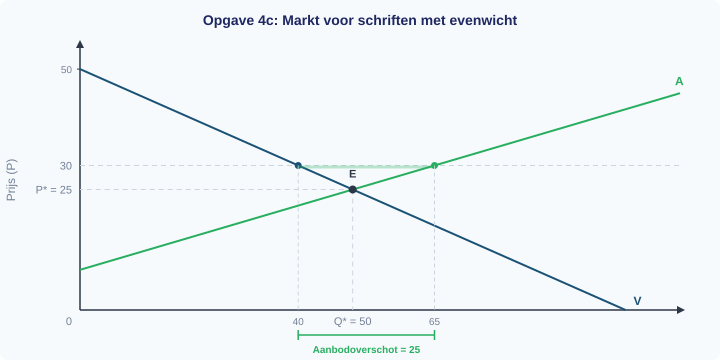

# 1.4.1 Marktevenwicht — antwoorden

**Afrondingsregel:** Rond af op 2 decimalen tenzij anders aangegeven.

---

## Procedure (uit het uitgewerkt voorbeeld)

| Stap | Actie |
|------|-------|
| 1 | Stel Qv = Qa en los op naar P → P* |
| 2 | Vul P* in een vergelijking in → Q* |
| 3 | Controleer: vul P* in de andere vergelijking in → dezelfde Q*? |
| 4 | Teken de lijnen en markeer E op (Q*, P*) |
| 5 | Bij een gegeven prijs: bereken Qv en Qa, vergelijk → overschot of tekort |

---

**Opgave 1**

**a)** Het evenwicht vind je door Qv **=** Qa te stellen.

*Waarom: In het evenwicht is de gevraagde hoeveelheid precies gelijk aan de aangeboden hoeveelheid. Er is dan geen overschot en geen tekort.*

**b)** De vergelijking is: −2P + 100 = 3P − 25.

*Waarom: Je stelt de twee vergelijkingen aan elkaar gelijk (Qv = Qa) en lost op naar P.*

**c)**

Stap 1: −2P + 100 = 3P − 25

Stap 2: 100 + 25 = 3P + 2P → 125 = 5P → P* = 25

Stap 3: Qv = −2 × 25 + 100 = −50 + 100 = 50

Antwoord: **P* = EUR 25** en **Q* = 50 schriften**.

**d)** Qa = 3 × 25 − 25 = 75 − 25 = 50 ✓

Beide vergelijkingen geven Q = 50. De berekening klopt.

*Waarom: De controle bevestigt dat je geen rekenfout hebt gemaakt. Als de twee uitkomsten niet gelijk zijn, zit er een fout in stap 2 of 3.*

---

**Opgave 2**

**a)**

Stap 1: Stel Qv = Qa: −4P + 80 = P − 5

Stap 2: 80 + 5 = P + 4P → 85 = 5P → P* = 17

Antwoord: **P* = EUR 17**.

**b)**

Stap 3: Qv = −4 × 17 + 80 = −68 + 80 = 12

Antwoord: **Q* = 12 potloden**.

**c)** Qa = 17 − 5 = 12 ✓

Beide vergelijkingen geven Q = 12. De berekening klopt.

*Waarom: Bij P* = 17 willen consumenten precies 12 potloden kopen en willen producenten precies 12 potloden aanbieden. Vraag en aanbod zijn in evenwicht.*

---

**Opgave 3**

**a)**

Qv = −4 × 20 + 80 = −80 + 80 = 0

Qa = 20 − 5 = 15

Antwoord: Bij P = 20 is Qv = 0 en Qa = 15.

**b)**

Qa = 15 > Qv = 0 → er is een **aanbodoverschot**.

Grootte = Qa − Qv = 15 − 0 = **15 potloden**.

*Waarom: De prijs van EUR 20 is hoger dan de evenwichtsprijs (EUR 17). Bij een te hoge prijs willen producenten veel aanbieden, maar consumenten weinig kopen. Het verschil is het aanbodoverschot.*

**c)**

Qv = −4 × 10 + 80 = −40 + 80 = 40

Qa = 10 − 5 = 5

Antwoord: Bij P = 10 is Qv = 40 en Qa = 5.

**d)**

Qv = 40 > Qa = 5 → er is een **vraagoverschot**.

Grootte = Qv − Qa = 40 − 5 = **35 potloden**.

*Waarom: De prijs van EUR 10 is lager dan de evenwichtsprijs (EUR 17). Bij een te lage prijs willen consumenten veel kopen, maar producenten weinig aanbieden. Het verschil is het vraagoverschot.*

---

**Opgave 4** *(doeloefening)*

**a)**

Stap 1: Stel Qv = Qa: −2P + 100 = 3P − 25

Stap 2: 100 + 25 = 3P + 2P → 125 = 5P → P* = 25

Stap 3: Qv = −2 × 25 + 100 = −50 + 100 = 50

Antwoord: **P* = EUR 25** en **Q* = 50 schriften**.

**b)** Qa = 3 × 25 − 25 = 75 − 25 = 50 ✓

Beide vergelijkingen geven Q = 50. De berekening klopt.

**c)** De vraaglijn V loopt van (Q = 0, P = 50) naar (Q = 100, P = 0). De aanbodlijn A begint bij (Q = 0, P = 8⅓) en loopt omhoog. Het evenwichtspunt E ligt op (Q* = 50, P* = 25).

*Waarom: In de grafiek vind je het evenwicht op het snijpunt van V en A. De stippellijnen naar de assen laten P* en Q* zien.*

**d)**

Stap 1: Bereken Qv en Qa bij P = 30.

Qv = −2 × 30 + 100 = −60 + 100 = 40

Qa = 3 × 30 − 25 = 90 − 25 = 65

Stap 2: Qa = 65 > Qv = 40 → er is een **aanbodoverschot**.

Stap 3: Grootte = Qa − Qv = 65 − 40 = **25 schriften**.

*Waarom: P = 30 > P* = 25. Bij een prijs boven de evenwichtsprijs is het aanbod groter dan de vraag. Producenten willen 65 schriften verkopen, maar consumenten willen er maar 40 kopen. Er blijven 25 schriften over.*

---

**Opgave 5**

**a)**

Stap 1: Stel Qv = Qa: −P + 40 = 2P − 20

Stap 2: 40 + 20 = 2P + P → 60 = 3P → P* = 20

Stap 3: Qv = −20 + 40 = 20

Antwoord: **P* = EUR 20** en **Q* = 20 USB-sticks**.

**b)** Qa = 2 × 20 − 20 = 40 − 20 = 20 ✓

*Waarom: De controle bevestigt dat P* = 20 en Q* = 20 correct zijn.*

**c)** De vraaglijn V loopt van (Q = 0, P = 40) naar (Q = 40, P = 0). De aanbodlijn A begint bij (Q = 0, P = 10) en loopt omhoog. Het evenwichtspunt E ligt op (Q* = 20, P* = 20).

**d)** Bij P = 15:

Qv = −15 + 40 = 25

Qa = 2 × 15 − 20 = 30 − 20 = 10

Qv = 25 > Qa = 10 → **vraagoverschot** van 25 − 10 = **15 USB-sticks**.

*Waarom: P = 15 < P* = 20. Bij een prijs onder de evenwichtsprijs willen consumenten meer kopen dan producenten aanbieden.*

**e)** Bij P = 25:

Qv = −25 + 40 = 15

Qa = 2 × 25 − 20 = 50 − 20 = 30

Qa = 30 > Qv = 15 → **aanbodoverschot** van 30 − 15 = **15 USB-sticks**.

*Waarom: P = 25 > P* = 20. Bij een prijs boven de evenwichtsprijs bieden producenten meer aan dan consumenten willen kopen.*

---

**Opgave 6**

**a)** Qv = −5P + 200, Qa = 3P − 40

−5P + 200 = 3P − 40 → 240 = 8P → P* = 30

Q* = −5 × 30 + 200 = −150 + 200 = 50

Controle: Qa = 3 × 30 − 40 = 90 − 40 = 50 ✓

Antwoord: **P* = EUR 30, Q* = 50**.

**b)** Qv = −P + 50, Qa = 4P − 75

−P + 50 = 4P − 75 → 125 = 5P → P* = 25

Q* = −25 + 50 = 25

Controle: Qa = 4 × 25 − 75 = 100 − 75 = 25 ✓

Antwoord: **P* = EUR 25, Q* = 25**.

**c)** Qv = −3P + 120, Qa = 2P − 30

−3P + 120 = 2P − 30 → 150 = 5P → P* = 30

Q* = −3 × 30 + 120 = −90 + 120 = 30

Controle: Qa = 2 × 30 − 30 = 60 − 30 = 30 ✓

Antwoord: **P* = EUR 30, Q* = 30**.

*Waarom: Bij alle drie de markten volg je dezelfde procedure: Qv = Qa stellen, oplossen naar P, invullen, en controleren. Met oefening wordt dit routinewerk.*

---

**Opgave 7** *(herhaling §1.3.1: aanbodverschuiving)*

**a)** De **grondstofprijs** (kosten van grondstoffen) is veranderd. Dit is een aanbodfactor.

*Waarom: De graanprijs is een productiefactor — als graan duurder wordt, stijgen de kosten voor de bakker.*

**b)** De evenwichtsprijs **stijgt**. Als de aanbodlijn naar links verschuift en de vraaglijn gelijk blijft, ligt het nieuwe snijpunt hoger op de vraaglijn. Er wordt minder aangeboden bij elke prijs, waardoor de prijs omhoog wordt gedrukt.

*Waarom: Bij het oude evenwicht is er nu een tekort (de aanbodlijn is verschoven, maar de vraag niet). Die schaarste duwt de prijs omhoog tot er weer evenwicht is.*

**c)** De evenwichtshoeveelheid **daalt**. Het nieuwe evenwichtspunt ligt hoger op de vraaglijn (hogere P, lagere Q). Er worden minder broodjes verhandeld.

*Waarom: Bij een hogere prijs willen consumenten minder kopen. Het nieuwe evenwicht is bij een lagere hoeveelheid.*

*Kun je deze opgave niet maken? Herhaal dan §1.3.1.*

---

**Opgave 8** *(herhaling §1.2.2: vraagfactoren)*

**a)** Een subsidie op de aanschafprijs is een verandering van de **eigen prijs** (de consument betaalt minder). Maar als de subsidie naar de producenten gaat, verschuift de aanbodlijn. Het hangt af van hoe de subsidie wordt ingezet.

Het meest waarschijnlijke antwoord: de subsidie verlaagt de effectieve prijs voor de consument. De **aanbodlijn** verschuift naar rechts (producenten kunnen goedkoper aanbieden) of de **vraaglijn** verschuift naar rechts (consumenten vinden het product aantrekkelijker). Het exacte antwoord hangt af van de vormgeving van de subsidie.

*Waarom: Een subsidie maakt het product goedkoper. Als de subsidie via de prijs loopt (producenten ontvangen de subsidie), verschuift de aanbodlijn naar rechts. Als de subsidie de voorkeur van consumenten verandert (ze zien het als aantrekkelijker), verschuift de vraaglijn.*

**b)** De **aanbodlijn** verschuift naar **rechts** (producenten kunnen bij elke prijs meer aanbieden doordat hun kosten dalen door de subsidie).

**c)** De evenwichtsprijs **daalt** (door het grotere aanbod) en de evenwichtshoeveelheid **stijgt** (meer wordt verhandeld tegen een lagere prijs).

*Kun je deze opgave niet maken? Herhaal dan §1.2.2.*

---

**Opgave 9** *(doeloefening)*

**a)**

Stap 1: Stel Qv = Qa: −2P + 80 = 3P − 20

Stap 2: 80 + 20 = 3P + 2P → 100 = 5P → P* = 20

Stap 3: Qv = −2 × 20 + 80 = −40 + 80 = 40

Antwoord: **P* = EUR 20** en **Q* = 40 rekenmachines**.

**b)** Qa = 3 × 20 − 20 = 60 − 20 = 40 ✓

*Waarom: Beide vergelijkingen geven Q = 40. De controle bevestigt dat het antwoord correct is.*

**c)** De vraaglijn V loopt van (Q = 0, P = 40) naar (Q = 80, P = 0). De aanbodlijn A begint bij (Q = 0, P = 6⅔) en loopt omhoog. Het evenwichtspunt E ligt op (Q* = 40, P* = 20).

**d)** Bij P = 25:

Qv = −2 × 25 + 80 = −50 + 80 = 30

Qa = 3 × 25 − 20 = 75 − 20 = 55

Qa = 55 > Qv = 30 → **aanbodoverschot** van 55 − 30 = **25 rekenmachines**.

*Waarom: P = 25 > P* = 20. Bij een prijs boven de evenwichtsprijs bieden producenten meer aan dan consumenten willen kopen.*

**e)** Een factor die de vraaglijn naar rechts verschuift: bijvoorbeeld een **stijging van het inkomen** (als rekenmachines een normaal goed zijn). Het gevolg: de vraaglijn verschuift naar rechts → het snijpunt met de aanbodlijn verschuift naar rechtsboven → de evenwichtsprijs stijgt en de evenwichtshoeveelheid stijgt.

*Waarom: Als de vraag toeneemt bij dezelfde aanbodlijn, ontstaat er bij de oude prijs een vraagoverschot. De prijs wordt omhoog gedrukt tot er weer evenwicht is, bij een hogere P* en hogere Q*.*

---

## Denkertje — modelantwoord en beoordelingscriteria

*Modelantwoord:*

**a)** Bij P = 15:

Qv = −2 × 15 + 100 = −30 + 100 = 70

Qa = 3 × 15 − 25 = 45 − 25 = 20

**b)** Qv = 70 > Qa = 20 → er is een **vraagoverschot** van 70 − 20 = **50 schriften**.

*Waarom: De maximumprijs (EUR 15) is lager dan de evenwichtsprijs (EUR 25). Bij deze lage prijs willen veel consumenten schriften kopen (70 stuks), maar producenten willen er maar weinig aanbieden (20 stuks). Het verschil van 50 schriften is het tekort.*

**c)** De overheid stelt een maximumprijs in om het goed **betaalbaar** te houden voor consumenten. Zonder ingrijpen zou de prijs EUR 25 zijn, wat de overheid te duur vindt. De maximumprijs beschermt consumenten met een laag inkomen, maar het nadeel is dat er een tekort ontstaat: niet iedereen die wil kopen, kan ook daadwerkelijk een schrift krijgen.

**d)** Mogelijke maatregelen:
- De overheid kan de producenten **subsidieren**, waardoor de aanbodlijn naar rechts verschuift en producenten bij P = 15 meer willen aanbieden.
- De overheid kan zelf schriften **importeren** en op de markt brengen (het aanbod vergroten).
- De overheid kan een **distributiessysteem** invoeren (rantsoenering) om de beschikbare schriften eerlijk te verdelen — dit lost het tekort niet op, maar maakt de verdeling eerlijker.

*Beoordelingscriteria:*
- Correcte berekening van Qv en Qa bij P = 15
- Correct vaststellen dat het een vraagoverschot is (Qv > Qa) met de juiste grootte
- Economisch onderbouwde verklaring waarom de overheid ingrijpt (betaalbaarheid)
- Realistische maatregel die het aanbod vergroot of de verdeling verbetert
