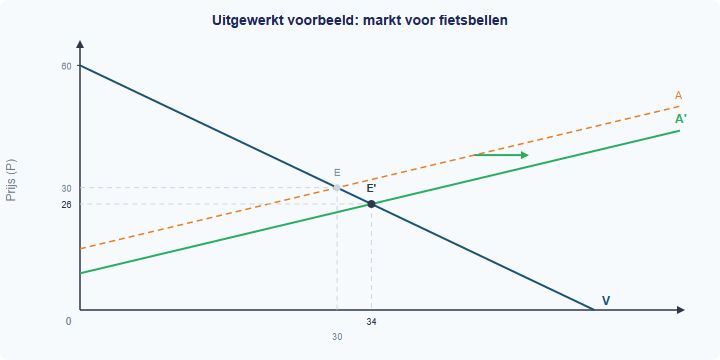
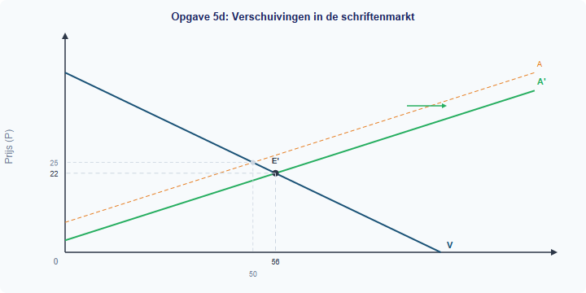
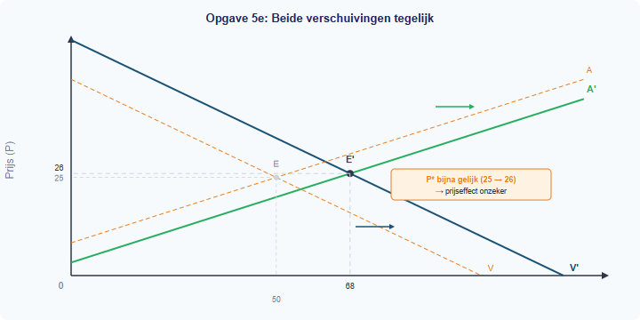

## Uitgewerkt voorbeeld

> **De markt voor fietsbellen**
>
> Op de markt voor fietsbellen geldt:
> - Qv = −P + 60
> - Qa = 2P − 30
>
> Door een technologische verbetering daalt de productiekost. De nieuwe aanbodvergelijking wordt: Qa' = 2P − 18.

**(a) Bereken het oorspronkelijke evenwicht.**

*Stap 1: Stel Qv = Qa.*

−P + 60 = 2P − 30

*Stap 2: Los op naar P.*

90 = 3P → P* = 30

*Stap 3: Vul P* = 30 in.*

Qv = −30 + 60 = 30

*Controle:* Qa = 2 × 30 − 30 = 30 ✓

**Antwoord:** P* = EUR 30, Q* = 30 fietsbellen.

**(b) Bereken het nieuwe evenwicht na de aanbodverschuiving.**

*Stap 1: Stel Qv = Qa'.*

−P + 60 = 2P − 18 → 78 = 3P → P*' = 26

*Stap 3: Vul in.*

Qv = −26 + 60 = 34. *Controle:* Qa' = 2 × 26 − 18 = 34 ✓

**Antwoord:** P*' = EUR 26, Q*' = 34 fietsbellen.

**(c) Vergelijk het oude en nieuwe evenwicht.**

Prijs daalt (EUR 30 → EUR 26), hoeveelheid stijgt (30 → 34). Aanbod naar rechts → prijs daalt, hoeveelheid stijgt.

**(d) Teken de verschuiving in een grafiek.**

---

## Opgaven

### Startoefeningen

**Opgave 1** *(invuloefening)*

Vul de juiste woorden in.

a) Als de aanbodlijn naar rechts verschuift en de vraaglijn gelijk blijft, dan ... (stijgt/daalt) de evenwichtsprijs en ... (stijgt/daalt) de evenwichtshoeveelheid.

b) Als de vraaglijn naar rechts verschuift en de aanbodlijn gelijk blijft, dan ... (stijgt/daalt) de evenwichtsprijs en ... (stijgt/daalt) de evenwichtshoeveelheid.

c) Een verschuiving van de aanbodlijn wordt veroorzaakt door een verandering van een ... (vraagfactor/aanbodfactor). Noem twee voorbeelden.

d) Een verschuiving van de vraaglijn wordt veroorzaakt door een verandering van een ... (vraagfactor/aanbodfactor). Noem twee voorbeelden.

**Opgave 2** *(oefenen: aanbodverschuiving)*

Op de markt voor ringbanden geldt:
- Qv = −3P + 120
- Qa = 2P − 30

Door stijgende grondstofprijzen wordt de aanbodvergelijking: Qa' = 2P − 50.

a) Bereken het oorspronkelijke evenwicht (P* en Q*).

b) Bereken het nieuwe evenwicht na de aanbodverschuiving.

c) Is de aanbodlijn naar links of naar rechts verschoven? Leg uit.

d) Vergelijk het oude en nieuwe evenwicht. Past de verandering bij de vuistregel?

**Opgave 3** *(oefenen: vraagverschuiving)*

Op de markt voor geodriehoeken geldt:
- Qv = −P + 50
- Qa = 4P − 75

Een concurrent brengt een goedkoop alternatief op de markt. De nieuwe vraagvergelijking is: Qv' = −P + 40.

a) Bereken het oorspronkelijke evenwicht.

b) Bereken het nieuwe evenwicht.

c) Is de vraaglijn naar links of naar rechts verschoven? Welke vraagfactor is veranderd?

d) Vergelijk het oude en nieuwe evenwicht. Past de verandering bij de vuistregel?

---

### Zelfstandige oefening

**Opgave 4** *(de procedure — nieuwe markt)*

Op de markt voor linialen geldt:
- Qv = −2P + 80
- Qa = 3P − 20

Door automatisering worden de productiekosten lager. De nieuwe aanbodvergelijking is: Qa' = 3P − 5.

a) Bereken het oorspronkelijke evenwicht.

b) Bereken het nieuwe evenwicht.

c) Vergelijk: wat is er met de prijs en de hoeveelheid gebeurd?

d) Teken de oorspronkelijke vraaglijn, de oorspronkelijke aanbodlijn en de nieuwe aanbodlijn in een grafiek. Markeer E en E'.

**Opgave 5** *(de doeloefening — schriftenmarkt, alle stappen)*

Ga uit van de schriftenmarkt: Qv = −2P + 100, Qa = 3P − 25, P* = EUR 25, Q* = 50.

a) Een nieuwe fabriek opent. De nieuwe aanbodvergelijking is Qa' = 3P − 10. Bereken het nieuwe evenwicht.

b) Vergelijk met het oude evenwicht: wat is er met de prijs en de hoeveelheid gebeurd? Is dit logisch? Leg uit.

c) Het inkomen van scholieren stijgt. De nieuwe vraagvergelijking is Qv' = −2P + 120 (het aanbod is weer de oorspronkelijke: Qa = 3P − 25). Bereken het nieuwe evenwicht.

d) Teken een grafiek waarin je beide verschuivingen (apart) laat zien met pijlen die de richting aangeven.

e) Nu vinden BEIDE veranderingen tegelijk plaats: Qa' = 3P − 10 en Qv' = −2P + 120. Bereken het nieuwe evenwicht. Had je de richting van de prijsverandering kunnen voorspellen zonder te rekenen? Leg uit.

---

### Herhaling (interleaving)

**Opgave 6** *(herhaling §1.4.1: evenwicht berekenen)*

Op de markt voor rekenmachines geldt:
- Qv = −2P + 70
- Qa = 3P − 30

a) Bereken de evenwichtsprijs en de evenwichtshoeveelheid.

b) Controleer je antwoord door P* in beide vergelijkingen in te vullen.

c) Bij een prijs van EUR 25: is er een overschot of een tekort? Bereken de grootte.

**Opgave 7** *(herhaling §1.3.2: kostenstructuren)*

Een schriftenfabriek heeft constante kosten van EUR 5.000 per maand en variabele kosten van EUR 8 per schrift.

a) Schrijf de formule voor de totale kosten (TK) als functie van Q.

b) Bereken de gemiddelde totale kosten (GTK) bij een productie van 200 schriften.

c) De fabriek verkoopt schriften voor EUR 25 per stuk. Bereken de winst bij een productie van 200 schriften.

d) Leg uit: als de variabele kosten per schrift dalen (bijv. van EUR 8 naar EUR 6), wat gebeurt er dan met de aanbodlijn van deze fabriek? Verschuift deze naar links of naar rechts?

---

### Doeloefening

**Opgave 8** *(alles samen — twee markten)*

Op de markt voor vulpennen geldt:
- Qv = −4P + 200
- Qa = P − 10

a) Bereken het oorspronkelijke evenwicht.

b) Door een trend op sociale media willen meer scholieren een vulpen. De nieuwe vraagvergelijking is: Qv' = −4P + 240. Bereken het nieuwe evenwicht.

c) Vergelijk het oude en nieuwe evenwicht. Past de verandering bij de vuistregel?

d) Tegelijkertijd wordt inkt duurder, waardoor de aanbodvergelijking verandert in: Qa' = P − 20. Bereken het evenwicht als BEIDE veranderingen tegelijk optreden (Qv' = −4P + 240 en Qa' = P − 20).

e) Vergelijk dit evenwicht met het oorspronkelijke. De hoeveelheid is ... (gestegen/gedaald/gelijk gebleven). De prijs is ... Leg uit waarom het prijseffect lastig te voorspellen was zonder te rekenen.

---

### Denkertje *(bonusopgave)*

**Opgave 9**

Op een markt geldt: Qv = −2P + 100 en Qa = 3P − 25 (P* = 25, Q* = 50).

Het aanbod verschuift naar rechts met precies dezelfde hoeveelheid als waarmee de vraag naar rechts verschuift. Stel: beide lijnen verschuiven k eenheden naar rechts.

a) Schrijf de nieuwe vergelijkingen op als functie van k.

b) Bereken het nieuwe evenwicht (P*' en Q*') als functie van k.

c) Laat zien dat de evenwichtsprijs niet verandert, ongeacht de waarde van k. Leg economisch uit waarom dit zo is.

d) Wat gebeurt er met de evenwichtshoeveelheid als k groter wordt?
