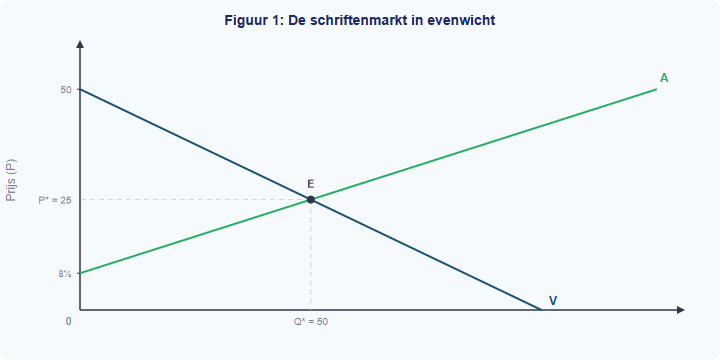
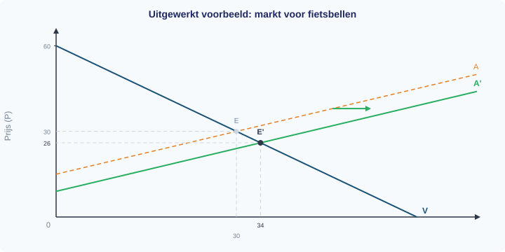

# 1.4.2 Verschuivingen en nieuw evenwicht

## De schriftenmarkt draait op volle toeren — tot er iets verandert

In §1.4.1 heb je geleerd dat de markt voor schriften in evenwicht is bij P* = EUR 25 en Q* = 50 stuks. Maar markten staan niet stil. Een nieuwe fabriek opent, het inkomen van scholieren stijgt, of grondstoffen worden duurder. Wat gebeurt er dan met de evenwichtsprijs en de evenwichtshoeveelheid?

In deze paragraaf leer je hoe je het **nieuwe evenwicht** berekent na een verschuiving van de aanbodlijn of de vraaglijn — en wat er gebeurt als *beide* tegelijk verschuiven.

---

## Theorie

### Het uitgangspunt: de schriftenmarkt

> **📋 Herhaling uit §1.4.1**
> De evenwichtsprijs vind je door Qv = Qa te stellen en op te lossen naar P. Vul P* vervolgens in om Q* te vinden. Controleer altijd door P* in beide vergelijkingen in te vullen.

> **📋 Herhaling uit §1.3.2**
> Kostenstructuren bepalen de positie van de aanbodlijn. Als de kosten per eenheid dalen (bijv. door efficiëntere productie), verschuift de aanbodlijn naar rechts: bij elke prijs bieden producenten meer aan.

We beginnen met de bekende vergelijkingen van de schriftenmarkt:

- **Vraaglijn:** Qv = −2P + 100
- **Aanbodlijn:** Qa = 3P − 25
- **Evenwicht:** P* = EUR 25, Q* = 50 stuks

De vraaglijn laat het verband zien tussen de prijs en de gevraagde hoeveelheid, **terwijl alle andere omstandigheden gelijk blijven** (ceteris paribus). De aanbodlijn laat hetzelfde verband zien voor de aangeboden hoeveelheid.

---

### Verschuiving van de aanbodlijn

Stel dat een **nieuwe fabriek** opent die schriften produceert. Er zijn nu meer aanbieders, dus bij elke prijs worden er meer schriften aangeboden. De aanbodlijn verschuift **naar rechts**.

De nieuwe aanbodvergelijking is: **Qa' = 3P − 10**

Merk op: de helling (3) is hetzelfde gebleven, maar de constante is veranderd van −25 naar −10. Dat betekent dat de aanbodlijn 15 eenheden naar rechts is verschoven: bij elke prijs bieden producenten 15 schriften meer aan dan voorheen.

**Hoe berekenen we het nieuwe evenwicht?** Dezelfde drie stappen als in §1.4.1:

*Stap 1: Stel Qv = Qa' (nieuw).*

−2P + 100 = 3P − 10

*Stap 2: Los op naar P.*

100 + 10 = 3P + 2P

110 = 5P

P*' = 22

*Stap 3: Vul P*' = 22 in.*

Qv = −2 × 22 + 100 = −44 + 100 = 56

*Controle:* Qa' = 3 × 22 − 10 = 66 − 10 = 56 ✓

Het nieuwe evenwicht is **P*' = EUR 22, Q*' = 56 schriften**.

**Vergelijk oud en nieuw:**

| | Oud evenwicht | Nieuw evenwicht | Verandering |
|---|---|---|---|
| Prijs (P*) | EUR 25 | EUR 22 | **daalt** met EUR 3 |
| Hoeveelheid (Q*) | 50 | 56 | **stijgt** met 6 stuks |

Dit is logisch: meer aanbod → meer concurrentie tussen producenten → de prijs daalt. Omdat de prijs daalt, willen consumenten meer kopen → de hoeveelheid stijgt.

---

### Verschuiving van de vraaglijn

Nu een ander scenario. Stel dat het **inkomen van scholieren stijgt** (bijv. doordat het minimumloon omhoog gaat). Schriften zijn een normaal goed: bij een hoger inkomen willen scholieren er meer kopen. De vraaglijn verschuift **naar rechts**.

De aanbodlijn is weer de oorspronkelijke: Qa = 3P − 25. De nieuwe vraagvergelijking is: **Qv' = −2P + 120**

De helling (−2) is hetzelfde gebleven, maar het snijpunt met de Q-as is verschoven van 100 naar 120. Bij elke prijs willen consumenten 20 schriften meer kopen.

*Stap 1: Stel Qv' = Qa.*

−2P + 120 = 3P − 25

*Stap 2: Los op naar P.*

120 + 25 = 3P + 2P

145 = 5P

P*' = 29

*Stap 3: Vul P*' = 29 in.*

Qv' = −2 × 29 + 120 = −58 + 120 = 62

*Controle:* Qa = 3 × 29 − 25 = 87 − 25 = 62 ✓

Het nieuwe evenwicht is **P*' = EUR 29, Q*' = 62 schriften**.

**Vergelijk oud en nieuw:**

| | Oud evenwicht | Nieuw evenwicht | Verandering |
|---|---|---|---|
| Prijs (P*) | EUR 25 | EUR 29 | **stijgt** met EUR 4 |
| Hoeveelheid (Q*) | 50 | 62 | **stijgt** met 12 stuks |

Dit is logisch: meer vraag → consumenten bieden tegen elkaar op → de prijs stijgt. Omdat de prijs stijgt, willen producenten meer aanbieden → de hoeveelheid stijgt.

> **⚠️ Let op — veelgemaakte fout**
> Veel leerlingen verwarren een *verschuiving van* de vraaglijn met een *beweging langs* de vraaglijn. Een prijsverandering van het goed zelf → beweging LANGS de lijn (je schuift over de bestaande lijn naar een ander punt). Een verandering van inkomen, voorkeuren of andere factoren → verschuiving VAN de hele lijn (de lijn krijgt een nieuwe positie).

---

### De vuistregels

De volgende tabel vat de effecten samen:

| Verschuiving | Prijs (P*) | Hoeveelheid (Q*) |
|---|---|---|
| Aanbod → rechts (meer aanbod) | **daalt** | **stijgt** |
| Aanbod ← links (minder aanbod) | **stijgt** | **daalt** |
| Vraag → rechts (meer vraag) | **stijgt** | **stijgt** |
| Vraag ← links (minder vraag) | **daalt** | **daalt** |

**Ezelsbruggetje:** bij een aanbodverschuiving bewegen prijs en hoeveelheid in *tegengestelde* richting. Bij een vraagverschuiving bewegen ze in *dezelfde* richting.

Figuur 4 vat de twee soorten verschuivingen in één beeld samen.

---

### Twee verschuivingen tegelijk

Wat als de aanbodlijn *en* de vraaglijn tegelijk verschuiven? Dat is lastiger: de effecten op de prijs kunnen elkaar versterken of tegenwerken.

Stel dat de nieuwe fabriek opent (Qa' = 3P − 10) *en* het inkomen stijgt (Qv' = −2P + 120) tegelijk.

*Stap 1: Stel Qv' = Qa'.*

−2P + 120 = 3P − 10

*Stap 2: Los op naar P.*

120 + 10 = 3P + 2P

130 = 5P

P*' = 26

*Stap 3: Vul P*' = 26 in.*

Qv' = −2 × 26 + 120 = −52 + 120 = 68

*Controle:* Qa' = 3 × 26 − 10 = 78 − 10 = 68 ✓

**Vergelijk alle evenwichten:**

| Situatie | P* | Q* |
|---|---|---|
| Oorspronkelijk | EUR 25 | 50 |
| Alleen meer aanbod | EUR 22 | 56 |
| Alleen meer vraag | EUR 29 | 62 |
| Beide tegelijk | EUR 26 | 68 |

De **hoeveelheid** stijgt altijd: zowel meer aanbod als meer vraag duwen Q* omhoog. Dat is logisch — beide verschuivingen vergroten de markt.

De **prijs** is onzeker: meer aanbod drukt de prijs omlaag, maar meer vraag duwt de prijs omhoog. Het uiteindelijke effect hangt af van welke verschuiving groter is. In dit voorbeeld stijgt de prijs een klein beetje (van EUR 25 naar EUR 26), maar bij een grotere aanbodverschuiving had de prijs ook kunnen dalen.

> **Definitie: Ambigue uitkomst**
> Wanneer vraag en aanbod allebei naar rechts verschuiven, stijgt de hoeveelheid altijd, maar is het prijseffect **onbepaald** — het hangt af van de relatieve grootte van de verschuivingen.

Figuur 5 vat alle verschuivingen en hun effecten in één overzicht samen.

---

## Uitgewerkt voorbeeld

> **De markt voor fietsbellen**
>
> Op de markt voor fietsbellen geldt:
> - Qv = −P + 60
> - Qa = 2P − 30
>
> Door een technologische verbetering daalt de productiekost. De nieuwe aanbodvergelijking wordt: Qa' = 2P − 18.

**(a) Bereken het oorspronkelijke evenwicht.**

*Stap 1: Stel Qv = Qa.*

−P + 60 = 2P − 30

*Stap 2: Los op naar P.*

60 + 30 = 2P + P

90 = 3P

P* = 30

*Stap 3: Vul P* = 30 in.*

Qv = −30 + 60 = 30

*Controle:* Qa = 2 × 30 − 30 = 60 − 30 = 30 ✓

**Antwoord:** P* = EUR 30, Q* = 30 fietsbellen.

**(b) Bereken het nieuwe evenwicht na de aanbodverschuiving.**

*Stap 1: Stel Qv = Qa'.*

−P + 60 = 2P − 18

*Stap 2: Los op naar P.*

60 + 18 = 2P + P

78 = 3P

P*' = 26

*Stap 3: Vul P*' = 26 in.*

Qv = −26 + 60 = 34

*Controle:* Qa' = 2 × 26 − 18 = 52 − 18 = 34 ✓

**Antwoord:** P*' = EUR 26, Q*' = 34 fietsbellen.

**(c) Vergelijk het oude en nieuwe evenwicht.**

| | Oud | Nieuw | Verandering |
|---|---|---|---|
| P* | EUR 30 | EUR 26 | daalt met EUR 4 |
| Q* | 30 | 34 | stijgt met 4 |

Dit klopt met de vuistregel: aanbod naar rechts → prijs daalt, hoeveelheid stijgt.

**(d) Teken de verschuiving in een grafiek.**

**De procedure samengevat:**

| Stap | Actie |
|------|-------|
| 1 | Bereken het oorspronkelijke evenwicht (Qv = Qa → P*, Q*) |
| 2 | Bereken het nieuwe evenwicht met de nieuwe vergelijking (Qv = Qa' → P*', Q*') |
| 3 | Vergelijk: is de prijs gestegen of gedaald? Is de hoeveelheid gestegen of gedaald? |
| 4 | Controleer met de vuistregel: past het bij de richting van de verschuiving? |
| 5 | Teken beide lijnen in de grafiek, markeer E en E' |

---

> **Samenvatting §1.4.2**
> - Een verschuiving van de aanbodlijn of vraaglijn leidt tot een **nieuw evenwicht** met een andere prijs en hoeveelheid.
> - Je berekent het nieuwe evenwicht met dezelfde methode: Qv = Qa (nieuw) → P*' → Q*'.
> - Aanbod naar rechts → P* daalt, Q* stijgt. Vraag naar rechts → P* stijgt, Q* stijgt.
> - Bij twee gelijktijdige verschuivingen naar rechts is het hoeveelheidseffect duidelijk (stijging), maar het prijseffect **onzeker**.
> - *In de volgende paragraaf bekijken we de welvaart op de markt: consumentensurplus en producentensurplus.*

> **💡 Vastgelopen op een opgave?**
> Op de website vind je bij elke opgave een **begeleide inoefening**: stap voor stap krijg je extra hints en tussenstappen. Klik op de opgave om de begeleiding te starten.

---

## Uitgewerkt voorbeeld

> **De markt voor fietsbellen**
>
> Op de markt voor fietsbellen geldt:
> - Qv = −P + 60
> - Qa = 2P − 30
>
> Door een technologische verbetering daalt de productiekost. De nieuwe aanbodvergelijking wordt: Qa' = 2P − 18.

**(a) Bereken het oorspronkelijke evenwicht.**

*Stap 1: Stel Qv = Qa.*

−P + 60 = 2P − 30

*Stap 2: Los op naar P.*

90 = 3P → P* = 30

*Stap 3: Vul P* = 30 in.*

Qv = −30 + 60 = 30

*Controle:* Qa = 2 × 30 − 30 = 30 ✓

**Antwoord:** P* = €30, Q* = 30 fietsbellen.

**(b) Bereken het nieuwe evenwicht na de aanbodverschuiving.**

*Stap 1: Stel Qv = Qa'.*

−P + 60 = 2P − 18 → 78 = 3P → P*' = 26

*Stap 3: Vul in.*

Qv = −26 + 60 = 34. *Controle:* Qa' = 2 × 26 − 18 = 34 ✓

**Antwoord:** P*' = €26, Q*' = 34 fietsbellen.

**(c) Vergelijk het oude en nieuwe evenwicht.**

Prijs daalt (€30 → €26), hoeveelheid stijgt (30 → 34). Aanbod naar rechts → prijs daalt, hoeveelheid stijgt.

**(d) Teken de verschuiving in een grafiek.**

---

## Opgaven

### Startoefeningen

**Opgave 1** *(invuloefening)*

Vul de juiste woorden in.

a) Als de aanbodlijn naar rechts verschuift en de vraaglijn gelijk blijft, dan ... (stijgt/daalt) de evenwichtsprijs en ... (stijgt/daalt) de evenwichtshoeveelheid.

b) Als de vraaglijn naar rechts verschuift en de aanbodlijn gelijk blijft, dan ... (stijgt/daalt) de evenwichtsprijs en ... (stijgt/daalt) de evenwichtshoeveelheid.

c) Een verschuiving van de aanbodlijn wordt veroorzaakt door een verandering van een ... (vraagfactor/aanbodfactor). Noem twee voorbeelden.

d) Een verschuiving van de vraaglijn wordt veroorzaakt door een verandering van een ... (vraagfactor/aanbodfactor). Noem twee voorbeelden.

**Opgave 2** *(oefenen: aanbodverschuiving)*

Op de markt voor ringbanden geldt:
- Qv = −3P + 120
- Qa = 2P − 30

Door stijgende grondstofprijzen wordt de aanbodvergelijking: Qa' = 2P − 50.

a) Bereken het oorspronkelijke evenwicht (P* en Q*).

b) Bereken het nieuwe evenwicht na de aanbodverschuiving.

c) Is de aanbodlijn naar links of naar rechts verschoven? Leg uit.

d) Vergelijk het oude en nieuwe evenwicht. Past de verandering bij de vuistregel?

**Opgave 3** *(oefenen: vraagverschuiving)*

Op de markt voor geodriehoeken geldt:
- Qv = −P + 50
- Qa = 4P − 75

Een concurrent brengt een goedkoop alternatief op de markt. De nieuwe vraagvergelijking is: Qv' = −P + 40.

a) Bereken het oorspronkelijke evenwicht.

b) Bereken het nieuwe evenwicht.

c) Is de vraaglijn naar links of naar rechts verschoven? Welke vraagfactor is veranderd?

d) Vergelijk het oude en nieuwe evenwicht. Past de verandering bij de vuistregel?

---

### Zelfstandige oefening

**Opgave 4** *(de procedure — nieuwe markt)*

Op de markt voor linialen geldt:
- Qv = −2P + 80
- Qa = 3P − 20

Door automatisering worden de productiekosten lager. De nieuwe aanbodvergelijking is: Qa' = 3P − 5.

a) Bereken het oorspronkelijke evenwicht.

b) Bereken het nieuwe evenwicht.

c) Vergelijk: wat is er met de prijs en de hoeveelheid gebeurd?

d) Teken de oorspronkelijke vraaglijn, de oorspronkelijke aanbodlijn en de nieuwe aanbodlijn in een grafiek. Markeer E en E'.

**Opgave 5** *(de doeloefening — schriftenmarkt, alle stappen)*

Ga uit van de schriftenmarkt: Qv = −2P + 100, Qa = 3P − 25, P* = €25, Q* = 50.

a) Een nieuwe fabriek opent. De nieuwe aanbodvergelijking is Qa' = 3P − 10. Bereken het nieuwe evenwicht.

b) Vergelijk met het oude evenwicht: wat is er met de prijs en de hoeveelheid gebeurd? Is dit logisch? Leg uit.

c) Het inkomen van scholieren stijgt. De nieuwe vraagvergelijking is Qv' = −2P + 120 (het aanbod is weer de oorspronkelijke: Qa = 3P − 25). Bereken het nieuwe evenwicht.

d) Teken een grafiek waarin je beide verschuivingen (apart) laat zien met pijlen die de richting aangeven.

e) Nu vinden BEIDE veranderingen tegelijk plaats: Qa' = 3P − 10 en Qv' = −2P + 120. Bereken het nieuwe evenwicht. Had je de richting van de prijsverandering kunnen voorspellen zonder te rekenen? Leg uit.

---

### Herhaling (interleaving)

**Opgave 6** *(herhaling §1.4.1: evenwicht berekenen)*

Op de markt voor rekenmachines geldt:
- Qv = −2P + 70
- Qa = 3P − 30

a) Bereken de evenwichtsprijs en de evenwichtshoeveelheid.

b) Controleer je antwoord door P* in beide vergelijkingen in te vullen.

c) Bij een prijs van €25: is er een overschot of een tekort? Bereken de grootte.

**Opgave 7** *(herhaling §1.3.2: kostenstructuren)*

Een schriftenfabriek heeft constante kosten van €5.000 per maand en variabele kosten van €8 per schrift.

a) Schrijf de formule voor de totale kosten (TK) als functie van Q.

b) Bereken de gemiddelde totale kosten (GTK) bij een productie van 200 schriften.

c) De fabriek verkoopt schriften voor €25 per stuk. Bereken de winst bij een productie van 200 schriften.

d) Leg uit: als de variabele kosten per schrift dalen (bijv. van €8 naar €6), wat gebeurt er dan met de aanbodlijn van deze fabriek? Verschuift deze naar links of naar rechts?

---

### Doeloefening

**Opgave 8** *(alles samen — twee markten)*

Op de markt voor vulpennen geldt:
- Qv = −4P + 200
- Qa = P − 10

a) Bereken het oorspronkelijke evenwicht.

b) Door een trend op sociale media willen meer scholieren een vulpen. De nieuwe vraagvergelijking is: Qv' = −4P + 240. Bereken het nieuwe evenwicht.

c) Vergelijk het oude en nieuwe evenwicht. Past de verandering bij de vuistregel?

d) Tegelijkertijd wordt inkt duurder, waardoor de aanbodvergelijking verandert in: Qa' = P − 20. Bereken het evenwicht als BEIDE veranderingen tegelijk optreden (Qv' = −4P + 240 en Qa' = P − 20).

e) Vergelijk dit evenwicht met het oorspronkelijke. De hoeveelheid is ... (gestegen/gedaald/gelijk gebleven). De prijs is ... Leg uit waarom het prijseffect lastig te voorspellen was zonder te rekenen.

---

### Denkertje *(bonusopgave)*

**Opgave 9**

Op een markt geldt: Qv = −2P + 100 en Qa = 3P − 25 (P* = 25, Q* = 50).

Het aanbod verschuift naar rechts met precies dezelfde hoeveelheid als waarmee de vraag naar rechts verschuift. Stel: beide lijnen verschuiven k eenheden naar rechts.

a) Schrijf de nieuwe vergelijkingen op als functie van k.

b) Bereken het nieuwe evenwicht (P*' en Q*') als functie van k.

c) Laat zien dat de evenwichtsprijs niet verandert, ongeacht de waarde van k. Leg economisch uit waarom dit zo is.

d) Wat gebeurt er met de evenwichtshoeveelheid als k groter wordt?
