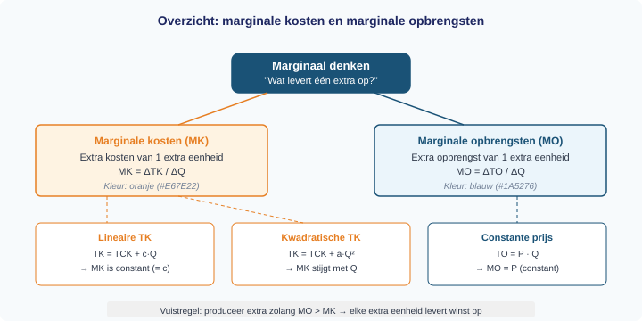
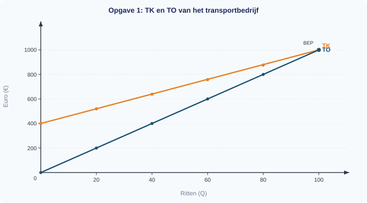

# 1.4.3 Marginale kosten en marginale opbrengsten

## Loont het om nog één extra te produceren?

Een ijsfabrikant verkoopt elk ijsje voor €3. Hij maakt er nu 500 per dag. Een medewerker vraagt: "Zullen we er 501 maken?" De ondernemer denkt na. Dat ene extra ijsje levert €3 op. Maar wat kost het om dat ene extra ijsje te maken? Als de extra kosten €2 zijn, levert het ijsje €1 winst op. Maar als de extra kosten €4 zijn, verliest hij er juist €1 op.

De ondernemer hoeft niet de *totale* winst opnieuw uit te rekenen. Hij hoeft alleen te kijken naar de **extra kosten** en de **extra opbrengst** van dat ene product. Dit is de kern van *marginaal denken*: niet het geheel, maar de verandering aan de marge.

In deze paragraaf leer je twee nieuwe begrippen: marginale kosten (MK) en marginale opbrengsten (MO). Je leert ze berekenen met een tabel en je ziet wat er gebeurt als de kosten lineair of kwadratisch stijgen.

---

## Theorie

### Marginale kosten (MK)

> **📋 Herhaling uit §1.3.3**
> De totale kosten (TK) zijn de som van alle constante en variabele kosten: TK = TCK + TVK. De totale opbrengst is TO = P x Q. De winst is TO - TK.

Stel dat een bedrijf nu Q = 20 eenheden produceert en de totale kosten TK = €260 bedragen. Als het bedrijf de productie verhoogt naar Q = 21, stijgen de totale kosten naar TK = €263. De kosten zijn dus met €3 gestegen. Die €3 noemen we de **marginale kosten**: de extra kosten van één extra eenheid.

> **Definitie: Marginale kosten (MK)**
> De extra kosten die een bedrijf maakt als het één eenheid meer produceert.
> MK = ΔTK / ΔQ (de verandering van de totale kosten gedeeld door de verandering van de hoeveelheid).

> **Formule**
> ```
> MK = ΔTK / ΔQ
> ```
> Waarbij ΔTK = TK(nieuw) − TK(oud) en ΔQ = Q(nieuw) − Q(oud).

Neem bedrijf 1 als voorbeeld. Dit bedrijf heeft TK = 200 + 3Q. Elke extra eenheid voegt precies €3 toe aan de totale kosten. De marginale kosten zijn dus constant: MK = 3.

We berekenen de waarden in een tabel:

| Q | TK = 200 + 3Q | ΔTK (t.o.v. vorige rij) | ΔQ | MK = ΔTK / ΔQ |
|---|--------------|------------------------|-----|----------------|
| 0 | 200 | — | — | — |
| 10 | 230 | 30 | 10 | 3 |
| 20 | 260 | 30 | 10 | 3 |
| 30 | 290 | 30 | 10 | 3 |
| 40 | 320 | 30 | 10 | 3 |
| 50 | 350 | 30 | 10 | 3 |

MK is bij elke stap precies 3. Dat klopt: de formule TK = 200 + 3Q is lineair. Het variabele deel stijgt met €3 per eenheid, ongeacht hoeveel je al produceert.

---

### Marginale opbrengsten (MO)

Nu dezelfde vraag voor de opbrengstenkant. Het bedrijf verkoopt elk product voor €8. De totale opbrengst is TO = 8Q. Als het bedrijf één eenheid meer verkoopt, stijgt de totale opbrengst met €8. Die €8 noemen we de **marginale opbrengsten**.

> **Definitie: Marginale opbrengsten (MO)**
> De extra opbrengst die een bedrijf ontvangt als het één eenheid meer verkoopt.
> MO = ΔTO / ΔQ (de verandering van de totale opbrengst gedeeld door de verandering van de hoeveelheid).

> **Formule**
> ```
> MO = ΔTO / ΔQ
> ```
> Waarbij ΔTO = TO(nieuw) − TO(oud) en ΔQ = Q(nieuw) − Q(oud).

Bij een constante prijs (het bedrijf is een prijsnemer) geldt: MO = P. Elke extra eenheid levert precies de marktprijs op. Dit is logisch: als de prijs niet verandert, is de extra opbrengst van elk volgend product gelijk aan de prijs.

---

### Bedrijf 1: MK en MO samen in de tabel

We combineren nu kosten en opbrengsten voor bedrijf 1 (TK = 200 + 3Q, P = €8, TO = 8Q):

| Q | TK | TO | Winst (TO − TK) | MK | MO |
|---|-----|-----|-----------------|-----|-----|
| 0 | 200 | 0 | −200 | — | — |
| 10 | 230 | 80 | −150 | 3 | 8 |
| 20 | 260 | 160 | −100 | 3 | 8 |
| 30 | 290 | 240 | −50 | 3 | 8 |
| 40 | 320 | 320 | 0 | 3 | 8 |
| 50 | 350 | 400 | 50 | 3 | 8 |

Figuur 1 toont TK en TO als rechte lijnen. Het snijpunt bij Q = 40 is het break-evenpunt (BEP): daar is de winst precies nul.


In figuur 2 zie je MK en MO als twee horizontale lijnen. MK = 3 en MO = 8. Het verschil MO − MK = 5 is de extra winst per eenheid: elke extra eenheid levert €5 winst op. Zolang MO groter is dan MK, loont het om meer te produceren.


Zo zie je dezelfde informatie in drie vormen tegelijk: in de tabel hierboven, in de twee grafieken, en in de tekst die ze verbindt.

---

### Bedrijf 2: kwadratische kosten

Niet alle bedrijven hebben constante marginale kosten. Neem bedrijf 2 met TK = 100 + Q². De kosten stijgen nu niet meer gelijkmatig: hoe meer je produceert, hoe sneller de kosten stijgen. Dit bedrijf verkoopt tegen P = €30, dus TO = 30Q.

| Q | TK = 100 + Q² | TO = 30Q | Winst | ΔTK | ΔQ | MK = ΔTK/ΔQ | MO |
|---|--------------|---------|-------|-----|-----|-------------|-----|
| 0 | 100 | 0 | −100 | — | — | — | — |
| 5 | 125 | 150 | 25 | 25 | 5 | 5 | 30 |
| 10 | 200 | 300 | 100 | 75 | 5 | 15 | 30 |
| 15 | 325 | 450 | 125 | 125 | 5 | 25 | 30 |
| 20 | 500 | 600 | 100 | 175 | 5 | 35 | 30 |

Kijk naar de kolom MK: 5, 15, 25, 35. De marginale kosten *stijgen*. Elke extra groep van 5 eenheden wordt duurder om te produceren. Dit komt doordat TK kwadratisch is: de kosten accelereren.

MO blijft constant op 30 — logisch, want de prijs is vast op €30.

Figuur 3 toont TK als een *kromme* (omhoogbuigend) en TO als een rechte lijn.


Figuur 4 laat de stijgende MK zien als stappen. Bij Q = 15 is MK = 25, nog onder MO = 30. Bij Q = 20 is MK = 35, al boven MO = 30. Ergens tussen Q = 15 en Q = 20 haalt MK de prijs in. Vanaf dat punt kost elke extra eenheid meer dan ze oplevert.


> **⚠️ Let op — veelgemaakte fout**
> Veel leerlingen denken dat de winst het hoogst is bij de grootste productie. Maar kijk naar de tabel: bij Q = 15 is de winst €125, bij Q = 20 is de winst €100. Meer produceren kan de winst *verlagen* als de marginale kosten boven de marginale opbrengsten uitstijgen.

---

### Twee patronen: lineair versus kwadratisch

| | Lineaire TK (bedrijf 1) | Kwadratische TK (bedrijf 2) |
|---|------------------------|---------------------------|
| Formule TK | TK = 200 + 3Q | TK = 100 + Q² |
| Grafiek TK | Rechte lijn | Kromme (buigt omhoog) |
| MK | Constant (= 3) | Stijgend (5, 15, 25, 35, …) |
| MO bij vaste prijs | Constant (= P) | Constant (= P) |

Figuur 5 vat het marginale denken in een overzicht samen.



---

## Uitgewerkt voorbeeld

> **De snoepfabriek**
>
> Een snoepfabriek heeft vaste kosten van €300 per dag (huur, machines). De variabele kosten bedragen €5 per zak snoep. De verkoopprijs is €12 per zak.

**(a)** Schrijf de formules voor TK en TO als functie van Q.

*Stap 1: Identificeer constante en variabele kosten.*

- TCK = €300 (vast)
- TVK = €5 per zak → TVK = 5Q
- TK = TCK + TVK = 300 + 5Q

*Stap 2: Schrijf de formule voor TO.*

- TO = P × Q = 12 × Q = 12Q

**(b)** Bereken MK en MO.

*Stap 3: Bereken MK = ΔTK / ΔQ.*

TK = 300 + 5Q. Als Q met 1 stijgt, stijgt TK met €5. Dus MK = 5.

*Stap 4: Bereken MO = ΔTO / ΔQ.*

TO = 12Q. Als Q met 1 stijgt, stijgt TO met €12. Dus MO = 12.

**(c)** Vul de tabel in voor Q = 0, 10, 20, 30, 40, 50.

| Q | TK = 300 + 5Q | TO = 12Q | Winst | MK | MO |
|---|--------------|---------|-------|----|----|
| 0 | 300 | 0 | −300 | — | — |
| 10 | 350 | 120 | −230 | 5 | 12 |
| 20 | 400 | 240 | −160 | 5 | 12 |
| 30 | 450 | 360 | −90 | 5 | 12 |
| 40 | 500 | 480 | −20 | 5 | 12 |
| 50 | 550 | 600 | 50 | 5 | 12 |

**(d)** Wat valt op aan MK en MO?

MK is constant op €5 (lineaire TK). MO is constant op €12 (constante prijs). Elke extra zak snoep levert €12 − €5 = €7 winst op. Het loont altijd om meer te produceren, want MO > MK bij elke hoeveelheid.


---

> **Samenvatting §1.4.3**
> - **Marginale kosten (MK)** = de extra kosten van één extra eenheid: MK = ΔTK / ΔQ.
> - **Marginale opbrengsten (MO)** = de extra opbrengst van één extra eenheid: MO = ΔTO / ΔQ.
> - Bij een **constante prijs** geldt: MO = P (de prijs is de extra opbrengst per stuk).
> - Bij **lineaire TK** is MK constant. Bij **kwadratische TK** stijgt MK met de productie.
> - Zolang MO > MK levert elke extra eenheid winst op. *In §1.4.4 gebruik je deze regel om de winstmaximaliserende productie te bepalen.*

> **💡 Vastgelopen op een opgave?**
> Op de website vind je bij elke opgave een **begeleide inoefening**: stap voor stap krijg je extra hints en tussenstappen. Klik op de opgave om de begeleiding te starten.

---

## Opgaven

### Startoefeningen

**Opgave 1** *(lees de tabel en de grafiek — zie figuur 6)*

Een transportbedrijf heeft TK = 400 + 6Q (Q = aantal ritten). Het bedrijf ontvangt €10 per rit, dus TO = 10Q.

In figuur 6 zie je de TK- en TO-lijnen.



a) Vul de onderstaande tabel in:

| Q | TK | TO | Winst | MK | MO |
|---|-----|-----|-------|----|----|
| 0 | | | | — | — |
| 20 | | | | | |
| 40 | | | | | |
| 60 | | | | | |
| 80 | | | | | |
| 100 | | | | | |

b) Wat valt je op aan de kolom MK? Is MK constant of veranderlijk? Leg uit waarom.

c) Wat valt je op aan de kolom MO? Waarom is dit logisch bij een vaste prijs?

d) Bij welk aantal ritten is de winst precies nul (break-evenpunt)? Controleer dit met de grafiek.


**Opgave 2** *(bereken MK bij kwadratische kosten)*

Een tuinbouwbedrijf heeft TK = 50 + 2Q². Het verkoopt planten voor €40 per stuk, dus TO = 40Q.

a) Bereken TK bij Q = 0, 5, 10, 15, 20.

b) Bereken MK voor elk interval (ΔQ = 5). Zet alles in een tabel.

c) Wat gebeurt er met MK als Q toeneemt? Leg uit waarom MK stijgt.

d) Bereken MO. Is MO constant of veranderlijk?

e) Bij welk interval wordt MK groter dan MO? Wat betekent dit voor het bedrijf?


**Opgave 3** *(begrip toepassen — geen berekening)*

Leg in je eigen woorden uit:

a) Wat vertelt MK je over een bedrijf?

b) Wat vertelt MO je over een bedrijf?

c) Een bedrijf heeft MK = 7 en MO = 10. Moet dit bedrijf meer of minder produceren? Leg uit.

d) Een bedrijf heeft MK = 15 en MO = 9. Wat adviseer je dit bedrijf? Leg uit.

---

### Zelfstandige oefening

**Opgave 4** *(berekenen en grafiek lezen — zie figuur 7)*

Een meubelfabriek heeft TK = 500 + 0,5Q². De verkoopprijs is €25 per stoel, dus TO = 25Q.

In figuur 7 zie je MK en MO van de meubelfabriek.


a) Bereken TK bij Q = 0, 10, 20, 30, 40, 50.

b) Bereken MK voor elk interval (ΔQ = 10). Zet alles in een tabel met kolommen Q, TK, ΔTK, MK, TO, MO.

c) Bij welk interval wordt MK voor het eerst groter dan MO? Controleer dit met de grafiek.

d) Bereken de winst bij Q = 20 en bij Q = 30. Bij welke hoeveelheid is de winst hoger?


**Opgave 5** *(vergelijken van twee bedrijven)*

Twee bedrijven produceren hetzelfde product en verkopen het voor €20 per stuk.

| | Bedrijf X | Bedrijf Y |
|---|-----------|-----------|
| TK-formule | TK = 100 + 4Q | TK = 50 + Q² |

a) Bereken MK van bedrijf X. Is MK constant of veranderlijk?

b) Bereken MK van bedrijf Y bij de intervallen Q = 0 → 5, Q = 5 → 10, Q = 10 → 15. Is MK constant of veranderlijk?

c) Bereken MO voor beide bedrijven. Verschilt MO tussen de bedrijven?

d) Bij welk bedrijf worden extra eenheden op een gegeven moment te duur om te produceren? Leg uit met behulp van MK en MO.

---

### Herhaling (interleaving)

**Opgave 6** *(herhaling §1.3.3: TO, TK, winst, break-even)*

Een schoenmaker heeft vaste kosten van €600 per maand. De variabele kosten zijn €8 per paar schoenen. De verkoopprijs is €20 per paar.

a) Schrijf de formules voor TK en TO als functie van Q.

b) Bereken het break-evenpunt (waar winst = 0).

c) Bereken de winst bij Q = 100.


**Opgave 7** *(herhaling §1.2.1: betalingsbereidheid)*

Een consument wil kopjes koffie kopen. Zijn betalingsbereidheid per kopje: €4,00 voor het eerste, €3,00 voor het tweede, €1,80 voor het derde, €0,50 voor het vierde.

a) De marktprijs is €2,50. Hoeveel kopjes koopt hij?

b) Bereken het totale consumentensurplus.

c) Leg uit wat het verband is tussen betalingsbereidheid en marginaal nut (de extra tevredenheid van één extra kopje).

---

### Doeloefening

**Opgave 8**

Een bedrijf heeft TK = 200 + 3Q en verkoopt tegen een vaste prijs van €8 per eenheid, dus TO = 8Q.

a) Vul de tabel in voor Q = 0, 10, 20, 30, 40, 50:

| Q | TK | TO | Winst | MK (= ΔTK bij ΔQ = 10) | MO (= ΔTO bij ΔQ = 10) |
|---|-----|-----|-------|------------------------|------------------------|
| 0 | | | | — | — |
| 10 | | | | | |
| 20 | | | | | |
| 30 | | | | | |
| 40 | | | | | |
| 50 | | | | | |

b) Wat valt je op aan MK? Is MK constant of veranderlijk?

c) Wat valt je op aan MO? Waarom is dit logisch bij een constante prijs?

d) Een tweede bedrijf heeft TK = 100 + Q² en verkoopt tegen €30 per eenheid. Vul een vergelijkbare tabel in voor Q = 0, 5, 10, 15, 20. Wat gebeurt er nu met MK?

e) Leg in je eigen woorden uit: wat vertelt MK je? Wat vertelt MO je?

---

### Denkertje *(bonusopgave)*

**Opgave 9**

Een ondernemer overweegt of hij zijn productie moet uitbreiden van 100 naar 101 eenheden. De totale kosten stijgen van €5.000 naar €5.060. De totale opbrengst stijgt van €6.000 naar €6.050.

a) Bereken MK en MO van de 101e eenheid.

b) Moet de ondernemer de 101e eenheid produceren? Leg uit.

c) De ondernemer overweegt ook de 102e eenheid. De totale kosten stijgen naar €5.130 en de totale opbrengst naar €6.100. Bereken MK en MO van de 102e eenheid. Moet hij deze ook produceren?

d) De ondernemer merkt dat MK steeds sneller stijgt. Leg uit waarom er een punt komt waarop hij moet stoppen met uitbreiden, ook al is de totale winst nog steeds positief.
