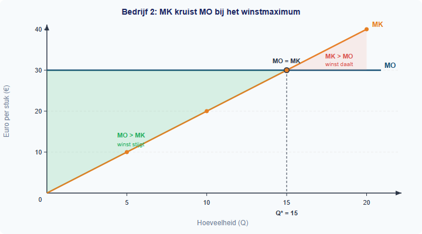

# 1.4.4 Winstmaximalisatie: de MO = MK-regel

## Wanneer moet een bedrijf stoppen met produceren?

Bedrijf 2 uit de vorige paragraaf verkoopt elk product voor €30. Bij Q = 10 maakt het bedrijf €100 winst. Bij Q = 15 is de winst €125. Maar bij Q = 20 daalt de winst weer naar €100. Er is dus een hoeveelheid waarbij de winst het hoogst is. Hoe vind je dat punt — zonder elke hoeveelheid uit te rekenen?

Het antwoord zit in de marginale kosten en marginale opbrengsten die je in §1.4.3 hebt geleerd. In deze paragraaf ontdek je de **MO = MK-regel**: het punt waar de winst maximaal is, en hoe je dat punt kunt berekenen.

---

## Theorie

### De winst per hoeveelheid: een tabel

> **📋 Herhaling uit §1.4.3**
> MK = ΔTK / ΔQ (extra kosten van één extra eenheid). MO = ΔTO / ΔQ (extra opbrengst van één extra eenheid). Bij een vaste prijs geldt MO = P.

We pakken bedrijf 2 weer op: TK = 100 + Q², P = €30, TO = 30Q. Nu berekenen we de winst bij elke hoeveelheid, met stappen van ΔQ = 1:

| Q | TK = 100 + Q² | TO = 30Q | Winst (TO − TK) | MK | MO |
|---|--------------|---------|-----------------|-----|-----|
| 0 | 100 | 0 | −100 | — | — |
| 5 | 125 | 150 | 25 | 5 | 30 |
| 10 | 200 | 300 | 100 | 15 | 30 |
| 13 | 269 | 390 | 121 | 25 | 30 |
| 14 | 296 | 420 | 124 | 27 | 30 |
| 15 | 325 | 450 | 125 | 29 | 30 |
| 16 | 356 | 480 | 124 | 31 | 30 |
| 17 | 389 | 510 | 121 | 33 | 30 |
| 20 | 500 | 600 | 100 | 35 | 30 |

*MK-waarden berekend als ΔTK/ΔQ over intervallen van 5 bij de eerste rijen, en van 1 rond het optimum.*

Kijk goed naar de kolom Winst. De winst stijgt tot Q = 15 (winst = €125) en daalt daarna. Het maximum ligt bij Q = 15.

Kijk nu naar MK en MO. Bij Q = 14 is MK = 27, nog onder MO = 30. Bij Q = 15 is MK = 29, nagenoeg gelijk aan MO = 30. Bij Q = 16 is MK = 31, boven MO = 30. Precies bij het winstmaximum zijn MK en MO (bijna) gelijk.

---

### Waarom MO = MK het winstmaximum geeft

Stel je staat op Q = 10 en overweegt of je één extra eenheid moet produceren:

- De extra opbrengst is MO = €30.
- De extra kosten zijn MK = €21 (want TK(11) − TK(10) = 221 − 200 = 21).
- Het verschil MO − MK = €9 is de **extra winst** van die ene eenheid.

Zolang MO > MK levert elke extra eenheid meer op dan het kost. Je winst stijgt. Produceer door!

Maar bij Q = 16:

- MO = €30 en MK = €31 (want TK(16) − TK(15) = 356 − 325 = 31).
- Nu is MO − MK = −€1. Die eenheid kost meer dan het oplevert. Je winst daalt.

Het omslagpunt is waar MO = MK. Daar voegt de laatst geproduceerde eenheid precies niets meer toe aan de winst. Dit is het winstmaximum.



---

### De MO = MK-regel

> **Definitie: Winstmaximalisatie**
> Een bedrijf maximaliseert zijn winst door te produceren tot het punt waar MO = MK. Bij die hoeveelheid is de totale winst het hoogst.

> **Formule**
> ```
> Winstmaximum bij: MO = MK
> ```
> Produceer zolang MO ≥ MK. Stop zodra MO = MK.

De logica in drie stappen:

1. **MO > MK** → de extra eenheid levert meer op dan het kost → winst stijgt → **produceer meer**
2. **MO = MK** → de extra eenheid levert precies op wat het kost → winst is maximaal → **stop hier**
3. **MO < MK** → de extra eenheid kost meer dan het oplevert → winst daalt → **produceer minder**

> **⚠️ Let op — veelgemaakte fout**
> Veel leerlingen denken dat het bedrijf moet stoppen zodra de winst positief is, of dat maximale productie altijd de meeste winst geeft. Maar de tabel laat zien: bij Q = 20 is de winst lager dan bij Q = 15, ondanks de hogere productie. Het gaat niet om *hoeveel* je produceert, maar om *tot waar* elke extra eenheid nog bijdraagt aan de winst.

---

### De grafische weergave

In figuur 2 zie je de TK- en TO-lijnen van bedrijf 2. Het verticale verschil tussen TO en TK is de winst. Dat verschil is het grootst bij Q = 15 — daar is de afstand tussen de twee lijnen maximaal.


In figuur 3 zie je MK en MO. De stijgende MK-lijn kruist de horizontale MO-lijn bij Q = 15. Links van het snijpunt is MO > MK (elke eenheid voegt winst toe). Rechts is MO < MK (elke eenheid vermindert de winst).


Zo zie je dezelfde informatie in drie vormen tegelijk: in de tabel hierboven, in de twee grafieken, en in de tekst die ze verbindt.

---

### De regel algebraisch toepassen

Bij bedrijf 2 weten we dat MK ≈ 2Q (de benadering voor TK = 100 + Q²) en MO = 30. De MO = MK-regel wordt dan:

```
MO = MK
30 = 2Q
Q = 15
```

Dit klopt met de tabel: bij Q = 15 is de winst het hoogst. Je hoeft geen hele tabel te maken — je lost gewoon MO = MK op als vergelijking.

Neem een nieuw bedrijf: bedrijf 3 met TK = 50 + 2Q² en P = €40. Dan is MK ≈ 4Q en MO = 40:

```
MO = MK
40 = 4Q
Q = 10
```

De winstmaximaliserende hoeveelheid is Q = 10. We controleren met de winst:

| Q | TK = 50 + 2Q² | TO = 40Q | Winst |
|---|---------------|---------|-------|
| 9 | 50 + 162 = 212 | 360 | 148 |
| 10 | 50 + 200 = 250 | 400 | **150** |
| 11 | 50 + 242 = 292 | 440 | 148 |

Inderdaad: de winst is het hoogst bij Q = 10. Bij Q = 9 en Q = 11 is de winst lager.


---

## Uitgewerkt voorbeeld

> **De fietsenmaker**
>
> Een fietsenmaker heeft TK = 80 + 0,5Q². Hij verkoopt elke fiets voor €20. We bepalen de winstmaximaliserende productie.

**(a)** Schrijf de formules voor TK, TO en winst.

*Stap 1: Noteer de gegeven informatie.*

- TK = 80 + 0,5Q²
- P = €20, dus TO = 20Q
- Winst = TO − TK = 20Q − 80 − 0,5Q²

**(b)** Bepaal MK en MO.

*Stap 2: Bepaal MK.*

MK ≈ Q (de benadering bij TK = 80 + 0,5Q²: als Q met 1 stijgt, stijgt Q² met ≈ 2Q · 1 = 2Q, dus ΔTK ≈ 0,5 · 2Q = Q).

*Stap 3: Bepaal MO.*

MO = P = 20 (constante prijs).

**(c)** Pas de MO = MK-regel toe.

*Stap 4: Stel MO = MK en los op.*

```
MO = MK
20 = Q
Q = 20
```

De winstmaximaliserende productie is Q = 20.

**(d)** Controleer door de winst te berekenen bij Q = 19, 20 en 21.

*Stap 5: Bereken de winst bij drie waarden rond het optimum.*

| Q | TK = 80 + 0,5Q² | TO = 20Q | Winst |
|---|-----------------|---------|-------|
| 19 | 80 + 180,5 = 260,5 | 380 | 119,5 |
| 20 | 80 + 200 = 280 | 400 | **120** |
| 21 | 80 + 220,5 = 300,5 | 420 | 119,5 |

De winst is inderdaad het hoogst bij Q = 20.


---

> **Samenvatting §1.4.4**
> - Een bedrijf maximaliseert zijn winst bij de hoeveelheid waar **MO = MK**.
> - Zolang MO > MK levert elke extra eenheid winst op. Zodra MO < MK daalt de winst.
> - De MO = MK-regel kun je grafisch aflezen (snijpunt van MK- en MO-lijn) of algebraisch oplossen (stel MO = MK en los op naar Q).
> - **Formule**: winstmaximum bij MO = MK. Bij kwadratische kosten TK = c + aQ²: MK ≈ 2aQ.
> - *In §1.4.5 pas je de MO = MK-regel toe op een bedrijf in volkomen concurrentie en bekijk je de gevolgen voor de markt.*

> **💡 Vastgelopen op een opgave?**
> Op de website vind je bij elke opgave een **begeleide inoefening**: stap voor stap krijg je extra hints en tussenstappen. Klik op de opgave om de begeleiding te starten.

---

## Opgaven

### Startoefeningen

**Opgave 1** *(lees de tabel — winst aflezen)*

Een bedrijf met TK = 100 + Q² verkoopt tegen P = €30 (bedrijf 2 uit §1.4.3). Hieronder staat de uitgebreide tabel:

| Q | TK | TO | Winst | MK | MO |
|---|-----|-----|-------|----|----|
| 0 | 100 | 0 | −100 | — | — |
| 5 | 125 | 150 | 25 | 5 | 30 |
| 10 | 200 | 300 | 100 | 15 | 30 |
| 13 | 269 | 390 | 121 | 25 | 30 |
| 14 | 296 | 420 | 124 | 27 | 30 |
| 15 | 325 | 450 | 125 | 29 | 30 |
| 16 | 356 | 480 | 124 | 31 | 30 |
| 17 | 389 | 510 | 121 | 33 | 30 |
| 20 | 500 | 600 | 100 | 35 | 30 |

a) Bij welke Q is de winst het hoogst?

b) Kijk naar de kolommen MK en MO bij dat Q. Wat valt je op?

c) Leg uit waarom het bedrijf bij Q = 14 nog één eenheid extra moet produceren.

d) Leg uit waarom het bedrijf bij Q = 16 juist één eenheid minder moet produceren.


**Opgave 2** *(de regel in woorden)*

a) Schrijf de MO = MK-regel in je eigen woorden op.

b) Een bedrijf heeft bij de huidige productie MO = 25 en MK = 18. Moet het bedrijf meer of minder produceren? Leg uit.

c) Een ander bedrijf heeft MO = 12 en MK = 19. Wat adviseer je? Leg uit.

d) Bij welke verhouding tussen MO en MK is de winst maximaal?


**Opgave 3** *(grafiek lezen — zie figuur 5)*

In figuur 5 zie je MK en MO van een bedrijf.


a) Lees uit de grafiek af: bij welke Q kruisen MK en MO?

b) Is bij Q = 8 de winst aan het stijgen of dalen? Leg uit met MK en MO.

c) Is bij Q = 20 de winst aan het stijgen of dalen? Leg uit.

d) Arceer in de grafiek het gebied waar elke extra eenheid winst toevoegt (het gebied waar MO > MK).

---

### Zelfstandige oefening

**Opgave 4** *(berekenen met de MO = MK-regel)*

Een bedrijf heeft TK = 200 + 0,5Q² en verkoopt tegen P = €30.

a) Bereken MK (gebruik de benadering MK ≈ Q).

b) Bereken MO.

c) Bepaal de winstmaximaliserende Q met de MO = MK-regel.

d) Controleer je antwoord door de winst te berekenen bij Q − 1, Q en Q + 1.


**Opgave 5** *(bedrijf 3 volledig doorrekenen)*

Bedrijf 3 heeft TK = 50 + 2Q² en verkoopt tegen P = €40 per stuk.

a) Schrijf de formule voor TO.

b) Bereken MK (gebruik de benadering MK ≈ 4Q).

c) Pas de MO = MK-regel toe om de winstmaximaliserende Q te vinden.

d) Bereken de winst bij Q − 1, Q en Q + 1 om je antwoord te controleren.

e) Bereken de maximale winst.

---

### Herhaling (interleaving)

**Opgave 6** *(herhaling §1.4.3: MK en MO berekenen)*

Een drukkerij heeft TK = 300 + 4Q. De verkoopprijs is €14 per boek.

a) Bereken MK. Is MK constant of veranderlijk?

b) Bereken MO.

c) Is MO > MK bij elke hoeveelheid? Wat betekent dit voor de winstmaximaliserende productie?


**Opgave 7** *(herhaling §1.3.3: break-even)*

Een bakkerij heeft TK = 450 + 3Q en verkoopt brood voor €7,50 per stuk.

a) Bereken het break-evenpunt.

b) Bereken de winst bij Q = 200.

c) Bereken MK en MO. Loont het om de productie uit te breiden voorbij Q = 200?

---

### Doeloefening

**Opgave 8**

Gebruik bedrijf 2 uit §1.4.3 (TK = 100 + Q², TO = 30Q).

a) Breid je tabel uit met een kolom voor winst bij Q = 0, 5, 10, 13, 14, 15, 16, 17, 20.

b) Bij welke Q is de winst het hoogst?

c) Kijk naar de kolommen MK en MO. Wat is waar over MK en MO bij de winstmaximaliserende Q?

d) Leg de regel uit: "produceer zolang MO ≥ MK, stop wanneer MO = MK."

e) Bedrijf 3 heeft TK = 50 + 2Q² en verkoopt tegen P = €40. Gebruik MO = MK om de winstmaximaliserende Q te berekenen ZONDER een volledige tabel. (Hint: MK ≈ 4Q. Stel dus 4Q = 40.)

f) Controleer door de winst te berekenen bij Q − 1, Q en Q + 1.

---

### Denkertje *(bonusopgave)*

**Opgave 9**

Een ondernemer heeft TK = 500 + 3Q². De marktprijs is €60.

a) Bepaal de winstmaximaliserende Q met MO = MK (hint: MK ≈ 6Q).

b) Bereken de maximale winst.

c) De overheid legt een belasting van €12 per eenheid op aan de producent. Zijn nieuwe kosten worden TK = 500 + 3Q² + 12Q. Bereken de nieuwe MK (hint: MK ≈ 6Q + 12). Bepaal de nieuwe winstmaximaliserende Q.

d) Vergelijk de oude en nieuwe situatie. Wat is het effect van de belasting op de geproduceerde hoeveelheid en de winst?
