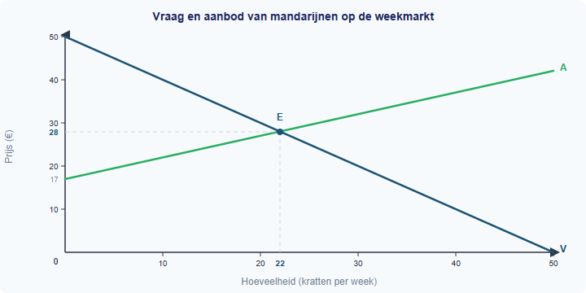

# Gemengde opgaven §1.4.5 — Marktevenwicht en marginale analyse

---

## Opgave 1: Fruitkraam "De Mandarijn"

Hassan heeft een fruitkraam op de weekmarkt in Utrecht. Hij verkoopt kratten mandarijnen aan horecazaken. Op de markt voor mandarijnen geldt de volgende vraaglijn en aanbodlijn:

- Vraaglijn: Qv = −P + 50
- Aanbodlijn: Qa = 2P − 34

Hierbij is P de prijs in euro's per krat en Q de hoeveelheid in kratten per week.

Hassan is een prijsnemer op de markt en verkoopt zijn kratten tegen de evenwichtsprijs. Hij heeft zijn kosten en opbrengsten per week bijgehouden voor verschillende productieniveaus:

**Tabel 1: Kosten en opbrengsten fruitkraam "De Mandarijn" per week**

| Productie (kratten) | TCK (€) | TVK (€) | TK (€) | TO (€) | MK (€/krat) | MO (€/krat) |
|---|---|---|---|---|---|---|
| 0 | 150 | 0 | 150 | 0 | – | – |
| 5 | 150 | 50 | 200 | 140 | 10 | 28 |
| 10 | 150 | 80 | 230 | 280 | 6 | 28 |
| 15 | 150 | 120 | 270 | 420 | 8 | 28 |
| 20 | 150 | 200 | 350 | 560 | 16 | 28 |
| 25 | 150 | 350 | 500 | 700 | 30 | 28 |
| 30 | 150 | 570 | 720 | 840 | 44 | 28 |

---

**1** *(2p)* Bereken de evenwichtsprijs en de evenwichtshoeveelheid op de markt voor mandarijnen. Laat je berekening zien.

**2** *(2p)* Bereken de gemiddelde totale kosten (GTK) per krat bij een productie van 20 kratten. Laat je berekening zien.

**3** *(2p)* Leg uit met behulp van tabel 1 hoe je de marginale kosten (MK) berekent. Gebruik de stap van 15 naar 20 kratten als voorbeeld.

**4** *(2p)* Bepaal met behulp van tabel 1 bij welke productie de winst van Hassan maximaal is. Gebruik de MO = MK-regel in je antwoord.

**5** *(2p)* Bereken de totale winst van Hassan bij de winstmaximaliserende productie.

**Denkertje** *(2p)* Hassan zegt: "Ik moet zoveel mogelijk kratten verkopen, want bij elke extra verkoop krijg ik €28 extra opbrengst." Beoordeel of het verstandig is dat Hassan zijn productie verhoogt van 20 naar 25 kratten. Gebruik gegevens uit tabel 1 in je antwoord.

---

## Opgave 2: De markt voor biologische honing

Lees het volgende nieuwsbericht:

> **Dubbele klap voor honingmarkt: nieuwe technologie én stijgende inkomens**
>
> Imkers profiteren van een nieuw type bijenkast dat de honingoogst per volk met 20% verhoogt. Tegelijkertijd stijgt de vraag naar biologische producten doordat het besteedbaar inkomen van Nederlandse huishoudens is toegenomen. Brancheorganisatie NBV verwacht dat beide ontwikkelingen de markt flink zullen beïnvloeden.

Op de markt voor biologische honing gelden de volgende functies:

- Vraaglijn: Qv = −P + 50
- Aanbodlijn: Qa = 2P − 10

Hierbij is P de prijs in euro's per pot en Q de hoeveelheid in potten per maand (×1.000).

Door de nieuwe technologie verschuift de aanbodlijn naar: Qa' = 2P − 4

Door de stijging van het inkomen verschuift de vraaglijn naar: Qv' = −P + 56

Een individuele imker, "Honinghoeve Bloesem", verkoopt tegen de marktprijs en heeft de volgende kostenstructuur:

**Tabel 2: Kosten en opbrengsten Honinghoeve Bloesem per maand**

| Productie (potten) | TCK (€) | TVK (€) | TK (€) | MK (€/pot) |
|---|---|---|---|---|
| 0 | 200 | 0 | 200 | – |
| 100 | 200 | 800 | 1.000 | 8 |
| 200 | 200 | 1.400 | 1.600 | 6 |
| 300 | 200 | 1.800 | 2.000 | 4 |
| 400 | 200 | 2.400 | 2.600 | 6 |
| 500 | 200 | 3.400 | 3.600 | 10 |
| 600 | 200 | 4.800 | 5.000 | 14 |
| 700 | 200 | 6.800 | 7.000 | 20 |
| 800 | 200 | 9.400 | 9.600 | 26 |

---

**6** *(2p)* Bereken de oorspronkelijke evenwichtsprijs en evenwichtshoeveelheid op de markt voor biologische honing.

**7** *(2p)* Bereken het nieuwe evenwicht als alleen de aanbodlijn verschuift (door de nieuwe technologie). Leg uit of de prijs stijgt of daalt.

**8** *(2p)* Bereken het nieuwe evenwicht als alleen de vraaglijn verschuift (door de inkomensstijging). Leg uit of de prijs stijgt of daalt.

**9** *(2p)* Bepaal het evenwicht als beide verschuivingen tegelijk optreden. Bereken de nieuwe evenwichtsprijs en evenwichtshoeveelheid.

**10** *(2p)* Na beide verschuivingen is de marktprijs €20 per pot. Honinghoeve Bloesem ontvangt deze prijs voor elke pot. Bepaal met behulp van tabel 2 de winstmaximaliserende productie van Honinghoeve Bloesem. Gebruik de MO = MK-regel.

**Denkertje** *(2p)* Een politicus beweert: "Als vraag en aanbod tegelijk toenemen, blijft de prijs altijd gelijk." Beoordeel deze uitspraak. Gebruik de berekeningen uit vraag 6 t/m 9 in je antwoord.
