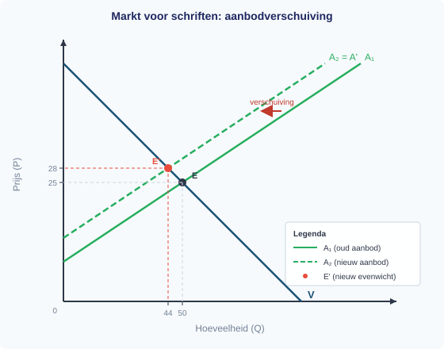
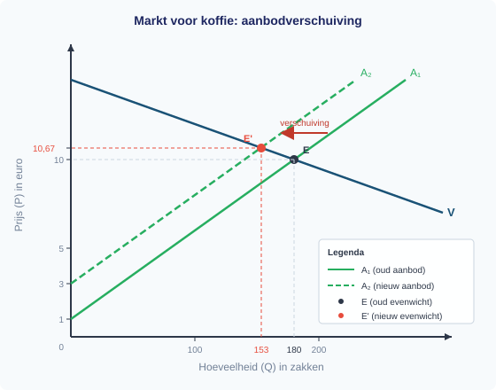

# Antwoorden Hoofdstuk 5 — Toetsvoorbereiding

# §1.5.1 Actieve samenvatting — Antwoorden

---

## Blok 1: Schaarste, alternatieve kosten en rekenen

**Vraag 1 — Correct: B**

*(132 − 120) / 120 × 100% = 10%. Lisa maakt de klassieke fout: ze verwijt 12 indexpunten met 12 procent. Indexpunten geven het absolute verschil tussen twee indexcijfers; voor het percentage deel je door het OUDE indexcijfer (120), niet door 100. **Valkuil:** optie A en D berusten op dezelfde fout — indexpunten gelijkstellen aan procenten. Optie C deelt door het nieuwe indexcijfer (132) in plaats van het oude, een tweede veelgemaakte fout.*

---

**Vraag 2 — Correct: C**

*De alternatieve kosten zijn de opbrengst van het beste niet-gekozen alternatief. Tim kiest bijles (€45), dus het enige alternatief is de supermarkt (€35). De alternatieve kosten zijn €35. **Valkuil:** optie A verwart de opbrengst van de gekozen optie met de alternatieve kosten. Optie B telt alle alternatieven op (dat is geen economisch begrip). Optie D berekent het verschil, maar alternatieve kosten zijn de opbrengst zelf, niet het verschil.*

---

**Vraag 3 — Correct: B**

*De procentuele verandering bereken je met (nieuw − oud) / oud × 100% = (400 − 500) / 500 × 100% = −20%. De daling is dus 20%. **Valkuil:** optie A deelt door de nieuwe waarde (400) in plaats van de oude (500) — dit is de meest gemaakte fout bij procentuele veranderingen. Optie C geeft −25% (dezelfde fout als A maar met correcte teller). Optie D verwart procentuele verandering met indexcijfers.*

---

## Blok 2: Vraag — betalingsbereidheid, vraaglijn en vraagfactoren

**Vraag 4 — Correct: B**

*Een verandering van de eigen prijs van een goed leidt tot een beweging LANGS de vraaglijn, niet tot een verschuiving VAN de vraaglijn. Bij een hogere prijs van boter beweeg je langs de vraaglijn naar links-boven (hogere P, lagere Qv). **Valkuil:** optie A is de #1 fout bij dit onderwerp: studenten verwarren een prijsverandering met een verschuiving van de hele lijn. Onthoud: alleen andere factoren (inkomen, voorkeuren, prijs substituten/complementen, aantal vragers) verschuiven de lijn.*

---

**Vraag 5 — Correct: A**

*Koffie en thee zijn substituten: als koffie duurder wordt, stappen consumenten over op thee. Daardoor stijgt de vraag naar thee bij elke prijs → de vraaglijn naar thee verschuift naar rechts. **Valkuil:** optie D klinkt logisch ("de prijs van thee verandert toch niet?"), maar mist dat een verandering in de prijs van een substituut wél een verschuivingsfactor is. Optie B maakt de omgekeerde fout: het is juist géén beweging langs de lijn, want de eigen prijs van thee verandert niet.*

---

**Vraag 6 — Correct: B**

*De collectieve vraag is de horizontale optelsom: je berekent per consument de gevraagde hoeveelheid bij P = 6 en telt alleen niet-negatieve hoeveelheden op. Anna: 10 − 2(6) = −2, dus Anna vraagt 0. Ben: 8 − 6 = 2. Collectief: 0 + 2 = 2. **Valkuil:** optie A telt de vergelijkingen algebraïsch op (18 − 3P), maar die formule geldt alleen zolang beide consumenten een positieve Qv hebben. Optie C vermenigvuldigt in plaats van op te tellen. Optie D vergeet dat Anna bij deze prijs uit de markt is.*

---

## Blok 3: Aanbod en kosten

**Vraag 7 — Correct: B**

*Bij Q = 500: TK = TCK + TVK = 500 + 0,80 × 500 = 500 + 400 = €900. GTK = TK/Q = 900/500 = €1,80. Dit is gelijk aan GCK + GVK = 1,00 + 0,80 = 1,80. **Valkuil:** optie A negeert de constante kosten helemaal (alsof GTK = GVK). Optie C verwart de break-evenprijs met GTK bij een willekeurige Q. Optie D maakt een rekenfout: telt TCK en GVK op in de teller in plaats van TK te berekenen.*

---

**Vraag 8 — Correct: B**

*TK = TCK + TVK. Bij meer productie stijgt TVK (en dus TK), maar TCK blijft gelijk. GTK = TK/Q = (TCK + TVK)/Q = GCK + GVK. Omdat TCK wordt gedeeld door een steeds groter Q, daalt GCK (spreidingseffect). Bij lineaire VK blijft GVK constant, dus GTK daalt. **Valkuil:** optie A verwart "TK stijgt" met "GTK stijgt" — dit is de klassieke verwarring tussen totaal en gemiddeld. Het feit dat de totale kosten stijgen, zegt niets over de kosten per stuk.*

---

**Vraag 9 — Correct: B**

*De totale opbrengst (TO) is €10.000 — dat is alles wat het bedrijf binnenhaalt. De winst is TO − TK = 10.000 − 8.500 = €1.500. De leerling noemt €1.500 de "opbrengst", maar dat is de winst. **Valkuil:** de verwarring opbrengst ≠ winst is een van de meest voorkomende fouten. Opbrengst = omzet = TO = P × Q. Winst = wat er overblijft na aftrek van alle kosten.*

---

## Blok 4: Marktevenwicht en verschuivingen

**Vraag 10 — Correct: B**

*Qv = Qa → −2P + 100 = 3P − 25 → 5P = 125 → P\* = 25. Invullen in Qv: −2(25) + 100 = 50. Controle in Qa: 3(25) − 25 = 50 ✓. Dus P\* = 25, Q\* = 50. **Valkuil:** optie D vult P\* = 25 alleen in de aanbodvergelijking in maar leest het verkeerd af (75 i.p.v. 50). Optie A en C komen voort uit rekenfouten bij het oplossen van de vergelijking — altijd controleren door P\* in beide vergelijkingen in te vullen!*

---

**Vraag 11 — Correct: B**

*Aanbod naar rechts = bij elke prijs wordt meer aangeboden. Vuistregel: A naar rechts → P daalt, Q stijgt. Intuïtief: meer aanbod bij dezelfde vraag drukt de prijs, en bij een lagere prijs wordt meer verkocht (nieuw evenwicht). **Valkuil:** optie A verwisselt de richting — dit zou kloppen bij een verschuiving naar links (minder aanbod).*

---

**Vraag 12 — Correct: A**

*Vraag naar rechts → P↑ Q↑. Aanbod naar rechts → P↓ Q↑. Het effect op Q is in beide gevallen positief → Q stijgt zeker. Maar het effect op P is tegenstrijdig (de ene duwt P omhoog, de andere omlaag) → het uiteindelijke effect op P hangt af van de grootte van de verschuivingen en is dus onzeker (ambigu). **Valkuil:** optie B vergeet dat de twee krachten op de prijs tegen elkaar inwerken. Optie D is te pessimistisch: de hoeveelheid is wél zeker.*

---

## Blok 5: Marginale analyse en winstmaximalisatie

**Vraag 13 — Correct: D**

*MK = ΔTK/ΔQ = (TK(11) − TK(10)) / (11 − 10). TK(10) = 100 + 2(100) = 300. TK(11) = 100 + 2(121) = 342. MK = (342 − 300) / 1 = 42. **Valkuil:** optie A vergeet dat de kostenfunctie kwadratisch is en vergelijkt alleen 2Q-termen. Optie B berekent GTK in plaats van MK (delen door Q i.p.v. ΔQ). Optie C gebruikt de afgeleide (4Q), maar past die toe bij Q = 10 in plaats van de discrete stijging van 10 naar 11 te berekenen.*

---

**Vraag 14 — Correct: B**

*Bij een vaste prijs geldt MO = P = €20. Zolang MK < MO (€20) levert elke extra eenheid extra winst op. Maar vanaf het punt waar MK > MO (ergens tussen Q = 30 en Q = 50, waar MK van €15 naar €25 stijgt), kost elke extra eenheid meer dan ze oplevert. De totale winst daalt dan. Het winstmaximum ligt bij MO = MK. **Valkuil:** optie A klopt niet — bij volkomen concurrentie is de prijs vast en daalt niet bij meer productie. Optie C is fout — constante kosten veranderen per definitie niet met de productie. Optie D is onzin — TO = P × Q blijft positief.*

# §1.5.2 Examenvaardigheden — Antwoorden

---

## Oefening 1 — Vaardigheid: een ongelabelde grafiek lezen

**1** *(2p)*

Lijn 1 is de **vraaglijn** (V), want deze loopt **dalend**: bij een hogere prijs wordt een kleinere hoeveelheid gevraagd. Dat past bij de wet van de vraag. (1 pt)

Lijn 2 is de **aanbodlijn** (A), want deze loopt **stijgend**: bij een hogere prijs zijn producenten bereid meer aan te bieden. Dat past bij de wet van het aanbod. (1 pt)

**2** *(1p)*

Het snijpunt van de twee lijnen is het marktevenwicht. Uit de grafiek: **P* = 30** en **Q* = 40**.

**3** *(2p)*

In de economie geldt de Marshall-conventie: de **verticale as** (y-as) toont de **prijs (P)**, de **horizontale as** (x-as) toont de **hoeveelheid (Q)**. (1 pt)

Dit is anders dan in de wiskunde, waar de onafhankelijke variabele standaard op de x-as staat. In de economie plaatsen we P op de y-as, hoewel P in de vraag- en aanbodfunctie de onafhankelijke variabele is. (1 pt)

**4** *(2p)*

Het gearceerde driehoekige vlak is het **consumentensurplus** (CS). (1 pt)

Het consumentensurplus is het verschil tussen de **betalingsbereidheid** van consumenten (afgelezen op de vraaglijn) en de **marktprijs** die zij daadwerkelijk betalen. Het driehoekige vlak boven de prijslijn en onder de vraaglijn geeft aan hoeveel consumenten gezamenlijk "besparen" doordat ze minder betalen dan hun maximum. (1 pt)

---

## Oefening 2 — Vaardigheid: gegevens uit een tabel halen en doorrekenen

**5** *(2p)*

GVK = TVK / Q. Bij Q = 50: GVK = 250 / 50 = **€5,00 per stuk**. (1 pt)

Je kunt dit ook aflezen zonder te delen: TVK stijgt telkens met €250 per 50 stuks extra. Dat is €250 / 50 = €5 per stuk. Of: kijk naar de TVK-kolom — elke stap van 50 stuks kost €250 extra, dus de variabele kosten per stuk zijn constant op €5. (1 pt)

**6** *(2p)*

Formule: GTK = TK / Q

Bij Q = 100: GTK = 1.100 / 100 = **€11,00 per stuk** (1 pt)

Bij Q = 200: GTK = 1.600 / 200 = **€8,00 per stuk** (1 pt)

**7** *(2p)*

De GTK daalt als Q stijgt door het **spreidingseffect**: de constante kosten (TCK = €600) worden over steeds meer eenheden verdeeld. (1 pt)

GTK = GCK + GVK. De GVK blijft gelijk (€5 per stuk), maar de GCK daalt: bij Q = 100 is GCK = 600 / 100 = €6,00, bij Q = 200 is GCK = 600 / 200 = €3,00. Doordat GCK daalt, daalt ook GTK. (1 pt)

**8** *(3p)*

**Stap 1:** Bij het break-evenpunt geldt TO = TK. (1 pt)

**Stap 2:** TO = P × Q = 10Q. TK = 600 + 5Q (want GVK = €5).
10Q = 600 + 5Q
5Q = 600
Q = **120 stuks** (1 pt)

**Stap 3:** Controle: TO = 10 × 120 = €1.200. TK = 600 + 5 × 120 = €1.200. TO = TK ✓ (1 pt)

*Alternatieve methode: Q = TCK / (P − GVK) = 600 / (10 − 5) = 600 / 5 = 120.*

**9** *(2p)*

TO = 10 × 200 = €2.000
TK = €1.600 (uit tabel)
Winst = TO − TK = 2.000 − 1.600 = **€400** (1 pt)

Ja, het bedrijf is winstgevend bij Q = 200: de winst is positief (€400). Dit klopt ook omdat Q = 200 boven het break-evenpunt van 120 stuks ligt. (1 pt)

---

## Oefening 3 — Vaardigheid: een 'bereken'-antwoord structureren

**10** *(2p)*

Antwoord B scoort meer punten. Bij het examen krijg je punten voor elke stap in de berekening, niet alleen voor het eindantwoord. Antwoord B laat zien: (1) vergelijking opstellen, (2) oplossen, (3) invullen, (4) controleren, (5) antwoord met eenheid. (1 pt)

Antwoord A geeft alleen het eindresultaat. De examinator kan niet zien hoe de leerling aan het antwoord komt. (1 pt)

**11** *(2p)*

**Leerling 1** verdient maximaal **1 punt** (alleen het eindantwoord is correct, maar geen tussenstappen). (1 pt)

**Leerling 2** verdient **4 punten** (alle stappen zijn zichtbaar: vergelijking, oplossing, invullen, controle, eenheid). (1 pt)

**12** *(4p)*

Stap 1 — Vergelijking opstellen:
Qv = Qa → −P + 40 = 2P − 20 (1 pt)

Stap 2 — Oplossen:
40 + 20 = 2P + P → 60 = 3P → P* = 20 (1 pt)

Stap 3 — Evenwichtshoeveelheid:
Qv = −20 + 40 = 20 (1 pt)

Stap 4 — Controle:
Qa = 2 × 20 − 20 = 20 ✓
**Antwoord: P* = €20, Q* = 20 USB-sticks.** (1 pt)

---

## Oefening 4 — Vaardigheid: een 'leg uit'-antwoord structureren

**13** *(2p)*

De conclusie van de leerling is niet onjuist (de prijs van T-shirts zal inderdaad stijgen), maar het antwoord is **onvolledig**. Er ontbreken de economische tussenstappen: waarom worden T-shirts duurder? Welk mechanisme zorgt daarvoor? (1 pt)

Bij een 'leg uit'-vraag verwacht de examinator een **causale keten** (gegeven → schakel 1 → schakel 2 → conclusie), niet alleen een conclusie. (1 pt)

**14** *(3p)*

**Gegeven:** De prijs van katoen stijgt met 35%. (impliciet)

**Schakel 1:** Katoen is een grondstof voor T-shirts. Duurdere grondstof betekent hogere productiekosten. Dit is een **aanbodfactor** (verandering in de prijs van productiefactoren). (1 pt)

**Schakel 2:** Door hogere productiekosten verschuift de aanbodlijn van T-shirts **naar links** — bij elke prijs worden minder T-shirts aangeboden. (1 pt)

**Conclusie:** Bij een verschuiving van de aanbodlijn naar links en een gelijkblijvende vraaglijn ontstaat een nieuw evenwicht met een **hogere evenwichtsprijs** en een **lagere evenwichtshoeveelheid**. (1 pt)

**15** *(2p)*

De bewering is **niet correct**. De vraaglijn van T-shirts verschuift niet. (1 pt)

De prijs van katoen is een **aanbodfactor** — het is een grondstof (inputprijs). Hierdoor verschuift de **aanbodlijn** naar links. De vraaglijn blijft op dezelfde plek. Wel is er een **beweging langs** de vraaglijn naar het nieuwe evenwicht: bij de hogere prijs wordt een kleinere hoeveelheid gevraagd. Een verschuiving VAN de vraaglijn zou alleen optreden als een vraagfactor verandert (inkomen, voorkeuren, prijs van substituten/complementen, verwachtingen). (1 pt)

**16** *(2p)*

De leerling klopt **niet**. Indexpunten zijn geen procenten. (0,5 pt)

Berekening: (189 − 140) / **140** × 100% = 49 / 140 × 100% = **35%** (1 pt)

De prijs is met 35% gestegen, niet met 49%. De 49 is het verschil in **indexpunten**, maar voor de procentuele verandering deel je door het **oude** indexcijfer (140), niet door 100. (0,5 pt)

---

## Oefening 5 — Vaardigheid: meerstaps-berekening (evenwicht, verschuiving en marginale analyse)

**17** *(4p)*

Stap 1 — Qv = Qa: −2P + 100 = 3P − 25 (1 pt)

Stap 2 — Oplossen: 125 = 5P → P* = 25 (1 pt)

Stap 3 — Qv = −2 × 25 + 100 = 50 (1 pt)

Stap 4 — Controle: Qa = 3 × 25 − 25 = 50 ✓
**Antwoord: P* = €25, Q* = 50 schriften.** (1 pt)

**18** *(4p)*

Stap 1 — Qv = Qa': −2P + 100 = 3P − 40 (1 pt)

Stap 2 — Oplossen: 140 = 5P → P*' = 28 (1 pt)

Stap 3 — Qv = −2 × 28 + 100 = 44 (1 pt)

Stap 4 — Controle: Qa' = 3 × 28 − 40 = 44 ✓
**Antwoord: P*' = €28, Q*' = 44 schriften.** (1 pt)

**19** *(2p)*

Formule: (nieuw − oud) / oud × 100% (1 pt)

(28 − 25) / 25 × 100% = 3 / 25 × 100% = **12%** stijging (1 pt)

**20** *(2p)*

Bij P = 25 (de oorspronkelijke evenwichtsprijs) en de **nieuwe** aanbodvergelijking:
Qv = −2 × 25 + 100 = 50
Qa' = 3 × 25 − 40 = 35 (1 pt)

Qv = 50 > Qa' = 35 → er is een **vraagoverschot** van 50 − 35 = **15 schriften**. (1 pt)

**21** *(2p)*

TK = 200 + 4Q → MK = 4 (constant, want TK is lineair). (0,5 pt)
MO = P = €28 (de nieuwe evenwichtsprijs; de producent is een prijsnemer). (0,5 pt)

MO (€28) > MK (€4): elke extra eenheid levert €28 op en kost slechts €4. Het loont om meer te produceren — de producent moet zijn productie **uitbreiden** zolang hij kan verkopen tegen de marktprijs. (1 pt)

**22** *(2p)*

**Gegeven:** De grondstofprijzen zijn gestegen. Dit is een **aanbodfactor** (verandering in de prijs van productiefactoren). (1 pt)

Door de hogere grondstofprijzen stijgen de productiekosten. Hierdoor **verschuift de aanbodlijn naar links**: bij elke prijs wordt een kleinere hoeveelheid aangeboden. Bij een gelijkblijvende vraaglijn leidt dit tot een nieuw evenwicht met een hogere prijs (van €25 naar €28). (1 pt)

# §1.5.3 Integratieoefening — Antwoorden

---

## Vraag (a) — H1.3 Kostenstructuur: TK, GTK en spreidingseffect (4 punten)

**Stap 1 — Formule:**
TK = TCK + TVK = 800 + 3Q

**Stap 2 — Berekening bij Q = 200:**
TK = 800 + 3 × 200 = 800 + 600 = **€1.400**
GTK = TK / Q = 1.400 / 200 = **€7,00 per zak**

**Stap 3 — Berekening bij Q = 400:**
TK = 800 + 3 × 400 = 800 + 1.200 = **€2.000**
GTK = TK / Q = 2.000 / 400 = **€5,00 per zak**

**Stap 4 — Verklaring:**
De GTK daalt van €7,00 naar €5,00 als de productie verdubbelt. Dit komt door het **spreidingseffect**: de constante kosten (TCK = €800) worden over steeds meer eenheden verdeeld. De gemiddelde constante kosten (GCK) dalen:
- Bij Q = 200: GCK = 800 / 200 = €4,00
- Bij Q = 400: GCK = 800 / 400 = €2,00

De gemiddelde variabele kosten (GVK) blijven gelijk op €3,00 per zak. Doordat de constante kosten over meer zakken worden gespreid, dalen de gemiddelde totale kosten.

*Puntenverdeling:*
- *Correcte formule TK (1 pt)*
- *Correcte berekening GTK bij Q = 200 (1 pt)*
- *Correcte berekening GTK bij Q = 400 (1 pt)*
- *Verklaring spreidingseffect: TCK wordt over meer eenheden verdeeld, waardoor GCK en dus GTK daalt (1 pt)*

---

## Vraag (b) — H1.4 Marktevenwicht: oplossen en controleren (4 punten)

**Stap 1 — Vergelijking opstellen:**
In het marktevenwicht geldt Qv = Qa:
−40P + 580 = 20P − 20

**Stap 2 — Oplossen:**
580 + 20 = 20P + 40P
600 = 60P
P* = 600 / 60 = **10**

**Stap 3 — Evenwichtshoeveelheid berekenen:**
Qv = −40 × 10 + 580 = −400 + 580 = **180**

**Stap 4 — Controle:**
Qa = 20 × 10 − 20 = 200 − 20 = 180 ✓

**Antwoord:** De evenwichtsprijs is P* = **€10** en de evenwichtshoeveelheid is Q* = **180 zakken**. Dit bevestigt het opgegeven evenwicht.

*Puntenverdeling:*
- *Vergelijking Qv = Qa correct opstellen (1 pt)*
- *P* correct berekenen (1 pt)*
- *Q* correct berekenen (1 pt)*
- *Controle in de andere vergelijking + antwoord met eenheid (1 pt)*

---

## Vraag (c) — H1.2/H1.4 Vraag-aanbodgrafiek en aanbodverschuiving (6 punten)

### c1 — Grafiek (2 punten)

De aanbodlijn verschuift naar links: bij elke prijs wordt een kleinere hoeveelheid aangeboden (Qa' = 20P − 60 in plaats van Qa = 20P − 20). De vraaglijn blijft op dezelfde plaats.

*Puntenverdeling:*
- *Correcte verschuiving A₂ naar links, parallel aan A₁ (1 pt)*
- *E en E' correct gemarkeerd met stippellijnen naar de assen (1 pt)*

### c2 — Berekening nieuw evenwicht (4 punten)

**Stap 1 — Vergelijking opstellen:**
Qv = Qa' → −40P + 580 = 20P − 60

**Stap 2 — Oplossen:**
580 + 60 = 20P + 40P
640 = 60P
P*' = 640 / 60 = 32/3 ≈ **€10,67**

**Stap 3 — Nieuwe evenwichtshoeveelheid berekenen:**
Qv = −40 × (32/3) + 580 = −1.280/3 + 1.740/3 = 460/3 ≈ **153 zakken**

**Stap 4 — Controle:**
Qa' = 20 × (32/3) − 60 = 640/3 − 180/3 = 460/3 ≈ 153 ✓

**Antwoord:** Het nieuwe evenwicht is P*' ≈ **€10,67** en Q*' ≈ **153 zakken**.

*Puntenverdeling:*
- *Vergelijking Qv = Qa' correct opstellen (1 pt)*
- *P*' correct berekenen (1 pt)*
- *Q*' correct berekenen (1 pt)*
- *Controle in de andere vergelijking + antwoord met eenheid (1 pt)*

---

## Vraag (d) — H1.4 Marginale analyse: MO en MK bij een prijsnemer (4 punten)

**Marginale kosten (MK):**
TK = 800 + 3Q. De totale kosten stijgen met €3 voor elke extra zak. Dus:
MK = ΔTK / ΔQ = **€3 per zak**

De MK zijn constant omdat de variabele kosten lineair zijn (GVK = €3 per zak).

**Marginale opbrengsten (MO):**
Op een markt met volkomen concurrentie is de koffiebrander een prijsnemer. De prijs wordt door de markt bepaald. Elke extra zak levert de marktprijs op:
MO = P = **€10,67 per zak**

**Vergelijking:**
MO > MK → €10,67 > €3,00

Elke extra zak koffie levert €10,67 op en kost €3,00 om te produceren. De extra opbrengst is dus groter dan de extra kosten. Het verkopen van één extra zak is winstgevend zolang de brander die zak ook kan afzetten en binnen zijn capaciteit blijft.

Je kunt hieruit niet concluderen dat deze kleine koffiebrander zelf 153 zakken moet produceren. Die 153 zakken zijn de totale evenwichtshoeveelheid van de markt, niet automatisch de productie van één individuele aanbieder. Voor een individuele prijsnemer heb je extra informatie nodig over capaciteit, marktaandeel of afzetmogelijkheden om een concrete productieomvang te kiezen.

*Puntenverdeling:*
- *Correcte berekening MK = €3 (1 pt)*
- *Correcte bepaling MO = P = €10,67 (1 pt)*
- *Correcte vergelijking MO > MK (1 pt)*
- *Conclusie: een extra zak is winstgevend, maar de markthoeveelheid van 153 zakken is niet automatisch de productie van één kleine aanbieder (1 pt)*

---

## Vraag (e) — H1.1 Procentuele verandering (2 punten)

**Formule:**
Procentuele verandering = (nieuw − oud) / oud × 100%

**Berekening:**
(10,67 − 10) / 10 × 100% = 0,67 / 10 × 100% = **6,7%**

**Antwoord:** De evenwichtsprijs stijgt met **6,7%**.

Nee, de evenwichtsprijs stijgt niet met hetzelfde percentage als de koffiebonenprijs (20%). Dit komt doordat de stijging van de grondstofprijs slechts gedeeltelijk wordt doorberekend in de evenwichtsprijs. De markt absorbeert een deel van de kostenstijging: de prijs stijgt, maar tegelijk daalt de gevraagde hoeveelheid. De consument betaalt meer, maar de producent verkoopt ook minder. Het uiteindelijke effect op de prijs hangt af van de hellingen van de vraag- en aanbodlijn.

*Puntenverdeling:*
- *Correcte formule en berekening (1 pt)*
- *Verklaring waarom de prijsstijging kleiner is dan 20%: de kostenstijging wordt niet volledig doorberekend doordat de gevraagde hoeveelheid daalt (1 pt)*

---

## Vraag (f) — H1.3/H1.4 Standpuntbepaling: aantal aanbieders en consumenteneffect (4 punten)

**Argumenten voor (goed voor consumenten):**

- Meer aanbieders betekent dat de collectieve aanbodlijn naar rechts verschuift. Bij een gelijkblijvende vraaglijn leidt dit tot een lager evenwichtsprijs en een hogere evenwichtshoeveelheid. De consumenten profiteren van lagere prijzen.
- Meer concurrentie kan leiden tot betere kwaliteit en meer keuze voor consumenten.

**Argumenten tegen (nadelig voor consumenten):**

- Twee kleine koffiebranders hebben elk afzonderlijk hogere gemiddelde constante kosten (GCK) dan een grotere brander, doordat het spreidingseffect minder sterk werkt. Deze hogere kosten per zak kunnen op termijn worden doorberekend in de prijs.
- Als de markt te klein is voor twee aanbieders, kan een van beide failliet gaan. Dan is de consument op termijn niet beter af.

**Conclusie:**

Op korte termijn is de opening van een tweede koffiebrander waarschijnlijk goed voor consumenten: het extra aanbod drukt de prijs. Op langere termijn hangt het af van de marktomvang. Als de vraag groot genoeg is om twee branders rendabel te laten draaien, profiteren consumenten structureel van lagere prijzen en meer keuze. Is de markt te klein, dan kan het spreidingseffect nadelig uitpakken.

*Puntenverdeling:*
- *Minimaal twee economische argumenten (twee argumenten voor of tegen, of een van elk) (2 pt)*
- *Correct gebruik van economische begrippen (aanbodlijn verschuift, spreidingseffect, GCK) (1 pt)*
- *Beargumenteerde conclusie die beide kanten afweegt (1 pt)*

# §1.5.4 Proeftoets — Antwoordmodel

**Boek 1 — Economie VWO 4**
**Totaal:** 74 punten

---

## Opgave 1: Sportschool "FitForLife" (18 punten)

**1** *(2p)*

Twee voorbeelden van constante kosten van een sportschool:

- Huur van het pand (1 pt)
- Afschrijving van fitnessapparatuur (1 pt)

*Andere goede antwoorden: verzekeringspremies, salarissen van vast personeel, kosten van een alarm-/beveiligingssysteem.*

**2** *(4p)*

**Stap 1:** Formule: GTK = TK / Q (1 pt)

**Stap 2:** Bij Q = 200:
GTK = 4.000 / 200 = €20,00 per lid (1 pt)

**Stap 3:** Bij Q = 400:
GTK = 5.000 / 400 = €12,50 per lid (1 pt)

**Stap 4:** Uitleg spreidingseffect:
De GTK daalt naarmate het aantal leden toeneemt, omdat de constante kosten (€3.000) over steeds meer leden worden verdeeld. Dit heet het **spreidingseffect**: de gemiddelde constante kosten (GCK) dalen bij toenemende productie, waardoor ook de GTK daalt. (1 pt)

**3** *(4p)*

Het break-evenpunt is het punt waar TO = TK (geen winst, geen verlies).

**Stap 1:** Stel TO = TK op: (1 pt)
P × Q = TCK + TVK
15Q = 3.000 + 5Q

**Stap 2:** Los op naar Q: (1 pt)
15Q − 5Q = 3.000
10Q = 3.000
Q = 300

**Stap 3:** Controle: (1 pt)
- TO = 15 × 300 = €4.500
- TK = 3.000 + 5 × 300 = 3.000 + 1.500 = €4.500
- TO = TK ✓

**Antwoord:** Het break-evenpunt ligt bij **Q = 300 leden**. (1 pt)

*Alternatieve methode: Q = TCK / (P − GVK) = 3.000 / (15 − 5) = 3.000 / 10 = 300.*

**4** *(4p)*

**Winst bij P = €15 en Q = 400:**

**Stap 1:** TO = 15 × 400 = €6.000 (0,5 pt)

**Stap 2:** TK = 3.000 + 5 × 400 = €5.000 (0,5 pt)

**Stap 3:** Winst = TO − TK = 6.000 − 5.000 = **€1.000** (0,5 pt)

**Winst bij P = €12 en Q = 400:**

**Stap 4:** TO = 12 × 400 = €4.800 (0,5 pt)

**Stap 5:** TK = 3.000 + 5 × 400 = €5.000 (0,5 pt)

**Stap 6:** Winst = TO − TK = 4.800 − 5.000 = **−€200** (verlies) (0,5 pt)

**Beoordeling:**
De prijsverlaging is **niet verstandig** bij het huidige ledenaantal van 400. Bij €15 maakt FitForLife €1.000 winst, maar bij €12 maakt de sportschool €200 verlies. De prijsverlaging zou alleen verstandig zijn als het aantal leden zodanig toeneemt dat de totale opbrengst weer boven de totale kosten uitkomt. (1 pt)

*Om break-even te draaien bij P = €12: Q = 3.000 / (12 − 5) = 3.000 / 7 ≈ 429 leden.*

**5** *(4p)*

**Stap 1:** GCK = TCK / Q = 3.000 / 300 = **€10,00 per lid** (1 pt)

**Stap 2:** GVK = TVK / Q = (5 × 300) / 300 = 1.500 / 300 = **€5,00 per lid** (1 pt)

**Stap 3:** Controle GTK = GCK + GVK:
- GCK + GVK = 10 + 5 = €15 per lid
- Direct: GTK = TK / Q = 4.500 / 300 = €15 per lid ✓ (1 pt)

**Stap 4:** Uitleg:
De **GCK** daalt bij toenemende productie omdat de constante kosten (€3.000) over steeds meer leden worden verdeeld (spreidingseffect). De **GVK** blijft gelijk omdat de variabele kosten per lid (€5) niet veranderen met het aantal leden — elk extra lid kost exact hetzelfde. (1 pt)

---

## Opgave 2: De markt voor hardloopschoenen (24 punten)

**6** *(2p)*

- De evenwichtsprijs is **P* = €40** (1 pt)
- De evenwichtshoeveelheid is **Q* = 40** (1 pt)

**7** *(4p)*

**Stap 1:** Stel Qv = Qa: (1 pt)
−P + 80 = 2P − 40

**Stap 2:** Los op naar P: (1 pt)
80 + 40 = 2P + P
120 = 3P
P* = 40

**Stap 3:** Vul P* = 40 in een van de vergelijkingen in: (1 pt)
Q* = −40 + 80 = 40

**Stap 4:** Controleer in de andere vergelijking: (1 pt)
Qa = 2(40) − 40 = 80 − 40 = 40 ✓

**Antwoord:** Het evenwicht ligt bij P* = €40 en Q* = 40 stuks.

**8** *(4p)*

**Stap 1:** Stel Qv' = Qa: (1 pt)
−P + 100 = 2P − 40

**Stap 2:** Los op naar P: (1 pt)
100 + 40 = 2P + P
140 = 3P
P*' = 140/3 = 46⅔ ≈ €46,67

**Stap 3:** Vul P*' in: (1 pt)
Q*' = −46⅔ + 100 = 53⅓ ≈ 53,33

**Stap 4:** Controleer: (1 pt)
Qa = 2 × 46⅔ − 40 = 93⅓ − 40 = 53⅓ ✓

**Antwoord:** Het nieuwe evenwicht ligt bij P*' ≈ €46,67 en Q*' ≈ 53,33 stuks.

**9** *(2p)*

Dit is een **verschuiving van de vraaglijn** (naar rechts). (1 pt)

De vraagfactor die veranderd is, is **behoeften/voorkeuren** van consumenten: doordat een influencer hardlopen promoot, neemt de voorkeur voor hardloopschoenen toe. De prijs van hardloopschoenen zelf verandert niet — het is een externe factor die de hele vraaglijn verschuift. (1 pt)

**10** *(2p)*

**Stap 1:** Noteer oud en nieuw: (0,5 pt)
- Oud: Q* = 40
- Nieuw: Q*' = 53⅓

**Stap 2:** Bereken de procentuele verandering: (1 pt)
(53⅓ − 40) / 40 × 100% = 13⅓ / 40 × 100% = 33,3%

**Antwoord:** De evenwichtshoeveelheid stijgt met **33,3%**. (0,5 pt)

### Antwoordgrafiek bij opgave 2 (vraag 8)

De grafiek hieronder toont de oorspronkelijke vraaglijn (V, gestreept), de nieuwe vraaglijn (V'), de aanbodlijn (A), het oude evenwicht (E) en het nieuwe evenwicht (E').

**11** *(4p)*

**Stap 1:** Stel Qv = Qa': (1 pt)
−P + 80 = 2P − 60

**Stap 2:** Los op naar P: (1 pt)
80 + 60 = 2P + P
140 = 3P
P*'' = 140/3 ≈ €46,67

**Stap 3:** Vul in: (1 pt)
Q*'' = −46⅔ + 80 = 33⅓ ≈ 33,33 stuks

**Stap 4:** Controle in Qa': (1 pt)
Qa' = 2 × 46⅔ − 60 = 93⅓ − 60 = 33⅓ ✓

**Antwoord:** Het nieuwe evenwicht ligt bij P ≈ €46,67 en Q ≈ 33,33 stuks. De prijs stijgt en de hoeveelheid daalt — conform de vuistregel voor een aanbodverschuiving naar links.

**12** *(2p)*

De aanbodfactor die veranderd is, is de **prijs van inputs (grondstoffen)**. (1 pt)

Door de hogere grondstofprijzen stijgen de productiekosten per paar schoenen. Bij elke prijs willen producenten nu minder aanbieden, of ze willen alleen aanbieden bij een hogere prijs om dezelfde marge te behalen. De aanbodlijn verschuift daardoor naar **links (omhoog)**. (1 pt)

**13** *(4p)*

**Stap 1:** Bereken Qv en Qa bij P = 60: (1 pt)
- Qv = −60 + 80 = 20
- Qa = 2 × 60 − 40 = 80

**Stap 2:** Vergelijk: (1 pt)
Qa (80) > Qv (20), dus bij deze prijs willen producenten meer aanbieden dan consumenten willen kopen.

**Stap 3:** Benoem het overschot: (1 pt)
Er ontstaat een **aanbodoverschot** (niet een vraagoverschot), want de minimumprijs €60 ligt **boven** de evenwichtsprijs €40.

**Stap 4:** Bereken de omvang: (1 pt)
Aanbodoverschot = Qa − Qv = 80 − 20 = **60 paar schoenen**.

---

## Opgave 3: Snoepfabriek "ZoetGenoeg" (12 punten)

**14** *(2p)*

- **Marginale kosten (MK):** de extra kosten van het produceren van één extra eenheid product. MK = ΔTK / ΔQ. (1 pt)
- **Marginale opbrengsten (MO):** de extra opbrengst van het verkopen van één extra eenheid product. MO = ΔTO / ΔQ. (1 pt)

**15** *(2p)*

Tussen Q = 15 en Q = 20 zijn de marginale kosten MK = €35 per stuk, terwijl de marginale opbrengsten MO = €30 per stuk. (1 pt)

Omdat MK > MO bij de laatste 5 eenheden, kosten deze extra eenheden meer dan ze opleveren. Elke extra zak kost €35 maar brengt slechts €30 op. Daardoor daalt de totale winst van €125 naar €100. (1 pt)

**16** *(2p)*

De winst is maximaal bij **Q = 15**. (1 pt)

Dit kun je aflezen doordat bij Q = 15 de MK (€25) nog lager is dan de MO (€30), dus de laatste eenheden leveren nog winst op. Bij Q = 20 is de MK (€35) hoger dan de MO (€30), dus daar kosten extra eenheden meer dan ze opleveren. De optimale hoeveelheid ligt dus waar MK de MO het dichtst nadert zonder te overschrijden: bij Q = 15 (of preciezer: waar MO = MK). (1 pt)

**17** *(4p)*

**Stap 1:** Stel de winstmaximalisatieregel op: (1 pt)
MO = MK

**Stap 2:** Bepaal MO en MK: (1 pt)
- MO = P = €30 (bij een vaste prijs is MO gelijk aan de prijs)
- MK ≈ 2Q (afgeleide van TK = 100 + Q²)

**Stap 3:** Los op: (1 pt)
30 = 2Q
Q = 15

**Stap 4:** Controleer de winst: (1 pt)
- TO = 30 × 15 = €450
- TK = 100 + 15² = 100 + 225 = €325
- Winst = 450 − 325 = **€125**

Dit komt overeen met de tabel. ✓

**18** *(2p)*

Bij TK = 100 + 2Q² geldt MK = ΔTK/ΔQ ≈ **4Q**. De MK is dus **stijgend** (niet constant): elke volgende eenheid kost meer dan de vorige. (1 pt)

Vergeleken met de oorspronkelijke MK ≈ 2Q zijn de marginale kosten nu tweemaal zo hoog voor elke Q, wat betekent dat de optimale productieomvang (bij dezelfde MO = €30) lager zou uitkomen: 30 = 4Q → Q = 7,5 stuks. (1 pt)

---

## Opgave 4: Krantenbericht over de benzineprijs (12 punten)

**19** *(2p)*

**Stap 1:** Noteer oud en nieuw: (0,5 pt)
- Oud: €1,80
- Nieuw: €2,02

**Stap 2:** Bereken de procentuele verandering: (1 pt)
(2,02 − 1,80) / 1,80 × 100% = 0,22 / 1,80 × 100% = 12,2%

**Antwoord:** De procentuele stijging is 12,2%. Afgerond op hele procenten is dit 12%, dus de bewering in het krantenbericht **klopt** (bij afronding). (0,5 pt)

**20** *(2p)*

Dit is een **beweging langs de vraaglijn**, niet een verschuiving. (1 pt)

De prijs van benzine zelf is gestegen (gegeven). Volgens de wet van de vraag kopen consumenten bij een hogere prijs minder. De vraaglijn zelf verschuift niet — consumenten bewegen langs dezelfde vraaglijn naar een punt met een hogere prijs en een lagere gevraagde hoeveelheid. (1 pt)

**21** *(2p)*

Biodiesel is een **substituut** voor benzine. Doordat de productiekosten van biodiesel dalen, wordt biodiesel goedkoper. (0,5 pt)

De relevante **vraagfactor** is de *prijs van substituten*. (0,5 pt)

Doordat het substituut (biodiesel) goedkoper wordt, stappen meer automobilisten over op biodiesel. De vraag naar benzine neemt af. Dit is een **verschuiving van de vraaglijn** naar benzine naar links: bij elke prijs wordt minder benzine gevraagd. (1 pt)

**22** *(2p)*

De drie stappen van economisch denken zijn: (1 pt voor de drie stappen)

1. **Probleem:** er is schaarste — de automobilist heeft een beperkt budget en moet kiezen hoe dit te besteden aan brandstof.
2. **Alternatieven afwegen:** de automobilist vergelijkt benzine (€2,02/liter) met biodiesel (goedkoper geworden). De alternatieve kosten van benzine tanken zijn de besparingen die je misloopt door niet voor biodiesel te kiezen.
3. **Kiezen:** de automobilist kiest het alternatief met de laagste alternatieve kosten (of het hoogste nut). Steeds meer automobilisten kiezen biodiesel omdat de alternatieve kosten van biodiesel zijn gedaald. (1 pt voor de toepassing)

**23** *(4p)*

**Stap 1:** Uitleg van de fout: (2 pt)
Het verschil 120 − 108 = 12 is een verschil in **indexpunten**, niet in procenten. Indexpunten en procenten zijn alleen gelijk als je rekent vanaf het **basisjaar** (indexcijfer 100). Hier is het basisjaar 2023 (100); voor een procentuele verandering van 2024 naar 2025 moet je delen door het indexcijfer van **2024**, niet door 100.

**Stap 2:** Juiste berekening: (1,5 pt)
% verandering = (nieuw − oud) / oud × 100% = (120 − 108) / 108 × 100% = 12 / 108 × 100% ≈ **11,1%**

**Stap 3:** Conclusie: (0,5 pt)
De juiste procentuele stijging tussen 2024 en 2025 is dus ongeveer **11,1%**, niet 12%. De klasgenoot verwart indexpunten met procenten.

---

## Opgave 5: Betalingsbereidheid en consumentensurplus (8 punten)

**24** *(4p)*

**Stap 1:** Bepaal wie koopt: (1 pt)
Een consument koopt als BB ≥ P = €80. Dus:
- Anne (BB = 140): koopt ✓
- Bram (BB = 120): koopt ✓
- Carla (BB = 90): koopt ✓
- Daan (BB = 60): koopt niet (BB < P)

**Stap 2:** Consumentensurplus per koper (CS = BB − P): (1,5 pt)
- Anne: 140 − 80 = €60
- Bram: 120 − 80 = €40
- Carla: 90 − 80 = €10

**Stap 3:** Totaal consumentensurplus: (1 pt)
CS_totaal = 60 + 40 + 10 = **€110**

**Stap 4:** Antwoord: (0,5 pt)
Bij P = €80 kopen drie consumenten (Anne, Bram, Carla) en is het totale consumentensurplus €110.

**25** *(4p)*

**Stap 1:** Bepaal wie koopt bij P = €50: (1 pt)
Nu BB ≥ 50. Alle vier consumenten kopen (Daan ook, want 60 ≥ 50).

**Stap 2:** CS per koper: (1,5 pt)
- Anne: 140 − 50 = €90
- Bram: 120 − 50 = €70
- Carla: 90 − 50 = €40
- Daan: 60 − 50 = €10

**Stap 3:** Totaal en verandering: (1 pt)
CS_totaal = 90 + 70 + 40 + 10 = **€210**
Verandering = 210 − 110 = **+€100**

**Stap 4:** Uitleg: (0,5 pt)
Het consumentensurplus neemt toe omdat (1) bestaande kopers een hoger surplus krijgen op elke eenheid (prijsdaling van €30 × 3 bestaande kopers = €90) én (2) er een nieuwe koper bij komt (Daan levert extra surplus van €10).

---

## Puntentotaal

| Opgave | Punten |
|--------|--------|
| Opgave 1 | 18 |
| Opgave 2 | 24 |
| Opgave 3 | 12 |
| Opgave 4 | 12 |
| Opgave 5 | 8 |
| **Totaal** | **74** |

*Het cijfer wordt berekend over 74 punten.*