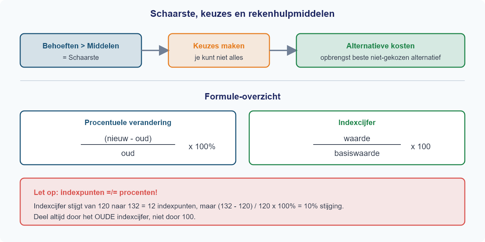
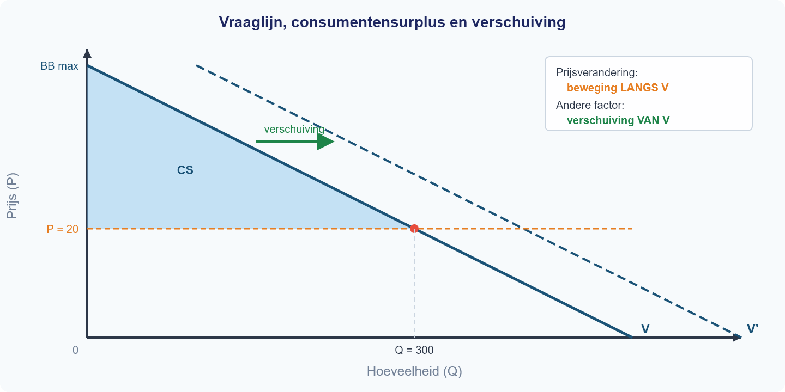

<h1>Hoofdstuk 5 — Toetsvoorbereiding</h1>

<h2>Inhoud</h2>

<table>
<thead><tr><th>§</th><th>Onderwerp</th></tr></thead>
<tbody>
<tr><td>1.5.1</td><td>Actieve samenvatting</td></tr>
<tr><td>1.5.2</td><td>Examenvaardigheden</td></tr>
<tr><td>1.5.3</td><td>Integratieoefening</td></tr>
<tr><td>1.5.4</td><td>Proeftoets</td></tr>
</tbody>
</table>

<h2>Leerdoelen</h2>

Na dit hoofdstuk kun je:

<ul>
<li>De kernbegrippen uit hoofdstukken 1–4 actief ophalen en toepassen</li>
<li>Schaarste, alternatieve kosten en economisch denken herkennen en berekenen</li>
<li>Procentuele veranderingen en indexcijfers correct berekenen (inclusief de valkuil indexpunten ≠ procenten)</li>
<li>De vraaglijn en aanbodlijn tekenen, aflezen en interpreteren</li>
<li>Het verschil uitleggen tussen een beweging langs en een verschuiving van een vraaglijn of aanbodlijn</li>
<li>Kostenstructuren berekenen (TK, TCK, TVK, GTK, GVK, GCK) en het spreidingseffect verklaren</li>
<li>TO, GO en winst berekenen en het break-evenpunt bepalen</li>
<li>Het marktevenwicht berekenen (Qv = Qa) en een nieuw evenwicht na een verschuiving</li>
<li>MK en MO berekenen en de winstmaximalisatieregel (MO = MK) toepassen</li>
<li>Examenvragen correct structureren: ‘bereken’ met alle stappen, ‘leg uit’ met causale keten</li>
<li>Concepten uit meerdere hoofdstukken combineren in één samenhangende context</li>
<li>Een toets onder tijdsdruk maken en je eigen antwoorden beoordelen</li>
</ul>

<h2>Ben je er klaar voor?</h2>

Je hebt geleerd over schaarste en keuzes, over vraag en aanbod, over kosten en opbrengsten, en over marktevenwicht en marginale analyse. Maar kun je al die puzzelstukken ook samenvoegen als het erop aankomt? In dit hoofdstuk bereid je je voor op de eindtoets. Je herhaalt actief de theorie, traint je examenvaardigheden, lost een integratieoefening op die alle hoofdstukken combineert, en maakt een volledige proeftoets onder examencondities. Geen nieuwe theorie — alleen oefenen, oefenen, oefenen.

# §1.5.1 Actieve samenvatting

Hieronder vind je een beknopte samenvatting van alle theorie uit Hoofdstuk 1 t/m 4. Na elk blok staan meerkeuze-vragen waarmee je toetst of je de stof écht begrijpt. Lees het blok, beantwoord de vragen en controleer je antwoorden in het antwoordenblad.

---

## Blok 1: Schaarste, alternatieve kosten en rekenen (H1.1)

Schaarste ontstaat doordat je behoeften groter zijn dan je beschikbare middelen — je kunt niet alles tegelijk hebben en moet dus kiezen. Bij elke keuze horen **alternatieve kosten**: de opbrengst van het beste alternatief dat je opgeeft. Je berekent ze in drie stappen: (1) noem alle alternatieven, (2) bepaal de opbrengst van elk alternatief, (3) de alternatieve kosten zijn de opbrengst van het beste *niet-gekozen* alternatief.

Voor het rekenen gebruik je twee hulpmiddelen. De **procentuele verandering** bereken je met (nieuw − oud) / oud × 100%. Let op: je deelt altijd door de **oude** waarde. Het **indexcijfer** bereken je met waarde / basiswaarde × 100. Een verandering in *indexpunten* is niet hetzelfde als een verandering in *procenten* — voor het percentage deel je door het oude indexcijfer, niet door 100.

**Vraag 1**

> Het indexcijfer van de benzineprijs steeg van 120 naar 132. Lisa beweert: "De benzineprijs is met 12% gestegen." Wat klopt er?

**(A)** Lisa heeft gelijk: 132 − 120 = 12, dus 12%.

**(B)** Lisa heeft ongelijk: (132 − 120) / 120 × 100% = 10%.

**(C)** Lisa heeft ongelijk: (132 − 120) / 132 × 100% = 9,1%.

**(D)** Lisa heeft gelijk: 12 indexpunten is altijd 12%.

**Vraag 2**

> Tim kan na school werken bij de supermarkt (€35) of bijles geven (€45). Hij kiest voor bijles. Wat zijn de alternatieve kosten van deze keuze?

**(A)** €45, want dat is wat hij verdient.

**(B)** €80, want dat is de totale opbrengst van alle alternatieven.

**(C)** €35, want dat is de opbrengst van het beste niet-gekozen alternatief.

**(D)** €10, want dat is het verschil tussen bijles en de supermarkt.

**Vraag 3**

> De prijs van een fiets daalt van €500 naar €400. Een leerling berekent de procentuele verandering als (500 − 400) / 400 × 100% = 25%. Klopt dit?

**(A)** Ja, 25% daling is correct.

**(B)** Nee, de daling is (500 − 400) / 500 × 100% = 20%.

**(C)** Nee, de daling is (400 − 500) / 400 × 100% = −25%.

**(D)** Nee, de daling is (400 / 500) × 100 = 80 indexpunten.

---

## Blok 2: Vraag — betalingsbereidheid, vraaglijn en vraagfactoren (H1.2)

De **betalingsbereidheid** (BB) is het maximale bedrag dat een consument voor een extra eenheid wil betalen. De **individuele vraaglijn** loopt dalend: bij een hogere prijs koop je minder. Je koopt zolang BB ≥ P. Het **consumentensurplus** (CS) is het verschil tussen je betalingsbereidheid en de prijs die je betaalt — in de grafiek het driehoekige gebied boven de prijslijn en onder de vraaglijn.

Vijf factoren verschuiven de **hele** vraaglijn: inkomen, voorkeuren, prijs van substituten, prijs van complementen en het aantal vragers. Een verandering van de *eigen prijs* geeft een **beweging langs** de vraaglijn, geen verschuiving. De **collectieve vraaglijn** is de horizontale optelsom van alle individuele vraaglijnen.

**Vraag 4**

> De prijs van boter stijgt. Wat gebeurt er met de vraaglijn naar boter?

**(A)** De vraaglijn verschuift naar links, want consumenten willen minder boter.

**(B)** Er is een beweging langs de vraaglijn naar links-boven: bij hogere P daalt Qv.

**(C)** De vraaglijn verschuift naar rechts, want boter wordt schaarser.

**(D)** Er gebeurt niets met de vraaglijn; alleen de aanbodlijn verandert.

**Vraag 5**

> Koffie en thee zijn substituten. De prijs van koffie stijgt fors. Wat gebeurt er met de vraaglijn naar thee?

**(A)** De vraaglijn naar thee verschuift naar rechts, want consumenten stappen over op thee.

**(B)** Er is een beweging langs de vraaglijn naar thee, want de prijs van thee verandert niet.

**(C)** De vraaglijn naar thee verschuift naar links, want koffie en thee gaan samen.

**(D)** De vraaglijn naar thee blijft gelijk, want alleen de prijs van koffie verandert.

**Vraag 6**

> Twee consumenten hebben de volgende individuele vraag: Anna: Qv = 10 − 2P, Ben: Qv = 8 − P. Wat is de collectieve gevraagde hoeveelheid bij P = 3?

**(A)** Qv = 18 − 3P = 18 − 9 = 9.

**(B)** Qv = (10 − 6) + (8 − 3) = 4 + 5 = 9.

**(C)** Qv = (10 − 6) × (8 − 3) = 4 × 5 = 20.

**(D)** Qv = 10 + 8 − 2 × 3 = 12.

---

## Blok 3: Aanbod en kosten (H1.3)

De **aanbodlijn** loopt stijgend: bij hogere prijs bieden producenten meer aan. Vijf factoren verschuiven de hele aanbodlijn: inputprijzen, technologie, aantal aanbieders, verwachtingen en overheidsbeleid. Kosten bestaan uit **constante kosten** (CK, onafhankelijk van Q) en **variabele kosten** (VK, afhankelijk van Q). De totale kosten zijn TK = TCK + TVK.

De **gemiddelde kosten** bereken je door te delen: GTK = TK/Q, GVK = TVK/Q, GCK = TCK/Q. Het **spreidingseffect** houdt in dat GCK daalt naarmate je meer produceert — de vaste kosten worden over meer eenheden verdeeld. De **totale opbrengst** is TO = P × Q. **Winst** = TO − TK (let op: opbrengst is niet hetzelfde als winst!). Bij het **break-evenpunt** geldt TO = TK, ofwel Q = TCK / (P − GVK).

**Vraag 7**

> Een bakkerij heeft TCK = €500, GVK = €0,80 per brood en verkoopt brood voor €1,50.
>
> | Productie (Q) | TK | GTK |
> |---|---|---|
> | 200 | ? | ? |
> | 500 | ? | ? |
> | 1000 | ? | ? |
>
> Wat is GTK bij Q = 500?

**(A)** €0,80, want GTK = GVK als je genoeg produceert.

**(B)** €1,80, want GTK = GVK + GCK = 0,80 + 500/500 = 0,80 + 1,00 = 1,80.

**(C)** €1,50, want GTK = prijs bij break-even.

**(D)** €2,30, want GTK = (500 + 0,80) / 500.

**Vraag 8**

> Bij dezelfde bakkerij stijgt de productie van 200 naar 1000 broden. Wat gebeurt er met TK en GTK?

**(A)** TK stijgt en GTK stijgt ook, want meer produceren is altijd duurder per stuk.

**(B)** TK stijgt, maar GTK daalt door het spreidingseffect van de constante kosten.

**(C)** TK blijft gelijk en GTK daalt, want de constante kosten veranderen niet.

**(D)** TK en GTK dalen allebei, want de bakkerij wordt efficiënter.

**Vraag 9**

> Een bedrijf heeft TO = €10.000 en TK = €8.500. Een leerling schrijft: "De opbrengst is €1.500." Wat is hierop aan te merken?

**(A)** Niets, de berekening klopt.

**(B)** De leerling verwart opbrengst met winst: TO = €10.000 is de opbrengst, winst = TO − TK = €1.500.

**(C)** De opbrengst is €8.500, want opbrengst = kosten.

**(D)** De winst is €10.000 en de opbrengst is €1.500.

---

## Blok 4: Marktevenwicht en verschuivingen (H1.4 §1–2)

Het **marktevenwicht** vind je waar de gevraagde hoeveelheid gelijk is aan de aangeboden hoeveelheid: Qv = Qa. Je lost op naar de **evenwichtsprijs** (P\*) en vult die in om de **evenwichtshoeveelheid** (Q\*) te berekenen. Controleer altijd door P\* in beide vergelijkingen in te vullen. Bij P > P\* ontstaat een **aanbodoverschot** (Qa > Qv); bij P < P\* een **vraagoverschot** (Qv > Qa).

Een verschuiving van vraag of aanbod leidt tot een nieuw evenwicht. **Vuistregels:** aanbod naar rechts → P daalt, Q stijgt; vraag naar rechts → P stijgt, Q stijgt. Bij twee gelijktijdige verschuivingen is de richting van één variabele (P of Q) altijd ambigu — je kunt niet zeggen welke kant die opgaat zonder de grootte van de verschuivingen te kennen.

**Vraag 10**

> Op de schriftenmarkt geldt: Qv = −2P + 100 en Qa = 3P − 25. Wat zijn de evenwichtsprijs en -hoeveelheid?

**(A)** P\* = 15, Q\* = 70.

**(B)** P\* = 25, Q\* = 50.

**(C)** P\* = 20, Q\* = 60.

**(D)** P\* = 25, Q\* = 75.

**Vraag 11**

> Door nieuwe technologie verschuift de aanbodlijn op de schriftenmarkt naar rechts. Wat is het effect op het evenwicht?

**(A)** De evenwichtsprijs stijgt en de evenwichtshoeveelheid daalt.

**(B)** De evenwichtsprijs daalt en de evenwichtshoeveelheid stijgt.

**(C)** Zowel de evenwichtsprijs als de evenwichtshoeveelheid stijgen.

**(D)** De evenwichtsprijs daalt en de evenwichtshoeveelheid daalt.

**Vraag 12**

> De vraag naar fietsen verschuift naar rechts (meer vraag) en tegelijkertijd verschuift het aanbod naar rechts (meer aanbod). Welke uitspraak is correct?

**(A)** De evenwichtshoeveelheid stijgt zeker, maar het effect op de prijs is onzeker.

**(B)** Zowel prijs als hoeveelheid stijgen zeker.

**(C)** De evenwichtsprijs daalt zeker, maar het effect op de hoeveelheid is onzeker.

**(D)** Het effect op zowel prijs als hoeveelheid is onzeker.

---

## Blok 5: Marginale analyse en winstmaximalisatie (H1.4 §3–4)

De **marginale kosten** (MK) zijn de extra kosten van één extra eenheid: MK = ΔTK/ΔQ. De **marginale opbrengst** (MO) is de extra opbrengst van één extra eenheid: MO = ΔTO/ΔQ. Bij een **vaste prijs** (volkomen concurrentie) geldt MO = P. Bij een lineaire TK-functie (TK = a + bQ) is MK constant en gelijk aan b. Bij een kwadratische TK-functie (TK = a + bQ²) stijgt MK naarmate Q toeneemt.

Het **winstmaximum** bereik je bij MO = MK. Produceer zolang MO ≥ MK — elke extra eenheid levert dan meer op dan ze kost. Zodra MO < MK wordt, kost een extra eenheid meer dan ze oplevert en daalt je winst. "Meer produceren is altijd beter" klopt dus niet bij stijgende MK.

**Vraag 13**

> Een bedrijf heeft TK = 100 + 2Q². De productie stijgt van 10 naar 11 eenheden. Wat zijn de marginale kosten?

**(A)** MK = 2 × 11² − 2 × 10² = 242 − 200 = 42.

**(B)** MK = TK(11) / 11 = (100 + 242) / 11 = 31,1.

**(C)** MK = 2 × 2Q = 4 × 10 = 40.

**(D)** MK = ΔTK/ΔQ = (TK(11) − TK(10)) / 1 = (342 − 300) / 1 = 42.

**Vraag 14**

> Een producent verkoopt tegen een vaste prijs van €20 per stuk. Zijn MK stijgt: bij Q = 30 is MK = €15 en bij Q = 50 is MK = €25. Een leerling zegt: "Je moet altijd zoveel mogelijk produceren, want meer afzet = meer winst." Waarom klopt deze redenering niet?

**(A)** Omdat de prijs daalt bij meer productie.

**(B)** Omdat na Q = 30 de MK boven de MO komen en elke extra eenheid verlies oplevert, waardoor de totale winst daalt.

**(C)** Omdat de constante kosten stijgen bij meer productie.

**(D)** Omdat bij Q = 50 de totale opbrengst negatief wordt.

# §1.5.2 Examenvaardigheden

In deze paragraaf oefen je de vaardigheden die je nodig hebt om goed te scoren op de toets. Er komt geen nieuwe theorie aan bod — je leert **hoe** je toetsvragen correct beantwoordt. Lees bij elke oefening eerst de vaardigheidstip en maak dan de opgaven.

---

## Oefening 1 — Vaardigheid: een ongelabelde grafiek lezen

Bekijk de onderstaande grafiek. De grafiek bevat twee lijnen, maar er staan geen labels bij de assen en geen letters bij de lijnen. Eén van de lijnen heeft een gearceerd driehoekig vlak erboven (tussen de lijn en de bovenrand van de grafiek, tot aan het snijpunt).

> **Vaardigheidstip:** Op het examen krijg je soms een grafiek zonder labels. Je moet dan zelf herkennen welke lijn de vraaglijn is en welke de aanbodlijn. De sleutel: de vraaglijn loopt dalend, de aanbodlijn loopt stijgend.

**1** *(2p)* Welke lijn is de vraaglijn? Welke is de aanbodlijn? Leg uit hoe je dat kunt zien aan het verloop van de lijnen.

**2** *(1p)* Lees de evenwichtsprijs en de evenwichtshoeveelheid af uit de grafiek.

**3** *(2p)* Geef de juiste labels voor de assen. Welke conventie geldt in de economie voor de positie van P en Q? Waarom is dat anders dan in de wiskunde?

**4** *(2p)* Het gearceerde driehoekige vlak stelt een economisch begrip voor. Noem dit begrip en leg uit wat het betekent. Gebruik de termen betalingsbereidheid en marktprijs in je antwoord.

---

## Oefening 2 — Vaardigheid: gegevens uit een tabel halen en doorrekenen

Een bedrijf heeft constante kosten (TCK) van €600. De variabele kosten stijgen lineair met de productie. De verkoopprijs is €10 per stuk. In de tabel staan de kostengegevens bij verschillende productieniveaus.

| Q (stuks) | TCK (€) | TVK (€) | TK (€) |
|-----------|---------|---------|--------|
| 0         | 600     | 0       | 600    |
| 50        | 600     | 250     | 850    |
| 100       | 600     | 500     | 1.100  |
| 150       | 600     | 750     | 1.350  |
| 200       | 600     | 1.000   | 1.600  |

> **Vaardigheidstip:** Bij een 'bereken'-vraag met een tabel lees je eerst de juiste waarden af en schrijf je dan de formule op. Noteer altijd: formule → invullen → berekenen → antwoord met eenheid.

**5** *(2p)* Bereken de GVK. Leg uit hoe je dit kunt aflezen uit de tabel zonder te delen.

**6** *(2p)* Bereken de GTK bij Q = 100 en bij Q = 200.

**7** *(2p)* Leg uit waarom de GTK daalt als Q stijgt. Gebruik het begrip **spreidingseffect**.

**8** *(3p)* Bereken het break-evenpunt. Toon alle stappen.

**9** *(2p)* Bereken de winst bij Q = 200. Is het bedrijf winstgevend bij dit productieniveau?

---

## Oefening 3 — Vaardigheid: een 'bereken'-antwoord structureren

Op de markt voor pennen geldt Qv = −3P + 90 en Qa = 2P − 10. Twee leerlingen berekenen het marktevenwicht.

**Antwoord A (leerling 1):**

> "P* = 20, Q* = 30."

**Antwoord B (leerling 2):**

> "Stap 1: Qv = Qa → −3P + 90 = 2P − 10
> Stap 2: 90 + 10 = 2P + 3P → 100 = 5P → P* = 20
> Stap 3: Qv = −3 × 20 + 90 = 30
> Controle: Qa = 2 × 20 − 10 = 30 ✓
> Antwoord: P* = €20, Q* = 30 pennen."

> **Vaardigheidstip:** Bij het examen krijg je punten voor elke stap, niet alleen voor het eindantwoord. Schrijf altijd: vergelijking opstellen → oplossen → invullen → controleren → antwoord met eenheid.

**10** *(2p)* Welk antwoord scoort meer punten bij een examen? Waarom?

**11** *(2p)* Hoeveel punten verdient leerling 1 bij een 4-punts berekenopgave? En leerling 2?

**12** *(4p)* Schrijf zelf een volledig antwoord bij de volgende opgave: *"Op de markt voor USB-sticks geldt Qv = −P + 40 en Qa = 2P − 20. Bereken de evenwichtsprijs en de evenwichtshoeveelheid."*

---

## Oefening 4 — Vaardigheid: een 'leg uit'-antwoord structureren

Een krantenartikel meldt dat de prijs van katoen — een grondstof voor kleding — dit jaar met 35% is gestegen. Een leerling wordt gevraagd: *"Leg uit wat het effect is op de markt voor T-shirts."*

De leerling schrijft:

> "Als katoen duurder wordt, worden T-shirts ook duurder."

> **Vaardigheidstip:** Een 'leg uit'-antwoord heeft een **causale keten** nodig. Je noemt het gegeven, legt de tussenstappen uit en eindigt met een conclusie. Structuur: gegeven → schakel 1 → schakel 2 → conclusie.

**13** *(2p)* Is het antwoord van de leerling correct? Wat ontbreekt er?

**14** *(3p)* Schrijf zelf het volledige antwoord. Gebruik de structuur: gegeven → schakel 1 → schakel 2 → conclusie.

**15** *(2p)* Een medeleerling beweert: *"De vraaglijn van T-shirts verschuift naar links."* Is dit correct? Leg uit met het verschil tussen **beweging langs** en **verschuiving van** een lijn.

**16** *(2p)* Het indexcijfer van de katoenprijs was vorig jaar 140. Dit jaar is het 189. Een leerling zegt: *"De prijs is met 49% gestegen."* Klopt dit? Toon je berekening.

---

## Oefening 5 — Vaardigheid: meerstaps-berekening (evenwicht, verschuiving en marginale analyse)

Op de markt voor schriften geldt Qv = −2P + 100 en Qa = 3P − 25. Door hogere grondstofprijzen wordt de aanbodvergelijking: Qa' = 3P − 40.

Een producent op deze markt heeft TK = 200 + 4Q. Hij verkoopt tegen de evenwichtsprijs.

> **Vaardigheidstip:** Bij een opgave met een verschuiving bereken je eerst het oorspronkelijke evenwicht, dan het nieuwe. Vergelijk de twee en trek een conclusie. Bij MK en MO: vergelijk per eenheid of uitbreiden loont.

**17** *(4p)* Bereken het oorspronkelijke evenwicht. Toon alle stappen.

**18** *(4p)* Bereken het nieuwe evenwicht na de aanbodverschuiving. Toon alle stappen.

**19** *(2p)* Bereken de procentuele verandering van de evenwichtsprijs.

**20** *(2p)* Bij de oorspronkelijke evenwichtsprijs van €25: bereken de gevraagde en aangeboden hoeveelheid met de **nieuwe** aanbodvergelijking. Is er dan een vraagoverschot of een aanbodoverschot?

**21** *(2p)* Bereken de MK en MO van de producent bij de nieuwe evenwichtsprijs. Moet hij meer of minder produceren? Leg uit.

**22** *(2p)* Leg uit waarom de evenwichtsprijs is gestegen. Gebruik de begrippen **aanbodfactor** en **verschuiving** in je antwoord.

# §1.5.3 Integratieoefening

In deze oefening werk je aan een samenhangende casus die vaardigheden uit alle vier de theoriehoofdstukken combineert. Je past kostenberekeningen, evenwichtsanalyse, verschuivingen, marginale analyse en procentuele veranderingen toe op dezelfde situatie. Er komt geen nieuwe theorie aan bod.

---

## De koffiebrander

Een kleine koffiebrander verkoopt zakken koffie op een markt met volkomen concurrentie. De constante kosten bedragen €800 per maand en de variabele kosten zijn €3 per zak. De totale kostenfunctie is:

**TK = 800 + 3Q**

Op de koffiemarkt gelden de volgende vergelijkingen:

- Vraagfunctie: **Qv = −40P + 580**
- Aanbodfunctie: **Qa = 20P − 20**

---

**Vraag (a)** *(4 punten)*

Bereken de totale kosten (TK) en de gemiddelde totale kosten (GTK) bij Q = 200 en bij Q = 400.

Wat valt je op als je de GTK bij beide productieniveaus vergelijkt? Leg uit met behulp van het begrip **spreidingseffect**.

---

**Vraag (b)** *(4 punten)*

Het marktevenwicht ligt bij P = 10 en Q = 180. Verifieer dit met behulp van de vraag- en aanbodfuncties.

Toon alle stappen: vergelijking opstellen, oplossen, invullen en controleren.

---

**Vraag (c)** *(6 punten)*

Een nieuwsbericht waarschuwt dat de prijs van koffiebonen met 20% zal stijgen. Door deze kostenstijging wordt de nieuwe aanbodfunctie:

**Qa' = 20P − 60**

**(c1)** Teken in een grafiek de vraaglijn (V), de oorspronkelijke aanbodlijn (A₁) en de nieuwe aanbodlijn (A₂). Markeer het oude evenwicht (E) en het nieuwe evenwicht (E').

Gebruik de onderstaande grafiek als uitgangspunt.

**(c2)** Bereken het nieuwe evenwicht (P' en Q'). Toon alle stappen.

---

**Vraag (d)** *(4 punten)*

Bij het nieuwe evenwicht ontvangt de koffiebrander een prijs van €10,67 per zak. De totale kostenfunctie is nog steeds TK = 800 + 3Q.

Bereken de marginale kosten (MK) en de marginale opbrengsten (MO).

Moet de koffiebrander bij het nieuwe evenwicht meer of minder zakken produceren dan het evenwichtsaantal van 153 zakken? Leg uit aan de hand van de vergelijking tussen MO en MK.

---

**Vraag (e)** *(2 punten)*

Bereken de procentuele verandering van de evenwichtsprijs (van het oude naar het nieuwe evenwicht).

Stijgt de evenwichtsprijs met hetzelfde percentage als de koffiebonenprijs (20%)? Leg uit waarom wel of niet.

---

**Vraag (f)** *(4 punten)*

Een mede-ondernemer wil een tweede koffiebrander openen in dezelfde buurt.

Beoordeel of de opening van een tweede koffiebrander goed is voor de consumenten. Gebruik in je antwoord economische begrippen en geef zowel argumenten voor als tegen. Sluit af met een beargumenteerde conclusie.

# §1.5.4 Proeftoets

**Boek 1 — Economie VWO 4**
**Tijd:** 120 minuten | **Totaal:** 74 punten | **Hulpmiddelen:** rekenmachine

> **Instructies**
> - Lees elke opgave zorgvuldig door voordat je begint.
> - Toon bij elke berekening alle tussenstappen.
> - Geef bij "leg uit"-vragen een redenering met economische begrippen.
> - Rond bedragen af op 2 decimalen, tenzij anders aangegeven.

---

## Opgave 1: Sportschool "FitForLife" (18 punten)

Sportschool FitForLife opent een nieuwe vestiging. De eigenaar heeft de volgende kostengegevens verzameld. De constante kosten bedragen €3.000 per maand (huur, afschrijving apparatuur, verzekeringen). De variabele kosten zijn €5 per lid per maand (schoonmaak, energie per lid, slijtage). De abonnementsprijs is €15 per lid per maand.

| Aantal leden (Q) | TCK (€) | TVK (€) | TK (€) | TO bij P = €15 (€) |
|-------------------|---------|---------|--------|---------------------|
| 0 | 3.000 | 0 | 3.000 | 0 |
| 100 | 3.000 | 500 | 3.500 | 1.500 |
| 200 | 3.000 | 1.000 | 4.000 | 3.000 |
| 300 | 3.000 | 1.500 | 4.500 | 4.500 |
| 400 | 3.000 | 2.000 | 5.000 | 6.000 |

---

**1** *(2p)* Noem twee voorbeelden van constante kosten van een sportschool.

**2** *(4p)* Bereken de gemiddelde totale kosten (GTK) bij Q = 200 en bij Q = 400. Leg uit waarom de GTK daalt naarmate het aantal leden toeneemt. Gebruik het begrip **spreidingseffect**.

**3** *(4p)* Bereken het break-evenpunt van FitForLife. Toon alle stappen.

**4** *(4p)* FitForLife heeft 400 leden. De eigenaar overweegt de prijs te verlagen van €15 naar €12 per maand om meer leden te trekken. Bereken de winst bij de oude prijs (€15) en bij de nieuwe prijs (€12), beide bij Q = 400. Beoordeel of de prijsverlaging verstandig is. Gebruik je berekeningen in je antwoord.

**5** *(4p)* Bereken bij Q = 300 de gemiddelde constante kosten (GCK), de gemiddelde variabele kosten (GVK) en toon met een berekening aan dat GTK = GCK + GVK. Leg vervolgens in één zin uit waarom de GCK daalt bij toenemende productie, maar de GVK gelijk blijft.

---

## Opgave 2: De markt voor hardloopschoenen (24 punten)

Op de markt voor hardloopschoenen gelden de volgende vergelijkingen:

- Vraagfunctie: **Qv = −P + 80**
- Aanbodfunctie: **Qa = 2P − 40**

In de grafiek hieronder zijn de vraaglijn (V) en de aanbodlijn (A) getekend. Het evenwichtspunt E is gemarkeerd.

---

**6** *(2p)* Lees de evenwichtsprijs en de evenwichtshoeveelheid af uit de grafiek.

**7** *(4p)* Verifieer het evenwicht door Qv = Qa op te lossen. Toon alle stappen en controleer je antwoord door P* in te vullen in beide vergelijkingen.

**8** *(4p)* Een populaire influencer promoot hardlopen op social media. Hierdoor neemt de vraag naar hardloopschoenen toe. De nieuwe vraagfunctie wordt: **Qv' = −P + 100**. Bereken het nieuwe evenwicht (P*' en Q*'). Toon alle stappen.

**9** *(2p)* Leg uit of de toename van de vraag door de influencer een **verschuiving van de vraaglijn** is of een **beweging langs de vraaglijn**. Noem de vraagfactor die veranderd is.

**10** *(2p)* Bereken de procentuele verandering van de evenwichtshoeveelheid (van het oude naar het nieuwe evenwicht).

**11** *(4p)* Los van de influencer-campagne stijgen de grondstofprijzen voor rubber. Hierdoor verschuift het aanbod. De nieuwe aanbodfunctie wordt: **Qa' = 2P − 60**. Bereken het nieuwe evenwicht bij de **oorspronkelijke** vraagfunctie (Qv = −P + 80). Toon alle stappen.

**12** *(2p)* Leg uit welke aanbodfactor hier is veranderd en waarom de aanbodlijn naar links (omhoog) verschuift.

**13** *(4p)* Neem nu weer de oorspronkelijke vraag- en aanbodfuncties (Qv = −P + 80 en Qa = 2P − 40). De overheid stelt een minimumprijs in van **P = €60**. Leg uit of er op deze markt een aanbodoverschot of een vraagoverschot ontstaat en bereken de omvang ervan.

---

## Opgave 3: Snoepfabriek "ZoetGenoeg" (12 punten)

Snoepfabriek ZoetGenoeg produceert zakken snoep. De totale kostenfunctie is:

**TK = 100 + Q²**

De verkoopprijs is vast: **P = €30 per zak**.

De onderstaande tabel toont de kosten, opbrengsten en winst bij verschillende productieniveaus. De marginale kosten (MK) en marginale opbrengsten (MO) zijn berekend per blok van 5 stuks.

| Q | TK = 100 + Q² (€) | TO = 30Q (€) | Winst (€) | MK (per 5 stuks, €) | MO (€) |
|---|-------------------|-------------|-----------|---------------------|--------|
| 0 | 100 | 0 | −100 | — | — |
| 5 | 125 | 150 | 25 | 5 | 30 |
| 10 | 200 | 300 | 100 | 15 | 30 |
| 15 | 325 | 450 | 125 | 25 | 30 |
| 20 | 500 | 600 | 100 | 35 | 30 |

---

**14** *(2p)* Noem de definitie van marginale kosten (MK) en marginale opbrengsten (MO).

**15** *(2p)* Leg uit met behulp van de tabel waarom de winst bij Q = 20 lager is dan bij Q = 15. Gebruik de begrippen MK en MO in je antwoord.

**16** *(2p)* Bij welke hoeveelheid is de winst maximaal? Leg uit hoe je dit kunt aflezen uit de kolommen MK en MO.

**17** *(4p)* Bereken de optimale productieomvang algebraïsch met de MO = MK-regel. Toon alle stappen. *Hint:* Bij TK = 100 + Q² geldt MK ≈ 2Q.

**18** *(2p)* Stel dat de totale kostenfunctie verandert naar **TK = 100 + 2Q²** (hogere variabele kosten per eenheid). Leg uit of de MK nu constant of stijgend wordt en geef de formule voor de MK.

---

## Opgave 4: Krantenbericht over de benzineprijs (12 punten)

Lees het onderstaande krantenbericht.

> **Benzineprijs stijgt fors**
>
> De benzineprijs is dit jaar met 12% gestegen, van €1,80 naar €2,02 per liter. Tankstations melden dat automobilisten minder tanken. "We zien een duidelijke daling van het aantal liters per tankbeurt", aldus een woordvoerder. Tegelijk zijn de kosten van biodiesel — een substituut voor benzine — gedaald door nieuwe productiemethoden. Steeds meer automobilisten stappen over op biodiesel.

---

**19** *(2p)* Bereken of de procentuele stijging van 12% klopt. Toon alle stappen.

**20** *(2p)* Automobilisten tanken minder benzine doordat de benzineprijs is gestegen. Leg uit of dit een **verschuiving van de vraaglijn** is of een **beweging langs de vraaglijn**.

**21** *(2p)* Biodiesel is een substituut voor benzine. De kosten van biodiesel zijn gedaald. Leg uit wat het effect is van de dalende biodieselkosten op de markt voor **benzine**. Gebruik het begrip **vraagfactor** in je antwoord.

**22** *(2p)* Noem de drie stappen van economisch denken en pas ze kort toe op de keuze van een automobilist tussen benzine en biodiesel.

**23** *(4p)* Het Centraal Bureau voor de Statistiek publiceert indexcijfers voor motorbrandstof. In 2023 was het indexcijfer 100, in 2024 was het 108, en in 2025 is het 120. Een klasgenoot beweert: *"De prijs is dus van 2024 tot 2025 met 12 procent gestegen, want 120 − 108 = 12."* Leg uit waarom deze redenering fout is en bereken de juiste procentuele stijging tussen 2024 en 2025.

---

## Opgave 5: Betalingsbereidheid en consumentensurplus (8 punten)

Op de markt voor een populair paar koptelefoons zijn vier consumenten actief. De betalingsbereidheden (BB) zijn:

| Consument | Betalingsbereidheid (€) |
|-----------|-------------------------|
| Anne      | 140                     |
| Bram      | 120                     |
| Carla     | 90                      |
| Daan      | 60                      |

De marktprijs is **P = €80**.

---

**24** *(4p)* Bepaal welke consumenten het product kopen en bereken het **totale consumentensurplus** bij P = €80. Toon alle stappen.

**25** *(4p)* De prijs daalt naar **P = €50** door meer concurrentie op de markt. Bereken het nieuwe totale consumentensurplus en de verandering ten opzichte van de situatie bij P = €80. Leg in één zin uit waarom het consumentensurplus toeneemt.