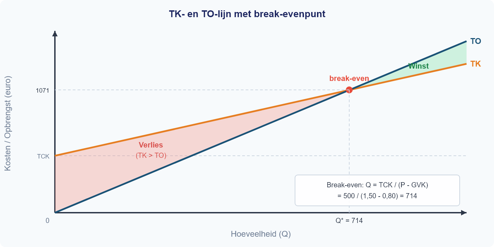

# §1.5.1 Actieve samenvatting

Hieronder vind je een beknopte samenvatting van alle theorie uit Hoofdstuk 1 t/m 4. Na elk blok staan meerkeuze-vragen waarmee je toetst of je de stof écht begrijpt. Lees het blok, beantwoord de vragen en controleer je antwoorden in het antwoordenblad.

---

## Blok 1: Schaarste, alternatieve kosten en rekenen (H1.1)

Schaarste ontstaat doordat je behoeften groter zijn dan je beschikbare middelen — je kunt niet alles tegelijk hebben en moet dus kiezen. Bij elke keuze horen **alternatieve kosten**: de opbrengst van het beste alternatief dat je opgeeft. Je berekent ze in drie stappen: (1) noem alle alternatieven, (2) bepaal de opbrengst van elk alternatief, (3) de alternatieve kosten zijn de opbrengst van het beste *niet-gekozen* alternatief.

Voor het rekenen gebruik je twee hulpmiddelen. De **procentuele verandering** bereken je met (nieuw − oud) / oud × 100%. Let op: je deelt altijd door de **oude** waarde. Het **indexcijfer** bereken je met waarde / basiswaarde × 100. Een verandering in *indexpunten* is niet hetzelfde als een verandering in *procenten* — voor het percentage deel je door het oude indexcijfer, niet door 100.

**Vraag 1**

> Het indexcijfer van de benzineprijs steeg van 120 naar 132. Lisa beweert: "De benzineprijs is met 12% gestegen." Wat klopt er?

**(A)** Lisa heeft gelijk: 132 − 120 = 12, dus 12%.

**(B)** Lisa heeft ongelijk: (132 − 120) / 120 × 100% = 10%.

**(C)** Lisa heeft ongelijk: (132 − 120) / 132 × 100% = 9,1%.

**(D)** Lisa heeft gelijk: 12 indexpunten is altijd 12%.

**Vraag 2**

> Tim kan na school werken bij de supermarkt (€35) of bijles geven (€45). Hij kiest voor bijles. Wat zijn de alternatieve kosten van deze keuze?

**(A)** €45, want dat is wat hij verdient.

**(B)** €80, want dat is de totale opbrengst van alle alternatieven.

**(C)** €35, want dat is de opbrengst van het beste niet-gekozen alternatief.

**(D)** €10, want dat is het verschil tussen bijles en de supermarkt.

**Vraag 3**

> De prijs van een fiets daalt van €500 naar €400. Een leerling berekent de procentuele verandering als (500 − 400) / 400 × 100% = 25%. Klopt dit?

**(A)** Ja, 25% daling is correct.

**(B)** Nee, de daling is (500 − 400) / 500 × 100% = 20%.

**(C)** Nee, de daling is (400 − 500) / 400 × 100% = −25%.

**(D)** Nee, de daling is (400 / 500) × 100 = 80 indexpunten.

---

## Blok 2: Vraag — betalingsbereidheid, vraaglijn en vraagfactoren (H1.2)

De **betalingsbereidheid** (BB) is het maximale bedrag dat een consument voor een extra eenheid wil betalen. De **individuele vraaglijn** loopt dalend: bij een hogere prijs koop je minder. Je koopt zolang BB ≥ P. Het **consumentensurplus** (CS) is het verschil tussen je betalingsbereidheid en de prijs die je betaalt — in de grafiek het driehoekige gebied boven de prijslijn en onder de vraaglijn.

Vijf factoren verschuiven de **hele** vraaglijn: inkomen, voorkeuren, prijs van substituten, prijs van complementen en het aantal vragers. Een verandering van de *eigen prijs* geeft een **beweging langs** de vraaglijn, geen verschuiving. De **collectieve vraaglijn** is de horizontale optelsom van alle individuele vraaglijnen.

**Vraag 4**

> De prijs van boter stijgt. Wat gebeurt er met de vraaglijn naar boter?

**(A)** De vraaglijn verschuift naar links, want consumenten willen minder boter.

**(B)** Er is een beweging langs de vraaglijn naar links-boven: bij hogere P daalt Qv.

**(C)** De vraaglijn verschuift naar rechts, want boter wordt schaarser.

**(D)** Er gebeurt niets met de vraaglijn; alleen de aanbodlijn verandert.

**Vraag 5**

> Koffie en thee zijn substituten. De prijs van koffie stijgt fors. Wat gebeurt er met de vraaglijn naar thee?

**(A)** De vraaglijn naar thee verschuift naar rechts, want consumenten stappen over op thee.

**(B)** Er is een beweging langs de vraaglijn naar thee, want de prijs van thee verandert niet.

**(C)** De vraaglijn naar thee verschuift naar links, want koffie en thee gaan samen.

**(D)** De vraaglijn naar thee blijft gelijk, want alleen de prijs van koffie verandert.

**Vraag 6**

> Twee consumenten hebben de volgende individuele vraag: Anna: Qv = 10 − 2P, Ben: Qv = 8 − P. Wat is de collectieve gevraagde hoeveelheid bij P = 3?

**(A)** Qv = 18 − 3P = 18 − 9 = 9.

**(B)** Qv = (10 − 6) + (8 − 3) = 4 + 5 = 9.

**(C)** Qv = (10 − 6) × (8 − 3) = 4 × 5 = 20.

**(D)** Qv = 10 + 8 − 2 × 3 = 12.

---

## Blok 3: Aanbod en kosten (H1.3)

De **aanbodlijn** loopt stijgend: bij hogere prijs bieden producenten meer aan. Vijf factoren verschuiven de hele aanbodlijn: inputprijzen, technologie, aantal aanbieders, verwachtingen en overheidsbeleid. Kosten bestaan uit **constante kosten** (CK, onafhankelijk van Q) en **variabele kosten** (VK, afhankelijk van Q). De totale kosten zijn TK = TCK + TVK.

De **gemiddelde kosten** bereken je door te delen: GTK = TK/Q, GVK = TVK/Q, GCK = TCK/Q. Het **spreidingseffect** houdt in dat GCK daalt naarmate je meer produceert — de vaste kosten worden over meer eenheden verdeeld. De **totale opbrengst** is TO = P × Q. **Winst** = TO − TK (let op: opbrengst is niet hetzelfde als winst!). Bij het **break-evenpunt** geldt TO = TK, ofwel Q = TCK / (P − GVK).

**Vraag 7**

> Een bakkerij heeft TCK = €500, GVK = €0,80 per brood en verkoopt brood voor €1,50.
>
> | Productie (Q) | TK | GTK |
> |---|---|---|
> | 200 | ? | ? |
> | 500 | ? | ? |
> | 1000 | ? | ? |
>
> Wat is GTK bij Q = 500?

**(A)** €0,80, want GTK = GVK als je genoeg produceert.

**(B)** €1,80, want GTK = GVK + GCK = 0,80 + 500/500 = 0,80 + 1,00 = 1,80.

**(C)** €1,50, want GTK = prijs bij break-even.

**(D)** €2,30, want GTK = (500 + 0,80) / 500.

**Vraag 8**

> Bij dezelfde bakkerij stijgt de productie van 200 naar 1000 broden. Wat gebeurt er met TK en GTK?

**(A)** TK stijgt en GTK stijgt ook, want meer produceren is altijd duurder per stuk.

**(B)** TK stijgt, maar GTK daalt door het spreidingseffect van de constante kosten.

**(C)** TK blijft gelijk en GTK daalt, want de constante kosten veranderen niet.

**(D)** TK en GTK dalen allebei, want de bakkerij wordt efficiënter.

**Vraag 9**

> Een bedrijf heeft TO = €10.000 en TK = €8.500. Een leerling schrijft: "De opbrengst is €1.500." Wat is hierop aan te merken?

**(A)** Niets, de berekening klopt.

**(B)** De leerling verwart opbrengst met winst: TO = €10.000 is de opbrengst, winst = TO − TK = €1.500.

**(C)** De opbrengst is €8.500, want opbrengst = kosten.

**(D)** De winst is €10.000 en de opbrengst is €1.500.

---

## Blok 4: Marktevenwicht en verschuivingen (H1.4 §1–2)

Het **marktevenwicht** vind je waar de gevraagde hoeveelheid gelijk is aan de aangeboden hoeveelheid: Qv = Qa. Je lost op naar de **evenwichtsprijs** (P\*) en vult die in om de **evenwichtshoeveelheid** (Q\*) te berekenen. Controleer altijd door P\* in beide vergelijkingen in te vullen. Bij P > P\* ontstaat een **aanbodoverschot** (Qa > Qv); bij P < P\* een **vraagoverschot** (Qv > Qa).

Een verschuiving van vraag of aanbod leidt tot een nieuw evenwicht. **Vuistregels:** aanbod naar rechts → P daalt, Q stijgt; vraag naar rechts → P stijgt, Q stijgt. Bij twee gelijktijdige verschuivingen is de richting van één variabele (P of Q) altijd ambigu — je kunt niet zeggen welke kant die opgaat zonder de grootte van de verschuivingen te kennen.

**Vraag 10**

> Op de schriftenmarkt geldt: Qv = −2P + 100 en Qa = 3P − 25. Wat zijn de evenwichtsprijs en -hoeveelheid?

**(A)** P\* = 15, Q\* = 70.

**(B)** P\* = 25, Q\* = 50.

**(C)** P\* = 20, Q\* = 60.

**(D)** P\* = 25, Q\* = 75.

**Vraag 11**

> Door nieuwe technologie verschuift de aanbodlijn op de schriftenmarkt naar rechts. Wat is het effect op het evenwicht?

**(A)** De evenwichtsprijs stijgt en de evenwichtshoeveelheid daalt.

**(B)** De evenwichtsprijs daalt en de evenwichtshoeveelheid stijgt.

**(C)** Zowel de evenwichtsprijs als de evenwichtshoeveelheid stijgen.

**(D)** De evenwichtsprijs daalt en de evenwichtshoeveelheid daalt.

**Vraag 12**

> De vraag naar fietsen verschuift naar rechts (meer vraag) en tegelijkertijd verschuift het aanbod naar rechts (meer aanbod). Welke uitspraak is correct?

**(A)** De evenwichtshoeveelheid stijgt zeker, maar het effect op de prijs is onzeker.

**(B)** Zowel prijs als hoeveelheid stijgen zeker.

**(C)** De evenwichtsprijs daalt zeker, maar het effect op de hoeveelheid is onzeker.

**(D)** Het effect op zowel prijs als hoeveelheid is onzeker.

---

## Blok 5: Marginale analyse en winstmaximalisatie (H1.4 §3–4)

De **marginale kosten** (MK) zijn de extra kosten van één extra eenheid: MK = ΔTK/ΔQ. De **marginale opbrengst** (MO) is de extra opbrengst van één extra eenheid: MO = ΔTO/ΔQ. Bij een **vaste prijs** (volkomen concurrentie) geldt MO = P. Bij een lineaire TK-functie (TK = a + bQ) is MK constant en gelijk aan b. Bij een kwadratische TK-functie (TK = a + bQ²) stijgt MK naarmate Q toeneemt.

Het **winstmaximum** bereik je bij MO = MK. Produceer zolang MO ≥ MK — elke extra eenheid levert dan meer op dan ze kost. Zodra MO < MK wordt, kost een extra eenheid meer dan ze oplevert en daalt je winst. "Meer produceren is altijd beter" klopt dus niet bij stijgende MK.

**Vraag 13**

> Een bedrijf heeft TK = 100 + 2Q². De productie stijgt van 10 naar 11 eenheden. Wat zijn de marginale kosten?

**(A)** MK = 2 × 11² − 2 × 10² = 242 − 200 = 42.

**(B)** MK = TK(11) / 11 = (100 + 242) / 11 = 31,1.

**(C)** MK = 2 × 2Q = 4 × 10 = 40.

**(D)** MK = ΔTK/ΔQ = (TK(11) − TK(10)) / 1 = (342 − 300) / 1 = 42.

**Vraag 14**

> Een producent verkoopt tegen een vaste prijs van €20 per stuk. Zijn MK stijgt: bij Q = 30 is MK = €15 en bij Q = 50 is MK = €25. Een leerling zegt: "Je moet altijd zoveel mogelijk produceren, want meer afzet = meer winst." Waarom klopt deze redenering niet?

**(A)** Omdat de prijs daalt bij meer productie.

**(B)** Omdat na Q = 30 de MK boven de MO komen en elke extra eenheid verlies oplevert, waardoor de totale winst daalt.

**(C)** Omdat de constante kosten stijgen bij meer productie.

**(D)** Omdat bij Q = 50 de totale opbrengst negatief wordt.
