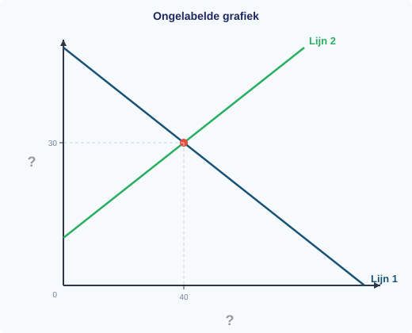

# §1.5.2 Examenvaardigheden

In deze paragraaf oefen je de vaardigheden die je nodig hebt om goed te scoren op de toets. Er komt geen nieuwe theorie aan bod — je leert **hoe** je toetsvragen correct beantwoordt. Lees bij elke oefening eerst de vaardigheidstip en maak dan de opgaven.

---

## Oefening 1 — Vaardigheid: een ongelabelde grafiek lezen

Bekijk de onderstaande grafiek. De grafiek bevat twee lijnen, maar er staan geen labels bij de assen en geen letters bij de lijnen. Eén van de lijnen heeft een gearceerd driehoekig vlak erboven (tussen de lijn en de bovenrand van de grafiek, tot aan het snijpunt).

> **Vaardigheidstip:** Op het examen krijg je soms een grafiek zonder labels. Je moet dan zelf herkennen welke lijn de vraaglijn is en welke de aanbodlijn. De sleutel: de vraaglijn loopt dalend, de aanbodlijn loopt stijgend.

**1** *(2p)* Welke lijn is de vraaglijn? Welke is de aanbodlijn? Leg uit hoe je dat kunt zien aan het verloop van de lijnen.

**2** *(1p)* Lees de evenwichtsprijs en de evenwichtshoeveelheid af uit de grafiek.

**3** *(2p)* Geef de juiste labels voor de assen. Welke conventie geldt in de economie voor de positie van P en Q? Waarom is dat anders dan in de wiskunde?

**4** *(2p)* Het gearceerde driehoekige vlak stelt een economisch begrip voor. Noem dit begrip en leg uit wat het betekent. Gebruik de termen betalingsbereidheid en marktprijs in je antwoord.

---

## Oefening 2 — Vaardigheid: gegevens uit een tabel halen en doorrekenen

Een bedrijf heeft constante kosten (TCK) van €600. De variabele kosten stijgen lineair met de productie. De verkoopprijs is €10 per stuk. In de tabel staan de kostengegevens bij verschillende productieniveaus.

| Q (stuks) | TCK (€) | TVK (€) | TK (€) |
|-----------|---------|---------|--------|
| 0         | 600     | 0       | 600    |
| 50        | 600     | 250     | 850    |
| 100       | 600     | 500     | 1.100  |
| 150       | 600     | 750     | 1.350  |
| 200       | 600     | 1.000   | 1.600  |

> **Vaardigheidstip:** Bij een 'bereken'-vraag met een tabel lees je eerst de juiste waarden af en schrijf je dan de formule op. Noteer altijd: formule → invullen → berekenen → antwoord met eenheid.

**5** *(2p)* Bereken de GVK. Leg uit hoe je dit kunt aflezen uit de tabel zonder te delen.

**6** *(2p)* Bereken de GTK bij Q = 100 en bij Q = 200.

**7** *(2p)* Leg uit waarom de GTK daalt als Q stijgt. Gebruik het begrip **spreidingseffect**.

**8** *(3p)* Bereken het break-evenpunt. Toon alle stappen.

**9** *(2p)* Bereken de winst bij Q = 200. Is het bedrijf winstgevend bij dit productieniveau?

---

## Oefening 3 — Vaardigheid: een 'bereken'-antwoord structureren

Op de markt voor pennen geldt Qv = −3P + 90 en Qa = 2P − 10. Twee leerlingen berekenen het marktevenwicht.

**Antwoord A (leerling 1):**

> "P* = 20, Q* = 30."

**Antwoord B (leerling 2):**

> "Stap 1: Qv = Qa → −3P + 90 = 2P − 10
> Stap 2: 90 + 10 = 2P + 3P → 100 = 5P → P* = 20
> Stap 3: Qv = −3 × 20 + 90 = 30
> Controle: Qa = 2 × 20 − 10 = 30 ✓
> Antwoord: P* = €20, Q* = 30 pennen."

> **Vaardigheidstip:** Bij het examen krijg je punten voor elke stap, niet alleen voor het eindantwoord. Schrijf altijd: vergelijking opstellen → oplossen → invullen → controleren → antwoord met eenheid.

**10** *(2p)* Welk antwoord scoort meer punten bij een examen? Waarom?

**11** *(2p)* Hoeveel punten verdient leerling 1 bij een 4-punts berekenopgave? En leerling 2?

**12** *(4p)* Schrijf zelf een volledig antwoord bij de volgende opgave: *"Op de markt voor USB-sticks geldt Qv = −P + 40 en Qa = 2P − 20. Bereken de evenwichtsprijs en de evenwichtshoeveelheid."*

---

## Oefening 4 — Vaardigheid: een 'leg uit'-antwoord structureren

Een krantenartikel meldt dat de prijs van katoen — een grondstof voor kleding — dit jaar met 35% is gestegen. Een leerling wordt gevraagd: *"Leg uit wat het effect is op de markt voor T-shirts."*

De leerling schrijft:

> "Als katoen duurder wordt, worden T-shirts ook duurder."

> **Vaardigheidstip:** Een 'leg uit'-antwoord heeft een **causale keten** nodig. Je noemt het gegeven, legt de tussenstappen uit en eindigt met een conclusie. Structuur: gegeven → schakel 1 → schakel 2 → conclusie.

**13** *(2p)* Is het antwoord van de leerling correct? Wat ontbreekt er?

**14** *(3p)* Schrijf zelf het volledige antwoord. Gebruik de structuur: gegeven → schakel 1 → schakel 2 → conclusie.

**15** *(2p)* Een medeleerling beweert: *"De vraaglijn van T-shirts verschuift naar links."* Is dit correct? Leg uit met het verschil tussen **beweging langs** en **verschuiving van** een lijn.

**16** *(2p)* Het indexcijfer van de katoenprijs was vorig jaar 140. Dit jaar is het 189. Een leerling zegt: *"De prijs is met 49% gestegen."* Klopt dit? Toon je berekening.

---

## Oefening 5 — Vaardigheid: meerstaps-berekening (evenwicht, verschuiving en marginale analyse)

Op de markt voor schriften geldt Qv = −2P + 100 en Qa = 3P − 25. Door hogere grondstofprijzen wordt de aanbodvergelijking: Qa' = 3P − 40.

Een producent op deze markt heeft TK = 200 + 4Q. Hij verkoopt tegen de evenwichtsprijs.

> **Vaardigheidstip:** Bij een opgave met een verschuiving bereken je eerst het oorspronkelijke evenwicht, dan het nieuwe. Vergelijk de twee en trek een conclusie. Bij MK en MO: vergelijk per eenheid of uitbreiden loont.

**17** *(4p)* Bereken het oorspronkelijke evenwicht. Toon alle stappen.

**18** *(4p)* Bereken het nieuwe evenwicht na de aanbodverschuiving. Toon alle stappen.

**19** *(2p)* Bereken de procentuele verandering van de evenwichtsprijs.

**20** *(2p)* Bij de oorspronkelijke evenwichtsprijs van €25: bereken de gevraagde en aangeboden hoeveelheid met de **nieuwe** aanbodvergelijking. Is er dan een vraagoverschot of een aanbodoverschot?

**21** *(2p)* Bereken de MK en MO van de producent bij de nieuwe evenwichtsprijs. Moet hij meer of minder produceren? Leg uit.

**22** *(2p)* Leg uit waarom de evenwichtsprijs is gestegen. Gebruik de begrippen **aanbodfactor** en **verschuiving** in je antwoord.
