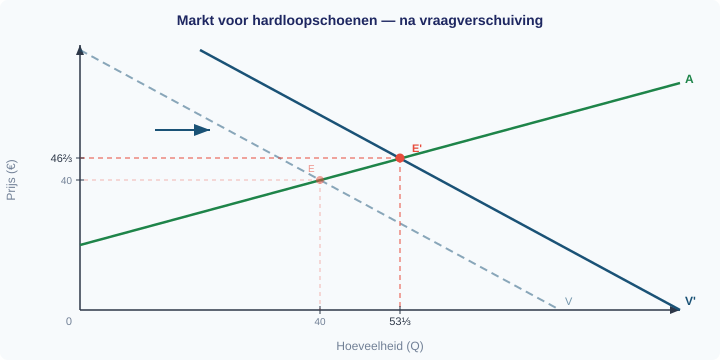

# §1.5.4 Proeftoets — Antwoordmodel

**Boek 1 — Economie VWO 4**
**Totaal:** 74 punten

---

## Opgave 1: Sportschool "FitForLife" (18 punten)

**1** *(2p)*

Twee voorbeelden van constante kosten van een sportschool:

- Huur van het pand (1 pt)
- Afschrijving van fitnessapparatuur (1 pt)

*Andere goede antwoorden: verzekeringspremies, salarissen van vast personeel, kosten van een alarm-/beveiligingssysteem.*

**2** *(4p)*

**Stap 1:** Formule: GTK = TK / Q (1 pt)

**Stap 2:** Bij Q = 200:
GTK = 4.000 / 200 = €20,00 per lid (1 pt)

**Stap 3:** Bij Q = 400:
GTK = 5.000 / 400 = €12,50 per lid (1 pt)

**Stap 4:** Uitleg spreidingseffect:
De GTK daalt naarmate het aantal leden toeneemt, omdat de constante kosten (€3.000) over steeds meer leden worden verdeeld. Dit heet het **spreidingseffect**: de gemiddelde constante kosten (GCK) dalen bij toenemende productie, waardoor ook de GTK daalt. (1 pt)

**3** *(4p)*

Het break-evenpunt is het punt waar TO = TK (geen winst, geen verlies).

**Stap 1:** Stel TO = TK op: (1 pt)
P × Q = TCK + TVK
15Q = 3.000 + 5Q

**Stap 2:** Los op naar Q: (1 pt)
15Q − 5Q = 3.000
10Q = 3.000
Q = 300

**Stap 3:** Controle: (1 pt)
- TO = 15 × 300 = €4.500
- TK = 3.000 + 5 × 300 = 3.000 + 1.500 = €4.500
- TO = TK ✓

**Antwoord:** Het break-evenpunt ligt bij **Q = 300 leden**. (1 pt)

*Alternatieve methode: Q = TCK / (P − GVK) = 3.000 / (15 − 5) = 3.000 / 10 = 300.*

**4** *(4p)*

**Winst bij P = €15 en Q = 400:**

**Stap 1:** TO = 15 × 400 = €6.000 (0,5 pt)

**Stap 2:** TK = 3.000 + 5 × 400 = €5.000 (0,5 pt)

**Stap 3:** Winst = TO − TK = 6.000 − 5.000 = **€1.000** (0,5 pt)

**Winst bij P = €12 en Q = 400:**

**Stap 4:** TO = 12 × 400 = €4.800 (0,5 pt)

**Stap 5:** TK = 3.000 + 5 × 400 = €5.000 (0,5 pt)

**Stap 6:** Winst = TO − TK = 4.800 − 5.000 = **−€200** (verlies) (0,5 pt)

**Beoordeling:**
De prijsverlaging is **niet verstandig** bij het huidige ledenaantal van 400. Bij €15 maakt FitForLife €1.000 winst, maar bij €12 maakt de sportschool €200 verlies. De prijsverlaging zou alleen verstandig zijn als het aantal leden zodanig toeneemt dat de totale opbrengst weer boven de totale kosten uitkomt. (1 pt)

*Om break-even te draaien bij P = €12: Q = 3.000 / (12 − 5) = 3.000 / 7 ≈ 429 leden.*

**5** *(4p)*

**Stap 1:** GCK = TCK / Q = 3.000 / 300 = **€10,00 per lid** (1 pt)

**Stap 2:** GVK = TVK / Q = (5 × 300) / 300 = 1.500 / 300 = **€5,00 per lid** (1 pt)

**Stap 3:** Controle GTK = GCK + GVK:
- GCK + GVK = 10 + 5 = €15 per lid
- Direct: GTK = TK / Q = 4.500 / 300 = €15 per lid ✓ (1 pt)

**Stap 4:** Uitleg:
De **GCK** daalt bij toenemende productie omdat de constante kosten (€3.000) over steeds meer leden worden verdeeld (spreidingseffect). De **GVK** blijft gelijk omdat de variabele kosten per lid (€5) niet veranderen met het aantal leden — elk extra lid kost exact hetzelfde. (1 pt)

---

## Opgave 2: De markt voor hardloopschoenen (24 punten)

**6** *(2p)*

- De evenwichtsprijs is **P* = €40** (1 pt)
- De evenwichtshoeveelheid is **Q* = 40** (1 pt)

**7** *(4p)*

**Stap 1:** Stel Qv = Qa: (1 pt)
−P + 80 = 2P − 40

**Stap 2:** Los op naar P: (1 pt)
80 + 40 = 2P + P
120 = 3P
P* = 40

**Stap 3:** Vul P* = 40 in een van de vergelijkingen in: (1 pt)
Q* = −40 + 80 = 40

**Stap 4:** Controleer in de andere vergelijking: (1 pt)
Qa = 2(40) − 40 = 80 − 40 = 40 ✓

**Antwoord:** Het evenwicht ligt bij P* = €40 en Q* = 40 stuks.

**8** *(4p)*

**Stap 1:** Stel Qv' = Qa: (1 pt)
−P + 100 = 2P − 40

**Stap 2:** Los op naar P: (1 pt)
100 + 40 = 2P + P
140 = 3P
P*' = 140/3 = 46⅔ ≈ €46,67

**Stap 3:** Vul P*' in: (1 pt)
Q*' = −46⅔ + 100 = 53⅓ ≈ 53,33

**Stap 4:** Controleer: (1 pt)
Qa = 2 × 46⅔ − 40 = 93⅓ − 40 = 53⅓ ✓

**Antwoord:** Het nieuwe evenwicht ligt bij P*' ≈ €46,67 en Q*' ≈ 53,33 stuks.

**9** *(2p)*

Dit is een **verschuiving van de vraaglijn** (naar rechts). (1 pt)

De vraagfactor die veranderd is, is **behoeften/voorkeuren** van consumenten: doordat een influencer hardlopen promoot, neemt de voorkeur voor hardloopschoenen toe. De prijs van hardloopschoenen zelf verandert niet — het is een externe factor die de hele vraaglijn verschuift. (1 pt)

**10** *(2p)*

**Stap 1:** Noteer oud en nieuw: (0,5 pt)
- Oud: Q* = 40
- Nieuw: Q*' = 53⅓

**Stap 2:** Bereken de procentuele verandering: (1 pt)
(53⅓ − 40) / 40 × 100% = 13⅓ / 40 × 100% = 33,3%

**Antwoord:** De evenwichtshoeveelheid stijgt met **33,3%**. (0,5 pt)

### Antwoordgrafiek bij opgave 2 (vraag 8)

De grafiek hieronder toont de oorspronkelijke vraaglijn (V, gestreept), de nieuwe vraaglijn (V'), de aanbodlijn (A), het oude evenwicht (E) en het nieuwe evenwicht (E').

**11** *(4p)*

**Stap 1:** Stel Qv = Qa': (1 pt)
−P + 80 = 2P − 60

**Stap 2:** Los op naar P: (1 pt)
80 + 60 = 2P + P
140 = 3P
P*'' = 140/3 ≈ €46,67

**Stap 3:** Vul in: (1 pt)
Q*'' = −46⅔ + 80 = 33⅓ ≈ 33,33 stuks

**Stap 4:** Controle in Qa': (1 pt)
Qa' = 2 × 46⅔ − 60 = 93⅓ − 60 = 33⅓ ✓

**Antwoord:** Het nieuwe evenwicht ligt bij P ≈ €46,67 en Q ≈ 33,33 stuks. De prijs stijgt en de hoeveelheid daalt — conform de vuistregel voor een aanbodverschuiving naar links.

**12** *(2p)*

De aanbodfactor die veranderd is, is de **prijs van inputs (grondstoffen)**. (1 pt)

Door de hogere grondstofprijzen stijgen de productiekosten per paar schoenen. Bij elke prijs willen producenten nu minder aanbieden, of ze willen alleen aanbieden bij een hogere prijs om dezelfde marge te behalen. De aanbodlijn verschuift daardoor naar **links (omhoog)**. (1 pt)

**13** *(4p)*

**Stap 1:** Bereken Qv en Qa bij P = 60: (1 pt)
- Qv = −60 + 80 = 20
- Qa = 2 × 60 − 40 = 80

**Stap 2:** Vergelijk: (1 pt)
Qa (80) > Qv (20), dus bij deze prijs willen producenten meer aanbieden dan consumenten willen kopen.

**Stap 3:** Benoem het overschot: (1 pt)
Er ontstaat een **aanbodoverschot** (niet een vraagoverschot), want de minimumprijs €60 ligt **boven** de evenwichtsprijs €40.

**Stap 4:** Bereken de omvang: (1 pt)
Aanbodoverschot = Qa − Qv = 80 − 20 = **60 paar schoenen**.

---

## Opgave 3: Snoepfabriek "ZoetGenoeg" (12 punten)

**14** *(2p)*

- **Marginale kosten (MK):** de extra kosten van het produceren van één extra eenheid product. MK = ΔTK / ΔQ. (1 pt)
- **Marginale opbrengsten (MO):** de extra opbrengst van het verkopen van één extra eenheid product. MO = ΔTO / ΔQ. (1 pt)

**15** *(2p)*

Tussen Q = 15 en Q = 20 zijn de marginale kosten MK = €35 per stuk, terwijl de marginale opbrengsten MO = €30 per stuk. (1 pt)

Omdat MK > MO bij de laatste 5 eenheden, kosten deze extra eenheden meer dan ze opleveren. Elke extra zak kost €35 maar brengt slechts €30 op. Daardoor daalt de totale winst van €125 naar €100. (1 pt)

**16** *(2p)*

De winst is maximaal bij **Q = 15**. (1 pt)

Dit kun je aflezen doordat bij Q = 15 de MK (€25) nog lager is dan de MO (€30), dus de laatste eenheden leveren nog winst op. Bij Q = 20 is de MK (€35) hoger dan de MO (€30), dus daar kosten extra eenheden meer dan ze opleveren. De optimale hoeveelheid ligt dus waar MK de MO het dichtst nadert zonder te overschrijden: bij Q = 15 (of preciezer: waar MO = MK). (1 pt)

**17** *(4p)*

**Stap 1:** Stel de winstmaximalisatieregel op: (1 pt)
MO = MK

**Stap 2:** Bepaal MO en MK: (1 pt)
- MO = P = €30 (bij een vaste prijs is MO gelijk aan de prijs)
- MK ≈ 2Q (afgeleide van TK = 100 + Q²)

**Stap 3:** Los op: (1 pt)
30 = 2Q
Q = 15

**Stap 4:** Controleer de winst: (1 pt)
- TO = 30 × 15 = €450
- TK = 100 + 15² = 100 + 225 = €325
- Winst = 450 − 325 = **€125**

Dit komt overeen met de tabel. ✓

**18** *(2p)*

Bij TK = 100 + 2Q² geldt MK = ΔTK/ΔQ ≈ **4Q**. De MK is dus **stijgend** (niet constant): elke volgende eenheid kost meer dan de vorige. (1 pt)

Vergeleken met de oorspronkelijke MK ≈ 2Q zijn de marginale kosten nu tweemaal zo hoog voor elke Q, wat betekent dat de optimale productieomvang (bij dezelfde MO = €30) lager zou uitkomen: 30 = 4Q → Q = 7,5 stuks. (1 pt)

---

## Opgave 4: Krantenbericht over de benzineprijs (12 punten)

**19** *(2p)*

**Stap 1:** Noteer oud en nieuw: (0,5 pt)
- Oud: €1,80
- Nieuw: €2,02

**Stap 2:** Bereken de procentuele verandering: (1 pt)
(2,02 − 1,80) / 1,80 × 100% = 0,22 / 1,80 × 100% = 12,2%

**Antwoord:** De procentuele stijging is 12,2%. Afgerond op hele procenten is dit 12%, dus de bewering in het krantenbericht **klopt** (bij afronding). (0,5 pt)

**20** *(2p)*

Dit is een **beweging langs de vraaglijn**, niet een verschuiving. (1 pt)

De prijs van benzine zelf is gestegen (gegeven). Volgens de wet van de vraag kopen consumenten bij een hogere prijs minder. De vraaglijn zelf verschuift niet — consumenten bewegen langs dezelfde vraaglijn naar een punt met een hogere prijs en een lagere gevraagde hoeveelheid. (1 pt)

**21** *(2p)*

Biodiesel is een **substituut** voor benzine. Doordat de productiekosten van biodiesel dalen, wordt biodiesel goedkoper. (0,5 pt)

De relevante **vraagfactor** is de *prijs van substituten*. (0,5 pt)

Doordat het substituut (biodiesel) goedkoper wordt, stappen meer automobilisten over op biodiesel. De vraag naar benzine neemt af. Dit is een **verschuiving van de vraaglijn** naar benzine naar links: bij elke prijs wordt minder benzine gevraagd. (1 pt)

**22** *(2p)*

De vier stappen van economisch denken zijn: (1 pt voor de stappen)

1. **Benoem alternatieven:** benzine tanken of biodiesel tanken.
2. **Bereken opbrengsten:** vergelijk per alternatief de kosten, rijmogelijkheden en eventuele besparing.
3. **Rangschik en bepaal alternatieve kosten:** wie benzine kiest, geeft de besparing van biodiesel op; wie biodiesel kiest, geeft het voordeel van benzine op.
4. **Bereken nettowaarde:** beoordeel of de opbrengst van de gekozen brandstof groter is dan de alternatieve kosten. Steeds meer automobilisten kiezen biodiesel als de nettowaarde daarvan hoger wordt door lagere biodieselkosten. (1 pt voor de toepassing)

**23** *(4p)*

**Stap 1:** Uitleg van de fout: (2 pt)
Het verschil 120 − 108 = 12 is een verschil in **indexpunten**, niet in procenten. Indexpunten en procenten zijn alleen gelijk als je rekent vanaf het **basisjaar** (indexcijfer 100). Hier is het basisjaar 2023 (100); voor een procentuele verandering van 2024 naar 2025 moet je delen door het indexcijfer van **2024**, niet door 100.

**Stap 2:** Juiste berekening: (1,5 pt)
% verandering = (nieuw − oud) / oud × 100% = (120 − 108) / 108 × 100% = 12 / 108 × 100% ≈ **11,1%**

**Stap 3:** Conclusie: (0,5 pt)
De juiste procentuele stijging tussen 2024 en 2025 is dus ongeveer **11,1%**, niet 12%. De klasgenoot verwart indexpunten met procenten.

---

## Opgave 5: Betalingsbereidheid en consumentensurplus (8 punten)

**24** *(4p)*

**Stap 1:** Bepaal wie koopt: (1 pt)
Een consument koopt als BB ≥ P = €80. Dus:
- Anne (BB = 140): koopt ✓
- Bram (BB = 120): koopt ✓
- Carla (BB = 90): koopt ✓
- Daan (BB = 60): koopt niet (BB < P)

**Stap 2:** Consumentensurplus per koper (CS = BB − P): (1,5 pt)
- Anne: 140 − 80 = €60
- Bram: 120 − 80 = €40
- Carla: 90 − 80 = €10

**Stap 3:** Totaal consumentensurplus: (1 pt)
CS_totaal = 60 + 40 + 10 = **€110**

**Stap 4:** Antwoord: (0,5 pt)
Bij P = €80 kopen drie consumenten (Anne, Bram, Carla) en is het totale consumentensurplus €110.

**25** *(4p)*

**Stap 1:** Bepaal wie koopt bij P = €50: (1 pt)
Nu BB ≥ 50. Alle vier consumenten kopen (Daan ook, want 60 ≥ 50).

**Stap 2:** CS per koper: (1,5 pt)
- Anne: 140 − 50 = €90
- Bram: 120 − 50 = €70
- Carla: 90 − 50 = €40
- Daan: 60 − 50 = €10

**Stap 3:** Totaal en verandering: (1 pt)
CS_totaal = 90 + 70 + 40 + 10 = **€210**
Verandering = 210 − 110 = **+€100**

**Stap 4:** Uitleg: (0,5 pt)
Het consumentensurplus neemt toe omdat (1) bestaande kopers een hoger surplus krijgen op elke eenheid (prijsdaling van €30 × 3 bestaande kopers = €90) én (2) er een nieuwe koper bij komt (Daan levert extra surplus van €10).

---

## Puntentotaal

| Opgave | Punten |
|--------|--------|
| Opgave 1 | 18 |
| Opgave 2 | 24 |
| Opgave 3 | 12 |
| Opgave 4 | 12 |
| Opgave 5 | 8 |
| **Totaal** | **74** |

*Het cijfer wordt berekend over 74 punten.*
