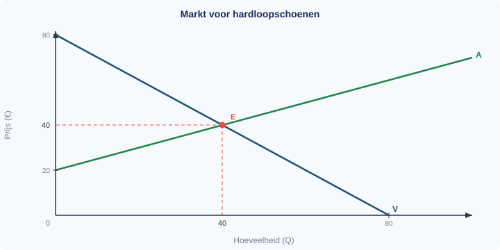

# §1.5.4 Proeftoets

**Boek 1 — Economie VWO 4**
**Tijd:** 120 minuten | **Totaal:** 74 punten | **Hulpmiddelen:** rekenmachine

> **Instructies**
> - Lees elke opgave zorgvuldig door voordat je begint.
> - Toon bij elke berekening alle tussenstappen.
> - Geef bij "leg uit"-vragen een redenering met economische begrippen.
> - Rond bedragen af op 2 decimalen, tenzij anders aangegeven.

---

## Opgave 1: Sportschool "FitForLife" (18 punten)

Sportschool FitForLife opent een nieuwe vestiging. De eigenaar heeft de volgende kostengegevens verzameld. De constante kosten bedragen €3.000 per maand (huur, afschrijving apparatuur, verzekeringen). De variabele kosten zijn €5 per lid per maand (schoonmaak, energie per lid, slijtage). De abonnementsprijs is €15 per lid per maand.

| Aantal leden (Q) | TCK (€) | TVK (€) | TK (€) | TO bij P = €15 (€) |
|-------------------|---------|---------|--------|---------------------|
| 0 | 3.000 | 0 | 3.000 | 0 |
| 100 | 3.000 | 500 | 3.500 | 1.500 |
| 200 | 3.000 | 1.000 | 4.000 | 3.000 |
| 300 | 3.000 | 1.500 | 4.500 | 4.500 |
| 400 | 3.000 | 2.000 | 5.000 | 6.000 |

---

**1** *(2p)* Noem twee voorbeelden van constante kosten van een sportschool.

**2** *(4p)* Bereken de gemiddelde totale kosten (GTK) bij Q = 200 en bij Q = 400. Leg uit waarom de GTK daalt naarmate het aantal leden toeneemt. Gebruik het begrip **spreidingseffect**.

**3** *(4p)* Bereken het break-evenpunt van FitForLife. Toon alle stappen.

**4** *(4p)* FitForLife heeft 400 leden. De eigenaar overweegt de prijs te verlagen van €15 naar €12 per maand om meer leden te trekken. Bereken de winst bij de oude prijs (€15) en bij de nieuwe prijs (€12), beide bij Q = 400. Beoordeel of de prijsverlaging verstandig is. Gebruik je berekeningen in je antwoord.

**5** *(4p)* Bereken bij Q = 300 de gemiddelde constante kosten (GCK), de gemiddelde variabele kosten (GVK) en toon met een berekening aan dat GTK = GCK + GVK. Leg vervolgens in één zin uit waarom de GCK daalt bij toenemende productie, maar de GVK gelijk blijft.

---

## Opgave 2: De markt voor hardloopschoenen (24 punten)

Op de markt voor hardloopschoenen gelden de volgende vergelijkingen:

- Vraagfunctie: **Qv = −P + 80**
- Aanbodfunctie: **Qa = 2P − 40**

In de grafiek hieronder zijn de vraaglijn (V) en de aanbodlijn (A) getekend. Het evenwichtspunt E is gemarkeerd.

---

**6** *(2p)* Lees de evenwichtsprijs en de evenwichtshoeveelheid af uit de grafiek.

**7** *(4p)* Verifieer het evenwicht door Qv = Qa op te lossen. Toon alle stappen en controleer je antwoord door P* in te vullen in beide vergelijkingen.

**8** *(4p)* Een populaire influencer promoot hardlopen op social media. Hierdoor neemt de vraag naar hardloopschoenen toe. De nieuwe vraagfunctie wordt: **Qv' = −P + 100**. Bereken het nieuwe evenwicht (P*' en Q*'). Toon alle stappen.

**9** *(2p)* Leg uit of de toename van de vraag door de influencer een **verschuiving van de vraaglijn** is of een **beweging langs de vraaglijn**. Noem de vraagfactor die veranderd is.

**10** *(2p)* Bereken de procentuele verandering van de evenwichtshoeveelheid (van het oude naar het nieuwe evenwicht).

**11** *(4p)* Los van de influencer-campagne stijgen de grondstofprijzen voor rubber. Hierdoor verschuift het aanbod. De nieuwe aanbodfunctie wordt: **Qa' = 2P − 60**. Bereken het nieuwe evenwicht bij de **oorspronkelijke** vraagfunctie (Qv = −P + 80). Toon alle stappen.

**12** *(2p)* Leg uit welke aanbodfactor hier is veranderd en waarom de aanbodlijn naar links (omhoog) verschuift.

**13** *(4p)* Neem nu weer de oorspronkelijke vraag- en aanbodfuncties (Qv = −P + 80 en Qa = 2P − 40). De overheid stelt een minimumprijs in van **P = €60**. Leg uit of er op deze markt een aanbodoverschot of een vraagoverschot ontstaat en bereken de omvang ervan.

---

## Opgave 3: Snoepfabriek "ZoetGenoeg" (12 punten)

Snoepfabriek ZoetGenoeg produceert zakken snoep. De totale kostenfunctie is:

**TK = 100 + Q²**

De verkoopprijs is vast: **P = €30 per zak**.

De onderstaande tabel toont de kosten, opbrengsten en winst bij verschillende productieniveaus. De marginale kosten (MK) en marginale opbrengsten (MO) zijn berekend per blok van 5 stuks.

| Q | TK = 100 + Q² (€) | TO = 30Q (€) | Winst (€) | MK (per 5 stuks, €) | MO (€) |
|---|-------------------|-------------|-----------|---------------------|--------|
| 0 | 100 | 0 | −100 | — | — |
| 5 | 125 | 150 | 25 | 5 | 30 |
| 10 | 200 | 300 | 100 | 15 | 30 |
| 15 | 325 | 450 | 125 | 25 | 30 |
| 20 | 500 | 600 | 100 | 35 | 30 |

---

**14** *(2p)* Noem de definitie van marginale kosten (MK) en marginale opbrengsten (MO).

**15** *(2p)* Leg uit met behulp van de tabel waarom de winst bij Q = 20 lager is dan bij Q = 15. Gebruik de begrippen MK en MO in je antwoord.

**16** *(2p)* Bij welke hoeveelheid is de winst maximaal? Leg uit hoe je dit kunt aflezen uit de kolommen MK en MO.

**17** *(4p)* Bereken de optimale productieomvang algebraïsch met de MO = MK-regel. Toon alle stappen. *Hint:* Bij TK = 100 + Q² geldt MK ≈ 2Q.

**18** *(2p)* Stel dat de totale kostenfunctie verandert naar **TK = 100 + 2Q²** (hogere variabele kosten per eenheid). Leg uit of de MK nu constant of stijgend wordt en geef de formule voor de MK.

---

## Opgave 4: Krantenbericht over de benzineprijs (12 punten)

Lees het onderstaande krantenbericht.

> **Benzineprijs stijgt fors**
>
> De benzineprijs is dit jaar met 12% gestegen, van €1,80 naar €2,02 per liter. Tankstations melden dat automobilisten minder tanken. "We zien een duidelijke daling van het aantal liters per tankbeurt", aldus een woordvoerder. Tegelijk zijn de kosten van biodiesel — een substituut voor benzine — gedaald door nieuwe productiemethoden. Steeds meer automobilisten stappen over op biodiesel.

---

**19** *(2p)* Bereken of de procentuele stijging van 12% klopt. Toon alle stappen.

**20** *(2p)* Automobilisten tanken minder benzine doordat de benzineprijs is gestegen. Leg uit of dit een **verschuiving van de vraaglijn** is of een **beweging langs de vraaglijn**.

**21** *(2p)* Biodiesel is een substituut voor benzine. De kosten van biodiesel zijn gedaald. Leg uit wat het effect is van de dalende biodieselkosten op de markt voor **benzine**. Gebruik het begrip **vraagfactor** in je antwoord.

**22** *(2p)* Noem de drie stappen van economisch denken en pas ze kort toe op de keuze van een automobilist tussen benzine en biodiesel.

**23** *(4p)* Het Centraal Bureau voor de Statistiek publiceert indexcijfers voor motorbrandstof. In 2023 was het indexcijfer 100, in 2024 was het 108, en in 2025 is het 120. Een klasgenoot beweert: *"De prijs is dus van 2024 tot 2025 met 12 procent gestegen, want 120 − 108 = 12."* Leg uit waarom deze redenering fout is en bereken de juiste procentuele stijging tussen 2024 en 2025.

---

## Opgave 5: Betalingsbereidheid en consumentensurplus (8 punten)

Op de markt voor een populair paar koptelefoons zijn vier consumenten actief. De betalingsbereidheden (BB) zijn:

| Consument | Betalingsbereidheid (€) |
|-----------|-------------------------|
| Anne      | 140                     |
| Bram      | 120                     |
| Carla     | 90                      |
| Daan      | 60                      |

De marktprijs is **P = €80**.

---

**24** *(4p)* Bepaal welke consumenten het product kopen en bereken het **totale consumentensurplus** bij P = €80. Toon alle stappen.

**25** *(4p)* De prijs daalt naar **P = €50** door meer concurrentie op de markt. Bereken het nieuwe totale consumentensurplus en de verandering ten opzichte van de situatie bij P = €80. Leg in één zin uit waarom het consumentensurplus toeneemt.
