<div class="book-cover">
<div class="book-cover-inner">
<h1 class="book-title">Grondslagen, vraag en aanbod</h1>
<p class="book-edition">1e editie · 2026</p>
</div>
</div>

<div style="break-before: page;"></div>

<div class="book-colofon">
<p class="book-section-title">Colofon</p>
<p><strong>Titel:</strong> Grondslagen, vraag en aanbod</p>
<p><strong>Editie:</strong> 1e editie, 2026</p>
<p><strong>Licentie:</strong> MIT License</p>
<p class="book-colofon-note">Antwoorden en interactieve oefeningen vind je op de begeleidende website.</p>
</div>

<div style="break-before: page;"></div>

<div class="book-voorwoord">
<h1 id="voorwoord">Voorwoord</h1>
<p>Elke dag neem je economische beslissingen. Koop je vandaag een
broodje kaas of geef je je geld uit aan iets anders? Ga je vanavond
werken of ga je leren voor je toets? Achter al deze keuzes zit hetzelfde
kernidee: wat je aan het ene besteedt, kun je niet meer aan het andere
besteden. Dat is <strong>schaarste</strong>, en dat is waar economie
over gaat.</p>
<p>In dit boek leer je hoe economen die keuzes bestuderen. Je begint met
de basisgereedschappen — percentages, grafieken en tabellen — die je
nodig hebt om door de rest van je VWO-carrière heen te komen. Daarna
duik je de markt op: hoe ontstaat de prijs van een product? Waarom
verschuift een vraaglijn? Wat gebeurt er als aanbod en vraag elkaar
ontmoeten? Aan het eind van het boek kun je niet alleen een
marktevenwicht uitrekenen en tekenen, maar begrijp je ook waarom
bedrijven precies daar produceren waar marginale opbrengst en marginale
kosten elkaar raken.</p>
<h2 id="hoe-is-dit-boek-opgebouwd">Hoe is dit boek opgebouwd?</h2>
<p>Het boek bestaat uit <strong>vijf hoofdstukken</strong>. Elk
theoriehoofdstuk heeft drie of vier paragrafen met theorie en
oefeningen, en eindigt met een consolidatiehoofdstuk waarin je alles bij
elkaar brengt in grotere, examenachtige opgaven. Het laatste hoofdstuk
is bedoeld voor toetsvoorbereiding: een actieve samenvatting,
examenvaardigheden trainen, een integratieoefening en een
proeftoets.</p>
<p>Elke paragraaf begint met een <strong>doeloefening</strong>: precies
de oefening die je aan het eind van die les moet kunnen maken. Zo weet
je altijd waar je naartoe werkt.</p>
<h2 id="waar-vind-je-de-antwoorden">Waar vind je de antwoorden?</h2>
<p>De antwoorden en extra interactieve oefeningen staan op de
begeleidende website, niet in dit boek. Daar vind je ook kennisquizzen,
uitlegvideo’s en oefenspellen die je helpen om de stof actief te
verwerken.</p>
<h2 id="succes">Succes</h2>
<p>Economie is een prachtig vak omdat het over échte keuzes gaat — die
van jou, van bedrijven en van overheden. Neem de tijd om de theorie te
begrijpen, oefen totdat je de doeloefeningen zelfstandig kunt maken, en
vraag om hulp zodra iets niet klopt. Veel plezier met dit eerste
boek.</p>

</div>

<div style="break-before: page;"></div>

<div class="book-toc">
<h1>Inhoudsopgave</h1>
<table class="toc-table">
<tbody>
<tr class="toc-chapter"><td class="toc-nr">Hoofdstuk 1.1</td><td class="toc-title">Economisch denken en rekenen</td></tr>
<tr class="toc-paragraph"><td class="toc-nr">§1.1.1</td><td class="toc-title">Schaarste en economisch denken</td></tr>
<tr class="toc-paragraph"><td class="toc-nr">§1.1.2</td><td class="toc-title">Percentages en indexcijfers</td></tr>
<tr class="toc-paragraph"><td class="toc-nr">§1.1.3</td><td class="toc-title">Grafieken en tabellen</td></tr>
<tr class="toc-paragraph"><td class="toc-nr">§1.1.4</td><td class="toc-title">Gemengde opgaven</td></tr>
<tr class="toc-chapter"><td class="toc-nr">Hoofdstuk 1.2</td><td class="toc-title">Vraag</td></tr>
<tr class="toc-paragraph"><td class="toc-nr">§1.2.1</td><td class="toc-title">Individuele vraag</td></tr>
<tr class="toc-paragraph"><td class="toc-nr">§1.2.2</td><td class="toc-title">Vraagfactoren</td></tr>
<tr class="toc-paragraph"><td class="toc-nr">§1.2.3</td><td class="toc-title">Van individuele naar collectieve vraag</td></tr>
<tr class="toc-paragraph"><td class="toc-nr">§1.2.4</td><td class="toc-title">Gemengde opgaven</td></tr>
<tr class="toc-chapter"><td class="toc-nr">Hoofdstuk 1.3</td><td class="toc-title">Aanbod en kosten</td></tr>
<tr class="toc-paragraph"><td class="toc-nr">§1.3.1</td><td class="toc-title">Aanbod</td></tr>
<tr class="toc-paragraph"><td class="toc-nr">§1.3.2</td><td class="toc-title">Kostenstructuren</td></tr>
<tr class="toc-paragraph"><td class="toc-nr">§1.3.3</td><td class="toc-title">Opbrengsten</td></tr>
<tr class="toc-paragraph"><td class="toc-nr">§1.3.4</td><td class="toc-title">Gemengde opgaven</td></tr>
<tr class="toc-chapter"><td class="toc-nr">Hoofdstuk 1.4</td><td class="toc-title">Marktevenwicht en marginale analyse</td></tr>
<tr class="toc-paragraph"><td class="toc-nr">§1.4.1</td><td class="toc-title">Marktevenwicht</td></tr>
<tr class="toc-paragraph"><td class="toc-nr">§1.4.2</td><td class="toc-title">Verschuivingen en nieuw evenwicht</td></tr>
<tr class="toc-paragraph"><td class="toc-nr">§1.4.3</td><td class="toc-title">Marginale kosten en marginale opbrengsten</td></tr>
<tr class="toc-paragraph"><td class="toc-nr">§1.4.4</td><td class="toc-title">Winstmaximalisatie</td></tr>
<tr class="toc-paragraph"><td class="toc-nr">§1.4.5</td><td class="toc-title">Gemengde opgaven</td></tr>
<tr class="toc-chapter"><td class="toc-nr">Hoofdstuk 1.5</td><td class="toc-title">Toetsvoorbereiding</td></tr>
<tr class="toc-paragraph"><td class="toc-nr">§1.5.1</td><td class="toc-title">Actieve samenvatting</td></tr>
<tr class="toc-paragraph"><td class="toc-nr">§1.5.2</td><td class="toc-title">Examenvaardigheden</td></tr>
<tr class="toc-paragraph"><td class="toc-nr">§1.5.3</td><td class="toc-title">Integratieoefening</td></tr>
<tr class="toc-paragraph"><td class="toc-nr">§1.5.4</td><td class="toc-title">Proeftoets</td></tr>
</tbody></table></div>

<!-- BOOK-CONTENT-START -->

<div style="break-before: page;"></div>

<div class="chapter-front">

<h1>Hoofdstuk 1 — Economisch denken en rekenen</h1>

<h2>Inhoud</h2>

<table>
<thead><tr><th>§</th><th>Onderwerp</th></tr></thead>
<tbody>
<tr><td>1.1.1</td><td>Schaarste en economisch denken</td></tr>
<tr><td>1.1.2</td><td>Percentages en indexcijfers</td></tr>
<tr><td>1.1.3</td><td>Grafieken en tabellen</td></tr>
<tr><td>1.1.4</td><td>Gemengde opgaven</td></tr>
</tbody>
</table>

<h2>Leerdoelen</h2>

<p>Na dit hoofdstuk kun je:</p>

<ul>
<li>Schaarste definiëren als het kernprobleem van de economie</li>
<li>Uitleggen dat elke keuze alternatieve kosten heeft</li>
<li>Alternatieve kosten berekenen in eenvoudige scenario's</li>
<li>Trade-offs herkennen in alledaagse beslissingen</li>
<li>Procentuele veranderingen berekenen met de formule (nieuw − oud) / oud × 100%</li>
<li>Indexcijfers berekenen en interpreteren</li>
<li>Het verschil uitleggen tussen indexpunten en procentuele veranderingen</li>
<li>Waarden aflezen uit grafieken en tabellen</li>
<li>Een grafiek tekenen van tabeldata met de juiste assen</li>
<li>Interpoleren tussen datapunten</li>
<li>Beweringen over data kritisch beoordelen</li>
</ul>

<h2>Waarom kun je niet alles hebben?</h2>

<p>Elke dag maak je keuzes: ga je naar de bioscoop of koop je een nieuw boek? Besteedt de overheid haar budget aan wegen of aan onderwijs? In dit hoofdstuk leer je dat achter elke keuze schaarste schuilgaat — en dat economen precies kunnen uitrekenen wat een keuze je kost. Je leert rekenen met percentages en indexcijfers, en je leert gegevens presenteren in grafieken en tabellen. Deze vaardigheden vormen de basis voor alles wat in de volgende hoofdstukken komt.</p>

</div>


<div style="break-before: page;"></div>

# 1.1.1 Schaarste en economisch denken

## Waarom kun je niet alles hebben?

Stel je voor: het is zaterdag en je hebt €20 gekregen. Je wilt naar de bioscoop (€12), maar je wilt ook een nieuw boek kopen (€15). Helaas kun je niet allebei — je geld is beperkt. Je móét kiezen. Welke optie kies je? En wat kost die keuze je eigenlijk?

Dit dagelijkse probleem raakt de kern van economie. Mensen willen altijd meer dan er beschikbaar is. Tijd, geld, grondstoffen — alles is beperkt. Economen noemen dit **schaarste**, en het is het vertrekpunt van alles wat je in dit vak leert.

---

## Theorie

### Schaarste: het basisprobleem

> **Definitie: Schaarste**
> Er is sprake van schaarste wanneer de behoeften (wensen) van mensen groter zijn dan de beschikbare middelen. Daardoor moeten er keuzes worden gemaakt.

Schaarste betekent niet dat iets zeldzaam is. Water is niet zeldzaam, maar als er maar één flesje over is op een warme dag en drie mensen dorst hebben, is er schaarste. Het gaat om de verhouding: zijn er meer wensen dan middelen?

Schaarste geldt voor iedereen:

| Wie? | Beperkt middel | Keuzeprobleem |
|------|---------------|---------------|
| Scholier | Geld (€20) | Bioscoop óf boek? |
| Boer | Land (10 hectare) | Tarwe óf maïs verbouwen? |
| Overheid | Budget | Meer wegen óf meer onderwijs? |

Figuur 1 laat zien hoe schaarste werkt: behoeften zijn onbegrensd, maar middelen zijn beperkt — daarom moet je kiezen.


---

### Alternatieve kosten: de prijs van je keuze

Elke keuze heeft een keerzijde. Als je kiest voor de bioscoop (€12), dan kun je dat geld niet meer aan het boek besteden. Het boek is wat je opgeeft — dat zijn je **alternatieve kosten**.

> **Definitie: Alternatieve kosten**
> De opbrengst (of waarde) van het beste alternatief dat je opgeeft wanneer je een keuze maakt.

Let op: alternatieve kosten zijn niet hetzelfde als de prijs die je betaalt. Je betaalt €12 voor de bioscoop, maar je alternatieve kosten zijn de waarde van het boek dat je nu niet kunt kopen.

Terug naar de scholier:
- **Gekozen:** bioscoop (waarde voor jou: plezier van de film)
- **Niet gekozen:** boek (waarde: €15 aan leesplezier)
- **Alternatieve kosten:** het leesplezier van het boek

Figuur 2 vergelijkt twee alternatieven en laat zien hoe je de alternatieve kosten bepaalt.

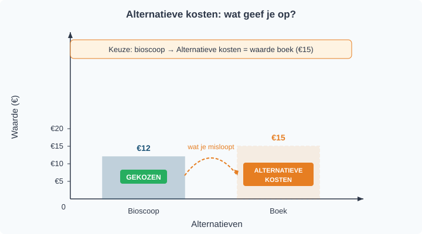

---

### Economisch denken: kiezen bij schaarste

Economie draait om het maken van keuzes bij schaarste. Economen analyseren die keuzes systematisch:

1. **Welke alternatieven zijn er?** — Welke opties heb je?
2. **Wat levert elk alternatief op?** — Wat is de opbrengst of waarde?
3. **Wat geef je op?** — Wat zijn de alternatieve kosten?

Dit noemen we **economisch denken**: je weegt de voor- en nadelen van elke optie tegen elkaar af. Een keuze is economisch verstandig als de opbrengst van het gekozen alternatief groter is dan de alternatieve kosten.

Neem de boer uit de openingstabel. Hij heeft 10 hectare land en twee opties:

| Optie | Opbrengst per hectare | Totale opbrengst (10 ha) |
|-------|----------------------|--------------------------|
| Tarwe | €500 | €5.000 |
| Maïs | €350 | €3.500 |

Als hij kiest voor tarwe, zijn zijn alternatieve kosten de opbrengst van maïs: €3.500. De winst van zijn keuze ten opzichte van het alternatief is €5.000 − €3.500 = €1.500.

Dit patroon — alternatieven vergelijken en de kosten van je keuze berekenen — is de kern van economisch denken. Het helpt je om betere beslissingen te nemen, of je nu een scholier bent die €20 uitgeeft of een boer die zijn land indeelt.

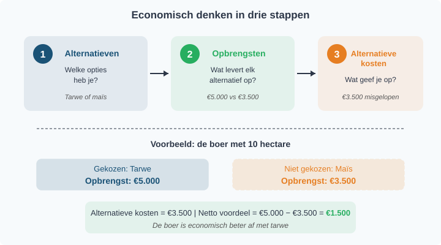

---

## Uitgewerkt voorbeeld

> **De boer en zijn land**
>
> Een boer heeft 10 hectare land. Hij kan tarwe verbouwen (winst €500 per hectare) of maïs (winst €350 per hectare). Hij besluit al zijn land voor tarwe te gebruiken.

**Procedure — Alternatieve kosten berekenen:**

| Stap | Vraag | Antwoord |
|------|-------|----------|
| 1 | Welke alternatieven zijn er? | Tarwe of maïs verbouwen |
| 2 | Wat is de opbrengst van elk alternatief? | Tarwe: 10 × €500 = €5.000 · Maïs: 10 × €350 = €3.500 |
| 3 | Je kiest tarwe → alternatieve kosten = opbrengst van het beste niet-gekozen alternatief | Alternatieve kosten = €3.500 (de maïsopbrengst die hij misloopt) |


---

## Samenvatting

> **Samenvatting §1.1.1**
> - **Schaarste** ontstaat wanneer behoeften groter zijn dan de beschikbare middelen — daardoor moeten er keuzes worden gemaakt.
> - Elke keuze heeft **alternatieve kosten**: de opbrengst van het beste alternatief dat je opgeeft.
> - **Economisch denken** betekent systematisch alternatieven vergelijken: (1) welke opties zijn er? (2) wat levert elk op? (3) wat geef je op?
> - Alternatieve kosten zijn niet hetzelfde als de prijs die je betaalt — het gaat om wat je *misloopt*.
> - Schaarste geldt voor iedereen: consumenten, producenten en de overheid.

> **💡 Vastgelopen op een opgave?**
> Op de website vind je bij elke opgave een **begeleide inoefening**: stap voor stap krijg je extra hints en tussenstappen. Klik op de opgave om de begeleiding te starten.

---

## Opgaven

### Startoefeningen

**Opgave 1** *(lees het diagram — zie figuur 4)*

In figuur 4 zie je de winst per hectare van drie gewassen die een boer kan verbouwen.


a) Welk gewas levert de hoogste winst per hectare op? Lees dit af uit het diagram.

b) De boer heeft 8 hectare en kiest voor zonnebloemen. Bereken zijn totale winst.

c) Wat zijn de alternatieve kosten van zijn keuze? Gebruik de procedure uit het uitgewerkt voorbeeld.


**Opgave 2** *(herken schaarste)*

Geef bij elk voorbeeld aan of er sprake is van schaarste. Leg telkens uit waarom wel of niet.

a) Een klas van 30 leerlingen wil computeren, maar er zijn maar 20 computers.

b) In een supermarkt liggen 500 pakken melk en er komen 100 klanten.

c) Een student heeft 4 uur vrije tijd en wil drie dingen doen: studeren (2 uur), sporten (2 uur) en vrienden zien (2 uur).

---

### Verdiepende opgaven

**Opgave 3** *(meerdere alternatieven)*

Eva heeft een vrije middag (4 uur). Ze kan kiezen uit drie activiteiten:

| Activiteit | Waarde voor Eva |
|------------|----------------|
| Bijles geven | €40 verdienen |
| Studeren | Beter cijfer (waarde: €30) |
| Film kijken | Ontspanning (waarde: €15) |

Ze kan maar één activiteit kiezen (elke activiteit duurt 4 uur).

a) Eva kiest voor bijles geven. Wat zijn haar alternatieve kosten? Leg uit waarom je niet alle niet-gekozen alternatieven optelt.

b) Stel dat Eva kiest voor studeren. Wat zijn dan haar alternatieve kosten?

c) Bij welke keuze zijn de alternatieve kosten het hoogst? Leg uit.


**Opgave 4** *(trade-off met verdeling)*

Een boer heeft 10 hectare land. Hij kan tarwe verbouwen (winst €500 per hectare) of maïs (winst €350 per hectare). Zijn buurvrouw heeft ook 10 hectare. Zij verdeelt haar land: 6 hectare tarwe en 4 hectare maïs.

a) Bereken de totale winst van de boer.

b) Bereken de alternatieve kosten van de boer.

c) Bereken de totale winst van de buurvrouw.

d) Heeft de buurvrouw een betere keuze gemaakt dan de boer? Leg uit met behulp van het begrip schaarste.

---

### Denkertje *(bonusopgave)*

**Opgave 5**

Soms hoor je mensen zeggen: "De beste dingen in het leven zijn gratis." Denk aan zonlicht, frisse lucht of een wandeling in het park.

a) Leg uit waarom een econoom het niet eens is met deze uitspraak. Gebruik het begrip alternatieve kosten.

b) Geef een voorbeeld van iets dat écht geen alternatieve kosten heeft. Is dat mogelijk? Beredeneer je antwoord.


<div style="break-before: page;"></div>

# 1.1.2 Percentages en indexcijfers

## Hoeveel duurder is het geworden?

Sanne heeft haar oog laten vallen op een nieuwe smartphone. Vorig jaar kostte het model €600. Nu staat hij in de winkel voor €648. "Het is maar €48 meer," zegt ze tegen haar vader. "Dat valt toch mee?" Haar vader reageert: "Dat is 8% duurder! Stel je voor dat mijn salaris ook zo snel steeg…"

Wie heeft er gelijk? Allebei. Maar het verschil in perspectief is precies de reden waarom economen liever met **percentages** werken dan met absolute bedragen. €48 extra op een smartphone van €600 is heel anders dan €48 extra op een brood van €3. Met percentages maak je veranderingen vergelijkbaar — ongeacht het startbedrag.

---

## Theorie

### Procentuele verandering

Als een prijs, loon of productie verandert, willen economen weten: *hoe groot is die verandering ten opzichte van het oorspronkelijke niveau?* Dat druk je uit als een **procentuele verandering**.

> **Definitie: Procentuele verandering**
> De verandering van een waarde uitgedrukt als percentage van de oorspronkelijke (oude) waarde.

De formule is:

> **Formule**
> ```
> Procentuele verandering = (nieuw − oud) / oud × 100%
> ```

Laten we dit stap voor stap toepassen op het voorbeeld van Sanne's smartphone.

> **Procedure: Procentuele verandering berekenen**
>
> 1. Noteer de oude waarde en de nieuwe waarde
> 2. Bereken: (nieuw − oud) / oud × 100%
> 3. Positief = stijging, negatief = daling

**Voorbeeld:** De smartphone steeg van €600 naar €648.

- Stap 1: Oud = €600, Nieuw = €648
- Stap 2: (648 − 600) / 600 × 100% = 48 / 600 × 100% = **8%**
- Stap 3: Positief → het is een prijsstijging van 8%.

Figuur 1 laat het verschil zien tussen de oude en de nieuwe prijs. De oranje markering toont de stijging van €48 — dat is 8% van de oude prijs.


> **⚠️ Let op — veelgemaakte fout**
> Deel altijd door de **oude** waarde, niet door de nieuwe. Als een prijs stijgt van €200 naar €250, is de stijging (250 − 200) / **200** × 100% = 25%. Niet: (250 − 200) / 250 × 100% = 20%. Het verschil lijkt klein, maar levert bij examens puntenaftrek op.

---

### Indexcijfers

Soms wil je niet één verandering bekijken, maar een reeks veranderingen door de tijd. Hoeveel duurder is het leven geworden ten opzichte van vijf jaar geleden? Dan gebruiken economen **indexcijfers**.

> **Definitie: Indexcijfer**
> Een verhoudingsgetal dat de waarde in een bepaald jaar uitdrukt ten opzichte van een basisjaar, waarbij het basisjaar de waarde 100 krijgt.

Het idee is simpel: je kiest één jaar als startpunt (het **basisjaar**) en geeft dat de waarde 100. Alle andere jaren druk je uit ten opzichte van dat basisjaar.

> **Formule**
> ```
> Indexcijfer = (waarde in jaar X / waarde in basisjaar) × 100
> ```

> **Procedure: Indexcijfer berekenen**
>
> 1. Bepaal het basisjaar (index = 100)
> 2. Bereken: (waarde / basiswaarde) × 100
> 3. Verandering in procenten: (nieuw indexcijfer − oud indexcijfer) / oud indexcijfer × 100%
> → Let op: indexpunten ≠ procenten (klassieke valkuil)

**Voorbeeld:** Een standaard boodschappenmandje kost in 2021 €120. In 2023 kost het €150. Het basisjaar is 2021.

| Jaar | Prijs mandje | Berekening | Indexcijfer |
|------|-------------|------------|-------------|
| 2021 (basis) | €120 | 120 / 120 × 100 | 100 |
| 2023 | €150 | 150 / 120 × 100 | 125 |

Het indexcijfer 125 in 2023 betekent: de prijs is 25% hoger dan in het basisjaar. De prijzen zijn in twee jaar met 25% gestegen.

Figuur 2 toont hoe indexcijfers door de tijd bewegen. Elk punt geeft de waarde weer ten opzichte van het basisjaar 2021 (= 100).


---

### De valkuil: indexpunten vs. procenten

Dit is de meest gemaakte fout bij indexcijfers — en een favoriet op examens.

Stel: het indexcijfer stijgt van 125 naar 135. Een leerling zegt: "Het indexcijfer is met 10 gestegen, dus de prijzen zijn met 10% gestegen." **Dit klopt niet.**

De 10 punten verschil zijn **indexpunten**, geen procenten. Om de procentuele verandering te berekenen, moet je de indexpunten delen door het **oude** indexcijfer:

> **Formule**
> ```
> Procentuele verandering = (nieuw indexcijfer − oud indexcijfer) / oud indexcijfer × 100%
> ```

Berekening: (135 − 125) / **125** × 100% = 10 / 125 × 100% = **8%**

De prijzen stegen dus met 8%, niet met 10%. Het verschil: 10 is het aantal **indexpunten**, 8% is de **procentuele stijging**. Indexpunten en procenten zijn alleen gelijk als het oude indexcijfer precies 100 is.

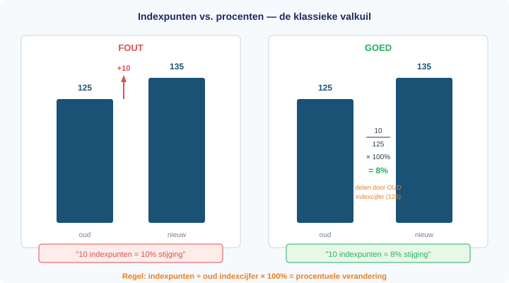

> **⚠️ Let op — veelgemaakte fout**
> Indexpunten ≠ procenten! Een stijging van 10 indexpunten is alleen 10% als het oude indexcijfer precies 100 is. In alle andere gevallen moet je de indexpunten delen door het oude indexcijfer en vermenigvuldigen met 100%.

---

## Uitgewerkt voorbeeld

**Opgave:** De gemiddelde benzineprijs was €1,80 per liter in 2022. In 2023 steeg de prijs naar €1,98. In 2024 daalde de prijs naar €1,89.

**(a)** Bereken de procentuele verandering van de benzineprijs van 2022 naar 2023.

**(b)** Bereken het indexcijfer van de benzineprijs in 2023 en 2024 (basisjaar 2022 = 100).

**(c)** Bereken de procentuele verandering van de benzineprijs van 2023 naar 2024 met behulp van de indexcijfers.

---

**Uitwerking (a):** Procentuele verandering berekenen

| Stap | Uitwerking |
|------|-----------|
| 1. Noteer de oude en nieuwe waarde | Oud = €1,80 · Nieuw = €1,98 |
| 2. (nieuw − oud) / oud × 100% | (1,98 − 1,80) / 1,80 × 100% = 0,18 / 1,80 × 100% = **10%** |
| 3. Positief of negatief? | Positief → prijsstijging van 10% |

---

**Uitwerking (b):** Indexcijfer berekenen

| Stap | Uitwerking |
|------|-----------|
| 1. Bepaal het basisjaar | Basisjaar = 2022, basiswaarde = €1,80 |
| 2. Index 2023 = waarde / basiswaarde × 100 | 1,98 / 1,80 × 100 = **110** |
| 2. Index 2024 = waarde / basiswaarde × 100 | 1,89 / 1,80 × 100 = **105** |

---

**Uitwerking (c):** Procentuele verandering via indexcijfers

| Stap | Uitwerking |
|------|-----------|
| 1. Noteer de indexcijfers | Oud (2023) = 110 · Nieuw (2024) = 105 |
| 2. (nieuw − oud) / oud × 100% | (105 − 110) / 110 × 100% = −5 / 110 × 100% = **−4,5%** |
| 3. Positief of negatief? | Negatief → prijsdaling van 4,5% |

Let op: het verschil is 5 indexpunten, maar de procentuele verandering is −4,5%. Indexpunten ≠ procenten!

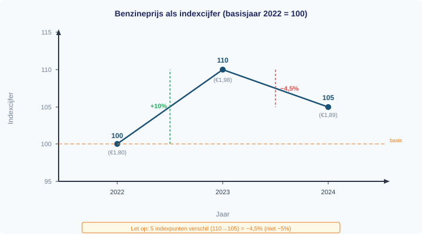

---

> **Samenvatting §1.1.2**
> - De procentuele verandering bereken je met: (nieuw − oud) / oud × 100%
> - Een indexcijfer drukt een waarde uit ten opzichte van een basisjaar (= 100)
> - Indexcijfer = (waarde / basiswaarde) × 100
> - **Indexpunten ≠ procenten** — deel de indexpunten altijd door het oude indexcijfer
> - In de volgende paragraaf (§1.1.3) leer je gegevens in grafieken en tabellen te verwerken — inclusief procentuele veranderingen.

---

> **Vastgelopen op een opgave?**
> Op de website vind je bij elke opgave een uitlegvideo en extra voorbeelden. Kijk eerst naar het uitgewerkt voorbeeld hierboven en probeer de procedure stap voor stap te volgen.


<div style="break-before: page;"></div>

# 1.1.3 Grafieken en tabellen

## Hoeveel ijsjes verkoop je bij welke prijs?

Het is zomer en je runt een ijskraam op het strand. Je wilt weten: als ik de prijs van een ijsje verlaag, verkoop ik er dan genoeg extra om meer omzet te maken? Je hebt de afgelopen weken bijgehouden hoeveel ijsjes je bij verschillende prijzen verkocht:

| Prijs (€) | Aantal verkocht |
|-----------|----------------|
| 1,00      | 500            |
| 1,50      | 400            |
| 2,00      | 300            |
| 2,50      | 200            |
| 3,00      | 100            |

De tabel bevat nuttige informatie, maar je ziet het verband niet in één oogopslag. Een grafiek maakt het patroon direct zichtbaar. In deze paragraaf leer je hoe je tabellen leest, er grafieken van tekent, waarden afleest — en hoe je beweringen over data kritisch beoordeelt.

---

## Theorie

### Een tabel lezen

Een tabel ordent gegevens in rijen en kolommen. De bovenste rij bevat de **kolomkoppen**: die vertellen je welke variabele in elke kolom staat. Elke rij daaronder is één **waarneming**.

Lees een tabel altijd systematisch:
1. **Wat staat er in de kolommen?** Welke variabelen zijn er?
2. **Wat is de eenheid?** Euro's, stuks, procenten?
3. **Welke richting?** Stijgt de ene variabele als de andere stijgt, of daalt hij?

Kijk terug naar de ijsjestabel hierboven. In de linkerkolom staat de prijs in euro's. In de rechterkolom staat het aantal verkochte ijsjes. Als de prijs stijgt van €1,00 naar €3,00, daalt het aantal van 500 naar 100. Er is dus een *negatief verband*: hogere prijs, lagere verkoop.

---

### Van tabel naar grafiek

Een grafiek maakt dat verband zichtbaar. Om een grafiek te tekenen, volg je een vaste procedure:

> **Procedure: Grafiek tekenen van tabeldata**
> 1. Lees de tabel: welke variabele is onafhankelijk, welke afhankelijk?
> 2. Zet de onafhankelijke variabele op de x-as, de afhankelijke op de y-as (economie-conventie: prijs op y-as)
> 3. Kies een geschikte schaalverdeling
> 4. Zet de punten uit
> 5. Verbind de punten (recht of vloeiend, afhankelijk van context)

Bij de ijsjestabel is de prijs de onafhankelijke variabele en het aantal verkochte ijsjes de afhankelijke variabele. In de economie geldt een belangrijke conventie:

> **Definitie: Assenconventie in de economie**
> In economische grafieken staat de prijs (P) altijd op de **verticale as** (y-as) en de hoeveelheid (Q) op de **horizontale as** (x-as). Dit is anders dan in de wiskunde, waar de onafhankelijke variabele standaard op de x-as staat.

We passen de procedure toe op de ijsjestabel:

**Stap 1:** De prijs is de onafhankelijke variabele, het aantal ijsjes de afhankelijke.

**Stap 2:** Volgens de economie-conventie zetten we de prijs op de y-as en de hoeveelheid op de x-as.

**Stap 3:** De prijs loopt van €1,00 tot €3,00 — we kiezen een schaal van €0,50 per lijn. De hoeveelheid loopt van 100 tot 500 — we kiezen een schaal van 100 per lijn.

**Stap 4 en 5:** We zetten de vijf punten uit en verbinden ze met rechte lijnen.


In figuur 1 zie je het negatieve verband: de lijn loopt van linksboven naar rechtsonder. Hoe lager de prijs, hoe meer ijsjes er verkocht worden.

> **⚠️ Let op — veelgemaakte fout**
> Veel leerlingen zetten de prijs op de horizontale as en de hoeveelheid op de verticale as. Dat is wiskundig niet fout, maar in de economie doen we het andersom. Figuur 3 laat het verschil zien.


Onthoud: in dit vak staat de prijs altijd op de y-as. Als je een grafiek tekent of afleest, controleer dan eerst welke variabele op welke as staat.

---

### Waarden aflezen en interpoleren

Je kunt een grafiek ook *andersom* gebruiken: niet om punten te tekenen, maar om waarden af te lezen. Stel dat je wilt weten hoeveel ijsjes je verkoopt bij een prijs van €1,75. Die prijs staat niet in de tabel, maar je kunt hem aflezen uit de grafiek.

> **Procedure: Waarden aflezen uit een grafiek**
> 1. Zoek de gegeven waarde op de juiste as
> 2. Trek een lijn naar de grafiek
> 3. Lees de bijbehorende waarde af op de andere as
> 4. Bij interpolatie: schat de waarde tussen twee bekende punten

We passen dit toe:

**Stap 1:** Zoek €1,75 op de y-as (de prijsas).

**Stap 2:** Trek een horizontale stippellijn naar rechts tot je de lijn raakt.

**Stap 3:** Trek vanaf dat punt een verticale stippellijn omlaag naar de x-as.

**Stap 4:** Je leest af: bij €1,75 worden er ongeveer 350 ijsjes verkocht.


Dit heet **interpoleren**: je schat een waarde die *tussen* twee bekende datapunten in ligt. €1,75 ligt precies tussen €1,50 en €2,00. De bijbehorende hoeveelheid (350) ligt precies tussen 400 en 300. Dat klopt, want de lijn loopt hier recht.

De tabel, de grafiek en het berekende getal vertellen hetzelfde verhaal — alleen in een andere vorm:

| Prijs (€) | Hoeveelheid (uit tabel) | Hoeveelheid (uit grafiek) |
|-----------|------------------------|--------------------------|
| 1,50      | 400                    | 400                      |
| 1,75      | —                      | ≈ 350 (interpolatie)     |
| 2,00      | 300                    | 300                      |

---

### Kritisch kijken naar data

Grafieken en tabellen zijn krachtige hulpmiddelen, maar je moet er kritisch naar kijken. Een krantenkop kan beweren: "IJsjesverkoop daalt met 50%!" Klopt dat?

Kijk terug naar de tabel. De verkoop daalt van 500 naar 100 over het hele prijsbereik — dat is een daling van 80%. Maar tussen €1,00 en €2,00 daalt de verkoop van 500 naar 300, en dat is een daling van 40%.

> **📋 Herhaling uit §1.1.2**
> De procentuele verandering bereken je met: (nieuw − oud) / oud × 100%.

Wanneer klopt "50%" dan wél? Tussen €2,00 en €3,00 daalt de verkoop van 300 naar 100. Dat is: (100 − 300) / 300 × 100% = −66,7%. Dat is dus ook geen 50%.

Tussen €1,00 en €1,50 daalt de verkoop van 500 naar 400: (400 − 500) / 500 × 100% = −20%. Dat is ook geen 50%.

Tussen welke twee prijzen is er dan wél een daling van 50%? Tussen €1,50 en €2,50: de verkoop gaat van 400 naar 200. Dat is: (200 − 400) / 400 × 100% = −50%. De bewering "50% daling" klopt dus alleen als je precies die twee prijzen vergelijkt.

**Les:** bij elke bewering over procenten moet je altijd vragen: vergeleken met *wat*?

---

## Uitgewerkt voorbeeld

**Opgave:** Een winkelier houdt bij hoeveel flesjes limonade hij per dag verkoopt bij verschillende prijzen:

| Prijs (€) | Verkocht per dag |
|-----------|-----------------|
| 0,80      | 120              |
| 1,20      | 90               |
| 1,60      | 60               |
| 2,00      | 30               |

**(a)** Teken een grafiek met de prijs op de verticale as en de hoeveelheid op de horizontale as.
**(b)** Lees uit je grafiek af: hoeveel flesjes verkoopt de winkelier bij een prijs van €1,00?
**(c)** Bereken de procentuele verandering in de verkoop als de prijs stijgt van €0,80 naar €1,60.

---

**Uitwerking:**

**(a)** We volgen de procedure *Grafiek tekenen van tabeldata*:

| Stap | Actie |
|------|-------|
| 1. Variabelen bepalen | Prijs = onafhankelijk, verkoop = afhankelijk |
| 2. Assen kiezen | Prijs op y-as, hoeveelheid op x-as (economie-conventie) |
| 3. Schaalverdeling | y-as: €0,40 per lijn (van €0,00 tot €2,40). x-as: 30 per lijn (van 0 tot 150) |
| 4. Punten uitzetten | (120; 0,80), (90; 1,20), (60; 1,60), (30; 2,00) |
| 5. Verbinden | Rechte lijnen tussen de punten |


**(b)** We volgen de procedure *Waarden aflezen uit een grafiek*:

| Stap | Actie |
|------|-------|
| 1. Gegeven waarde opzoeken | €1,00 op de y-as |
| 2. Lijn naar de grafiek | Horizontale stippellijn naar rechts tot de lijn |
| 3. Aflezen op andere as | Verticale stippellijn omlaag naar de x-as |
| 4. Interpolatie | €1,00 ligt tussen €0,80 en €1,20. Aflezen: ≈ 105 flesjes |

**(c)** De verkoop daalt van 120 naar 60 flesjes.

Procentuele verandering = (nieuw − oud) / oud × 100% = (60 − 120) / 120 × 100% = **−50%**

De verkoop daalt met 50%.

---

> **Samenvatting §1.1.3**
> - Een **tabel** ordent gegevens in rijen en kolommen. Lees altijd eerst de kolomkoppen en eenheden.
> - In de economie staat de **prijs op de y-as** en de **hoeveelheid op de x-as** (assenconventie).
> - Met **interpolatie** schat je een waarde tussen twee bekende datapunten.
> - Controleer beweringen over data altijd kritisch: *vergeleken met wat?*
> - In de volgende paragraaf (§1.1.4) combineer je deze grafiekvaardigheden met percentages en economisch denken.

---

*Vastgelopen op een opgave? Kijk op de website bij dit hoofdstuk voor extra uitleg en tips.*

---

## Opgaven

### Startoefeningen

**Opgave 1**

Bekijk de grafiek hieronder. Deze toont het verband tussen de prijs van een broodje en het aantal verkochte broodjes per week.


**(a)** Hoeveel broodjes worden er verkocht bij een prijs van €3,00?
**(b)** Bij welke prijs worden er 150 broodjes verkocht?
**(c)** Beschrijf het verband tussen prijs en hoeveelheid in één zin.


**Opgave 2**

Een marktkraam verkoopt koffie. De eigenaar heeft de volgende gegevens:

| Prijs per beker (€) | Verkocht per dag |
|---------------------|-----------------|
| 1,00                | 200              |
| 1,50                | 160              |
| 2,00                | 120              |
| 2,50                | 80               |
| 3,00                | 40               |

**(a)** Teken een grafiek met de prijs op de verticale as en het aantal bekers op de horizontale as. Kies een geschikte schaalverdeling.
**(b)** Welk verband zie je? Leg uit.

---

### Verdiepende opgaven

**Opgave 3**

Bekijk de grafiek hieronder. Deze toont het verband tussen de prijs van een bioscoopkaartje en het aantal bezoekers per week.


**(a)** Lees uit de grafiek af: hoeveel bezoekers komen er bij een prijs van €9,00?
**(b)** Lees uit de grafiek af: hoeveel bezoekers komen er bij een prijs van €11,00? Gebruik interpolatie.
**(c)** Bereken de procentuele verandering in het aantal bezoekers als de prijs stijgt van €8,00 naar €12,00.


**Opgave 4**

Een supermarkt verkoopt flesjes water. In januari kostten ze €0,80 en werden er 500 per week verkocht. In juni is de prijs gestegen naar €1,20 en worden er 350 per week verkocht.

**(a)** Teken een grafiek met deze twee punten. Zet de prijs op de y-as.
**(b)** Trek een rechte lijn tussen de twee punten. Lees af: hoeveel flesjes worden er verkocht bij €1,00?
**(c)** Bereken het indexcijfer van de verkoop in juni (januari = 100).
**(d)** Een journalist schrijft: "De waterverkoop is met een derde gedaald." Klopt dit? Laat je berekening zien.

---

### Denkertje

**Opgave 5**

Twee leerlingen maken een grafiek van dezelfde gegevens. Leerling A begint de y-as bij €0,00. Leerling B begint de y-as bij €4,50 (net onder de laagste waarde).

**(a)** Schets hoe beide grafieken er ongeveer uitzien.
**(b)** Bij welke grafiek lijkt de daling *groter* dan hij werkelijk is? Leg uit.
**(c)** Noem een voorbeeld uit het nieuws of de reclame waar een grafiek misleidend kan zijn door de keuze van de asschaal.


<div style="break-before: page;"></div>

# Gemengde opgaven §1.1.4 — Economisch denken en rekenen

---

## Opgave 1: Bakkerij "Knapperig"

Bakkerij "Knapperig" wil investeren in nieuwe apparatuur. De eigenaar, meneer Vermeer, heeft €20.000 beschikbaar en overweegt drie opties: een nieuwe steenoven, een professioneel deegkneedmachine of een vitrine met koeling. Hij kan maar in één apparaat investeren. Tabel 1 toont de verwachte jaaromzet en jaarkosten per investering. De huidige omzet van de bakkerij bedraagt €85.000 per jaar.

**Tabel 1: Verwachte resultaten per investering**

| Investering | Investeringsbedrag (€) | Verwachte jaaromzet (€) | Verwachte jaarkosten (€) |
|---|---|---|---|
| Steenoven | 18.000 | 110.000 | 72.000 |
| Deegkneedmachine | 15.000 | 100.000 | 62.000 |
| Vitrine met koeling | 12.000 | 95.000 | 60.000 |

---

**1** *(2p)* Bereken de verwachte jaarwinst voor elke investering. Gebruik de tabel en de formule: winst = omzet − kosten.

**2** *(2p)* Meneer Vermeer kiest voor de steenoven. Bereken zijn alternatieve kosten. Gebruik de procedure: (1) alternatieven identificeren, (2) opbrengst per alternatief, (3) alternatieve kosten = opbrengst beste niet-gekozen alternatief.

**3** *(2p)* De huidige jaaromzet van de bakkerij is €85.000. Na aanschaf van de steenoven stijgt de omzet naar €110.000. Bereken de procentuele omzetstijging.

**4** *(2p)* Bereken het indexcijfer van de omzet na aanschaf van de steenoven, met de huidige omzet als basiswaarde (index = 100).

**5** *(2p)* Een collega-bakker zegt: "De omzet stijgt met 29 indexpunten, dus de omzet stijgt met 29%." Beoordeel of deze uitspraak klopt. Laat je berekening zien.

---

## Opgave 2: Prijsontwikkeling groente en fruit

Het Centraal Bureau voor de Statistiek (CBS) houdt de gemiddelde prijs per kilo groente en fruit bij. Figuur 1 toont de prijsontwikkeling van 2020 tot en met 2025. In 2020 kostte een kilo groente gemiddeld €2,00 en een kilo fruit €1,80.

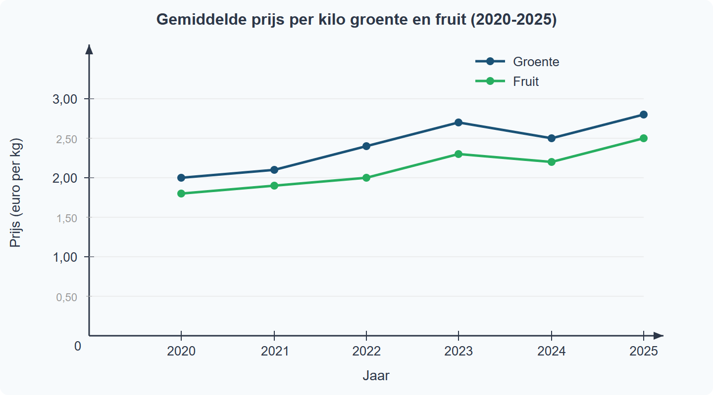

Een supermarktketen publiceert de volgende indexcijfers voor groente (basisjaar 2020 = 100):

**Tabel 2: Indexcijfers groenteprijzen (2020 = 100)**

| Jaar | 2020 | 2021 | 2022 | 2023 | 2024 | 2025 |
|---|---|---|---|---|---|---|
| Indexcijfer | 100 | 105 | 120 | 135 | 125 | 140 |

---

**6** *(1p)* Lees in figuur 1 af: wat was de gemiddelde prijs van een kilo fruit in 2023?

**7** *(2p)* Bereken met behulp van tabel 2 de procentuele prijsstijging van groente van 2022 naar 2023.

**8** *(2p)* Een journalist schrijft: "De groenteprijs steeg van 2022 naar 2023 met 15 procent." Beoordeel deze bewering. Gebruik de indexcijfers uit tabel 2 en laat je berekening zien.

**9** *(2p)* Bereken met behulp van figuur 1 de procentuele prijsverandering van fruit van 2023 naar 2024. Beschrijf wat deze uitkomst economisch betekent.

**10** *(3p)* Lees de grafiek nauwkeurig. In welk jaar was het prijsverschil tussen groente en fruit het grootst? Lees de prijzen af en bereken het verschil.

---

## Opgave 3: Schoolkantine in actie

De leerlingenraad van een middelbare school moet kiezen hoe ze het kantinebudget van €5.000 besteden. Er zijn twee opties: een smoothie-machine aanschaffen of het saladebuffet uitbreiden. De leerlingenraad kan maar één optie kiezen vanwege het beperkte budget.

De schoolkantine heeft de afgelopen jaren de prijzen van broodjes bijgehouden:

**Tabel 3: Gemiddelde broodjesprijs in de kantine**

| Schooljaar | 2021/22 | 2022/23 | 2023/24 | 2024/25 |
|---|---|---|---|---|
| Prijs (€) | 2,00 | 2,20 | 2,50 | 2,60 |

De leerlingenraad schat de opbrengsten als volgt in. De smoothie-machine levert naar verwachting €3.500 op aan extra kantineomzet per jaar (door de verkoop van smoothies). De uitbreiding van het saladebuffet levert naar verwachting €2.800 op aan extra omzet per jaar (door meer saladevariatie). Daarnaast zijn er niet-financiële voordelen: de smoothie-machine trekt meer leerlingen naar de kantine, terwijl het saladebuffet bijdraagt aan gezonder eetgedrag.

De leerlingenraad kiest voor de smoothie-machine.

---

**11** *(2p)* Leg uit waarom er sprake is van schaarste in deze situatie. Gebruik de economische definitie van schaarste.

**12** *(2p)* Bereken de alternatieve kosten van de keuze voor de smoothie-machine. Benoem de financiële en niet-financiële aspecten.

**13** *(2p)* Bereken het indexcijfer van de broodjesprijs in schooljaar 2024/25 (basisjaar 2021/22 = 100).

**14** *(2p)* Bereken de procentuele prijsstijging van broodjes van schooljaar 2022/23 naar schooljaar 2024/25.

**Denkertje** *(2p)* De rector van de school zegt: "De broodjesprijs is van 2021 naar 2025 met 30 indexpunten gestegen. Dat is een stijging van 30%." Beoordeel of de rector gelijk heeft. Laat je berekening zien en leg uit waarom indexpunten en procenten vaak worden verward.

<div style="break-before: page;"></div>

<div class="chapter-front">

<h1>Hoofdstuk 2 — Vraag</h1>

<h2>Inhoud</h2>

<table>
<thead><tr><th>§</th><th>Onderwerp</th></tr></thead>
<tbody>
<tr><td>1.2.1</td><td>Individuele vraag</td></tr>
<tr><td>1.2.2</td><td>Vraagfactoren</td></tr>
<tr><td>1.2.3</td><td>Van individuele naar collectieve vraag</td></tr>
<tr><td>1.2.4</td><td>Gemengde opgaven</td></tr>
</tbody>
</table>

<h2>Leerdoelen</h2>

<p>Na dit hoofdstuk kun je:</p>

<ul>
<li>De betalingsbereidheid definiëren en gebruiken om een koopbeslissing te verklaren</li>
<li>Het verband tussen prijs en gevraagde hoeveelheid uitleggen (wet van de vraag)</li>
<li>Een individuele vraaglijn tekenen vanuit betalingsbereidheidsdata</li>
<li>Het consumentensurplus berekenen</li>
<li>Het verschil uitleggen tussen een beweging langs de vraaglijn en een verschuiving van de vraaglijn</li>
<li>De vijf vraagfactoren benoemen en uitleggen: inkomen, voorkeuren, prijs van substituten, prijs van complementen, verwachtingen</li>
<li>Verschuivingen grafisch weergeven (naar links/rechts)</li>
<li>Goederen classificeren als substituten of complementen op basis van context</li>
<li>Uitleggen dat de collectieve vraag de horizontale optelsom is van individuele vraaglijnen</li>
<li>De collectieve vraag berekenen met de tabelmethode en de algebraïsche methode</li>
<li>De knik in de collectieve vraaglijn herkennen en verklaren</li>
</ul>

<h2>Waarom koop jij niet vijf broodjes?</h2>

<p>Waarom koop je drie broodjes bij de bakker, maar niet vijf? En waarom koopt iedereen ineens meer boter als margarine in het nieuws komt — terwijl de prijs van boter niet veranderd is? In dit hoofdstuk leer je hoe consumenten hun koopbeslissing nemen op basis van betalingsbereidheid, welke factoren de vraag beïnvloeden, en hoe je de vraag van alle consumenten op een markt samenvoegt tot één collectieve vraaglijn. Aan het einde kun je voorspellen wat er met de gevraagde hoeveelheid gebeurt als de omstandigheden veranderen.</p>

</div>


<div style="break-before: page;"></div>

# 1.2.1 Individuele vraag

## Hoe beslis je hoeveel je koopt?

Tom is gek op de bioscoop. Voor de eerste film van de week heeft hij alles over: hij zou best €12 willen betalen. Maar een tweede film dezelfde week? Dat is leuk, maar niet zo bijzonder meer — daar wil hij hooguit €9 voor betalen. Een derde film? €5, misschien. En een vierde? Die is alleen de moeite als hij bijna niets kost: €2 is zijn maximum.

Tom merkt iets op. Hoe meer films hij al gezien heeft, hoe minder hij bereid is te betalen voor de volgende. De eerste is het meest waard, elke volgende iets minder. Hoe komt dat? En hoe bepaalt Tom hoeveel kaartjes hij uiteindelijk koopt?

---

## Theorie

### Betalingsbereidheid

Het maximale bedrag dat een consument bereid is te betalen voor een extra eenheid van een goed, heet de **betalingsbereidheid**.

> **Definitie: Betalingsbereidheid**
> Het maximale bedrag dat een consument wil betalen voor één extra eenheid van een goed.

Tom's betalingsbereidheid per bioscoopkaartje:

| Kaartje | Betalingsbereidheid |
|---------|-------------------|
| 1e      | €12               |
| 2e      | €9                |
| 3e      | €5                |
| 4e      | €2                |

De betalingsbereidheid daalt bij elk volgend kaartje. Dit is logisch: hoe meer je al hebt van iets, hoe minder waarde je hecht aan nóg een eenheid. Economen noemen dit *afnemend grensnut*.

We tekenen Tom's betalingsbereidheid in een grafiek. Op de verticale as staat de prijs (in euro's), op de horizontale as het aantal kaartjes. Elke balk toont hoeveel Tom bereid is te betalen voor dat specifieke kaartje.


---

### De individuele vraaglijn

We kunnen deze gegevens ook als een **trapfunctie** tekenen: horizontale lijnen op de hoogte van de betalingsbereidheid, met een sprong omlaag bij elk volgend kaartje. Dat levert Tom's *individuele vraaglijn* op.

> **Definitie: Individuele vraaglijn**
> Een grafiek die laat zien hoeveel eenheden één consument wil kopen bij elke prijs, **terwijl alle andere omstandigheden gelijk blijven** (ceteris paribus).

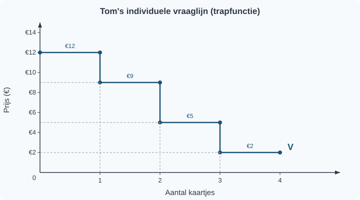

De vraaglijn (V) loopt van linksboven naar rechtsonder. Bij een hoge prijs koopt Tom weinig; bij een lage prijs koopt hij meer. De trappen worden kleiner naarmate de betalingsbereidheid daalt.

---

### De koopbeslissing

Hoe beslist Tom hoeveel kaartjes hij koopt? Hij vergelijkt zijn betalingsbereidheid met de **marktprijs** — de prijs die de bioscoop vraagt.

**De regel is simpel:** koop zolang je betalingsbereidheid groter is dan of gelijk is aan de marktprijs.

Stel: de marktprijs is €7. Tom vergelijkt:

| Kaartje | Betalingsbereidheid | Marktprijs | Beslissing |
|---------|-------------------|------------|------------|
| 1e      | €12               | €7         | Kopen (€12 ≥ €7) ✓ |
| 2e      | €9                | €7         | Kopen (€9 ≥ €7) ✓ |
| 3e      | €5                | €7         | Niet kopen (€5 < €7) ✗ |
| 4e      | €2                | €7         | Niet kopen (€2 < €7) ✗ |

Tom koopt 2 kaartjes. Figuur 3 laat dit zien: de groene vlakken zijn de kaartjes die hij koopt (betalingsbereidheid boven de prijslijn), de grijze zijn de kaartjes die hij niet koopt.

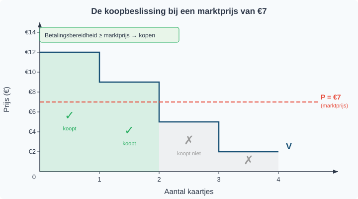

---

### Wat als de prijs daalt?

Stel dat de bioscoop een actie houdt: alle kaartjes kosten nu €4. Tom vergelijkt opnieuw:

- 1e kaartje: €12 ≥ €4 → kopen ✓
- 2e kaartje: €9 ≥ €4 → kopen ✓
- 3e kaartje: €5 ≥ €4 → kopen ✓
- 4e kaartje: €2 < €4 → niet kopen ✗

Tom koopt nu 3 kaartjes in plaats van 2. Bij een lagere prijs koopt hij meer. Dit is de **wet van de vraag**.

> **Definitie: Wet van de vraag**
> Bij een hogere prijs is de gevraagde hoeveelheid kleiner; bij een lagere prijs is de gevraagde hoeveelheid groter — *ceteris paribus* (alle andere omstandigheden gelijk).

---

### Consumentensurplus

Bij de actieprijs van €4 betaalt Tom €4 per kaartje, maar voor het eerste kaartje was hij bereid €12 te betalen. Hij betaalt €8 minder dan zijn maximum. Die €8 is zijn *winst* op dat kaartje: zijn **consumentensurplus**.

> **Definitie: Consumentensurplus**
> Het verschil tussen de betalingsbereidheid en de werkelijk betaalde prijs, per eenheid.
>
> Consumentensurplus per eenheid = betalingsbereidheid − marktprijs

Tom's consumentensurplus bij P = €4:

| Kaartje | Betalingsbereidheid | Betaald | Surplus |
|---------|-------------------|---------|---------|
| 1e      | €12               | €4      | €8      |
| 2e      | €9                | €4      | €5      |
| 3e      | €5                | €4      | €1      |
| **Totaal** | | | **€14** |

In figuur 4 zie je het consumentensurplus als de blauwe vlakken boven de prijslijn en onder de trappen van de vraaglijn.


---

### Van trapfunctie naar vloeiende vraaglijn

Tom's vraaglijn is een trapfunctie, want bioscoopkaartjes zijn gehele eenheden — je koopt 1, 2 of 3 kaartjes, niet 1,7 kaartje.

Maar veel goederen zijn *deelbaar*: liters melk, kilo's appels, minuten beltegoed. En als je de vraag van heel veel consumenten samenneemt (dat leer je in §1.2.3), verdwijnen de trappen. Dan ontstaat een vloeiende, rechte vraaglijn die je kunt beschrijven met een formule:

Q*v* = −*a*P + *b*

Hierin is Q*v* de gevraagde hoeveelheid, P de prijs, *a* een positief getal (de helling), en *b* het snijpunt met de Q-as.


Of de vraaglijn nu trappen heeft of vloeiend is: hij loopt altijd van linksboven naar rechtsonder. Dat is de wet van de vraag in beeld.

---

### Ceteris paribus — de kleine lettertjes

De vraaglijn toont het verband tussen prijs en gevraagde hoeveelheid *terwijl alle andere omstandigheden gelijk blijven*. Dit heet **ceteris paribus** (Latijn voor "het overige gelijk"). De vraaglijn gaat er dus van uit dat het inkomen van de consument, zijn voorkeuren, de prijzen van andere goederen, en zijn verwachtingen niet veranderen.

Wat gebeurt er als die andere factoren wél veranderen? Dat is het onderwerp van §1.2.2.

Figuur 6 vat de kernbegrippen van deze paragraaf samen.


---

## Uitgewerkt voorbeeld

> **Karin en de ijsjes**
>
> Karin is op het strand. Ze overweegt hoeveel ijsjes ze koopt.
> Haar betalingsbereidheid: €4 voor het eerste ijsje, €3 voor het tweede, €2 voor het derde, €0,50 voor het vierde.

**(a)** De marktprijs is €2,50 per ijsje. Hoeveel ijsjes koopt Karin?

*Stap 1: Vergelijk de betalingsbereidheid met de marktprijs voor elk ijsje.*

| Ijsje | Betalingsbereidheid | Marktprijs | Beslissing |
|-------|-------------------|------------|------------|
| 1e    | €4                | €2,50      | Kopen (€4 ≥ €2,50) ✓ |
| 2e    | €3                | €2,50      | Kopen (€3 ≥ €2,50) ✓ |
| 3e    | €2                | €2,50      | Niet kopen (€2 < €2,50) ✗ |
| 4e    | €0,50             | €2,50      | Niet kopen (€0,50 < €2,50) ✗ |

*Antwoord:* Karin koopt **2 ijsjes**.

**(b)** Bereken het totale consumentensurplus van Karin.

*Stap 2: Trek de marktprijs af van de betalingsbereidheid voor elk gekocht ijsje.*

- Ijsje 1: €4 − €2,50 = €1,50
- Ijsje 2: €3 − €2,50 = €0,50
- Totaal: €1,50 + €0,50 = **€2**

**(c)** Waarom koopt Karin het derde ijsje niet?

*Antwoord:* Haar betalingsbereidheid voor het derde ijsje is €2, maar de marktprijs is €2,50. Ze zou meer betalen dan het haar waard is. Het consumentensurplus zou negatief zijn (€2 − €2,50 = −€0,50), dus kopen is onvoordelig.

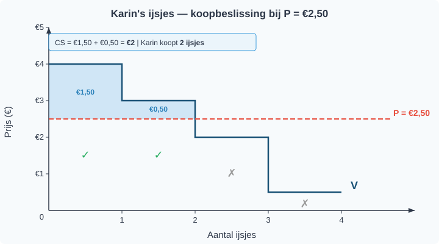

---

> **Samenvatting §1.2.1**
> - De **betalingsbereidheid** is het maximale bedrag dat een consument wil betalen voor één extra eenheid van een goed.
> - De **individuele vraaglijn** toont het verband tussen prijs en gevraagde hoeveelheid voor één consument. De vraaglijn loopt altijd van linksboven naar rechtsonder.
> - **Koopbeslissing:** een consument koopt zolang zijn betalingsbereidheid groter is dan of gelijk is aan de marktprijs.
> - Het **consumentensurplus** is het verschil tussen de betalingsbereidheid en de werkelijk betaalde prijs. Hoe lager de marktprijs, hoe groter het consumentensurplus.
> - De vraaglijn geldt onder de voorwaarde **ceteris paribus** — alle andere omstandigheden gelijk. Bij deelbare goederen wordt de vraaglijn een vloeiende lijn: Q*v* = −*a*P + *b*.
> - *In §1.2.2 leer je welke factoren de hele vraaglijn kunnen verschuiven — en waarom dat iets anders is dan een beweging langs de lijn.*

> **💡 Vastgelopen op een opgave?**
> Op de website vind je bij elke opgave een **begeleide inoefening**: stap voor stap krijg je extra hints en tussenstappen. Klik op de opgave om de begeleiding te starten.

---

## Opgaven

### Startoefeningen

**Opgave 1** *(lees de grafiek — zie figuur 7)*

In figuur 7 zie je de individuele vraaglijn van Emma voor boeken.


a) Wat is Emma's betalingsbereidheid voor het derde boek? Lees dit af uit de grafiek.

b) De marktprijs van een boek is €4. Hoeveel boeken koopt Emma? Leg uit hoe je dit uit de grafiek kunt aflezen.

c) Emma's vriendin zegt: "Bij €6 koopt Emma 2 boeken." Klopt dit? Leg uit.

**Opgave 2** *(teken de grafiek — zie figuur 8)*

Jasper wil concertkaartjes kopen. Zijn betalingsbereidheid:

| Kaartje | Betalingsbereidheid |
|---------|-------------------|
| 1e      | €10               |
| 2e      | €7                |
| 3e      | €4                |
| 4e      | €1                |

a) Teken Jasper's individuele vraaglijn als trapfunctie in het assenstelsel van figuur 8 (prijs op de y-as, hoeveelheid op de x-as).

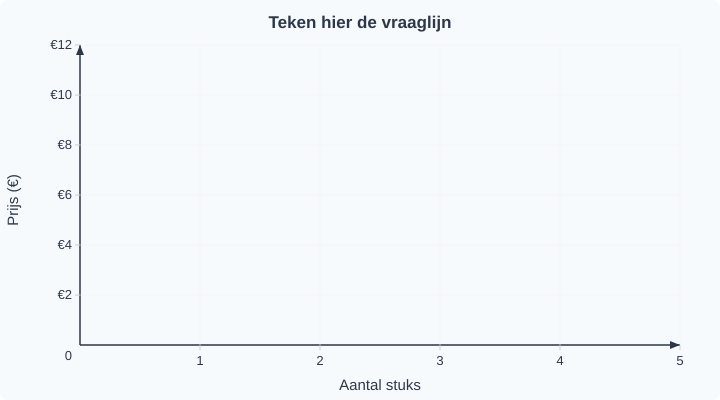

b) De marktprijs is €6. Hoeveel kaartjes koopt Jasper? Laat zien hoe je dit uit je grafiek afleest.

c) Bereken het totale consumentensurplus van Jasper bij een marktprijs van €6.

**Opgave 3** *(consumentensurplus berekenen)*

Gebruik de grafiek van Emma uit opgave 1 (figuur 7).

a) De marktprijs van een boek is €2. Hoeveel boeken koopt Emma?

b) Bereken het consumentensurplus per boek en het totale consumentensurplus.

c) De prijs stijgt naar €6. Hoeveel boeken koopt Emma nu? Bereken het nieuwe consumentensurplus. Leg uit waarom het consumentensurplus is veranderd.

---

### Zelfstandige oefening

**Opgave 4**

Mila overweegt hoeveel tijdschriften ze koopt. Haar betalingsbereidheid per tijdschrift: €8 voor het eerste, €6 voor het tweede, €3 voor het derde, €1 voor het vierde.

a) Maak een tabel met de betalingsbereidheid per tijdschrift.

b) Teken de individuele vraaglijn van Mila als trapfunctie (prijs op de y-as, hoeveelheid op de x-as).

c) De marktprijs is €5. Hoeveel tijdschriften koopt Mila? Leg je antwoord uit met behulp van de koopbeslissing.

d) Bereken het totale consumentensurplus bij een marktprijs van €5.

e) De prijs daalt naar €2. Hoeveel tijdschriften koopt ze nu? Bereken het nieuwe consumentensurplus.

**Opgave 5**

De individuele vraaglijn van een consument wordt beschreven door de formule:

Q*v* = −5P + 20

Hierin is Q*v* de gevraagde hoeveelheid en P de prijs in euro's.

a) Bereken de gevraagde hoeveelheid bij P = €1, P = €2 en P = €3. Zet de resultaten in een tabel.

b) Bij welke prijs wordt de gevraagde hoeveelheid precies 0? Wat betekent dit economisch?

c) De marktprijs is €2. Hoeveel eenheden koopt deze consument?

d) Teken de vraaglijn in een assenstelsel (prijs op de y-as, hoeveelheid op de x-as). Gebruik de drie punten uit deelvraag a en het punt uit deelvraag b.

---

### Herhaling (interleaving)

**Opgave 6** *(herhaling §1.1.2: procentuele verandering)*

Een bioscoopkaartje kostte vorig jaar €9. Dit jaar is de prijs gestegen naar €10,80.

a) Bereken de procentuele prijsstijging.

b) Volgend jaar verwacht de bioscoop een verdere stijging van 5%. Bereken de verwachte prijs volgend jaar.

**Opgave 7** *(herhaling §1.1.3: tabel en grafiek)*

In onderstaande tabel staat de gevraagde hoeveelheid broodjes bij verschillende prijzen.

| Prijs (€) | Gevraagde hoeveelheid |
|---|---|
| 1 | 10 |
| 2 | 8 |
| 3 | 6 |
| 4 | 4 |
| 5 | 2 |

a) Teken de vraaglijn in een assenstelsel (prijs op de y-as, hoeveelheid op de x-as).

b) Lees uit de grafiek af: hoeveel broodjes worden er gevraagd bij een prijs van €2,50?

c) Bij welke prijs is de gevraagde hoeveelheid precies 0?

---

### Doeloefening

**Opgave 8**

Lisa is dol op pizza. Haar betalingsbereidheid: €8 voor de eerste pizza, €6 voor de tweede, €4 voor de derde en €1,50 voor de vierde.

a) Teken Lisa's individuele vraaglijn als trapfunctie. Zet de prijs op de verticale as en het aantal pizza's op de horizontale as.

b) De marktprijs is €5. Hoeveel pizza's koopt Lisa? Verklaar je antwoord met behulp van het begrip betalingsbereidheid.

c) De prijs daalt naar €3. Hoeveel pizza's koopt Lisa nu?

d) Leg in eigen woorden uit waarom de vraaglijn van linksboven naar rechtsonder loopt.

---

### Denkertje *(bonusopgave)*

**Opgave 9**

Tom en zijn vriend Max gaan allebei naar dezelfde bioscoop. Tom is bereid €12 te betalen voor het eerste kaartje, Max slechts €6.

a) Noem twee mogelijke redenen waarom Tom een hogere betalingsbereidheid heeft dan Max.

b) Als het inkomen van Max stijgt, verwacht je dan dat zijn betalingsbereidheid verandert? Leg uit. *(Denk alvast na: wat zou dit betekenen voor zijn vraaglijn?)*


<div style="break-before: page;"></div>

# 1.2.2 Vraagfactoren

## Boter zonder prijsverandering — toch koopt iedereen ineens meer

Stel: in de supermarkt stijgt de prijs van boter van €2 naar €3. Veel klanten kopen minder boter. Logisch — je kent dat al uit §1.2.1: bij een hogere prijs daalt de gevraagde hoeveelheid.

Maar nu gebeurt er iets anders. De prijs van boter blijft €2, maar op het journaal vertellen wetenschappers dat margarine ongezond is. De volgende week koopt iedereen ineens méér boter — terwijl de prijs niet veranderd is.

Hoe kan dat? De vraaglijn uit §1.2.1 laat zien hoeveel consumenten willen kopen bij elke prijs — *zolang alle andere omstandigheden gelijk blijven*. Die kleine voorwaarde "*ceteris paribus*" is cruciaal. Zodra een andere factor verandert (inkomen, voorkeuren, prijs van een ander goed, …), klopt de oude vraaglijn niet meer en moet je hem opnieuw tekenen.

De prijs bepaalt dus *waar* je zit op de vraaglijn. Maar andere factoren bepalen *waar de hele lijn ligt*. In deze paragraaf leer je dat verschil — en waarom het de meest gemaakte fout in de economie is.

---

## Theorie

### De vraaglijn als startpunt

> **📋 Herhaling uit §1.2.1**
> De vraaglijn (V) laat het verband zien tussen de prijs en de gevraagde hoeveelheid, **terwijl alle andere omstandigheden gelijk blijven**. De lijn loopt van linksboven naar rechtsonder: hoe lager de prijs, hoe groter de gevraagde hoeveelheid. Dit heet de *vraagwet*.

We beginnen met de vraaglijn uit §1.2.1. Op de verticale as staat de prijs (P), op de horizontale as de gevraagde hoeveelheid (Q).


Bij een prijs van €2 is de gevraagde hoeveelheid 1000 pakjes boter per week. Bij €3 is dat 700 pakjes.

---

### Beweging langs de vraaglijn

Wat gebeurt er als de prijs van boter stijgt van €2 naar €3? Je schuift *langs* de vraaglijn omhoog: van punt A naar punt B. De gevraagde hoeveelheid daalt van 1000 naar 700.

Dit heet een **beweging langs de vraaglijn**. De lijn zelf verandert niet. Je verplaatst je alleen naar een ander punt op dezelfde lijn.

**Oorzaak:** een verandering van de prijs van het goed zelf.


Let op de pijl in figuur 2: die loopt *langs* de bestaande lijn. De lijn verschuift niet.

---

### Verschuiving van de vraaglijn

Nu het tweede geval. De prijs van boter blijft €2. Maar er komt een nieuwsbericht dat margarine ongezond is. Consumenten willen nu bij *elke* prijs meer boter dan voorheen.

Bij €2 kopen ze geen 1000, maar 1300 pakjes. Bij €3 geen 700, maar 1000 pakjes. Elk punt op de lijn schuift naar rechts. Er ontstaat een nieuwe vraaglijn (V₂), rechts van de oude (V₁).

Dit heet een **verschuiving van de vraaglijn**. De hele lijn verplaatst.

**Oorzaak:** een verandering van een andere factor dan de prijs van het goed zelf.


De horizontale pijl in figuur 3 laat zien dat de hele lijn opschuift. Bij dezelfde prijs is de gevraagde hoeveelheid groter geworden.

> **⚠️ Let op — veelgemaakte fout**
> Veel leerlingen verwarren een *verschuiving van* de vraaglijn met een *beweging langs* de vraaglijn.
> - Verandering van de prijs van het goed zelf → **beweging LANGS** de lijn.
> - Verandering van inkomen, voorkeuren of andere factoren → **verschuiving VAN** de lijn.

---

### Vraagfactoren: wat verschuift de vraaglijn?

De factoren die de hele vraaglijn verschuiven, heten **vraagfactoren**. Er zijn er vijf:

> **Definitie: Vraagfactoren**
> Factoren die de positie van de vraaglijn bepalen. Een verandering van een vraagfactor verschuift de hele vraaglijn naar links of naar rechts.

**1. Inkomen van de consument**

Als het inkomen stijgt, kopen consumenten meestal meer van een goed. De vraaglijn verschuift naar rechts. Zo'n goed heet een *normaal goed*.

> **Definitie: Normaal goed**
> Een goed waarvan de vraag stijgt als het inkomen stijgt.
> Voorbeelden: restaurantbezoek, merkkleding, vliegvakanties.

Maar soms werkt het andersom. Als het inkomen stijgt, kopen consumenten juist *minder* van een bepaald goed — ze stappen over op iets beters. Zo'n goed heet een *inferieur goed*.

> **Definitie: Inferieur goed**
> Een goed waarvan de vraag daalt als het inkomen stijgt.
> Voorbeelden: huismerkpasta, tweedehands kleding, instant noodles.

**2. Prijs van andere goederen — substituten**

Boter en margarine zijn *substitutiegoederen*: je kunt het ene vervangen door het andere. Als margarine duurder wordt, stappen consumenten over op boter. De vraag naar boter stijgt, de vraaglijn verschuift naar rechts.

> **Definitie: Substitutiegoederen (substituten)**
> Goederen die elkaar kunnen vervangen in gebruik.
> Kenmerk: als de prijs van het ene stijgt, stijgt de vraag naar het andere.
> Voorbeelden: boter en margarine, Coca-Cola en Pepsi, trein en auto.

**3. Prijs van andere goederen — complementen**

Brood en boter gebruik je samen. Als brood duurder wordt, koop je minder brood — en dus ook minder boter. De vraaglijn van boter verschuift naar links.

> **Definitie: Complementaire goederen (complementen)**
> Goederen die je samen gebruikt.
> Kenmerk: als de prijs van het ene stijgt, daalt de vraag naar het andere.
> Voorbeelden: brood en boter, printer en inkt, auto en benzine.

**4. Voorkeuren (preferenties)**

Smaak verandert. Een nieuwsbericht over gezondheid, een reclame, een trend op social media — het kan allemaal de voorkeuren beïnvloeden. Als consumenten een goed aantrekkelijker vinden, verschuift de vraaglijn naar rechts. Vinden ze het minder aantrekkelijk, dan naar links.

**5. Verwachtingen**

Als consumenten verwachten dat de prijs morgen stijgt, kopen ze vandaag alvast meer. De vraaglijn verschuift naar rechts. Verwachten ze een prijsdaling, dan wachten ze af — de vraaglijn verschuift naar links.

Figuur 5 vat de vijf vraagfactoren in één beeld samen. Onthoud: deze vijf factoren kunnen de hele lijn verschuiven. De prijs van het goed zelf staat er niet bij — die veroorzaakt een beweging *langs* de lijn, niet een verschuiving.

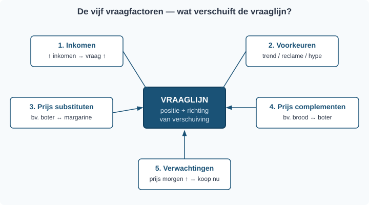

---

### Overzicht: beweging langs versus verschuiving van

Figuur 4 vat alles samen. De oorspronkelijke vraaglijn (V₁) kan naar rechts verschuiven (V₂ — vraagtoename) of naar links verschuiven (V₃ — vraagafname).

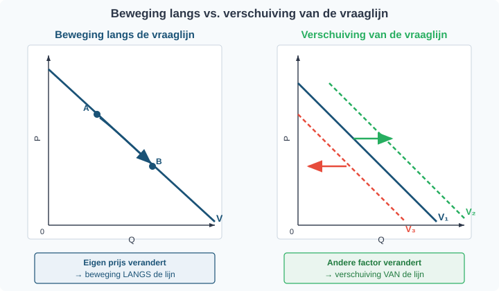

**Vraag neemt toe (verschuiving naar rechts):**
- Inkomen stijgt (normaal goed)
- Prijs van substituut stijgt
- Prijs van complement daalt
- Voorkeur voor het goed neemt toe
- Verwachte prijsstijging

**Vraag neemt af (verschuiving naar links):**
- Inkomen daalt (normaal goed) of inkomen stijgt (inferieur goed)
- Prijs van substituut daalt
- Prijs van complement stijgt
- Voorkeur voor het goed neemt af
- Verwachte prijsdaling

---

> **Samenvatting §1.2.2**
> - Een verandering van de prijs van het goed zelf veroorzaakt een **beweging langs** de vraaglijn.
> - Een verandering van een vraagfactor (inkomen, voorkeuren, prijs van substituten/complementen, verwachtingen) veroorzaakt een **verschuiving van** de vraaglijn.
> - Substituten zijn goederen die elkaar vervangen; complementen zijn goederen die je samen gebruikt.
> - Een normaal goed heeft een positief verband tussen inkomen en vraag; een inferieur goed een negatief verband.
> - *In §1.2.3 bekijken we de aanbodzijde van de markt: wie biedt er aan, en waarom loopt de aanbodlijn omhoog?*

> **💡 Vastgelopen op een opgave?**
> Op de website vind je bij elke opgave een **begeleide inoefening**: stap voor stap krijg je extra hints en tussenstappen. Klik op de opgave om de begeleiding te starten.

---

## Uitgewerkt voorbeeld

> **De markt voor fietsen**
>
> De markt voor fietsen is in evenwicht bij P = €500 en Q = 2000 fietsen per maand.

**(a)** De prijs van fietsen stijgt naar €600. Is dit een beweging langs of een verschuiving van de vraaglijn? Verklaar je antwoord.

*Antwoord:* Dit is een **beweging langs** de vraaglijn. De prijs van het goed zelf verandert (van €500 naar €600). Bij een hogere prijs is de gevraagde hoeveelheid kleiner. Je schuift langs de bestaande vraaglijn naar een punt linksboven.

**(b)** De prijs van fietsen blijft €500, maar de benzineprijs stijgt fors. Veel forensen stappen over op de fiets. Is dit een beweging langs of een verschuiving van de vraaglijn? Verklaar je antwoord.

*Antwoord:* Dit is een **verschuiving van** de vraaglijn naar rechts. De prijs van fietsen verandert niet, maar een andere vraagfactor wel: **de prijs van een substituut**. De auto is een substituut voor de fiets — beide brengen je van A naar B. Doordat autorijden duurder wordt (hogere benzineprijs), wordt de fiets relatief aantrekkelijker. Bij elke prijs willen consumenten nu meer fietsen kopen.

> ⚠️ Let op de juiste vraagfactor. Het is verleidelijk om te zeggen "de voorkeur voor fietsen is veranderd". Maar de voorkeur (smaak) is niet veranderd — alleen de relatieve prijs van het alternatief. De economisch precieze categorie is daarom *prijs van een substituut*.

**(c)** Leg in eigen woorden uit waarom auto en fiets substituten zijn — en wat dat zegt over hun vraagrelatie.

*Antwoord:* De auto en de fiets zijn **substituten** omdat ze dezelfde behoefte kunnen vervullen (woon-werkverkeer). Het kenmerk van substituten is: als de prijs van het ene stijgt, stijgt de vraag naar het andere. Dat zie je hier letterlijk gebeuren — autorijden wordt duurder, en de vraag naar fietsen schuift naar rechts.

---

## Opgaven

### Startoefeningen

**Opgave 1** *(lees de grafiek — zie figuur 6)*

In figuur 6 zie je twee veranderingen op de markt voor pizza. Beide situaties zijn al voor je getekend en gelabeld.


a) Beschrijf wat er in **Situatie 1** gebeurt: wat verandert er met de prijs en de gevraagde hoeveelheid? Welke factor zou dit veroorzaakt kunnen hebben?

b) Beschrijf wat er in **Situatie 2** gebeurt: wat verandert er met de prijs en de gevraagde hoeveelheid? Welke factor zou dit veroorzaakt kunnen hebben?

c) Leg in eigen woorden uit waarom Situatie 1 een *beweging langs* de vraaglijn is, en Situatie 2 een *verschuiving van* de vraaglijn.

**Opgave 2** *(teken in de grafiek — zie figuur 7)*

De markt voor smartphones is in evenwicht bij P = €600 en Q = 1.000 stuks per maand. In figuur 7 zie je de vraaglijn V₁ met evenwichtspunt E.

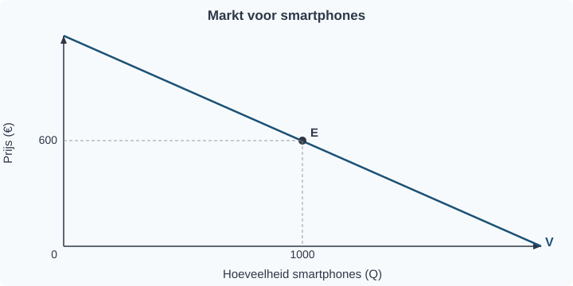

a) De prijs van smartphones stijgt naar €750. Laat in de grafiek zien wat er gebeurt. Is dit een verschuiving van de vraaglijn of een beweging langs de vraaglijn? Leg uit.

b) Het gemiddelde inkomen in Nederland stijgt. Smartphones zijn een normaal goed. Laat in de grafiek zien wat er gebeurt met de vraag naar smartphones. Is dit een verschuiving of een beweging? Leg uit.

c) De prijs van telefoonhoesjes (een complementair goed) stijgt fors. Wat verwacht je dat er gebeurt met de vraag naar smartphones? Leg uit of dit een verschuiving of een beweging is en geef de richting aan.

**Opgave 3**

De markt voor fietsen is in evenwicht. Er doen zich achtereenvolgens drie veranderingen voor. Beantwoord voor elke verandering de vragen. Er is geen grafiek bij deze opgave — beschrijf wat er in een grafiek zou gebeuren.

a) De fietsfabrikant geeft een seizoenskorting: de prijs van fietsen daalt van €500 naar €450.
- Verschuift de vraaglijn of beweeg je langs de vraaglijn?
- In welke richting?

b) De gemeente start een campagne "Fiets naar je werk". De prijs van fietsen blijft gelijk.
- Verschuift de vraaglijn of beweeg je langs de vraaglijn?
- In welke richting verschuift of beweegt de lijn?

c) Consumenten verwachten dat fietsen volgende maand 20% duurder worden.
- Wat gebeurt er nu met de vraag naar fietsen?
- Is dit een verschuiving of een beweging? Leg uit.

d) Noem bij elk van de drie situaties (a, b, c) welke vraagfactor verandert. Kies uit: eigen prijs, voorkeur, prijs substituten/complementen, inkomen, verwachtingen.

**Opgave 4** *(twee veranderingen tegelijk — let goed op!)*

Op de koffiemarkt gebeuren twee dingen op dezelfde dag:

1. De prijs van koffie stijgt van €4 naar €5 per pak.
2. Tegelijk daalt de prijs van thee van €3 naar €2 per pak. Thee is een substituut voor koffie.

a) Bekijk eerst alleen verandering 1. Wat gebeurt er met de vraag naar koffie? Is dit een beweging langs of een verschuiving van de vraaglijn? In welke richting?

b) Bekijk nu alleen verandering 2. Wat gebeurt er met de vraag naar koffie? Is dit een beweging langs of een verschuiving van de vraaglijn? In welke richting?

c) Beide veranderingen gebeuren tegelijkertijd. Beschrijf het netto-effect op de gevraagde hoeveelheid koffie. Versterken de twee effecten elkaar of werken ze tegen elkaar in?

d) Een leerling zegt: "De prijs van koffie verandert *en* de prijs van thee verandert, dus alles is een beweging langs de vraaglijn van koffie." Leg uit waarom dit niet klopt.

---

### Zelfstandige oefening

**Opgave 5**

De markt voor bioscoopkaartjes is in evenwicht bij P = €12 en Q = 5.000 kaartjes per week.

a) Geef vier factoren die de vraaglijn naar bioscoopkaartjes kunnen laten verschuiven (niet: de eigen prijs).

b) Leg voor elk van de vier factoren uit of de vraaglijn naar rechts of naar links verschuift. Geef bij elke factor een concreet voorbeeld.

c) Netflix verlaagt de abonnementsprijs van €13 naar €8 per maand. Netflix is een substituut voor de bioscoop. Teken een vraaglijn voor bioscoopkaartjes en laat zien wat er gebeurt. Is dit een verschuiving of een beweging? Leg uit.

d) Na de prijsverlaging van Netflix besluit de bioscoop ook de prijs te verlagen, van €12 naar €9 per kaartje. Teken in dezelfde grafiek wat er nu gebeurt met de gevraagde hoeveelheid. Is dit een verschuiving of een beweging?

**Opgave 6**

Hieronder staan zes situaties op de markt voor concertkaartjes. Vul de tabel in: bepaal voor elke situatie of het om een beweging of een verschuiving gaat, welke richting, en welke vraagfactor de oorzaak is.

| | Situatie | Beweging of verschuiving? | Richting | Vraagfactor |
|---|---|---|---|---|
| a | De ticketprijs stijgt van €45 naar €60. |  |  |  |
| b | Het besteedbaar inkomen van jongeren daalt door stijgende huurprijzen. Concertbezoek is een normaal goed. |  |  |  |
| c | Spotify brengt live-concertstreams uit (een substituut). |  |  |  |
| d | Een populaire artiest kondigt aan volgend jaar te stoppen met optreden. |  |  |  |
| e | De prijs van treinkaartjes naar concertlocaties (een complementair goed) verdubbelt. |  |  |  |
| f | Een virale TikTok-trend maakt live concerten weer populair onder jongeren. |  |  |  |

---

### Herhaling (interleaving)

**Opgave 7** *(herhaling §1.1.2: procentuele verandering)*

De prijs van een brood stijgt van €2,50 naar €2,80.

a) Bereken de procentuele prijsstijging.

b) Het jaar daarna stijgt de prijs met nog eens 6%. Bereken de nieuwe prijs.

**Opgave 8** *(herhaling §1.1.3: grafiek aflezen)*

In onderstaande tabel staat de gevraagde hoeveelheid paraplu's bij verschillende prijzen.

| Prijs (€) | Gevraagde hoeveelheid |
|---|---|
| 5 | 800 |
| 10 | 600 |
| 15 | 400 |
| 20 | 200 |

a) Teken de vraaglijn in een assenstelsel (prijs op de y-as, hoeveelheid op de x-as).

b) Lees af: hoeveel paraplu's worden er gevraagd bij een prijs van €12,50? (Gebruik interpolatie.)

**Opgave 9** *(herhaling §1.2.1: betalingsbereidheid en individuele vraag)*

Sanne wil een tweedehands boek kopen. Haar maximale betalingsbereidheid is €15.

a) Het boek kost €12. Bereken het consumentensurplus van Sanne.

b) De prijs stijgt naar €16. Koopt Sanne het boek? Leg uit met het begrip betalingsbereidheid.

---

### Doeloefening

**Opgave 10**

De markt voor boter is in evenwicht bij P = €2 en Q = 1.000 stuks.

a) De prijs van boter stijgt naar €2,50. Laat in een grafiek zien wat er gebeurt met de gevraagde hoeveelheid. Is dit een verschuiving van de vraaglijn of een beweging langs de vraaglijn?

b) Een gezondheidsrapport stelt dat margarine ongezond is. Laat in een grafiek zien wat er gebeurt met de vraag naar boter. Is dit een verschuiving of een beweging?

c) Het gemiddelde inkomen in het land stijgt met 5%. Boter is een normaal goed. Laat het effect op de vraaglijn zien.

d) Noem vier factoren die de vraaglijn doen verschuiven en geef bij elke factor een voorbeeld.

---

### Denkertje *(bonusopgave)*

**Opgave 11**

De overheid wil dat mensen minder suikerhoudende frisdrank drinken en overweegt twee maatregelen:

- **Maatregel A:** Een accijns (belasting) op frisdrank, waardoor de prijs met 25% stijgt.
- **Maatregel B:** Een grote voorlichtingscampagne over de gezondheidsrisico's van suiker.

a) Leg met behulp van het verschil tussen een verschuiving van en een beweging langs de vraaglijn uit hoe beide maatregelen de gevraagde hoeveelheid frisdrank beïnvloeden.

b) Een criticus stelt: "Maatregel A werkt alleen zolang de belasting er is. Maatregel B verandert het gedrag blijvend." Beoordeel deze stelling. Gebruik economische argumenten en betrek het begrip 'substituten' in je antwoord.


<div style="break-before: page;"></div>

# 1.2.3 Van individuele naar collectieve vraag

## Hoeveel limonade verkoopt het schoolfeest?

Stel je voor: je verkoopt limonade op het schoolfeest. Er staan 200 dorstige leerlingen voor je tafel. Je weet ongeveer hoeveel sommige leerlingen willen betalen. Anna geeft maximaal €4 per beker uit en koopt steeds meer naarmate de prijs lager is. Ben is iets dorstiger en koopt zelfs bij €3 nog twee bekers.

Maar het schoolfeest moet weten: hoeveel bekers limonade kunnen we in totáál verkopen bij elke prijs? Die vraag gaat niet over één leerling — die gaat over alle leerlingen samen. Je hebt een **marktvraag** nodig, geen individuele vraag.

In §1.2.1 leerde je hoe je de vraaglijn van één consument tekent. In §1.2.2 leerde je wanneer die lijn verschuift of niet. In deze paragraaf leer je hoe je de individuele vraaglijnen van álle consumenten op de markt samenvoegt tot één collectieve vraaglijn.

---

## Theorie

### Wat is collectieve vraag?

> **📋 Herhaling uit §1.2.1 en §1.2.2**
> Een individuele vraaglijn laat zien hoeveel één consument wil kopen bij elke prijs, **terwijl alle andere omstandigheden gelijk blijven**. De prijs van het goed zelf veroorzaakt een beweging *langs* de lijn; andere factoren (inkomen, voorkeur, prijs van substituten/complementen, verwachtingen) verschuiven de hele lijn.

Op een echte markt is er bijna nooit één consument. Een markt bestaat uit veel consumenten die elk hun eigen vraaglijn hebben. De **collectieve vraag** (ook wel marktvraag genoemd) is de optelsom van al die individuele vraaglijnen.

> **Definitie: Collectieve vraag (marktvraag)**
> De totale hoeveelheid die alle consumenten samen willen kopen bij elke prijs. Je krijgt de collectieve vraaglijn door bij elke prijs de individuele gevraagde hoeveelheden bij elkaar op te tellen.

Het belangrijkste woord in deze definitie is *bij elke prijs*. Je tilt niet de hele lijnen op elkaar, en je telt de prijzen niet op. Je kiest een prijs, leest af hoeveel elke consument bij die prijs wil kopen, en telt die hoeveelheden op.

---

### Stap 1 — De individuele vraaglijnen

We gaan dit oefenen met twee consumenten op de limonademarkt: Anna en Ben. Anna's vraaglijn ziet er zo uit:


Bij €3 wil Anna 1 beker. Bij €2 wil ze er 3. Bij €1 zelfs 5. Bij **€3,50** wordt haar vraag precies nul — vanaf die prijs koopt ze niks meer.

Ben heeft een aparte vraaglijn:

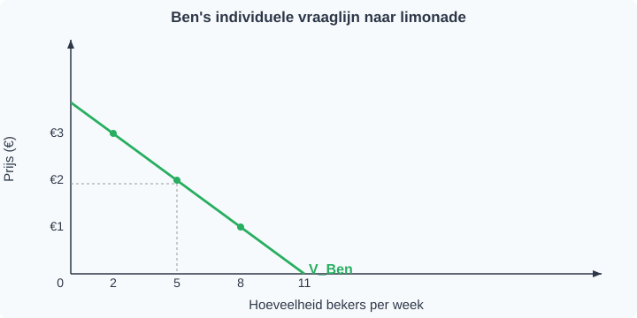

Ben is wat dorstiger. Bij €3 wil hij al 2 bekers; bij €2 zelfs 5; bij €1 maar liefst 8.

---

### Stap 2 — Allebei op dezelfde assen

Om de collectieve vraag te bouwen, leggen we de twee vraaglijnen op één en hetzelfde assenstelsel. Zo kun je bij elke prijs aflezen hoeveel elke consument wil.


Bij €2 wil Anna 3 bekers en Ben 5. Samen vragen ze 3 + 5 = 8 bekers limonade. Dit is precies wat we willen weten — *bij elke prijs* hoeveel willen ze samen.

We kunnen hetzelfde voor élke prijs doen. Het resultaat zetten we in een tabel:

| Prijs (€) | Q_Anna | Q_Ben | Q_collectief |
|---|---|---|---|
| 1 | 5 | 8 | **13** |
| 2 | 3 | 5 | **8** |
| 3 | 1 | 2 | **3** |
| 3,50 | 0 | 0,5 | **0,5** |

Zo zie je dezelfde informatie nu in drie vormen tegelijk: in de woorden hierboven, in de twee grafieken (figuur 1, 2 en 3), én in deze tabel. Drie kanalen, dezelfde inhoud — dat helpt om het idee echt vast te houden.

---

### Stap 3 — Horizontaal optellen

Wanneer je voor *elke* prijs de individuele hoeveelheden optelt, krijg je de **collectieve vraaglijn**. Dit heet **horizontaal optellen** omdat je telkens op dezelfde *horizontale* hoogte (dezelfde prijs op de y-as) de hoeveelheden bij elkaar optelt.


Bij €2 zie je het meteen: het rode punt van Anna staat op Q = 3, het groene punt van Ben op Q = 5, en het paarse collectieve punt op Q = 8. Bij elke andere prijs gaat het precies zo.

> **⚠️ Let op — veelgemaakte fout**
> Veel leerlingen tellen *verticaal* in plaats van *horizontaal*. Ze leggen de twee lijnen boven elkaar en tellen de prijzen op. Dat is fout.
> - **Goed:** kies een prijs → lees Q_Anna en Q_Ben af → tel die Q's op → één punt op V_collectief.
> - **Fout:** kies een Q → tel de prijzen op. Prijzen tel je nooit op; ze zijn voor iedereen op de markt hetzelfde.

---

### De algebraïsche methode

De tabelmethode hierboven werkt altijd, maar als je de individuele vraagfuncties als formule kent, kun je ook **algebraïsch** optellen. Het is precies hetzelfde idee — bij dezelfde prijs de hoeveelheden optellen — maar dan in één rekenstap voor alle prijzen tegelijk in plaats van rij voor rij.

Stel: Anna's vraagfunctie is `Q_Anna = -2P + 7` en Ben's is `Q_Ben = -3P + 11`. **Zolang Anna én Ben allebei nog kopen** krijg je de collectieve vraagfunctie door beide formules op te tellen:

> **Formule: Collectieve vraagfunctie (zolang beide kopen)**
> `Q_collectief = Q_Anna + Q_Ben = (-2P + 7) + (-3P + 11) = -5P + 18`
>
> Geldig voor 0 ≤ P ≤ €3,50 (de prijs waarbij Anna afhaakt).

Test even: bij P = 2 geldt Q_collectief = -5·2 + 18 = 8. Dat klopt met wat we in figuur 4 aflazen.

**Belangrijk**: je telt de Q's op, niet de P's. De prijs P is in beide functies dezelfde variabele — die laat je staan. En let op die geldigheidsgrens: zodra één van de twee consumenten afhaakt, klopt deze formule niet meer en moet je opnieuw optellen, alleen met de overgebleven kopers.

---

### De knik in de collectieve vraaglijn

Wat gebeurt er als de prijs zo hoog wordt dat één consument afhaakt? Boven die prijs verdwijnt zijn bijdrage aan de collectieve vraag — alleen de andere consument(en) blijven over. Daardoor krijgt de collectieve vraaglijn een **knik** op de prijs waarbij iemand de markt verlaat.


In figuur 5 zijn er twee consumenten C en D. Boven €4 koopt C niks meer; alleen D blijft over. **Onder** €4 kopen beiden, en daar loopt de collectieve lijn juist *minder steil* (vlakker) — want elke prijsdaling van €1 levert nu twee consumenten extra hoeveelheid in plaats van één. **Boven** €4 is de lijn *steiler* omdat een prijsverandering nog maar één consument raakt.

> **De vuistregel voor de helling**
> Hoe meer consumenten actief zijn op de markt, hoe **vlakker** de collectieve vraaglijn wordt. Elke extra koper voegt aan elke prijsdaling extra hoeveelheid toe, dus de lijn beweegt sneller naar rechts. Boven een knik (waar één consument is afgehaakt) wordt de lijn altijd *steiler*.

**Toegepast op Anna en Ben**: Anna haakt af bij €3,50; Ben bij €11/3 ≈ €3,67. Onder €3,50 kopen beiden, dus de collectieve vraaglijn is daar het vlakst. Tussen €3,50 en €3,67 koopt alleen Ben nog, dus de lijn wordt daar plotseling steiler. Boven €3,67 is de markt leeg.

> **Belangrijk inzicht**
> Een knik in een collectieve vraaglijn betekent altijd: hier is een consument de markt in- of uitgegaan. Hoe meer consumenten op de markt, hoe meer mogelijke knikpunten. In de praktijk zijn er duizenden consumenten — dan zie je geen scherpe knikken meer, maar één gladde lijn die er continu uitziet. Op individueel niveau zie je in figuur 1 nog losse punten omdat één persoon alleen hele bekers koopt; op collectief niveau (figuur 4) wordt het vanzelf glad omdat verschillende mensen bij een klein prijsverschil net wel of net niet meer kopen.

---

### Overzicht: twee methodes om de collectieve vraag te bepalen

Er zijn twee manieren om van individuele vraag naar collectieve vraag te komen. Welke je gebruikt, hangt af van wat je als input hebt: een tabel of een formule.

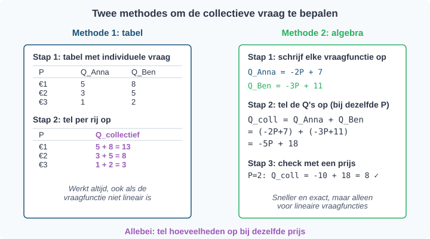

**Methode 1 (tabel):** geschikt als je een tabel met individuele hoeveelheden hebt. Tel per rij (per prijs) de Q's op.

**Methode 2 (algebra):** geschikt als je de vraagfuncties als formule hebt. Tel de functies bij elkaar op tot één formule voor Q_collectief.

Beide methodes geven hetzelfde antwoord — kies de methode die past bij de input die je krijgt.

---

## Uitgewerkt voorbeeld

> **De markt voor appels**
>
> Op een dorpsmarkt zijn maar twee kopers: Eva en Sam. Hun vraagfuncties zijn:
> - Eva: `Q_Eva = -P + 5`
> - Sam: `Q_Sam = -2P + 6`
>
> (Q in kilo, P in €)

**(a)** Maak een tabel met Q_Eva, Q_Sam en Q_collectief voor P = €1, €2 en €3.

*Antwoord:*

| P | Q_Eva | Q_Sam | Q_collectief |
|---|---|---|---|
| €1 | 5 − 1 = 4 | 6 − 2 = 4 | 4 + 4 = **8** |
| €2 | 5 − 2 = 3 | 6 − 4 = 2 | 3 + 2 = **5** |
| €3 | 5 − 3 = 2 | 6 − 6 = 0 | 2 + 0 = **2** |

*Stap voor stap*: voor elke prijs vul je beide functies in, je krijgt twee individuele Q's, en die tel je op. Méér is het niet.

**(b)** Bepaal de collectieve vraagfunctie algebraïsch.

*Antwoord:*

```
Q_collectief = Q_Eva + Q_Sam
            = (-P + 5) + (-2P + 6)
            = -3P + 11
```

*Check met de tabel*: bij P = 2 geldt Q_collectief = -3·2 + 11 = 5. Dat klopt met de tabel uit (a).

**(c)** Bij welke prijs verlaat Sam de markt? Wat gebeurt er met de collectieve vraagfunctie boven die prijs?

*Antwoord:* Sam's vraag is nul wanneer `-2P + 6 = 0`, dus bij **P = €3**. Boven €3 koopt Sam niets meer en bestaat de collectieve vraag alleen nog uit Eva. Boven €3 geldt dus:

`Q_collectief (boven €3) = Q_Eva = -P + 5`

De collectieve vraaglijn krijgt een knik op P = €3: onder die prijs is de lijn `-3P + 11`, boven die prijs `-P + 5`. Eva blijft kopen tot P = €5 (waar haar eigen vraag nul wordt).

---

> **Samenvatting §1.2.3**
> - De **collectieve vraag** is de optelsom van alle individuele vraaglijnen op een markt.
> - Je telt **horizontaal** op: bij elke prijs tel je de individuele Q's bij elkaar op. Prijzen tel je nooit op.
> - **Tabelmethode:** tel per rij (per prijs) de Q's. Werkt altijd, ook voor niet-lineaire vraag.
> - **Algebraïsche methode:** als je de individuele vraagfuncties hebt, tel je de Q-functies bij elkaar op. Een algebraïsche optelsom is altijd alleen geldig in het prijsbereik waarin álle individuele functies positief zijn.
> - De collectieve vraagfunctie is meestal **piecewise** (stuksgewijs): boven elke prijs waarbij iemand afhaakt geldt een andere formule. Elk knikpunt in de grafiek hoort bij zo'n grens.
> - Hoe meer consumenten actief zijn, hoe **vlakker** de collectieve vraaglijn (meer reactie op prijs).
> - *In §1.2.4 oefenen we alles wat we tot nu toe over vraag hebben geleerd in de oefenparagraaf van hoofdstuk 2.*

> **💡 Vastgelopen op een opgave?**
> Op de website vind je bij elke opgave een **begeleide inoefening**: stap voor stap krijg je extra hints en tussenstappen. Klik op de opgave om de begeleiding te starten.

---

## Opgaven

### Startoefeningen

**Opgave 1** *(lees de grafiek — zie figuur 7)*

In figuur 7 zie je de individuele vraaglijnen van Sara en Tim, en daarbij de collectieve vraaglijn V_coll. De drie punten bij P = €2 zijn al voor je ingetekend.

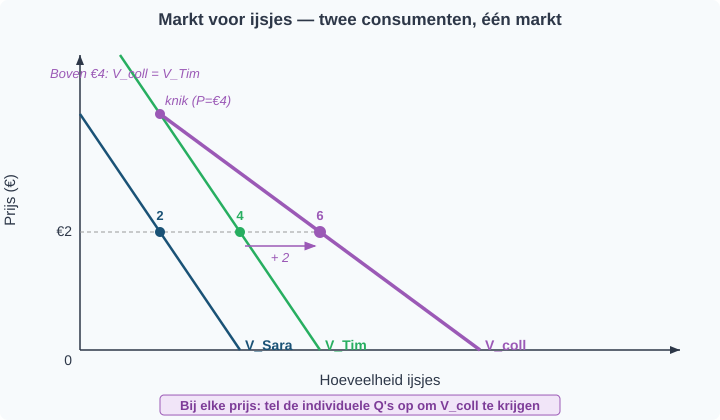

a) Lees uit de grafiek af: hoeveel ijsjes wil Sara bij €2? Hoeveel wil Tim bij €2? En hoeveel is dat samen?

b) Klopt dit met het paarse punt op V_coll bij P = €2? Leg uit waarom de horizontale optelling klopt.

c) Bekijk de knik in V_coll. Bij welke prijs ligt die? Welke consument is precies daar de markt uit gegaan?

**Opgave 2** *(teken in de grafiek — zie figuur 8)*

In figuur 8 zie je de individuele vraaglijnen van Lara (V_Lara) en Mo (V_Mo) op de markt voor broodjes. De collectieve vraaglijn is **nog niet getekend**.

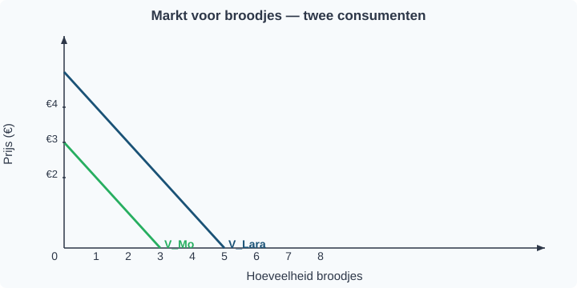

a) Lees voor P = €4, €3, €2 en €1 de individuele hoeveelheden af en vul de tabel aan:

| P | Q_Lara | Q_Mo | Q_collectief |
|---|---|---|---|
| €4 |  |  |  |
| €3 |  |  |  |
| €2 |  |  |  |
| €1 |  |  |  |

b) Teken de collectieve vraaglijn V_coll in de grafiek door de punten uit (a) te verbinden.

c) Bij welke prijs gaat één van de twee consumenten de markt uit? Wat gebeurt er met V_coll boven die prijs?

**Opgave 3**

Op de markt voor croissants zijn maar drie consumenten met de volgende vraagfuncties (Q in stuks, P in €):

- `Q_Aïsha = -P + 6`
- `Q_Bram  = -2P + 8`
- `Q_Chen  = -P + 4`

a) Bereken voor elke consument hoeveel hij of zij bij P = €1 wil kopen.

b) Wat is de collectieve gevraagde hoeveelheid bij P = €1?

c) Leid de collectieve vraagfunctie algebraïsch af. Geldig voor welk prijsbereik?

d) Bij welke prijs verlaat de eerste consument de markt? Welke consument is dat? Wat wordt de collectieve vraagfunctie net boven die prijs?

**Opgave 4** *(let goed op — twee dingen veranderen tegelijk!)*

Op de markt voor frisdrank zijn er twee consumenten, Iris en Jeroen. Op één en dezelfde dag gebeurt het volgende:

1. Iris krijgt loonsverhoging. Frisdrank is voor haar een normaal goed.
2. Jeroen ontdekt dat hij allergisch is voor frisdrank en stopt helemaal met kopen.

a) Bekijk eerst alleen verandering 1. Wat gebeurt er met **V_Iris**? Beweging of verschuiving? In welke richting?

b) Bekijk nu alleen verandering 2. Wat gebeurt er met **V_Jeroen**? Beweging of verschuiving? In welke richting?

c) Wat gebeurt er met de **collectieve vraaglijn V_coll** door deze twee veranderingen samen? Versterken de twee effecten elkaar of werken ze tegen elkaar in? Leg uit.

d) Een leerling zegt: "Iris koopt meer en Jeroen koopt minder, dus de collectieve vraag verandert niet." Waarom is dat *bijna nooit* waar?

---

### Zelfstandige oefening

**Opgave 5**

Op een schoolmarkt zijn er vier consumenten met vraagfuncties (P in €, Q in stuks):

- `Q_1 = -P + 3`
- `Q_2 = -P + 4`
- `Q_3 = -2P + 6`
- `Q_4 = -P + 2`

a) Leid de collectieve vraagfunctie algebraïsch af voor het prijsbereik waarin alle vier kopen.

b) Bij welke prijs verlaat de eerste consument de markt? Wie is dat?

c) Schets ruwweg in een assenstelsel hoe de collectieve vraaglijn eruitziet. Geef minstens één knikpunt aan.

**Opgave 6**

Op een markt voor koffie zijn de vraagfuncties:

- `Q_groep_jong = -10P + 50`  (jongeren)
- `Q_groep_oud  = -5P + 40`   (volwassenen)

a) Bereken Q_collectief bij P = €2, €3 en €4.

b) Leid de collectieve vraagfunctie algebraïsch af.

c) Bij welke prijs verlaat de jongeren-groep de markt?

d) Wat is de collectieve vraagfunctie *boven* de prijs uit (c)?

---

### Herhaling (interleaving)

**Opgave 7** *(herhaling §1.2.2: vraagfactoren)*

De prijs van koffie blijft gelijk, maar het inkomen van koffieconsumenten daalt. Koffie is een normaal goed.

a) Wat gebeurt er met de individuele vraaglijn van elke koffieconsument: beweging of verschuiving? In welke richting?

b) Wat gebeurt er met de **collectieve** vraaglijn naar koffie? Leg uit waarom dit volgt uit jouw antwoord op (a).

**Opgave 8** *(herhaling §1.1.2: procentuele verandering)*

De collectieve vraag naar bioscoopkaartjes was 12.000 stuks per week. Na een prijsverlaging stijgt de collectieve vraag naar 13.800 stuks per week.

a) Bereken de procentuele toename van de gevraagde hoeveelheid.

b) De prijs daalde van €12 naar €10. Bereken de procentuele prijsdaling.

**Opgave 9** *(herhaling §1.1.3: tabel aflezen)*

De volgende tabel geeft de gevraagde hoeveelheden van twee groepen consumenten op een markt voor pizza:

| P (€) | Q_studenten | Q_werkenden |
|---|---|---|
| 6 | 200 | 800 |
| 8 | 100 | 600 |
| 10 | 0 | 400 |
| 12 | 0 | 200 |

a) Bereken Q_collectief voor elke prijs in de tabel.

b) Bij welke prijs verlaat de studenten-groep de markt?

c) Beschrijf in één zin wat er gebeurt met de collectieve vraagcurve op het prijsniveau uit (b).

---

### Doeloefening

**Opgave 10**

Op de markt voor limonade zijn er maar twee consumenten: Anna en Ben.

| Prijs (€) | Q_Anna | Q_Ben |
|---|---|---|
| 1 | 5 | 8 |
| 2 | 3 | 5 |
| 3 | 1 | 2 |
| 4 | 0 | 1 |

a) Bereken de collectieve vraag bij elke prijs.

b) Teken de individuele vraaglijnen en de collectieve vraaglijn in één assenstelsel.

c) Anna's vraagfunctie is `Q_Anna = -2P + 7`, Ben's is `Q_Ben = -3P + 11`. Leid de collectieve vraagfunctie algebraïsch af.

d) Bij welke prijs verlaat Anna de markt volledig? Wat gebeurt er met de collectieve vraaglijn op dat punt?

---

### Denkertje *(bonusopgave)*

**Opgave 11**

Een gemeente wil dat meer mensen openbaar vervoer (OV) gebruiken in plaats van de auto. De wethouder zegt: "We verlagen de prijs van een buskaartje en dan gaan álle inwoners méér met de bus, dus de collectieve vraag stijgt sterk."

a) Bekijk de redenering van de wethouder kritisch. Wat klopt er en wat klopt er niet aan deze uitspraak?

b) Leg uit, met behulp van de begrippen *individuele vraaglijn* en *collectieve vraaglijn*, waarom een prijsverlaging niet automatisch betekent dat álle inwoners méér gaan kopen.

c) Stel dat de gemeente óók een reclamecampagne start die het OV aantrekkelijker maakt. Wat is het verschil tussen het effect van de prijsverlaging en het effect van de campagne op de collectieve vraaglijn? Gebruik daarbij de begrippen *beweging langs* en *verschuiving van*.


<div style="break-before: page;"></div>

# Gemengde opgaven §1.2.4 — Vraag

---

## Opgave 1: Smoothiebar "Blend"

Smoothiebar "Blend" heeft twee groepen klanten: studenten en kantoormedewerkers. Tabel 1 laat zien hoeveel smoothies elke groep per week wil kopen bij verschillende prijzen.

**Tabel 1: Gevraagde hoeveelheid smoothies per week**

| Prijs (€) | Studenten | Kantoormedewerkers |
|---|---|---|
| 1 | 100 | 60 |
| 2 | 80 | 40 |
| 3 | 60 | 20 |
| 4 | 40 | 0 |
| 5 | 20 | 0 |
| 6 | 0 | 0 |

De vraagfunctie van studenten is: Q_d = −20P + 120.
De vraagfunctie van kantoormedewerkers is: Q_d = −20P + 80.

Na een viral TikTok-video over smoothies willen studenten bij elke prijs 20 smoothies per week méér kopen dan voorheen. De vraag van kantoormedewerkers verandert niet.

---

**1** *(2p)* Bereken met behulp van tabel 1 de collectieve vraag naar smoothies bij een prijs van €3.

**2** *(2p)* De prijs van smoothies stijgt van €3 naar €4. Is dit een verschuiving van de vraaglijn of een beweging langs de vraaglijn? Motiveer je antwoord.

**3** *(2p)* Leg uit dat de TikTok-video leidt tot een verschuiving van de vraaglijn van studenten naar rechts. Noem de vraagfactor die hierbij hoort.

**4** *(2p)* Na de TikTok-video is de nieuwe vraagfunctie van studenten: Q_d = −20P + 140. Bereken de collectieve vraagfunctie voor prijzen waarbij beide groepen smoothies kopen.

**5** *(2p)* Bij welke prijs haken kantoormedewerkers af? Leg uit wat er op dat punt gebeurt met de collectieve vraaglijn.

**Denkertje** *(2p)* Een leerling zegt: "Na de TikTok-video worden er meer smoothies verkocht. Dat betekent dat de vraaglijn naar rechts is verschoven." Leg uit waarom deze redenering niet altijd klopt — geef een situatie waarin meer smoothies worden verkocht zónder dat de vraaglijn verschuift.

---

## Opgave 2: IJsjes op het strand

Op het strand van Zandvoort verkoopt ijskraam "Frissss" ijsjes. Daan en Sanne zijn vaste klanten. Figuur 1 toont hun individuele vraaglijnen.


Daans vraagfunctie is: Q_d = −2P + 10.
Sannes vraagfunctie is: Q_d = −P + 4.

In de zomer opent een frozen-yoghurtkraam vlak naast "Frissss". Tegelijkertijd stijgt de prijs van ijsjes van €2 naar €3.

---

**6** *(1p)* Lees in figuur 1 af: hoeveel ijsjes wil Daan kopen bij een prijs van €2?

**7** *(2p)* Lees in figuur 1 de maximale betalingsbereidheid van Daan af. Leg uit hoe je dit kunt aflezen uit zijn vraaglijn.

**8** *(2p)* Bereken de collectieve vraag bij P = €2 en bij P = €4,50. Leg uit waarom de collectieve vraag bij €4,50 gelijk is aan alleen Daans individuele vraag.

**9** *(2p)* Er gebeuren twee dingen tegelijk:

1. De prijs van ijsjes stijgt van €2 naar €3.
2. De frozen-yoghurtkraam opent.

Geef voor elk van deze twee veranderingen apart aan of het een beweging langs of een verschuiving van de vraaglijn voor ijsjes veroorzaakt. Noem bij verandering 2 de vraagfactor.

**10** *(2p)* Is frozen yoghurt een substituut of een complement van ijsjes? Motiveer je antwoord met behulp van de context.

**Denkertje** *(2p)* Op een hete dag verkoopt "Frissss" 50% meer ijsjes dan normaal. De eigenaar concludeert: "De vraag naar ijsjes is gestegen, dus ik kan de prijs verhogen." Beoordeel of de redenering van de eigenaar economisch correct is.

<div style="break-before: page;"></div>

<div class="chapter-front">

<h1>Hoofdstuk 3 — Aanbod en kosten</h1>

<h2>Inhoud</h2>

<table>
<thead><tr><th>§</th><th>Onderwerp</th></tr></thead>
<tbody>
<tr><td>1.3.1</td><td>Aanbod</td></tr>
<tr><td>1.3.2</td><td>Kostenstructuren</td></tr>
<tr><td>1.3.3</td><td>Opbrengsten</td></tr>
<tr><td>1.3.4</td><td>Gemengde opgaven</td></tr>
</tbody>
</table>

<h2>Leerdoelen</h2>

<p>Na dit hoofdstuk kun je:</p>

<ul>
<li>Een aanbodlijn tekenen en interpreteren (stijgend verloop)</li>
<li>Aanbodfactoren benoemen en uitleggen: inputprijzen, technologie, aantal aanbieders, verwachtingen, overheidsbeleid</li>
<li>Het verschil uitleggen tussen een beweging langs de aanbodlijn en een verschuiving van de aanbodlijn</li>
<li>Verschuivingen van de aanbodlijn grafisch weergeven</li>
<li>Het verschil uitleggen tussen constante kosten (CK) en variabele kosten (VK)</li>
<li>TK, TCK en TVK berekenen</li>
<li>Gemiddelde kosten berekenen: GTK, GVK en GCK</li>
<li>Verklaren waarom GCK daalt bij toenemende productie (spreidingseffect)</li>
<li>TO en GO berekenen</li>
<li>Winst berekenen als TO − TK</li>
<li>Het break-evenpunt bepalen (algebraïsch en grafisch)</li>
</ul>

<h2>Wat kost het om brood te bakken?</h2>

<p>Een bakker verkoopt elke dag honderden broden. Maar hoeveel kost het eigenlijk om één brood te maken? En waarom wordt elk brood goedkoper als hij er meer bakt? In dit hoofdstuk leer je hoe producenten beslissen hoeveel ze aanbieden, welke kosten ze maken, en wanneer ze winst draaien. Je ontdekt dat sommige kosten altijd doorlopen — ook als de bakker geen enkel brood bakt — en dat het break-evenpunt bepaalt of de zaak rendabel is.</p>

</div>


<div style="break-before: page;"></div>

# 1.3.1 Aanbod

## Zonnepanelen op elk dak — maar waarom worden ze duurder?

Je ziet ze overal: zonnepanelen op daken van huizen, scholen en bedrijven. De productie van zonnepanelen is de afgelopen jaren enorm gegroeid. Fabrikanten investeren in nieuwe fabrieken, robots solderen de cellen steeds sneller, en de kosten per paneel dalen al jaren.

Maar in 2021 gebeurde iets vreemds. De prijs van silicium — de belangrijkste grondstof voor zonnepanelen — verdrievoudigde. Fabrikanten konden ineens minder panelen produceren tegen dezelfde kosten. Sommige kleinere producenten stopten helemaal. Het aanbod van zonnepanelen kromp.

Hoe kan het dat een verandering in de prijs van een grondstof het hele aanbod beïnvloedt — terwijl de prijs van het zonnepaneel zelf niet verandert? In deze paragraaf leer je het antwoord. Je leert de aanbodlijn tekenen, begrijpen waarom die omhoog loopt, en onderscheiden wanneer je *langs* de lijn beweegt en wanneer de hele lijn *verschuift*.

---

## Theorie

### De aanbodlijn als startpunt

> **📋 Herhaling uit §1.2.2**
> Bij de vraaglijn leerde je het verschil tussen een *beweging langs* de lijn (door een verandering van de eigen prijs) en een *verschuiving van* de lijn (door een verandering van een vraagfactor). De vraaglijn laat zien hoeveel consumenten willen kopen bij elke prijs, **terwijl alle andere omstandigheden gelijk blijven** (ceteris paribus). Ditzelfde principe geldt ook voor het aanbod.

De **aanbodlijn** laat het verband zien tussen de prijs van een goed en de aangeboden hoeveelheid, **terwijl alle andere omstandigheden gelijk blijven** (ceteris paribus).

Op de verticale as staat de prijs (P), op de horizontale as de aangeboden hoeveelheid (Q). We tekenen de aanbodlijn voor zonnepanelen. Bij een prijs van €200 per paneel bieden fabrikanten 2.000 panelen per maand aan. Bij een prijs van €400 bieden ze 6.000 panelen aan.


> **Definitie: Aanbodlijn (A)**
> De grafische weergave van het verband tussen de prijs en de aangeboden hoeveelheid, ceteris paribus. De aanbodlijn loopt van linksonder naar rechtsboven: hoe hoger de prijs, hoe groter de aangeboden hoeveelheid.

Waarom loopt de aanbodlijn omhoog? Bij een hogere prijs is het voor meer producenten rendabel om te produceren. Een fabrikant die bij €200 net geen winst maakt, kan bij €400 wél uit de kosten komen. Bovendien breiden bestaande producenten hun productie uit als de prijs stijgt. Dit heet de **wet van het aanbod**.

> **Definitie: Wet van het aanbod**
> Bij een hogere prijs is de aangeboden hoeveelheid groter, ceteris paribus. Bij een lagere prijs is de aangeboden hoeveelheid kleiner.

---

### Beweging langs de aanbodlijn

Wat gebeurt er als de prijs van zonnepanelen stijgt van €200 naar €400? Je schuift *langs* de aanbodlijn omhoog: van punt A naar punt B. De aangeboden hoeveelheid stijgt van 2.000 naar 6.000 panelen.

Dit heet een **beweging langs de aanbodlijn**. De lijn zelf verandert niet. Je verplaatst je alleen naar een ander punt op dezelfde lijn.

**Oorzaak:** een verandering van de prijs van het goed zelf.


Let op de pijl in figuur 2: die loopt *langs* de bestaande lijn. De lijn verschuift niet.

---

### Verschuiving van de aanbodlijn

Nu het tweede geval. De prijs van zonnepanelen blijft €200. Maar de prijs van silicium (de grondstof) verdrievoudigt. Producenten moeten bij *elke* prijs meer kosten maken. Sommige stoppen, anderen produceren minder.

Bij €200 bieden ze geen 2.000, maar 1.000 panelen aan. Bij €400 geen 6.000, maar 5.000 panelen. Elk punt op de lijn schuift naar links. Er ontstaat een nieuwe aanbodlijn (A₂), links van de oude (A₁).

Dit heet een **verschuiving van de aanbodlijn**. De hele lijn verplaatst.

**Oorzaak:** een verandering van een andere factor dan de prijs van het goed zelf.


De horizontale pijl in figuur 3 laat zien dat de hele lijn opschuift naar links. Bij dezelfde prijs is de aangeboden hoeveelheid kleiner geworden.

> **⚠️ Let op — veelgemaakte fout**
> Veel leerlingen verwarren een *verschuiving van* de aanbodlijn met een *beweging langs* de aanbodlijn.
> - Verandering van de prijs van het goed zelf → **beweging LANGS** de lijn.
> - Verandering van productiekosten, technologie of andere factoren → **verschuiving VAN** de lijn.

---

### Aanbodfactoren: wat verschuift de aanbodlijn?

De factoren die de hele aanbodlijn verschuiven, heten **aanbodfactoren**. Er zijn er vijf:

> **Definitie: Aanbodfactoren**
> Factoren die de positie van de aanbodlijn bepalen. Een verandering van een aanbodfactor verschuift de hele aanbodlijn naar links of naar rechts.

**1. Prijzen van productiefactoren (inputprijzen)**

Als grondstoffen, arbeid of energie duurder worden, stijgen de productiekosten. Producenten bieden bij elke prijs minder aan. De aanbodlijn verschuift naar links. Worden grondstoffen goedkoper, dan verschuift de aanbodlijn naar rechts.

Voorbeeld: de prijs van silicium stijgt → de aanbodlijn van zonnepanelen verschuift naar links.

**2. Technologie**

Een betere productietechnologie verlaagt de kosten per eenheid. Producenten kunnen bij elke prijs meer aanbieden. De aanbodlijn verschuift naar rechts.

Voorbeeld: een nieuwe lasertechniek versnelt de productie van zonnepanelen → de aanbodlijn verschuift naar rechts.

**3. Aantal aanbieders**

Als er meer producenten op de markt komen, stijgt het totale aanbod. De aanbodlijn verschuift naar rechts. Vertrekken er aanbieders, dan verschuift de lijn naar links.

Voorbeeld: een Chinese fabrikant opent een fabriek in Europa → de aanbodlijn van zonnepanelen verschuift naar rechts.

**4. Verwachtingen van producenten**

Als producenten verwachten dat de prijs in de toekomst gaat stijgen, houden ze nu voorraad achter. Het huidige aanbod daalt, de aanbodlijn verschuift naar links. Verwachten ze een prijsdaling, dan verkopen ze nu zoveel mogelijk — de aanbodlijn verschuift naar rechts.

Voorbeeld: fabrikanten verwachten dat zonnepanelen over drie maanden 20% duurder worden → ze verkopen nu minder, de aanbodlijn verschuift naar links.

**5. Overheidsbeleid**

De overheid kan het aanbod beïnvloeden met subsidies, belastingen en regels. Een productiesubsidie verlaagt de kosten voor producenten → de aanbodlijn verschuift naar rechts. Een accijns of strenge milieu-eis verhoogt de kosten → de aanbodlijn verschuift naar links.

Voorbeeld: de overheid geeft €50 subsidie per geproduceerd zonnepaneel → de aanbodlijn verschuift naar rechts.

---

### Overzicht aanbodfactoren

Figuur 5 vat de vijf aanbodfactoren in één beeld samen. Onthoud: deze vijf factoren kunnen de hele lijn verschuiven. De prijs van het goed zelf staat er niet bij — die veroorzaakt een beweging *langs* de lijn, niet een verschuiving.


De onderstaande tabel laat bij elke prijs zien hoeveel panelen worden aangeboden in drie situaties: de oorspronkelijke aanbodlijn (A₁), na een kostenstijging (A₂, verschuiving naar links), en na een subsidie (A₃, verschuiving naar rechts).

| Prijs (€) | Q aangeboden (A₁) | Q aangeboden (A₂, kosten ↑) | Q aangeboden (A₃, subsidie) |
|---|---|---|---|
| 100 | 500 | 0 | 1.500 |
| 200 | 2.000 | 1.000 | 3.000 |
| 300 | 4.000 | 3.000 | 5.000 |
| 400 | 6.000 | 5.000 | 7.000 |

Zo zie je dezelfde informatie nu in drie vormen tegelijk: in de tekst hierboven, in de overzichtsfiguur, én in deze tabel.

---

### Overzicht: beweging langs versus verschuiving van

Figuur 4 vat alles samen in twee panelen. Het linkerpaneel laat een beweging langs de aanbodlijn zien, het rechterpaneel een verschuiving van de aanbodlijn.


**Aanbod neemt toe (verschuiving naar rechts):**
- Inputprijzen dalen (goedkopere grondstoffen, lager loon)
- Betere technologie
- Meer aanbieders op de markt
- Verwachte prijsdaling (producenten verkopen nu)
- Overheidssubsidie

**Aanbod neemt af (verschuiving naar links):**
- Inputprijzen stijgen (duurdere grondstoffen, hoger loon)
- Verouderde technologie of productieproblemen
- Minder aanbieders op de markt
- Verwachte prijsstijging (producenten houden voorraad achter)
- Belastingverhoging of strengere regelgeving

---

## Uitgewerkt voorbeeld

> **De markt voor elektrische fietsen**
>
> De markt voor elektrische fietsen (e-bikes) is in evenwicht bij P = €1.500 en Q = 3.000 fietsen per maand. De aanbodlijn loopt via A₁.

**(a)** De prijs van e-bikes stijgt naar €2.000. Is dit een beweging langs of een verschuiving van de aanbodlijn? Verklaar je antwoord.

*Antwoord:* Dit is een **beweging langs** de aanbodlijn. De prijs van het goed zelf verandert (van €1.500 naar €2.000). Bij een hogere prijs is de aangeboden hoeveelheid groter. Je schuift langs de bestaande aanbodlijn naar een punt rechtsboven.

**(b)** De prijs van e-bikes blijft €1.500, maar de prijs van lithiumbatterijen (een belangrijke grondstof) daalt fors. Is dit een beweging langs of een verschuiving van de aanbodlijn? Verklaar je antwoord.

*Antwoord:* Dit is een **verschuiving van** de aanbodlijn naar rechts. De prijs van e-bikes verandert niet, maar een aanbodfactor wel: **de prijs van een productiefactor** (lithiumbatterijen). Doordat de grondstof goedkoper wordt, dalen de productiekosten. Producenten kunnen bij elke prijs meer e-bikes aanbieden. De aanbodlijn verschuift van A₁ naar A₂ (naar rechts).

> ⚠️ Let op de juiste aanbodfactor. Het is verleidelijk om te zeggen "de technologie is verbeterd". Maar er is niets veranderd aan de manier van produceren — alleen de grondstofprijs is gedaald. De economisch precieze categorie is daarom *prijs van een productiefactor (inputprijs)*.

**(c)** Leg in eigen woorden uit waarom de aanbodlijn naar rechts verschuift en niet naar links als de grondstofkosten dalen.

*Antwoord:* Als grondstoffen goedkoper worden, kan een fabrikant dezelfde e-bike voor minder kosten maken. Daardoor wordt het bij een lagere prijs al rendabel om te produceren. Producenten die voorheen niet uit de kosten kwamen, kunnen nu wél aanbieden. Bij elke prijs zijn er dus meer e-bikes beschikbaar — de hele aanbodlijn schuift naar rechts.

---

> **Samenvatting §1.3.1**
> - De aanbodlijn laat het verband zien tussen de prijs en de aangeboden hoeveelheid (ceteris paribus). De lijn loopt omhoog: hoe hoger de prijs, hoe meer er wordt aangeboden (**wet van het aanbod**).
> - Een verandering van de prijs van het goed zelf veroorzaakt een **beweging langs** de aanbodlijn.
> - Een verandering van een aanbodfactor (inputprijzen, technologie, aantal aanbieders, verwachtingen, overheidsbeleid) veroorzaakt een **verschuiving van** de aanbodlijn.
> - Verschuiving naar rechts = aanbod neemt toe. Verschuiving naar links = aanbod neemt af.
> - *In de volgende paragraaf bekijken we de kostenstructuur van een producent: welke kosten zijn vast, welke variabel, en hoe berekent een ondernemer de gemiddelde kosten per product?*

> **💡 Vastgelopen op een opgave?**
> Op de website vind je bij elke opgave een **begeleide inoefening**: stap voor stap krijg je extra hints en tussenstappen. Klik op de opgave om de begeleiding te starten.

---

## Opgaven

### Startoefeningen

**Opgave 1** *(lees de grafiek — zie figuur 6)*

In figuur 6 zie je twee veranderingen op de markt voor brood. Beide situaties zijn al voor je getekend en gelabeld.


a) Beschrijf wat er in **Situatie 1** gebeurt: wat verandert er met de prijs en de aangeboden hoeveelheid? Welke factor zou dit veroorzaakt kunnen hebben?

b) Beschrijf wat er in **Situatie 2** gebeurt: wat verandert er met de prijs en de aangeboden hoeveelheid? Welke factor zou dit veroorzaakt kunnen hebben?

c) Leg in eigen woorden uit waarom Situatie 1 een *beweging langs* de aanbodlijn is, en Situatie 2 een *verschuiving van* de aanbodlijn.


**Opgave 2** *(teken in de grafiek — zie figuur 7)*

De markt voor laptops is in evenwicht bij P = €800 en Q = 5.000 stuks per maand. In figuur 7 zie je de aanbodlijn A₁ met punt E.


a) De prijs van laptops daalt naar €600. Laat in de grafiek zien wat er gebeurt. Is dit een verschuiving van de aanbodlijn of een beweging langs de aanbodlijn? Leg uit.

b) Een nieuwe chiptechnologie verlaagt de productiekosten van laptops aanzienlijk. Laat in de grafiek zien wat er gebeurt met het aanbod van laptops. Is dit een verschuiving of een beweging? Leg uit.

c) De overheid voert een milieubelasting in op de productie van laptops. Wat verwacht je dat er gebeurt met de aanbodlijn? Is dit een verschuiving of een beweging? Geef de richting aan.


**Opgave 3**

De markt voor koffie is in evenwicht. Er doen zich achtereenvolgens drie veranderingen voor. Beantwoord voor elke verandering de vragen. Er is geen grafiek bij deze opgave — beschrijf wat er in een grafiek zou gebeuren.

a) De prijs van koffie daalt van €8 naar €6 per kilo.
- Verschuift de aanbodlijn of beweeg je langs de aanbodlijn?
- In welke richting?

b) Door een droogte in Brazilië mislukt een groot deel van de koffieoogst. De kosten per kilo koffiebonen stijgen fors. De prijs van koffie blijft gelijk.
- Verschuift de aanbodlijn of beweeg je langs de aanbodlijn?
- In welke richting verschuift of beweegt de lijn?

c) De overheid verlaagt de importbelasting op koffie.
- Wat gebeurt er nu met het aanbod van koffie?
- Is dit een verschuiving of een beweging? Leg uit.

d) Noem bij elk van de drie situaties (a, b, c) welke aanbodfactor verandert. Kies uit: eigen prijs, inputprijzen, technologie, aantal aanbieders, verwachtingen, overheidsbeleid.


**Opgave 4** *(twee veranderingen tegelijk — let goed op!)*

Op de markt voor T-shirts gebeuren twee dingen op dezelfde dag:

1. De prijs van T-shirts stijgt van €15 naar €20.
2. Tegelijk stijgt het minimumloon fors, waardoor de loonkosten voor textielfabrieken toenemen.

a) Bekijk eerst alleen verandering 1. Wat gebeurt er met het aanbod van T-shirts? Is dit een beweging langs of een verschuiving van de aanbodlijn? In welke richting?

b) Bekijk nu alleen verandering 2. Wat gebeurt er met het aanbod van T-shirts? Is dit een beweging langs of een verschuiving van de aanbodlijn? In welke richting?

c) Beide veranderingen gebeuren tegelijkertijd. Beschrijf het netto-effect op de aangeboden hoeveelheid T-shirts. Versterken de twee effecten elkaar of werken ze tegen elkaar in?

d) Een leerling zegt: "De prijs verandert *en* de kosten veranderen, dus alles is een beweging langs de aanbodlijn." Leg uit waarom dit niet klopt.

---

### Zelfstandige oefening

**Opgave 5**

De markt voor biologische melk is in evenwicht bij P = €1,20 per liter en Q = 50.000 liter per week.

a) Geef vier aanbodfactoren die de aanbodlijn van biologische melk kunnen laten verschuiven (niet: de eigen prijs).

b) Leg voor elk van de vier factoren uit of de aanbodlijn naar rechts of naar links verschuift. Geef bij elke factor een concreet voorbeeld.

c) De prijs van biologisch veevoer (een grondstof) stijgt met 30%. Teken een aanbodlijn voor biologische melk en laat zien wat er gebeurt. Is dit een verschuiving of een beweging? Leg uit.

d) Na de kostenstijging van het veevoer besluit de zuivelcoöperatie de melkprijs te verhogen van €1,20 naar €1,50. Teken in dezelfde grafiek wat er nu gebeurt met de aangeboden hoeveelheid. Is dit een verschuiving of een beweging?


**Opgave 6**

Hieronder staan zes situaties op de markt voor kleding. Vul de tabel in: bepaal voor elke situatie of het om een beweging of een verschuiving gaat, welke richting, en welke aanbodfactor de oorzaak is.

| | Situatie | Beweging of verschuiving? | Richting | Aanbodfactor |
|---|---|---|---|---|
| a | De verkoopprijs van jassen stijgt van €80 naar €110. |  |  |  |
| b | De prijs van katoen (grondstof) daalt door een goede oogst. |  |  |  |
| c | Drie nieuwe kledingfabrieken openen in Turkije. |  |  |  |
| d | Fabrikanten verwachten dat de vraag naar winterjassen volgend seizoen sterk stijgt. |  |  |  |
| e | De overheid voert een CO₂-belasting in op textielproductie. |  |  |  |
| f | Een nieuw robotsysteem maakt het naaien van kleding twee keer zo snel. |  |  |  |

---

### Herhaling (interleaving)

**Opgave 7** *(herhaling §1.1.2: procentuele verandering)*

De prijs van silicium stijgt van €25 per kilo naar €32 per kilo.

a) Bereken de procentuele prijsstijging.

b) Een jaar later daalt de prijs met 15% ten opzichte van €32. Bereken de nieuwe prijs.


**Opgave 8** *(herhaling §1.2.1: betalingsbereidheid en individuele vraag)*

Een consument wil een zonnepaneel kopen. Zijn maximale betalingsbereidheid is €350.

a) Het zonnepaneel kost €290. Bereken het consumentensurplus.

b) De prijs stijgt naar €375. Koopt de consument het paneel? Leg uit met het begrip betalingsbereidheid.


**Opgave 9** *(herhaling §1.2.2: vraagfactoren — verschuiving versus beweging)*

Op de markt voor hardloopschoenen doen zich twee veranderingen voor:

a) De prijs van hardloopschoenen stijgt van €120 naar €140. Is dit een verschuiving van of een beweging langs de vraaglijn? Welke richting?

b) Een populaire influencer promoot hardlopen op social media. De prijs van hardloopschoenen blijft gelijk. Is dit een verschuiving of een beweging? Welke vraagfactor verandert?

---

### Doeloefening

**Opgave 10**

De markt voor zonnepanelen is in evenwicht.

a) Een fabrikant van zonnepanelen wordt geconfronteerd met hogere siliciumprijzen. Laat in een grafiek zien wat er gebeurt met de aanbodlijn van zonnepanelen. Verklaar je antwoord.

b) De overheid voert een subsidie in op de productie van zonnepanelen. Laat het effect op de aanbodlijn zien.

c) Noem drie factoren die de aanbodlijn doen verschuiven en geef bij elke factor een voorbeeld.

d) Teken een aanbodlijn. Geef in de grafiek een beweging langs de lijn aan én een verschuiving van de lijn. Label duidelijk welke welke is.

---

### Denkertje *(bonusopgave)*

**Opgave 11**

De Europese Unie wil de productie van groene waterstof stimuleren. Er worden twee maatregelen overwogen:

- **Maatregel A:** Een subsidie van €2 per kilogram geproduceerde groene waterstof.
- **Maatregel B:** Investeren in onderzoek naar een nieuwe, goedkopere productiemethode voor groene waterstof.

a) Leg met behulp van het verschil tussen aanbodfactoren uit hoe beide maatregelen de aanbodlijn van groene waterstof beïnvloeden. Welke aanbodfactor wordt in elk geval aangesproken?

b) Een criticus stelt: "Maatregel A kost de overheid elk jaar geld. Maatregel B kost eenmalig geld, maar het effect is blijvend." Beoordeel deze stelling. Gebruik economische argumenten en betrek de begrippen 'productiekosten' en 'technologie' in je antwoord.


<div style="break-before: page;"></div>

# 1.3.2 Kostenstructuren

## Wat kost het om brood te bakken?

Stel je voor: je opent een bakkerij. Nog voordat je het eerste brood bakt, ben je al geld kwijt. De huur van het pand loopt, de verzekering is betaald, en de oven staat klaar. Deze kosten heb je altijd, ongeacht of je 10 broden bakt of 1000. Maar zodra je begint te bakken, komen er kosten bij: meel, boter, energie. Hoe meer broden je bakt, hoe hoger die kosten worden.

Als ondernemer wil je weten: wat kost het me *in totaal* om te produceren? En misschien nog belangrijker: wat kost *elk brood* gemiddeld? Want als je dat weet, kun je bepalen welke prijs je minstens moet vragen om geen verlies te draaien.

In deze paragraaf leer je zeven kostenbegrippen die je helpen om de kosten van een bedrijf te ontleden. Het lijkt veel terminologie, maar de logica is steeds dezelfde: je splitst kosten op in een vast en een variabel deel, en je berekent totalen en gemiddelden.

---

## Theorie

### Constante en variabele kosten

Niet alle kosten gedragen zich hetzelfde. Sommige kosten veranderen niet als je meer of minder produceert. Andere kosten stijgen juist mee met de productie.

> **Definitie: Constante kosten (CK)**
> Kosten die niet veranderen als de productie toe- of afneemt.
> Voorbeelden: huur, verzekering, afschrijving van machines.

> **Definitie: Variabele kosten (VK)**
> Kosten die veranderen als de productie toe- of afneemt.
> Voorbeelden: grondstoffen, energie per eenheid, stukloon.

Een bakkerij betaalt elke maand €500 huur en verzekering, of ze nu 100 broden bakt of 1000. Dat zijn constante kosten. Maar het meel en de energie per brood kosten €0,80. Hoe meer broden, hoe hoger deze variabele kosten.

---

### Totale kosten: TCK, TVK en TK

We noteren de kosten als *totalen* over de hele productie:

> **Definitie: Totale constante kosten (TCK)**
> De som van alle constante kosten. TCK verandert niet met de productieomvang.

> **Definitie: Totale variabele kosten (TVK)**
> De som van alle variabele kosten. TVK stijgt als de productie toeneemt.

> **Definitie: Totale kosten (TK)**
> De som van alle kosten: TK = TCK + TVK.

> **Formule**
> ```
> TCK = vast bedrag (onafhankelijk van Q)
> TVK = variabele kosten per stuk x Q
> TK  = TCK + TVK
> ```

Voor de bakkerij met TCK = €500 en variabele kosten van €0,80 per brood:

| Q (broden) | TCK (€) | TVK (€) | TK (€) |
|-----------|---------|---------|--------|
| 0         | 500     | 0       | 500    |
| 100       | 500     | 80      | 580    |
| 250       | 500     | 200     | 700    |
| 500       | 500     | 400     | 900    |
| 750       | 500     | 600     | 1100   |
| 1000      | 500     | 800     | 1300   |

Merk op: TCK is een horizontale lijn in de tabel — altijd €500. TVK stijgt evenredig met Q. TK stijgt ook, maar begint bij €500 (niet bij 0).

We tekenen deze drie kostenlijnen in een grafiek. Op de horizontale as staat de hoeveelheid (Q), op de verticale as de kosten in euro's. De TCK-lijn is horizontaal. De TVK-lijn begint in de oorsprong en loopt schuin omhoog. De TK-lijn loopt evenwijdig aan TVK, maar begint op €500 — het verschil tussen TK en TVK is altijd precies TCK.


De verticale afstand tussen de TK-lijn en de TVK-lijn is altijd gelijk aan TCK (€500). Dat klopt, want TK = TCK + TVK.

---

### Gemiddelde kosten: GTK, GVK en GCK

Een ondernemer wil niet alleen de totale kosten weten, maar ook de kosten *per stuk*. Die berekent hij door de totale kosten te delen door het aantal geproduceerde eenheden.

> **Definitie: Gemiddelde totale kosten (GTK)**
> De totale kosten per eenheid product: GTK = TK / Q.

> **Definitie: Gemiddelde variabele kosten (GVK)**
> De variabele kosten per eenheid product: GVK = TVK / Q.

> **Definitie: Gemiddelde constante kosten (GCK)**
> De constante kosten per eenheid product: GCK = TCK / Q.

> **Formule**
> ```
> GTK = TK / Q
> GVK = TVK / Q
> GCK = TCK / Q
> GTK = GCK + GVK
> ```

We berekenen de gemiddelde kosten voor de bakkerij:

| Q | TCK (€) | TVK (€) | TK (€) | GCK (€) | GVK (€) | GTK (€) |
|---|---------|---------|--------|---------|---------|---------|
| 100  | 500 | 80   | 580  | 5,00 | 0,80 | 5,80 |
| 250  | 500 | 200  | 700  | 2,00 | 0,80 | 2,80 |
| 500  | 500 | 400  | 900  | 1,00 | 0,80 | 1,80 |
| 750  | 500 | 600  | 1100 | 0,67 | 0,80 | 1,47 |
| 1000 | 500 | 800  | 1300 | 0,50 | 0,80 | 1,30 |

Kijk goed naar de kolommen. Twee patronen vallen op:

1. **GVK blijft constant op €0,80.** Dat is logisch: elk brood kost evenveel aan grondstoffen (€0,80). Als de variabele kosten per stuk niet veranderen, is GVK altijd hetzelfde getal.

2. **GCK daalt steeds verder.** Bij 100 broden is GCK = €5,00. Bij 1000 broden is GCK nog maar €0,50. De vaste kosten worden over steeds meer eenheden *verspreid*. Dit heet het **spreidingseffect**.

Omdat GTK = GCK + GVK, en GVK constant is terwijl GCK daalt, daalt GTK ook — maar GTK kan nooit onder GVK zakken. De GVK-lijn is als het ware de bodem waar GTK naar toe kruipt.

Nu tekenen we de gemiddelde kostenlijnen. De GVK-lijn is horizontaal (constant op €0,80). De GCK-lijn is een dalende curve die naar nul kruipt maar het nooit bereikt. De GTK-lijn ligt altijd boven GVK en daalt, omdat GCK steeds kleiner wordt.

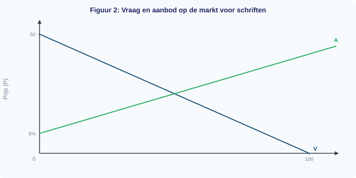

> **⚠️ Let op — veelgemaakte fout**
> Verwar *totale* kosten niet met *gemiddelde* kosten. TK stijgt als Q toeneemt (er komen kosten bij). Maar GTK *daalt* als Q toeneemt (de kosten worden over meer eenheden verdeeld). Een hogere TK betekent dus niet automatisch hogere kosten per stuk — het kan juist goedkoper per stuk worden.

---

### Het spreidingseffect

Waarom is het voor een bedrijf aantrekkelijk om meer te produceren? Omdat de vaste kosten per stuk dalen. Dit noemen economen het **spreidingseffect** (of: degressie van de constante kosten).

Denk aan een streamingdienst die een serie produceert voor €10 miljoen. Of 1 miljoen mensen kijken of 10 miljoen maakt voor de productiekosten niet uit — die €10 miljoen is al uitgegeven. Maar de kosten per kijker dalen spectaculair:

| Aantal kijkers | GCK per kijker |
|---------------|---------------|
| 1.000.000     | €10,00        |
| 5.000.000     | €2,00         |
| 10.000.000    | €1,00         |

Hoe meer kijkers, hoe lager de kosten per kijker. Dit verklaart waarom bedrijven met hoge vaste kosten (techbedrijven, luchtvaart, energiecentrales) streven naar een zo groot mogelijke afzet.

---

### Overzicht van de zeven kostenbegrippen

Figuur 3 vat alle kostenbegrippen in een overzicht samen.


De onderstaande samenvattingstabel kun je in je schrift overnemen als naslagkaart:

| Afkorting | Volledige naam | Formule | Verloop bij stijgende Q |
|-----------|---------------|---------|------------------------|
| TCK | Totale constante kosten | vast bedrag | constant |
| TVK | Totale variabele kosten | GVK x Q | stijgend |
| TK  | Totale kosten | TCK + TVK | stijgend |
| GCK | Gemiddelde constante kosten | TCK / Q | dalend |
| GVK | Gemiddelde variabele kosten | TVK / Q | constant* |
| GTK | Gemiddelde totale kosten | TK / Q | dalend |

*\*GVK is constant wanneer de variabele kosten per stuk niet veranderen. In de praktijk kan GVK soms stijgen of dalen — dat leer je in latere hoofdstukken.*

---

## Uitgewerkt voorbeeld

> **De fietsenmaker**
>
> Een fietsenmaker heeft constante kosten van €800 per maand (huur werkplaats, gereedschap, verzekering). De variabele kosten zijn €15 per fietsreparatie (onderdelen en smeermiddelen).

**(a)** Schrijf de formules voor TCK, TVK en TK als functie van Q (het aantal reparaties).

*Stap 1: Identificeer de constante en variabele kosten.*

- Constante kosten: €800 per maand → TCK = 800
- Variabele kosten: €15 per reparatie → TVK = 15 x Q

*Stap 2: Stel de formule voor TK op.*

TK = TCK + TVK = 800 + 15Q

**(b)** Bereken TK, TVK en TCK bij Q = 40 en Q = 80.

*Stap 3: Vul de hoeveelheden in.*

| Q | TCK (€) | TVK (€) | TK (€) |
|---|---------|---------|--------|
| 40  | 800 | 15 x 40 = 600   | 800 + 600 = 1400 |
| 80  | 800 | 15 x 80 = 1200  | 800 + 1200 = 2000 |

**(c)** Bereken GTK, GVK en GCK bij Q = 40 en Q = 80.

*Stap 4: Deel de totalen door Q.*

| Q | GCK (€) | GVK (€) | GTK (€) |
|---|---------|---------|---------|
| 40  | 800 / 40 = 20,00  | 600 / 40 = 15,00  | 1400 / 40 = 35,00 |
| 80  | 800 / 80 = 10,00  | 1200 / 80 = 15,00 | 2000 / 80 = 25,00 |

Controle: GTK = GCK + GVK → 20 + 15 = 35 ✓ en 10 + 15 = 25 ✓

**(d)** Wat gebeurt er met GTK als Q toeneemt?

GTK daalt van €35 naar €25. Dit komt doordat GCK daalt (van €20 naar €10): de vaste kosten worden over meer reparaties verspreid. GVK blijft constant op €15. Dus de daling van GTK wordt volledig veroorzaakt door het spreidingseffect van de constante kosten.

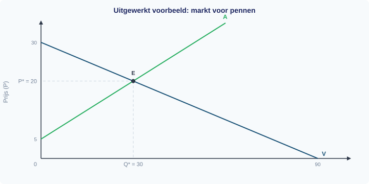

---

> **Samenvatting §1.3.2**
> - Kosten bestaan uit **constante kosten** (CK, veranderen niet met Q) en **variabele kosten** (VK, veranderen wel met Q).
> - **Totale kosten**: TK = TCK + TVK. TCK is vast, TVK stijgt met Q.
> - **Gemiddelde kosten**: GTK = TK/Q, GVK = TVK/Q, GCK = TCK/Q. Ook geldt: GTK = GCK + GVK.
> - **Spreidingseffect**: GCK daalt als Q stijgt, omdat de vaste kosten over meer eenheden worden verdeeld. Daardoor daalt ook GTK.
> - GVK is constant wanneer de variabele kosten per stuk niet veranderen.
> - *In §1.3.3 leer je hoe je de opbrengsten (TO, GO) berekent en vergelijkt met de kosten om de winst te bepalen.*

> **💡 Vastgelopen op een opgave?**
> Op de website vind je bij elke opgave een **begeleide inoefening**: stap voor stap krijg je extra hints en tussenstappen. Klik op de opgave om de begeleiding te starten.

---

## Opgaven

### Startoefeningen

**Opgave 1** *(lees de grafiek — zie figuur 4)*

In figuur 4 zie je de TK-, TVK- en TCK-lijnen van een kledingfabriek.

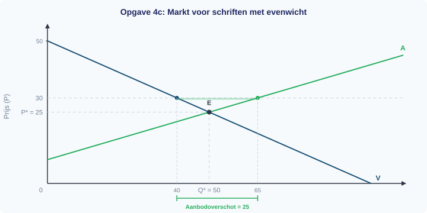

a) Lees uit de grafiek af: hoe hoog zijn de totale constante kosten (TCK)?

b) Lees af: wat zijn de totale kosten (TK) bij Q = 200? En wat zijn de totale variabele kosten (TVK) bij Q = 200?

c) Controleer: klopt het dat TK = TCK + TVK bij Q = 200? Laat je berekening zien.

d) Een medewerker zegt: "Als we meer produceren, stijgen alle kosten." Klopt deze bewering? Leg uit welke kosten stijgen en welke niet.


**Opgave 2** *(bereken en teken)*

Een cateringbedrijf heeft vaste kosten van €600 per maand (huur keuken, apparatuur). De variabele kosten bedragen €4 per maaltijd.

a) Schrijf de formules voor TCK, TVK en TK als functie van Q (het aantal maaltijden).

b) Bereken TK bij Q = 50, Q = 150 en Q = 300. Zet de resultaten in een tabel.

c) Teken de drie kostenlijnen (TCK, TVK en TK) in een assenstelsel met Q op de x-as en kosten (€) op de y-as. Gebruik het lege assenstelsel in figuur 5.


d) Leg uit waarom de TK-lijn en de TVK-lijn evenwijdig lopen.


**Opgave 3** *(gemiddelde kosten berekenen — geen grafiek)*

Een drukkerij heeft constante kosten van €1200 per maand. De variabele kosten zijn €0,50 per flyer.

a) Bereken GTK, GVK en GCK bij een productie van 400 flyers.

b) Bereken GTK, GVK en GCK bij een productie van 2400 flyers.

c) Leg uit waarom GTK daalt als de productie stijgt. Gebruik de begrippen GCK en GVK in je uitleg.

d) Een klant bestelt 400 flyers en betaalt €4 per stuk. Een andere klant bestelt 2400 flyers en betaalt €1,50 per stuk. Bij welke bestelling verdient de drukkerij meer per flyer? Leg uit.

---

### Zelfstandige oefening

**Opgave 4**

Een sportschool heeft vaste kosten van €3000 per maand (huur, apparatuur, personeel). De variabele kosten per lid bedragen €5 per maand (water, schoonmaak, handdoeken).

a) Schrijf de formules voor TCK, TVK en TK als functie van Q (het aantal leden).

b) Bereken TK, GTK, GVK en GCK bij Q = 100 en Q = 600. Zet alle resultaten in een overzichtelijke tabel.

c) De sportschool rekent een maandabonnement van €15 per lid. Bereken bij welk aantal leden de opbrengst per lid precies gelijk is aan de gemiddelde totale kosten (GTK). *Hint: stel GO = GTK en los op naar Q.*

d) Teken de GCK-, GVK- en GTK-lijnen in een assenstelsel. Geef aan naar welke waarde GTK kruipt bij heel grote Q.


**Opgave 5**

Twee bedrijven produceren hetzelfde product:

| | Bedrijf A | Bedrijf B |
|---|-----------|-----------|
| TCK per maand | €2000 | €500 |
| GVK per stuk | €3 | €6 |

a) Schrijf voor beide bedrijven de formule voor TK als functie van Q.

b) Bereken voor beide bedrijven GTK bij Q = 200 en Q = 1000.

c) Bij welk productievolume zijn de GTK van beide bedrijven gelijk? Laat je berekening zien.

d) Welk bedrijf heeft een voordeel bij een groot productievolume? Leg uit met het begrip spreidingseffect.

---

### Herhaling (interleaving)

**Opgave 6** *(herhaling §1.2.1: betalingsbereidheid en koopbeslissing)*

Een consument wil smoothies kopen. Zijn betalingsbereidheid: €5 voor de eerste, €3,50 voor de tweede, €2 voor de derde, €0,75 voor de vierde.

a) De marktprijs is €3. Hoeveel smoothies koopt de consument?

b) Bereken het totale consumentensurplus.


**Opgave 7** *(herhaling §1.2.2: verschuiving van de vraaglijn)*

De markt voor fietsen wordt getroffen door twee gebeurtenissen:
1. De benzineprijs stijgt fors.
2. Tegelijkertijd verlaagt een grote fietsenfabrikant zijn prijzen.

a) Welke gebeurtenis leidt tot een verschuiving van de vraaglijn naar fietsen? Leg uit welke richting de vraaglijn verschuift en noem de vraagfactor.

b) Welke gebeurtenis leidt tot een beweging langs de vraaglijn? Leg uit.


**Opgave 8** *(herhaling §1.3.1: opbrengsten — als §1.3.1 behandeld is)*

Een marktkraam verkoopt bloemen voor €3 per bos. De vaste kosten zijn €80 per dag. De variabele kosten bedragen €1,20 per bos.

a) Bereken de totale opbrengst (TO) bij een verkoop van 60 bossen.

b) Bereken de totale kosten (TK) bij Q = 60.

c) Bereken de winst bij Q = 60.

---

### Doeloefening

**Opgave 9**

Een bakkerij heeft constante kosten van €500 per maand (huur, verzekering). Elk brood kost €0,80 aan ingredienten en energie (variabele kosten per stuk).

a) Schrijf de formules voor TK, TVK en TCK als functie van Q.

b) Bereken TK, TVK en TCK bij Q = 500 en Q = 1000.

c) Bereken GTK, GVK en GCK bij Q = 500 en Q = 1000.

d) Wat gebeurt er met GTK als Q toeneemt? Leg uit waarom dit logisch is.

e) Een leerling zegt: "GCK is altijd hetzelfde." Klopt dit? Leg uit.

---

### Denkertje *(bonusopgave)*

**Opgave 10**

Twee ijsfabrieken produceren precies hetzelfde ijs. Fabriek X heeft gekozen voor dure, moderne robots (hoge vaste kosten, lage variabele kosten per stuk). Fabriek Y werkt met goedkopere apparatuur en meer handarbeid (lage vaste kosten, hoge variabele kosten per stuk).

a) Schets voor beide fabrieken (in dezelfde grafiek) een mogelijke GTK-lijn. Geef aan bij welk productievolume fabriek X goedkoper produceert dan fabriek Y, en andersom.

b) In een recessie daalt de vraag naar ijs sterk. Welke fabriek zit dan in een moeilijkere positie? Beargumenteer je antwoord met behulp van de begrippen GCK en spreidingseffect.

c) Bedenk een ander voorbeeld uit de echte wereld van een bedrijf met zeer hoge vaste kosten en lage variabele kosten. Leg uit waarom zo'n bedrijf een groot afzetvolume nodig heeft om winstgevend te zijn.


<div style="break-before: page;"></div>

# 1.3.3 Opbrengsten

## Wanneer verdient de bakker geld?

De bakker uit de vorige paragraaf kent nu zijn kosten: de constante kosten zijn €500 per week (huur, verzekering, afschrijving) en de variabele kosten zijn €0,80 per brood. Zijn totale kosten: TK = 500 + 0,80Q.

Maar kosten zijn maar de helft van het verhaal. De bakker wil ook weten: hoeveel geld komt er *binnen*? En vooral: bij hoeveel broden verdient hij meer dan hij uitgeeft? Vanaf welk punt maakt hij winst?

---

> **Herhaling uit 1.3.2**
> De totale kosten bestaan uit constante en variabele kosten:
> TK = TCK + TVK = 500 + 0,80Q
> De gemiddelde totale kosten: GTK = TK / Q

---

## Theorie

### Totale opbrengst (TO)

De bakker verkoopt elk brood voor €1,50. Als hij 100 broden verkoopt, ontvangt hij 100 x €1,50 = €150. Dat bedrag heet de **totale opbrengst**.

> **Definitie: Totale opbrengst (TO)**
> Het totale bedrag dat een producent ontvangt uit de verkoop van zijn producten.
> TO = P x Q
> waarbij P = prijs per stuk en Q = verkochte hoeveelheid.

We rekenen de totale opbrengst bij een paar hoeveelheden uit:

| Q (broden) | P (€) | TO = P x Q (€) |
|---|---|---|
| 0 | 1,50 | 0 |
| 200 | 1,50 | 300 |
| 500 | 1,50 | 750 |
| 1000 | 1,50 | 1.500 |

De TO-lijn begint in de oorsprong (bij Q = 0 is de opbrengst €0) en loopt recht omhoog. Hoe meer de bakker verkoopt, hoe hoger zijn opbrengst.

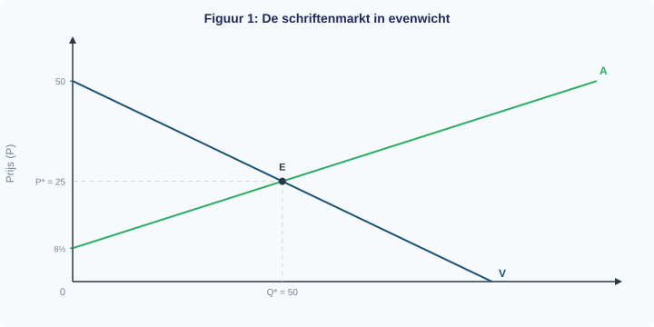

---

### Gemiddelde opbrengst (GO)

Hoeveel opbrengst levert elk brood gemiddeld op? Dat is de **gemiddelde opbrengst**.

> **Definitie: Gemiddelde opbrengst (GO)**
> De opbrengst per verkochte eenheid.
> GO = TO / Q

We berekenen GO bij Q = 500:
GO = 750 / 500 = €1,50

En bij Q = 1000:
GO = 1.500 / 1000 = €1,50

De gemiddelde opbrengst is steeds €1,50 — precies gelijk aan de prijs. Dat is logisch: als elk brood dezelfde prijs heeft, is de gemiddelde opbrengst per brood altijd gelijk aan die prijs.

> **Formule**
> ```
> TO = P x Q
> GO = TO / Q = P   (bij constante prijs)
> ```

> **Let op — veelgemaakte fout**
> Leerlingen verwarren soms *opbrengst* met *winst*. Opbrengst is alles wat binnenkomt (TO = P x Q). Winst is wat er overblijft na aftrek van de kosten (TO - TK). Je kunt een hoge opbrengst hebben en toch verlies draaien als de kosten hoger zijn.

---

### Winst en verlies

De bakker wil uiteindelijk weten: hoeveel houdt hij over? Het verschil tussen opbrengst en kosten is de **winst**.

> **Definitie: Winst**
> Het verschil tussen de totale opbrengst en de totale kosten.
> Winst = TO - TK
> Als de winst negatief is, spreken we van **verlies**.

We rekenen de winst bij twee productieniveaus uit:

| Q | TO = 1,50Q (€) | TK = 500 + 0,80Q (€) | Winst = TO - TK (€) |
|---|---|---|---|
| 500 | 750 | 900 | -150 (verlies) |
| 1000 | 1.500 | 1.300 | 200 (winst) |

Bij 500 broden maakt de bakker €150 verlies. Bij 1000 broden maakt hij €200 winst. Ergens daartussenin slaat het om van verlies naar winst. Dat omslagpunt heet het *break-evenpunt*.

---

### Het break-evenpunt

Het **break-evenpunt** is de productieomvang waarbij de winst precies nul is: de opbrengst dekt exact de kosten.

> **Definitie: Break-evenpunt**
> Het productieniveau waarbij TO = TK, dus winst = 0.
> De producent maakt geen winst en geen verlies.

We berekenen het break-evenpunt van de bakker:

TO = TK
1,50Q = 500 + 0,80Q
1,50Q - 0,80Q = 500
0,70Q = 500
Q = 500 / 0,70
**Q = 714,3 broden** (afgerond op 1 decimaal)

Bij 714,3 broden is TO = TK = €1.071,43. Onder dit punt maakt de bakker verlies, erboven maakt hij winst.

> **Formule**
> ```
> Break-evenpunt: TO = TK
> P x Q = TCK + GVK x Q
> Q_break-even = TCK / (P - GVK)
> ```
> De uitdrukking (P - GVK) heet ook wel de *bijdrage per stuk* of *dekkingsbijdrage*: het bedrag dat elk verkocht product bijdraagt aan het dekken van de constante kosten.

---

### De grafiek: TK en TO samen

Nu tekenen we de TK-lijn en de TO-lijn in dezelfde grafiek. Dit is de krachtigste manier om winst, verlies en het break-evenpunt in een oogopslag te zien.

We beginnen met de TK-lijn. Die start bij €500 (de constante kosten bij Q = 0) en loopt omhoog met een helling van €0,80 per brood.

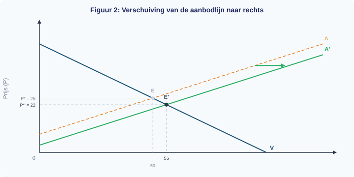

Nu voegen we de TO-lijn toe. Die start in de oorsprong en loopt omhoog met een helling van €1,50 per brood. Omdat de helling van TO (€1,50) groter is dan de helling van TK (€0,80), haalt de TO-lijn de TK-lijn op een gegeven moment in.

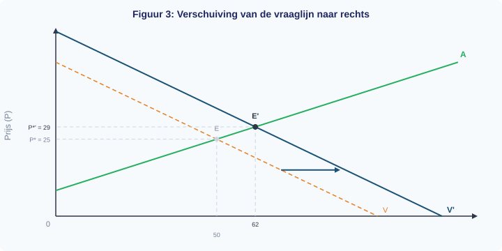

Het snijpunt van de twee lijnen is het break-evenpunt: Q = 714,3 broden, TO = TK = €1.071,43.

- **Links van het break-evenpunt**: TK > TO, dus de bakker maakt *verlies*. Het verlies is de verticale afstand tussen TK en TO.
- **Rechts van het break-evenpunt**: TO > TK, dus de bakker maakt *winst*. De winst is de verticale afstand tussen TO en TK.

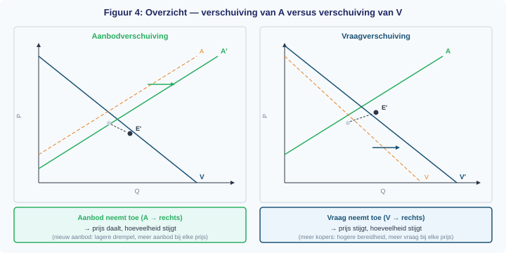

In figuur 4 is het verliesgebied (links van het break-evenpunt) rood gearceerd en het winstgebied (rechts) groen gearceerd. Bij Q = 1000 is de winst de verticale afstand tussen TO en TK: €1.500 - €1.300 = €200.

| Q | TO (€) | TK (€) | Winst/Verlies (€) | Toelichting |
|---|---|---|---|---|
| 0 | 0 | 500 | -500 | Alleen constante kosten |
| 500 | 750 | 900 | -150 | Verliesgebied |
| 714,3 | 1.071,43 | 1.071,43 | 0 | Break-evenpunt |
| 1000 | 1.500 | 1.300 | 200 | Winstgebied |

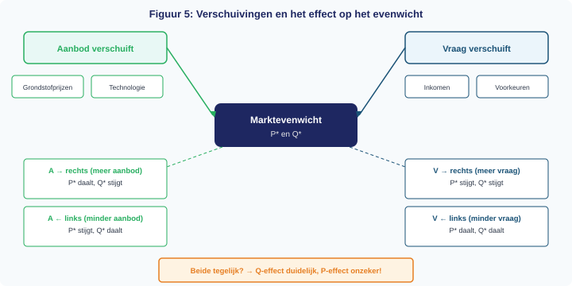

---

## Uitgewerkt voorbeeld

> **De fietsenmaker**
>
> Een fietsenmaker heeft constante kosten van €800 per maand (huur werkplaats, gereedschap). De variabele kosten per reparatie zijn €15. Hij rekent €35 per reparatie.

**(a)** Schrijf de formules voor TO en TK als functie van Q (het aantal reparaties).

*Stap 1: Stel de formule voor TO op.*
TO = P x Q = 35Q

*Stap 2: Stel de formule voor TK op.*
TK = TCK + GVK x Q = 800 + 15Q

---

**(b)** Bereken de winst bij Q = 30 en Q = 60 reparaties.

*Stap 1: Bereken TO en TK bij Q = 30.*
TO = 35 x 30 = €1.050
TK = 800 + 15 x 30 = 800 + 450 = €1.250

*Stap 2: Bereken de winst.*
Winst = TO - TK = 1.050 - 1.250 = **-€200** (verlies)

*Stap 3: Herhaal voor Q = 60.*
TO = 35 x 60 = €2.100
TK = 800 + 15 x 60 = 800 + 900 = €1.700
Winst = 2.100 - 1.700 = **€400** (winst)

---

**(c)** Bereken het break-evenpunt.

*Stap 1: Stel TO = TK.*
35Q = 800 + 15Q

*Stap 2: Los op naar Q.*
35Q - 15Q = 800
20Q = 800
Q = 800 / 20
**Q = 40 reparaties**

*Stap 3: Controleer.*
TO = 35 x 40 = €1.400
TK = 800 + 15 x 40 = €1.400
TO = TK ✓

De fietsenmaker moet minimaal 40 reparaties per maand doen om uit de kosten te komen.


---

> **Samenvatting 1.3.3**
> - De **totale opbrengst** is het totale verkoopbedrag: TO = P x Q.
> - De **gemiddelde opbrengst** is de opbrengst per stuk: GO = TO / Q. Bij een constante prijs geldt GO = P.
> - **Winst** = TO - TK. Is de winst negatief, dan is er *verlies*.
> - Het **break-evenpunt** is het productieniveau waarbij TO = TK (winst = 0). Bereken: Q = TCK / (P - GVK).
> - In de grafiek is het break-evenpunt het snijpunt van de TK-lijn en de TO-lijn. Links ervan is verlies, rechts winst.
> - *In 1.3.4 oefen je met opgaven die kosten en opbrengsten combineren.*

> **Vastgelopen op een opgave?**
> Op de website vind je bij elke opgave een **begeleide inoefening**: stap voor stap krijg je extra hints en tussenstappen. Klik op de opgave om de begeleiding te starten.

---

## Opgaven

### Startoefeningen

**Opgave 1** *(lees de grafiek — zie figuur 6)*

In figuur 6 zie je de TK-lijn en de TO-lijn van een kledingwinkel.

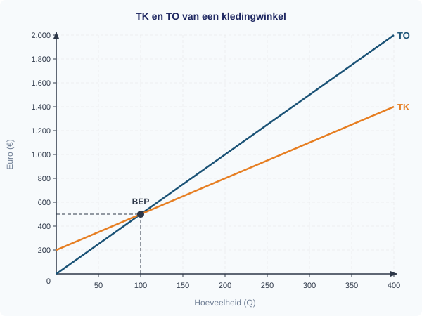

a) Lees uit de grafiek af: wat is de totale opbrengst bij Q = 200?

b) Lees uit de grafiek af: wat zijn de totale kosten bij Q = 200?

c) Maakt de kledingwinkel winst of verlies bij Q = 200? Bereken het verschil.

d) Bij welke hoeveelheid ligt ongeveer het break-evenpunt? Leg uit hoe je dit uit de grafiek afleest.


**Opgave 2** *(teken in de grafiek — zie figuur 7)*

Een bloemist heeft constante kosten van €300 per week en variabele kosten van €2 per boeket. Ze verkoopt elk boeket voor €5.

a) Bereken TO en TK bij Q = 50 en Q = 150.

b) In figuur 7 is de TK-lijn al getekend. Teken de TO-lijn in dezelfde grafiek. Markeer het break-evenpunt.


c) Arceer in je grafiek het winstgebied bij Q = 150.


**Opgave 3** *(redeneer zonder grafiek)*

Een ijssalon heeft constante kosten van €600 per maand en variabele kosten van €1,20 per ijsje. De verkoopprijs is €3 per ijsje.

a) Schrijf de formules voor TO en TK als functie van Q.

b) Bereken de winst bij Q = 400. Maakt de ijssalon winst of verlies?

c) Bereken het break-evenpunt. Geef je antwoord in hele ijsjes (rond naar boven af).

d) Leg uit waarom de ijssalon verlies maakt als hij minder dan het break-evenaantal verkoopt.

---

### Zelfstandige oefening

**Opgave 4**

Een drukkerij heeft constante kosten van €1.200 per maand. De variabele kosten per poster zijn €0,60. De verkoopprijs per poster is €1,80.

a) Stel de formules op voor TO en TK als functie van Q.

b) Bereken de winst bij Q = 800 en Q = 1500.

c) Bereken het break-evenpunt.

d) De eigenaar overweegt de prijs te verhogen naar €2,10. Bereken het nieuwe break-evenpunt. Wat valt je op?

e) Teken een grafiek met de TK-lijn en beide TO-lijnen (bij €1,80 en bij €2,10). Markeer beide break-evenpunten.


**Opgave 5**

Een foodtruck verkoopt hamburgers voor €6 per stuk. De constante kosten zijn €400 per dag (huur standplaats, generator). De variabele kosten per hamburger zijn €2,50.

a) Bereken GO bij Q = 100.

b) Bereken de winst bij Q = 100 en bij Q = 150.

c) Bereken het break-evenpunt. Hoeveel hamburgers moet de foodtruck minimaal verkopen om geen verlies te maken?

d) De eigenaar wil minstens €250 winst per dag maken. Bereken hoeveel hamburgers hij dan moet verkopen.

---

### Herhaling (interleaving)

**Opgave 6** *(herhaling 1.3.1: constante en variabele kosten)*

Een cateringbedrijf heeft de volgende kosten per maand:
- Huur keuken: €900
- Ingredienten per maaltijd: €4,50
- Verpakking per maaltijd: €0,50
- Afschrijving apparatuur: €300

a) Welke kosten zijn constant en welke zijn variabel?

b) Bereken TCK, GVK en TK bij Q = 200 maaltijden.


**Opgave 7** *(herhaling 1.3.2: GTK berekenen)*

Een T-shirtbedrijf heeft TK = 400 + 2,50Q.

a) Bereken GTK bij Q = 100 en Q = 400.

b) Leg uit waarom GTK daalt als Q toeneemt.


**Opgave 8** *(herhaling 1.2.2: vraagfactoren)*

De prijs van koffiecups voor een koffieapparaat daalt van €0,40 naar €0,25.

a) Verwacht je dat de vraag naar koffieapparaten stijgt of daalt? Leg uit welke vraagfactor hier speelt.

b) Is dit een beweging langs of een verschuiving van de vraaglijn van koffieapparaten?

---

### Doeloefening

**Opgave 9**

De bakker uit de theorie verkoopt brood voor €1,50 per stuk. Zijn constante kosten zijn €500 en zijn variabele kosten zijn €0,80 per brood (TK = 500 + 0,80Q).

a) Schrijf de formule voor TO als functie van Q.

b) Bereken TO en winst (TO - TK) bij Q = 500 en Q = 1000.

c) Bereken GO (= TO/Q) bij Q = 500. Wat valt je op?

d) Bij welk productieniveau draait de bakker precies break-even (winst = 0)? Laat dit zien met een berekening.

e) Teken een grafiek met TK en TO. Markeer het break-evenpunt. Arceer het winstgebied bij Q = 1000.

---

### Denkertje *(bonusopgave)*

**Opgave 10**

De bakker overweegt om de prijs van zijn brood te verlagen van €1,50 naar €1,20. Hij verwacht dat hij daardoor 30% meer broden verkoopt.

a) Stel dat de bakker nu 1000 broden per week verkoopt. Bereken de winst bij de huidige prijs (€1,50).

b) Bereken de verwachte afzet en de winst bij de nieuwe prijs (€1,20).

c) Is de prijsverlaging een goed idee? Beargumenteer je antwoord. Bedenk daarbij: welke informatie mist de bakker nog om een definitieve beslissing te nemen?


<div style="break-before: page;"></div>

# Gemengde opgaven §1.3.4 — Aanbod en kosten

---

## Opgave 1: Bakkerij "Korenveld"

Maaike is eigenaar van bakkerij "Korenveld" in Amersfoort. Ze verkoopt ambachtelijke croissants aan horecazaken in de regio. De verkoopprijs is vast: elke croissant levert €2,50 op. Maaike huurt een bakkerij voor €800 per maand (vast contract, ongeacht productie). De kosten voor ingrediënten, energie en verpakking hangen af van het aantal croissants dat ze bakt.

In haar jaarverslag heeft Maaike de kosten en opbrengsten per maand samengevat voor verschillende productieniveaus.

**Tabel 1: Kosten en opbrengsten bakkerij "Korenveld" per maand**

| Productie (stuks) | Constante kosten (€) | Variabele kosten (€) | Totale kosten (€) | Totale opbrengst (€) |
|---|---|---|---|---|
| 0 | 800 | 0 | 800 | 0 |
| 200 | 800 | 300 | 1.100 | 500 |
| 400 | 800 | 500 | 1.300 | 1.000 |
| 600 | 800 | 750 | 1.550 | 1.500 |
| 800 | 800 | 1.100 | 1.900 | 2.000 |
| 1.000 | 800 | 1.600 | 2.400 | 2.500 |
| 1.200 | 800 | 2.400 | 3.200 | 3.000 |

---

**1** *(2p)* Bereken de gemiddelde variabele kosten (GVK) en de gemiddelde totale kosten (GTK) bij een productie van 800 croissants. Laat je berekening zien.

**2** *(2p)* Bereken de winst van bakkerij "Korenveld" bij een productie van 1.000 croissants per maand.

**3** *(2p)* Leg uit bij welk productieniveau Maaike break-even draait. Gebruik de gegevens uit tabel 1 in je antwoord.

**4** *(2p)* Bepaal met behulp van tabel 1 bij welke productie de winst maximaal is. Laat zien hoe je dit vaststelt.

**5** *(2p)* Maaike overweegt om 1.200 croissants per maand te bakken in plaats van 1.000. Leg uit waarom dit bedrijfseconomisch geen verstandige keuze is, ook al verkoopt ze dan meer croissants.

**Denkertje** *(2p)* Maaike zegt: "Hoe meer ik produceer, hoe lager mijn gemiddelde kosten, dus ik moet altijd zoveel mogelijk bakken." Beoordeel of deze uitspraak klopt. Gebruik gegevens uit tabel 1 om je antwoord te onderbouwen.

---

## Opgave 2: Fietsfabriek "VeloTech"

Fietsfabriek "VeloTech" produceert stadsfietsen. Figuur 1 toont de oorspronkelijke aanbodlijn van stadsfietsen op de Nederlandse markt.


Lees het volgende nieuwsbericht:

> **Staalprijs stijgt met 30% door exportbeperkingen**
>
> De prijs van staal is het afgelopen kwartaal fors gestegen. China heeft exportbeperkingen ingevoerd voor staal, waardoor de wereldwijde aanvoer is afgenomen. Voor Nederlandse fietsfabrikanten betekent dit hogere inkoopkosten voor frames en onderdelen. Branchevereniging RAI verwacht dat de productiekosten per fiets gemiddeld met €40 stijgen.

VeloTech heeft de volgende kostenstructuur bij een productie van 5.000 fietsen per jaar:

**Tabel 2: Kostenstructuur VeloTech (5.000 fietsen per jaar)**

| Kostenpost | Bedrag (€) | Type |
|---|---|---|
| Huur fabriek | 200.000 | Constant |
| Afschrijving machines | 80.000 | Constant |
| Salarissen vaste medewerkers | 120.000 | Constant |
| Staal en onderdelen | 500.000 | Variabel |
| Energie | 50.000 | Variabel |
| Verpakking en transport | 100.000 | Variabel |

De verkoopprijs per fiets is €230. Na de staalstijging worden de kosten voor staal en onderdelen €200.000 hoger (€700.000 in totaal).

---

**6** *(2p)* Bereken de totale constante kosten (TCK) en de totale variabele kosten (TVK) van VeloTech vóór de staalstijging. Gebruik tabel 2.

**7** *(2p)* Bereken de gemiddelde totale kosten (GTK) per fiets vóór de staalstijging.

**8** *(2p)* Het nieuwsbericht beschrijft een stijging van de staalprijs. Noem de aanbodfactor die hierdoor verandert. Leg uit of dit leidt tot een verschuiving van de aanbodlijn of een beweging langs de aanbodlijn.

**9** *(2p)* Leg uit dat de stijging van de staalprijs leidt tot een daling van de winst per fiets voor VeloTech. Gebruik een berekening vóór en ná de staalstijging.

**10** *(3p)* Na de staalstijging overweegt VeloTech de verkoopprijs te verhogen naar €270. Een concurrent biedt vergelijkbare fietsen aan voor €250. Leg uit wat het effect is op de aanbodlijn als VeloTech de prijs verhoogt naar €270. Is dit een verschuiving of een beweging langs de lijn? Motiveer je antwoord.

**Denkertje** *(2p)* Een econoom zegt: "Als de productiekosten stijgen, moeten bedrijven altijd hun verkoopprijs verhogen om te overleven." Beoordeel deze uitspraak. Geef in je antwoord minstens één reden waarom een bedrijf ervoor kan kiezen de prijs niet te verhogen.

<div style="break-before: page;"></div>

<div class="chapter-front">

<h1>Hoofdstuk 4 — Marktevenwicht en marginale analyse</h1>

<h2>Inhoud</h2>

<table>
<thead><tr><th>§</th><th>Onderwerp</th></tr></thead>
<tbody>
<tr><td>1.4.1</td><td>Marktevenwicht</td></tr>
<tr><td>1.4.2</td><td>Verschuivingen en nieuw evenwicht</td></tr>
<tr><td>1.4.3</td><td>Marginale kosten en marginale opbrengsten</td></tr>
<tr><td>1.4.4</td><td>Winstmaximalisatie</td></tr>
<tr><td>1.4.5</td><td>Gemengde opgaven</td></tr>
</tbody>
</table>

<h2>Leerdoelen</h2>

<p>Na dit hoofdstuk kun je:</p>

<ul>
<li>Het marktevenwicht berekenen door Qa = Qv op te lossen</li>
<li>De evenwichtsprijs en -hoeveelheid grafisch aflezen</li>
<li>Een aanbodoverschot of vraagoverschot herkennen en berekenen bij een gegeven prijs</li>
<li>Een nieuw evenwicht berekenen na een verschuiving van vraag of aanbod</li>
<li>Voorspellen welke richting prijs en hoeveelheid opgaan na een verschuiving</li>
<li>Analyseren wat er gebeurt bij gelijktijdige verschuivingen (dubbelzinnig prijseffect)</li>
<li>MK definiëren als de extra kosten van één extra eenheid (ΔTK/ΔQ)</li>
<li>MO definiëren als de extra opbrengst van één extra eenheid (ΔTO/ΔQ)</li>
<li>MK en MO berekenen vanuit een tabel</li>
<li>De winstmaximalisatieregel toepassen: produceer waar MO = MK</li>
<li>De optimale productieomvang berekenen met en zonder tabel</li>
</ul>

<h2>Wanneer stopt de fabrikant met produceren?</h2>

<p>Een fabrikant kan altijd meer produceren — maar moet hij dat ook doen? Elke extra eenheid levert geld op, maar kost ook geld. Zolang de extra opbrengst hoger is dan de extra kosten, loont het om door te gaan. Maar op een gegeven moment kantelt het. In dit hoofdstuk leer je eerst hoe vraag en aanbod samen de marktprijs bepalen, en daarna hoe een producent met marginale analyse precies het punt vindt waar de winst het grootst is.</p>

</div>


<div style="break-before: page;"></div>

# 1.4.1 Marktevenwicht

## Twee lijnen, één kruispunt — en toch snapt bijna niemand het in één keer

Op de markt voor schriften bieden producenten schriften aan en willen scholieren ze kopen. Je kent de vraaglijn al: hoe lager de prijs, hoe meer schriften er gevraagd worden. En je kent de aanbodlijn: hoe hoger de prijs, hoe meer schriften er aangeboden worden.

Maar welke prijs wordt het uiteindelijk? De vraag zegt "liever goedkoop", het aanbod zegt "liever duur". Ergens daartussenin moeten ze het eens worden. Dat punt heet het **marktevenwicht** — en in deze paragraaf leer je hoe je het berekent, tekent en controleert.

---

## Theorie

### De vraaglijn en de aanbodlijn samen

> **📋 Herhaling uit §1.2.2**
> De vraaglijn (V) laat het verband zien tussen de prijs en de gevraagde hoeveelheid, **terwijl alle andere omstandigheden gelijk blijven**. Een verandering van een vraagfactor (inkomen, voorkeuren, prijs van substituten/complementen, verwachtingen) verschuift de hele vraaglijn.

> **📋 Herhaling uit §1.3.1**
> De aanbodlijn (A) laat het verband zien tussen de prijs en de aangeboden hoeveelheid, **terwijl alle andere omstandigheden gelijk blijven**. Een verandering van een aanbodfactor (grondstofprijzen, technologie, aantal aanbieders, verwachtingen) verschuift de hele aanbodlijn.

Stel dat op de markt voor schriften de volgende vergelijkingen gelden:

- **Vraaglijn:** Qv = −2P + 100
- **Aanbodlijn:** Qa = 3P − 25

We tekenen eerst de vraaglijn. Bij P = 0 is de gevraagde hoeveelheid Qv = 100 stuks (het x-snijpunt). Bij Qv = 0 is de prijs P = 50 (het y-snijpunt).

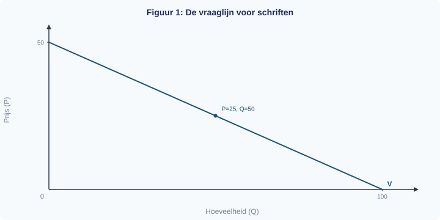

Nu voegen we de aanbodlijn toe. De aanbodlijn begint bij P = 8⅓ (want bij Q = 0 geldt: 0 = 3P − 25, dus P = 25/3 ≈ 8,33). Hoe hoger de prijs, hoe meer schriften producenten willen aanbieden.


---

### Het evenwicht berekenen

Het **marktevenwicht** is het punt waar de gevraagde hoeveelheid precies gelijk is aan de aangeboden hoeveelheid. Er is dan geen overschot en geen tekort.

> **Definitie: Marktevenwicht**
> De situatie waarin de gevraagde hoeveelheid gelijk is aan de aangeboden hoeveelheid: Qv = Qa. De bijbehorende prijs heet de **evenwichtsprijs** (P*) en de bijbehorende hoeveelheid de **evenwichtshoeveelheid** (Q*).

**Hoe bereken je het evenwicht?** Stel Qv gelijk aan Qa en los op naar P:

> **Formule**
> ```
> Stap 1:  Qv = Qa
> Stap 2:  Los op naar P  →  P*
> Stap 3:  Vul P* in  →  Q*
> ```

**Stap 1:** Stel Qv = Qa.

−2P + 100 = 3P − 25

**Stap 2:** Los op naar P.

100 + 25 = 3P + 2P

125 = 5P

P* = 25

**Stap 3:** Vul P* = 25 in een van de twee vergelijkingen in.

Qv = −2 × 25 + 100 = −50 + 100 = 50

**Controle:** Vul P* = 25 ook in de andere vergelijking in.

Qa = 3 × 25 − 25 = 75 − 25 = 50 ✓

Beide geven Q = 50, dus het klopt. De evenwichtsprijs is **P* = EUR 25** en de evenwichtshoeveelheid is **Q* = 50 schriften**.


> **⚠️ Let op — veelgemaakte fout**
> Leerlingen vergeten vaak de controlestap. Als je P* maar in één vergelijking invult, merk je een rekenfout niet op. Vul P* altijd in **beide** vergelijkingen in en controleer dat je dezelfde Q* krijgt.

---

### Overschot en tekort

Wat gebeurt er als de prijs niet gelijk is aan de evenwichtsprijs?

**Als de prijs hoger is dan P*** (bijvoorbeeld P = 30):
- Qv = −2 × 30 + 100 = 40 (consumenten willen maar 40 schriften)
- Qa = 3 × 30 − 25 = 65 (producenten bieden 65 schriften aan)
- Qa > Qv → er is een **aanbodoverschot** (surplus) van 65 − 40 = 25 stuks.

**Als de prijs lager is dan P*** (bijvoorbeeld P = 20):
- Qv = −2 × 20 + 100 = 60 (consumenten willen 60 schriften)
- Qa = 3 × 20 − 25 = 35 (producenten bieden maar 35 aan)
- Qv > Qa → er is een **vraagoverschot** (tekort) van 60 − 35 = 25 stuks.

> **Definitie: Aanbodoverschot (surplus)**
> Situatie waarin Qa > Qv: producenten bieden meer aan dan consumenten willen kopen. Ontstaat als de prijs **hoger** is dan de evenwichtsprijs.

> **Definitie: Vraagoverschot (tekort)**
> Situatie waarin Qv > Qa: consumenten willen meer kopen dan producenten aanbieden. Ontstaat als de prijs **lager** is dan de evenwichtsprijs.

De volgende tabel laat het verband zien bij drie verschillende prijzen:

| Prijs (EUR) | Qv = −2P + 100 | Qa = 3P − 25 | Verschil | Overschot of tekort? |
|---|---|---|---|---|
| 20 | 60 | 35 | Qv − Qa = 25 | Vraagoverschot |
| 25 | 50 | 50 | 0 | Evenwicht |
| 30 | 40 | 65 | Qa − Qv = 25 | Aanbodoverschot |

Figuur 4 vat de kernbegrippen van het marktevenwicht in één beeld samen.


---

## Uitgewerkt voorbeeld

> **De markt voor pennen**
>
> Op de markt voor pennen geldt:
> - Qv = −3P + 90
> - Qa = 2P − 10

**(a) Bereken de evenwichtsprijs en de evenwichtshoeveelheid.**

*Stap 1: Stel Qv = Qa.*

−3P + 90 = 2P − 10

*Stap 2: Los op naar P.*

90 + 10 = 2P + 3P

100 = 5P

P* = 20

*Stap 3: Vul P* = 20 in.*

Qv = −3 × 20 + 90 = −60 + 90 = 30

**Antwoord:** P* = EUR 20, Q* = 30 pennen.

**(b) Controleer je antwoord.**

Qa = 2 × 20 − 10 = 40 − 10 = 30 ✓

Beide vergelijkingen geven Q = 30, dus de berekening klopt.

**(c) Teken de vraaglijn en de aanbodlijn en markeer het evenwichtspunt.**

De vraaglijn loopt van (Q = 0, P = 30) naar (Q = 90, P = 0). De aanbodlijn begint bij (Q = 0, P = 5). Het evenwichtspunt E ligt op P* = 20, Q* = 30.


**(d) Bij een prijs van EUR 25: is er een overschot of een tekort? Bereken de grootte.**

*Stap 1: Bereken Qv en Qa bij P = 25.*

Qv = −3 × 25 + 90 = −75 + 90 = 15

Qa = 2 × 25 − 10 = 50 − 10 = 40

*Stap 2: Vergelijk.*

Qa = 40 > Qv = 15 → er is een **aanbodoverschot**.

*Stap 3: Bereken de grootte.*

Aanbodoverschot = Qa − Qv = 40 − 15 = 25 pennen.

**De procedure samengevat:**

| Stap | Actie |
|------|-------|
| 1 | Stel Qv = Qa en los op naar P → P* |
| 2 | Vul P* in een vergelijking in → Q* |
| 3 | Controleer: vul P* in de andere vergelijking in → dezelfde Q*? |
| 4 | Teken de lijnen en markeer E op (Q*, P*) |
| 5 | Bij een gegeven prijs: bereken Qv en Qa, vergelijk → overschot of tekort |

---

> **Samenvatting §1.4.1**
> - Het marktevenwicht is het punt waar Qv = Qa: de gevraagde hoeveelheid is gelijk aan de aangeboden hoeveelheid.
> - Je berekent P* door Qv = Qa te stellen en op te lossen naar P. Vul P* vervolgens in om Q* te vinden.
> - Controleer altijd door P* in **beide** vergelijkingen in te vullen.
> - Bij P > P* ontstaat een aanbodoverschot (Qa > Qv). Bij P < P* ontstaat een vraagoverschot (Qv > Qa).
> - *In de volgende paragraaf bekijken we wat er met het evenwicht gebeurt als de vraaglijn of aanbodlijn verschuift.*

> **💡 Vastgelopen op een opgave?**
> Op de website vind je bij elke opgave een **begeleide inoefening**: stap voor stap krijg je extra hints en tussenstappen. Klik op de opgave om de begeleiding te starten.

---

## Opgaven

### Startoefeningen

**Opgave 1** *(invuloefening)*

Op de markt voor schriften geldt: Qv = −2P + 100 en Qa = 3P − 25.

a) Vul in: het evenwicht vind je door Qv ... Qa te stellen (=, >, <).

b) Schrijf de vergelijking op die je moet oplossen om P* te vinden.

c) Wat is P*? Wat is Q*?

d) Controleer je antwoord door P* in de andere vergelijking in te vullen.


**Opgave 2** *(oefenen met de procedure)*

Op de markt voor potloden geldt:
- Qv = −4P + 80
- Qa = P − 5

a) Bereken de evenwichtsprijs P*.

b) Bereken de evenwichtshoeveelheid Q*.

c) Controleer je antwoord.


**Opgave 3** *(overschot en tekort)*

Gebruik de vergelijkingen uit opgave 2 (Qv = −4P + 80, Qa = P − 5).

a) Bereken Qv en Qa bij een prijs van EUR 20.

b) Is er bij P = 20 een vraagoverschot of een aanbodoverschot? Bereken de grootte.

c) Bereken Qv en Qa bij een prijs van EUR 10.

d) Is er bij P = 10 een vraagoverschot of een aanbodoverschot? Bereken de grootte.

---

### Zelfstandige oefening

**Opgave 4** *(de doeloefening — schriftenmarkt)*

Op de markt voor schriften geldt: Qv = −2P + 100 en Qa = 3P − 25.

a) Bereken de evenwichtsprijs en de evenwichtshoeveelheid.

b) Controleer je antwoord door P* in beide vergelijkingen in te vullen.

c) Teken de vraaglijn en de aanbodlijn in een grafiek en markeer het evenwichtspunt. *(Zie figuur 5 voor een leeg assenstelsel.)*


d) Bij een prijs van EUR 30: is er een aanbodoverschot of een vraagoverschot? Bereken de grootte.


**Opgave 5** *(nieuwe markt)*

Op de markt voor USB-sticks geldt:
- Qv = −P + 40
- Qa = 2P − 20

a) Bereken de evenwichtsprijs en de evenwichtshoeveelheid.

b) Controleer je antwoord.

c) Teken de vraaglijn en de aanbodlijn in een grafiek en markeer het evenwichtspunt.

d) Bij een prijs van EUR 15: is er een overschot of een tekort? Bereken de grootte.

e) Bij een prijs van EUR 25: is er een overschot of een tekort? Bereken de grootte.


**Opgave 6** *(drie vergelijkingsparen)*

Bereken voor elk van de volgende markten de evenwichtsprijs en evenwichtshoeveelheid. Controleer telkens je antwoord.

a) Qv = −5P + 200, Qa = 3P − 40

b) Qv = −P + 50, Qa = 4P − 75

c) Qv = −3P + 120, Qa = 2P − 30

---

### Herhaling (interleaving)

**Opgave 7** *(herhaling §1.3.1: aanbodverschuiving)*

De aanbodlijn van broodjes verschuift naar links doordat de graanprijs stijgt.

a) Welke aanbodfactor is hier veranderd?

b) Wat gebeurt er met de evenwichtsprijs als de aanbodlijn naar links verschuift en de vraaglijn gelijk blijft? Leg uit.

c) Wat gebeurt er met de evenwichtshoeveelheid? Leg uit.


**Opgave 8** *(herhaling §1.2.2: vraagfactoren)*

De markt voor elektrische fietsen is in evenwicht. De overheid kondigt aan dat ze een subsidie geeft op elektrische fietsen.

a) Is dit een verandering van de eigen prijs of van een andere factor?

b) Verschuift de vraaglijn of de aanbodlijn? In welke richting?

c) Wat verwacht je dat er met de evenwichtsprijs en de evenwichtshoeveelheid gebeurt?

---

### Doeloefening

**Opgave 9** *(alles samen)*

Op de markt voor rekenmachines geldt:
- Qv = −2P + 80
- Qa = 3P − 20

a) Bereken de evenwichtsprijs en de evenwichtshoeveelheid.

b) Controleer je antwoord door P* in beide vergelijkingen in te vullen.

c) Teken de vraaglijn en de aanbodlijn in een grafiek. Markeer het evenwichtspunt.

d) Bij een prijs van EUR 25 — is er een overschot of een tekort? Bereken de grootte.

e) Noem een factor die de vraaglijn naar rechts kan laten verschuiven. Wat zou er dan met het evenwicht gebeuren?

---

### Denkertje *(bonusopgave)*

**Opgave 10**

De overheid legt een maximumprijs van EUR 15 op de markt voor schriften (Qv = −2P + 100, Qa = 3P − 25).

a) Bereken de gevraagde en aangeboden hoeveelheid bij P = 15.

b) Ontstaat er een vraagoverschot of een aanbodoverschot? Bereken de grootte.

c) Leg uit waarom de overheid een maximumprijs zou willen instellen, ondanks het tekort dat ontstaat.

d) Bedenk een maatregel waarmee de overheid het tekort kan verkleinen zonder de maximumprijs los te laten.


<div style="break-before: page;"></div>

# 1.4.2 Verschuivingen en nieuw evenwicht

## De schriftenmarkt draait op volle toeren — tot er iets verandert

In §1.4.1 heb je geleerd dat de markt voor schriften in evenwicht is bij P* = EUR 25 en Q* = 50 stuks. Maar markten staan niet stil. Een nieuwe fabriek opent, het inkomen van scholieren stijgt, of grondstoffen worden duurder. Wat gebeurt er dan met de evenwichtsprijs en de evenwichtshoeveelheid?

In deze paragraaf leer je hoe je het **nieuwe evenwicht** berekent na een verschuiving van de aanbodlijn of de vraaglijn — en wat er gebeurt als *beide* tegelijk verschuiven.

---

## Theorie

### Het uitgangspunt: de schriftenmarkt

> **📋 Herhaling uit §1.4.1**
> De evenwichtsprijs vind je door Qv = Qa te stellen en op te lossen naar P. Vul P* vervolgens in om Q* te vinden. Controleer altijd door P* in beide vergelijkingen in te vullen.

> **📋 Herhaling uit §1.3.2**
> Kostenstructuren bepalen de positie van de aanbodlijn. Als de kosten per eenheid dalen (bijv. door efficiëntere productie), verschuift de aanbodlijn naar rechts: bij elke prijs bieden producenten meer aan.

We beginnen met de bekende vergelijkingen van de schriftenmarkt:

- **Vraaglijn:** Qv = −2P + 100
- **Aanbodlijn:** Qa = 3P − 25
- **Evenwicht:** P* = EUR 25, Q* = 50 stuks

De vraaglijn laat het verband zien tussen de prijs en de gevraagde hoeveelheid, **terwijl alle andere omstandigheden gelijk blijven** (ceteris paribus). De aanbodlijn laat hetzelfde verband zien voor de aangeboden hoeveelheid.


---

### Verschuiving van de aanbodlijn

Stel dat een **nieuwe fabriek** opent die schriften produceert. Er zijn nu meer aanbieders, dus bij elke prijs worden er meer schriften aangeboden. De aanbodlijn verschuift **naar rechts**.

De nieuwe aanbodvergelijking is: **Qa' = 3P − 10**

Merk op: de helling (3) is hetzelfde gebleven, maar de constante is veranderd van −25 naar −10. Dat betekent dat de aanbodlijn 15 eenheden naar rechts is verschoven: bij elke prijs bieden producenten 15 schriften meer aan dan voorheen.

**Hoe berekenen we het nieuwe evenwicht?** Dezelfde drie stappen als in §1.4.1:

*Stap 1: Stel Qv = Qa' (nieuw).*

−2P + 100 = 3P − 10

*Stap 2: Los op naar P.*

100 + 10 = 3P + 2P

110 = 5P

P*' = 22

*Stap 3: Vul P*' = 22 in.*

Qv = −2 × 22 + 100 = −44 + 100 = 56

*Controle:* Qa' = 3 × 22 − 10 = 66 − 10 = 56 ✓

Het nieuwe evenwicht is **P*' = EUR 22, Q*' = 56 schriften**.

**Vergelijk oud en nieuw:**

| | Oud evenwicht | Nieuw evenwicht | Verandering |
|---|---|---|---|
| Prijs (P*) | EUR 25 | EUR 22 | **daalt** met EUR 3 |
| Hoeveelheid (Q*) | 50 | 56 | **stijgt** met 6 stuks |

Dit is logisch: meer aanbod → meer concurrentie tussen producenten → de prijs daalt. Omdat de prijs daalt, willen consumenten meer kopen → de hoeveelheid stijgt.


---

### Verschuiving van de vraaglijn

Nu een ander scenario. Stel dat het **inkomen van scholieren stijgt** (bijv. doordat het minimumloon omhoog gaat). Schriften zijn een normaal goed: bij een hoger inkomen willen scholieren er meer kopen. De vraaglijn verschuift **naar rechts**.

De aanbodlijn is weer de oorspronkelijke: Qa = 3P − 25. De nieuwe vraagvergelijking is: **Qv' = −2P + 120**

De helling (−2) is hetzelfde gebleven, maar het snijpunt met de Q-as is verschoven van 100 naar 120. Bij elke prijs willen consumenten 20 schriften meer kopen.

*Stap 1: Stel Qv' = Qa.*

−2P + 120 = 3P − 25

*Stap 2: Los op naar P.*

120 + 25 = 3P + 2P

145 = 5P

P*' = 29

*Stap 3: Vul P*' = 29 in.*

Qv' = −2 × 29 + 120 = −58 + 120 = 62

*Controle:* Qa = 3 × 29 − 25 = 87 − 25 = 62 ✓

Het nieuwe evenwicht is **P*' = EUR 29, Q*' = 62 schriften**.

**Vergelijk oud en nieuw:**

| | Oud evenwicht | Nieuw evenwicht | Verandering |
|---|---|---|---|
| Prijs (P*) | EUR 25 | EUR 29 | **stijgt** met EUR 4 |
| Hoeveelheid (Q*) | 50 | 62 | **stijgt** met 12 stuks |

Dit is logisch: meer vraag → consumenten bieden tegen elkaar op → de prijs stijgt. Omdat de prijs stijgt, willen producenten meer aanbieden → de hoeveelheid stijgt.

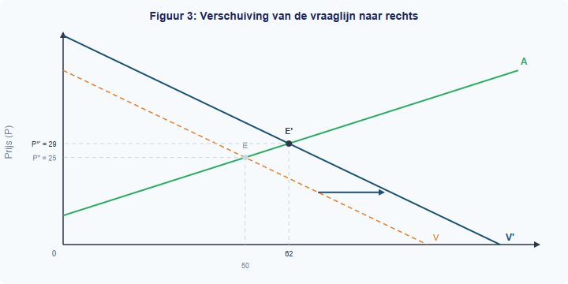

> **⚠️ Let op — veelgemaakte fout**
> Veel leerlingen verwarren een *verschuiving van* de vraaglijn met een *beweging langs* de vraaglijn. Een prijsverandering van het goed zelf → beweging LANGS de lijn (je schuift over de bestaande lijn naar een ander punt). Een verandering van inkomen, voorkeuren of andere factoren → verschuiving VAN de hele lijn (de lijn krijgt een nieuwe positie).

---

### De vuistregels

De volgende tabel vat de effecten samen:

| Verschuiving | Prijs (P*) | Hoeveelheid (Q*) |
|---|---|---|
| Aanbod → rechts (meer aanbod) | **daalt** | **stijgt** |
| Aanbod ← links (minder aanbod) | **stijgt** | **daalt** |
| Vraag → rechts (meer vraag) | **stijgt** | **stijgt** |
| Vraag ← links (minder vraag) | **daalt** | **daalt** |

**Ezelsbruggetje:** bij een aanbodverschuiving bewegen prijs en hoeveelheid in *tegengestelde* richting. Bij een vraagverschuiving bewegen ze in *dezelfde* richting.

Figuur 4 vat de twee soorten verschuivingen in één beeld samen.


---

### Twee verschuivingen tegelijk

Wat als de aanbodlijn *en* de vraaglijn tegelijk verschuiven? Dat is lastiger: de effecten op de prijs kunnen elkaar versterken of tegenwerken.

Stel dat de nieuwe fabriek opent (Qa' = 3P − 10) *en* het inkomen stijgt (Qv' = −2P + 120) tegelijk.

*Stap 1: Stel Qv' = Qa'.*

−2P + 120 = 3P − 10

*Stap 2: Los op naar P.*

120 + 10 = 3P + 2P

130 = 5P

P*' = 26

*Stap 3: Vul P*' = 26 in.*

Qv' = −2 × 26 + 120 = −52 + 120 = 68

*Controle:* Qa' = 3 × 26 − 10 = 78 − 10 = 68 ✓

**Vergelijk alle evenwichten:**

| Situatie | P* | Q* |
|---|---|---|
| Oorspronkelijk | EUR 25 | 50 |
| Alleen meer aanbod | EUR 22 | 56 |
| Alleen meer vraag | EUR 29 | 62 |
| Beide tegelijk | EUR 26 | 68 |

De **hoeveelheid** stijgt altijd: zowel meer aanbod als meer vraag duwen Q* omhoog. Dat is logisch — beide verschuivingen vergroten de markt.

De **prijs** is onzeker: meer aanbod drukt de prijs omlaag, maar meer vraag duwt de prijs omhoog. Het uiteindelijke effect hangt af van welke verschuiving groter is. In dit voorbeeld stijgt de prijs een klein beetje (van EUR 25 naar EUR 26), maar bij een grotere aanbodverschuiving had de prijs ook kunnen dalen.

> **Definitie: Ambigue uitkomst**
> Wanneer vraag en aanbod allebei naar rechts verschuiven, stijgt de hoeveelheid altijd, maar is het prijseffect **onbepaald** — het hangt af van de relatieve grootte van de verschuivingen.

Figuur 5 vat alle verschuivingen en hun effecten in één overzicht samen.


---

## Uitgewerkt voorbeeld

> **De markt voor fietsbellen**
>
> Op de markt voor fietsbellen geldt:
> - Qv = −P + 60
> - Qa = 2P − 30
>
> Door een technologische verbetering daalt de productiekost. De nieuwe aanbodvergelijking wordt: Qa' = 2P − 18.

**(a) Bereken het oorspronkelijke evenwicht.**

*Stap 1: Stel Qv = Qa.*

−P + 60 = 2P − 30

*Stap 2: Los op naar P.*

60 + 30 = 2P + P

90 = 3P

P* = 30

*Stap 3: Vul P* = 30 in.*

Qv = −30 + 60 = 30

*Controle:* Qa = 2 × 30 − 30 = 60 − 30 = 30 ✓

**Antwoord:** P* = EUR 30, Q* = 30 fietsbellen.

**(b) Bereken het nieuwe evenwicht na de aanbodverschuiving.**

*Stap 1: Stel Qv = Qa'.*

−P + 60 = 2P − 18

*Stap 2: Los op naar P.*

60 + 18 = 2P + P

78 = 3P

P*' = 26

*Stap 3: Vul P*' = 26 in.*

Qv = −26 + 60 = 34

*Controle:* Qa' = 2 × 26 − 18 = 52 − 18 = 34 ✓

**Antwoord:** P*' = EUR 26, Q*' = 34 fietsbellen.

**(c) Vergelijk het oude en nieuwe evenwicht.**

| | Oud | Nieuw | Verandering |
|---|---|---|---|
| P* | EUR 30 | EUR 26 | daalt met EUR 4 |
| Q* | 30 | 34 | stijgt met 4 |

Dit klopt met de vuistregel: aanbod naar rechts → prijs daalt, hoeveelheid stijgt.

**(d) Teken de verschuiving in een grafiek.**


**De procedure samengevat:**

| Stap | Actie |
|------|-------|
| 1 | Bereken het oorspronkelijke evenwicht (Qv = Qa → P*, Q*) |
| 2 | Bereken het nieuwe evenwicht met de nieuwe vergelijking (Qv = Qa' → P*', Q*') |
| 3 | Vergelijk: is de prijs gestegen of gedaald? Is de hoeveelheid gestegen of gedaald? |
| 4 | Controleer met de vuistregel: past het bij de richting van de verschuiving? |
| 5 | Teken beide lijnen in de grafiek, markeer E en E' |

---

> **Samenvatting §1.4.2**
> - Een verschuiving van de aanbodlijn of vraaglijn leidt tot een **nieuw evenwicht** met een andere prijs en hoeveelheid.
> - Je berekent het nieuwe evenwicht met dezelfde methode: Qv = Qa (nieuw) → P*' → Q*'.
> - Aanbod naar rechts → P* daalt, Q* stijgt. Vraag naar rechts → P* stijgt, Q* stijgt.
> - Bij twee gelijktijdige verschuivingen naar rechts is het hoeveelheidseffect duidelijk (stijging), maar het prijseffect **onzeker**.
> - *In de volgende paragraaf bekijken we de welvaart op de markt: consumentensurplus en producentensurplus.*

> **💡 Vastgelopen op een opgave?**
> Op de website vind je bij elke opgave een **begeleide inoefening**: stap voor stap krijg je extra hints en tussenstappen. Klik op de opgave om de begeleiding te starten.

---

## Uitgewerkt voorbeeld

> **De markt voor fietsbellen**
>
> Op de markt voor fietsbellen geldt:
> - Qv = −P + 60
> - Qa = 2P − 30
>
> Door een technologische verbetering daalt de productiekost. De nieuwe aanbodvergelijking wordt: Qa' = 2P − 18.

**(a) Bereken het oorspronkelijke evenwicht.**

*Stap 1: Stel Qv = Qa.*

−P + 60 = 2P − 30

*Stap 2: Los op naar P.*

90 = 3P → P* = 30

*Stap 3: Vul P* = 30 in.*

Qv = −30 + 60 = 30

*Controle:* Qa = 2 × 30 − 30 = 30 ✓

**Antwoord:** P* = €30, Q* = 30 fietsbellen.

**(b) Bereken het nieuwe evenwicht na de aanbodverschuiving.**

*Stap 1: Stel Qv = Qa'.*

−P + 60 = 2P − 18 → 78 = 3P → P*' = 26

*Stap 3: Vul in.*

Qv = −26 + 60 = 34. *Controle:* Qa' = 2 × 26 − 18 = 34 ✓

**Antwoord:** P*' = €26, Q*' = 34 fietsbellen.

**(c) Vergelijk het oude en nieuwe evenwicht.**

Prijs daalt (€30 → €26), hoeveelheid stijgt (30 → 34). Aanbod naar rechts → prijs daalt, hoeveelheid stijgt.

**(d) Teken de verschuiving in een grafiek.**


---

## Opgaven

### Startoefeningen

**Opgave 1** *(invuloefening)*

Vul de juiste woorden in.

a) Als de aanbodlijn naar rechts verschuift en de vraaglijn gelijk blijft, dan ... (stijgt/daalt) de evenwichtsprijs en ... (stijgt/daalt) de evenwichtshoeveelheid.

b) Als de vraaglijn naar rechts verschuift en de aanbodlijn gelijk blijft, dan ... (stijgt/daalt) de evenwichtsprijs en ... (stijgt/daalt) de evenwichtshoeveelheid.

c) Een verschuiving van de aanbodlijn wordt veroorzaakt door een verandering van een ... (vraagfactor/aanbodfactor). Noem twee voorbeelden.

d) Een verschuiving van de vraaglijn wordt veroorzaakt door een verandering van een ... (vraagfactor/aanbodfactor). Noem twee voorbeelden.


**Opgave 2** *(oefenen: aanbodverschuiving)*

Op de markt voor ringbanden geldt:
- Qv = −3P + 120
- Qa = 2P − 30

Door stijgende grondstofprijzen wordt de aanbodvergelijking: Qa' = 2P − 50.

a) Bereken het oorspronkelijke evenwicht (P* en Q*).

b) Bereken het nieuwe evenwicht na de aanbodverschuiving.

c) Is de aanbodlijn naar links of naar rechts verschoven? Leg uit.

d) Vergelijk het oude en nieuwe evenwicht. Past de verandering bij de vuistregel?


**Opgave 3** *(oefenen: vraagverschuiving)*

Op de markt voor geodriehoeken geldt:
- Qv = −P + 50
- Qa = 4P − 75

Een concurrent brengt een goedkoop alternatief op de markt. De nieuwe vraagvergelijking is: Qv' = −P + 40.

a) Bereken het oorspronkelijke evenwicht.

b) Bereken het nieuwe evenwicht.

c) Is de vraaglijn naar links of naar rechts verschoven? Welke vraagfactor is veranderd?

d) Vergelijk het oude en nieuwe evenwicht. Past de verandering bij de vuistregel?

---

### Zelfstandige oefening

**Opgave 4** *(de procedure — nieuwe markt)*

Op de markt voor linialen geldt:
- Qv = −2P + 80
- Qa = 3P − 20

Door automatisering worden de productiekosten lager. De nieuwe aanbodvergelijking is: Qa' = 3P − 5.

a) Bereken het oorspronkelijke evenwicht.

b) Bereken het nieuwe evenwicht.

c) Vergelijk: wat is er met de prijs en de hoeveelheid gebeurd?

d) Teken de oorspronkelijke vraaglijn, de oorspronkelijke aanbodlijn en de nieuwe aanbodlijn in een grafiek. Markeer E en E'.


**Opgave 5** *(de doeloefening — schriftenmarkt, alle stappen)*

Ga uit van de schriftenmarkt: Qv = −2P + 100, Qa = 3P − 25, P* = €25, Q* = 50.

a) Een nieuwe fabriek opent. De nieuwe aanbodvergelijking is Qa' = 3P − 10. Bereken het nieuwe evenwicht.

b) Vergelijk met het oude evenwicht: wat is er met de prijs en de hoeveelheid gebeurd? Is dit logisch? Leg uit.

c) Het inkomen van scholieren stijgt. De nieuwe vraagvergelijking is Qv' = −2P + 120 (het aanbod is weer de oorspronkelijke: Qa = 3P − 25). Bereken het nieuwe evenwicht.

d) Teken een grafiek waarin je beide verschuivingen (apart) laat zien met pijlen die de richting aangeven.

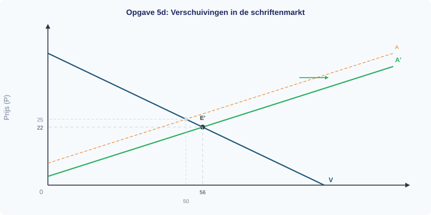

e) Nu vinden BEIDE veranderingen tegelijk plaats: Qa' = 3P − 10 en Qv' = −2P + 120. Bereken het nieuwe evenwicht. Had je de richting van de prijsverandering kunnen voorspellen zonder te rekenen? Leg uit.


---

### Herhaling (interleaving)

**Opgave 6** *(herhaling §1.4.1: evenwicht berekenen)*

Op de markt voor rekenmachines geldt:
- Qv = −2P + 70
- Qa = 3P − 30

a) Bereken de evenwichtsprijs en de evenwichtshoeveelheid.

b) Controleer je antwoord door P* in beide vergelijkingen in te vullen.

c) Bij een prijs van €25: is er een overschot of een tekort? Bereken de grootte.


**Opgave 7** *(herhaling §1.3.2: kostenstructuren)*

Een schriftenfabriek heeft constante kosten van €5.000 per maand en variabele kosten van €8 per schrift.

a) Schrijf de formule voor de totale kosten (TK) als functie van Q.

b) Bereken de gemiddelde totale kosten (GTK) bij een productie van 200 schriften.

c) De fabriek verkoopt schriften voor €25 per stuk. Bereken de winst bij een productie van 200 schriften.

d) Leg uit: als de variabele kosten per schrift dalen (bijv. van €8 naar €6), wat gebeurt er dan met de aanbodlijn van deze fabriek? Verschuift deze naar links of naar rechts?

---

### Doeloefening

**Opgave 8** *(alles samen — twee markten)*

Op de markt voor vulpennen geldt:
- Qv = −4P + 200
- Qa = P − 10

a) Bereken het oorspronkelijke evenwicht.

b) Door een trend op sociale media willen meer scholieren een vulpen. De nieuwe vraagvergelijking is: Qv' = −4P + 240. Bereken het nieuwe evenwicht.

c) Vergelijk het oude en nieuwe evenwicht. Past de verandering bij de vuistregel?

d) Tegelijkertijd wordt inkt duurder, waardoor de aanbodvergelijking verandert in: Qa' = P − 20. Bereken het evenwicht als BEIDE veranderingen tegelijk optreden (Qv' = −4P + 240 en Qa' = P − 20).

e) Vergelijk dit evenwicht met het oorspronkelijke. De hoeveelheid is ... (gestegen/gedaald/gelijk gebleven). De prijs is ... Leg uit waarom het prijseffect lastig te voorspellen was zonder te rekenen.

---

### Denkertje *(bonusopgave)*

**Opgave 9**

Op een markt geldt: Qv = −2P + 100 en Qa = 3P − 25 (P* = 25, Q* = 50).

Het aanbod verschuift naar rechts met precies dezelfde hoeveelheid als waarmee de vraag naar rechts verschuift. Stel: beide lijnen verschuiven k eenheden naar rechts.

a) Schrijf de nieuwe vergelijkingen op als functie van k.

b) Bereken het nieuwe evenwicht (P*' en Q*') als functie van k.

c) Laat zien dat de evenwichtsprijs niet verandert, ongeacht de waarde van k. Leg economisch uit waarom dit zo is.

d) Wat gebeurt er met de evenwichtshoeveelheid als k groter wordt?


<div style="break-before: page;"></div>

# 1.4.3 Marginale kosten en marginale opbrengsten

## Loont het om nog één extra te produceren?

Een ijsfabrikant verkoopt elk ijsje voor €3. Hij maakt er nu 500 per dag. Een medewerker vraagt: "Zullen we er 501 maken?" De ondernemer denkt na. Dat ene extra ijsje levert €3 op. Maar wat kost het om dat ene extra ijsje te maken? Als de extra kosten €2 zijn, levert het ijsje €1 winst op. Maar als de extra kosten €4 zijn, verliest hij er juist €1 op.

De ondernemer hoeft niet de *totale* winst opnieuw uit te rekenen. Hij hoeft alleen te kijken naar de **extra kosten** en de **extra opbrengst** van dat ene product. Dit is de kern van *marginaal denken*: niet het geheel, maar de verandering aan de marge.

In deze paragraaf leer je twee nieuwe begrippen: marginale kosten (MK) en marginale opbrengsten (MO). Je leert ze berekenen met een tabel en je ziet wat er gebeurt als de kosten lineair of kwadratisch stijgen.

---

## Theorie

### Marginale kosten (MK)

> **📋 Herhaling uit §1.3.3**
> De totale kosten (TK) zijn de som van alle constante en variabele kosten: TK = TCK + TVK. De totale opbrengst is TO = P x Q. De winst is TO - TK.

Stel dat een bedrijf nu Q = 20 eenheden produceert en de totale kosten TK = €260 bedragen. Als het bedrijf de productie verhoogt naar Q = 21, stijgen de totale kosten naar TK = €263. De kosten zijn dus met €3 gestegen. Die €3 noemen we de **marginale kosten**: de extra kosten van één extra eenheid.

> **Definitie: Marginale kosten (MK)**
> De extra kosten die een bedrijf maakt als het één eenheid meer produceert.
> MK = ΔTK / ΔQ (de verandering van de totale kosten gedeeld door de verandering van de hoeveelheid).

> **Formule**
> ```
> MK = ΔTK / ΔQ
> ```
> Waarbij ΔTK = TK(nieuw) − TK(oud) en ΔQ = Q(nieuw) − Q(oud).

Neem bedrijf 1 als voorbeeld. Dit bedrijf heeft TK = 200 + 3Q. Elke extra eenheid voegt precies €3 toe aan de totale kosten. De marginale kosten zijn dus constant: MK = 3.

We berekenen de waarden in een tabel:

| Q | TK = 200 + 3Q | ΔTK (t.o.v. vorige rij) | ΔQ | MK = ΔTK / ΔQ |
|---|--------------|------------------------|-----|----------------|
| 0 | 200 | — | — | — |
| 10 | 230 | 30 | 10 | 3 |
| 20 | 260 | 30 | 10 | 3 |
| 30 | 290 | 30 | 10 | 3 |
| 40 | 320 | 30 | 10 | 3 |
| 50 | 350 | 30 | 10 | 3 |

MK is bij elke stap precies 3. Dat klopt: de formule TK = 200 + 3Q is lineair. Het variabele deel stijgt met €3 per eenheid, ongeacht hoeveel je al produceert.

---

### Marginale opbrengsten (MO)

Nu dezelfde vraag voor de opbrengstenkant. Het bedrijf verkoopt elk product voor €8. De totale opbrengst is TO = 8Q. Als het bedrijf één eenheid meer verkoopt, stijgt de totale opbrengst met €8. Die €8 noemen we de **marginale opbrengsten**.

> **Definitie: Marginale opbrengsten (MO)**
> De extra opbrengst die een bedrijf ontvangt als het één eenheid meer verkoopt.
> MO = ΔTO / ΔQ (de verandering van de totale opbrengst gedeeld door de verandering van de hoeveelheid).

> **Formule**
> ```
> MO = ΔTO / ΔQ
> ```
> Waarbij ΔTO = TO(nieuw) − TO(oud) en ΔQ = Q(nieuw) − Q(oud).

Bij een constante prijs (het bedrijf is een prijsnemer) geldt: MO = P. Elke extra eenheid levert precies de marktprijs op. Dit is logisch: als de prijs niet verandert, is de extra opbrengst van elk volgend product gelijk aan de prijs.

---

### Bedrijf 1: MK en MO samen in de tabel

We combineren nu kosten en opbrengsten voor bedrijf 1 (TK = 200 + 3Q, P = €8, TO = 8Q):

| Q | TK | TO | Winst (TO − TK) | MK | MO |
|---|-----|-----|-----------------|-----|-----|
| 0 | 200 | 0 | −200 | — | — |
| 10 | 230 | 80 | −150 | 3 | 8 |
| 20 | 260 | 160 | −100 | 3 | 8 |
| 30 | 290 | 240 | −50 | 3 | 8 |
| 40 | 320 | 320 | 0 | 3 | 8 |
| 50 | 350 | 400 | 50 | 3 | 8 |

Figuur 1 toont TK en TO als rechte lijnen. Het snijpunt bij Q = 40 is het break-evenpunt (BEP): daar is de winst precies nul.


In figuur 2 zie je MK en MO als twee horizontale lijnen. MK = 3 en MO = 8. Het verschil MO − MK = 5 is de extra winst per eenheid: elke extra eenheid levert €5 winst op. Zolang MO groter is dan MK, loont het om meer te produceren.


Zo zie je dezelfde informatie in drie vormen tegelijk: in de tabel hierboven, in de twee grafieken, en in de tekst die ze verbindt.

---

### Bedrijf 2: kwadratische kosten

Niet alle bedrijven hebben constante marginale kosten. Neem bedrijf 2 met TK = 100 + Q². De kosten stijgen nu niet meer gelijkmatig: hoe meer je produceert, hoe sneller de kosten stijgen. Dit bedrijf verkoopt tegen P = €30, dus TO = 30Q.

| Q | TK = 100 + Q² | TO = 30Q | Winst | ΔTK | ΔQ | MK = ΔTK/ΔQ | MO |
|---|--------------|---------|-------|-----|-----|-------------|-----|
| 0 | 100 | 0 | −100 | — | — | — | — |
| 5 | 125 | 150 | 25 | 25 | 5 | 5 | 30 |
| 10 | 200 | 300 | 100 | 75 | 5 | 15 | 30 |
| 15 | 325 | 450 | 125 | 125 | 5 | 25 | 30 |
| 20 | 500 | 600 | 100 | 175 | 5 | 35 | 30 |

Kijk naar de kolom MK: 5, 15, 25, 35. De marginale kosten *stijgen*. Elke extra groep van 5 eenheden wordt duurder om te produceren. Dit komt doordat TK kwadratisch is: de kosten accelereren.

MO blijft constant op 30 — logisch, want de prijs is vast op €30.

Figuur 3 toont TK als een *kromme* (omhoogbuigend) en TO als een rechte lijn.


Figuur 4 laat de stijgende MK zien als stappen. Bij Q = 15 is MK = 25, nog onder MO = 30. Bij Q = 20 is MK = 35, al boven MO = 30. Ergens tussen Q = 15 en Q = 20 haalt MK de prijs in. Vanaf dat punt kost elke extra eenheid meer dan ze oplevert.

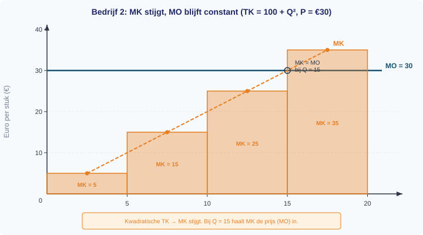

> **⚠️ Let op — veelgemaakte fout**
> Veel leerlingen denken dat de winst het hoogst is bij de grootste productie. Maar kijk naar de tabel: bij Q = 15 is de winst €125, bij Q = 20 is de winst €100. Meer produceren kan de winst *verlagen* als de marginale kosten boven de marginale opbrengsten uitstijgen.

---

### Twee patronen: lineair versus kwadratisch

| | Lineaire TK (bedrijf 1) | Kwadratische TK (bedrijf 2) |
|---|------------------------|---------------------------|
| Formule TK | TK = 200 + 3Q | TK = 100 + Q² |
| Grafiek TK | Rechte lijn | Kromme (buigt omhoog) |
| MK | Constant (= 3) | Stijgend (5, 15, 25, 35, …) |
| MO bij vaste prijs | Constant (= P) | Constant (= P) |

Figuur 5 vat het marginale denken in een overzicht samen.


---

## Uitgewerkt voorbeeld

> **De snoepfabriek**
>
> Een snoepfabriek heeft vaste kosten van €300 per dag (huur, machines). De variabele kosten bedragen €5 per zak snoep. De verkoopprijs is €12 per zak.

**(a)** Schrijf de formules voor TK en TO als functie van Q.

*Stap 1: Identificeer constante en variabele kosten.*

- TCK = €300 (vast)
- TVK = €5 per zak → TVK = 5Q
- TK = TCK + TVK = 300 + 5Q

*Stap 2: Schrijf de formule voor TO.*

- TO = P × Q = 12 × Q = 12Q

**(b)** Bereken MK en MO.

*Stap 3: Bereken MK = ΔTK / ΔQ.*

TK = 300 + 5Q. Als Q met 1 stijgt, stijgt TK met €5. Dus MK = 5.

*Stap 4: Bereken MO = ΔTO / ΔQ.*

TO = 12Q. Als Q met 1 stijgt, stijgt TO met €12. Dus MO = 12.

**(c)** Vul de tabel in voor Q = 0, 10, 20, 30, 40, 50.

| Q | TK = 300 + 5Q | TO = 12Q | Winst | MK | MO |
|---|--------------|---------|-------|----|----|
| 0 | 300 | 0 | −300 | — | — |
| 10 | 350 | 120 | −230 | 5 | 12 |
| 20 | 400 | 240 | −160 | 5 | 12 |
| 30 | 450 | 360 | −90 | 5 | 12 |
| 40 | 500 | 480 | −20 | 5 | 12 |
| 50 | 550 | 600 | 50 | 5 | 12 |

**(d)** Wat valt op aan MK en MO?

MK is constant op €5 (lineaire TK). MO is constant op €12 (constante prijs). Elke extra zak snoep levert €12 − €5 = €7 winst op. Het loont altijd om meer te produceren, want MO > MK bij elke hoeveelheid.

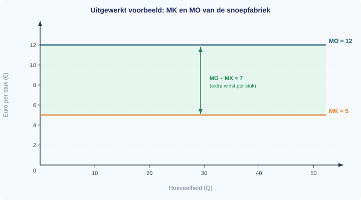

---

> **Samenvatting §1.4.3**
> - **Marginale kosten (MK)** = de extra kosten van één extra eenheid: MK = ΔTK / ΔQ.
> - **Marginale opbrengsten (MO)** = de extra opbrengst van één extra eenheid: MO = ΔTO / ΔQ.
> - Bij een **constante prijs** geldt: MO = P (de prijs is de extra opbrengst per stuk).
> - Bij **lineaire TK** is MK constant. Bij **kwadratische TK** stijgt MK met de productie.
> - Zolang MO > MK levert elke extra eenheid winst op. *In §1.4.4 gebruik je deze regel om de winstmaximaliserende productie te bepalen.*

> **💡 Vastgelopen op een opgave?**
> Op de website vind je bij elke opgave een **begeleide inoefening**: stap voor stap krijg je extra hints en tussenstappen. Klik op de opgave om de begeleiding te starten.

---

## Opgaven

### Startoefeningen

**Opgave 1** *(lees de tabel en de grafiek — zie figuur 6)*

Een transportbedrijf heeft TK = 400 + 6Q (Q = aantal ritten). Het bedrijf ontvangt €10 per rit, dus TO = 10Q.

In figuur 6 zie je de TK- en TO-lijnen.


a) Vul de onderstaande tabel in:

| Q | TK | TO | Winst | MK | MO |
|---|-----|-----|-------|----|----|
| 0 | | | | — | — |
| 20 | | | | | |
| 40 | | | | | |
| 60 | | | | | |
| 80 | | | | | |
| 100 | | | | | |

b) Wat valt je op aan de kolom MK? Is MK constant of veranderlijk? Leg uit waarom.

c) Wat valt je op aan de kolom MO? Waarom is dit logisch bij een vaste prijs?

d) Bij welk aantal ritten is de winst precies nul (break-evenpunt)? Controleer dit met de grafiek.


**Opgave 2** *(bereken MK bij kwadratische kosten)*

Een tuinbouwbedrijf heeft TK = 50 + 2Q². Het verkoopt planten voor €40 per stuk, dus TO = 40Q.

a) Bereken TK bij Q = 0, 5, 10, 15, 20.

b) Bereken MK voor elk interval (ΔQ = 5). Zet alles in een tabel.

c) Wat gebeurt er met MK als Q toeneemt? Leg uit waarom MK stijgt.

d) Bereken MO. Is MO constant of veranderlijk?

e) Bij welk interval wordt MK groter dan MO? Wat betekent dit voor het bedrijf?


**Opgave 3** *(begrip toepassen — geen berekening)*

Leg in je eigen woorden uit:

a) Wat vertelt MK je over een bedrijf?

b) Wat vertelt MO je over een bedrijf?

c) Een bedrijf heeft MK = 7 en MO = 10. Moet dit bedrijf meer of minder produceren? Leg uit.

d) Een bedrijf heeft MK = 15 en MO = 9. Wat adviseer je dit bedrijf? Leg uit.

---

### Zelfstandige oefening

**Opgave 4** *(berekenen en grafiek lezen — zie figuur 7)*

Een meubelfabriek heeft TK = 500 + 0,5Q². De verkoopprijs is €25 per stoel, dus TO = 25Q.

In figuur 7 zie je MK en MO van de meubelfabriek.

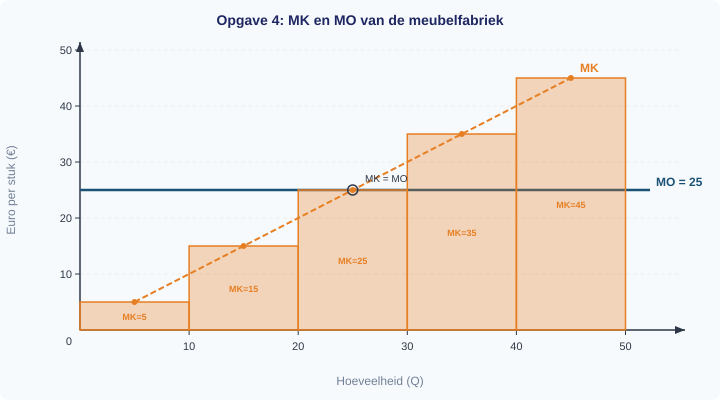

a) Bereken TK bij Q = 0, 10, 20, 30, 40, 50.

b) Bereken MK voor elk interval (ΔQ = 10). Zet alles in een tabel met kolommen Q, TK, ΔTK, MK, TO, MO.

c) Bij welk interval wordt MK voor het eerst groter dan MO? Controleer dit met de grafiek.

d) Bereken de winst bij Q = 20 en bij Q = 30. Bij welke hoeveelheid is de winst hoger?


**Opgave 5** *(vergelijken van twee bedrijven)*

Twee bedrijven produceren hetzelfde product en verkopen het voor €20 per stuk.

| | Bedrijf X | Bedrijf Y |
|---|-----------|-----------|
| TK-formule | TK = 100 + 4Q | TK = 50 + Q² |

a) Bereken MK van bedrijf X. Is MK constant of veranderlijk?

b) Bereken MK van bedrijf Y bij de intervallen Q = 0 → 5, Q = 5 → 10, Q = 10 → 15. Is MK constant of veranderlijk?

c) Bereken MO voor beide bedrijven. Verschilt MO tussen de bedrijven?

d) Bij welk bedrijf worden extra eenheden op een gegeven moment te duur om te produceren? Leg uit met behulp van MK en MO.

---

### Herhaling (interleaving)

**Opgave 6** *(herhaling §1.3.3: TO, TK, winst, break-even)*

Een schoenmaker heeft vaste kosten van €600 per maand. De variabele kosten zijn €8 per paar schoenen. De verkoopprijs is €20 per paar.

a) Schrijf de formules voor TK en TO als functie van Q.

b) Bereken het break-evenpunt (waar winst = 0).

c) Bereken de winst bij Q = 100.


**Opgave 7** *(herhaling §1.2.1: betalingsbereidheid)*

Een consument wil kopjes koffie kopen. Zijn betalingsbereidheid per kopje: €4,00 voor het eerste, €3,00 voor het tweede, €1,80 voor het derde, €0,50 voor het vierde.

a) De marktprijs is €2,50. Hoeveel kopjes koopt hij?

b) Bereken het totale consumentensurplus.

c) Leg uit wat het verband is tussen betalingsbereidheid en marginaal nut (de extra tevredenheid van één extra kopje).

---

### Doeloefening

**Opgave 8**

Een bedrijf heeft TK = 200 + 3Q en verkoopt tegen een vaste prijs van €8 per eenheid, dus TO = 8Q.

a) Vul de tabel in voor Q = 0, 10, 20, 30, 40, 50:

| Q | TK | TO | Winst | MK (= ΔTK bij ΔQ = 10) | MO (= ΔTO bij ΔQ = 10) |
|---|-----|-----|-------|------------------------|------------------------|
| 0 | | | | — | — |
| 10 | | | | | |
| 20 | | | | | |
| 30 | | | | | |
| 40 | | | | | |
| 50 | | | | | |

b) Wat valt je op aan MK? Is MK constant of veranderlijk?

c) Wat valt je op aan MO? Waarom is dit logisch bij een constante prijs?

d) Een tweede bedrijf heeft TK = 100 + Q² en verkoopt tegen €30 per eenheid. Vul een vergelijkbare tabel in voor Q = 0, 5, 10, 15, 20. Wat gebeurt er nu met MK?

e) Leg in je eigen woorden uit: wat vertelt MK je? Wat vertelt MO je?

---

### Denkertje *(bonusopgave)*

**Opgave 9**

Een ondernemer overweegt of hij zijn productie moet uitbreiden van 100 naar 101 eenheden. De totale kosten stijgen van €5.000 naar €5.060. De totale opbrengst stijgt van €6.000 naar €6.050.

a) Bereken MK en MO van de 101e eenheid.

b) Moet de ondernemer de 101e eenheid produceren? Leg uit.

c) De ondernemer overweegt ook de 102e eenheid. De totale kosten stijgen naar €5.130 en de totale opbrengst naar €6.100. Bereken MK en MO van de 102e eenheid. Moet hij deze ook produceren?

d) De ondernemer merkt dat MK steeds sneller stijgt. Leg uit waarom er een punt komt waarop hij moet stoppen met uitbreiden, ook al is de totale winst nog steeds positief.


<div style="break-before: page;"></div>

# 1.4.4 Winstmaximalisatie: de MO = MK-regel

## Wanneer moet een bedrijf stoppen met produceren?

Bedrijf 2 uit de vorige paragraaf verkoopt elk product voor €30. Bij Q = 10 maakt het bedrijf €100 winst. Bij Q = 15 is de winst €125. Maar bij Q = 20 daalt de winst weer naar €100. Er is dus een hoeveelheid waarbij de winst het hoogst is. Hoe vind je dat punt — zonder elke hoeveelheid uit te rekenen?

Het antwoord zit in de marginale kosten en marginale opbrengsten die je in §1.4.3 hebt geleerd. In deze paragraaf ontdek je de **MO = MK-regel**: het punt waar de winst maximaal is, en hoe je dat punt kunt berekenen.

---

## Theorie

### De winst per hoeveelheid: een tabel

> **📋 Herhaling uit §1.4.3**
> MK = ΔTK / ΔQ (extra kosten van één extra eenheid). MO = ΔTO / ΔQ (extra opbrengst van één extra eenheid). Bij een vaste prijs geldt MO = P.

We pakken bedrijf 2 weer op: TK = 100 + Q², P = €30, TO = 30Q. Nu berekenen we de winst bij elke hoeveelheid, met stappen van ΔQ = 1:

| Q | TK = 100 + Q² | TO = 30Q | Winst (TO − TK) | MK | MO |
|---|--------------|---------|-----------------|-----|-----|
| 0 | 100 | 0 | −100 | — | — |
| 5 | 125 | 150 | 25 | 5 | 30 |
| 10 | 200 | 300 | 100 | 15 | 30 |
| 13 | 269 | 390 | 121 | 25 | 30 |
| 14 | 296 | 420 | 124 | 27 | 30 |
| 15 | 325 | 450 | 125 | 29 | 30 |
| 16 | 356 | 480 | 124 | 31 | 30 |
| 17 | 389 | 510 | 121 | 33 | 30 |
| 20 | 500 | 600 | 100 | 35 | 30 |

*MK-waarden berekend als ΔTK/ΔQ over intervallen van 5 bij de eerste rijen, en van 1 rond het optimum.*

Kijk goed naar de kolom Winst. De winst stijgt tot Q = 15 (winst = €125) en daalt daarna. Het maximum ligt bij Q = 15.

Kijk nu naar MK en MO. Bij Q = 14 is MK = 27, nog onder MO = 30. Bij Q = 15 is MK = 29, nagenoeg gelijk aan MO = 30. Bij Q = 16 is MK = 31, boven MO = 30. Precies bij het winstmaximum zijn MK en MO (bijna) gelijk.

---

### Waarom MO = MK het winstmaximum geeft

Stel je staat op Q = 10 en overweegt of je één extra eenheid moet produceren:

- De extra opbrengst is MO = €30.
- De extra kosten zijn MK = €21 (want TK(11) − TK(10) = 221 − 200 = 21).
- Het verschil MO − MK = €9 is de **extra winst** van die ene eenheid.

Zolang MO > MK levert elke extra eenheid meer op dan het kost. Je winst stijgt. Produceer door!

Maar bij Q = 16:

- MO = €30 en MK = €31 (want TK(16) − TK(15) = 356 − 325 = 31).
- Nu is MO − MK = −€1. Die eenheid kost meer dan het oplevert. Je winst daalt.

Het omslagpunt is waar MO = MK. Daar voegt de laatst geproduceerde eenheid precies niets meer toe aan de winst. Dit is het winstmaximum.


---

### De MO = MK-regel

> **Definitie: Winstmaximalisatie**
> Een bedrijf maximaliseert zijn winst door te produceren tot het punt waar MO = MK. Bij die hoeveelheid is de totale winst het hoogst.

> **Formule**
> ```
> Winstmaximum bij: MO = MK
> ```
> Produceer zolang MO ≥ MK. Stop zodra MO = MK.

De logica in drie stappen:

1. **MO > MK** → de extra eenheid levert meer op dan het kost → winst stijgt → **produceer meer**
2. **MO = MK** → de extra eenheid levert precies op wat het kost → winst is maximaal → **stop hier**
3. **MO < MK** → de extra eenheid kost meer dan het oplevert → winst daalt → **produceer minder**

> **⚠️ Let op — veelgemaakte fout**
> Veel leerlingen denken dat het bedrijf moet stoppen zodra de winst positief is, of dat maximale productie altijd de meeste winst geeft. Maar de tabel laat zien: bij Q = 20 is de winst lager dan bij Q = 15, ondanks de hogere productie. Het gaat niet om *hoeveel* je produceert, maar om *tot waar* elke extra eenheid nog bijdraagt aan de winst.

---

### De grafische weergave

In figuur 2 zie je de TK- en TO-lijnen van bedrijf 2. Het verticale verschil tussen TO en TK is de winst. Dat verschil is het grootst bij Q = 15 — daar is de afstand tussen de twee lijnen maximaal.


In figuur 3 zie je MK en MO. De stijgende MK-lijn kruist de horizontale MO-lijn bij Q = 15. Links van het snijpunt is MO > MK (elke eenheid voegt winst toe). Rechts is MO < MK (elke eenheid vermindert de winst).

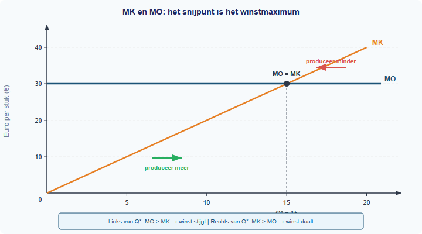

Zo zie je dezelfde informatie in drie vormen tegelijk: in de tabel hierboven, in de twee grafieken, en in de tekst die ze verbindt.

---

### De regel algebraisch toepassen

Bij bedrijf 2 weten we dat MK ≈ 2Q (de benadering voor TK = 100 + Q²) en MO = 30. De MO = MK-regel wordt dan:

```
MO = MK
30 = 2Q
Q = 15
```

Dit klopt met de tabel: bij Q = 15 is de winst het hoogst. Je hoeft geen hele tabel te maken — je lost gewoon MO = MK op als vergelijking.

Neem een nieuw bedrijf: bedrijf 3 met TK = 50 + 2Q² en P = €40. Dan is MK ≈ 4Q en MO = 40:

```
MO = MK
40 = 4Q
Q = 10
```

De winstmaximaliserende hoeveelheid is Q = 10. We controleren met de winst:

| Q | TK = 50 + 2Q² | TO = 40Q | Winst |
|---|---------------|---------|-------|
| 9 | 50 + 162 = 212 | 360 | 148 |
| 10 | 50 + 200 = 250 | 400 | **150** |
| 11 | 50 + 242 = 292 | 440 | 148 |

Inderdaad: de winst is het hoogst bij Q = 10. Bij Q = 9 en Q = 11 is de winst lager.

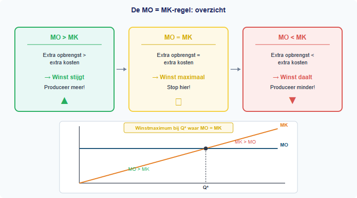

---

## Uitgewerkt voorbeeld

> **De fietsenmaker**
>
> Een fietsenmaker heeft TK = 80 + 0,5Q². Hij verkoopt elke fiets voor €20. We bepalen de winstmaximaliserende productie.

**(a)** Schrijf de formules voor TK, TO en winst.

*Stap 1: Noteer de gegeven informatie.*

- TK = 80 + 0,5Q²
- P = €20, dus TO = 20Q
- Winst = TO − TK = 20Q − 80 − 0,5Q²

**(b)** Bepaal MK en MO.

*Stap 2: Bepaal MK.*

MK ≈ Q (de benadering bij TK = 80 + 0,5Q²: als Q met 1 stijgt, stijgt Q² met ≈ 2Q · 1 = 2Q, dus ΔTK ≈ 0,5 · 2Q = Q).

*Stap 3: Bepaal MO.*

MO = P = 20 (constante prijs).

**(c)** Pas de MO = MK-regel toe.

*Stap 4: Stel MO = MK en los op.*

```
MO = MK
20 = Q
Q = 20
```

De winstmaximaliserende productie is Q = 20.

**(d)** Controleer door de winst te berekenen bij Q = 19, 20 en 21.

*Stap 5: Bereken de winst bij drie waarden rond het optimum.*

| Q | TK = 80 + 0,5Q² | TO = 20Q | Winst |
|---|-----------------|---------|-------|
| 19 | 80 + 180,5 = 260,5 | 380 | 119,5 |
| 20 | 80 + 200 = 280 | 400 | **120** |
| 21 | 80 + 220,5 = 300,5 | 420 | 119,5 |

De winst is inderdaad het hoogst bij Q = 20.


---

> **Samenvatting §1.4.4**
> - Een bedrijf maximaliseert zijn winst bij de hoeveelheid waar **MO = MK**.
> - Zolang MO > MK levert elke extra eenheid winst op. Zodra MO < MK daalt de winst.
> - De MO = MK-regel kun je grafisch aflezen (snijpunt van MK- en MO-lijn) of algebraisch oplossen (stel MO = MK en los op naar Q).
> - **Formule**: winstmaximum bij MO = MK. Bij kwadratische kosten TK = c + aQ²: MK ≈ 2aQ.
> - *In §1.4.5 pas je de MO = MK-regel toe op een bedrijf in volkomen concurrentie en bekijk je de gevolgen voor de markt.*

> **💡 Vastgelopen op een opgave?**
> Op de website vind je bij elke opgave een **begeleide inoefening**: stap voor stap krijg je extra hints en tussenstappen. Klik op de opgave om de begeleiding te starten.

---

## Opgaven

### Startoefeningen

**Opgave 1** *(lees de tabel — winst aflezen)*

Een bedrijf met TK = 100 + Q² verkoopt tegen P = €30 (bedrijf 2 uit §1.4.3). Hieronder staat de uitgebreide tabel:

| Q | TK | TO | Winst | MK | MO |
|---|-----|-----|-------|----|----|
| 0 | 100 | 0 | −100 | — | — |
| 5 | 125 | 150 | 25 | 5 | 30 |
| 10 | 200 | 300 | 100 | 15 | 30 |
| 13 | 269 | 390 | 121 | 25 | 30 |
| 14 | 296 | 420 | 124 | 27 | 30 |
| 15 | 325 | 450 | 125 | 29 | 30 |
| 16 | 356 | 480 | 124 | 31 | 30 |
| 17 | 389 | 510 | 121 | 33 | 30 |
| 20 | 500 | 600 | 100 | 35 | 30 |

a) Bij welke Q is de winst het hoogst?

b) Kijk naar de kolommen MK en MO bij dat Q. Wat valt je op?

c) Leg uit waarom het bedrijf bij Q = 14 nog één eenheid extra moet produceren.

d) Leg uit waarom het bedrijf bij Q = 16 juist één eenheid minder moet produceren.


**Opgave 2** *(de regel in woorden)*

a) Schrijf de MO = MK-regel in je eigen woorden op.

b) Een bedrijf heeft bij de huidige productie MO = 25 en MK = 18. Moet het bedrijf meer of minder produceren? Leg uit.

c) Een ander bedrijf heeft MO = 12 en MK = 19. Wat adviseer je? Leg uit.

d) Bij welke verhouding tussen MO en MK is de winst maximaal?


**Opgave 3** *(grafiek lezen — zie figuur 5)*

In figuur 5 zie je MK en MO van een bedrijf.

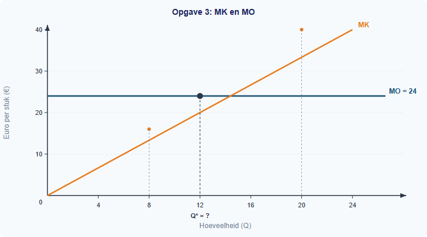

a) Lees uit de grafiek af: bij welke Q kruisen MK en MO?

b) Is bij Q = 8 de winst aan het stijgen of dalen? Leg uit met MK en MO.

c) Is bij Q = 20 de winst aan het stijgen of dalen? Leg uit.

d) Arceer in de grafiek het gebied waar elke extra eenheid winst toevoegt (het gebied waar MO > MK).

---

### Zelfstandige oefening

**Opgave 4** *(berekenen met de MO = MK-regel)*

Een bedrijf heeft TK = 200 + 0,5Q² en verkoopt tegen P = €30.

a) Bereken MK (gebruik de benadering MK ≈ Q).

b) Bereken MO.

c) Bepaal de winstmaximaliserende Q met de MO = MK-regel.

d) Controleer je antwoord door de winst te berekenen bij Q − 1, Q en Q + 1.


**Opgave 5** *(bedrijf 3 volledig doorrekenen)*

Bedrijf 3 heeft TK = 50 + 2Q² en verkoopt tegen P = €40 per stuk.

a) Schrijf de formule voor TO.

b) Bereken MK (gebruik de benadering MK ≈ 4Q).

c) Pas de MO = MK-regel toe om de winstmaximaliserende Q te vinden.

d) Bereken de winst bij Q − 1, Q en Q + 1 om je antwoord te controleren.

e) Bereken de maximale winst.

---

### Herhaling (interleaving)

**Opgave 6** *(herhaling §1.4.3: MK en MO berekenen)*

Een drukkerij heeft TK = 300 + 4Q. De verkoopprijs is €14 per boek.

a) Bereken MK. Is MK constant of veranderlijk?

b) Bereken MO.

c) Is MO > MK bij elke hoeveelheid? Wat betekent dit voor de winstmaximaliserende productie?


**Opgave 7** *(herhaling §1.3.3: break-even)*

Een bakkerij heeft TK = 450 + 3Q en verkoopt brood voor €7,50 per stuk.

a) Bereken het break-evenpunt.

b) Bereken de winst bij Q = 200.

c) Bereken MK en MO. Loont het om de productie uit te breiden voorbij Q = 200?

---

### Doeloefening

**Opgave 8**

Gebruik bedrijf 2 uit §1.4.3 (TK = 100 + Q², TO = 30Q).

a) Breid je tabel uit met een kolom voor winst bij Q = 0, 5, 10, 13, 14, 15, 16, 17, 20.

b) Bij welke Q is de winst het hoogst?

c) Kijk naar de kolommen MK en MO. Wat is waar over MK en MO bij de winstmaximaliserende Q?

d) Leg de regel uit: "produceer zolang MO ≥ MK, stop wanneer MO = MK."

e) Bedrijf 3 heeft TK = 50 + 2Q² en verkoopt tegen P = €40. Gebruik MO = MK om de winstmaximaliserende Q te berekenen ZONDER een volledige tabel. (Hint: MK ≈ 4Q. Stel dus 4Q = 40.)

f) Controleer door de winst te berekenen bij Q − 1, Q en Q + 1.

---

### Denkertje *(bonusopgave)*

**Opgave 9**

Een ondernemer heeft TK = 500 + 3Q². De marktprijs is €60.

a) Bepaal de winstmaximaliserende Q met MO = MK (hint: MK ≈ 6Q).

b) Bereken de maximale winst.

c) De overheid legt een belasting van €12 per eenheid op aan de producent. Zijn nieuwe kosten worden TK = 500 + 3Q² + 12Q. Bereken de nieuwe MK (hint: MK ≈ 6Q + 12). Bepaal de nieuwe winstmaximaliserende Q.

d) Vergelijk de oude en nieuwe situatie. Wat is het effect van de belasting op de geproduceerde hoeveelheid en de winst?


<div style="break-before: page;"></div>

# Gemengde opgaven §1.4.5 — Marktevenwicht en marginale analyse

---

## Opgave 1: Fruitkraam "De Mandarijn"

Hassan heeft een fruitkraam op de weekmarkt in Utrecht. Hij verkoopt kratten mandarijnen aan horecazaken. Op de markt voor mandarijnen geldt de volgende vraaglijn en aanbodlijn:

- Vraaglijn: Qv = −P + 50
- Aanbodlijn: Qa = 2P − 34

Hierbij is P de prijs in euro's per krat en Q de hoeveelheid in kratten per week.

Hassan is een prijsnemer op de markt en verkoopt zijn kratten tegen de evenwichtsprijs. Hij heeft zijn kosten en opbrengsten per week bijgehouden voor verschillende productieniveaus:

**Tabel 1: Kosten en opbrengsten fruitkraam "De Mandarijn" per week**

| Productie (kratten) | TCK (€) | TVK (€) | TK (€) | TO (€) | MK (€/krat) | MO (€/krat) |
|---|---|---|---|---|---|---|
| 0 | 150 | 0 | 150 | 0 | – | – |
| 5 | 150 | 50 | 200 | 140 | 10 | 28 |
| 10 | 150 | 80 | 230 | 280 | 6 | 28 |
| 15 | 150 | 120 | 270 | 420 | 8 | 28 |
| 20 | 150 | 200 | 350 | 560 | 16 | 28 |
| 25 | 150 | 350 | 500 | 700 | 30 | 28 |
| 30 | 150 | 570 | 720 | 840 | 44 | 28 |


---

**1** *(2p)* Bereken de evenwichtsprijs en de evenwichtshoeveelheid op de markt voor mandarijnen. Laat je berekening zien.

**2** *(2p)* Bereken de gemiddelde totale kosten (GTK) per krat bij een productie van 20 kratten. Laat je berekening zien.

**3** *(2p)* Leg uit met behulp van tabel 1 hoe je de marginale kosten (MK) berekent. Gebruik de stap van 15 naar 20 kratten als voorbeeld.

**4** *(2p)* Bepaal met behulp van tabel 1 bij welke productie de winst van Hassan maximaal is. Gebruik de MO = MK-regel in je antwoord.

**5** *(2p)* Bereken de totale winst van Hassan bij de winstmaximaliserende productie.

**Denkertje** *(2p)* Hassan zegt: "Ik moet zoveel mogelijk kratten verkopen, want bij elke extra verkoop krijg ik €28 extra opbrengst." Beoordeel of het verstandig is dat Hassan zijn productie verhoogt van 20 naar 25 kratten. Gebruik gegevens uit tabel 1 in je antwoord.

---

## Opgave 2: De markt voor biologische honing

Lees het volgende nieuwsbericht:

> **Dubbele klap voor honingmarkt: nieuwe technologie én stijgende inkomens**
>
> Imkers profiteren van een nieuw type bijenkast dat de honingoogst per volk met 20% verhoogt. Tegelijkertijd stijgt de vraag naar biologische producten doordat het besteedbaar inkomen van Nederlandse huishoudens is toegenomen. Brancheorganisatie NBV verwacht dat beide ontwikkelingen de markt flink zullen beïnvloeden.

Op de markt voor biologische honing gelden de volgende functies:

- Vraaglijn: Qv = −P + 50
- Aanbodlijn: Qa = 2P − 10

Hierbij is P de prijs in euro's per pot en Q de hoeveelheid in potten per maand (×1.000).

Door de nieuwe technologie verschuift de aanbodlijn naar: Qa' = 2P − 4

Door de stijging van het inkomen verschuift de vraaglijn naar: Qv' = −P + 56

Een individuele imker, "Honinghoeve Bloesem", verkoopt tegen de marktprijs en heeft de volgende kostenstructuur:

**Tabel 2: Kosten en opbrengsten Honinghoeve Bloesem per maand**

| Productie (potten) | TCK (€) | TVK (€) | TK (€) | MK (€/pot) |
|---|---|---|---|---|
| 0 | 200 | 0 | 200 | – |
| 100 | 200 | 800 | 1.000 | 8 |
| 200 | 200 | 1.400 | 1.600 | 6 |
| 300 | 200 | 1.800 | 2.000 | 4 |
| 400 | 200 | 2.400 | 2.600 | 6 |
| 500 | 200 | 3.400 | 3.600 | 10 |
| 600 | 200 | 4.800 | 5.000 | 14 |
| 700 | 200 | 6.800 | 7.000 | 20 |
| 800 | 200 | 9.400 | 9.600 | 26 |

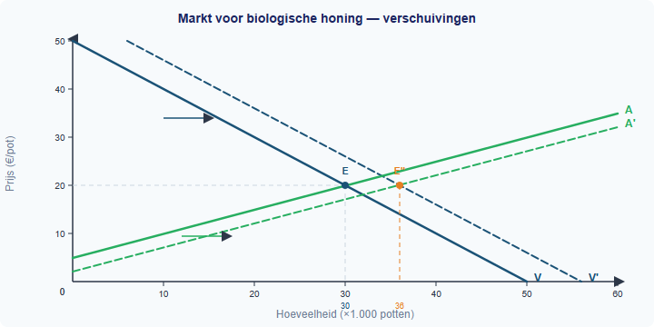

---

**6** *(2p)* Bereken de oorspronkelijke evenwichtsprijs en evenwichtshoeveelheid op de markt voor biologische honing.

**7** *(2p)* Bereken het nieuwe evenwicht als alleen de aanbodlijn verschuift (door de nieuwe technologie). Leg uit of de prijs stijgt of daalt.

**8** *(2p)* Bereken het nieuwe evenwicht als alleen de vraaglijn verschuift (door de inkomensstijging). Leg uit of de prijs stijgt of daalt.

**9** *(2p)* Bepaal het evenwicht als beide verschuivingen tegelijk optreden. Bereken de nieuwe evenwichtsprijs en evenwichtshoeveelheid.

**10** *(2p)* Na beide verschuivingen is de marktprijs €20 per pot. Honinghoeve Bloesem ontvangt deze prijs voor elke pot. Bepaal met behulp van tabel 2 de winstmaximaliserende productie van Honinghoeve Bloesem. Gebruik de MO = MK-regel.

**Denkertje** *(2p)* Een politicus beweert: "Als vraag en aanbod tegelijk toenemen, blijft de prijs altijd gelijk." Beoordeel deze uitspraak. Gebruik de berekeningen uit vraag 6 t/m 9 in je antwoord.

<div style="break-before: page;"></div>

<div class="chapter-front">

<h1>Hoofdstuk 5 — Toetsvoorbereiding</h1>

<h2>Inhoud</h2>

<table>
<thead><tr><th>§</th><th>Onderwerp</th></tr></thead>
<tbody>
<tr><td>1.5.1</td><td>Actieve samenvatting</td></tr>
<tr><td>1.5.2</td><td>Examenvaardigheden</td></tr>
<tr><td>1.5.3</td><td>Integratieoefening</td></tr>
<tr><td>1.5.4</td><td>Proeftoets</td></tr>
</tbody>
</table>

<h2>Leerdoelen</h2>

<p>Na dit hoofdstuk kun je:</p>

<ul>
<li>De kernbegrippen uit hoofdstukken 1–4 actief ophalen en toepassen</li>
<li>Schaarste, alternatieve kosten en economisch denken herkennen en berekenen</li>
<li>Procentuele veranderingen en indexcijfers correct berekenen (inclusief de valkuil indexpunten ≠ procenten)</li>
<li>De vraaglijn en aanbodlijn tekenen, aflezen en interpreteren</li>
<li>Het verschil uitleggen tussen een beweging langs en een verschuiving van een vraaglijn of aanbodlijn</li>
<li>Kostenstructuren berekenen (TK, TCK, TVK, GTK, GVK, GCK) en het spreidingseffect verklaren</li>
<li>TO, GO en winst berekenen en het break-evenpunt bepalen</li>
<li>Het marktevenwicht berekenen (Qv = Qa) en een nieuw evenwicht na een verschuiving</li>
<li>MK en MO berekenen en de winstmaximalisatieregel (MO = MK) toepassen</li>
<li>Examenvragen correct structureren: ‘bereken’ met alle stappen, ‘leg uit’ met causale keten</li>
<li>Concepten uit meerdere hoofdstukken combineren in één samenhangende context</li>
<li>Een toets onder tijdsdruk maken en je eigen antwoorden beoordelen</li>
</ul>

<h2>Ben je er klaar voor?</h2>

<p>Je hebt geleerd over schaarste en keuzes, over vraag en aanbod, over kosten en opbrengsten, en over marktevenwicht en marginale analyse. Maar kun je al die puzzelstukken ook samenvoegen als het erop aankomt? In dit hoofdstuk bereid je je voor op de eindtoets. Je herhaalt actief de theorie, traint je examenvaardigheden, lost een integratieoefening op die alle hoofdstukken combineert, en maakt een volledige proeftoets onder examencondities. Geen nieuwe theorie — alleen oefenen, oefenen, oefenen.</p>

</div>


<div style="break-before: page;"></div>

# §1.5.1 Actieve samenvatting

Hieronder vind je een beknopte samenvatting van alle theorie uit Hoofdstuk 1 t/m 4. Na elk blok staan meerkeuze-vragen waarmee je toetst of je de stof écht begrijpt. Lees het blok, beantwoord de vragen en controleer je antwoorden in het antwoordenblad.

---

## Blok 1: Schaarste, alternatieve kosten en rekenen (H1.1)

Schaarste ontstaat doordat je behoeften groter zijn dan je beschikbare middelen — je kunt niet alles tegelijk hebben en moet dus kiezen. Bij elke keuze horen **alternatieve kosten**: de opbrengst van het beste alternatief dat je opgeeft. Je berekent ze in drie stappen: (1) noem alle alternatieven, (2) bepaal de opbrengst van elk alternatief, (3) de alternatieve kosten zijn de opbrengst van het beste *niet-gekozen* alternatief.

Voor het rekenen gebruik je twee hulpmiddelen. De **procentuele verandering** bereken je met (nieuw − oud) / oud × 100%. Let op: je deelt altijd door de **oude** waarde. Het **indexcijfer** bereken je met waarde / basiswaarde × 100. Een verandering in *indexpunten* is niet hetzelfde als een verandering in *procenten* — voor het percentage deel je door het oude indexcijfer, niet door 100.


**Vraag 1**

> Het indexcijfer van de benzineprijs steeg van 120 naar 132. Lisa beweert: "De benzineprijs is met 12% gestegen." Wat klopt er?

**(A)** Lisa heeft gelijk: 132 − 120 = 12, dus 12%.

**(B)** Lisa heeft ongelijk: (132 − 120) / 120 × 100% = 10%.

**(C)** Lisa heeft ongelijk: (132 − 120) / 132 × 100% = 9,1%.

**(D)** Lisa heeft gelijk: 12 indexpunten is altijd 12%.

**Vraag 2**

> Tim kan na school werken bij de supermarkt (€35) of bijles geven (€45). Hij kiest voor bijles. Wat zijn de alternatieve kosten van deze keuze?

**(A)** €45, want dat is wat hij verdient.

**(B)** €80, want dat is de totale opbrengst van alle alternatieven.

**(C)** €35, want dat is de opbrengst van het beste niet-gekozen alternatief.

**(D)** €10, want dat is het verschil tussen bijles en de supermarkt.

**Vraag 3**

> De prijs van een fiets daalt van €500 naar €400. Een leerling berekent de procentuele verandering als (500 − 400) / 400 × 100% = 25%. Klopt dit?

**(A)** Ja, 25% daling is correct.

**(B)** Nee, de daling is (500 − 400) / 500 × 100% = 20%.

**(C)** Nee, de daling is (400 − 500) / 400 × 100% = −25%.

**(D)** Nee, de daling is (400 / 500) × 100 = 80 indexpunten.

---

## Blok 2: Vraag — betalingsbereidheid, vraaglijn en vraagfactoren (H1.2)

De **betalingsbereidheid** (BB) is het maximale bedrag dat een consument voor een extra eenheid wil betalen. De **individuele vraaglijn** loopt dalend: bij een hogere prijs koop je minder. Je koopt zolang BB ≥ P. Het **consumentensurplus** (CS) is het verschil tussen je betalingsbereidheid en de prijs die je betaalt — in de grafiek het driehoekige gebied boven de prijslijn en onder de vraaglijn.

Vijf factoren verschuiven de **hele** vraaglijn: inkomen, voorkeuren, prijs van substituten, prijs van complementen en het aantal vragers. Een verandering van de *eigen prijs* geeft een **beweging langs** de vraaglijn, geen verschuiving. De **collectieve vraaglijn** is de horizontale optelsom van alle individuele vraaglijnen.


**Vraag 4**

> De prijs van boter stijgt. Wat gebeurt er met de vraaglijn naar boter?

**(A)** De vraaglijn verschuift naar links, want consumenten willen minder boter.

**(B)** Er is een beweging langs de vraaglijn naar links-boven: bij hogere P daalt Qv.

**(C)** De vraaglijn verschuift naar rechts, want boter wordt schaarser.

**(D)** Er gebeurt niets met de vraaglijn; alleen de aanbodlijn verandert.

**Vraag 5**

> Koffie en thee zijn substituten. De prijs van koffie stijgt fors. Wat gebeurt er met de vraaglijn naar thee?

**(A)** De vraaglijn naar thee verschuift naar rechts, want consumenten stappen over op thee.

**(B)** Er is een beweging langs de vraaglijn naar thee, want de prijs van thee verandert niet.

**(C)** De vraaglijn naar thee verschuift naar links, want koffie en thee gaan samen.

**(D)** De vraaglijn naar thee blijft gelijk, want alleen de prijs van koffie verandert.

**Vraag 6**

> Twee consumenten hebben de volgende individuele vraag: Anna: Qv = 10 − 2P, Ben: Qv = 8 − P. Wat is de collectieve gevraagde hoeveelheid bij P = 3?

**(A)** Qv = 18 − 3P = 18 − 9 = 9.

**(B)** Qv = (10 − 6) + (8 − 3) = 4 + 5 = 9.

**(C)** Qv = (10 − 6) × (8 − 3) = 4 × 5 = 20.

**(D)** Qv = 10 + 8 − 2 × 3 = 12.

---

## Blok 3: Aanbod en kosten (H1.3)

De **aanbodlijn** loopt stijgend: bij hogere prijs bieden producenten meer aan. Vijf factoren verschuiven de hele aanbodlijn: inputprijzen, technologie, aantal aanbieders, verwachtingen en overheidsbeleid. Kosten bestaan uit **constante kosten** (CK, onafhankelijk van Q) en **variabele kosten** (VK, afhankelijk van Q). De totale kosten zijn TK = TCK + TVK.

De **gemiddelde kosten** bereken je door te delen: GTK = TK/Q, GVK = TVK/Q, GCK = TCK/Q. Het **spreidingseffect** houdt in dat GCK daalt naarmate je meer produceert — de vaste kosten worden over meer eenheden verdeeld. De **totale opbrengst** is TO = P × Q. **Winst** = TO − TK (let op: opbrengst is niet hetzelfde als winst!). Bij het **break-evenpunt** geldt TO = TK, ofwel Q = TCK / (P − GVK).


**Vraag 7**

> Een bakkerij heeft TCK = €500, GVK = €0,80 per brood en verkoopt brood voor €1,50.
>
> | Productie (Q) | TK | GTK |
> |---|---|---|
> | 200 | ? | ? |
> | 500 | ? | ? |
> | 1000 | ? | ? |
>
> Wat is GTK bij Q = 500?

**(A)** €0,80, want GTK = GVK als je genoeg produceert.

**(B)** €1,80, want GTK = GVK + GCK = 0,80 + 500/500 = 0,80 + 1,00 = 1,80.

**(C)** €1,50, want GTK = prijs bij break-even.

**(D)** €2,30, want GTK = (500 + 0,80) / 500.

**Vraag 8**

> Bij dezelfde bakkerij stijgt de productie van 200 naar 1000 broden. Wat gebeurt er met TK en GTK?

**(A)** TK stijgt en GTK stijgt ook, want meer produceren is altijd duurder per stuk.

**(B)** TK stijgt, maar GTK daalt door het spreidingseffect van de constante kosten.

**(C)** TK blijft gelijk en GTK daalt, want de constante kosten veranderen niet.

**(D)** TK en GTK dalen allebei, want de bakkerij wordt efficiënter.

**Vraag 9**

> Een bedrijf heeft TO = €10.000 en TK = €8.500. Een leerling schrijft: "De opbrengst is €1.500." Wat is hierop aan te merken?

**(A)** Niets, de berekening klopt.

**(B)** De leerling verwart opbrengst met winst: TO = €10.000 is de opbrengst, winst = TO − TK = €1.500.

**(C)** De opbrengst is €8.500, want opbrengst = kosten.

**(D)** De winst is €10.000 en de opbrengst is €1.500.

---

## Blok 4: Marktevenwicht en verschuivingen (H1.4 §1–2)

Het **marktevenwicht** vind je waar de gevraagde hoeveelheid gelijk is aan de aangeboden hoeveelheid: Qv = Qa. Je lost op naar de **evenwichtsprijs** (P\*) en vult die in om de **evenwichtshoeveelheid** (Q\*) te berekenen. Controleer altijd door P\* in beide vergelijkingen in te vullen. Bij P > P\* ontstaat een **aanbodoverschot** (Qa > Qv); bij P < P\* een **vraagoverschot** (Qv > Qa).

Een verschuiving van vraag of aanbod leidt tot een nieuw evenwicht. **Vuistregels:** aanbod naar rechts → P daalt, Q stijgt; vraag naar rechts → P stijgt, Q stijgt. Bij twee gelijktijdige verschuivingen is de richting van één variabele (P of Q) altijd ambigu — je kunt niet zeggen welke kant die opgaat zonder de grootte van de verschuivingen te kennen.

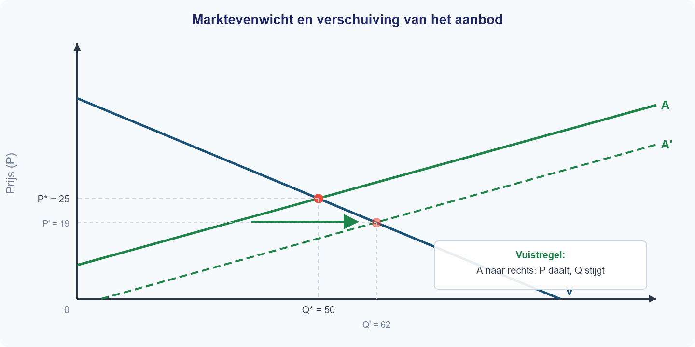

**Vraag 10**

> Op de schriftenmarkt geldt: Qv = −2P + 100 en Qa = 3P − 25. Wat zijn de evenwichtsprijs en -hoeveelheid?

**(A)** P\* = 15, Q\* = 70.

**(B)** P\* = 25, Q\* = 50.

**(C)** P\* = 20, Q\* = 60.

**(D)** P\* = 25, Q\* = 75.

**Vraag 11**

> Door nieuwe technologie verschuift de aanbodlijn op de schriftenmarkt naar rechts. Wat is het effect op het evenwicht?

**(A)** De evenwichtsprijs stijgt en de evenwichtshoeveelheid daalt.

**(B)** De evenwichtsprijs daalt en de evenwichtshoeveelheid stijgt.

**(C)** Zowel de evenwichtsprijs als de evenwichtshoeveelheid stijgen.

**(D)** De evenwichtsprijs daalt en de evenwichtshoeveelheid daalt.

**Vraag 12**

> De vraag naar fietsen verschuift naar rechts (meer vraag) en tegelijkertijd verschuift het aanbod naar rechts (meer aanbod). Welke uitspraak is correct?

**(A)** De evenwichtshoeveelheid stijgt zeker, maar het effect op de prijs is onzeker.

**(B)** Zowel prijs als hoeveelheid stijgen zeker.

**(C)** De evenwichtsprijs daalt zeker, maar het effect op de hoeveelheid is onzeker.

**(D)** Het effect op zowel prijs als hoeveelheid is onzeker.

---

## Blok 5: Marginale analyse en winstmaximalisatie (H1.4 §3–4)

De **marginale kosten** (MK) zijn de extra kosten van één extra eenheid: MK = ΔTK/ΔQ. De **marginale opbrengst** (MO) is de extra opbrengst van één extra eenheid: MO = ΔTO/ΔQ. Bij een **vaste prijs** (volkomen concurrentie) geldt MO = P. Bij een lineaire TK-functie (TK = a + bQ) is MK constant en gelijk aan b. Bij een kwadratische TK-functie (TK = a + bQ²) stijgt MK naarmate Q toeneemt.

Het **winstmaximum** bereik je bij MO = MK. Produceer zolang MO ≥ MK — elke extra eenheid levert dan meer op dan ze kost. Zodra MO < MK wordt, kost een extra eenheid meer dan ze oplevert en daalt je winst. "Meer produceren is altijd beter" klopt dus niet bij stijgende MK.

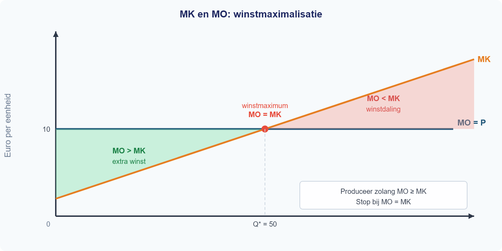

**Vraag 13**

> Een bedrijf heeft TK = 100 + 2Q². De productie stijgt van 10 naar 11 eenheden. Wat zijn de marginale kosten?

**(A)** MK = 2 × 11² − 2 × 10² = 242 − 200 = 42.

**(B)** MK = TK(11) / 11 = (100 + 242) / 11 = 31,1.

**(C)** MK = 2 × 2Q = 4 × 10 = 40.

**(D)** MK = ΔTK/ΔQ = (TK(11) − TK(10)) / 1 = (342 − 300) / 1 = 42.

**Vraag 14**

> Een producent verkoopt tegen een vaste prijs van €20 per stuk. Zijn MK stijgt: bij Q = 30 is MK = €15 en bij Q = 50 is MK = €25. Een leerling zegt: "Je moet altijd zoveel mogelijk produceren, want meer afzet = meer winst." Waarom klopt deze redenering niet?

**(A)** Omdat de prijs daalt bij meer productie.

**(B)** Omdat na Q = 30 de MK boven de MO komen en elke extra eenheid verlies oplevert, waardoor de totale winst daalt.

**(C)** Omdat de constante kosten stijgen bij meer productie.

**(D)** Omdat bij Q = 50 de totale opbrengst negatief wordt.


<div style="break-before: page;"></div>

# §1.5.2 Examenvaardigheden

In deze paragraaf oefen je de vaardigheden die je nodig hebt om goed te scoren op de toets. Er komt geen nieuwe theorie aan bod — je leert **hoe** je toetsvragen correct beantwoordt. Lees bij elke oefening eerst de vaardigheidstip en maak dan de opgaven.

---

## Oefening 1 — Vaardigheid: een ongelabelde grafiek lezen

Bekijk de onderstaande grafiek. De grafiek bevat twee lijnen, maar er staan geen labels bij de assen en geen letters bij de lijnen. Eén van de lijnen heeft een gearceerd driehoekig vlak erboven (tussen de lijn en de bovenrand van de grafiek, tot aan het snijpunt).


> **Vaardigheidstip:** Op het examen krijg je soms een grafiek zonder labels. Je moet dan zelf herkennen welke lijn de vraaglijn is en welke de aanbodlijn. De sleutel: de vraaglijn loopt dalend, de aanbodlijn loopt stijgend.

**1** *(2p)* Welke lijn is de vraaglijn? Welke is de aanbodlijn? Leg uit hoe je dat kunt zien aan het verloop van de lijnen.

**2** *(1p)* Lees de evenwichtsprijs en de evenwichtshoeveelheid af uit de grafiek.

**3** *(2p)* Geef de juiste labels voor de assen. Welke conventie geldt in de economie voor de positie van P en Q? Waarom is dat anders dan in de wiskunde?

**4** *(2p)* Het gearceerde driehoekige vlak stelt een economisch begrip voor. Noem dit begrip en leg uit wat het betekent. Gebruik de termen betalingsbereidheid en marktprijs in je antwoord.

---

## Oefening 2 — Vaardigheid: gegevens uit een tabel halen en doorrekenen

Een bedrijf heeft constante kosten (TCK) van €600. De variabele kosten stijgen lineair met de productie. De verkoopprijs is €10 per stuk. In de tabel staan de kostengegevens bij verschillende productieniveaus.

| Q (stuks) | TCK (€) | TVK (€) | TK (€) |
|-----------|---------|---------|--------|
| 0         | 600     | 0       | 600    |
| 50        | 600     | 250     | 850    |
| 100       | 600     | 500     | 1.100  |
| 150       | 600     | 750     | 1.350  |
| 200       | 600     | 1.000   | 1.600  |

> **Vaardigheidstip:** Bij een 'bereken'-vraag met een tabel lees je eerst de juiste waarden af en schrijf je dan de formule op. Noteer altijd: formule → invullen → berekenen → antwoord met eenheid.

**5** *(2p)* Bereken de GVK. Leg uit hoe je dit kunt aflezen uit de tabel zonder te delen.

**6** *(2p)* Bereken de GTK bij Q = 100 en bij Q = 200.

**7** *(2p)* Leg uit waarom de GTK daalt als Q stijgt. Gebruik het begrip **spreidingseffect**.

**8** *(3p)* Bereken het break-evenpunt. Toon alle stappen.

**9** *(2p)* Bereken de winst bij Q = 200. Is het bedrijf winstgevend bij dit productieniveau?

---

## Oefening 3 — Vaardigheid: een 'bereken'-antwoord structureren

Op de markt voor pennen geldt Qv = −3P + 90 en Qa = 2P − 10. Twee leerlingen berekenen het marktevenwicht.

**Antwoord A (leerling 1):**

> "P* = 20, Q* = 30."

**Antwoord B (leerling 2):**

> "Stap 1: Qv = Qa → −3P + 90 = 2P − 10
> Stap 2: 90 + 10 = 2P + 3P → 100 = 5P → P* = 20
> Stap 3: Qv = −3 × 20 + 90 = 30
> Controle: Qa = 2 × 20 − 10 = 30 ✓
> Antwoord: P* = €20, Q* = 30 pennen."

> **Vaardigheidstip:** Bij het examen krijg je punten voor elke stap, niet alleen voor het eindantwoord. Schrijf altijd: vergelijking opstellen → oplossen → invullen → controleren → antwoord met eenheid.

**10** *(2p)* Welk antwoord scoort meer punten bij een examen? Waarom?

**11** *(2p)* Hoeveel punten verdient leerling 1 bij een 4-punts berekenopgave? En leerling 2?

**12** *(4p)* Schrijf zelf een volledig antwoord bij de volgende opgave: *"Op de markt voor USB-sticks geldt Qv = −P + 40 en Qa = 2P − 20. Bereken de evenwichtsprijs en de evenwichtshoeveelheid."*

---

## Oefening 4 — Vaardigheid: een 'leg uit'-antwoord structureren

Een krantenartikel meldt dat de prijs van katoen — een grondstof voor kleding — dit jaar met 35% is gestegen. Een leerling wordt gevraagd: *"Leg uit wat het effect is op de markt voor T-shirts."*

De leerling schrijft:

> "Als katoen duurder wordt, worden T-shirts ook duurder."

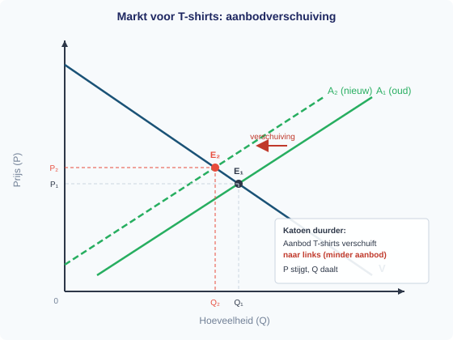

> **Vaardigheidstip:** Een 'leg uit'-antwoord heeft een **causale keten** nodig. Je noemt het gegeven, legt de tussenstappen uit en eindigt met een conclusie. Structuur: gegeven → schakel 1 → schakel 2 → conclusie.

**13** *(2p)* Is het antwoord van de leerling correct? Wat ontbreekt er?

**14** *(3p)* Schrijf zelf het volledige antwoord. Gebruik de structuur: gegeven → schakel 1 → schakel 2 → conclusie.

**15** *(2p)* Een medeleerling beweert: *"De vraaglijn van T-shirts verschuift naar links."* Is dit correct? Leg uit met het verschil tussen **beweging langs** en **verschuiving van** een lijn.

**16** *(2p)* Het indexcijfer van de katoenprijs was vorig jaar 140. Dit jaar is het 189. Een leerling zegt: *"De prijs is met 49% gestegen."* Klopt dit? Toon je berekening.

---

## Oefening 5 — Vaardigheid: meerstaps-berekening (evenwicht, verschuiving en marginale analyse)

Op de markt voor schriften geldt Qv = −2P + 100 en Qa = 3P − 25. Door hogere grondstofprijzen wordt de aanbodvergelijking: Qa' = 3P − 40.

Een producent op deze markt heeft TK = 200 + 4Q. Hij verkoopt tegen de evenwichtsprijs.

> **Vaardigheidstip:** Bij een opgave met een verschuiving bereken je eerst het oorspronkelijke evenwicht, dan het nieuwe. Vergelijk de twee en trek een conclusie. Bij MK en MO: vergelijk per eenheid of uitbreiden loont.

**17** *(4p)* Bereken het oorspronkelijke evenwicht. Toon alle stappen.

**18** *(4p)* Bereken het nieuwe evenwicht na de aanbodverschuiving. Toon alle stappen.

**19** *(2p)* Bereken de procentuele verandering van de evenwichtsprijs.

**20** *(2p)* Bij de oorspronkelijke evenwichtsprijs van €25: bereken de gevraagde en aangeboden hoeveelheid met de **nieuwe** aanbodvergelijking. Is er dan een vraagoverschot of een aanbodoverschot?

**21** *(2p)* Bereken de MK en MO van de producent bij de nieuwe evenwichtsprijs. Moet hij meer of minder produceren? Leg uit.

**22** *(2p)* Leg uit waarom de evenwichtsprijs is gestegen. Gebruik de begrippen **aanbodfactor** en **verschuiving** in je antwoord.


<div style="break-before: page;"></div>

# §1.5.3 Integratieoefening

In deze oefening werk je aan een samenhangende casus die vaardigheden uit alle vier de theoriehoofdstukken combineert. Je past kostenberekeningen, evenwichtsanalyse, verschuivingen, marginale analyse en procentuele veranderingen toe op dezelfde situatie. Er komt geen nieuwe theorie aan bod.

---

## De koffiebrander

Een kleine koffiebrander verkoopt zakken koffie op een markt met volkomen concurrentie. De constante kosten bedragen €800 per maand en de variabele kosten zijn €3 per zak. De totale kostenfunctie is:

**TK = 800 + 3Q**

Op de koffiemarkt gelden de volgende vergelijkingen:

- Vraagfunctie: **Qv = −40P + 580**
- Aanbodfunctie: **Qa = 20P − 20**

---

**Vraag (a)** *(4 punten)*

Bereken de totale kosten (TK) en de gemiddelde totale kosten (GTK) bij Q = 200 en bij Q = 400.

Wat valt je op als je de GTK bij beide productieniveaus vergelijkt? Leg uit met behulp van het begrip **spreidingseffect**.

---

**Vraag (b)** *(4 punten)*

Het marktevenwicht ligt bij P = 10 en Q = 180. Verifieer dit met behulp van de vraag- en aanbodfuncties.

Toon alle stappen: vergelijking opstellen, oplossen, invullen en controleren.

---

**Vraag (c)** *(6 punten)*

Een nieuwsbericht waarschuwt dat de prijs van koffiebonen met 20% zal stijgen. Door deze kostenstijging wordt de nieuwe aanbodfunctie:

**Qa' = 20P − 60**

**(c1)** Teken in een grafiek de vraaglijn (V), de oorspronkelijke aanbodlijn (A₁) en de nieuwe aanbodlijn (A₂). Markeer het oude evenwicht (E) en het nieuwe evenwicht (E').

Gebruik de onderstaande grafiek als uitgangspunt.

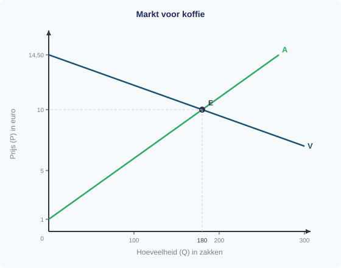

**(c2)** Bereken het nieuwe evenwicht (P' en Q'). Toon alle stappen.

---

**Vraag (d)** *(4 punten)*

Bij het nieuwe evenwicht ontvangt de koffiebrander een prijs van €10,67 per zak. De totale kostenfunctie is nog steeds TK = 800 + 3Q.

Bereken de marginale kosten (MK) en de marginale opbrengsten (MO).

Moet de koffiebrander bij het nieuwe evenwicht meer of minder zakken produceren dan het evenwichtsaantal van 153 zakken? Leg uit aan de hand van de vergelijking tussen MO en MK.

---

**Vraag (e)** *(2 punten)*

Bereken de procentuele verandering van de evenwichtsprijs (van het oude naar het nieuwe evenwicht).

Stijgt de evenwichtsprijs met hetzelfde percentage als de koffiebonenprijs (20%)? Leg uit waarom wel of niet.

---

**Vraag (f)** *(4 punten)*

Een mede-ondernemer wil een tweede koffiebrander openen in dezelfde buurt.

Beoordeel of de opening van een tweede koffiebrander goed is voor de consumenten. Gebruik in je antwoord economische begrippen en geef zowel argumenten voor als tegen. Sluit af met een beargumenteerde conclusie.


<div style="break-before: page;"></div>

# §1.5.4 Proeftoets

**Boek 1 — Economie VWO 4**
**Tijd:** 120 minuten | **Totaal:** 74 punten | **Hulpmiddelen:** rekenmachine

> **Instructies**
> - Lees elke opgave zorgvuldig door voordat je begint.
> - Toon bij elke berekening alle tussenstappen.
> - Geef bij "leg uit"-vragen een redenering met economische begrippen.
> - Rond bedragen af op 2 decimalen, tenzij anders aangegeven.

---

## Opgave 1: Sportschool "FitForLife" (18 punten)

Sportschool FitForLife opent een nieuwe vestiging. De eigenaar heeft de volgende kostengegevens verzameld. De constante kosten bedragen €3.000 per maand (huur, afschrijving apparatuur, verzekeringen). De variabele kosten zijn €5 per lid per maand (schoonmaak, energie per lid, slijtage). De abonnementsprijs is €15 per lid per maand.

| Aantal leden (Q) | TCK (€) | TVK (€) | TK (€) | TO bij P = €15 (€) |
|-------------------|---------|---------|--------|---------------------|
| 0 | 3.000 | 0 | 3.000 | 0 |
| 100 | 3.000 | 500 | 3.500 | 1.500 |
| 200 | 3.000 | 1.000 | 4.000 | 3.000 |
| 300 | 3.000 | 1.500 | 4.500 | 4.500 |
| 400 | 3.000 | 2.000 | 5.000 | 6.000 |

---

**1** *(2p)* Noem twee voorbeelden van constante kosten van een sportschool.

**2** *(4p)* Bereken de gemiddelde totale kosten (GTK) bij Q = 200 en bij Q = 400. Leg uit waarom de GTK daalt naarmate het aantal leden toeneemt. Gebruik het begrip **spreidingseffect**.

**3** *(4p)* Bereken het break-evenpunt van FitForLife. Toon alle stappen.

**4** *(4p)* FitForLife heeft 400 leden. De eigenaar overweegt de prijs te verlagen van €15 naar €12 per maand om meer leden te trekken. Bereken de winst bij de oude prijs (€15) en bij de nieuwe prijs (€12), beide bij Q = 400. Beoordeel of de prijsverlaging verstandig is. Gebruik je berekeningen in je antwoord.

**5** *(4p)* Bereken bij Q = 300 de gemiddelde constante kosten (GCK), de gemiddelde variabele kosten (GVK) en toon met een berekening aan dat GTK = GCK + GVK. Leg vervolgens in één zin uit waarom de GCK daalt bij toenemende productie, maar de GVK gelijk blijft.

---

## Opgave 2: De markt voor hardloopschoenen (24 punten)

Op de markt voor hardloopschoenen gelden de volgende vergelijkingen:

- Vraagfunctie: **Qv = −P + 80**
- Aanbodfunctie: **Qa = 2P − 40**

In de grafiek hieronder zijn de vraaglijn (V) en de aanbodlijn (A) getekend. Het evenwichtspunt E is gemarkeerd.


---

**6** *(2p)* Lees de evenwichtsprijs en de evenwichtshoeveelheid af uit de grafiek.

**7** *(4p)* Verifieer het evenwicht door Qv = Qa op te lossen. Toon alle stappen en controleer je antwoord door P* in te vullen in beide vergelijkingen.

**8** *(4p)* Een populaire influencer promoot hardlopen op social media. Hierdoor neemt de vraag naar hardloopschoenen toe. De nieuwe vraagfunctie wordt: **Qv' = −P + 100**. Bereken het nieuwe evenwicht (P*' en Q*'). Toon alle stappen.

**9** *(2p)* Leg uit of de toename van de vraag door de influencer een **verschuiving van de vraaglijn** is of een **beweging langs de vraaglijn**. Noem de vraagfactor die veranderd is.

**10** *(2p)* Bereken de procentuele verandering van de evenwichtshoeveelheid (van het oude naar het nieuwe evenwicht).

**11** *(4p)* Los van de influencer-campagne stijgen de grondstofprijzen voor rubber. Hierdoor verschuift het aanbod. De nieuwe aanbodfunctie wordt: **Qa' = 2P − 60**. Bereken het nieuwe evenwicht bij de **oorspronkelijke** vraagfunctie (Qv = −P + 80). Toon alle stappen.

**12** *(2p)* Leg uit welke aanbodfactor hier is veranderd en waarom de aanbodlijn naar links (omhoog) verschuift.

**13** *(4p)* Neem nu weer de oorspronkelijke vraag- en aanbodfuncties (Qv = −P + 80 en Qa = 2P − 40). De overheid stelt een minimumprijs in van **P = €60**. Leg uit of er op deze markt een aanbodoverschot of een vraagoverschot ontstaat en bereken de omvang ervan.

---

## Opgave 3: Snoepfabriek "ZoetGenoeg" (12 punten)

Snoepfabriek ZoetGenoeg produceert zakken snoep. De totale kostenfunctie is:

**TK = 100 + Q²**

De verkoopprijs is vast: **P = €30 per zak**.

De onderstaande tabel toont de kosten, opbrengsten en winst bij verschillende productieniveaus. De marginale kosten (MK) en marginale opbrengsten (MO) zijn berekend per blok van 5 stuks.

| Q | TK = 100 + Q² (€) | TO = 30Q (€) | Winst (€) | MK (per 5 stuks, €) | MO (€) |
|---|-------------------|-------------|-----------|---------------------|--------|
| 0 | 100 | 0 | −100 | — | — |
| 5 | 125 | 150 | 25 | 5 | 30 |
| 10 | 200 | 300 | 100 | 15 | 30 |
| 15 | 325 | 450 | 125 | 25 | 30 |
| 20 | 500 | 600 | 100 | 35 | 30 |

---

**14** *(2p)* Noem de definitie van marginale kosten (MK) en marginale opbrengsten (MO).

**15** *(2p)* Leg uit met behulp van de tabel waarom de winst bij Q = 20 lager is dan bij Q = 15. Gebruik de begrippen MK en MO in je antwoord.

**16** *(2p)* Bij welke hoeveelheid is de winst maximaal? Leg uit hoe je dit kunt aflezen uit de kolommen MK en MO.

**17** *(4p)* Bereken de optimale productieomvang algebraïsch met de MO = MK-regel. Toon alle stappen. *Hint:* Bij TK = 100 + Q² geldt MK ≈ 2Q.

**18** *(2p)* Stel dat de totale kostenfunctie verandert naar **TK = 100 + 2Q²** (hogere variabele kosten per eenheid). Leg uit of de MK nu constant of stijgend wordt en geef de formule voor de MK.

---

## Opgave 4: Krantenbericht over de benzineprijs (12 punten)

Lees het onderstaande krantenbericht.

> **Benzineprijs stijgt fors**
>
> De benzineprijs is dit jaar met 12% gestegen, van €1,80 naar €2,02 per liter. Tankstations melden dat automobilisten minder tanken. "We zien een duidelijke daling van het aantal liters per tankbeurt", aldus een woordvoerder. Tegelijk zijn de kosten van biodiesel — een substituut voor benzine — gedaald door nieuwe productiemethoden. Steeds meer automobilisten stappen over op biodiesel.

---

**19** *(2p)* Bereken of de procentuele stijging van 12% klopt. Toon alle stappen.

**20** *(2p)* Automobilisten tanken minder benzine doordat de benzineprijs is gestegen. Leg uit of dit een **verschuiving van de vraaglijn** is of een **beweging langs de vraaglijn**.

**21** *(2p)* Biodiesel is een substituut voor benzine. De kosten van biodiesel zijn gedaald. Leg uit wat het effect is van de dalende biodieselkosten op de markt voor **benzine**. Gebruik het begrip **vraagfactor** in je antwoord.

**22** *(2p)* Noem de drie stappen van economisch denken en pas ze kort toe op de keuze van een automobilist tussen benzine en biodiesel.

**23** *(4p)* Het Centraal Bureau voor de Statistiek publiceert indexcijfers voor motorbrandstof. In 2023 was het indexcijfer 100, in 2024 was het 108, en in 2025 is het 120. Een klasgenoot beweert: *"De prijs is dus van 2024 tot 2025 met 12 procent gestegen, want 120 − 108 = 12."* Leg uit waarom deze redenering fout is en bereken de juiste procentuele stijging tussen 2024 en 2025.

---

## Opgave 5: Betalingsbereidheid en consumentensurplus (8 punten)

Op de markt voor een populair paar koptelefoons zijn vier consumenten actief. De betalingsbereidheden (BB) zijn:

| Consument | Betalingsbereidheid (€) |
|-----------|-------------------------|
| Anne      | 140                     |
| Bram      | 120                     |
| Carla     | 90                      |
| Daan      | 60                      |

De marktprijs is **P = €80**.

---

**24** *(4p)* Bepaal welke consumenten het product kopen en bereken het **totale consumentensurplus** bij P = €80. Toon alle stappen.

**25** *(4p)* De prijs daalt naar **P = €50** door meer concurrentie op de markt. Bereken het nieuwe totale consumentensurplus en de verandering ten opzichte van de situatie bij P = €80. Leg in één zin uit waarom het consumentensurplus toeneemt.

<!-- BOOK-CONTENT-END -->

<div style="break-before: page;"></div>

<div class="book-glossary">
<h1>Begrippenlijst</h1>
<dl>
<dt>arbeid <span class="term-abbrev">(L)</span></dt>
<dd>Menselijke inspanning, zowel fysiek als mentaal, ingezet om goederen en diensten te produceren. In de macro-economie aangeduid met L en gemeten in gewerkte uren of aantal werkenden.</dd>
<dt>betalingsbereidheid</dt>
<dd>De maximale prijs die een consument bereid is te betalen voor een extra eenheid van een product. Deze hangt af van de waarde die de koper aan het product hecht.</dd>
<dt>collectieve vraaglijn</dt>
<dd>Grafiek die laat zien hoeveel alle consumenten samen van een product vragen bij elke prijs. Ontstaat door de individuele vraaglijnen horizontaal bij elkaar op te tellen.</dd>
<dt>constante kosten <span class="term-abbrev">(TCK)</span></dt>
<dd>Kosten die niet afhangen van de geproduceerde hoeveelheid, zoals huur en afschrijvingen. Ze blijven gelijk of er nu weinig of veel geproduceerd wordt.</dd>
<dt>consumentensurplus <span class="term-abbrev">(CS)</span></dt>
<dd>Het verschil tussen wat consumenten maximaal bereid zijn te betalen (betalingsbereidheid) en wat zij daadwerkelijk betalen. In een vraag-aanbod-diagram is het de driehoek boven de marktprijs en onder de vraaglijn.</dd>
<dd class="term-formula"><code>CS = ½ × (P_max − P*) × Q*  (bij lineaire vraag)</code></dd>
<dt>evenwichtshoeveelheid</dt>
<dd>De hoeveelheid die bij de evenwichtsprijs wordt verhandeld. Op dat punt snijden de collectieve vraaglijn en de collectieve aanbodlijn elkaar.</dd>
<dt>evenwichtsprijs</dt>
<dd>De prijs waarbij de gevraagde en de aangeboden hoeveelheid op een markt aan elkaar gelijk zijn. Bij deze prijs heerst marktevenwicht.</dd>
<dt>gemiddelde totale kosten <span class="term-abbrev">(GTK)</span></dt>
<dd>De totale kosten per geproduceerde eenheid. Daalt eerst door schaalvoordelen en stijgt later door afnemende meeropbrengsten.</dd>
<dd class="term-formula"><code>GTK = TK / Q</code></dd>
<dt>individuele vraaglijn</dt>
<dd>Grafiek die voor één consument laat zien hoeveel hij van een product vraagt bij elke prijs. De lijn daalt omdat de consument bij een hogere prijs minder koopt.</dd>
<dt>marginale kosten <span class="term-abbrev">(MK)</span></dt>
<dd>De extra kosten van één extra geproduceerde eenheid. Voor een individuele aanbieder vormt de MK-lijn zijn aanbodlijn vanaf het minimum van de GTK.</dd>
<dd class="term-formula"><code>MK = ΔTK / ΔQ</code></dd>
<dt>marginale opbrengsten <span class="term-abbrev">(MO)</span></dt>
<dd>De extra opbrengst van één extra verkochte eenheid. De maximale totale winst ligt bij de afzet waarvoor MO gelijk is aan MK.</dd>
<dd class="term-formula"><code>MO = ΔTO / ΔQ</code> &middot; <code>MO = MK  (maximale winst)</code></dd>
<dt>marktevenwicht</dt>
<dd>Situatie op een markt waarin de gevraagde hoeveelheid gelijk is aan de aangeboden hoeveelheid, zodat er geen tekort of overschot ontstaat.</dd>
<dt>producentensurplus <span class="term-abbrev">(PS)</span></dt>
<dd>Het verschil tussen de marktprijs en de minimumprijs waarvoor aanbieders bereid zijn te leveren. In een vraag-aanbod-diagram is het de driehoek onder de marktprijs en boven de aanbodlijn.</dd>
<dd class="term-formula"><code>PS = ½ × (P* − P_min) × Q*  (bij lineaire aanbod)</code></dd>
<dt>subsidies</dt>
<dd>Bijdrage die de overheid per verkocht product geeft aan aanbieders. De collectieve aanbodlijn verschuift verticaal omlaag met het subsidiebedrag, waardoor de marktprijs daalt.</dd>
<dt>totale kosten <span class="term-abbrev">(TK)</span></dt>
<dd>Alle kosten die een aanbieder maakt om een bepaalde hoeveelheid te produceren: de som van constante en variabele kosten.</dd>
<dd class="term-formula"><code>TK = TCK + TVK</code></dd>
<dt>totale opbrengst <span class="term-abbrev">(TO)</span></dt>
<dd>De totale geldontvangsten van een aanbieder: prijs maal afzet. Ook wel omzet genoemd.</dd>
<dd class="term-formula"><code>TO = P × Q</code></dd>
<dt>variabele kosten <span class="term-abbrev">(TVK)</span></dt>
<dd>Kosten die meestijgen met de geproduceerde hoeveelheid, zoals grondstoffen en uurlonen. Bij nul productie zijn de variabele kosten ook nul.</dd>
<dt>volkomen concurrentie</dt>
<dd>Marktvorm met veel kleine aanbieders die een homogeen goed verkopen en vrije toetreding kennen. Geen enkele aanbieder heeft marktmacht; de prijs komt tot stand door vraag en aanbod op de markt.</dd>
<dt>winst</dt>
<dd>Het verschil tussen totale opbrengst en totale kosten. Positief bij winst, nul bij break-even, negatief bij verlies.</dd>
<dd class="term-formula"><code>winst = TO − TK</code></dd>
</dl></div>

<div style="break-before: page;"></div>

<div class="book-formulas">
<h1>Formule- en begripoverzicht</h1>
<p class="book-formulas-chapter">Hoofdstuk 1.1 — Economisch denken en rekenen</p>
<ul class="book-formula-list">
<li><span class="book-kind book-kind-definitie">Definitie</span> Schaarste</li>
<li><span class="book-kind book-kind-definitie">Definitie</span> Alternatieve kosten</li>
<li><span class="book-kind book-kind-definitie">Definitie</span> Procentuele verandering</li>
<li><span class="book-kind book-kind-procedure">Procedure</span> Procentuele verandering berekenen</li>
<li><span class="book-kind book-kind-definitie">Definitie</span> Indexcijfer</li>
<li><span class="book-kind book-kind-procedure">Procedure</span> Indexcijfer berekenen</li>
<li><span class="book-kind book-kind-procedure">Procedure</span> Grafiek tekenen van tabeldata</li>
<li><span class="book-kind book-kind-definitie">Definitie</span> Assenconventie in de economie</li>
<li><span class="book-kind book-kind-procedure">Procedure</span> Waarden aflezen uit een grafiek</li>
</ul>
<p class="book-formulas-chapter">Hoofdstuk 1.2 — Vraag</p>
<ul class="book-formula-list">
<li><span class="book-kind book-kind-definitie">Definitie</span> Betalingsbereidheid</li>
<li><span class="book-kind book-kind-definitie">Definitie</span> Individuele vraaglijn</li>
<li><span class="book-kind book-kind-definitie">Definitie</span> Wet van de vraag</li>
<li><span class="book-kind book-kind-definitie">Definitie</span> Consumentensurplus</li>
<li><span class="book-kind book-kind-definitie">Definitie</span> Vraagfactoren</li>
<li><span class="book-kind book-kind-definitie">Definitie</span> Normaal goed</li>
<li><span class="book-kind book-kind-definitie">Definitie</span> Inferieur goed</li>
<li><span class="book-kind book-kind-definitie">Definitie</span> Substitutiegoederen (substituten)</li>
<li><span class="book-kind book-kind-definitie">Definitie</span> Complementaire goederen (complementen)</li>
<li><span class="book-kind book-kind-definitie">Definitie</span> Collectieve vraag (marktvraag)</li>
<li><span class="book-kind book-kind-formule">Formule</span> Collectieve vraagfunctie (zolang beide kopen)</li>
</ul>
<p class="book-formulas-chapter">Hoofdstuk 1.3 — Aanbod en kosten</p>
<ul class="book-formula-list">
<li><span class="book-kind book-kind-definitie">Definitie</span> Aanbodlijn (A)</li>
<li><span class="book-kind book-kind-definitie">Definitie</span> Wet van het aanbod</li>
<li><span class="book-kind book-kind-definitie">Definitie</span> Aanbodfactoren</li>
<li><span class="book-kind book-kind-definitie">Definitie</span> Constante kosten (CK)</li>
<li><span class="book-kind book-kind-definitie">Definitie</span> Variabele kosten (VK)</li>
<li><span class="book-kind book-kind-definitie">Definitie</span> Totale constante kosten (TCK)</li>
<li><span class="book-kind book-kind-definitie">Definitie</span> Totale variabele kosten (TVK)</li>
<li><span class="book-kind book-kind-definitie">Definitie</span> Totale kosten (TK)</li>
<li><span class="book-kind book-kind-definitie">Definitie</span> Gemiddelde totale kosten (GTK)</li>
<li><span class="book-kind book-kind-definitie">Definitie</span> Gemiddelde variabele kosten (GVK)</li>
<li><span class="book-kind book-kind-definitie">Definitie</span> Gemiddelde constante kosten (GCK)</li>
<li><span class="book-kind book-kind-definitie">Definitie</span> Totale opbrengst (TO)</li>
<li><span class="book-kind book-kind-definitie">Definitie</span> Gemiddelde opbrengst (GO)</li>
<li><span class="book-kind book-kind-definitie">Definitie</span> Winst</li>
<li><span class="book-kind book-kind-definitie">Definitie</span> Break-evenpunt</li>
</ul>
<p class="book-formulas-chapter">Hoofdstuk 1.4 — Marktevenwicht en marginale analyse</p>
<ul class="book-formula-list">
<li><span class="book-kind book-kind-definitie">Definitie</span> Marktevenwicht</li>
<li><span class="book-kind book-kind-definitie">Definitie</span> Aanbodoverschot (surplus)</li>
<li><span class="book-kind book-kind-definitie">Definitie</span> Vraagoverschot (tekort)</li>
<li><span class="book-kind book-kind-definitie">Definitie</span> Ambigue uitkomst</li>
<li><span class="book-kind book-kind-definitie">Definitie</span> Marginale kosten (MK)</li>
<li><span class="book-kind book-kind-definitie">Definitie</span> Marginale opbrengsten (MO)</li>
<li><span class="book-kind book-kind-definitie">Definitie</span> Winstmaximalisatie</li>
</ul>
<p class="book-formulas-chapter">Hoofdstuk 1.5 — Toetsvoorbereiding</p>
<p><em>Geen formules of definities gevonden.</em></p>
</div>
