# Boek 1 — Grondslagen, vraag en aanbod

Tweede editie · 2026

# Colofon

Grondslagen, vraag en aanbod
Uitgave
Gegevens
Reeks
4veco · Economie
Boek en doelgroep
Boek 1 · 4 vwo
Editie
Tweede editie · 2026
Opbouw
Drie hoofdstukken, twaalf paragrafen
Leerlinghoofdstukken
Drie hoofdstukken van elk 40 pagina’s, inclusief uitleg en oefeningen.
Aanvullende delen
Een afzonderlijk antwoordboek en een afzonderlijke docentenhandleiding.
Omslag
Illustratieve achtergrond met gecontroleerde, selecteerbare
rekenvoorbeelden.
Over deze editie
Dit boek bundelt de drie hoofdstukken van de tweede editie. De uitleg, oefeningen, tabellen,
grafieken en opgavennummers zijn behouden. De paginanummers en verwijzingen zijn aangepast
aan de doorlopende boekpaginering.
De begrippenlijst en het formule- en aanpakoverzicht achterin zijn ontleend aan deze
hoofdstukken. Ze zijn bedoeld om uitleg terug te vinden en een werkwijze te herhalen. De
volledige uitleg en bronvoorwaarden staan steeds in het betreffende hoofdstuk.
Bronnen en modellen
De situaties en getallen in de hoofdstukken zijn voor het onderwijs gemaakte voorbeelden. Een uitkomst hoort bij de
voorwaarden in de bron. Ze beschrijft niet zonder meer actuele prijzen of werkelijk gemeten gedrag. De omslag is een
afzonderlijke illustratie.
De hoofdstukverantwoording en de herkomst van het materiaal zijn opgenomen in de afzonderlijke
docentenhandleiding en het bronpakket.

# Voorwoord

Economisch leren kijken
Je hebt tijd voor één activiteit, maar wilt er twee doen. Een winkel adverteert met een flinke
prijsdaling. Een verkoper houdt producten over. Achter zulke situaties zitten keuzes en getallen. In
dit boek leer je die stap voor stap onderzoeken.
In hoofdstuk 1 leer je economisch denken en nauwkeurig rekenen. Je gebruikt percentages,
indexcijfers, tabellen, grafieken en eenvoudige formules. Hoofdstuk 2 gaat over de keuzes van
kopers en de vraag naar producten. In hoofdstuk 3 komen de verkopers erbij. Je onderzoekt het
marktevenwicht en wat er verandert als koop- of verkoopplannen verschuiven.
Zo gebruik je dit boek
Lees de uitleg en bestudeer het uitgewerkte voorbeeld. Begeleide inoefening hoort voor de meeste
leerlingen bij de normale route. Je oefent met denkstappen en doet steeds meer zelf.
Normale route
Startopgaven → Begeleide inoefening → Zelfstandige oefening → Doeloefening
Uitdagende route: Startopgaven → Zelfstandige oefening → Doeloefening → Denkertje / Bonusopgave. Heb je
minder tussenstappen nodig en zoek je extra uitdaging, dan kun je deze route volgen. Beide routes leiden naar
dezelfde doeloefening. Herhaling is aanvullend bij beide routes.
Elk hoofdstuk eindigt met gemengde opgaven. Daar kies je zelf de passende aanpak. Gebruik een
schrift, ruitjespapier, potlood, liniaal en zo nodig een rekenmachine. Laat je berekening zien,
vermeld de eenheid en leg uit wat je uitkomst betekent.
De antwoorden staan in een afzonderlijk antwoordboek. Zoek met het hoofdstuknummer én het
opgavenummer: de nummering begint in elk hoofdstuk opnieuw. Met de inhoudsopgave en de
naslag achterin vind je de uitleg terug.
Deze basis neem je mee naar Boek 2, waar kosten, opbrengsten, elasticiteit en surplus hun eigen
uitleg krijgen.

# Inhoud

| Onderdeel | Pagina |
|---|---:|
| **1.1 Economisch denken en rekenen** | **5** |
| 1.1.1 Schaarste, keuzes en alternatieve kosten | 6 |
| 1.1.2 Verhoudingen, percentages en indexcijfers | 13 |
| 1.1.3 Tabellen, grafieken en formules | 24 |
| 1.1.4 Gemengde opgaven | 38 |
| Hoofdstukoverzicht en begrippen | 43 |
| **1.2 Vraag** | **45** |
| 1.2.1 Betalingsbereidheid en individuele vraag | 46 |
| 1.2.2 Vraagfactoren: bewegen of verschuiven? | 58 |
| 1.2.3 Van individuele naar collectieve vraag | 68 |
| 1.2.4 Gemengde opgaven: vraag | 78 |
| Hoofdstukoverzicht en begrippen | 83 |
| **1.3 Aanbod en marktevenwicht** | **85** |
| 1.3.1 Aanbod en aanbodfactoren | 86 |
| 1.3.2 Marktevenwicht: prijs en hoeveelheid | 96 |
| 1.3.3 Verschuivingen en nieuw evenwicht | 108 |
| 1.3.4 Gemengde opgaven | 118 |
| Hoofdstukoverzicht en begrippen | 123 |
| Begrippenlijst | 125 |
| Formule- en aanpakoverzicht | 129 |

<!-- CHAPTERS START -->

<!-- PAGE {"section": "1.1", "title": "Economisch denken en rekenen"} -->

BOEK 1 · GRONDSLAGEN, VRAAG EN AANBOD · TWEEDE EDITIE

Economisch denken en rekenen

Hoofdstuk 1 · Een keuze begrijpen. Een getal controleren.

<a href="#h1-p111"><b>1.1.1 Schaarste, keuzes en alternatieve kosten 6</b>Wat kun je niet tegelijk doen, en wat geef je op?</a>
<a href="#h1-p112"><b>1.1.2 Verhoudingen, percentages en indexcijfers 13</b>Vergeleken met wat? Kies steeds de juiste basis.</a>
<a href="#h1-p113"><b>1.1.3 Tabellen, grafieken en formules 24</b>Lees, teken, bereken en controleer een bewering.</a>
<a href="#h1-p114"><b>1.1.4 Gemengde opgaven 38</b>Gebruik de gereedschappen samen in een nieuwe situatie.</a>
<a href="#h1-overzicht"><b>Hoofdstukoverzicht en begrippen 43</b></a>

<strong>Na dit hoofdstuk kun je</strong>
<ul><li>uitleggen waarom beperkte middelen tot keuzes leiden;</li><li>de waarde van het beste opgegeven alternatief bepalen;</li><li>rekenen met verhoudingen, percentages en indexcijfers;</li><li>tabellen, grafieken en eenvoudige formules gebruiken;</li><li>een conclusie onderbouwen met een berekening of bron.</li></ul>

<strong>Is 20% meer altijd veel?</strong> En kost een gratis activiteit echt niets? In dit hoofdstuk leer je vragen stellen bij keuzes en getallen. Je begint met herkenbare situaties. Daarna leer je het rekenwerk en de grafieken waarmee je een antwoord controleert.

<strong>Zo werk je</strong>

Lees de uitleg en het uitgewerkte voorbeeld. Maak daarna de startopgaven. Bij de oefeningen gebruik je een schrift, ruitjespapier, een liniaal en zo nodig een rekenmachine. De antwoorden staan in een apart antwoordboek.

Alle situaties, bedragen en tabellen in dit hoofdstuk zijn voor het onderwijs geconstrueerd.

Begeleide inoefening is voor de meeste leerlingen de normale route. Heb je minder tussenstappen nodig en zoek je extra uitdaging, dan kun je de uitdagende route volgen. Beide routes leiden naar dezelfde doeloefening. Herhaling is aanvullend bij beide routes.

<!-- PAGE {"section": "1.1.1", "title": "Schaarste begint bij een keuze"} -->

1.1.1 · BOEK 1 · TWEEDE EDITIE
<h1 class="paragraph-title" id="h1-p111">Schaarste, keuzes en alternatieve kosten</h1>
<strong>Je hebt zaterdag drie uur vrij.</strong> Je kunt die tijd gebruiken voor een activiteit met vrienden of voor een klus. Allebei kosten drie uur. Je kunt ze dus niet allebei doen, ook wanneer je genoeg geld hebt.

<strong>Na deze paragraaf kun je</strong>
<ul><li>het beperkte middel en de haalbare mogelijkheden aanwijzen;</li><li>uitkomsten voor dezelfde hoeveelheid tijd of ruimte vergelijken;</li><li>de alternatieve kosten uitleggen;</li><li>een keuze beoordelen aan de hand van een genoemd doel.</li></ul>

<strong>Definitie · Schaarste</strong>

Middelen zijn beperkt ten opzichte van de behoeften. Daardoor moet je kiezen waarvoor je die middelen gebruikt.

<figure><figcaption>Figuur 1 · Het middel verbindt je wensen met de keuze die je moet maken.</figcaption></figure>
Een <strong>behoefte</strong> is iets waaraan je wilt voldoen, zoals ontspanning of contact met anderen. Een <strong>middel</strong> is wat je daarvoor inzet: bijvoorbeeld tijd, geld of ruimte. Eenzelfde uur of euro kun je niet twee keer uitgeven.

<strong>Niet hetzelfde als zeldzaamheid</strong>

Een school heeft veel lokalen. Toch kan een lokaal schaars zijn: dezelfde ruimte kan op hetzelfde moment niet voor twee lessen worden gebruikt. Een tijdelijk tekort of een zeldzaam product is dus niet de definitie van schaarste.

<!-- PAGE {"section": "1.1.1", "title": "Wat geef je op?"} -->

<strong>Definitie · Alternatieve kosten</strong>

De waarde van het beste haalbare alternatief dat je opgeeft door een keuze te maken.

Je kiest voor een middag in de bibliotheek. Honden uitlaten zou je € 24 opleveren; tuinwerk € 18. Elke activiteit vult dezelfde drie uur. Je kunt maar één activiteit doen. Van de twee gemiste geldbedragen is € 24 het hoogste.

<figure>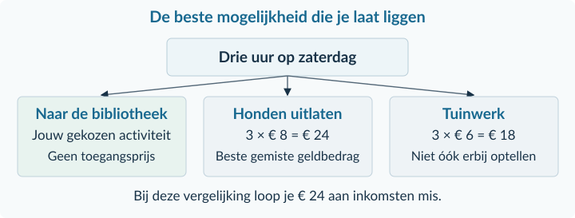<figcaption>Figuur 2 · Voor deze vergelijking zijn de inkomsten van de twee klussen de gegeven maatstaf.</figcaption></figure>
Je geeft dus <strong>€ 24 aan mogelijke inkomsten</strong> op. Je telt € 18 daar niet bij: ook zonder het bibliotheekbezoek kun je niet beide klussen doen. En je betaalt die € 24 niet aan de bibliotheek. Het is een gemiste mogelijkheid, geen rekening.

<strong>Vergelijk gelijke hoeveelheden</strong>

Een bedrag per uur wordt een totaalbedrag door te vermenigvuldigen met het aantal uren. Bijvoorbeeld: 3 uur × € 8 per uur = € 24. Vergelijk daarna de totale uitkomsten voor hetzelfde beschikbare tijdvak.

<strong>Het doel bepaalt hoe je vergelijkt.</strong> Wie zoveel mogelijk geld wil verdienen, vergelijkt inkomsten. Wie vooral wil ontspannen, weegt andere voordelen mee. We verzinnen geen geldwaarde voor leesplezier. Een hogere geldopbrengst maakt een keuze niet automatisch voor iedereen beter.

<strong>Let op</strong>

Alternatieve kosten zijn niet automatisch de betaalde prijs, het verschil tussen twee bedragen of de som van alle gemiste mogelijkheden. Zoek het beste haalbare alternatief.

<!-- PAGE {"section": "1.1.1", "title": "Een keuze stap voor stap"} -->

## Uitgewerkt voorbeeld

Een buurtcentrum heeft één zaal, vier uur lang. Het kiest een voorleesmiddag óf een reparatiemiddag. Elke activiteit gebruikt de zaal de volle vier uur. Het doel is zoveel mogelijk geld voor een buurtproject overhouden. De bedragen hieronder zijn wat <strong>na betaling van alle materialen overblijft</strong>. De zaal is gratis.

<table class=""><thead><tr><th>Activiteit</th><th>Bedrag per uur</th><th>Deelnemers</th></tr></thead><tbody><tr><td>Voorleesmiddag</td><td>€ 40</td><td>80</td></tr><tr><td>Reparatiemiddag</td><td>€ 55</td><td>50</td></tr></tbody></table>
<strong>1. Benoem de beperking.</strong> De zaal is vier uur beschikbaar. De twee activiteiten kunnen niet tegelijk plaatsvinden. Ze zijn elk apart haalbaar.

<strong>2. Vergelijk de totale uitkomsten.</strong> Voorlezen: 4 × € 40 = € 160. Repareren: 4 × € 55 = € 220. Bij het genoemde gelddoel kies je de reparatiemiddag.

<strong>3. Bepaal wat je opgeeft.</strong> Zonder reparatiemiddag is voorlezen het beste andere gebruik. De alternatieve kosten zijn daarom € 160. Het verschil van € 60 is de extra geldopbrengst, niet de alternatieve kosten.

<figure class="compact">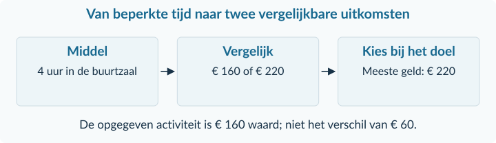<figcaption>Figuur 3 · Eerst de beperking, dan de vergelijking, daarna het opgegeven alternatief.</figcaption></figure>
<strong>4. Controleer de uitleg.</strong> De zaalhuur is € 0, maar er zijn wel alternatieve kosten. Het andere gebruik van die zaal zou € 160 opleveren.

<strong>5. Verander alleen het doel.</strong> Bij “zoveel mogelijk deelnemers bereiken” kies je de voorleesmiddag: 80 in plaats van 50 deelnemers. De keuze hangt dus ook van het doel af.

<strong>Samenvatting · 1.1.1</strong>

Benoem het beperkte middel. Vergelijk haalbare opties voor hetzelfde tijdvak of dezelfde ruimte. Kies op basis van het doel. De alternatieve kosten zijn de waarde van het beste opgegeven alternatief. In 1.1.2 leer je uitkomsten met verhoudingen en percentages vergelijken.

<!-- PAGE {"section": "1.1.1", "title": "Starten en lezen"} -->

## Startopgaven

<h3>Opgave 1 · Eenheden ophalen</h3>
Een bezorgklus duurt 3 uur. De vergoeding is € 8 per uur.

a.

Bereken de totale vergoeding. Zet de eenheid bij je antwoord.

b.

Een andere klus levert voor dezelfde drie uur € 30 op. Bereken het verschil in totale vergoeding.

<h3>Opgave 2 · Een gratis schoolplein</h3>
Een schoolplein kan tijdens de pauze worden gebruikt voor een sportactiviteit óf een optreden. Ze passen niet tegelijk op het plein. Het gebruik van het plein kost niets.

a.

Welk middel is beperkt? Leg uit waarom er toch schaarste is.

b.

De school kiest het optreden. Wat is dan het opgegeven alternatief?

<strong>Oefenroute</strong>

Normale route: Startopgaven → Begeleide inoefening → Zelfstandige oefening → Doeloefening. Uitdagende route: Startopgaven → Zelfstandige oefening → Doeloefening → Denkertje / Bonusopgave. Herhaling is aanvullend bij beide routes.

## Begeleide inoefening

Begeleide inoefening hoort bij leren: je oefent met denkstappen en doet steeds meer zelf.

<h3>Opgave 3 · Lees de ingevulde keuze</h3>
Een fotograaf gebruikt een middag voor portretfoto’s. Bekijk de ingevulde vergelijking.

<figure class="compact">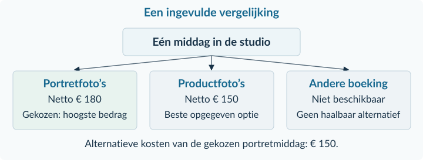<figcaption>Figuur 4 · Een ingevulde vergelijking: lees eerst welk alternatief werkelijk mogelijk is.</figcaption></figure>
a.

Welk bedrag zijn de alternatieve kosten? Noem ook de activiteit die daarbij hoort.

b.

Waarom is het verschil van € 30 niet het antwoord op vraag a?

<!-- PAGE {"section": "1.1.1", "title": "Van invullen naar zelf kiezen"} -->

<h3>Opgave 4 · De moestuin</h3>
Een vereniging gebruikt acht even grote tuinbedden voor kruiden óf bloemen. Voor elke optie zijn alle acht bedden nodig. Het doel is het hoogste bedrag overhouden voor de vereniging. De gegeven bedragen zijn al na aftrek van uitgaven.

<table class=""><thead><tr><th>Activiteit</th><th>Bedden</th><th>Bedrag per bed</th><th>Totaal</th></tr></thead><tbody><tr><td>Kruiden</td><td>8</td><td>€ 5</td><td>…</td></tr><tr><td>Bloemen</td><td>8</td><td>€ 7</td><td>…</td></tr></tbody></table>
a.

Neem de tabel over en vul de twee totaalbedragen in. Vermenigvuldig per rij het aantal bedden met het bedrag per bed.

b.

Kies de activiteit die bij het doel past. Noem daarna de alternatieve kosten van die keuze.

## Zelfstandige oefening

<h3>Opgave 5 · Een weekendklus</h3>
Noor heeft zaterdag vier uur. Zij kan één klus doen: oppassen voor € 9 per uur of helpen bij een verhuizing voor € 11 per uur. Beide klussen duren precies vier uur; er zijn geen bijkomende uitgaven. Zij wil zoveel mogelijk verdienen.

a.

Welke klus kiest zij bij dit doel? Onderbouw met beide totaalbedragen.

b.

Bereken de alternatieve kosten van de gekozen klus. Leg uit waarom dat bedrag geen betaling is.

<h3>Opgave 6 · Een middag voor de buurt</h3>
Een vrijwilligersgroep kan één activiteit begeleiden. Bij een sportmiddag doen 40 buurtbewoners mee; bij een creatieve middag 30. Elke activiteit vraagt de hele middag. Het doel is zoveel mogelijk buurtbewoners laten deelnemen.

a.

Welke activiteit past bij het doel? Benoem de beperkte inzet van de vrijwilligers.

b.

Iemand zegt: “Zonder prijzen kun je niets over alternatieve kosten zeggen.” Beoordeel deze uitspraak.

<!-- PAGE {"section": "1.1.1", "title": "Doeloefening"} -->

## Doeloefening

<h3>Opgave 7 · Eén aula, twee plannen</h3>
Een school organiseert een activiteit voor een goed doel. De aula is vrijdag drie uur beschikbaar. De school kiest een muziekmiddag óf een ruilmarkt. Elk plan gebruikt de aula de volledige drie uur. De school kan beide plannen uitvoeren, maar niet tegelijk.

Het doel is <strong>zoveel mogelijk geld voor het goede doel overhouden</strong>. In de bedragen zijn alle uitgaven voor de activiteit al verrekend. De aula is gratis.

<table class=""><thead><tr><th>Plan</th><th>Bedrag over per uur</th><th>Verwacht aantal deelnemers</th></tr></thead><tbody><tr><td>Muziekmiddag</td><td>€ 70</td><td>90</td></tr><tr><td>Ruilmarkt</td><td>€ 90</td><td>60</td></tr></tbody></table>
a.

Welk middel is schaars? Leg uit waarom de school moet kiezen.

b.

Bereken voor beide plannen hoeveel geld overblijft. Welk plan past bij het genoemde doel?

c.

Wat zijn de alternatieve kosten van de keuze uit b? Benoem de gemiste activiteit en het bedrag.

d.

Een leerling zegt: “De aula is gratis, dus deze keuze heeft geen alternatieve kosten.” Leg uit waarom dit niet klopt.

e.

Het doel verandert in “zoveel mogelijk leerlingen laten deelnemen”. Welk plan kies je dan? Gebruik een gegeven uit de tabel.

<strong>Controleer je antwoord</strong>

Heb je het opgegeven alternatief genoemd? Staat bij je bedrag waarop het betrekking heeft? Je antwoord moet bij het doel van de vraag passen.

<!-- PAGE {"section": "1.1.1", "title": "Verder denken en terughalen"} -->

## Denkertje / Bonusopgave

<h3>Opgave 8 · Twee verdedigbare keuzes</h3>
Een vereniging heeft één zaal voor een avond. Een voorstelling levert € 300 op voor de kas en bereikt 50 bezoekers. Een gratis kennismakingsavond kost de vereniging niets, brengt niets in kas en bereikt 90 bezoekers. Beide avonden zijn haalbaar, maar er kan er maar één doorgaan.

a.

Schrijf twee korte adviezen die tot verschillende keuzes leiden. Geef bij elk advies een duidelijk doel, een passend gegeven en het beste opgegeven alternatief. Leg ook uit waarom de cijfers niet één universeel juiste keuze bepalen.

## Herhaling en combineren

<h3>Opgave 9 · Kort terughalen</h3>
Een buurtgroep heeft vijf vrijwilligers. Zij kunnen elk twee uur helpen bij één van twee gelijktijdige activiteiten. De groep blijft bij elkaar; elk plan vraagt alle vrijwilligers gedurende die twee uur. Gezamenlijk helpen bij de eerste activiteit levert € 80 op; bij de tweede € 65. Er zijn geen andere haalbare activiteiten.

a.

Hoeveel vrijwilligersuren zijn samen beschikbaar?

b.

De groep kiest de eerste activiteit vanwege het geldbedrag. Noem de alternatieve kosten en leg uit waarom je niet € 15 antwoordt.

<strong>Van keuze naar vergelijking</strong>

In de volgende paragraaf ga je uitkomsten nauwkeuriger vergelijken. Je leert het verschil tussen een totaal, een bedrag per eenheid en een procentuele verandering.

<!-- PAGE {"section": "1.1.2", "title": "Vergeleken met wat?"} -->

1.1.2 · BOEK 1 · TWEEDE EDITIE
<h1 class="paragraph-title" id="h1-p112">Verhoudingen, percentages en indexcijfers</h1>
<strong>Een activiteit kost € 180. Is dat duur?</strong> Voor twaalf deelnemers is dat € 15 per persoon. Voor dertig deelnemers is het € 6. Het totaal vertelt dus niet het hele verhaal. Je hebt ook nodig waarmee je het bedrag vergelijkt.

<strong>Na deze paragraaf kun je</strong>
<ul><li>bedragen per eenheid en aandelen berekenen;</li><li>absolute en procentuele veranderingen onderscheiden;</li><li>een nieuwe waarde en een indexcijfer berekenen;</li><li>procenten, procentpunten en indexpunten uit elkaar houden.</li></ul>

<strong>Per eenheid en deel van een geheel</strong>

Bedrag per persoon = totaalbedrag / aantal personen

Aandeel in procenten = deel / geheel × 100%

<figure>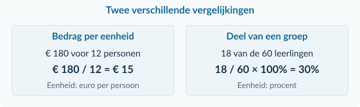<figcaption>Figuur 5 · De noemer zegt of je een bedrag per persoon of een aandeel berekent.</figcaption></figure>
Bij € 180 / 12 personen hoort de eenheid <strong>euro per persoon</strong>. Bij 18 deelnemers uit 60 leerlingen deel je aantallen personen: 18 / 60 = 0,30. Vermenigvuldigen met 100% maakt daarvan <strong>30%</strong>.

<strong>Een verhouding gebruiken</strong>

Bij een aandeel van 30% uit 60 leerlingen horen 0,30 × 60 = 18 leerlingen. Zet het percentage dus eerst om naar een decimaal getal. Delen door nul kan niet: de noemer moet een bruikbare, niet-nul basis zijn.

<!-- PAGE {"section": "1.1.2", "title": "Van verschil naar procentuele verandering"} -->

Een prijs stijgt van € 80 naar € 100. De stijging is € 20. Om te weten hoe groot die stijging <strong>relatief</strong> is, vergelijk je € 20 met de oude € 80.

<strong>Formules · Verandering</strong>

Absolute verandering = nieuw − oud

Procentuele verandering = (nieuw − oud) / oud × 100%

Een absolute verandering staat in de oorspronkelijke eenheid, bijvoorbeeld euro of personen. “Absoluut” betekent hier niet dat het getal altijd positief is: een daling heeft een minteken.

<figure>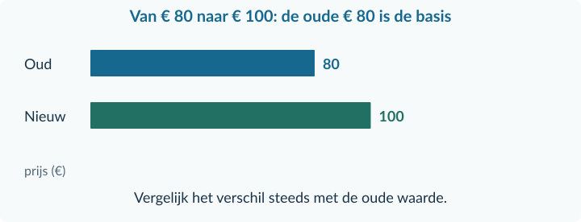<figcaption>Figuur 6 · De toename van € 20 is een kwart van de oude € 80.</figcaption></figure>
<strong>Stap 1 — verschil:</strong> € 100 − € 80 = € 20.

<strong>Stap 2 — vergelijk met oud:</strong> 20 / 80 = 0,25.

<strong>Stap 3 — in procenten:</strong> 0,25 × 100% = <strong>25%</strong>.

<strong>Een daling krijgt een minteken</strong>

Van € 100 terug naar € 80: (80 − 100) / 100 × 100% = −20%. De prijs daalt met 20%. De heen- en terugweg hebben niet hetzelfde percentage: de oude waarde is anders.

Zet op je rekenmachine haakjes om <strong>nieuw − oud</strong>. Bij 25% stijging kun je ook “+25%” schrijven. Bij een daling laat je het minteken staan of schrijf je duidelijk “daalt met …%”.

<!-- PAGE {"section": "1.1.2", "title": "Procenten en procentpunten"} -->

Het aandeel leerlingen dat meedoet stijgt van 20% naar 25%. Het verschil is <strong>5 procentpunten</strong>. Maar de relatieve stijging van het aandeel is 5 / 20 × 100% = <strong>25%</strong>.

<strong>Definitie · Procentpunt</strong>

Een procentpunt is het verschil tussen twee percentages. Van 20% naar 25% is een stijging van 5 procentpunten.

<figure>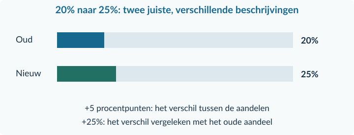<figcaption>Figuur 7 · De balken gebruiken dezelfde schaal van 0% tot 100%.</figcaption></figure>
Bij honderd leerlingen stijgt het aantal deelnemers dan van 20 naar 25. Dat zijn vijf extra deelnemers op de oorspronkelijke twintig: ook dat is 25%. Verandert het totale aantal leerlingen óók, dan bereken je eerst de twee aantallen opnieuw.

<strong>Formules · Een nieuwe waarde</strong>

Na een stijging met p%: nieuw = oud × (1 + p / 100)

Na een daling met p%: nieuw = oud × (1 − p / 100)

Een bedrag van € 50 stijgt met 12%. De nieuwe waarde is 50 × 1,12 = <strong>€ 56</strong>. Een korting van 20% op € 50 geeft 50 × 0,80 = <strong>€ 40</strong>.

<strong>Twee controles</strong>

Een stijging betekent een factor groter dan 1; een daling een factor kleiner dan 1. Een verschil in procentpunten is géén vermenigvuldigingsfactor.

<!-- PAGE {"section": "1.1.2", "title": "Indexcijfers: één basis op 100"} -->

Een kaart kost in het basisjaar € 50. Een jaar later kost dezelfde kaart € 60, daarna € 66. Een <strong>indexcijfer</strong> laat die bedragen zien ten opzichte van één vaste basis.

<strong>Definitie · Indexcijfer</strong>

Een getal dat een waarde vergelijkt met een gekozen basiswaarde. De basiswaarde krijgt index 100.

<strong>Formule · Indexcijfer</strong>

Indexcijfer = waarde / basiswaarde × 100

<figure>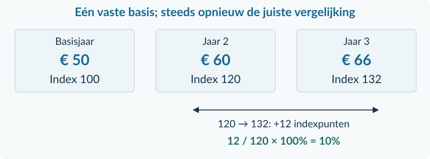<figcaption>Figuur 8 · Alle indexcijfers gebruiken € 50 als basis. Voor de verandering tussen jaar 2 en 3 is index 120 de oude waarde.</figcaption></figure>
Voor jaar 2: 60 / 50 × 100 = <strong>120</strong>. Voor jaar 3: 66 / 50 × 100 = <strong>132</strong>. Index 132 betekent 32% boven het basisjaar, maar niet 32% boven elk ander jaar.

Tussen jaar 2 en 3 stijgt de index met <strong>12 indexpunten</strong>. De procentuele verandering is (132 − 120) / 120 × 100% = <strong>10%</strong>. Dat is precies dezelfde verandering als (66 − 60) / 60 × 100%.

Uit een index terug naar een bedrag: <strong>basiswaarde × index / 100</strong>. Bij € 50 als basis en index 132 krijg je 50 × 132 / 100 = € 66.

<strong>Let op de basis</strong>

Bij een index staat geen euroteken. Index 100 betekent niet “honderd euro”. Vergelijk twee indexcijfers alleen rechtstreeks als ze over dezelfde grootheid en dezelfde basis gaan.

<!-- PAGE {"section": "1.1.2", "title": "Uitgewerkt voorbeeld · bedragen en veranderingen"} -->

## Uitgewerkt voorbeeld

Een klimclub vergelijkt het tarief voor één klimavond en deelname aan een kennismakingsactiviteit. De club gebruikt voor het tarief <strong>jaar 1 als basisjaar</strong>. De tabel is een rekenvoorbeeld, geen actuele prijslijst.

<table class=""><thead><tr><th>Gegeven</th><th>Jaar 1</th><th>Jaar 2</th><th>Jaar 3</th></tr></thead><tbody><tr><td>Tarief per klimavond</td><td>€ 5,00</td><td>€ 6,00</td><td>€ 6,60</td></tr><tr><td>Leerlingen die konden deelnemen</td><td>100</td><td>120</td><td>120</td></tr><tr><td>Deelnemers kennismaking</td><td>20</td><td>30</td><td>36</td></tr></tbody></table>
In jaar 2 betaalt de club daarnaast € 180 aan materiaal voor de 30 deelnemers. Een aangekondigde tariefstijging na jaar 3 is 10%.

<strong>a. Materiaalbedrag per deelnemer</strong>

Bedrag per deelnemer = totaal / aantal = € 180 / 30 = <strong>€ 6 per deelnemer</strong>. Dit is niet het totale materiaalbedrag.

<strong>b. Verandering van het tarief tussen jaar 1 en 2</strong>

Absolute verandering = € 6 − € 5 = <strong>€ 1</strong>.

Procentuele verandering = (6 − 5) / 5 × 100% = <strong>20%</strong>. De oude € 5 staat onder de deelstreep.

<strong>c. Nieuwe waarde na de aangekondigde stijging</strong>

Nieuw tarief = € 6,60 × (1 + 10 / 100) = € 6,60 × 1,10 = <strong>€ 7,26</strong>.

<strong>Controle</strong>

Het bedrag per deelnemer heeft de eenheid euro per deelnemer. De procentuele verandering krijgt %. Het nieuwe tarief blijft een bedrag in euro per klimavond.

<!-- PAGE {"section": "1.1.2", "title": "Uitgewerkt voorbeeld · de juiste basis"} -->

<strong>d. Indexcijfers met jaar 1 = 100</strong>

Jaar 1: 5 / 5 × 100 = <strong>100</strong>. 
Jaar 2: 6 / 5 × 100 = <strong>120</strong>. 
Jaar 3: 6,60 / 5 × 100 = <strong>132</strong>.

<strong>e. Van index 120 naar index 132</strong>

Verschil = 132 − 120 = <strong>12 indexpunten</strong>. 
Procentuele verandering = 12 / 120 × 100% = <strong>10%</strong>. De basis van deze vergelijking is jaar 2, niet index 100.

<strong>f. Deelname in jaar 1 en jaar 2</strong>

Jaar 1: 20 / 100 × 100% = <strong>20%</strong>. 
Jaar 2: 30 / 120 × 100% = <strong>25%</strong>. 
Het aandeel neemt toe met 25 − 20 = <strong>5 procentpunten</strong>.

<strong>g. Beoordeel “Het aandeel deelnemers groeit met 5%.”</strong>

Die uitspraak verwart procentpunten met procenten. De relatieve stijging van het aandeel is (25 − 20) / 20 × 100% = <strong>25%</strong>. Het aantal deelnemers is iets anders: dat groeit van 20 naar 30, dus met 50%.

<table class=""><thead><tr><th>Je vergelijkt…</th><th>Juiste uitkomst</th><th>Waarom?</th></tr></thead><tbody><tr><td>Aandeel 20% → 25%</td><td>+5 procentpunten</td><td>Verschil tussen percentages</td></tr><tr><td>Aandeel 20% → 25%</td><td>+25%</td><td>Verschil / oud aandeel</td></tr><tr><td>Aantal 20 → 30</td><td>+50%</td><td>Verschil / oud aantal</td></tr></tbody></table>

<strong>Samenvatting · 1.1.2</strong>

Lees de eenheden en de basis. Deel een totaal door het aantal voor een bedrag per eenheid. Gebruik (nieuw − oud) / oud × 100% voor een procentuele verandering. Een index gebruikt een vaste basis op 100. Procentpunten en indexpunten zijn verschillen, niet automatisch relatieve veranderingen. In 1.1.3 gebruik je deze controles bij grafieken.

<strong>Afronden in dit hoofdstuk:</strong> geef geldbedragen waar nodig in centen. Rond percentages en indexcijfers zo nodig op twee decimalen af. Reken tussendoor met de ongeronde waarden.

<!-- PAGE {"section": "1.1.2", "title": "Starten en de basis herkennen"} -->

## Startopgaven

<h3>Opgave 10 · Eerst delen en aftrekken</h3>
Bij een activiteit zijn 24 leerlingen. Een doos met 24 gelijke werkboekjes kost € 72. Vorig jaar deden 20 leerlingen mee.

a.

Bereken het bedrag per werkboekje.

b.

Bereken hoeveel leerlingen er meer meedoen dan vorig jaar.

<h3>Opgave 11 · Welke basis gebruik je?</h3>
Een prijs stijgt van € 40 naar € 50. Een apart deelnamepercentage stijgt van 30% naar 36%.

a.

Deel je de prijsstijging door 40 of door 50 voor de procentuele verandering? Leg kort uit.

b.

Is 36 − 30 een verschil in procenten of procentpunten?

c.

Welke vermenigvuldigingsfactor hoort bij een aangekondigde prijsstijging van 8%?

<strong>Oefenroute</strong>

Normale route: Startopgaven → Begeleide inoefening → Zelfstandige oefening → Doeloefening. Uitdagende route: Startopgaven → Zelfstandige oefening → Doeloefening → Denkertje / Bonusopgave. Herhaling is aanvullend bij beide routes.

## Begeleide inoefening

Begeleide inoefening hoort bij leren: je oefent met denkstappen en doet steeds meer zelf.

<h3>Opgave 12 · Lees de ingevulde prijsstijging</h3>
Een sportshirt wordt duurder: van € 48 naar € 60. De figuur laat de verandering zien.

<figure class="compact">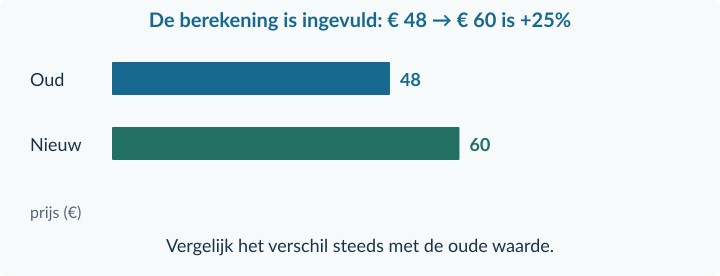<figcaption>Figuur 9 · Begin bij de oude waarde, niet bij de langste balk.</figcaption></figure>
a.

De uitkomst +25% staat al in de figuur. Laat met de formule zien hoe die uitkomst ontstaat.

b.

De nieuwe prijs van € 60 krijgt later 10% korting. Bereken de prijs na korting.

<!-- PAGE {"section": "1.1.2", "title": "Invullen en twee veranderingen scheiden"} -->

<h3>Opgave 13 · De vaste basis blijft staan</h3>
De huur van een instrument is in jaar 1 € 20 per maand, in jaar 2 € 24 en in jaar 3 € 30. Gebruik jaar 1 als indexbasis.

<table class=""><thead><tr><th>Jaar</th><th>Prijs per maand</th><th>Index: jaar 1 = 100</th></tr></thead><tbody><tr><td>1</td><td>€ 20</td><td>100</td></tr><tr><td>2</td><td>€ 24</td><td>…</td></tr><tr><td>3</td><td>€ 30</td><td>…</td></tr></tbody></table>
a.

Neem de tabel over en vul de twee ontbrekende indexcijfers in. Gebruik steeds € 20 als basiswaarde.

b.

Bereken de verandering tussen jaar 2 en 3 in indexpunten. Bereken daarna de procentuele verandering met index jaar 2 als oude waarde.

<h3>Opgave 14 · Twee veranderingen tegelijk</h3>
Een jeugdvereniging had 100 leden. Daarvan deed 20% mee aan een vrijwilligersdag. Nu heeft de vereniging 150 leden en doet 24% mee.

a.

Bekijk alleen de verandering van het aandeel. Hoeveel deelnemers zouden er zijn bij 100 leden en 24% deelname?

b.

Bekijk alleen de verandering van het ledental. Hoeveel deelnemers zouden er zijn bij 150 leden en nog steeds 20% deelname?

c.

Bereken het oude en het werkelijke nieuwe aantal deelnemers. Versterken de twee veranderingen elkaar?

d.

Een leerling zegt: “Het aandeel stijgt met 4 procentpunten, dus het aantal deelnemers stijgt met 4%.” Weerleg dit met het juiste groeipercentage van het aantal.

<!-- PAGE {"section": "1.1.2", "title": "Zelf de vergelijking kiezen"} -->

## Zelfstandige oefening

<h3>Opgave 15 · Een tekenpakket</h3>
Een klas koopt 18 gelijke tekenpakketten voor samen € 144. Een jaar eerder kostte hetzelfde pakket € 10 per stuk.

a.

Bereken de huidige prijs per pakket.

b.

Bereken de absolute en procentuele prijsverandering.

c.

De huidige prijs stijgt volgend jaar met 12,5%. Bereken de aangekondigde nieuwe prijs.

<h3>Opgave 16 · Een indexbericht</h3>
Een vervoerder publiceert onderstaande indexcijfers voor dezelfde ritprijs. De basis is in alle jaren gelijk.

<table class=""><thead><tr><th>Jaar</th><th>1</th><th>2</th><th>3</th></tr></thead><tbody><tr><td>Ritprijsindex</td><td>100</td><td>110</td><td>121</td></tr></tbody></table>
a.

Bereken de verandering van jaar 2 naar jaar 3 in indexpunten én in procenten.

b.

De ritprijs in jaar 1 was € 4. Bereken de ritprijs in jaar 3.

c.

Is “jaar 3 is 21% duurder dan jaar 2” juist? Licht toe.

<h3>Opgave 17 · Lid van een debatclub</h3>
Vorig jaar waren 30 van de 150 leerlingen lid. Dit jaar zijn 45 van de 180 leerlingen lid.

a.

Bereken in beide jaren het aandeel leden.

b.

Bereken de verandering van het aandeel in procentpunten én in procenten.

<!-- PAGE {"section": "1.1.2", "title": "Doeloefening"} -->

## Doeloefening

<h3>Opgave 18 · Een workshop voor scholieren</h3>
Een cultureel centrum vergelijkt zijn workshopprijs en het aandeel leerlingen dat deelneemt. Gebruik voor de <strong>prijsindex jaar 1 als basis</strong>. Alle bedragen en aantallen zijn voor deze opgave gegeven.

In jaar 3 betaalt het centrum € 216 aan materiaal voor de 36 deelnemers. Na jaar 3 wil het de workshopprijs met 8% verhogen.

<table class=""><thead><tr><th>Gegeven</th><th>Jaar 1</th><th>Jaar 2</th><th>Jaar 3</th></tr></thead><tbody><tr><td>Prijs per workshop</td><td>€ 10</td><td>€ 12</td><td>€ 15</td></tr><tr><td>Leerlingen die konden deelnemen</td><td>120</td><td>150</td><td>150</td></tr><tr><td>Werkelijke deelnemers</td><td>24</td><td>30</td><td>36</td></tr></tbody></table>
a.

Bereken het materiaalbedrag per deelnemer in jaar 3.

b.

Bereken de absolute en procentuele prijsverandering van jaar 1 naar jaar 2.

c.

Bereken de aangekondigde workshopprijs na jaar 3.

d.

Bereken de prijsindexcijfers van jaar 2 en jaar 3.

e.

Bereken met die indexcijfers de prijsverandering van jaar 2 naar jaar 3 in indexpunten én in procenten.

f.

Bereken het deelnamepercentage in jaar 1 en jaar 3. Hoeveel procentpunten is de verandering?

g.

Een bericht luidt: “Het aandeel deelnemers is met 4% gestegen.” Beoordeel dit bericht met een berekening.

<!-- PAGE {"section": "1.1.2", "title": "Verder denken en terughalen"} -->

## Denkertje / Bonusopgave

<h3>Opgave 19 · Welke groei bedoel je?</h3>
Een museum meldt: “Ons bezoekersaantal groeide van index 120 naar 144.” Een ander museum meldt: “Wij kregen 1.000 bezoekers meer.”

a.

Kun je met alleen deze informatie bepalen welk museum relatief het sterkst groeide? Geef een onderbouwd antwoord en beschrijf twee mogelijke situaties voor het tweede museum die tot een andere vergelijking leiden.

## Herhaling en combineren

<h3>Opgave 20 · Het beste andere gebruik</h3>
Een buurthuis kan een ruimte dezelfde avond verhuren voor € 90 of gebruiken voor een activiteit die € 70 oplevert. Beide bedragen zijn al na uitgaven. Het doel is de grootste geldopbrengst.

a.

Welke keuze past bij het doel, en wat zijn de alternatieve kosten van die keuze?

<h3>Opgave 21 · Een daling controleren</h3>
Een deelnemersaantal daalt van 80 naar 60.

a.

Bereken de procentuele verandering. Controleer je antwoord door het bijbehorende percentage van 80 te nemen.

<!-- PAGE {"section": "1.1.3", "title": "Van tabel naar grafiek"} -->

1.1.3 · BOEK 1 · TWEEDE EDITIE
<h1 class="paragraph-title" id="h1-p113">Tabellen, grafieken en formules</h1>
<strong>Hoeveel reserveringen verwacht je bij een andere prijs?</strong> De onderstaande tabel is een eenvoudig model voor één middag. De overige omstandigheden blijven gelijk. Tussen de drie punten nemen we een rechte lijn aan; buiten die punten doen we geen voorspelling.

<strong>Na deze paragraaf kun je</strong>
<ul><li>een tabel lezen en zelf een grafiek met een schaal tekenen;</li><li>tussen twee punten aflezen en interpoleren;</li><li>een eenvoudige formule invullen en ermee terugrekenen;</li><li>basis, hoogte en oppervlakte bepalen;</li><li>een uitspraak met gegevens controleren.</li></ul>
<table class=""><thead><tr><th>Prijs P (€ per reservering)</th><th>2</th><th>4</th><th>6</th></tr></thead><tbody><tr><td>Verwacht aantal Q (per middag)</td><td>80</td><td>60</td><td>40</td></tr></tbody></table>
<strong>Stap 1: assen kiezen.</strong> In deze prijs–hoeveelheidsgrafiek staat hoeveelheid Q horizontaal en prijs P verticaal. Schrijf bij iedere as wat je meet en in welke eenheid.

<figure>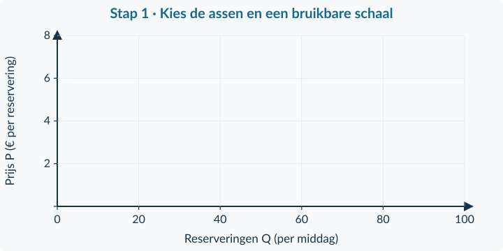<figcaption>Figuur 10 · Eerst het tekenframe: gelijke afstanden op een as stellen gelijke verschillen voor.</figcaption></figure>

<!-- PAGE {"section": "1.1.3", "title": "Punten plaatsen en de schaal controleren"} -->

<strong>Stap 2: lees één prijs en het bijbehorende aantal.</strong> Bij P = € 2 horen 80 reserveringen. Je gaat daarom eerst horizontaal naar Q = 80 en dan omhoog naar P = 2. Het punt schrijf je als <strong>(80; 2)</strong>: horizontale waarde eerst.

<figure>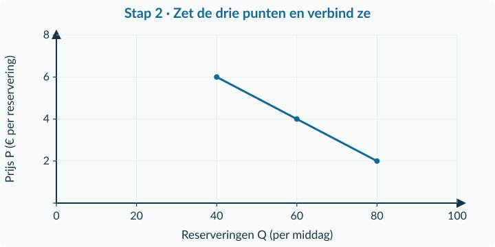<figcaption>Figuur 11 · Dezelfde assen als in figuur 10. Nu staan ook (60; 4) en (40; 6) in de grafiek.</figcaption></figure>
<strong>Stap 3: verbind de punten volgens de afspraak.</strong> In dit model liggen de punten op een rechte lijn. Je trekt het lijnstuk alleen tussen de opgegeven punten. Een nette lijn buiten dat gebied zou nog geen betrouwbare voorspelling zijn.

<strong>Een schaal kiezen</strong>

Hier past 0 tot 100 op de horizontale as en 0 tot 8 op de verticale. Een horizontaal stapje stelt 20 reserveringen voor; een verticaal stapje € 2. De twee assen hoeven niet dezelfde stapgrootte te hebben.

Een tabel en een grafiek beschrijven dezelfde gegevens. Controleer daarom na het tekenen minimaal twee punten aan de hand van de tabel. Draai de twee coördinaten niet om.

<strong>Niet elke grafiek is een P–Q-grafiek</strong>

In een tijdreeks staat meestal de tijd horizontaal en de gemeten grootheid verticaal. Kies de assen die bij de bron horen. “Bij economie staat altijd prijs verticaal” is dus geen algemene regel.

<!-- PAGE {"section": "1.1.3", "title": "Interpoleren: een waarde tussen twee punten"} -->

P = € 4,50 staat niet in de tabel. Het ligt tussen € 4 en € 6. Bij die prijzen horen 60 en 40 reserveringen. Je gebruikt het rechte lijnstuk om de tussenliggende waarde te bepalen.

<strong>Definitie · Interpoleren</strong>

Een waarde tussen twee bekende punten bepalen. Bij lineair interpoleren neem je aan dat de verandering tussen die punten gelijkmatig verloopt.

<figure>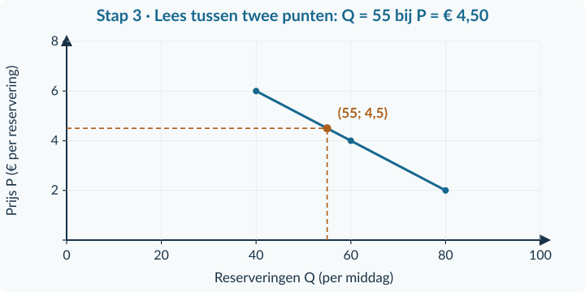<figcaption>Figuur 12 · Lees horizontaal vanaf P = € 4,50 naar de lijn en daarna omlaag: Q = 55.</figcaption></figure>
<strong>Rekenen met dezelfde stap.</strong> Het hele prijsverschil is € 6 − € 4 = € 2. Je gaat € 0,50 verder dan € 4: dat is 0,50 / 2 = <strong>een kwart</strong> van het stuk. Het aantal daalt over het hele stuk met 20. Een kwart daarvan is 5. Dus Q = 60 − 5 = <strong>55 reserveringen</strong>.

Bij € 5 ben je precies halverwege. Dan hoort het midden tussen 60 en 40 erbij: <strong>50 reserveringen</strong>. Niet iedere tussenprijs ligt echter halverwege.

<strong>Aflezen is niet hetzelfde als weten</strong>

In een opgegeven rechtlijnig model volgt de tussenwaarde uit de aanname. Bij echte waarnemingen is lineaire interpolatie een schatting. Twee gemeten eindpunten bewijzen niet wat er precies tussendoor gebeurde.

<!-- PAGE {"section": "1.1.3", "title": "Een formule invullen en terugrekenen"} -->

Voor het huren van stoelen geldt de afgesproken rekenregel <strong>T = 6 + 3n</strong>. T is het totale bedrag in euro. n is het aantal stoelen. De regel geldt voor hele aantallen van 0 tot en met 20 stoelen.

<strong>Zo lees je de formule</strong>

<strong>T = 6 + 3n</strong> betekent: € 6 plus € 3 voor elke stoel. De schrijfwijze 3n betekent 3 × n. Het getal 6 heeft de eenheid euro; het getal 3 staat voor euro per stoel.

<strong>Invullen:</strong> bij n = 4 krijg je T = 6 + 3 × 4 = 6 + 12 = <strong>€ 18</strong>. Eerst vermenigvuldigen, daarna optellen.

<figure>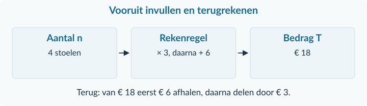<figcaption>Figuur 13 · Terugrekenen maakt de bewerkingen in omgekeerde volgorde ongedaan.</figcaption></figure>
<strong>Terugrekenen:</strong> het bedrag is € 30. Hoeveel stoelen zijn gehuurd?

30 = 6 + 3n 
30 − 6 = 3n — trek aan beide kanten 6 af. 
24 = 3n 
n = 24 / 3 = <strong>8 stoelen</strong> — deel beide kanten door 3.

<strong>Controle:</strong> 6 + 3 × 8 = € 30. Ook valt 8 binnen de afgesproken aantallen. Je antwoord past dus bij de formule én bij de situatie.

<strong>Niet zomaar “naar de andere kant”</strong>

Je houdt een vergelijking kloppend door aan beide kanten hetzelfde te doen. Maak zichtbaar wat je aftrekt of waardoor je deelt. Alleen een getal met een ander teken opschrijven legt de bewerking niet uit.

<!-- PAGE {"section": "1.1.3", "title": "Oppervlakte: basis keer hoogte"} -->

Bij grafieken gebruik je later ook oppervlaktes. Begin met een plattegrond. De horizontale én verticale as geven hier een positie in meters aan. De gekleurde vormen beginnen niet bij de oorsprong.

<figure>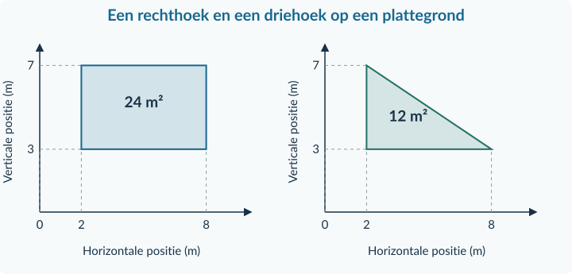<figcaption>Figuur 14 · De rechthoek en driehoek hebben dezelfde basis van 6 meter en dezelfde hoogte van 4 meter.</figcaption></figure>

<strong>Formules · Oppervlakte</strong>

Rechthoek = basis × hoogte

Driehoek = ½ × basis × hoogte

<strong>Basis:</strong> van 2 tot 8 meter, dus 8 − 2 = <strong>6 meter</strong>.

<strong>Hoogte:</strong> van 3 tot 7 meter, dus 7 − 3 = <strong>4 meter</strong>.

Rechthoek: 6 × 4 = <strong>24 m²</strong>.

Driehoek: ½ × 6 × 4 = <strong>12 m²</strong>. De driehoek beslaat de helft van de bijbehorende rechthoek.

<strong>Hoogte is een afstand, geen aflezing</strong>

De bovenkant ligt op positie 7 meter, maar de vorm is niet 7 meter hoog. De onderkant ligt op 3 meter. De hoogte is het verschil: 4 meter. De hoogte staat loodrecht op de basis; een schuine zijde is niet automatisch de hoogte.

De eenheid van de oppervlakte volgt uit de assen. Hier: meter × meter = vierkante meter. In een andere soort grafiek kunnen andere eenheden bij de oppervlakte horen. De economische betekenis daarvan wordt later uitgelegd.

<!-- PAGE {"section": "1.1.3", "title": "Wat zegt een verschil in een tabel?"} -->

Een inzamelactie telt hoeveel boeken in totaal zijn ingeleverd. Deze geconstrueerde waarnemingen horen bij dag 1, dag 3 en dag 6. De tijd staat nu op de horizontale as.

<table class=""><thead><tr><th>Dag t</th><th>1</th><th>3</th><th>6</th></tr></thead><tbody><tr><td>Totaal aantal ingeleverde boeken</td><td>20</td><td>36</td><td>60</td></tr></tbody></table><figure>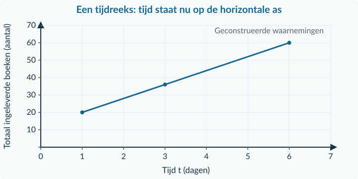<figcaption>Figuur 15 · De meetmomenten liggen niet steeds even ver uit elkaar. Een lijn tussen de meetpunten helpt om het verloop te bekijken.</figcaption></figure>
Van dag 3 tot dag 6 komen er 60 − 36 = <strong>24 boeken</strong> bij. Dat is een verandering over 6 − 3 = <strong>3 dagen</strong>. Gemiddeld over dat interval is dat 24 / 3 = <strong>8 boeken per dag</strong>; niet 24 per dag.

<strong>Verschil per horizontale eenheid</strong>

Bereken eerst het verschil in de gemeten grootheid. Deel dat door het bijbehorende verschil in tijd of hoeveelheid. Neem niet aan dat één tabelstap altijd één dag of één product is.

Een stijgende tijdreeks bewijst niet <strong>waardoor</strong> de stijging ontstaat. Misschien was er een herinneringsbericht, maar dat staat niet in deze bron. Je kunt dus wel het verloop beschrijven, niet zomaar de oorzaak aanwijzen.

<strong>Een bronclaim controleren</strong>

Noem de bewering. Kies de relevante waarden en de juiste vergelijking. Laat je berekening of aflezing zien. Schrijf daarna wat de bron wél ondersteunt en wat je niet kunt vaststellen.

<!-- PAGE {"section": "1.1.3", "title": "Uitgewerkt voorbeeld · tekenen en controleren"} -->

## Uitgewerkt voorbeeld

<strong>Bron A — Rolschaatsen.</strong> Een verhuurder verwacht bij verschillende prijzen de volgende aantallen reserveringen per middag. De andere omstandigheden blijven gelijk. Tussen de opgegeven punten gebruikt hij rechte lijnstukken.

<table class=""><thead><tr><th>Prijs P (€ per reservering)</th><th>2</th><th>4</th><th>6</th></tr></thead><tbody><tr><td>Reserveringen Q (per middag)</td><td>60</td><td>40</td><td>20</td></tr></tbody></table>
<strong>a. Teken de gegevens.</strong> Zet Q horizontaal en P verticaal. Kies schalen van 0 tot 80 en 0 tot 8. Plaats (60; 2), (40; 4) en (20; 6). Verbind de punten.

<figure>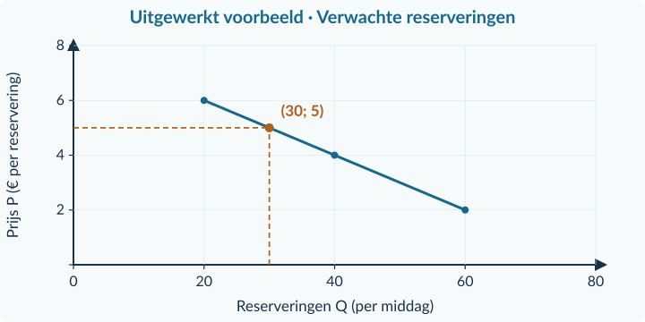<figcaption>Figuur 16 · De grafiek hoort alleen bij bron A. De stippellijnen laten de tussenwaarde bij € 5 zien.</figcaption></figure>
<strong>b. Interpoleer bij P = € 5.</strong> € 5 ligt halverwege € 4 en € 6. Het aantal is daarom 40 − ½ × (40 − 20) = <strong>30 reserveringen per middag</strong>.

<strong>c. Beoordeel “Van € 2 naar € 4 daalt het aantal met 50%.”</strong>

(40 − 60) / 60 × 100% = <strong>−33,33%</strong>. De uitspraak is onjuist. De daling van 20 wordt vergeleken met het oude aantal 60. De grafiek toont een modeluitkomst, geen gegarandeerd bezoekersaantal.

<!-- PAGE {"section": "1.1.3", "title": "Uitgewerkt voorbeeld · formule en oppervlakte"} -->

<strong>Bron B — Materiaalhuur.</strong> Hiervoor geldt T = 4 + 2n. T is het bedrag in euro; n het aantal gehuurde matten, van 0 tot en met 20.

<strong>d. Vul n = 5 in:</strong> T = 4 + 2 × 5 = <strong>€ 14</strong>.

<strong>e. Reken terug bij T = € 20:</strong>

20 = 4 + 2n → 20 − 4 = 2n → 16 = 2n → n = <strong>8 matten</strong>. 
Controle: 4 + 2 × 8 = € 20.

<strong>Bron C — Een plattegrond.</strong> De assen geven posities in meters aan. Bereken de twee gekleurde oppervlaktes.

<figure class="compact">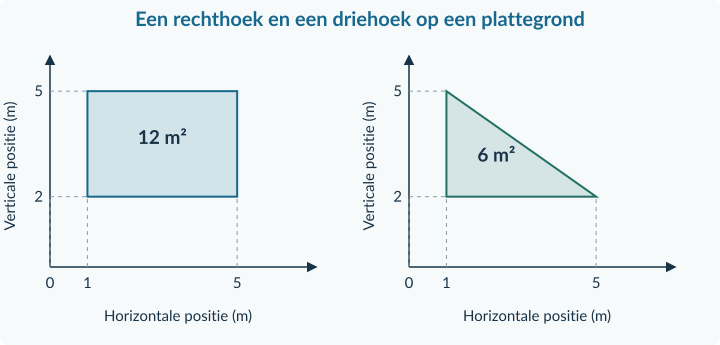<figcaption>Figuur 17 · De hoogte is 5 − 2 = 3 meter, niet 5 meter.</figcaption></figure>
<strong>f. Rechthoek:</strong> basis = 5 − 1 = 4 m; hoogte = 5 − 2 = 3 m. Oppervlakte = 4 × 3 = <strong>12 m²</strong>.

<strong>g. Driehoek:</strong> ½ × 4 × 3 = <strong>6 m²</strong>.

<strong>Samenvatting · 1.1.3</strong>

Lees eerst de variabelen en eenheden. Teken met een bruikbare schaal en controleer de punten. Interpoleer alleen met de genoemde aanname. Vul formules in en controleer een teruggerekende waarde. Gebruik afstanden als basis en hoogte. In de gemengde opgaven kies je deze gereedschappen zelf.

<!-- PAGE {"section": "1.1.3", "title": "Starten en een grafiek lezen"} -->

## Startopgaven

<h3>Opgave 22 · Rekenen voor je tekent</h3>
Gebruik de eerder geleerde rekenstappen.

a.

Bereken 18 − 6 en deel de uitkomst door 3.

b.

Een aantal daalt van 50 naar 40. Bereken de procentuele verandering.

<h3>Opgave 23 · Een punt herkennen</h3>
Je tekent een prijs–hoeveelheidsgrafiek met Q horizontaal en P verticaal. De prijs is € 5 en de hoeveelheid is 30 stuks.

a.

Welke coördinaten horen bij dit punt?

b.

Je tekent daarna een grafiek van bezoekersaantallen per maand. Welke grootheid zet je nu normaal horizontaal?

<strong>Oefenroute</strong>

Normale route: Startopgaven → Begeleide inoefening → Zelfstandige oefening → Doeloefening. Uitdagende route: Startopgaven → Zelfstandige oefening → Doeloefening → Denkertje / Bonusopgave. Herhaling is aanvullend bij beide routes.

## Begeleide inoefening

Begeleide inoefening hoort bij leren: je oefent met denkstappen en doet steeds meer zelf.

<h3>Opgave 24 · Eerst een grafiek lezen</h3>
Een verhuurbedrijf voor tentjes gebruikt onderstaande grafiek. De overige omstandigheden blijven gelijk en de lijn is het gegeven model.

<figure class="compact">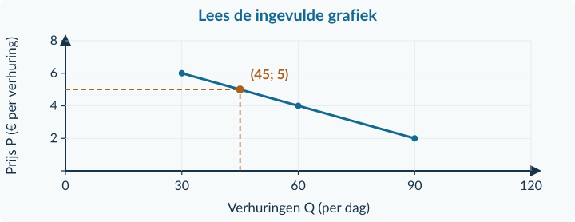<figcaption>Figuur 18 · De hulplijnen zijn ingevuld. Lees eerst wat zij betekenen.</figcaption></figure>
a.

Lees af hoeveel verhuringen horen bij een prijs van € 4. Noem de eenheid.

b.

Leg uit waarom bij € 5 het aantal 45 is. Gebruik de twee omliggende punten.

<!-- PAGE {"section": "1.1.3", "title": "De steun neemt af"} -->

<h3>Opgave 25 · Nu zelf aanvullen</h3>
Een maker van kaarten verwacht bij elke prijsstijging van € 2 steeds 20 bestellingen minder. De andere omstandigheden blijven gelijk. Gebruik tussen de opgegeven punten rechte lijnstukken.

<table class=""><thead><tr><th>P (€ per bestelling)</th><th>2</th><th>4</th><th>6</th><th>8</th></tr></thead><tbody><tr><td>Q (bestellingen per week)</td><td>80</td><td>60</td><td>…</td><td>20</td></tr></tbody></table><figure class="compact">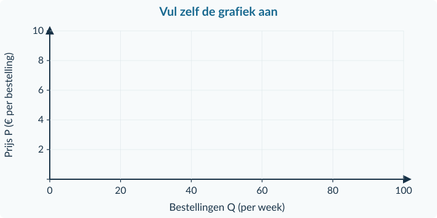<figcaption>Figuur 19 · Alleen het frame is gegeven. De punten en de hulplijnen teken je zelf.</figcaption></figure>
a.

Neem de tabel over en vul het ontbrekende aantal in.

b.

Teken alle punten in het meegeleverde frame en verbind ze.

c.

Teken hulplijnen bij P = € 5 en lees het aantal bestellingen af.

<h3>Opgave 26 · Zonder ingevulde tekening</h3>
Voor materiaaltransport geldt T = 5 + 4n. T is het bedrag in euro, n het aantal ritten van 0 tot en met 10.

a.

T is € 25. Schrijf eerst op welke twee bewerkingen je achtereenvolgens uitvoert. Bereken daarna n en controleer.

b.

Een rechthoek is 5 meter breed. De onderkant ligt op hoogte 2 meter en de bovenkant op 6 meter. Bereken eerst de hoogte en dan de oppervlakte.

c.

Een apart rechtlijnig model geeft Q = 40 bij P = € 6 en Q = 20 bij P = € 8. Leg zonder te tekenen uit welke Q bij P = € 7 hoort.

<!-- PAGE {"section": "1.1.3", "title": "Zelf tekenen en verklaren"} -->

## Zelfstandige oefening

<h3>Opgave 27 · Bezoek aan een uitkijktoren</h3>
Een beheerder gebruikt deze verwachting voor één middag. Andere omstandigheden blijven gelijk. Tussen de opgegeven punten gebruikt hij rechte lijnstukken; buiten het getoonde gebied doet hij geen voorspelling.

<table class=""><thead><tr><th>P (€ per bezoek)</th><th>3</th><th>6</th><th>9</th></tr></thead><tbody><tr><td>Q (bezoekers per middag)</td><td>120</td><td>90</td><td>60</td></tr></tbody></table>
a.

Teken zelf een grafiek op ruitjespapier. Zet Q horizontaal en P verticaal. Kies bruikbare schalen, benoem de eenheden en teken de punten en lijnstukken.

b.

Bepaal met lineaire interpolatie het aantal bezoekers bij een prijs van € 5.

c.

Bereken de procentuele verandering van het bezoekersaantal als de prijs van € 3 naar € 6 gaat. Beoordeel “Het aantal daalt met 30%”.

d.

Van € 3 naar € 9 daalt het aantal met 60 bezoekers. Hoeveel bezoekers minder is dat gemiddeld per euro prijsstijging?

<strong>Bij een eigen grafiek</strong>

Gebruik een liniaal. Je grafiek moet zonder de oorspronkelijke tabel leesbaar zijn: noem beide variabelen, eenheden en schalen. Werk je berekening naast de grafiek uit, niet over de lijn heen.

<!-- PAGE {"section": "1.1.3", "title": "Zelf invullen en oppervlaktes bepalen"} -->

<h3>Opgave 28 · Materiaal voor een foto-opdracht</h3>
De betaalregel is T = 10 + 2,5n. T is het bedrag in euro en n het aantal gehuurde lichtsets, van 0 tot en met 20.

<table class=""><thead><tr><th>Aantal n</th><th>0</th><th>4</th><th>12</th></tr></thead><tbody><tr><td>Totaalbedrag T (€)</td><td>…</td><td>…</td><td>…</td></tr></tbody></table>
a.

Neem de tabel over en vul de drie bedragen in.

b.

Bij welk aantal lichtsets is T gelijk aan € 35? Controleer je antwoord door het in te vullen.

c.

Verdubbelt het totaalbedrag als n van 4 naar 8 gaat? Onderbouw met beide bedragen.

<h3>Opgave 29 · Ruimte op een plattegrond</h3>
De assen geven posities in meters aan. De twee gekleurde vormen hebben dezelfde basis en hoogte.

<figure class="compact">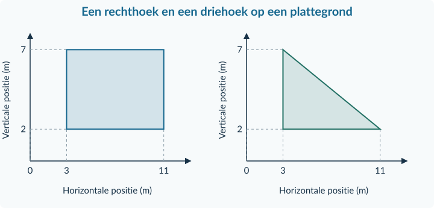<figcaption>Figuur 20 · Bereken de afstanden uit de aangegeven posities.</figcaption></figure>
a.

Bepaal de basis en hoogte. Bereken de oppervlakte van de rechthoek en de driehoek.

b.

Waarom gebruik je niet 7 meter als hoogte?

<!-- PAGE {"section": "1.1.3", "title": "Doeloefening"} -->

## Doeloefening

<h3>Opgave 30 · Reserveren, huren en meten</h3>
<strong>Bron A.</strong> Een verhuurder gebruikt onderstaande reserveringstabel voor één middag. De overige omstandigheden blijven gelijk. Tussen de punten geldt een rechte lijn.

<strong>Bron B.</strong> Voor de huur van verlichting geldt T = 8 + 2n. T is het bedrag in euro; n het aantal lampjes, van 0 tot en met 30.

<strong>Bron C.</strong> De figuur is een plattegrond met posities in meters.

<table class=""><thead><tr><th>Bron A: P (€ per reservering)</th><th>2</th><th>5</th><th>8</th></tr></thead><tbody><tr><td>Q (reserveringen per middag)</td><td>100</td><td>70</td><td>40</td></tr></tbody></table><figure class="compact">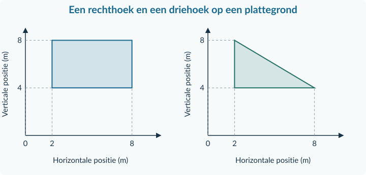<figcaption>Figuur 21 · Bron C: de te berekenen oppervlaktes, zonder uitkomsten.</figcaption></figure>
a.

Teken bij bron A zelf een prijs–hoeveelheidsgrafiek op ruitjespapier, met schalen, eenheden en de drie punten.

b.

Bepaal met lineaire interpolatie Q bij P = € 4.

c.

Een bericht stelt: “Tussen P = € 2 en P = € 5 daalt het aantal met ongeveer 43%.” Controleer de uitspraak.

d.

Bereken met bron B het bedrag bij n = 6.

e.

Bereken met bron B het aantal lampjes bij T = € 32. Controleer.

f.

Bereken met bron C de oppervlakte van de rechthoek.

g.

Bereken met bron C de oppervlakte van de driehoek. Laat zien welke basis en hoogte je gebruikt.

<!-- PAGE {"section": "1.1.3", "title": "Verder denken en terughalen"} -->

## Denkertje / Bonusopgave

<h3>Opgave 31 · Wat gebeurde er tussendoor?</h3>
Een actie verzamelt op dag 1 in totaal 20 boeken en op dag 5 in totaal 60. Over dag 2, 3 en 4 is niets geregistreerd. Het totaal kan niet dalen.

a.

Geef twee mogelijke reeksen voor dag 1 tot en met 5 die allebei bij de bron passen, maar op dag 3 een ander aantal geven. Leg uit welke extra aanname nodig is om op dag 3 precies 40 te voorspellen.

## Herhaling en combineren

<h3>Opgave 32 · Indexpunten zijn geen procenten</h3>
Een index daalt van 125 naar 100. De twee indexcijfers hebben dezelfde basis.

a.

Bereken de daling in indexpunten en de procentuele verandering.

<h3>Opgave 33 · Een opgegeven klus</h3>
Sam kiest ervoor om twee uur te sporten. In hetzelfde tijdvak kan Sam anders twee uur werken voor € 9 per uur. Andere alternatieven leveren geen geld op. Voor het sporten wordt niets betaald.

a.

Hoeveel mogelijke inkomsten geeft Sam op? Waarom zijn de alternatieve kosten in deze geldvergelijking niet nul?

<!-- PAGE {"section": "1.1.4", "title": "De gereedschappen samen gebruiken"} -->

1.1.4 · BOEK 1 · TWEEDE EDITIE
<h1 class="paragraph-title" id="h1-p114">Gemengde opgaven: economisch denken en rekenen</h1>
Een langere opgave bevat vaak meerdere bronnen. Niet elk getal is bij elke vraag nodig. Je kiest nu zelf welke informatie en welke rekenstap bij de vraag passen. Er komt geen nieuwe theorie bij.

<strong>Een vaste aanpak</strong>

<strong>Lees → selecteer → werk uit → controleer.</strong> Benoem bij een keuze het middel en het doel. Zet bij een berekening de eenheid en de vergelijkingsbasis. Controleer bij een grafiek de assen en de waarden.

### Een bron kiezen: een uitgewerkt voorbeeld

Een wijkcentrum heeft twee aparte beslissingen. Voor de middag kiest het een activiteit. Voor een losstaand avondprogramma beoordeelt het een prijswijziging.

<table class=""><thead><tr><th>Bron</th><th>Gegeven informatie</th></tr></thead><tbody><tr><td>A · Middag</td><td>Eén zaal, 2 uur. Activiteit X laat € 40 per uur over; activiteit Y € 55 per uur. Beide vragen alle beschikbare tijd. Doel: meeste geld.</td></tr><tr><td>B · Avondprijs</td><td>Dezelfde avondkaart gaat van € 8 naar € 10.</td></tr><tr><td>C · Bezoekers</td><td>Een model verwacht 80 bezoekers bij € 8 en 60 bij € 10. Tussen die punten geldt een rechte lijn.</td></tr></tbody></table>
<strong>Welke middagactiviteit past bij het doel?</strong> Gebruik bron A. X: 2 × € 40 = € 80. Y: 2 × € 55 = € 110. Kies Y; de alternatieve kosten zijn € 80 uit X. De avondprijs uit B hoort niet bij deze keuze.

<strong>Met hoeveel procent stijgt de avondprijs?</strong> Gebruik bron B. (10 − 8) / 8 × 100% = <strong>25%</strong>. Gebruik niet het bezoekersaantal als noemer.

<strong>Hoeveel bezoekers verwacht het model bij € 9?</strong> Gebruik bron C. Halverwege € 8 en € 10 ligt het midden tussen 80 en 60: <strong>70 bezoekers</strong>. Dat blijft een voorspelling onder de genoemde aanname.

<strong>Een conclusie is meer dan een getal</strong>

“Volgens bron C verwacht het model bij € 9 ongeveer 70 bezoekers, als de andere omstandigheden gelijk blijven.” Deze zin noemt het resultaat, de bron en de beperking.

<!-- PAGE {"section": "1.1.4", "title": "Zelf methoden combineren"} -->

## Gemengde oefening

<h3>Opgave 34 · Meer bekers inkopen</h3>
Een activiteitencommissie kocht vorig jaar 200 gelijke drinkbekers voor samen € 60. Dit jaar koopt zij 250 bekers van hetzelfde type voor samen € 80.

a.

Bereken de betaalde prijs per beker in beide jaren.

b.

Bereken de procentuele verandering van de prijs per beker.

c.

Het totaalbedrag steeg met 33,33%. Bewijst dit dat een beker 33,33% duurder werd? Leg uit.

d.

Bereken de index van de huidige prijs per beker met vorig jaar = 100.

<h3>Opgave 35 · Een lokaal op woensdagavond</h3>
Een wijkvereniging heeft één lokaal, drie uur lang. Zij kiest een beweegles óf een taalcafé; ieder programma vult de hele avond. Het doel is zoveel mogelijk geld voor een project overhouden. Na alle uitgaven blijft bij de beweegles € 50 per uur over; bij het taalcafé € 70.

a.

Bereken de twee totaalbedragen en kies het programma dat bij het doel past.

b.

Noem de alternatieve kosten. Bereken ook hoeveel procent het gekozen totaal boven het andere totaal ligt.

<!-- PAGE {"section": "1.1.4", "title": "Bronnen bij de doeloefening"} -->

Doeloefening · Bronnen bij opgave 36

<strong>Eén school, twee beslissingen.</strong> De middagactiviteit en de avondvoorstelling zijn afzonderlijke plannen. Ze vinden niet in hetzelfde tijdvak plaats. Gebruik per vraag de passende bron. De vragen staan op de pagina hiernaast.

<strong>Bron A · Middagactiviteit</strong>

De aula is twee uur beschikbaar. De school kiest een boekenruil óf een cultuuratelier. Elk plan vraagt de volledige twee uur. Ze kunnen niet worden gecombineerd. Beide plannen zijn uitvoerbaar. Het doel is <strong>het hoogste bedrag voor een goed doel</strong>. De bedragen in de tabel zijn wat na alle uitgaven overblijft.

<table class=""><thead><tr><th>Plan</th><th>Bedrag over per uur</th></tr></thead><tbody><tr><td>Boekenruil</td><td>€ 60</td></tr><tr><td>Cultuuratelier</td><td>€ 75</td></tr></tbody></table>

<strong>Bron B · Een aparte avondvoorstelling</strong>

Voor de avond stelt de commissie een ticketprijs voor. Het onderstaande model voorspelt het aantal bezoekers. Andere omstandigheden blijven gelijk. Tussen de drie punten neemt de commissie een rechte lijn aan. De zaal heeft voldoende plaatsen voor alle getoonde aantallen.

<table class=""><thead><tr><th>Ticketprijs P (€ per bezoeker)</th><th>4</th><th>6</th><th>8</th></tr></thead><tbody><tr><td>Verwacht aantal Q (per avond)</td><td>180</td><td>140</td><td>100</td></tr></tbody></table>
Een voorstel is een prijs van <strong>€ 7</strong>. Voor de beoordeling van dit voorstel is het doel: <strong>minstens 130 bezoekers</strong>.

<strong>Bron C · Prijsvergelijking tussen jaren</strong>

De prijs voor dezelfde jaarlijkse voorstelling was in het basisjaar € 4, in jaar 2 € 4,80 en in jaar 3 € 6. Gebruik het basisjaar als index 100. Dit is een vergelijking tussen jaren, niet de prijskeuze van € 7 uit bron B.

Een bericht stelt: “De prijsindex stijgt van jaar 2 naar jaar 3 met 30 punten. Een ticket is dus 30% duurder geworden.”

Alle bronnen zijn geconstrueerde gegevens voor deze opgave.

<!-- PAGE {"section": "1.1.4", "title": "Doeloefening"} -->

## Doeloefening

<h3>Opgave 36 · Een schoolactiviteit plannen</h3>
Gebruik de bronnen op de pagina hiernaast. Schrijf bij elke berekening welke waarden je gebruikt en geef de juiste eenheid.

a.

Leg met bron A uit waarom de school moet kiezen. Bereken beide totaalbedragen en bepaal welk plan bij het doel past.

b.

Noem de alternatieve kosten van de keuze uit a. Verklaar waarom het verschil tussen beide geldbedragen niet hetzelfde is.

c.

Teken met bron B zelf een grafiek op ruitjespapier. Benoem de assen en eenheden, kies een schaal en teken de punten en rechte lijnstukken.

d.

Bepaal met lineaire interpolatie het verwachte aantal bezoekers bij een ticketprijs van € 7.

e.

Bereken met bron C de prijsindexcijfers van jaar 2 en jaar 3. Bereken vervolgens de procentuele prijsverandering tussen die twee jaren.

f.

Beoordeel het bericht in bron C. Schrijf een verbeterde zin.

g.

Past het prijsvoorstel van € 7 bij het doel in bron B? Geef een advies met het berekende aantal en één beperking van het model.

<!-- PAGE {"section": "1.1.4", "title": "Extra gemengde oefening"} -->

## Extra gemengde oefening

<h3>Opgave 37 · Een formule en twee vormen</h3>
Voor materiaalhuur geldt T = 12 + 3n. T is het bedrag in euro en n het aantal sets, van 0 tot en met 25. De figuur is een aparte plattegrond; beide assen geven posities in meters aan.

<figure class="compact"><figcaption>Figuur 22 · Gebruik voor beide vormen dezelfde basis en hoogte.</figcaption></figure>
a.

Bereken het bedrag voor 4 sets en het aantal sets dat hoort bij € 42. Controleer de teruggerekende waarde.

b.

Bereken de basis en hoogte en daarna de twee gekleurde oppervlaktes.

<h3>Opgave 38 · Herstel de fout</h3>
Hieronder staan drie antwoorden van leerlingen. Herstel per geval de fout en leg in één zin uit wat er misging.

a.

“Van 100 naar 80 is −25%, want 20 / 80 × 100 = 25.”

b.

“Een rechthoek loopt verticaal van 2 tot 6 meter en is 5 meter breed, dus de oppervlakte is 30 m².”

c.

“Er kwamen meer bezoekers nadat er posters waren opgehangen. De tabel bewijst dat de posters de stijging veroorzaakten.”

<!-- PAGE {"section": "Overzicht", "title": "Hoofdstukoverzicht"} -->

<h1 id="h1-overzicht">Hoofdstukoverzicht</h1>
Dit zijn de gereedschappen uit dit hoofdstuk. De vraag bepaalt welk gereedschap je nodig hebt.

<table class="reference-table"><thead><tr><th>Je wilt…</th><th>Dan doe je dit</th></tr></thead><tbody><tr><td>Een keuze uitleggen</td><td>Benoem het beperkte middel, de haalbare alternatieven en het doel. Noem daarna de waarde van het beste opgegeven alternatief.</td></tr><tr><td>Een bedrag per eenheid berekenen</td><td>Deel het totaalbedrag door het bijbehorende aantal.</td></tr><tr><td>Een aandeel berekenen</td><td>Deel het deel door het geheel en vermenigvuldig met 100%.</td></tr><tr><td>Een verandering berekenen</td><td>Bereken nieuw − oud. Voor een procentuele verandering deel je daarna door oud en vermenigvuldig je met 100%.</td></tr><tr><td>Een indexcijfer berekenen</td><td>Deel de waarde door de benoemde basiswaarde en vermenigvuldig met 100.</td></tr><tr><td>Een grafiek tekenen</td><td>Lees variabelen en eenheden. Kies assen en schalen. Plaats en controleer punten. Verbind alleen volgens de gegeven afspraak.</td></tr><tr><td>Interpoleren</td><td>Neem dezelfde fractie van beide verschillen op het rechte segment.</td></tr><tr><td>Een ontbrekende waarde berekenen</td><td>Vul in of reken de gegeven formule terug. Controleer door opnieuw in te vullen.</td></tr><tr><td>Een oppervlakte berekenen</td><td>Bepaal eerst basis en loodrechte hoogte als afstanden. Rechthoek: b × h. Driehoek: ½ × b × h.</td></tr></tbody></table>

<strong>De vier vragen vóór het rekenen</strong>

<strong>Wat</strong> wordt gevraagd? <strong>Welke</strong> gegevens horen erbij? <strong>Welke eenheid</strong> krijgt het antwoord? <strong>Waarmee</strong> vergelijk ik?

In hoofdstuk 1.2 krijgen prijs–hoeveelheidsgrafieken meer economische betekenis. Je onderzoekt dan waarom iemand bij een bepaalde prijs een hoeveelheid wil kopen. De reken- en tekenstappen uit dit hoofdstuk gebruik je opnieuw.

<!-- PAGE {"section": "Overzicht", "title": "Begrippen"} -->

<h1 id="h1-begrippen">Begrippen</h1>

<strong>Absolute verandering</strong> 
Het verschil nieuw − oud, uitgedrukt in de oorspronkelijke eenheid. Kan positief of negatief zijn.

<strong>Alternatieve kosten</strong> 
De waarde van het beste haalbare alternatief dat je opgeeft door een keuze.

<strong>Basiswaarde</strong> 
De waarde waarmee je vergelijkt. Bij een procentuele verandering is dit de oude waarde.

<strong>Behoefte</strong> 
Iets waaraan iemand wil voldoen, zoals ontspanning, eten of contact.

<strong>Eenheid</strong> 
Waarin je meet, bijvoorbeeld euro, personen, uren of vierkante meter.

<strong>Formule</strong> 
Een rekenregel die het verband tussen benoemde grootheden vastlegt.

<strong>Haalbaar alternatief</strong> 
Een andere keuze die met de beschikbare middelen echt mogelijk is.

<strong>Indexcijfer</strong> 
Een waarde ten opzichte van een gekozen basiswaarde die index 100 krijgt.

<strong>Indexpunt</strong> 
Een eenheid in het verschil tussen twee indexcijfers met dezelfde basis.

<strong>Interpoleren</strong> 
Een tussenwaarde bepalen tussen twee bekende punten; lineair met een rechte-lijnaanname.

<strong>Model</strong> 
Een vereenvoudigde beschrijving van een situatie, met benoemde aannames.

<strong>Procent</strong> 
Een honderdste deel. Een percentage geeft een verhouding ten opzichte van een basis weer.

<strong>Procentpunt</strong> 
Een eenheid in het verschil tussen twee percentages.

<strong>Schaal</strong> 
De afspraak welk getalsverschil hoort bij een afstand op een as.

<strong>Schaarste</strong> 
Middelen zijn beperkt ten opzichte van de behoeften, waardoor keuzes nodig zijn.

<strong>Variabele</strong> 
Een grootheid die verschillende waarden kan aannemen, bijvoorbeeld prijs P of aantal n.

<strong>Een volledig antwoord</strong>

Een berekening laat je werkwijze zien. Een eenheid vertelt wat de uitkomst meet. Een conclusie legt uit wat de uitkomst voor de vraag betekent. Gebruik alle drie wanneer de opgave daarom vraagt.

<!-- PAGE {"section": "1.2", "title": "Inhoud · Vraag"} -->

BOEK 1 · TWEEDE EDITIE · HOOFDSTUK 2
<h1 class="cover-title">Vraag</h1>
Van één koopbeslissing naar de vraag van alle kopers.

<a href="#h2-p121"><b>1.2.1 · Betalingsbereidheid en individuele vraag46</b>Wie wil wat kopen, en bij welke prijs?</a><a href="#h2-p122"><b>1.2.2 · Vraagfactoren: bewegen of verschuiven?58</b>De eigen prijs en andere oorzaken uit elkaar houden.</a><a href="#h2-p123"><b>1.2.3 · Van individuele naar collectieve vraag68</b>Hoeveelheden optellen bij dezelfde prijs.</a><a href="#h2-p124"><b>1.2.4 · Gemengde opgaven: vraag78</b>Bronnen, berekeningen en grafieken combineren.</a>

<strong>Na dit hoofdstuk kun je</strong>
<ul><li>koopbeslissingen uitleggen met betalingsbereidheid;</li><li>met een vraagfunctie rekenen en een lijn met correcte snijpunten tekenen;</li><li>een eigen-prijsreactie onderscheiden van een verandering van andere vraagfactoren;</li><li>collectieve vraag bepalen, met nulbijdragen bij een te hoge prijs;</li><li>een berekening of grafiek verbinden met een precieze bronconclusie.</li></ul>
<h2>Waarom koopt niet iedereen evenveel?</h2>
Een lagere prijs kan je overhalen nog iets te kopen. Maar ook je inkomen, plannen en de prijs van een alternatief spelen mee. In dit hoofdstuk maak je die koopbeslissingen zichtbaar. De reken- en tekenstappen uit hoofdstuk 1.1 krijgen zo een nieuwe economische betekenis.

<strong>Werken met dit hoofdstuk</strong>

Lees eerst de uitleg en het uitgewerkte voorbeeld. Maak daarna de startopgaven. Begeleide inoefening is voor de meeste leerlingen de normale route. Heb je minder tussenstappen nodig en zoek je extra uitdaging, dan kun je de uitdagende route volgen. Beide routes leiden naar dezelfde doeloefening. Gebruik een schrift, rekenmachine, potlood en liniaal.

Alle situaties en cijfers zijn geconstrueerde lesvoorbeelden. Het zijn geen uitspraken over actuele prijzen of werkelijk gemeten gedrag. Antwoorden staan in het afzonderlijke antwoordboek.

<!-- PAGE {"section": "1.2.1", "title": "Van een wens naar een koopbeslissing"} -->

1.2.1 · BOEK 1 · TWEEDE EDITIE
<h1 class="paragraph-title" id="h2-p121">Betalingsbereidheid en individuele vraag</h1>

<strong>Na deze paragraaf kun je</strong>
<ul><li>uitleggen welke eenheden iemand bij een gegeven prijs wil kopen;</li><li>met een vraagfunctie de hoeveelheid, de prijs en de snijpunten berekenen;</li><li>een lineaire vraaglijn tekenen en uitleggen wat zij wel en niet vertelt.</li></ul>

<strong>Koop je er nog één?</strong> Een portie aardbeien kost € 4. Voor haar eerste portie wil Sara maximaal € 10 betalen. Voor volgende porties heeft zij minder over. Is drie porties kopen dan vreemd?

<strong>Betalingsbereidheid</strong>

Het maximale bedrag dat een koper voor een bepaalde eenheid van een product wil betalen. In dit voorbeeld gaat elke balk over <strong>één extra portie</strong>.

<figure><figcaption>Figuur 1 · Sara heeft voor de eerste, tweede, derde en vierde portie respectievelijk € 10, € 7, € 4 en € 2 over.</figcaption></figure>
Sara koopt de eerste drie porties: telkens is haar betalingsbereidheid minstens € 4. Voor de vierde portie wil zij minder betalen dan de prijs.

<strong>Afspraak bij gelijkheid</strong>

In de voorbeelden met losse eenheden koopt iemand ook als de prijs precies gelijk is aan de betalingsbereidheid. Er is voldoende budget en het product is verkrijgbaar, tenzij de opgave iets anders zegt.

<!-- PAGE {"section": "1.2.1", "title": "Losse eenheden en het voordeel van kopen"} -->

Dezelfde koopbeslissingen kun je als een trapvorm laten zien. Elke trede hoort bij de betalingsbereidheid voor één extra portie. Bij € 4 passen drie porties bij Sara’s keuze.

<figure><figcaption>Figuur 2 · Dit is een hulpmiddel om losse beslissingen te begrijpen. Je hoeft deze trapvorm niet zelfstandig te construeren.</figcaption></figure>
Bij € 8 koopt Sara alleen de eerste portie. Bij € 6 koopt zij er twee. <strong>De prijs verandert; haar betalingsbereidheden blijven hier gelijk.</strong>

<strong>Eerste kennismaking · Consumentensurplus</strong>

Sara heeft voor de eerste portie € 10 over, maar betaalt € 4. Haar voordeel bij die aankoop is 10 − 4 = <strong>€ 6</strong>. Bij drie porties zijn de voordelen € 6, € 3 en € 0; samen <strong>€ 9</strong>. Dit heet consumentensurplus. Het is geen bedrag dat zij uitgekeerd krijgt.

Deze kennismaking helpt je de koopbeslissing te begrijpen. In Boek 2 leer je consumentensurplus verder berekenen en in een markt interpreteren. In de doelopgaven van dit hoofdstuk hoef je geen surplusoppervlakte te bepalen.

<strong>Niet elk verband is een rechte lijn</strong>

Vier afzonderlijke porties geven een trapvorm. Een vloeiende lijn past bijvoorbeeld bij deelbare hoeveelheden of bij een benadering. Een rechte lijn is een extra vereenvoudiging. Veel kopers samen leveren niet vanzelf een precies rechte lijn op.

<!-- PAGE {"section": "1.2.1", "title": "Een vraagfunctie met betekenis"} -->

<strong>Een andere situatie.</strong> Ravi koopt vers sap. We gebruiken voor hem een lineair model. q is de hoeveelheid sap in liter per maand; P is de prijs in euro per liter.

<strong>Individuele vraag</strong>

Het verband tussen de prijs en de hoeveelheid die <strong>één koper</strong> wil en kan kopen, terwijl alle andere omstandigheden gelijk blijven. Die afspraak heet <strong>ceteris paribus</strong>.

<strong>Vraagfunctie van Ravi</strong>

q = 12 − 2P

Geldig voor 0 ≤ P ≤ 6; dus 0 ≤ q ≤ 12.

De schrijfwijze 2P betekent 2 × P. Bij P = € 2 geldt: q = 12 − 2 × 2 = <strong>8 liter per maand</strong>. Elke euro prijsstijging verlaagt q in dit model met 2 liter per maand.

<table class=""><thead><tr><th>P (€ per liter)</th><th>0</th><th>2</th><th>4</th><th>6</th></tr></thead><tbody><tr><td>q (liter per maand)</td><td>12</td><td>8</td><td>4</td><td>0</td></tr></tbody></table><figure><figcaption>Figuur 3 · Q of q staat horizontaal, P verticaal. Bij dit individuele model schrijven we q. De coördinaten zijn (q; P).</figcaption></figure>
Bij q = 0 ligt het snijpunt op de P-as. Bij P = 0 ligt het snijpunt op de q-as. De twee punten zijn genoeg om een rechte lijn vast te leggen.

<!-- PAGE {"section": "1.2.1", "title": "Van hoeveelheid terug naar prijs"} -->

De formule kan ook dezelfde relatie met <strong>P links</strong> weergeven. Begin bij q = 12 − 2P. Tel aan beide kanten 2P op: q + 2P = 12. Trek q af: 2P = 12 − q. Deel door 2:

<strong>Dezelfde relatie, anders geschreven</strong>

P = 6 − 0,5q

Geldig voor 0 ≤ q ≤ 12.

Bij q = 6 liter is P = 6 − 0,5 × 6 = <strong>€ 3 per liter</strong>. Controle: 12 − 2 × 3 = 6 liter. Je hebt geen nieuw gedrag beschreven; je leest hetzelfde verband in de andere richting.

<figure><figcaption>Figuur 4 · Bij A geldt q = 8 en P = € 2; bij B q = 4 en P = € 4. De lijn en de tabel beschrijven hetzelfde model.</figcaption></figure>
<strong>Snijpunten controleren:</strong> bij P = 0 is q = 12. Bij q = 0 los je op: 0 = 12 − 2P → 2P = 12 → P = 6. Boven € 6 heeft Ravi volgens deze koopgrens geen vraag. Gebruik daar niet een negatieve uitkomst als aankoop.

<strong>Vraag is nog geen verkoop</strong>

De functie zegt hoeveel Ravi bij een prijs wil en kan kopen. Zij vertelt niet welke prijs werkelijk wordt gevraagd, hoeveel verkopers leveren of hoeveel uiteindelijk wordt verkocht. Daarvoor is meer informatie nodig.

<!-- PAGE {"section": "1.2.1", "title": "Uitgewerkt voorbeeld · kiezen en rekenen"} -->

## Uitgewerkt voorbeeld

<strong>Bron A — Stickers.</strong> Evi’s betalingsbereidheid voor vier extra stickers is € 9, € 6, € 4 en € 1. Elke sticker kost € 4. Zij heeft genoeg geld; bij gelijkheid koopt zij ook.

<strong>a. Welke stickers koopt Evi?</strong> Vergelijk per sticker: 9 ≥ 4, 6 ≥ 4 en 4 = 4. De vierde heeft een waarde lager dan € 4. Evi koopt dus <strong>3 stickers</strong>. De waarde van de eerste sticker is niet de waarde van alle stickers samen.

<strong>Bron B — Een afzonderlijk sapmodel.</strong> Voor Bo geldt q = 12 − 2P. q is liter per maand en P is euro per liter; 0 ≤ P ≤ 6. Andere omstandigheden blijven gelijk. Dit model is geen omzetting van Evi’s stickertabel.

<strong>b. Hoeveel bij € 2 en bij € 4?</strong>

Bij € 2: q = 12 − 2 × 2 = <strong>8 liter per maand</strong>. 
Bij € 4: q = 12 − 2 × 4 = <strong>4 liter per maand</strong>.

<strong>c. Welke prijs hoort bij 6 liter?</strong>

6 = 12 − 2P 
6 + 2P = 12 — tel aan beide kanten 2P op. 
2P = 6 — trek aan beide kanten 6 af. 
P = <strong>€ 3 per liter</strong> — deel door 2. 
Controle: 12 − 2 × 3 = 6 liter.

<strong>d. Waar liggen de snijpunten?</strong>

P = 0 geeft q = 12 → <strong>(12; 0)</strong>. 
q = 0 geeft 2P = 12, dus P = 6 → <strong>(0; 6)</strong>.

<strong>Wat blijft gelijk?</strong>

Het inkomen, de voorkeuren en de overige omstandigheden van Bo veranderen niet. Alleen de prijs van sap wordt in deze vergelijking gevarieerd.

<!-- PAGE {"section": "1.2.1", "title": "Uitgewerkt voorbeeld · tekenen en interpreteren"} -->

<strong>e. Teken de vraaglijn.</strong> Kies q van 0 tot 12 horizontaal en P van 0 tot 6 verticaal. Zet de snijpunten neer en verbind ze. Controleer met A = (8; 2), B = (4; 4) en C = (6; 3).

<figure><figcaption>Figuur 5 · De prijs bij 6 liter lees je op dezelfde lijn af als de hoeveelheid bij € 3.</figcaption></figure>
<strong>f. Wat betekent de prijsstijging van € 2 naar € 4?</strong> Bo’s gevraagde hoeveelheid daalt van 8 naar 4 liter per maand. Bij een hogere prijs kiest hij minder sap, onder de genoemde gelijkblijvende omstandigheden. Dit is een voorspelling over zijn vraag, niet zelfstandig bewijs van de feitelijke verkoop.

<strong>Samenvatting · 1.2.1</strong>

Vergelijk betalingsbereidheid met de prijs. Gebruik een vraagfunctie alleen binnen de genoemde grenzen en houd andere omstandigheden gelijk. Reken terug door aan beide kanten hetzelfde te doen. Teken q horizontaal en P verticaal; controleer je snijpunten. In de volgende paragraaf veranderen ook andere vraagfactoren.

<strong>Bij je eigen antwoord:</strong> schrijf steeds wie de koper is, om welk product het gaat en op welke periode de hoeveelheid betrekking heeft. “8” alleen is nog geen volledig antwoord.

<!-- PAGE {"section": "1.2.1", "title": "Starten en de grafiek lezen"} -->

## Startopgaven

<h3>Opgave 1 · Een bekende rekenregel</h3>
Voor materiaalhuur geldt T = 5 + 2n. T is het bedrag in euro; n is een heel aantal materialen van 0 tot en met 20.

a.

Bereken T als n = 4.

b.

Bereken n als T = € 17 en controleer je antwoord.

<h3>Opgave 2 · Een aankoop en een punt</h3>
Omar wil voor een eerste poster maximaal € 8 betalen. De prijs is € 6. Hij heeft genoeg geld. In een andere vraaggrafiek staat q horizontaal en P verticaal.

a.

Koopt Omar de poster volgens de koopregel? Licht toe.

b.

Welk punt hoort bij 4 producten en € 3 per product?

<strong>Oefenroute</strong>

Normale route: Startopgaven → Begeleide inoefening → Zelfstandige oefening → Doeloefening. Uitdagende route: Startopgaven → Zelfstandige oefening → Doeloefening → Denkertje / Bonusopgave. Herhaling is aanvullend bij beide routes.

## Begeleide inoefening

Begeleide inoefening hoort bij leren: je oefent met denkstappen en doet steeds meer zelf.

De volgende opgaven bouwen de hulp af: eerst lezen, dan afmaken, daarna zelf rekenen.

<!-- PAGE {"section": "1.2.1", "title": "Begeleide inoefening · herkennen en afmaken"} -->

<h3>Opgave 3 · De ingevulde hulplijnen</h3>
Lina’s vraag naar tijdschriften is q = 12 − 2P, met q per maand en P in euro per tijdschrift. Het model geldt voor 0 ≤ P ≤ 6; de overige omstandigheden blijven gelijk.

<figure><figcaption>Figuur 6 · De antwoorden zijn grafisch zichtbaar; controleer dat je de hulplijnen goed leest.</figcaption></figure>
a.

Lees q bij P = € 2 af. Noem de eenheid.

b.

Lees P bij q = 4 af en controleer met de formule.

c.

Kun je uit de vraaglijn alleen vaststellen dat er ook echt vier tijdschriften worden verkocht? Leg uit.

<!-- PAGE {"section": "1.2.1", "title": "Begeleide inoefening · minder hulp"} -->

<h3>Opgave 4 · Maak de vraaglijn af</h3>
Voor Mats geldt q = 8 − P. q is het aantal bezoeken aan een expositieruimte per maand; P is euro per bezoek. Gebruik 0 ≤ P ≤ 8. Andere omstandigheden blijven gelijk.

<table class=""><thead><tr><th>P (€ per bezoek)</th><th>0</th><th>2</th><th>5</th><th>8</th></tr></thead><tbody><tr><td>q (bezoeken per maand)</td><td>8</td><td>…</td><td>…</td><td>0</td></tr></tbody></table><figure><figcaption>Figuur 7 · De twee snijpunten staan er al. De lijn en de twee andere punten teken je zelf.</figcaption></figure>
a.

Vul de twee ontbrekende hoeveelheden in de tabel in.

b.

Teken de rechte vraaglijn door de gegeven snijpunten. Markeer de punten bij P = € 2 en P = € 5.

c.

Welke prijs hoort bij q = 3?

<h3>Opgave 5 · Zonder tekening</h3>
Voor Lila’s pakjes kaarten geldt q = 15 − 3P, voor 0 ≤ P ≤ 5. q is pakjes per maand en P is euro per pakje. Een ander pakje heeft voor haar een gegeven betalingsbereidheid van € 4.

a.

Bereken de prijs waarbij zij volgens de functie 6 pakjes vraagt.

b.

Dat andere pakje kost € 4. Koopt ze het volgens onze afspraak bij gelijkheid?

<!-- PAGE {"section": "1.2.1", "title": "Zelfstandig de methode toepassen"} -->

## Zelfstandige oefening

<h3>Opgave 6 · Sap voor Joris</h3>
Joris’ vraag naar appelsap wordt benaderd door q = 18 − 3P, met q in liter per week en P in euro per liter. Gebruik 0 ≤ P ≤ 6 en houd de overige omstandigheden gelijk.

a.

Bereken q bij P = € 2 en bij P = € 4.

b.

Bereken de prijs die hoort bij q = 9. Controleer je antwoord.

c.

Bepaal beide snijpunten en teken zelf de vraaglijn. Markeer de punten uit a.

d.

Leg uit waarom de functie niet betekent dat Joris zeker 18 liter gaat kopen.

<h3>Opgave 7 · Een bezoek meer of minder</h3>
Noor wil voor haar eerste vier museumbezoeken per maand maximaal € 18, € 12, € 8 en € 4 per bezoek betalen. Zij heeft voldoende budget en toegang. Bij gelijkheid koopt ze ook.

a.

Hoeveel bezoeken wil Noor kopen bij € 9 per bezoek? Licht toe.

b.

Hoeveel wil zij kopen bij € 12 en bij € 6?

c.

Is in b haar betalingsbereidheid veranderd? Leg uit.

<!-- PAGE {"section": "1.2.1", "title": "Doeloefening"} -->

## Doeloefening

<h3>Opgave 8 · Fotoprints en een sapmodel</h3>
<strong>Bron A.</strong> Iris wil voor vier extra fotoprints maximaal € 12, € 9, € 5 en € 2 betalen. Elke print kost € 5. Zij heeft voldoende budget; bij gelijkheid koopt zij ook.

<strong>Bron B — een andere situatie.</strong> Voor Amir geldt q = 20 − 4P. q is sap in liter per maand, P euro per liter. De functie geldt voor 0 ≤ P ≤ 5. Alle overige omstandigheden blijven gelijk.

a.

Hoeveel fotoprints koopt Iris volgens bron A? Leg uit.

b.

Bereken met bron B de gevraagde hoeveelheid bij P = € 2 en bij P = € 3.

c.

Bereken de prijs die hoort bij q = 6 liter per maand. Controleer je antwoord.

d.

Bereken beide snijpunten van de vraaglijn uit bron B.

e.

Teken die vraaglijn in je schrift en markeer de twee punten uit b. Vermeld variabelen, eenheden en een bruikbare schaal.

f.

Leg uit wat de prijsstijging van € 2 naar € 3 voor Amirs vraag betekent. Kun je daarmee ook zijn feitelijke aankoop vaststellen?

<!-- PAGE {"section": "1.2.1", "title": "Denkertje en herhaling"} -->

## Denkertje / Bonusopgave

<h3>Opgave 9 · Hetzelfde aantal, dezelfde vraag?</h3>
Twee leerlingen kopen ieder twee drankjes bij een prijs van € 3. Een onderzoeker zegt: “Hun individuele vraag is dus precies hetzelfde.”

a.

Beoordeel de uitspraak. Geef twee verschillende rijtjes betalingsbereidheden die bij € 3 tot twee aankopen leiden, maar bij een andere prijs tot verschillende aantallen.

## Herhaling en combineren

<h3>Opgave 10 · Verhoudingen blijven nodig</h3>
Een groep koopt 6 identieke folders voor in totaal € 18. Een week later stijgt de prijs per folder van € 3 naar € 3,60.

a.

Bereken het bedrag per folder bij de eerste aankoop.

b.

Bereken de procentuele prijsverandering.

<h3>Opgave 11 · Een zaterdagmiddag</h3>
Bram heeft drie uur beschikbaar. Hij kan óf helpen bij een verhuizing voor € 36 in totaal, óf flyers bezorgen voor € 27 in totaal. Beide opties duren drie uur. Hij kiest de verhuizing; zijn doel is de hoogste geldelijke opbrengst.

a.

Wat zijn de geldelijk uitgedrukte alternatieve kosten van zijn keuze? Leg uit waarom het antwoord niet € 9 is.

<strong>Klaar voor de volgende stap</strong>

Tot nu toe varieerde je de eigen prijs terwijl de overige omstandigheden gelijk bleven. Hierna onderzoek je wat er verandert als ook inkomen, voorkeuren of andere prijzen veranderen.

<!-- PAGE {"section": "1.2.2", "title": "Een ander aantal: wat is de oorzaak?"} -->

1.2.2 · BOEK 1 · TWEEDE EDITIE
<h1 class="paragraph-title" id="h2-p122">Vraagfactoren: bewegen of verschuiven?</h1>

<strong>Na deze paragraaf kun je</strong>
<ul><li>een verandering door de eigen prijs onderscheiden van een andere vraagfactor;</li><li>de specifieke oorzaak, richting en grafische verandering uitleggen;</li><li>twee veranderingen eerst afzonderlijk en daarna samen analyseren.</li></ul>

Een ijssalon merkt dat kopers meer ijscoupes willen. Komt dat door een lagere prijs, of door warmer weer? Dezelfde richting van de hoeveelheid kan twee verschillende oorzaken hebben.

We kijken nu naar de vraag van <strong>een groep kopers</strong>. Die hoeveelheid noemen we Q; q blijft de hoeveelheid van één koper. Hoe je kopers optelt, leer je in §1.2.3.

<figure><figcaption>Figuur 8 · Alleen de eigen prijs verandert: bij € 5 vragen de kopers 60 coupes; bij € 10 nog 40 coupes per week.</figcaption></figure>

<strong>Beweging langs de vraaglijn</strong>

De <strong>prijs van het product zelf</strong> verandert; de overige omstandigheden blijven gelijk. Je gaat naar een ander punt op dezelfde vraaglijn. Hier: van A naar B op V₀.

Bij deze lijn hoort Q = 80 − 4P, voor 0 ≤ P ≤ 20. Een hogere prijs van de ijscoupe verandert de hoeveelheid, <strong>niet de lijn zelf</strong>.

<!-- PAGE {"section": "1.2.2", "title": "Verschuiven: vergelijken bij dezelfde prijs"} -->

Begin nu opnieuw bij de ijssalon, maar houd P op € 10. Door warmer weer willen kopers <strong>bij elke onderzochte prijs 20 coupes meer</strong> per week. Dit is informatie uit ons model, geen algemene wet over de grootte van een weerseffect.

<figure><figcaption>Figuur 9 · De assen en schalen zijn gelijk aan figuur 8. Bij € 10 verandert de vraag van 40 naar 60 coupes per week.</figcaption></figure>

<strong>Verschuiving van de vraaglijn</strong>

Een <strong>andere vraagfactor dan de eigen prijs</strong> verandert. Bij dezelfde prijs vragen kopers meer of minder. Meer vraag: naar rechts. Minder vraag: naar links.

Oud: Q = 80 − 4P. Nieuw: Q = 100 − 4P, voor 0 ≤ P ≤ 25. De oorspronkelijke vergelijking blijft alleen de oude omstandigheden beschrijven. Voor een zuivere vergelijking kies je een prijs die in beide modellen past.

<table class=""><thead><tr><th>Wat kan de vraaglijn verschuiven?</th><th>Waar kijk je naar?</th></tr></thead><tbody><tr><td>Inkomen</td><td>Willen kopers bij dezelfde prijs meer of minder van dit product?</td></tr><tr><td>Behoeften en voorkeuren</td><td>Bijvoorbeeld weer of een nieuwe waardering van het product.</td></tr><tr><td>Prijs van een ander goed</td><td>Vervangt dat goed ons product of gebruiken kopers ze samen?</td></tr><tr><td>Aantal kopers</td><td>Alleen de vraag van de groep/markt verandert hierdoor.</td></tr><tr><td>Verwachtingen</td><td>Wat zegt de bron over kopen nu in plaats van later?</td></tr></tbody></table>

<strong>Niet “de prijs wordt hoger, dus de lijn stijgt”</strong>

Een beweging naar een hoger punt op de lijn is geen verschuiving van de hele lijn. Controleer de oorzaak, niet alleen de richting van het getekende pijltje.

<!-- PAGE {"section": "1.2.2", "title": "Andere goederen, inkomen en verwachtingen"} -->

<strong>Substituten</strong> zijn goederen die elkaar voor de koper kunnen vervangen. <strong>Complementen</strong> worden juist samen gebruikt. De relatie hangt af van het gebruik in de beschreven situatie.

<figure><figcaption>Figuur 10 · De bron neemt aan dat sommige kopers thee door koffie vervangen. Alle overige omstandigheden blijven gelijk.</figcaption></figure><figure><figcaption>Figuur 11 · De bron neemt aan dat printers en bijpassende inkt samen worden gebruikt.</figcaption></figure>
<strong>Inkomen.</strong> Bij meer inkomen willen kopers in een bron bijvoorbeeld vaker naar een concert: de vraag verschuift naar rechts. Een andere bron kan vertellen dat zij juist minder goedkope kant-en-klaarmaaltijden kiezen en vaker uit eten gaan. Dan verschuift de vraag naar die maaltijden naar links. Lees het gegeven gedrag; inkomenstoename betekent niet voor elk product meer vraag.

<strong>Aantal kopers.</strong> Meer mensen die bij een gegeven prijs willen kopen vergroten de vraag van de groep. Dat hoeft de vraag van één bestaande koper niet te veranderen.

<strong>Verwachtingen.</strong> Verwachten klanten volgende week een korting en stellen zij volgens de bron hun aankoop uit? Dan kan de vraag <strong>nu</strong> afnemen, hoewel de huidige prijs gelijk blijft. Verander de periode niet ongemerkt in je antwoord.

<strong>Benoem de precieze oorzaak</strong>

“Koffie wordt aantrekkelijker” is nog geen volledige oorzaak. Bij een hogere theeprijs is de factor <strong>de prijs van een substituut</strong>, niet een veranderde voorkeur voor koffie.

<!-- PAGE {"section": "1.2.2", "title": "Uitgewerkt voorbeeld · twee veranderingen"} -->

## Uitgewerkt voorbeeld

Een lunchkraam gebruikt Q = 60 − 3P voor wraps, geldig voor 0 ≤ P ≤ 20. Q is wraps per middag; P is euro per wrap. De prijs stijgt van € 6 naar € 8. Tegelijk worden broodjes bij een andere kraam duurder. De bron beschouwt broodjes als substituut. Daardoor vragen kopers bij elke onderzochte prijs 12 wraps extra. Neem aan dat de nieuwe vraaglijn recht blijft tot de gevraagde hoeveelheid nul is. De overige omstandigheden blijven gelijk.

<strong>a. Alleen de eigen prijs:</strong> oud Q = 60 − 3 × 6 = <strong>42</strong>. Bij € 8 op de oude lijn: Q = 60 − 3 × 8 = <strong>36 wraps per middag</strong>. Dat is een beweging van A naar B langs V₀.

<strong>b. Alleen de broodjesprijs:</strong> de factor is de prijs van een substituut. De vraag naar wraps verschuift naar rechts. Bij € 8 gaat Q van 36 naar <strong>48</strong>. De nieuwe lijn is Q = 72 − 3P, geldig voor 0 ≤ P ≤ 24.

<figure><figcaption>Figuur 12 · A is de oude situatie. B is de denkstap “alleen de eigen prijs”. C is de situatie met beide veranderingen.</figcaption></figure>
<strong>c. Beide samen:</strong> het eigen-prijseffect is −6 en het substituuteffect +12 wraps per middag. Ze werken tegen elkaar in. Samen: 42 − 6 + 12 = <strong>48 wraps</strong>, dus 6 meer dan eerst.

<strong>d. De onjuiste uitleg:</strong> “De hogere wrapprijs heeft de vraaglijn naar rechts verschoven.” Dat klopt niet. Die prijsstijging veroorzaakte een beweging langs dezelfde vraaglijn naar een kleinere gevraagde hoeveelheid. De hogere broodjesprijs veroorzaakt de verschuiving.

<strong>Samenvatting · 1.2.2</strong>

Kies eerst het product en de periode. De eigen prijs geeft een beweging langs de lijn; een andere vraagfactor kan de lijn verschuiven. Benoem bij een ander product de relatie. Bekijk twee veranderingen apart voordat je hun effecten combineert. Zonder getallen is het netto-effect soms niet te bepalen. Hierna tel je de vraag van kopers op.

<!-- PAGE {"section": "1.2.2", "title": "Starten en een verschuiving herkennen"} -->

## Startopgaven

<h3>Opgave 12 · Rekenen met een bekende basis</h3>
Gebruik de rekenstappen uit het vorige hoofdstuk en §1.2.1.

a.

Een aantal daalt van 24 naar 18. Bereken de procentuele verandering.

b.

Bereken Q bij P = € 6 in Q = 24 − 2P. Q is stuks per week; de formule geldt voor 0 ≤ P ≤ 12.

<h3>Opgave 13 · Wat verandert er?</h3>
Je onderzoekt de vraag naar een rugzak. De prijs van deze rugzak daalt; alle andere omstandigheden blijven gelijk.

a.

Is dit een beweging langs of een verschuiving van de vraaglijn? Noem ook de richting van de hoeveelheid.

<strong>Oefenroute</strong>

Normale route: Startopgaven → Begeleide inoefening → Zelfstandige oefening → Doeloefening. Uitdagende route: Startopgaven → Zelfstandige oefening → Doeloefening → Denkertje / Bonusopgave. Herhaling is aanvullend bij beide routes.

## Begeleide inoefening

Begeleide inoefening hoort bij leren: je oefent met denkstappen en doet steeds meer zelf.

<h3>Opgave 14 · Een beter gewaardeerde helm</h3>
Na nieuwe informatie waarderen kopers fietshelmen meer. De prijs blijft € 6. Bekijk de ingevulde grafiek.

<figure><figcaption>Figuur 13 · De oorzaak en beide hulplijnen zijn gegeven. Lees eerst wat er staat.</figcaption></figure>
a.

Lees Q vóór en na de verandering af. Welke factor en welke richting horen hierbij?

<!-- PAGE {"section": "1.2.2", "title": "Begeleide inoefening · zelf markeren"} -->

<h3>Opgave 15 · Twee losse veranderingen bij de wasstraat</h3>
De beginlijn is Q = 120 − 10P, voor 0 ≤ P ≤ 12. Q is wasbeurten per dag; P is euro per wasbeurt. Bij beide veranderingen hieronder begin je opnieuw bij deze lijn en P = € 6.

<figure><figcaption>Figuur 14 · Alleen de beginlijn is gegeven. De antwoordmarkeringen en nieuwe lijn voeg je zelf toe.</figcaption></figure>
a.

De eigen prijs stijgt naar € 8; de overige omstandigheden blijven gelijk. Bereken beide hoeveelheden en teken de beweging met een pijl.

b.

De prijs bij een concurrerende wasstraat daalt. Volgens de bron is die dienst een substituut. Bij elke prijs worden bij onze wasstraat 20 wasbeurten minder gevraagd. Teken V₁ voor Q = 100 − 10P, voor 0 ≤ P ≤ 10, en markeer de hoeveelheid bij € 6. Gebruik bijvoorbeeld de snijpunten.

c.

Leg uit waarom de twee pijlen niet hetzelfde soort verandering laten zien.

<strong>Controle van je tekening</strong>

De lijn in a blijft precies liggen. In b vergelijk je eerst beide hoeveelheden bij € 6. Noem bij je pijl ook de oorzaak; een richting alleen is niet voldoende.

<!-- PAGE {"section": "1.2.2", "title": "Eerst afzonderlijk, dan samen"} -->

<h3>Opgave 16 · Een spel en de bijbehorende console</h3>
De prijs van een nieuw spel daalt. Tegelijk stijgt de prijs van de console die nodig is om het spel te spelen. Volgens de bron gebruiken klanten beide samen; verder verandert er niets. De grootte van de effecten is niet gegeven.

a.

Bekijk eerst alleen de spelprijs. Wat gebeurt er met de vraaggrafiek voor het spel?

b.

Bekijk daarna alleen de consoleprijs. Benoem de vraagfactor en de richting.

c.

Versterken de twee effecten elkaar? Kun je de uiteindelijke hoeveelheid bepalen?

d.

Een leerling zegt: “De duurdere console betekent dat de spelprijs stijgt.” Leg uit waarom die redenering onjuist is.

## Zelfstandige oefening

<h3>Opgave 17 · De oorzaak precies benoemen</h3>
Onderzoek steeds de vraag naar het product in de eerste kolom. De overige omstandigheden blijven gelijk. Neem de tabel over en vul de laatste drie kolommen in.

<table class=""><thead><tr><th>Product en verandering</th><th>Beweging of verschuiving?</th><th>Richting Q bij vergelijking</th><th>Specifieke factor</th></tr></thead><tbody><tr><td>Rugzak: de eigen prijs daalt.</td><td>…</td><td>…</td><td>…</td></tr><tr><td>Havermelk: koemelk wordt duurder; kopers vervangen koemelk door havermelk.</td><td>…</td><td>…</td><td>…</td></tr><tr><td>Simpele afhaalmaaltijd: kopers verdienen meer en kiezen volgens de bron vaker een restaurant.</td><td>…</td><td>…</td><td>…</td></tr><tr><td>Schriften: er komen meer leerlingen bij de school.</td><td>…</td><td>…</td><td>…</td></tr></tbody></table>
a.

Classificeer alle vier situaties. Gebruik de specifieke factor, niet alleen “er verandert iets”.

<!-- PAGE {"section": "1.2.2", "title": "Zelfstandig tekenen en combineren"} -->

<h3>Opgave 18 · Meer danslessen</h3>
Voor danslessen geldt eerst Q = 60 − 3P, voor 0 ≤ P ≤ 20. Q is lessen per week; P is euro per les. De prijs daalt van € 10 naar € 8. Tegelijk stijgt het inkomen van de kopers. Volgens de bron willen zij daardoor bij elke onderzochte prijs 12 lessen extra. Neem aan dat de nieuwe vraaglijn recht blijft tot de gevraagde hoeveelheid nul is. De overige omstandigheden blijven gelijk.

<figure><figcaption>Figuur 15 · Je krijgt alleen de oorspronkelijke vraaglijn, net als bij de doeloefening.</figcaption></figure>
a.

Bereken de oude hoeveelheid en de hoeveelheid na alleen de eigen prijsdaling. Benoem het soort grafische verandering.

b.

Voeg de nieuwe vraaglijn en de oude en uiteindelijke punten aan de figuur toe. Noteer de coördinaten bij de punten.

c.

Bereken de uiteindelijke hoeveelheid. Leg uit of de twee effecten elkaar versterken of tegenwerken.

<strong>Een conclusie met bewijs</strong>

Een volledig antwoord noemt een verandering, een getal of grafische aanwijzing en de economische oorzaak. Alleen “meer vraag” mist de vergelijking met de oude situatie.

<!-- PAGE {"section": "1.2.2", "title": "Doeloefening"} -->

## Doeloefening

<h3>Opgave 19 · Filmhuis Lumi</h3>
Voor filmbezoeken geldt eerst Q = 100 − 5P, voor 0 ≤ P ≤ 20. Q is bezoeken per week; P is euro per bezoek. Lumi verhoogt de prijs van € 8 naar € 10. Tegelijk worden kaartjes van een nabijgelegen bioscoop duurder. Volgens de bron zijn die bezoeken substituten. Hierdoor worden bij Lumi bij elke onderzochte prijs 20 bezoeken extra gevraagd. Neem aan dat de nieuwe vraaglijn recht blijft tot de gevraagde hoeveelheid nul is. Verder blijven de omstandigheden gelijk.

<figure><figcaption>Figuur 16 · Voeg de nieuwe lijn en de gevraagde punten zelf toe.</figcaption></figure>
a.

Bereken Q vóór de veranderingen en na alleen de eigen prijsstijging. Benoem de grafische verandering.

b.

Welke specifieke factor veroorzaakt de andere verandering? Benoem de richting van de verschuiving.

c.

Teken de nieuwe vraaglijn in de figuur. Markeer A (oud), B (alleen de eigen prijsstijging) en C (beide veranderingen). Noteer hun coördinaten.

d.

Bereken de uiteindelijke hoeveelheid en de verandering ten opzichte van het begin. Werken de twee effecten elkaar tegen of versterken ze elkaar?

e.

Beoordeel: “De hogere prijs van Lumi verschuift zijn vraaglijn naar rechts.” Gebruik je uitkomsten.

<!-- PAGE {"section": "1.2.2", "title": "Denkertje en herhaling"} -->

## Denkertje / Bonusopgave

<h3>Opgave 20 · Een onderzoek met te weinig informatie</h3>
Een winkel ziet dat een bordspel duurder is geworden en dat meer mensen het willen kopen. Er staat niets over inkomen, andere spellen of voorkeuren.

a.

Een medewerker zegt dat de vraaglijn daarom stijgend moet zijn. Geef een andere mogelijke verklaring. Leg uit welke extra informatie nodig is om de eigen-prijsreactie te onderzoeken.

## Herhaling en combineren

<h3>Opgave 21 · Indexen vergelijken</h3>
De prijsindex van sportmateriaal gaat van 120 naar 132; beide indexen gebruiken hetzelfde basisjaar.

a.

Bereken de procentuele verandering. Leg uit waarom het antwoord niet 12% is.

<h3>Opgave 22 · Een formule teruglezen</h3>
Een individuele vraag wordt beschreven door q = 16 − 2P voor 0 ≤ P ≤ 8. q is stuks per maand; P is euro per stuk.

a.

Bereken P als q = 8 en controleer de oorspronkelijke formule.

<strong>Van een verandering naar een totaal</strong>

Het aantal kopers kan de vraag van een groep veranderen. In §1.2.3 ontdek je hoe de afzonderlijke koopplannen precies bij elkaar worden opgeteld.

<!-- PAGE {"section": "1.2.3", "title": "Wat willen de kopers samen?"} -->

1.2.3 · BOEK 1 · TWEEDE EDITIE
<h1 class="paragraph-title" id="h2-p123">Van individuele naar collectieve vraag</h1>

<strong>Na deze paragraaf kun je</strong>
<ul><li>hoeveelheden van kopers bij dezelfde prijs optellen;</li><li>eenvoudige vraagfuncties binnen de gegeven grenzen samenvoegen;</li><li>de gezamenlijke vraag tekenen en uitleggen waarom een koper soms nul bijdraagt.</li></ul>

Een verkooppunt vraagt aan twee vaste kopers hoeveel liter sap zij bij verschillende prijzen willen kopen. Bij € 2 wil koper A 4 liter per week en koper B 8 liter. Hoe groot is hun vraag samen?

<strong>Collectieve vraag</strong>

De vraag van <strong>alle kopers op een afgebakende markt samen</strong>, bij verschillende prijzen en gelijkblijvende overige omstandigheden. Je telt hun gevraagde hoeveelheden op <strong>bij dezelfde prijs</strong>.

<table class=""><thead><tr><th>Prijs P (€ per liter)</th><th>q van koper A</th><th>q van koper B</th><th>Samen Q</th></tr></thead><tbody><tr><td>0</td><td>8</td><td>12</td><td>20</td></tr><tr><td>2</td><td>4</td><td>8</td><td>12</td></tr><tr><td>4</td><td>0</td><td>4</td><td>4</td></tr></tbody></table>
Alle hoeveelheden staan hier in <strong>liter per week</strong>. Voor deze kleine voorbeeldmarkt tellen alleen A en B mee. Bij € 2 is Q = 4 + 8 = <strong>12 liter per week</strong>. De prijs blijft € 2; die tel je niet op.

<strong>Drie controles vóór het optellen</strong>

Gaat het over <strong>hetzelfde product</strong>, <strong>dezelfde periode en eenheid</strong> en <strong>dezelfde prijs</strong>? Tel kopers of groepen bovendien niet dubbel mee.

Een gemiddelde is iets anders. (4 + 8) / 2 = 6 liter per koper, maar de gezamenlijke vraag is 12 liter. Voor collectieve vraag wil je het totaal, niet het gemiddelde.

<!-- PAGE {"section": "1.2.3", "title": "Horizontaal optellen, daarna formules"} -->

De drie grafieken laten dezelfde prijs van € 2 zien. Lees in iedere kopersgrafiek de hoeveelheid af. Tel de horizontale hoeveelheden 4 en 8 op. Het nieuwe punt heeft coördinaten <strong>(12; 2)</strong>.

<figure><figcaption>Figuur 17 · De prijs- en hoeveelheidsschalen zijn gelijk. De somlijn is alleen getekend zolang beide lineaire rekenregels geldig zijn.</figcaption></figure>
Bij deze bron horen qA = 8 − 2P (0 ≤ P ≤ 4) en qB = 12 − 2P (0 ≤ P ≤ 6). Boven de eigen prijsgrens vraagt die koper niets. Voor prijzen van € 0 tot en met € 4 kun je de twee rekenregels direct optellen.

<strong>Collectieve vraag · alleen voor 0 ≤ P ≤ 4</strong>

Q = qA + qB 
Q = (8 − 2P) + (12 − 2P) 
Q = 20 − 4P

Tel de losse getallen op: 8 + 12 = 20. Tel de P-termen op: −2P − 2P = −4P. <strong>Twee keer 2 liter minder is samen 4 liter minder</strong> bij een euro prijsstijging. De haakjes houden eerst zichtbaar welke regel bij welke koper hoort.

Controle bij € 2: Q = 20 − 4 × 2 = <strong>12 liter per week</strong>. Dat is dezelfde uitkomst als in de tabel.

<!-- PAGE {"section": "1.2.3", "title": "Een koper kan afhaken"} -->

Verhoog de prijs in dezelfde sapmarkt naar € 5. Voor A levert 8 − 2 × 5 de rekenuitkomst −2 op. Maar A vraagt geen negatieve liters: de prijs ligt boven zijn koopgrens van € 4. Zijn bijdrage is <strong>nul</strong>.

B vraagt bij € 5 nog 12 − 2 × 5 = <strong>2 liter per week</strong>. Samen vragen zij dus 0 + 2 = <strong>2 liter per week</strong>, niet 20 − 4 × 5 = 0 liter.

<figure><figcaption>Figuur 18 · De vorm verandert wanneer A niets meer koopt. De vraag van B verdwijnt daardoor niet.</figcaption></figure>

<strong>Een formule heeft grenzen</strong>

Q = 20 − 4P is geldig voor 0 ≤ P ≤ 4. Daarbuiten mag je die somformule niet doortrekken. Bekijk opnieuw wie nog koopt en tel alleen niet-negatieve hoeveelheden op.

Bij € 4 is A’s hoeveelheid al precies nul en is de somformule nog correct. Boven € 4 werkt A’s oorspronkelijke lineaire rekenregel niet meer als aankoopvoorspelling. Boven € 6 vragen beiden niets.

Je hoeft hiervoor geen uitgebreide nieuwe formule te maken. <strong>Prijs kiezen → per koper berekenen en koopgrens controleren → geldige hoeveelheden optellen.</strong> Ook een tekening mag niet buiten de opgegeven geldigheid zomaar als rechte lijn worden verlengd.

<!-- PAGE {"section": "1.2.3", "title": "Uitgewerkt voorbeeld · bron en som"} -->

## Uitgewerkt voorbeeld

Twee kopers bestellen limonade. Alle hoeveelheden zijn liter per week, P is euro per liter. Voor koper A geldt qA = 12 − 3P (0 ≤ P ≤ 4). Voor B geldt qB = 8 − P (0 ≤ P ≤ 8). Boven de eigen grens vraagt de koper nul. Andere omstandigheden blijven gelijk.

<strong>a. Vul de tabel in.</strong> Reken eerst per koper. Bij € 2 vraagt A: 12 − 3 × 2 = 6 liter. B vraagt: 8 − 2 = 6 liter. Samen: 6 + 6 = 12 liter.

<table class=""><thead><tr><th>P (€ per liter)</th><th>qA</th><th>qB</th><th>Q samen</th></tr></thead><tbody><tr><td>0</td><td>12</td><td>8</td><td>20</td></tr><tr><td>2</td><td>6</td><td>6</td><td>12</td></tr><tr><td>3</td><td>3</td><td>5</td><td>8</td></tr><tr><td>4</td><td>0</td><td>4</td><td>4</td></tr><tr><td>6</td><td>0</td><td>2</td><td>2</td></tr></tbody></table>
<strong>b. Schrijf de somfunctie zolang beide rekenregels geldig zijn.</strong>

Q = (12 − 3P) + (8 − P) = <strong>20 − 4P</strong>, voor <strong>0 ≤ P ≤ 4</strong>. 
Controle bij € 3: Q = 20 − 4 × 3 = <strong>8 liter per week</strong>; gelijk aan de tabel.

<strong>c. Bereid de tekening voor.</strong> Je tekent alleen het deel voor 0 ≤ P ≤ 4. De eindpunten zijn <strong>(20; 0)</strong> en <strong>(4; 4)</strong>. Het punt <strong>(12; 2)</strong> ligt ertussen. De lijn hoeft binnen dit interval niet de P-as te bereiken.

<strong>d. Bereken de gezamenlijke vraag bij € 6.</strong> A’s prijsgrens is overschreden, dus qA = 0. B: qB = 8 − 6 = 2. Samen: <strong>2 liter per week</strong>.

<strong>e. Waarom niet Q = 20 − 4 × 6?</strong> De −4 uit die berekening bevat een negatieve bijdrage van A. B’s vraag mag niet worden verminderd met liters die A niet koopt.

<!-- PAGE {"section": "1.2.3", "title": "Uitgewerkt voorbeeld · grafiek en start"} -->

<figure><figcaption>Figuur 19 · Alleen het gevraagde prijsinterval is getekend. Een verlenging naar de P-as zou buiten de geldige somfunctie vallen.</figcaption></figure>

<strong>Samenvatting · 1.2.3</strong>

Tel hoeveelheden bij dezelfde prijs op. Houd product, periode en eenheid gelijk. Voeg losse getallen en P-termen samen, met de geldigheid erbij. Boven een koopgrens draagt een koper nul bij, geen negatief aantal. In de gemengde opgaven kies je zelf welke bron en regel je nodig hebt.

## Startopgaven

<h3>Opgave 23 · Invullen en vergelijken</h3>
Gebruik alleen eerder geoefende rekenstappen.

a.

Bereken q bij P = 4 in q = 8 − 2P, geldig voor 0 ≤ P ≤ 4. q is liter per week.

b.

Een hoeveelheid stijgt van 12 naar 18 liter per week. Bereken de procentuele verandering.

<h3>Opgave 24 · Het totaal is geen gemiddelde</h3>
Bij dezelfde prijs vraagt een koper 3 liter melk per week en een tweede 5 liter. Alleen deze twee kopers tellen mee.

a.

Bereken de collectieve vraag. Wat gaat er mis als je de uitkomst door twee deelt?

<strong>Oefenroute</strong>

Normale route: Startopgaven → Begeleide inoefening → Zelfstandige oefening → Doeloefening. Uitdagende route: Startopgaven → Zelfstandige oefening → Doeloefening → Denkertje / Bonusopgave. Herhaling is aanvullend bij beide routes.

<!-- PAGE {"section": "1.2.3", "title": "Begeleide inoefening · de som aflezen"} -->

## Begeleide inoefening

Begeleide inoefening hoort bij leren: je oefent met denkstappen en doet steeds meer zelf.

<h3>Opgave 25 · Twee kopers van verf</h3>
Twee hobbyclubs kopen verf. De volgende grafieken geven hun vraag in liter per week weer. Andere omstandigheden blijven gelijk. Lees de ingevulde hulplijnen.

<figure><figcaption>Figuur 20 · De gezamenlijke grafiek gebruikt dezelfde schalen; het punt bij € 2 is volledig gegeven.</figcaption></figure>
a.

Lees voor A en B de hoeveelheid bij € 2 af. Controleer het gezamenlijke punt.

b.

Een leerling telt de twee prijzen op en noteert “12 liter bij € 4”. Leg uit wat daar misgaat.

<strong>Zeg de som in woorden</strong>

“Bij een prijs van € 2 per liter willen de twee kopers samen 12 liter per week kopen.” Daarmee controleer je in één zin de prijs, de eenheid, de periode en het niveau van je uitkomst.

<!-- PAGE {"section": "1.2.3", "title": "Begeleide inoefening · afronden en loslaten"} -->

<h3>Opgave 26 · Teken de gezamenlijke lijn</h3>
Twee gezinnen kopen chocolademelk. qA = 8 − 2P (0 ≤ P ≤ 4); qB = 16 − 2P (0 ≤ P ≤ 8). P is euro per liter, q liter per week. Boven de eigen koopgrens is q nul. Andere omstandigheden blijven gelijk.

<table class=""><thead><tr><th>P</th><th>qA</th><th>qB</th><th>Q</th></tr></thead><tbody><tr><td>0</td><td>8</td><td>16</td><td>24</td></tr><tr><td>2</td><td>…</td><td>…</td><td>…</td></tr><tr><td>4</td><td>…</td><td>…</td><td>…</td></tr></tbody></table><figure><figcaption>Figuur 21 · De tabel geeft steun. Nu teken je zelf het geldige deel van de somlijn.</figcaption></figure>
a.

Vul de tabel in en schrijf de gezamenlijke functie voor 0 ≤ P ≤ 4.

b.

Teken in de figuur de gezamenlijke vraag voor 0 ≤ P ≤ 4. Het punt bij P = 0 is al gegeven.

<h3>Opgave 27 · Zonder grafiek: wie koopt nog?</h3>
Voor setjes kaarten gelden qA = 6 − P (0 ≤ P ≤ 6) en qB = 10 − P (0 ≤ P ≤ 10), in setjes per maand. P is euro per setje. Boven de eigen koopgrens vraagt die koper niets.

a.

Bereken bij P = € 8 hoeveel beide kopers samen vragen.

<!-- PAGE {"section": "1.2.3", "title": "Zelfstandig optellen en tekenen"} -->

## Zelfstandige oefening

<h3>Opgave 28 · Vraag naar illustratieprints</h3>
Twee kopersgroepen vragen illustratieprints. QA = 12 − 3P (0 ≤ P ≤ 4) en QB = 24 − 3P (0 ≤ P ≤ 8). Q is prints per week; P is euro per print. Boven de eigen koopgrens is de vraag van de groep nul. Andere omstandigheden blijven gelijk.

a.

Bereken de vraag van iedere groep en de gezamenlijke vraag bij € 2.

b.

Stel de gezamenlijke functie op voor 0 ≤ P ≤ 4. Controleer met a.

c.

Teken zelf de gezamenlijke vraag voor 0 ≤ P ≤ 4. Noteer de eindpunten van dit deel.

<h3>Opgave 29 · Geen negatieve bijdragen</h3>
Twee kopers vragen knutselpakketten. qA = 10 − 2P (0 ≤ P ≤ 5); qB = 18 − 2P (0 ≤ P ≤ 9). q is pakketten per maand en P is euro per pakket. Boven de eigen koopgrens vraagt een koper nul.

a.

Bereken de gezamenlijke vraag bij € 6.

b.

Een leerling gebruikt Q = 28 − 4P en komt op 4 pakketten. Leg uit waarom dit geen geldige gezamenlijke vraag is bij die prijs.

<!-- PAGE {"section": "1.2.3", "title": "Doeloefening"} -->

## Doeloefening

<h3>Opgave 30 · Reserveringen bij een spellenclub</h3>
Een spellenclub onderzoekt de vraag van twee afzonderlijke groepen. QA = 18 − 3P, geldig voor 0 ≤ P ≤ 6. QB = 24 − 2P, geldig voor 0 ≤ P ≤ 12. Q is reserveringen per week; P is euro per reservering. Boven de eigen koopgrens vraagt de groep nul. De overige omstandigheden blijven gelijk.

<table class=""><thead><tr><th>P (€ per reservering)</th><th>QA</th><th>QB</th><th>Q samen</th></tr></thead><tbody><tr><td>0</td><td>…</td><td>…</td><td>…</td></tr><tr><td>2</td><td>…</td><td>…</td><td>…</td></tr><tr><td>4</td><td>…</td><td>…</td><td>…</td></tr><tr><td>6</td><td>…</td><td>…</td><td>…</td></tr></tbody></table>
a.

Neem de tabel over en vul alle lege hoeveelheden in.

b.

Stel de gezamenlijke vraagfunctie op voor 0 ≤ P ≤ 6. Controleer de formule met de tabelwaarde bij € 4.

c.

Teken in je schrift de gezamenlijke vraag voor 0 ≤ P ≤ 6. Noteer de eindpunten en markeer het punt bij € 4.

d.

Bereken de gezamenlijke vraag bij P = € 8.

e.

Een leerling trekt de lijn uit c door en vindt bij € 8 een gezamenlijke vraag van 2 reserveringen. Leg uit waarom dit onjuist is.

<!-- PAGE {"section": "1.2.3", "title": "Denkertje en herhaling"} -->

## Denkertje / Bonusopgave

<h3>Opgave 31 · Meer mogelijke kopers, toch hetzelfde totaal</h3>
Een aanbieder bereikt tien extra mogelijke kopers. De prijs blijft € 10. Alle bestaande kopers blijven precies dezelfde hoeveelheid vragen.

a.

Moet de gezamenlijke gevraagde hoeveelheid bij € 10 nu groter zijn? Geef een tegenvoorbeeld en leg uit welke aanvullende voorwaarde een stijging wél garandeert.

## Herhaling en combineren

<h3>Opgave 32 · Een daling vergelijken</h3>
Een aantal aanmeldingen daalt van 10 naar 8 per week.

a.

Bereken de procentuele verandering.

<h3>Opgave 33 · Afstanden op een plattegrond</h3>
Een rechthoek ligt op een plattegrond van x = 2 tot x = 8 en van y = 3 tot y = 6. Beide assen geven posities in meters. Een driehoek beslaat de helft van die rechthoek.

a.

Bereken de oppervlakte van de rechthoek en de driehoek.

<strong>Let op de bron</strong>

Een tabel, formule en grafiek die bij dezelfde bron horen, moeten dezelfde uitkomsten geven. Zie je een verschil? Controleer eerst de prijs, de eenheid en de geldigheid.

<!-- PAGE {"section": "1.2.4", "title": "Bekende begrippen, een nieuwe combinatie"} -->

1.2.4 · BOEK 1 · TWEEDE EDITIE
<h1 class="paragraph-title" id="h2-p124">Gemengde opgaven: vraag</h1>
Je gebruikt nu de gereedschappen uit het hele hoofdstuk. Er komt geen nieuwe theorie bij. Kies eerst de koper of groep, de prijs en de periode. Bepaal daarna welke bron de vraag kan beantwoorden.

<h3>Opgave 34 · Een workshop kiezen</h3>
Sophie heeft voor haar eerste vier korte workshops maximaal € 14, € 10, € 6 en € 3 per workshop over. De prijs is € 6. Zij heeft voldoende budget en tijd; bij gelijkheid doet zij mee.

a.

Hoeveel workshops wil Sophie volgen bij € 6? Leg uit.

b.

Later kost dezelfde workshop € 7,50; de betalingsbereidheden blijven gelijk. Bereken de procentuele prijsstijging en het nieuwe aantal.

<h3>Opgave 35 · Een gezamenlijke vraag controleren</h3>
Twee groepen vragen puzzelboekjes. De tabel geldt bij onveranderde overige omstandigheden; alle aantallen zijn per week.

<table class=""><thead><tr><th>P (€ per boekje)</th><th>Groep A</th><th>Groep B</th><th>Q samen</th></tr></thead><tbody><tr><td>2</td><td>8</td><td>12</td><td>…</td></tr><tr><td>4</td><td>4</td><td>8</td><td>…</td></tr><tr><td>6</td><td>0</td><td>4</td><td>…</td></tr></tbody></table>
a.

Vul de gezamenlijke vraag per rij in.

b.

Een medewerker maakt een gemiddelde van de twee groepen. Leg uit waarom dat de gevraagde marktgrootte niet weergeeft.

<!-- PAGE {"section": "1.2.4", "title": "Een vraagfunctie in de andere richting"} -->

<h3>Opgave 36 · Luisterboeken voor Sanne</h3>
De vraag van Sanne wordt beschreven door P = 7 − 0,5q, voor 0 ≤ q ≤ 14. P is euro per luisterboek; q is luisterboeken per maand. Alle overige omstandigheden blijven gelijk. Het is een eenvoudig model van haar vraag, geen verkoopregistratie.

a.

Bereken q bij P = € 4. Controleer met de oorspronkelijke formule.

b.

Bepaal de twee snijpunten en teken de vraaglijn zelf.

c.

Een prijsstijging van € 4 naar € 5 treedt op. Leg uit wat met Sanne’s gevraagde hoeveelheid gebeurt en of haar vraaglijn verschuift.

d.

Er komen tien nieuwe mogelijke kopers bij de aanbieder. Een leerling zegt dat Sanne daarom zelf meer luisterboeken moet gaan kopen. Beoordeel.

<strong>Bij een bronconclusie</strong>

Een modeluitkomst geldt onder de genoemde omstandigheden. Zij vertelt niet automatisch wat werkelijk verkocht wordt. Je hebt in dit hoofdstuk alleen de kant van de kopers onderzocht.

<!-- PAGE {"section": "1.2.4", "title": "Doeloefening · bronnen"} -->

## Doeloefening

<strong>Opgave 37 · Tafeltennistijd bij Club Noord</strong>

De vragen staan op de tegenoverliggende pagina. Alle cijfers zijn geconstrueerde modelgegevens. De club onderzoekt uitsluitend de vraag; deze bronnen bevatten geen informatie over aanbod of beschikbaarheid.

<strong>Bron A · Twee groepen, één prijs</strong>

Groep A en groep B vragen halfuren tafeltennistijd. Iedereen betaalt dezelfde prijs P, in euro per halfuur.

QA = 24 − 3P, voor 0 ≤ P ≤ 8. 
QB = 36 − 3P, voor 0 ≤ P ≤ 12.

De hoeveelheden zijn halfuren <strong>per week</strong>. Boven de eigen koopgrens vraagt een groep nul. De oude prijs is € 4 per halfuur. Andere omstandigheden zijn aanvankelijk gelijk.

<strong>Bron B · Twee veranderingen</strong>

De club verhoogt P naar € 6. Tegelijk wordt bowlen duurder. De bron beschouwt bowlen voor deze kopers als substituut. Daardoor neemt de gezamenlijke vraag naar tafeltennistijd <strong>bij elke prijs van € 0 tot en met € 8 met 12 halfuren per week toe</strong>. Alle overige omstandigheden blijven gelijk.

<strong>Bron C · Eén koper binnen groep A</strong>

Sem is al meegeteld in groep A. Voor zijn eerste vier extra halfuren heeft hij maximaal € 7, € 6, € 4 en € 2 per halfuur over. Bij gelijkheid wil hij kopen. Zijn budget beperkt hem niet extra.

<figure><figcaption>Figuur 22 · Alleen de oorspronkelijke gezamenlijke lijn voor 0 ≤ P ≤ € 8 staat er. De antwoordmarkeringen voeg je zelf toe.</figcaption></figure>

<!-- PAGE {"section": "1.2.4", "title": "Doeloefening · vragen"} -->

<h3>Opgave 37 · Tafeltennistijd bij Club Noord</h3>
Gebruik de bronnen en figuur 22 op de tegenoverliggende pagina. Vermeld bij berekeningen de eenheid en bij verklaringen de specifieke oorzaak.

a.

Stel uit bron A de gezamenlijke vraagfunctie op voor 0 ≤ P ≤ 8. Bereken de oude vraag bij € 4 en controleer door beide groepen afzonderlijk te berekenen.

b.

Welke prijs hoort volgens de oorspronkelijke gezamenlijke functie bij Q = 30 halfuren per week? Controleer je antwoord.

c.

Bekijk de twee veranderingen uit bron B afzonderlijk. Bereken eerst de hoeveelheid na alleen de eigen prijsstijging. Benoem daarna de specifieke factor en de richting van het andere effect.

d.

Teken de nieuwe gezamenlijke vraaglijn voor 0 ≤ P ≤ 8 in figuur 22. Markeer A (oud), B (alleen de eigen prijsstijging) en C (beide veranderingen); noteer de coördinaten.

e.

Bereken de uiteindelijke gezamenlijke vraag. Beoordeel daarmee de uitspraak: “Het totaal blijft gelijk, dus de eigen prijsstijging heeft geen effect.”

f.

Hoeveel halfuren wil Sem volgens bron C bij € 6 kopen? Mag je die hoeveelheid nog bij de uitkomst van e optellen? Leg uit.

Schrijf een economische conclusie die niet verder gaat dan de bron: de uitkomsten gaan over <strong>gevraagde</strong> tafeltennistijd onder de modelaannamen.

<!-- PAGE {"section": "1.2.4", "title": "Extra gemengde oefening · fouten repareren"} -->

## Denkertje / Bonusopgave

<h3>Opgave 38 · Drie ogenschijnlijk logische antwoorden</h3>
Een redacteur controleert onderstaande leerlingantwoorden. Repareer de redenering, niet alleen het laatste woord of getal.

a.

“Koper A vraagt 6 liter per dag en B 7 liter per week. Samen vragen ze 13 liter.” A vraagt op elk van de zeven dagen hetzelfde. Geef de juiste som met periode.

b.

“De trein wordt duurder. Mensen kiezen volgens de bron in plaats daarvan de bus. Dus de voorkeur voor de bus is veranderd.” Benoem de juiste factor bij de vraag naar busritten.

c.

“Een gegeven vraagfunctie voorspelt 80 tickets bij € 10. Er zijn dus zeker 80 tickets verkocht.” Welke extra informatie ontbreekt?

<strong>Zelf controleren vóór je verdergaat</strong>

Kun je een vraaglijn zelf tekenen en terugrekenen naar prijs? Kun je het verschil tussen bewegen en verschuiven met een bron verklaren? Kun je optellen zonder een negatieve vraagbijdrage te gebruiken? Ga bij twijfel terug naar de bijbehorende begeleide inoefening.

Je hebt nu de koopkant van een markt beschreven. In hoofdstuk 1.3 komt de verkoopkant erbij. Pas dan onderzoek je hoe vraag en aanbod samen een marktevenwicht kunnen bepalen.

<!-- PAGE {"section": "Overzicht", "title": "Overzicht · begrippen verbinden"} -->

<h1 id="h2-overzicht">Het hoofdstuk in samenhang</h1><table class=""><thead><tr><th>Je vraag</th><th>De aanpak</th><th>Controle</th></tr></thead><tbody><tr><td>Welke losse eenheden wil iemand kopen?</td><td>Vergelijk per eenheid betalingsbereidheid met de prijs.</td><td>Gebruik de afspraak bij gelijkheid en de bronvoorwaarden.</td></tr><tr><td>Hoeveel bij deze prijs?</td><td>Vul P in de geldige vraagfunctie in.</td><td>Eenheid, periode en niet-negatieve hoeveelheid.</td></tr><tr><td>Welke prijs bij dit aantal?</td><td>Vul q of Q in; voer aan beide kanten dezelfde bewerking uit.</td><td>Controleer de oorspronkelijke formule.</td></tr><tr><td>Hoe teken ik de lijn?</td><td>Bereken snijpunten of eindpunten van het gevraagde interval.</td><td>q/Q horizontaal, P verticaal; controlepunt op de lijn.</td></tr><tr><td>Beweegt het punt of verschuift de lijn?</td><td>Benoem eerst welk product en welke factor veranderen.</td><td>Eigen prijs ≠ prijs van een ander goed.</td></tr><tr><td>Wat gebeurt er bij twee veranderingen?</td><td>Onderzoek elk effect afzonderlijk; combineer daarna.</td><td>Zonder groottes kan een netto-effect onzeker blijven.</td></tr><tr><td>Wat willen de kopers samen?</td><td>Tel hoeveelheden bij dezelfde prijs op.</td><td>Gelijke eenheid en periode; geen dubbeltelling.</td></tr></tbody></table>

<strong>Een eigen-prijsreactie</strong>

De prijs van het onderzochte product verandert. Je beweegt langs de bestaande vraaglijn, terwijl andere omstandigheden gelijk blijven.

<strong>Een andere vraagfactor</strong>

De vraaglijn kan verschuiven door inkomen, behoeften/voorkeuren, de prijs van substituten of complementen, het aantal kopers of een gespecificeerde verwachting. Vergelijk bij dezelfde eigen prijs.

<strong>Formulevoorbeeld · controle op de grenzen</strong>

qA = 8 − 2P en qB = 12 − 2P geven samen Q = 20 − 4P <strong>alleen voor 0 ≤ P ≤ 4</strong>. Bij P = 5 tel je opnieuw: 0 + 2 = 2 liter per week.

<strong>Vooruitblik.</strong> Je kunt nu berekenen wat kopers willen bij een prijs. Hoofdstuk 1.3 onderzoekt ook de aanbieders. Boek 2 bouwt verder op procentuele veranderingen, vraagfuncties en betalingsbereidheid.

<!-- PAGE {"section": "Overzicht", "title": "Begrippen"} -->

<h1 id="h2-begrippen">Begrippen</h1>
De definities horen bij de modellen en voorwaarden in dit hoofdstuk. q is een individuele hoeveelheid; Q een hoeveelheid voor een groep of alle kopers.

<b>Behoeften en voorkeuren</b> Wat mensen willen en hoe zij producten waarderen. Een verandering kan de vraaglijn verschuiven.

<b>Betalingsbereidheid</b> Het maximale bedrag dat een koper voor een bepaalde eenheid wil betalen.

<b>Beweging langs de vraaglijn</b> Een andere gevraagde hoeveelheid door een verandering van de eigen prijs, ceteris paribus.

<b>Ceteris paribus</b> Alle overige omstandigheden blijven gelijk. Zo onderzoek je één verband.

<b>Collectieve vraag</b> De gezamenlijke vraag van alle kopers op een afgebakende markt, bij verschillende prijzen.

<b>Complementen</b> Goederen die in de beschreven situatie samen worden gebruikt.

<b>Consumentensurplus</b> Voordeel van een aankoop: betalingsbereidheid minus betaalde prijs. Hier alleen een eerste kennismaking; verdere behandeling in Boek 2.

<b>Geldigheid van een formule</b> De prijzen of hoeveelheden waarvoor de gegeven rekenregel als model mag worden gebruikt.

<b>Gevraagde hoeveelheid</b> Hoeveel iemand of een groep bij één prijs wil en kan kopen, binnen de bronvoorwaarden.

<b>Individuele vraag</b> Het prijs–hoeveelheidsverband voor één koper, bij gelijkblijvende overige omstandigheden.

<b>Koopgrens in het voorbeeld</b> De hoogste prijs waarbij het gegeven model nog een niet-negatieve hoeveelheid oplevert. Boven die grens draagt de koper nul bij.

<b>Lineair vraagmodel</b> Een vereenvoudigd vraagverband met een rechte lijn. Het geldt niet automatisch voor elk echt product.

<b>Snijpunt met een as</b> Een punt waar de lijn een as raakt of kruist. Op de prijsas is de hoeveelheid nul; op de hoeveelheidas de prijs.

<b>Substituten</b> Goederen die elkaar in het gebruik van de koper kunnen vervangen.

<b>Verschuiving van de vraaglijn</b> Meer of minder gevraagde hoeveelheid bij dezelfde prijs door een andere vraagfactor.

<b>Vraagfunctie</b> Een rekenregel voor het prijs–hoeveelheidsverband, met een expliciete eenheid, periode en geldigheid.

Bewaar steeds het onderscheid tussen een koopplan en feitelijke verkoop. Vraag alleen bepaalt nog geen aanbod of marktevenwicht.

<!-- PAGE {"section": "1.3", "title": "Aanbod en marktevenwicht"} -->

BOEK 1 · HOOFDSTUK 3 · TWEEDE EDITIE
<h1 class="cover-title">Aanbod en marktevenwicht</h1>
Hoe vinden de plannen van kopers en verkopers elkaar?

<a href="#h3-p131"><b>1.3.1 86</b>Aanbod en aanbodfactoren</a><a href="#h3-p132"><b>1.3.2 96</b>Marktevenwicht: prijs en hoeveelheid</a><a href="#h3-p133"><b>1.3.3 108</b>Verschuivingen en nieuw evenwicht</a><a href="#h3-p134"><b>1.3.4 118</b>Gemengde opgaven</a>

<strong>Na dit hoofdstuk kun je</strong>
<ul><li>aanbodplannen lezen, berekenen en verklaren;</li><li>vraag en aanbod combineren tot één marktevenwicht;</li><li>tekorten, overschotten en werkelijke transacties onderscheiden;</li><li>een veranderd evenwicht uit een bron, berekening en grafiek uitleggen;</li><li>een economische uitspraak onderbouwen zonder meer te beweren dan de gegevens toelaten.</li></ul>

Een marktprijs lijkt één getal. Toch zitten daar heel veel keuzes achter. Kopers wegen af hoeveel ze willen kopen; verkopers hoeveel zij willen aanbieden. Je onderzoekt wanneer die plannen passen en wat er gebeurt als een van beide kanten verandert.

<strong>Zo werk je</strong>

Lees de uitleg en het uitgewerkte voorbeeld. Maak daarna de Startopgaven. De Begeleide inoefening biedt extra steun; de Zelfstandige oefening en Doeloefening laten je de methodes zelf gebruiken. Maak berekeningen en tekeningen in je schrift.

Alle situaties en getallen in dit hoofdstuk zijn voor het onderwijs gemaakte modellen. Prijzen, aantallen en conclusies gelden onder de voorwaarden van de betreffende bron.

Begeleide inoefening is voor de meeste leerlingen de normale route. Heb je minder tussenstappen nodig en zoek je extra uitdaging, dan kun je de uitdagende route volgen. Beide routes leiden naar dezelfde doeloefening. Herhaling is aanvullend bij beide routes.

<!-- PAGE {"section": "1.3.1", "title": "Wie biedt het product aan?"} -->

1.3.1 · BOEK 1 · TWEEDE EDITIE
<h1 class="paragraph-title" id="h3-p131">Aanbod en aanbodfactoren</h1>
<strong>Waarom maakt een atelier bij een hogere prijs meer plantenpotten?</strong> Extra potten vragen klei, een oven en tijd. Een hogere verkoopprijs kan het aantrekkelijk maken om daarvoor meer middelen in te zetten. Maar hoeveel het atelier kan maken, hangt ook af van zijn mogelijkheden.

<strong>Na deze paragraaf kun je</strong>
<ul><li>aanbod en aangeboden hoeveelheid uitleggen;</li><li>rekenen met een aanbodfunctie en de eenheden noemen;</li><li>een prijsbeweging onderscheiden van een verschuiving door een aanbodfactor;</li><li>aanbodplannen, voorraad en werkelijke verkoop uit elkaar houden.</li></ul>
<figure><figcaption>Figuur 1 · De koopkant ken je uit hoofdstuk 1.2. Nu voegen we de verkoopkant toe.</figcaption></figure>

<strong>Aanbod</strong>

Het verband tussen de prijs van een product en de hoeveelheid die verkopers willen én kunnen aanbieden, terwijl alle andere omstandigheden gelijk blijven. Die afspraak heet <strong>ceteris paribus</strong>.

De <strong>aangeboden hoeveelheid</strong> is één hoeveelheid bij één bepaalde prijs, in een afgesproken periode. Een aanbodlijn laat zulke plannen zien bij meerdere prijzen. Het gaat nog niet om het aantal producten dat werkelijk wordt verkocht.

<!-- PAGE {"section": "1.3.1", "title": "Van verkoopplan naar lijn"} -->

Een atelier onderzoekt zijn aanbod van kleine plantenpotten. De techniek, de prijzen van klei en energie en de beschikbare werktijd blijven gelijk. Bij deze vergelijking schrijven we <strong>q</strong> voor de hoeveelheid van dit ene atelier.

<table class=""><thead><tr><th>P (€ per pot)</th><th>4</th><th>6</th><th>8</th><th>10</th><th>12</th></tr></thead><tbody><tr><td>q (potten per week)</td><td>0</td><td>10</td><td>20</td><td>30</td><td>40</td></tr></tbody></table>
Bij € 8 wil en kan het atelier 20 potten aanbieden. Bij € 10 zijn dat er 30. Zet q horizontaal en P verticaal. De coördinaten zijn dus <strong>(20; 8)</strong> en <strong>(30; 10)</strong>. In dit model verbinden we de tabelpunten met een rechte lijn.

<figure><figcaption>Figuur 2 · De stijgende lijn beschrijft dit atelier, niet de vraag naar zijn potten.</figcaption></figure>

<strong>Dezelfde gegevens in een formule</strong>

q = 5P − 20 Geldig voor 4 ≤ P ≤ 12.

Bij P = 8: q = 5 × 8 − 20 = <strong>20 potten per week</strong>. Elke euro prijsstijging vergroot hier de aangeboden hoeveelheid met 5 potten. De stap van S naar T is een <strong>beweging langs</strong> dezelfde aanbodlijn.

<!-- PAGE {"section": "1.3.1", "title": "Een andere prijs of andere omstandigheden?"} -->

Nu stijgt de prijs van klei. Vergelijk eerst bij <strong>dezelfde verkoopprijs van € 8</strong>. Het atelier wil en kan dan nog 10 potten aanbieden, in plaats van 20. De nieuwe lijn ligt links van de oude. Bij eenzelfde hoeveelheid is voortaan een hogere prijs nodig.

<figure><figcaption>Figuur 3 · Duurdere klei verandert het aanbod bij verschillende verkoopprijzen. Dat is een verschuiving van A₀ naar A₁.</figcaption></figure><table class=""><thead><tr><th>Verandering, overige omstandigheden gelijk</th><th>Aanbod bij dezelfde verkoopprijs</th></tr></thead><tbody><tr><td>Klei of energie wordt duurder.</td><td>Minder aanbod: naar links.</td></tr><tr><td>Een betere techniek maakt produceren gemakkelijker.</td><td>Meer aanbod: naar rechts.</td></tr><tr><td>Er komen meer aanbieders op de markt.</td><td>Meer marktaanbod: naar rechts.</td></tr></tbody></table>

<strong>Welke prijs verandert?</strong>

De prijs van <strong>het product zelf</strong> veroorzaakt een beweging langs de lijn. De prijs van <strong>een productiemiddel</strong> kan de lijn verschuiven. Een pot en de klei voor die pot zijn niet hetzelfde product.

De getekende functie is alleen een model binnen de opgegeven prijzen. Onder € 4 biedt het atelier in het eerste model niets aan. Een negatieve formule-uitkomst is daar <strong>geen negatief aanbod</strong>. Aanbodlijnen hoeven niet allemaal dezelfde vorm of beginprijs te hebben.

<!-- PAGE {"section": "1.3.1", "title": "Uitgewerkt voorbeeld"} -->

## Uitgewerkt voorbeeld

Een kweker levert basilicumtrays. Eerst geldt <strong>q = 4P − 12</strong>, voor 3 ≤ P ≤ 12. q is trays per week; P is euro per tray. De verkoopprijs stijgt van € 6 naar € 8. Tegelijk wordt kweekgrond duurder. Het nieuwe aanbod is <strong>q = 4P − 20</strong>, voor 5 ≤ P ≤ 12. Verder verandert er niets.

<strong>1. Eerst alleen de verkoopprijs.</strong> Oud: q = 4 × 6 − 12 = <strong>12</strong>. Bij € 8 en oude omstandigheden: q = 4 × 8 − 12 = <strong>20</strong>. De prijsstijging geeft 8 trays extra: een beweging langs A₀.

<strong>2. Daarna alleen de kweekgrond.</strong> Bij de oude prijs van € 6 wordt q = 4 × 6 − 20 = <strong>4</strong>. Duurdere kweekgrond verlaagt hier het aanbod bij elke onderzochte prijs met 8 trays: A verschuift naar links.

<figure><figcaption>Figuur 4 · R = (12; 6), S = (20; 8), T = (12; 8). De uiteindelijke prijs ligt op de nieuwe aanbodlijn.</figcaption></figure>
<strong>3. Combineer.</strong> Nieuwe prijs én nieuwe functie: q = 4 × 8 − 20 = <strong>12 trays per week</strong>. +8 door de prijs en −8 door de kweekgrond heffen elkaar hier op. Dezelfde eindhoeveelheid betekent dus niet dat er niets is veranderd.

<strong>4. Controleer de betekenis.</strong> De kweker biedt 12 trays aan. Of hij alle 12 verkoopt, hangt ook af van kopers. Een berekening van aanbod alleen bewijst geen verkoop.

<strong>Samenvatting §1.3.1</strong>

Aanbod beschrijft verkoopplannen bij verschillende prijzen. De eigen verkoopprijs geeft een beweging langs A; productiemiddelen, techniek en het aantal aanbieders kunnen A verschuiven. Vul de juiste prijs in de juiste functie in. In §1.3.2 combineren we aanbod met vraag.

<!-- PAGE {"section": "1.3.1", "title": "Starten en aflezen"} -->

## Startopgaven

<h3>Opgave 1 · Een vraagfunctie ophalen</h3>
Voor één koper geldt q = 18 − 2P, voor 0 ≤ P ≤ 9. q is stuks per maand; P is euro per stuk.

a.

Bereken q bij P = € 3.

b.

Bereken P als q = 8. Controleer je antwoord in de functie.

<h3>Opgave 2 · Plannen, voorraad en verkoop</h3>
Een fietsenmaker heeft 8 binnenbanden op voorraad. Hij wil en kan deze middag bij € 12 per vervanging 5 binnenbanden vervangen. Er komen maar 3 klanten.

a.

Welke hoeveelheid hoort bij zijn aanbodplan, welke bij zijn voorraad en welke bij zijn werkelijke verkoop?

<strong>Oefenroute</strong>

Normale route: Startopgaven → Begeleide inoefening → Zelfstandige oefening → Doeloefening. Uitdagende route: Startopgaven → Zelfstandige oefening → Doeloefening → Denkertje / Bonusopgave. Herhaling is aanvullend bij beide routes.

## Begeleide inoefening

Begeleide inoefening hoort bij leren: je oefent met denkstappen en doet steeds meer zelf.

<h3>Opgave 3 · Houten lepels</h3>
Bekijk het volledig ingevulde aanboddiagram van één maker.

<figure><figcaption>Figuur 5 · Lees eerst een afgewerkte voorstelling; de hulplijnen zijn al gegeven.</figcaption></figure>
a.

Lees de hoeveelheden bij € 4 en € 6 af.

b.

Is R → S een beweging of een verschuiving? Licht toe.

<!-- PAGE {"section": "1.3.1", "title": "Begeleide inoefening · aanvullen en vergelijken"} -->

<h3>Opgave 4 · Kaarsen en duurdere was</h3>
Een kaarsenmaker heeft eerst q = 4P − 8, voor 2 ≤ P ≤ 10. Door duurdere was wordt dit q = 4P − 16, voor 4 ≤ P ≤ 10. q is kaarsen per week; P is euro per kaars.

<table class=""><thead><tr><th>P (€ per kaars)</th><th>q oud (per week)</th><th>q nieuw (per week)</th></tr></thead><tbody><tr><td>4</td><td>…</td><td>…</td></tr><tr><td>6</td><td>…</td><td>…</td></tr><tr><td>8</td><td>…</td><td>…</td></tr></tbody></table><figure><figcaption>Figuur 6 · Alleen A₀ is gegeven. Gebruik twee tabelpunten om A₁ te tekenen.</figcaption></figure>
a.

Neem de tabel over en vul beide hoeveelheden in. Gebruik de oude en de nieuwe functie afzonderlijk.

b.

Voeg A₁ aan de grafiek toe. Markeer bij € 6 een punt op elke lijn en verklaar de richting van de verschuiving.

<h3>Opgave 5 · Twee prijzen bij granola</h3>
De verkoopprijs van granola stijgt. Tegelijk wordt de havermout voor granola duurder. Verder verandert er niets; de grootte van beide effecten is onbekend.

a.

Wat doet alleen de verkoopprijs met de aangeboden hoeveelheid?

b.

Wat doet alleen de havermoutprijs met de aanbodlijn?

c.

Kun je het uiteindelijke aanbod bepalen?

d.

Beoordeel: “Allebei de prijsstijgingen verschuiven de aanbodlijn.”

<!-- PAGE {"section": "1.3.1", "title": "Zelfstandig rekenen en oorzaken benoemen"} -->

## Zelfstandige oefening

<h3>Opgave 6 · Ansichtkaarten</h3>
Eén drukker wil en kan q = 10P − 20 ansichtkaarten per week aanbieden, voor 2 ≤ P ≤ 8. P is euro per kaart. De overige omstandigheden blijven gelijk.

a.

Bereken q bij € 4 en bij € 6. Leg uit wat het getal 10 in de functie betekent.

b.

Bereken de prijs waarbij de drukker 30 kaarten per week aanbiedt. Controleer.

<h3>Opgave 7 · Wat verandert er bij boeketten?</h3>
Onderzoek het marktaanbod van boeketten. Vergelijk per rij alleen de genoemde verandering; de overige omstandigheden blijven gelijk. Neem de tabel over en vul de drie antwoordkolommen in.

<table class=""><thead><tr><th>Gebeurtenis</th><th>Beweging of verschuiving?</th><th>Richting</th><th>Specifieke oorzaak</th></tr></thead><tbody><tr><td>De boeketprijs daalt.</td><td>…</td><td>…</td><td>…</td></tr><tr><td>Energie wordt goedkoper.</td><td>…</td><td>…</td><td>…</td></tr><tr><td>Er komen bloemisten bij.</td><td>…</td><td>…</td><td>…</td></tr><tr><td>Een sorteermachine valt uit; aanbieders kunnen minder verwerken.</td><td>…</td><td>…</td><td>…</td></tr></tbody></table>
a.

Classificeer alle situaties en benoem de specifieke oorzaak.

<strong>Eén verkoper of de hele markt?</strong>

Bij één verkoper gebruiken we hier q. Voor het totale marktaanbod gebruiken we Qa. Het aanbod van extra verkopers telt mee in Qa, maar hoeft het aanbodplan van één bestaande verkoper niet te veranderen.

<!-- PAGE {"section": "1.3.1", "title": "Zelfstandig een verschuiving tekenen"} -->

<h3>Opgave 8 · Kaas uit de regio</h3>
Voor alle kaasmakers samen geldt eerst Qa = 8P − 32, voor 4 ≤ P ≤ 16. Energie wordt goedkoper. Daardoor geldt Qa = 8P − 16, voor 2 ≤ P ≤ 16. Qa is kilo kaas per week; P is euro per kilo. Verder verandert er niets.

<figure><figcaption>Figuur 7 · De hoeveelheidsas gaat over de gezamenlijke kaasmakers; de nieuwe lijn ontbreekt.</figcaption></figure>
a.

Bereken het oude en nieuwe aanbod bij € 10 per kilo. Hoe groot is de verandering?

b.

Teken de nieuwe lijn in de figuur. Markeer de twee hoeveelheden bij € 10. Leg uit waarom je bij deze vergelijking dezelfde verkoopprijs gebruikt.

<strong>Verkoop blijft een andere vraag</strong>

De berekende hoeveelheid is aangeboden kaas. Zonder informatie over kopers kun je niet stellen dat alle kaas wordt verkocht. “Meer aanbod” is dus geen bewijs van “meer werkelijke afzet”.

<!-- PAGE {"section": "1.3.1", "title": "Doeloefening"} -->

## Doeloefening

<h3>Opgave 9 · Atelier Sprint</h3>
Eén atelier maakt sporttassen. Eerst geldt q = 4P − 40, voor 10 ≤ P ≤ 30. q is tassen per maand; P is euro per tas. De verkoopprijs stijgt van € 20 naar € 24. Tegelijk wordt stof duurder. Het nieuwe aanbod is q = 4P − 52, voor 13 ≤ P ≤ 30. Verder verandert er niets.

<figure><figcaption>Figuur 8 · Gebruik de gegeven beginlijn; voeg de nieuwe lijn en alle markeringen zelf toe.</figcaption></figure>
a.

Bereken q vóór de veranderingen en na alleen de verkoopprijsstijging. Wat betekent de 4 in de functie?

b.

Welke factor verschuift A? Bereken ter vergelijking het nieuwe aanbod bij de oude prijs van € 20.

c.

Teken A₁. Markeer R (oud), S (alleen hogere verkoopprijs) en T (beide veranderingen), met hun coördinaten.

d.

Bereken de uiteindelijke hoeveelheid en de verandering ten opzichte van het begin. Leg uit hoe de effecten samenwerken of tegenwerken.

e.

Beoordeel: “De hogere verkoopprijs verschuift de aanbodlijn naar rechts.”

<!-- PAGE {"section": "1.3.1", "title": "Denkertje en herhaling"} -->

## Denkertje / Bonusopgave

<h3>Opgave 10 · De potten staan er al</h3>
Een verkoper heeft voor één laatste marktuur al 40 vazen klaargezet. Hij kan in dat uur niets bijmaken of bijkopen. Een klant zegt: “Bij een hogere prijs moet hij altijd meer kunnen aanbieden.”

a.

Beoordeel de uitspraak. Beschrijf een aanbodvoorstelling die bij deze korte periode kan passen en noem welke informatie over zijn verkoopbereidheid nog ontbreekt.

## Herhaling en combineren

<h3>Opgave 11 · Twee korte terugblikken</h3>
Gebruik wat je in hoofdstuk 1.1 en 1.2 hebt geleerd.

a.

Een prijs stijgt van € 8 naar € 10. Bereken de procentuele verandering.

b.

Koper A vraagt bij € 3 twee liter sap per week en koper B vijf liter. B is al in de bron opgenomen. Bereken de collectieve vraag van deze twee kopers.

<strong>Van plannen naar transacties</strong>

Je kent nu beide kanten van de markt. In §1.3.2 zoeken we de prijs waarbij de gezamenlijke koopplannen en verkoopplannen op elkaar aansluiten.

<!-- PAGE {"section": "1.3.2", "title": "Wanneer passen de plannen bij elkaar?"} -->

1.3.2 · BOEK 1 · TWEEDE EDITIE
<h1 class="paragraph-title" id="h3-p132">Marktevenwicht: prijs en hoeveelheid</h1>
<strong>Aan het einde van de middag zijn er broodjes over. Was de prijs te hoog?</strong> Je kunt niet alleen naar de verkopers kijken. Ook de plannen van kopers zijn nodig. Hieronder vergelijken we beide plannen bij dezelfde prijs.

<strong>Na deze paragraaf kun je</strong>
<ul><li>de evenwichtsprijs en evenwichtshoeveelheid uitleggen;</li><li>Qv = Qa oplossen en in beide functies controleren;</li><li>het evenwicht in een zelfgetekende marktgrafiek aangeven;</li><li>vraag- en aanbodoverschotten berekenen en prijsdruk verklaren;</li><li>onder een gegeven transactieregel de werkelijke verkoop bepalen.</li></ul>
<table class=""><thead><tr><th>P (€ per broodje)</th><th>Qᵥ (per middag)</th><th>Qₐ (per middag)</th></tr></thead><tbody><tr><td>3</td><td>90</td><td>10</td></tr><tr><td>5</td><td>70</td><td>30</td></tr><tr><td>7</td><td>50</td><td>50</td></tr><tr><td>9</td><td>30</td><td>70</td></tr><tr><td>11</td><td>10</td><td>90</td></tr></tbody></table>
Qv staat voor de <strong>collectief gevraagde hoeveelheid</strong>; Qa voor de <strong>collectief aangeboden hoeveelheid</strong>. Alle broodjes zijn in dit model gelijk. We kijken naar veel kleine kopers en verkopers. Zij kunnen elkaar vinden en de prijs kan zich aanpassen.

<strong>Marktevenwicht</strong>

De situatie waarin de gevraagde en de aangeboden hoeveelheid bij dezelfde prijs aan elkaar gelijk zijn.

Bij <strong>€ 7</strong> willen kopers 50 broodjes kopen en verkopers 50 broodjes aanbieden. € 7 is de <strong>evenwichtsprijs</strong>. 50 broodjes per middag is de <strong>evenwichtshoeveelheid</strong>. Dat betekent niet dat iedere koper evenveel koopt.

<!-- PAGE {"section": "1.3.2", "title": "Van de tabel naar het snijpunt"} -->

De vraaglijn uit hoofdstuk 1.2 blijft hetzelfde gereedschap. Zij beschrijft de gevraagde hoeveelheid bij verschillende prijzen, <strong>terwijl de overige omstandigheden gelijk blijven</strong>. Eerst tekenen we alleen deze lijn.

<figure><figcaption>Figuur 9 · De koopplannen uit de tabel: bijvoorbeeld (70; 5) en (30; 9).</figcaption></figure>
Nu voegen we de aanbodlijn toe. Die houdt de andere omstandigheden eveneens gelijk. Bij eenzelfde hoeveelheid en prijs vallen beide plannen alleen in <strong>E</strong> samen. De hulplijnen verbinden dat punt met beide assen.

<figure><figcaption>Figuur 10 · E ligt op V én A. Hier hoort P = € 7 bij Q = 50 broodjes per middag.</figcaption></figure>

<strong>Niet de hoeveelheden bij elkaar optellen</strong>

Bij evenwicht verkopen de aanbieders samen 50 broodjes, die door de vragers worden gekocht. Dat zijn <strong>dezelfde 50 transacties</strong>, niet 50 + 50 = 100.

<!-- PAGE {"section": "1.3.2", "title": "Een gelijkheid stap voor stap oplossen"} -->

Bij ingewikkeldere getallen is aflezen niet nauwkeurig genoeg. Dezelfde broodjesmarkt heeft de volgende functies. P is euro per broodje; beide hoeveelheden zijn broodjes per middag.

<strong>De twee functies</strong>

Qv = 120 − 10P   (0 ≤ P ≤ 12) Qa = 10P − 20   (2 ≤ P ≤ 12)

<strong>1. Stel de plannen gelijk.</strong> In evenwicht geldt Qv = Qa. Vervang beide hoeveelheden door hun functie. P is in beide functies dezelfde marktprijs.

120 − 10P = 10P − 20 120 = 20P − 20 &nbsp; (+10P aan beide kanten) 140 = 20P &nbsp; (+20 aan beide kanten) 7 = P &nbsp; (beide kanten delen door 20)

Aan beide kanten dezelfde bewerking uitvoeren houdt de gelijkheid intact. De tussenstappen verklaren waarom een minteken verandert; getallen springen niet zomaar naar de andere kant.

<strong>2. Bereken de hoeveelheid.</strong> Vul P = 7 in de vraagfunctie in: Qv = 120 − 10 × 7 = <strong>50 broodjes per middag</strong>.

<strong>3. Controleer met de andere functie.</strong> Qa = 10 × 7 − 20 = <strong>50 broodjes per middag</strong>.

<strong>4. Leg de uitkomst uit.</strong> Bij <strong>€ 7 per broodje</strong> zijn beide plannen 50 broodjes per middag. De gevonden prijs past ook binnen de opgegeven prijzen van beide functies.

<strong>Waarom niet P = 0 of Q = 0 invullen?</strong>

Zo vind je een snijpunt met een as. Dat is niet het marktevenwicht. Voor evenwicht moeten <strong>twee plannen bij dezelfde prijs</strong> overeenkomen.

<!-- PAGE {"section": "1.3.2", "title": "Een vraagoverschot: niet iedereen kan kopen"} -->

Stel dat de verkopers aan het begin van de middag <strong>€ 5</strong> vragen. Bij die prijs wordt Qv = 70 en Qa = 30. Kopers willen samen meer kopen dan verkopers willen en kunnen aanbieden.

<strong>Vraagoverschot</strong>

De gevraagde hoeveelheid is bij een bepaalde prijs groter dan de aangeboden hoeveelheid. Het verschil is het tekort bij die prijs.

<figure><figcaption>Figuur 11 · Het tekort is een horizontaal verschil tussen hoeveelheden, geen verschil tussen prijzen.</figcaption></figure>
<strong>Tekort:</strong> Qv − Qa = 70 − 30 = <strong>40 broodjes per middag</strong>.

Voor de verkoop maken we een extra afspraak: alle aangeboden broodjes vinden een koper, er zijn geen andere voorraden en er zijn geen verdere belemmeringen. Dan worden <strong>30 broodjes verkocht</strong>. De wens om er 70 te kopen schept niet vanzelf 70 beschikbare broodjes.

Als de prijs zich daarna mag aanpassen, ontstaat <strong>opwaartse prijsdruk</strong>. Kopers concurreren om de beperkte hoeveelheid. Bij een hogere prijs daalt de gevraagde hoeveelheid en stijgt de aangeboden hoeveelheid, langs de bestaande lijnen.

<strong>Tekort is niet hetzelfde als schaarste</strong>

Een vraagoverschot hoort bij een bepaalde marktprijs. Schaarste gaat over beperkte middelen tegenover behoeften. Ook bij marktevenwicht blijven tijd en grondstoffen schaars.

<!-- PAGE {"section": "1.3.2", "title": "Een aanbodoverschot: niet alles vindt een koper"} -->

Begin opnieuw bij dezelfde broodjesmarkt, zonder de vorige prijsverandering mee te nemen. Stel nu dat de verkoopprijs aanvankelijk <strong>€ 9</strong> is. Kopers vragen 30 broodjes; verkopers bieden er 70 aan.

<strong>Aanbodoverschot</strong>

De aangeboden hoeveelheid is bij een bepaalde prijs groter dan de gevraagde hoeveelheid.

<figure><figcaption>Figuur 12 · Bij € 9 zijn er meer verkoopplannen dan koopplannen. De afstand is 70 − 30 = 40.</figcaption></figure>
<strong>Aanbodoverschot:</strong> Qa − Qv = 70 − 30 = <strong>40 broodjes per middag</strong>. Als alle kopers een verkoper vinden en niets anders de verkoop belemmert, worden <strong>30 broodjes verkocht</strong>.

Het overschot hoeft niet al in een krat te liggen. Aanbod beschrijft plannen. Als de 70 broodjes al zijn gemaakt, blijven er 40 onverkocht. Zijn ze nog niet gemaakt, dan zijn het 40 niet-uitgevoerde verkoopplannen.

Verkopers concurreren om kopers: er ontstaat <strong>neerwaartse prijsdruk</strong>. Langs V neemt de gevraagde hoeveelheid dan toe; langs A neemt de aangeboden hoeveelheid af. In het model bewegen beide plannen naar elkaar toe.

<strong>Een model, geen belofte</strong>

Bij voldoende uitwisseling en een aanpasbare prijs kan de markt naar evenwicht bewegen. Dat hoeft niet onmiddellijk te gebeuren. Evenwicht zegt bovendien niets over de eerlijkheid van de verdeling.

<!-- PAGE {"section": "1.3.2", "title": "Uitgewerkt voorbeeld"} -->

## Uitgewerkt voorbeeld

Op een markt voor herbruikbare drinkflessen gelden <strong>Qv = 80 − 5P</strong> (0 ≤ P ≤ 16) en <strong>Qa = 5P − 20</strong> (4 ≤ P ≤ 16). Q is flessen per week; P is euro per fles. De overige omstandigheden blijven gelijk.

<strong>1. Plannen gelijkstellen en oplossen.</strong>

80 − 5P = 5P − 20 80 = 10P − 20 &nbsp; (+5P) 100 = 10P &nbsp; (+20) P = 10 &nbsp; (delen door 10)

<strong>2. Hoeveelheid en controle.</strong> Qv = 80 − 5 × 10 = <strong>30</strong>. Controle: Qa = 5 × 10 − 20 = <strong>30 flessen per week</strong>.

<strong>3. Tekenen.</strong> Voor V gebruiken we (0; 16) en (80; 0). Voor A gebruiken we (0; 4) en (60; 16). Markeer het snijpunt E = <strong>(30; 10)</strong> en verbind het met beide assen.

<figure><figcaption>Figuur 13 · De grafiek controleert de berekening. Eén punt E hoort bij dezelfde prijs in beide functies.</figcaption></figure>
<strong>4. Betekenis.</strong> Bij <strong>€ 10 per fles</strong> sluiten de plannen voor <strong>30 flessen per week</strong> op elkaar aan. De prijs is niet de maximale betalingsbereidheid; de vraaglijn raakt de prijsas pas bij € 16.

<!-- PAGE {"section": "1.3.2", "title": "Bij een andere prijs: plannen en verkoop"} -->

<strong>Vervolg van het uitgewerkte voorbeeld.</strong> Aan het begin vraagt de markt € 8 per fles. Zolang die prijs geldt, vinden alle aanbieders een koper. Er zijn geen andere voorraden of verdere belemmeringen.

<table class=""><thead><tr><th>Bij P = € 8</th><th>Berekening</th><th>Uitkomst</th></tr></thead><tbody><tr><td>Gevraagd</td><td>80 − 5 × 8</td><td>40 flessen per week</td></tr><tr><td>Aangeboden</td><td>5 × 8 − 20</td><td>20 flessen per week</td></tr><tr><td>Vraagoverschot</td><td>40 − 20</td><td>20 flessen per week</td></tr><tr><td>Verkocht volgens de afspraak</td><td>Alle 20 aangeboden flessen vinden een koper.</td><td>20 flessen per week</td></tr></tbody></table>
<strong>5. Verklaar de prijsdruk.</strong> Er zijn meer koopplannen dan verkoopplannen. De concurrentie tussen kopers geeft opwaartse druk. Bij stijging richting € 10 neemt Qv af en Qa toe. Dat zijn bewegingen langs de twee <strong>ongewijzigde</strong> lijnen.

<strong>Samenvatting §1.3.2</strong>

Evenwicht: Qv = Qa. Los P op, bereken Q en controleer beide functies. Qv &gt; Qa geeft een vraagoverschot; Qa &gt; Qv een aanbodoverschot. Werkelijke verkoop vereist ook een transactieregel. In §1.3.3 veranderen de omstandigheden achter een lijn.

## Startopgaven

<h3>Opgave 12 · Rekenen terughalen</h3>
Gebruik de eenvoudige vraagfunctie q = 30 − 3P, voor 0 ≤ P ≤ 10. q is stuks per week; P is euro per stuk.

a.

Bereken P als q = 12. Controleer.

<h3>Opgave 13 · Eén markt, dezelfde producten</h3>
Bij € 4 worden 60 bidons gevraagd en 60 bidons aangeboden. Kopers en verkopers vinden elkaar; er zijn geen andere belemmeringen.

a.

Is er evenwicht? Hoeveel bidons worden verkocht: 60 of 120? Leg uit.

<strong>Oefenroute</strong>

Normale route: Startopgaven → Begeleide inoefening → Zelfstandige oefening → Doeloefening. Uitdagende route: Startopgaven → Zelfstandige oefening → Doeloefening → Denkertje / Bonusopgave. Herhaling is aanvullend bij beide routes.

<!-- PAGE {"section": "1.3.2", "title": "Begeleide inoefening · eerst herkennen"} -->

## Begeleide inoefening

Begeleide inoefening hoort bij leren: je oefent met denkstappen en doet steeds meer zelf.

<h3>Opgave 14 · Lunchboxen</h3>
Op een markt gelden Qv = 60 − 5P en Qa = 5P − 10. Beide zijn bruikbaar voor 2 ≤ P ≤ 12. Q is lunchboxen per week; P is euro per lunchbox. De volledig uitgewerkte figuur laat E en twee plannen bij € 5 zien.

<figure><figcaption>Figuur 14 · R ligt op de vraaglijn en S op de aanbodlijn. Beide punten gebruiken dezelfde prijs.</figcaption></figure>
a.

Lees de evenwichtsprijs en evenwichtshoeveelheid af. Vul de afgelezen prijs in beide functies in.

b.

Lees bij € 5 beide hoeveelheden af. Bereken het verschil en benoem het overschot. Hoeveel wordt verkocht als alle aangeboden lunchboxen een koper vinden en er geen andere voorraad of belemmering is?

<strong>Twee verschillende vragen</strong>

“Hoeveel ontbreekt er?” vraagt om een verschil. “Hoeveel wordt verkocht?” vraagt om een aantal transacties. De antwoorden kunnen toevallig gelijk zijn, maar de berekeningen betekenen iets anders.

<!-- PAGE {"section": "1.3.2", "title": "Begeleide inoefening · aanvullen en loslaten"} -->

<h3>Opgave 15 · De tweede lijn tekenen</h3>
Voor posters geldt Qv = 90 − 5P (0 ≤ P ≤ 18) en Qa = 10P − 30 (3 ≤ P ≤ 18). Q is posters per week; P is euro per poster.

<figure><figcaption>Figuur 15 · V is gegeven; aanbodlijn, E en hulplijnen ontbreken.</figcaption></figure>
a.

Maak af: 90 − 5P = 10P − 30 → 90 = …P − 30 → … = …P. Bereken P, Q en de controle.

b.

Teken A met twee zelf berekende punten en markeer E met hulplijnen.

c.

Bereken bij € 6 het vraagoverschot of aanbodoverschot.

<h3>Opgave 16 · Zonder grafiek</h3>
Bij de opening van een markt vragen kopers 40 sjaals en bieden verkopers er 70 aan, bij dezelfde prijs. Alle kopers vinden een verkoper; niets anders belemmert de verkoop.

a.

Bereken de verkoop en het overschot. Welke kant gaat de prijsdruk op als verkopers hun prijs kunnen aanpassen?

<!-- PAGE {"section": "1.3.2", "title": "Zelfstandig oplossen en tekenen"} -->

## Zelfstandige oefening

<h3>Opgave 17 · Schriftenmarkt</h3>
Voor dezelfde soort schriften gelden Qv = 140 − 10P (0 ≤ P ≤ 14) en Qa = 10P − 20 (2 ≤ P ≤ 14). Q is schriften per week; P is euro per schrift.

a.

Bereken het evenwicht en controleer met beide functies.

b.

Teken zelf een marktgrafiek met beide lijnen, E, assen, eenheden, een schaal en hulplijnen.

c.

Bereken het overschot bij € 6 en verklaar de prijsdruk.

<h3>Opgave 18 · Fietsmanden</h3>
Qv = 120 − 4P (0 ≤ P ≤ 30); Qa = 6P − 30 (5 ≤ P ≤ 30). Q is manden per maand; P is euro per mand.

a.

Bereken de evenwichtsprijs en hoeveelheid en controleer.

b.

Een leerling vindt P = € 30 door Qᵥ = 0 te nemen en noemt dit de evenwichtsprijs. Wat heeft die leerling wel gevonden?

<h3>Opgave 19 · Plantbollen</h3>
Bij € 4 vragen kopers 90 zakken en bieden verkopers er 50 aan. Bij € 7 zijn dat 30 en 80. De gegevens betreffen dezelfde week. Op elk prijsniveau vinden alle deelnemers aan de kleinste kant een handelspartner; er zijn geen andere beperkingen.

a.

Bereken per prijs het type overschot, zijn omvang en de werkelijke verkoop.

b.

Leg uit waarom je de gevraagde en aangeboden hoeveelheden niet bij elkaar optelt.

<!-- PAGE {"section": "1.3.2", "title": "Doeloefening"} -->

## Doeloefening

<h3>Opgave 20 · Een markt voor herbruikbare bekers</h3>
Een markt verkoopt één soort herbruikbare beker. Veel kleine kopers en verkopers kunnen elkaar vinden. De overige omstandigheden blijven gelijk. Qv = 150 − 10P, voor 0 ≤ P ≤ 15. Qa = 5P − 30, voor 6 ≤ P ≤ 15. Q is bekers per week; P is euro per beker.

a.

Bereken de evenwichtsprijs. Laat je algebraïsche stappen zien.

b.

Bereken de evenwichtshoeveelheid en controleer die met beide functies. Leg de uitkomst uit in een zin met eenheden.

c.

Teken zelf beide lijnen in één marktgrafiek. Geef de assen, eenheden, schaal, E en hulplijnen naar de evenwichtsprijs en -hoeveelheid aan.

d.

Aan het begin geldt nog een prijs van € 10. Bereken Qᵥ, Qₐ en het tekort of overschot bij die prijs. Hoeveel bekers worden verkocht als al het aanbod een koper vindt, er geen andere voorraad is en niets anders de verkoop belemmert?

e.

De prijs kan zich daarna aanpassen. Verklaar de richting van de prijsdruk en de reacties van kopers en verkopers langs de bestaande lijnen.

<strong>Werk op papier</strong>

Gebruik je schrift voor de berekeningen en de zelfgetekende grafiek. Bewaar de tussenstappen: daarmee kun je een rekenfout van een verkeerde methode onderscheiden.

<!-- PAGE {"section": "1.3.2", "title": "Denkertje, herhaling en controle"} -->

## Denkertje / Bonusopgave

<h3>Opgave 21 · Iedereen tevreden?</h3>
Op een markt is evenwicht bij € 10. Een leerling wil het product wel hebben, maar wil er hoogstens € 7 voor betalen. De leerling koopt niet.

a.

Spreekt dit het marktevenwicht tegen? Beoordeel ook de uitspraak: “Bij evenwicht zijn alle behoeften vervuld.”

## Herhaling en combineren

<h3>Opgave 22 · Basis en oppervlakte</h3>
Twee korte herhalingen uit §1.1.2 en §1.1.3.

a.

Een index gaat van 96 naar 108. Bereken de relatieve verandering, met de oude index als basis.

b.

Een rechthoek heeft basis 6 cm en hoogte 4 cm. Bereken de oppervlakte van de rechthoek en van een driehoek met dezelfde basis en hoogte.

<figure><figcaption>Figuur 16 · Controleer beide functies voordat je de economische conclusie opschrijft.</figcaption></figure>

<!-- PAGE {"section": "1.3.3", "title": "Een nieuwe situatie, een nieuw evenwicht"} -->

1.3.3 · BOEK 1 · TWEEDE EDITIE
<h1 class="paragraph-title" id="h3-p133">Verschuivingen en nieuw evenwicht</h1>
<strong>Er komen meer kopers voor fietshelmen. Waarom stijgt de prijs, maar worden er toch meer helmen verkocht?</strong> Er verandert niet alleen een punt op een lijn. De koopplannen bij verschillende prijzen veranderen.

<strong>Na deze paragraaf kun je</strong>
<ul><li>een bronverandering koppelen aan vraag of aanbod;</li><li>de nieuwe plannen bij de oude prijs vergelijken;</li><li>het nieuwe evenwicht berekenen en met het oude vergelijken;</li><li>een verschuiving en een beweging langs de ongewijzigde lijn apart uitleggen.</li></ul>

<strong>Beginmarkt en verandering</strong>

Qv,0 = 80 − 4P   (0 ≤ P ≤ 20) Qa = 4P − 16   (4 ≤ P ≤ 24) Nieuwe vraag: Qv,1 = 96 − 4P   (0 ≤ P ≤ 24)

Q is helmen per week; P is euro per helm. Alleen het aantal kopers neemt toe. Daardoor is de vraag bij iedere onderzochte prijs <strong>16 helmen groter</strong>. De oude evenwichtsprijs is € 12 en de oude hoeveelheid is 32 helmen.

<figure><figcaption>Figuur 17 · Bij € 12 verschuiven de koopplannen van 32 naar 48. Verkopers bieden bij die prijs nog 32 aan.</figcaption></figure>
<strong>Begin bij de oorzaak.</strong> Meer kopers verschuift V naar rechts. Dat wordt zichtbaar door beide vraaglijnen eerst bij <strong>dezelfde prijs</strong> te vergelijken.

<!-- PAGE {"section": "1.3.3", "title": "De nieuwe prijs is een gevolg"} -->

<strong>1. Vergelijk bij de oude prijs.</strong> Bij € 12 vragen de kopers nu 96 − 4 × 12 = <strong>48 helmen</strong>. Het aanbod blijft 4 × 12 − 16 = <strong>32 helmen</strong>. Er ontstaat een vraagoverschot van <strong>16 helmen per week</strong>.

<strong>2. Verklaar de druk.</strong> Kopers concurreren om het aanbod: de prijs komt onder opwaartse druk. Door de hogere prijs bewegen verkopers <strong>langs de bestaande aanbodlijn</strong> naar een groter aanbod.

<strong>3. Los de nieuwe gelijkheid op.</strong> 96 − 4P = 4P − 16 → 112 = 8P → <strong>P = € 14</strong>. Qv,1 = 96 − 4 × 14 = <strong>40</strong>; controle: Qa = 4 × 14 − 16 = <strong>40 helmen per week</strong>.

<figure><figcaption>Figuur 18 · Dezelfde assen en lijnen als in figuur 17. Van E₀ naar E₁ beweeg je langs A; A zelf verschuift niet.</figcaption></figure>
<strong>4. Vergelijk.</strong> De prijs stijgt van € 12 naar € 14 en de hoeveelheid van 32 naar 40. Dat de nieuwe prijs hoger is, spreekt de dalende vraaglijn niet tegen: de twee evenwichten liggen op <strong>verschillende vraaglijnen</strong>.

<strong>Oorzaak en reactie niet omdraaien</strong>

Niet: de hogere prijs verschuift V naar rechts. Wel: meer kopers verschuift V naar rechts; de prijs reageert daarop. Meer aanbod door die hogere prijs is een <strong>beweging langs A</strong>.

<!-- PAGE {"section": "1.3.3", "title": "Een aanbodverandering kan óók de prijs verhogen"} -->

<strong>Een afzonderlijk scenario.</strong> Begin opnieuw bij Qv = 80 − 4P en Qa,0 = 4P − 16. De extra kopers uit de vorige situatie zijn er nu niet. Alleen de materialen voor fietshelmen worden duurder. De aanbodfunctie wordt <strong>Qa,1 = 4P − 32</strong>, voor 8 ≤ P ≤ 24.

Bij de oude prijs van € 12 zijn de nieuwe verkoopplannen <strong>16 helmen</strong>, tegenover 32 gevraagde helmen. Het aanbod is dus naar links verschoven. Het vraagoverschot zet de prijs opnieuw onder opwaartse druk.

<figure><figcaption>Figuur 19 · Dit scenario begint opnieuw bij E₀. Door de hogere prijs bewegen kopers langs de ongewijzigde vraaglijn.</figcaption></figure>
80 − 4P = 4P − 32 → 112 = 8P → <strong>P = € 14</strong>. Qv = 80 − 4 × 14 = <strong>24</strong>; controle: 4 × 14 − 32 = <strong>24 helmen per week</strong>.

<table class=""><thead><tr><th>Afzonderlijke oorzaak</th><th>Prijs</th><th>Verhandelde hoeveelheid</th></tr></thead><tbody><tr><td>Meer kopers, aanbod gelijk</td><td>€ 12 → € 14</td><td>32 → 40</td></tr><tr><td>Duurdere materialen, vraag gelijk</td><td>€ 12 → € 14</td><td>32 → 24</td></tr></tbody></table>
Dezelfde prijsstijging kan dus bij verschillende oorzaken horen. Kijk ook naar de hoeveelheid en naar de bron. <strong>Alleen een prijswaarneming bewijst niet welke lijn verschoof.</strong>

<!-- PAGE {"section": "1.3.3", "title": "Uitgewerkt voorbeeld"} -->

## Uitgewerkt voorbeeld

Voor bakjes aardbeien gelden Qv = 40 − 2P (0 ≤ P ≤ 20) en Qa,0 = 2P − 8 (4 ≤ P ≤ 20). Q is bakjes per dag; P is euro per bakje. Alleen de verpakking wordt duurder. Voortaan geldt Qa,1 = 2P − 16 (8 ≤ P ≤ 20).

<strong>1. Oud evenwicht.</strong> 40 − 2P = 2P − 8 → 48 = 4P → <strong>P₀ = € 12</strong>. Q₀ = 40 − 2 × 12 = <strong>16</strong>. Controle: 2 × 12 − 8 = <strong>16 bakjes per dag</strong>.

<strong>2. Oorzaak en oude prijs.</strong> De verpakking is een productiemiddel. Bij € 12 daalt het aanbod naar 2 × 12 − 16 = <strong>8</strong>. De vraag blijft 16. Vraagoverschot: <strong>8 bakjes per dag</strong>; opwaartse prijsdruk.

<strong>3. Nieuw evenwicht.</strong> 40 − 2P = 2P − 16 → 56 = 4P → <strong>P₁ = € 14</strong>. Q₁ = 40 − 2 × 14 = <strong>12</strong>. Controle: 2 × 14 − 16 = <strong>12 bakjes per dag</strong>.

<figure><figcaption>Figuur 20 · A verschuift naar links. De hogere prijs geeft een beweging langs V naar minder gevraagde bakjes.</figcaption></figure>
<strong>4. Vergelijk en verklaar.</strong> De hoeveelheid verandert met (12 − 16) / 16 × 100% = <strong>−25%</strong>. De prijs stijgt. De oorspronkelijke oorzaak is duurdere verpakking; de prijsreactie verkleint vervolgens de gevraagde hoeveelheid.

<strong>Samenvatting §1.3.3</strong>

Werk steeds vanuit een duidelijke beginsituatie. Benoem de factor en de verschuivende lijn. Vergelijk de plannen bij de oude prijs en verklaar de druk. Bereken het nieuwe evenwicht en controleer. Bij één verschuivende lijn veroorzaakt de prijsreactie een beweging langs de onveranderde andere lijn. In §1.3.4 kies je de methode zelf.

<!-- PAGE {"section": "1.3.3", "title": "Starten en een uitgewerkte verandering lezen"} -->

## Startopgaven

<h3>Opgave 23 · Een verandering vergelijken</h3>
Een hoeveelheid stijgt van 320 naar 400 stuks per week.

a.

Bereken de procentuele verandering.

<h3>Opgave 24 · Welke oorzaak?</h3>
Er komen meer kopers van fietsbellen. De techniek, het aantal verkopers en hun omstandigheden blijven gelijk.

a.

Welke lijn verschuift? Verschuift de andere lijn ook zodra de marktprijs stijgt?

<strong>Oefenroute</strong>

Normale route: Startopgaven → Begeleide inoefening → Zelfstandige oefening → Doeloefening. Uitdagende route: Startopgaven → Zelfstandige oefening → Doeloefening → Denkertje / Bonusopgave. Herhaling is aanvullend bij beide routes.

## Begeleide inoefening

Begeleide inoefening hoort bij leren: je oefent met denkstappen en doet steeds meer zelf.

<h3>Opgave 25 · Plantenvoeding</h3>
Er komen meer kopers. De figuur toont de volledige uitwerking; het aanbod verandert niet.

<figure><figcaption>Figuur 21 · Beide evenwichten en de nieuwe vraaglijn zijn hier al gemarkeerd.</figcaption></figure>
a.

Lees de oude en nieuwe prijs en hoeveelheid af.

b.

Leg uit waarom de grotere aangeboden hoeveelheid hier geen verschuiving van A is.

<!-- PAGE {"section": "1.3.3", "title": "Begeleide inoefening · een nieuwe aanbodlijn"} -->

<h3>Opgave 26 · Duurder papier voor notitieblokken</h3>
Begin met Qv = 100 − 5P (0 ≤ P ≤ 20) en Qa,0 = 5P − 20 (4 ≤ P ≤ 20). Door duurdere papierpulp wordt het aanbod Qa,1 = 5P − 40 (8 ≤ P ≤ 20). Q is notitieblokken per week; P is euro per blok. Er zijn geen andere veranderingen.

<figure><figcaption>Figuur 22 · De beginlijnen zijn gegeven; de verandering en uitkomsten teken je zelf.</figcaption></figure>
a.

Bereken het oude en nieuwe evenwicht. Controleer beide hoeveelheden. Gebruik per situatie Qᵥ = Qₐ.

b.

Voeg A₁ toe aan de figuur. Markeer E₀ en E₁. Gebruik twee zelf berekende punten voor de nieuwe lijn.

c.

Bereken bij de oude prijs de nieuwe Qₐ en de ongewijzigde Qᵥ. Leg via het verschil uit waarom de prijs verandert.

<strong>Hulp bij de twee pijlen</strong>

Een horizontale vergelijking bij de oude prijs toont de verschuiving. De stap van E₀ naar E₁ ligt op de ongewijzigde vraaglijn. Zet bij iedere pijl welke verandering hij laat zien.

<!-- PAGE {"section": "1.3.3", "title": "Twee verschuivingen en zelfstandige berekening"} -->

<h3>Uitgewerkt voorbeeld · Minder vraag én minder aanbod</h3>

Bij wollen sjaals kiezen minder kopers voor wol. Tegelijk wordt wol duurder door een kleinere wolproductie. Dit zijn twee afzonderlijke oorzaken. De vraaglijn is dalend en de aanbodlijn is stijgend; overige omstandigheden blijven gelijk.

<table><thead><tr><th>Stap</th><th>Redenering en uitkomst</th></tr></thead><tbody>
<tr><td>1. Alleen minder kopers</td><td>Bij iedere prijs worden minder sjaals gevraagd: V schuift naar links. Bij gelijkblijvend aanbod dalen evenwichtsprijs en -hoeveelheid.</td></tr>
<tr><td>2. Alleen duurdere wol</td><td>Bij iedere prijs worden minder sjaals aangeboden: A schuift naar links. Bij gelijkblijvende vraag stijgt de evenwichtsprijs en daalt de hoeveelheid.</td></tr>
<tr><td>3. Beide veranderingen</td><td>Beide effecten verkleinen de evenwichtshoeveelheid: die daalt. De prijseffecten zijn tegengesteld. Zonder de grootte van de verschuivingen kan de prijs stijgen, dalen of gelijk blijven.</td></tr>
</tbody></table>
<strong>Conclusie:</strong> minder verhandelde sjaals staat vast; een gelijke prijs niet. Tegengestelde prijsdruk hoeft elkaar niet precies op te heffen.

<h3>Opgave 27 · Meer vraag én meer aanbod</h3>
Er komen meer kopers van campinglampen. Tegelijk maakt een betere techniek de productie gemakkelijker. De vraag- en aanbodlijn verschuiven allebei naar rechts. De oorspronkelijke lijnen zijn dalend respectievelijk stijgend. De verschuivingen zijn niet becijferd.

a.

Wat gebeurt er met evenwichtsprijs en -hoeveelheid als je alleen de extra kopers bekijkt?

b.

Wat gebeurt er als je alleen de betere techniek bekijkt?

c.

Welke richting van de uiteindelijke hoeveelheid is bepaald? Is de richting van de prijs ook bepaald?

d.

Een leerling zegt: “De tegengestelde prijsdruk betekent dat de prijs gelijk blijft.” Waarom volgt dat niet?

## Zelfstandige oefening

<h3>Opgave 28 · Reparatiesets</h3>
Qv,0 = 96 − 4P (0 ≤ P ≤ 24) en Qa = 4P − 16 (4 ≤ P ≤ 28). Repareren wordt populairder. Alleen de voorkeur verandert: Qv,1 = 112 − 4P (0 ≤ P ≤ 28). Q is sets per week; P is euro per set.

a.

Bereken beide evenwichten en controleer de hoeveelheden.

b.

Vergelijk na de verandering de plannen bij de oude prijs. Verklaar de prijsdruk.

c.

Bereken de procentuele verandering van de evenwichtshoeveelheid.

<!-- PAGE {"section": "1.3.3", "title": "Zelfstandig tekenen en een bron beoordelen"} -->

<h3>Opgave 29 · Houten speelgoed</h3>
Qv = 120 − 6P (0 ≤ P ≤ 20) en Qa,0 = 6P − 24 (4 ≤ P ≤ 20). Door goedkoper hout wordt Qa,1 = 6P − 12 (2 ≤ P ≤ 20). Q is speelgoedsets per maand; P is euro per set. De overige omstandigheden blijven gelijk.

<figure><figcaption>Figuur 23 · Teken de verandering en benoem daarnaast de beweging op V.</figcaption></figure>
a.

Bereken beide evenwichten en controleer. Voeg A₁, E₀, E₁ en hun coördinaten aan de figuur toe.

b.

Leg uit waarom de grotere gevraagde hoeveelheid niet bewijst dat de vraaglijn is verschoven.

<h3>Opgave 30 · Wat past bij de waarneming?</h3>
De prijs van kampeermatten stijgt en de verkochte hoeveelheid daalt. Volgens een onderzoek is er precies één verandering: óf materiaal werd duurder, óf de voorkeur voor deze matten nam toe. De andere lijn bleef gelijk.

a.

Welke van de twee verklaringen past in het standaardmodel? Motiveer met prijs én hoeveelheid.

<!-- PAGE {"section": "1.3.3", "title": "Doeloefening"} -->

## Doeloefening

<h3>Opgave 31 · Meer kopers van oplaadkabels</h3>
Een regionale markt heeft Qv,0 = 100 − 5P (0 ≤ P ≤ 20) en Qa = 5P − 20 (4 ≤ P ≤ 24). Q is kabels per week; P is euro per kabel. Er komen meer kopers. Alleen daardoor wordt Qv,1 = 120 − 5P (0 ≤ P ≤ 24). De omstandigheden van de aanbieders blijven gelijk.

<figure><figcaption>Figuur 24 · De oorspronkelijke lijnen zijn gegeven; de nieuwe lijn en uitkomsten ontbreken.</figcaption></figure>
a.

Bereken het oude evenwicht en controleer met beide functies.

b.

Benoem de specifieke factor. Bereken na de verandering beide plannen bij de oude prijs en verklaar de prijsdruk.

c.

Bereken het nieuwe evenwicht en controleer. Bereken de procentuele verandering van Q.

d.

Voeg V₁ toe. Markeer E₀ en E₁ met coördinaten. Laat met pijlen de verschuiving bij de oude prijs en de beweging langs A zien.

e.

Beoordeel: “De grotere aangeboden hoeveelheid komt door een verschuiving van de aanbodlijn.”

<!-- PAGE {"section": "1.3.3", "title": "Denkertje en herhaling"} -->

## Denkertje / Bonusopgave

<h3>Opgave 32 · Twee verklaringen voor dezelfde richting</h3>
In een krant staat dat de prijs én de verkochte hoeveelheid van een product zijn gestegen. Er staat niets over veranderingen in vraagfactoren of aanbodfactoren.

a.

Beschrijf of schets twee verschillende verklaringen die hierbij kunnen passen. Gebruik in één verklaring één verschuiving en in de andere twee verschuivingen. Leg uit waarom de twee waarnemingen de precieze oorzaak niet bewijzen.

## Herhaling en combineren

<h3>Opgave 33 · Formules en eenheden ophalen</h3>
Gebruik de methodes uit eerdere paragrafen.

a.

Een vereniging betaalt € 84 voor 14 gelijke mappen. Bereken het bedrag per map.

b.

Voor één koper geldt q = 20 − 2P, voor 0 ≤ P ≤ 10. q is stuks per maand; P is euro per stuk. Bereken beide snijpunten van de vraaglijn met de assen.

<figure><figcaption>Figuur 25 · Houd de oorspronkelijke oorzaak en de reactie op de nieuwe prijs apart.</figcaption></figure>

<!-- PAGE {"section": "1.3.4", "title": "Gemengde opgaven"} -->

1.3.4 · BOEK 1 · TWEEDE EDITIE
<h1 class="paragraph-title" id="h3-p134">Gemengde opgaven: aanbod en marktevenwicht</h1>
Nu kies je zelf de passende methode. Kijk eerst of een bron één aanbieder, de hele markt of alleen een waarneming beschrijft. Gebruik bij een nieuwe situatie de bijbehorende functies. Er komt geen nieuwe theorie bij.

<h3>Opgave 34 · Knoppen uit een 3D-printer</h3>
Eén maker biedt q = 6P − 18 knoppen per week aan, voor 3 ≤ P ≤ 15. P is euro per knop. Door een betere printer wordt het aanbod q = 6P − 12, voor 2 ≤ P ≤ 15. De verkoopprijs blijft € 7.

a.

Bereken het aanbod vóór en na de verandering. Benoem de factor en de grafische verandering.

b.

Een medewerker noemt het nieuwe aantal “de evenwichtshoeveelheid”. Waarom volgt dat niet uit deze bron?

<h3>Opgave 35 · Fietslampjes bij de opening</h3>
Op een markt gelden Qv = 90 − 5P (0 ≤ P ≤ 18) en Qa = 10P − 30 (3 ≤ P ≤ 18). Q is lampjes per week; P is euro per lampje. De openingsprijs is € 6. Alle aangeboden lampjes vinden een koper; er zijn geen andere voorraden of verkoopbelemmeringen.

a.

Bereken het evenwicht en controleer.

b.

Bereken de verkoop en het tekort bij de openingsprijs.

c.

Verklaar de prijsdruk na de opening, als de prijs zich kan aanpassen.

<!-- PAGE {"section": "1.3.4", "title": "Een marktverandering zelfstandig uitwerken"} -->

<h3>Opgave 36 · Tenten uit de fabriek</h3>
Een markt voor eenvoudige tenten heeft Qv = 120 − 4P (0 ≤ P ≤ 30) en Qa,0 = 8P − 24 (3 ≤ P ≤ 24). Q is tenten per maand; P is euro per tent. Door een nieuwe productietechniek geldt voortaan Qa,1 = 8P − 12 (1,5 ≤ P ≤ 24). De vraag en de overige omstandigheden blijven gelijk.

a.

Bereken beide evenwichten en controleer. Leg uit wat de verandering van −24 naar −12 betekent bij dezelfde prijs.

b.

Teken zelf V, A₀ en A₁ in één marktgrafiek. Markeer beide evenwichten met coördinaten. Leg uit welke lijn verschuift en langs welke lijn een beweging optreedt.

c.

Beoordeel: “Na de verandering moet je nog steeds Qᵥ = Qₐ,₀ gebruiken, want vraag en aanbod moeten gelijk blijven.”

<strong>Terugvinden wat je nodig hebt</strong>
<table class=""><thead><tr><th>Loop je vast bij…</th><th>Herneem dan…</th></tr></thead><tbody><tr><td>Functie invullen of terugrekenen</td><td>§1.2.1 en opgave 6 in dit hoofdstuk.</td></tr><tr><td>Een nieuwe lijn tekenen</td><td>Opgave 4 of 15 met het gedeeltelijk ingevulde diagram.</td></tr><tr><td>De gelijkheid oplossen en controleren</td><td>Het voorbeeld op pagina 101 en opgave 15.</td></tr><tr><td>De oorzaak van een nieuw evenwicht</td><td>Het voorbeeld op pagina 111 en opgave 26.</td></tr></tbody></table>

Gebruik deze verwijzingen gericht. Een juiste einduitkomst zonder passende uitleg is geen bewijs dat je de oorzaak en de reactie uit elkaar houdt.

<!-- PAGE {"section": "1.3.4", "title": "Doeloefening · bronnen"} -->

## Doeloefening

<strong>Opgave 37 · De linnen boodschappentas</strong>

Gebruik deze vier bronnen bij de vragen op de rechterpagina. De gegevens zijn voor dit lesmodel gemaakt. Een deel van de informatie is niet nodig voor de berekeningen.

<strong>Bron A · De oorspronkelijke markt</strong>

In deze oefening gaat het om één soort linnen boodschappentas. Er zijn veel kleine kopers en verkopers. De prijs kan zich aanpassen. Q is tassen per week; P is euro per tas.

Qv = 180 − 10P &nbsp; (0 ≤ P ≤ 18) Qa,0 = 10P − 20 &nbsp; (2 ≤ P ≤ 18)

<strong>Bron B · Linnen wordt duurder</strong>

Alleen de prijs van het linnen stijgt. De koopplannen van consumenten veranderen niet. De aanbieders hebben voortaan deze aanbodfunctie:

Qa,1 = 10P − 60 &nbsp; (6 ≤ P ≤ 18)

Deze nieuwe situatie begint vanuit bron A. Er is geen andere vraag- of aanbodverandering.

<strong>Bron C · Een afzonderlijke prijsvergelijking</strong>

Bekijk daarna afzonderlijk de nieuwe situatie uit bron B bij een verkoopprijs van <strong>€ 14</strong>. Zolang deze prijs geldt, vindt iedere koper die volgens de vraagfunctie wil kopen een verkoper. Er zijn geen andere belemmeringen. Dit is een rekenvergelijking bij één prijs, geen wettelijke prijsregel.

<strong>Bron D · Een uitspraak</strong>

Een verkoper beweert: “Door de hogere marktprijs is de vraaglijn naar links verschoven. Het nieuwe evenwicht laat bovendien zien dat iedereen tevreden is.” De vormgeving van de tassen kreeg in een enquête 4,6 uit 5 punten; die beoordeling veranderde niet.

Schrijf bij een berekening steeds welke situatie je gebruikt. Geef bij een conclusie aan welk getal, welke lijn of welke bron je argument ondersteunt.

<!-- PAGE {"section": "1.3.4", "title": "Doeloefening · vragen"} -->

<h3>Opgave 37 · De linnen boodschappentas</h3>
Gebruik bronnen A–D op de linkerpagina. Werk met tassen per week en euro per tas.

a.

Bereken uit bron A de evenwichtsprijs en -hoeveelheid. Controleer de hoeveelheid met beide functies.

b.

Leg uit welke lijn door bron B verschuift en waarom. Bereken het nieuwe aanbod bij de oude evenwichtsprijs en vergelijk dit met de ongewijzigde vraag.

c.

Bereken het nieuwe evenwicht en controleer. Bereken de procentuele verandering van prijs én verhandelde hoeveelheid ten opzichte van bron A.

d.

Teken zelf V, A₀ en A₁ in één marktgrafiek. Geef assen, eenheden en schaal. Markeer E₀ en E₁ met coördinaten en hulplijnen. Laat ook een verschuiving bij de oude prijs en de beweging langs de ongewijzigde lijn zien.

e.

Gebruik nu uitsluitend de situatie van bron C. Bereken de vraag, het nieuwe aanbod, het type en de omvang van het overschot en de werkelijke verkoop volgens de gegeven afspraak.

f.

Beoordeel beide delen van de uitspraak in bron D. Gebruik je berekening en het model. Noem ook één gegeven uit bron D dat niet nodig was om de evenwichten te berekenen.

<!-- PAGE {"section": "1.3.4", "title": "Rekengereedschap voor het vervolg"} -->

<h3>Opgave 38 · Korte terugblik op hoofdstuk 1.1</h3>
Deze vragen halen eerder geleerde rekenvaardigheden op. De figuur is een meetkundige tekening, geen nieuwe economische grafiek.

<figure><figcaption>Figuur 26 · A = (0; 2), B = (8; 2), C = (0; 6). Beide assen meten centimeters.</figcaption></figure>
a.

Een magazijn betaalt € 90 voor 15 gelijke dozen. Bereken het bedrag per doos.

b.

Voor 6 extra dozen betaalt het magazijn € 36 extra. Bereken het extra bedrag per extra doos.

c.

Een prijsindex stijgt van 125 naar 150. Bereken de procentuele verandering.

d.

Bereken in de figuur de basis AB, de hoogte van C boven AB en de oppervlakte van driehoek ABC. Bereken ook de oppervlakte van een rechthoek met dezelfde basis en hoogte.

Loop je vast bij de eerste drie vragen? Herneem §1.1.2. Voor de meetkunde gebruik je §1.1.3. De economische betekenis van kosten en surplus komt in Boek 2; hier herhaal je alleen de rekenstappen.

<!-- PAGE {"section": "Overzicht", "title": "Hoofdstukoverzicht"} -->

<h1 id="h3-overzicht">Hoofdstukoverzicht</h1><table class=""><thead><tr><th>Vraag</th><th>Werkwijze</th><th>Controle</th></tr></thead><tbody><tr><td>Hoeveel wordt aangeboden?</td><td>Vul de gegeven P in de juiste aanbodfunctie in.</td><td>Past P binnen de opgegeven voorwaarden? Eenheid per periode?</td></tr><tr><td>Wat is het evenwicht?</td><td>Stel Qᵥ = Qₐ, los P op en bereken Q.</td><td>Vul P in beide oorspronkelijke functies in.</td></tr><tr><td>Is er een overschot?</td><td>Bereken beide plannen bij dezelfde prijs; neem het positieve verschil.</td><td>Qᵥ &gt; Qₐ: vraagoverschot. Qₐ &gt; Qᵥ: aanbodoverschot.</td></tr><tr><td>Hoeveel wordt werkelijk verkocht?</td><td>Gebruik de transactieregel uit de bron.</td><td>Kunnen deelnemers elkaar vinden? Andere voorraden of belemmeringen?</td></tr><tr><td>Waarom verandert het evenwicht?</td><td>Bron → factor → lijn → plannen bij oude prijs → druk → nieuw evenwicht.</td><td>De andere lijn blijft staan; de prijsreactie geeft een beweging erlangs.</td></tr></tbody></table>

<strong>Rekenen met een veranderd evenwicht</strong>

Verandering in % = (nieuw − oud) / oud × 100% Gebruik bij prijsverandering de oude prijs en bij hoeveelheidverandering de oude hoeveelheid.

<strong>Bij dezelfde prijs vergelijken maakt een verschuiving zichtbaar.</strong> Na een vraagtoename verandert de uiteindelijke hoeveelheid minder dan de vraagtoename bij de oude prijs: de prijs reageert ook. Houd het tijdelijke verschil en de uiteindelijke verandering dus uit elkaar.

<strong>Drie waarschuwingen</strong>

<strong>Eén aanbodplan is geen marktuitkomst.</strong> Daarvoor is ook vraag nodig. <strong>Een hoger getal is niet automatisch een verschuiving.</strong> Benoem de oorzaak. <strong>Evenwicht is geen oordeel over eerlijkheid.</strong> Het betekent dat de plannen bij die prijs aansluiten.

Vraag en aanbod kunnen allebei naar rechts verschuiven. In het behandelde model neemt Q dan toe; zonder relatieve groottes weet je niet wat P doet. Er is geen extra verschuiving nodig om een reactie op een veranderde prijs te verklaren.

<!-- PAGE {"section": "Overzicht", "title": "Begrippen en het vervolg"} -->

<h1 id="h3-begrippen">Begrippen en het vervolg</h1>

<strong>Aanbod</strong> Verkoopplannen bij verschillende prijzen, terwijl overige omstandigheden gelijk blijven.

<strong>Aangeboden hoeveelheid</strong> Het aantal dat verkopers bij één prijs willen en kunnen aanbieden in de genoemde periode.

<strong>Aanbodfactor</strong> Omstandigheid achter de aanbodlijn, zoals techniek, productiemiddelprijzen of aantal aanbieders.

<strong>Aanbodoverschot</strong> Bij een prijs is Qₐ groter dan Qᵥ; het verschil is Qₐ − Qᵥ.

<strong>Beweging langs een lijn</strong> Een andere hoeveelheid op dezelfde lijn door een verandering van de eigen prijs.

<strong>Ceteris paribus</strong> Alle andere omstandigheden blijven gelijk tijdens de onderzochte vergelijking.

<strong>Evenwichtshoeveelheid</strong> De hoeveelheid waarbij de koop- en verkoopplannen bij de evenwichtsprijs overeenkomen.

<strong>Evenwichtsprijs</strong> De prijs waarbij Qᵥ = Qₐ.

<strong>Marktaanbod</strong> Het aanbod van alle verkopers in de afgebakende markt samen.

<strong>Marktevenwicht</strong> Gevraagde en aangeboden hoeveelheid zijn bij dezelfde prijs gelijk.

<strong>Prijsdruk</strong> Een reden voor de prijs om te stijgen of dalen, zoals niet-passende koop- en verkoopplannen.

<strong>Productiemiddel</strong> Een middel dat bij het maken van een product wordt gebruikt, zoals klei, energie of een oven.

<strong>Transactie</strong> Een gerealiseerde aankoop en verkoop van hetzelfde product.

<strong>Verschuiving van een lijn</strong> Een andere hoeveelheid bij dezelfde prijs, door veranderde omstandigheden achter de lijn.

<strong>Voorraad</strong> De producten of materialen die op een bepaald moment aanwezig zijn.

<strong>Vraagoverschot</strong> Bij een prijs is Qᵥ groter dan Qₐ; het tekort is Qᵥ − Qₐ.

<strong>Verder in Boek 2</strong>

Je neemt functies, percentages, grafieken en het marktmodel mee. <strong>Kosten en opbrengsten, elasticiteit en surplus</strong> krijgen daar hun eigen uitleg. Dat je de rekenvorm al kent, betekent niet dat de nieuwe economische betekenis al bekend is.

Gericht herhalen: rekenen en meetkunde → opgave 38; een vraagfunctie → opgave 33b; evenwicht en controle → opgave 20; een verandering verklaren → opgave 31.

<!-- CHAPTERS END -->

# Begrippenlijst

Formuleringen letterlijk overgenomen uit de drie hoofdstukbegrippenlijsten.

## Aanbod

Verkoopplannen bij verschillende prijzen, terwijl overige omstandigheden gelijk blijven. — hoofdstuk 1.3, p. 124.

## Aanbodfactor

Omstandigheid achter de aanbodlijn, zoals techniek, productiemiddelprijzen of aantal aanbieders. — hoofdstuk 1.3, p. 124.

## Aanbodoverschot

Bij een prijs is Qₐ groter dan Qᵥ; het verschil is Qₐ − Qᵥ. — hoofdstuk 1.3, p. 124.

## Aangeboden hoeveelheid

Het aantal dat verkopers bij één prijs willen en kunnen aanbieden in de genoemde periode. — hoofdstuk 1.3, p. 124.

## Absolute verandering

Het verschil nieuw − oud, uitgedrukt in de oorspronkelijke eenheid. Kan positief of negatief zijn. — hoofdstuk 1.1, p. 44.

## Alternatieve kosten

De waarde van het beste haalbare alternatief dat je opgeeft door een keuze. — hoofdstuk 1.1, p. 44.

## Basiswaarde

De waarde waarmee je vergelijkt. Bij een procentuele verandering is dit de oude waarde. — hoofdstuk 1.1, p. 44.

## Behoefte

Iets waaraan iemand wil voldoen, zoals ontspanning, eten of contact. — hoofdstuk 1.1, p. 44.

## Behoeften en voorkeuren

Wat mensen willen en hoe zij producten waarderen. Een verandering kan de vraaglijn verschuiven. — hoofdstuk 1.2, p. 84.

## Betalingsbereidheid

Het maximale bedrag dat een koper voor een bepaalde eenheid wil betalen. — hoofdstuk 1.2, p. 84.

## Beweging langs de vraaglijn

Een andere gevraagde hoeveelheid door een verandering van de eigen prijs, ceteris paribus. — hoofdstuk 1.2, p. 84.

## Beweging langs een lijn

Een andere hoeveelheid op dezelfde lijn door een verandering van de eigen prijs. — hoofdstuk 1.3, p. 124.

## Ceteris paribus

Alle overige omstandigheden blijven gelijk. Zo onderzoek je één verband. — hoofdstuk 1.2, p. 84.

Alle andere omstandigheden blijven gelijk tijdens de onderzochte vergelijking. — hoofdstuk 1.3, p. 124.

## Collectieve vraag

De gezamenlijke vraag van alle kopers op een afgebakende markt, bij verschillende prijzen. — hoofdstuk 1.2, p. 84.

## Complementen

Goederen die in de beschreven situatie samen worden gebruikt. — hoofdstuk 1.2, p. 84.

## Consumentensurplus

Voordeel van een aankoop: betalingsbereidheid minus betaalde prijs. Hier alleen een eerste kennismaking; verdere behandeling in Boek 2. — hoofdstuk 1.2, p. 84.

## Eenheid

Waarin je meet, bijvoorbeeld euro, personen, uren of vierkante meter. — hoofdstuk 1.1, p. 44.

## Evenwichtshoeveelheid

De hoeveelheid waarbij de koop- en verkoopplannen bij de evenwichtsprijs overeenkomen. — hoofdstuk 1.3, p. 124.

## Evenwichtsprijs

De prijs waarbij Qᵥ = Qₐ. — hoofdstuk 1.3, p. 124.

## Formule

Een rekenregel die het verband tussen benoemde grootheden vastlegt. — hoofdstuk 1.1, p. 44.

## Geldigheid van een formule

De prijzen of hoeveelheden waarvoor de gegeven rekenregel als model mag worden gebruikt. — hoofdstuk 1.2, p. 84.

## Gevraagde hoeveelheid

Hoeveel iemand of een groep bij één prijs wil en kan kopen, binnen de bronvoorwaarden. — hoofdstuk 1.2, p. 84.

## Haalbaar alternatief

Een andere keuze die met de beschikbare middelen echt mogelijk is. — hoofdstuk 1.1, p. 44.

## Indexcijfer

Een waarde ten opzichte van een gekozen basiswaarde die index 100 krijgt. — hoofdstuk 1.1, p. 44.

## Indexpunt

Een eenheid in het verschil tussen twee indexcijfers met dezelfde basis. — hoofdstuk 1.1, p. 44.

## Individuele vraag

Het prijs–hoeveelheidsverband voor één koper, bij gelijkblijvende overige omstandigheden. — hoofdstuk 1.2, p. 84.

## Interpoleren

Een tussenwaarde bepalen tussen twee bekende punten; lineair met een rechte-lijnaanname. — hoofdstuk 1.1, p. 44.

## Koopgrens in het voorbeeld

De hoogste prijs waarbij het gegeven model nog een niet-negatieve hoeveelheid oplevert. Boven die grens draagt de koper nul bij. — hoofdstuk 1.2, p. 84.

## Lineair vraagmodel

Een vereenvoudigd vraagverband met een rechte lijn. Het geldt niet automatisch voor elk echt product. — hoofdstuk 1.2, p. 84.

## Marktaanbod

Het aanbod van alle verkopers in de afgebakende markt samen. — hoofdstuk 1.3, p. 124.

## Marktevenwicht

Gevraagde en aangeboden hoeveelheid zijn bij dezelfde prijs gelijk. — hoofdstuk 1.3, p. 124.

## Model

Een vereenvoudigde beschrijving van een situatie, met benoemde aannames. — hoofdstuk 1.1, p. 44.

## Prijsdruk

Een reden voor de prijs om te stijgen of dalen, zoals niet-passende koop- en verkoopplannen. — hoofdstuk 1.3, p. 124.

## Procent

Een honderdste deel. Een percentage geeft een verhouding ten opzichte van een basis weer. — hoofdstuk 1.1, p. 44.

## Procentpunt

Een eenheid in het verschil tussen twee percentages. — hoofdstuk 1.1, p. 44.

## Productiemiddel

Een middel dat bij het maken van een product wordt gebruikt, zoals klei, energie of een oven. — hoofdstuk 1.3, p. 124.

## Schaal

De afspraak welk getalsverschil hoort bij een afstand op een as. — hoofdstuk 1.1, p. 44.

## Schaarste

Middelen zijn beperkt ten opzichte van de behoeften, waardoor keuzes nodig zijn. — hoofdstuk 1.1, p. 44.

## Snijpunt met een as

Een punt waar de lijn een as raakt of kruist. Op de prijsas is de hoeveelheid nul; op de hoeveelheidas de prijs. — hoofdstuk 1.2, p. 84.

## Substituten

Goederen die elkaar in het gebruik van de koper kunnen vervangen. — hoofdstuk 1.2, p. 84.

## Transactie

Een gerealiseerde aankoop en verkoop van hetzelfde product. — hoofdstuk 1.3, p. 124.

## Variabele

Een grootheid die verschillende waarden kan aannemen, bijvoorbeeld prijs P of aantal n. — hoofdstuk 1.1, p. 44.

## Verschuiving van de vraaglijn

Meer of minder gevraagde hoeveelheid bij dezelfde prijs door een andere vraagfactor. — hoofdstuk 1.2, p. 84.

## Verschuiving van een lijn

Een andere hoeveelheid bij dezelfde prijs, door veranderde omstandigheden achter de lijn. — hoofdstuk 1.3, p. 124.

## Voorraad

De producten of materialen die op een bepaald moment aanwezig zijn. — hoofdstuk 1.3, p. 124.

## Vraagfunctie

Een rekenregel voor het prijs–hoeveelheidsverband, met een expliciete eenheid, periode en geldigheid. — hoofdstuk 1.2, p. 84.

## Vraagoverschot

Bij een prijs is Qᵥ groter dan Qₐ; het tekort is Qᵥ − Qₐ. — hoofdstuk 1.3, p. 124.

# Formule- en aanpakoverzicht

## 1.1 · Rekenen en vergelijken

Kies eerst wat je wilt berekenen. Een bedrag per persoon, een aandeel en een verandering hebben niet dezelfde noemer.

### Per eenheid en deel van een geheel

Bedrag per persoon = totaalbedrag / aantal personen Aandeel in procenten = deel / geheel × 100%

Gebruik het aantal dat bij het totaalbedrag hoort. Vermeld de eenheid.

### Verandering

Absolute verandering = nieuw − oud Procentuele verandering = (nieuw − oud) / oud × 100%

De absolute verandering heeft de oorspronkelijke eenheid. De procentuele verandering gebruikt de oude waarde als basis.

### Een nieuwe waarde

Na een stijging met p%: nieuw = oud × (1 + p / 100) Na een daling met p%: nieuw = oud × (1 − p / 100)

Hier is p het gegeven veranderingspercentage, niet de prijs P uit een marktmodel.

### Indexcijfer

Indexcijfer = waarde / basiswaarde × 100

De basiswaarde krijgt index 100. Bij een procentuele verandering tussen twee indexcijfers gebruik je het oude indexcijfer als noemer; beide indexcijfers moeten dezelfde basis hebben.

### Punten of procenten?

Procentpunten: verschil tussen twee percentages. Indexpunten: verschil tussen twee indexcijfers met dezelfde basis.

Dit verschil is niet automatisch de relatieve procentuele verandering.

Bron: §1.1.2 en het hoofdstukoverzicht.

## 1.1 · Kiezen, tekenen en controleren

Gebruik de werkwijze die bij de vraag hoort. De bron en de gekozen eenheid bepalen wat je uitkomst betekent.

### Een keuze uitleggen

Beperkt middel → haalbare alternatieven → doel → beste opgegeven alternatief

Alternatieve kosten zijn de waarde van het beste haalbare alternatief dat je opgeeft. Het is niet de optelsom van alle andere mogelijkheden.

### Een grafiek tekenen

Variabelen en eenheden → assen en schalen → punten → verbinding → controle

Bij een prijs–hoeveelheidsdiagram staat P verticaal en de hoeveelheid horizontaal. Bij een tijdreeks staat tijd horizontaal. Verbind punten alleen volgens de gegeven afspraak.

### Interpoleren

Neem dezelfde fractie van beide verschillen op het rechte segment.

Je bepaalt een tussenwaarde tussen bekende punten. De rechte-lijnaanname moet gelden; buiten het gegeven bereik volgt niet zomaar een voorspelling.

### Een formule gebruiken

Benoem de grootheden → vul in of reken terug → controleer door invullen

Werk bij een vergelijking aan beide kanten op dezelfde manier. Geef de uitkomst met de bijbehorende eenheid.

### Verschil per horizontale eenheid

Bereken eerst het verschil in de gemeten grootheid. Deel dat door het bijbehorende verschil in tijd of hoeveelheid.

Neem niet aan dat één tabelstap altijd één dag of één product is.

### Oppervlakte

Rechthoek = basis × hoogte Driehoek = ½ × basis × hoogte

Basis en loodrechte hoogte zijn afstanden. Bepaal bij twee niveaus eerst het verschil; het hoogste asgetal is niet automatisch de hoogte.

Bron: §§1.1.1 en 1.1.3 en het hoofdstukoverzicht.

## 1.2 · Vraag: van koper naar markt

Controleer steeds over welk product, welke koper of groep, welke periode en welke voorwaarden de bron gaat.

### Losse koopbeslissingen

Vergelijk per eenheid betalingsbereidheid met de prijs.

Gebruik de bronvoorwaarden en de afspraak bij gelijkheid. Vraag is een koopplan, niet automatisch een werkelijke verkoop.

### Twee vormen van hetzelfde vraagmodel

q = 12 − 2P &nbsp;&nbsp; (0 ≤ P ≤ 6) P = 6 − 0,5q &nbsp;&nbsp; (0 ≤ q ≤ 12)

Dit is Ravi’s model: q in liter per maand, P in euro per liter, bij gelijkblijvende overige omstandigheden. Controleer de oorspronkelijke relatie. Voor een assnijpunt stel je de andere variabele gelijk aan nul.

### Collectieve vraag: hoeveelheden optellen

Q = qA + qB Q = (8 − 2P) + (12 − 2P) = 20 − 4P <b>Alleen voor 0 ≤ P ≤ 4.</b>

Tel bij dezelfde prijs, in dezelfde eenheid en periode. De formule geldt hier zolang beide bijdragen geldig zijn. Bij P = 5 tel je opnieuw: 0 + 2 = 2 liter per week.

### Bewegen of verschuiven?

Eigen prijs verandert → beweging langs de vraaglijn. Andere vraagfactor verandert → de vraaglijn kan verschuiven.

Benoem de specifieke oorzaak. Onderzoek bij twee veranderingen eerst elk effect afzonderlijk. Zonder hun groottes kan het netto-effect onzeker blijven.

Bron: §§1.2.1–1.2.3 en het hoofdstukoverzicht.

## 1.3 · Aanbod en marktevenwicht

Eén koopplan of aanbodplan is nog geen marktuitkomst. Vergelijk vraag en aanbod bij dezelfde prijs en onder dezelfde bronvoorwaarden.

### Aangeboden hoeveelheid

Vul de gegeven P in de juiste aanbodfunctie in.

Controleer de geldigheid, eenheid en periode. Aanbod, voorraad en werkelijke verkopen zijn niet hetzelfde.

### Evenwicht berekenen en controleren

Qv = Qa → los P op → bereken Q → controleer beide functies

Vul de berekende prijs in beide oorspronkelijke functies in. Bij de evenwichtsprijs komen gevraagde en aangeboden hoeveelheid overeen.

### Tekort of overschot bij een gegeven prijs

Qv &gt; Qa: vraagoverschot = Qv − Qa Qa &gt; Qv: aanbodoverschot = Qa − Qv

Bereken eerst beide plannen. Gebruik voor werkelijke transacties de transactieregel uit de bron; veronderstel niet stilzwijgend dat iedereen kan handelen.

### Een nieuw evenwicht verklaren

Bron → factor → lijn → plannen bij oude prijs → prijsdruk → nieuw evenwicht

De oorspronkelijke gebeurtenis verschuift een lijn. De prijsreactie geeft een beweging langs de andere, ongewijzigde lijn. Reken daarna met de juiste nieuwe functies.

### De verandering vergelijken

Verandering in % = (nieuw − oud) / oud × 100%

Gebruik voor P de oude prijs en voor Q de oude hoeveelheid. Evenwicht betekent dat de plannen passen; het is geen oordeel over eerlijkheid.

Bron: §§1.3.1–1.3.3 en het hoofdstukoverzicht.
