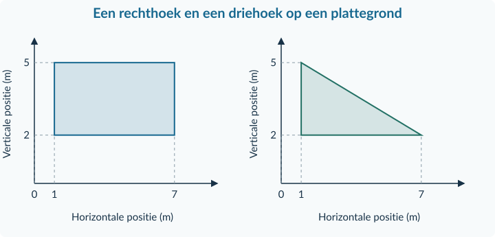

<!-- PAGE {"section": "1.1.4", "title": "De gereedschappen samen gebruiken"} -->

1.1.4 · BOEK 1 · TWEEDE EDITIE
<h1 class="paragraph-title" id="p114">Gemengde opgaven: economisch denken en rekenen</h1>
Een langere opgave bevat vaak meerdere bronnen. Niet elk getal is bij elke vraag nodig. Je kiest nu zelf welke informatie en welke rekenstap bij de vraag passen. Er komt geen nieuwe theorie bij.

<strong>Een vaste aanpak</strong>

<strong>Lees → selecteer → werk uit → controleer.</strong> Benoem bij een keuze het middel en het doel. Zet bij een berekening de eenheid en de vergelijkingsbasis. Controleer bij een grafiek de assen en de waarden.

### Een bron kiezen: een uitgewerkt voorbeeld

Een wijkcentrum heeft twee aparte beslissingen. Voor de middag kiest het een activiteit. Voor een losstaand avondprogramma beoordeelt het een prijswijziging.

<table class=""><thead><tr><th>Bron</th><th>Gegeven informatie</th></tr></thead><tbody><tr><td>A · Middag</td><td>Eén zaal, 2 uur. Activiteit X laat € 40 per uur over; activiteit Y € 55 per uur. Beide vragen alle beschikbare tijd. Doel: meeste geld.</td></tr><tr><td>B · Avondprijs</td><td>Dezelfde avondkaart gaat van € 8 naar € 10.</td></tr><tr><td>C · Bezoekers</td><td>Een model verwacht 80 bezoekers bij € 8 en 60 bij € 10. Tussen die punten geldt een rechte lijn.</td></tr></tbody></table>
<strong>Welke middagactiviteit past bij het doel?</strong> Gebruik bron A. X: 2 × € 40 = € 80. Y: 2 × € 55 = € 110. Kies Y; de alternatieve kosten zijn € 80 uit X. De avondprijs uit B hoort niet bij deze keuze.

<strong>Met hoeveel procent stijgt de avondprijs?</strong> Gebruik bron B. (10 − 8) / 8 × 100% = <strong>25%</strong>. Gebruik niet het bezoekersaantal als noemer.

<strong>Hoeveel bezoekers verwacht het model bij € 9?</strong> Gebruik bron C. Halverwege € 8 en € 10 ligt het midden tussen 80 en 60: <strong>70 bezoekers</strong>. Dat blijft een voorspelling onder de genoemde aanname.

<strong>Een conclusie is meer dan een getal</strong>

“Volgens bron C verwacht het model bij € 9 ongeveer 70 bezoekers, als de andere omstandigheden gelijk blijven.” Deze zin noemt het resultaat, de bron en de beperking.

<!-- PAGE {"section": "1.1.4", "title": "Zelf methoden combineren"} -->

## Gemengde oefening

<h3>Opgave 34 · Meer bekers inkopen</h3>
Een activiteitencommissie kocht vorig jaar 200 gelijke drinkbekers voor samen € 60. Dit jaar koopt zij 250 bekers van hetzelfde type voor samen € 80.

a.

Bereken de betaalde prijs per beker in beide jaren.

b.

Bereken de procentuele verandering van de prijs per beker.

c.

Het totaalbedrag steeg met 33,33%. Bewijst dit dat een beker 33,33% duurder werd? Leg uit.

d.

Bereken de index van de huidige prijs per beker met vorig jaar = 100.

<h3>Opgave 35 · Een lokaal op woensdagavond</h3>
Een wijkvereniging heeft één lokaal, drie uur lang. Zij kiest een beweegles óf een taalcafé; ieder programma vult de hele avond. Het doel is zoveel mogelijk geld voor een project overhouden. Na alle uitgaven blijft bij de beweegles € 50 per uur over; bij het taalcafé € 70.

a.

Bereken de twee totaalbedragen en kies het programma dat bij het doel past.

b.

Noem de alternatieve kosten. Bereken ook hoeveel procent het gekozen totaal boven het andere totaal ligt.

<!-- PAGE {"section": "1.1.4", "title": "Bronnen bij de doeloefening"} -->

Doeloefening · Bronnen bij opgave 36

<strong>Eén school, twee beslissingen.</strong> De middagactiviteit en de avondvoorstelling zijn afzonderlijke plannen. Ze vinden niet in hetzelfde tijdvak plaats. Gebruik per vraag de passende bron. De vragen staan op de pagina hiernaast.

<strong>Bron A · Middagactiviteit</strong>

De aula is twee uur beschikbaar. De school kiest een boekenruil óf een cultuuratelier. Elk plan vraagt de volledige twee uur. Ze kunnen niet worden gecombineerd. Beide plannen zijn uitvoerbaar. Het doel is <strong>het hoogste bedrag voor een goed doel</strong>. De bedragen in de tabel zijn wat na alle uitgaven overblijft.

<table class=""><thead><tr><th>Plan</th><th>Bedrag over per uur</th></tr></thead><tbody><tr><td>Boekenruil</td><td>€ 60</td></tr><tr><td>Cultuuratelier</td><td>€ 75</td></tr></tbody></table>

<strong>Bron B · Een aparte avondvoorstelling</strong>

Voor de avond stelt de commissie een ticketprijs voor. Het onderstaande model voorspelt het aantal bezoekers. Andere omstandigheden blijven gelijk. Tussen de drie punten neemt de commissie een rechte lijn aan. De zaal heeft voldoende plaatsen voor alle getoonde aantallen.

<table class=""><thead><tr><th>Ticketprijs P (€ per bezoeker)</th><th>4</th><th>6</th><th>8</th></tr></thead><tbody><tr><td>Verwacht aantal Q (per avond)</td><td>180</td><td>140</td><td>100</td></tr></tbody></table>
Een voorstel is een prijs van <strong>€ 7</strong>. Voor de beoordeling van dit voorstel is het doel: <strong>minstens 130 bezoekers</strong>.

<strong>Bron C · Prijsvergelijking tussen jaren</strong>

De prijs voor dezelfde jaarlijkse voorstelling was in het basisjaar € 4, in jaar 2 € 4,80 en in jaar 3 € 6. Gebruik het basisjaar als index 100. Dit is een vergelijking tussen jaren, niet de prijskeuze van € 7 uit bron B.

Een bericht stelt: “De prijsindex stijgt van jaar 2 naar jaar 3 met 30 punten. Een ticket is dus 30% duurder geworden.”

Alle bronnen zijn geconstrueerde gegevens voor deze opgave.

<!-- PAGE {"section": "1.1.4", "title": "Doeloefening"} -->

## Doeloefening

<h3>Opgave 36 · Een schoolactiviteit plannen</h3>
Gebruik de bronnen op de pagina hiernaast. Schrijf bij elke berekening welke waarden je gebruikt en geef de juiste eenheid.

a.

Leg met bron A uit waarom de school moet kiezen. Bereken beide totaalbedragen en bepaal welk plan bij het doel past.

b.

Noem de alternatieve kosten van de keuze uit a. Verklaar waarom het verschil tussen beide geldbedragen niet hetzelfde is.

c.

Teken met bron B zelf een grafiek op ruitjespapier. Benoem de assen en eenheden, kies een schaal en teken de punten en rechte lijnstukken.

d.

Bepaal met lineaire interpolatie het verwachte aantal bezoekers bij een ticketprijs van € 7.

e.

Bereken met bron C de prijsindexcijfers van jaar 2 en jaar 3. Bereken vervolgens de procentuele prijsverandering tussen die twee jaren.

f.

Beoordeel het bericht in bron C. Schrijf een verbeterde zin.

g.

Past het prijsvoorstel van € 7 bij het doel in bron B? Geef een advies met het berekende aantal en één beperking van het model.

<!-- PAGE {"section": "1.1.4", "title": "Extra gemengde oefening"} -->

## Extra gemengde oefening

<h3>Opgave 37 · Een formule en twee vormen</h3>
Voor materiaalhuur geldt T = 12 + 3n. T is het bedrag in euro en n het aantal sets, van 0 tot en met 25. De figuur is een aparte plattegrond; beide assen geven posities in meters aan.

<figure class="compact"><figcaption>Figuur 22 · Gebruik voor beide vormen dezelfde basis en hoogte.</figcaption></figure>
a.

Bereken het bedrag voor 4 sets en het aantal sets dat hoort bij € 42. Controleer de teruggerekende waarde.

b.

Bereken de basis en hoogte en daarna de twee gekleurde oppervlaktes.

<h3>Opgave 38 · Herstel de fout</h3>
Hieronder staan drie antwoorden van leerlingen. Herstel per geval de fout en leg in één zin uit wat er misging.

a.

“Van 100 naar 80 is −25%, want 20 / 80 × 100 = 25.”

b.

“Een rechthoek loopt verticaal van 2 tot 6 meter en is 5 meter breed, dus de oppervlakte is 30 m².”

c.

“Er kwamen meer bezoekers nadat er posters waren opgehangen. De tabel bewijst dat de posters de stijging veroorzaakten.”

