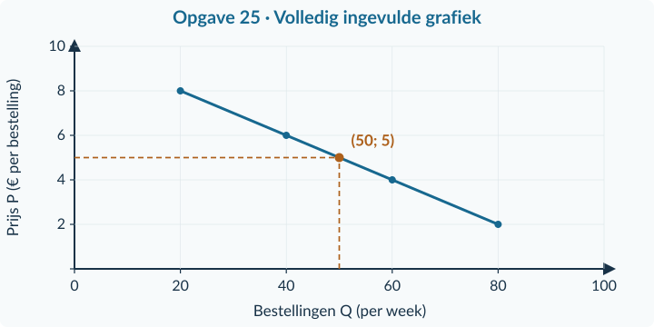
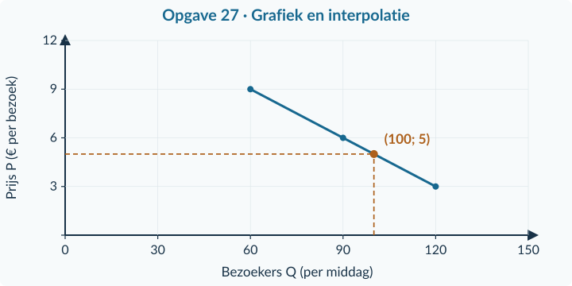
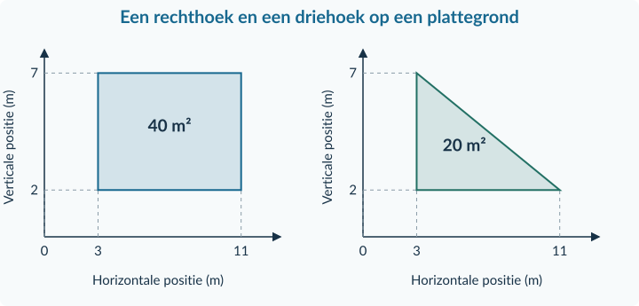
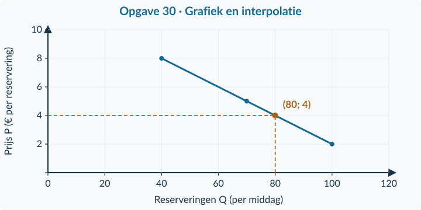
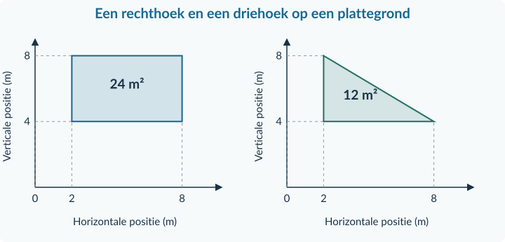
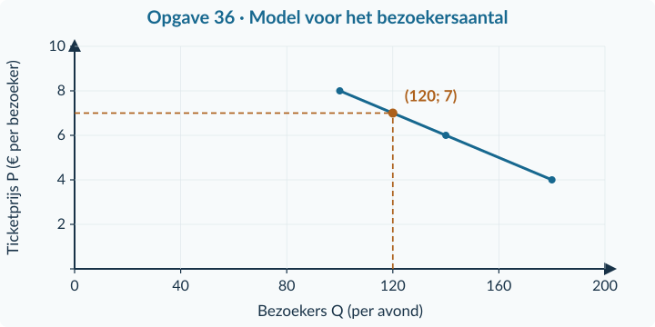
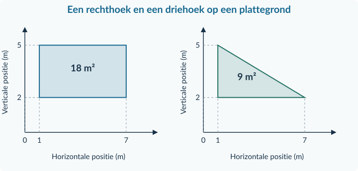

<!-- PAGE {"section": "Antwoorden", "title": "Zo gebruik je dit antwoordboek"} -->

BOEK 1 · TWEEDE EDITIE · HOOFDSTUK 1
<h1>Antwoorden Economisch denken en rekenen</h1>
Dit antwoordboek hoort bij het leerlinghoofdstuk van 40 pagina’s. Het bevat de antwoorden op <strong>38 opgaven met 100 deelvragen</strong>. De antwoorden bij de denkertjes geven één verdedigbaar voorbeeld; andere goed onderbouwde antwoorden zijn mogelijk.

<table class=""><thead><tr><th>Paragraaf</th><th>Opgaven</th><th>Pagina in dit antwoordboek</th></tr></thead><tbody><tr><td>1.1.1 Schaarste, keuzes en alternatieve kosten</td><td>1–9</td><td>2</td></tr><tr><td>1.1.2 Verhoudingen, percentages en indexcijfers</td><td>10–21</td><td>5</td></tr><tr><td>1.1.3 Tabellen, grafieken en formules</td><td>22–33</td><td>10</td></tr><tr><td>1.1.4 Gemengde opgaven</td><td>34–38</td><td>17</td></tr></tbody></table>

<strong>Vergelijk je werkwijze</strong>

Kijk niet alleen naar het laatste getal. Vergelijk de gekozen bron, de basis van de vergelijking, de berekening en de eenheid. De toelichting bij “Waarom” legt uit wat de rekenstap betekent.

<strong>Afronden</strong>

Rond geldbedragen zo nodig af op centen. Rond percentages en indexcijfers zo nodig af op twee decimalen. Gebruik ongeronde tussenuitkomsten. “−20%” en “een daling met 20%” drukken dezelfde verandering uit.

Bij een grafiek is een andere nette schaal toegestaan wanneer alle punten, eenheden en vereiste aflezingen kloppen. De antwoordfiguren zijn niet bedoeld om zonder nadenken over te nemen.

Alle economische situaties en cijfers zijn geconstrueerde lesvoorbeelden; het zijn geen uitspraken over actuele prijzen, tarieven of gebeurtenissen.

<!-- PAGE {"section": "1.1.1", "title": "Start en begeleide inoefening"} -->

<h2 id="ant111">1.1.1 · Schaarste en keuzes</h2><h3 id="ans1">Opgave 1 · Eenheden ophalen</h3>

<strong>a.</strong> 3 uur × € 8 per uur = <strong>€ 24</strong>.

<strong>Waarom:</strong> Door met uren te vermenigvuldigen, maak je van een bedrag per uur een totaalbedrag.

<strong>b.</strong> € 30 − € 24 = <strong>€ 6</strong>.

<strong>Waarom:</strong> Beide bedragen gaan over hetzelfde tijdvak; daardoor kun je ze vergelijken.

<h3 id="ans2">Opgave 2 · Een gratis schoolplein</h3>

<strong>a.</strong> De <strong>ruimte op het plein tijdens die pauze</strong> is beperkt. De twee gewenste activiteiten passen er niet tegelijk.

<strong>Waarom:</strong> Een middel kan schaars zijn zonder dat je ervoor betaalt.

<strong>b.</strong> De <strong>sportactiviteit in die pauze</strong> vervalt. De waarde daarvan is de alternatieve kost.

<strong>Waarom:</strong> Je vergelijkt het gekozen gebruik met het andere haalbare gebruik.

<h3 id="ans3">Opgave 3 · Lees de ingevulde keuze</h3>

<strong>a.</strong> <strong>€ 150</strong>, de netto opbrengst van productfoto’s in dezelfde middag.

<strong>Waarom:</strong> Dat is het beste haalbare alternatief dat door de portretmiddag vervalt.

<strong>b.</strong> € 180 − € 150 = € 30 is de <strong>extra netto opbrengst</strong> van de gekozen activiteit. De gemiste activiteit zelf levert € 150 op.

<strong>Waarom:</strong> Alternatieve kosten meten wat je opgeeft, niet hoeveel beter de gekozen optie scoort.

<h3 id="ans4">Opgave 4 · De moestuin</h3>

<strong>a.</strong> Kruiden: 8 × € 5 = <strong>€ 40</strong>. Bloemen: 8 × € 7 = <strong>€ 56</strong>.

<strong>Waarom:</strong> De twee totalen hebben betrekking op dezelfde acht bedden.

<strong>b.</strong> Kies <strong>bloemen</strong>. De alternatieve kosten zijn <strong>€ 40</strong> uit kruiden.

<strong>Waarom:</strong> Het gekozen gebruik maakt het andere gebruik van de bedden onmogelijk.

<!-- PAGE {"section": "1.1.1", "title": "Zelfstandig en doelopgave"} -->

<h3 id="ans5">Opgave 5 · Een weekendklus</h3>

<strong>a.</strong> Oppassen: 4 × € 9 = € 36. Verhuizen: 4 × € 11 = € 44. Kies <strong>verhuizen</strong>.

<strong>Waarom:</strong> De totale inkomsten zijn dan het hoogst.

<strong>b.</strong> De alternatieve kosten zijn <strong>€ 36</strong>, de misgelopen oppasvergoeding. Noor betaalt die € 36 aan niemand.

<strong>Waarom:</strong> Het bedrag beschrijft de inkomsten die zij niet kan verdienen tijdens het verhuizen.

<h3 id="ans6">Opgave 6 · Een middag voor de buurt</h3>

<strong>a.</strong> De <strong>sportmiddag</strong>, want 40 &gt; 30. Dezelfde vrijwilligerstijd kan niet beide activiteiten begeleiden.

<strong>Waarom:</strong> Je vergelijkt deelname omdat dat het opgegeven doel is.

<strong>b.</strong> Onjuist. De creatieve middag voor 30 deelnemers is het opgegeven alternatief. De waarde van die gemiste activiteit hoeft niet in euro’s te zijn uitgedrukt.

<strong>Waarom:</strong> Alternatieve kosten kunnen ook bestaan uit gemiste tijd, deelname of plezier.

<h3 id="ans7">Opgave 7 · Eén aula, twee plannen</h3>

<strong>a.</strong> De <strong>aula gedurende die drie uur</strong> is schaars. Beide activiteiten vragen hetzelfde tijdvak en kunnen niet worden gecombineerd.

<strong>Waarom:</strong> De school kan niet aan beide wensen tegelijk voldoen met de beschikbare ruimte.

<strong>b.</strong> Muziek: 3 × € 70 = <strong>€ 210</strong>. Ruilmarkt: 3 × € 90 = <strong>€ 270</strong>. Kies de <strong>ruilmarkt</strong>.

<strong>Waarom:</strong> Bij het gelddoel telt het totale bedrag voor het goede doel.

<strong>c.</strong> De <strong>muziekmiddag</strong> wordt opgegeven. De alternatieve kosten zijn <strong>€ 210</strong>, niet € 60.

<strong>Waarom:</strong> € 210 is de waarde van het beste andere haalbare gebruik; € 60 is alleen het verschil.

<strong>d.</strong> De huurbetaling is € 0. Toch vervalt de muziekmiddag die € 210 kon opleveren. Er zijn dus wel alternatieve kosten.

<strong>Waarom:</strong> Gratis toegang tot een middel neemt het keuzeprobleem niet weg.

<strong>e.</strong> De <strong>muziekmiddag</strong>: 90 deelnemers in plaats van 60.

<strong>Waarom:</strong> Een ander doel kan bij dezelfde mogelijkheden tot een andere keuze leiden.

<!-- PAGE {"section": "1.1.1", "title": "Denkertje en herhaling"} -->

<h3 id="ans8">Opgave 8 · Twee verdedigbare keuzes</h3>

<strong>a.</strong> <strong>Voorbeeldantwoord.</strong> “Kies de voorstelling als extra geld voor de kas het doel is: € 300 tegenover € 0. Je geeft de kennismakingsavond voor 90 bezoekers op. Kies de kennismakingsavond als het doel is meer mensen te bereiken: 90 tegenover 50. Je geeft dan de voorstelling en de mogelijke € 300 op. De cijfers beschrijven de opties, maar bepalen niet welk doel de vereniging het belangrijkst vindt.”

<strong>Beoordelingscriteria</strong>
<ul><li>Twee verschillende, expliciete doelen leiden tot twee verschillende adviezen.</li><li>Elk advies gebruikt het relevante gegeven en benoemt het alternatief.</li><li>Geen verzonnen geldwaarde voor bereik of plezier; de conclusie erkent de rol van het doel.</li></ul>
<h3 id="ans9">Opgave 9 · Kort terughalen</h3>

<strong>a.</strong> 5 personen × 2 uur = <strong>10 vrijwilligersuren</strong>.

<strong>Waarom:</strong> Je telt de beschikbare tijd van alle vrijwilligers bij elkaar op.

<strong>b.</strong> De alternatieve kosten zijn <strong>€ 65</strong> uit de tweede activiteit. € 80 − € 65 = € 15 is het verschil.

<strong>Waarom:</strong> De tweede activiteit is het beste haalbare alternatief dat vervalt.

<strong>Veelgemaakte verwarring</strong>

Bij € 180 tegenover € 150 zijn de alternatieve kosten van de eerste optie € 150. Het verschil van € 30 is de extra uitkomst. Bij een gratis activiteit kunnen tijd en ruimte nog steeds een andere waardevolle toepassing hebben.

<!-- PAGE {"section": "1.1.2", "title": "Start en begeleide inoefening"} -->

<h2 id="ant112">1.1.2 · Verhoudingen en veranderingen</h2><h3 id="ans10">Opgave 10 · Eerst delen en aftrekken</h3>

<strong>a.</strong> € 72 / 24 = <strong>€ 3 per werkboekje</strong>.

<strong>Waarom:</strong> De totale prijs wordt verdeeld over 24 gelijke boekjes.

<strong>b.</strong> 24 − 20 = <strong>4 leerlingen meer</strong>.

<strong>Waarom:</strong> Dit is een verandering in personen, nog geen percentage.

<h3 id="ans11">Opgave 11 · Welke basis gebruik je?</h3>

<strong>a.</strong> Door <strong>40</strong>, de oude prijs.

<strong>Waarom:</strong> Je meet hoe groot de verandering is ten opzichte van de uitgangssituatie.

<strong>b.</strong> <strong>6 procentpunten</strong>.

<strong>Waarom:</strong> Je trekt twee percentages van elkaar af.

<strong>c.</strong> 1 + 8 / 100 = <strong>1,08</strong>.

<strong>Waarom:</strong> De oude 100% blijft bestaan en daar komt 8% bij.

<h3 id="ans12">Opgave 12 · Lees de ingevulde prijsstijging</h3>

<strong>a.</strong> (60 − 48) / 48 × 100% = 12 / 48 × 100% = <strong>25%</strong>.

<strong>Waarom:</strong> De toename is een kwart van de oude € 48.

<strong>b.</strong> € 60 × (1 − 10 / 100) = € 60 × 0,90 = <strong>€ 54</strong>.

<strong>Waarom:</strong> De korting wordt berekend over de prijs van € 60.

<!-- PAGE {"section": "1.1.2", "title": "Indexen en twee veranderingen"} -->

<h3 id="ans13">Opgave 13 · De vaste basis blijft staan</h3>

<strong>a.</strong> Jaar 2: 24 / 20 × 100 = <strong>120</strong>. Jaar 3: 30 / 20 × 100 = <strong>150</strong>.

<strong>Waarom:</strong> Dezelfde basis maakt de indexcijfers vergelijkbaar.

<strong>b.</strong> 150 − 120 = <strong>30 indexpunten</strong>. (150 − 120) / 120 × 100% = <strong>25%</strong>.

<strong>Waarom:</strong> Voor de groei vanaf jaar 2 is 120 de oude waarde, ook al blijft het basisjaar 1.

<h3 id="ans14">Opgave 14 · Twee veranderingen tegelijk</h3>

<strong>a.</strong> 0,24 × 100 = <strong>24 deelnemers</strong>.

<strong>Waarom:</strong> Het totale ledental blijft in deze tussenvergelijking gelijk.

<strong>b.</strong> 0,20 × 150 = <strong>30 deelnemers</strong>.

<strong>Waarom:</strong> Het aandeel blijft in deze tussenvergelijking gelijk.

<strong>c.</strong> Oud: 0,20 × 100 = <strong>20</strong>. Nieuw: 0,24 × 150 = <strong>36 deelnemers</strong>. Ze versterken elkaar.

<strong>Waarom:</strong> Zowel meer leden als een hoger aandeel vergroot het aantal deelnemers.

<strong>d.</strong> (36 − 20) / 20 × 100% = <strong>80%</strong> groei van het aantal.

<strong>Waarom:</strong> Een aandeel en een aantal hebben verschillende vergelijkingsbases. Bovendien verandert het totale ledental.

<!-- PAGE {"section": "1.1.2", "title": "Zelfstandige oefening"} -->

<h3 id="ans15">Opgave 15 · Een tekenpakket</h3>

<strong>a.</strong> € 144 / 18 = <strong>€ 8 per pakket</strong>.

<strong>Waarom:</strong> Alle pakketten zijn gelijk en delen samen het totaalbedrag.

<strong>b.</strong> 8 − 10 = <strong>−€ 2 per pakket</strong>. (8 − 10) / 10 × 100% = <strong>−20%</strong>.

<strong>Waarom:</strong> De daling wordt vergeleken met de oude prijs van € 10.

<strong>c.</strong> € 8 × 1,125 = <strong>€ 9 per pakket</strong>.

<strong>Waarom:</strong> 12,5% wordt toegevoegd aan de huidige prijs, niet aan de eerdere € 10.

<h3 id="ans16">Opgave 16 · Een indexbericht</h3>

<strong>a.</strong> 121 − 110 = <strong>11 indexpunten</strong>. 11 / 110 × 100% = <strong>10%</strong>.

<strong>Waarom:</strong> De oude index van deze verandering is 110.

<strong>b.</strong> € 4 × 121 / 100 = <strong>€ 4,84</strong>.

<strong>Waarom:</strong> Index 121 is 121% van de basisprijs.

<strong>c.</strong> Nee. <strong>21%</strong> is de stijging ten opzichte van <strong>jaar 1</strong>. Ten opzichte van jaar 2 is de stijging <strong>10%</strong>.

<strong>Waarom:</strong> De uitspraak noemt de verkeerde vergelijkingsperiode.

<h3 id="ans17">Opgave 17 · Lid van een debatclub</h3>

<strong>a.</strong> 30 / 150 × 100% = <strong>20%</strong>. 45 / 180 × 100% = <strong>25%</strong>.

<strong>Waarom:</strong> Elk aandeel gebruikt het totale aantal leerlingen van hetzelfde jaar.

<strong>b.</strong> 25 − 20 = <strong>5 procentpunten</strong>. (25 − 20) / 20 × 100% = <strong>25%</strong>.

<strong>Waarom:</strong> Het eerste antwoord is een verschil tussen percentages; het tweede vergelijkt dat verschil met het oude aandeel.

<!-- PAGE {"section": "1.1.2", "title": "Doeloefening"} -->

<h3 id="ans18">Opgave 18 · Een workshop voor scholieren</h3>

<strong>a.</strong> € 216 / 36 = <strong>€ 6 per deelnemer</strong>.

<strong>Waarom:</strong> Een bedrag per deelnemer is het totaal verdeeld over de deelnemers.

<strong>b.</strong> € 12 − € 10 = <strong>€ 2</strong>. (12 − 10) / 10 × 100% = <strong>20%</strong>.

<strong>Waarom:</strong> De oude prijs in deze vergelijking is € 10.

<strong>c.</strong> € 15 × 1,08 = <strong>€ 16,20</strong>.

<strong>Waarom:</strong> De aangekondigde verhoging is 8% van de prijs van jaar 3.

<strong>d.</strong> Jaar 2: 12 / 10 × 100 = <strong>120</strong>. Jaar 3: 15 / 10 × 100 = <strong>150</strong>.

<strong>Waarom:</strong> De twee indexcijfers hebben dezelfde prijs uit jaar 1 als basis.

<strong>e.</strong> 150 − 120 = <strong>30 indexpunten</strong>. (150 − 120) / 120 × 100% = <strong>25%</strong>.

<strong>Waarom:</strong> Het verschil van 30 wordt voor deze groei vergeleken met de oude index 120.

<strong>f.</strong> Jaar 1: 24 / 120 × 100% = <strong>20%</strong>. Jaar 3: 36 / 150 × 100% = <strong>24%</strong>. Verschil: <strong>4 procentpunten</strong>.

<strong>Waarom:</strong> Gebruik bij elk jaar zijn eigen totaal aantal leerlingen.

<strong>g.</strong> Het bericht is onjuist. (24 − 20) / 20 × 100% = <strong>20% relatieve stijging</strong> van het aandeel. Correct is ook: +4 procentpunten.

<strong>Waarom:</strong> Het bericht verwart een verschil in procentpunten met een procentuele verandering.

<!-- PAGE {"section": "1.1.2", "title": "Denkertje en herhaling"} -->

<h3 id="ans19">Opgave 19 · Welke groei bedoel je?</h3>

<strong>a.</strong> Het eerste museum groeide (144 − 120) / 120 × 100% = <strong>20%</strong>. Voor het tweede ontbreekt het oude aantal. Bij 2.000 oude bezoekers is +1.000 een groei van 50%; bij 10.000 oude bezoekers 10%. Het tweede museum kan dus relatief sterker of zwakker zijn gegroeid.

<strong>Beoordelingscriteria</strong>
<ul><li>Berekent 20% voor het eerste museum.</li><li>Benoemt het ontbrekende oude bezoekersaantal als beslissende informatie.</li><li>Gebruikt twee geldige voorbeelden met verschillende relatieve uitkomsten.</li></ul>
<h3 id="ans20">Opgave 20 · Het beste andere gebruik</h3>

<strong>a.</strong> Kies <strong>verhuur</strong>. De alternatieve kosten zijn <strong>€ 70</strong>, de gemiste opbrengst van de activiteit.

<strong>Waarom:</strong> Je geeft het beste andere gebruik van dezelfde ruimte op, niet alleen het verschil van € 20.

<h3 id="ans21">Opgave 21 · Een daling controleren</h3>

<strong>a.</strong> (60 − 80) / 80 × 100% = <strong>−25%</strong>. Controle: 80 × 0,75 = <strong>60 deelnemers</strong>.

<strong>Waarom:</strong> Een daling van 25% laat 75% van het oude aantal over.

<!-- PAGE {"section": "1.1.3", "title": "Start en grafieklezen"} -->

<h2 id="ant113">1.1.3 · Tabellen, grafieken en formules</h2><h3 id="ans22">Opgave 22 · Rekenen voor je tekent</h3>

<strong>a.</strong> (18 − 6) / 3 = 12 / 3 = <strong>4</strong>.

<strong>Waarom:</strong> De aftrekking wordt eerst uitgevoerd.

<strong>b.</strong> (40 − 50) / 50 × 100% = <strong>−20%</strong>.

<strong>Waarom:</strong> De oude 50 is de basis van de daling.

<h3 id="ans23">Opgave 23 · Een punt herkennen</h3>

<strong>a.</strong> <strong>(30; 5)</strong>: eerst Q, daarna P.

<strong>Waarom:</strong> De eerste coördinaat hoort bij de horizontale as.

<strong>b.</strong> De <strong>tijd, in maanden</strong>.

<strong>Waarom:</strong> De assen volgen het type bron; de prijs–hoeveelheidsafspraak geldt niet voor elke grafiek.

<h3 id="ans24">Opgave 24 · Eerst een grafiek lezen</h3>

<strong>a.</strong> <strong>60 verhuringen per dag</strong> bij € 4 per verhuring.

<strong>Waarom:</strong> Het punt op de lijn bij P = 4 ligt boven Q = 60.

<strong>b.</strong> € 5 ligt halverwege € 4 en € 6. Het midden tussen 60 en 30 is 60 − ½ × 30 = <strong>45</strong>.

<strong>Waarom:</strong> De gegeven rechte lijn laat een gelijkmatige verandering tussen de punten zien.

<!-- PAGE {"section": "1.1.3", "title": "Begeleide inoefening"} -->

<h3 id="ans25">Opgave 25 · Nu zelf aanvullen</h3>

<strong>a.</strong> Bij € 6 horen <strong>40 bestellingen per week</strong>: 60 − 20 = 40.

<strong>Waarom:</strong> Er is een gelijkmatige verandering van 20 per prijsstap van € 2 gegeven.

<strong>b.</strong> Zie de antwoordgrafiek: <strong>(80; 2), (60; 4), (40; 6), (20; 8)</strong> met rechte lijnstukken.

<strong>Waarom:</strong> De coördinaten zetten het aantal horizontaal en de prijs verticaal.

<strong>c.</strong> Bij P = € 5: <strong>50 bestellingen per week</strong>.

<strong>Waarom:</strong> € 5 ligt halverwege € 4 en € 6; 50 ligt halverwege 60 en 40.

<figure><figcaption>A1 · Opgave 25: alle punten, lijnstukken en hulplijnen.</figcaption></figure><h3 id="ans26">Opgave 26 · Zonder ingevulde tekening</h3>

<strong>a.</strong> Eerst <strong>5 aftrekken</strong>, daarna <strong>delen door 4</strong>. n = (25 − 5) / 4 = <strong>5 ritten</strong>. Controle: 5 + 4 × 5 = € 25.

<strong>Waarom:</strong> Je maakt de bewerkingen van de formule in omgekeerde volgorde ongedaan.

<strong>b.</strong> Hoogte: 6 − 2 = <strong>4 meter</strong>. Oppervlakte: 5 × 4 = <strong>20 m²</strong>.

<strong>Waarom:</strong> Een hoogte is de afstand tussen onderkant en bovenkant.

<strong>c.</strong> € 7 ligt halverwege € 6 en € 8. Q = 40 − ½ × (40 − 20) = <strong>30 eenheden</strong>.

<strong>Waarom:</strong> Het model is rechtlijnig; dezelfde fractie van het prijsverschil hoort bij dezelfde fractie van het hoeveelheidverschil.

<!-- PAGE {"section": "1.1.3", "title": "Zelfstandig tekenen"} -->

<h3 id="ans27">Opgave 27 · Bezoek aan een uitkijktoren</h3>

<strong>a.</strong> Zie de antwoordgrafiek met <strong>(120; 3), (90; 6), (60; 9)</strong>. De assen starten bij 0 en hebben gelijkmatige schalen.

<strong>Waarom:</strong> De grafiek geeft dezelfde combinaties van prijs en aantal als de bron.

<strong>b.</strong> € 5 ligt 2 / 3 van het stuk tussen € 3 en € 6. Q = 120 − (2 / 3) × (120 − 90) = <strong>100 bezoekers per middag</strong>.

<strong>Waarom:</strong> Je neemt dezelfde fractie van het aantalverschil als van het prijsverschil.

<strong>c.</strong> (90 − 120) / 120 × 100% = <strong>−25%</strong>. De uitspraak is onjuist.

<strong>Waarom:</strong> 30 bezoekers minder is 25% van het oude aantal 120, niet 30%.

<strong>d.</strong> Aantalverschil / prijsverschil = 60 / (9 − 3) = <strong>10 bezoekers minder per euro prijsstijging</strong>.

<strong>Waarom:</strong> De prijsstap is € 6. Het totale aantalverschil hoort dus niet bij één euro.

<figure><figcaption>A2 · Opgave 27: Q = 100 bij P = € 5; de bronwaarden zijn behouden.</figcaption></figure>

<!-- PAGE {"section": "1.1.3", "title": "Zelfstandig rekenen en meten"} -->

<h3 id="ans28">Opgave 28 · Materiaal voor een foto-opdracht</h3>

<strong>a.</strong> n = 0: 10 + 2,5 × 0 = <strong>€ 10</strong>. n = 4: <strong>€ 20</strong>. n = 12: <strong>€ 40</strong>.

<strong>Waarom:</strong> De formule bestaat uit € 10 plus een bedrag dat met het aantal meeverandert.

<strong>b.</strong> 35 = 10 + 2,5n → 25 = 2,5n → n = <strong>10 lichtsets</strong>. Controle: 10 + 2,5 × 10 = € 35.

<strong>Waarom:</strong> Dezelfde rekenregel moet de gevonden hoeveelheid terug vertalen naar € 35.

<strong>c.</strong> Bij n = 4 is T = € 20; bij n = 8 is T = 10 + 2,5 × 8 = <strong>€ 30</strong>. Het bedrag verdubbelt niet.

<strong>Waarom:</strong> De term 10 wordt niet verdubbeld als alleen n verdubbelt.

<h3 id="ans29">Opgave 29 · Ruimte op een plattegrond</h3>

<strong>a.</strong> Basis = 11 − 3 = <strong>8 m</strong>. Hoogte = 7 − 2 = <strong>5 m</strong>. Rechthoek = 8 × 5 = <strong>40 m²</strong>. Driehoek = ½ × 8 × 5 = <strong>20 m²</strong>.

<strong>Waarom:</strong> De twee vormen delen dezelfde afstanden; de driehoek is de helft van de rechthoek.

<strong>b.</strong> De onderkant ligt op 2 meter. De afstand tot de bovenkant op 7 meter is <strong>5 meter</strong>.

<strong>Waarom:</strong> Een positie op de as is niet hetzelfde als de grootte van een vorm.

<figure><figcaption>A3 · Opgave 29: de rechthoek is 40 m², de driehoek 20 m².</figcaption></figure>

<!-- PAGE {"section": "1.1.3", "title": "Doeloefening · bron A"} -->

<h3 id="ans30">Opgave 30 · Reserveren, huren en meten</h3>

<strong>a.</strong> Zie de antwoordgrafiek: <strong>(100; 2), (70; 5), (40; 8)</strong>. Q staat horizontaal in reserveringen per middag; P verticaal in euro per reservering.

<strong>Waarom:</strong> Je neemt de waarden uit één rij/kolomcombinatie samen, zonder de assen om te draaien.

<strong>b.</strong> Q = 100 − (4 − 2) / (5 − 2) × (100 − 70) = 100 − 20 = <strong>80 reserveringen per middag</strong>.

<strong>Waarom:</strong> € 4 ligt op twee derde van het prijsinterval € 2–€ 5.

<strong>c.</strong> (70 − 100) / 100 × 100% = <strong>−30%</strong>, dus de uitspraak is onjuist.

<strong>Waarom:</strong> Je deelt de afname door het oude aantal 100. Delen door het nieuwe aantal 70 zou de verkeerde basis gebruiken.

<figure><figcaption>A4 · Opgave 30a–c: de interpolatie ligt op het gegeven rechte segment.</figcaption></figure>

<!-- PAGE {"section": "1.1.3", "title": "Doeloefening · bron B en C"} -->

<h3 id="ans30cont">Opgave 30 · Reserveren, huren en meten — vervolg</h3>

<strong>d.</strong> T = 8 + 2 × 6 = <strong>€ 20</strong>.

<strong>Waarom:</strong> Vermenigvuldig het aantal eerst met 2 en tel daarna 8 op.

<strong>e.</strong> 32 = 8 + 2n → 24 = 2n → n = <strong>12 lampjes</strong>. Controle: 8 + 2 × 12 = € 32.

<strong>Waarom:</strong> De teruggevonden waarde geeft het gevraagde bedrag en ligt tussen 0 en 30.

<strong>f.</strong> Basis = 8 − 2 = <strong>6 m</strong>. Hoogte = 8 − 4 = <strong>4 m</strong>. Rechthoek = 6 × 4 = <strong>24 m²</strong>.

<strong>Waarom:</strong> De hoogte begint bij 4 meter, niet bij 0.

<strong>g.</strong> Driehoek = ½ × (8 − 2) × (8 − 4) = ½ × 6 × 4 = <strong>12 m²</strong>.

<strong>Waarom:</strong> Bij dezelfde basis en hoogte is de driehoek half zo groot als de rechthoek.

<figure><figcaption>A5 · Opgave 30f–g: gebruik de verschillen tussen de asposities.</figcaption></figure>

<!-- PAGE {"section": "1.1.3", "title": "Denkertje en herhaling"} -->

<h3 id="ans31">Opgave 31 · Wat gebeurde er tussendoor?</h3>

<strong>a.</strong> Bijvoorbeeld <strong>20, 30, 40, 50, 60</strong> en <strong>20, 25, 30, 45, 60</strong>. Beide hebben de gegeven eindpunten en dalen niet. Voor precies 40 op dag 3 is een <strong>gelijkmatige, lineaire toename</strong> tussen dag 1 en 5 nodig.

<strong>Beoordelingscriteria</strong>
<ul><li>Beide reeksen hebben de gegeven eindwaarden en dalen niet.</li><li>De twee dag-3-waarden verschillen.</li><li>Noemt de lineariteitsaanname en presenteert de tussenwaarde niet als meting.</li></ul>
<h3 id="ans32">Opgave 32 · Indexpunten zijn geen procenten</h3>

<strong>a.</strong> 100 − 125 = <strong>−25 indexpunten</strong>. (100 − 125) / 125 × 100% = <strong>−20%</strong>.

<strong>Waarom:</strong> 125 is de oude index; de daling met 25 punten is daarvan een vijfde.

<h3 id="ans33">Opgave 33 · Een opgegeven klus</h3>

<strong>a.</strong> 2 × € 9 = <strong>€ 18</strong>. Het sporten heeft geen toegangsprijs, maar sluit het werken in diezelfde twee uur uit.

<strong>Waarom:</strong> Een gratis activiteit kan dus wel gemiste inkomsten als alternatieve kosten hebben.

<!-- PAGE {"section": "1.1.4", "title": "Gemengde oefening"} -->

<h2 id="ant114">1.1.4 · Gemengde opgaven</h2><h3 id="ans34">Opgave 34 · Meer bekers inkopen</h3>

<strong>a.</strong> Vorig jaar: € 60 / 200 = <strong>€ 0,30 per beker</strong>. Dit jaar: € 80 / 250 = <strong>€ 0,32 per beker</strong>.

<strong>Waarom:</strong> Je deelt ieder totaalbedrag door het aantal bekers uit hetzelfde jaar.

<strong>b.</strong> (0,32 − 0,30) / 0,30 × 100% = <strong>6,67%</strong>.

<strong>Waarom:</strong> Voor een prijsverandering vergelijk je de bedragen per beker, niet de twee totalen.

<strong>c.</strong> Nee. Het aantal ingekochte bekers is ook gestegen: 200 → 250. Een beker werd <strong>6,67%</strong> duurder, niet 33,33%.

<strong>Waarom:</strong> Een totaal kan veranderen doordat het aantal én het bedrag per eenheid veranderen.

<strong>d.</strong> 0,32 / 0,30 × 100 = <strong>106,67</strong>.

<strong>Waarom:</strong> De basisprijs € 0,30 krijgt index 100.

<h3 id="ans35">Opgave 35 · Een lokaal op woensdagavond</h3>

<strong>a.</strong> Beweegles: 3 × € 50 = <strong>€ 150</strong>. Taalcafé: 3 × € 70 = <strong>€ 210</strong>. Kies <strong>taalcafé</strong>.

<strong>Waarom:</strong> Beide opties gebruiken dezelfde ruimte gedurende dezelfde drie uur.

<strong>b.</strong> Alternatieve kosten: <strong>€ 150</strong> uit de beweegles. Procentuele meeropbrengst: (210 − 150) / 150 × 100% = <strong>40%</strong>.

<strong>Waarom:</strong> € 150 is het opgegeven alternatief. De 40% beschrijft een vergelijking van beide uitkomsten.

<!-- PAGE {"section": "1.1.4", "title": "Doeloefening · keuze en grafiek"} -->

<h3 id="ans36">Opgave 36 · Een schoolactiviteit plannen</h3>

<strong>a.</strong> De <strong>aula gedurende twee uur</strong> is beperkt; beide plannen vragen het hele tijdvak. Boekenruil: 2 × € 60 = <strong>€ 120</strong>. Cultuuratelier: 2 × € 75 = <strong>€ 150</strong>. Kies <strong>cultuuratelier</strong>.

<strong>Waarom:</strong> De hoogste totale opbrengst voor het goede doel is het opgegeven criterium.

<strong>b.</strong> De alternatieve kosten zijn <strong>€ 120</strong>, de gemiste boekenruil. € 150 − € 120 = € 30 is alleen het voordeel in geld ten opzichte van dat alternatief.

<strong>Waarom:</strong> De waarde van wat je laat liggen en het verschil tussen de opties beantwoorden verschillende vragen.

<strong>c.</strong> Zie de antwoordgrafiek met <strong>(180; 4), (140; 6), (100; 8)</strong>. Q staat horizontaal, in bezoekers per avond; P verticaal, in euro per bezoeker.

<strong>Waarom:</strong> De grafiek moet de gegevens uit bron B weergeven, niet de jaarvergelijking uit C.

<strong>d.</strong> € 7 ligt halverwege € 6 en € 8. Q = 140 − ½ × (140 − 100) = <strong>120 bezoekers per avond</strong>.

<strong>Waarom:</strong> Tussen de punten is expliciet een rechte lijn aangenomen.

<figure><figcaption>A6 · Opgave 36c–d: de grafiek hoort bij bron B, niet bij bron C.</figcaption></figure>

<!-- PAGE {"section": "1.1.4", "title": "Doeloefening · indexen en advies"} -->

<h3 id="ans36cont">Opgave 36 · Een schoolactiviteit plannen — vervolg</h3>

<strong>e.</strong> Jaar 2: 4,80 / 4 × 100 = <strong>120</strong>. Jaar 3: 6 / 4 × 100 = <strong>150</strong>. Groei: (150 − 120) / 120 × 100% = <strong>25%</strong>.

<strong>Waarom:</strong> Voor de index gebruikt elk jaar € 4; voor de groei vanaf jaar 2 gebruik je index 120.

<strong>f.</strong> “De prijsindex stijgt met <strong>30 indexpunten</strong>; een ticket wordt ten opzichte van jaar 2 <strong>25% duurder</strong>.”

<strong>Waarom:</strong> Een puntenverschil is pas een procentuele verandering nadat je door de oude waarde hebt gedeeld.

<strong>g.</strong> Volgens het model <strong>niet</strong>: bij € 7 worden <strong>120</strong> bezoekers verwacht, minder dan de gewenste 130. Advies: kies dit voorstel niet als dat bezoekersdoel leidend is. De verwachting hangt af van gelijkblijvende omstandigheden en de rechte-lijnaanname.

<strong>Waarom:</strong> Het model ondersteunt een voorwaardelijk advies, geen garantie over het werkelijke bezoekersaantal.

<strong>Een goed onderbouwd antwoord</strong>

Bron A ondersteunt de keuze voor de middag. Bron B ondersteunt het bezoekersadvies bij € 7. Bron C ondersteunt de prijsvergelijking tussen jaren. De gegevens zijn niet onderling uitwisselbaar.

<!-- PAGE {"section": "1.1.4", "title": "Extra gemengde oefening"} -->

<h3 id="ans37">Opgave 37 · Een formule en twee vormen</h3>

<strong>a.</strong> Bij 4 sets: 12 + 3 × 4 = <strong>€ 24</strong>. Bij € 42: 42 − 12 = 3n → n = <strong>10 sets</strong>. Controle: 12 + 3 × 10 = € 42.

<strong>Waarom:</strong> Invullen en terugrekenen zijn tegengestelde bewerkingen van dezelfde regel.

<strong>b.</strong> Basis = 7 − 1 = <strong>6 m</strong>; hoogte = 5 − 2 = <strong>3 m</strong>. Rechthoek = 6 × 3 = <strong>18 m²</strong>. Driehoek = ½ × 6 × 3 = <strong>9 m²</strong>.

<strong>Waarom:</strong> De oppervlakte volgt uit de afstanden, niet uit de hoogste aswaarden.

<figure><figcaption>A7 · Opgave 37b: basis 6 meter en hoogte 3 meter.</figcaption></figure><h3 id="ans38">Opgave 38 · Herstel de fout</h3>

<strong>a.</strong> (80 − 100) / 100 × 100% = <strong>−20%</strong>.

<strong>Waarom:</strong> De leerling deelde door de nieuwe waarde 80 in plaats van de oude 100.

<strong>b.</strong> Hoogte = 6 − 2 = 4 m. Oppervlakte = 5 × 4 = <strong>20 m²</strong>.

<strong>Waarom:</strong> De aspositie 6 werd ten onrechte gebruikt als de volledige hoogte.

<strong>c.</strong> De bron laat een volgorde en een stijging zien, maar bewijst zonder verdere informatie geen oorzaak.

<strong>Waarom:</strong> Een andere omstandigheid kan tegelijk veranderd zijn.

