<!-- PAGE {"section": "1.2", "title": "Inhoud · Vraag"} -->

BOEK 1 · TWEEDE EDITIE · HOOFDSTUK 2
<h1 class="cover-title">Vraag</h1>
Van één koopbeslissing naar de vraag van alle kopers.

<a href="#p121"><b>1.2.1 · Betalingsbereidheid en individuele vraag2</b>Wie wil wat kopen, en bij welke prijs?</a><a href="#p122"><b>1.2.2 · Vraagfactoren: bewegen of verschuiven?14</b>De eigen prijs en andere oorzaken uit elkaar houden.</a><a href="#p123"><b>1.2.3 · Van individuele naar collectieve vraag24</b>Hoeveelheden optellen bij dezelfde prijs.</a><a href="#p124"><b>1.2.4 · Gemengde opgaven: vraag34</b>Bronnen, berekeningen en grafieken combineren.</a>

<strong>Na dit hoofdstuk kun je</strong>
<ul><li>koopbeslissingen uitleggen met betalingsbereidheid;</li><li>met een vraagfunctie rekenen en een lijn met correcte snijpunten tekenen;</li><li>een eigen-prijsreactie onderscheiden van een verandering van andere vraagfactoren;</li><li>collectieve vraag bepalen, met nulbijdragen bij een te hoge prijs;</li><li>een berekening of grafiek verbinden met een precieze bronconclusie.</li></ul>
<h2>Waarom koopt niet iedereen evenveel?</h2>
Een lagere prijs kan je overhalen nog iets te kopen. Maar ook je inkomen, plannen en de prijs van een alternatief spelen mee. In dit hoofdstuk maak je die koopbeslissingen zichtbaar. De reken- en tekenstappen uit hoofdstuk 1.1 krijgen zo een nieuwe economische betekenis.

<strong>Werken met dit hoofdstuk</strong>

Lees eerst de uitleg en het uitgewerkte voorbeeld. Maak daarna de startopgaven. Begeleide inoefening is voor de meeste leerlingen de normale route. Heb je minder tussenstappen nodig en zoek je extra uitdaging, dan kun je de uitdagende route volgen. Beide routes leiden naar dezelfde doeloefening. Gebruik een schrift, rekenmachine, potlood en liniaal.

Alle situaties en cijfers zijn geconstrueerde lesvoorbeelden. Het zijn geen uitspraken over actuele prijzen of werkelijk gemeten gedrag. Antwoorden staan in het afzonderlijke antwoordboek.

<!-- PAGE {"section": "1.2.1", "title": "Van een wens naar een koopbeslissing"} -->

1.2.1 · BOEK 1 · TWEEDE EDITIE
<h1 class="paragraph-title" id="p121">Betalingsbereidheid en individuele vraag</h1>

<strong>Na deze paragraaf kun je</strong>
<ul><li>uitleggen welke eenheden iemand bij een gegeven prijs wil kopen;</li><li>met een vraagfunctie de hoeveelheid, de prijs en de snijpunten berekenen;</li><li>een lineaire vraaglijn tekenen en uitleggen wat zij wel en niet vertelt.</li></ul>

<strong>Koop je er nog één?</strong> Een portie aardbeien kost € 4. Voor haar eerste portie wil Sara maximaal € 10 betalen. Voor volgende porties heeft zij minder over. Is drie porties kopen dan vreemd?

<strong>Betalingsbereidheid</strong>

Het maximale bedrag dat een koper voor een bepaalde eenheid van een product wil betalen. In dit voorbeeld gaat elke balk over <strong>één extra portie</strong>.

<figure><figcaption>Figuur 1 · Sara heeft voor de eerste, tweede, derde en vierde portie respectievelijk € 10, € 7, € 4 en € 2 over.</figcaption></figure>
Sara koopt de eerste drie porties: telkens is haar betalingsbereidheid minstens € 4. Voor de vierde portie wil zij minder betalen dan de prijs.

<strong>Afspraak bij gelijkheid</strong>

In de voorbeelden met losse eenheden koopt iemand ook als de prijs precies gelijk is aan de betalingsbereidheid. Er is voldoende budget en het product is verkrijgbaar, tenzij de opgave iets anders zegt.

<!-- PAGE {"section": "1.2.1", "title": "Losse eenheden en het voordeel van kopen"} -->

Dezelfde koopbeslissingen kun je als een trapvorm laten zien. Elke trede hoort bij de betalingsbereidheid voor één extra portie. Bij € 4 passen drie porties bij Sara’s keuze.

<figure><figcaption>Figuur 2 · Dit is een hulpmiddel om losse beslissingen te begrijpen. Je hoeft deze trapvorm niet zelfstandig te construeren.</figcaption></figure>
Bij € 8 koopt Sara alleen de eerste portie. Bij € 6 koopt zij er twee. <strong>De prijs verandert; haar betalingsbereidheden blijven hier gelijk.</strong>

<strong>Eerste kennismaking · Consumentensurplus</strong>

Sara heeft voor de eerste portie € 10 over, maar betaalt € 4. Haar voordeel bij die aankoop is 10 − 4 = <strong>€ 6</strong>. Bij drie porties zijn de voordelen € 6, € 3 en € 0; samen <strong>€ 9</strong>. Dit heet consumentensurplus. Het is geen bedrag dat zij uitgekeerd krijgt.

Deze kennismaking helpt je de koopbeslissing te begrijpen. In Boek 2 leer je consumentensurplus verder berekenen en in een markt interpreteren. In de doelopgaven van dit hoofdstuk hoef je geen surplusoppervlakte te bepalen.

<strong>Niet elk verband is een rechte lijn</strong>

Vier afzonderlijke porties geven een trapvorm. Een vloeiende lijn past bijvoorbeeld bij deelbare hoeveelheden of bij een benadering. Een rechte lijn is een extra vereenvoudiging. Veel kopers samen leveren niet vanzelf een precies rechte lijn op.

<!-- PAGE {"section": "1.2.1", "title": "Een vraagfunctie met betekenis"} -->

<strong>Een andere situatie.</strong> Ravi koopt vers sap. We gebruiken voor hem een lineair model. q is de hoeveelheid sap in liter per maand; P is de prijs in euro per liter.

<strong>Individuele vraag</strong>

Het verband tussen de prijs en de hoeveelheid die <strong>één koper</strong> wil en kan kopen, terwijl alle andere omstandigheden gelijk blijven. Die afspraak heet <strong>ceteris paribus</strong>.

<strong>Vraagfunctie van Ravi</strong>

q = 12 − 2P

Geldig voor 0 ≤ P ≤ 6; dus 0 ≤ q ≤ 12.

De schrijfwijze 2P betekent 2 × P. Bij P = € 2 geldt: q = 12 − 2 × 2 = <strong>8 liter per maand</strong>. Elke euro prijsstijging verlaagt q in dit model met 2 liter per maand.

<table class=""><thead><tr><th>P (€ per liter)</th><th>0</th><th>2</th><th>4</th><th>6</th></tr></thead><tbody><tr><td>q (liter per maand)</td><td>12</td><td>8</td><td>4</td><td>0</td></tr></tbody></table><figure><figcaption>Figuur 3 · Q of q staat horizontaal, P verticaal. Bij dit individuele model schrijven we q. De coördinaten zijn (q; P).</figcaption></figure>
Bij q = 0 ligt het snijpunt op de P-as. Bij P = 0 ligt het snijpunt op de q-as. De twee punten zijn genoeg om een rechte lijn vast te leggen.

<!-- PAGE {"section": "1.2.1", "title": "Van hoeveelheid terug naar prijs"} -->

De formule kan ook dezelfde relatie met <strong>P links</strong> weergeven. Begin bij q = 12 − 2P. Tel aan beide kanten 2P op: q + 2P = 12. Trek q af: 2P = 12 − q. Deel door 2:

<strong>Dezelfde relatie, anders geschreven</strong>

P = 6 − 0,5q

Geldig voor 0 ≤ q ≤ 12.

Bij q = 6 liter is P = 6 − 0,5 × 6 = <strong>€ 3 per liter</strong>. Controle: 12 − 2 × 3 = 6 liter. Je hebt geen nieuw gedrag beschreven; je leest hetzelfde verband in de andere richting.

<figure><figcaption>Figuur 4 · Bij A geldt q = 8 en P = € 2; bij B q = 4 en P = € 4. De lijn en de tabel beschrijven hetzelfde model.</figcaption></figure>
<strong>Snijpunten controleren:</strong> bij P = 0 is q = 12. Bij q = 0 los je op: 0 = 12 − 2P → 2P = 12 → P = 6. Boven € 6 heeft Ravi volgens deze koopgrens geen vraag. Gebruik daar niet een negatieve uitkomst als aankoop.

<strong>Vraag is nog geen verkoop</strong>

De functie zegt hoeveel Ravi bij een prijs wil en kan kopen. Zij vertelt niet welke prijs werkelijk wordt gevraagd, hoeveel verkopers leveren of hoeveel uiteindelijk wordt verkocht. Daarvoor is meer informatie nodig.

<!-- PAGE {"section": "1.2.1", "title": "Uitgewerkt voorbeeld · kiezen en rekenen"} -->

## Uitgewerkt voorbeeld

<strong>Bron A — Stickers.</strong> Evi’s betalingsbereidheid voor vier extra stickers is € 9, € 6, € 4 en € 1. Elke sticker kost € 4. Zij heeft genoeg geld; bij gelijkheid koopt zij ook.

<strong>a. Welke stickers koopt Evi?</strong> Vergelijk per sticker: 9 ≥ 4, 6 ≥ 4 en 4 = 4. De vierde heeft een waarde lager dan € 4. Evi koopt dus <strong>3 stickers</strong>. De waarde van de eerste sticker is niet de waarde van alle stickers samen.

<strong>Bron B — Een afzonderlijk sapmodel.</strong> Voor Bo geldt q = 12 − 2P. q is liter per maand en P is euro per liter; 0 ≤ P ≤ 6. Andere omstandigheden blijven gelijk. Dit model is geen omzetting van Evi’s stickertabel.

<strong>b. Hoeveel bij € 2 en bij € 4?</strong>

Bij € 2: q = 12 − 2 × 2 = <strong>8 liter per maand</strong>. 
Bij € 4: q = 12 − 2 × 4 = <strong>4 liter per maand</strong>.

<strong>c. Welke prijs hoort bij 6 liter?</strong>

6 = 12 − 2P 
6 + 2P = 12 — tel aan beide kanten 2P op. 
2P = 6 — trek aan beide kanten 6 af. 
P = <strong>€ 3 per liter</strong> — deel door 2. 
Controle: 12 − 2 × 3 = 6 liter.

<strong>d. Waar liggen de snijpunten?</strong>

P = 0 geeft q = 12 → <strong>(12; 0)</strong>. 
q = 0 geeft 2P = 12, dus P = 6 → <strong>(0; 6)</strong>.

<strong>Wat blijft gelijk?</strong>

Het inkomen, de voorkeuren en de overige omstandigheden van Bo veranderen niet. Alleen de prijs van sap wordt in deze vergelijking gevarieerd.

<!-- PAGE {"section": "1.2.1", "title": "Uitgewerkt voorbeeld · tekenen en interpreteren"} -->

<strong>e. Teken de vraaglijn.</strong> Kies q van 0 tot 12 horizontaal en P van 0 tot 6 verticaal. Zet de snijpunten neer en verbind ze. Controleer met A = (8; 2), B = (4; 4) en C = (6; 3).

<figure><figcaption>Figuur 5 · De prijs bij 6 liter lees je op dezelfde lijn af als de hoeveelheid bij € 3.</figcaption></figure>
<strong>f. Wat betekent de prijsstijging van € 2 naar € 4?</strong> Bo’s gevraagde hoeveelheid daalt van 8 naar 4 liter per maand. Bij een hogere prijs kiest hij minder sap, onder de genoemde gelijkblijvende omstandigheden. Dit is een voorspelling over zijn vraag, niet zelfstandig bewijs van de feitelijke verkoop.

<strong>Samenvatting · 1.2.1</strong>

Vergelijk betalingsbereidheid met de prijs. Gebruik een vraagfunctie alleen binnen de genoemde grenzen en houd andere omstandigheden gelijk. Reken terug door aan beide kanten hetzelfde te doen. Teken q horizontaal en P verticaal; controleer je snijpunten. In de volgende paragraaf veranderen ook andere vraagfactoren.

<strong>Bij je eigen antwoord:</strong> schrijf steeds wie de koper is, om welk product het gaat en op welke periode de hoeveelheid betrekking heeft. “8” alleen is nog geen volledig antwoord.

<!-- PAGE {"section": "1.2.1", "title": "Starten en de grafiek lezen"} -->

## Startopgaven

<h3>Opgave 1 · Een bekende rekenregel</h3>
Voor materiaalhuur geldt T = 5 + 2n. T is het bedrag in euro; n is een heel aantal materialen van 0 tot en met 20.

a.

Bereken T als n = 4.

b.

Bereken n als T = € 17 en controleer je antwoord.

<h3>Opgave 2 · Een aankoop en een punt</h3>
Omar wil voor een eerste poster maximaal € 8 betalen. De prijs is € 6. Hij heeft genoeg geld. In een andere vraaggrafiek staat q horizontaal en P verticaal.

a.

Koopt Omar de poster volgens de koopregel? Licht toe.

b.

Welk punt hoort bij 4 producten en € 3 per product?

<strong>Oefenroute</strong>

Normale route: Startopgaven → Begeleide inoefening → Zelfstandige oefening → Doeloefening. Uitdagende route: Startopgaven → Zelfstandige oefening → Doeloefening → Denkertje / Bonusopgave. Herhaling is aanvullend bij beide routes.

## Begeleide inoefening

Begeleide inoefening hoort bij leren: je oefent met denkstappen en doet steeds meer zelf.

De volgende opgaven bouwen de hulp af: eerst lezen, dan afmaken, daarna zelf rekenen.

<!-- PAGE {"section": "1.2.1", "title": "Begeleide inoefening · herkennen en afmaken"} -->

<h3>Opgave 3 · De ingevulde hulplijnen</h3>
Lina’s vraag naar tijdschriften is q = 12 − 2P, met q per maand en P in euro per tijdschrift. Het model geldt voor 0 ≤ P ≤ 6; de overige omstandigheden blijven gelijk.

<figure><figcaption>Figuur 6 · De antwoorden zijn grafisch zichtbaar; controleer dat je de hulplijnen goed leest.</figcaption></figure>
a.

Lees q bij P = € 2 af. Noem de eenheid.

b.

Lees P bij q = 4 af en controleer met de formule.

c.

Kun je uit de vraaglijn alleen vaststellen dat er ook echt vier tijdschriften worden verkocht? Leg uit.

<!-- PAGE {"section": "1.2.1", "title": "Begeleide inoefening · minder hulp"} -->

<h3>Opgave 4 · Maak de vraaglijn af</h3>
Voor Mats geldt q = 8 − P. q is het aantal bezoeken aan een expositieruimte per maand; P is euro per bezoek. Gebruik 0 ≤ P ≤ 8. Andere omstandigheden blijven gelijk.

<table class=""><thead><tr><th>P (€ per bezoek)</th><th>0</th><th>2</th><th>5</th><th>8</th></tr></thead><tbody><tr><td>q (bezoeken per maand)</td><td>8</td><td>…</td><td>…</td><td>0</td></tr></tbody></table><figure><figcaption>Figuur 7 · De twee snijpunten staan er al. De lijn en de twee andere punten teken je zelf.</figcaption></figure>
a.

Vul de twee ontbrekende hoeveelheden in de tabel in.

b.

Teken de rechte vraaglijn door de gegeven snijpunten. Markeer de punten bij P = € 2 en P = € 5.

c.

Welke prijs hoort bij q = 3?

<h3>Opgave 5 · Zonder tekening</h3>
Voor Lila’s pakjes kaarten geldt q = 15 − 3P, voor 0 ≤ P ≤ 5. q is pakjes per maand en P is euro per pakje. Een ander pakje heeft voor haar een gegeven betalingsbereidheid van € 4.

a.

Bereken de prijs waarbij zij volgens de functie 6 pakjes vraagt.

b.

Dat andere pakje kost € 4. Koopt ze het volgens onze afspraak bij gelijkheid?

<!-- PAGE {"section": "1.2.1", "title": "Zelfstandig de methode toepassen"} -->

## Zelfstandige oefening

<h3>Opgave 6 · Sap voor Joris</h3>
Joris’ vraag naar appelsap wordt benaderd door q = 18 − 3P, met q in liter per week en P in euro per liter. Gebruik 0 ≤ P ≤ 6 en houd de overige omstandigheden gelijk.

a.

Bereken q bij P = € 2 en bij P = € 4.

b.

Bereken de prijs die hoort bij q = 9. Controleer je antwoord.

c.

Bepaal beide snijpunten en teken zelf de vraaglijn. Markeer de punten uit a.

d.

Leg uit waarom de functie niet betekent dat Joris zeker 18 liter gaat kopen.

<h3>Opgave 7 · Een bezoek meer of minder</h3>
Noor wil voor haar eerste vier museumbezoeken per maand maximaal € 18, € 12, € 8 en € 4 per bezoek betalen. Zij heeft voldoende budget en toegang. Bij gelijkheid koopt ze ook.

a.

Hoeveel bezoeken wil Noor kopen bij € 9 per bezoek? Licht toe.

b.

Hoeveel wil zij kopen bij € 12 en bij € 6?

c.

Is in b haar betalingsbereidheid veranderd? Leg uit.

<!-- PAGE {"section": "1.2.1", "title": "Doeloefening"} -->

## Doeloefening

<h3>Opgave 8 · Fotoprints en een sapmodel</h3>
<strong>Bron A.</strong> Iris wil voor vier extra fotoprints maximaal € 12, € 9, € 5 en € 2 betalen. Elke print kost € 5. Zij heeft voldoende budget; bij gelijkheid koopt zij ook.

<strong>Bron B — een andere situatie.</strong> Voor Amir geldt q = 20 − 4P. q is sap in liter per maand, P euro per liter. De functie geldt voor 0 ≤ P ≤ 5. Alle overige omstandigheden blijven gelijk.

a.

Hoeveel fotoprints koopt Iris volgens bron A? Leg uit.

b.

Bereken met bron B de gevraagde hoeveelheid bij P = € 2 en bij P = € 3.

c.

Bereken de prijs die hoort bij q = 6 liter per maand. Controleer je antwoord.

d.

Bereken beide snijpunten van de vraaglijn uit bron B.

e.

Teken die vraaglijn in je schrift en markeer de twee punten uit b. Vermeld variabelen, eenheden en een bruikbare schaal.

f.

Leg uit wat de prijsstijging van € 2 naar € 3 voor Amirs vraag betekent. Kun je daarmee ook zijn feitelijke aankoop vaststellen?

<!-- PAGE {"section": "1.2.1", "title": "Denkertje en herhaling"} -->

## Denkertje / Bonusopgave

<h3>Opgave 9 · Hetzelfde aantal, dezelfde vraag?</h3>
Twee leerlingen kopen ieder twee drankjes bij een prijs van € 3. Een onderzoeker zegt: “Hun individuele vraag is dus precies hetzelfde.”

a.

Beoordeel de uitspraak. Geef twee verschillende rijtjes betalingsbereidheden die bij € 3 tot twee aankopen leiden, maar bij een andere prijs tot verschillende aantallen.

## Herhaling en combineren

<h3>Opgave 10 · Verhoudingen blijven nodig</h3>
Een groep koopt 6 identieke folders voor in totaal € 18. Een week later stijgt de prijs per folder van € 3 naar € 3,60.

a.

Bereken het bedrag per folder bij de eerste aankoop.

b.

Bereken de procentuele prijsverandering.

<h3>Opgave 11 · Een zaterdagmiddag</h3>
Bram heeft drie uur beschikbaar. Hij kan óf helpen bij een verhuizing voor € 36 in totaal, óf flyers bezorgen voor € 27 in totaal. Beide opties duren drie uur. Hij kiest de verhuizing; zijn doel is de hoogste geldelijke opbrengst.

a.

Wat zijn de geldelijk uitgedrukte alternatieve kosten van zijn keuze? Leg uit waarom het antwoord niet € 9 is.

<strong>Klaar voor de volgende stap</strong>

Tot nu toe varieerde je de eigen prijs terwijl de overige omstandigheden gelijk bleven. Hierna onderzoek je wat er verandert als ook inkomen, voorkeuren of andere prijzen veranderen.

<!-- PAGE {"section": "1.2.2", "title": "Een ander aantal: wat is de oorzaak?"} -->

1.2.2 · BOEK 1 · TWEEDE EDITIE
<h1 class="paragraph-title" id="p122">Vraagfactoren: bewegen of verschuiven?</h1>

<strong>Na deze paragraaf kun je</strong>
<ul><li>een verandering door de eigen prijs onderscheiden van een andere vraagfactor;</li><li>de specifieke oorzaak, richting en grafische verandering uitleggen;</li><li>twee veranderingen eerst afzonderlijk en daarna samen analyseren.</li></ul>

Een ijssalon merkt dat kopers meer ijscoupes willen. Komt dat door een lagere prijs, of door warmer weer? Dezelfde richting van de hoeveelheid kan twee verschillende oorzaken hebben.

We kijken nu naar de vraag van <strong>een groep kopers</strong>. Die hoeveelheid noemen we Q; q blijft de hoeveelheid van één koper. Hoe je kopers optelt, leer je in §1.2.3.

<figure>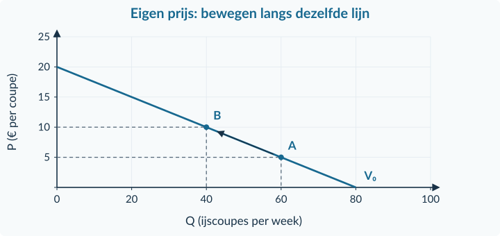<figcaption>Figuur 8 · Alleen de eigen prijs verandert: bij € 5 vragen de kopers 60 coupes; bij € 10 nog 40 coupes per week.</figcaption></figure>

<strong>Beweging langs de vraaglijn</strong>

De <strong>prijs van het product zelf</strong> verandert; de overige omstandigheden blijven gelijk. Je gaat naar een ander punt op dezelfde vraaglijn. Hier: van A naar B op V₀.

Bij deze lijn hoort Q = 80 − 4P, voor 0 ≤ P ≤ 20. Een hogere prijs van de ijscoupe verandert de hoeveelheid, <strong>niet de lijn zelf</strong>.

<!-- PAGE {"section": "1.2.2", "title": "Verschuiven: vergelijken bij dezelfde prijs"} -->

Begin nu opnieuw bij de ijssalon, maar houd P op € 10. Door warmer weer willen kopers <strong>bij elke onderzochte prijs 20 coupes meer</strong> per week. Dit is informatie uit ons model, geen algemene wet over de grootte van een weerseffect.

<figure>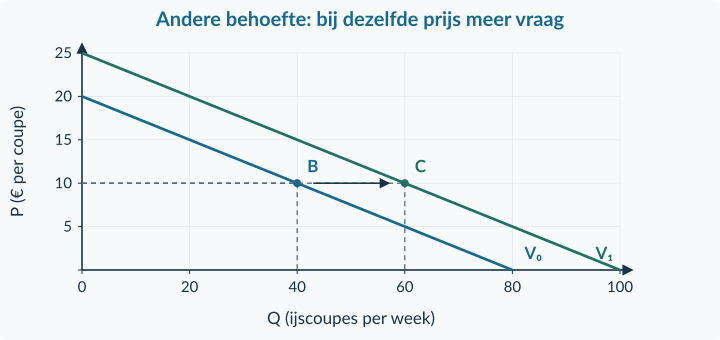<figcaption>Figuur 9 · De assen en schalen zijn gelijk aan figuur 8. Bij € 10 verandert de vraag van 40 naar 60 coupes per week.</figcaption></figure>

<strong>Verschuiving van de vraaglijn</strong>

Een <strong>andere vraagfactor dan de eigen prijs</strong> verandert. Bij dezelfde prijs vragen kopers meer of minder. Meer vraag: naar rechts. Minder vraag: naar links.

Oud: Q = 80 − 4P. Nieuw: Q = 100 − 4P, voor 0 ≤ P ≤ 25. De oorspronkelijke vergelijking blijft alleen de oude omstandigheden beschrijven. Voor een zuivere vergelijking kies je een prijs die in beide modellen past.

<table class=""><thead><tr><th>Wat kan de vraaglijn verschuiven?</th><th>Waar kijk je naar?</th></tr></thead><tbody><tr><td>Inkomen</td><td>Willen kopers bij dezelfde prijs meer of minder van dit product?</td></tr><tr><td>Behoeften en voorkeuren</td><td>Bijvoorbeeld weer of een nieuwe waardering van het product.</td></tr><tr><td>Prijs van een ander goed</td><td>Vervangt dat goed ons product of gebruiken kopers ze samen?</td></tr><tr><td>Aantal kopers</td><td>Alleen de vraag van de groep/markt verandert hierdoor.</td></tr><tr><td>Verwachtingen</td><td>Wat zegt de bron over kopen nu in plaats van later?</td></tr></tbody></table>

<strong>Niet “de prijs wordt hoger, dus de lijn stijgt”</strong>

Een beweging naar een hoger punt op de lijn is geen verschuiving van de hele lijn. Controleer de oorzaak, niet alleen de richting van het getekende pijltje.

<!-- PAGE {"section": "1.2.2", "title": "Andere goederen, inkomen en verwachtingen"} -->

<strong>Substituten</strong> zijn goederen die elkaar voor de koper kunnen vervangen. <strong>Complementen</strong> worden juist samen gebruikt. De relatie hangt af van het gebruik in de beschreven situatie.

<figure><figcaption>Figuur 10 · De bron neemt aan dat sommige kopers thee door koffie vervangen. Alle overige omstandigheden blijven gelijk.</figcaption></figure><figure><figcaption>Figuur 11 · De bron neemt aan dat printers en bijpassende inkt samen worden gebruikt.</figcaption></figure>
<strong>Inkomen.</strong> Bij meer inkomen willen kopers in een bron bijvoorbeeld vaker naar een concert: de vraag verschuift naar rechts. Een andere bron kan vertellen dat zij juist minder goedkope kant-en-klaarmaaltijden kiezen en vaker uit eten gaan. Dan verschuift de vraag naar die maaltijden naar links. Lees het gegeven gedrag; inkomenstoename betekent niet voor elk product meer vraag.

<strong>Aantal kopers.</strong> Meer mensen die bij een gegeven prijs willen kopen vergroten de vraag van de groep. Dat hoeft de vraag van één bestaande koper niet te veranderen.

<strong>Verwachtingen.</strong> Verwachten klanten volgende week een korting en stellen zij volgens de bron hun aankoop uit? Dan kan de vraag <strong>nu</strong> afnemen, hoewel de huidige prijs gelijk blijft. Verander de periode niet ongemerkt in je antwoord.

<strong>Benoem de precieze oorzaak</strong>

“Koffie wordt aantrekkelijker” is nog geen volledige oorzaak. Bij een hogere theeprijs is de factor <strong>de prijs van een substituut</strong>, niet een veranderde voorkeur voor koffie.

<!-- PAGE {"section": "1.2.2", "title": "Uitgewerkt voorbeeld · twee veranderingen"} -->

## Uitgewerkt voorbeeld

Een lunchkraam gebruikt Q = 60 − 3P voor wraps, geldig voor 0 ≤ P ≤ 20. Q is wraps per middag; P is euro per wrap. De prijs stijgt van € 6 naar € 8. Tegelijk worden broodjes bij een andere kraam duurder. De bron beschouwt broodjes als substituut. Daardoor vragen kopers bij elke onderzochte prijs 12 wraps extra. Neem aan dat de nieuwe vraaglijn recht blijft tot de gevraagde hoeveelheid nul is. De overige omstandigheden blijven gelijk.

<strong>a. Alleen de eigen prijs:</strong> oud Q = 60 − 3 × 6 = <strong>42</strong>. Bij € 8 op de oude lijn: Q = 60 − 3 × 8 = <strong>36 wraps per middag</strong>. Dat is een beweging van A naar B langs V₀.

<strong>b. Alleen de broodjesprijs:</strong> de factor is de prijs van een substituut. De vraag naar wraps verschuift naar rechts. Bij € 8 gaat Q van 36 naar <strong>48</strong>. De nieuwe lijn is Q = 72 − 3P, geldig voor 0 ≤ P ≤ 24.

<figure>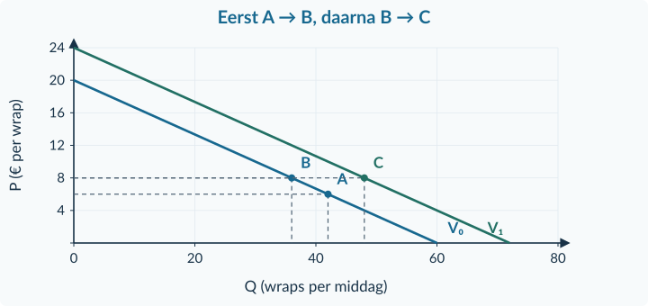<figcaption>Figuur 12 · A is de oude situatie. B is de denkstap “alleen de eigen prijs”. C is de situatie met beide veranderingen.</figcaption></figure>
<strong>c. Beide samen:</strong> het eigen-prijseffect is −6 en het substituuteffect +12 wraps per middag. Ze werken tegen elkaar in. Samen: 42 − 6 + 12 = <strong>48 wraps</strong>, dus 6 meer dan eerst.

<strong>d. De onjuiste uitleg:</strong> “De hogere wrapprijs heeft de vraaglijn naar rechts verschoven.” Dat klopt niet. Die prijsstijging veroorzaakte een beweging langs dezelfde vraaglijn naar een kleinere gevraagde hoeveelheid. De hogere broodjesprijs veroorzaakt de verschuiving.

<strong>Samenvatting · 1.2.2</strong>

Kies eerst het product en de periode. De eigen prijs geeft een beweging langs de lijn; een andere vraagfactor kan de lijn verschuiven. Benoem bij een ander product de relatie. Bekijk twee veranderingen apart voordat je hun effecten combineert. Zonder getallen is het netto-effect soms niet te bepalen. Hierna tel je de vraag van kopers op.

<!-- PAGE {"section": "1.2.2", "title": "Starten en een verschuiving herkennen"} -->

## Startopgaven

<h3>Opgave 12 · Rekenen met een bekende basis</h3>
Gebruik de rekenstappen uit het vorige hoofdstuk en §1.2.1.

a.

Een aantal daalt van 24 naar 18. Bereken de procentuele verandering.

b.

Bereken Q bij P = € 6 in Q = 24 − 2P. Q is stuks per week; de formule geldt voor 0 ≤ P ≤ 12.

<h3>Opgave 13 · Wat verandert er?</h3>
Je onderzoekt de vraag naar een rugzak. De prijs van deze rugzak daalt; alle andere omstandigheden blijven gelijk.

a.

Is dit een beweging langs of een verschuiving van de vraaglijn? Noem ook de richting van de hoeveelheid.

<strong>Oefenroute</strong>

Normale route: Startopgaven → Begeleide inoefening → Zelfstandige oefening → Doeloefening. Uitdagende route: Startopgaven → Zelfstandige oefening → Doeloefening → Denkertje / Bonusopgave. Herhaling is aanvullend bij beide routes.

## Begeleide inoefening

Begeleide inoefening hoort bij leren: je oefent met denkstappen en doet steeds meer zelf.

<h3>Opgave 14 · Een beter gewaardeerde helm</h3>
Na nieuwe informatie waarderen kopers fietshelmen meer. De prijs blijft € 6. Bekijk de ingevulde grafiek.

<figure>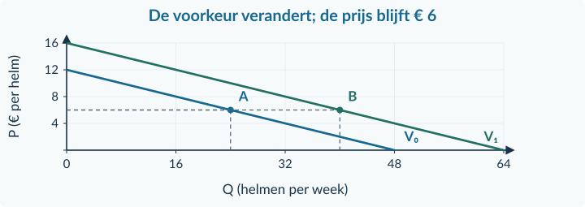<figcaption>Figuur 13 · De oorzaak en beide hulplijnen zijn gegeven. Lees eerst wat er staat.</figcaption></figure>
a.

Lees Q vóór en na de verandering af. Welke factor en welke richting horen hierbij?

<!-- PAGE {"section": "1.2.2", "title": "Begeleide inoefening · zelf markeren"} -->

<h3>Opgave 15 · Twee losse veranderingen bij de wasstraat</h3>
De beginlijn is Q = 120 − 10P, voor 0 ≤ P ≤ 12. Q is wasbeurten per dag; P is euro per wasbeurt. Bij beide veranderingen hieronder begin je opnieuw bij deze lijn en P = € 6.

<figure>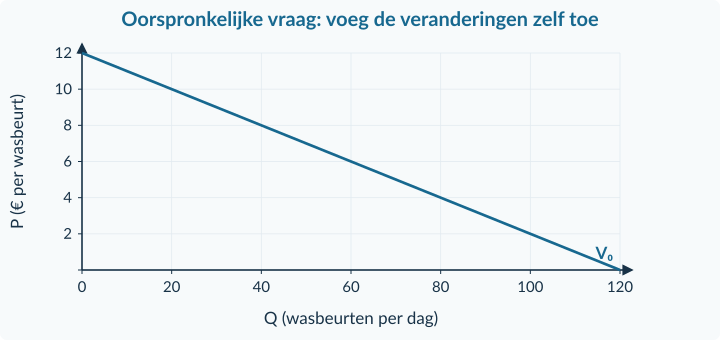<figcaption>Figuur 14 · Alleen de beginlijn is gegeven. De antwoordmarkeringen en nieuwe lijn voeg je zelf toe.</figcaption></figure>
a.

De eigen prijs stijgt naar € 8; de overige omstandigheden blijven gelijk. Bereken beide hoeveelheden en teken de beweging met een pijl.

b.

De prijs bij een concurrerende wasstraat daalt. Volgens de bron is die dienst een substituut. Bij elke prijs worden bij onze wasstraat 20 wasbeurten minder gevraagd. Teken V₁ voor Q = 100 − 10P, voor 0 ≤ P ≤ 10, en markeer de hoeveelheid bij € 6. Gebruik bijvoorbeeld de snijpunten.

c.

Leg uit waarom de twee pijlen niet hetzelfde soort verandering laten zien.

<strong>Controle van je tekening</strong>

De lijn in a blijft precies liggen. In b vergelijk je eerst beide hoeveelheden bij € 6. Noem bij je pijl ook de oorzaak; een richting alleen is niet voldoende.

<!-- PAGE {"section": "1.2.2", "title": "Eerst afzonderlijk, dan samen"} -->

<h3>Opgave 16 · Een spel en de bijbehorende console</h3>
De prijs van een nieuw spel daalt. Tegelijk stijgt de prijs van de console die nodig is om het spel te spelen. Volgens de bron gebruiken klanten beide samen; verder verandert er niets. De grootte van de effecten is niet gegeven.

a.

Bekijk eerst alleen de spelprijs. Wat gebeurt er met de vraaggrafiek voor het spel?

b.

Bekijk daarna alleen de consoleprijs. Benoem de vraagfactor en de richting.

c.

Versterken de twee effecten elkaar? Kun je de uiteindelijke hoeveelheid bepalen?

d.

Een leerling zegt: “De duurdere console betekent dat de spelprijs stijgt.” Leg uit waarom die redenering onjuist is.

## Zelfstandige oefening

<h3>Opgave 17 · De oorzaak precies benoemen</h3>
Onderzoek steeds de vraag naar het product in de eerste kolom. De overige omstandigheden blijven gelijk. Neem de tabel over en vul de laatste drie kolommen in.

<table class=""><thead><tr><th>Product en verandering</th><th>Beweging of verschuiving?</th><th>Richting Q bij vergelijking</th><th>Specifieke factor</th></tr></thead><tbody><tr><td>Rugzak: de eigen prijs daalt.</td><td>…</td><td>…</td><td>…</td></tr><tr><td>Havermelk: koemelk wordt duurder; kopers vervangen koemelk door havermelk.</td><td>…</td><td>…</td><td>…</td></tr><tr><td>Simpele afhaalmaaltijd: kopers verdienen meer en kiezen volgens de bron vaker een restaurant.</td><td>…</td><td>…</td><td>…</td></tr><tr><td>Schriften: er komen meer leerlingen bij de school.</td><td>…</td><td>…</td><td>…</td></tr></tbody></table>
a.

Classificeer alle vier situaties. Gebruik de specifieke factor, niet alleen “er verandert iets”.

<!-- PAGE {"section": "1.2.2", "title": "Zelfstandig tekenen en combineren"} -->

<h3>Opgave 18 · Meer danslessen</h3>
Voor danslessen geldt eerst Q = 60 − 3P, voor 0 ≤ P ≤ 20. Q is lessen per week; P is euro per les. De prijs daalt van € 10 naar € 8. Tegelijk stijgt het inkomen van de kopers. Volgens de bron willen zij daardoor bij elke onderzochte prijs 12 lessen extra. Neem aan dat de nieuwe vraaglijn recht blijft tot de gevraagde hoeveelheid nul is. De overige omstandigheden blijven gelijk.

<figure>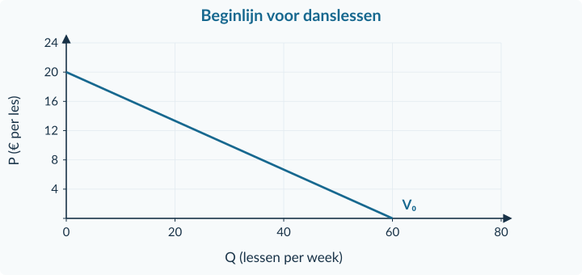<figcaption>Figuur 15 · Je krijgt alleen de oorspronkelijke vraaglijn, net als bij de doeloefening.</figcaption></figure>
a.

Bereken de oude hoeveelheid en de hoeveelheid na alleen de eigen prijsdaling. Benoem het soort grafische verandering.

b.

Voeg de nieuwe vraaglijn en de oude en uiteindelijke punten aan de figuur toe. Noteer de coördinaten bij de punten.

c.

Bereken de uiteindelijke hoeveelheid. Leg uit of de twee effecten elkaar versterken of tegenwerken.

<strong>Een conclusie met bewijs</strong>

Een volledig antwoord noemt een verandering, een getal of grafische aanwijzing en de economische oorzaak. Alleen “meer vraag” mist de vergelijking met de oude situatie.

<!-- PAGE {"section": "1.2.2", "title": "Doeloefening"} -->

## Doeloefening

<h3>Opgave 19 · Filmhuis Lumi</h3>
Voor filmbezoeken geldt eerst Q = 100 − 5P, voor 0 ≤ P ≤ 20. Q is bezoeken per week; P is euro per bezoek. Lumi verhoogt de prijs van € 8 naar € 10. Tegelijk worden kaartjes van een nabijgelegen bioscoop duurder. Volgens de bron zijn die bezoeken substituten. Hierdoor worden bij Lumi bij elke onderzochte prijs 20 bezoeken extra gevraagd. Neem aan dat de nieuwe vraaglijn recht blijft tot de gevraagde hoeveelheid nul is. Verder blijven de omstandigheden gelijk.

<figure>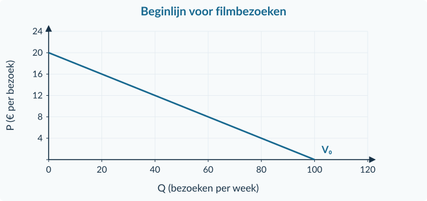<figcaption>Figuur 16 · Voeg de nieuwe lijn en de gevraagde punten zelf toe.</figcaption></figure>
a.

Bereken Q vóór de veranderingen en na alleen de eigen prijsstijging. Benoem de grafische verandering.

b.

Welke specifieke factor veroorzaakt de andere verandering? Benoem de richting van de verschuiving.

c.

Teken de nieuwe vraaglijn in de figuur. Markeer A (oud), B (alleen de eigen prijsstijging) en C (beide veranderingen). Noteer hun coördinaten.

d.

Bereken de uiteindelijke hoeveelheid en de verandering ten opzichte van het begin. Werken de twee effecten elkaar tegen of versterken ze elkaar?

e.

Beoordeel: “De hogere prijs van Lumi verschuift zijn vraaglijn naar rechts.” Gebruik je uitkomsten.

<!-- PAGE {"section": "1.2.2", "title": "Denkertje en herhaling"} -->

## Denkertje / Bonusopgave

<h3>Opgave 20 · Een onderzoek met te weinig informatie</h3>
Een winkel ziet dat een bordspel duurder is geworden en dat meer mensen het willen kopen. Er staat niets over inkomen, andere spellen of voorkeuren.

a.

Een medewerker zegt dat de vraaglijn daarom stijgend moet zijn. Geef een andere mogelijke verklaring. Leg uit welke extra informatie nodig is om de eigen-prijsreactie te onderzoeken.

## Herhaling en combineren

<h3>Opgave 21 · Indexen vergelijken</h3>
De prijsindex van sportmateriaal gaat van 120 naar 132; beide indexen gebruiken hetzelfde basisjaar.

a.

Bereken de procentuele verandering. Leg uit waarom het antwoord niet 12% is.

<h3>Opgave 22 · Een formule teruglezen</h3>
Een individuele vraag wordt beschreven door q = 16 − 2P voor 0 ≤ P ≤ 8. q is stuks per maand; P is euro per stuk.

a.

Bereken P als q = 8 en controleer de oorspronkelijke formule.

<strong>Van een verandering naar een totaal</strong>

Het aantal kopers kan de vraag van een groep veranderen. In §1.2.3 ontdek je hoe de afzonderlijke koopplannen precies bij elkaar worden opgeteld.

<!-- PAGE {"section": "1.2.3", "title": "Wat willen de kopers samen?"} -->

1.2.3 · BOEK 1 · TWEEDE EDITIE
<h1 class="paragraph-title" id="p123">Van individuele naar collectieve vraag</h1>

<strong>Na deze paragraaf kun je</strong>
<ul><li>hoeveelheden van kopers bij dezelfde prijs optellen;</li><li>eenvoudige vraagfuncties binnen de gegeven grenzen samenvoegen;</li><li>de gezamenlijke vraag tekenen en uitleggen waarom een koper soms nul bijdraagt.</li></ul>

Een verkooppunt vraagt aan twee vaste kopers hoeveel liter sap zij bij verschillende prijzen willen kopen. Bij € 2 wil koper A 4 liter per week en koper B 8 liter. Hoe groot is hun vraag samen?

<strong>Collectieve vraag</strong>

De vraag van <strong>alle kopers op een afgebakende markt samen</strong>, bij verschillende prijzen en gelijkblijvende overige omstandigheden. Je telt hun gevraagde hoeveelheden op <strong>bij dezelfde prijs</strong>.

<table class=""><thead><tr><th>Prijs P (€ per liter)</th><th>q van koper A</th><th>q van koper B</th><th>Samen Q</th></tr></thead><tbody><tr><td>0</td><td>8</td><td>12</td><td>20</td></tr><tr><td>2</td><td>4</td><td>8</td><td>12</td></tr><tr><td>4</td><td>0</td><td>4</td><td>4</td></tr></tbody></table>
Alle hoeveelheden staan hier in <strong>liter per week</strong>. Voor deze kleine voorbeeldmarkt tellen alleen A en B mee. Bij € 2 is Q = 4 + 8 = <strong>12 liter per week</strong>. De prijs blijft € 2; die tel je niet op.

<strong>Drie controles vóór het optellen</strong>

Gaat het over <strong>hetzelfde product</strong>, <strong>dezelfde periode en eenheid</strong> en <strong>dezelfde prijs</strong>? Tel kopers of groepen bovendien niet dubbel mee.

Een gemiddelde is iets anders. (4 + 8) / 2 = 6 liter per koper, maar de gezamenlijke vraag is 12 liter. Voor collectieve vraag wil je het totaal, niet het gemiddelde.

<!-- PAGE {"section": "1.2.3", "title": "Horizontaal optellen, daarna formules"} -->

De drie grafieken laten dezelfde prijs van € 2 zien. Lees in iedere kopersgrafiek de hoeveelheid af. Tel de horizontale hoeveelheden 4 en 8 op. Het nieuwe punt heeft coördinaten <strong>(12; 2)</strong>.

<figure>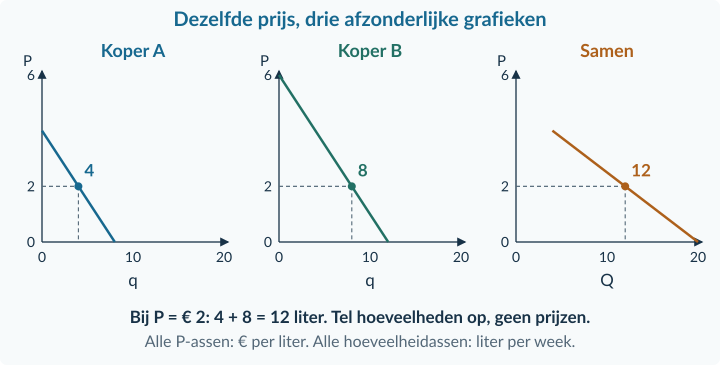<figcaption>Figuur 17 · De prijs- en hoeveelheidsschalen zijn gelijk. De somlijn is alleen getekend zolang beide lineaire rekenregels geldig zijn.</figcaption></figure>
Bij deze bron horen qA = 8 − 2P (0 ≤ P ≤ 4) en qB = 12 − 2P (0 ≤ P ≤ 6). Boven de eigen prijsgrens vraagt die koper niets. Voor prijzen van € 0 tot en met € 4 kun je de twee rekenregels direct optellen.

<strong>Collectieve vraag · alleen voor 0 ≤ P ≤ 4</strong>

Q = qA + qB 
Q = (8 − 2P) + (12 − 2P) 
Q = 20 − 4P

Tel de losse getallen op: 8 + 12 = 20. Tel de P-termen op: −2P − 2P = −4P. <strong>Twee keer 2 liter minder is samen 4 liter minder</strong> bij een euro prijsstijging. De haakjes houden eerst zichtbaar welke regel bij welke koper hoort.

Controle bij € 2: Q = 20 − 4 × 2 = <strong>12 liter per week</strong>. Dat is dezelfde uitkomst als in de tabel.

<!-- PAGE {"section": "1.2.3", "title": "Een koper kan afhaken"} -->

Verhoog de prijs in dezelfde sapmarkt naar € 5. Voor A levert 8 − 2 × 5 de rekenuitkomst −2 op. Maar A vraagt geen negatieve liters: de prijs ligt boven zijn koopgrens van € 4. Zijn bijdrage is <strong>nul</strong>.

B vraagt bij € 5 nog 12 − 2 × 5 = <strong>2 liter per week</strong>. Samen vragen zij dus 0 + 2 = <strong>2 liter per week</strong>, niet 20 − 4 × 5 = 0 liter.

<figure>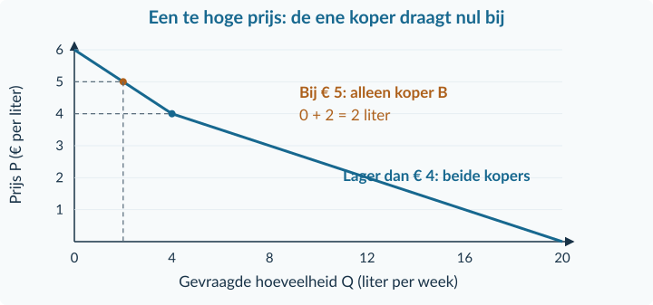<figcaption>Figuur 18 · De vorm verandert wanneer A niets meer koopt. De vraag van B verdwijnt daardoor niet.</figcaption></figure>

<strong>Een formule heeft grenzen</strong>

Q = 20 − 4P is geldig voor 0 ≤ P ≤ 4. Daarbuiten mag je die somformule niet doortrekken. Bekijk opnieuw wie nog koopt en tel alleen niet-negatieve hoeveelheden op.

Bij € 4 is A’s hoeveelheid al precies nul en is de somformule nog correct. Boven € 4 werkt A’s oorspronkelijke lineaire rekenregel niet meer als aankoopvoorspelling. Boven € 6 vragen beiden niets.

Je hoeft hiervoor geen uitgebreide nieuwe formule te maken. <strong>Prijs kiezen → per koper berekenen en koopgrens controleren → geldige hoeveelheden optellen.</strong> Ook een tekening mag niet buiten de opgegeven geldigheid zomaar als rechte lijn worden verlengd.

<!-- PAGE {"section": "1.2.3", "title": "Uitgewerkt voorbeeld · bron en som"} -->

## Uitgewerkt voorbeeld

Twee kopers bestellen limonade. Alle hoeveelheden zijn liter per week, P is euro per liter. Voor koper A geldt qA = 12 − 3P (0 ≤ P ≤ 4). Voor B geldt qB = 8 − P (0 ≤ P ≤ 8). Boven de eigen grens vraagt de koper nul. Andere omstandigheden blijven gelijk.

<strong>a. Vul de tabel in.</strong> Reken eerst per koper. Bij € 2 vraagt A: 12 − 3 × 2 = 6 liter. B vraagt: 8 − 2 = 6 liter. Samen: 6 + 6 = 12 liter.

<table class=""><thead><tr><th>P (€ per liter)</th><th>qA</th><th>qB</th><th>Q samen</th></tr></thead><tbody><tr><td>0</td><td>12</td><td>8</td><td>20</td></tr><tr><td>2</td><td>6</td><td>6</td><td>12</td></tr><tr><td>3</td><td>3</td><td>5</td><td>8</td></tr><tr><td>4</td><td>0</td><td>4</td><td>4</td></tr><tr><td>6</td><td>0</td><td>2</td><td>2</td></tr></tbody></table>
<strong>b. Schrijf de somfunctie zolang beide rekenregels geldig zijn.</strong>

Q = (12 − 3P) + (8 − P) = <strong>20 − 4P</strong>, voor <strong>0 ≤ P ≤ 4</strong>. 
Controle bij € 3: Q = 20 − 4 × 3 = <strong>8 liter per week</strong>; gelijk aan de tabel.

<strong>c. Bereid de tekening voor.</strong> Je tekent alleen het deel voor 0 ≤ P ≤ 4. De eindpunten zijn <strong>(20; 0)</strong> en <strong>(4; 4)</strong>. Het punt <strong>(12; 2)</strong> ligt ertussen. De lijn hoeft binnen dit interval niet de P-as te bereiken.

<strong>d. Bereken de gezamenlijke vraag bij € 6.</strong> A’s prijsgrens is overschreden, dus qA = 0. B: qB = 8 − 6 = 2. Samen: <strong>2 liter per week</strong>.

<strong>e. Waarom niet Q = 20 − 4 × 6?</strong> De −4 uit die berekening bevat een negatieve bijdrage van A. B’s vraag mag niet worden verminderd met liters die A niet koopt.

<!-- PAGE {"section": "1.2.3", "title": "Uitgewerkt voorbeeld · grafiek en start"} -->

<figure>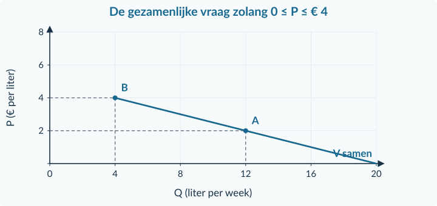<figcaption>Figuur 19 · Alleen het gevraagde prijsinterval is getekend. Een verlenging naar de P-as zou buiten de geldige somfunctie vallen.</figcaption></figure>

<strong>Samenvatting · 1.2.3</strong>

Tel hoeveelheden bij dezelfde prijs op. Houd product, periode en eenheid gelijk. Voeg losse getallen en P-termen samen, met de geldigheid erbij. Boven een koopgrens draagt een koper nul bij, geen negatief aantal. In de gemengde opgaven kies je zelf welke bron en regel je nodig hebt.

## Startopgaven

<h3>Opgave 23 · Invullen en vergelijken</h3>
Gebruik alleen eerder geoefende rekenstappen.

a.

Bereken q bij P = 4 in q = 8 − 2P, geldig voor 0 ≤ P ≤ 4. q is liter per week.

b.

Een hoeveelheid stijgt van 12 naar 18 liter per week. Bereken de procentuele verandering.

<h3>Opgave 24 · Het totaal is geen gemiddelde</h3>
Bij dezelfde prijs vraagt een koper 3 liter melk per week en een tweede 5 liter. Alleen deze twee kopers tellen mee.

a.

Bereken de collectieve vraag. Wat gaat er mis als je de uitkomst door twee deelt?

<strong>Oefenroute</strong>

Normale route: Startopgaven → Begeleide inoefening → Zelfstandige oefening → Doeloefening. Uitdagende route: Startopgaven → Zelfstandige oefening → Doeloefening → Denkertje / Bonusopgave. Herhaling is aanvullend bij beide routes.

<!-- PAGE {"section": "1.2.3", "title": "Begeleide inoefening · de som aflezen"} -->

## Begeleide inoefening

Begeleide inoefening hoort bij leren: je oefent met denkstappen en doet steeds meer zelf.

<h3>Opgave 25 · Twee kopers van verf</h3>
Twee hobbyclubs kopen verf. De volgende grafieken geven hun vraag in liter per week weer. Andere omstandigheden blijven gelijk. Lees de ingevulde hulplijnen.

<figure>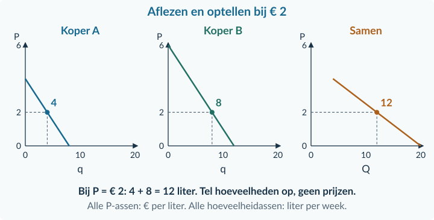<figcaption>Figuur 20 · De gezamenlijke grafiek gebruikt dezelfde schalen; het punt bij € 2 is volledig gegeven.</figcaption></figure>
a.

Lees voor A en B de hoeveelheid bij € 2 af. Controleer het gezamenlijke punt.

b.

Een leerling telt de twee prijzen op en noteert “12 liter bij € 4”. Leg uit wat daar misgaat.

<strong>Zeg de som in woorden</strong>

“Bij een prijs van € 2 per liter willen de twee kopers samen 12 liter per week kopen.” Daarmee controleer je in één zin de prijs, de eenheid, de periode en het niveau van je uitkomst.

<!-- PAGE {"section": "1.2.3", "title": "Begeleide inoefening · afronden en loslaten"} -->

<h3>Opgave 26 · Teken de gezamenlijke lijn</h3>
Twee gezinnen kopen chocolademelk. qA = 8 − 2P (0 ≤ P ≤ 4); qB = 16 − 2P (0 ≤ P ≤ 8). P is euro per liter, q liter per week. Boven de eigen koopgrens is q nul. Andere omstandigheden blijven gelijk.

<table class=""><thead><tr><th>P</th><th>qA</th><th>qB</th><th>Q</th></tr></thead><tbody><tr><td>0</td><td>8</td><td>16</td><td>24</td></tr><tr><td>2</td><td>…</td><td>…</td><td>…</td></tr><tr><td>4</td><td>…</td><td>…</td><td>…</td></tr></tbody></table><figure>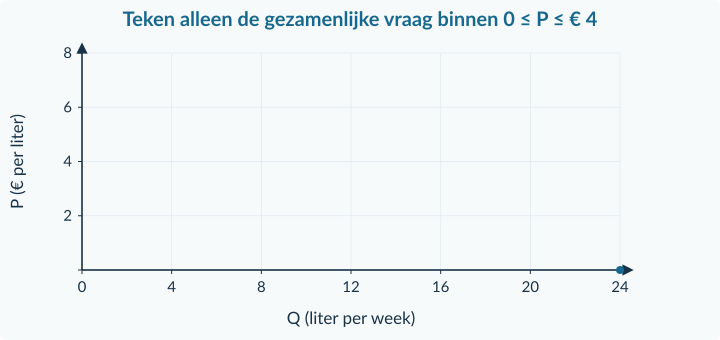<figcaption>Figuur 21 · De tabel geeft steun. Nu teken je zelf het geldige deel van de somlijn.</figcaption></figure>
a.

Vul de tabel in en schrijf de gezamenlijke functie voor 0 ≤ P ≤ 4.

b.

Teken in de figuur de gezamenlijke vraag voor 0 ≤ P ≤ 4. Het punt bij P = 0 is al gegeven.

<h3>Opgave 27 · Zonder grafiek: wie koopt nog?</h3>
Voor setjes kaarten gelden qA = 6 − P (0 ≤ P ≤ 6) en qB = 10 − P (0 ≤ P ≤ 10), in setjes per maand. P is euro per setje. Boven de eigen koopgrens vraagt die koper niets.

a.

Bereken bij P = € 8 hoeveel beide kopers samen vragen.

<!-- PAGE {"section": "1.2.3", "title": "Zelfstandig optellen en tekenen"} -->

## Zelfstandige oefening

<h3>Opgave 28 · Vraag naar illustratieprints</h3>
Twee kopersgroepen vragen illustratieprints. QA = 12 − 3P (0 ≤ P ≤ 4) en QB = 24 − 3P (0 ≤ P ≤ 8). Q is prints per week; P is euro per print. Boven de eigen koopgrens is de vraag van de groep nul. Andere omstandigheden blijven gelijk.

a.

Bereken de vraag van iedere groep en de gezamenlijke vraag bij € 2.

b.

Stel de gezamenlijke functie op voor 0 ≤ P ≤ 4. Controleer met a.

c.

Teken zelf de gezamenlijke vraag voor 0 ≤ P ≤ 4. Noteer de eindpunten van dit deel.

<h3>Opgave 29 · Geen negatieve bijdragen</h3>
Twee kopers vragen knutselpakketten. qA = 10 − 2P (0 ≤ P ≤ 5); qB = 18 − 2P (0 ≤ P ≤ 9). q is pakketten per maand en P is euro per pakket. Boven de eigen koopgrens vraagt een koper nul.

a.

Bereken de gezamenlijke vraag bij € 6.

b.

Een leerling gebruikt Q = 28 − 4P en komt op 4 pakketten. Leg uit waarom dit geen geldige gezamenlijke vraag is bij die prijs.

<!-- PAGE {"section": "1.2.3", "title": "Doeloefening"} -->

## Doeloefening

<h3>Opgave 30 · Reserveringen bij een spellenclub</h3>
Een spellenclub onderzoekt de vraag van twee afzonderlijke groepen. QA = 18 − 3P, geldig voor 0 ≤ P ≤ 6. QB = 24 − 2P, geldig voor 0 ≤ P ≤ 12. Q is reserveringen per week; P is euro per reservering. Boven de eigen koopgrens vraagt de groep nul. De overige omstandigheden blijven gelijk.

<table class=""><thead><tr><th>P (€ per reservering)</th><th>QA</th><th>QB</th><th>Q samen</th></tr></thead><tbody><tr><td>0</td><td>…</td><td>…</td><td>…</td></tr><tr><td>2</td><td>…</td><td>…</td><td>…</td></tr><tr><td>4</td><td>…</td><td>…</td><td>…</td></tr><tr><td>6</td><td>…</td><td>…</td><td>…</td></tr></tbody></table>
a.

Neem de tabel over en vul alle lege hoeveelheden in.

b.

Stel de gezamenlijke vraagfunctie op voor 0 ≤ P ≤ 6. Controleer de formule met de tabelwaarde bij € 4.

c.

Teken in je schrift de gezamenlijke vraag voor 0 ≤ P ≤ 6. Noteer de eindpunten en markeer het punt bij € 4.

d.

Bereken de gezamenlijke vraag bij P = € 8.

e.

Een leerling trekt de lijn uit c door en vindt bij € 8 een gezamenlijke vraag van 2 reserveringen. Leg uit waarom dit onjuist is.

<!-- PAGE {"section": "1.2.3", "title": "Denkertje en herhaling"} -->

## Denkertje / Bonusopgave

<h3>Opgave 31 · Meer mogelijke kopers, toch hetzelfde totaal</h3>
Een aanbieder bereikt tien extra mogelijke kopers. De prijs blijft € 10. Alle bestaande kopers blijven precies dezelfde hoeveelheid vragen.

a.

Moet de gezamenlijke gevraagde hoeveelheid bij € 10 nu groter zijn? Geef een tegenvoorbeeld en leg uit welke aanvullende voorwaarde een stijging wél garandeert.

## Herhaling en combineren

<h3>Opgave 32 · Een daling vergelijken</h3>
Een aantal aanmeldingen daalt van 10 naar 8 per week.

a.

Bereken de procentuele verandering.

<h3>Opgave 33 · Afstanden op een plattegrond</h3>
Een rechthoek ligt op een plattegrond van x = 2 tot x = 8 en van y = 3 tot y = 6. Beide assen geven posities in meters. Een driehoek beslaat de helft van die rechthoek.

a.

Bereken de oppervlakte van de rechthoek en de driehoek.

<strong>Let op de bron</strong>

Een tabel, formule en grafiek die bij dezelfde bron horen, moeten dezelfde uitkomsten geven. Zie je een verschil? Controleer eerst de prijs, de eenheid en de geldigheid.

<!-- PAGE {"section": "1.2.4", "title": "Bekende begrippen, een nieuwe combinatie"} -->

1.2.4 · BOEK 1 · TWEEDE EDITIE
<h1 class="paragraph-title" id="p124">Gemengde opgaven: vraag</h1>
Je gebruikt nu de gereedschappen uit het hele hoofdstuk. Er komt geen nieuwe theorie bij. Kies eerst de koper of groep, de prijs en de periode. Bepaal daarna welke bron de vraag kan beantwoorden.

<h3>Opgave 34 · Een workshop kiezen</h3>
Sophie heeft voor haar eerste vier korte workshops maximaal € 14, € 10, € 6 en € 3 per workshop over. De prijs is € 6. Zij heeft voldoende budget en tijd; bij gelijkheid doet zij mee.

a.

Hoeveel workshops wil Sophie volgen bij € 6? Leg uit.

b.

Later kost dezelfde workshop € 7,50; de betalingsbereidheden blijven gelijk. Bereken de procentuele prijsstijging en het nieuwe aantal.

<h3>Opgave 35 · Een gezamenlijke vraag controleren</h3>
Twee groepen vragen puzzelboekjes. De tabel geldt bij onveranderde overige omstandigheden; alle aantallen zijn per week.

<table class=""><thead><tr><th>P (€ per boekje)</th><th>Groep A</th><th>Groep B</th><th>Q samen</th></tr></thead><tbody><tr><td>2</td><td>8</td><td>12</td><td>…</td></tr><tr><td>4</td><td>4</td><td>8</td><td>…</td></tr><tr><td>6</td><td>0</td><td>4</td><td>…</td></tr></tbody></table>
a.

Vul de gezamenlijke vraag per rij in.

b.

Een medewerker maakt een gemiddelde van de twee groepen. Leg uit waarom dat de gevraagde marktgrootte niet weergeeft.

<!-- PAGE {"section": "1.2.4", "title": "Een vraagfunctie in de andere richting"} -->

<h3>Opgave 36 · Luisterboeken voor Sanne</h3>
De vraag van Sanne wordt beschreven door P = 7 − 0,5q, voor 0 ≤ q ≤ 14. P is euro per luisterboek; q is luisterboeken per maand. Alle overige omstandigheden blijven gelijk. Het is een eenvoudig model van haar vraag, geen verkoopregistratie.

a.

Bereken q bij P = € 4. Controleer met de oorspronkelijke formule.

b.

Bepaal de twee snijpunten en teken de vraaglijn zelf.

c.

Een prijsstijging van € 4 naar € 5 treedt op. Leg uit wat met Sanne’s gevraagde hoeveelheid gebeurt en of haar vraaglijn verschuift.

d.

Er komen tien nieuwe mogelijke kopers bij de aanbieder. Een leerling zegt dat Sanne daarom zelf meer luisterboeken moet gaan kopen. Beoordeel.

<strong>Bij een bronconclusie</strong>

Een modeluitkomst geldt onder de genoemde omstandigheden. Zij vertelt niet automatisch wat werkelijk verkocht wordt. Je hebt in dit hoofdstuk alleen de kant van de kopers onderzocht.

<!-- PAGE {"section": "1.2.4", "title": "Doeloefening · bronnen"} -->

## Doeloefening

<strong>Opgave 37 · Tafeltennistijd bij Club Noord</strong>

De vragen staan op de tegenoverliggende pagina. Alle cijfers zijn geconstrueerde modelgegevens. De club onderzoekt uitsluitend de vraag; deze bronnen bevatten geen informatie over aanbod of beschikbaarheid.

<strong>Bron A · Twee groepen, één prijs</strong>

Groep A en groep B vragen halfuren tafeltennistijd. Iedereen betaalt dezelfde prijs P, in euro per halfuur.

QA = 24 − 3P, voor 0 ≤ P ≤ 8. 
QB = 36 − 3P, voor 0 ≤ P ≤ 12.

De hoeveelheden zijn halfuren <strong>per week</strong>. Boven de eigen koopgrens vraagt een groep nul. De oude prijs is € 4 per halfuur. Andere omstandigheden zijn aanvankelijk gelijk.

<strong>Bron B · Twee veranderingen</strong>

De club verhoogt P naar € 6. Tegelijk wordt bowlen duurder. De bron beschouwt bowlen voor deze kopers als substituut. Daardoor neemt de gezamenlijke vraag naar tafeltennistijd <strong>bij elke prijs van € 0 tot en met € 8 met 12 halfuren per week toe</strong>. Alle overige omstandigheden blijven gelijk.

<strong>Bron C · Eén koper binnen groep A</strong>

Sem is al meegeteld in groep A. Voor zijn eerste vier extra halfuren heeft hij maximaal € 7, € 6, € 4 en € 2 per halfuur over. Bij gelijkheid wil hij kopen. Zijn budget beperkt hem niet extra.

<figure>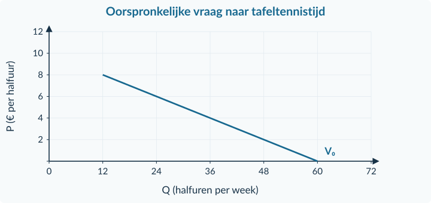<figcaption>Figuur 22 · Alleen de oorspronkelijke gezamenlijke lijn voor 0 ≤ P ≤ € 8 staat er. De antwoordmarkeringen voeg je zelf toe.</figcaption></figure>

<!-- PAGE {"section": "1.2.4", "title": "Doeloefening · vragen"} -->

<h3>Opgave 37 · Tafeltennistijd bij Club Noord</h3>
Gebruik de bronnen en figuur 22 op de tegenoverliggende pagina. Vermeld bij berekeningen de eenheid en bij verklaringen de specifieke oorzaak.

a.

Stel uit bron A de gezamenlijke vraagfunctie op voor 0 ≤ P ≤ 8. Bereken de oude vraag bij € 4 en controleer door beide groepen afzonderlijk te berekenen.

b.

Welke prijs hoort volgens de oorspronkelijke gezamenlijke functie bij Q = 30 halfuren per week? Controleer je antwoord.

c.

Bekijk de twee veranderingen uit bron B afzonderlijk. Bereken eerst de hoeveelheid na alleen de eigen prijsstijging. Benoem daarna de specifieke factor en de richting van het andere effect.

d.

Teken de nieuwe gezamenlijke vraaglijn voor 0 ≤ P ≤ 8 in figuur 22. Markeer A (oud), B (alleen de eigen prijsstijging) en C (beide veranderingen); noteer de coördinaten.

e.

Bereken de uiteindelijke gezamenlijke vraag. Beoordeel daarmee de uitspraak: “Het totaal blijft gelijk, dus de eigen prijsstijging heeft geen effect.”

f.

Hoeveel halfuren wil Sem volgens bron C bij € 6 kopen? Mag je die hoeveelheid nog bij de uitkomst van e optellen? Leg uit.

Schrijf een economische conclusie die niet verder gaat dan de bron: de uitkomsten gaan over <strong>gevraagde</strong> tafeltennistijd onder de modelaannamen.

<!-- PAGE {"section": "1.2.4", "title": "Extra gemengde oefening · fouten repareren"} -->

## Denkertje / Bonusopgave

<h3>Opgave 38 · Drie ogenschijnlijk logische antwoorden</h3>
Een redacteur controleert onderstaande leerlingantwoorden. Repareer de redenering, niet alleen het laatste woord of getal.

a.

“Koper A vraagt 6 liter per dag en B 7 liter per week. Samen vragen ze 13 liter.” A vraagt op elk van de zeven dagen hetzelfde. Geef de juiste som met periode.

b.

“De trein wordt duurder. Mensen kiezen volgens de bron in plaats daarvan de bus. Dus de voorkeur voor de bus is veranderd.” Benoem de juiste factor bij de vraag naar busritten.

c.

“Een gegeven vraagfunctie voorspelt 80 tickets bij € 10. Er zijn dus zeker 80 tickets verkocht.” Welke extra informatie ontbreekt?

<strong>Zelf controleren vóór je verdergaat</strong>

Kun je een vraaglijn zelf tekenen en terugrekenen naar prijs? Kun je het verschil tussen bewegen en verschuiven met een bron verklaren? Kun je optellen zonder een negatieve vraagbijdrage te gebruiken? Ga bij twijfel terug naar de bijbehorende begeleide inoefening.

Je hebt nu de koopkant van een markt beschreven. In hoofdstuk 1.3 komt de verkoopkant erbij. Pas dan onderzoek je hoe vraag en aanbod samen een marktevenwicht kunnen bepalen.

<!-- PAGE {"section": "Overzicht", "title": "Overzicht · begrippen verbinden"} -->

<h1 id="overzicht">Het hoofdstuk in samenhang</h1><table class=""><thead><tr><th>Je vraag</th><th>De aanpak</th><th>Controle</th></tr></thead><tbody><tr><td>Welke losse eenheden wil iemand kopen?</td><td>Vergelijk per eenheid betalingsbereidheid met de prijs.</td><td>Gebruik de afspraak bij gelijkheid en de bronvoorwaarden.</td></tr><tr><td>Hoeveel bij deze prijs?</td><td>Vul P in de geldige vraagfunctie in.</td><td>Eenheid, periode en niet-negatieve hoeveelheid.</td></tr><tr><td>Welke prijs bij dit aantal?</td><td>Vul q of Q in; voer aan beide kanten dezelfde bewerking uit.</td><td>Controleer de oorspronkelijke formule.</td></tr><tr><td>Hoe teken ik de lijn?</td><td>Bereken snijpunten of eindpunten van het gevraagde interval.</td><td>q/Q horizontaal, P verticaal; controlepunt op de lijn.</td></tr><tr><td>Beweegt het punt of verschuift de lijn?</td><td>Benoem eerst welk product en welke factor veranderen.</td><td>Eigen prijs ≠ prijs van een ander goed.</td></tr><tr><td>Wat gebeurt er bij twee veranderingen?</td><td>Onderzoek elk effect afzonderlijk; combineer daarna.</td><td>Zonder groottes kan een netto-effect onzeker blijven.</td></tr><tr><td>Wat willen de kopers samen?</td><td>Tel hoeveelheden bij dezelfde prijs op.</td><td>Gelijke eenheid en periode; geen dubbeltelling.</td></tr></tbody></table>

<strong>Een eigen-prijsreactie</strong>

De prijs van het onderzochte product verandert. Je beweegt langs de bestaande vraaglijn, terwijl andere omstandigheden gelijk blijven.

<strong>Een andere vraagfactor</strong>

De vraaglijn kan verschuiven door inkomen, behoeften/voorkeuren, de prijs van substituten of complementen, het aantal kopers of een gespecificeerde verwachting. Vergelijk bij dezelfde eigen prijs.

<strong>Formulevoorbeeld · controle op de grenzen</strong>

qA = 8 − 2P en qB = 12 − 2P geven samen Q = 20 − 4P <strong>alleen voor 0 ≤ P ≤ 4</strong>. Bij P = 5 tel je opnieuw: 0 + 2 = 2 liter per week.

<strong>Vooruitblik.</strong> Je kunt nu berekenen wat kopers willen bij een prijs. Hoofdstuk 1.3 onderzoekt ook de aanbieders. Boek 2 bouwt verder op procentuele veranderingen, vraagfuncties en betalingsbereidheid.

<!-- PAGE {"section": "Overzicht", "title": "Begrippen"} -->

<h1 id="begrippen">Begrippen</h1>
De definities horen bij de modellen en voorwaarden in dit hoofdstuk. q is een individuele hoeveelheid; Q een hoeveelheid voor een groep of alle kopers.

<b>Behoeften en voorkeuren</b> Wat mensen willen en hoe zij producten waarderen. Een verandering kan de vraaglijn verschuiven.

<b>Betalingsbereidheid</b> Het maximale bedrag dat een koper voor een bepaalde eenheid wil betalen.

<b>Beweging langs de vraaglijn</b> Een andere gevraagde hoeveelheid door een verandering van de eigen prijs, ceteris paribus.

<b>Ceteris paribus</b> Alle overige omstandigheden blijven gelijk. Zo onderzoek je één verband.

<b>Collectieve vraag</b> De gezamenlijke vraag van alle kopers op een afgebakende markt, bij verschillende prijzen.

<b>Complementen</b> Goederen die in de beschreven situatie samen worden gebruikt.

<b>Consumentensurplus</b> Voordeel van een aankoop: betalingsbereidheid minus betaalde prijs. Hier alleen een eerste kennismaking; verdere behandeling in Boek 2.

<b>Geldigheid van een formule</b> De prijzen of hoeveelheden waarvoor de gegeven rekenregel als model mag worden gebruikt.

<b>Gevraagde hoeveelheid</b> Hoeveel iemand of een groep bij één prijs wil en kan kopen, binnen de bronvoorwaarden.

<b>Individuele vraag</b> Het prijs–hoeveelheidsverband voor één koper, bij gelijkblijvende overige omstandigheden.

<b>Koopgrens in het voorbeeld</b> De hoogste prijs waarbij het gegeven model nog een niet-negatieve hoeveelheid oplevert. Boven die grens draagt de koper nul bij.

<b>Lineair vraagmodel</b> Een vereenvoudigd vraagverband met een rechte lijn. Het geldt niet automatisch voor elk echt product.

<b>Snijpunt met een as</b> Een punt waar de lijn een as raakt of kruist. Op de prijsas is de hoeveelheid nul; op de hoeveelheidas de prijs.

<b>Substituten</b> Goederen die elkaar in het gebruik van de koper kunnen vervangen.

<b>Verschuiving van de vraaglijn</b> Meer of minder gevraagde hoeveelheid bij dezelfde prijs door een andere vraagfactor.

<b>Vraagfunctie</b> Een rekenregel voor het prijs–hoeveelheidsverband, met een expliciete eenheid, periode en geldigheid.

Bewaar steeds het onderscheid tussen een koopplan en feitelijke verkoop. Vraag alleen bepaalt nog geen aanbod of marktevenwicht.

