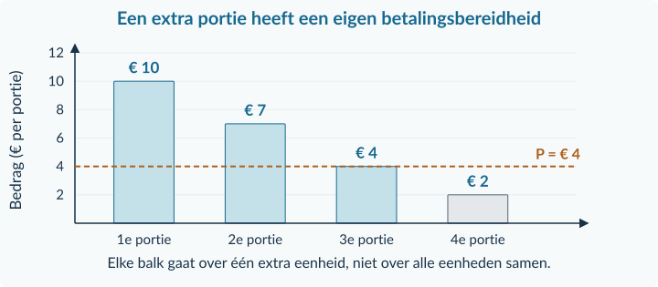
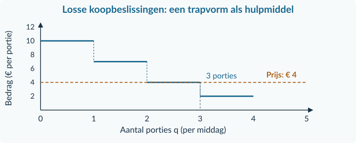
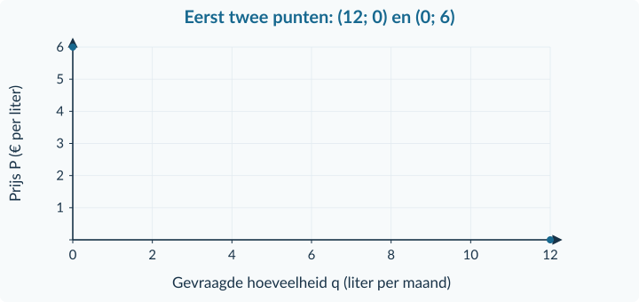
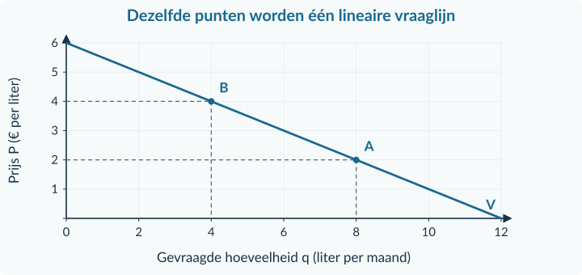
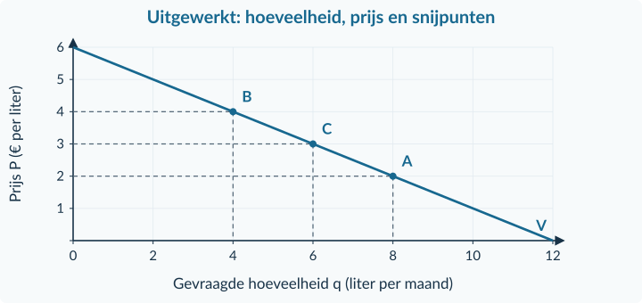
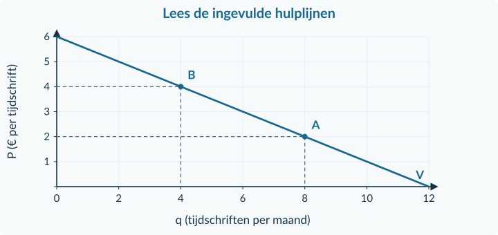
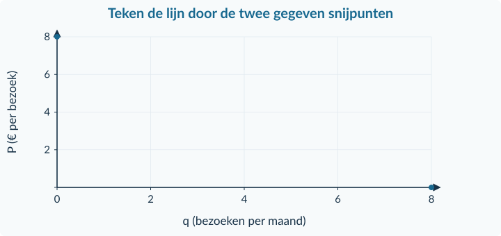

<!-- PAGE {"section": "1.2.1", "title": "Van een wens naar een koopbeslissing"} -->

1.2.1 · BOEK 1 · TWEEDE EDITIE
<h1 class="paragraph-title" id="p121">Betalingsbereidheid en individuele vraag</h1>

<strong>Na deze paragraaf kun je</strong>
<ul><li>uitleggen welke eenheden iemand bij een gegeven prijs wil kopen;</li><li>met een vraagfunctie de hoeveelheid, de prijs en de snijpunten berekenen;</li><li>een lineaire vraaglijn tekenen en uitleggen wat zij wel en niet vertelt.</li></ul>

<strong>Koop je er nog één?</strong> Een portie aardbeien kost € 4. Voor haar eerste portie wil Sara maximaal € 10 betalen. Voor volgende porties heeft zij minder over. Is drie porties kopen dan vreemd?

<strong>Betalingsbereidheid</strong>

Het maximale bedrag dat een koper voor een bepaalde eenheid van een product wil betalen. In dit voorbeeld gaat elke balk over <strong>één extra portie</strong>.

<figure><figcaption>Figuur 1 · Sara heeft voor de eerste, tweede, derde en vierde portie respectievelijk € 10, € 7, € 4 en € 2 over.</figcaption></figure>
Sara koopt de eerste drie porties: telkens is haar betalingsbereidheid minstens € 4. Voor de vierde portie wil zij minder betalen dan de prijs.

<strong>Afspraak bij gelijkheid</strong>

In de voorbeelden met losse eenheden koopt iemand ook als de prijs precies gelijk is aan de betalingsbereidheid. Er is voldoende budget en het product is verkrijgbaar, tenzij de opgave iets anders zegt.

<!-- PAGE {"section": "1.2.1", "title": "Losse eenheden en het voordeel van kopen"} -->

Dezelfde koopbeslissingen kun je als een trapvorm laten zien. Elke trede hoort bij de betalingsbereidheid voor één extra portie. Bij € 4 passen drie porties bij Sara’s keuze.

<figure><figcaption>Figuur 2 · Dit is een hulpmiddel om losse beslissingen te begrijpen. Je hoeft deze trapvorm niet zelfstandig te construeren.</figcaption></figure>
Bij € 8 koopt Sara alleen de eerste portie. Bij € 6 koopt zij er twee. <strong>De prijs verandert; haar betalingsbereidheden blijven hier gelijk.</strong>

<strong>Eerste kennismaking · Consumentensurplus</strong>

Sara heeft voor de eerste portie € 10 over, maar betaalt € 4. Haar voordeel bij die aankoop is 10 − 4 = <strong>€ 6</strong>. Bij drie porties zijn de voordelen € 6, € 3 en € 0; samen <strong>€ 9</strong>. Dit heet consumentensurplus. Het is geen bedrag dat zij uitgekeerd krijgt.

Deze kennismaking helpt je de koopbeslissing te begrijpen. In Boek 2 leer je consumentensurplus verder berekenen en in een markt interpreteren. In de doelopgaven van dit hoofdstuk hoef je geen surplusoppervlakte te bepalen.

<strong>Niet elk verband is een rechte lijn</strong>

Vier afzonderlijke porties geven een trapvorm. Een vloeiende lijn past bijvoorbeeld bij deelbare hoeveelheden of bij een benadering. Een rechte lijn is een extra vereenvoudiging. Veel kopers samen leveren niet vanzelf een precies rechte lijn op.

<!-- PAGE {"section": "1.2.1", "title": "Een vraagfunctie met betekenis"} -->

<strong>Een andere situatie.</strong> Ravi koopt vers sap. We gebruiken voor hem een lineair model. q is de hoeveelheid sap in liter per maand; P is de prijs in euro per liter.

<strong>Individuele vraag</strong>

Het verband tussen de prijs en de hoeveelheid die <strong>één koper</strong> wil en kan kopen, terwijl alle andere omstandigheden gelijk blijven. Die afspraak heet <strong>ceteris paribus</strong>.

<strong>Vraagfunctie van Ravi</strong>

q = 12 − 2P

Geldig voor 0 ≤ P ≤ 6; dus 0 ≤ q ≤ 12.

De schrijfwijze 2P betekent 2 × P. Bij P = € 2 geldt: q = 12 − 2 × 2 = <strong>8 liter per maand</strong>. Elke euro prijsstijging verlaagt q in dit model met 2 liter per maand.

<table class=""><thead><tr><th>P (€ per liter)</th><th>0</th><th>2</th><th>4</th><th>6</th></tr></thead><tbody><tr><td>q (liter per maand)</td><td>12</td><td>8</td><td>4</td><td>0</td></tr></tbody></table><figure><figcaption>Figuur 3 · Q of q staat horizontaal, P verticaal. Bij dit individuele model schrijven we q. De coördinaten zijn (q; P).</figcaption></figure>
Bij q = 0 ligt het snijpunt op de P-as. Bij P = 0 ligt het snijpunt op de q-as. De twee punten zijn genoeg om een rechte lijn vast te leggen.

<!-- PAGE {"section": "1.2.1", "title": "Van hoeveelheid terug naar prijs"} -->

De formule kan ook dezelfde relatie met <strong>P links</strong> weergeven. Begin bij q = 12 − 2P. Tel aan beide kanten 2P op: q + 2P = 12. Trek q af: 2P = 12 − q. Deel door 2:

<strong>Dezelfde relatie, anders geschreven</strong>

P = 6 − 0,5q

Geldig voor 0 ≤ q ≤ 12.

Bij q = 6 liter is P = 6 − 0,5 × 6 = <strong>€ 3 per liter</strong>. Controle: 12 − 2 × 3 = 6 liter. Je hebt geen nieuw gedrag beschreven; je leest hetzelfde verband in de andere richting.

<figure><figcaption>Figuur 4 · Bij A geldt q = 8 en P = € 2; bij B q = 4 en P = € 4. De lijn en de tabel beschrijven hetzelfde model.</figcaption></figure>
<strong>Snijpunten controleren:</strong> bij P = 0 is q = 12. Bij q = 0 los je op: 0 = 12 − 2P → 2P = 12 → P = 6. Boven € 6 heeft Ravi volgens deze koopgrens geen vraag. Gebruik daar niet een negatieve uitkomst als aankoop.

<strong>Vraag is nog geen verkoop</strong>

De functie zegt hoeveel Ravi bij een prijs wil en kan kopen. Zij vertelt niet welke prijs werkelijk wordt gevraagd, hoeveel verkopers leveren of hoeveel uiteindelijk wordt verkocht. Daarvoor is meer informatie nodig.

<!-- PAGE {"section": "1.2.1", "title": "Uitgewerkt voorbeeld · kiezen en rekenen"} -->

## Uitgewerkt voorbeeld

<strong>Bron A — Stickers.</strong> Evi’s betalingsbereidheid voor vier extra stickers is € 9, € 6, € 4 en € 1. Elke sticker kost € 4. Zij heeft genoeg geld; bij gelijkheid koopt zij ook.

<strong>a. Welke stickers koopt Evi?</strong> Vergelijk per sticker: 9 ≥ 4, 6 ≥ 4 en 4 = 4. De vierde heeft een waarde lager dan € 4. Evi koopt dus <strong>3 stickers</strong>. De waarde van de eerste sticker is niet de waarde van alle stickers samen.

<strong>Bron B — Een afzonderlijk sapmodel.</strong> Voor Bo geldt q = 12 − 2P. q is liter per maand en P is euro per liter; 0 ≤ P ≤ 6. Andere omstandigheden blijven gelijk. Dit model is geen omzetting van Evi’s stickertabel.

<strong>b. Hoeveel bij € 2 en bij € 4?</strong>

Bij € 2: q = 12 − 2 × 2 = <strong>8 liter per maand</strong>. 
Bij € 4: q = 12 − 2 × 4 = <strong>4 liter per maand</strong>.

<strong>c. Welke prijs hoort bij 6 liter?</strong>

6 = 12 − 2P 
6 + 2P = 12 — tel aan beide kanten 2P op. 
2P = 6 — trek aan beide kanten 6 af. 
P = <strong>€ 3 per liter</strong> — deel door 2. 
Controle: 12 − 2 × 3 = 6 liter.

<strong>d. Waar liggen de snijpunten?</strong>

P = 0 geeft q = 12 → <strong>(12; 0)</strong>. 
q = 0 geeft 2P = 12, dus P = 6 → <strong>(0; 6)</strong>.

<strong>Wat blijft gelijk?</strong>

Het inkomen, de voorkeuren en de overige omstandigheden van Bo veranderen niet. Alleen de prijs van sap wordt in deze vergelijking gevarieerd.

<!-- PAGE {"section": "1.2.1", "title": "Uitgewerkt voorbeeld · tekenen en interpreteren"} -->

<strong>e. Teken de vraaglijn.</strong> Kies q van 0 tot 12 horizontaal en P van 0 tot 6 verticaal. Zet de snijpunten neer en verbind ze. Controleer met A = (8; 2), B = (4; 4) en C = (6; 3).

<figure><figcaption>Figuur 5 · De prijs bij 6 liter lees je op dezelfde lijn af als de hoeveelheid bij € 3.</figcaption></figure>
<strong>f. Wat betekent de prijsstijging van € 2 naar € 4?</strong> Bo’s gevraagde hoeveelheid daalt van 8 naar 4 liter per maand. Bij een hogere prijs kiest hij minder sap, onder de genoemde gelijkblijvende omstandigheden. Dit is een voorspelling over zijn vraag, niet zelfstandig bewijs van de feitelijke verkoop.

<strong>Samenvatting · 1.2.1</strong>

Vergelijk betalingsbereidheid met de prijs. Gebruik een vraagfunctie alleen binnen de genoemde grenzen en houd andere omstandigheden gelijk. Reken terug door aan beide kanten hetzelfde te doen. Teken q horizontaal en P verticaal; controleer je snijpunten. In de volgende paragraaf veranderen ook andere vraagfactoren.

<strong>Bij je eigen antwoord:</strong> schrijf steeds wie de koper is, om welk product het gaat en op welke periode de hoeveelheid betrekking heeft. “8” alleen is nog geen volledig antwoord.

<!-- PAGE {"section": "1.2.1", "title": "Starten en de grafiek lezen"} -->

## Startopgaven

<h3>Opgave 1 · Een bekende rekenregel</h3>
Voor materiaalhuur geldt T = 5 + 2n. T is het bedrag in euro; n is een heel aantal materialen van 0 tot en met 20.

a.

Bereken T als n = 4.

b.

Bereken n als T = € 17 en controleer je antwoord.

<h3>Opgave 2 · Een aankoop en een punt</h3>
Omar wil voor een eerste poster maximaal € 8 betalen. De prijs is € 6. Hij heeft genoeg geld. In een andere vraaggrafiek staat q horizontaal en P verticaal.

a.

Koopt Omar de poster volgens de koopregel? Licht toe.

b.

Welk punt hoort bij 4 producten en € 3 per product?

<strong>Oefenroute</strong>

Normale route: Startopgaven → Begeleide inoefening → Zelfstandige oefening → Doeloefening. Uitdagende route: Startopgaven → Zelfstandige oefening → Doeloefening → Denkertje / Bonusopgave. Herhaling is aanvullend bij beide routes.

## Begeleide inoefening

Begeleide inoefening hoort bij leren: je oefent met denkstappen en doet steeds meer zelf.

De volgende opgaven bouwen de hulp af: eerst lezen, dan afmaken, daarna zelf rekenen.

<!-- PAGE {"section": "1.2.1", "title": "Begeleide inoefening · herkennen en afmaken"} -->

<h3>Opgave 3 · De ingevulde hulplijnen</h3>
Lina’s vraag naar tijdschriften is q = 12 − 2P, met q per maand en P in euro per tijdschrift. Het model geldt voor 0 ≤ P ≤ 6; de overige omstandigheden blijven gelijk.

<figure><figcaption>Figuur 6 · De antwoorden zijn grafisch zichtbaar; controleer dat je de hulplijnen goed leest.</figcaption></figure>
a.

Lees q bij P = € 2 af. Noem de eenheid.

b.

Lees P bij q = 4 af en controleer met de formule.

c.

Kun je uit de vraaglijn alleen vaststellen dat er ook echt vier tijdschriften worden verkocht? Leg uit.

<!-- PAGE {"section": "1.2.1", "title": "Begeleide inoefening · minder hulp"} -->

<h3>Opgave 4 · Maak de vraaglijn af</h3>
Voor Mats geldt q = 8 − P. q is het aantal bezoeken aan een expositieruimte per maand; P is euro per bezoek. Gebruik 0 ≤ P ≤ 8. Andere omstandigheden blijven gelijk.

<table class=""><thead><tr><th>P (€ per bezoek)</th><th>0</th><th>2</th><th>5</th><th>8</th></tr></thead><tbody><tr><td>q (bezoeken per maand)</td><td>8</td><td>…</td><td>…</td><td>0</td></tr></tbody></table><figure><figcaption>Figuur 7 · De twee snijpunten staan er al. De lijn en de twee andere punten teken je zelf.</figcaption></figure>
a.

Vul de twee ontbrekende hoeveelheden in de tabel in.

b.

Teken de rechte vraaglijn door de gegeven snijpunten. Markeer de punten bij P = € 2 en P = € 5.

c.

Welke prijs hoort bij q = 3?

<h3>Opgave 5 · Zonder tekening</h3>
Voor Lila’s pakjes kaarten geldt q = 15 − 3P, voor 0 ≤ P ≤ 5. q is pakjes per maand en P is euro per pakje. Een ander pakje heeft voor haar een gegeven betalingsbereidheid van € 4.

a.

Bereken de prijs waarbij zij volgens de functie 6 pakjes vraagt.

b.

Dat andere pakje kost € 4. Koopt ze het volgens onze afspraak bij gelijkheid?

<!-- PAGE {"section": "1.2.1", "title": "Zelfstandig de methode toepassen"} -->

## Zelfstandige oefening

<h3>Opgave 6 · Sap voor Joris</h3>
Joris’ vraag naar appelsap wordt benaderd door q = 18 − 3P, met q in liter per week en P in euro per liter. Gebruik 0 ≤ P ≤ 6 en houd de overige omstandigheden gelijk.

a.

Bereken q bij P = € 2 en bij P = € 4.

b.

Bereken de prijs die hoort bij q = 9. Controleer je antwoord.

c.

Bepaal beide snijpunten en teken zelf de vraaglijn. Markeer de punten uit a.

d.

Leg uit waarom de functie niet betekent dat Joris zeker 18 liter gaat kopen.

<h3>Opgave 7 · Een bezoek meer of minder</h3>
Noor wil voor haar eerste vier museumbezoeken per maand maximaal € 18, € 12, € 8 en € 4 per bezoek betalen. Zij heeft voldoende budget en toegang. Bij gelijkheid koopt ze ook.

a.

Hoeveel bezoeken wil Noor kopen bij € 9 per bezoek? Licht toe.

b.

Hoeveel wil zij kopen bij € 12 en bij € 6?

c.

Is in b haar betalingsbereidheid veranderd? Leg uit.

<!-- PAGE {"section": "1.2.1", "title": "Doeloefening"} -->

## Doeloefening

<h3>Opgave 8 · Fotoprints en een sapmodel</h3>
<strong>Bron A.</strong> Iris wil voor vier extra fotoprints maximaal € 12, € 9, € 5 en € 2 betalen. Elke print kost € 5. Zij heeft voldoende budget; bij gelijkheid koopt zij ook.

<strong>Bron B — een andere situatie.</strong> Voor Amir geldt q = 20 − 4P. q is sap in liter per maand, P euro per liter. De functie geldt voor 0 ≤ P ≤ 5. Alle overige omstandigheden blijven gelijk.

a.

Hoeveel fotoprints koopt Iris volgens bron A? Leg uit.

b.

Bereken met bron B de gevraagde hoeveelheid bij P = € 2 en bij P = € 3.

c.

Bereken de prijs die hoort bij q = 6 liter per maand. Controleer je antwoord.

d.

Bereken beide snijpunten van de vraaglijn uit bron B.

e.

Teken die vraaglijn in je schrift en markeer de twee punten uit b. Vermeld variabelen, eenheden en een bruikbare schaal.

f.

Leg uit wat de prijsstijging van € 2 naar € 3 voor Amirs vraag betekent. Kun je daarmee ook zijn feitelijke aankoop vaststellen?

<!-- PAGE {"section": "1.2.1", "title": "Denkertje en herhaling"} -->

## Denkertje / Bonusopgave

<h3>Opgave 9 · Hetzelfde aantal, dezelfde vraag?</h3>
Twee leerlingen kopen ieder twee drankjes bij een prijs van € 3. Een onderzoeker zegt: “Hun individuele vraag is dus precies hetzelfde.”

a.

Beoordeel de uitspraak. Geef twee verschillende rijtjes betalingsbereidheden die bij € 3 tot twee aankopen leiden, maar bij een andere prijs tot verschillende aantallen.

## Herhaling en combineren

<h3>Opgave 10 · Verhoudingen blijven nodig</h3>
Een groep koopt 6 identieke folders voor in totaal € 18. Een week later stijgt de prijs per folder van € 3 naar € 3,60.

a.

Bereken het bedrag per folder bij de eerste aankoop.

b.

Bereken de procentuele prijsverandering.

<h3>Opgave 11 · Een zaterdagmiddag</h3>
Bram heeft drie uur beschikbaar. Hij kan óf helpen bij een verhuizing voor € 36 in totaal, óf flyers bezorgen voor € 27 in totaal. Beide opties duren drie uur. Hij kiest de verhuizing; zijn doel is de hoogste geldelijke opbrengst.

a.

Wat zijn de geldelijk uitgedrukte alternatieve kosten van zijn keuze? Leg uit waarom het antwoord niet € 9 is.

<strong>Klaar voor de volgende stap</strong>

Tot nu toe varieerde je de eigen prijs terwijl de overige omstandigheden gelijk bleven. Hierna onderzoek je wat er verandert als ook inkomen, voorkeuren of andere prijzen veranderen.

