<!-- PAGE {"section": "Antwoorden", "title": "Zo gebruik je dit antwoordboek"} -->

BOEK 1 · TWEEDE EDITIE · HOOFDSTUK 2
<h1>Antwoorden Vraag</h1>
Dit antwoordboek hoort bij het leerlinghoofdstuk van 40 pagina’s. Het bevat antwoorden op <strong>38 opgaven met 90 deelvragen</strong>. Een denkertje heeft een voorbeeldantwoord en beoordelingscriteria; andere goed onderbouwde oplossingen zijn mogelijk.

<table class=""><thead><tr><th>Paragraaf</th><th>Opgaven</th><th>Pagina hier</th></tr></thead><tbody><tr><td>1.2.1 Betalingsbereidheid en individuele vraag</td><td>1–11</td><td>2</td></tr><tr><td>1.2.2 Vraagfactoren</td><td>12–22</td><td>7</td></tr><tr><td>1.2.3 Collectieve vraag</td><td>23–33</td><td>13</td></tr><tr><td>1.2.4 Gemengde opgaven</td><td>34–38</td><td>18</td></tr></tbody></table>

<strong>Vergelijk de stappen</strong>

Controleer de gekozen bron, de prijs, de hoeveelheid, de periode en de eenheid. Bekijk bij een fout eerst de berekening of uitleg, niet alleen het eindantwoord. “Waarom” verbindt de uitkomst met de economische betekenis.

<strong>Afronden</strong>

Rond geldbedragen zo nodig af op centen en percentages op twee decimalen. Gebruik ongeronde tussenuitkomsten. Een hoeveelheid blijft in de eenheid van de bron staan. Bij € 3,50 hoort bijvoorbeeld niet 3,5 liter, tenzij dat is berekend.

<strong>Grafieken beoordelen</strong>

Een andere nette schaal is goed. De assen, eenheden, punten, lijnen en geldigheidsgrenzen moeten kloppen. Bij het aanvullen van een gegeven grafiek behoud je de bestaande schalen. Een lijn buiten het gevraagde interval is niet automatisch een geldige voorspelling.

Alle contexten en getallen zijn geconstrueerde lesvoorbeelden. De antwoorden bewijzen geen werkelijk gedrag van klanten of bedrijven.

<!-- PAGE {"section": "1.2.1", "title": "Start en eerste begeleide oefening"} -->

<h2 id="ant121">1.2.1 · Betalingsbereidheid en vraag</h2><h3 id="ans1">Opgave 1 · Een bekende rekenregel</h3>

<strong>a.</strong> T = 5 + 2 × 4 = <strong>€ 13</strong>.

<strong>Waarom:</strong> Je vermenigvuldigt het bedrag per materiaal eerst met het aantal.

<strong>b.</strong> 17 = 5 + 2n → 12 = 2n → n = <strong>6 materialen</strong>. Controle: 5 + 2 × 6 = € 17.

<strong>Waarom:</strong> Aan beide kanten 5 aftrekken en vervolgens door 2 delen houdt de vergelijking gelijk.

<h3 id="ans2">Opgave 2 · Een aankoop en een punt</h3>

<strong>a.</strong> <strong>Ja</strong>, want zijn betalingsbereidheid van € 8 is hoger dan de prijs van € 6.

<strong>Waarom:</strong> Het gaat om de waarde van die ene poster voor Omar.

<strong>b.</strong> <strong>(4; 3)</strong>.

<strong>Waarom:</strong> Eerst de horizontale hoeveelheid, daarna de verticale prijs.

<h3 id="ans3">Opgave 3 · De ingevulde hulplijnen</h3>

<strong>a.</strong> Bij € 2 is q = <strong>8 tijdschriften per maand</strong>.

<strong>Waarom:</strong> De horizontale hulplijn vertrekt bij de prijs; de verticale hulplijn geeft het bijbehorende aantal.

<strong>b.</strong> P = <strong>€ 4 per tijdschrift</strong>. Controle: q = 12 − 2 × 4 = 4 tijdschriften per maand.

<strong>Waarom:</strong> P en q zijn twee coördinaten van hetzelfde punt op de lijn.

<strong>c.</strong> <strong>Nee.</strong> De lijn beschrijft Lina’s gevraagde hoeveelheid bij mogelijke prijzen; feitelijke beschikbaarheid en verkoop staan niet vast.

<strong>Waarom:</strong> Vraag is een koopplan onder voorwaarden, niet op zichzelf een waargenomen transactie.

<!-- PAGE {"section": "1.2.1", "title": "De lijn afmaken en terugrekenen"} -->

<h3 id="ans4">Opgave 4 · Maak de vraaglijn af</h3>

<strong>a.</strong> Bij P = 2: q = 8 − 2 = <strong>6 bezoeken</strong>. Bij P = 5: q = 8 − 5 = <strong>3 bezoeken</strong> per maand.

<strong>Waarom:</strong> Je vult de prijs in dezelfde rekenregel in.

<strong>b.</strong> De lijn loopt door <strong>(0; 8)</strong> en <strong>(8; 0)</strong>. De punten zijn <strong>(6; 2)</strong> en <strong>(3; 5)</strong>.

<strong>Waarom:</strong> Alle getekende punten voldoen aan q = 8 − P.

<strong>c.</strong> 3 = 8 − P → P = <strong>€ 5 per bezoek</strong>. Controle: 8 − 5 = 3.

<strong>Waarom:</strong> De prijs hoort bij de gekozen hoeveelheid op dezelfde lijn.

<figure>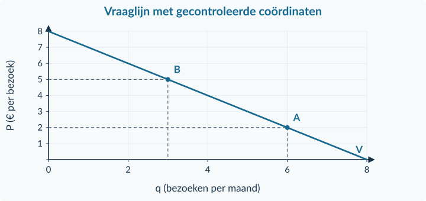<figcaption>Antwoordfiguur · Opgave 4. De schalen mogen anders zijn, maar de coördinaten en het getekende interval moeten kloppen.</figcaption></figure><h3 id="ans5">Opgave 5 · Zonder tekening</h3>

<strong>a.</strong> 6 = 15 − 3P → 6 + 3P = 15 → 3P = 9 → P = <strong>€ 3 per pakje</strong>. Controle: 15 − 3 × 3 = 6.

<strong>Waarom:</strong> Je rekent terug naar de prijs en controleert daarna de oorspronkelijke functie.

<strong>b.</strong> <strong>Ja.</strong> Bij gelijkheid veronderstellen we dat zij koopt, als er geen extra beperking is.

<strong>Waarom:</strong> De afspraak maakt een anders onbesliste koopkeuze eenduidig.

<!-- PAGE {"section": "1.2.1", "title": "Zelfstandig tekenen en kopen"} -->

<h3 id="ans6">Opgave 6 · Sap voor Joris</h3>

<strong>a.</strong> Bij € 2: 18 − 3 × 2 = <strong>12 liter per week</strong>. Bij € 4: 18 − 3 × 4 = <strong>6 liter per week</strong>.

<strong>Waarom:</strong> Bij de hogere prijs is volgens het model minder sap aantrekkelijk.

<strong>b.</strong> 9 = 18 − 3P → 3P = 9 → P = <strong>€ 3 per liter</strong>. Controle: 18 − 3 × 3 = 9 liter.

<strong>Waarom:</strong> Terugrekenen en invullen beschrijven dezelfde combinatie.

<strong>c.</strong> Snijpunten <strong>(18; 0)</strong> en <strong>(0; 6)</strong>; getekende punten <strong>(12; 2)</strong> en <strong>(6; 4)</strong>.

<strong>Waarom:</strong> Op de q-as is P nul; op de P-as is q nul.

<strong>d.</strong> 18 liter is de gevraagde hoeveelheid <strong>bij P = 0</strong> in dit model. De werkelijke prijs en verkoop zijn niet gegeven.

<strong>Waarom:</strong> Het getal is een voorwaardelijke modeluitkomst, geen gegarandeerde aankoop.

<figure>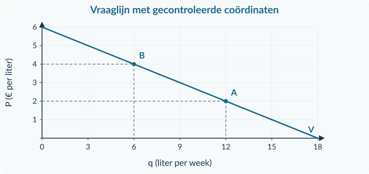<figcaption>Antwoordfiguur · Opgave 6. De schalen mogen anders zijn, maar de coördinaten en het getekende interval moeten kloppen.</figcaption></figure><h3 id="ans7">Opgave 7 · Een bezoek meer of minder</h3>

<strong>a.</strong> <strong>2 bezoeken per maand</strong>: € 18 en € 12 zijn minstens € 9; € 8 niet.

<strong>Waarom:</strong> Vergelijk de waarde van ieder extra bezoek met de prijs.

<strong>b.</strong> Bij € 12: <strong>2 bezoeken</strong>; bij € 6: <strong>3 bezoeken per maand</strong>.

<strong>Waarom:</strong> Het tweede bezoek wordt bij gelijkheid gekocht; bij € 6 past ook het derde bezoek.

<strong>c.</strong> <strong>Nee.</strong> De bron houdt de betalingsbereidheden gelijk en verandert alleen de prijs.

<strong>Waarom:</strong> Een andere koophoeveelheid hoeft geen andere voorkeur te betekenen.

<!-- PAGE {"section": "1.2.1", "title": "Doeloefening"} -->

<h3 id="ans8">Opgave 8 · Fotoprints en een sapmodel</h3>

<strong>a.</strong> <strong>3 fotoprints</strong>. De waarden € 12, € 9 en € 5 zijn minstens de prijs van € 5; de vierde waarde van € 2 is lager.

<strong>Waarom:</strong> De gelijkheidsafspraak bepaalt dat Iris ook de derde print koopt.

<strong>b.</strong> Bij € 2: q = 20 − 4 × 2 = <strong>12 liter per maand</strong>. Bij € 3: q = 20 − 4 × 3 = <strong>8 liter per maand</strong>.

<strong>Waarom:</strong> Je verandert alleen de eigen prijs in één en dezelfde vraagfunctie.

<strong>c.</strong> 6 = 20 − 4P → 6 + 4P = 20 → 4P = 14 → P = <strong>€ 3,50 per liter</strong>. Controle: 20 − 4 × 3,50 = 6 liter.

<strong>Waarom:</strong> De uitkomst blijft binnen de geldige prijsgrenzen.

<strong>d.</strong> P = 0 → q = 20: <strong>(20; 0)</strong>. q = 0 → 4P = 20 → P = 5: <strong>(0; 5)</strong>.

<strong>Waarom:</strong> Een snijpunt met een as heeft nul als de andere coördinaat.

<strong>e.</strong> Teken q horizontaal (liter per maand), P verticaal (€ per liter). Verbind <strong>(20; 0)</strong> met <strong>(0; 5)</strong>; markeer <strong>(12; 2)</strong> en <strong>(8; 3)</strong>.

<strong>Waarom:</strong> Een controlepunt uit de functie moet exact op de getekende lijn liggen.

<strong>f.</strong> De gevraagde hoeveelheid daalt <strong>met 4 liter, van 12 naar 8 liter per maand</strong>, ceteris paribus. De feitelijke aankoop is niet bepaald: beschikbaarheid en de werkelijk geldende prijs ontbreken.

<strong>Waarom:</strong> Een vraagrelatie beschrijft het gedrag bij veronderstelde prijzen; zij bevat geen aanbodinformatie.

<figure>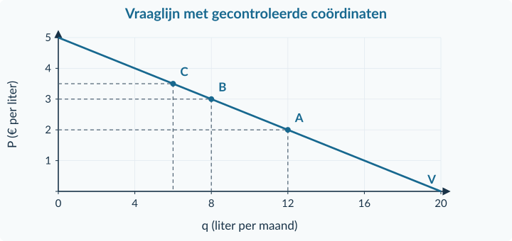<figcaption>Antwoordfiguur · Opgave 8. De schalen mogen anders zijn, maar de coördinaten en het getekende interval moeten kloppen.</figcaption></figure>

<!-- PAGE {"section": "1.2.1", "title": "Denkertje en herhaling"} -->

<h3 id="ans9">Opgave 9 · Hetzelfde aantal, dezelfde vraag?</h3>

<strong>a.</strong> Bijvoorbeeld leerling A: <strong>€ 6, € 4, € 2</strong>; leerling B: <strong>€ 5, € 3, € 1</strong>. Bij € 3 kopen beiden twee drankjes. Bij € 4 koopt A twee en B één. De uitspraak is dus onjuist.

<strong>Waarom:</strong> Eén overeenkomstig punt bewijst niet dat de hele vraagrelatie gelijk is.

<strong>Beoordelingscriteria</strong>
<ul><li>Beide rijtjes geven precies twee aankopen bij € 3, met dezelfde gelijkheidsafspraak.</li><li>Een andere prijs laat een verschil zien.</li><li>De conclusie onderscheidt één waarneming van een volledig verband.</li></ul>
<h3 id="ans10">Opgave 10 · Verhoudingen blijven nodig</h3>

<strong>a.</strong> € 18 / 6 = <strong>€ 3 per folder</strong>.

<strong>Waarom:</strong> Je deelt het totaal door het aantal identieke eenheden.

<strong>b.</strong> (3,60 − 3) / 3 × 100% = <strong>20% stijging</strong>.

<strong>Waarom:</strong> De oude prijs van € 3 is de vergelijkingsbasis. Herhaal zo nodig §1.1.2.

<h3 id="ans11">Opgave 11 · Een zaterdagmiddag</h3>

<strong>a.</strong> <strong>€ 27</strong>, de opbrengst van het beste alternatief dat hij opgeeft. € 9 is alleen het verschil tussen de twee opbrengsten.

<strong>Waarom:</strong> Alternatieve kosten meten wat de beschikbare tijd elders zou opleveren. Herhaal zo nodig §1.1.1.

<!-- PAGE {"section": "1.2.2", "title": "Start en een verschuiving lezen"} -->

<h2 id="ant122">1.2.2 · Vraagfactoren</h2><h3 id="ans12">Opgave 12 · Rekenen met een bekende basis</h3>

<strong>a.</strong> (18 − 24) / 24 × 100% = <strong>−25%</strong>.

<strong>Waarom:</strong> Je vergelijkt de afname met de oude hoeveelheid 24.

<strong>b.</strong> Q = 24 − 2 × 6 = <strong>12 stuks per week</strong>.

<strong>Waarom:</strong> Alleen de gegeven prijs wordt ingevuld.

<h3 id="ans13">Opgave 13 · Wat verandert er?</h3>

<strong>a.</strong> Een <strong>beweging langs</strong> de bestaande vraaglijn, naar een grotere gevraagde hoeveelheid.

<strong>Waarom:</strong> De eigen prijs verandert; de andere vraagfactoren niet.

<h3 id="ans14">Opgave 14 · Een beter gewaardeerde helm</h3>

<strong>a.</strong> Q gaat van <strong>24 naar 40 helmen per week</strong>. De factor is behoeften/voorkeuren; de lijn verschuift <strong>naar rechts</strong>.

<strong>Waarom:</strong> Bij dezelfde prijs willen de kopers meer helmen; dat is geen eigen-prijsbeweging.

<!-- PAGE {"section": "1.2.2", "title": "Begeleide grafische vergelijking"} -->

<h3 id="ans15">Opgave 15 · Twee losse veranderingen bij de wasstraat</h3>

<strong>a.</strong> Bij € 6: 120 − 10 × 6 = <strong>60 wasbeurten</strong>. Bij € 8: 120 − 10 × 8 = <strong>40 wasbeurten per dag</strong>. Pijl van (60; 6) naar (40; 8) op V₀.

<strong>Waarom:</strong> Alleen de prijs van de eigen dienst verandert.

<strong>b.</strong> V₁ loopt door <strong>(100; 0)</strong> en <strong>(0; 10)</strong>. Bij € 6: Q = 100 − 10 × 6 = <strong>40 wasbeurten per dag</strong>; markeer (40; 6).

<strong>Waarom:</strong> De lagere prijs van het substituut vermindert de vraag bij dezelfde eigen prijs.

<strong>c.</strong> In a beweeg je <strong>langs V₀</strong>. In b verschuift de lijn <strong>naar links</strong> door de prijs van een substituut.

<strong>Waarom:</strong> Een andere hoeveelheid kan door verschillende oorzaken ontstaan. De gevallen zijn los van elkaar, niet opgeteld.

<figure>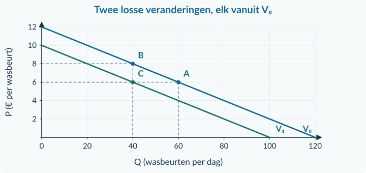<figcaption>Antwoordfiguur · Opgave 15. De schalen mogen anders zijn, maar de coördinaten en het getekende interval moeten kloppen.</figcaption></figure>

<!-- PAGE {"section": "1.2.2", "title": "Twee veranderingen en classificatie"} -->

<h3 id="ans16">Opgave 16 · Een spel en de bijbehorende console</h3>

<strong>a.</strong> Een <strong>beweging langs</strong> de vraaglijn naar een grotere gevraagde hoeveelheid.

<strong>Waarom:</strong> Het spel is het onderzochte product; zijn eigen prijs daalt.

<strong>b.</strong> De console is een <strong>complement</strong>. Zijn hogere prijs kan de vraag naar het spel <strong>naar links verschuiven</strong>, zoals de bron beschrijft.

<strong>Waarom:</strong> Het gaat om de prijs van een ander, samen gebruikt goed.

<strong>c.</strong> De effecten <strong>werken tegen elkaar in</strong>. Zonder de grootte van beide effecten is ook de richting van de totale hoeveelheidsverandering niet zeker.

<strong>Waarom:</strong> Een positieve en een negatieve bijdrage kun je niet op richting alleen bij elkaar optellen.

<strong>d.</strong> De consoleprijs en spelprijs zijn verschillende prijzen. De bron zegt juist dat het spel goedkoper wordt.

<strong>Waarom:</strong> Benoem steeds de eigenaar van de veranderde prijs; anders wissel je ongemerkt van product.

<h3 id="ans17">Opgave 17 · De oorzaak precies benoemen</h3>

<strong>a.</strong> 1. Rugzak: <strong>beweging langs; Q stijgt; eigen prijs</strong>. 2. Havermelk: <strong>verschuiving rechts; prijs substituut koemelk</strong>. 3. Simpele afhaalmaaltijd: <strong>verschuiving links; inkomen</strong>. 4. Schriften bij de school: <strong>verschuiving rechts; aantal kopers</strong>.

<strong>Waarom:</strong> Je gebruikt het productgedrag dat de bron noemt. Vooral bij inkomen is “meer inkomen → meer van alles” geen geldige algemene regel.

<!-- PAGE {"section": "1.2.2", "title": "Zelfstandig tekenen"} -->

<h3 id="ans18">Opgave 18 · Meer danslessen</h3>

<strong>a.</strong> Oud: 60 − 3 × 10 = <strong>30 lessen per week</strong>. Alleen prijs: 60 − 3 × 8 = <strong>36 lessen per week</strong>. Dit is een beweging langs V₀.

<strong>Waarom:</strong> Je houdt voor het eerste effect de oorspronkelijke vraagfunctie vast.

<strong>b.</strong> Nieuwe lijn: <strong>Q = 72 − 3P</strong> (0 ≤ P ≤ 24). Oud A = <strong>(30; 10)</strong>; alleen prijs B = <strong>(36; 8)</strong>; uiteindelijk C = <strong>(48; 8)</strong>.

<strong>Waarom:</strong> Het inkomen verhoogt volgens de bron Q bij elke prijs met 12; daarom verschuift de lijn naar rechts.

<strong>c.</strong> Uiteindelijk: 72 − 3 × 8 = <strong>48 lessen per week</strong>. De prijsdaling geeft +6 en de inkomensverandering +12: de effecten <strong>versterken elkaar</strong>.

<strong>Waarom:</strong> De stijging van 30 naar 48 heeft twee apart benoemde oorzaken.

<figure>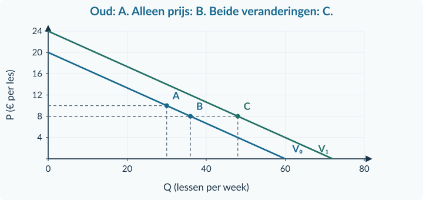<figcaption>Antwoordfiguur · Opgave 18. De schalen mogen anders zijn, maar de coördinaten en het getekende interval moeten kloppen.</figcaption></figure>

<!-- PAGE {"section": "1.2.2", "title": "Doeloefening"} -->

<h3 id="ans19">Opgave 19 · Filmhuis Lumi</h3>

<strong>a.</strong> Oud: 100 − 5 × 8 = <strong>60 bezoeken per week</strong>. Alleen de eigen prijs: 100 − 5 × 10 = <strong>50 bezoeken per week</strong>. Beweging langs V₀ naar minder bezoeken.

<strong>Waarom:</strong> De eigen prijsstijging wordt eerst los bekeken.

<strong>b.</strong> De factor is de <strong>prijs van een substituut</strong>: de andere bioscoop wordt duurder. De vraag naar Lumi verschuift <strong>naar rechts</strong>.

<strong>Waarom:</strong> Het product waarvan de prijs verandert is niet Lumi’s eigen filmbezoek.

<strong>c.</strong> Nieuwe lijn: <strong>Q = 120 − 5P</strong>, voor 0 ≤ P ≤ 24. A = <strong>(60; 8)</strong>; B = <strong>(50; 10)</strong>; C = <strong>(70; 10)</strong>.

<strong>Waarom:</strong> Alleen C bevat beide veranderingen; B is een analytische tussenstap.

<strong>d.</strong> Q nieuw = 120 − 5 × 10 = <strong>70 bezoeken per week</strong>. Verandering: 70 − 60 = <strong>10 bezoeken meer</strong>. De effecten werken elkaar tegen: −10 + 20 = +10.

<strong>Waarom:</strong> De bron geeft de omvang van beide effecten; daarom kan hier wel een netto-uitkomst worden berekend.

<strong>e.</strong> <strong>Onjuist.</strong> Lumi’s eigen prijsstijging verplaatst het punt op V₀ van 60 naar 50 bezoeken. De prijs van het substituut veroorzaakt de verschuiving naar V₁.

<strong>Waarom:</strong> De uiteindelijke stijging naar 70 bewijst niet dat een hogere eigen prijs de vraaglijn naar rechts verschuift.

<figure>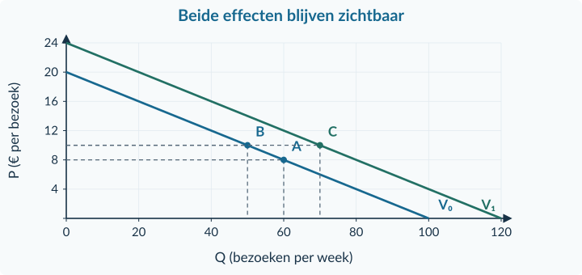<figcaption>Antwoordfiguur · Opgave 19. De schalen mogen anders zijn, maar de coördinaten en het getekende interval moeten kloppen.</figcaption></figure>

<!-- PAGE {"section": "1.2.2", "title": "Denkertje en herhaling"} -->

<h3 id="ans20">Opgave 20 · Een onderzoek met te weinig informatie</h3>

<strong>a.</strong> De belangstelling kan tegelijk zijn toegenomen, bijvoorbeeld door nieuwe positieve ervaringen die kopers met het spel delen. Een vraagverschuiving naar rechts kan de negatieve eigen-prijsreactie overtreffen. Om het eigen-prijseffect te onderzoeken moet je de prijs vergelijken bij <strong>gelijkblijvende overige omstandigheden</strong> of het effect van de andere veranderingen afzonderlijk vaststellen.

<strong>Waarom:</strong> Twee gelijktijdig geobserveerde veranderingen bewijzen niet het verband dat zou gelden onder ceteris paribus.

<strong>Beoordelingscriteria</strong>
<ul><li>Een plausibele niet-prijsfactor wordt genoemd als mogelijkheid, niet als bewezen feit.</li><li>Eigen-prijsreactie en vraagverschuiving blijven onderscheiden.</li><li>De benodigde vergelijking houdt andere omstandigheden gelijk.</li></ul>
<h3 id="ans21">Opgave 21 · Indexen vergelijken</h3>

<strong>a.</strong> (132 − 120) / 120 × 100% = <strong>10% stijging</strong>. Het verschil is <strong>12 indexpunten</strong>, niet 12%.

<strong>Waarom:</strong> De oude index 120, niet 100, is de basis voor deze verandering. Herhaal zo nodig §1.1.2.

<h3 id="ans22">Opgave 22 · Een formule teruglezen</h3>

<strong>a.</strong> 8 = 16 − 2P → 2P = 8 → P = <strong>€ 4 per stuk</strong>. Controle: 16 − 2 × 4 = 8 stuks per maand.

<strong>Waarom:</strong> Een gegeven hoeveelheid kan worden gebruikt om de bijbehorende prijs terug te rekenen. Herhaal zo nodig §1.2.1.

<!-- PAGE {"section": "1.2.3", "title": "Start en horizontaal optellen"} -->

<h2 id="ant123">1.2.3 · Collectieve vraag</h2><h3 id="ans23">Opgave 23 · Invullen en vergelijken</h3>

<strong>a.</strong> q = 8 − 2 × 4 = <strong>0 liter per week</strong>.

<strong>Waarom:</strong> De prijs ligt precies op het snijpunt met de prijsas.

<strong>b.</strong> (18 − 12) / 12 × 100% = <strong>50% stijging</strong>.

<strong>Waarom:</strong> De oude hoeveelheid van 12 liter is de basis.

<h3 id="ans24">Opgave 24 · Het totaal is geen gemiddelde</h3>

<strong>a.</strong> Q = 3 + 5 = <strong>8 liter per week</strong>. Delen door twee geeft 4 liter per koper: dat is het gemiddelde, niet het totaal.

<strong>Waarom:</strong> Collectieve vraag is de som van alle hoeveelheden bij die prijs.

<h3 id="ans25">Opgave 25 · Twee kopers van verf</h3>

<strong>a.</strong> A vraagt <strong>4 liter</strong>, B <strong>8 liter</strong>. Samen 4 + 8 = <strong>12 liter per week</strong>, dus het punt <strong>(12; 2)</strong>.

<strong>Waarom:</strong> De prijs is in alle drie grafieken hetzelfde; alleen de hoeveelheden worden opgeteld.

<strong>b.</strong> De prijs blijft <strong>€ 2 per liter</strong>. Er worden niet twee prijsbedragen voor dezelfde liter bij elkaar opgeteld.

<strong>Waarom:</strong> Collectieve vraag is horizontaal optellen bij één prijs, geen optelsom van prijzen.

<!-- PAGE {"section": "1.2.3", "title": "Geldige som en nulbijdrage"} -->

<h3 id="ans26">Opgave 26 · Teken de gezamenlijke lijn</h3>

<strong>a.</strong> P = 0: <strong>8, 16, 24</strong>. P = 2: <strong>4, 12, 16</strong>. P = 4: <strong>0, 8, 8</strong> liter per week. Q = (8 − 2P) + (16 − 2P) = <strong>24 − 4P</strong>, voor 0 ≤ P ≤ 4.

<strong>Waarom:</strong> De afzonderlijke uitkomsten blijven in dit interval niet-negatief.

<strong>b.</strong> Verbind <strong>(24; 0)</strong> met <strong>(8; 4)</strong> en controleer <strong>(16; 2)</strong>. Teken niet buiten de opgegeven grens door.

<strong>Waarom:</strong> Een correct lijnstuk toont alleen het deel waarvoor de samengevoegde rekenregel geldig is.

<figure>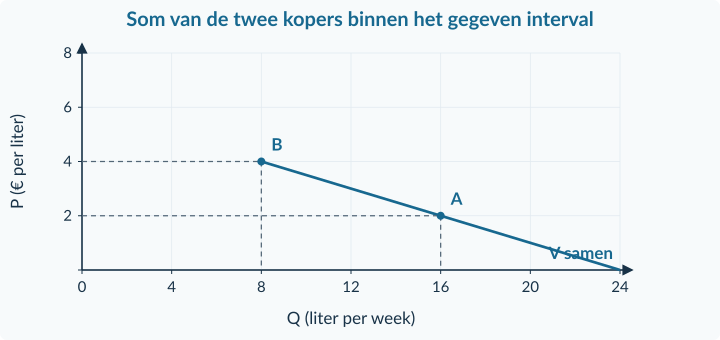<figcaption>Antwoordfiguur · Opgave 26. De schalen mogen anders zijn, maar de coördinaten en het getekende interval moeten kloppen.</figcaption></figure><h3 id="ans27">Opgave 27 · Zonder grafiek: wie koopt nog?</h3>

<strong>a.</strong> A: <strong>0</strong>; zijn koopgrens is € 6. B: 10 − 8 = <strong>2 setjes</strong>. Samen <strong>2 setjes per maand</strong>.

<strong>Waarom:</strong> De negatieve rekenuitkomst van A is geen aankoop en wordt niet van B afgetrokken.

<!-- PAGE {"section": "1.2.3", "title": "Zelfstandige oefening"} -->

<h3 id="ans28">Opgave 28 · Vraag naar illustratieprints</h3>

<strong>a.</strong> A: 12 − 3 × 2 = <strong>6 prints</strong>; B: 24 − 3 × 2 = <strong>18 prints</strong>; samen <strong>24 prints per week</strong>.

<strong>Waarom:</strong> De twee groepen worden bij dezelfde prijs vergeleken.

<strong>b.</strong> Q = (12 − 3P) + (24 − 3P) = <strong>36 − 6P</strong>, voor 0 ≤ P ≤ 4. Bij € 2: 36 − 6 × 2 = <strong>24</strong>.

<strong>Waarom:</strong> Gelijksoortige termen tel je op; de geldigheid volgt uit de beide afzonderlijke regels.

<strong>c.</strong> Eindpunten <strong>(36; 0)</strong> en <strong>(12; 4)</strong>. Controlepunt: <strong>(24; 2)</strong>. Q horizontaal, P verticaal, met eenheden.

<strong>Waarom:</strong> Het interval eindigt bij € 4, niet pas bij het rekenkundige snijpunt van de verlengde somlijn met de P-as.

<figure>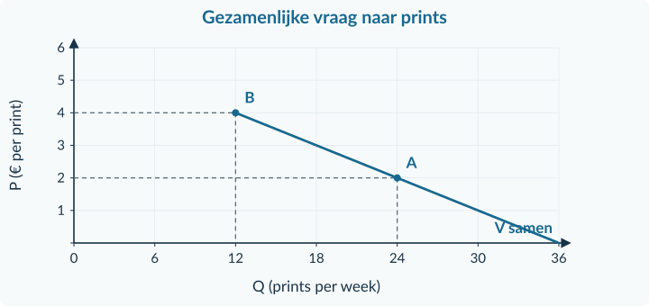<figcaption>Antwoordfiguur · Opgave 28. De schalen mogen anders zijn, maar de coördinaten en het getekende interval moeten kloppen.</figcaption></figure><h3 id="ans29">Opgave 29 · Geen negatieve bijdragen</h3>

<strong>a.</strong> A: <strong>0</strong>; B: 18 − 2 × 6 = <strong>6</strong>. Samen <strong>6 pakketten per maand</strong>.

<strong>Waarom:</strong> A heeft bij € 6 zijn koopgrens overschreden; B nog niet.

<strong>b.</strong> De gebruikte somfunctie geldt alleen voor <strong>0 ≤ P ≤ 5</strong>. Bij € 6 bevat zij voor A een bijdrage van −2. Die mag niet van B’s 6 pakketten worden afgetrokken.

<strong>Waarom:</strong> Negatieve rekenuitkomsten buiten de grens zijn geen negatieve economische vraag.

<!-- PAGE {"section": "1.2.3", "title": "Doeloefening"} -->

<h3 id="ans30">Opgave 30 · Reserveringen bij een spellenclub</h3>

<strong>a.</strong> Bij P = 0: A <strong>18</strong>, B <strong>24</strong>, samen <strong>42</strong>. Bij P = 2: <strong>12, 20, 32</strong>. Bij P = 4: <strong>6, 16, 22</strong>. Bij P = 6: <strong>0, 12, 12</strong> reserveringen per week.

<strong>Waarom:</strong> Iedere tabelrij hoort bij één gemeenschappelijke prijs.

<strong>b.</strong> Q = (18 − 3P) + (24 − 2P) = <strong>42 − 5P</strong>, voor <strong>0 ≤ P ≤ 6</strong>. Bij € 4: Q = 42 − 5 × 4 = <strong>22 reserveringen per week</strong>.

<strong>Waarom:</strong> De controle verbindt de opgetelde formule met de afzonderlijke brongegevens.

<strong>c.</strong> Verbind <strong>(42; 0)</strong> en <strong>(12; 6)</strong>. Markeer <strong>(22; 4)</strong>. Zet Q horizontaal (reserveringen per week) en P verticaal (€ per reservering).

<strong>Waarom:</strong> Je tekent alleen het interval waarvoor de somfunctie geldt.

<strong>d.</strong> A: <strong>0</strong>, omdat € 8 boven zijn grens van € 6 ligt. B: 24 − 2 × 8 = <strong>8</strong>. Samen <strong>8 reserveringen per week</strong>.

<strong>Waarom:</strong> De overgebleven vraag van B telt volledig mee.

<strong>e.</strong> De verlengde somfunctie geeft 42 − 5 × 8 = 2, maar bevat dan een negatieve bijdrage van A: 18 − 3 × 8 = −6. De geldige berekening is <strong>0 + 8 = 8</strong>.

<strong>Waarom:</strong> De teken- en formulegrens beschermt tegen het aftrekken van niet-bestaande negatieve reserveringen.

<figure>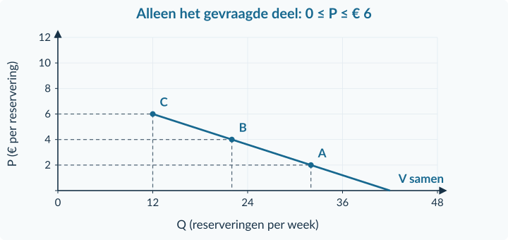<figcaption>Antwoordfiguur · Opgave 30. De schalen mogen anders zijn, maar de coördinaten en het getekende interval moeten kloppen.</figcaption></figure>

<!-- PAGE {"section": "1.2.3", "title": "Denkertje en herhaling"} -->

<h3 id="ans31">Opgave 31 · Meer mogelijke kopers, toch hetzelfde totaal</h3>

<strong>a.</strong> <strong>Niet noodzakelijk.</strong> De nieuwe mogelijke kopers kunnen allemaal maximaal € 8 willen betalen. Bij € 10 dragen zij dan nul bij en blijft het totaal gelijk. Het totaal stijgt als minstens één extra koper bij € 10 een <strong>positieve hoeveelheid wil en kan kopen</strong>, terwijl de bestaande vraag gelijk blijft.

<strong>Waarom:</strong> Een grotere bereikbare groep is niet hetzelfde als extra positieve vraag bij iedere prijs.

<strong>Beoordelingscriteria</strong>
<ul><li>Het tegenvoorbeeld behoudt de prijs en de vraag van bestaande kopers.</li><li>De nulbijdrage van de extra mogelijke kopers wordt uitgelegd.</li><li>De voorwaarde voor een werkelijk grotere totale vraag is correct.</li></ul>
<h3 id="ans32">Opgave 32 · Een daling vergelijken</h3>

<strong>a.</strong> (8 − 10) / 10 × 100% = <strong>−20%</strong>.

<strong>Waarom:</strong> De oude hoeveelheid is de basis; een daling behoudt haar negatieve teken. Herhaal zo nodig §1.1.2.

<h3 id="ans33">Opgave 33 · Afstanden op een plattegrond</h3>

<strong>a.</strong> Basis = 8 − 2 = <strong>6 m</strong>; hoogte = 6 − 3 = <strong>3 m</strong>. Rechthoek = 6 × 3 = <strong>18 m²</strong>. Driehoek = ½ × 6 × 3 = <strong>9 m²</strong>.

<strong>Waarom:</strong> De zijden zijn afstanden tussen asposities, niet de grootste afgelezen getallen. Herhaal zo nodig §1.1.3.

<!-- PAGE {"section": "1.2.4", "title": "Gemengde oefening"} -->

<h2 id="ant124">1.2.4 · Gemengde opgaven</h2><h3 id="ans34">Opgave 34 · Een workshop kiezen</h3>

<strong>a.</strong> <strong>3 workshops</strong>. De eerste drie betalingsbereidheden zijn minstens € 6; de vierde niet.

<strong>Waarom:</strong> De gelijkheidsafspraak bepaalt de derde aankoop.

<strong>b.</strong> (7,50 − 6) / 6 × 100% = <strong>25% stijging</strong>. Zij kiest nu <strong>2 workshops</strong>.

<strong>Waarom:</strong> De oude prijs is de procentuele basis; de betalingsbereidheden veranderen niet.

<h3 id="ans35">Opgave 35 · Een gezamenlijke vraag controleren</h3>

<strong>a.</strong> Bij € 2: 8 + 12 = <strong>20 boekjes</strong>. Bij € 4: 4 + 8 = <strong>12 boekjes</strong>. Bij € 6: 0 + 4 = <strong>4 boekjes per week</strong>.

<strong>Waarom:</strong> Je telt per rij hoeveelheden bij één prijs op.

<strong>b.</strong> Het gemiddelde deelt de totale hoeveelheid door twee en beschrijft een gemiddelde groep. Voor deze markt is juist de <strong>som</strong> gevraagd.

<strong>Waarom:</strong> Groepsgemiddelden en totale marktvraag zijn verschillende grootheden.

<!-- PAGE {"section": "1.2.4", "title": "Een functie in de andere schrijfwijze"} -->

<h3 id="ans36">Opgave 36 · Luisterboeken voor Sanne</h3>

<strong>a.</strong> 4 = 7 − 0,5q → 0,5q = 3 → q = <strong>6 luisterboeken per maand</strong>. Controle: 7 − 0,5 × 6 = € 4.

<strong>Waarom:</strong> Je rekent van een gegeven prijs terug naar de bijbehorende hoeveelheid.

<strong>b.</strong> q = 0 → P = 7: <strong>(0; 7)</strong>. P = 0 → 0,5q = 7 → q = 14: <strong>(14; 0)</strong>. De lijn verbindt deze punten.

<strong>Waarom:</strong> De prijs staat verticaal, hoewel zij links in de formule staat; q staat horizontaal.

<strong>c.</strong> Bij € 5: 5 = 7 − 0,5q → q = <strong>4 luisterboeken per maand</strong>. De hoeveelheid daalt van 6 naar 4, een <strong>beweging langs</strong> dezelfde lijn.

<strong>Waarom:</strong> Alleen de prijs van haar luisterboek verandert.

<strong>d.</strong> <strong>Onjuist.</strong> Extra kopers kunnen de gezamenlijke vraag veranderen, maar hoeven Sanne’s eigen vraag niet te veranderen.

<strong>Waarom:</strong> Het individuele en het collectieve niveau mogen niet worden verwisseld.

<figure>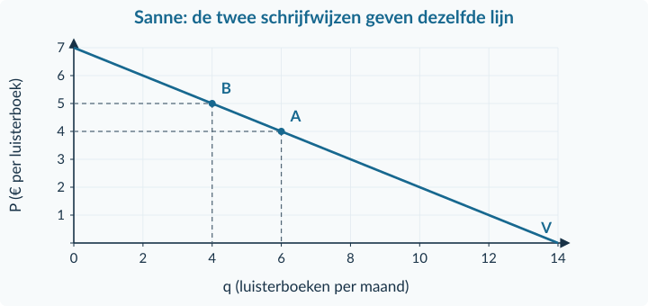<figcaption>Antwoordfiguur · Opgave 36. De schalen mogen anders zijn, maar de coördinaten en het getekende interval moeten kloppen.</figcaption></figure>

<!-- PAGE {"section": "1.2.4", "title": "Doeloefening · som en oorzaken"} -->

<h3 id="ans37">Opgave 37 · Tafeltennistijd bij Club Noord</h3>

<strong>a.</strong> Q = (24 − 3P) + (36 − 3P) = <strong>60 − 6P</strong>, voor <strong>0 ≤ P ≤ 8</strong>. Bij € 4: Q = 60 − 6 × 4 = <strong>36 halfuren per week</strong>. Controle: A = 24 − 12 = 12; B = 36 − 12 = 24; samen 12 + 24 = 36.

<strong>Waarom:</strong> Dezelfde prijs, periode en eenheid maken optellen mogelijk.

<strong>b.</strong> 30 = 60 − 6P → 6P = 30 → P = <strong>€ 5 per halfuur</strong>. Controle: 60 − 6 × 5 = 30 halfuren per week.

<strong>Waarom:</strong> De gevraagde prijs valt binnen het interval waarin beide regels geldig zijn.

<strong>c.</strong> Alleen de eigen prijs: Q = 60 − 6 × 6 = <strong>24 halfuren per week</strong>, dus 12 minder door beweging langs V₀. Het andere effect komt door de <strong>hogere prijs van het substituut bowlen</strong>: een verschuiving naar rechts met 12 halfuren bij elke prijs.

<strong>Waarom:</strong> De oorzaak van de verschuiving is niet een veranderde tafeltennisprijs of onbenoemde smaak.

<strong>Bronnen uit elkaar houden</strong>

Bron A bevat de oorspronkelijke groepsfuncties. Bron B beschrijft de twee veranderingen. Bron C is één koper die al bij A is meegeteld. Gebruik de bron die de vraag daadwerkelijk ondersteunt.

<!-- PAGE {"section": "1.2.4", "title": "Doeloefening · grafiek en conclusie"} -->

<h3 id="ans37cont">Opgave 37 · Tafeltennistijd bij Club Noord — vervolg</h3>

<strong>d.</strong> V₁: <strong>Q = 72 − 6P</strong>, alleen voor 0 ≤ P ≤ 8. A = <strong>(36; 4)</strong>; B = <strong>(24; 6)</strong>; C = <strong>(36; 6)</strong>. Bij P = 0 begint V₁ op (72; 0), bij P = 8 eindigt het gevraagde deel op (24; 8).

<strong>Waarom:</strong> A en C hebben dezelfde hoeveelheid maar verschillende prijzen en liggen op verschillende lijnen.

<strong>e.</strong> Q nieuw = 72 − 6 × 6 = <strong>36 halfuren per week</strong>. De uitspraak is <strong>onjuist</strong>: het eigen-prijseffect is −12; het substituuteffect is +12. Ze heffen elkaar hier precies op.

<strong>Waarom:</strong> Een nulverandering in het totaal bewijst niet dat de afzonderlijke effecten nul zijn.

<strong>f.</strong> Sem wil <strong>2 halfuren</strong>: € 7 en € 6 zijn minstens € 6; € 4 en € 2 niet. <strong>Niet nogmaals optellen</strong>, want hij zit al in groep A.

<strong>Waarom:</strong> De individuele koopbeslissing is een deel van de bron, geen extra koper buiten de beide groepen.

<figure>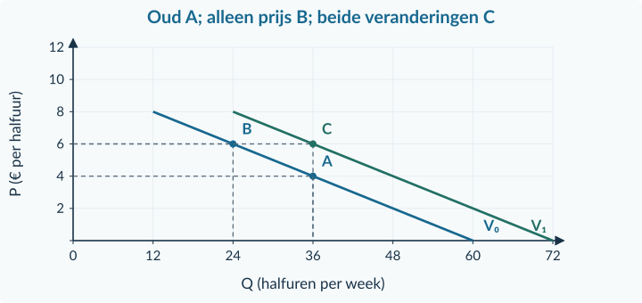<figcaption>Antwoordfiguur · Opgave 37. De schalen mogen anders zijn, maar de coördinaten en het getekende interval moeten kloppen.</figcaption></figure>

<!-- PAGE {"section": "1.2.4", "title": "Fouten repareren"} -->

<h3 id="ans38">Opgave 38 · Drie ogenschijnlijk logische antwoorden</h3>

<strong>a.</strong> Per week: A vraagt 7 × 6 = <strong>42 liter</strong>, B <strong>7 liter</strong>. Samen <strong>49 liter per week</strong>. De oorspronkelijke optelling mengt perioden.

<strong>Waarom:</strong> Een som is alleen betekenisvol wanneer de eenheden en perioden gelijk zijn.

<strong>b.</strong> De factor is <strong>de prijs van een substituut</strong>, namelijk de trein. De bron geeft een verandering van de relatieve prijs, geen verandering van smaak.

<strong>Waarom:</strong> De specifieke oorzaak blijft zichtbaar als je het andere product benoemt.

<strong>c.</strong> De functie geeft een gevraagde hoeveelheid bij een mogelijke prijs. Je weet nog niet of <strong>€ 10 werkelijk de prijs is en of de tickets verkrijgbaar zijn</strong>; feitelijke verkopen zijn niet vermeld.

<strong>Waarom:</strong> Een voorwaardelijk koopplan is geen bewijs van een uitgevoerde transactie.

<strong>Beoordelingscriteria</strong>
<ul><li>De herstelde antwoorden gebruiken gelijke eenheden en expliciete perioden.</li><li>De economische oorzaak wordt precies benoemd.</li><li>Een modeluitkomst wordt niet als bewezen verkoop gepresenteerd.</li></ul>

<strong>Terug naar de juiste uitleg</strong>

Eenheden en perioden: §1.1.2 en §1.2.3. Substituten en complementen: §1.2.2. Het verschil tussen gevraagde hoeveelheid en werkelijk verkocht: §1.2.1.

