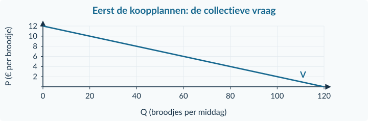
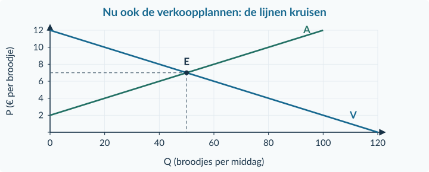
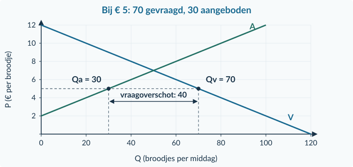
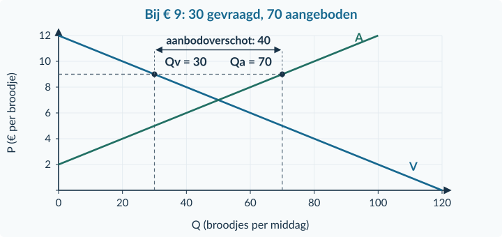
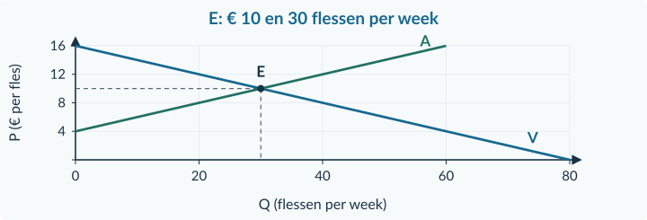
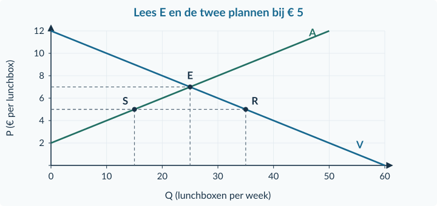
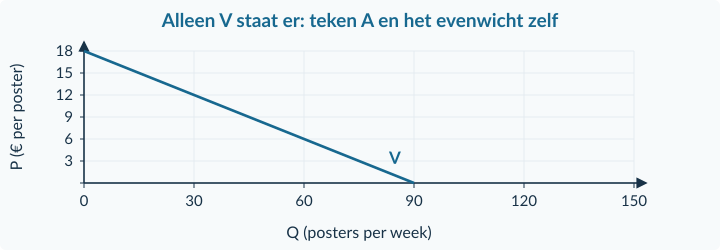

<!-- PAGE {"section": "1.3", "title": "Aanbod en marktevenwicht"} -->

BOEK 1 · HOOFDSTUK 3 · TWEEDE EDITIE
<h1 class="cover-title">Aanbod en marktevenwicht</h1>
Hoe vinden de plannen van kopers en verkopers elkaar?

<a href="#p131"><b>1.3.1 2</b>Aanbod en aanbodfactoren</a><a href="#p132"><b>1.3.2 12</b>Marktevenwicht: prijs en hoeveelheid</a><a href="#p133"><b>1.3.3 24</b>Verschuivingen en nieuw evenwicht</a><a href="#p134"><b>1.3.4 34</b>Gemengde opgaven</a>

<strong>Na dit hoofdstuk kun je</strong>
<ul><li>aanbodplannen lezen, berekenen en verklaren;</li><li>vraag en aanbod combineren tot één marktevenwicht;</li><li>tekorten, overschotten en werkelijke transacties onderscheiden;</li><li>een veranderd evenwicht uit een bron, berekening en grafiek uitleggen;</li><li>een economische uitspraak onderbouwen zonder meer te beweren dan de gegevens toelaten.</li></ul>

Een marktprijs lijkt één getal. Toch zitten daar heel veel keuzes achter. Kopers wegen af hoeveel ze willen kopen; verkopers hoeveel zij willen aanbieden. Je onderzoekt wanneer die plannen passen en wat er gebeurt als een van beide kanten verandert.

<strong>Zo werk je</strong>

Lees de uitleg en het uitgewerkte voorbeeld. Maak daarna de Startopgaven. De Begeleide inoefening biedt extra steun; de Zelfstandige oefening en Doeloefening laten je de methodes zelf gebruiken. Maak berekeningen en tekeningen in je schrift.

Alle situaties en getallen in dit hoofdstuk zijn voor het onderwijs gemaakte modellen. Prijzen, aantallen en conclusies gelden onder de voorwaarden van de betreffende bron.

Begeleide inoefening is voor de meeste leerlingen de normale route. Heb je minder tussenstappen nodig en zoek je extra uitdaging, dan kun je de uitdagende route volgen. Beide routes leiden naar dezelfde doeloefening. Herhaling is aanvullend bij beide routes.

<!-- PAGE {"section": "1.3.1", "title": "Wie biedt het product aan?"} -->

1.3.1 · BOEK 1 · TWEEDE EDITIE
<h1 class="paragraph-title" id="p131">Aanbod en aanbodfactoren</h1>
<strong>Waarom maakt een atelier bij een hogere prijs meer plantenpotten?</strong> Extra potten vragen klei, een oven en tijd. Een hogere verkoopprijs kan het aantrekkelijk maken om daarvoor meer middelen in te zetten. Maar hoeveel het atelier kan maken, hangt ook af van zijn mogelijkheden.

<strong>Na deze paragraaf kun je</strong>
<ul><li>aanbod en aangeboden hoeveelheid uitleggen;</li><li>rekenen met een aanbodfunctie en de eenheden noemen;</li><li>een prijsbeweging onderscheiden van een verschuiving door een aanbodfactor;</li><li>aanbodplannen, voorraad en werkelijke verkoop uit elkaar houden.</li></ul>
<figure><figcaption>Figuur 1 · De koopkant ken je uit hoofdstuk 1.2. Nu voegen we de verkoopkant toe.</figcaption></figure>

<strong>Aanbod</strong>

Het verband tussen de prijs van een product en de hoeveelheid die verkopers willen én kunnen aanbieden, terwijl alle andere omstandigheden gelijk blijven. Die afspraak heet <strong>ceteris paribus</strong>.

De <strong>aangeboden hoeveelheid</strong> is één hoeveelheid bij één bepaalde prijs, in een afgesproken periode. Een aanbodlijn laat zulke plannen zien bij meerdere prijzen. Het gaat nog niet om het aantal producten dat werkelijk wordt verkocht.

<!-- PAGE {"section": "1.3.1", "title": "Van verkoopplan naar lijn"} -->

Een atelier onderzoekt zijn aanbod van kleine plantenpotten. De techniek, de prijzen van klei en energie en de beschikbare werktijd blijven gelijk. Bij deze vergelijking schrijven we <strong>q</strong> voor de hoeveelheid van dit ene atelier.

<table class=""><thead><tr><th>P (€ per pot)</th><th>4</th><th>6</th><th>8</th><th>10</th><th>12</th></tr></thead><tbody><tr><td>q (potten per week)</td><td>0</td><td>10</td><td>20</td><td>30</td><td>40</td></tr></tbody></table>
Bij € 8 wil en kan het atelier 20 potten aanbieden. Bij € 10 zijn dat er 30. Zet q horizontaal en P verticaal. De coördinaten zijn dus <strong>(20; 8)</strong> en <strong>(30; 10)</strong>. In dit model verbinden we de tabelpunten met een rechte lijn.

<figure><figcaption>Figuur 2 · De stijgende lijn beschrijft dit atelier, niet de vraag naar zijn potten.</figcaption></figure>

<strong>Dezelfde gegevens in een formule</strong>

q = 5P − 20 Geldig voor 4 ≤ P ≤ 12.

Bij P = 8: q = 5 × 8 − 20 = <strong>20 potten per week</strong>. Elke euro prijsstijging vergroot hier de aangeboden hoeveelheid met 5 potten. De stap van S naar T is een <strong>beweging langs</strong> dezelfde aanbodlijn.

<!-- PAGE {"section": "1.3.1", "title": "Een andere prijs of andere omstandigheden?"} -->

Nu stijgt de prijs van klei. Vergelijk eerst bij <strong>dezelfde verkoopprijs van € 8</strong>. Het atelier wil en kan dan nog 10 potten aanbieden, in plaats van 20. De nieuwe lijn ligt links van de oude. Bij eenzelfde hoeveelheid is voortaan een hogere prijs nodig.

<figure><figcaption>Figuur 3 · Duurdere klei verandert het aanbod bij verschillende verkoopprijzen. Dat is een verschuiving van A₀ naar A₁.</figcaption></figure><table class=""><thead><tr><th>Verandering, overige omstandigheden gelijk</th><th>Aanbod bij dezelfde verkoopprijs</th></tr></thead><tbody><tr><td>Klei of energie wordt duurder.</td><td>Minder aanbod: naar links.</td></tr><tr><td>Een betere techniek maakt produceren gemakkelijker.</td><td>Meer aanbod: naar rechts.</td></tr><tr><td>Er komen meer aanbieders op de markt.</td><td>Meer marktaanbod: naar rechts.</td></tr></tbody></table>

<strong>Welke prijs verandert?</strong>

De prijs van <strong>het product zelf</strong> veroorzaakt een beweging langs de lijn. De prijs van <strong>een productiemiddel</strong> kan de lijn verschuiven. Een pot en de klei voor die pot zijn niet hetzelfde product.

De getekende functie is alleen een model binnen de opgegeven prijzen. Onder € 4 biedt het atelier in het eerste model niets aan. Een negatieve formule-uitkomst is daar <strong>geen negatief aanbod</strong>. Aanbodlijnen hoeven niet allemaal dezelfde vorm of beginprijs te hebben.

<!-- PAGE {"section": "1.3.1", "title": "Uitgewerkt voorbeeld"} -->

## Uitgewerkt voorbeeld

Een kweker levert basilicumtrays. Eerst geldt <strong>q = 4P − 12</strong>, voor 3 ≤ P ≤ 12. q is trays per week; P is euro per tray. De verkoopprijs stijgt van € 6 naar € 8. Tegelijk wordt kweekgrond duurder. Het nieuwe aanbod is <strong>q = 4P − 20</strong>, voor 5 ≤ P ≤ 12. Verder verandert er niets.

<strong>1. Eerst alleen de verkoopprijs.</strong> Oud: q = 4 × 6 − 12 = <strong>12</strong>. Bij € 8 en oude omstandigheden: q = 4 × 8 − 12 = <strong>20</strong>. De prijsstijging geeft 8 trays extra: een beweging langs A₀.

<strong>2. Daarna alleen de kweekgrond.</strong> Bij de oude prijs van € 6 wordt q = 4 × 6 − 20 = <strong>4</strong>. Duurdere kweekgrond verlaagt hier het aanbod bij elke onderzochte prijs met 8 trays: A verschuift naar links.

<figure><figcaption>Figuur 4 · R = (12; 6), S = (20; 8), T = (12; 8). De uiteindelijke prijs ligt op de nieuwe aanbodlijn.</figcaption></figure>
<strong>3. Combineer.</strong> Nieuwe prijs én nieuwe functie: q = 4 × 8 − 20 = <strong>12 trays per week</strong>. +8 door de prijs en −8 door de kweekgrond heffen elkaar hier op. Dezelfde eindhoeveelheid betekent dus niet dat er niets is veranderd.

<strong>4. Controleer de betekenis.</strong> De kweker biedt 12 trays aan. Of hij alle 12 verkoopt, hangt ook af van kopers. Een berekening van aanbod alleen bewijst geen verkoop.

<strong>Samenvatting §1.3.1</strong>

Aanbod beschrijft verkoopplannen bij verschillende prijzen. De eigen verkoopprijs geeft een beweging langs A; productiemiddelen, techniek en het aantal aanbieders kunnen A verschuiven. Vul de juiste prijs in de juiste functie in. In §1.3.2 combineren we aanbod met vraag.

<!-- PAGE {"section": "1.3.1", "title": "Starten en aflezen"} -->

## Startopgaven

<h3>Opgave 1 · Een vraagfunctie ophalen</h3>
Voor één koper geldt q = 18 − 2P, voor 0 ≤ P ≤ 9. q is stuks per maand; P is euro per stuk.

a.

Bereken q bij P = € 3.

b.

Bereken P als q = 8. Controleer je antwoord in de functie.

<h3>Opgave 2 · Plannen, voorraad en verkoop</h3>
Een fietsenmaker heeft 8 binnenbanden op voorraad. Hij wil en kan deze middag bij € 12 per vervanging 5 binnenbanden vervangen. Er komen maar 3 klanten.

a.

Welke hoeveelheid hoort bij zijn aanbodplan, welke bij zijn voorraad en welke bij zijn werkelijke verkoop?

<strong>Oefenroute</strong>

Normale route: Startopgaven → Begeleide inoefening → Zelfstandige oefening → Doeloefening. Uitdagende route: Startopgaven → Zelfstandige oefening → Doeloefening → Denkertje / Bonusopgave. Herhaling is aanvullend bij beide routes.

## Begeleide inoefening

Begeleide inoefening hoort bij leren: je oefent met denkstappen en doet steeds meer zelf.

<h3>Opgave 3 · Houten lepels</h3>
Bekijk het volledig ingevulde aanboddiagram van één maker.

<figure><figcaption>Figuur 5 · Lees eerst een afgewerkte voorstelling; de hulplijnen zijn al gegeven.</figcaption></figure>
a.

Lees de hoeveelheden bij € 4 en € 6 af.

b.

Is R → S een beweging of een verschuiving? Licht toe.

<!-- PAGE {"section": "1.3.1", "title": "Begeleide inoefening · aanvullen en vergelijken"} -->

<h3>Opgave 4 · Kaarsen en duurdere was</h3>
Een kaarsenmaker heeft eerst q = 4P − 8, voor 2 ≤ P ≤ 10. Door duurdere was wordt dit q = 4P − 16, voor 4 ≤ P ≤ 10. q is kaarsen per week; P is euro per kaars.

<table class=""><thead><tr><th>P (€ per kaars)</th><th>q oud (per week)</th><th>q nieuw (per week)</th></tr></thead><tbody><tr><td>4</td><td>…</td><td>…</td></tr><tr><td>6</td><td>…</td><td>…</td></tr><tr><td>8</td><td>…</td><td>…</td></tr></tbody></table><figure><figcaption>Figuur 6 · Alleen A₀ is gegeven. Gebruik twee tabelpunten om A₁ te tekenen.</figcaption></figure>
a.

Neem de tabel over en vul beide hoeveelheden in. Gebruik de oude en de nieuwe functie afzonderlijk.

b.

Voeg A₁ aan de grafiek toe. Markeer bij € 6 een punt op elke lijn en verklaar de richting van de verschuiving.

<h3>Opgave 5 · Twee prijzen bij granola</h3>
De verkoopprijs van granola stijgt. Tegelijk wordt de havermout voor granola duurder. Verder verandert er niets; de grootte van beide effecten is onbekend.

a.

Wat doet alleen de verkoopprijs met de aangeboden hoeveelheid?

b.

Wat doet alleen de havermoutprijs met de aanbodlijn?

c.

Kun je het uiteindelijke aanbod bepalen?

d.

Beoordeel: “Allebei de prijsstijgingen verschuiven de aanbodlijn.”

<!-- PAGE {"section": "1.3.1", "title": "Zelfstandig rekenen en oorzaken benoemen"} -->

## Zelfstandige oefening

<h3>Opgave 6 · Ansichtkaarten</h3>
Eén drukker wil en kan q = 10P − 20 ansichtkaarten per week aanbieden, voor 2 ≤ P ≤ 8. P is euro per kaart. De overige omstandigheden blijven gelijk.

a.

Bereken q bij € 4 en bij € 6. Leg uit wat het getal 10 in de functie betekent.

b.

Bereken de prijs waarbij de drukker 30 kaarten per week aanbiedt. Controleer.

<h3>Opgave 7 · Wat verandert er bij boeketten?</h3>
Onderzoek het marktaanbod van boeketten. Vergelijk per rij alleen de genoemde verandering; de overige omstandigheden blijven gelijk. Neem de tabel over en vul de drie antwoordkolommen in.

<table class=""><thead><tr><th>Gebeurtenis</th><th>Beweging of verschuiving?</th><th>Richting</th><th>Specifieke oorzaak</th></tr></thead><tbody><tr><td>De boeketprijs daalt.</td><td>…</td><td>…</td><td>…</td></tr><tr><td>Energie wordt goedkoper.</td><td>…</td><td>…</td><td>…</td></tr><tr><td>Er komen bloemisten bij.</td><td>…</td><td>…</td><td>…</td></tr><tr><td>Een sorteermachine valt uit; aanbieders kunnen minder verwerken.</td><td>…</td><td>…</td><td>…</td></tr></tbody></table>
a.

Classificeer alle situaties en benoem de specifieke oorzaak.

<strong>Eén verkoper of de hele markt?</strong>

Bij één verkoper gebruiken we hier q. Voor het totale marktaanbod gebruiken we Qa. Het aanbod van extra verkopers telt mee in Qa, maar hoeft het aanbodplan van één bestaande verkoper niet te veranderen.

<!-- PAGE {"section": "1.3.1", "title": "Zelfstandig een verschuiving tekenen"} -->

<h3>Opgave 8 · Kaas uit de regio</h3>
Voor alle kaasmakers samen geldt eerst Qa = 8P − 32, voor 4 ≤ P ≤ 16. Energie wordt goedkoper. Daardoor geldt Qa = 8P − 16, voor 2 ≤ P ≤ 16. Qa is kilo kaas per week; P is euro per kilo. Verder verandert er niets.

<figure><figcaption>Figuur 7 · De hoeveelheidsas gaat over de gezamenlijke kaasmakers; de nieuwe lijn ontbreekt.</figcaption></figure>
a.

Bereken het oude en nieuwe aanbod bij € 10 per kilo. Hoe groot is de verandering?

b.

Teken de nieuwe lijn in de figuur. Markeer de twee hoeveelheden bij € 10. Leg uit waarom je bij deze vergelijking dezelfde verkoopprijs gebruikt.

<strong>Verkoop blijft een andere vraag</strong>

De berekende hoeveelheid is aangeboden kaas. Zonder informatie over kopers kun je niet stellen dat alle kaas wordt verkocht. “Meer aanbod” is dus geen bewijs van “meer werkelijke afzet”.

<!-- PAGE {"section": "1.3.1", "title": "Doeloefening"} -->

## Doeloefening

<h3>Opgave 9 · Atelier Sprint</h3>
Eén atelier maakt sporttassen. Eerst geldt q = 4P − 40, voor 10 ≤ P ≤ 30. q is tassen per maand; P is euro per tas. De verkoopprijs stijgt van € 20 naar € 24. Tegelijk wordt stof duurder. Het nieuwe aanbod is q = 4P − 52, voor 13 ≤ P ≤ 30. Verder verandert er niets.

<figure><figcaption>Figuur 8 · Gebruik de gegeven beginlijn; voeg de nieuwe lijn en alle markeringen zelf toe.</figcaption></figure>
a.

Bereken q vóór de veranderingen en na alleen de verkoopprijsstijging. Wat betekent de 4 in de functie?

b.

Welke factor verschuift A? Bereken ter vergelijking het nieuwe aanbod bij de oude prijs van € 20.

c.

Teken A₁. Markeer R (oud), S (alleen hogere verkoopprijs) en T (beide veranderingen), met hun coördinaten.

d.

Bereken de uiteindelijke hoeveelheid en de verandering ten opzichte van het begin. Leg uit hoe de effecten samenwerken of tegenwerken.

e.

Beoordeel: “De hogere verkoopprijs verschuift de aanbodlijn naar rechts.”

<!-- PAGE {"section": "1.3.1", "title": "Denkertje en herhaling"} -->

## Denkertje / Bonusopgave

<h3>Opgave 10 · De potten staan er al</h3>
Een verkoper heeft voor één laatste marktuur al 40 vazen klaargezet. Hij kan in dat uur niets bijmaken of bijkopen. Een klant zegt: “Bij een hogere prijs moet hij altijd meer kunnen aanbieden.”

a.

Beoordeel de uitspraak. Beschrijf een aanbodvoorstelling die bij deze korte periode kan passen en noem welke informatie over zijn verkoopbereidheid nog ontbreekt.

## Herhaling en combineren

<h3>Opgave 11 · Twee korte terugblikken</h3>
Gebruik wat je in hoofdstuk 1.1 en 1.2 hebt geleerd.

a.

Een prijs stijgt van € 8 naar € 10. Bereken de procentuele verandering.

b.

Koper A vraagt bij € 3 twee liter sap per week en koper B vijf liter. B is al in de bron opgenomen. Bereken de collectieve vraag van deze twee kopers.

<strong>Van plannen naar transacties</strong>

Je kent nu beide kanten van de markt. In §1.3.2 zoeken we de prijs waarbij de gezamenlijke koopplannen en verkoopplannen op elkaar aansluiten.

<!-- PAGE {"section": "1.3.2", "title": "Wanneer passen de plannen bij elkaar?"} -->

1.3.2 · BOEK 1 · TWEEDE EDITIE
<h1 class="paragraph-title" id="p132">Marktevenwicht: prijs en hoeveelheid</h1>
<strong>Aan het einde van de middag zijn er broodjes over. Was de prijs te hoog?</strong> Je kunt niet alleen naar de verkopers kijken. Ook de plannen van kopers zijn nodig. Hieronder vergelijken we beide plannen bij dezelfde prijs.

<strong>Na deze paragraaf kun je</strong>
<ul><li>de evenwichtsprijs en evenwichtshoeveelheid uitleggen;</li><li>Qv = Qa oplossen en in beide functies controleren;</li><li>het evenwicht in een zelfgetekende marktgrafiek aangeven;</li><li>vraag- en aanbodoverschotten berekenen en prijsdruk verklaren;</li><li>onder een gegeven transactieregel de werkelijke verkoop bepalen.</li></ul>
<table class=""><thead><tr><th>P (€ per broodje)</th><th>Qᵥ (per middag)</th><th>Qₐ (per middag)</th></tr></thead><tbody><tr><td>3</td><td>90</td><td>10</td></tr><tr><td>5</td><td>70</td><td>30</td></tr><tr><td>7</td><td>50</td><td>50</td></tr><tr><td>9</td><td>30</td><td>70</td></tr><tr><td>11</td><td>10</td><td>90</td></tr></tbody></table>
Qv staat voor de <strong>collectief gevraagde hoeveelheid</strong>; Qa voor de <strong>collectief aangeboden hoeveelheid</strong>. Alle broodjes zijn in dit model gelijk. We kijken naar veel kleine kopers en verkopers. Zij kunnen elkaar vinden en de prijs kan zich aanpassen.

<strong>Marktevenwicht</strong>

De situatie waarin de gevraagde en de aangeboden hoeveelheid bij dezelfde prijs aan elkaar gelijk zijn.

Bij <strong>€ 7</strong> willen kopers 50 broodjes kopen en verkopers 50 broodjes aanbieden. € 7 is de <strong>evenwichtsprijs</strong>. 50 broodjes per middag is de <strong>evenwichtshoeveelheid</strong>. Dat betekent niet dat iedere koper evenveel koopt.

<!-- PAGE {"section": "1.3.2", "title": "Van de tabel naar het snijpunt"} -->

De vraaglijn uit hoofdstuk 1.2 blijft hetzelfde gereedschap. Zij beschrijft de gevraagde hoeveelheid bij verschillende prijzen, <strong>terwijl de overige omstandigheden gelijk blijven</strong>. Eerst tekenen we alleen deze lijn.

<figure><figcaption>Figuur 9 · De koopplannen uit de tabel: bijvoorbeeld (70; 5) en (30; 9).</figcaption></figure>
Nu voegen we de aanbodlijn toe. Die houdt de andere omstandigheden eveneens gelijk. Bij eenzelfde hoeveelheid en prijs vallen beide plannen alleen in <strong>E</strong> samen. De hulplijnen verbinden dat punt met beide assen.

<figure><figcaption>Figuur 10 · E ligt op V én A. Hier hoort P = € 7 bij Q = 50 broodjes per middag.</figcaption></figure>

<strong>Niet de hoeveelheden bij elkaar optellen</strong>

Bij evenwicht verkopen de aanbieders samen 50 broodjes, die door de vragers worden gekocht. Dat zijn <strong>dezelfde 50 transacties</strong>, niet 50 + 50 = 100.

<!-- PAGE {"section": "1.3.2", "title": "Een gelijkheid stap voor stap oplossen"} -->

Bij ingewikkeldere getallen is aflezen niet nauwkeurig genoeg. Dezelfde broodjesmarkt heeft de volgende functies. P is euro per broodje; beide hoeveelheden zijn broodjes per middag.

<strong>De twee functies</strong>

Qv = 120 − 10P   (0 ≤ P ≤ 12) Qa = 10P − 20   (2 ≤ P ≤ 12)

<strong>1. Stel de plannen gelijk.</strong> In evenwicht geldt Qv = Qa. Vervang beide hoeveelheden door hun functie. P is in beide functies dezelfde marktprijs.

120 − 10P = 10P − 20 120 = 20P − 20 &nbsp; (+10P aan beide kanten) 140 = 20P &nbsp; (+20 aan beide kanten) 7 = P &nbsp; (beide kanten delen door 20)

Aan beide kanten dezelfde bewerking uitvoeren houdt de gelijkheid intact. De tussenstappen verklaren waarom een minteken verandert; getallen springen niet zomaar naar de andere kant.

<strong>2. Bereken de hoeveelheid.</strong> Vul P = 7 in de vraagfunctie in: Qv = 120 − 10 × 7 = <strong>50 broodjes per middag</strong>.

<strong>3. Controleer met de andere functie.</strong> Qa = 10 × 7 − 20 = <strong>50 broodjes per middag</strong>.

<strong>4. Leg de uitkomst uit.</strong> Bij <strong>€ 7 per broodje</strong> zijn beide plannen 50 broodjes per middag. De gevonden prijs past ook binnen de opgegeven prijzen van beide functies.

<strong>Waarom niet P = 0 of Q = 0 invullen?</strong>

Zo vind je een snijpunt met een as. Dat is niet het marktevenwicht. Voor evenwicht moeten <strong>twee plannen bij dezelfde prijs</strong> overeenkomen.

<!-- PAGE {"section": "1.3.2", "title": "Een vraagoverschot: niet iedereen kan kopen"} -->

Stel dat de verkopers aan het begin van de middag <strong>€ 5</strong> vragen. Bij die prijs wordt Qv = 70 en Qa = 30. Kopers willen samen meer kopen dan verkopers willen en kunnen aanbieden.

<strong>Vraagoverschot</strong>

De gevraagde hoeveelheid is bij een bepaalde prijs groter dan de aangeboden hoeveelheid. Het verschil is het tekort bij die prijs.

<figure><figcaption>Figuur 11 · Het tekort is een horizontaal verschil tussen hoeveelheden, geen verschil tussen prijzen.</figcaption></figure>
<strong>Tekort:</strong> Qv − Qa = 70 − 30 = <strong>40 broodjes per middag</strong>.

Voor de verkoop maken we een extra afspraak: alle aangeboden broodjes vinden een koper, er zijn geen andere voorraden en er zijn geen verdere belemmeringen. Dan worden <strong>30 broodjes verkocht</strong>. De wens om er 70 te kopen schept niet vanzelf 70 beschikbare broodjes.

Als de prijs zich daarna mag aanpassen, ontstaat <strong>opwaartse prijsdruk</strong>. Kopers concurreren om de beperkte hoeveelheid. Bij een hogere prijs daalt de gevraagde hoeveelheid en stijgt de aangeboden hoeveelheid, langs de bestaande lijnen.

<strong>Tekort is niet hetzelfde als schaarste</strong>

Een vraagoverschot hoort bij een bepaalde marktprijs. Schaarste gaat over beperkte middelen tegenover behoeften. Ook bij marktevenwicht blijven tijd en grondstoffen schaars.

<!-- PAGE {"section": "1.3.2", "title": "Een aanbodoverschot: niet alles vindt een koper"} -->

Begin opnieuw bij dezelfde broodjesmarkt, zonder de vorige prijsverandering mee te nemen. Stel nu dat de verkoopprijs aanvankelijk <strong>€ 9</strong> is. Kopers vragen 30 broodjes; verkopers bieden er 70 aan.

<strong>Aanbodoverschot</strong>

De aangeboden hoeveelheid is bij een bepaalde prijs groter dan de gevraagde hoeveelheid.

<figure><figcaption>Figuur 12 · Bij € 9 zijn er meer verkoopplannen dan koopplannen. De afstand is 70 − 30 = 40.</figcaption></figure>
<strong>Aanbodoverschot:</strong> Qa − Qv = 70 − 30 = <strong>40 broodjes per middag</strong>. Als alle kopers een verkoper vinden en niets anders de verkoop belemmert, worden <strong>30 broodjes verkocht</strong>.

Het overschot hoeft niet al in een krat te liggen. Aanbod beschrijft plannen. Als de 70 broodjes al zijn gemaakt, blijven er 40 onverkocht. Zijn ze nog niet gemaakt, dan zijn het 40 niet-uitgevoerde verkoopplannen.

Verkopers concurreren om kopers: er ontstaat <strong>neerwaartse prijsdruk</strong>. Langs V neemt de gevraagde hoeveelheid dan toe; langs A neemt de aangeboden hoeveelheid af. In het model bewegen beide plannen naar elkaar toe.

<strong>Een model, geen belofte</strong>

Bij voldoende uitwisseling en een aanpasbare prijs kan de markt naar evenwicht bewegen. Dat hoeft niet onmiddellijk te gebeuren. Evenwicht zegt bovendien niets over de eerlijkheid van de verdeling.

<!-- PAGE {"section": "1.3.2", "title": "Uitgewerkt voorbeeld"} -->

## Uitgewerkt voorbeeld

Op een markt voor herbruikbare drinkflessen gelden <strong>Qv = 80 − 5P</strong> (0 ≤ P ≤ 16) en <strong>Qa = 5P − 20</strong> (4 ≤ P ≤ 16). Q is flessen per week; P is euro per fles. De overige omstandigheden blijven gelijk.

<strong>1. Plannen gelijkstellen en oplossen.</strong>

80 − 5P = 5P − 20 80 = 10P − 20 &nbsp; (+5P) 100 = 10P &nbsp; (+20) P = 10 &nbsp; (delen door 10)

<strong>2. Hoeveelheid en controle.</strong> Qv = 80 − 5 × 10 = <strong>30</strong>. Controle: Qa = 5 × 10 − 20 = <strong>30 flessen per week</strong>.

<strong>3. Tekenen.</strong> Voor V gebruiken we (0; 16) en (80; 0). Voor A gebruiken we (0; 4) en (60; 16). Markeer het snijpunt E = <strong>(30; 10)</strong> en verbind het met beide assen.

<figure><figcaption>Figuur 13 · De grafiek controleert de berekening. Eén punt E hoort bij dezelfde prijs in beide functies.</figcaption></figure>
<strong>4. Betekenis.</strong> Bij <strong>€ 10 per fles</strong> sluiten de plannen voor <strong>30 flessen per week</strong> op elkaar aan. De prijs is niet de maximale betalingsbereidheid; de vraaglijn raakt de prijsas pas bij € 16.

<!-- PAGE {"section": "1.3.2", "title": "Bij een andere prijs: plannen en verkoop"} -->

<strong>Vervolg van het uitgewerkte voorbeeld.</strong> Aan het begin vraagt de markt € 8 per fles. Zolang die prijs geldt, vinden alle aanbieders een koper. Er zijn geen andere voorraden of verdere belemmeringen.

<table class=""><thead><tr><th>Bij P = € 8</th><th>Berekening</th><th>Uitkomst</th></tr></thead><tbody><tr><td>Gevraagd</td><td>80 − 5 × 8</td><td>40 flessen per week</td></tr><tr><td>Aangeboden</td><td>5 × 8 − 20</td><td>20 flessen per week</td></tr><tr><td>Vraagoverschot</td><td>40 − 20</td><td>20 flessen per week</td></tr><tr><td>Verkocht volgens de afspraak</td><td>Alle 20 aangeboden flessen vinden een koper.</td><td>20 flessen per week</td></tr></tbody></table>
<strong>5. Verklaar de prijsdruk.</strong> Er zijn meer koopplannen dan verkoopplannen. De concurrentie tussen kopers geeft opwaartse druk. Bij stijging richting € 10 neemt Qv af en Qa toe. Dat zijn bewegingen langs de twee <strong>ongewijzigde</strong> lijnen.

<strong>Samenvatting §1.3.2</strong>

Evenwicht: Qv = Qa. Los P op, bereken Q en controleer beide functies. Qv &gt; Qa geeft een vraagoverschot; Qa &gt; Qv een aanbodoverschot. Werkelijke verkoop vereist ook een transactieregel. In §1.3.3 veranderen de omstandigheden achter een lijn.

## Startopgaven

<h3>Opgave 12 · Rekenen terughalen</h3>
Gebruik de eenvoudige vraagfunctie q = 30 − 3P, voor 0 ≤ P ≤ 10. q is stuks per week; P is euro per stuk.

a.

Bereken P als q = 12. Controleer.

<h3>Opgave 13 · Eén markt, dezelfde producten</h3>
Bij € 4 worden 60 bidons gevraagd en 60 bidons aangeboden. Kopers en verkopers vinden elkaar; er zijn geen andere belemmeringen.

a.

Is er evenwicht? Hoeveel bidons worden verkocht: 60 of 120? Leg uit.

<strong>Oefenroute</strong>

Normale route: Startopgaven → Begeleide inoefening → Zelfstandige oefening → Doeloefening. Uitdagende route: Startopgaven → Zelfstandige oefening → Doeloefening → Denkertje / Bonusopgave. Herhaling is aanvullend bij beide routes.

<!-- PAGE {"section": "1.3.2", "title": "Begeleide inoefening · eerst herkennen"} -->

## Begeleide inoefening

Begeleide inoefening hoort bij leren: je oefent met denkstappen en doet steeds meer zelf.

<h3>Opgave 14 · Lunchboxen</h3>
Op een markt gelden Qv = 60 − 5P en Qa = 5P − 10. Beide zijn bruikbaar voor 2 ≤ P ≤ 12. Q is lunchboxen per week; P is euro per lunchbox. De volledig uitgewerkte figuur laat E en twee plannen bij € 5 zien.

<figure><figcaption>Figuur 14 · R ligt op de vraaglijn en S op de aanbodlijn. Beide punten gebruiken dezelfde prijs.</figcaption></figure>
a.

Lees de evenwichtsprijs en evenwichtshoeveelheid af. Vul de afgelezen prijs in beide functies in.

b.

Lees bij € 5 beide hoeveelheden af. Bereken het verschil en benoem het overschot. Hoeveel wordt verkocht als alle aangeboden lunchboxen een koper vinden en er geen andere voorraad of belemmering is?

<strong>Twee verschillende vragen</strong>

“Hoeveel ontbreekt er?” vraagt om een verschil. “Hoeveel wordt verkocht?” vraagt om een aantal transacties. De antwoorden kunnen toevallig gelijk zijn, maar de berekeningen betekenen iets anders.

<!-- PAGE {"section": "1.3.2", "title": "Begeleide inoefening · aanvullen en loslaten"} -->

<h3>Opgave 15 · De tweede lijn tekenen</h3>
Voor posters geldt Qv = 90 − 5P (0 ≤ P ≤ 18) en Qa = 10P − 30 (3 ≤ P ≤ 18). Q is posters per week; P is euro per poster.

<figure><figcaption>Figuur 15 · V is gegeven; aanbodlijn, E en hulplijnen ontbreken.</figcaption></figure>
a.

Maak af: 90 − 5P = 10P − 30 → 90 = …P − 30 → … = …P. Bereken P, Q en de controle.

b.

Teken A met twee zelf berekende punten en markeer E met hulplijnen.

c.

Bereken bij € 6 het vraagoverschot of aanbodoverschot.

<h3>Opgave 16 · Zonder grafiek</h3>
Bij de opening van een markt vragen kopers 40 sjaals en bieden verkopers er 70 aan, bij dezelfde prijs. Alle kopers vinden een verkoper; niets anders belemmert de verkoop.

a.

Bereken de verkoop en het overschot. Welke kant gaat de prijsdruk op als verkopers hun prijs kunnen aanpassen?

<!-- PAGE {"section": "1.3.2", "title": "Zelfstandig oplossen en tekenen"} -->

## Zelfstandige oefening

<h3>Opgave 17 · Schriftenmarkt</h3>
Voor dezelfde soort schriften gelden Qv = 140 − 10P (0 ≤ P ≤ 14) en Qa = 10P − 20 (2 ≤ P ≤ 14). Q is schriften per week; P is euro per schrift.

a.

Bereken het evenwicht en controleer met beide functies.

b.

Teken zelf een marktgrafiek met beide lijnen, E, assen, eenheden, een schaal en hulplijnen.

c.

Bereken het overschot bij € 6 en verklaar de prijsdruk.

<h3>Opgave 18 · Fietsmanden</h3>
Qv = 120 − 4P (0 ≤ P ≤ 30); Qa = 6P − 30 (5 ≤ P ≤ 30). Q is manden per maand; P is euro per mand.

a.

Bereken de evenwichtsprijs en hoeveelheid en controleer.

b.

Een leerling vindt P = € 30 door Qᵥ = 0 te nemen en noemt dit de evenwichtsprijs. Wat heeft die leerling wel gevonden?

<h3>Opgave 19 · Plantbollen</h3>
Bij € 4 vragen kopers 90 zakken en bieden verkopers er 50 aan. Bij € 7 zijn dat 30 en 80. De gegevens betreffen dezelfde week. Op elk prijsniveau vinden alle deelnemers aan de kleinste kant een handelspartner; er zijn geen andere beperkingen.

a.

Bereken per prijs het type overschot, zijn omvang en de werkelijke verkoop.

b.

Leg uit waarom je de gevraagde en aangeboden hoeveelheden niet bij elkaar optelt.

<!-- PAGE {"section": "1.3.2", "title": "Doeloefening"} -->

## Doeloefening

<h3>Opgave 20 · Een markt voor herbruikbare bekers</h3>
Een markt verkoopt één soort herbruikbare beker. Veel kleine kopers en verkopers kunnen elkaar vinden. De overige omstandigheden blijven gelijk. Qv = 150 − 10P, voor 0 ≤ P ≤ 15. Qa = 5P − 30, voor 6 ≤ P ≤ 15. Q is bekers per week; P is euro per beker.

a.

Bereken de evenwichtsprijs. Laat je algebraïsche stappen zien.

b.

Bereken de evenwichtshoeveelheid en controleer die met beide functies. Leg de uitkomst uit in een zin met eenheden.

c.

Teken zelf beide lijnen in één marktgrafiek. Geef de assen, eenheden, schaal, E en hulplijnen naar de evenwichtsprijs en -hoeveelheid aan.

d.

Aan het begin geldt nog een prijs van € 10. Bereken Qᵥ, Qₐ en het tekort of overschot bij die prijs. Hoeveel bekers worden verkocht als al het aanbod een koper vindt, er geen andere voorraad is en niets anders de verkoop belemmert?

e.

De prijs kan zich daarna aanpassen. Verklaar de richting van de prijsdruk en de reacties van kopers en verkopers langs de bestaande lijnen.

<strong>Werk op papier</strong>

Gebruik je schrift voor de berekeningen en de zelfgetekende grafiek. Bewaar de tussenstappen: daarmee kun je een rekenfout van een verkeerde methode onderscheiden.

<!-- PAGE {"section": "1.3.2", "title": "Denkertje, herhaling en controle"} -->

## Denkertje / Bonusopgave

<h3>Opgave 21 · Iedereen tevreden?</h3>
Op een markt is evenwicht bij € 10. Een leerling wil het product wel hebben, maar wil er hoogstens € 7 voor betalen. De leerling koopt niet.

a.

Spreekt dit het marktevenwicht tegen? Beoordeel ook de uitspraak: “Bij evenwicht zijn alle behoeften vervuld.”

## Herhaling en combineren

<h3>Opgave 22 · Basis en oppervlakte</h3>
Twee korte herhalingen uit §1.1.2 en §1.1.3.

a.

Een index gaat van 96 naar 108. Bereken de relatieve verandering, met de oude index als basis.

b.

Een rechthoek heeft basis 6 cm en hoogte 4 cm. Bereken de oppervlakte van de rechthoek en van een driehoek met dezelfde basis en hoogte.

<figure><figcaption>Figuur 16 · Controleer beide functies voordat je de economische conclusie opschrijft.</figcaption></figure>

<!-- PAGE {"section": "1.3.3", "title": "Een nieuwe situatie, een nieuw evenwicht"} -->

1.3.3 · BOEK 1 · TWEEDE EDITIE
<h1 class="paragraph-title" id="p133">Verschuivingen en nieuw evenwicht</h1>
<strong>Er komen meer kopers voor fietshelmen. Waarom stijgt de prijs, maar worden er toch meer helmen verkocht?</strong> Er verandert niet alleen een punt op een lijn. De koopplannen bij verschillende prijzen veranderen.

<strong>Na deze paragraaf kun je</strong>
<ul><li>een bronverandering koppelen aan vraag of aanbod;</li><li>de nieuwe plannen bij de oude prijs vergelijken;</li><li>het nieuwe evenwicht berekenen en met het oude vergelijken;</li><li>een verschuiving en een beweging langs de ongewijzigde lijn apart uitleggen.</li></ul>

<strong>Beginmarkt en verandering</strong>

Qv,0 = 80 − 4P   (0 ≤ P ≤ 20) Qa = 4P − 16   (4 ≤ P ≤ 24) Nieuwe vraag: Qv,1 = 96 − 4P   (0 ≤ P ≤ 24)

Q is helmen per week; P is euro per helm. Alleen het aantal kopers neemt toe. Daardoor is de vraag bij iedere onderzochte prijs <strong>16 helmen groter</strong>. De oude evenwichtsprijs is € 12 en de oude hoeveelheid is 32 helmen.

<figure><figcaption>Figuur 17 · Bij € 12 verschuiven de koopplannen van 32 naar 48. Verkopers bieden bij die prijs nog 32 aan.</figcaption></figure>
<strong>Begin bij de oorzaak.</strong> Meer kopers verschuift V naar rechts. Dat wordt zichtbaar door beide vraaglijnen eerst bij <strong>dezelfde prijs</strong> te vergelijken.

<!-- PAGE {"section": "1.3.3", "title": "De nieuwe prijs is een gevolg"} -->

<strong>1. Vergelijk bij de oude prijs.</strong> Bij € 12 vragen de kopers nu 96 − 4 × 12 = <strong>48 helmen</strong>. Het aanbod blijft 4 × 12 − 16 = <strong>32 helmen</strong>. Er ontstaat een vraagoverschot van <strong>16 helmen per week</strong>.

<strong>2. Verklaar de druk.</strong> Kopers concurreren om het aanbod: de prijs komt onder opwaartse druk. Door de hogere prijs bewegen verkopers <strong>langs de bestaande aanbodlijn</strong> naar een groter aanbod.

<strong>3. Los de nieuwe gelijkheid op.</strong> 96 − 4P = 4P − 16 → 112 = 8P → <strong>P = € 14</strong>. Qv,1 = 96 − 4 × 14 = <strong>40</strong>; controle: Qa = 4 × 14 − 16 = <strong>40 helmen per week</strong>.

<figure><figcaption>Figuur 18 · Dezelfde assen en lijnen als in figuur 17. Van E₀ naar E₁ beweeg je langs A; A zelf verschuift niet.</figcaption></figure>
<strong>4. Vergelijk.</strong> De prijs stijgt van € 12 naar € 14 en de hoeveelheid van 32 naar 40. Dat de nieuwe prijs hoger is, spreekt de dalende vraaglijn niet tegen: de twee evenwichten liggen op <strong>verschillende vraaglijnen</strong>.

<strong>Oorzaak en reactie niet omdraaien</strong>

Niet: de hogere prijs verschuift V naar rechts. Wel: meer kopers verschuift V naar rechts; de prijs reageert daarop. Meer aanbod door die hogere prijs is een <strong>beweging langs A</strong>.

<!-- PAGE {"section": "1.3.3", "title": "Een aanbodverandering kan óók de prijs verhogen"} -->

<strong>Een afzonderlijk scenario.</strong> Begin opnieuw bij Qv = 80 − 4P en Qa,0 = 4P − 16. De extra kopers uit de vorige situatie zijn er nu niet. Alleen de materialen voor fietshelmen worden duurder. De aanbodfunctie wordt <strong>Qa,1 = 4P − 32</strong>, voor 8 ≤ P ≤ 24.

Bij de oude prijs van € 12 zijn de nieuwe verkoopplannen <strong>16 helmen</strong>, tegenover 32 gevraagde helmen. Het aanbod is dus naar links verschoven. Het vraagoverschot zet de prijs opnieuw onder opwaartse druk.

<figure><figcaption>Figuur 19 · Dit scenario begint opnieuw bij E₀. Door de hogere prijs bewegen kopers langs de ongewijzigde vraaglijn.</figcaption></figure>
80 − 4P = 4P − 32 → 112 = 8P → <strong>P = € 14</strong>. Qv = 80 − 4 × 14 = <strong>24</strong>; controle: 4 × 14 − 32 = <strong>24 helmen per week</strong>.

<table class=""><thead><tr><th>Afzonderlijke oorzaak</th><th>Prijs</th><th>Verhandelde hoeveelheid</th></tr></thead><tbody><tr><td>Meer kopers, aanbod gelijk</td><td>€ 12 → € 14</td><td>32 → 40</td></tr><tr><td>Duurdere materialen, vraag gelijk</td><td>€ 12 → € 14</td><td>32 → 24</td></tr></tbody></table>
Dezelfde prijsstijging kan dus bij verschillende oorzaken horen. Kijk ook naar de hoeveelheid en naar de bron. <strong>Alleen een prijswaarneming bewijst niet welke lijn verschoof.</strong>

<!-- PAGE {"section": "1.3.3", "title": "Uitgewerkt voorbeeld"} -->

## Uitgewerkt voorbeeld

Voor bakjes aardbeien gelden Qv = 40 − 2P (0 ≤ P ≤ 20) en Qa,0 = 2P − 8 (4 ≤ P ≤ 20). Q is bakjes per dag; P is euro per bakje. Alleen de verpakking wordt duurder. Voortaan geldt Qa,1 = 2P − 16 (8 ≤ P ≤ 20).

<strong>1. Oud evenwicht.</strong> 40 − 2P = 2P − 8 → 48 = 4P → <strong>P₀ = € 12</strong>. Q₀ = 40 − 2 × 12 = <strong>16</strong>. Controle: 2 × 12 − 8 = <strong>16 bakjes per dag</strong>.

<strong>2. Oorzaak en oude prijs.</strong> De verpakking is een productiemiddel. Bij € 12 daalt het aanbod naar 2 × 12 − 16 = <strong>8</strong>. De vraag blijft 16. Vraagoverschot: <strong>8 bakjes per dag</strong>; opwaartse prijsdruk.

<strong>3. Nieuw evenwicht.</strong> 40 − 2P = 2P − 16 → 56 = 4P → <strong>P₁ = € 14</strong>. Q₁ = 40 − 2 × 14 = <strong>12</strong>. Controle: 2 × 14 − 16 = <strong>12 bakjes per dag</strong>.

<figure><figcaption>Figuur 20 · A verschuift naar links. De hogere prijs geeft een beweging langs V naar minder gevraagde bakjes.</figcaption></figure>
<strong>4. Vergelijk en verklaar.</strong> De hoeveelheid verandert met (12 − 16) / 16 × 100% = <strong>−25%</strong>. De prijs stijgt. De oorspronkelijke oorzaak is duurdere verpakking; de prijsreactie verkleint vervolgens de gevraagde hoeveelheid.

<strong>Samenvatting §1.3.3</strong>

Werk steeds vanuit een duidelijke beginsituatie. Benoem de factor en de verschuivende lijn. Vergelijk de plannen bij de oude prijs en verklaar de druk. Bereken het nieuwe evenwicht en controleer. Bij één verschuivende lijn veroorzaakt de prijsreactie een beweging langs de onveranderde andere lijn. In §1.3.4 kies je de methode zelf.

<!-- PAGE {"section": "1.3.3", "title": "Starten en een uitgewerkte verandering lezen"} -->

## Startopgaven

<h3>Opgave 23 · Een verandering vergelijken</h3>
Een hoeveelheid stijgt van 320 naar 400 stuks per week.

a.

Bereken de procentuele verandering.

<h3>Opgave 24 · Welke oorzaak?</h3>
Er komen meer kopers van fietsbellen. De techniek, het aantal verkopers en hun omstandigheden blijven gelijk.

a.

Welke lijn verschuift? Verschuift de andere lijn ook zodra de marktprijs stijgt?

<strong>Oefenroute</strong>

Normale route: Startopgaven → Begeleide inoefening → Zelfstandige oefening → Doeloefening. Uitdagende route: Startopgaven → Zelfstandige oefening → Doeloefening → Denkertje / Bonusopgave. Herhaling is aanvullend bij beide routes.

## Begeleide inoefening

Begeleide inoefening hoort bij leren: je oefent met denkstappen en doet steeds meer zelf.

<h3>Opgave 25 · Plantenvoeding</h3>
Er komen meer kopers. De figuur toont de volledige uitwerking; het aanbod verandert niet.

<figure><figcaption>Figuur 21 · Beide evenwichten en de nieuwe vraaglijn zijn hier al gemarkeerd.</figcaption></figure>
a.

Lees de oude en nieuwe prijs en hoeveelheid af.

b.

Leg uit waarom de grotere aangeboden hoeveelheid hier geen verschuiving van A is.

<!-- PAGE {"section": "1.3.3", "title": "Begeleide inoefening · een nieuwe aanbodlijn"} -->

<h3>Opgave 26 · Duurder papier voor notitieblokken</h3>
Begin met Qv = 100 − 5P (0 ≤ P ≤ 20) en Qa,0 = 5P − 20 (4 ≤ P ≤ 20). Door duurdere papierpulp wordt het aanbod Qa,1 = 5P − 40 (8 ≤ P ≤ 20). Q is notitieblokken per week; P is euro per blok. Er zijn geen andere veranderingen.

<figure><figcaption>Figuur 22 · De beginlijnen zijn gegeven; de verandering en uitkomsten teken je zelf.</figcaption></figure>
a.

Bereken het oude en nieuwe evenwicht. Controleer beide hoeveelheden. Gebruik per situatie Qᵥ = Qₐ.

b.

Voeg A₁ toe aan de figuur. Markeer E₀ en E₁. Gebruik twee zelf berekende punten voor de nieuwe lijn.

c.

Bereken bij de oude prijs de nieuwe Qₐ en de ongewijzigde Qᵥ. Leg via het verschil uit waarom de prijs verandert.

<strong>Hulp bij de twee pijlen</strong>

Een horizontale vergelijking bij de oude prijs toont de verschuiving. De stap van E₀ naar E₁ ligt op de ongewijzigde vraaglijn. Zet bij iedere pijl welke verandering hij laat zien.

<!-- PAGE {"section": "1.3.3", "title": "Twee verschuivingen en zelfstandige berekening"} -->

<h3>Uitgewerkt voorbeeld · Minder vraag én minder aanbod</h3>

Bij wollen sjaals kiezen minder kopers voor wol. Tegelijk wordt wol duurder door een kleinere wolproductie. Dit zijn twee afzonderlijke oorzaken. De vraaglijn is dalend en de aanbodlijn is stijgend; overige omstandigheden blijven gelijk.

<table><thead><tr><th>Stap</th><th>Redenering en uitkomst</th></tr></thead><tbody>
<tr><td>1. Alleen minder kopers</td><td>Bij iedere prijs worden minder sjaals gevraagd: V schuift naar links. Bij gelijkblijvend aanbod dalen evenwichtsprijs en -hoeveelheid.</td></tr>
<tr><td>2. Alleen duurdere wol</td><td>Bij iedere prijs worden minder sjaals aangeboden: A schuift naar links. Bij gelijkblijvende vraag stijgt de evenwichtsprijs en daalt de hoeveelheid.</td></tr>
<tr><td>3. Beide veranderingen</td><td>Beide effecten verkleinen de evenwichtshoeveelheid: die daalt. De prijseffecten zijn tegengesteld. Zonder de grootte van de verschuivingen kan de prijs stijgen, dalen of gelijk blijven.</td></tr>
</tbody></table>
<strong>Conclusie:</strong> minder verhandelde sjaals staat vast; een gelijke prijs niet. Tegengestelde prijsdruk hoeft elkaar niet precies op te heffen.

<h3>Opgave 27 · Meer vraag én meer aanbod</h3>
Er komen meer kopers van campinglampen. Tegelijk maakt een betere techniek de productie gemakkelijker. De vraag- en aanbodlijn verschuiven allebei naar rechts. De oorspronkelijke lijnen zijn dalend respectievelijk stijgend. De verschuivingen zijn niet becijferd.

a.

Wat gebeurt er met evenwichtsprijs en -hoeveelheid als je alleen de extra kopers bekijkt?

b.

Wat gebeurt er als je alleen de betere techniek bekijkt?

c.

Welke richting van de uiteindelijke hoeveelheid is bepaald? Is de richting van de prijs ook bepaald?

d.

Een leerling zegt: “De tegengestelde prijsdruk betekent dat de prijs gelijk blijft.” Waarom volgt dat niet?

## Zelfstandige oefening

<h3>Opgave 28 · Reparatiesets</h3>
Qv,0 = 96 − 4P (0 ≤ P ≤ 24) en Qa = 4P − 16 (4 ≤ P ≤ 28). Repareren wordt populairder. Alleen de voorkeur verandert: Qv,1 = 112 − 4P (0 ≤ P ≤ 28). Q is sets per week; P is euro per set.

a.

Bereken beide evenwichten en controleer de hoeveelheden.

b.

Vergelijk na de verandering de plannen bij de oude prijs. Verklaar de prijsdruk.

c.

Bereken de procentuele verandering van de evenwichtshoeveelheid.

<!-- PAGE {"section": "1.3.3", "title": "Zelfstandig tekenen en een bron beoordelen"} -->

<h3>Opgave 29 · Houten speelgoed</h3>
Qv = 120 − 6P (0 ≤ P ≤ 20) en Qa,0 = 6P − 24 (4 ≤ P ≤ 20). Door goedkoper hout wordt Qa,1 = 6P − 12 (2 ≤ P ≤ 20). Q is speelgoedsets per maand; P is euro per set. De overige omstandigheden blijven gelijk.

<figure><figcaption>Figuur 23 · Teken de verandering en benoem daarnaast de beweging op V.</figcaption></figure>
a.

Bereken beide evenwichten en controleer. Voeg A₁, E₀, E₁ en hun coördinaten aan de figuur toe.

b.

Leg uit waarom de grotere gevraagde hoeveelheid niet bewijst dat de vraaglijn is verschoven.

<h3>Opgave 30 · Wat past bij de waarneming?</h3>
De prijs van kampeermatten stijgt en de verkochte hoeveelheid daalt. Volgens een onderzoek is er precies één verandering: óf materiaal werd duurder, óf de voorkeur voor deze matten nam toe. De andere lijn bleef gelijk.

a.

Welke van de twee verklaringen past in het standaardmodel? Motiveer met prijs én hoeveelheid.

<!-- PAGE {"section": "1.3.3", "title": "Doeloefening"} -->

## Doeloefening

<h3>Opgave 31 · Meer kopers van oplaadkabels</h3>
Een regionale markt heeft Qv,0 = 100 − 5P (0 ≤ P ≤ 20) en Qa = 5P − 20 (4 ≤ P ≤ 24). Q is kabels per week; P is euro per kabel. Er komen meer kopers. Alleen daardoor wordt Qv,1 = 120 − 5P (0 ≤ P ≤ 24). De omstandigheden van de aanbieders blijven gelijk.

<figure><figcaption>Figuur 24 · De oorspronkelijke lijnen zijn gegeven; de nieuwe lijn en uitkomsten ontbreken.</figcaption></figure>
a.

Bereken het oude evenwicht en controleer met beide functies.

b.

Benoem de specifieke factor. Bereken na de verandering beide plannen bij de oude prijs en verklaar de prijsdruk.

c.

Bereken het nieuwe evenwicht en controleer. Bereken de procentuele verandering van Q.

d.

Voeg V₁ toe. Markeer E₀ en E₁ met coördinaten. Laat met pijlen de verschuiving bij de oude prijs en de beweging langs A zien.

e.

Beoordeel: “De grotere aangeboden hoeveelheid komt door een verschuiving van de aanbodlijn.”

<!-- PAGE {"section": "1.3.3", "title": "Denkertje en herhaling"} -->

## Denkertje / Bonusopgave

<h3>Opgave 32 · Twee verklaringen voor dezelfde richting</h3>
In een krant staat dat de prijs én de verkochte hoeveelheid van een product zijn gestegen. Er staat niets over veranderingen in vraagfactoren of aanbodfactoren.

a.

Beschrijf of schets twee verschillende verklaringen die hierbij kunnen passen. Gebruik in één verklaring één verschuiving en in de andere twee verschuivingen. Leg uit waarom de twee waarnemingen de precieze oorzaak niet bewijzen.

## Herhaling en combineren

<h3>Opgave 33 · Formules en eenheden ophalen</h3>
Gebruik de methodes uit eerdere paragrafen.

a.

Een vereniging betaalt € 84 voor 14 gelijke mappen. Bereken het bedrag per map.

b.

Voor één koper geldt q = 20 − 2P, voor 0 ≤ P ≤ 10. q is stuks per maand; P is euro per stuk. Bereken beide snijpunten van de vraaglijn met de assen.

<figure><figcaption>Figuur 25 · Houd de oorspronkelijke oorzaak en de reactie op de nieuwe prijs apart.</figcaption></figure>

<!-- PAGE {"section": "1.3.4", "title": "Gemengde opgaven"} -->

1.3.4 · BOEK 1 · TWEEDE EDITIE
<h1 class="paragraph-title" id="p134">Gemengde opgaven: aanbod en marktevenwicht</h1>
Nu kies je zelf de passende methode. Kijk eerst of een bron één aanbieder, de hele markt of alleen een waarneming beschrijft. Gebruik bij een nieuwe situatie de bijbehorende functies. Er komt geen nieuwe theorie bij.

<h3>Opgave 34 · Knoppen uit een 3D-printer</h3>
Eén maker biedt q = 6P − 18 knoppen per week aan, voor 3 ≤ P ≤ 15. P is euro per knop. Door een betere printer wordt het aanbod q = 6P − 12, voor 2 ≤ P ≤ 15. De verkoopprijs blijft € 7.

a.

Bereken het aanbod vóór en na de verandering. Benoem de factor en de grafische verandering.

b.

Een medewerker noemt het nieuwe aantal “de evenwichtshoeveelheid”. Waarom volgt dat niet uit deze bron?

<h3>Opgave 35 · Fietslampjes bij de opening</h3>
Op een markt gelden Qv = 90 − 5P (0 ≤ P ≤ 18) en Qa = 10P − 30 (3 ≤ P ≤ 18). Q is lampjes per week; P is euro per lampje. De openingsprijs is € 6. Alle aangeboden lampjes vinden een koper; er zijn geen andere voorraden of verkoopbelemmeringen.

a.

Bereken het evenwicht en controleer.

b.

Bereken de verkoop en het tekort bij de openingsprijs.

c.

Verklaar de prijsdruk na de opening, als de prijs zich kan aanpassen.

<!-- PAGE {"section": "1.3.4", "title": "Een marktverandering zelfstandig uitwerken"} -->

<h3>Opgave 36 · Tenten uit de fabriek</h3>
Een markt voor eenvoudige tenten heeft Qv = 120 − 4P (0 ≤ P ≤ 30) en Qa,0 = 8P − 24 (3 ≤ P ≤ 24). Q is tenten per maand; P is euro per tent. Door een nieuwe productietechniek geldt voortaan Qa,1 = 8P − 12 (1,5 ≤ P ≤ 24). De vraag en de overige omstandigheden blijven gelijk.

a.

Bereken beide evenwichten en controleer. Leg uit wat de verandering van −24 naar −12 betekent bij dezelfde prijs.

b.

Teken zelf V, A₀ en A₁ in één marktgrafiek. Markeer beide evenwichten met coördinaten. Leg uit welke lijn verschuift en langs welke lijn een beweging optreedt.

c.

Beoordeel: “Na de verandering moet je nog steeds Qᵥ = Qₐ,₀ gebruiken, want vraag en aanbod moeten gelijk blijven.”

<strong>Terugvinden wat je nodig hebt</strong>
<table class=""><thead><tr><th>Loop je vast bij…</th><th>Herneem dan…</th></tr></thead><tbody><tr><td>Functie invullen of terugrekenen</td><td>§1.2.1 en opgave 6 in dit hoofdstuk.</td></tr><tr><td>Een nieuwe lijn tekenen</td><td>Opgave 4 of 15 met het gedeeltelijk ingevulde diagram.</td></tr><tr><td>De gelijkheid oplossen en controleren</td><td>Het voorbeeld op pagina 17 en opgave 15.</td></tr><tr><td>De oorzaak van een nieuw evenwicht</td><td>Het voorbeeld op pagina 27 en opgave 26.</td></tr></tbody></table>

Gebruik deze verwijzingen gericht. Een juiste einduitkomst zonder passende uitleg is geen bewijs dat je de oorzaak en de reactie uit elkaar houdt.

<!-- PAGE {"section": "1.3.4", "title": "Doeloefening · bronnen"} -->

## Doeloefening

<strong>Opgave 37 · De linnen boodschappentas</strong>

Gebruik deze vier bronnen bij de vragen op de rechterpagina. De gegevens zijn voor dit lesmodel gemaakt. Een deel van de informatie is niet nodig voor de berekeningen.

<strong>Bron A · De oorspronkelijke markt</strong>

In deze oefening gaat het om één soort linnen boodschappentas. Er zijn veel kleine kopers en verkopers. De prijs kan zich aanpassen. Q is tassen per week; P is euro per tas.

Qv = 180 − 10P &nbsp; (0 ≤ P ≤ 18) Qa,0 = 10P − 20 &nbsp; (2 ≤ P ≤ 18)

<strong>Bron B · Linnen wordt duurder</strong>

Alleen de prijs van het linnen stijgt. De koopplannen van consumenten veranderen niet. De aanbieders hebben voortaan deze aanbodfunctie:

Qa,1 = 10P − 60 &nbsp; (6 ≤ P ≤ 18)

Deze nieuwe situatie begint vanuit bron A. Er is geen andere vraag- of aanbodverandering.

<strong>Bron C · Een afzonderlijke prijsvergelijking</strong>

Bekijk daarna afzonderlijk de nieuwe situatie uit bron B bij een verkoopprijs van <strong>€ 14</strong>. Zolang deze prijs geldt, vindt iedere koper die volgens de vraagfunctie wil kopen een verkoper. Er zijn geen andere belemmeringen. Dit is een rekenvergelijking bij één prijs, geen wettelijke prijsregel.

<strong>Bron D · Een uitspraak</strong>

Een verkoper beweert: “Door de hogere marktprijs is de vraaglijn naar links verschoven. Het nieuwe evenwicht laat bovendien zien dat iedereen tevreden is.” De vormgeving van de tassen kreeg in een enquête 4,6 uit 5 punten; die beoordeling veranderde niet.

Schrijf bij een berekening steeds welke situatie je gebruikt. Geef bij een conclusie aan welk getal, welke lijn of welke bron je argument ondersteunt.

<!-- PAGE {"section": "1.3.4", "title": "Doeloefening · vragen"} -->

<h3>Opgave 37 · De linnen boodschappentas</h3>
Gebruik bronnen A–D op de linkerpagina. Werk met tassen per week en euro per tas.

a.

Bereken uit bron A de evenwichtsprijs en -hoeveelheid. Controleer de hoeveelheid met beide functies.

b.

Leg uit welke lijn door bron B verschuift en waarom. Bereken het nieuwe aanbod bij de oude evenwichtsprijs en vergelijk dit met de ongewijzigde vraag.

c.

Bereken het nieuwe evenwicht en controleer. Bereken de procentuele verandering van prijs én verhandelde hoeveelheid ten opzichte van bron A.

d.

Teken zelf V, A₀ en A₁ in één marktgrafiek. Geef assen, eenheden en schaal. Markeer E₀ en E₁ met coördinaten en hulplijnen. Laat ook een verschuiving bij de oude prijs en de beweging langs de ongewijzigde lijn zien.

e.

Gebruik nu uitsluitend de situatie van bron C. Bereken de vraag, het nieuwe aanbod, het type en de omvang van het overschot en de werkelijke verkoop volgens de gegeven afspraak.

f.

Beoordeel beide delen van de uitspraak in bron D. Gebruik je berekening en het model. Noem ook één gegeven uit bron D dat niet nodig was om de evenwichten te berekenen.

<!-- PAGE {"section": "1.3.4", "title": "Rekengereedschap voor het vervolg"} -->

<h3>Opgave 38 · Korte terugblik op hoofdstuk 1.1</h3>
Deze vragen halen eerder geleerde rekenvaardigheden op. De figuur is een meetkundige tekening, geen nieuwe economische grafiek.

<figure><figcaption>Figuur 26 · A = (0; 2), B = (8; 2), C = (0; 6). Beide assen meten centimeters.</figcaption></figure>
a.

Een magazijn betaalt € 90 voor 15 gelijke dozen. Bereken het bedrag per doos.

b.

Voor 6 extra dozen betaalt het magazijn € 36 extra. Bereken het extra bedrag per extra doos.

c.

Een prijsindex stijgt van 125 naar 150. Bereken de procentuele verandering.

d.

Bereken in de figuur de basis AB, de hoogte van C boven AB en de oppervlakte van driehoek ABC. Bereken ook de oppervlakte van een rechthoek met dezelfde basis en hoogte.

Loop je vast bij de eerste drie vragen? Herneem §1.1.2. Voor de meetkunde gebruik je §1.1.3. De economische betekenis van kosten en surplus komt in Boek 2; hier herhaal je alleen de rekenstappen.

<!-- PAGE {"section": "Overzicht", "title": "Hoofdstukoverzicht"} -->

<h1 id="overzicht">Hoofdstukoverzicht</h1><table class=""><thead><tr><th>Vraag</th><th>Werkwijze</th><th>Controle</th></tr></thead><tbody><tr><td>Hoeveel wordt aangeboden?</td><td>Vul de gegeven P in de juiste aanbodfunctie in.</td><td>Past P binnen de opgegeven voorwaarden? Eenheid per periode?</td></tr><tr><td>Wat is het evenwicht?</td><td>Stel Qᵥ = Qₐ, los P op en bereken Q.</td><td>Vul P in beide oorspronkelijke functies in.</td></tr><tr><td>Is er een overschot?</td><td>Bereken beide plannen bij dezelfde prijs; neem het positieve verschil.</td><td>Qᵥ &gt; Qₐ: vraagoverschot. Qₐ &gt; Qᵥ: aanbodoverschot.</td></tr><tr><td>Hoeveel wordt werkelijk verkocht?</td><td>Gebruik de transactieregel uit de bron.</td><td>Kunnen deelnemers elkaar vinden? Andere voorraden of belemmeringen?</td></tr><tr><td>Waarom verandert het evenwicht?</td><td>Bron → factor → lijn → plannen bij oude prijs → druk → nieuw evenwicht.</td><td>De andere lijn blijft staan; de prijsreactie geeft een beweging erlangs.</td></tr></tbody></table>

<strong>Rekenen met een veranderd evenwicht</strong>

Verandering in % = (nieuw − oud) / oud × 100% Gebruik bij prijsverandering de oude prijs en bij hoeveelheidverandering de oude hoeveelheid.

<strong>Bij dezelfde prijs vergelijken maakt een verschuiving zichtbaar.</strong> Na een vraagtoename verandert de uiteindelijke hoeveelheid minder dan de vraagtoename bij de oude prijs: de prijs reageert ook. Houd het tijdelijke verschil en de uiteindelijke verandering dus uit elkaar.

<strong>Drie waarschuwingen</strong>

<strong>Eén aanbodplan is geen marktuitkomst.</strong> Daarvoor is ook vraag nodig. <strong>Een hoger getal is niet automatisch een verschuiving.</strong> Benoem de oorzaak. <strong>Evenwicht is geen oordeel over eerlijkheid.</strong> Het betekent dat de plannen bij die prijs aansluiten.

Vraag en aanbod kunnen allebei naar rechts verschuiven. In het behandelde model neemt Q dan toe; zonder relatieve groottes weet je niet wat P doet. Er is geen extra verschuiving nodig om een reactie op een veranderde prijs te verklaren.

<!-- PAGE {"section": "Overzicht", "title": "Begrippen en het vervolg"} -->

<h1 id="begrippen">Begrippen en het vervolg</h1>

<strong>Aanbod</strong> Verkoopplannen bij verschillende prijzen, terwijl overige omstandigheden gelijk blijven.

<strong>Aangeboden hoeveelheid</strong> Het aantal dat verkopers bij één prijs willen en kunnen aanbieden in de genoemde periode.

<strong>Aanbodfactor</strong> Omstandigheid achter de aanbodlijn, zoals techniek, productiemiddelprijzen of aantal aanbieders.

<strong>Aanbodoverschot</strong> Bij een prijs is Qₐ groter dan Qᵥ; het verschil is Qₐ − Qᵥ.

<strong>Beweging langs een lijn</strong> Een andere hoeveelheid op dezelfde lijn door een verandering van de eigen prijs.

<strong>Ceteris paribus</strong> Alle andere omstandigheden blijven gelijk tijdens de onderzochte vergelijking.

<strong>Evenwichtshoeveelheid</strong> De hoeveelheid waarbij de koop- en verkoopplannen bij de evenwichtsprijs overeenkomen.

<strong>Evenwichtsprijs</strong> De prijs waarbij Qᵥ = Qₐ.

<strong>Marktaanbod</strong> Het aanbod van alle verkopers in de afgebakende markt samen.

<strong>Marktevenwicht</strong> Gevraagde en aangeboden hoeveelheid zijn bij dezelfde prijs gelijk.

<strong>Prijsdruk</strong> Een reden voor de prijs om te stijgen of dalen, zoals niet-passende koop- en verkoopplannen.

<strong>Productiemiddel</strong> Een middel dat bij het maken van een product wordt gebruikt, zoals klei, energie of een oven.

<strong>Transactie</strong> Een gerealiseerde aankoop en verkoop van hetzelfde product.

<strong>Verschuiving van een lijn</strong> Een andere hoeveelheid bij dezelfde prijs, door veranderde omstandigheden achter de lijn.

<strong>Voorraad</strong> De producten of materialen die op een bepaald moment aanwezig zijn.

<strong>Vraagoverschot</strong> Bij een prijs is Qᵥ groter dan Qₐ; het tekort is Qᵥ − Qₐ.

<strong>Verder in Boek 2</strong>

Je neemt functies, percentages, grafieken en het marktmodel mee. <strong>Kosten en opbrengsten, elasticiteit en surplus</strong> krijgen daar hun eigen uitleg. Dat je de rekenvorm al kent, betekent niet dat de nieuwe economische betekenis al bekend is.

Gericht herhalen: rekenen en meetkunde → opgave 38; een vraagfunctie → opgave 33b; evenwicht en controle → opgave 20; een verandering verklaren → opgave 31.

