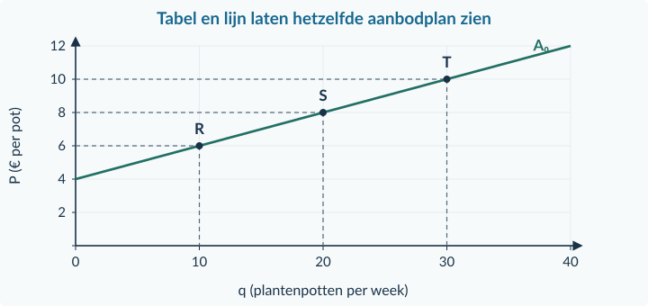
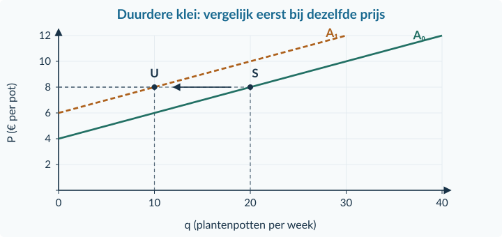
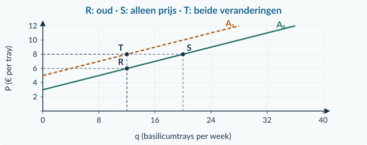
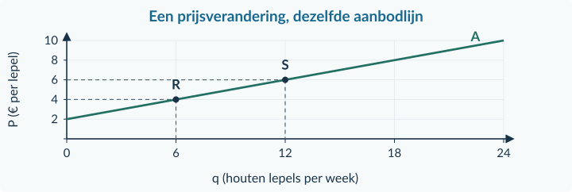
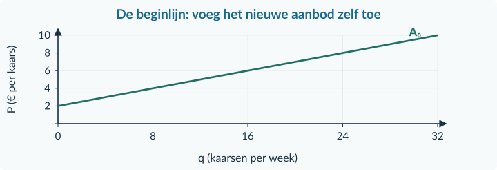
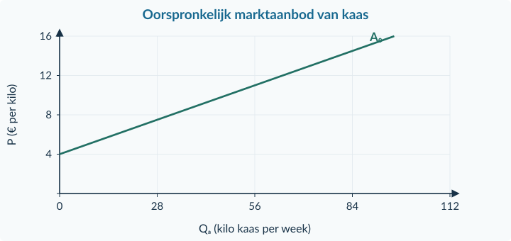
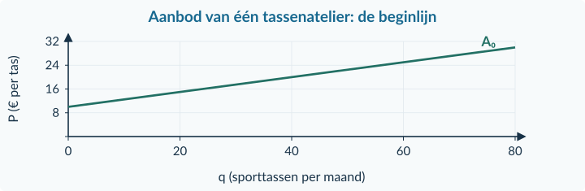

<!-- PAGE {"section": "1.3.1", "title": "Wie biedt het product aan?"} -->

1.3.1 · BOEK 1 · TWEEDE EDITIE
<h1 class="paragraph-title" id="p131">Aanbod en aanbodfactoren</h1>
<strong>Waarom maakt een atelier bij een hogere prijs meer plantenpotten?</strong> Extra potten vragen klei, een oven en tijd. Een hogere verkoopprijs kan het aantrekkelijk maken om daarvoor meer middelen in te zetten. Maar hoeveel het atelier kan maken, hangt ook af van zijn mogelijkheden.

<strong>Na deze paragraaf kun je</strong>
<ul><li>aanbod en aangeboden hoeveelheid uitleggen;</li><li>rekenen met een aanbodfunctie en de eenheden noemen;</li><li>een prijsbeweging onderscheiden van een verschuiving door een aanbodfactor;</li><li>aanbodplannen, voorraad en werkelijke verkoop uit elkaar houden.</li></ul>
<figure><figcaption>Figuur 1 · De koopkant ken je uit hoofdstuk 1.2. Nu voegen we de verkoopkant toe.</figcaption></figure>

<strong>Aanbod</strong>

Het verband tussen de prijs van een product en de hoeveelheid die verkopers willen én kunnen aanbieden, terwijl alle andere omstandigheden gelijk blijven. Die afspraak heet <strong>ceteris paribus</strong>.

De <strong>aangeboden hoeveelheid</strong> is één hoeveelheid bij één bepaalde prijs, in een afgesproken periode. Een aanbodlijn laat zulke plannen zien bij meerdere prijzen. Het gaat nog niet om het aantal producten dat werkelijk wordt verkocht.

<!-- PAGE {"section": "1.3.1", "title": "Van verkoopplan naar lijn"} -->

Een atelier onderzoekt zijn aanbod van kleine plantenpotten. De techniek, de prijzen van klei en energie en de beschikbare werktijd blijven gelijk. Bij deze vergelijking schrijven we <strong>q</strong> voor de hoeveelheid van dit ene atelier.

<table class=""><thead><tr><th>P (€ per pot)</th><th>4</th><th>6</th><th>8</th><th>10</th><th>12</th></tr></thead><tbody><tr><td>q (potten per week)</td><td>0</td><td>10</td><td>20</td><td>30</td><td>40</td></tr></tbody></table>
Bij € 8 wil en kan het atelier 20 potten aanbieden. Bij € 10 zijn dat er 30. Zet q horizontaal en P verticaal. De coördinaten zijn dus <strong>(20; 8)</strong> en <strong>(30; 10)</strong>. In dit model verbinden we de tabelpunten met een rechte lijn.

<figure><figcaption>Figuur 2 · De stijgende lijn beschrijft dit atelier, niet de vraag naar zijn potten.</figcaption></figure>

<strong>Dezelfde gegevens in een formule</strong>

q = 5P − 20 Geldig voor 4 ≤ P ≤ 12.

Bij P = 8: q = 5 × 8 − 20 = <strong>20 potten per week</strong>. Elke euro prijsstijging vergroot hier de aangeboden hoeveelheid met 5 potten. De stap van S naar T is een <strong>beweging langs</strong> dezelfde aanbodlijn.

<!-- PAGE {"section": "1.3.1", "title": "Een andere prijs of andere omstandigheden?"} -->

Nu stijgt de prijs van klei. Vergelijk eerst bij <strong>dezelfde verkoopprijs van € 8</strong>. Het atelier wil en kan dan nog 10 potten aanbieden, in plaats van 20. De nieuwe lijn ligt links van de oude. Bij eenzelfde hoeveelheid is voortaan een hogere prijs nodig.

<figure><figcaption>Figuur 3 · Duurdere klei verandert het aanbod bij verschillende verkoopprijzen. Dat is een verschuiving van A₀ naar A₁.</figcaption></figure><table class=""><thead><tr><th>Verandering, overige omstandigheden gelijk</th><th>Aanbod bij dezelfde verkoopprijs</th></tr></thead><tbody><tr><td>Klei of energie wordt duurder.</td><td>Minder aanbod: naar links.</td></tr><tr><td>Een betere techniek maakt produceren gemakkelijker.</td><td>Meer aanbod: naar rechts.</td></tr><tr><td>Er komen meer aanbieders op de markt.</td><td>Meer marktaanbod: naar rechts.</td></tr></tbody></table>

<strong>Welke prijs verandert?</strong>

De prijs van <strong>het product zelf</strong> veroorzaakt een beweging langs de lijn. De prijs van <strong>een productiemiddel</strong> kan de lijn verschuiven. Een pot en de klei voor die pot zijn niet hetzelfde product.

De getekende functie is alleen een model binnen de opgegeven prijzen. Onder € 4 biedt het atelier in het eerste model niets aan. Een negatieve formule-uitkomst is daar <strong>geen negatief aanbod</strong>. Aanbodlijnen hoeven niet allemaal dezelfde vorm of beginprijs te hebben.

<!-- PAGE {"section": "1.3.1", "title": "Uitgewerkt voorbeeld"} -->

## Uitgewerkt voorbeeld

Een kweker levert basilicumtrays. Eerst geldt <strong>q = 4P − 12</strong>, voor 3 ≤ P ≤ 12. q is trays per week; P is euro per tray. De verkoopprijs stijgt van € 6 naar € 8. Tegelijk wordt kweekgrond duurder. Het nieuwe aanbod is <strong>q = 4P − 20</strong>, voor 5 ≤ P ≤ 12. Verder verandert er niets.

<strong>1. Eerst alleen de verkoopprijs.</strong> Oud: q = 4 × 6 − 12 = <strong>12</strong>. Bij € 8 en oude omstandigheden: q = 4 × 8 − 12 = <strong>20</strong>. De prijsstijging geeft 8 trays extra: een beweging langs A₀.

<strong>2. Daarna alleen de kweekgrond.</strong> Bij de oude prijs van € 6 wordt q = 4 × 6 − 20 = <strong>4</strong>. Duurdere kweekgrond verlaagt hier het aanbod bij elke onderzochte prijs met 8 trays: A verschuift naar links.

<figure><figcaption>Figuur 4 · R = (12; 6), S = (20; 8), T = (12; 8). De uiteindelijke prijs ligt op de nieuwe aanbodlijn.</figcaption></figure>
<strong>3. Combineer.</strong> Nieuwe prijs én nieuwe functie: q = 4 × 8 − 20 = <strong>12 trays per week</strong>. +8 door de prijs en −8 door de kweekgrond heffen elkaar hier op. Dezelfde eindhoeveelheid betekent dus niet dat er niets is veranderd.

<strong>4. Controleer de betekenis.</strong> De kweker biedt 12 trays aan. Of hij alle 12 verkoopt, hangt ook af van kopers. Een berekening van aanbod alleen bewijst geen verkoop.

<strong>Samenvatting §1.3.1</strong>

Aanbod beschrijft verkoopplannen bij verschillende prijzen. De eigen verkoopprijs geeft een beweging langs A; productiemiddelen, techniek en het aantal aanbieders kunnen A verschuiven. Vul de juiste prijs in de juiste functie in. In §1.3.2 combineren we aanbod met vraag.

<!-- PAGE {"section": "1.3.1", "title": "Starten en aflezen"} -->

## Startopgaven

<h3>Opgave 1 · Een vraagfunctie ophalen</h3>
Voor één koper geldt q = 18 − 2P, voor 0 ≤ P ≤ 9. q is stuks per maand; P is euro per stuk.

a.

Bereken q bij P = € 3.

b.

Bereken P als q = 8. Controleer je antwoord in de functie.

<h3>Opgave 2 · Plannen, voorraad en verkoop</h3>
Een fietsenmaker heeft 8 binnenbanden op voorraad. Hij wil en kan deze middag bij € 12 per vervanging 5 binnenbanden vervangen. Er komen maar 3 klanten.

a.

Welke hoeveelheid hoort bij zijn aanbodplan, welke bij zijn voorraad en welke bij zijn werkelijke verkoop?

<strong>Oefenroute</strong>

Normale route: Startopgaven → Begeleide inoefening → Zelfstandige oefening → Doeloefening. Uitdagende route: Startopgaven → Zelfstandige oefening → Doeloefening → Denkertje / Bonusopgave. Herhaling is aanvullend bij beide routes.

## Begeleide inoefening

Begeleide inoefening hoort bij leren: je oefent met denkstappen en doet steeds meer zelf.

<h3>Opgave 3 · Houten lepels</h3>
Bekijk het volledig ingevulde aanboddiagram van één maker.

<figure><figcaption>Figuur 5 · Lees eerst een afgewerkte voorstelling; de hulplijnen zijn al gegeven.</figcaption></figure>
a.

Lees de hoeveelheden bij € 4 en € 6 af.

b.

Is R → S een beweging of een verschuiving? Licht toe.

<!-- PAGE {"section": "1.3.1", "title": "Begeleide inoefening · aanvullen en vergelijken"} -->

<h3>Opgave 4 · Kaarsen en duurdere was</h3>
Een kaarsenmaker heeft eerst q = 4P − 8, voor 2 ≤ P ≤ 10. Door duurdere was wordt dit q = 4P − 16, voor 4 ≤ P ≤ 10. q is kaarsen per week; P is euro per kaars.

<table class=""><thead><tr><th>P (€ per kaars)</th><th>q oud (per week)</th><th>q nieuw (per week)</th></tr></thead><tbody><tr><td>4</td><td>…</td><td>…</td></tr><tr><td>6</td><td>…</td><td>…</td></tr><tr><td>8</td><td>…</td><td>…</td></tr></tbody></table><figure><figcaption>Figuur 6 · Alleen A₀ is gegeven. Gebruik twee tabelpunten om A₁ te tekenen.</figcaption></figure>
a.

Neem de tabel over en vul beide hoeveelheden in. Gebruik de oude en de nieuwe functie afzonderlijk.

b.

Voeg A₁ aan de grafiek toe. Markeer bij € 6 een punt op elke lijn en verklaar de richting van de verschuiving.

<h3>Opgave 5 · Twee prijzen bij granola</h3>
De verkoopprijs van granola stijgt. Tegelijk wordt de havermout voor granola duurder. Verder verandert er niets; de grootte van beide effecten is onbekend.

a.

Wat doet alleen de verkoopprijs met de aangeboden hoeveelheid?

b.

Wat doet alleen de havermoutprijs met de aanbodlijn?

c.

Kun je het uiteindelijke aanbod bepalen?

d.

Beoordeel: “Allebei de prijsstijgingen verschuiven de aanbodlijn.”

<!-- PAGE {"section": "1.3.1", "title": "Zelfstandig rekenen en oorzaken benoemen"} -->

## Zelfstandige oefening

<h3>Opgave 6 · Ansichtkaarten</h3>
Eén drukker wil en kan q = 10P − 20 ansichtkaarten per week aanbieden, voor 2 ≤ P ≤ 8. P is euro per kaart. De overige omstandigheden blijven gelijk.

a.

Bereken q bij € 4 en bij € 6. Leg uit wat het getal 10 in de functie betekent.

b.

Bereken de prijs waarbij de drukker 30 kaarten per week aanbiedt. Controleer.

<h3>Opgave 7 · Wat verandert er bij boeketten?</h3>
Onderzoek het marktaanbod van boeketten. Vergelijk per rij alleen de genoemde verandering; de overige omstandigheden blijven gelijk. Neem de tabel over en vul de drie antwoordkolommen in.

<table class=""><thead><tr><th>Gebeurtenis</th><th>Beweging of verschuiving?</th><th>Richting</th><th>Specifieke oorzaak</th></tr></thead><tbody><tr><td>De boeketprijs daalt.</td><td>…</td><td>…</td><td>…</td></tr><tr><td>Energie wordt goedkoper.</td><td>…</td><td>…</td><td>…</td></tr><tr><td>Er komen bloemisten bij.</td><td>…</td><td>…</td><td>…</td></tr><tr><td>Een sorteermachine valt uit; aanbieders kunnen minder verwerken.</td><td>…</td><td>…</td><td>…</td></tr></tbody></table>
a.

Classificeer alle situaties en benoem de specifieke oorzaak.

<strong>Eén verkoper of de hele markt?</strong>

Bij één verkoper gebruiken we hier q. Voor het totale marktaanbod gebruiken we Qa. Het aanbod van extra verkopers telt mee in Qa, maar hoeft het aanbodplan van één bestaande verkoper niet te veranderen.

<!-- PAGE {"section": "1.3.1", "title": "Zelfstandig een verschuiving tekenen"} -->

<h3>Opgave 8 · Kaas uit de regio</h3>
Voor alle kaasmakers samen geldt eerst Qa = 8P − 32, voor 4 ≤ P ≤ 16. Energie wordt goedkoper. Daardoor geldt Qa = 8P − 16, voor 2 ≤ P ≤ 16. Qa is kilo kaas per week; P is euro per kilo. Verder verandert er niets.

<figure><figcaption>Figuur 7 · De hoeveelheidsas gaat over de gezamenlijke kaasmakers; de nieuwe lijn ontbreekt.</figcaption></figure>
a.

Bereken het oude en nieuwe aanbod bij € 10 per kilo. Hoe groot is de verandering?

b.

Teken de nieuwe lijn in de figuur. Markeer de twee hoeveelheden bij € 10. Leg uit waarom je bij deze vergelijking dezelfde verkoopprijs gebruikt.

<strong>Verkoop blijft een andere vraag</strong>

De berekende hoeveelheid is aangeboden kaas. Zonder informatie over kopers kun je niet stellen dat alle kaas wordt verkocht. “Meer aanbod” is dus geen bewijs van “meer werkelijke afzet”.

<!-- PAGE {"section": "1.3.1", "title": "Doeloefening"} -->

## Doeloefening

<h3>Opgave 9 · Atelier Sprint</h3>
Eén atelier maakt sporttassen. Eerst geldt q = 4P − 40, voor 10 ≤ P ≤ 30. q is tassen per maand; P is euro per tas. De verkoopprijs stijgt van € 20 naar € 24. Tegelijk wordt stof duurder. Het nieuwe aanbod is q = 4P − 52, voor 13 ≤ P ≤ 30. Verder verandert er niets.

<figure><figcaption>Figuur 8 · Gebruik de gegeven beginlijn; voeg de nieuwe lijn en alle markeringen zelf toe.</figcaption></figure>
a.

Bereken q vóór de veranderingen en na alleen de verkoopprijsstijging. Wat betekent de 4 in de functie?

b.

Welke factor verschuift A? Bereken ter vergelijking het nieuwe aanbod bij de oude prijs van € 20.

c.

Teken A₁. Markeer R (oud), S (alleen hogere verkoopprijs) en T (beide veranderingen), met hun coördinaten.

d.

Bereken de uiteindelijke hoeveelheid en de verandering ten opzichte van het begin. Leg uit hoe de effecten samenwerken of tegenwerken.

e.

Beoordeel: “De hogere verkoopprijs verschuift de aanbodlijn naar rechts.”

<!-- PAGE {"section": "1.3.1", "title": "Denkertje en herhaling"} -->

## Denkertje / Bonusopgave

<h3>Opgave 10 · De potten staan er al</h3>
Een verkoper heeft voor één laatste marktuur al 40 vazen klaargezet. Hij kan in dat uur niets bijmaken of bijkopen. Een klant zegt: “Bij een hogere prijs moet hij altijd meer kunnen aanbieden.”

a.

Beoordeel de uitspraak. Beschrijf een aanbodvoorstelling die bij deze korte periode kan passen en noem welke informatie over zijn verkoopbereidheid nog ontbreekt.

## Herhaling en combineren

<h3>Opgave 11 · Twee korte terugblikken</h3>
Gebruik wat je in hoofdstuk 1.1 en 1.2 hebt geleerd.

a.

Een prijs stijgt van € 8 naar € 10. Bereken de procentuele verandering.

b.

Koper A vraagt bij € 3 twee liter sap per week en koper B vijf liter. B is al in de bron opgenomen. Bereken de collectieve vraag van deze twee kopers.

<strong>Van plannen naar transacties</strong>

Je kent nu beide kanten van de markt. In §1.3.2 zoeken we de prijs waarbij de gezamenlijke koopplannen en verkoopplannen op elkaar aansluiten.

