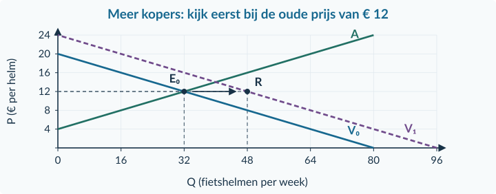
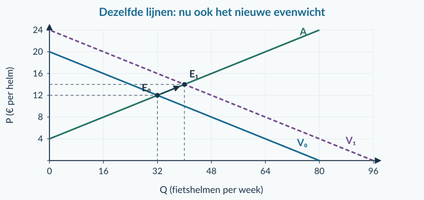
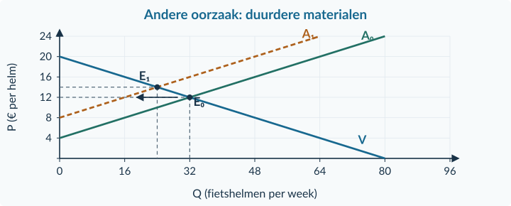
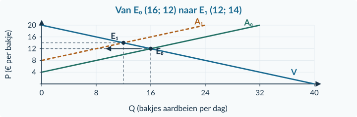
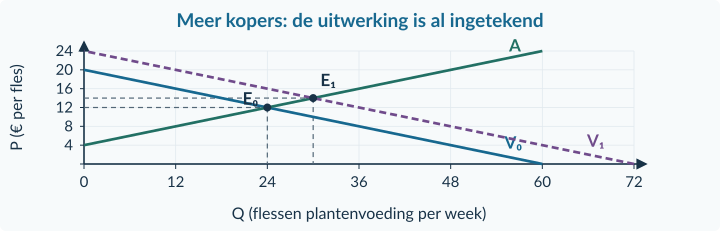
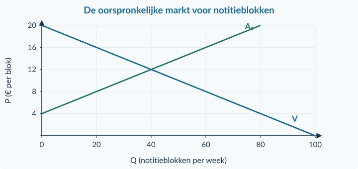
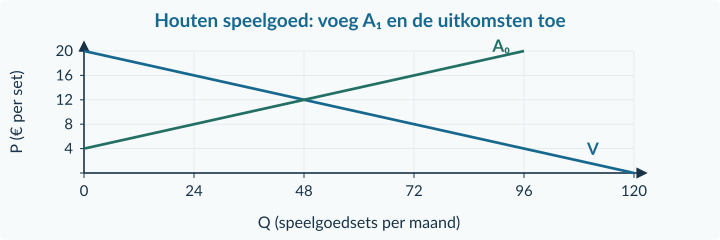
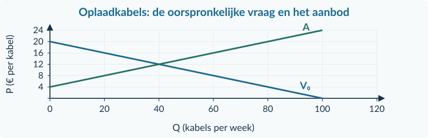

<!-- PAGE {"section": "1.3.3", "title": "Een nieuwe situatie, een nieuw evenwicht"} -->

1.3.3 · BOEK 1 · TWEEDE EDITIE
<h1 class="paragraph-title" id="p133">Verschuivingen en nieuw evenwicht</h1>
<strong>Er komen meer kopers voor fietshelmen. Waarom stijgt de prijs, maar worden er toch meer helmen verkocht?</strong> Er verandert niet alleen een punt op een lijn. De koopplannen bij verschillende prijzen veranderen.

<strong>Na deze paragraaf kun je</strong>
<ul><li>een bronverandering koppelen aan vraag of aanbod;</li><li>de nieuwe plannen bij de oude prijs vergelijken;</li><li>het nieuwe evenwicht berekenen en met het oude vergelijken;</li><li>een verschuiving en een beweging langs de ongewijzigde lijn apart uitleggen.</li></ul>

<strong>Beginmarkt en verandering</strong>

Qv,0 = 80 − 4P   (0 ≤ P ≤ 20) Qa = 4P − 16   (4 ≤ P ≤ 24) Nieuwe vraag: Qv,1 = 96 − 4P   (0 ≤ P ≤ 24)

Q is helmen per week; P is euro per helm. Alleen het aantal kopers neemt toe. Daardoor is de vraag bij iedere onderzochte prijs <strong>16 helmen groter</strong>. De oude evenwichtsprijs is € 12 en de oude hoeveelheid is 32 helmen.

<figure><figcaption>Figuur 17 · Bij € 12 verschuiven de koopplannen van 32 naar 48. Verkopers bieden bij die prijs nog 32 aan.</figcaption></figure>
<strong>Begin bij de oorzaak.</strong> Meer kopers verschuift V naar rechts. Dat wordt zichtbaar door beide vraaglijnen eerst bij <strong>dezelfde prijs</strong> te vergelijken.

<!-- PAGE {"section": "1.3.3", "title": "De nieuwe prijs is een gevolg"} -->

<strong>1. Vergelijk bij de oude prijs.</strong> Bij € 12 vragen de kopers nu 96 − 4 × 12 = <strong>48 helmen</strong>. Het aanbod blijft 4 × 12 − 16 = <strong>32 helmen</strong>. Er ontstaat een vraagoverschot van <strong>16 helmen per week</strong>.

<strong>2. Verklaar de druk.</strong> Kopers concurreren om het aanbod: de prijs komt onder opwaartse druk. Door de hogere prijs bewegen verkopers <strong>langs de bestaande aanbodlijn</strong> naar een groter aanbod.

<strong>3. Los de nieuwe gelijkheid op.</strong> 96 − 4P = 4P − 16 → 112 = 8P → <strong>P = € 14</strong>. Qv,1 = 96 − 4 × 14 = <strong>40</strong>; controle: Qa = 4 × 14 − 16 = <strong>40 helmen per week</strong>.

<figure><figcaption>Figuur 18 · Dezelfde assen en lijnen als in figuur 17. Van E₀ naar E₁ beweeg je langs A; A zelf verschuift niet.</figcaption></figure>
<strong>4. Vergelijk.</strong> De prijs stijgt van € 12 naar € 14 en de hoeveelheid van 32 naar 40. Dat de nieuwe prijs hoger is, spreekt de dalende vraaglijn niet tegen: de twee evenwichten liggen op <strong>verschillende vraaglijnen</strong>.

<strong>Oorzaak en reactie niet omdraaien</strong>

Niet: de hogere prijs verschuift V naar rechts. Wel: meer kopers verschuift V naar rechts; de prijs reageert daarop. Meer aanbod door die hogere prijs is een <strong>beweging langs A</strong>.

<!-- PAGE {"section": "1.3.3", "title": "Een aanbodverandering kan óók de prijs verhogen"} -->

<strong>Een afzonderlijk scenario.</strong> Begin opnieuw bij Qv = 80 − 4P en Qa,0 = 4P − 16. De extra kopers uit de vorige situatie zijn er nu niet. Alleen de materialen voor fietshelmen worden duurder. De aanbodfunctie wordt <strong>Qa,1 = 4P − 32</strong>, voor 8 ≤ P ≤ 24.

Bij de oude prijs van € 12 zijn de nieuwe verkoopplannen <strong>16 helmen</strong>, tegenover 32 gevraagde helmen. Het aanbod is dus naar links verschoven. Het vraagoverschot zet de prijs opnieuw onder opwaartse druk.

<figure><figcaption>Figuur 19 · Dit scenario begint opnieuw bij E₀. Door de hogere prijs bewegen kopers langs de ongewijzigde vraaglijn.</figcaption></figure>
80 − 4P = 4P − 32 → 112 = 8P → <strong>P = € 14</strong>. Qv = 80 − 4 × 14 = <strong>24</strong>; controle: 4 × 14 − 32 = <strong>24 helmen per week</strong>.

<table class=""><thead><tr><th>Afzonderlijke oorzaak</th><th>Prijs</th><th>Verhandelde hoeveelheid</th></tr></thead><tbody><tr><td>Meer kopers, aanbod gelijk</td><td>€ 12 → € 14</td><td>32 → 40</td></tr><tr><td>Duurdere materialen, vraag gelijk</td><td>€ 12 → € 14</td><td>32 → 24</td></tr></tbody></table>
Dezelfde prijsstijging kan dus bij verschillende oorzaken horen. Kijk ook naar de hoeveelheid en naar de bron. <strong>Alleen een prijswaarneming bewijst niet welke lijn verschoof.</strong>

<!-- PAGE {"section": "1.3.3", "title": "Uitgewerkt voorbeeld"} -->

## Uitgewerkt voorbeeld

Voor bakjes aardbeien gelden Qv = 40 − 2P (0 ≤ P ≤ 20) en Qa,0 = 2P − 8 (4 ≤ P ≤ 20). Q is bakjes per dag; P is euro per bakje. Alleen de verpakking wordt duurder. Voortaan geldt Qa,1 = 2P − 16 (8 ≤ P ≤ 20).

<strong>1. Oud evenwicht.</strong> 40 − 2P = 2P − 8 → 48 = 4P → <strong>P₀ = € 12</strong>. Q₀ = 40 − 2 × 12 = <strong>16</strong>. Controle: 2 × 12 − 8 = <strong>16 bakjes per dag</strong>.

<strong>2. Oorzaak en oude prijs.</strong> De verpakking is een productiemiddel. Bij € 12 daalt het aanbod naar 2 × 12 − 16 = <strong>8</strong>. De vraag blijft 16. Vraagoverschot: <strong>8 bakjes per dag</strong>; opwaartse prijsdruk.

<strong>3. Nieuw evenwicht.</strong> 40 − 2P = 2P − 16 → 56 = 4P → <strong>P₁ = € 14</strong>. Q₁ = 40 − 2 × 14 = <strong>12</strong>. Controle: 2 × 14 − 16 = <strong>12 bakjes per dag</strong>.

<figure><figcaption>Figuur 20 · A verschuift naar links. De hogere prijs geeft een beweging langs V naar minder gevraagde bakjes.</figcaption></figure>
<strong>4. Vergelijk en verklaar.</strong> De hoeveelheid verandert met (12 − 16) / 16 × 100% = <strong>−25%</strong>. De prijs stijgt. De oorspronkelijke oorzaak is duurdere verpakking; de prijsreactie verkleint vervolgens de gevraagde hoeveelheid.

<strong>Samenvatting §1.3.3</strong>

Werk steeds vanuit een duidelijke beginsituatie. Benoem de factor en de verschuivende lijn. Vergelijk de plannen bij de oude prijs en verklaar de druk. Bereken het nieuwe evenwicht en controleer. De prijsreactie veroorzaakt een beweging langs de andere lijn. In §1.3.4 kies je de methode zelf.

<!-- PAGE {"section": "1.3.3", "title": "Starten en een uitgewerkte verandering lezen"} -->

## Startopgaven

<h3>Opgave 23 · Een verandering vergelijken</h3>
Een hoeveelheid stijgt van 320 naar 400 stuks per week.

a.

Bereken de procentuele verandering.

<h3>Opgave 24 · Welke oorzaak?</h3>
Er komen meer kopers van fietsbellen. De techniek, het aantal verkopers en hun omstandigheden blijven gelijk.

a.

Welke lijn verschuift? Verschuift de andere lijn ook zodra de marktprijs stijgt?

<strong>Oefenroute</strong>

Normale route: Startopgaven → Begeleide inoefening → Zelfstandige oefening → Doeloefening. Uitdagende route: Startopgaven → Zelfstandige oefening → Doeloefening → Denkertje / Bonusopgave. Herhaling is aanvullend bij beide routes.

## Begeleide inoefening

Begeleide inoefening hoort bij leren: je oefent met denkstappen en doet steeds meer zelf.

<h3>Opgave 25 · Plantenvoeding</h3>
Er komen meer kopers. De figuur toont de volledige uitwerking; het aanbod verandert niet.

<figure><figcaption>Figuur 21 · Beide evenwichten en de nieuwe vraaglijn zijn hier al gemarkeerd.</figcaption></figure>
a.

Lees de oude en nieuwe prijs en hoeveelheid af.

b.

Leg uit waarom de grotere aangeboden hoeveelheid hier geen verschuiving van A is.

<!-- PAGE {"section": "1.3.3", "title": "Begeleide inoefening · een nieuwe aanbodlijn"} -->

<h3>Opgave 26 · Duurder papier voor notitieblokken</h3>
Begin met Qv = 100 − 5P (0 ≤ P ≤ 20) en Qa,0 = 5P − 20 (4 ≤ P ≤ 20). Door duurdere papierpulp wordt het aanbod Qa,1 = 5P − 40 (8 ≤ P ≤ 20). Q is notitieblokken per week; P is euro per blok. Er zijn geen andere veranderingen.

<figure><figcaption>Figuur 22 · De beginlijnen zijn gegeven; de verandering en uitkomsten teken je zelf.</figcaption></figure>
a.

Bereken het oude en nieuwe evenwicht. Controleer beide hoeveelheden. Gebruik per situatie Qᵥ = Qₐ.

b.

Voeg A₁ toe aan de figuur. Markeer E₀ en E₁. Gebruik twee zelf berekende punten voor de nieuwe lijn.

c.

Bereken bij de oude prijs de nieuwe Qₐ en de ongewijzigde Qᵥ. Leg via het verschil uit waarom de prijs verandert.

<strong>Hulp bij de twee pijlen</strong>

Een horizontale vergelijking bij de oude prijs toont de verschuiving. De stap van E₀ naar E₁ ligt op de ongewijzigde vraaglijn. Zet bij iedere pijl welke verandering hij laat zien.

<!-- PAGE {"section": "1.3.3", "title": "Twee verschuivingen en zelfstandige berekening"} -->

<h3>Opgave 27 · Meer vraag én meer aanbod</h3>
Er komen meer kopers van campinglampen. Tegelijk maakt een betere techniek de productie gemakkelijker. De vraag- en aanbodlijn verschuiven allebei naar rechts. De oorspronkelijke lijnen zijn dalend respectievelijk stijgend. De verschuivingen zijn niet becijferd.

a.

Wat gebeurt er met evenwichtsprijs en -hoeveelheid als je alleen de extra kopers bekijkt?

b.

Wat gebeurt er als je alleen de betere techniek bekijkt?

c.

Welke richting van de uiteindelijke hoeveelheid is bepaald? Is de richting van de prijs ook bepaald?

d.

Een leerling zegt: “De tegengestelde prijsdruk betekent dat de prijs gelijk blijft.” Waarom volgt dat niet?

## Zelfstandige oefening

<h3>Opgave 28 · Reparatiesets</h3>
Qv,0 = 96 − 4P (0 ≤ P ≤ 24) en Qa = 4P − 16 (4 ≤ P ≤ 28). Repareren wordt populairder. Alleen de voorkeur verandert: Qv,1 = 112 − 4P (0 ≤ P ≤ 28). Q is sets per week; P is euro per set.

a.

Bereken beide evenwichten en controleer de hoeveelheden.

b.

Vergelijk na de verandering de plannen bij de oude prijs. Verklaar de prijsdruk.

c.

Bereken de procentuele verandering van de evenwichtshoeveelheid.

<!-- PAGE {"section": "1.3.3", "title": "Zelfstandig tekenen en een bron beoordelen"} -->

<h3>Opgave 29 · Houten speelgoed</h3>
Qv = 120 − 6P (0 ≤ P ≤ 20) en Qa,0 = 6P − 24 (4 ≤ P ≤ 20). Door goedkoper hout wordt Qa,1 = 6P − 12 (2 ≤ P ≤ 20). Q is speelgoedsets per maand; P is euro per set. De overige omstandigheden blijven gelijk.

<figure><figcaption>Figuur 23 · Teken de verandering en benoem daarnaast de beweging op V.</figcaption></figure>
a.

Bereken beide evenwichten en controleer. Voeg A₁, E₀, E₁ en hun coördinaten aan de figuur toe.

b.

Leg uit waarom de grotere gevraagde hoeveelheid niet bewijst dat de vraaglijn is verschoven.

<h3>Opgave 30 · Wat past bij de waarneming?</h3>
De prijs van kampeermatten stijgt en de verkochte hoeveelheid daalt. Volgens een onderzoek is er precies één verandering: óf materiaal werd duurder, óf de voorkeur voor deze matten nam toe. De andere lijn bleef gelijk.

a.

Welke van de twee verklaringen past in het standaardmodel? Motiveer met prijs én hoeveelheid.

<!-- PAGE {"section": "1.3.3", "title": "Doeloefening"} -->

## Doeloefening

<h3>Opgave 31 · Meer kopers van oplaadkabels</h3>
Een regionale markt heeft Qv,0 = 100 − 5P (0 ≤ P ≤ 20) en Qa = 5P − 20 (4 ≤ P ≤ 24). Q is kabels per week; P is euro per kabel. Er komen meer kopers. Alleen daardoor wordt Qv,1 = 120 − 5P (0 ≤ P ≤ 24). De omstandigheden van de aanbieders blijven gelijk.

<figure><figcaption>Figuur 24 · De oorspronkelijke lijnen zijn gegeven; de nieuwe lijn en uitkomsten ontbreken.</figcaption></figure>
a.

Bereken het oude evenwicht en controleer met beide functies.

b.

Benoem de specifieke factor. Bereken na de verandering beide plannen bij de oude prijs en verklaar de prijsdruk.

c.

Bereken het nieuwe evenwicht en controleer. Bereken de procentuele verandering van Q.

d.

Voeg V₁ toe. Markeer E₀ en E₁ met coördinaten. Laat met pijlen de verschuiving bij de oude prijs en de beweging langs A zien.

e.

Beoordeel: “De grotere aangeboden hoeveelheid komt door een verschuiving van de aanbodlijn.”

<!-- PAGE {"section": "1.3.3", "title": "Denkertje en herhaling"} -->

## Denkertje / Bonusopgave

<h3>Opgave 32 · Twee verklaringen voor dezelfde richting</h3>
In een krant staat dat de prijs én de verkochte hoeveelheid van een product zijn gestegen. Er staat niets over veranderingen in vraagfactoren of aanbodfactoren.

a.

Beschrijf of schets twee verschillende verklaringen die hierbij kunnen passen. Gebruik in één verklaring één verschuiving en in de andere twee verschuivingen. Leg uit waarom de twee waarnemingen de precieze oorzaak niet bewijzen.

## Herhaling en combineren

<h3>Opgave 33 · Formules en eenheden ophalen</h3>
Gebruik de methodes uit eerdere paragrafen.

a.

Een vereniging betaalt € 84 voor 14 gelijke mappen. Bereken het bedrag per map.

b.

Voor één koper geldt q = 20 − 2P, voor 0 ≤ P ≤ 10. q is stuks per maand; P is euro per stuk. Bereken beide snijpunten van de vraaglijn met de assen.

<figure><figcaption>Figuur 25 · Houd de oorspronkelijke oorzaak en de reactie op de nieuwe prijs apart.</figcaption></figure>