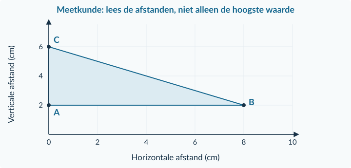

<!-- PAGE {"section": "1.3.4", "title": "Gemengde opgaven"} -->

1.3.4 · BOEK 1 · TWEEDE EDITIE
<h1 class="paragraph-title" id="p134">Gemengde opgaven: aanbod en marktevenwicht</h1>
Nu kies je zelf de passende methode. Kijk eerst of een bron één aanbieder, de hele markt of alleen een waarneming beschrijft. Gebruik bij een nieuwe situatie de bijbehorende functies. Er komt geen nieuwe theorie bij.

<h3>Opgave 34 · Knoppen uit een 3D-printer</h3>
Eén maker biedt q = 6P − 18 knoppen per week aan, voor 3 ≤ P ≤ 15. P is euro per knop. Door een betere printer wordt het aanbod q = 6P − 12, voor 2 ≤ P ≤ 15. De verkoopprijs blijft € 7.

a.

Bereken het aanbod vóór en na de verandering. Benoem de factor en de grafische verandering.

b.

Een medewerker noemt het nieuwe aantal “de evenwichtshoeveelheid”. Waarom volgt dat niet uit deze bron?

<h3>Opgave 35 · Fietslampjes bij de opening</h3>
Op een markt gelden Qv = 90 − 5P (0 ≤ P ≤ 18) en Qa = 10P − 30 (3 ≤ P ≤ 18). Q is lampjes per week; P is euro per lampje. De openingsprijs is € 6. Alle aangeboden lampjes vinden een koper; er zijn geen andere voorraden of verkoopbelemmeringen.

a.

Bereken het evenwicht en controleer.

b.

Bereken de verkoop en het tekort bij de openingsprijs.

c.

Verklaar de prijsdruk na de opening, als de prijs zich kan aanpassen.

<!-- PAGE {"section": "1.3.4", "title": "Een marktverandering zelfstandig uitwerken"} -->

<h3>Opgave 36 · Tenten uit de fabriek</h3>
Een markt voor eenvoudige tenten heeft Qv = 120 − 4P (0 ≤ P ≤ 30) en Qa,0 = 8P − 24 (3 ≤ P ≤ 24). Q is tenten per maand; P is euro per tent. Door een nieuwe productietechniek geldt voortaan Qa,1 = 8P − 12 (1,5 ≤ P ≤ 24). De vraag en de overige omstandigheden blijven gelijk.

a.

Bereken beide evenwichten en controleer. Leg uit wat de verandering van −24 naar −12 betekent bij dezelfde prijs.

b.

Teken zelf V, A₀ en A₁ in één marktgrafiek. Markeer beide evenwichten met coördinaten. Leg uit welke lijn verschuift en langs welke lijn een beweging optreedt.

c.

Beoordeel: “Na de verandering moet je nog steeds Qᵥ = Qₐ,₀ gebruiken, want vraag en aanbod moeten gelijk blijven.”

<strong>Terugvinden wat je nodig hebt</strong>
<table class=""><thead><tr><th>Loop je vast bij…</th><th>Herneem dan…</th></tr></thead><tbody><tr><td>Functie invullen of terugrekenen</td><td>§1.2.1 en opgave 6 in dit hoofdstuk.</td></tr><tr><td>Een nieuwe lijn tekenen</td><td>Opgave 4 of 15 met het gedeeltelijk ingevulde diagram.</td></tr><tr><td>De gelijkheid oplossen en controleren</td><td>Het voorbeeld op pagina 17 en opgave 15.</td></tr><tr><td>De oorzaak van een nieuw evenwicht</td><td>Het voorbeeld op pagina 27 en opgave 26.</td></tr></tbody></table>

Gebruik deze verwijzingen gericht. Een juiste einduitkomst zonder passende uitleg is geen bewijs dat je de oorzaak en de reactie uit elkaar houdt.

<!-- PAGE {"section": "1.3.4", "title": "Doeloefening · bronnen"} -->

## Doeloefening

<strong>Opgave 37 · De linnen boodschappentas</strong>

Gebruik deze vier bronnen bij de vragen op de rechterpagina. De gegevens zijn voor dit lesmodel gemaakt. Een deel van de informatie is niet nodig voor de berekeningen.

<strong>Bron A · De oorspronkelijke markt</strong>

In deze oefening gaat het om één soort linnen boodschappentas. Er zijn veel kleine kopers en verkopers. De prijs kan zich aanpassen. Q is tassen per week; P is euro per tas.

Qv = 180 − 10P &nbsp; (0 ≤ P ≤ 18) Qa,0 = 10P − 20 &nbsp; (2 ≤ P ≤ 18)

<strong>Bron B · Linnen wordt duurder</strong>

Alleen de prijs van het linnen stijgt. De koopplannen van consumenten veranderen niet. De aanbieders hebben voortaan deze aanbodfunctie:

Qa,1 = 10P − 60 &nbsp; (6 ≤ P ≤ 18)

Deze nieuwe situatie begint vanuit bron A. Er is geen andere vraag- of aanbodverandering.

<strong>Bron C · Een afzonderlijke prijsvergelijking</strong>

Bekijk daarna afzonderlijk de nieuwe situatie uit bron B bij een verkoopprijs van <strong>€ 14</strong>. Zolang deze prijs geldt, vindt iedere koper die volgens de vraagfunctie wil kopen een verkoper. Er zijn geen andere belemmeringen. Dit is een rekenvergelijking bij één prijs, geen wettelijke prijsregel.

<strong>Bron D · Een uitspraak</strong>

Een verkoper beweert: “Door de hogere marktprijs is de vraaglijn naar links verschoven. Het nieuwe evenwicht laat bovendien zien dat iedereen tevreden is.” De vormgeving van de tassen kreeg in een enquête 4,6 uit 5 punten; die beoordeling veranderde niet.

Schrijf bij een berekening steeds welke situatie je gebruikt. Geef bij een conclusie aan welk getal, welke lijn of welke bron je argument ondersteunt.

<!-- PAGE {"section": "1.3.4", "title": "Doeloefening · vragen"} -->

<h3>Opgave 37 · De linnen boodschappentas</h3>
Gebruik bronnen A–D op de linkerpagina. Werk met tassen per week en euro per tas.

a.

Bereken uit bron A de evenwichtsprijs en -hoeveelheid. Controleer de hoeveelheid met beide functies.

b.

Leg uit welke lijn door bron B verschuift en waarom. Bereken het nieuwe aanbod bij de oude evenwichtsprijs en vergelijk dit met de ongewijzigde vraag.

c.

Bereken het nieuwe evenwicht en controleer. Bereken de procentuele verandering van prijs én verhandelde hoeveelheid ten opzichte van bron A.

d.

Teken zelf V, A₀ en A₁ in één marktgrafiek. Geef assen, eenheden en schaal. Markeer E₀ en E₁ met coördinaten en hulplijnen. Laat ook een verschuiving bij de oude prijs en de beweging langs de ongewijzigde lijn zien.

e.

Gebruik nu uitsluitend de situatie van bron C. Bereken de vraag, het nieuwe aanbod, het type en de omvang van het overschot en de werkelijke verkoop volgens de gegeven afspraak.

f.

Beoordeel beide delen van de uitspraak in bron D. Gebruik je berekening en het model. Noem ook één gegeven uit bron D dat niet nodig was om de evenwichten te berekenen.

<!-- PAGE {"section": "1.3.4", "title": "Rekengereedschap voor het vervolg"} -->

<h3>Opgave 38 · Korte terugblik op hoofdstuk 1.1</h3>
Deze vragen halen eerder geleerde rekenvaardigheden op. De figuur is een meetkundige tekening, geen nieuwe economische grafiek.

<figure><figcaption>Figuur 26 · A = (0; 2), B = (8; 2), C = (0; 6). Beide assen meten centimeters.</figcaption></figure>
a.

Een magazijn betaalt € 90 voor 15 gelijke dozen. Bereken het bedrag per doos.

b.

Voor 6 extra dozen betaalt het magazijn € 36 extra. Bereken het extra bedrag per extra doos.

c.

Een prijsindex stijgt van 125 naar 150. Bereken de procentuele verandering.

d.

Bereken in de figuur de basis AB, de hoogte van C boven AB en de oppervlakte van driehoek ABC. Bereken ook de oppervlakte van een rechthoek met dezelfde basis en hoogte.

Loop je vast bij de eerste drie vragen? Herneem §1.1.2. Voor de meetkunde gebruik je §1.1.3. De economische betekenis van kosten en surplus komt in Boek 2; hier herhaal je alleen de rekenstappen.

