<!-- PAGE {"section": "Antwoorden", "title": "Antwoorden en werkwijze"} -->

BOEK 1 · HOOFDSTUK 3 · TWEEDE EDITIE
<h1>Antwoorden Aanbod en marktevenwicht</h1>
Geef bij iedere uitkomst de juiste eenheid en periode. Reken zo lang mogelijk exact. Rond een percentage zo nodig af op één decimaal en een prijs op twee decimalen. De hoofdgevallen zijn zo gekozen dat evenwichten exact uitkomen.

<strong>Gebruik de uitwerking</strong>

Controleer eerst de gebruikte functie en de beginsituatie, daarna de berekening en de uitleg. Een grafiek mag een andere bruikbare schaal hebben, maar moet dezelfde coördinaten tonen. Andere formuleringen zijn goed als de oorzaak en de economische betekenis kloppen.

<table class=""><thead><tr><th>Paragraaf</th><th>Opgaven</th></tr></thead><tbody><tr><td>1.3.1 Aanbod</td><td>1–11</td></tr><tr><td>1.3.2 Marktevenwicht</td><td>12–22</td></tr><tr><td>1.3.3 Nieuw evenwicht</td><td>23–33</td></tr><tr><td>1.3.4 Gemengde opgaven</td><td>34–38</td></tr></tbody></table><h3 id="answer1">Opgave 1 · Een vraagfunctie ophalen</h3>

<strong>a.</strong> q = 18 − 2 × 3 = <strong>12 stuks per maand</strong>. <strong>Waarom:</strong> bij deze prijs hoort dit koopplan in de gegeven vraagfunctie.

<strong>b.</strong> 8 = 18 − 2P → 2P = 10 → P = <strong>€ 5 per stuk</strong>. Controle: 18 − 2 × 5 = 8. <strong>Waarom:</strong> dezelfde prijs moet de gevraagde hoeveelheid 8 opleveren.

<h3 id="answer2">Opgave 2 · Plannen, voorraad en verkoop</h3>

<strong>a.</strong> Aanbodplan: <strong>5 vervangingen deze middag</strong>. Voorraad: <strong>8 binnenbanden op dit moment</strong>. Verkoop: <strong>3 vervangingen deze middag</strong>. <strong>Waarom:</strong> kunnen en willen aanbieden is iets anders dan al aanwezige onderdelen of uitgevoerde opdrachten.

<!-- PAGE {"section": "Antwoorden", "title": "1.3.1 · Aflezen en een lijn aanvullen"} -->

<h3 id="answer3">Opgave 3 · Houten lepels</h3>

<strong>a.</strong> Bij € 4: <strong>6 lepels per week</strong>. Bij € 6: <strong>12 lepels per week</strong>. <strong>Waarom:</strong> de hulplijnen verbinden iedere prijs met een punt op dezelfde aanbodlijn.

<strong>b.</strong> <strong>Een beweging langs A</strong>, naar een grotere aangeboden hoeveelheid. <strong>Waarom:</strong> alleen de verkoopprijs verandert; de lijn blijft liggen.

<h3 id="answer4">Opgave 4 · Kaarsen en duurdere was</h3>

<strong>a.</strong> Bij P = 4: oud 4 × 4 − 8 = <strong>8</strong>, nieuw 4 × 4 − 16 = <strong>0</strong>. Bij P = 6: <strong>16</strong> en <strong>8</strong>. Bij P = 8: <strong>24</strong> en <strong>16 kaarsen per week</strong>. <strong>Waarom:</strong> bij elke onderzochte prijs ligt het nieuwe aanbod 8 kaarsen lager.

<strong>b.</strong> A₁ loopt door <strong>(0; 4)</strong> en <strong>(24; 10)</strong>; de vergelijkingspunten zijn <strong>(16; 6)</strong> en <strong>(8; 6)</strong>. A verschuift naar links. <strong>Waarom:</strong> duurdere was verlaagt het aanbod bij dezelfde verkoopprijs.

<figure>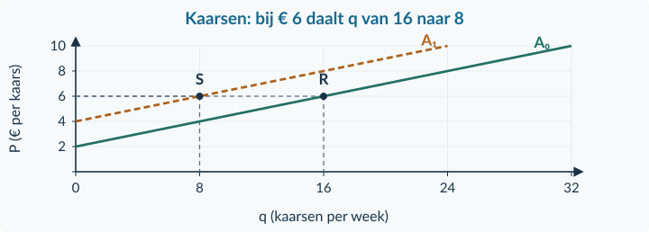<figcaption>Antwoordfiguur bij opgave 4 · Assen, lijnen en coördinaten volgen het lesmodel.</figcaption></figure>

<!-- PAGE {"section": "Antwoorden", "title": "1.3.1 · Twee prijzen en oorzaken"} -->

<h3 id="answer5">Opgave 5 · Twee prijzen bij granola</h3>

<strong>a.</strong> Een <strong>beweging langs A naar meer aangeboden granola</strong>. <strong>Waarom:</strong> een hogere eigen verkoopprijs maakt aanbieden aantrekkelijker, bij gelijke overige omstandigheden.

<strong>b.</strong> <strong>A verschuift naar links.</strong> <strong>Waarom:</strong> havermout is een productiemiddel; bij dezelfde granolaprijs wordt produceren minder aantrekkelijk.

<strong>c.</strong> <strong>Niet bepalen uit deze informatie.</strong> De effecten werken tegen elkaar in; hun groottes ontbreken. <strong>Waarom:</strong> de positieve en negatieve hoeveelheidseffecten hoeven niet even groot te zijn.

<strong>d.</strong> <strong>Onjuist.</strong> Alleen de havermoutprijs verschuift A. De eigen granolaprijs geeft een beweging langs A. <strong>Waarom:</strong> de twee prijzen horen bij verschillende producten.

<h3 id="answer6">Opgave 6 · Ansichtkaarten</h3>

<strong>a.</strong> Bij € 4: q = 10 × 4 − 20 = <strong>20 kaarten per week</strong>. Bij € 6: <strong>40 kaarten per week</strong>. Het getal 10 betekent <strong>10 extra kaarten per week per euro prijsstijging</strong>. <strong>Waarom:</strong> het beschrijft de reactie langs deze aanbodlijn.

<strong>b.</strong> 30 = 10P − 20 → 50 = 10P → P = <strong>€ 5 per kaart</strong>. Controle: 10 × 5 − 20 = 30. <strong>Waarom:</strong> de teruggevonden prijs hoort bij het gewenste aanbodplan.

<h3 id="answer7">Opgave 7 · Wat verandert er bij boeketten?</h3>

<strong>a.</strong> Eigen boeketprijs daalt: <strong>beweging langs A; aangeboden hoeveelheid daalt; eigen verkoopprijs</strong>. Energie goedkoper: <strong>A naar rechts; meer aanbod bij dezelfde boeketprijs; prijs van een productiemiddel</strong>. Extra bloemisten: <strong>A naar rechts; meer marktaanbod; aantal aanbieders</strong>. Machine valt uit: <strong>A naar links; minder aanbod; verminderde productiemogelijkheden</strong>. <strong>Waarom:</strong> alleen de eerste rij verandert de eigen prijs; de andere rijen veranderen de omstandigheden van het aanbod.

<!-- PAGE {"section": "Antwoorden", "title": "1.3.1 · Marktaanbod van kaas"} -->

<h3 id="answer8">Opgave 8 · Kaas uit de regio</h3>

<strong>a.</strong> Oud: 8 × 10 − 32 = <strong>48 kilo per week</strong>. Nieuw: 8 × 10 − 16 = <strong>64 kilo per week</strong>. Verandering: 64 − 48 = <strong>+16 kilo per week</strong>. <strong>Waarom:</strong> lagere energiekosten verhogen het aanbod bij dezelfde kaasprijs.

<strong>b.</strong> A₁ loopt door <strong>(0; 2)</strong> en <strong>(112; 16)</strong>. Markeringen: <strong>(48; 10)</strong> en <strong>(64; 10)</strong>. <strong>Waarom:</strong> door de verkoopprijs gelijk te houden, isoleer je de verandering in de omstandigheden. Het is een verschuiving, niet alleen een beweging.

<figure>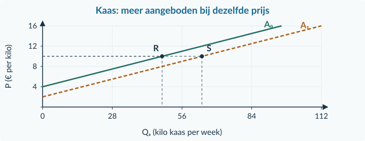<figcaption>Antwoordfiguur bij opgave 8 · Assen, lijnen en coördinaten volgen het lesmodel.</figcaption></figure>

<strong>Wat deze bron niet vastlegt</strong>

De uitkomst 64 kilo is aangeboden hoeveelheid, geen bewezen verkoop. Evenwicht wordt pas onderzocht wanneer ook de koopplannen op de markt bekend zijn.

<!-- PAGE {"section": "Antwoorden", "title": "1.3.1 · Doeloefening Atelier Sprint"} -->

<h3 id="answer9">Opgave 9 · Atelier Sprint</h3>

<strong>a.</strong> Oud: 4 × 20 − 40 = <strong>40 tassen per maand</strong>. Alleen prijs: 4 × 24 − 40 = <strong>56 tassen per maand</strong>. De 4 is <strong>4 extra tassen per maand per euro prijsstijging</strong>. <strong>Waarom:</strong> dit is de reactie langs A₀.

<strong>b.</strong> De <strong>prijs van stof, een productiemiddel</strong>, stijgt. A verschuift naar links. Bij € 20 nieuw: 4 × 20 − 52 = <strong>28 tassen per maand</strong>. <strong>Waarom:</strong> bij dezelfde verkoopprijs is het nieuwe aanbod 12 tassen lager.

<strong>c.</strong> A₁: van <strong>(0; 13)</strong> tot <strong>(68; 30)</strong>. R = <strong>(40; 20)</strong>, S = <strong>(56; 24)</strong>, T = <strong>(44; 24)</strong>. <strong>Waarom:</strong> de uiteindelijke prijs moet in de nieuwe functie worden ingevuld; S hoort nog bij de oude omstandigheden.

<strong>d.</strong> Uiteindelijk: 4 × 24 − 52 = <strong>44 tassen per maand</strong>. Verandering: 44 − 40 = <strong>+4 tassen per maand</strong>. De effecten werken tegen elkaar: <strong>+16</strong> door de verkoopprijs en <strong>−12</strong> door de stofprijs. <strong>Waarom:</strong> hier is het positieve prijseffect groter dan de afname door duurdere stof.

<strong>e.</strong> <strong>Onjuist:</strong> de verkoopprijs veroorzaakt de beweging R → S langs A₀. Duurdere stof verschuift de lijn naar links. <strong>Waarom:</strong> de eigen verkoopprijs en de prijs van een productiemiddel zijn verschillende oorzaken.

<figure>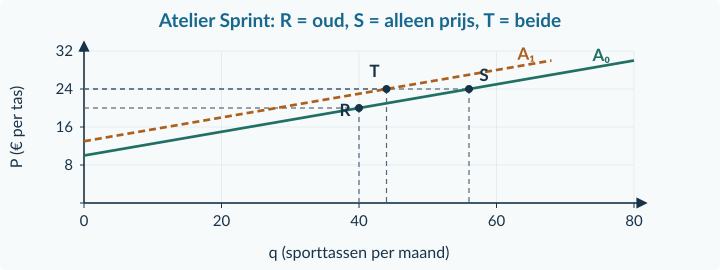<figcaption>Antwoordfiguur bij opgave 9 · Assen, lijnen en coördinaten volgen het lesmodel.</figcaption></figure>

<!-- PAGE {"section": "Antwoorden", "title": "1.3.1–1.3.2 · Begrippen en ophalen"} -->

<h3 id="answer10">Opgave 10 · De potten staan er al</h3>

<strong>a.</strong> De bestaande voorraad begrenst het aanbod voor dat uur op <strong>40 vazen</strong>. Een hogere prijs kan geen nieuwe vazen tevoorschijn brengen. Bij prijzen waarbij hij alle 40 wil verkopen, past een verticaal deel bij q = 40. Bij lage prijzen kan hij sommige vazen willen bewaren; dat is niet bekend. De gebruikelijke stijgende voorbeeldlijn is dus niet voor elk product en elke periode verplicht.

<strong>Beoordelingscriteria</strong>
<ul><li>Onderscheidt kunnen aanbieden van willen aanbieden.</li><li>Benoemt de vaste beschikbaarheid in het laatste uur.</li><li>Maakt de voorgestelde lijn afhankelijk van verkoopbereidheid; claimt geen universele verticale aanbodlijn.</li></ul>
<h3 id="answer11">Opgave 11 · Twee korte terugblikken</h3>

<strong>a.</strong> (10 − 8) / 8 × 100% = <strong>25% stijging</strong>. <strong>Waarom:</strong> de oude prijs van € 8 is de vergelijkingsbasis. Herhaal zo nodig §1.1.2.

<strong>b.</strong> Q = 2 + 5 = <strong>7 liter per week</strong>. <strong>Waarom:</strong> tel hoeveelheden bij dezelfde prijs op en tel elke koper één keer. Herhaal zo nodig §1.2.3.

<h3 id="answer12">Opgave 12 · Rekenen terughalen</h3>

<strong>a.</strong> 12 = 30 − 3P → 3P = 18 → P = <strong>€ 6 per stuk</strong>. Controle: 30 − 3 × 6 = 12 stuks per week. <strong>Waarom:</strong> terugrekenen en daarna invullen moeten dezelfde combinatie opleveren.

<h3 id="answer13">Opgave 13 · Eén markt, dezelfde producten</h3>

<strong>a.</strong> <strong>Er is evenwicht; er worden 60 bidons verkocht.</strong> <strong>Waarom:</strong> de kopers kopen dezelfde bidons die de verkopers verkopen. Vraag en aanbod tellen hier geen verschillende transacties.

<!-- PAGE {"section": "Antwoorden", "title": "1.3.2 · Begeleide inoefening"} -->

<h3 id="answer14">Opgave 14 · Lunchboxen</h3>

<strong>a.</strong> E: <strong>P = € 7 per lunchbox</strong>, <strong>Q = 25 lunchboxen per week</strong>. Qv = 60 − 5 × 7 = 25; Qa = 5 × 7 − 10 = 25. <strong>Waarom:</strong> het snijpunt moet in beide functies dezelfde hoeveelheid geven.

<strong>b.</strong> Bij € 5: Qv = <strong>35</strong>, Qa = <strong>15</strong>. Vraagoverschot: 35 − 15 = <strong>20 lunchboxen per week</strong>. Verkoop: <strong>15 lunchboxen per week</strong>. <strong>Waarom:</strong> onder de gegeven afspraak worden alle 15 aangeboden lunchboxen verkocht, niet de 20 ontbrekende lunchboxen.

<h3 id="answer15">Opgave 15 · De tweede lijn tekenen</h3>

<strong>a.</strong> 90 = <strong>15P</strong> − 30 → <strong>120 = 15P</strong> → P = <strong>€ 8</strong>. Qv = 90 − 5 × 8 = <strong>50 posters per week</strong>. Controle: 10 × 8 − 30 = 50. <strong>Waarom:</strong> dezelfde bewerking aan beide kanten houdt de gelijkheid in stand.

<strong>b.</strong> A bijvoorbeeld door <strong>(0; 3)</strong> en <strong>(150; 18)</strong>. E = <strong>(50; 8)</strong>, met hulplijnen naar 50 en 8. <strong>Waarom:</strong> de aanbodpunten komen uit de aanbodfunctie; E ligt ook op de gegeven vraaglijn.

<strong>c.</strong> Qv = 90 − 5 × 6 = <strong>60</strong>; Qa = 10 × 6 − 30 = <strong>30</strong>. Vraagoverschot = 60 − 30 = <strong>30 posters per week</strong>. <strong>Waarom:</strong> er zijn bij € 6 meer koopplannen dan verkoopplannen.

<figure>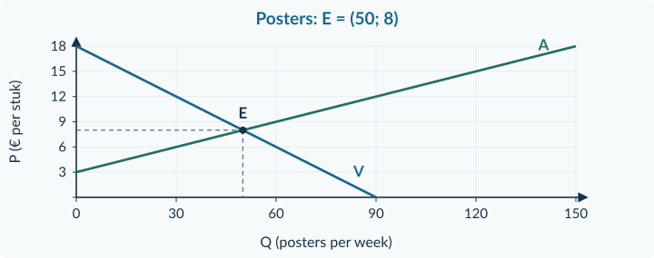<figcaption>Antwoordfiguur bij opgave 15 · Assen, lijnen en coördinaten volgen het lesmodel.</figcaption></figure>

<!-- PAGE {"section": "Antwoorden", "title": "1.3.2 · Zelfstandig construeren"} -->

<h3 id="answer16">Opgave 16 · Zonder grafiek</h3>

<strong>a.</strong> Verkoop: <strong>40 sjaals</strong>. Aanbodoverschot: 70 − 40 = <strong>30 sjaals</strong>. <strong>Neerwaartse prijsdruk. Waarom:</strong> verkopers concurreren om minder koopplannen dan zij samen willen leveren.

<h3 id="answer17">Opgave 17 · Schriftenmarkt</h3>

<strong>a.</strong> 140 − 10P = 10P − 20 → 140 = 20P − 20 → 160 = 20P → P = <strong>€ 8</strong>. Qv = 140 − 10 × 8 = <strong>60</strong>; controle Qa = 10 × 8 − 20 = <strong>60 schriften per week</strong>. <strong>Waarom:</strong> beide plannen stemmen overeen.

<strong>b.</strong> V door <strong>(0; 14)</strong> en <strong>(140; 0)</strong>. A door <strong>(0; 2)</strong> en <strong>(120; 14)</strong>. E = <strong>(60; 8)</strong>. <strong>Waarom:</strong> iedere lijn verbindt prijs en hoeveelheid uit zijn eigen functie; E ligt op beide. Zie de antwoordfiguur.

<strong>c.</strong> Bij € 6: Qv = 80 en Qa = 40. Vraagoverschot = 80 − 40 = <strong>40 schriften per week</strong>. <strong>Opwaartse druk</strong>, doordat kopers om het kleinere aanbod concurreren. <strong>Waarom:</strong> de prijs is onder het berekende evenwicht.

<figure>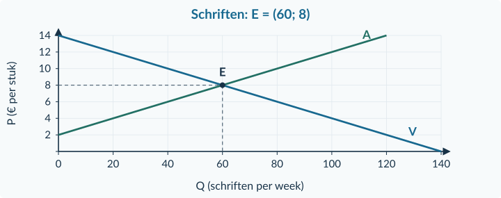<figcaption>Antwoordfiguur bij opgave 17 · Assen, lijnen en coördinaten volgen het lesmodel.</figcaption></figure>

<!-- PAGE {"section": "Antwoorden", "title": "1.3.2 · Evenwicht of een assnijpunt?"} -->

<h3 id="answer18">Opgave 18 · Fietsmanden</h3>

<strong>a.</strong> 120 − 4P = 6P − 30 → 150 = 10P → P = <strong>€ 15</strong>. Qv = 120 − 4 × 15 = <strong>60</strong>; Qa = 6 × 15 − 30 = <strong>60 manden per maand</strong>. <strong>Waarom:</strong> alleen bij € 15 zijn de twee plannen gelijk.

<strong>b.</strong> Het <strong>snijpunt van de vraaglijn met de P-as</strong>, waar de gevraagde hoeveelheid nul is. <strong>Waarom:</strong> deze berekening gebruikt geen aanbod en zoekt dus niet naar overeenstemming tussen vraag en aanbod.

<h3 id="answer19">Opgave 19 · Plantbollen</h3>

<strong>a.</strong> € 4: vraagoverschot <strong>90 − 50 = 40 zakken</strong>, verkoop <strong>50 zakken</strong>. € 7: aanbodoverschot <strong>80 − 30 = 50 zakken</strong>, verkoop <strong>30 zakken</strong>. <strong>Waarom:</strong> het verschil meet de niet-passende plannen, het kleinere aantal meet hier de gerealiseerde transacties.

<strong>b.</strong> Elke verkoop is tegelijk één aankoop. <strong>Waarom:</strong> optellen zou dezelfde transactie tweemaal tellen.

<h3 id="answer20">Opgave 20 · Een markt voor herbruikbare bekers</h3>

<strong>a.</strong> 150 − 10P = 5P − 30 → 150 = 15P − 30 (+10P aan beide kanten) → 180 = 15P (+30) → P = <strong>€ 12 per beker</strong> (delen door 15). <strong>Waarom:</strong> de gelijkheid zoekt één prijs voor dezelfde hoeveelheid in beide plannen.

<strong>b.</strong> Qv = 150 − 10 × 12 = <strong>30 bekers per week</strong>. Controle: Qa = 5 × 12 − 30 = <strong>30</strong>. Bij <strong>€ 12 per beker</strong> sluiten beide plannen voor <strong>30 bekers per week</strong> aan. <strong>Waarom:</strong> gelijkheid van de hoeveelheden is precies de evenwichtsvoorwaarde.

<!-- PAGE {"section": "Antwoorden", "title": "1.3.2 · Doeloefening: grafiek en transacties"} -->

<h3 id="answer20" class="continuation">Opgave 20 · Een markt voor herbruikbare bekers (vervolg)</h3>

<strong>c.</strong> V door <strong>(0; 15)</strong> en <strong>(150; 0)</strong>; A door <strong>(0; 6)</strong> en <strong>(45; 15)</strong>. E = <strong>(30; 12)</strong>. Q horizontaal, P verticaal, met juiste eenheden en schalen. <strong>Waarom:</strong> het evenwicht is het gemeenschappelijke punt, niet een snijpunt met een as.

<strong>d.</strong> Bij € 10: Qv = 150 − 10 × 10 = <strong>50</strong>; Qa = 5 × 10 − 30 = <strong>20</strong>. Vraagoverschot: 50 − 20 = <strong>30 bekers per week</strong>. Verkoop volgens de afspraak: <strong>20 bekers per week</strong>. <strong>Waarom:</strong> ontbrekende bekers worden niet verkocht; alle 20 aangeboden bekers wel.

<strong>e.</strong> <strong>Opwaartse prijsdruk.</strong> Kopers concurreren om het kleinere aanbod. Als P stijgt, daalt Qv langs V en stijgt Qa langs A, totdat de plannen aansluiten. <strong>Waarom:</strong> de omstandigheden achter de lijnen veranderen niet; er ontstaan geen verschuivingen.

<figure>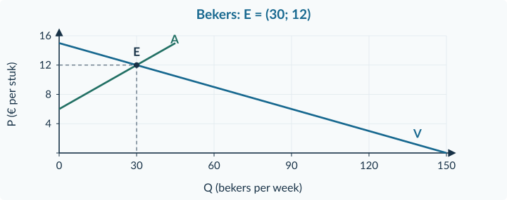<figcaption>Antwoordfiguur bij opgave 20 · Assen, lijnen en coördinaten volgen het lesmodel.</figcaption></figure>

<!-- PAGE {"section": "Antwoorden", "title": "1.3.2–1.3.3 · Betekenis en startwerk"} -->

<h3 id="answer21">Opgave 21 · Iedereen tevreden?</h3>

<strong>a.</strong> Nee. Evenwicht vergelijkt wat mensen <strong>bij € 10 willen en kunnen kopen</strong> met het aanbod bij die prijs. Iemand met een betalingsbereidheid van € 7 draagt bij € 10 geen vraag bij. Dat betekent niet dat die persoon geen behoefte heeft. Evenwicht sluit plannen bij een prijs op elkaar aan, maar vervult niet alle wensen en bewijst geen eerlijke verdeling.

<strong>Beoordelingscriteria</strong>
<ul><li>Maakt de vergelijking expliciet afhankelijk van de prijs.</li><li>Onderscheidt behoefte van koopbereidheid bij € 10.</li><li>Leidt geen eerlijkheid of algemene tevredenheid af uit Qv = Qa.</li></ul>
<h3 id="answer22">Opgave 22 · Basis en oppervlakte</h3>

<strong>a.</strong> (108 − 96) / 96 × 100% = <strong>12,5% stijging</strong>. <strong>Waarom:</strong> de toename van 12 indexpunten wordt vergeleken met 96, niet met 100.

<strong>b.</strong> Rechthoek: 6 × 4 = <strong>24 cm²</strong>. Driehoek: ½ × 6 × 4 = <strong>12 cm²</strong>. <strong>Waarom:</strong> de driehoek heeft de helft van de oppervlakte van de rechthoek met dezelfde basis en hoogte.

<h3 id="answer23">Opgave 23 · Een verandering vergelijken</h3>

<strong>a.</strong> (400 − 320) / 320 × 100% = <strong>25% stijging</strong>. <strong>Waarom:</strong> de oude hoeveelheid is de basis; het verschil van 80 is niet zelf een percentage.

<h3 id="answer24">Opgave 24 · Welke oorzaak?</h3>

<strong>a.</strong> <strong>De vraaglijn verschuift naar rechts.</strong> Een hogere marktprijs geeft daarna een <strong>beweging langs de bestaande aanbodlijn</strong>, geen verschuiving. <strong>Waarom:</strong> de omstandigheden van de aanbieders veranderen niet.

<h3 id="answer25">Opgave 25 · Plantenvoeding</h3>

<strong>a.</strong> Oud: <strong>€ 12 per fles en 24 flessen per week</strong>. Nieuw: <strong>€ 14 per fles en 30 flessen per week</strong>. <strong>Waarom:</strong> de hulplijnen en schaal verbinden beide evenwichten met hun assen.

<strong>b.</strong> De prijs stijgt en verkopers reageren <strong>langs dezelfde A</strong>. <strong>Waarom:</strong> meer kopers verandert de vraag, niet de omstandigheden achter het aanbod.

<!-- PAGE {"section": "Antwoorden", "title": "1.3.3 · Van bron naar nieuw evenwicht"} -->

<h3 id="answer26">Opgave 26 · Duurder papier voor notitieblokken</h3>

<strong>a.</strong> Oud: 100 − 5P = 5P − 20 → 120 = 10P → <strong>P₀ = € 12</strong>, Q₀ = 100 − 60 = <strong>40</strong>; controle 60 − 20 = 40. Nieuw: 100 − 5P = 5P − 40 → 140 = 10P → <strong>P₁ = € 14</strong>, Q₁ = 100 − 70 = <strong>30</strong>; controle 70 − 40 = <strong>30 blokken per week</strong>. <strong>Waarom:</strong> iedere situatie gebruikt haar eigen aanbodfunctie.

<strong>b.</strong> A₁ door <strong>(0; 8)</strong> en <strong>(60; 20)</strong>; E₀ = <strong>(40; 12)</strong>, E₁ = <strong>(30; 14)</strong>. <strong>Waarom:</strong> duurdere papierpulp legt het aanbod bij elke relevante prijs lager, dus de nieuwe lijn ligt links van A₀.

<strong>c.</strong> Bij € 12 nieuw: Qa,1 = 5 × 12 − 40 = <strong>20</strong>; Qv = 100 − 5 × 12 = <strong>40</strong>. Vraagoverschot = <strong>20 blokken per week</strong>. <strong>Waarom:</strong> kopers concurreren om het kleinere aanbod; de prijs krijgt opwaartse druk.

<figure>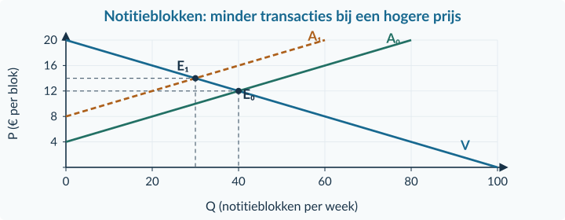<figcaption>Antwoordfiguur bij opgave 26 · Assen, lijnen en coördinaten volgen het lesmodel.</figcaption></figure>

<!-- PAGE {"section": "Antwoorden", "title": "1.3.3 · Twee oorzaken en een berekening"} -->

<h3 id="answer27">Opgave 27 · Meer vraag én meer aanbod</h3>

<strong>a.</strong> Alleen meer vraag: <strong>prijs omhoog en hoeveelheid omhoog</strong>. <strong>Waarom:</strong> bij de oude prijs ontstaat een vraagoverschot.

<strong>b.</strong> Alleen meer aanbod: <strong>prijs omlaag en hoeveelheid omhoog</strong>. <strong>Waarom:</strong> bij de oude prijs ontstaat een aanbodoverschot.

<strong>c.</strong> In dit model neemt de evenwichtshoeveelheid <strong>toe</strong>. De prijs kan <strong>stijgen, dalen of gelijk blijven</strong>. <strong>Waarom:</strong> de hoeveelheidseffecten versterken elkaar; de prijsuitkomst hangt af van de groottes van beide verschuivingen.

<strong>d.</strong> De drukken hoeven niet even groot te zijn. <strong>Waarom:</strong> zonder relatieve groottes kun je niet besluiten dat ze elkaar precies opheffen.

<h3 id="answer28">Opgave 28 · Reparatiesets</h3>

<strong>a.</strong> Oud: 96 − 4P = 4P − 16 → 112 = 8P → <strong>€ 14</strong>; Q = 96 − 56 = <strong>40</strong>; controle 56 − 16 = 40. Nieuw: 112 − 4P = 4P − 16 → 128 = 8P → <strong>€ 16</strong>; Q = 112 − 64 = <strong>48</strong>; controle 64 − 16 = <strong>48 sets per week</strong>. <strong>Waarom:</strong> de voorkeur verandert de vraagfunctie, het aanbod blijft staan.

<strong>b.</strong> Bij € 14 nieuw: Qv,1 = 112 − 56 = <strong>56</strong>, Qa = 56 − 16 = <strong>40</strong>. Vraagoverschot = <strong>16 sets per week</strong>; opwaartse prijsdruk. <strong>Waarom:</strong> de koopplannen zijn toegenomen voordat de prijs reageert.

<strong>c.</strong> (48 − 40) / 40 × 100% = <strong>20% stijging</strong>. <strong>Waarom:</strong> je vergelijkt de twee evenwichtshoeveelheden, niet het tijdelijke vraagoverschot.

<!-- PAGE {"section": "Antwoorden", "title": "1.3.3 · Zelfstandig tekenen"} -->

<h3 id="answer29">Opgave 29 · Houten speelgoed</h3>

<strong>a.</strong> Oud: 120 − 6P = 6P − 24 → 144 = 12P → <strong>P₀ = € 12</strong>, Q₀ = 120 − 72 = <strong>48</strong>, controle 72 − 24 = 48. Nieuw: 120 − 6P = 6P − 12 → 132 = 12P → <strong>P₁ = € 11</strong>, Q₁ = 120 − 66 = <strong>54</strong>, controle 66 − 12 = <strong>54 sets per maand</strong>. A₁ door (0; 2) en (108; 20); E₀ = (48; 12), E₁ = (54; 11). <strong>Waarom:</strong> lagere houtkosten verhogen het aanbod bij dezelfde prijs.

<strong>b.</strong> Kopers reageren op de lagere prijs <strong>langs dezelfde V</strong>. <strong>Waarom:</strong> hun omstandigheden zijn gelijk gebleven; alleen de kosten van de aanbieders zijn veranderd.

<figure>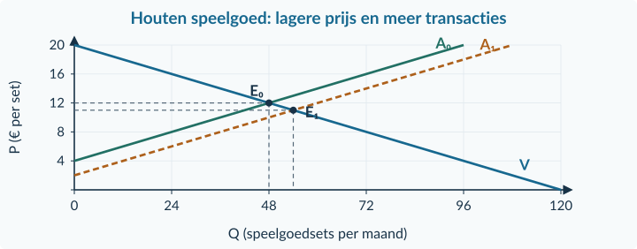<figcaption>Antwoordfiguur bij opgave 29 · Assen, lijnen en coördinaten volgen het lesmodel.</figcaption></figure><h3 id="answer30">Opgave 30 · Wat past bij de waarneming?</h3>

<strong>a.</strong> <strong>Duurdere materialen.</strong> Dat verschuift A naar links, waardoor P stijgt en Q daalt. Alleen sterkere voorkeur verschuift V naar rechts en zou P én Q doen stijgen. <strong>Waarom:</strong> de richting van Q onderscheidt hier de twee gegeven verklaringen; de conclusie steunt op de expliciete aanname van één verandering.

<!-- PAGE {"section": "Antwoorden", "title": "1.3.3 · Doeloefening oplaadkabels"} -->

<h3 id="answer31">Opgave 31 · Meer kopers van oplaadkabels</h3>

<strong>a.</strong> 100 − 5P = 5P − 20 → 120 = 10P → <strong>P₀ = € 12</strong>. Qv,0 = 100 − 60 = <strong>40</strong>; Qa = 60 − 20 = <strong>40 kabels per week</strong>. <strong>Waarom:</strong> de twee oorspronkelijke plannen zijn gelijk.

<strong>b.</strong> <strong>Aantal vragers.</strong> Bij € 12: Qv,1 = 120 − 60 = <strong>60</strong>, Qa = 60 − 20 = <strong>40</strong>. Vraagoverschot: <strong>20 kabels per week</strong>; opwaartse druk. <strong>Waarom:</strong> meer kopers vragen bij dezelfde prijs meer, terwijl de aanbieders hun oorspronkelijke plan behouden.

<strong>c.</strong> 120 − 5P = 5P − 20 → 140 = 10P → <strong>P₁ = € 14</strong>. Qv,1 = 120 − 70 = <strong>50</strong>; controle Qa = 70 − 20 = <strong>50 kabels per week</strong>. Verandering: (50 − 40) / 40 × 100% = <strong>25% stijging</strong>. <strong>Waarom:</strong> de nieuwe prijs brengt beide plannen weer samen.

<strong>d.</strong> V₁ door <strong>(0; 24)</strong> en <strong>(120; 0)</strong>. E₀ = <strong>(40; 12)</strong>; E₁ = <strong>(50; 14)</strong>. Een horizontale pijl bij € 12 loopt van 40 naar 60; de andere pijl loopt van E₀ naar E₁ langs A. <strong>Waarom:</strong> de eerste pijl toont de veranderde vraag, de tweede de prijsreactie van verkopers.

<strong>e.</strong> <strong>Onjuist.</strong> A blijft Qa = 5P − 20. Alleen P stijgt van € 12 naar € 14; daarom wordt Qa groter langs dezelfde lijn. <strong>Waarom:</strong> de aanbodfactoren zijn niet veranderd.

<figure>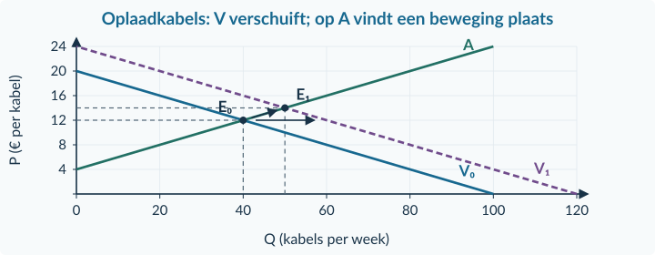<figcaption>Antwoordfiguur bij opgave 31 · Assen, lijnen en coördinaten volgen het lesmodel.</figcaption></figure>

<!-- PAGE {"section": "Antwoorden", "title": "1.3.3 · Verklaren en herhalen"} -->

<h3 id="answer32">Opgave 32 · Twee verklaringen voor dezelfde richting</h3>

<strong>a.</strong> Eén mogelijkheid is een <strong>vraagtoename bij onveranderd aanbod</strong>: P en Q stijgen. Een tweede is <strong>meer vraag én minder aanbod</strong>, waarbij de vraagtoename groot genoeg is om de hoeveelheid toch te laten stijgen. Ook meer vraag plus een beperkte aanbodtoename kan passen als de vraagtoename de prijsdruk overheerst. De waarnemingen geven niet aan welke omstandigheden werkelijk veranderden. Er is aanvullende informatie over de oorzaken en hun grootte nodig.

<strong>Beoordelingscriteria</strong>
<ul><li>Geeft twee economisch mogelijke verklaringen voor P omhoog en Q omhoog.</li><li>Houdt bij twee verschuivingen rekening met hun relatieve grootte.</li><li>Onderscheidt een mogelijke modelverklaring van bewijs van de werkelijke oorzaak.</li></ul>
<h3 id="answer33">Opgave 33 · Formules en eenheden ophalen</h3>

<strong>a.</strong> € 84 / 14 = <strong>€ 6 per map</strong>. <strong>Waarom:</strong> je verdeelt het totale bedrag over het aantal gelijke producten. Herhaal zo nodig §1.1.2.

<strong>b.</strong> Bij q = 0: 0 = 20 − 2P → P = <strong>€ 10</strong>. Bij P = 0: q = <strong>20 stuks per maand</strong>. Coördinaten: <strong>(0; 10)</strong> en <strong>(20; 0)</strong>. <strong>Waarom:</strong> bij elk assnijpunt is één coördinaat nul. Herhaal zo nodig §1.2.1.

<!-- PAGE {"section": "Antwoorden", "title": "1.3.4 · Marktplannen combineren"} -->

<h3 id="answer34">Opgave 34 · Knoppen uit een 3D-printer</h3>

<strong>a.</strong> Oud: 6 × 7 − 18 = <strong>24 knoppen per week</strong>. Nieuw: 6 × 7 − 12 = <strong>30 knoppen per week</strong>. <strong>Techniek</strong> verandert; A verschuift naar rechts. <strong>Waarom:</strong> bij dezelfde prijs is er meer aanbod.

<strong>b.</strong> De bron geeft alleen het aanbod van één maker, geen collectieve vraag en geen volledig marktmodel. <strong>Waarom:</strong> een aanbodhoeveelheid bij een prijs is nog geen evenwicht tussen vraag en aanbod.

<h3 id="answer35">Opgave 35 · Fietslampjes bij de opening</h3>

<strong>a.</strong> 90 − 5P = 10P − 30 → 120 = 15P → <strong>P = € 8</strong>. Qv = 90 − 40 = <strong>50</strong>; Qa = 80 − 30 = <strong>50 lampjes per week</strong>. <strong>Waarom:</strong> één prijs brengt de plannen samen.

<strong>b.</strong> Bij € 6: Qv = 60 en Qa = 30. Verkoop: <strong>30 lampjes per week</strong>. Vraagoverschot: 60 − 30 = <strong>30 lampjes per week</strong>. <strong>Waarom:</strong> de verkoop en het tekort zijn hier toevallig even groot, maar zijn verschillende grootheden.

<strong>c.</strong> <strong>Opwaartse prijsdruk</strong>, doordat kopers om het beperkte aanbod concurreren. Qv daalt en Qa stijgt langs de bestaande lijnen. <strong>Waarom:</strong> er is geen nieuwe vraag- of aanbodfactor genoemd.

<!-- PAGE {"section": "Antwoorden", "title": "1.3.4 · Oude en nieuwe functie"} -->

<h3 id="answer36">Opgave 36 · Tenten uit de fabriek</h3>

<strong>a.</strong> Oud: 120 − 4P = 8P − 24 → 144 = 12P → <strong>€ 12</strong>. Q = 120 − 48 = <strong>72</strong>, controle 96 − 24 = 72. Nieuw: 120 − 4P = 8P − 12 → 132 = 12P → <strong>€ 11</strong>. Q = 120 − 44 = <strong>76</strong>, controle 88 − 12 = <strong>76 tenten per maand</strong>. Bij dezelfde prijs is het nieuwe aanbod <strong>12 tenten groter</strong>. <strong>Waarom:</strong> de techniek maakt meer aanbieden mogelijk; het prijsverschil tussen de evenwichten is een reactie.

<strong>b.</strong> V door (0; 30) en (120; 0); A₀ door (0; 3) en (168; 24); A₁ door (0; 1,5) en (180; 24). Een tekening mag een kleiner venster gebruiken met correct afgebroken lijnen. E₀ = <strong>(72; 12)</strong> en E₁ = <strong>(76; 11)</strong>. <strong>A verschuift naar rechts; beweging langs V. Waarom:</strong> de vraagfactoren zijn niet veranderd. De antwoordfiguur gebruikt een venster tot Q = 160.

<strong>c.</strong> <strong>Onjuist.</strong> De evenwichtsvoorwaarde blijft vraag = aanbod, maar je moet de <strong>nieuwe aanbodfunctie</strong> gebruiken: Qv = Qa,1. <strong>Waarom:</strong> dezelfde economische voorwaarde toepassen betekent niet dat een verouderde functie geldig blijft.

<figure>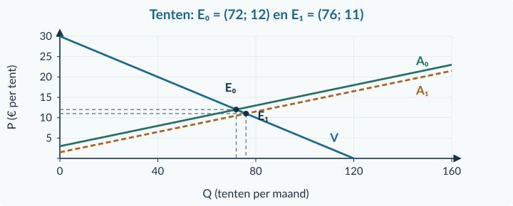<figcaption>Antwoordfiguur bij opgave 36 · Assen, lijnen en coördinaten volgen het lesmodel.</figcaption></figure>

<!-- PAGE {"section": "Antwoorden", "title": "1.3.4 · De linnen tas: berekeningen"} -->

<h3 id="answer37">Opgave 37 · De linnen boodschappentas</h3>

<strong>a.</strong> 180 − 10P = 10P − 20 → 180 = 20P − 20 → 200 = 20P → <strong>P₀ = € 10 per tas</strong>. Qv = 180 − 10 × 10 = <strong>80</strong>; Qa,0 = 10 × 10 − 20 = <strong>80 tassen per week</strong>. <strong>Waarom:</strong> alleen bron A beschrijft de beginmarkt.

<strong>b.</strong> <strong>A verschuift naar links</strong>, doordat linnen, een productiemiddel, duurder wordt. Bij € 10 nieuw: Qa,1 = 10 × 10 − 60 = <strong>40</strong>; Qv = 180 − 10 × 10 = <strong>80</strong>. Vraagoverschot = <strong>40 tassen per week</strong>. <strong>Waarom:</strong> het nieuwe aanbod is bij dezelfde prijs lager; de vraagfunctie is niet veranderd.

<strong>c.</strong> 180 − 10P = 10P − 60 → 240 = 20P → <strong>P₁ = € 12</strong>. Qv = 180 − 120 = <strong>60</strong>; controle: Qa,1 = 120 − 60 = <strong>60 tassen per week</strong>. Prijs: (12 − 10) / 10 × 100% = <strong>+20%</strong>. Hoeveelheid: (60 − 80) / 80 × 100% = <strong>−25%</strong>. <strong>Waarom:</strong> de percentages vergelijken de twee evenwichten, elk met zijn eigen oude waarde.

<!-- PAGE {"section": "Antwoorden", "title": "1.3.4 · De linnen tas: grafische onderbouwing"} -->

<h3 id="answer37" class="continuation">Opgave 37 · De linnen boodschappentas (vervolg)</h3>

<strong>d.</strong> V door <strong>(0; 18)</strong> en <strong>(180; 0)</strong>. A₀ door <strong>(0; 2)</strong> en <strong>(160; 18)</strong>. A₁ door <strong>(0; 6)</strong> en <strong>(120; 18)</strong>. E₀ = <strong>(80; 10)</strong> en E₁ = <strong>(60; 12)</strong>. Een horizontale pijl bij € 10 van 80 naar 40 toont de aanbodverschuiving; de stap E₀ → E₁ ligt langs V. <strong>Waarom:</strong> duurdere linnenproductie verandert A; kopers reageren op de hogere tasprijs langs dezelfde V.

<figure>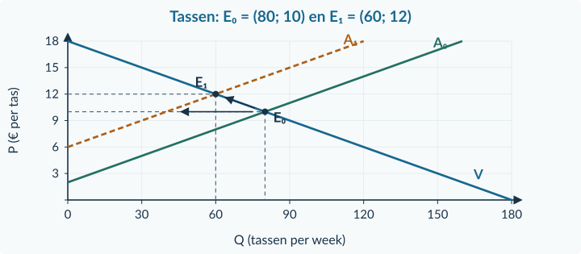<figcaption>Antwoordfiguur bij opgave 37 · Assen, lijnen en coördinaten volgen het lesmodel.</figcaption></figure>

<strong>Coördinaten lezen</strong>

De horizontale verschuiving bij € 10 vergelijkt aanbodplannen bij dezelfde prijs. De stap langs V van E₀ naar E₁ laat de reactie van kopers op de hogere prijs zien. De twee pijlen stellen dus verschillende veranderingen voor.

<!-- PAGE {"section": "Antwoorden", "title": "1.3.4 · Conclusies en rekengereedschap"} -->

<h3 id="answer37" class="continuation">Opgave 37 · De linnen boodschappentas (vervolg)</h3>

<strong>e.</strong> Bij € 14 in de nieuwe situatie: Qv = 180 − 140 = <strong>40</strong>; Qa,1 = 140 − 60 = <strong>80</strong>. Aanbodoverschot: 80 − 40 = <strong>40 tassen per week</strong>. Verkoop: <strong>40 tassen per week</strong>. <strong>Waarom:</strong> volgens bron C vindt iedere koper een verkoper; de overige verkoopplannen worden niet gerealiseerd.

<strong>f.</strong> De vraaglijn is <strong>niet verschoven</strong>: zij blijft Qv = 180 − 10P. De prijsstijging leidt tot een beweging langs V van 80 naar 60. Het evenwicht bewijst ook <strong>geen algemene tevredenheid</strong>; koop- en verkoopplannen passen bij die prijs, maar behoeften kunnen onvervuld blijven. De <strong>enquêtewaardering van 4,6/5</strong> is niet nodig voor de berekening. <strong>Waarom:</strong> de functies en de veranderde linnenprijs leveren de relevante modelinformatie.

<h3 id="answer38">Opgave 38 · Korte terugblik op hoofdstuk 1.1</h3>

<strong>a.</strong> 90 / 15 = <strong>€ 6 per doos</strong>. <strong>Waarom:</strong> je deelt een totaalbedrag door het bijbehorende aantal producten.

<strong>b.</strong> 36 / 6 = <strong>€ 6 per extra doos</strong>. <strong>Waarom:</strong> het extra bedrag hoort bij zes extra eenheden, niet bij één of bij alle 21 dozen.

<strong>c.</strong> (150 − 125) / 125 × 100% = <strong>20% stijging</strong>. <strong>Waarom:</strong> de oude index 125 is de vergelijkingsbasis; 25 indexpunten is niet hetzelfde als 25%.

<strong>d.</strong> AB = 8 − 0 = <strong>8 cm</strong>. Hoogte = 6 − 2 = <strong>4 cm</strong>. Driehoek: ½ × 8 × 4 = <strong>16 cm²</strong>. Rechthoek: 8 × 4 = <strong>32 cm²</strong>. <strong>Waarom:</strong> de hoogte begint bij de basis op niveau 2, niet bij de horizontale as.

