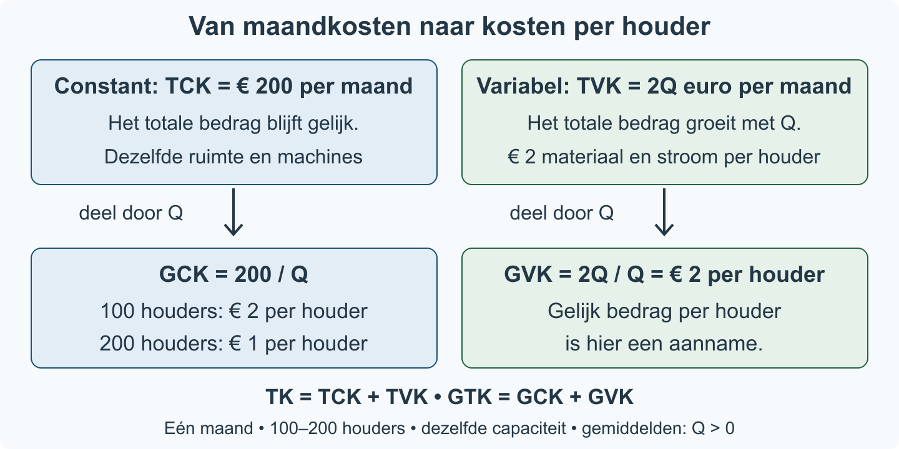

# 2.1.1 Kostenstructuren

Een schoolwerkplaats maakt houten telefoonhouders. Bij een grotere bestelling moet de werkplaats meer hout kopen, maar zij huurt nog steeds dezelfde ruimte. Worden de kosten per houder dan hoger of lager? Om dat te beoordelen, moet je **totale kosten** en **kosten per product** uit elkaar houden.

**Na deze paragraaf kun je:** kosten naar hun gedrag indelen, kostenfuncties opstellen, gemiddelde kosten berekenen en verklaren wat er met die kosten gebeurt als de productie verandert.

> **Even terughalen**
> In §1.1.3 gebruikte je gegevens en formules. Bij invullen vervang je een letter door de gegeven waarde en controleer je de eenheid. De economische betekenis van de kosten en de kostenformules leer je hier nieuw.

### Eerst: kijk naar het gedrag van de kosten

We bekijken **één maand** en een productie tussen **100 en 200 houders**. De ruimte en machines blijven gelijk. Huur en verzekering kosten samen € 160 per maand. Een machineabonnement kost € 40 per maand. Hout en verpakking kosten samen € 1,50 per houder; het stroomverbruik kost € 0,50 per houder. Binnen deze grenzen blijven die bedragen per houder gelijk.

> **Definitie: constante kosten**
> Kosten waarvan het totale bedrag niet verandert als de productieomvang verandert, binnen de genoemde periode en bij gelijkblijvende productiecapaciteit. De totale constante kosten heten **TCK**.

De huur, verzekering en het machineabonnement blijven samen € 200 per maand, ook als de werkplaats binnen de genoemde grenzen meer houders maakt.

> **Definitie: variabele kosten**
> Kosten waarvan het totale bedrag verandert als de productieomvang verandert. De totale variabele kosten heten **TVK**.

Voor iedere extra houder koopt de werkplaats hout en verpakking en verbruikt zij stroom. Samen is dat € 2 per houder. Meer houders betekent dus een hoger totaal variabel bedrag.

> **Let op: een rekening kan beide soorten bevatten.**
> Een vast energieabonnement kan constant zijn, terwijl betaald stroomverbruik variabel is. Kijk naar wat het bedrag doet als de productie verandert; het woord ‘energie’ beslist dat niet.

### Van een context naar totale kosten

Noem de productieomvang **Q**, hier in houders per maand. Tel eerst de constante maandbedragen op. Tel daarna de variabele bedragen per houder op en vermenigvuldig met Q.

> **Formules voor deze werkplaats**
> TCK = 160 + 40 = 200
>
> TVK = (1,50 + 0,50) × Q = 2Q
>
> TK = TCK + TVK = 200 + 2Q
>
> TCK, TVK en TK zijn in euro per maand. Deze contextformules gelden voor 100 ≤ Q ≤ 200 bij dezelfde capaciteit en dezelfde bedragen per houder.

**TK** betekent totale kosten: alle constante en variabele kosten samen. De formule TK = TCK + TVK is de algemene optelregel; het getal 200 en de factor 2 horen bij deze werkplaats.

### Daarna: verdeel het totaal over de producten

> **Definitie: gemiddelde kosten**
> Gemiddelde kosten zijn kosten per product. Je deelt het betreffende totale bedrag door het aantal producten in dezelfde periode.

> **Formules voor gemiddelden (alleen bij Q > 0)**
> GCK zijn de gemiddelde constante kosten; GVK de gemiddelde variabele kosten; GTK de gemiddelde totale kosten.
>
> GCK = TCK / Q; GVK = TVK / Q; GTK = TK / Q.
>
> Ook geldt GTK = GCK + GVK. Hier zijn alle gemiddelden in euro per houder.

Bij Q = 100 is GCK = 200 / 100 = € 2 per houder. Bij Q = 200 is GCK = 200 / 200 = € 1 per houder. **Hetzelfde constante maandbedrag wordt over twee keer zoveel houders verdeeld.** Het totale bedrag blijft gelijk; het bedrag per houder halveert.

De volgende figuur vat de twee soorten en de stap van totaal naar gemiddeld samen. Lees eerst de bovenste rij (bedrag per maand) en deel daarna elke kolom door Q (bedrag per houder).

| Q (houders per maand) | TCK (€/maand) | TVK (€/maand) | TK (€/maand) | GCK (€/houder) | GVK (€/houder) | GTK (€/houder) |
|---|---:|---:|---:|---:|---:|---:|
| 100 | 200 | 200 | 400 | 2,00 | 2,00 | 4,00 |
| 200 | 200 | 400 | 600 | 1,00 | 2,00 | 3,00 |

De totale kosten stijgen van € 400 naar € 600 per maand, terwijl de gemiddelde totale kosten dalen van € 4 naar € 3 per houder. **Meer totale kosten betekent dus niet automatisch meer kosten per product.**

> **Let op: GVK blijft niet altijd gelijk.**
> Hier blijft GVK € 2 per houder doordat we een gelijk variabel bedrag per houder aannemen. Bij andere afspraken of productietechnieken kan dat bedrag veranderen. GTK halveert hier niet: alleen het constante deel per houder halveert.

## Uitgewerkt voorbeeld

We beantwoorden voor de schoolwerkplaats dezelfde vijf soorten vragen die je straks zelfstandig maakt.

**a. Indelen en verklaren.** Huur en verzekering (€ 160 per maand) en machineabonnement (€ 40 per maand) zijn constant: hun totale maandbedrag verandert niet met Q. Hout/verpakking (€ 1,50 per houder) en stroomverbruik (€ 0,50 per houder) zijn variabel: hun totale maandbedrag stijgt bij meer houders.

**b. Functies opstellen.** TCK = 160 + 40 = 200; TVK = (1,50 + 0,50)Q = 2Q; TK = 200 + 2Q, in euro per maand, voor 100 ≤ Q ≤ 200 bij dezelfde capaciteit.

**c. Bij 100 houders.** GCK = TCK / Q = 200 / 100 = € 2 per houder. GVK = TVK / Q = (2 × 100) / 100 = € 2 per houder. GTK = TK / Q = (200 + 2 × 100) / 100 = € 4 per houder.

**d. Bij 200 houders.** GCK = 200 / 200 = € 1 per houder. GVK = (2 × 200) / 200 = € 2 per houder. GTK = (200 + 2 × 200) / 200 = € 3 per houder.

**e. Vergelijken en begrenzen.** TCK blijft € 200 per maand. TVK stijgt van € 200 naar € 400 per maand en verdubbelt. TK stijgt van € 400 naar € 600 per maand en verdubbelt niet. GCK halveert, omdat hetzelfde constante bedrag over tweemaal zoveel houders wordt verdeeld. GVK blijft gelijk, omdat het variabele bedrag per houder gelijk blijft. GTK daalt van € 4 naar € 3 per houder: alleen GCK halveert, GVK niet. Dit geldt in dezelfde maand, tussen 100 en 200 houders en bij dezelfde capaciteit.

> **Samenvatting §2.1.1**
>
> - Constant of variabel gaat over het gedrag van het totale bedrag bij een verandering van Q.
> - TK = TCK + TVK; noteer de periode en de productiegrenzen.
> - GCK = TCK / Q, GVK = TVK / Q en GTK = TK / Q, bij Q > 0.
> - Meer productie verdeelt dezelfde TCK over meer producten; constant GVK vraagt een gelijk variabel bedrag per product.
> - In de volgende paragraaf verbind je kosten met opbrengsten en winst.

## Startopgaven

Korte route: Startopgaven → Zelfstandige oefening → Doeloefening. Extra hulp nodig? Maak eerst Begeleide inoefening.

**Opgave 1 — Ophalen**

Een klas verdeelt 240 potloden over 30 leerlingen.

**a)** Bereken het aantal potloden per leerling. Noteer de eenheid.

**b)** Voor een bestelling geldt het gegeven rekenvoorschrift B = 20 + 3n, met B in euro en n het aantal pakketten. Bereken B bij n = 10.

**Opgave 2 — Begripscheck**

Een fietsenwerkplaats betaalt in een maand € 300 voor dezelfde ruimte en € 5 materiaal per reparatie. Binnen 40–80 reparaties blijft de capaciteit gelijk. Q is reparaties per maand.

**a)** Welke kosten zijn constant en welke variabel? Leg uit wat hun totale bedrag doet bij meer reparaties.

**b)** Stel TCK, TVK en TK op.

**c)** Bereken GTK bij Q = 60 met eenheid.

**d)** Klopt: ‘Bij tweemaal zoveel reparaties halveert ook GVK’? Licht kort toe.

**Controleer je aanpak:** heb je per maand en per reparatie uit elkaar gehouden? Bespreek een twijfel met je docent; één korte check bewijst nog niet dat je alles beheerst.

## Begeleide inoefening

Heb je deze hulp niet nodig? Ga dan verder met Zelfstandige oefening.

**Opgave 3 — Kaarsenstudio**

Een kaarsenstudio maakt in één maand 100–200 kaarsen met dezelfde ruimte en machines. Huur kost € 80 per maand en een abonnement € 20 per maand. Was kost € 0,75 per kaars en een lont € 0,25 per kaars. Q is kaarsen per maand.

**a)** Vul de tabel aan. De eerste rij laat de redenering zien.

| Kostencomponent | Soort kosten | Reden: totaal bedrag bij meer Q |
|---|---|---|
| Huur | Constant | Blijft € 80 per maand |
| Abonnement | | |
| Was | | |
| Lont | | |

**b)** Maak de functies af: TCK = 80 + …; TVK = (0,75 + …)Q; TK = … + …Q.

**c)** Gebruik GCK = TCK/Q, GVK = TVK/Q en GTK = TK/Q. Bereken de drie gemiddelden eerst bij Q = 100. Bereken ze daarna bij Q = 200 zonder de ingevulde tussenstappen opnieuw te bekijken. Noteer steeds euro per kaars.

**d)** Bereken TCK, TVK en TK bij beide hoeveelheden. Verklaar daarna zelf waarom GCK halveert, GVK gelijk blijft en GTK niet halveert. Noem de grenzen van je conclusie.

**Korte extra controle.** Tegelijk met meer productie stijgt het totale bedrag voor was én wordt hetzelfde huurbedrag over meer kaarsen verdeeld. Leg voor elk verschijnsel uit of je naar totaal of gemiddeld kijkt. Een leerling zegt: ‘Dus de totale huur daalt.’ Wat verwart die leerling?

## Zelfstandige oefening

**Opgave 4 — Lunchboxkeuken**

Een lunchboxkeuken maakt in één maand 200–400 lunchboxen met dezelfde ruimte en apparatuur. Huur kost € 480 per maand en een keukenabonnement € 120 per maand. Ingrediënten kosten € 2 per lunchbox en verpakking € 1 per lunchbox. Q is lunchboxen per maand.

**a)** Vul voor alle vier de kostencomponenten de soort en reden in.

| Kostencomponent | Soort kosten | Reden: totaal bedrag bij meer Q |
|---|---|---|
| Huur | | |
| Keukenabonnement | | |
| Ingrediënten | | |
| Verpakking | | |

**b)** Stel TCK, TVK en TK op.

**c)** Bereken GCK, GVK en GTK bij Q = 200 en bij Q = 400. Noteer volledige eenheden.

**d)** Vergelijk TCK, TVK en TK bij beide hoeveelheden. Leg met je uitkomsten uit waarom GCK halveert, GVK gelijk blijft en GTK niet halveert. Begrens de conclusie tot deze maand, dit productiegebied en deze capaciteit.

## Doeloefening

**Opgave 5 — Bakkerij De Korenaar**

Bakkerij De Korenaar produceert in één maand tussen 500 en 1.000 broden. Zolang de productiecapaciteit gelijk blijft, gebruikt de bakkerij dezelfde ruimte en ovens. Huur en verzekering kosten samen € 440 per maand. De netaansluiting en het energieabonnement kosten € 60 per maand. Meel en verpakking kosten samen € 0,70 per brood. Het elektriciteitsverbruik van de ovens kost binnen deze grenzen € 0,10 per brood. Q is het aantal broden per maand.

| kostencomponent | soort kosten | reden |
|---|---|---|
| huur en verzekering |  |  |
| netaansluiting en energieabonnement |  |  |
| meel en verpakking |  |  |
| elektriciteitsverbruik ovens |  |  |

Vul de lege cellen in.

**a)** Vul de classificatietabel in: classificeer elk onderdeel als constante of variabele kosten en noteer per onderdeel kort hoe het totale bedrag reageert op een verandering van Q.

**b)** Stel de functies voor TCK, TVK en TK op.

**c)** Bereken bij Q = 500 de GCK, GVK en GTK. Noteer de volledige eenheden.

**d)** Bereken bij Q = 1.000 de GCK, GVK en GTK. Noteer de volledige eenheden.

**e)** Vergelijk eerst TCK, TVK en TK bij Q = 500 en Q = 1.000. Leg daarna met de uitkomsten uit waarom GCK halveert, GVK gelijk blijft en GTK niet halveert als Q verdubbelt. Begrens je uitleg tot één maand, Q = 500–1.000 en gelijkblijvende productiecapaciteit.

## Denkertje / Bonusopgave

**Opgave 6 — Een contract kiezen**

Een pottenbakker vergelijkt twee ruimtecontracten voor dezelfde maand en dezelfde capaciteit. Contract A kost € 200 per maand, onafhankelijk van Q. Contract B kost € 1 per gemaakte pot, zonder vast bedrag. Beide contracten kosten bij 200 potten € 200.

Een klasgenoot zegt: ‘Omdat de bedragen gelijk zijn, zijn beide kosten constant.’ Beoordeel die uitspraak. Gebruik wat er gebeurt bij 100 potten als bewijs en formuleer een betere regel voor het indelen van kosten.

## Herhaling / Herhaling en interleaving

**Opgave 7 — Gegeven formule gebruiken (herhaling §1.1.3)**

Een festival gebruikt het rekenvoorschrift W = 15 + 2v. W is het aantal benodigde polsbandjes, inclusief reserve; v is het aantal bezoekers in een groep. Bereken W bij v = 20 en v = 35. Geef de uitkomsten met eenheid en verklaar het verschil met de formule. Je hoeft zelf geen economische kostenfunctie te kiezen.
