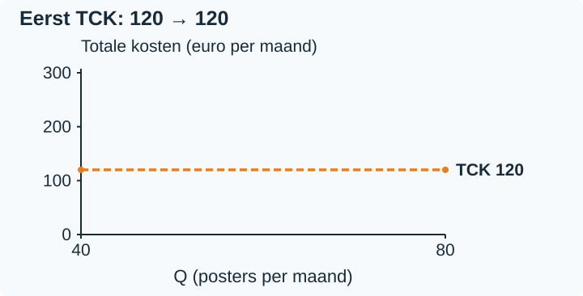
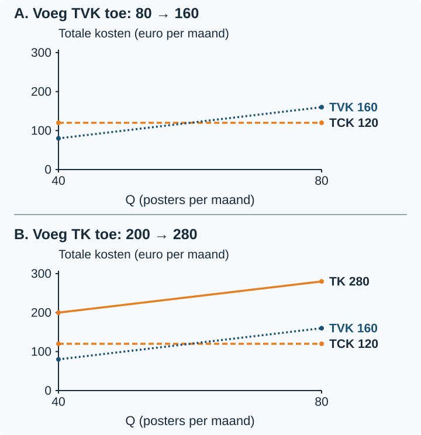
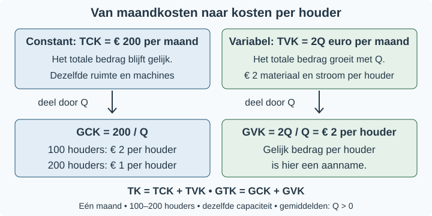
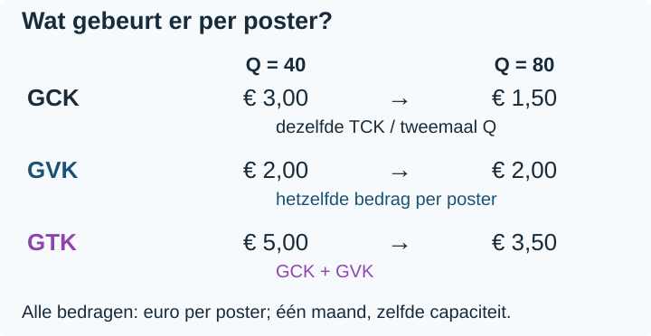
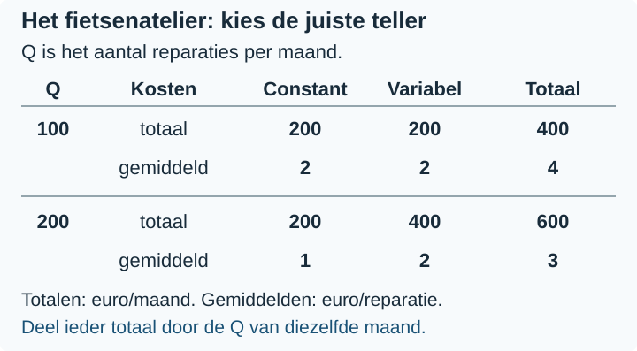
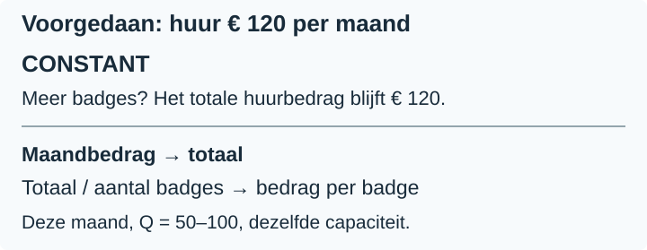

# 2.1.1 Kostenstructuren

## Wat leer je?

1. Je kunt kostencomponenten als constant of variabel classificeren op basis van hun gedrag binnen een genoemde periode en bij gelijkblijvende productiecapaciteit.
2. Je kunt uit een context de functies voor TCK, TVK en TK opstellen.
3. Je kunt gemiddelde kosten berekenen en met de juiste eenheid interpreteren.
4. Je kunt verklaren hoe totale en gemiddelde kosten veranderen als Q verandert, binnen de aannames van het model.

Je hebt al geoefend met invullen in een gegeven formule en met een totaal
delen door het bijbehorende aantal. Die rekenstappen gebruik je hier opnieuw.
Je leert nu welke productiekosten je moet kiezen en waarom.

## Twee keer zoveel posters: wat gebeurt er met de kosten?

Een posteratelier wil deze maand 80 posters maken in plaats van 40. Dezelfde
ruimte en machines blijven beschikbaar. Wordt de totale rekening dan twee keer
zo hoog? En kost iedere poster daarna nog maar de helft?

Dat hangt af van het soort kosten. Het atelier betaalt € 120 per maand voor
de ruimte. Papier en inkt kosten samen € 2 per poster. In deze paragraaf
vergelijk je productieaantallen binnen één maand, bij dezelfde productiecapaciteit.

### Kijk naar het gedrag van het totale bedrag

> **Definitie: constante kosten**
>
> Kosten waarvan het totale bedrag niet verandert als de productie verandert
> binnen de genoemde periode en bij gelijkblijvende productiecapaciteit.

De huur van het atelier blijft deze maand € 120, of het nu 40 of 80 posters
maakt. Er komt geen extra ruimte bij. Je noemt dit bedrag de **totale constante
kosten (TCK)**.

> **Definitie: variabele kosten**
>
> Kosten waarvan het totale bedrag verandert als de productie verandert.
> Je beoordeelt dit binnen de genoemde periode en productiegrenzen.

Voor iedere extra poster koopt het atelier papier en inkt. Bij 40 posters
kost dat € 80; bij 80 posters € 160. Dit zijn de **totale variabele kosten
(TVK)**.

> **Let op: het soort rekening beslist niet**
>
> Een vast energieabonnement kan constant zijn, terwijl het verbruik variabel
> is. Vraag steeds: hoe reageert het **totale bedrag** op meer productie?

### Van de context naar drie kostenfuncties

Een kostenfunctie koppelt een productieaantal aan een bedrag. Hier is Q het
aantal posters per maand. Het model geldt voor Q = 40–80, bij dezelfde capaciteit.

De huur hangt binnen die grenzen niet af van Q: TCK = 120. De materialen kosten
€ 2 per poster. Daarom vermenigvuldig je 2 met het aantal posters: TVK = 2Q.
Tel beide bedragen op voor de **totale kosten (TK)**.

> **Formules voor het posteratelier**
>
> `TCK = 120`
>
> `TVK = 2Q`
>
> `TK = TCK + TVK = 120 + 2Q`
>
> De uitkomsten zijn bedragen in **euro per maand**. Q is posters per maand,
> met 40 ≤ Q ≤ 80 en gelijkblijvende capaciteit.

Een context kan meerdere constante en meerdere variabele onderdelen bevatten.
Tel eerst de constante maandbedragen op. Tel daarna de variabele bedragen
**per product** op. Alleen dat tweede totaal vermenigvuldig je met Q.

<table style="break-inside:avoid">
<colgroup>
<col style="width:25%">
<col style="width:25%">
<col style="width:25%">
<col style="width:25%">
</colgroup>
<thead><tr><th>Q (posters per maand)</th><th>TCK (€/maand)</th><th>TVK (€/maand)</th><th>TK (€/maand)</th></tr></thead>
<tbody>
<tr><td>40</td><td>120</td><td>2 × 40 = 80</td><td>120 + 80 = 200</td></tr>
<tr><td>80</td><td>120</td><td>2 × 80 = 160</td><td>120 + 160 = 280</td></tr>
</tbody>
</table>

De tabel wordt zichtbaar in een grafiek. Horizontaal staat Q in posters per
maand; verticaal staan totale kosten in euro per maand. We tekenen alleen het
bereik 40–80. Eerst zie je TCK: op iedere plek blijft het bedrag € 120.

Lees nu eerst paneel A. We voegen alleen TVK toe: van € 80 bij Q = 40 naar
€ 160 bij Q = 80. Meer posters vragen hier meer materialen.

Lees daarna paneel B. Daar komt TK bij. Op iedere plek tel je TCK en TVK op.
Bij Q = 80 is dat 120 + 160 = € 280 per maand. De verticale afstand van TVK
naar TK is steeds de constante € 120.

### Totale kosten en kosten per poster

Een maandbedrag vertelt nog niet wat één poster gemiddeld kost. Daarvoor deel
je de relevante totale kosten door het aantal posters in diezelfde maand.

> **Definitie: gemiddelde constante kosten (GCK)**
>
> De totale constante kosten gedeeld door de productie: het constante
> kostendeel dat gemiddeld aan één product wordt toegerekend.

> **Definitie: gemiddelde variabele kosten (GVK)**
>
> De totale variabele kosten gedeeld door de productie.

> **Definitie: gemiddelde totale kosten (GTK)**
>
> De totale kosten gedeeld door de productie. GTK bestaat uit GCK en GVK samen.

> **Formules voor gemiddelde kosten**
>
> `GCK = TCK / Q`
>
> `GVK = TVK / Q`
>
> `GTK = TK / Q = GCK + GVK`
>
> Q moet positief zijn. Gebruik hetzelfde productieaantal en dezelfde periode
> voor de teller en de noemer.

De eenheid verandert mee: (euro per maand) / (posters per maand) wordt
**euro per poster**. GCK = € 3 per poster betekent dat iedere poster gemiddeld
€ 3 van de constante maandkosten draagt. Het is geen nieuwe rekening.

<table style="break-inside:avoid">
<colgroup>
<col style="width:25%">
<col style="width:25%">
<col style="width:25%">
<col style="width:25%">
</colgroup>
<thead><tr><th>Q (posters per maand)</th><th>GCK (€/poster)</th><th>GVK (€/poster)</th><th>GTK (€/poster)</th></tr></thead>
<tbody>
<tr><td>40</td><td>120 / 40 = 3,00</td><td>80 / 40 = 2,00</td><td>200 / 40 = 5,00</td></tr>
<tr><td>80</td><td>120 / 80 = 1,50</td><td>160 / 80 = 2,00</td><td>280 / 80 = 3,50</td></tr>
</tbody>
</table>

### Verklaar de verandering, niet alleen de uitkomst

Als Q verdubbelt van 40 naar 80, blijft TCK € 120 per maand. TVK verdubbelt
van € 80 naar € 160. TK stijgt van € 200 naar € 280, maar verdubbelt niet.
Dat komt doordat alleen het variabele deel verdubbelt.

De gemiddelde kosten reageren anders:

- **GCK halveert:** dezelfde € 120 wordt over twee keer zoveel posters verdeeld.
  GCK daalt van € 3 naar € 1,50 per poster.
- **GVK blijft gelijk:** papier en inkt kosten in dit model steeds € 2 per
  poster. Zowel TVK als Q verdubbelt, dus hun verhouding blijft hetzelfde.
- **GTK daalt, maar halveert niet:** alleen GCK halveert; GVK blijft € 2.
  GTK wordt € 1,50 + € 2 = € 3,50 per poster, niet € 2,50.

> **Let op: geen algemene wet voor alle bedrijven**
>
> GVK blijft hier gelijk door het vaste bedrag aan variabele kosten per poster.
> Dat bedrag hoeft in een ander model niet gelijk te blijven.

Ook TCK is niet voor altijd onveranderlijk. Met extra machines of een grotere
ruimte kunnen de constante kosten anders zijn. Onze conclusie geldt alleen
voor deze maand, Q = 40–80 en dezelfde productiecapaciteit.

## Uitgewerkt voorbeeld

Een fietsenatelier voert deze maand 100–200 reparaties uit met dezelfde ruimte
en uitrusting. De huur is € 180 per maand en de verzekering € 20 per maand.
Reinigingsmateriaal kost € 1 per reparatie; kleine onderdelen kosten ook
€ 1 per reparatie. Q is het aantal reparaties per maand.

**Stap 1: classificeer en geef een reden.**

<table style="break-inside:avoid">
<colgroup>
<col style="width:34%">
<col style="width:23%">
<col style="width:43%">
</colgroup>
<thead><tr><th>Kostencomponent</th><th>Soort kosten</th><th>Reden binnen deze maand en capaciteit</th></tr></thead>
<tbody>
<tr><td>Huur</td><td>Constant</td><td>Het totale maandbedrag verandert niet met Q.</td></tr>
<tr><td>Verzekering</td><td>Constant</td><td>Het totale maandbedrag verandert niet met Q.</td></tr>
<tr><td>Reinigingsmateriaal</td><td>Variabel</td><td>Het totale bedrag stijgt met € 1 per extra reparatie.</td></tr>
<tr><td>Kleine onderdelen</td><td>Variabel</td><td>Het totale bedrag stijgt met € 1 per extra reparatie.</td></tr>
</tbody>
</table>

**Stap 2: bouw de functies.**

Eerst tel ik de constante bedragen op: TCK = 180 + 20 = 200.
Daarna tel ik de bedragen per reparatie op: TVK = (1 + 1)Q = 2Q.
Samen geeft dat TK = 200 + 2Q. Alle drie de uitkomsten zijn euro per maand.

**Stap 3: bereken totalen en gemiddelden bij Q = 100.**

TCK = 200; TVK = 2 × 100 = 200; TK = 200 + 200 = 400 euro per maand.
Voor GCK kies ik TCK als teller, niet TK. Ik deel door dezelfde Q:

::: {style="break-inside: avoid"}

- GCK = 200 / 100 = **€ 2 per reparatie**.
- GVK = 200 / 100 = **€ 2 per reparatie**.
- GTK = 400 / 100 = **€ 4 per reparatie**.

:::

De uitkomsten zijn bedragen per reparatie. Ik controleer:
GCK + GVK = 2 + 2 = 4, dus dit sluit aan op GTK.

::: {style="break-inside: avoid"}

**Stap 4: herhaal bij Q = 200.**

TCK = 200; TVK = 2 × 200 = 400; TK = 200 + 400 = 600 euro per maand.

::: {style="break-inside: avoid"}

- GCK = 200 / 200 = **€ 1 per reparatie**.
- GVK = 400 / 200 = **€ 2 per reparatie**.
- GTK = 600 / 200 = **€ 3 per reparatie**.

:::

:::

{alt="Totalen en gemiddelden bij 100 en 200 reparaties met dezelfde constante maandkosten"}

**Stap 5: vergelijk en verklaar binnen de voorwaarden.**

TCK blijft € 200 per maand. TVK verdubbelt van € 200 naar € 400.
TK stijgt van € 400 naar € 600, maar verdubbelt niet.

GCK halveert van € 2 naar € 1 per reparatie: dezelfde constante kosten worden
over twee keer zoveel reparaties verdeeld. GVK blijft € 2 per reparatie,
doordat de variabele kosten per reparatie gelijk blijven. GTK daalt van € 4
naar € 3 per reparatie en halveert niet: alleen GCK halveert.
Dit geldt voor deze maand, Q = 100–200 en dezelfde productiecapaciteit.

> **Samenvatting §2.1.1**
>
> - Classificeer naar het gedrag van het totale bedrag bij verandering van Q,
>   binnen de genoemde periode en capaciteit.
> - Tel de constante bedragen op voor TCK; vermenigvuldig de variabele kosten
>   per product met Q voor TVK. TK = TCK + TVK.
> - GCK = TCK/Q, GVK = TVK/Q en GTK = TK/Q. Q is positief; de eenheid is
>   euro per product.
> - Bij verdubbeling van Q halveert GCK als TCK gelijk blijft. GVK blijft
>   alleen gelijk bij gelijke variabele kosten per product; GTK halveert dan niet.
> - In §2.1.2 gebruik je deze kosten bij het vergelijken van kosten en opbrengsten.

## Startopgaven

Korte route: Startopgaven → Zelfstandige oefening → Doeloefening.
Extra hulp nodig? Maak eerst Begeleide inoefening.

**Opgave 1**

Een vereniging gebruikt B = 30 + 2n om een materiaalbudget te berekenen.
B is het budget in euro; n is het aantal deelnemers.

a\) Bereken B bij n = 10.

b\) Bereken B bij n = 20.

c\) Deel het budget bij n = 10 door 10. Wat is de uitkomst en wat betekent de eenheid?

**Opgave 2**

Een drukker betaalt een machinebedrag van € 40 per maand. Papier kost € 0,50
per kaart. Deze maand maakt de drukker Q = 100–200 kaarten met dezelfde
machinecapaciteit.

a\) Classificeer beide onderdelen als constant of variabel. Leg bij ieder
onderdeel uit hoe het totale bedrag reageert op een verandering van Q.

b\) Kies voor TCK en GCK de juiste eenheid: euro per maand of euro per kaart.
Leg het verschil tussen deze twee bedragen uit.

## Begeleide inoefening

Heb je deze hulp niet nodig? Ga dan verder met Zelfstandige oefening.

**Opgave 3**

Een atelier maakt deze maand Q = 50–100 badges met dezelfde capaciteit.
Huur kost € 120 per maand; verzekering € 30 per maand. Metaal kost
€ 0,50 per badge en een speld € 0,50 per badge.

Bekijk eerst de ingevulde huurregel en de rekenroute in de figuur.

a\) Vul de overige regels in.

<table style="break-inside:avoid">
<colgroup>
<col style="width:34%">
<col style="width:23%">
<col style="width:43%">
</colgroup>
<thead><tr><th>Kostencomponent</th><th>Soort kosten</th><th>Reden</th></tr></thead>
<tbody>
<tr><td>Huur</td><td>Constant</td><td>Het totale maandbedrag verandert niet met Q.</td></tr>
<tr style="height:18mm"><td>Verzekering</td><td></td><td></td></tr>
<tr style="height:18mm"><td>Metaal</td><td></td><td></td></tr>
<tr style="height:18mm"><td>Speld</td><td></td><td></td></tr>
</tbody>
</table>

b\) Maak de drie functies af: TCK = 120 + …; TVK = (… + …)Q; TK = … + ….
Noteer de eenheid van de uitkomsten.

c\) De rij voor Q = 50 is voorgedaan. Vul de rij voor Q = 100 in beide
tabellen in. Maak daarna af: “GCK halveert, omdat …”.

<table style="break-inside:avoid">
<colgroup>
<col style="width:25%">
<col style="width:25%">
<col style="width:25%">
<col style="width:25%">
</colgroup>
<thead><tr><th>Q (badges per maand)</th><th>TCK (€/maand)</th><th>TVK (€/maand)</th><th>TK (€/maand)</th></tr></thead>
<tbody>
<tr><td>50</td><td>150</td><td>50</td><td>200</td></tr>
<tr style="height:12mm"><td>100</td><td></td><td></td><td></td></tr>
</tbody>
</table>

<table style="break-inside:avoid">
<colgroup>
<col style="width:25%">
<col style="width:25%">
<col style="width:25%">
<col style="width:25%">
</colgroup>
<thead><tr><th>Q (badges per maand)</th><th>GCK (€/badge)</th><th>GVK (€/badge)</th><th>GTK (€/badge)</th></tr></thead>
<tbody>
<tr><td>50</td><td>3,00</td><td>1,00</td><td>4,00</td></tr>
<tr style="height:12mm"><td>100</td><td></td><td></td><td></td></tr>
</tbody>
</table>

**Opgave 4**

Een atelier maakt deze maand Q = 40–80 boekenleggers met dezelfde capaciteit.
Een vast machinebedrag kost € 80 per maand. Papier kost € 2 per boekenlegger.

a\) Stel de functies voor TCK, TVK en TK op.

b\) Bereken de gemiddelde kosten en vul de tabel in.

<table style="break-inside:avoid">
<colgroup>
<col style="width:25%">
<col style="width:25%">
<col style="width:25%">
<col style="width:25%">
</colgroup>
<thead><tr><th>Q (boekenleggers per maand)</th><th>GCK (€/boekenlegger)</th><th>GVK (€/boekenlegger)</th><th>GTK (€/boekenlegger)</th></tr></thead>
<tbody>
<tr style="height:12mm"><td>40</td><td></td><td></td><td></td></tr>
<tr style="height:12mm"><td>80</td><td></td><td></td><td></td></tr>
</tbody>
</table>

c\) Vergelijk eerst TCK, TVK en TK bij beide productieaantallen. Leg daarna
uit waarom GTK daalt van € 4 naar € 3 per boekenlegger, niet naar € 2.
Gebruik de maand, het productiebereik en de capaciteit in je conclusie.

::: {style="break-inside: avoid"}

**Opgave 5**

Een reparatiebedrijf vergelijkt contracten voor één komende maand. Het kan
met dezelfde capaciteit Q = 100–200 reparaties uitvoeren. Het basiscontract
rekent € 200 huur per maand en € 2 materiaal per reparatie.
Binnen ieder gekozen contract gelden die tarieven voor de hele maand en het
genoemde productiebereik.

Er zijn twee mogelijke wijzigingen:

- A: alleen de huur wordt € 220 per maand.
- B: alleen het materiaal wordt € 2,20 per reparatie.

Reken in a–c met Q = 100.

a\) Pas alleen A toe. Welke kostencategorie verandert? Bereken de verandering
en de nieuwe TK.

b\) Pas alleen B toe. Welke kostencategorie verandert? Bereken de verandering
en de nieuwe TK.

c\) Beide wijzigingen gelden tegelijk. Bereken TK en GTK. Versterken de twee
effecten elkaar of werken ze tegen elkaar in?

d\) Een leerling zegt: “De huur is variabel geworden, want het bedrag is
veranderd tussen de contracten.” Leg uit waarom dit niet klopt. Gebruik
het verschil tussen een ander contract en een verandering van Q.

:::

## Zelfstandige oefening

**Opgave 6**

Een stickeratelier maakt in één maand tussen 400 en 800 stickers met dezelfde
productiecapaciteit. De huur is € 180 per maand; de verzekering kost € 60 per
maand. Folie kost € 0,40 per sticker en inkt € 0,20 per sticker.
Q is het aantal stickers per maand.

<table style="break-inside:avoid">
<colgroup>
<col style="width:34%">
<col style="width:23%">
<col style="width:43%">
</colgroup>
<thead><tr><th>Kostencomponent</th><th>Soort kosten</th><th>Reden</th></tr></thead>
<tbody>
<tr style="height:18mm"><td>Huur</td><td></td><td></td></tr>
<tr style="height:18mm"><td>Verzekering</td><td></td><td></td></tr>
<tr style="height:18mm"><td>Folie</td><td></td><td></td></tr>
<tr style="height:18mm"><td>Inkt</td><td></td><td></td></tr>
</tbody>
</table>

a\) Vul de tabel in: classificeer ieder onderdeel en leg kort uit hoe het
totale bedrag reageert op een verandering van Q.

b\) Stel de functies voor TCK, TVK en TK op.

c\) Bereken bij Q = 400 de GCK, GVK en GTK. Noteer de volledige eenheden.

d\) Bereken bij Q = 800 de GCK, GVK en GTK. Noteer de volledige eenheden.

e\) Vergelijk eerst TCK, TVK en TK bij Q = 400 en Q = 800. Verklaar daarna
waarom GCK halveert, GVK gelijk blijft en GTK niet halveert als Q verdubbelt.
Begrens je conclusie tot de genoemde maand, Q = 400–800 en gelijkblijvende
productiecapaciteit.

## Doeloefening

**Opgave 7**

Bakkerij De Korenaar produceert in één maand tussen 500 en 1.000 broden. Zolang de productiecapaciteit gelijk blijft, gebruikt de bakkerij dezelfde ruimte en ovens. Huur en verzekering kosten samen € 440 per maand. De netaansluiting en het energieabonnement kosten € 60 per maand. Meel en verpakking kosten samen € 0,70 per brood. Het elektriciteitsverbruik van de ovens kost binnen deze grenzen € 0,10 per brood. Q is het aantal broden per maand.

<table style="break-inside:avoid">
<colgroup>
<col style="width:34%">
<col style="width:23%">
<col style="width:43%">
</colgroup>
<thead><tr><th>kostencomponent</th><th>soort kosten</th><th>reden</th></tr></thead>
<tbody>
<tr style="height:18mm"><td>huur en verzekering</td><td></td><td></td></tr>
<tr style="height:18mm"><td>netaansluiting en energieabonnement</td><td></td><td></td></tr>
<tr style="height:18mm"><td>meel en verpakking</td><td></td><td></td></tr>
<tr style="height:18mm"><td>elektriciteitsverbruik ovens</td><td></td><td></td></tr>
</tbody>
</table>

Vul de lege cellen in.

a\) **(4 punten)** Vul de classificatietabel in: classificeer elk onderdeel als constante of variabele kosten en noteer per onderdeel kort hoe het totale bedrag reageert op een verandering van Q.

b\) **(3 punten)** Stel de functies voor TCK, TVK en TK op.

c\) **(3 punten)** Bereken bij Q = 500 de GCK, GVK en GTK. Noteer de volledige eenheden.

d\) **(3 punten)** Bereken bij Q = 1.000 de GCK, GVK en GTK. Noteer de volledige eenheden.

e\) **(4 punten)** Vergelijk eerst TCK, TVK en TK bij Q = 500 en Q = 1.000. Leg daarna met de uitkomsten uit waarom GCK halveert, GVK gelijk blijft en GTK niet halveert als Q verdubbelt. Begrens je uitleg tot één maand, Q = 500–1.000 en gelijkblijvende productiecapaciteit.

## Denkertje / Bonusopgave

**Opgave 8**

Twee werkplaatsen maken deze maand ieder Q = 100–200 producten met dezelfde
capaciteit. Werkplaats A betaalt € 100 constante kosten per maand en steeds
€ 1 variabele kosten per product.

Werkplaats B betaalt geen constante kosten. De totale variabele rekening is
€ 200 bij Q = 100 en € 500 bij Q = 200. Voor andere productieaantallen is
geen rekenregel gegeven.

a\) Bereken voor beide werkplaatsen GVK bij Q = 100 en bij Q = 200.

b\) Beoordeel de uitspraak: “GVK is altijd constant.” Gebruik beide werkplaatsen
en leg uit welke aanname bij A de uitkomst verklaart.

c\) Geef een mogelijke verklaring in woorden voor het patroon bij B.
Wat kun je met deze twee waarnemingen niet bepalen over de kosten bij
tussenliggende productieaantallen?

## Herhaling / Herhaling en interleaving

**Opgave 9**

Een vereniging plant één uitstapje voor n = 15–30 deelnemers.
Dezelfde locatie en afspraken blijven gelden binnen dit bereik.
Het budget volgt de gegeven regel B = 45 + 3n, met B in euro.

a\) Bereken B bij n = 15 en bij n = 30. Laat de tussenstappen zien
en noteer de eenheden.

b\) Bereken B/n bij beide aantallen. Leg uit wat het totale budget en het
budget per deelnemer betekenen.
