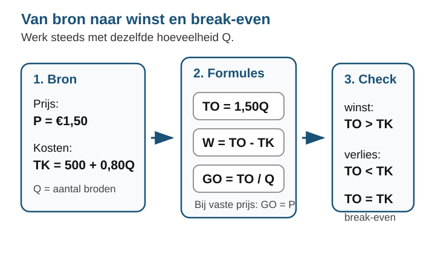
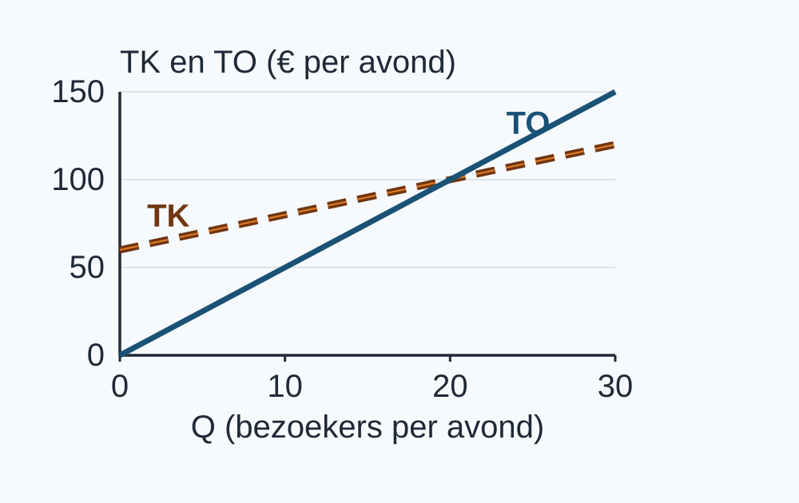
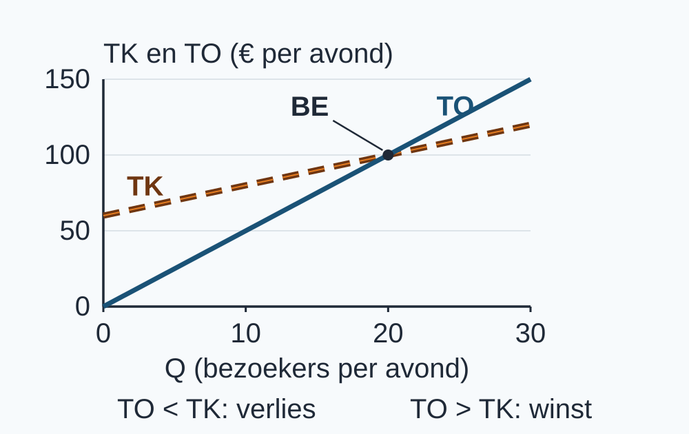
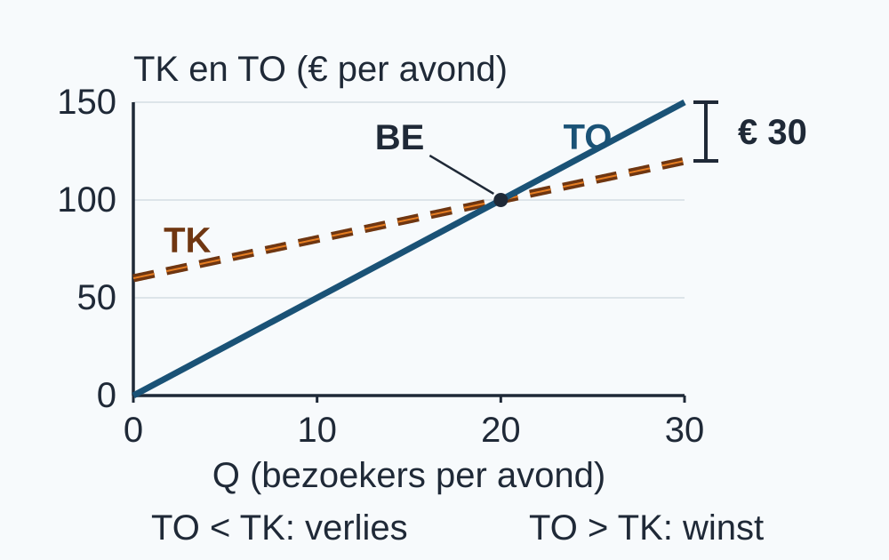
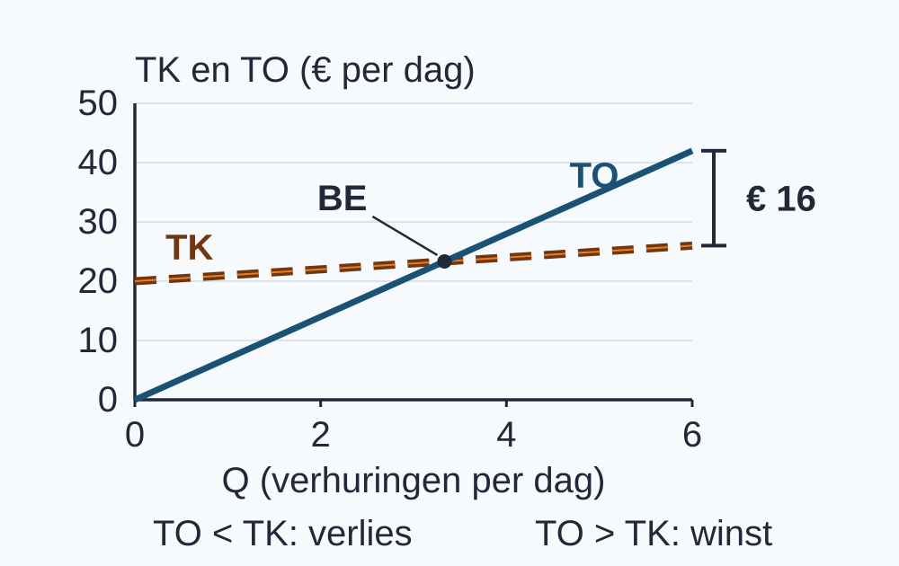
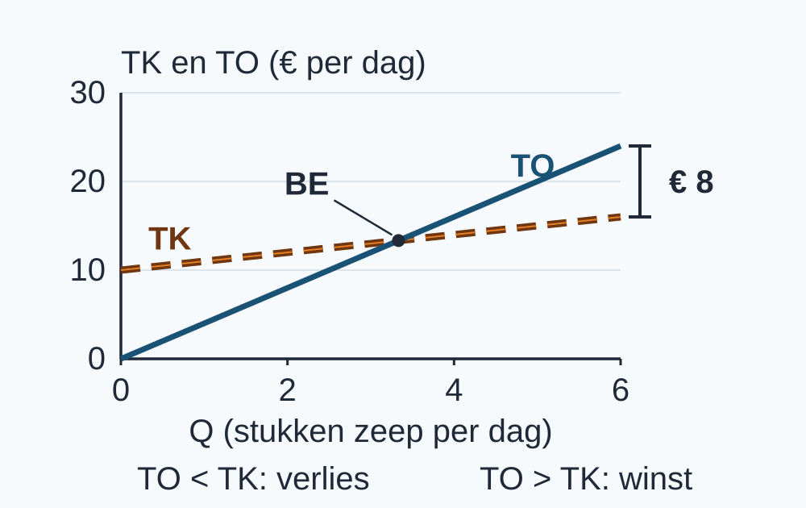
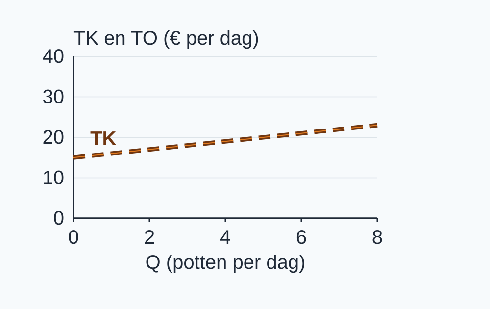
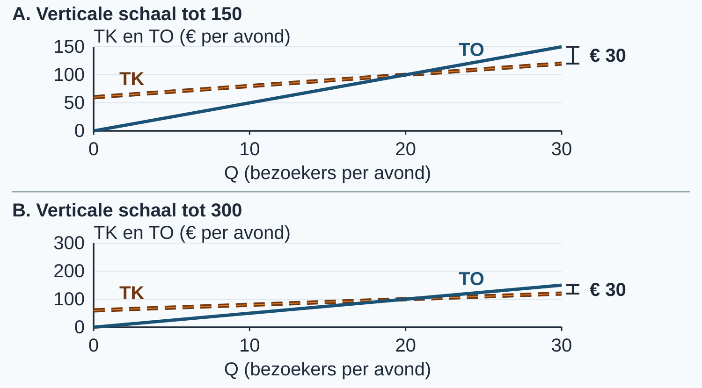

# 2.1.2 Opbrengsten, winst en break-even

## Een volle kas: is dat ook winst?

Voor een kleine theatervoorstelling betaal je € 5 per bezoeker. Bij 30 bezoekers
komt er € 150 binnen. Toch houdt de organisator niet al dat geld over: de zaal
en de voorstelling kosten ook geld. **Hoeveel bezoekers zijn nodig om geen
verlies te maken?** En hoe zie je dat in een grafiek?

In §2.1.1 leerde je totale en gemiddelde kosten berekenen. Nu vergelijk je de
kosten met wat een bedrijf ontvangt. Je leert:

1. Je kunt TO, GO en winst berekenen en GO bij een vaste prijs verklaren.
2. Je kunt de break-even-afzet algebraïsch bepalen en een continue uitkomst onderscheiden van een geheel productaantal.
3. Je kunt TK en TO in één grafiek weergeven en winst- en verlieszones herkennen.
4. Je kunt winst bij een gegeven Q als verticale afstand tussen TO en TK weergeven.

> **Haal de benodigde bewerkingen terug.**
>
> Vul dezelfde Q in de kostenfunctie in. Bijvoorbeeld: bij TK = 12 + 3Q en
> Q = 2 is TK = 18. Het totaal is € 18 per middag; 18 / 2 = € 9 per product.
> Deel alleen door een positieve Q.
>
> In §1.3.2 loste je een lineaire vergelijking op door aan beide kanten
> dezelfde bewerking te doen: 3Q = 12 + Q geeft 2Q = 12, dus Q = 6.
> Controle: links 18, rechts 12 + 6 = 18.
>
> In §1.1.3 zette je tabelwaarden om in punten. Kies per as een vaste
> stapgrootte. Bij TK = 12 + 3Q horen (0; 12) en (2; 18). Zet eerst Q
> horizontaal en lees daarna de hoogte af. Twee punten bepalen een rechte lijn.

## Van prijs naar totale opbrengst

Voor de voorstelling geldt **één avond**, 0 tot en met 30 betalende bezoekers.
Q is het aantal bezoekers per avond. Iedereen betaalt dezelfde prijs P = € 5
per bezoeker; elke toegelaten bezoeker betaalt. Binnen dit model blijven de
zaal, de prijs en de kosten per bezoeker gelijk. De kosten zijn TK = 60 + 2Q
in euro per avond. De formules tekenen we als continue lijnen; werkelijk komen
er alleen gehele aantallen bezoekers.

> **Definitie: totale opbrengst (TO).**
> De totale opbrengst, of omzet, is het totale bedrag dat een bedrijf met zijn
> verkopen ontvangt in de gekozen periode. Bij een vaste prijs per verkochte
> eenheid geldt TO = P × Q.

Bij 10 bezoekers is TO = 5 × 10 = € 50 per avond. Voor iedere Q in het model
geldt dus **TO = 5Q**. Bij nul bezoekers is TO nul. Dat is nog geen uitspraak
over de kosten of de winst.

<table style="break-inside:avoid">
<colgroup>
<col style="width:50%">
<col style="width:50%">
</colgroup>
<thead><tr><th>Q (bezoekers per avond)</th><th>TO (€ per avond)</th></tr></thead>
<tbody>
<tr><td>0</td><td>0</td></tr>
<tr><td>10</td><td>50</td></tr>
<tr><td>20</td><td>100</td></tr>
<tr><td>30</td><td>150</td></tr>
</tbody></table>

{alt="Theater: totale opbrengst per avond bij 0 tot 30 bezoekers."}

## Opbrengst per bezoeker

> **Definitie: gemiddelde opbrengst (GO).**
> De gemiddelde opbrengst is de totale opbrengst gedeeld door het aantal
> verkochte eenheden: GO = TO / Q, voor Q > 0. De eenheid is euro per product
> of dienst, hier euro per bezoeker.

<table style="break-inside:avoid">
<colgroup>
<col style="width:33.3333%">
<col style="width:33.3333%">
<col style="width:33.3333%">
</colgroup>
<thead><tr><th>Positieve Q</th><th>Berekening GO</th><th>Opbrengst per bezoeker</th></tr></thead>
<tbody>
<tr><td>10 bezoekers</td><td>50 / 10</td><td>€ 5</td></tr>
<tr><td>20 bezoekers</td><td>100 / 20</td><td>€ 5</td></tr>
</tbody></table>

De twee uitkomsten zijn gelijk omdat **iedere bezoeker dezelfde prijs betaalt**.
Algebraïsch: GO = (P × Q) / Q = P, zolang Q > 0. Hier is GO dus steeds
€ 5 per bezoeker. Bij Q = 0 kun je TO / Q niet uitrekenen: delen door nul
kan niet. Teken GO niet op de TO-as: euro per bezoeker en euro per avond zijn
verschillende grootheden.

## Wat blijft er over?

> **Definitie: winst.**
> De winst is het verschil tussen totale opbrengst en totale kosten in
> dezelfde periode: winst = TO − TK. Een negatieve winst betekent verlies.

Bij 10 bezoekers ontvang je € 50. De kosten zijn 60 + 2 × 10 = € 80.
De winst is 50 − 80 = −€ 30 per avond: een verlies van € 30.
Vergelijk steeds dezelfde Q en dezelfde periode.

<table style="break-inside:avoid">
<colgroup>
<col style="width:25%">
<col style="width:25%">
<col style="width:25%">
<col style="width:25%">
</colgroup>
<thead><tr><th>Q</th><th>TO (€ per avond)</th><th>TK (€ per avond)</th><th>Winst (€ per avond)</th></tr></thead>
<tbody>
<tr><td>0</td><td>0</td><td>60</td><td>−60</td></tr>
<tr><td>10</td><td>50</td><td>80</td><td>−30</td></tr>
<tr><td>20</td><td>100</td><td>100</td><td>0</td></tr>
<tr><td>30</td><td>150</td><td>120</td><td>30</td></tr>
</tbody></table>

{alt="Theater: TO en TK op dezelfde assen; bij 10 bezoekers is de opbrengst lager dan de kosten."}

> **Let op: ontvangen is niet overhouden.**
> “Er komt € 150 binnen, dus de winst is € 150” klinkt logisch als je alleen
> naar de kassa kijkt. Maar € 150 is TO. Bij 30 bezoekers zijn de kosten
> € 120, dus de winst is € 30. GO is evenmin winst: GO vertelt wat je gemiddeld
> ontvangt, voordat je kosten aftrekt.

## Break-even: opbrengst en kosten gelijk

> **Definitie: break-even-afzet.**
> De break-even-afzet is de hoeveelheid waarbij TO = TK. De winst is dan
> precies nul: er is geen winst en geen verlies.

Bereken eerst de hoeveelheid met de formules:

::: {style="break-inside: avoid"}

TO = TK

5Q = 60 + 2Q

Trek aan beide kanten 2Q af: 3Q = 60.

Deel beide kanten door 3: **Q = 20 bezoekers**.

Controle: TO = 5 × 20 = 100 en TK = 60 + 2 × 20 = 100 euro per avond.

:::

In de grafiek is dezelfde gelijkheid het snijpunt: bij Q = 20 hebben beide
lijnen hoogte 100. Links van dat punt ligt TO onder TK; rechts erboven.
Die uitspraken gelden binnen dit model, met de genoemde vaste prijs en kosten.

{alt="Theater: break-even bij 20 bezoekers; links verlies en rechts winst binnen het model."}

De algebra geeft het precieze punt; de grafiek maakt de drie situaties
zichtbaar. Het zijn twee manieren om **dezelfde vergelijking** te lezen.

## Winst als verticale afstand

Kies één Q, bijvoorbeeld 30. Lees op diezelfde verticale lijn TO = 150 en
TK = 120 af. Het hoogteverschil is 150 − 120 = **€ 30 per avond**.
Het haakje in de figuur verbindt de twee hoogten bij dezelfde Q.

{alt="Theater: verticale winstafstand van 30 euro per avond bij 30 bezoekers, geen oppervlakte."}

> **Let op: afstand, geen oppervlakte.**
> Een ruimte tussen twee lijnen valt op, maar de verticale as geeft al euro
> per avond aan. Voor winst bij één Q trek je twee hoogten af. Een vlak met
> een breedte langs de Q-as is een ander soort maat; kleur dat hier niet als winst.

Bij een andere Q kan de verticale afstand anders zijn. “Verder naar rechts
betekent altijd meer winst” is geen algemene wet: we gebruiken hier uitsluitend
de gegeven rechte kosten- en opbrengstlijnen met een vaste prijs.

## Een deel van een product verkopen?

Het continue model kan een breuk als break-even-afzet opleveren. Bij gehele
producten zoek je daarna het **eerste gehele aantal waarbij geen verlies**
ontstaat. In de modellen van deze paragraaf stijgt de winst met Q en ligt het
snijpunt binnen het gegeven bereik. Kies dan het kleinste gehele aantal op of
rechts van het continue snijpunt en controleer door invullen.

<table style="break-inside:avoid">
<colgroup>
<col style="width:50%">
<col style="width:50%">
</colgroup>
<thead><tr><th>Continue uitkomst</th><th>Eerste gehele aantal zonder verlies</th></tr></thead>
<tbody>
<tr><td>Q = 20 precies</td><td>20: nul winst telt ook als geen verlies</td></tr>
<tr><td>Q = 3⅓</td><td>4, mits invullen bevestigt dat 3 nog verlies geeft</td></tr>
</tbody></table>

> **Let op: niet gewoon afronden naar het dichtstbijzijnde getal.**
> Je bent gewend 3⅓ af te ronden naar 3. Maar de vraag is nu wanneer het
> verlies ophoudt. Het uitgewerkte voorbeeld laat zien waarom 3 niet voldoet
> en 4 wel. Is de continue uitkomst al geheel, dan tel je er niet alsnog 1 bij op.

## Uitgewerkt voorbeeld

Een kleine kajakverhuur werkt één dag met maximaal 6 verhuringen. Q is het
aantal verhuringen per dag, van 0 tot en met 6. Elke verhuring wordt betaald en
kost de klant € 7. De kosten zijn TK = 20 + Q euro per dag. De vaste kosten,
prijs en kosten per verhuring blijven in dit bereik gelijk.

**Stap 1: stel TO op en controleer een waarde.**

TO = P × Q = 7Q. Bij Q = 2 is TO = 7 × 2 = € 14 per dag.
Dat klopt: twee klanten betalen ieder € 7.

**Stap 2: verklaar GO.**

Voor Q > 0 is GO = TO / Q = 7Q / Q = **€ 7 per verhuring**.
Iedere klant betaalt dezelfde prijs. Bij Q = 0 bestaat deze gemiddelde
berekening niet, hoewel TO = 0 dan wel geldt.

**Stap 3: bereken winst bij twee hoeveelheden.**

<table style="break-inside:avoid">
<colgroup>
<col style="width:25%">
<col style="width:25%">
<col style="width:25%">
<col style="width:25%">
</colgroup>
<thead><tr><th>Q (verhuringen per dag)</th><th>TO (€ per dag)</th><th>TK (€ per dag)</th><th>Winst (€ per dag)</th></tr></thead>
<tbody>
<tr><td>2</td><td>7 × 2 = 14</td><td>20 + 2 = 22</td><td>14 − 22 = −8</td></tr>
<tr><td>6</td><td>7 × 6 = 42</td><td>20 + 6 = 26</td><td>42 − 26 = 16</td></tr>
</tbody></table>

Bij twee verhuringen is er € 8 verlies per dag; bij zes € 16 winst.

::: {style="break-inside: avoid"}

**Stap 4: los TO = TK op en beslis over gehele aantallen.**

7Q = 20 + Q → 6Q = 20 → Q = 20 / 6 = **3⅓ verhuringen**.

In het continue model zijn TO en TK dan beide 23⅓ euro per dag.
Bij Q = 3: winst = 21 − 23 = −€ 2. Bij Q = 4: winst = 28 − 24 = € 4.
Het eerste gehele aantal zonder verlies is dus **4**, niet 3.

:::

**Stap 5: teken en verbind de grafiek met de algebra.**

Zet Q (verhuringen per dag) horizontaal en TK en TO (€ per dag) verticaal.
Kies stappen van 2 verhuringen en 10 euro. Voor TK plot ik (0; 20) en (6; 26).
Voor TO plot ik (0; 0) en (6; 42). Trek door elk paar een rechte lijn en
schrijf TK en TO erbij. De gestreepte lijn is TK; de doorgetrokken lijn is TO.

Markeer het berekende snijpunt (3⅓; 23⅓). Links ervan geldt TO < TK:
verlies. Rechts ervan geldt TO > TK: winst, binnen 0–6 verhuringen.

::: {style="break-inside: avoid"}

**Stap 6: geef winst bij één Q weer.**

Bij Q = 6 liggen de hoogten op 42 en 26. Teken het verticale haakje tussen
beide lijnen en schrijf erbij: 42 − 26 = **€ 16 per dag**. Kleur geen vlak.

:::

::: {style="break-inside: avoid"}

> **Samenvatting §2.1.2**
>
> - TO = P × Q; GO = TO / Q = P bij een vaste prijs en Q > 0. Let op de verschillende eenheden.
> - Winst = TO − TK voor dezelfde Q en periode; een negatief bedrag betekent verlies.
> - Los TO = TK op. Voor gehele producten controleer je het eerste gehele aantal zonder verlies; nul winst telt mee.
> - Het snijpunt van de TK- en TO-lijn is break-even. Vergelijk hun hoogten voor winst- en verlieszones.
> - Bij één Q is winst de verticale afstand, geen oppervlakte. In §2.1.3 vergelijk je veranderingen in kosten en opbrengsten.
>
> Kun je de vier leerdoelen nu in eigen woorden uitleggen? Gebruik de oefeningen om te merken bij welke stap je nog steun wilt.

:::

## Startopgaven

Korte route: **Startopgaven → Zelfstandige oefening → Doeloefening**.
De startvragen zijn een korte oefencheck, geen toets.

**Opgave 1**

Een kaarsenatelier gebruikt TK = 12 + 3Q euro per middag. Q is het aantal
kaarsen dat die middag wordt gemaakt, van 0 tot en met 8.

a\) Bereken TK bij Q = 2. Geef de eenheid.

b\) Bereken GTK bij Q = 2. Leg het verschil tussen de eenheid van TK en GTK uit.

c\) Welke twee punten horen bij Q = 0 en Q = 2 op een TK-grafiek? Leg uit
wat een vaste stapgrootte op een as betekent.

d\) Los de vergelijking 3Q = 12 + Q op. Controleer je antwoord door aan beide
kanten dezelfde Q in te vullen.

**Opgave 2**

Hetzelfde atelier verkoopt die middag 2 kaarsen voor een vaste prijs van
€ 8 per kaars. Er worden evenveel kaarsen gemaakt als verkocht.

a\) Bereken TO, GO en winst. Zet bij ieder antwoord de juiste eenheid.

b\) Iemand zegt: “Er is € 16 ontvangen, dus er is € 16 winst en GO is ook 16.”
Verbeter beide beweringen met een korte uitleg.

## Begeleide inoefening

Deze oefeningen zijn **optioneel**. Wil je tussenstappen oefenen? Maak de
begeleide inoefening. Heb je die steun nu niet nodig, ga dan verder met de
zelfstandige oefening. Je oefent dezelfde leerdoelen en dezelfde soort eindvraag.

**Opgave 3**

Een zeepverkoper verkoopt per dag Q = 0–6 stukken zeep. Ieder stuk is die dag
gemaakt en wordt verkocht voor € 4. TK = 10 + Q euro per dag. Prijs en
kostenafspraken blijven binnen dat bereik gelijk.

Hier staan de tussenstappen al klaar:

- TO = 4Q. Voor Q > 0: GO = 4Q / Q = 4 euro per stuk.
- Winst = 4Q − (10 + Q). Bij Q = 2: TO = …, TK = …, winst = … .
- Break-even: 4Q = 10 + Q → 3Q = 10 → Q = … .

a\) Vul de ontbrekende bedragen bij Q = 2 in. Bereken daarna de winst bij Q = 6
met dezelfde stappen. Waarom is GO gelijk aan € 4 per stuk?

b\) Vul de continue break-even-afzet in. Controleer de winst bij Q = 3 en
Q = 4. Wat is het eerste gehele aantal zonder verlies?

{alt="Zeep: TK en TO, break-even bij 3⅓ stukken en 8 euro verticale winstafstand bij 6 stukken per dag."}

c\) Leg uit waarom het getekende verticale haakje bij Q = 6 winst voorstelt.
Waarom is een ingekleurde oppervlakte niet het gevraagde antwoord?

**Opgave 4**

Een kraam verkoopt per dag Q = 0–8 bloempotten. Iedere klaargemaakte pot wordt
die dag verkocht voor € 4. TK = 15 + Q euro per dag. De prijs en
kostenafspraken blijven binnen dit bereik gelijk.

a\) Stel TO op. Verklaar voor Q > 0 waarom GO gelijk is aan de prijs.

b\) Bereken de winst bij Q = 3 en Q = 8.

c\) Bepaal algebraïsch de continue break-even-afzet en het eerste gehele aantal
zonder verlies. Moet dat laatste aantal altijd groter zijn dan de continue uitkomst?

d\) Neem de onderstaande assen en TK-lijn over. Voeg zelf TO, het break-evenpunt,
de winst- en verlieszone en de verticale winstafstand bij Q = 8 toe.

{alt="Bloempotten: assen en TK-lijn als steun voor het toevoegen van TO, break-even en winstafstand."}

**Opgave 5**

Voor één dansles worden precies 10 kaarten verkocht en gebruikt. Eerst is de
prijs € 5 per kaart en zijn de kosten TK = 20 + Q euro per les. Vergelijk vier
kosten- en prijsafspraken bij **dezelfde Q = 10**. De prijs binnen elk geval
is vast; het aantal verkochte kaarten verandert niet.

<table style="break-inside:avoid">
<colgroup>
<col style="width:34%">
<col style="width:22%">
<col style="width:22%">
<col style="width:22%">
</colgroup>
<thead><tr><th>Geval</th><th>Prijs per kaart</th><th>Constante kosten per les</th><th>Variabele kosten per kaart</th></tr></thead>
<tbody>
<tr><td>Begin</td><td>€ 5</td><td>€ 20</td><td>€ 1</td></tr>
<tr><td>Alleen prijs verandert</td><td>€ 6</td><td>€ 20</td><td>€ 1</td></tr>
<tr><td>Alleen constante kosten veranderen</td><td>€ 5</td><td>€ 30</td><td>€ 1</td></tr>
<tr><td>Beide veranderen</td><td>€ 6</td><td>€ 30</td><td>€ 1</td></tr>
</tbody></table>

a\) Bereken TO, TK en winst voor het begingeval.

b\) Bereken de winst als alleen de prijs verandert en als alleen de constante kosten veranderen.

c\) Bereken TO, TK en winst als beide tegelijk veranderen.

d\) Beoordeel voor het begin- en het laatste geval: “Een hogere omzet betekent
hier een hogere winst.” Gebruik beide veranderingen in je uitleg.

## Zelfstandige oefening

::: {style="break-inside: avoid"}

**Opgave 6**

Een minigolfbaan ontvangt per dag Q = 0–20 betalende bezoekers. Iedere
toegelaten bezoeker betaalt een vaste prijs van € 4. De totale kosten zijn
TK = 40 + Q euro per dag; binnen dit bereik veranderen de afspraken niet.

a\) Stel de functie voor TO op. Leg voor Q > 0 uit waarom GO hier gelijk is aan de prijs.

b\) Bereken de winst bij Q = 10 en Q = 20.

c\) Los algebraïsch TO = TK op. Noteer de continue break-even-afzet en het
eerste gehele aantal bezoekers waarbij geen verlies ontstaat.

d\) Teken TK en TO in één assenstelsel. Benoem beide assen met grootheid en
eenheid. Markeer het break-evenpunt, de winst- en verlieszone en de winst
bij Q = 20 als verticale afstand. Kleur geen oppervlakte als winst.

:::

## Doeloefening

::: {style="break-inside: avoid"}

**Opgave 7**

Bakkerij De Korenaar heeft TK = 500 + 0,80Q en verkoopt ieder brood voor een vaste prijs van € 1,50. Q is het aantal broden per maand; alle bedragen zijn in euro per maand tenzij anders vermeld.

a\) **(2 punten)** Stel de functie voor TO op. Leg voor Q>0 uit waarom GO in deze context gelijk is aan de prijs.

b\) **(2 punten)** Bereken de winst bij Q=500 en bij Q=1.000.

c\) **(3 punten)** Los algebraïsch TO=TK op. Noteer zowel de continue break-even-afzet als het eerste gehele aantal broden waarbij geen verlies ontstaat.

d\) **(4 punten)** Teken TK en TO in één assenstelsel. Benoem beide assen met grootheid en eenheid, markeer het break-evenpunt en de winst- en verlieszone en geef bij Q=1.000 de winst van €200 weer als verticale afstand. Kleur geen oppervlakte als winst.

:::

::: {style="break-inside: avoid"}

## Denkertje / Bonusopgave

**Opgave 8**

Dit is een optionele onderzoeksvraag. Twee tekenaars tekenen hetzelfde
theatermodel: Q = 0–30 betalende bezoekers per avond, P = € 5 per bezoeker en
TK = 60 + 2Q euro per avond. Alleen de verticale schaal verschilt.
Bij Q = 30 is TO = € 150 en TK = € 120 per avond.

{alt="Theatermodel: dezelfde winst van 30 euro per avond op verticale schalen tot 150 en 300 euro."}

a\) De onderste tekening toont een kleiner verticaal haakje. Bewijst dit dat de
winst in die situatie kleiner is? Verdedig je antwoord met assen en eenheden.

b\) Welke informatie moet je eerst vergelijken voordat je winst uit twee
verschillende grafieken vergelijkt?

:::

## Herhaling / Herhaling en interleaving

**Opgave 9**

Korte herhaling voor later of thuis. Een gereedschapsverhuurder heeft op één
dag TK = 24 + 3Q euro. Q ligt tussen 0 en 10 verhuurde gereedschappen; de
kostenafspraken blijven die dag gelijk.

a\) Bereken bij Q = 6 achtereenvolgens TCK, TVK, TK en GTK.

b\) Welke antwoorden zijn bedragen per dag en welk antwoord is een bedrag
per verhuurd gereedschap? Leg uit waarom je door dezelfde Q deelt.
