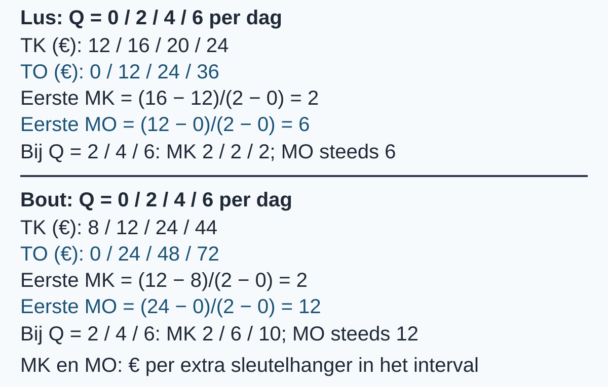
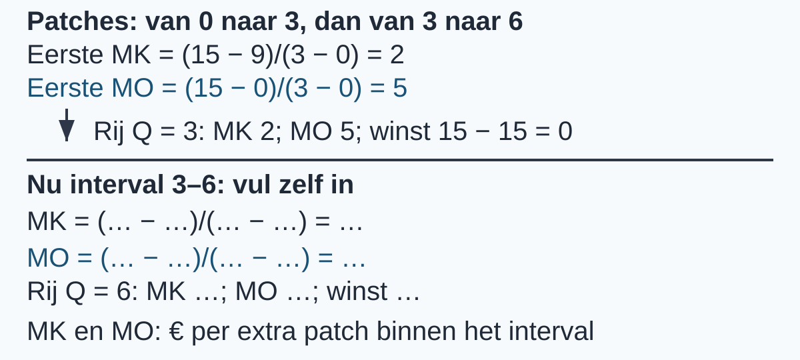

# 2.1.3 Marginale kosten en marginale opbrengsten — opgaven

## Uitgewerkt voorbeeld

Twee werkplaatsen maken en verkopen sleutelhangers per dag. **Lus** heeft TK = 12 + 2Q en TO = 6Q. **Bout** heeft TK = 8 + Q² en TO = 12Q. De totale bedragen staan al in de tabellen; je hoeft Q² niet zelf uit te rekenen. Alle totale bedragen zijn euro per dag. MK en MO zijn euro per extra sleutelhanger over het interval dat eindigt bij die rij.

Dit zijn de twee invultabellen waarmee we beginnen. Lus mist winst, MK en MO; bij Bout is winst al gegeven en ontbreken alleen de intervalwaarden.

**Lus — begin**

<table style="break-inside:avoid">
<colgroup>
<col style="width:16.6667%">
<col style="width:16.6667%">
<col style="width:16.6667%">
<col style="width:16.6667%">
<col style="width:16.6667%">
<col style="width:16.6667%">
</colgroup>
<thead><tr><th>Q</th><th>TK</th><th>TO</th><th>winst</th><th>MK</th><th>MO</th></tr></thead>
<tbody>
<tr><td>0</td><td>12</td><td>0</td><td></td><td>—</td><td>—</td></tr>
<tr><td>2</td><td>16</td><td>12</td><td></td><td></td><td></td></tr>
<tr><td>4</td><td>20</td><td>24</td><td></td><td></td><td></td></tr>
<tr><td>6</td><td>24</td><td>36</td><td></td><td></td><td></td></tr>
</tbody></table>

**Bout — begin**

<table style="break-inside:avoid">
<colgroup>
<col style="width:16.6667%">
<col style="width:16.6667%">
<col style="width:16.6667%">
<col style="width:16.6667%">
<col style="width:16.6667%">
<col style="width:16.6667%">
</colgroup>
<thead><tr><th>Q</th><th>TK</th><th>TO</th><th>winst</th><th>MK</th><th>MO</th></tr></thead>
<tbody>
<tr><td>0</td><td>8</td><td>0</td><td>−8</td><td>—</td><td>—</td></tr>
<tr><td>2</td><td>12</td><td>24</td><td>12</td><td></td><td></td></tr>
<tr><td>4</td><td>24</td><td>48</td><td>24</td><td></td><td></td></tr>
<tr><td>6</td><td>44</td><td>72</td><td>28</td><td></td><td></td></tr>
</tbody></table>

**1. Vul de winst van Lus in.** Gebruik steeds TO en TK uit dezelfde rij: 0 − 12 = −12; 12 − 16 = −4; 24 − 20 = 4; 36 − 24 = 12. Negatieve winst is verlies, geen negatieve opbrengst.

**2. Bereken Lus' eerste interval en plaats de waarden.** Bij 0–2 is MK = (16 − 12)/(2 − 0) = 4/2 = **€ 2 per extra sleutelhanger**. MO = (12 − 0)/(2 − 0) = 12/2 = **€ 6 per extra sleutelhanger**. Noteer beide op de rij Q = 2. De volgende stappen geven steeds ΔTK = 4 en ΔTO = 12 bij ΔQ = 2, dus dezelfde MK en MO op Q = 4 en Q = 6.

**3. Verklaar constante MO.** Lus verkoopt iedere sleutelhanger voor € 6. Elk extra verkocht product voegt dus € 6 toe aan TO. Daarom is MO over elk gegeven interval € 6.

**Lus — ingevuld**

<table style="break-inside:avoid">
<colgroup>
<col style="width:16.6667%">
<col style="width:16.6667%">
<col style="width:16.6667%">
<col style="width:16.6667%">
<col style="width:16.6667%">
<col style="width:16.6667%">
</colgroup>
<thead><tr><th>Q</th><th>TK</th><th>TO</th><th>winst</th><th>MK</th><th>MO</th></tr></thead>
<tbody>
<tr><td>0</td><td>12</td><td>0</td><td>−12</td><td>—</td><td>—</td></tr>
<tr><td>2</td><td>16</td><td>12</td><td>−4</td><td>2</td><td>6</td></tr>
<tr><td>4</td><td>20</td><td>24</td><td>4</td><td>2</td><td>6</td></tr>
<tr><td>6</td><td>24</td><td>36</td><td>12</td><td>2</td><td>6</td></tr>
</tbody></table>

**4. Bereken de intervalwaarden van Bout.** MK bij 0–2 = (12 − 8)/(2 − 0) = **2**. MK bij 2–4 = (24 − 12)/(4 − 2) = **6**. MK bij 4–6 = (44 − 24)/(6 − 4) = **10**, telkens euro per extra sleutelhanger binnen dat interval. De eerste MO = (24 − 0)/(2 − 0) = **12**. Ook bij de volgende twee stappen neemt TO toe met € 24 voor twee producten: MO blijft 12, dankzij de vaste prijs van € 12. Schrijf de uitkomsten bij Q = 2, 4 en 6.

**Bout — ingevuld**

<table style="break-inside:avoid">
<colgroup>
<col style="width:16.6667%">
<col style="width:16.6667%">
<col style="width:16.6667%">
<col style="width:16.6667%">
<col style="width:16.6667%">
<col style="width:16.6667%">
</colgroup>
<thead><tr><th>Q</th><th>TK</th><th>TO</th><th>winst</th><th>MK</th><th>MO</th></tr></thead>
<tbody>
<tr><td>0</td><td>8</td><td>0</td><td>−8</td><td>—</td><td>—</td></tr>
<tr><td>2</td><td>12</td><td>24</td><td>12</td><td>2</td><td>12</td></tr>
<tr><td>4</td><td>24</td><td>48</td><td>24</td><td>6</td><td>12</td></tr>
<tr><td>6</td><td>44</td><td>72</td><td>28</td><td>10</td><td>12</td></tr>
</tbody></table>

{alt="Eindpuntrijen van Lus en Bout: MK 2/2/2 tegenover 2/6/10; MO steeds 6 en 12 euro per extra sleutelhanger."}

**5. Vergelijk en interpreteer.** Lus heeft constante MK; Bout heeft stijgende MK over de gegeven intervallen. MK betekent de gemiddelde extra totale kosten per extra product binnen het interval; MO betekent de gemiddelde extra totale opbrengsten per extra product binnen datzelfde interval. Bij Bout zegt MK = 10 op Q = 6 dus iets over **4–6**, niet over alleen het zesde product. De streepjes bij Q = 0 betekenen dat er geen voorafgaand interval is. Deze tabel bepaalt geen gewenste afzet.

> **Onthoud**
>
> - Kies twee tabelrijen: eindwaarde min beginwaarde geeft Δ; gebruik voor alle veranderingen hetzelfde interval met ΔQ > 0.
> - MK = ΔTK/ΔQ en MO = ΔTO/ΔQ, in euro per extra product binnen dat interval; MK is niet TK/Q.
> - Totale winst = TO − TK bij dezelfde Q. Een negatieve uitkomst betekent verlies.
> - Een vaste prijs geeft hier constante MO. MK kan constant zijn of stijgen. Noteer intervalwaarden bij het rechter eindpunt; Q = 0 krijgt streepjes, geen nulwaarden.
> - Δwinst/ΔQ = MO − MK over hetzelfde interval is een winsttoename per extra product, niet totale winst. In §2.1.4 gebruik je de totale en marginale begrippen samen.

**Controleer jezelf.** Kun je MK en MO over een tabelinterval berekenen, een winstkolom invullen, marginale patronen vergelijken én hun betekenis per extra product binnen het interval uitleggen? Kijk bij twijfel terug naar het bijpassende voorbeeld en oefen verder.

## Startopgaven

Korte route: Startopgaven → Zelfstandige oefening → Doeloefening. Extra hulp nodig? Maak eerst Begeleide inoefening.

**Opgave 1**

Een verkoper maakt en verkoopt bekers op één evenement. Voor 0–10 bekers geldt TK = 18 + 2Q en TO = 5Q. Totale bedragen zijn euro per evenement.

a\) Bereken TK en TO bij Q = 4.

b\) Bereken GTK bij Q = 4. Noteer de eenheid en het verschil met de eenheid van TK.

c\) Bereken de totale winst bij Q = 4 en geef aan of er winst of verlies is.

**Opgave 2**

Een sportwinkel verkoopt sportflessen voor € 6 per stuk. De tabel geeft mogelijke hoeveelheden op dezelfde dag. Totale bedragen zijn euro per dag.

<table style="break-inside:avoid">
<colgroup>
<col style="width:25%">
<col style="width:25%">
<col style="width:25%">
<col style="width:25%">
</colgroup>
<thead><tr><th>Q</th><th>TK</th><th>TO</th><th>winst</th></tr></thead>
<tbody>
<tr><td>0</td><td>8</td><td>0</td><td>−8</td></tr>
<tr><td>2</td><td>12</td><td>12</td><td>0</td></tr>
<tr><td>4</td><td>20</td><td>24</td><td>4</td></tr>
</tbody></table>

a\) Bij 2–4 zegt Noor: “MK is 20 − 12 = € 8.” Verbeter haar berekening, met teller, noemer en eenheid. Bij welke Q-rij noteer je deze MK?

b\) Bij 0–2 is Δwinst/ΔQ = (12 − 4)/2 = € 4 per extra fles: ΔTO min ΔTK, gedeeld door ΔQ. Vul voor **2–4** aan: (… − …)/… = … euro per extra fles. Controleer met de verandering in de winstkolom.

c\) Leg uit waarom MO in beide intervallen € 6 is en waarom de winst in het tweede interval per extra fles minder toeneemt. Gebruik de MK van beide intervallen.

## Begeleide inoefening

Heb je de Startopgaven zelfstandig goed gemaakt en kun je je aanpak uitleggen? Dan kun je door naar Zelfstandige oefening. Gebruik de volgende opgaven als je extra oefening wilt.

**Opgave 3**

Een atelier verkoopt stoffen patches voor € 5 per stuk. De tabel beschrijft één dag; totale bedragen zijn euro per dag. MK en MO zijn euro per extra patch. De waarden bij Q = 3 horen bij 0–3.

<table style="break-inside:avoid">
<colgroup>
<col style="width:16.6667%">
<col style="width:16.6667%">
<col style="width:16.6667%">
<col style="width:16.6667%">
<col style="width:16.6667%">
<col style="width:16.6667%">
</colgroup>
<thead><tr><th>Q</th><th>TK</th><th>TO</th><th>winst</th><th>MK</th><th>MO</th></tr></thead>
<tbody>
<tr><td>0</td><td>9</td><td>0</td><td>−9</td><td>—</td><td>—</td></tr>
<tr><td>3</td><td>15</td><td>15</td><td></td><td>2</td><td>5</td></tr>
<tr><td>6</td><td>21</td><td>30</td><td></td><td></td><td></td></tr>
</tbody></table>

a\) Vul de twee ontbrekende winstbedragen in met TO − TK.

b\) Vul voor 3–6 aan: MK = (… − …)/(… − …) = … en MO = (… − …)/(… − …) = … . Zet de uitkomsten in de juiste tabelrij.

c\) Maak af: “MO is constant, omdat … . MK = 2 bij Q = 6 betekent dat binnen … de extra totale kosten gemiddeld … . MO = 5 betekent dat binnen hetzelfde interval de extra totale opbrengsten gemiddeld … .”

**Opgave 4**

Een werkplaats verkoopt keramische onderzetters voor € 8 per stuk. De tabel beschrijft één dag. TK, TO en winst zijn euro per dag; MK en MO zijn euro per extra onderzetter over het interval dat eindigt bij de rij.

<table style="break-inside:avoid">
<colgroup>
<col style="width:16.6667%">
<col style="width:16.6667%">
<col style="width:16.6667%">
<col style="width:16.6667%">
<col style="width:16.6667%">
<col style="width:16.6667%">
</colgroup>
<thead><tr><th>Q</th><th>TK</th><th>TO</th><th>winst</th><th>MK</th><th>MO</th></tr></thead>
<tbody>
<tr><td>0</td><td>10</td><td>0</td><td>−10</td><td>—</td><td>—</td></tr>
<tr><td>2</td><td>14</td><td>16</td><td></td><td>2</td><td>8</td></tr>
<tr><td>6</td><td>38</td><td>48</td><td></td><td></td><td></td></tr>
</tbody></table>

a\) Vul alle lege cellen in. Laat je berekening voor MK en MO bij 2–6 zien.

b\) Vergelijk het MK-patroon met dat van de patches uit opgave 3. Leg uit wat de berekende MK en MO bij 2–6 betekenen.

**Opgave 5**

Een maker verkoopt bureau-organizers per dag. De tabel vergelijkt steeds hetzelfde interval Q = 2 tot Q = 6. Geval A voegt € 10 vaste kosten aan beide TK-bedragen toe. Geval B verhoogt de verkoopprijs van € 6 naar € 7 per organizer. “Beide” combineert A en B. Alle bedragen in de tabel zijn totale eurobedragen per dag.

<table style="break-inside:avoid">
<colgroup>
<col style="width:20%">
<col style="width:20%">
<col style="width:20%">
<col style="width:20%">
<col style="width:20%">
</colgroup>
<thead><tr><th>Geval</th><th>TK bij Q = 2</th><th>TK bij Q = 6</th><th>TO bij Q = 2</th><th>TO bij Q = 6</th></tr></thead>
<tbody>
<tr><td>Basis</td><td>14</td><td>22</td><td>12</td><td>36</td></tr>
<tr><td>Alleen A</td><td>24</td><td>32</td><td>12</td><td>36</td></tr>
<tr><td>Alleen B</td><td>14</td><td>22</td><td>14</td><td>42</td></tr>
<tr><td>Beide</td><td>24</td><td>32</td><td>14</td><td>42</td></tr>
</tbody></table>

a\) Vergelijk MK in de basis en bij alleen A.

b\) Vergelijk MO in de basis en bij alleen B.

c\) Bereken bij “Beide” MK en MO over 2–6 en de totale winst bij Q = 6. Noteer de verschillende eenheden.

d\) Beoordeel: “Bij Beide stijgen de totale kosten én opbrengsten ten opzichte van de basis, dus MK en MO stijgen allebei.” Leg uit met je berekeningen.

## Zelfstandige oefening

**Opgave 6**

Twee werkplaatsen maken en verkopen notitieboekjes per dag. Draad heeft TK = 20 + Q en TO = 5Q. Kaft heeft TK = 12 + Q² en TO = 24Q. De totale bedragen zijn gegeven in euro per dag; MK en MO zijn euro per extra notitieboekje over een tabelinterval.

**Draad**

<table style="break-inside:avoid">
<colgroup>
<col style="width:16.6667%">
<col style="width:16.6667%">
<col style="width:16.6667%">
<col style="width:16.6667%">
<col style="width:16.6667%">
<col style="width:16.6667%">
</colgroup>
<thead><tr><th>Q</th><th>TK</th><th>TO</th><th>winst</th><th>MK</th><th>MO</th></tr></thead>
<tbody>
<tr><td>0</td><td>20</td><td>0</td><td></td><td>—</td><td>—</td></tr>
<tr><td>4</td><td>24</td><td>20</td><td></td><td></td><td></td></tr>
<tr><td>8</td><td>28</td><td>40</td><td></td><td></td><td></td></tr>
<tr><td>12</td><td>32</td><td>60</td><td></td><td></td><td></td></tr>
</tbody></table>

**Kaft**

<table style="break-inside:avoid">
<colgroup>
<col style="width:16.6667%">
<col style="width:16.6667%">
<col style="width:16.6667%">
<col style="width:16.6667%">
<col style="width:16.6667%">
<col style="width:16.6667%">
</colgroup>
<thead><tr><th>Q</th><th>TK</th><th>TO</th><th>winst</th><th>MK</th><th>MO</th></tr></thead>
<tbody>
<tr><td>0</td><td>12</td><td>0</td><td>−12</td><td>—</td><td>—</td></tr>
<tr><td>4</td><td>28</td><td>96</td><td>68</td><td></td><td></td></tr>
<tr><td>8</td><td>76</td><td>192</td><td>116</td><td></td><td></td></tr>
<tr><td>12</td><td>156</td><td>288</td><td>132</td><td></td><td></td></tr>
</tbody></table>

a\) Vul de winstkolom van Draad in.

b\) Bereken voor Draad MK en MO over het eerste interval, met teller en noemer. Vul de intervalwaarden op alle juiste rechter eindpunten in.

c\) Leg uit waarom MO bij Draad constant is.

d\) Bereken voor Kaft MK over alle drie de intervallen en MO over het eerste interval. Vul alle ontbrekende intervalwaarden bij hun rechter eindpunten in.

e\) Vergelijk de MK-patronen van Draad en Kaft. Leg uit wat MK en MO per extra product binnen een tabelinterval betekenen. Geef geen advies over de te kiezen afzet.

## Doeloefening

**Opgave 7**

Onderneming Linea heeft TK = 200 + 3Q en TO = 8Q. Onderneming Curva heeft TK = 100 + Q² en verkoopt ieder product voor € 30, zodat TO = 30Q. Bedragen zijn in euro. Bereken marginale waarden per extra product over ieder tabelinterval: MK = ΔTK/ΔQ en MO = ΔTO/ΔQ. Gebruik geen afgeleiden.

**Linea**

Vul de lege cellen in. Noteer een intervalwaarde voor MK en MO steeds bij het rechter eindpunt.

<table style="break-inside:avoid">
<colgroup>
<col style="width:16.6667%">
<col style="width:16.6667%">
<col style="width:16.6667%">
<col style="width:16.6667%">
<col style="width:16.6667%">
<col style="width:16.6667%">
</colgroup>
<thead><tr><th>Q</th><th>TK</th><th>TO</th><th>winst</th><th>MK</th><th>MO</th></tr></thead>
<tbody>
<tr><td>0</td><td>€200</td><td>€0</td><td></td><td>—</td><td>—</td></tr>
<tr><td>10</td><td>€230</td><td>€80</td><td></td><td></td><td></td></tr>
<tr><td>20</td><td>€260</td><td>€160</td><td></td><td></td><td></td></tr>
<tr><td>30</td><td>€290</td><td>€240</td><td></td><td></td><td></td></tr>
</tbody></table>

**Curva**

Vul de lege cellen in. Noteer een intervalwaarde voor MK en MO steeds bij het rechter eindpunt.

<table style="break-inside:avoid">
<colgroup>
<col style="width:16.6667%">
<col style="width:16.6667%">
<col style="width:16.6667%">
<col style="width:16.6667%">
<col style="width:16.6667%">
<col style="width:16.6667%">
</colgroup>
<thead><tr><th>Q</th><th>TK</th><th>TO</th><th>winst</th><th>MK</th><th>MO</th></tr></thead>
<tbody>
<tr><td>0</td><td>€100</td><td>€0</td><td>−€100</td><td>—</td><td>—</td></tr>
<tr><td>5</td><td>€125</td><td>€150</td><td>€25</td><td></td><td></td></tr>
<tr><td>10</td><td>€200</td><td>€300</td><td>€100</td><td></td><td></td></tr>
<tr><td>15</td><td>€325</td><td>€450</td><td>€125</td><td></td><td></td></tr>
</tbody></table>

a\) **(4 punten)** Vul in de tabel van Linea de winstkolom in.

b\) **(3 punten)** Bereken voor Linea MK en MO over het eerste interval. Laat teller en noemer zien en vul dezelfde intervalwaarden in bij de rechter eindpunten Q=10, Q=20 en Q=30.

c\) **(2 punten)** Leg uit waarom MO bij Linea constant is.

d\) **(4 punten)** Bereken voor Curva MK over de drie intervallen en MO over het eerste interval. Vul de berekende MK- en MO-waarden in bij de juiste rechter eindpunten Q=5, Q=10 en Q=15.

e\) **(2 punten)** Vergelijk het MK-patroon van Linea en Curva en leg uit wat MK en MO per extra product binnen een tabelinterval betekenen. Trek geen conclusie over de winstmaximaliserende afzet.

## Denkertje / Bonusopgave

**Opgave 8 — optioneel**

Twee verpakkingsbedrijven K en L vergelijken mogelijke productie- en verkoophoeveelheden per dag. TK is in euro per dag.

<table style="break-inside:avoid">
<colgroup>
<col style="width:33.3333%">
<col style="width:33.3333%">
<col style="width:33.3333%">
</colgroup>
<thead><tr><th>Q (verpakkingen per dag)</th><th>TK van K</th><th>TK van L</th></tr></thead>
<tbody>
<tr><td>0</td><td>20</td><td>20</td></tr>
<tr><td>4</td><td>32</td><td>40</td></tr>
<tr><td>12</td><td>56</td><td>56</td></tr>
</tbody></table>

a\) “Bij K is de toename in TK in het tweede interval groter, dus MK is daar ook groter.” Beoordeel deze uitspraak met berekeningen.

b\) Bereken het MK-patroon van L. Beide bedrijven eindigen met TK = € 56. Betekent dit dat hun marginale kosten over de tabelintervallen hetzelfde patroon hebben?

c\) Kun je uit deze tabel de extra kosten van alleen de vijfde verpakking bepalen? Leg uit welke informatie je daarvoor mist.

## Herhaling / Herhaling en interleaving

**Opgave 9**

Een reparateur herstelt en levert hoofdtelefoons af per dag. Voor 3–6 reparaties gelden TK = 15 + 2Q en TO = 7Q. TK en TO zijn euro per dag.

a\) Bereken bij Q = 3 de totale kosten, totale opbrengsten, totale winst en GTK. Geef de eenheden.

b\) Bereken dezelfde vier grootheden bij Q = 6. Leg uit waarom GTK niet dezelfde eenheid heeft als de totale winst.
