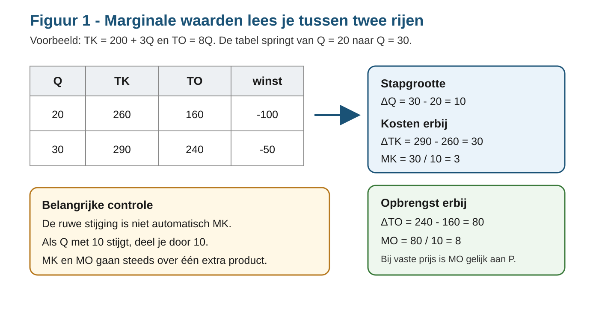
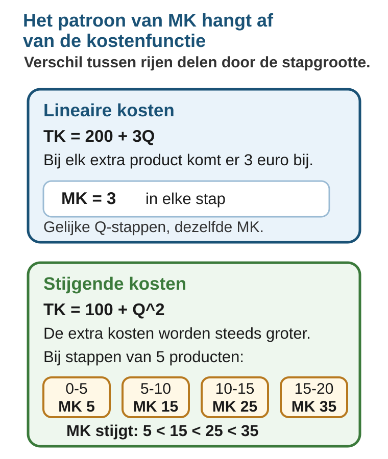

# 2.1.3 Marginale kosten en marginale opbrengsten

## Wat gebeurt er als je één product extra maakt?

In §2.1.1 keek je naar kosten. In §2.1.2 keek je naar opbrengsten, winst en break-even. Je kon daardoor berekenen of een onderneming winst of verlies maakt bij een bepaalde productieomvang.

Nu stel je een kleinere vraag:

> **Wat verandert er als de onderneming één product extra maakt en verkoopt?**

Die vraag heet **marginaal denken**. Marginaal betekent hier: erbij, aan de rand, bij één extra product. Je kijkt dus niet alleen naar het totaal, maar naar de verandering in het totaal.

Het kernidee is:

> **`MK` en `MO` lees je niet uit één rij van een tabel. Je berekent ze tussen twee rijen.**

## Doeloefening

Deze opgave is het eindpunt van de paragraaf. Je hoeft hem nu nog niet volledig te kunnen maken. De theorie, het voorbeeld en de oefeningen hieronder leren precies de route naar deze opgave.

**Bron 1 - Onderneming Linea**

Een onderneming heeft de kostenfunctie `TK = 200 + 3Q`. De onderneming verkoopt elk product voor €8. Daarom geldt `TO = 8Q`. Gebruik `Q` voor het aantal producten.

**A.** Vul de tabel in voor `Q = 0, 10, 20, 30, 40, 50`. Bereken `TK`, `TO`, winst, `MK` en `MO`. Let op: de tabel springt steeds met 10 producten, dus deel de verandering door `ΔQ`.

**B.** Wat valt je op aan `MK`? Is `MK` constant of verandert `MK`?

**C.** Wat valt je op aan `MO`? Waarom is dat logisch bij een vaste verkoopprijs?

**Bron 2 - Onderneming Curva**

Een tweede onderneming heeft de kostenfunctie `TK = 100 + Q²`. De onderneming verkoopt elk product voor €30. Daarom geldt `TO = 30Q`.

**D.** Vul een vergelijkbare tabel in voor `Q = 0, 5, 10, 15, 20`. Wat gebeurt er met `MK`?

**E.** Leg in je eigen woorden uit wat `MK` vertelt en wat `MO` vertelt.

---

Na deze paragraaf kun je:

- `MK` uitleggen als de extra kosten van één extra product;
- `MO` uitleggen als de extra opbrengst van één extra verkocht product;
- `MK = ΔTK / ΔQ` en `MO = ΔTO / ΔQ` gebruiken in tabellen;
- zien dat `MK` constant is bij een lineaire kostenfunctie;
- zien dat `MK` kan stijgen bij een niet-lineaire kostenfunctie;
- uitleggen waarom `MO` gelijk is aan de prijs als elk product voor dezelfde prijs wordt verkocht.

Deze paragraaf gaat nog niet over winstmaximalisatie. Je leert eerst wat `MK` en `MO` betekenen en hoe je ze uit een tabel berekent.

---

## Theorie

### 1. Marginaal betekent: de verandering erbij

De **marginale kosten** zijn de extra kosten van één extra product.

> **Formulebox: marginale kosten**
>
> `MK = ΔTK / ΔQ`
>
> `ΔTK` = verandering van de totale kosten  
> `ΔQ` = verandering van de productieomvang

De **marginale opbrengsten** zijn de extra opbrengst van één extra verkocht product.

> **Formulebox: marginale opbrengsten**
>
> `MO = ΔTO / ΔQ`
>
> `ΔTO` = verandering van de totale opbrengst  
> `ΔQ` = verandering van de verkoop

Als `Q` met precies 1 stijgt, deel je door 1. Dan is `MK` gewoon de extra kosten van dat ene product. Maar in veel tabellen springt `Q` met 5, 10 of 20 tegelijk. Dan moet je de verandering eerst delen door de stapgrootte.

### 2. Marginale waarden bereken je tussen twee rijen

Kijk naar onderneming Linea:

- `TK = 200 + 3Q`
- `TO = 8Q`

Eerst bereken je de totalen.

| Q | TK | TO | winst |
|---:|---:|---:|---:|
| 0 | 200 | 0 | -200 |
| 10 | 230 | 80 | -150 |
| 20 | 260 | 160 | -100 |
| 30 | 290 | 240 | -50 |
| 40 | 320 | 320 | 0 |
| 50 | 350 | 400 | 50 |

Daarna kijk je naar de verandering tussen twee opeenvolgende rijen.

In figuur 1 zie je de stap van `Q = 20` naar `Q = 30`.

- `ΔQ = 30 - 20 = 10`
- `ΔTK = 290 - 260 = 30`
- `MK = 30 / 10 = 3`
- `ΔTO = 240 - 160 = 80`
- `MO = 80 / 10 = 8`

De ruwe stijging van de kosten is dus €30, maar de marginale kosten zijn €3 per product. Dat verschil is belangrijk. `MK` gaat over één extra product, niet over de hele sprong van tien producten.

### 3. Lineaire kosten: MK blijft constant

Bij `TK = 200 + 3Q` komt er bij elk extra product €3 aan kosten bij. Daarom is `MK` steeds gelijk aan €3.

<table class="wide-table">
  <thead>
    <tr><th>Stap</th><th>ΔQ</th><th>ΔTK</th><th>MK = ΔTK / ΔQ</th><th>ΔTO</th><th>MO = ΔTO / ΔQ</th></tr>
  </thead>
  <tbody>
    <tr><td>0 naar 10</td><td>10</td><td>30</td><td>3</td><td>80</td><td>8</td></tr>
    <tr><td>10 naar 20</td><td>10</td><td>30</td><td>3</td><td>80</td><td>8</td></tr>
    <tr><td>20 naar 30</td><td>10</td><td>30</td><td>3</td><td>80</td><td>8</td></tr>
    <tr><td>30 naar 40</td><td>10</td><td>30</td><td>3</td><td>80</td><td>8</td></tr>
    <tr><td>40 naar 50</td><td>10</td><td>30</td><td>3</td><td>80</td><td>8</td></tr>
  </tbody>
</table>

De winst stijgt hier bij elke stap, omdat `MO` groter is dan `MK`. Maar de winstmaximalisatieregel komt later. In deze paragraaf is de hoofdzaak dat je `MK` en `MO` correct uit de tabel haalt.

Je mag `MK` en `MO` wel al gebruiken om de winstverandering van één extra product of één tabelstap te begrijpen:

- als `MO > MK`, stijgt de winst door die extra stap;
- als `MO < MK`, daalt de winst door die extra stap;
- als `MO = MK`, verandert de winst door die extra stap niet.

Dit is nog geen recept om de beste productieomvang te kiezen. Het is alleen een manier om de verandering tussen twee rijen goed te lezen.

### 4. Vaste verkoopprijs: MO is gelijk aan de prijs

Onderneming Linea verkoopt elk product voor €8. Als er één product extra wordt verkocht, komt er dus €8 extra opbrengst bij. Daarom is `MO = 8`.

Dat is logisch:

`TO = 8Q`

Elke keer dat `Q` met 1 stijgt, stijgt `TO` met 8.

Bij een vaste verkoopprijs geldt dus:

`MO = P`

Let op: dit geldt alleen als elk extra product voor dezelfde prijs wordt verkocht. Als de onderneming de prijs moet verlagen om meer te verkopen, kan `MO` anders zijn dan de prijs. Dat komt later terug.

### 5. Niet-lineaire kosten: MK kan stijgen

Nu verandert de kostenfunctie. Onderneming Curva heeft:

- `TK = 100 + Q²`
- `TO = 30Q`

Eerst bereken je weer de totalen.

| Q | TK | TO | winst |
|---:|---:|---:|---:|
| 0 | 100 | 0 | -100 |
| 5 | 125 | 150 | 25 |
| 10 | 200 | 300 | 100 |
| 15 | 325 | 450 | 125 |
| 20 | 500 | 600 | 100 |

Daarna bereken je de marginale waarden tussen de rijen.

<table class="wide-table">
  <thead>
    <tr><th>Stap</th><th>ΔQ</th><th>ΔTK</th><th>MK = ΔTK / ΔQ</th><th>ΔTO</th><th>MO = ΔTO / ΔQ</th></tr>
  </thead>
  <tbody>
    <tr><td>0 naar 5</td><td>5</td><td>25</td><td>5</td><td>150</td><td>30</td></tr>
    <tr><td>5 naar 10</td><td>5</td><td>75</td><td>15</td><td>150</td><td>30</td></tr>
    <tr><td>10 naar 15</td><td>5</td><td>125</td><td>25</td><td>150</td><td>30</td></tr>
    <tr><td>15 naar 20</td><td>5</td><td>175</td><td>35</td><td>150</td><td>30</td></tr>
  </tbody>
</table>

Hier stijgt `MK`: eerst €5, daarna €15, daarna €25 en daarna €35 per product. De extra producten worden dus steeds duurder om te maken.

`MO` blijft gelijk aan €30, omdat elk product voor dezelfde prijs wordt verkocht.

### 6. Wat vertellen MK en MO?

`MK` vertelt hoeveel de totale kosten veranderen als de onderneming één product extra maakt.

`MO` vertelt hoeveel de totale opbrengst verandert als de onderneming één product extra verkoopt.

Je gebruikt marginale waarden dus om naar de rand van de beslissing te kijken:

- Wat kost één extra product?
- Wat levert één extra verkocht product op?
- Worden extra producten steeds duurder of blijven de extra kosten gelijk?
- Blijft de extra opbrengst gelijk aan de prijs, of verandert die?

Dat is een andere vraag dan: hoeveel winst maakt de onderneming in totaal? De totale winst bereken je met `winst = TO - TK`. De marginale waarden bereken je met verschillen tussen rijen.

---

## Doelprocedure: MK en MO uit een tabel berekenen

Gebruik deze procedure bij tabellen met marginale kosten en marginale opbrengsten.

<table class="procedure-table">
  <thead>
    <tr><th>Stap</th><th>Doe dit</th><th>Controle</th></tr>
  </thead>
  <tbody>
    <tr><td>1</td><td>Bereken eerst <code>TK</code>, <code>TO</code> en winst per rij.</td><td>Gebruik de formules uit de bron. Winst is <code>TO - TK</code>.</td></tr>
    <tr><td>2</td><td>Kies twee opeenvolgende rijen.</td><td><code>MK</code> en <code>MO</code> horen bij de stap tussen die rijen.</td></tr>
    <tr><td>3</td><td>Bereken <code>ΔQ</code>.</td><td>Vraag: met hoeveel producten stijgt <code>Q</code>?</td></tr>
    <tr><td>4</td><td>Bereken <code>ΔTK</code> en <code>ΔTO</code>.</td><td>Nieuw totaal min oud totaal.</td></tr>
    <tr><td>5</td><td>Bereken <code>MK</code> en <code>MO</code>.</td><td><code>MK = ΔTK / ΔQ</code> en <code>MO = ΔTO / ΔQ</code>.</td></tr>
    <tr><td>6</td><td>Beschrijf het patroon.</td><td>Blijft <code>MK</code> constant, stijgt het of daalt het? Geldt hetzelfde voor <code>MO</code>?</td></tr>
  </tbody>
</table>

---

## Uitgewerkt voorbeeld

Een bedrijf maakt sporttassen. De kostenfunctie is `TK = 300 + 2Q`. De verkoopprijs is €6 per tas, dus `TO = 6Q`. Bereken `TK`, `TO`, winst, `MK` en `MO` bij `Q = 0, 25, 50`.

**Stap 1: Bereken de totalen.**

| Q | TK | TO | winst |
|---:|---:|---:|---:|
| 0 | 300 | 0 | -300 |
| 25 | 350 | 150 | -200 |
| 50 | 400 | 300 | -100 |

**Stap 2: Bereken de marginale waarden tussen de rijen.**

<table class="wide-table">
  <thead>
    <tr><th>Stap</th><th>ΔQ</th><th>ΔTK</th><th>MK</th><th>ΔTO</th><th>MO</th></tr>
  </thead>
  <tbody>
    <tr><td>0 naar 25</td><td>25</td><td>50</td><td>50 / 25 = 2</td><td>150</td><td>150 / 25 = 6</td></tr>
    <tr><td>25 naar 50</td><td>25</td><td>50</td><td>50 / 25 = 2</td><td>150</td><td>150 / 25 = 6</td></tr>
  </tbody>
</table>

**Stap 3: Interpreteer.**

`MK = 2`: één extra sporttas kost €2 extra om te maken.

`MO = 6`: één extra verkochte sporttas levert €6 extra opbrengst op.

De tabel springt met 25 tassen. Daarom mag je niet zeggen dat `MK = 50`. Die €50 is de extra kosten voor 25 tassen samen. Per tas is dat €2.

---

## Samenvatting

> **Onthouden**
>
> - Marginaal betekent: wat verandert er bij één product extra?
> - `MK = ΔTK / ΔQ`.
> - `MO = ΔTO / ΔQ`.
> - `MK` en `MO` bereken je tussen twee rijen van een tabel.
> - Als de tabel met meer dan 1 product tegelijk springt, deel je door `ΔQ`.
> - Bij `TK = 200 + 3Q` is `MK = 3`: de kosten stijgen steeds met €3 per extra product.
> - Bij `TO = 8Q` is `MO = 8`: bij een vaste prijs is `MO` gelijk aan de prijs.
> - Bij `TK = 100 + Q²` stijgt `MK`: extra producten worden steeds duurder om te maken.
