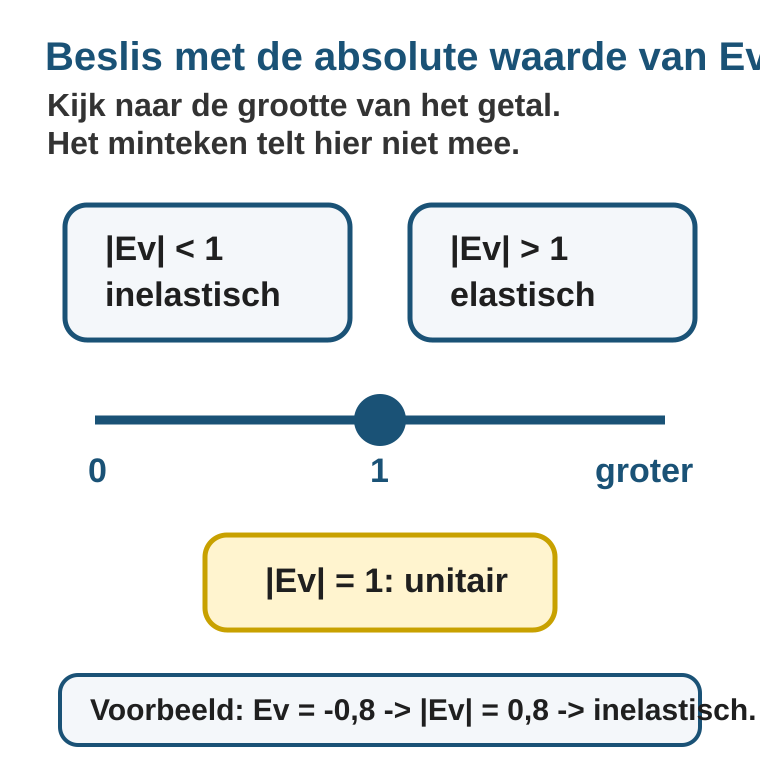

# Hoofdstuk 2.2 - Elasticiteit

## Inhoud

| Paragraaf | Onderwerp |
|---|---|
| 2.2.1 | Prijselasticiteit |
| 2.2.2 | Elasticiteit en omzet |

## Leerdoelen

Na deze paragraaf kun je:

- procentuele prijsverandering en procentuele hoeveelheidsverandering berekenen;
- prijselasticiteit van de vraag berekenen met `Ev = %dQv / %dP`;
- signed `Ev` opschrijven en daarna met `|Ev|` bepalen of de vraag elastisch of inelastisch is;
- uitleggen waarom consumenten sterk of zwak reageren op een prijsverandering;
- `TO = P x Q` gebruiken om omzet voor en na een prijsverandering te berekenen;
- uitleggen waarom elasticiteit bepaalt of omzet stijgt of daalt;
- een voorzichtig omzetadvies geven zonder winst of kosten te gebruiken.

## Waarom elasticiteit belangrijk is

Een prijsverandering lijkt eenvoudig: de prijs gaat omhoog of omlaag. Voor een onderneming is de echte vraag wat klanten daarna doen. Elasticiteit helpt je om die reactie te meten, te berekenen en in gewone taal uit te leggen. Daarna kun je beoordelen wat er met de omzet gebeurt.

# 2.2.1 Prijselasticiteit

## Waarom raakt een prijsverhoging het ene bedrijf harder dan het andere?

Een bioscoop verhoogt de prijs van een kaartje van 10 euro naar 12 euro. De eigenaar verwacht meer omzet, want elk kaartje levert nu 2 euro extra op. Maar na de prijsverhoging daalt het aantal bezoekers van 500 naar 420 per week.

Is dat een sterke reactie of een zwakke reactie? Dat kun je niet zien door alleen naar 80 bezoekers minder te kijken. Je moet de daling vergelijken met het oude aantal bezoekers. Daarna vergelijk je die procentuele daling met de procentuele prijsstijging.

Daarvoor gebruiken economen de **prijselasticiteit van de vraag**. Die laat zien hoe sterk de gevraagde hoeveelheid reageert op een prijsverandering.

In deze paragraaf gebruik je:

- `P` voor de prijs;
- `Qv` voor de gevraagde hoeveelheid;
- `Ev` voor de prijselasticiteit van de vraag.

---

## Theorie

### 1. Eerst: procentuele verandering

Bij prijselasticiteit vergelijk je twee procentuele veranderingen:

1. de procentuele verandering van de prijs;
2. de procentuele verandering van de gevraagde hoeveelheid.

De procentuele verandering bereken je steeds zo:

> **Formulebox: procentuele verandering**
>
> `procentuele verandering = (nieuw - oud) / oud x 100%`

Gebruik dus altijd de **oude waarde** als basis.

Bij de bioscoop stijgt de prijs van 10 euro naar 12 euro.

`%dP = (12 - 10) / 10 x 100% = 20%`

De prijs stijgt met 20%.

Het aantal bezoekers daalt van 500 naar 420.

`%dQv = (420 - 500) / 500 x 100% = -16%`

De gevraagde hoeveelheid daalt met 16%. Let op het minteken: de hoeveelheid daalt, dus de procentuele verandering van `Qv` is negatief.

---

### 2. Wat meet prijselasticiteit?

De **prijselasticiteit van de vraag** geeft aan hoe sterk de gevraagde hoeveelheid reageert op een prijsverandering.

> **Definitie: prijselasticiteit van de vraag**
>
> De prijselasticiteit van de vraag geeft aan met hoeveel procent de gevraagde hoeveelheid verandert als de prijs met 1% verandert.

De formule is:

> **Formulebox: prijselasticiteit**
>
> `Ev = %dQv / %dP`
>
> `Ev` = prijselasticiteit van de vraag  
> `%dQv` = procentuele verandering van de gevraagde hoeveelheid  
> `%dP` = procentuele verandering van de prijs

Bij de bioscoop:

`Ev = -16% / 20% = -0,8`

De prijselasticiteit is `-0,8`.

Dat betekent: als de prijs met 1% stijgt, daalt de gevraagde hoeveelheid met ongeveer 0,8%.

---

### 3. Waarom is `Ev` meestal negatief?

Bij gewone vraag geldt meestal:

- als de prijs stijgt, daalt de gevraagde hoeveelheid;
- als de prijs daalt, stijgt de gevraagde hoeveelheid.

Prijs en gevraagde hoeveelheid bewegen dus meestal in tegengestelde richting. Daarom is `Ev` meestal negatief.

Voor de indeling elastisch of inelastisch kijk je naar de **absolute waarde** van `Ev`. Dat betekent: je kijkt naar de grootte van het getal zonder het minteken.

> **Let op**
>
> `Ev = -0,8` heeft absolute waarde `0,8`.  
> Je schrijft dat als: `|Ev| = 0,8`.

---

### 4. Elastisch of inelastisch?

Een vraag is **elastisch** als de gevraagde hoeveelheid relatief sterk reageert op een prijsverandering.

Een vraag is **inelastisch** als de gevraagde hoeveelheid relatief zwak reageert op een prijsverandering.

> **Beslisregel**
>
> - Als `|Ev| > 1`, dan is de vraag **elastisch**.
> - Als `|Ev| < 1`, dan is de vraag **inelastisch**.
> - Als `|Ev| = 1`, dan is de vraag **unitair elastisch**.

Bij de bioscoop is:

`Ev = -0,8`

Dus:

`|Ev| = 0,8`

Omdat `0,8 < 1`, is de vraag naar bioscoopkaartjes **inelastisch**.

Dat betekent: de hoeveelheid bezoekers reageert minder sterk dan de prijs. De prijs stijgt met 20%, maar het aantal bezoekers daalt met 16%.

---

### 5. Waarom reageren sommige producten sterker dan andere?

De prijselasticiteit hangt af van de situatie. Vooral deze vragen zijn belangrijk:

1. **Zijn er goede alternatieven?**  
   Als consumenten gemakkelijk kunnen overstappen, is de vraag vaak elastischer. Denk aan een duurder geworden streamingdienst, frisdrankmerk of kledingwinkel.

2. **Is het product noodzakelijk?**  
   Bij noodzakelijke producten reageren consumenten vaak minder sterk. Denk aan benzine voor iemand die met de auto naar werk moet, medicijnen of basisboodschappen.

3. **Is het product luxe of uitstelbaar?**  
   Bij luxeproducten of producten die je kunt uitstellen, is de vraag vaak elastischer. Denk aan concertkaartjes, vakanties of een nieuwe telefoon.

4. **Hoe groot is het deel van het budget?**  
   Bij dure aankopen letten consumenten sterker op prijsveranderingen dan bij kleine dagelijkse uitgaven.

> **Kort gezegd**
>
> Hoe makkelijker consumenten kunnen ontwijken, uitstellen of vervangen, hoe elastischer de vraag meestal is.

---

## Doelprocedure: prijselasticiteit berekenen

Gebruik steeds dezelfde route.

| Stap | Doe dit | Controle |
|---|---|---|
| 1 | Bereken `%dP`. | Deel door de oude prijs. |
| 2 | Bereken `%dQv`. | Deel door de oude gevraagde hoeveelheid. |
| 3 | Bereken `Ev = %dQv / %dP`. | Houd het minteken bij de berekening. |
| 4 | Kijk naar `|Ev|`. | Gebruik de absolute waarde voor elastisch of inelastisch. |
| 5 | Trek een economische conclusie. | Zeg in woorden hoe sterk consumenten reageren. |

---

## Uitgewerkt voorbeeld

Een pretpark verhoogt de prijs van een dagkaart van 30 euro naar 36 euro. Het aantal verkochte kaartjes daalt van 2000 naar 1500 per dag.

**Vraag:** bereken de prijselasticiteit van de vraag en bepaal of de vraag elastisch of inelastisch is.

**Stap 1: Bereken de procentuele prijsverandering.**

`%dP = (36 - 30) / 30 x 100% = 20%`

De prijs stijgt met 20%.

**Stap 2: Bereken de procentuele verandering van de gevraagde hoeveelheid.**

`%dQv = (1500 - 2000) / 2000 x 100% = -25%`

De gevraagde hoeveelheid daalt met 25%.

**Stap 3: Bereken de prijselasticiteit.**

`Ev = %dQv / %dP = -25% / 20% = -1,25`

**Stap 4: Classificeer de vraag.**

`|Ev| = 1,25`

Omdat `1,25 > 1`, is de vraag **elastisch**.

**Stap 5: Trek de economische conclusie.**

De vraag naar pretparkkaartjes reageert sterk op de prijsverhoging. De prijs stijgt met 20%, maar de gevraagde hoeveelheid daalt met 25%. Dat is logisch: een pretparkbezoek is geen noodzakelijk product en gezinnen kunnen het bezoek uitstellen of een goedkoper alternatief kiezen.

---

## Antwoordvaardigheid: zo bouw je een volledig antwoord

Een goede elasticiteitsuitwerking bestaat uit meer dan een eindgetal. Gebruik deze vaste antwoordstructuur:

| Onderdeel | Wat moet erin? | Voorbeeldzin |
|---|---|---|
| Formule | Schrijf op wat je gaat berekenen. | `Ev = %dQv / %dP`. |
| Oude en nieuwe waarden | Laat zien welke waarde oud en nieuw is. | `P: 10 -> 12`, `Qv: 500 -> 420`. |
| Berekening | Reken percentages en `Ev` uit. | `%dQv = (420 - 500) / 500 x 100% = -16%`. |
| Classificatie | Gebruik `|Ev|`. | `|Ev| = 0,8`, dus inelastisch. |
| Betekenis | Eindig met gedrag in gewone taal. | De hoeveelheid reageert minder sterk dan de prijs. |

Deze structuur helpt vooral bij contextopgaven met veel tekst, grafieken of tabellen. Eerst orden je de gegevens, daarna reken je, en pas aan het einde trek je de economische conclusie.

---

## Veelgemaakte fouten

> **Fout 1: delen door de nieuwe waarde**
>
> Bij procentuele verandering deel je door de oude waarde. Niet: `verschil / nieuw`. Wel: `verschil / oud`.

> **Fout 2: het minteken vergeten**
>
> Als de gevraagde hoeveelheid daalt, is `%dQv` negatief. Daardoor is `Ev` meestal negatief.

> **Fout 3: verkeerd classificeren door het minteken**
>
> Bij `Ev = -1,25` is de vraag elastisch, want `|Ev| = 1,25`. Kijk dus naar de absolute waarde.

> **Fout 4: alleen rekenen, maar niet uitleggen**
>
> Een goed antwoord eindigt met betekenis: reageren consumenten sterk of zwak, en waarom past dat bij de context?

---

## Samenvatting

> **Onthouden**
>
> - `Ev` meet hoe sterk de gevraagde hoeveelheid reageert op een prijsverandering.
> - `Ev = %dQv / %dP`.
> - Procentuele verandering bereken je met `(nieuw - oud) / oud x 100%`.
> - `Ev` is meestal negatief, omdat prijs en gevraagde hoeveelheid meestal tegengesteld bewegen.
> - Voor de indeling gebruik je de absolute waarde: `|Ev| > 1` is elastisch, `|Ev| < 1` is inelastisch, `|Ev| = 1` is unitair elastisch.
> - Vraag is vaak elastischer bij luxeproducten en veel alternatieven.
> - Vraag is vaak inelastischer bij noodzakelijke producten en weinig alternatieven.

In de volgende paragraaf gebruik je elasticiteit om te voorspellen wat er met de omzet gebeurt als een onderneming de prijs verhoogt of verlaagt.

## Vastgelopen op een opgave?

Gebruik deze herstelroute:

1. Schrijf eerst oud en nieuw op voor `P`.
2. Bereken `%dP`.
3. Schrijf daarna oud en nieuw op voor `Qv`.
4. Bereken `%dQv`.
5. Deel: `Ev = %dQv / %dP`.
6. Gebruik `|Ev|` om elastisch of inelastisch te bepalen.
7. Schrijf een conclusie in woorden: sterk of zwak reagerende vraag, en waarom dat past bij de context.

## Opgaven

### Startoefeningen

**Opgave 1** *(procentuele veranderingen)*

Een snackbar verhoogt de prijs van een menu van 8 euro naar 10 euro. Het aantal verkochte menu's daalt van 300 naar 240 per week.

**A.** Bereken de procentuele verandering van de prijs.

**B.** Bereken de procentuele verandering van de gevraagde hoeveelheid.

**C.** Waarom is het antwoord bij B negatief?

---

**Opgave 2** *(elasticiteit berekenen)*

Een kledingwinkel verhoogt de prijs van een jas van 80 euro naar 100 euro. De verkoop daalt van 50 naar 35 jassen per week.

**A.** Bereken `%dP`.

**B.** Bereken `%dQv`.

**C.** Bereken `Ev`.

**D.** Is de vraag naar deze jas elastisch of inelastisch? Leg uit.

---

**Opgave 3** *(inelastische vraag herkennen)*

Een apotheek verkoopt een middel tegen hooikoorts. De prijs stijgt van 12 euro naar 15 euro. De verkoop daalt van 1000 naar 950 doosjes per maand.

**A.** Bereken de procentuele prijsverandering.

**B.** Bereken de procentuele verandering van de gevraagde hoeveelheid.

**C.** Bereken `Ev`.

**D.** Is de vraag elastisch of inelastisch? Leg uit waarom dit logisch is.

### Zelfstandige oefeningen

**Opgave 4**

Een streamingdienst verhoogt de maandprijs van 10 euro naar 12 euro. Het aantal abonnees daalt van 50.000 naar 38.000.

**A.** Bereken `%dP`.

**B.** Bereken `%dQv`.

**C.** Bereken `Ev`.

**D.** Is de vraag elastisch of inelastisch?

**E.** Geef een economische verklaring. Gebruik in je antwoord het begrip alternatief.

---

**Opgave 5**

Een supermarkt verlaagt de prijs van een pak koffie van 5 euro naar 4 euro. Het aantal verkochte pakken stijgt van 2000 naar 2600 per week.

**A.** Bereken de procentuele verandering van de prijs.

**B.** Bereken de procentuele verandering van de gevraagde hoeveelheid.

**C.** Bereken `Ev`.

**D.** Is de vraag elastisch of inelastisch?

**E.** Leg uit waarom `Ev` ook bij een prijsverlaging meestal negatief is.

### Herhaling

**Opgave 6** *(percentages en elasticiteit samen)*

Een product had eerst een prijsindex van 100 en daarna een prijsindex van 125. De gevraagde hoeveelheid daalde van 800 naar 680.

**A.** Met hoeveel procent is de prijs gestegen?

**B.** Bereken de procentuele verandering van de gevraagde hoeveelheid.

**C.** Bereken `Ev`.

**D.** Is de vraag elastisch of inelastisch?

**E.** Een leerling zegt: "De hoeveelheid daalt met 120, dus de elasticiteit is `-120 / 25 = -4,8`." Leg uit wat fout gaat.

### Doeloefening

**Opgave 7** *(bioscoop en benzine)*

**Bron 1 - Bioscoop Lux**

Bioscoop Lux verhoogt de prijs van een kaartje van 10 euro naar 12 euro. Het aantal bezoekers daalt van 500 naar 420 per week.

**A.** Bereken de procentuele verandering van de prijs.

**B.** Bereken de procentuele verandering van de gevraagde hoeveelheid.

**C.** Bereken de prijselasticiteit van de vraag.

**D.** Is de vraag naar bioscoopkaartjes elastisch of inelastisch? Leg in gewone taal uit wat dit betekent.

**Bron 2 - Tankstation RouteNoord**

Een tankstation verhoogt de prijs van benzine van 1,80 euro naar 1,90 euro per liter. De verkoop daalt van 10.000 naar 9.800 liter per week.

**E.** Bereken `Ev`.

**F.** Is de vraag naar benzine elastisch of inelastisch?

**G.** Leg uit waarom de vraag naar benzine meestal minder elastisch is dan de vraag naar veel vrijetijdsproducten.

### Context en antwoordstructuur

**Opgave 8** *(tabelopgave)*

Gebruik de tabel.

| Product | Oude prijs | Nieuwe prijs | Oude Qv | Nieuwe Qv |
|---|---:|---:|---:|---:|
| A | 20 euro | 22 euro | 400 | 360 |
| B | 5 euro | 6 euro | 1200 | 1188 |

**A.** Bereken `Ev` voor product A.

**B.** Bereken `Ev` voor product B.

**C.** Welk product heeft de meest elastische vraag? Gebruik `|Ev|` in je uitleg.

**D.** Schrijf bij product B een volledige conclusie in woorden.

---

**Opgave 9** *(antwoord beoordelen)*

Een leerling schrijft bij een opgave:

> `Ev = -0,6`, dus de vraag is elastisch, want het getal is negatief.

**A.** Wat is goed aan dit antwoord?

**B.** Wat is fout aan dit antwoord?

**C.** Verbeter het antwoord. Gebruik het woord `|Ev|`.

# 2.2.2 Elasticiteit en omzet

## Waarom levert een hogere prijs niet altijd meer omzet op?

Een ondernemer kan denken: als ik mijn prijs verhoog, krijg ik meer omzet. Dat klopt alleen als klanten niet te sterk reageren.

Stel dat een bioscoop de prijs van een kaartje verhoogt van 10 euro naar 12 euro. Het aantal bezoekers daalt van 500 naar 420 per week. Elk kaartje levert meer op, maar er worden minder kaartjes verkocht. De vraag is dus:

> stijgt de omzet door de hogere prijs, of daalt de omzet doordat er minder klanten komen?

In deze paragraaf gebruik je elasticiteit om die vraag te beantwoorden.

Je gebruikt:

- `P` voor prijs;
- `Q` of `Qv` voor hoeveelheid;
- `TO` voor totale omzet;
- `Ev` voor prijselasticiteit van de vraag.

---

## Theorie

### 1. Omzet berekenen: `TO = P x Q`

De **totale omzet** is het bedrag dat een onderneming ontvangt door verkochte producten.

> **Formulebox: totale omzet**
>
> `TO = P x Q`
>
> `TO` = totale omzet
> `P` = prijs per stuk
> `Q` = verkochte hoeveelheid

Bij de bioscoop:

| Situatie | Prijs `P` | Aantal bezoekers `Q` | Omzet `TO = P x Q` |
|---|---:|---:|---:|
| Oud | 10 euro | 500 | 5000 euro |
| Nieuw | 12 euro | 420 | 5040 euro |

De omzet stijgt van 5000 euro naar 5040 euro. De prijsverhoging levert dus 40 euro extra omzet op.

Maar dat kun je pas weten nadat je **prijs en hoeveelheid samen** hebt bekeken.

---

### 2. Waarom bepaalt elasticiteit de omzet?

Bij een prijsverandering gebeurt er vaak twee dingen tegelijk:

1. de prijs per product verandert;
2. de gevraagde hoeveelheid verandert.

Elasticiteit laat zien welke verandering sterker is.

Bij de bioscoop uit 2.2.1 was:

`%dP = 20%`

`%dQv = -16%`

`Ev = -16% / 20% = -0,8`

Dus:

`|Ev| = 0,8`

De vraag is **inelastisch**. De hoeveelheid daalt minder sterk dan de prijs stijgt. Daardoor weegt de hogere prijs zwaarder dan het verlies aan bezoekers. De omzet stijgt een beetje.

> **Kort gezegd**
>
> Bij inelastische vraag kan een prijsverhoging de omzet laten stijgen, omdat klanten minder sterk reageren dan de prijs verandert.

---

### 3. Wat gebeurt er bij elastische vraag?

Bij elastische vraag reageert de hoeveelheid juist sterker dan de prijs.

Voorbeeld: een pretpark verhoogt de prijs van een dagkaart van 30 euro naar 36 euro. Het aantal verkochte kaartjes daalt van 2000 naar 1500 per dag.

Uit 2.2.1 kun je berekenen:

`%dP = 20%`

`%dQv = -25%`

`Ev = -25% / 20% = -1,25`

Dus:

`|Ev| = 1,25`

De vraag is **elastisch**.

| Situatie | Prijs `P` | Aantal kaartjes `Q` | Omzet `TO = P x Q` |
|---|---:|---:|---:|
| Oud | 30 euro | 2000 | 60.000 euro |
| Nieuw | 36 euro | 1500 | 54.000 euro |

De omzet daalt van 60.000 euro naar 54.000 euro. De prijs is hoger, maar de daling in het aantal bezoekers is relatief sterker. Daardoor daalt de omzet.

> **Kort gezegd**
>
> Bij elastische vraag kan een prijsverhoging de omzet laten dalen, omdat klanten sterker reageren dan de prijs verandert.

---

### 4. De omzetregel

De omzetregel hangt af van twee dingen:

1. stijgt of daalt de prijs?
2. is de vraag elastisch of inelastisch?

| Soort vraag | Prijs stijgt | Prijs daalt |
|---|---|---|
| Elastisch: `|Ev| > 1` | Omzet daalt | Omzet stijgt |
| Inelastisch: `|Ev| < 1` | Omzet stijgt | Omzet daalt |
| Unitair elastisch: `|Ev| = 1` | Omzet blijft ongeveer gelijk | Omzet blijft ongeveer gelijk |

Deze regel geldt voor een kleine prijsverandering rond de gemeten situatie. Bij een grote prijsverandering moet je opnieuw rekenen, want de reactie van klanten kan veranderen.

---

### 5. Tweede targetcase: benzine

Een tankstation verhoogt de prijs van benzine van 1,80 euro naar 1,90 euro per liter. De verkoop daalt van 10.000 naar 9.800 liter per week.

| Situatie | Prijs `P` | Liters `Q` | Omzet `TO = P x Q` |
|---|---:|---:|---:|
| Oud | 1,80 euro | 10.000 | 18.000 euro |
| Nieuw | 1,90 euro | 9.800 | 18.620 euro |

De omzet stijgt van 18.000 euro naar 18.620 euro.

De elasticiteit uit 2.2.1 was ongeveer:

`Ev = -0,36`

Dus:

`|Ev| = 0,36`

De vraag naar benzine is inelastisch. Dat past bij de omzetstijging: de prijs stijgt, maar de hoeveelheid daalt relatief weinig.

---

## Doelprocedure: omzet en elasticiteit combineren

Gebruik steeds dezelfde route.

| Stap | Doe dit | Controle |
|---|---|---|
| 1 | Bereken `TO` oud. | `oude prijs x oude hoeveelheid` |
| 2 | Bereken `TO` nieuw. | `nieuwe prijs x nieuwe hoeveelheid` |
| 3 | Vergelijk de omzet. | stijgt, daalt of blijft ongeveer gelijk |
| 4 | Verbind dit met `Ev`. | signed `Ev`, daarna `|Ev|` |
| 5 | Trek een conclusie. | Leg uit of de hoeveelheid sterk of zwak reageert. |
| 6 | Geef advies als dat gevraagd wordt. | Adviseer alleen over omzet, niet over winst. |

---

## Uitgewerkt voorbeeld

Een streamingdienst verlaagt de maandprijs van 12 euro naar 10 euro. Het aantal abonnees stijgt van 40.000 naar 52.000.

**Vraag:** bereken wat er met de omzet gebeurt en leg uit of dit past bij elastische of inelastische vraag.

**Stap 1: Bereken de oude omzet.**

`TO oud = 12 x 40.000 = 480.000 euro`

**Stap 2: Bereken de nieuwe omzet.**

`TO nieuw = 10 x 52.000 = 520.000 euro`

**Stap 3: Vergelijk.**

De omzet stijgt met 40.000 euro.

**Stap 4: Bereken en classificeer `Ev`.**

`%dP = (10 - 12) / 12 x 100% = -16,7%`

`%dQv = (52.000 - 40.000) / 40.000 x 100% = 30%`

`Ev = 30% / -16,7% = -1,8`

`|Ev| = 1,8`, dus de vraag is elastisch.

**Stap 5: Concludeer.**

Dit past bij de omzetregel. Bij elastische vraag leidt een prijsverlaging tot hogere omzet, omdat de hoeveelheid relatief sterker stijgt dan de prijs daalt.

---

## Antwoordvaardigheid: zo bouw je een volledig omzetantwoord

Bij omzetvragen is alleen het nieuwe omzetbedrag niet genoeg. Je moet laten zien waarom de omzet verandert.

| Onderdeel | Wat moet erin? | Voorbeeldzin |
|---|---|---|
| Formule | Schrijf de omzetformule op. | `TO = P x Q`. |
| Oude omzet | Reken met oude prijs en oude hoeveelheid. | `TO oud = 10 x 500 = 5000 euro`. |
| Nieuwe omzet | Reken met nieuwe prijs en nieuwe hoeveelheid. | `TO nieuw = 12 x 420 = 5040 euro`. |
| Vergelijking | Zeg of de omzet stijgt of daalt. | De omzet stijgt met 40 euro. |
| Elasticiteit | Verbind met `Ev` en `|Ev|`. | `|Ev| = 0,8`, dus inelastisch. |
| Advies | Houd het advies begrensd. | Op basis van deze gegevens verhoogt de prijsstijging de omzet. |

Een goed advies gebruikt dus altijd brongegevens of een berekening. Schrijf niet alleen: "de prijs moet omhoog".

---

## Veelgemaakte fouten

> **Fout 1: alleen naar de prijs kijken**
>
> "De prijs stijgt, dus de omzet stijgt automatisch" is fout. De hoeveelheid kan zo sterk dalen dat de omzet juist daalt.

> **Fout 2: omzet verwarren met winst**
>
> Omzet is `P x Q`. Winst hangt ook af van kosten. Als een opgave alleen prijs, hoeveelheid en elasticiteit geeft, kun je alleen een omzetadvies geven.

> **Fout 3: `Ev` zonder omzetberekening gebruiken**
>
> De omzetregel helpt, maar in een rekenopgave moet je `TO oud` en `TO nieuw` laten zien.

> **Fout 4: de richting bij een prijsdaling omdraaien**
>
> Bij elastische vraag leidt een prijsverlaging tot hogere omzet. Bij inelastische vraag leidt een prijsverlaging tot lagere omzet.

---

## Samenvatting

> **Onthouden**
>
> - `TO = P x Q`.
> - Een prijsverandering verandert vaak ook de hoeveelheid.
> - Bij inelastische vraag reageert de hoeveelheid minder sterk dan de prijs.
> - Bij elastische vraag reageert de hoeveelheid sterker dan de prijs.
> - Prijs omhoog: elastisch -> omzet omlaag; inelastisch -> omzet omhoog.
> - Prijs omlaag: elastisch -> omzet omhoog; inelastisch -> omzet omlaag.
> - Unitair elastische vraag betekent dat de omzet ongeveer gelijk blijft.
> - Een prijsadvies op basis van elasticiteit is een omzetadvies, geen winstadvies.

## Vastgelopen op een opgave?

Gebruik deze herstelroute:

1. Schrijf oud en nieuw op voor `P` en `Q`.
2. Bereken `TO oud = oude P x oude Q`.
3. Bereken `TO nieuw = nieuwe P x nieuwe Q`.
4. Vergelijk de omzet.
5. Gebruik `Ev` of bereken `Ev` als dat nodig is.
6. Classificeer met `|Ev|`.
7. Schrijf de conclusie in woorden: waarom past de omzetstijging of omzetdaling bij elastische of inelastische vraag?

## Opgaven

### Startoefeningen

**Opgave 1** *(omzet berekenen)*

Een lunchroom verhoogt de prijs van een broodje van 8 euro naar 9 euro. Het aantal verkochte broodjes daalt van 200 naar 190 per dag.

**A.** Bereken de oude omzet.

**B.** Bereken de nieuwe omzet.

**C.** Is de omzet gestegen of gedaald?

---

**Opgave 2** *(prijs omhoog, elastische vraag)*

Een sportschool verhoogt de maandprijs van 40 euro naar 48 euro. Het aantal leden daalt van 1000 naar 780.

**A.** Bereken `%dP`.

**B.** Bereken `%dQv`.

**C.** Bereken `Ev`.

**D.** Bereken de oude en nieuwe omzet.

**E.** Leg uit waarom de omzetverandering past bij elastische vraag.

---

**Opgave 3** *(prijs omhoog, inelastische vraag)*

Een apotheek verhoogt de prijs van een hooikoortsmiddel van 10 euro naar 12 euro. De verkoop daalt van 2000 naar 1900 doosjes per maand.

**A.** Bereken `%dP` en `%dQv`.

**B.** Bereken `Ev` en classificeer de vraag.

**C.** Bereken de oude en nieuwe omzet.

**D.** Leg uit waarom de omzet stijgt of daalt.

### Zelfstandige oefeningen

**Opgave 4** *(prijs omlaag, elastische vraag)*

Een gamewinkel verlaagt de prijs van een spel van 50 euro naar 40 euro. De verkoop stijgt van 1000 naar 1500 spellen.

**A.** Bereken de procentuele prijsverandering.

**B.** Bereken de procentuele verandering van de gevraagde hoeveelheid.

**C.** Bereken `Ev`.

**D.** Bereken de oude en nieuwe omzet.

**E.** Past dit bij de omzetregel? Leg uit.

---

**Opgave 5** *(prijs omlaag, inelastische vraag)*

Een supermarkt verlaagt de prijs van koffie van 5 euro naar 4,50 euro per pak. De verkoop stijgt van 2000 naar 2100 pakken per week.

**A.** Bereken `Ev`.

**B.** Is de vraag elastisch of inelastisch?

**C.** Bereken de oude en nieuwe omzet.

**D.** Leg uit waarom een prijsverlaging bij inelastische vraag de omzet kan verlagen.

### Doeloefening

**Opgave 6** *(bioscoop en tankstation)*

**Bron 1 - Bioscoop Lux**

Bioscoop Lux verhoogt de prijs van een kaartje van 10 euro naar 12 euro. Het aantal bezoekers daalt van 500 naar 420 per week.

**A.** Bereken de oude en nieuwe omzet.

**B.** In 2.2.1 vond je `Ev = -0,8`. Is de vraag elastisch of inelastisch?

**C.** Leg uit waarom de omzet stijgt of daalt. Gebruik `Ev` in je uitleg.

**D.** De eigenaar vraagt: "Moet ik de prijs verder verhogen?" Geef een voorzichtig omzetadvies op basis van deze gegevens.

**Bron 2 - Tankstation RouteNoord**

Een tankstation verhoogt de prijs van benzine van 1,80 euro naar 1,90 euro per liter. De verkoop daalt van 10.000 naar 9.800 liter per week.

**E.** Bereken de oude en nieuwe omzet.

**F.** In 2.2.1 vond je ongeveer `Ev = -0,36`. Leg uit of de prijsverhoging de omzet helpt.

**G.** Vul aan: bij inelastische vraag leidt een prijsverhoging tot ... omzet.

### Tabellen en advies

**Opgave 7** *(tabelopgave)*

Gebruik de tabel.

| Product | Oude prijs | Nieuwe prijs | Oude Q | Nieuwe Q |
|---|---:|---:|---:|---:|
| A | 20 euro | 22 euro | 400 | 340 |
| B | 5 euro | 6 euro | 1200 | 1188 |

**A.** Bereken `Ev` voor product A.

**B.** Bereken de oude en nieuwe omzet voor product A.

**C.** Bereken `Ev` voor product B.

**D.** Bereken de oude en nieuwe omzet voor product B.

**E.** Welk product past bij elastische vraag? Gebruik omzet en `|Ev|` in je uitleg.

---

**Opgave 8** *(antwoord beoordelen)*

Een leerling schrijft:

> "De prijs stijgt, dus de omzet stijgt automatisch."

**A.** Leg uit waarom dit antwoord onvolledig of fout is.

**B.** Welke twee berekeningen moet je maken om het antwoord te controleren?

**C.** Verbeter het antwoord met de woorden prijs, hoeveelheid en omzet.

---

**Opgave 9** *(advies structureren)*

Een theater verlaagt de prijs van een kaartje van 25 euro naar 20 euro. Het aantal bezoekers stijgt van 800 naar 1100.

**A.** Bereken `Ev`.

**B.** Bereken de oude en nieuwe omzet.

**C.** Geef een omzetadvies: was de prijsverlaging verstandig als het doel hogere omzet is?

**D.** Waarom kun je op basis van deze gegevens nog geen winstadvies geven?