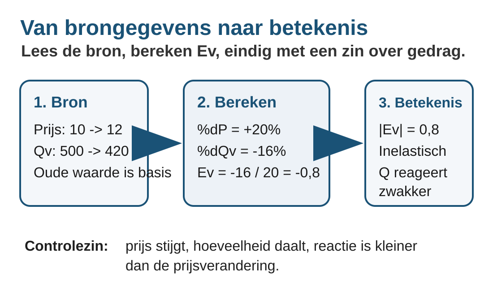
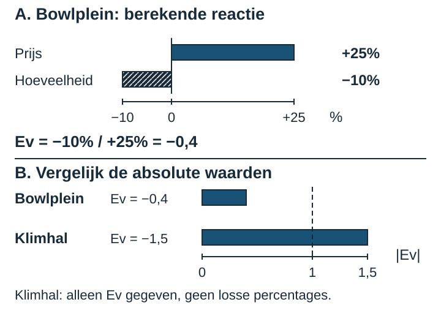

# 2.2.1 Prijselasticiteit

### Waarom reageren klanten niet even sterk?

Twee aanbieders verhogen hun prijs met 10%. Bij de ene daalt de gevraagde
hoeveelheid maar een beetje; bij de andere is de terugval veel groter.
Alleen zeggen dat de vraag daalt, vertelt dus nog niet hoe prijsgevoelig
klanten zijn. Hoe vergelijk je die reacties als de aanbieders bovendien
verschillende producten en aantallen verkopen?

De **prijselasticiteit van de vraag**, afgekort **Ev**, vergelijkt de
procentuele verandering van de gevraagde hoeveelheid met de procentuele
verandering van de eigen prijs. Je leert die verhouding berekenen, lezen en
voorzichtig verklaren. Bij de doeloefening vergelijk je een bioscoop met een
streamingdienst.

### Na deze paragraaf kun je

1. Je kunt procentuele prijs- en hoeveelheidsveranderingen met de oude waarde als noemer berekenen.
2. Je kunt Ev inclusief het teken berekenen.
3. Je kunt vraag met |Ev| classificeren als prijselastisch of prijsinelastisch.
4. Je kunt verschillen in prijsgevoeligheid met contextgegevens verklaren zonder verder te gaan dan de gegevens.

### Eerst de juiste veranderingen

Uit Boek 1 ken je de procentuele verandering: **(nieuw − oud) / oud × 100%**.
Een prijs van € 10 naar € 11 stijgt met € 1. Ten opzichte van de oude € 10
is dat +10%. Deel je door de nieuwe € 11, dan beantwoord je een andere vraag.
Bewaar ook het teken: nieuw min oud levert bij een daling een negatief getal op.

Bekijk twee fictieve aanbieders. Bij elk verandert alleen de eigen prijs;
andere omstandigheden, zoals de voorkeuren van klanten, blijven gelijk.
Dat noemen we **ceteris paribus**. We vergelijken hoeveel er in één week
gevraagd wordt. Een fruitbox is één doos fruit; de oefenruimte wordt per uur
verhuurd. De aantallen zijn daarom niet rechtstreeks vergelijkbaar, maar
hun procentuele veranderingen wel.

<table style="break-inside:avoid">
<colgroup>
<col style="width:43%">
<col style="width:17%">
<col style="width:17%">
<col style="width:23%">
</colgroup>
<thead><tr><th>Aanbieder en gegeven</th><th>Oud</th><th>Nieuw</th><th>Verandering</th></tr></thead>
<tbody>
<tr><td>Fruitbox: prijs per doos</td><td>€ 10</td><td>€ 11</td><td>+10%</td></tr>
<tr><td>Fruitbox: dozen per week</td><td>100</td><td>95</td><td>−5%</td></tr>
<tr><td>Oefenruimte: prijs per uur</td><td>€ 10</td><td>€ 11</td><td>+10%</td></tr>
<tr><td>Oefenruimte: uren per week</td><td>100</td><td>80</td><td>−20%</td></tr>
</tbody></table>

Voor de fruitbox is %ΔQv = (95 − 100) / 100 × 100% = −5%.
Voor de oefenruimte is dat (80 − 100) / 100 × 100% = −20%.
Beide prijsveranderingen zijn (11 − 10) / 10 × 100% = +10%.
De figuur zet deze percentages op **dezelfde schaal**: rechts van nul is een
toename, links een afname. De hoeveelheidsreactie is niet even groot.

### Van twee percentages naar één verhouding

De letter Δ betekent verandering. Qv staat voor de gevraagde hoeveelheid en
P voor de eigen prijs. Zet de hoeveelheidsverandering bovenaan:

> **Prijselasticiteit van de vraag**
>
> **Ev = %ΔQv / %ΔP**
>
> Gebruik voor beide percentages de oude waarde als noemer. De oude prijs en
> hoeveelheid moeten positief zijn; de prijsverandering mag niet nul zijn.
> We bekijken de reactie op de eigen prijs bij gelijkblijvende andere
> omstandigheden. De uitkomst geldt voor deze waarneming, niet automatisch
> voor elke toekomstige prijs of periode.

Voor de fruitbox is Ev = −5% / +10% = **−0,5**.
Voor de oefenruimte is Ev = −20% / +10% = **−2**.
Er staat geen %-teken of euroteken achter Ev: je deelt twee percentages en
krijgt een verhouding zonder eenheid. Draai de breuk niet om.

Het **minteken** zegt dat prijs en gevraagde hoeveelheid in tegengestelde
richting bewegen. Hier stijgt de prijs en daalt de hoeveelheid. Bij een
prijsdaling en een toename van de gevraagde hoeveelheid is Ev ook negatief:
dan deel je een positief hoeveelheidspercentage door een negatief
prijspercentage. Het teken alleen vertelt dus niet hoe sterk de reactie is.

### De grootte bepaalt de prijsgevoeligheid

Voor de grootte gebruik je de **absolute waarde**, geschreven als |Ev|.
Dat is de afstand tot nul: |−0,5| = 0,5 en |−2| = 2.
Vergelijk die grootte met **1**, niet het negatieve getal zelf.

- **|Ev| < 1: prijsinelastische vraag.** De gevraagde hoeveelheid verandert
  procentueel minder sterk dan de prijs. De fruitbox heeft |Ev| = 0,5: een
  daling van 5% is in absolute waarde half zo groot als de prijsstijging van 10%.
- **|Ev| > 1: prijselastische vraag.** De gevraagde hoeveelheid verandert
  procentueel sterker dan de prijs. De oefenruimte heeft |Ev| = 2: de daling
  van 20% is in absolute waarde tweemaal zo groot als de prijsstijging van 10%.

Bij precies |Ev| = 1 zijn de procentuele veranderingen even groot in absolute
waarde: dat is de grens tussen deze twee gevallen. “Inelastisch” betekent
**niet** dat de hoeveelheid onveranderd blijft. De fruitbox daalt wel degelijk
in gevraagde hoeveelheid, alleen relatief minder sterk dan de prijs stijgt.

De figuren vergelijken percentages en verhoudingen, geen hellingen van
vraaglijnen. Uit het getal −2 lees je hier: de procentuele hoeveelheidsreactie
is tweemaal zo groot als de procentuele prijsverandering, met tegengestelde
richting. Je mag niet zonder extra informatie voorspellen dat dit bij elke
volgende prijsverandering zo blijft.

### Een verklaring is nog geen bewijs

Waarom zouden gebruikers van de oefenruimte sterker reageren? Misschien
kunnen zij makkelijk uitwijken naar een andere ruimte, of hun repetitie
uitstellen. Direct vergelijkbare **substituten** vervullen dezelfde behoefte.
Hoe makkelijker klanten kunnen uitwijken, hoe plausibeler een sterke reactie
op een prijsstijging is. Voor sommige fruitboxklanten is een ander verkooppunt
misschien minder gemakkelijk bereikbaar.

Dit zijn mogelijke contextverklaringen, geen conclusies die de vier
waarnemingen bewijzen. Een zorgvuldig antwoord verbindt een concrete
mogelijkheid met een reactie: “Er zijn misschien meer nabije alternatieven,
waardoor klanten makkelijker overstappen.” Alleen “de klanten zijn anders”
legt het mechanisme nog niet uit. Blijf bij de eigen prijs en de gegeven
situatie; voor deze vergelijking heb je geen andere elasticiteitssoort nodig.

## Uitgewerkt voorbeeld

### Bowlplein: de hele aanpak

Bowlplein verhoogt de prijs van één bowlingsessie van € 8 naar € 10.
De gevraagde hoeveelheid daalt van 200 naar 180 sessies per week. Andere
omstandigheden blijven gelijk. Een klimhal heeft bij een andere prijsverhoging
Ev = −1,5 gemeten. Hoe prijsgevoelig zijn beide groepen klanten?

**Stap 1 — Noteer de waarnemingen.** Bij Bowlplein is de oude prijs € 8 en de
nieuwe prijs € 10 per sessie. De oude hoeveelheid is 200 en de nieuwe 180
sessies per week. Houd prijs en hoeveelheid, oud en nieuw, uit elkaar.

**Stap 2 — Bereken de procentuele veranderingen met teken.** Begin met de
hoeveelheid en gebruik voor elke berekening de eigen oude waarde:

- %ΔQv = (180 − 200) / 200 × 100% = −10%.
- %ΔP = (10 − 8) / 8 × 100% = +25%.

{width=85%}

**Stap 3 — Deel de hoeveelheidsverandering door de prijsverandering.**
Ev = %ΔQv / %ΔP = −10% / +25% = **−0,4**. Ev heeft geen eenheid en is geen
percentage. Het minteken klopt: prijs omhoog, gevraagde hoeveelheid omlaag.

**Stap 4 — Classificeer met de absolute waarde.** |−0,4| = 0,4 < 1, dus de
vraag bij Bowlplein is **prijsinelastisch**. Voor de klimhal is |−1,5| = 1,5 > 1:
**prijselastisch**. In deze waarnemingen is de klimhal prijsgevoeliger.

**Stap 5 — Geef richting, betekenis en een begrensde verklaring.** Bij Bowlplein
daalt de gevraagde hoeveelheid procentueel minder dan de prijs stijgt:
10% tegenover 25%. Bij de klimhal is de procentuele hoeveelheidsreactie juist
groter dan de procentuele prijsverandering. Misschien hebben klimklanten meer
direct vergelijkbare alternatieven. Dat zou een sterkere reactie kunnen
verklaren; deze cijfers bewijzen die oorzaak niet.

> **Onthouden**
>
> - Gebruik bij procentuele veranderingen steeds de **oude waarde** als noemer.
> - Ev = %ΔQv / %ΔP; bewaar het teken en zet geen %-teken achter Ev.
> - Vergelijk |Ev| met 1: kleiner is prijsinelastisch, groter is prijselastisch.
> - Verklaar het resultaat voor dit product en deze prijsverandering; een
>   plausibele oorzaak is nog geen bewezen oorzaak.
> - In §2.2.2 verbind je deze reacties met de totale opbrengst (TO).

## Startopgaven

Korte route: Startopgaven → Zelfstandige oefening → Doeloefening. Extra hulp nodig? Maak eerst Begeleide inoefening.

Maak deze twee korte checks in ongeveer 5½ minuut. Controleer daarna je werk
met het antwoordmodel. Lukt vooral de oude noemer of het teken nog niet, gebruik
dan de gedrukte herinnering bij opgave 3 en bespreek een nieuwe berekening met
je docent. Een fout hier is een aanwijzing om te oefenen, geen eindbeoordeling.

**Opgave 1**

a\) Een fietsbel kost eerst €20 en daarna €22. Bereken de procentuele verandering.

b\) De wekelijkse afzet daalt van 200 naar 180 fietsbelletjes. Bereken de procentuele verandering.

c\) Een klant kan naar het werk met een leenfiets of met de bus. Waarom kunnen dit substituten zijn? Als alleen de eigen prijs van de leenfiets stijgt, gaat het dan om de eigen prijs of een andere vraagfactor?

**Opgave 2**

Een leerling noemt Ev=−2 prijsinelastisch, omdat −2 kleiner is dan 1. Verbeter de redenering en vergelijk met Ev=−0,5.

## Begeleide inoefening

Dit is de extra hulproute van ongeveer 10 minuten. Die komt boven op de kern;
spreek zo nodig vervolgwerktijd of huiswerk af. Heb je deze hulp niet nodig? Ga dan verder met Zelfstandige oefening.

**Opgave 3**

Een fietsenmaker verandert de prijs van een reparatieafspraak. De overige
omstandigheden blijven gelijk.

<table style="break-inside:avoid">
<colgroup>
<col style="width:50%">
<col style="width:25%">
<col style="width:25%">
</colgroup>
<thead><tr><th>Gegeven</th><th>Oud</th><th>Nieuw</th></tr></thead>
<tbody>
<tr><td>Prijs per afspraak</td><td>€ 20</td><td>€ 22</td></tr>
<tr><td>Gevraagde afspraken per week</td><td>100</td><td>95</td></tr>
</tbody></table>

> **Herinnering: procentuele verandering**
>
> 1. Noteer de oude en de nieuwe waarde, met dezelfde eenheid.
> 2. Bereken het verschil: nieuw − oud.
> 3. Deel dat verschil door **oud** en vermenigvuldig met 100%.
> 4. Controleer het teken: een afname is negatief, een toename positief.
>
> %ΔQv = (Qv nieuw − Qv oud) / Qv oud × 100%.
> %ΔP = (P nieuw − P oud) / P oud × 100%.

De eerste berekening is voorgedaan:
%ΔQv = (95 − 100) / 100 × 100% = −5%.

a\) Bereken nu %ΔP. Laat de oude noemer zien.

b\) Vul in en bereken: Ev = %ΔQv / %ΔP = −5% / … = … .

c\) Classificeer met |Ev|. Leg uit wat de uitkomst betekent voor de reactie
van de gevraagde hoeveelheid op deze prijsverhoging.

**Opgave 4**

Een arcadehal en een zwembad veranderen elk hun eigen prijs. Het zijn twee
afzonderlijke situaties in dezelfde week; bij elk blijven de overige
omstandigheden gelijk.

<table style="break-inside:avoid">
<colgroup>
<col style="width:50%">
<col style="width:25%">
<col style="width:25%">
</colgroup>
<thead><tr><th>Gegeven</th><th>Arcadehal</th><th>Zwembad</th></tr></thead>
<tbody>
<tr><td>Oude → nieuwe prijs per bezoek</td><td>€ 5 → € 6</td><td>€ 5 → € 4</td></tr>
<tr><td>Oude → nieuwe gevraagde bezoeken per week</td><td>200 → 140</td><td>200 → 220</td></tr>
</tbody></table>

Vergelijk procentuele reacties, niet aantallen.

a\) Bereken voor de arcadehal beide procentuele veranderingen en Ev.
Classificeer de vraag en geef de betekenis in gewone taal.

b\) Doe hetzelfde voor het zwembad.

c\) Vergelijk de prijsgevoeligheid van beide groepen bezoekers.

d\) Weerleg de uitspraak: “Een even grote procentuele prijsverandering in
absolute waarde betekent altijd dezelfde prijsgevoeligheid.” Geef ook één
plausibele verklaring voor het verschil tussen deze twee situaties.

## Zelfstandige oefening

Werk zonder hulp of antwoordmodel. Noteer je berekeningen en onderbouw elke
conclusie. Richttijd: 11 minuten.

**Opgave 5**

Skatehal verhoogt de toegangsprijs van € 10 naar € 12. De gevraagde hoeveelheid
daalt van 400 naar 280 bezoeken per week. De overige omstandigheden blijven
gelijk. Bij Podiumhuis is bij een andere prijsverhoging Ev = −0,6 gemeten.

a\) Bereken voor Skatehal de procentuele verandering van de gevraagde
hoeveelheid, de procentuele prijsverandering en Ev, inclusief het teken.

b\) Classificeer de vraag naar bezoeken aan Skatehal. Leg in gewone taal uit
wat de gevonden Ev betekent.

c\) Classificeer de vraag bij Podiumhuis en vergelijk de prijsgevoeligheid
met die bij Skatehal.

d\) Geef één plausibele contextverklaring voor het verschil in prijsgevoeligheid.
Leg ook uit wat de cijfers niet bewijzen over die verklaring.

## Doeloefening

Werk zelfstandig. Richttijd: 9 minuten. Totaal: 9 punten.

**Opgave 6**

Bioscoop Nova verhoogt de ticketprijs van €10 naar €12; de gevraagde hoeveelheid daalt van 500 naar 420 tickets per week. Bij StreamNow is voor een andere prijsverhoging Ev=−2 gemeten. Gebruik voor Nova de oude waarde als noemer en Ev=%ΔQv/%ΔP.

a\) **(3 punten)** Bereken voor Bioscoop Nova de procentuele prijsverandering, de procentuele verandering van de gevraagde hoeveelheid en Ev.

b\) **(2 punten)** Classificeer de vraag naar bioscoopkaartjes met |Ev| en leg in gewone taal uit wat Ev=−0,8 betekent.

c\) **(2 punten)** Classificeer de vraag naar StreamNow met Ev=−2 en vergelijk de prijsgevoeligheid met die van Bioscoop Nova.

d\) **(2 punten)** Geef één plausibele contextverklaring voor het verschil in prijsgevoeligheid. Baseer je verklaring niet op een andere elasticiteitssoort.

## Denkertje / Bonusopgave

**Opgave 7**

Een ondernemer zegt na een meting: “Deze Ev blijft volgend jaar bij elke
prijs gelijk.” Beoordeel deze uitspraak. Leg uit wat één waargenomen
prijsverandering wel laat zien en wat niet. Beschrijf daarbij een plausibele
verandering in de beschikbare alternatieven voor klanten.

Dit denkertje valt buiten de kernroute. Richttijd: 8 minuten.

## Herhaling / Herhaling en interleaving

Deze herhaling valt buiten de kernroute en kan als huiswerk. Richttijd samen:
5 minuten.

**Opgave 8**

Een prijs stijgt van € 20 naar € 25 en daalt daarna weer naar € 20.
Bereken beide procentuele veranderingen. Waarom zijn de percentages in
absolute waarde niet gelijk, hoewel het euroverschil wel gelijk is?

**Opgave 9**

Een klant kan met een paraplu of een regenjas droog blijven. Vergelijk twee
afzonderlijke veranderingen voor de vraag naar paraplu's:

a\) Alleen de eigen prijs van paraplu's stijgt. Is dit een beweging langs de
vraaglijn of een verschuiving ervan? Licht toe.

b\) Alleen de prijs van regenjassen daalt. Is dit een beweging langs de vraaglijn
naar paraplu's of een verschuiving ervan? Geef ook de richting en je verklaring.
Neem aan dat beide producten voor deze klanten substituten zijn en dat de
overige omstandigheden gelijk blijven.

