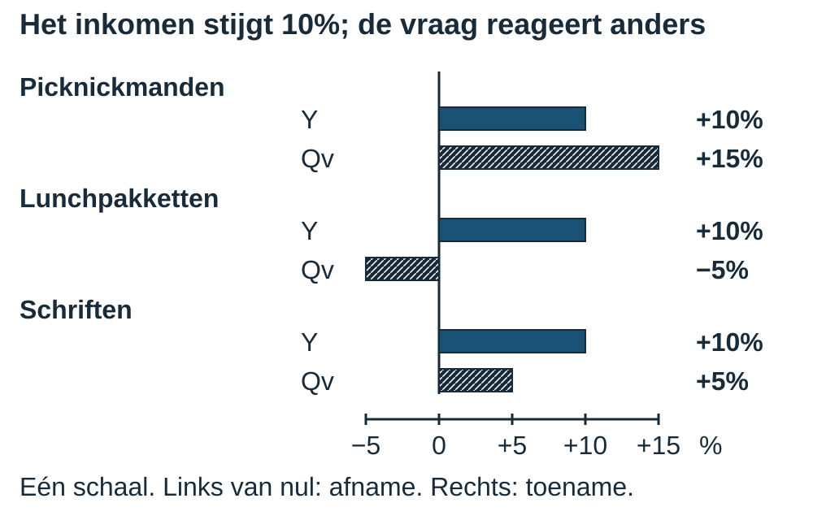
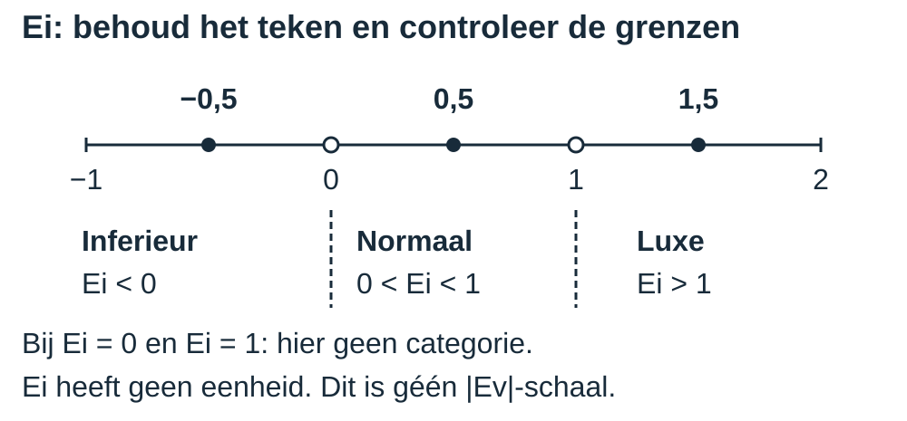
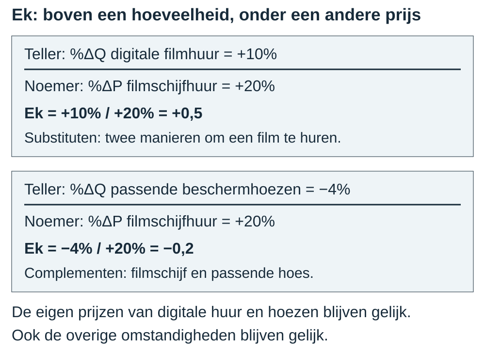
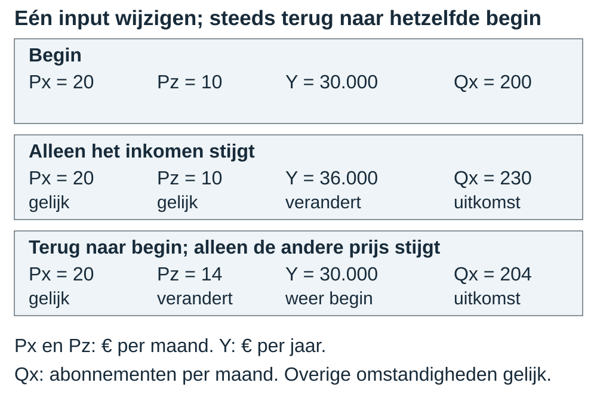

# 2.2.3 Inkomenselasticiteit en kruislingse elasticiteit

### Dezelfde eigen prijs, toch een andere vraag

De prijs van een product blijft gelijk. Toch willen klanten een ander aantal
kopen. Misschien is hun inkomen gestegen. Of een alternatief product is duurder
geworden. Beide veranderingen kunnen de vraag beïnvloeden, maar ze zijn niet
hetzelfde. Met welk percentage vergelijk je de hoeveelheidsreactie?

In §2.2.1 vergeleek je de vraag met de **eigen prijs**. Hier houd je die prijs
vast en onderzoek je twee andere invloeden: inkomen en de prijs van een ander
goed. Daarna gebruik je een vraagfunctie waarin die factoren apart staan.

### Na deze paragraaf kun je

1. Je kunt Ei berekenen en een goed classificeren als inferieur goed, normaal goed of luxegoed.
2. Je kunt Ek berekenen, beide goederen noemen en substituten of complementen herkennen.
3. Je kunt een vraagfunctie met meerdere variabelen gebruiken terwijl de overige variabelen gelijk blijven.
4. Je kunt uit twee functie-uitkomsten afleiden hoe één veranderde variabele samenhangt met Q terwijl de andere variabelen gelijk blijven.

### Eerst de juiste vergelijking

> **Herinnering: percentages en vraagfactoren**
>
> Uit §2.2.1: procentuele verandering = `(nieuw−oud)/oud× 100%`.
> Bewaar het teken; deel door de eigen oude waarde. Een elasticiteit deelt
> twee percentages en heeft daarom geen eenheid.
>
> Uit Boek 1: substituten vervangen elkaar in gebruik; complementen gebruik
> je samen. Inkomen en de prijs van een ander goed zijn andere vraagfactoren
> dan de eigen prijs. Bij gelijkblijvende eigen prijs kan de vraag toch veranderen.

We vergelijken steeds één verandering terwijl andere omstandigheden gelijk
blijven: **ceteris paribus**. De oude hoeveelheid en de oude waarde in de
noemer moeten positief zijn. De procentuele verandering in die noemer mag
niet nul zijn: delen door nul kan niet.

### Inkomenselasticiteit: het inkomen is de noemer

Stel dat het gemiddelde jaarinkomen in een fictieve plaats 10% stijgt.
De prijzen en andere omstandigheden blijven gelijk. De gevraagde aantallen
reageren niet allemaal hetzelfde:

<table style="break-inside:avoid">
<colgroup>
<col style="width:38%">
<col style="width:14%">
<col style="width:15%">
<col style="width:33%">
</colgroup>
<thead><tr><th>Goed</th><th>%ΔY</th><th>%ΔQv</th><th>Ei=%ΔQv/%ΔY</th></tr></thead>
<tbody>
<tr><td>Luxe picknickmanden</td><td>+10%</td><td>+15%</td><td>+15%/+10%=1,5</td></tr>
<tr><td>Eenvoudige lunchpakketten</td><td>+10%</td><td>−5%</td><td>−5%/+10%=−0,5</td></tr>
<tr><td>Schriften</td><td>+10%</td><td>+5%</td><td>+5%/+10%=0,5</td></tr>
</tbody></table>

> **Definitie: inkomenselasticiteit (Ei)**
>
> De verhouding tussen de procentuele verandering van de gevraagde hoeveelheid
> en de procentuele verandering van het inkomen, bij gelijkblijvende andere factoren.
> **Ei = %ΔQv / %ΔY**. Y is inkomen; niet de eigen prijs.

De figuur zet de percentages naast elkaar op dezelfde schaal. Rechts van nul
is een stijging, links een daling. Het inkomen stijgt steeds 10%, maar de
gevraagde hoeveelheden veranderen verschillend.

### Eerst het teken, dan de categorie

We gebruiken hier drie categorieën. Een goed krijgt een categorie op grond
van **deze inkomensverandering en reactie**, niet omdat zijn naam dat bepaalt.

> **Definitie: inferieur goed**
>
> Een goed met Ei<0: inkomen en gevraagde hoeveelheid veranderen in tegengestelde
> richting. Hier daalt de vraag naar eenvoudige lunchpakketten bij meer inkomen.

> **Definitie: normaal goed**
>
> In deze driecategorieënindeling: een goed met 0<Ei<1. De vraag verandert in
> dezelfde richting, maar procentueel minder sterk dan het inkomen. Schriften
> geven hier Ei=0,5: 5% extra vraag bij 10% extra inkomen.

> **Definitie: luxegoed**
>
> Een goed met Ei>1. De vraag verandert in dezelfde richting en procentueel
> sterker dan het inkomen. Picknickmanden geven hier Ei=1,5: 15% bij 10%.

Bij **Ei=0** en **Ei=1** kennen we hier geen categorie toe: het zijn
grenswaarden. De bredere omschrijving van een normaal goed die je in Boek 1
tegenkwam, is nog niet deze formele driecategorieënindeling.

{alt="Ei-schaal: inferieur bij Ei<0, normaal bij 0<Ei<1 en luxe bij Ei>1; open grenspunten 0 en 1 zonder categorie."}

> **Let op - teken niet wegpoetsen**
>
> **Fout:** “Ei=−0,5 is normaal, want de grootte is kleiner dan 1.”
> **Goed:** Ei<0 betekent inferieur. De absolute-waarderegel voor Ev uit §2.2.1
> geldt niet voor deze Ei-indeling. Dat maakt de verwarring verleidelijk.

“Inferieur” is geen oordeel over kwaliteit of over de koper. Ook zegt de
indeling niet of een goed maatschappelijk noodzakelijk is. We benoemen alleen
de inkomensreactie in de onderzochte situatie.

### Kruislingse elasticiteit: twee verschillende goederen

Je kunt een film digitaal huren of op een fysieke schijf. Wat als alleen
de huurprijs van filmschijven stijgt? Digitale huur kan een alternatief zijn.
Een beschermhoes voor zo'n filmschijf wordt juist samen met die schijf gebruikt.

In een fictieve vergelijking stijgt de huurprijs van filmschijven 20%.
De vraag naar digitale filmhuur stijgt 10%; de vraag naar beschermhoezen voor
filmschijven daalt 4%. De eigen prijzen van digitale huur en hoezen blijven
gelijk, net als andere omstandigheden.

> **Definitie: kruislingse elasticiteit (Ek)**
>
> De verhouding tussen de procentuele verandering van de gevraagde hoeveelheid
> van goed X en de procentuele prijsverandering van **een ander goed Z**.
> **Ek = %ΔQv van X / %ΔP van Z**. Noem altijd beide goederen.

<table style="break-inside:avoid">
<colgroup>
<col style="width:30%">
<col style="width:28%">
<col style="width:21%">
<col style="width:21%">
</colgroup>
<thead><tr><th>Teller: hoeveelheid van…</th><th>Noemer: prijs van…</th><th>Ek</th><th>Relatie in deze vergelijking</th></tr></thead>
<tbody>
<tr><td>Digitale filmhuur: +10%</td><td>Filmschijfhuur: +20%</td><td>+10%/+20%=+0,5</td><td>Substituten</td></tr>
<tr><td>Passende beschermhoezen: −4%</td><td>Filmschijfhuur: +20%</td><td>−4%/+20%=−0,2</td><td>Complementen</td></tr>
</tbody></table>

**Een positieve Ek wijst hier op substituten.** Als de filmschijfhuur duurder
wordt, kiezen meer klanten digitale huur. De twee goederen kunnen elkaar
vervangen. **Een negatieve Ek wijst hier op complementen.** Minder huur van
filmschijven gaat samen met minder vraag naar passende hoezen.

> **Let op - van welk goed is de prijs?**
>
> **Fout:** “Bij Ek hoort de eigen prijs van het goed boven de breuk.”
> **Goed:** Boven staat Q van X, onder P van een ander goed Z. Bij Ev ging het
> wél om de eigen prijs. Schrijf daarom de twee goederennamen bij Ek.

De uitkomsten gelden voor deze veranderingen onder de genoemde voorwaarden.
Losse waarnemingen bewijzen niet vanzelf dat de andere prijs de oorzaak is:
ook andere factoren kunnen veranderd zijn. Daarom houden onze vergelijkingen
die andere factoren expliciet gelijk.

### Een vraagfunctie met meerdere inputs

Een vraagfunctie kan de eigen prijs, een andere prijs en het inkomen bevatten.
Bijvoorbeeld **Qx=80−2Px+Pz+0,005Y** voor tekenlesabonnementen X en een
concurrerende digitale tekendienst Z. Gebruik dit model alleen bij de
gegeven positieve prijzen/inkomens en niet-negatieve vraaguitkomsten.

- Qx: aantal gevraagde abonnementen per maand.
- Px: eigen maandprijs in euro; Pz: maandprijs van dienst Z in euro.
- Y: gemiddeld **jaarinkomen** in euro.

De coëfficiënten horen bij deze eenheden. De term 0,005Y levert een bijdrage
aan abonnementen per maand wanneer je het **jaarinkomen** in euro invult.
Je deelt Y dus niet door 12. Ook is 0,005 niet de inkomenselasticiteit: daarvoor
moet je de procentuele verandering van de **hele Qx** met %ΔY vergelijken.

> **Herinnering: een formule invullen**
>
> Uit Boek 1 §1.2.3: vervang elke variabele, bereken eerst de producten en tel
> de termen daarna op. Bij Q=60−2P en P=5 krijg je Q=60−10=50 stuks per week.
> Noteer de eenheid van je uitkomst.

Vergelijk steeds met een duidelijk gekozen beginsituatie. Verandert alleen Y,
dan blijven Px en Pz gelijk. Verandert in een afzonderlijke vergelijking alleen
Pz, dan zet je Y terug op zijn oude waarde en houd je Px vast. Het uitgewerkte
voorbeeld laat de getallen en de drie scenario's naast elkaar zien.

> **Let op - niet twee invloeden aan één toeschrijven**
>
> **Fout:** “Y en Pz veranderen samen, dus de hele Q-stijging is het inkomenseffect.”
> **Goed:** Vergelijk voor het afzonderlijke inkomenseffect twee situaties met
> dezelfde Px en Pz. Een gecombineerde verandering is een andere vergelijking.

## Uitgewerkt voorbeeld

### 1. Het inkomen verandert

In een fictief onderzoek stijgt het gemiddelde inkomen 10%. De vraag naar
ambachtelijke chocolade stijgt 15%; die naar instantsoep daalt 5%. De overige
omstandigheden blijven gelijk.

**Kies en bereken.** De noemer is de inkomensverandering. Voor chocolade:
Ei=%ΔQv/%ΔY=+15%/+10%=**1,5**. Voor instantsoep:
Ei=−5%/+10%=**−0,5**. De elasticiteiten hebben geen eenheid.

**Classificeer en verklaar.** Chocolade is in deze waarneming een luxegoed:
1,5>1, dus de vraag stijgt procentueel sterker dan het inkomen. Instantsoep is
hier een inferieur goed: Ei<0, dus inkomen en vraag veranderen in tegengestelde
richting. Dit zijn uitkomsten van deze vergelijking, geen vaste eigenschappen
van alle chocolade of soep.

### 2. De prijs van een ander goed verandert

De prijs van papieren boeken stijgt 20%. De vraag naar e-books stijgt 10%; die
naar passende kaften voor deze papieren boeken daalt 5%. Andere omstandigheden
blijven gelijk.

**Noem eerst beide goederen.** Bij e-books staat de verandering van hun
gevraagde hoeveelheid in de teller. De prijsverandering van papieren boeken
staat in de noemer. Ek=+10%/+20%=**+0,5**. Positief: e-books en papieren boeken
zijn hier substituten. Lezers kunnen de ene leesvorm door de andere vervangen.

Bij de kaften is de teller de verandering van de vraag naar kaften. De noemer
blijft de prijsverandering van papieren boeken. Ek=−5%/+20%=**−0,25**. Negatief:
kaften en deze boeken zijn complementen. Wie minder van deze boeken vraagt,
heeft ook minder passende kaften nodig.

### 3. Eén input in een vraagfunctie veranderen

Voor tekenlesabonnementen X en een concurrerende digitale tekendienst Z geldt
het model **Qx=80−2Px+Pz+0,005Y**. Qx is het aantal gevraagde abonnementen per
maand; Px en Pz zijn maandprijzen in euro; Y is het gemiddelde jaarinkomen in
euro. Gebruik het model alleen voor de hier gegeven situaties. De overige
omstandigheden blijven gelijk.

We beginnen bij Px=20, Pz=10 en Y=30.000. Eerst stijgt alleen Y naar 36.000.
Daarna gaan we terug naar de beginsituatie en stijgt alleen Pz naar 14.

**Stap 1 - Noteer de inputs en bereken de beginsituatie.** Vervang iedere
variabele. Bereken eerst de producten, daarna de som:

Qx oud=80−2× 20+10+0,005× 30.000=80−40+10+150=**200 abonnementen per maand**.

**Stap 2 - Verander alleen Y.** Px=20 en Pz=10 blijven gelijk.
Qx nieuw=80−2× 20+10+0,005× 36.000=80−40+10+180=**230 abonnementen per maand**.

Dezelfde gegevens staan in drie losse rijen. Vergelijk iedere verandering
met de eerste rij, niet met de vorige verandering.

<table style="break-inside:avoid">
<colgroup>
<col style="width:28%">
<col style="width:14%">
<col style="width:14%">
<col style="width:19%">
<col style="width:25%">
</colgroup>
<thead><tr><th>Situatie</th><th>Px (€ per maand)</th><th>Pz (€ per maand)</th><th>Y (€ per jaar)</th><th>Qx (abonnementen per maand)</th></tr></thead>
<tbody>
<tr><td>Begin</td><td>20</td><td>10</td><td>30.000</td><td>200</td></tr>
<tr><td>Alleen Y hoger</td><td>20</td><td>10</td><td>36.000</td><td>230</td></tr>
<tr><td>Terug naar begin; alleen Pz hoger</td><td>20</td><td>14</td><td>30.000</td><td>204</td></tr>
</tbody></table>

{alt="Drie scenario's: beginsituatie, alleen hoger inkomen en terug naar dezelfde basis voor alleen een hogere andere prijs."}

**Stap 3 - Bereken de percentages en Ei.** Gebruik de eigen oude waarde
van iedere variabele:

- %ΔQx=(230−200)/200× 100%=**+15%**.
- %ΔY=(36.000−30.000)/30.000× 100%=**+20%**.
- Ei=%ΔQx/%ΔY=15%/20%=**0,75**.

**Stap 4 - Classificeer en geef de voorwaarden.** Omdat 0<Ei<1, is X hier een
normaal goed. Door het hogere inkomen stijgt de vraag met 30 abonnementen per
maand. Px=20 en Pz=10 blijven gelijk. De vraag stijgt procentueel minder dan Y.

**Stap 5 - Zet de andere inputs terug voor het nieuwe scenario.** Nu is Y
weer 30.000 en blijft Px=20. Alleen Pz stijgt van 10 naar 14:
Qx nieuw=80−2× 20+14+0,005× 30.000=80−40+14+150=**204 abonnementen per maand**.
Vergeleken met het oorspronkelijke 200 is dat 4 meer. Het verband tussen Pz en
Qx is positief in dit model; Px en Y blijven gelijk. Hier is geen Ek gevraagd.

> **Let op - opnieuw beginnen**
>
> **Fout:** “Ik laat Y=36.000 staan als alleen Pz verandert.”
> **Goed:** Zet Y terug op 30.000. Anders verander je twee inputs tegelijk en
> bereken je niet het gevraagde afzonderlijke effect.

> **Onthouden**
>
> - Gebruik `(nieuw−oud)/oud× 100%`. Oude Q, Y en P moeten positief zijn;
>   de procentuele noemerverandering mag niet nul zijn.
> - Ei=%ΔQv/%ΔY. Ei<0: inferieur; 0<Ei<1: normaal; Ei>1: luxe.
>   Bij Ei=0 of 1 geven we hier geen categorie. Elasticiteit heeft geen eenheid.
> - Ek=%ΔQv van X/%ΔP van Z: noem beide goederen. Positief: substituten;
>   negatief: complementen, bij gelijkblijvende andere factoren.
> - Vul een functie term voor term in. Verander alleen de genoemde input en
>   herstel de beginsituatie voordat je een afzonderlijk scenario berekent.
> - Noem richting én vaste variabelen. De conclusie geldt voor dit model en
>   deze verandering. In §2.2.4 kies je welke elasticiteit bij een bron past.

## Startopgaven

Korte route: Startopgaven → Zelfstandige oefening → Doeloefening. Extra hulp nodig? Maak eerst Begeleide inoefening.

Maak de twee korte checks en vergelijk daarna met het antwoordmodel. Een fout
helpt je kiezen wat je nog wilt oefenen; het is geen eindbeoordeling. Blijven
de oude noemer, het teken of het invullen lastig, gebruik dan de gedrukte
herinneringen en bespreek een nieuwe poging met je docent.

**Opgave 1**

a\) Een vulpen stijgt van €10 naar €12; de vraag daalt van 100 naar 90 pennen per
week. Bereken beide procentuele veranderingen en hun elasticiteitsverhouding.

b\) Voor potloden geldt Q=60−2P, met Q in stuks per week en P in euro per
potlood. Bereken Q bij P=8.

c\) Een vulpen en balpen kunnen dezelfde schrijfbehoefte vervullen. Een vulpen
gebruikt passende inktpatronen. Welk paar zijn substituten, welk complementen?
Welke eigen prijs houd je vast als je alleen de inktprijs verandert?

**Opgave 2**

a\) Y stijgt 10%; Q van navulbare schoolschriftomslagen daalt 2%. Bereken Ei en
classificeer het goed.

b\) De prijs van losse puzzels stijgt 10%; de vraag naar puzzelabonnementen
stijgt 5%. Bereken Ek, noem teller- en noemergoed en geef de relatie.

c\) Alleen Y verandert in Qx=a−bPx+cPz+dY. Welke twee prijzen blijven gelijk?

## Begeleide inoefening

Heb je deze hulp niet nodig? Ga dan verder met Zelfstandige oefening.
Deze extra opdrachten komen boven op de korte route. Spreek zo nodig
vervolgwerktijd of huiswerk af met je docent.

**Opgave 3**

In deze fictieve waarnemingen blijven steeds de overige omstandigheden gelijk.
Het inkomen stijgt 8%; de vraag naar premiumcacao stijgt 12%, die naar budgetcacao
daalt 4%. Afzonderlijk stijgt de prijs van een spelcomputer 20%. De vraag naar
draagbare spelapparaten stijgt 10%; die naar controllers die bij deze spelcomputer
passen daalt 8%.

> **Herinnering: procentuele verandering**
>
> Noteer oud en nieuw; bereken nieuw−oud; deel door oud en vermenigvuldig met 100%.
> Controleer het teken. Een afname is negatief. Zijn de percentages al gegeven,
> gebruik ze dan met hun teken in de juiste verhouding.

De eerste berekening is voorgedaan: Ei premiumcacao=12%/8%=1,5.
Omdat 1,5>1 is premiumcacao hier een luxegoed.

a\) Leg uit wat die classificatie zegt over de twee procentuele veranderingen.

b\) Bereken Ei voor budgetcacao en classificeer het goed.

c\) Bereken Ek voor draagbare spelapparaten ten opzichte van de spelcomputerprijs.
Teller: %ΔQ draagbaar apparaat. Noemer: %ΔP spelcomputer. Classificeer de relatie.

d\) Bereken Ek voor de passende controllers. Noem beide goederen bij de breuk
en leg uit welke relatie de uitkomst aangeeft.

**Opgave 4**

Voor naaicursusabonnementen X en een concurrerende handwerkcursus Z geldt
Qx=90−2Px+0,5Pz+0,005Y. Qx is abonnementen per maand; Px en Pz zijn maandprijzen
in euro; Y is gemiddeld jaarinkomen in euro. Begin: Px=20,Pz=20,Y=20.000.
Eerst stijgt alleen Y naar 24.000; de overige omstandigheden blijven gelijk.

De beginsituatie is uitgewerkt:
Qx oud=90−2× 20+0,5× 20+0,005× 20.000=90−40+10+100=160 abonnementen per maand.

a\) Vul de nieuwe Y-term in en bereken Qx nieuw:90−40+10+0,005× 24.000.

b\) Bereken `(180−160)/160× 100%` en `(24.000−20.000)/20.000× 100%`.
Bereken vervolgens Ei met de twee gevonden percentages.

c\) Classificeer X en maak de uitleg af: “Alleen … verandert, … en … blijven
gelijk. De gevraagde hoeveelheid … .”

d\) Zet Y terug op 20.000. Alleen Pz stijgt nu van 20 naar 24; Px blijft 20.
Bereken Qx. Geef de richting van het Pz–Qx-verband en noem de vaste inputs.

**Opgave 5**

Voor een keramiekcursus X en concurrerende beeldhouwcursus Z geldt
Qx=120−2Px+Pz+0,004Y. Qx is abonnementen per maand; Px en Pz zijn maandprijzen
in euro; Y is gemiddeld jaarinkomen in euro. Begin: Px=15,Pz=10,Y=25.000.
De overige omstandigheden blijven steeds gelijk.

a\) Bereken Qx in de beginsituatie en nadat alleen Y stijgt naar 30.000.

b\) Bereken beide procentuele veranderingen en Ei. Classificeer X en leg uit
wat met Qx gebeurt en welke variabelen gelijk blijven.

c\) Zet Y terug op 25.000. Bereken Qx nadat alleen Pz stijgt van 10 naar 15.
Leg uit welke richting het verband heeft en wat gelijk blijft.

## Zelfstandige oefening

Werk zonder hints of antwoordmodel. Laat je berekeningen en redenen zien.

**Opgave 6**

Een model voor de vraag naar kunstdrukken geeft onderstaande uitkomsten.
Y is gemiddeld jaarinkomen; Pz is de prijs van een concurrerende poster.
De eigen prijs Px en alle overige omstandigheden blijven constant. Iedere rij
is een afzonderlijke vergelijking met dezelfde beginsituatie.

<table style="break-inside:avoid">
<colgroup>
<col style="width:34%">
<col style="width:20%">
<col style="width:20%">
<col style="width:26%">
</colgroup>
<thead><tr><th>Situatie</th><th>Y (€ per jaar)</th><th>Pz (€ per poster)</th><th>Q (kunstdrukken per maand)</th></tr></thead>
<tbody>
<tr><td>Begin</td><td>30.000</td><td>20</td><td>200</td></tr>
<tr><td>Alleen inkomen verandert</td><td>33.000</td><td>20</td><td>210</td></tr>
<tr><td>Alleen posterprijs verandert</td><td>30.000</td><td>24</td><td>205</td></tr>
<tr><td>Inkomen en posterprijs veranderen</td><td>33.000</td><td>24</td><td>215</td></tr>
</tbody></table>

a\) Bekijk alleen de inkomensverandering. Wat gebeurt met Q? Welke prijzen
blijven gelijk?

b\) Bekijk alleen de posterprijsverandering. Wat gebeurt met Q? Welke andere
inputs blijven gelijk?

c\) Bekijk beide veranderingen tegelijk. Versterken de gegeven effecten elkaar
of werken ze tegen elkaar in? Welke twee inputs zijn nu niet meer gelijk?

d\) Weerleg: “215 in plaats van 200 bewijst de inkomensreactie, ook al verandert
de posterprijs tegelijk.” Welke vergelijking is wel geschikt voor alleen inkomen?

**Opgave 7**

Het inkomen stijgt 5%. De vraag naar begeleide wandeltochten stijgt 8%; die naar
goedkope papieren wandelroutes om zelf te volgen daalt 2%.

Afzonderlijk stijgt de prijs van een lantaarn op losse batterijen 10%. De vraag
naar oplaadbare lampen stijgt 3%; die naar batterijen die alleen in de eerste
lantaarn passen daalt 4%. In iedere vergelijking blijven andere omstandigheden gelijk.

a\) Bereken beide Ei-waarden en classificeer de twee goederen.

b\) Bereken beide Ek-waarden. Noem bij elke breuk teller- en noemergoed en
classificeer de twee relaties.

**Opgave 8**

Voor taalcursus X en concurrerende gesprekscursus Z geldt
Qx=90−2Px+Pz+0,005Y. Qx is het aantal gevraagde abonnementen per maand;
Px en Pz zijn maandprijzen in euro; Y is het gemiddelde jaarinkomen in euro.
Begin: Px=10,Pz=10,Y=20.000. De overige omstandigheden blijven gelijk.

a\) Bereken Qx in de beginsituatie en nadat alleen Y stijgt naar 24.000.

b\) Bereken %ΔQx, %ΔY en Ei. Classificeer taalcursus X.

c\) Leg uit wat met Qx gebeurt en welke variabelen gelijk blijven.

d\) Zet Y terug op 20.000. Bereken Qx nadat alleen Pz stijgt van 10 naar 14.
Leg uit welke richting het verband heeft en welke inputs gelijk blijven.

## Doeloefening

Werk zelfstandig. Totaal:16 punten.

**Opgave 9**

Gebruik steeds de oude waarde als noemer. Voor inkomenselasticiteit geldt Ei=%ΔQv/%ΔY. De drie gebruikte categorieën zijn: Ei<0 inferieur goed, 0<Ei<1 normaal goed en Ei>1 luxegoed; Ei=0 en Ei=1 zijn grenswaarden. Voor kruislingse elasticiteit geldt Ek=%ΔQv van goed X/%ΔP van een ander goed Z. Noem bij Ek altijd beide goederen.

**Bron inkomen**

Het gemiddelde inkomen stijgt 5%. De vraag naar maaltijdpakketten stijgt 8%; de vraag naar budgetnoedels daalt 3%.

**Bron koffie**

De koffieprijs stijgt 10%. De vraag naar thee stijgt 4%; de vraag naar koffiefilters daalt 6%.

**Bron functie**

Voor fitnessdienst X geldt Qx=100−2Px+0,5Pz+0,01Y. Qx is het aantal gevraagde abonnementen per maand, Px en Pz zijn maandprijzen in euro van fitnessdienst X en concurrerende sportdienst Z, en Y is het gemiddelde jaarinkomen in euro. Beginsituatie: Px=10, Pz=20 en Y=30.000.

a\) **(3 punten)** Bereken met bron inkomen Ei voor maaltijdpakketten en budgetnoedels.

b\) **(2 punten)** Classificeer beide goederen met de drie categorieën uit de context.

c\) **(4 punten)** Bereken met bron koffie Ek voor de vraag naar thee ten opzichte van de koffieprijs en voor de vraag naar koffiefilters ten opzichte van de koffieprijs. Noem teller- en noemergoed en classificeer de relaties.

d\) **(4 punten)** Bereken Qx in de beginsituatie en nadat alleen Y stijgt naar 33.000. Bereken daarna %ΔQx, Ei en classificeer fitnessdienst X. Leg uit wat met Qx gebeurt en welke variabelen gelijk blijven.

e\) **(3 punten)** Zet Y terug op 30.000. Bereken Qx nadat alleen Pz stijgt van 20 naar 24. Leg uit welke richting het verband tussen Pz en Qx heeft en welke variabelen gelijk blijven.

## Denkertje / Bonusopgave

**Opgave 10**

Een onderzoeker vindt voor een cursus Ei=0,75 en zegt: “Die elasticiteit blijft
bij ieder inkomen hetzelfde. Het getal vertelt bovendien of deze cursus
maatschappelijk noodzakelijk is.” Beoordeel beide uitspraken.

De prijs van een andere cursus is tegelijk veranderd. Beschrijf hoe je twee
inkomenssituaties eerlijk vergelijkt als je alleen het inkomenseffect wilt
onderzoeken. Je hoeft geen nieuwe getallen te verzinnen.

Dit denkertje valt buiten de korte route.

## Herhaling / Herhaling en interleaving

Deze twee korte opdrachten kunnen als huiswerk.

**Opgave 11**

De eigen prijs van paraplu's stijgt 10% en de gevraagde hoeveelheid daalt 5%.
Het inkomen verandert niet. Welke elasticiteit kun je hiermee berekenen?
Bereken die en leg uit waarom je geen Ei kunt berekenen.

**Opgave 12**

Voor reserveringen geldt Qx=40−2Px+Pz. Qx is reserveringen per week; Px en
Pz zijn prijzen in euro per reservering. Begin: Px=5,Pz=10. Alleen Pz stijgt
naar 12; de overige omstandigheden blijven gelijk. Bereken beide Qx-waarden
en noem de prijs die gelijk blijft.

