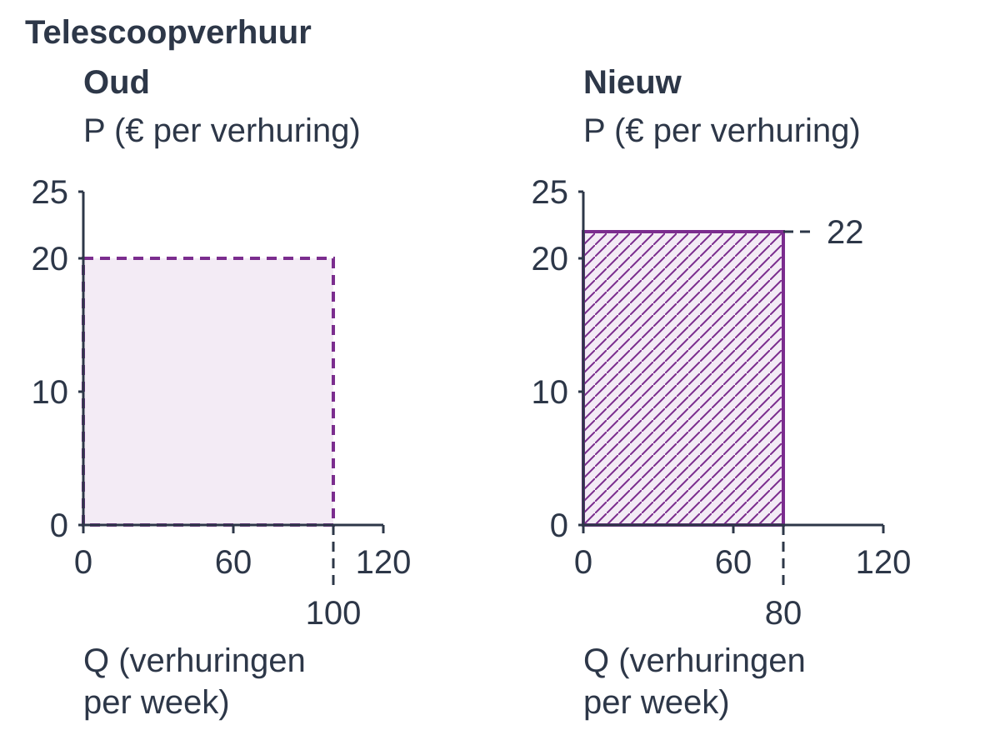
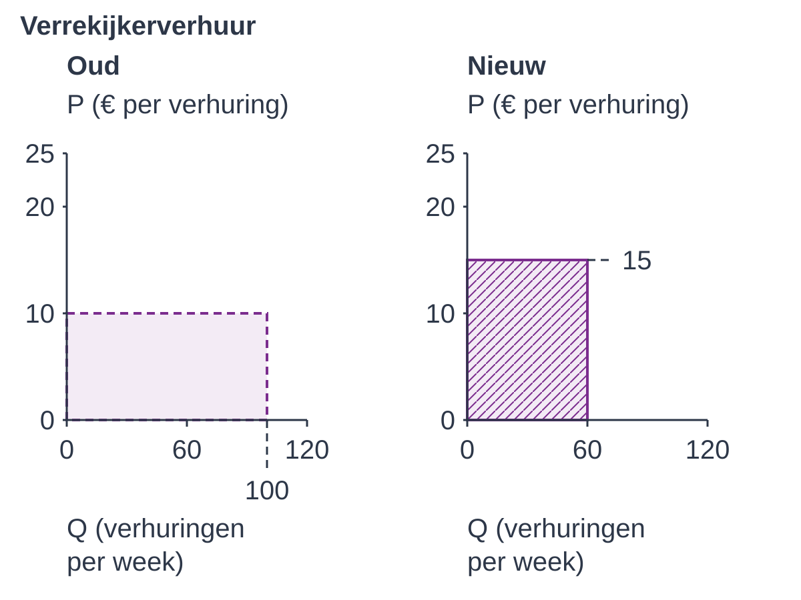

# 2.2.4 Gemengde opgaven elasticiteit – opgaven

## Aanpak en korte herinnering

In deze gemengde opgaven combineer je wat je in §§2.2.1–2.2.3 hebt geleerd.
Er komt geen nieuwe theorie bij. Je onderzoekt eerst Sterrenplek en past daarna
zelfstandig dezelfde handelingen toe op StreamPlus.

**Na het oefenen kun je dit:**

- Je kunt relevante tabelgegevens selecteren, Ev classificeren en uitleggen, en Ei en Ek berekenen en classificeren.
- Je kunt totale opbrengst vóór en na een prijsverandering vergelijken.
- Je kunt een vraagfunctie gebruiken als één variabele verandert en de andere variabelen gelijk blijven.
- Je kunt met meerdere bronnen een omzetadvies formuleren zonder verder te gaan dan de gegevens.

**Zo werk je.** Maak de zes vragen over Sterrenplek in je schrift. Vermeld bij
elke berekening je aanpak, de ingevulde getallen, de uitkomst met eenheid en
de betekenis. Geef bij een uitleg een standpunt, een reden en de gebruikte
bron of berekening. Lees bij een figuur eerst de oude en nieuwe situatie en
beide assen. Je hoeft geen grafiek opnieuw te tekenen.

**Haal terug wat je al weet.** Een procentuele verandering gebruikt de oude
waarde als basis. Het teken van Ev geeft de richting; voor de sterkte vergelijk
je |Ev| met 1. TO = P × Q. Ei vergelijkt een hoeveelheidsverandering met een
inkomensverandering. Ek vergelijkt de vraag naar het ene goed met de prijs van
een ander goed: noem beide goederen. Begin bij een afzonderlijke verandering
in een vraagfunctie opnieuw met de opgegeven beginsituatie en controleer wat
gelijk blijft.

De hulp bij het lezen van bronnen staat na de zes vragen. Iedereen mag die
gebruiken als het nodig is; probeer eerst zelf. Bij StreamPlus kies je de aanpak
zonder die hulp. Controleer daarna je antwoorden met het antwoordenboekje:
verbeter niet alleen de uitkomst, maar ook een ontbrekende reden of eenheid.
De bonus is een extra uitdaging. Sluit af met de twee herhalingsvragen.

## Opgave 1 — Sterrenplek

Sterrenplek verhuurt telescopen, verrekijkers en passende filters. Het bedrijf
onderzoekt verschillende prijs- en inkomensvergelijkingen. De bronnen A tot
en met D gaan over verhuur. Bron E beschrijft een afzonderlijk regionaal
abonnementenmodel; dat zijn niet de wekelijkse verhuuraantallen. Iedere bron
is een eigen vergelijking, geen volgende stap in één tijdlijn. Gebruik bij
iedere vraag de genoemde bron.

### Bron A — Telescoopverhuur

De figuur geeft de oude en nieuwe prijs en het aantal verhuringen per week.
Andere omstandigheden blijven gelijk. De servicebeoordeling is in beide
situaties 4,8 op 5.

{alt="Omzetrechthoeken van de telescoopverhuur: oude en nieuwe prijs en hoeveelheid."}

**Vraag 1 (4 punten).** Lees uit de figuur de oude en nieuwe P en Q af, met
eenheden. Bereken Ev, classificeer de vraag en leg uit wat de uitkomst over de
procentuele reactie zegt. Bereken vervolgens de procentuele verandering van
TO. Welk gegeven uit bron A heb je daarvoor niet nodig?

### Bron B — Verrekijkerverhuur

Voor een afzonderlijke prijsstap zijn hieronder beide situaties gegeven.
Andere omstandigheden blijven gelijk. De gemeten Ev over dit hele interval
is −0,8.

{alt="Omzetrechthoeken van de verrekijkerverhuur: oude en nieuwe prijs en hoeveelheid."}

**Vraag 2 (4 punten).** Vergelijk de richting van de omzetverandering in bron A
en bron B. Bereken voor B de oude en nieuwe TO en de procentuele verandering.
Vergelijk ook de prijselasticiteitscategorieën. Laat met de prijsfactor en
hoeveelheidsfactor zien hoe de omzet in B verandert.

De eigenaar zegt: “Bron B bewijst dat de regel voor een kleine prijsverandering
bij prijsinelastische vraag onjuist is.” Beoordeel deze uitspraak. Maak in je
uitleg onderscheid tussen de gemeten elasticiteit over het hele interval en
de voorwaardelijke regel voor een kleine lokale verandering.

### Bron C — Inkomen en telescoopsessies

In een onderzoek stijgt het gemiddelde jaarinkomen met 10%. De gevraagde
hoeveelheid telescoopsessies stijgt met 5%. Alle andere omstandigheden blijven
gelijk. Een onderzoeker legt daarnaast twee afzonderlijke grensgevallen voor:
een goed met Ei = 0 en een goed met Ei = 1.

**Vraag 3 (2 punten).** Bereken en classificeer Ei voor de telescoopsessies.
Leg uit waarom een positieve Ei niet voldoende is om van een luxegoed te
spreken. Geef ook aan of je in de hier gebruikte indeling aan Ei = 0 en Ei = 1
een categorie toekent.

### Bron D — Telescopen en passende filters

Deze vergelijking staat los van bron A. De prijs van een telescoopverhuring
stijgt hier van €20 naar €24. De vraag naar passende filterverhuringen daalt
van 200 naar 180 per week. De eigen prijs van de filterverhuringen en de overige
omstandigheden blijven gelijk.

**Vraag 4 (2 punten).** Selecteer de twee veranderingen die je nodig hebt voor
Ek van de vraag naar filterverhuringen ten opzichte van de prijs van
telescoopverhuringen. Bereken Ek. Leg met het teken en de namen van beide
goederen uit of het om substituten of complementen gaat.

### Bron E — Afzonderlijk regionaal abonnementenmodel

De regionale vraag naar een abonnement van Sterrenplek wordt beschreven door:

**Qx = 100 − 2Px + Pc + 0,005Y**

Qx is het aantal gevraagde abonnementen **per maand**. Px is de eigen maandprijs
en Pc de maandprijs van een concurrerend abonnement, beide in euro.
Y is het gemiddelde **jaarinkomen** in euro. De beginsituatie is Px = 10,
Pc = 20 en Y = 20.000. Het model gebruikt dus jaarinkomen, ook al is Qx een
maandhoeveelheid.

**Vraag 5 (6 punten).** Bereken Qx in de beginsituatie. Bereken daarna Qx als
alleen Y stijgt naar €24.000 per jaar. Bereken en classificeer Ei voor deze
inkomensvergelijking. Hoeveel abonnementen per maand verandert Qx, en welke
prijzen blijven gelijk?

Begin vervolgens opnieuw bij de beginsituatie. Bereken Qx als alleen Pc stijgt
naar €24 per maand. Vergelijk de uitkomst met de oorspronkelijke Qx en beschrijf
de richting van het verband tussen Pc en Qx. Noem wat in deze vergelijking
gelijk blijft.

**Vraag 6 (2 punten).** Vul in je schrift de vier richtingen in onderstaande
tabel in. De tabel gaat uitsluitend over de eerder geleerde voorwaardelijke
regel voor een **kleine lokale prijsverandering**, met de genoemde categorie
en overige omstandigheden gelijk.

<table>
<colgroup><col style="width:50%"><col style="width:25%"><col style="width:25%"></colgroup>
<thead><tr><th>Vraag</th><th>Eigen prijs</th><th>Richting TO</th></tr></thead>
<tbody>
<tr><td>Prijsinelastisch</td><td>Stijgt</td><td>…</td></tr>
<tr><td>Prijsinelastisch</td><td>Daalt</td><td>…</td></tr>
<tr><td>Prijselastisch</td><td>Stijgt</td><td>…</td></tr>
<tr><td>Prijselastisch</td><td>Daalt</td><td>…</td></tr>
</tbody></table>

Geef Sterrenplek vervolgens een voorzichtig omzetadvies met bron A **of** B
én bron D **of** E. Gebruik daadwerkelijk een uitkomst of verband uit beide
bronnen. Leg ook uit waarom een omzetuitkomst zonder kostengegevens nog geen
conclusie over winst oplevert.

## Hulp bij het lezen van bronnen (optioneel)

Gebruik alleen de hulp die je nodig hebt. Schrijf daarna zelf een volledig
antwoord. Deze hulp verandert de vragen en hun punten niet.

**Bij vraag 1.** Kijk in figuur 1 eerst naar “oud”, daarna naar “nieuw”.
Schrijf P oud, P nieuw, Q oud en Q nieuw op, elk met de eenheid van de as.
Gebruik voor een verandering: (nieuw − oud) / oud × 100%.
Voor Q krijg je zo (80 − 100) / 100 × 100% = −20%.
Vul nu zelf aan: procentuele verandering P = …; Ev = … / … = …;
TO oud = … × …; TO nieuw = … × ….

**Bij vraag 2.** Vergelijk de twee producten P × Q. Wat zegt een intervalmeting
wel en niet over de regel voor een kleine lokale verandering?

**Bij vraag 3.** Welke procentuele verandering hoort bij inkomen? Welke hoort
bij de gevraagde hoeveelheid? Kies de juiste noemer voordat je deelt.

**Bij vraag 4.** Vul eerst zonder getallen in: “vraag naar …” gedeeld door
“prijs van …”. Gebruik de prijs van het andere genoemde goed, niet de eigen
prijs van het goed waarvan je de vraag onderzoekt.

**Bij vraag 5.** Begin ieder afzonderlijk scenario opnieuw bij de eerste rij
van je berekening: de beginsituatie.

Bij vraag 6 en de volgende doeloefening kies je zelf de aanpak. In het
antwoordenboekje staan de volledige uitwerkingen en beoordelingscriteria.

## Doeloefening — StreamPlus

StreamPlus onderzoekt één recente prijsverhoging en mogelijke vervolgstappen. Gebruik bij vragen 1 tot en met 5 telkens alleen de aangegeven bron. Combineer bij vraag 6 minstens twee bronnen. De gemeten Ev in bron A is gegeven; de opgave combineert eerder onderwezen handelingen en introduceert geen nieuwe formule.

### Bron A

Tabel met oude en nieuwe prijs, aantal abonnees en appscore; de gemeten Ev is −0,7.

<table>
<colgroup><col style="width:50%"><col style="width:25%"><col style="width:25%"></colgroup>
<thead><tr><th>gegeven</th><th>oud</th><th>nieuw</th></tr></thead>
<tbody>
<tr><td>prijs Standaard</td><td>€10</td><td>€12</td></tr>
<tr><td>abonnees</td><td>50.000</td><td>43.000</td></tr>
<tr><td>appscore</td><td>4,6/5</td><td>4,6/5</td></tr>
</tbody></table>

### Bron B

Tabel met inkomens- en vraagverandering voor Premium en Budget.

<table>
<colgroup><col style="width:50%"><col style="width:25%"><col style="width:25%"></colgroup>
<thead><tr><th>verandering</th><th>Premium</th><th>Budget</th></tr></thead>
<tbody>
<tr><td>inkomen</td><td>+8%</td><td>+8%</td></tr>
<tr><td>gevraagde hoeveelheid</td><td>+15%</td><td>−4%</td></tr>
</tbody></table>

### Bron C

Tabel voor de kruislingse elasticiteit van StreamPlus ten opzichte van het concurrerende abonnement.

<table>
<colgroup><col style="width:50%"><col style="width:25%"><col style="width:25%"></colgroup>
<thead><tr><th>gegeven</th><th>oud</th><th>nieuw</th></tr></thead>
<tbody>
<tr><td>prijs concurrerend abonnement</td><td>€8</td><td>€9</td></tr>
<tr><td>vraag StreamPlus</td><td>basis</td><td>+5%</td></tr>
</tbody></table>

**Vraag 1 (2 punten).** Selecteer uit bron A de gegevens voor een controleberekening van Ev en noem het gegeven dat daarvoor niet nodig is.

**Vraag 2 (2 punten).** Classificeer met de gegeven Ev=−0,7 de vraag en leg in gewone taal uit hoe sterk Q procentueel reageert op een prijsverandering.

**Vraag 3 (2 punten).** Bereken met bron A TO vóór en na de prijsverhoging.

**Vraag 4 (4 punten).** Bereken en classificeer met bron B Ei voor Premium en Budget en met bron C Ek van de vraag naar StreamPlus ten opzichte van de prijs van het concurrerende abonnement. Noem bij Ek beide diensten.

### Bron D

Regionale vraagfunctie Q=12.000−400P+0,1Y+300Pc. Q is het aantal gevraagde abonnementen per maand, P en Pc zijn maandprijzen in euro en Y is het gemiddelde jaarinkomen in euro. Beginsituatie: P=12, Pc=10 en Y=40.000.

**Vraag 5 (2 punten).** Bereken met bron D Q in de beginsituatie en nadat alleen Y stijgt naar €42.000 per jaar. Noem welke variabelen gelijk blijven.

**Vraag 6 (2 punten).** Geef op basis van minstens twee bronnen een voorzichtig omzetadvies. Noem één conclusie die de bronnen ondersteunen en precies twee conclusies die zij niet bewijzen.

## Denkertje / Bonusopgave

**Extra uitdaging (4 punten).** Voor het model uit bron E zijn vier uitkomsten
gegeven. In alle vier de rijen blijft Px = €10 per maand.

<table>
<colgroup><col style="width:37%"><col style="width:23%"><col style="width:22%"><col style="width:18%"></colgroup>
<thead><tr><th>Situatie</th><th>Y per jaar (€)</th><th>Pc per maand (€)</th><th>Qx per maand</th></tr></thead>
<tbody>
<tr><td>Beginsituatie</td><td>20.000</td><td>20</td><td>200</td></tr>
<tr><td>Alleen Y verandert</td><td>24.000</td><td>20</td><td>220</td></tr>
<tr><td>Alleen Pc verandert</td><td>20.000</td><td>24</td><td>204</td></tr>
<tr><td>Y en Pc veranderen</td><td>24.000</td><td>24</td><td>224</td></tr>
</tbody></table>

Een medewerker zegt: “De stijging van 200 naar 224 bewijst dat alleen de
inkomensstijging 24 extra abonnementen veroorzaakt. Die reactie geldt dus ook
buiten dit model en bij toekomstige veranderingen.”

Beoordeel deze uitspraak. Kies een eerlijke vergelijking om de afzonderlijke
inkomensverandering binnen het model te onderzoeken en leg uit welke variabelen
daarbij gelijk blijven. Gebruik ook de uitkomst 204 in je uitleg. Geef aan wat
je met deze modeluitkomsten wel en niet kunt concluderen.

## Herhaling / Herhaling en interleaving

**Herhaling 1 (1 punt).** Een prijs stijgt van €20 naar €25 en daalt daarna
terug naar €20. Waarom is de daling niet 25%? Bereken het juiste
dalingspercentage en vermeld de basis.

**Herhaling 2 (1 punt).** Bij gelijkblijvend inkomen stijgt de prijs met 10%
en daalt de gevraagde hoeveelheid met 5%. Bereken Ev en leg uit waarom je met
deze gegevens geen Ei kunt berekenen.

**Controleer je aanpak.** Kijk terug: heb je de oude bases, de namen van de
goederen, de eenheden en de gelijkblijvende variabelen vermeld? Verbeter met
het antwoordenboekje één stap die nog onvolledig was. Een goed advies blijft
binnen wat de bronnen werkelijk ondersteunen.
