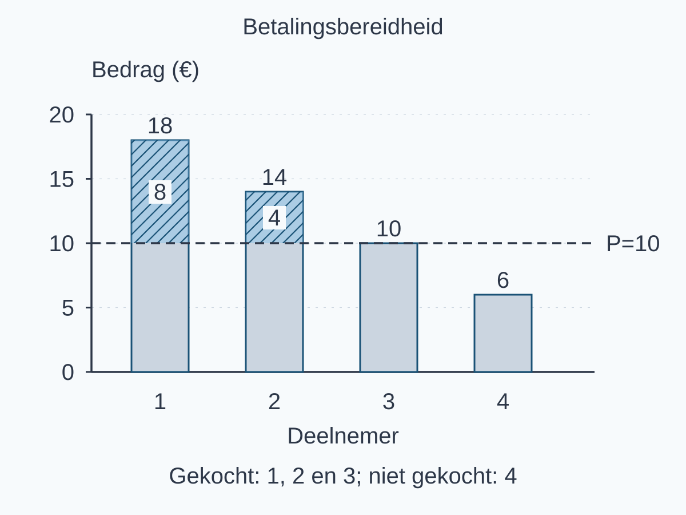
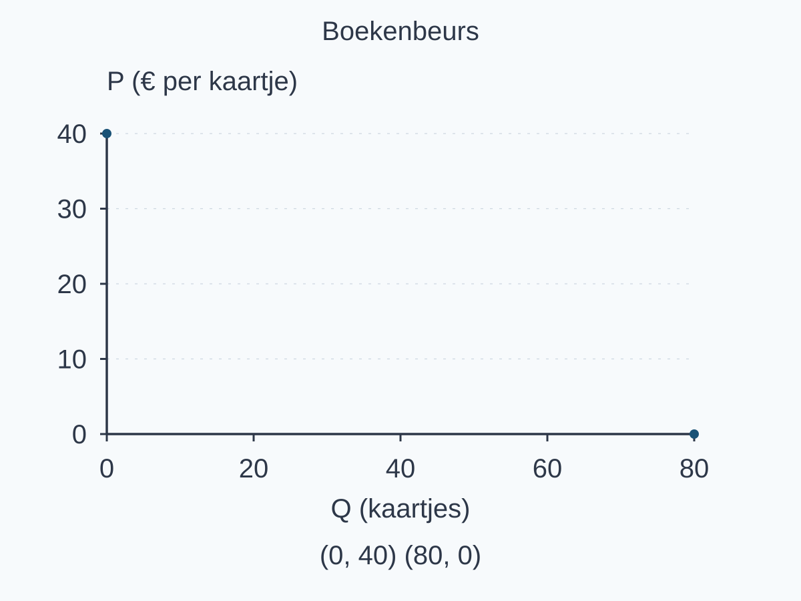
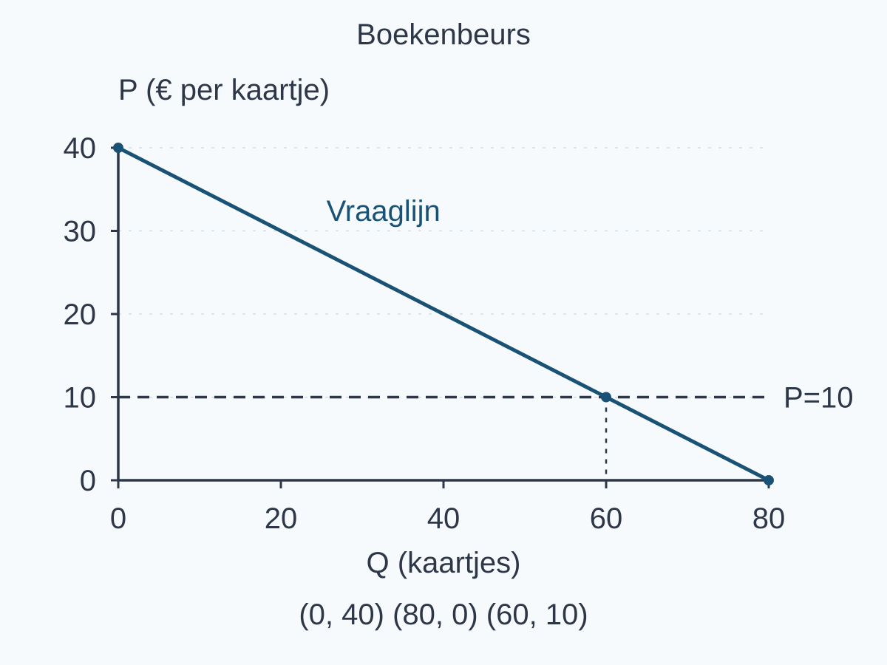
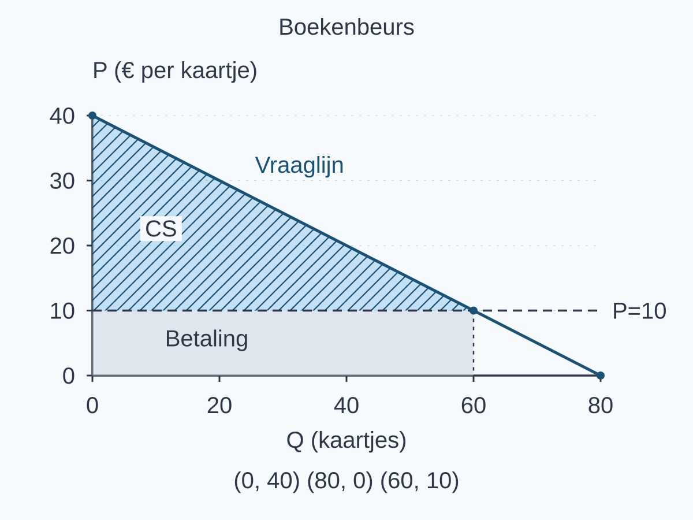
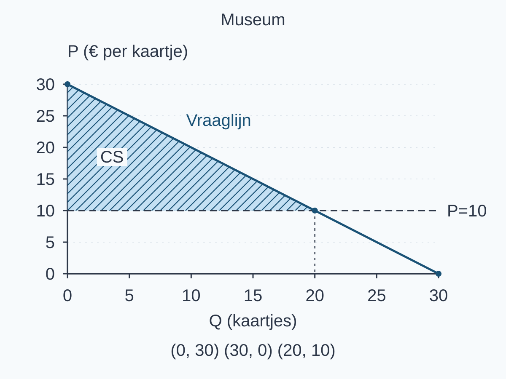
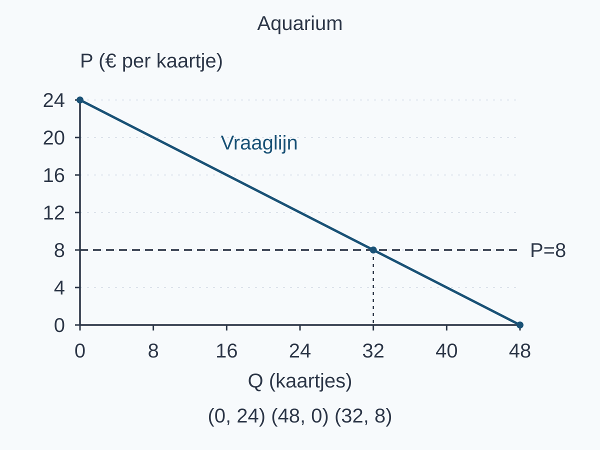
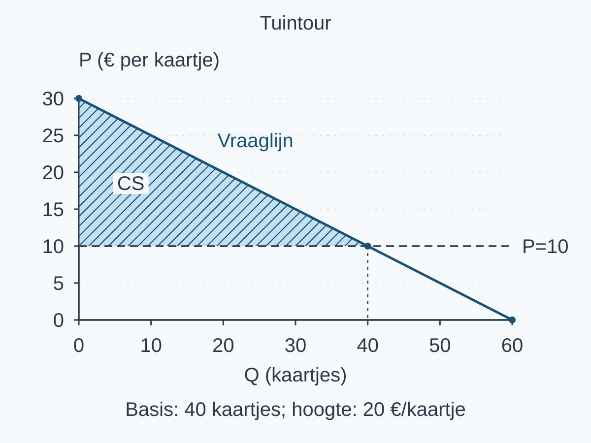
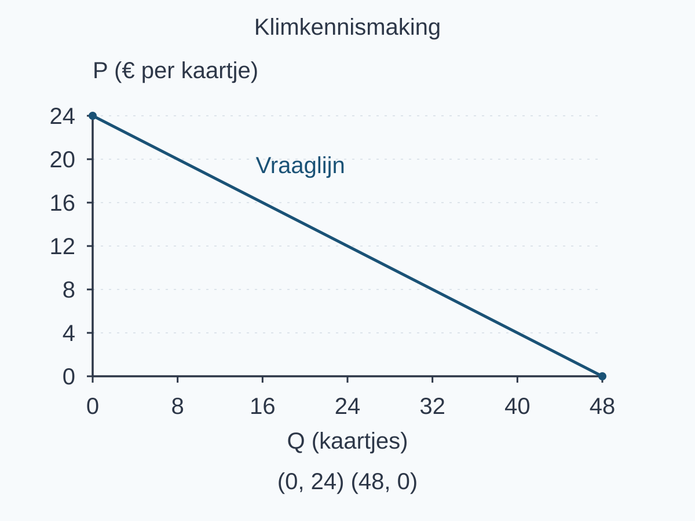

# 2.3.1 Consumentensurplus

Een plaats bij een pottenbakworkshop kost € 10. Vier mensen willen daarvoor maximaal € 18, € 14, € 10 en € 6 betalen. Ieder overweegt één plaats; er is voldoende plek. Wie minstens € 10 wil betalen, koopt. Iedereen betaalt dezelfde prijs. Hebben de kopers ook hetzelfde voordeel?

**Dit leer je**

1. Je kunt de gevraagde hoeveelheid bij een gegeven prijs uit een vraagfunctie berekenen.
2. Je kunt consumentensurplus in een vraag-prijsgrafiek herkennen en arceren.
3. Je kunt consumentensurplus als driehoeksoppervlakte berekenen.
4. Je kunt consumentensurplus als het gezamenlijke voordeel van alle kopers van de verkochte kaartjes interpreteren.

### Van betalingsbereidheid naar voordeel

In §1.2.1 leerde je betalingsbereidheid vergelijken met de prijs. Betalingsbereidheid is wat iemand maximaal voor een product wil betalen. Nu geven we het verschil bij een aankoop een precieze naam.

> **Definitie: consumentensurplus (CS)**
>
> Het consumentensurplus van een gekochte eenheid is de betalingsbereidheid voor die eenheid min de werkelijk betaalde prijs.

Voor de eerste koper is dat € 18 − € 10 = € 8. Het gezamenlijke consumentensurplus telt de verschillen van alle werkelijk gekochte eenheden op.

<table style="break-inside:avoid"><colgroup>
<col style="width:25%">
<col style="width:25%">
<col style="width:25%">
<col style="width:25%">
</colgroup><thead><tr><th>Deelnemer</th><th>Maximaal bereid</th><th>Koopt voor € 10?</th><th>CS bij aankoop</th></tr></thead><tbody>
<tr><td>1</td><td>€ 18</td><td>Ja</td><td>€ 8</td></tr>
<tr><td>2</td><td>€ 14</td><td>Ja</td><td>€ 4</td></tr>
<tr><td>3</td><td>€ 10</td><td>Ja</td><td>€ 0</td></tr>
<tr><td>4</td><td>€ 6</td><td>Nee</td><td>Telt niet mee</td></tr>
</tbody></table>

Figuur 1 toont de bedragen per persoon. Boven de prijslijn zie je bij de eerste twee kopers een positief verschil.

{alt="Betalingsbereidheid en prijs van vier workshopdeelnemers." width=166mm}

De kopers betalen samen 3 × € 10 = € 30. Hun betalingsbereidheid is samen € 18 + € 14 + € 10 = € 42. Dus gezamenlijk CS = € 42 − € 30 = € 12. Dat klopt met € 8 + € 4 + € 0. De niet-koper levert geen negatief surplus op.

> **Let op**
>
> “Voordeel” is geen geld dat je terugkrijgt. De kopers betalen gewoon € 30. Hun surplus drukt uit hoeveel lager die betaling is dan hun betalingsbereidheid.

### Van losse kopers naar een doorlopende vraaglijn

Vier afzonderlijke bedragen leveren geen doorlopende rechte lijn op. Voor een grotere groep gebruiken we nu een ander, vereenvoudigd model: een continue lineaire vraaglijn. Zij ordent de betalingsbereidheid van hoog naar laag. Elk smal strookje hoeveelheid hoort bij een betalingsbereidheid op die lijn.

::: {style="break-inside:avoid"}

Voor toegang tot een boekenbeurs geldt **P = 40 − 0,5Q**, voor 0 ≤ Q ≤ 80 en 0 ≤ P ≤ 40. P is euro per kaartje en Q is het aantal kaartjes. De vraaglijn geldt **terwijl alle andere omstandigheden gelijk blijven**. Dit continue model is niet de exacte optelling van onze vier workshopdeelnemers.

:::

### Eerst de assen en snijpunten

Zoals in §1.1.3 staat Q horizontaal en P verticaal. Kies gelijke stappen op iedere as. Bij Q = 0 geeft de functie P = 40. Voor het andere snijpunt vul je P = 0 in: 0 = 40 − 0,5Q → Q = 80.

{alt="Assen en snijpunten van de vraag naar toegang tot de boekenbeurs." width=166mm}

### Dan de vraaglijn en gegeven prijs

Verbind de snijpunten. De gegeven transactieprijs is € 10. Vul die prijs in: 10 = 40 − 0,5Q → 0,5Q = 30 → **Qd = 60 kaartjes**. Controle: 40 − 0,5 × 60 = 10.

Er is voldoende capaciteit. Alle 60 gevraagde kaartjes worden verkocht aan de vragers met de hoogste betalingsbereidheid. Teken P = 10 horizontaal. Het snijpunt (60, 10) geeft de gevraagde en hier ook verkochte hoeveelheid.

{alt="Vraaglijn en gegeven prijs van toegang tot de boekenbeurs." width=166mm}

> **Let op: gevraagd is niet hetzelfde als evenwicht**
>
> In §1.3.2 vond je marktevenwicht door vraag en aanbod te vergelijken. Hier is de prijs gegeven en ontbreekt een aanbodfunctie. Noem 60 daarom de gevraagde hoeveelheid, niet een berekende evenwichtshoeveelheid.

### Ten slotte het surplusgebied

Bij elke gekochte hoeveelheid geeft de verticale afstand van de prijslijn tot de vraaglijn het voordeel aan. Samen vullen die smalle strookjes het gebied boven P = 10 en onder de vraaglijn. Alleen Q = 0 tot Q = 60 telt mee. In dit continue model is de som een oppervlakte: hier een driehoek.

{alt="Consumentensurplus boven de prijslijn van de boekenbeurs." width=166mm}

De basis is 60 kaartjes. De loodrechte hoogte is **40 − 10 = 30 euro per kaartje**.

> **Formule: driehoek bij een lineaire vraaglijn**
>
> CS = ½ × verkochte hoeveelheid × (hoogste betalingsbereidheid − prijs).
>
> Dit geldt hier bij de gegeven uniforme prijs, volledige verkoop van de gevraagde hoeveelheid aan de hoogste vragers en binnen het geldige bereik van de vraaglijn.

Dus CS = ½ × 60 × (40 − 10) = **€ 900**. Kaartjes × euro per kaartje geeft euro.

<table style="break-inside:avoid"><colgroup>
<col style="width:33.3333%">
<col style="width:33.3333%">
<col style="width:33.3333%">
</colgroup><thead><tr><th>Bedrag in het model</th><th>Berekening</th><th>Uitkomst</th></tr></thead><tbody>
<tr><td>Gezamenlijke betaling</td><td>60 × € 10</td><td>€ 600</td></tr>
<tr><td>Gezamenlijk CS</td><td>½ × 60 × € 30</td><td>€ 900</td></tr>
<tr><td>Gezamenlijke betalingsbereidheid</td><td>€ 600 + € 900</td><td>€ 1.500</td></tr>
</tbody></table>

> **Veelgemaakte fout**
>
> € 10 × 60 lijkt aantrekkelijk: je gebruikt de prijs en hoeveelheid. Maar dat is wat de kopers betalen. Voor CS gebruik je het verschil boven de prijs: de hoogte is 40 − 10, niet 10.

De kopers hebben volgens het model samen € 900 voordeel ten opzichte van hun betalingsbereidheid. Dat betekent niet € 900 per koper of een gelijk voordeel voor iedereen. Bij dezelfde vraaglijn en een lagere prijs wordt CS groter, **als de volledige verkoop aan de hoogste vragers blijft gelden**. Veranderen ook die voorwaarden, dan moet je opnieuw kijken wie werkelijk koopt.

## Uitgewerkt voorbeeld

Een museum gebruikt het vraagmodel P = 30 − Q. P is euro per kaartje; Q is het aantal kaartjes. Het model geldt voor 0 ≤ Q ≤ 30. Alle andere omstandigheden blijven gelijk. De gegeven prijs is € 10. Er zijn genoeg kaartjes: alle gevraagde kaartjes gaan naar de vragers met de hoogste betalingsbereidheid.

**1. Gegeven prijs gebruiken**

Vul P = 10 in: 10 = 30 − Q, dus Qd = 20 kaartjes. Controle: 30 − 20 = 10. De letter d staat hier voor de gevraagde hoeveelheid. Dit is geen berekend marktevenwicht: we gebruiken alleen de vraaglijn en een gegeven prijs.

**2. Vraaglijn en prijslijn tekenen**

Teken Q horizontaal van 0 tot 30 en P verticaal van 0 tot 30. Schrijf de eenheden erbij. Bij Q = 0 is P = 30. Bij P = 0 volgt 0 = 30 − Q, dus Q = 30. Verbind (0, 30) en (30, 0). Trek vervolgens de horizontale lijn P = 10. Het snijpunt is (20, 10); de verticale hulplijn komt bij Q = 20.

**3. Consumentensurplus aanwijzen**

De hoogste betalingsbereidheid ligt bovenaan de vraaglijn. De kopers betalen ieder € 10. Arceer daarom de driehoek tussen de vraaglijn en P = 10, vanaf Q = 0 tot Q = 20.

{alt="Vraaglijn en consumentensurplus van museumbezoekers." width=166mm}

**4. Oppervlakte berekenen**

De basis is 20 kaartjes. De loodrechte hoogte is 30 − 10 = 20 euro per kaartje, niet de prijs 10.

CS = ½ × basis × hoogte = ½ × 20 × (30 − 10) = € 200.

*Waarom:* kaartjes × euro per kaartje geeft euro. De driehoek telt in dit model alle verschillen tussen betalingsbereidheid en betaalde prijs op.

**5. Uitkomst interpreteren**

De kopers van de 20 verkochte kaartjes hebben samen € 200 voordeel ten opzichte van hun betalingsbereidheid. Ze krijgen dat bedrag niet uitgekeerd. Het is ook niet € 200 per bezoeker.

> **Samenvatting §2.3.1**
>
> - Per gekocht kaartje is consumentensurplus: betalingsbereidheid min betaalde prijs.
> - Tel alleen werkelijk gekochte kaartjes mee. Bij een continue vraaglijn stelt de oppervlakte deze optelling voor.
> - Een gegeven prijs levert Qd op; zonder verdere informatie bereken je geen marktevenwicht.
> - Bij een lineaire vraaglijn en volledige verkoop aan de hoogste vragers: CS = ½ × verkochte hoeveelheid × (hoogste betalingsbereidheid − prijs), in euro.
> - CS is voordeel van de kopers als groep, geen uitbetaling. In §2.3.2 bekijken we ook de verkoperskant.

## Startopgaven

Korte route: Startopgaven → Zelfstandige oefening → Doeloefening. Extra hulp nodig? Maak eerst Begeleide inoefening.

**Opgave 1 — Ophalen**

a\) Voor een filmavond geldt P = 24 − Q, met P in euro per kaartje en Q in kaartjes. Het model geldt van Q = 0 tot Q = 24. Bereken Q bij P = 8 en bepaal beide snijpunten met de assen.

b\) Welke grootheid hoort horizontaal, welke verticaal? Leg uit wat het punt (16, 8) in deze grafiek betekent.

c\) Een driehoek heeft een basis van 8 cm en een loodrechte hoogte van 6 cm. Bereken de oppervlakte met eenheid.

**Opgave 2 — Begripscheck**

a\) Noor koopt een kaartje voor € 9. Haar betalingsbereidheid is € 15. Hoe groot is haar consumentensurplus?

Voor een aquarium geldt P = 24 − 0,5Q, met P in euro per kaartje en Q in kaartjes (0 ≤ Q ≤ 48). Bij de gegeven prijs € 8 worden alle 32 gevraagde kaartjes verkocht aan de hoogste vragers. Alle andere omstandigheden blijven gelijk.

{alt="Vraaglijn en gegeven prijs van aquariumkaartjes." width=166mm}

b\) Wijs het consumentensurplus aan. Bereken het met de juiste basis en hoogte.

c\) Sem zegt: “Dat bedrag krijgt iedere bezoeker terug.” Leg uit wat het bedrag wél betekent.

## Begeleide inoefening

Heb je deze hulp niet nodig? Ga dan verder met Zelfstandige oefening.

**Opgave 3 — Tuintour**

Voor een tuintour geldt P = 30 − 0,5Q, met P in euro per kaartje en Q in kaartjes (0 ≤ Q ≤ 60). De prijs is € 10. Alle gevraagde kaartjes worden aan de hoogste vragers verkocht; capaciteit is voldoende. Andere omstandigheden blijven gelijk.

De grafiek geeft de prijslijn, gevraagde hoeveelheid, basis en hoogte al. De arcering laat zien welk voordeel je berekent.

{alt="Vraaglijn met prijs, hoeveelheid, basis en hoogte van de tuintour." width=166mm}

a\) Vul aan: 10 = 30 − 0,5Q → 0,5Q = … → Qd = … kaartjes. Controleer met de vraagfunctie.

b\) Vul aan: CS = ½ × … × (… − …) = € … .

c\) Maak af: “De kopers van de … verkochte kaartjes hebben samen € … voordeel, doordat hun gezamenlijke … hoger is dan hun gezamenlijke … .”

**Opgave 4 — Klimkennismaking**

Voor een klimkennismaking geldt P = 24 − 0,5Q, met P in euro per kaartje en Q in kaartjes (0 ≤ Q ≤ 48). Bij de gegeven prijs € 12 worden alle gevraagde kaartjes verkocht aan de hoogste vragers. Er is genoeg plaats; overige omstandigheden blijven gelijk.

{alt="Assen en vraaglijn van een klimkennismaking zonder prijslijn." width=166mm}

a\) Bereken Qd bij P = 12. Voeg de prijslijn en het snijpunt toe.

b\) Arceer en benoem het consumentensurplus. Bepaal zelf de basis en de loodrechte hoogte en bereken het bedrag.

c\) Geef een zin over de betekenis voor de kopers als groep.

**Opgave 5 — Bordspelmiddag**

Voor een bordspelmiddag geldt P = 20 − 0,5Q, met P in euro per kaartje en Q in kaartjes (0 ≤ Q ≤ 40). De gegeven prijs is € 5. Alle gevraagde kaartjes gaan naar de hoogste vragers; capaciteit is voldoende. Overige omstandigheden blijven gelijk.

Bereken de gevraagde hoeveelheid. Maak zelf de grafiek, arceer het consumentensurplus, bereken het en leg de betekenis voor de kopers uit.

*Korte controle achteraf: hoeveelheid → benoemde assen en snijpunten → gebied → oppervlakte met eenheid → koperbetekenis.*

## Zelfstandige oefening

**Opgave 6 — Skateclinic**

Voor een skateclinic geldt P = 36 − 0,5Q. P is euro per kaartje en Q is het aantal kaartjes (0 ≤ Q ≤ 72). De gegeven prijs is € 12. Alle bij deze prijs gevraagde kaartjes worden aan de vragers met de hoogste betalingsbereidheid verkocht. Er is voldoende capaciteit; overige omstandigheden blijven gelijk.

a\) Bereken de gevraagde hoeveelheid.

b\) Teken de vraaglijn en prijslijn in één assenstelsel. Benoem beide assen met eenheid en noteer alle snijpunten.

c\) Arceer en benoem het consumentensurplus.

d\) Bereken het consumentensurplus en noteer de eenheid.

e\) Leg uit wat dit bedrag voor de kopers als groep betekent en waarom je hier geen marktevenwicht hebt berekend.

**Opgave 7 — Taalcafé**

Voor één middag in een taalcafé loopt een rechte vraaglijn door (Q = 0, P = 28) en (Q = 56, P = 0). P is euro per kaartje en Q is het aantal kaartjes. Het model geldt tussen deze snijpunten. De gegeven prijs is € 14. Alle gevraagde kaartjes worden verkocht aan de hoogste vragers; er is voldoende plaats. Overige omstandigheden blijven gelijk.

a\) Teken de vraaglijn en prijslijn met benoemde assen en eenheden. Noteer de drie snijpunten en de gevraagde hoeveelheid.

b\) Arceer en benoem het consumentensurplus. Bereken het bedrag met eenheid.

c\) Ilias berekent 28 × € 14 = € 392 en noemt dit consumentensurplus. Beoordeel zijn antwoord. Leg uit welk bedrag hij berekent en wat jouw surplusbedrag voor de kopers betekent.

::: {style="break-inside:avoid"}

## Doeloefening

**Opgave 8**

Voor concertkaartjes geldt de vraagfunctie P=50−0,5Q. P is de prijs in euro per kaartje en Q het aantal gevraagde kaartjes. De gegeven marktprijs is €20. Er zijn voldoende kaartjes beschikbaar; alle bij deze prijs gevraagde kaartjes worden verkocht aan de vragers met de hoogste betalingsbereidheid. Er is in deze opgave geen aanbodfunctie.

a\) **(2 punten)** Bereken de gevraagde hoeveelheid bij P=€20. Noem dit niet de evenwichtshoeveelheid.

b\) **(3 punten)** Teken de vraaglijn en de horizontale prijslijn in één assenstelsel. Benoem de horizontale as als Q (kaartjes) en de verticale as als P (€ per kaartje). Noteer de snijpunten van de vraaglijn en het snijpunt met de prijslijn.

c\) **(2 punten)** Arceer en benoem in je grafiek het consumentensurplus.

d\) **(3 punten)** Bereken het consumentensurplus als oppervlakte van een driehoek en noteer de eenheid.

e\) **(2 punten)** Leg uit wat het berekende consumentensurplus voor de kopers als groep betekent.

:::

## Denkertje / Bonusopgave

**Opgave 9 — Een lagere prijs, andere kopers**

Vier mensen willen hoogstens één workshopplaats. Hun betalingsbereidheid is € 18, € 14, € 10 en € 6. Eerst worden precies drie plaatsen voor € 10 verkocht aan de mensen met betalingsbereidheid € 18, € 14 en € 10.

Later is de prijs € 6. Opnieuw worden precies drie plaatsen verkocht, nu aan de mensen met betalingsbereidheid € 14, € 10 en € 6.

Een leerling zegt: “De lagere prijs bewijst dat het consumentensurplus van de kopers als groep groter is.” Beoordeel die uitspraak voor deze twee situaties. Benoem welke voorwaarde uit het eerder gebruikte model is veranderd.

::: {style="break-inside:avoid"}

## Herhaling / Herhaling en interleaving

**Opgave 10 — Vraag en coördinaten**

Voor een foto-expositie geldt P = 18 − 0,5Q, met P in euro per kaartje en Q in kaartjes (0 ≤ Q ≤ 36). Bereken Q bij P = 6. Noteer het bijbehorende punt als (Q, P) en leg de betekenis uit.

**Opgave 11 — Welke aankopen tellen mee?**

Drie mensen overwegen ieder één routekaart van € 9. Hun betalingsbereidheid is € 12, € 9 en € 5. Er zijn genoeg kaarten. Wie minstens de prijs wil betalen, koopt. Hoeveel kaarten worden verkocht en hoe groot is het gezamenlijke consumentensurplus?

:::
