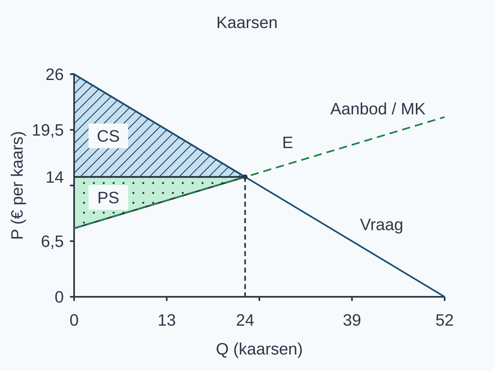
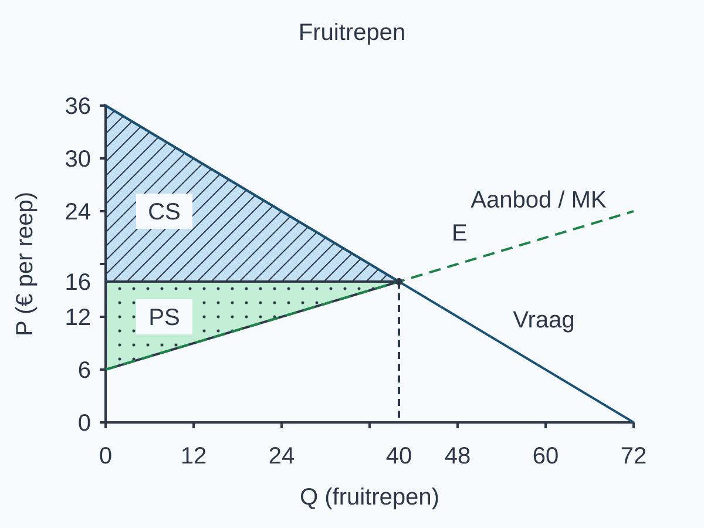
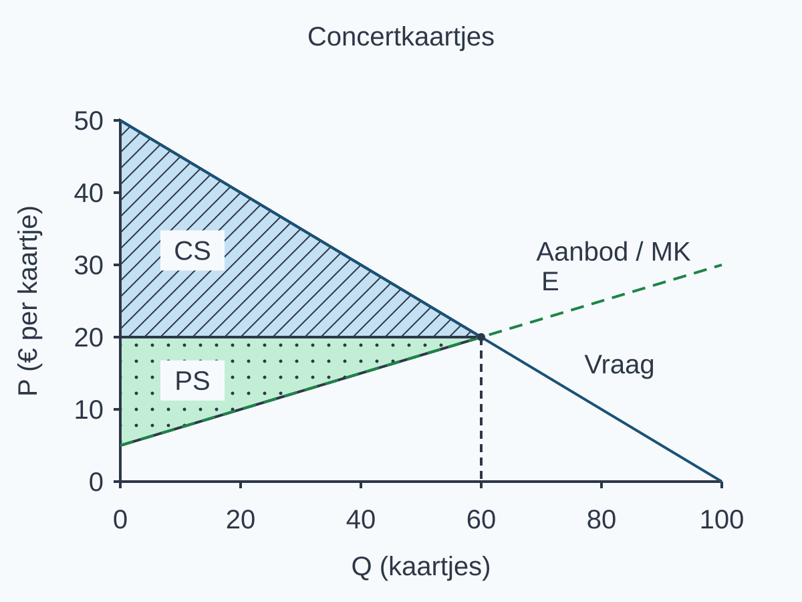

# 2.3.2 Producentensurplus en totaal surplus — antwoorden

Gebruik dit boekje na een eigen poging. Vergelijk niet alleen de uitkomst: controleer ook je bronkeuze, eenheden, gebieden en uitleg. De punten hieronder helpen bepalen welk onderdeel van een antwoord nog ontbreekt.

## Uitgewerkt voorbeeld

Op één handelsdag worden identieke sporthanddoeken verhandeld. Vraag: P = 30 − Q; aanbod: P = 6 + Q, voor 0 ≤ Q ≤ 30. P is euro per handdoek en Q is handdoeken. We gebruiken een continu lineair marktmodel: de vraaglijn ordent betalingsbereidheid van hoog naar laag en de aanbodlijn geeft de marginale kosten van iedere opeenvolgende eenheid, ook buiten de werkelijk verkochte hoeveelheid. De hoogste vragers kopen van de aanbieders met de laagste marginale kosten. Iedereen betaalt dezelfde prijs; er zijn geen externe effecten of transactiekosten. Alle hoeveelheden in dit bereik zijn technisch mogelijk en alle andere omstandigheden blijven gelijk.

We beantwoorden vijf vragen: a) Wat zijn Pe en Qe? b) Waar liggen het evenwicht, CS en PS in de geleverde grafiek? c) Hoe groot zijn CS, PS en TS? d) Wat betekent de vergelijking bij Q = 10 en Q = 14? e) Waarom is TS maximaal bij Q = 12, zonder dat dit eerlijkheid bewijst?

**1. Kies de bronnen en bereken het evenwicht.** De functies beschrijven dezelfde handelsdag en dezelfde handdoeken. In het evenwicht leveren beide bij dezelfde Q dezelfde P:

30 − Q = 6 + Q → 24 = 2Q → Qe = 12 handdoeken.

Pe = 30 − 12 = € 18 per handdoek. Controle met aanbod: 6 + 12 = 18. Beide functies geven dezelfde prijs.

**2. Markeer de gebieden.** Het snijpunt E is (12, 18). Trek vanuit E de hulplijnen naar Q = 12 en P = 18. CS ligt boven de prijs en onder de vraaglijn, alleen van Q = 0 tot Q = 12. PS ligt onder de prijs en boven de aanbodlijn, over dezelfde werkelijk verkochte hoeveelheid. De lijnen zijn al gegeven; je voegt de markeringen toe.

{alt="Uitgewerkt surplusmodel voor sporthanddoeken." width=166mm}

**3. Bereken met basis, hoogte en eenheid.** Beide driehoeken hebben basis 12 handdoeken. Hun hoogten zijn prijsverschillen, niet automatisch de prijs zelf.

CS = ½ × 12 × (30 − 18) = ½ × 12 × 12 = € 72.

PS = ½ × 12 × (18 − 6) = ½ × 12 × 12 = € 72.

TS = CS + PS = € 72 + € 72 = € 144. Handdoeken × euro per handdoek geeft euro.

**4. Vergelijk betalingsbereidheid en marginale kosten.** Lees steeds dezelfde rij. De tabel beschrijft mogelijke hoeveelheden, niet alleen wat werkelijk wordt verkocht.

<table style="break-inside:avoid"><colgroup><col style="width:24%"><col style="width:38%"><col style="width:38%"></colgroup><thead><tr><th>Q (handdoeken)</th><th>Betalingsbereidheid (€ per handdoek)</th><th>MK (€ per handdoek)</th></tr></thead><tbody>
<tr><td>10</td><td>20</td><td>16</td></tr>
<tr><td>12</td><td>18</td><td>18</td></tr>
<tr><td>14</td><td>16</td><td>20</td></tr>
</tbody></table>

Bij Q = 10 is het marginale verschil 20 − 16 = +€ 4 per handdoek: extra handel rond die hoeveelheid voegt surplus toe. Bij Q = 14 is het 16 − 20 = −€ 4: extra handel daar verlaagt TS. De tabel geeft puntvergelijkingen in het continue model, niet een gemiddelde over een heel hoeveelheidinterval.

**5. Leg het maximum en zijn grens uit.** Voor 0 ≤ Q < 12 ligt vraag boven aanbod: de betalingsbereidheid is hoger dan MK en extra transacties voegen surplus toe. Bij Q = 12 zijn beide € 18; het marginale verschil is nul, maar het totale surplus is € 144. Voor 12 < Q ≤ 30 ligt vraag onder aanbod: extra transacties verlagen TS. Eerder stoppen laat positieve bijdragen liggen; verder doorgaan voegt negatieve bijdragen toe. Daarom is TS binnen deze modelvoorwaarden en dit bereik maximaal bij Q = 12. Dat CS en PS hier gelijk zijn, bepaalt geen norm voor een eerlijke verdeling. Het model omvat bovendien niet alle omstandigheden die maatschappelijke welvaart bepalen.

> **Onthoud**
>
> - Bij evenwicht leveren vraag en aanbod dezelfde prijs en hoeveelheid op.
> - CS ligt boven de prijs; PS ligt eronder en boven de aanbodlijn, alleen bij verkochte eenheden.
> - Bereken elk driehoeksgebied met 1/2×basis×hoogte; TS=CS+PS, in euro.
> - In dit model is aanbod de MK van iedere opeenvolgende eenheid; WTP−MK bepaalt het marginale surplus. PS is niet automatisch winst.
> - Maximaal TS bewijst geen eerlijke verdeling. Hierna onderzoek je wat een beperking van transacties met surplus doet.

## Startopgaven

**Opgave 1 — Ophalen (5 punten)**

a\) **2 punten.** Qv = Qa: 24 − 2P = 2P − 8 → 32 = 4P → Pe = € 8 per sleutelhanger. Controle: Qv = 24 − 2 × 8 = 8 en Qa = 2 × 8 − 8 = 8 sleutelhangers. Horizontaal staat Q (sleutelhangers), verticaal P (€ per sleutelhanger). Eén punt voor vergelijking/prijs; één voor gecontroleerde hoeveelheid en assen met eenheden.

b\) **2 punten.** MK = (130 − 100)/(15 − 10) = 30/5 = € 6 per extra boekenlegger binnen 10–15. Dit is een gemiddelde over vijf extra boekenleggers, niet de afzonderlijke kost van de vijftiende. De verdeling van de € 30 binnen die stap is onbekend. Eén punt voor verhouding/eenheid, één voor de begrensde betekenis. Alleen 130/15 berekenen geeft gemiddelde totale kosten, niet MK; alleen 130 − 100 geeft het totale verschil, nog geen bedrag per extra product.

c\) **1 punt.** De vier kaarten zijn werkelijk verkocht aan de hoogste vragers. Basis = 4 kaarten, hoogte = 10 − 6 = € 4 per kaart. CS = ½ × 4 × 4 = € 8 voor de kopers samen. De € 24 uit 4 × 6 is betaling, niet CS.

**Opgave 2 — Begripscheck (4 punten)**

a\) **1 punt.** Koper: CS = 15 − 10 = € 5. Verkoper: PS = 10 − 7 = € 3. Trek telkens de juiste twee bedragen af; de prijs alleen is geen voordeel.

b\) **1 punt.** TS = 5 + 3 = € 8. Zonder prijs: WTP − MK = 15 − 7 = € 8. De betaalde en ontvangen € 10 vallen tegen elkaar weg.

c\) **2 punten.** PS = € 3 is niet bewezen winst: vaste/relevante totale kosten ontbreken. Eén punt voor deze ontbrekende kosteninformatie. TS = € 8 bevat geen norm voor een eerlijke verdeling en beschrijft niet ieders omstandigheden. Eén punt voor deze begrenzing. Een bedrag correct optellen maakt de verdeling nog niet eerlijk. Wil je deze verschillen verder oefenen, dan staat de Begeleide inoefening in het opgavenboekje.

## Begeleide inoefening

**Opgave 3 — Plantjes (6 punten)**

De twee functies beschrijven dezelfde marktdag, in euro per plantje. In het evenwicht geldt 18 − Q = 6 + Q → 12 = 2Q → Qe = 6. Zowel vraag 18 − 6 als aanbod 6 + 6 geeft Pe = 12. CS ligt boven de prijs en onder vraag, PS eronder en boven aanbod, beide tot Q = 6.

{alt="Gemarkeerde surplusgebieden bij plantjes met basis en hoogten." width=166mm}

a\) **2 punten.** CS = ½ × 6 × (18 − 12) = € 18 en PS = ½ × 6 × (12 − 6) = € 18. TS = 18 + 18 = € 36 (1 punt). De PS-hoogte is prijs min het aanbodintercept: 12 − 6, want de eerste eenheden hebben al marginale kosten. De prijscoördinaat 12 is dus niet de PS-hoogte (1 punt).

b\) **1 punt.** De rij bij Q = 4 geeft WTP = 14 en MK = 10. Het marginale verschil is 14 − 10 = +€ 4 per plantje. Positief: extra handel rond deze hoeveelheid voegt TS toe.

c\) **3 punten.** Voor 0 ≤ Q < 6 ligt de vraaglijn boven de aanbodlijn: de betalingsbereidheid is hoger dan MK, dus extra transacties voegen surplus toe. Bij Q = 6 zijn beide € 12 per plant; het marginale verschil is nul, maar TS is € 36. Voor 6 < Q ≤ 18 ligt vraag onder aanbod: betalingsbereidheid is lager dan MK, dus extra transacties verlagen TS. Vóór Q = 6 stoppen laat positieve bijdragen liggen; na Q = 6 doorgaan voegt negatieve bijdragen toe. Daarom is TS maximaal € 36 bij Q = 6 binnen 0 ≤ Q ≤ 18. Dit geldt onder de gegeven marktvoorwaarden, waaronder de genoemde toedeling en geen externe effecten of transactiekosten. Een groot totaal bevat geen norm voor een eerlijke verdeling. Het model omvat bovendien niet alle omstandigheden die voor maatschappelijke welvaart van belang zijn.

Beoordeling, één punt per criterium:

- Correcte vergelijking vóór, bij en na Q = 6 over de beide hele intervallen; nul marginaal verschil is niet nul TS.
- Stoppen laat positieve bijdragen liggen, doorgaan voegt negatieve toe: maximum € 36 bij Q = 6.
- Model en bereik begrenzen de conclusie; zowel eerlijkheidsnorm als volledig maatschappelijk oordeel ontbreken.

Alleen de Q = 4-rij bespreken levert nog geen maximumargument. “Vraag = aanbod, dus eerlijk” mist zowel dat argument als de vereiste grens.

**Opgave 4 — Kaarsen (8 punten)**

a\) **1 punt.** Bij de gegeven Qe = 24 geeft vraag 26 − 0,5 × 24 = 14. Aanbod geeft 8 + 0,25 × 24 = 14. Pe = € 14 per kaars; beide controles kloppen.

b\) **3 punten.** E ligt op (24, 14). CS ligt boven 14 en onder vraag; PS ligt onder 14 en boven aanbod, alleen van Q = 0 tot Q = 24 (1 punt). Basis = 24 kaarsen. CS-hoogte = 26 − 14 = € 12 per kaars: CS = ½ × 24 × 12 = € 144 (1 punt). PS-hoogte = 14 − 8 = € 6 per kaars: PS = ½ × 24 × 6 = € 72; TS = 144 + 72 = € 216 (1 punt).

{alt="Oplossing van de surplusmarkeringen bij kaarsen." width=166mm}

c\) **1 punt.** Bij Q = 20: 16 − 13 = +€ 3 per kaars, dus extra handel rond deze hoeveelheid verhoogt TS. Bij Q = 28: 12 − 15 = −€ 3, dus extra handel daar verlaagt TS. Het punt vereist beide vergelijkingen en richtingen.

d\) **3 punten.** Voor 0 ≤ Q < 24 ligt de vraaglijn boven de aanbodlijn: de betalingsbereidheid is hoger dan MK, dus iedere extra transactie in dit model voegt surplus toe. Bij Q = 24 zijn beide € 14 per kaars en is het marginale verschil nul. Voor 24 < Q ≤ 52 ligt vraag onder aanbod: extra transacties hebben dan betalingsbereidheid lager dan MK en verlagen TS. Eerder stoppen laat positieve bijdragen liggen; verder doorgaan voegt negatieve bijdragen toe. Daarom is TS maximaal € 216 bij Q = 24 binnen dit bereik, niet nul. Deze conclusie geldt onder de gegeven modelvoorwaarden, waaronder de toedeling en geen externe effecten of transactiekosten. Zij bevat geen norm voor een eerlijke verdeling en laat andere omstandigheden die maatschappelijke welvaart bepalen buiten beeld.

Beoordeling, één punt per criterium:

- Correcte vergelijking over het hele bereik vóór, bij en na Q = 24.
- Positieve bijdragen laten liggen tegenover negatieve toevoegen, met maximum € 216 bij Q = 24.
- Model/bereik noemen en zowel eerlijkheids- als volledige-welvaartsclaim verwerpen.

Alleen Q = 20 en Q = 28 of alleen “vraag = aanbod” bespreken verklaart het maximum over het hele bereik niet.

**Opgave 5 — Een gegraveerde mok (4 punten)**

<table style="break-inside:avoid"><colgroup><col style="width:34%"><col style="width:34%"><col style="width:16%"><col style="width:16%"></colgroup><thead><tr><th>Geval</th><th>CS (€)</th><th>PS (€)</th><th>TS (€)</th></tr></thead><tbody>
<tr><td>Begin</td><td>18 − 14 = 4</td><td>14 − 10 = 4</td><td>4 + 4 = 8</td></tr>
<tr><td>Alleen betalingsbereidheid verandert</td><td>20 − 14 = 6</td><td>14 − 10 = 4</td><td>6 + 4 = 10</td></tr>
<tr><td>Alleen MK verandert</td><td>18 − 14 = 4</td><td>14 − 13 = 1</td><td>4 + 1 = 5</td></tr>
<tr><td>Beide veranderen</td><td>20 − 14 = 6</td><td>14 − 13 = 1</td><td>6 + 1 = 7</td></tr>
</tbody></table>

a\) **1 punt.** Alleen hogere betalingsbereidheid geeft CS = € 6, PS = € 4 en TS = € 10.

b\) **1 punt.** Alleen hogere MK geeft CS = € 4, PS = € 1 en TS = € 5.

c\) **1 punt.** Beide samen geven CS = € 6, PS = € 1 en TS = € 7. Ten opzichte van het begin neemt TS met € 1 af.

d\) **1 punt.** Betalingsbereidheid stijgt € 2: het kopersvoordeel neemt € 2 toe. MK stijgt € 3: het verkopersvoordeel neemt € 3 af. Netto is dat +2 − 3 = −€ 1. Twee stijgende bedragen zijn hier niet twee stijgende voordelen. De prijs en de ene werkelijke transactie veranderen niet; er wordt geen nieuw marktevenwicht berekend.

## Zelfstandige oefening

**Opgave 6 — Fruitrepen (11 punten)**

a\) **2 punten.** 36 − 0,5Q = 6 + 0,25Q → 30 = 0,75Q → Qe = 40 fruitrepen. Pe = 36 − 0,5 × 40 = € 16 per reep; controle: 6 + 0,25 × 40 = 16. Eén punt voor vergelijking/oplossen, één voor beide uitkomsten met controle en eenheden.

b\) **2 punten.** E is (40, 16), met projecties naar beide assen (1 punt). CS ligt boven P = 16 en onder vraag; PS ligt onder P = 16 en boven aanbod. Beide lopen van Q = 0 tot Q = 40 en krijgen hun eigen naam en arcering (1 punt). De lijnen waren al gegeven.

{alt="Oplossing van de surplusmarkeringen bij fruitrepen." width=166mm}

c\) **3 punten.** Basis = 40 fruitrepen. CS-hoogte = 36 − 16 = € 20 per reep; PS-hoogte = 16 − 6 = € 10 per reep. CS = ½ × 40 × 20 = € 400 (1 punt); PS = ½ × 40 × 10 = € 200 (1 punt); TS = 400 + 200 = € 600 (1 punt). De uitkomsten zijn totale eurobedragen.

d\) **2 punten.** Bij Q = 32: 20 − 14 = +€ 6 per reep; de marginale transactie verhoogt TS (1 punt). Bij Q = 48: 12 − 18 = −€ 6; zij verlaagt TS (1 punt). Gebruik de gegeven rijen, ook buiten de verhandelde hoeveelheid.

e\) **2 punten.** Voor 0 ≤ Q < 40 ligt vraag boven aanbod: extra transacties voegen surplus toe. Bij Q = 40 zijn WTP en MK € 16 per reep en is het marginale verschil nul, niet TS. Voor 40 < Q ≤ 72 ligt vraag onder aanbod: extra transacties verlagen TS. Eerder stoppen laat positieve bijdragen liggen, verder doorgaan voegt negatieve toe; daarom is TS maximaal € 600 bij Q = 40 (1 punt). Dit geldt onder de gegeven toedeling en modelvoorwaarden binnen dit bereik. Er volgt geen eerlijkheidsnorm uit het totale bedrag; ook andere maatschappelijke omstandigheden blijven buiten beeld (1 punt).

**Opgave 7 — Inpakkraam (2 punten)**

De verkoopgegevens leveren omzet = 20 × € 8 = € 160. De gegeven analyse levert PS = € 60. Dit zijn verschillende bronnen en verschillende bedragen (1 punt). Winst kun je niet bepalen: relevante vaste/totale kosten ontbreken (1 punt). PS zomaar winst noemen vult ontbrekende informatie ten onrechte in.

## Doeloefening

**Opgave 8 — Concertkaartjes (11 punten)**

a\) **2 punten.** 50−0,5Q=5+0,25Q; 45=0,75Q; Qe=60 en Pe=€20.

Controle: vraag geeft 50 − 0,5 × 60 = 20 en aanbod geeft 5 + 0,25 × 60 = 20. Dus 60 kaartjes tegen € 20 per kaartje. Eén punt voor vergelijking/oplossen; één voor P en Q met eenheden en controle.

b\) **2 punten.** Horizontale as: Q (kaartjes). Verticale as: P (€ per kaartje). Markeer het snijpunt (60,20). CS ligt boven P=20 en onder de vraaglijn; PS ligt onder P=20 en boven de aanbodlijn, beide tot Q=60.

De hulplijnen vanuit E wijzen de hoeveelheid 60 en prijs 20 aan. Beide gebieden lopen alleen over de 60 verkochte kaartjes. Eén punt voor E; één voor beide juist benoemde gebieden. De geleverde lijnen hoeven niet opnieuw getekend.

{alt="Oplossing van het evenwicht en de surplusgebieden bij concertkaartjes." width=166mm}

c\) **3 punten.** CS=½×60×(50−20)=€900. PS=½×60×(20−5)=€450. TS=€900+€450=€1.350.

De basis is 60 kaartjes. De CS-hoogte is 30 euro per kaartje; de PS-hoogte is 15 euro per kaartje. Kaartjes × euro per kaartje geeft euro. Eén punt per juist bedrag met bijpassende basis, hoogte en eenheid.

d\) **2 punten.** Q=50: betalingsbereidheid=€25 en MK=€17,50, dus één extra transactie voegt €7,50 surplus toe. Q=70: betalingsbereidheid=€15 en MK=€22,50, dus die extra transactie verlaagt TS met €7,50.

Dit zijn de marginale vergelijkingen **bij de genoemde Q** in het continue model. De aanbodlijn geldt ook bij de niet-verkochte hoeveelheid Q = 70. Eén punt per juiste vergelijking met richting. Een exact bedrag voor een eindig interval, bijvoorbeeld van 50 naar 51, is een oppervlakte over dat interval en niet deze puntvergelijking: de lijnwaarden veranderen onderweg. Gebruik hier de gevraagde tabelwaarden, geen vervangende 51ste of 71ste waarde.

e\) **2 punten.** Tot Q=60 is de betalingsbereidheid minstens MK; daarna is de betalingsbereidheid lager dan MK. Daarom is TS binnen dit model maximaal bij Q=60. TS zegt niet hoe het surplus verdeeld is en bevat geen volledig maatschappelijk oordeel.

Voor 0 ≤ Q < 60 ligt de vraaglijn boven de aanbodlijn. Extra transacties voegen dan surplus toe. Bij Q = 60 zijn beide € 20 per kaartje en is het marginale verschil nul, maar TS is € 1.350. Voor 60 < Q ≤ 100 ligt vraag onder aanbod en verlagen extra transacties TS. Eerder stoppen laat positieve bijdragen liggen; verder doorgaan voegt negatieve bijdragen toe. Daarom is TS maximaal € 1.350 bij Q = 60 onder de gegeven marktvoorwaarden en binnen het genoemde bereik. Dit geeft geen norm voor een eerlijke verdeling en meet niet alle maatschappelijke omstandigheden. Eén punt voor de marginale teken/veranderingsredenering over het hele bereik; één voor de expliciete eerlijkheids- en welvaartsgrens. Alleen “vraag = aanbod” is nog geen verklaring.

## Denkertje / Bonusopgave

**Opgave 9 — Een andere prijs**

Aanvankelijk: CS = 22 − 14 = € 8, PS = 14 − 9 = € 5, TS = € 13. Een mogelijke nieuwe prijs is € 16: CS = 22 − 16 = € 6, PS = 16 − 9 = € 7, TS = € 13. Beide partijen houden een positief voordeel.

De reparateur ontvangt € 2 meer; de klant betaalt € 2 meer. Het extra verkopersvoordeel en het kleinere kopersvoordeel heffen elkaar op. Dezelfde reparatie met dezelfde betalingsbereidheid en kosten geeft nog steeds 22 − 9 = € 13 gezamenlijk surplus. Hoger PS bewijst dus geen hoger TS. Een grotere som zou op zichzelf evenmin een norm voor een eerlijkere verdeling opleveren.

Andere coherente keuzes krijgen dezelfde waardering. Bijvoorbeeld P = € 17 geeft CS = € 5, PS = € 8, TS = € 13. De nieuwe prijs moet strikt tussen € 9 en € 22 liggen en anders zijn dan € 14. Bij € 9 of € 22 heeft één partij nul voordeel; buiten dat interval heeft één partij nadeel. We verzinnen geen vaste kosten en noemen PS geen winst.

**Beoordelingscriteria**

- Een andere haalbare prijs met positief voordeel voor beide partijen, met juist berekend CS en PS.
- Vergelijking met de oorspronkelijke situatie: TS blijft € 13, met expliciete uitleg waarom de betalingsoverdracht tegen elkaar wegvalt.
- Afwijzing van zowel hoger totaal surplus als bewezen eerlijkheid, met duidelijk onderscheid tussen totaal en verdeling.

## Herhaling / Herhaling en interleaving

**Opgave 10 — Een interval (2 punten)**

MK = (62 − 38)/(10 − 4) = 24/6 = € 4 per extra etiket binnen 4–10 (1 punt). De totale kostentoename van € 24 is verdeeld over zes extra etiketten. Hoe die toename binnen het interval verdeeld is, weet je niet; dus ook niet de afzonderlijke kosten van alleen het tiende etiket (1 punt). Dit is de intervalbetekenis uit §2.1.3, niet de nieuwe aanname over een gegeven aanbodlijn.

**Opgave 11 — Wie koopt? (2 punten)**

De kopers met WTP = € 9 en WTP = € 6 kopen; gelijkheid telt mee (1 punt). Hun CS is 9 − 6 = € 3 en 6 − 6 = € 0, samen € 3 (1 punt). De derde koopt niet en draagt geen negatief surplus bij. Dit zijn drie losse kopers, geen gegeven continue vraaglijn.
